## 适配

一、屏幕适配概念

随着支持Android系统的设备(手机、平板、电视、手表)的增多，设备碎片化、品牌碎片化、系统碎片化、传感器碎片化和屏幕碎片化的程度也在不断地加深。今天要探讨的，则是对我们开发影响比较大的——屏幕的碎片化。

* Android系统碎片化：基于Google原生系统，小米定制的MIUI、魅族定制的flyme、华为定制的EMUI等等；
* Android机型屏幕尺寸碎片化：5寸、5.5寸、6寸等等；
* Android屏幕分辨率碎片化：320x480、480x800、720x1280、1080x1920等；

下面这张图是Android屏幕尺寸的示意图，在这张图里面，蓝色矩形的大小代表不同尺寸，颜色深浅则代表所占百分比的大小。

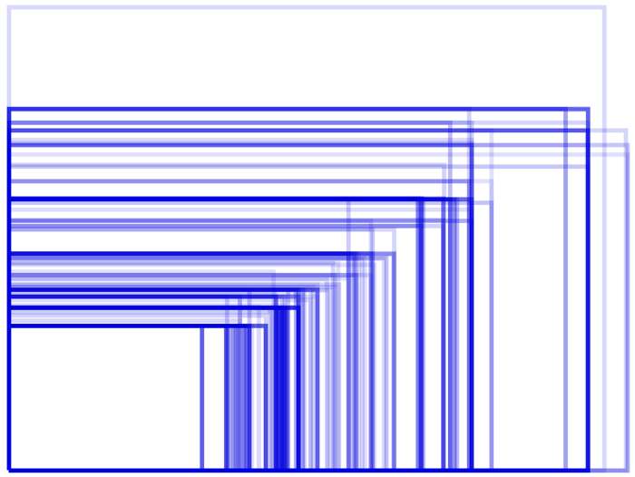

下面是IOS的


通过对比可以很明显知道android的屏幕到底有多少种了吧。而苹果只有5种包括现在最新的刘海屏。随着Android设备的增多，设备碎片化、系统碎片化、屏幕尺寸碎片化、屏幕碎片化的程度也在不断加深。

当Android系统、屏幕尺寸、屏幕密度出现碎片化的时候，就很容易出现同一元素在不同手机上显示不同的问题。试想一下这么一个场景：为4.3寸屏幕准备的UI设计图，运行在5.0寸的屏幕上，很可能在右侧和下侧存在大量的空白；而5.0寸的UI设计图运行到4.3寸的设备上，很可能显示不下。为了保证用户获得一致的用户体验效果,使得某一元素在Android不同尺寸、不同分辨率的、不同系统的手机上具备相同的显示效果，能够保持界面上的效果一致,我们需要对各种手机屏幕进行适配！


二、基本概念

1、像素（px）：

* 含义：通常所说的像素，就是CCD/CMOS上光电感应元件的数量，一个感光元件经过感光，光电信号转换，A/D转换等步骤以后，在输出的照片上就形成一个点，我们如果把影像放大数倍，会发现这些连续色调其实是由许多色彩相近的小方点所组成，这些小方点就是构成影像的最小单位“像素”（Pixel）。简而言之，像素就是手机屏幕的最小构成单元。
* 单位：px（pixel），1px = 1像素点。一般情况下UI设计师的设计图会以px作为统一的计量单位。

2、分辨率：

* 含义：手机在横向、纵向上的像素点数总和一般描述成 宽*高 ，即横向像素点个数 * 纵向像素点个数（如1080 x 1920）。
* 单位：px（pixel），1px = 1像素点

3、屏幕尺寸指的是：

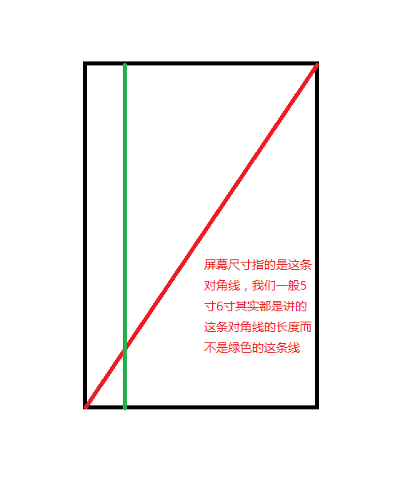

* 含义：手机对角线的物理尺寸
* 单位：英寸（inch），一英寸大约2.54cm 常见的尺寸有4.7寸、5寸、5.5寸、6寸

4、屏幕像素密度（dpi）：

* 含义：每英寸的像素点数。例如每英寸内有160个像素点，则其像素密度为160dpi。是在系统软件上指定的单位尺寸的像素数量，它往往是写在系统出厂配置文件的一个固定值。
* 单位：dpi（dots per inch）
* 计算公式： 像素密度 = 像素 / 尺寸 （dpi = px / in）
* 标准屏幕像素密度（mdpi）： 每英寸长度上有160个像素点（160dpi），即称为标准屏幕像素密度（mdpi）。


为什么是软件系统上的概念？

因为大家买手机的时候，往往会听到另一个叫ppi的参数，这个在手机屏幕中指的也是像素密度，但是这个是物理上的概念，它是客观存在的不会改变。dpi是软件参考了物理像素密度后，人为指定的一个值，这样保证了某一个区间内的物理像素密度在软件上都使用同一个值。这样会有利于我们的UI适配。

比如，几部相同分辨率不同尺寸的手机的ppi可能分别是是430,440,450,那么在Android系统中，可能dpi会全部指定为480.这样的话，dpi/160就会是一个相对固定的数值，这样就能保证相同分辨率下不同尺寸的手机表现一致。

5、屏幕密度density：
屏幕密度，density和dpi的关系为

```
//这里dpi和160的单位都是（像素/英寸），可以说density没有单位，
//个人读法是“像素密度的比例”，其实就是实际像素密度比标准像素密度
//标准像素密度都是160（像素/英寸）
density = dpi/160
```

```
drawable-ldpi (dpi=120, density=0.75)

drawable-mdpi (dpi=160, density=1)

drawable-hdpi (dpi=240, density=1.5)

drawable-xhdpi (dpi=320, density=2)

drawable-xxhdpi (dpi=480, density=3)
```

屏幕尺寸、分辨率、像素密度三者关系

一部手机的分辨率是宽x高，屏幕大小是以寸为单位，那么三者的关系是：


假设一部手机的分辨率是1080x1920（px），屏幕大小是5寸


6、密度无关像素（dp）：

* 含义：density-independent pixel，叫dp或dip，与终端上的实际物理像素点无关
* 单位：dp，可以保证在不同屏幕像素密度的设备上显示相同的效果，是安卓特有的长度单位。
* 场景例子：假如同样都是画一条长度是屏幕一半的线，如果使用px作为计量单位，那么在480x800分辨率手机上设置应为240px；在320x480的手机上应设置为160px，二者设置就不同了；如果使用dp为单位，在这两种分辨率下，160dp都显示为屏幕一半的长度。
* dp与px的转换：1dp = （dpi / 160 ） * 1px;


7、独立比例像素（sp）：

* 含义：scale-independent pixel，叫sp或sip
* 单位：sp，字体大小专用单位。Android开发时用此单位设置文字大小，可根据字体大小首选项进行缩放；推荐使用12sp、14sp、18sp、22sp作为字体大小，不推荐使用奇数和小数，容易造成精度丢失，12sp以下字体太小。

8、sp 与 dp 的区别：

* dp只跟屏幕的像素密度有关；
* sp和dp很类似但唯一的区别是，Android系统允许用户自定义文字尺寸大小（小、正常、大、超大等等），当文字尺寸是“正常”时1sp=1dp=0.00625英寸，而当文字尺寸是“大”或“超大”时，1sp>1dp=0.00625英寸。类似我们在windows里调整字体尺寸以后的效果——窗口大小不变，只有文字大小改变。

追到android源码，发现系统内部用applyDimension() （路径：android.util.TypedValue.applyDimension()）将所有单位都转换成px 再处理：

```
/**
 * Converts an unpacked complex data value holding a dimension to its final floating 
 * point value. The two parameters <var>unit</var> and <var>value</var>
 * are as in {@link #TYPE_DIMENSION}.
 *  
 * @param unit The unit to convert from.
 * @param value The value to apply the unit to.
 * @param metrics Current display metrics to use in the conversion -- 
 *                supplies display density and scaling information.
 * 
 * @return The complex floating point value multiplied by the appropriate 
 * metrics depending on its unit. 
 */
public static float applyDimension(int unit, float value,
                                   DisplayMetrics metrics)
{
    switch (unit) {
    //px：pixel 
    case COMPLEX_UNIT_PX:
        return value;
    //dp（dip）    
    case COMPLEX_UNIT_DIP:
        return value * metrics.density;
    //sp      
    case COMPLEX_UNIT_SP:
        return value * metrics.scaledDensity;
    //pt(Point) ： 1/72英寸(用于印刷业)    
    case COMPLEX_UNIT_PT:
        return value * metrics.xdpi * (1.0f/72);
    //in： inch 英寸    
    case COMPLEX_UNIT_IN:
        return value * metrics.xdpi;
    //mm ： 毫米  1英寸=25.4毫米    
    case COMPLEX_UNIT_MM:
        return value * metrics.xdpi * (1.0f/25.4f);
    }
    return 0;
}

可以发现dp和sp的区别在于density和scaledDensity两个值上；

/**
 * The logical density of the display.  This is a scaling factor for the
 * Density Independent Pixel unit, where one DIP is one pixel on an
 * approximately 160 dpi screen (for example a 240x320, 1.5"x2" screen), 
 * providing the baseline of the system's display. Thus on a 160dpi screen 
 * this density value will be 1; on a 120 dpi screen it would be .75; etc.
 *  
 * <p>This value does not exactly follow the real screen size (as given by 
 * {@link #xdpi} and {@link #ydpi}, but rather is used to scale the size of
 * the overall UI in steps based on gross changes in the display dpi.  For 
 * example, a 240x320 screen will have a density of 1 even if its width is 
 * 1.8", 1.3", etc. However, if the screen resolution is increased to 
 * 320x480 but the screen size remained 1.5"x2" then the density would be 
 * increased (probably to 1.5).
 *
 * @see #DENSITY_DEFAULT
 */
public float density;

/**
 * A scaling factor for fonts displayed on the display.  This is the same
 * as {@link #density}, except that it may be adjusted in smaller
 * increments at runtime based on a user preference for the font size.
 */
public float scaledDensity;

```

三、适配方案

屏幕适配问题的本质是使得布局、布局组件在Android不同尺寸、不同分辨率的手机上具备相同的显示效果，下面我将分几个方面来谈谈如何去适配。

1、关于布局组件的适配：

1.1 使用密度无关像素指定尺寸

由于各种屏幕的像素密度都有所不同，因此相同数量的像素在不同设备上的实际大小也会有所差异，这样使用像素（px）定义布局尺寸就会产生问题。
因此，请务必使用密度无关像素 dp 或独立比例像素 sp 单位指定尺寸。

==备注 :==在生产过程中，厂家不会完全按照屏幕密度标准去生产Android设备，会在Google的标准周围浮动变化，或是偏离Google的屏幕密度标准比较大，再加上理论计算（开方）造成的误差，实际上使用dp作为单位是不能完完全全的完成适配操作；

1.2 使用相对布局或线性布局，不要使用绝对布局

对于线性布局（Linearlayout）、相对布局（RelativeLayout）、帧布局（FrameLayout）、绝对布局（AbsoluteLayout）以及新增的加强版帧布局（CoordinatorLayout）需要根据需求进行选择，没有绝对而言。
但因为RelativeLayout讲究的是相对位置，即使屏幕的大小改变，视图之前的相对位置都不会变化，与屏幕大小无关，灵活性很强，而LinearLayout法准确地控制子视图之间的位置关系，只能简单的一个挨着一个地排列，所以，对于屏幕适配来说，使用相对布局（RelativeLayout）将会是更好的解决方案，至于绝对布局由于适配性极差，所以极少使用。

1. RelativeLayout和LinearLayout性能分析

* RelativeLayout会让子View调用2次onMeasure，LinearLayout在有weight时，也会调用子View2次onMeasure
* RelativeLayout的子View如果高度和RelativeLayout不同，则会引发效率问题，当子View很复杂时，这个问题会更加严重。如果可以，尽量使用padding代替margin。
* 在不影响层级深度的情况下,使用LinearLayout和FrameLayout而不是RelativeLayout。
最后再思考一下一个矛盾问题，为什么Google给开发者默认新建了个RelativeLayout，而自己却在DecorView自己是FrameLayout但是它只有一个子元素是属于LinearLayout。因为DecorView的层级深度是已知而且固定的，上面一个标题栏，下面一个内容栏。采用RelativeLayout并不会降低层级深度，所以此时在根节点上用LinearLayout是效率最高的。而之所以给开发者默认新建了个RelativeLayout是希望开发者能采用尽量少的View层级来表达布局以实现性能最优，因为复杂的View嵌套对性能的影响会更大一些。
* 能用两层LinearLayout，尽量用一个RelativeLayout，在时间上此时RelativeLayout耗时更小。另外LinearLayout慎用layout_weight,也将会增加一倍耗时操作。由于使用LinearLayout的layout_weight,大多数时间是不一样的，这会降低测量的速度。这只是一个如何合理使用Layout的案例，必要的时候，你要小心考虑是否用layout weight。总之减少层级结构，才是王道，让onMeasure做延迟加载，用viewStub，include等一些技巧。

1.3 使用wrap_content、match_parent、权重

使用 “wrap_content” 和 “match_parent” 尺寸值而不是硬编码的尺寸，系统会自动计算相应的数值，视图就会相应地使用自身所需的空间或填满可用空间，让布局正确适应各种屏幕尺寸和屏幕方向，组件的权重比同理。

1.4 使用minWidth、minHeight、lines等属性
很多时候我们显示的数据都是由后台返回的，再由我们加工处理后去适配我们的组件，这些数据的长度我们是无法确定的，而正常情况下我们构思的布局都仅是适用于理想的情况下，为了保证界面的对齐、数据显示完整等等的原因，我们需要在构思布局时增加对组件最小宽高度、行数等属性的设置，确保在特殊的数据下不会破坏我们的整体布局。

3.1.5 dimens使用
组件的长宽我们可以通过dimens来定义，不同的屏幕尺寸可以定义不同的数值，或者是不同的语言显示我们也可以定义不同的数值，因为翻译后的长度一般都不会跟中文的一致。

2、关于布局的适配：

2.1 dp直接适配

而在不同分辨率下，dpi将会不同，比如：

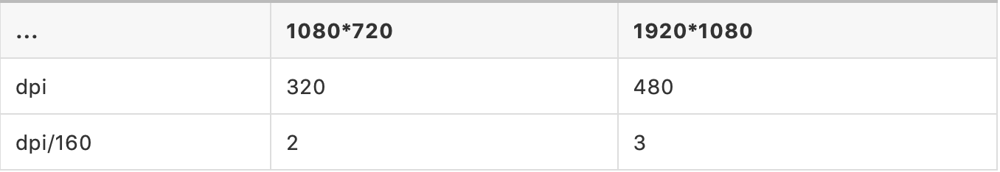

根据上面的表格，我们可以发现，720P,和1080P的手机，dpi是不同的，这也就意味着，不同的分辨率中，1dp对应不同数量的px(720P中，1dp=2px，1080P中1dp=3px)，这就实现了，当我们使用dp来定义一个控件大小的时候，他在不同的手机里表现出相应大小的像素值。


==我们可以说，通过dp加上自适应布局和weight比例布局可以基本解决不同手机上适配的问题，这基本是最原始的Android适配方案。==

这种方式存在两个小问题，第一，这只能保证我们写出来的界面适配绝大部分手机，部分手机仍然需要单独适配，为什么dp只解决了90%的适配问题，因为并不是所有的1080P的手机dpi都是480，比如Google 的Pixel2 ```（1920*1080）的dpi是420，也就是说，在Pixel2中，1dp=2.625px,这样会导致相同分辨率的手机中，这样，一个100dp*100dp``` 的控件，在一般的1080P手机上，可能都是300px,而Pixel 2 中 ，就只有262.5px,这样控件的实际大小会有所不同。

为了更形象的展示，假设我们在布局文件中把一个ImageView的宽度设置为360dp,那么在下面两张图中表现是不一样的：


从上面的布局中可以看到，同样是1080P的手机，差异是比较明显的。在这种情况下，我们的UI可能需要做一些微调甚至单独适配。

第二个问题，这种方式无法快速高效的把设计师的设计稿实现到布局代码中，通过dp直接适配，我们只能让UI基本适配不同的手机,但是在设计图和UI代码之间的鸿沟，dp是无法解决的，因为dp不是真实像素。而且，设计稿的宽高往往和Android的手机真实宽高差别极大，以我们的设计稿为例，设计稿的宽高是```375px*750px，而真实手机可能普遍是1080*1920```。

那么在日常开发中我们是怎么跨过这个鸿沟的呢？基本都是通过百分比啊，或者通过估算，或者设定一个规范值等等。总之，当我们拿到设计稿的时候，设计稿的 ```ImageView是128px*128px，当我们在编写layout文件的时候，却不能直接写成128dp*128dp``` 。在把设计稿向UI代码转换的过程中，我们需要耗费相当的精力去转换尺寸，这会极大的降低我们的生产力，拉低开发效率。

2.2 宽高限定符适配

2.2.1 限定符

我们在做屏幕的适配时在屏幕 尺寸相差不大的情况下，dp可以使不同分辨率的设备上展示效果相似。但是在屏幕尺寸相差比较大的情况下(平板)，dp就失去了这种效果。所以需要以下的限定符来约束，采用多套布局，数值等方式来适配。

那么其实所谓的限定符就是android在进行资源加载的时候会按照屏幕的相关信息对文件夹对应的名字进行识别，而这些特殊名字就是我们的限定符

```
限定符分类：
   屏幕尺寸    
       small   小屏幕
       normal  基准屏幕
       large   大屏幕
       xlarge  超大屏幕
   屏幕密度
       ldpi    <=120dpi
       mdpi    <= 160dpi
       hdpi    <= 240dpi
       xhdpi   <= 320dpi
       xxhdpi  <= 480dpi
       xxhdpi  <= 640dpi(只用来存放icon)
       nodpi   与屏幕密度无关的资源.系统不会针对屏幕密度对其中资源进行压缩或者拉伸
       tvdpi   介于mdpi与hdpi之间,特定针对213dpi,专门为电视准备的,手机应用开发不需要关心这个密度值.
   屏幕方向    
       land    横向
       port    纵向
   屏幕宽高比  
       long    比标准屏幕宽高比明显的高或者宽的这样屏幕
       notlong 和标准屏幕配置一样的屏幕宽高比
```

2.2.2 布局适配

1 使用尺寸限定符：

当我们要在大屏幕上显示不同的布局，就要使用large限定符。例如，在宽的屏幕左边显示列表右边显示列表项的详细信息，在一般宽度的屏幕只显示列表，不显示列表项的详细信息，我们就可以使用large限定符。

res/layout/activity_main.xml 单面板：

```
<LinearLayout xmlns:android="http://schemas.android.com/apk/res/android"
    android:layout_width="match_parent"
    android:layout_height="match_parent"
    android:orientation="vertical"
    >
    <!-- 列表 -->
    <fragment
        android:id="@+id/headlines"
        android:layout_width="match_parent"
        android:layout_height="match_parent"
        android:name="com.mp5a5.goodsalary.HeadlinesFragment"
        />
</LinearLayout>
```

res/layout-large/activity_main.xml 双面板：

```
<LinearLayout xmlns:android="http://schemas.android.com/apk/res/android"
    android:layout_width="match_parent"
    android:layout_height="match_parent"
    android:orientation="horizontal"
    >
    <!-- 列表 -->
    <fragment
        android:id="@+id/headlines"
        android:layout_width="400dp"
        android:layout_height="match_parent"
        android:layout_marginStart="10dp"
        android:name="com.mp5a5.goodsalary.HeadlinesFragment"
        />
    <!-- 列表项的详细信息 -->
    <fragment
        android:id="@+id/article"
        android:layout_width="match_parent"
        android:layout_height="match_parent"
        android:name="com.mp5a5.goodsalary.ArticleFragment"
        />
</LinearLayout>
```

如果这个程序运行在屏幕尺寸大于7inch的设备上，系统就会加载 ```res/layout-large/main.xml``` 而不是 ```res/layout/main.xml```，在小于7inch的设备上就会加载 ```res/layout/main.xml```。

需要注意的是，这种通过large限定符分辨屏幕尺寸的方法，适用于android3.2之前。在android3.2之后，为了更精确地分辨屏幕尺寸大小，Google推出了最小宽度限定符。

2 使用最小宽度限定符

最小宽度限定符的使用和large基本一致，只是使用了具体的宽度限定。

res/layout/activity_main.xml，单面板（默认）布局：

```
<LinearLayout xmlns:android="http://schemas.android.com/apk/res/android"
    android:layout_width="match_parent"
    android:layout_height="match_parent"
    android:orientation="vertical"
    >
    <!-- 列表 -->
    <fragment
        android:id="@+id/headlines"
        android:layout_width="match_parent"
        android:layout_height="match_parent"
        android:name="com.mp5a5.goodsalary.HeadlinesFragment"
        />
</LinearLayout>
```

res/layout-sw600dp/activity_main.xml，双面板布局： Small Width 最小宽度

```
<LinearLayout xmlns:android="http://schemas.android.com/apk/res/android"
    android:layout_width="match_parent"
    android:layout_height="match_parent"
    android:orientation="horizontal"
    >

   <fragment
        android:id="@+id/headlines"
        android:layout_width="400dp"
        android:layout_height="match_parent"
        android:layout_marginStart="10dp"
        android:name="com.mp5a5.goodsalary.HeadlinesFragment"
        />

    <fragment
        android:id="@+id/article"
        android:layout_width="match_parent"
        android:layout_height="match_parent"
        android:name="com.mp5a5.goodsalary.ArticleFragment"
        />
</LinearLayout>
```

这种方式是不区分屏幕方向的。这种最小宽度限定符适用于android3.2之后，所以如果要适配android全部的版本，就要使用large限定符和sw600dp文件同时存在于项目res目录下。

这就要求我们维护两个相同功能的文件。为了避免繁琐操作，我们就要使用布局别名。

3 使用布局别名
res/layout/activity_main.xml: 单面板布局
res/layout-large/activity_main.xml: 多面板布局
res/layout-sw600dp/activity_main.xml: 多面板布局
由于后两个文具文件一样，我们可以用以下两个文件代替上面三个布局文件：

res/layout/activity_main.xml 单面板布局
res/layout/activity_main_twopanes.xml 双面板布局

然后在res下建立
res/values/layout.xml、
res/values-large/layout.xml、
res/values-sw600dp/layout.xml三个文件。

默认布局
res/values/layout.xml:

```
<resources>
   <item name="main" type="layout">@layout/activity_main</item>
</resources>
```

Android3.2之前的平板布局
res/values-large/layout.xml:

```
<resources>
   <item name="main" type="layout">@layout/activity_main_twopanes</item>
</resources>
```

Android3.2之后的平板布局
res/values-sw600dp/layout.xml:

```
<resources>
   <item name="main" type="layout">@layout/activity_main_twopanes</item>
</resources>
```

这样就有了main为别名的布局。

在activity中setContentView(R.layout.main);

这样，程序在运行时，就会检测手机的屏幕大小，如果是平板设备就会加载res/layout/activity_main_twopanes.xml，如果是手机设备，就会加载res/layout/activity_main.xml 。我们就解决了只使用一个布局文件来适配android3.2前后的所有平板设备。

4 使用屏幕方向限定符

如果我们要求给横屏、竖屏显示的布局不一样。就可以使用屏幕方向限定符来实现。
例如，要在平板上实现横竖屏显示不用的布局，可以用以下方式实现。
res/values-sw600dp-land/layouts.xml:横屏

```
<resources>
   <item name="main" type="layout">@layout/main_twopanes</item>
</resources>
```

res/values-sw600dp-port/layouts.xml:竖屏、

```
<resources>
   <item name="main" type="layout">@layout/main</item>
</resources>
```

2.2.3 尺寸适配

为了高效的实现UI开发，出现了新的适配方案，我把它称作宽高限定符适配。简单说，就是穷举市面上所有的Android手机的宽高像素值：


设定一个基准的分辨率，其他分辨率都根据这个基准分辨率来计算，在不同的尺寸文件夹内部，根据该尺寸编写对应的dimens文件。

比如以480x320为基准分辨率

* 宽度为320，将任何分辨率的宽度整分为320份，取值为x1-x320
* 高度为480，将任何分辨率的高度整分为480份，取值为y1-y480

那么对于800*480的分辨率的dimens文件来说，

x1=(480/320)*1=1.5px

x2=(480/320)*2=3px

...

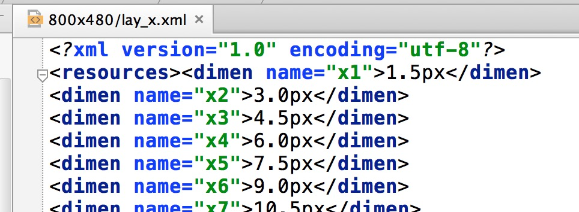

代码中使用：

```
R.dimen.x2
```

布局中使用：

```
@dimen/x2
```

这个时候，如果我们的UI设计界面使用的就是基准分辨率，那么我们就可以按照设计稿上的尺寸填写相对应的dimens引用了,而当APP运行在不同分辨率的手机中时，这些系统会根据这些dimens引用去该分辨率的文件夹下面寻找对应的值。这样基本解决了我们的适配问题，而且极大的提升了我们UI开发的效率，

但是这个方案有一个致命的缺陷，那就是需要精准命中才能适配，比如1920x1080的手机就一定要找到1920x1080的限定符，否则就只能用统一的默认的dimens文件了。而使用默认的尺寸的话，UI就很可能变形，简单说，就是容错机制很差。

不过这个方案有一些团队用过，我们可以认为它是一个比较成熟有效的方案了。

2.3 今日头条适配

1 简介

* 梳理需求

首先来梳理下我们的需求，一般我们设计图都是以固定的尺寸来设计的。比如以分辨率1920px * 1080px来设计，以density为3来标注，也就是屏幕其实是640dp * 360dp。如果我们想在所有设备上显示完全一致，其实是不现实的，因为屏幕高宽比不是固定的，16:9、4:3甚至其他宽高比层出不穷，宽高比不同，显示完全一致就不可能了。但是通常下，我们只需要以宽或高一个维度去适配，比如我们Feed是上下滑动的，只需要保证在所有设备中宽的维度上显示一致即可，再比如一个不支持上下滑动的页面，那么需要保证在高这个维度上都显示一致，尤其不能存在某些设备上显示不全的情况。同时考虑到现在基本都是以dp为单位去做的适配，如果新的方案不支持dp，那么迁移成本也非常高。

因此，总结下大致需求如下：

1. 支持以宽或者高一个维度去适配，保持该维度上和设计图一致；
2. 支持dp和sp单位，控制迁移成本到最小。

* 找兼容突破口

从dp和px的转换公式 ：px = dp * density 

可以看出，如果设计图宽为360dp，想要保证在所有设备计算得出的px值都正好是屏幕宽度的话，我们只能修改 density 的值。

通过阅读源码，我们可以得知，density 是 DisplayMetrics 中的成员变量，而 DisplayMetrics 实例通过 Resources#getDisplayMetrics 可以获得，而Resouces通过Activity或者Application的Context获得。

那么是不是所有的dp和px的转换都是通过 DisplayMetrics 中相关的值来计算的呢？

首先来看看布局文件中dp的转换，最终都是调用 TypedValue#applyDimension(int unit, float value, DisplayMetrics metrics) 来进行转换。

这里用到的DisplayMetrics正是从Resources中获得的。

再看看图片的decode，BitmapFactory#decodeResourceStream方法:

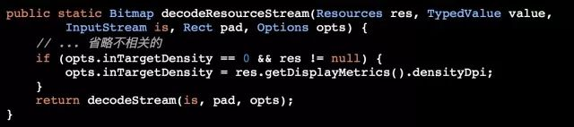

可见也是通过 DisplayMetrics 中的值来计算的。

当然还有些其他dp转换的场景，基本都是通过 DisplayMetrics 来计算的，这里不再详述。因此，想要满足上述需求，我们只需要修改 DisplayMetrics 中和 dp 转换相关的变量即可。

* 最终方案

下面假设设计图宽度是360dp，以宽维度来适配。

那么适配后的 density = 设备真实宽(单位px) / 360，接下来只需要把我们计算好的 density 在系统中修改下即可，代码实现如下：

```
public class DensityUtils {

  private static float sNoncompatDensity;
  private static float sNoncompatScaledDensity;

  public static void setCustomDensity(@NonNull Activity activity, @NonNull Application application) {
    final DisplayMetrics appDisplayMetrics = application.getResources().getDisplayMetrics();


    if (sNoncompatDensity == 0) {
      sNoncompatDensity = appDisplayMetrics.density;
      sNoncompatScaledDensity = appDisplayMetrics.scaledDensity;
      application.registerComponentCallbacks(new ComponentCallbacks() {
        @Override
        public void onConfigurationChanged(@NonNull Configuration configuration) {
          if (configuration != null && configuration.fontScale > 0) {
            sNoncompatScaledDensity = application.getResources().getDisplayMetrics().scaledDensity;
          }
        }

        @Override
        public void onLowMemory() {

        }
      });
    }


    final float targetDensity = appDisplayMetrics.widthPixels / 360;
    final float targetScaledDensity = targetDensity * (sNoncompatScaledDensity / sNoncompatDensity);
    final int targetDensityDpi = (int) (160 * targetDensity);
    appDisplayMetrics.density = targetDensity;
    appDisplayMetrics.scaledDensity = targetScaledDensity;
    appDisplayMetrics.densityDpi = targetDensityDpi;

    final DisplayMetrics actDisplayMetrics = activity.getResources().getDisplayMetrics();
    actDisplayMetrics.density = targetDensity;
    actDisplayMetrics.scaledDensity = targetScaledDensity;
    actDisplayMetrics.densityDpi = targetDensityDpi;
  }
}
```

同时在 Activity#onCreate 方法中调用下。代码比较简单，也没有涉及到系统非公开api的调用。

2 原理

今日头条屏幕适配方案的核心原理在于，根据以下公式算出 density

当前设备屏幕总宽度（单位为像素）/  设计图总宽度（单位为 dp) = density

density 的意思就是 1 dp 占当前设备多少像素

为什么要算出 density，这和屏幕适配有什么关系呢？

```
public static float applyDimension(int unit, float value,
                                       DisplayMetrics metrics)
    {
        switch (unit) {
        case COMPLEX_UNIT_PX:
            return value;
        case COMPLEX_UNIT_DIP:
            return value * metrics.density;
        case COMPLEX_UNIT_SP:
            return value * metrics.scaledDensity;
        case COMPLEX_UNIT_PT:
            return value * metrics.xdpi * (1.0f/72);
        case COMPLEX_UNIT_IN:
            return value * metrics.xdpi;
        case COMPLEX_UNIT_MM:
            return value * metrics.xdpi * (1.0f/25.4f);
        }
        return 0;
    }
```

不管你在布局文件中填写的是什么单位，最后都会被转化为 px，系统就是通过上面的方法，将项目中任何地方填写的单位都转换为 px 的

所以我们常用的 px 转 dp 的公式 dp = px / density，就是根据上面的方法得来的，density 在公式的运算中扮演着至关重要的一步

==今日头条适配方案默认项目中只能以高或宽中的一个作为基准，进行适配==

这就引出了一个现在比较棘手的问题，大部分市面上的 Android 设备的屏幕高宽比都不一致，特别是现在大量全面屏的问世，这个问题更加严重，不同厂商推出的全面屏手机的屏幕高宽比都可能不一致

这时我们只以高或宽其中的一个作为基准进行适配，就会有效的避免布局在高宽比不一致的屏幕上出现变形的问题

明白这个后，我再来说说 density，density 在每个设备上都是固定的，dpi / 160 = density，屏幕的总 px 宽度 / density = 屏幕的总 dp 宽度

* 设备 1，屏幕宽度为 1080px，480dpi，屏幕总 dp 宽度为 1080 / (480 / 160) = 360dp
* 设备 2，屏幕宽度为 1440px，560dpi，屏幕总 dp 宽度为 1440 / (560 / 160) = 411dp

可以看到屏幕的总 dp 宽度在不同的设备上是会变化的，但是我们在布局中填写的 dp 值却是固定不变的

这会导致什么呢？假设我们布局中有一个 View 的宽度为 100dp，在设备 1 中 该 View 的宽度占整个屏幕宽度的 27.8% (100 / 360 = 0.278)

但在设备 2 中该 View 的宽度就只能占整个屏幕宽度的 24.3% (100 / 411 = 0.243)，可以看到这个 View 在像素越高的屏幕上，dp 值虽然没变，但是与屏幕的实际比例却发生了较大的变化，所以肉眼的观看效果，会越来越小，这就导致了传统的填写 dp 的屏幕适配方式产生了较大的误差

这时我们要想完美适配，那就必须保证这个 View 在任何分辨率的屏幕上，与屏幕的比例都是相同的

这时我们该怎么做呢？改变每个 View 的 dp 值？不现实，在每个设备上都要通过代码动态计算 View 的 dp 值，工作量太大

如果每个 View 的 dp 值是固定不变的，那我们只要保证每个设备的屏幕总 dp 宽度不变，就能保证每个 View 在所有分辨率的屏幕上与屏幕的比例都保持不变，从而完成等比例适配，并且这个屏幕总 dp 宽度如果还能保证和设计图的宽度一致的话，那我们在布局时就可以直接按照设计图上的尺寸填写 dp 值

屏幕的总 px 宽度 / density = 屏幕的总 dp 宽度

在这个公式中我们要保证 屏幕的总 dp 宽度 和 设计图总宽度 一致，并且在所有分辨率的屏幕上都保持不变，我们需要怎么做呢？屏幕的总 px 宽度 每个设备都不一致，这个值是肯定会变化的，这时今日头条的公式就派上用场了

当前设备屏幕总宽度（单位为像素）/ 设计图总宽度（单位为 dp) = density

这个公式就是把上面公式中的 屏幕的总 dp 宽度 换成 设计图总宽度，原理都是一样的，只要 density 根据不同的设备进行实时计算并作出改变，就能保证 设计图总宽度 不变，也就完成了适配

3 验证方案可行性

假设设计图总宽度为 375 dp，一个 View 在这个设计图上的尺寸是 50dp * 50dp，这个 View 的宽度占整个设计图宽度的 13.3% (50 / 375 = 0.133)，那我们就来验证下在使用今日头条屏幕适配方案的情况下，这个 View 与屏幕宽度的比例在分辨率不同的设备上是否还能保持和设计图中的比例一致

* 验证设备 1

屏幕总宽度为 1080 px，根据今日头条的的公式求出 density，1080 / 375 = 2.88 (density)
这个 50dp * 50dp 的 View，系统最后会将高宽都换算成 px，50dp * 2.88 = 144 px (根据公式 dp * density = px)
144 / 1080 = 0.133，View 实际宽度与 屏幕总宽度 的比例和 View 在设计图中的比例一致 (50 / 375 = 0.133)，所以完成了等比例缩放
某些设备总宽度为 1080 px，但是 DPI 可能不同，是否会对今日头条适配方案产生影响？其实这个方案根本没有根据 DPI 求出 density，是根据自己的公式求出的 density，所以这对今日头条的方案没有影响
上面只能确定在所有屏幕总宽度为 1080 px 的设备上能完成等比例适配，那我们再来试试其他分辨率的设备

* 验证设备 2

屏幕总宽度为 1440 px，根据今日头条的的公式求出 density，1440 / 375 = 3.84 (density)
这个 50dp * 50dp 的 View，系统最后会将高宽都换算成 px，50dp * 3.84 = 192 px (根据公式 dp * density = px)
192 / 1440 = 0.133，View 实际宽度与 屏幕总宽度 的比例和 View 在设计图中的比例一致 (50 / 375 = 0.133)，所以也完成了等比例缩放
两个不同分辨率的设备都完成了等比例缩放，证明今日头条屏幕适配方案在不同分辨率的设备上都是有效的，如果大家还心存疑虑，可以再试试其他分辨率的设备，其实到最后得出的比例不会有任何偏差, 都是 0.133

4 优点

* 使用成本非常低，操作非常简单，使用该方案后在页面布局时不需要额外的代码和操作，这点可以说完虐其他屏幕适配方案
* 侵入性非常低，该方案和项目完全解耦，在项目布局时不会依赖哪怕一行该方案的代码，而且使用的还是 Android 官方的 API，意味着当你遇到什么问题无法解决，想切换为其他屏幕适配方案时，基本不需要更改之前的代码，整个切换过程几乎在瞬间完成，会少很多麻烦，节约很多时间，试错成本接近于 0
* 可适配三方库的控件和系统的控件(不止是是 Activity 和 Fragment，Dialog、Toast 等所有系统控件都可以适配)，由于修改的 density 在整个项目中是全局的，所以只要一次修改，项目中的所有地方都会受益
* 不会有任何性能的损耗

5 缺点

暂时没发现其他什么很明显的缺点，已知的缺点有一个，那就是第三个优点，它既是这个方案的优点也同样是缺点，但是就这一个缺点也是非常致命的
只需要修改一次 density，项目中的所有地方都会自动适配，这个看似解放了双手，减少了很多操作，但是实际上反应了一个缺点，那就是只能一刀切的将整个项目进行适配，但适配范围是不可控的
这样不是很好吗？这样本来是很好的，但是应用到这个方案是就不好了，因为我上面的原理也分析了，这个方案依赖于设计图尺寸，但是项目中的系统控件、三方库控件、等非我们项目自身设计的控件，它们的设计图尺寸并不会和我们项目自身的设计图尺寸一样
当这个适配方案不分类型，将所有控件都强行使用我们项目自身的设计图尺寸进行适配时，这时就会出现问题，当某个系统控件或三方库控件的设计图尺寸和和我们项目自身的设计图尺寸差距非常大时，这个问题就越严重

* 举个例子

假设一个三方库的 View，作者在设计时，把它设计为 100dp * 100dp，设计图的最大宽度为 1000dp，这个 View 在设计图中的比例是 100 / 1000 = 0.1，意思是这个 View 的宽度在设计图中占整个宽度的 10%，如果我们要完成等比例适配，那这个三方库 View 在所有的设备上与屏幕的总宽度的比例，都必须保持在 10%
这时在一个使用今日头条屏幕适配方案的项目上，设置的设计图最大宽度如果是 1000dp，那这个三方库 View，与项目自身都可以完美的适配，但当我们项目自身的设计图最大宽度不是 1000dp，是 500dp 时，100 / 500 = 0.2，可以看到，比例发生了较大的变化，从 10% 上升为 20%，明显这个三方库 View 高于作者的预期，比之前更大了
这就是两个设计图尺寸不一致导致的非常严重的问题，当两个设计图尺寸差距越大，那适配的效果也就天差万别了

* 解决方案

 * 方案 1

 调整设计图尺寸，因为三方库可能是远程依赖的，无法修改源码，也就无法让三方库来适应我们项目的设计图尺寸，所以只有我们自身作出修改，去适应三方库的设计图尺寸，我们将项目自身的设计图尺寸修改为这个三方库的设计图尺寸，就能完成项目自身和三方库的适配
这时项目的设计图尺寸修改了，所以项目布局文件中的 dp 值，也应该按照修改的设计图尺寸，按比例增减，保持与之前设计图中的比例不变
但是如果为了适配一个三方库修改整个项目的设计图尺寸，是非常不值得的，所以这个方案支持以 Activity 为单位修改设计图尺寸，相当于每个 Activity 都可以自定义设计图尺寸，因为有些 Activity 不会使用三方库 View，也就不需要自定义尺寸，所以每个 Activity 都有控制权的话，这也是最灵活的
但这也有个问题，当一个 Activity 使用了多个设计图尺寸不一样的三方库 View，就会同样出现上面的问题，这也就只有把设计图改为与几个三方库比较折中的尺寸，才能勉强缓解这个问题
 
 * 方案 2

 第二个方案是最简单的，也是按 Activity 为单位，取消当前 Activity 的适配效果，改用其他的适配方案
 
2.4 smallestWidth 限定符适配方案

1 简介

这个方案的的使用方式和我们平时在布局中引用 dimens 无异，核心点在于生成 dimens.xml 文件

```
├── src/main
│   ├── res
│   ├── ├──values
│   ├── ├──values-800x480
│   ├── ├──values-860x540
│   ├── ├──values-1024x600
│   ├── ├──values-1024x768
│   ├── ├──...
│   ├── ├──values-2560x1440
```

smallestWidth 限定符屏幕适配方案 当成宽高限定符方案的升级版，smallestWidth 限定符屏幕适配方案 只是把 dimens.xml 文件中的值从 px 换成了 dp，原理和使用方式都是没变的，下面就直接开始剖析原理，smallestWidth 限定符屏幕适配方案 长这样

```
├── src/main
│   ├── res
│   ├── ├──values
│   ├── ├──values-sw320dp
│   ├── ├──values-sw360dp
│   ├── ├──values-sw400dp
│   ├── ├──values-sw411dp
│   ├── ├──values-sw480dp
│   ├── ├──...
│   ├── ├──values-sw600dp
│   ├── ├──values-sw640dp
```

2 原理

其实 smallestWidth 限定符屏幕适配方案 的原理也很简单，开发者先在项目中根据主流屏幕的 最小宽度 (smallestWidth) 生成一系列 values-sw<N>dp 文件夹 (含有 dimens.xml 文件)，当把项目运行到设备上时，系统会根据当前设备屏幕的 最小宽度 (smallestWidth) 去匹配对应的 values-sw<N>dp 文件夹，而对应的 values-sw<N>dp 文件夹中的 dimens.xml 文字中的值，又是根据当前设备屏幕的 最小宽度 (smallestWidth) 而定制的，所以一定能适配当前设备

如果系统根据当前设备屏幕的 最小宽度 (smallestWidth) 没找到对应的 values-sw<N>dp 文件夹，则会去寻找与之 最小宽度 (smallestWidth) 相近的 values-sw<N>dp 文件夹，系统只会寻找小于或等于当前设备 最小宽度 (smallestWidth) 的 values-sw<N>dp，这就是优于 宽高限定符屏幕适配方案 的容错率，并且也可以少生成很多 values-sw<N>dp 文件夹，减轻 App 的体积

1、什么是 smallestWidth

要先算出当前设备的 smallestWidth 值我们才能知道当前设备该匹配哪个 values-sw<N>dp 文件夹

现在来举例说明，帮助更好理解

我们假设设备的屏幕信息是 1920 * 1080、480 dpi

根据上面的规则我们要在屏幕的高度和宽度中选择值最小的一方作为最小宽度，1080 < 1920，明显 1080 px 就是我们要找的 最小宽度 的值，但 最小宽度 的单位是 dp，所以我们要把 px 转换为 dp

再巩固下基础，下面的公式一定不能再忘了！

px / density = dp，DPI / 160 = density，所以最终的公式是 px / (DPI / 160) = dp

所以我们得到的 最小宽度 的值是 360dp (1080 / (480 / 160) = 360)

现在我们已经算出了当前设备的最小宽度是 360 dp，我们晓得系统会根据这个 最小宽度 帮助我们匹配到 values-sw360dp 文件夹下的 dimens.xml 文件，如果项目中没有 values-sw360dp 这个文件夹，系统才会去匹配相近的 values-sw<N>dp 文件夹

dimens.xml 文件是整个方案的核心所在，所以接下来我们再来看看 values-sw360dp 文件夹中的这个 dimens.xml 是根据什么原理生成的

2、dimens.xml 生成原理

因为我们在项目布局中引用的 dimens 的实际值，来源于根据当前设备屏幕的 最小宽度 所匹配的 values-sw<N>dp 文件夹中的 dimens.xml，所以搞清楚 dimens.xml 的生成原理，有助于我们理解 smallestWidth 限定符屏幕适配方案

说到 dimens.xml 的生成，就要涉及到两个因数，第一个因素是 最小宽度基准值，第二个因素就是您的项目需要适配哪些 最小宽度，通俗理解就是需要生成多少个 values-sw<N>dp 文件夹

* 第一个因素

最小宽度基准值 是什么意思呢？简单理解就是您需要把设备的屏幕宽度分为多少份，假设我们现在把项目的 最小宽度基准值 定为 360，那这个方案就会理解为您想把所有设备的屏幕宽度都分为 360 份，方案会帮您在 dimens.xml 文件中生成 1 到 360 的 dimens 引用，比如 values-sw360dp 中的 dimens.xml 是长这样的

```
<?xml version="1.0" encoding="UTF-8"?>
<resources>
	<dimen name="dp_1">1dp</dimen>
	<dimen name="dp_2">2dp</dimen>
	<dimen name="dp_3">3dp</dimen>
	<dimen name="dp_4">4dp</dimen>
	<dimen name="dp_5">5dp</dimen>
	<dimen name="dp_6">6dp</dimen>
	<dimen name="dp_7">7dp</dimen>
	<dimen name="dp_8">8dp</dimen>
	<dimen name="dp_9">9dp</dimen>
	<dimen name="dp_10">10dp</dimen>
	...
	<dimen name="dp_356">356dp</dimen>
	<dimen name="dp_357">357dp</dimen>
	<dimen name="dp_358">358dp</dimen>
	<dimen name="dp_359">359dp</dimen>
	<dimen name="dp_360">360dp</dimen>
</resources>
```

values-sw360dp 指的是当前设备屏幕的 最小宽度 为 360dp (该设备高度大于宽度，则最小宽度就是宽度，所以该设备宽度为 360dp)，把屏幕宽度分为 360 份，刚好每份等于 1dp，所以每个引用都递增 1dp，值最大的 dimens 引用 dp_360 值也是 360dp，刚好覆盖屏幕宽度
下面再来看看将 最小宽度基准值 定为 360 时，values-sw400dp 中的 dimens.xml 长什么样

```
<?xml version="1.0" encoding="UTF-8"?>
<resources>
	<dimen name="dp_1">1.1111dp</dimen>
	<dimen name="dp_2">2.2222dp</dimen>
	<dimen name="dp_3">3.3333dp</dimen>
	<dimen name="dp_4">4.4444dp</dimen>
	<dimen name="dp_5">5.5556dp</dimen>
	<dimen name="dp_6">6.6667dp</dimen>
	<dimen name="dp_7">7.7778dp</dimen>
	<dimen name="dp_8">8.8889dp</dimen>
	<dimen name="dp_9">10.0000dp</dimen>
	<dimen name="dp_10">11.1111dp</dimen>
	...
	<dimen name="dp_355">394.4444dp</dimen>
	<dimen name="dp_356">395.5556dp</dimen>
	<dimen name="dp_357">396.6667dp</dimen>
	<dimen name="dp_358">397.7778dp</dimen>
	<dimen name="dp_359">398.8889dp</dimen>
	<dimen name="dp_360">400.0000dp</dimen>
</resources>
```

values-sw400dp 指的是当前设备屏幕的 最小宽度 为 400dp (该设备高度大于宽度，则最小宽度就是宽度，所以该设备宽度为 400dp)，把屏幕宽度同样分为 360份，这时每份就等于 1.1111dp 了，每个引用都递增 1.1111dp，值最大的 dimens 引用 dp_360 同样刚好覆盖屏幕宽度，为 400dp

通过两个 dimens.xml 文件的比较，dimens.xml 的生成原理一目了然，方案会先确定 最小宽度基准值，然后将每个 values-sw<N>dp 中的 dimens.xml 文件都分配与 最小宽度基准值 相同的份数，再根据公式 屏幕最小宽度 / 份数 (最小宽度基准值) 求出每份占多少 dp，保证不管在哪个 values-sw<N>dp 中，份数 (最小宽度基准值) * 每份占的 dp 值 的结果都是刚好覆盖屏幕宽度，所以在 份数 不变的情况下，只需要根据屏幕的宽度在不同的设备上动态调整 每份占的 dp 值，就能完成适配

这样就能保证不管将项目运行到哪个设备上，只要当前设备能匹配到对应的 values-sw<N>dp 文件夹，那布局中的 dimens 引用就能根据当前屏幕的情况进行缩放，保证能完美适配，如果没有匹配到对应的 values-sw<N>dp 文件夹，也没关系，它会去寻找与之相近的 values-sw<N>dp 文件夹，虽然在这种情况下，布局中的 dimens 引用的值可能有些许误差，但是也能保证最大程度的完成适配

说到这里，应该就会明白我为什么会说 smallestWidth 限定符屏幕适配方案 的原理也同样是按百分比进行布局，如果在布局中，一个 View 的宽度引用 dp_100，那不管运行到哪个设备上，这个 View 的宽度都是当前设备屏幕总宽度的 360分之100，前提是项目提供有当前设备屏幕对应的 values-sw<N>dp，如果没有对应的 values-sw<N>dp，就会去寻找相近的 values-sw<N>dp，这时就会存在误差了，至于误差是大是小，这就要看您的第二个因数怎么分配了

其实 smallestWidth 限定符屏幕适配方案 的原理和 今日头条屏幕适配方案 挺像的，今日头条屏幕适配方案 是根据屏幕的宽度或高度动态调整每个设备的 density (每 dp 占当前设备屏幕多少像素)，而 smallestWidth 限定符屏幕适配方案 同样是根据屏幕的宽度动态调整每个设备 每份占的 dp 值

* 第二个因素

第二个因数是需要适配哪些 最小宽度？比如您想适配的 最小宽度 有 320dp、360dp、400dp、411dp、480dp，那方案就会为您的项目生成 values-sw320dp、values-sw360dp、values-sw400dp、values-sw411dp、values-sw480dp 这几个资源文件夹，像这样

```
├── src/main
│   ├── res
│   ├── ├──values
│   ├── ├──values-sw320dp
│   ├── ├──values-sw360dp
│   ├── ├──values-sw400dp
│   ├── ├──values-sw411dp
│   ├── ├──values-sw480dp
```

方案会为您需要适配的 最小宽度，在项目中生成一系列对应的 values-sw<N>dp，在前面也说了，如果某个设备没有为它提供对应的 values-sw<N>dp，那它就会去寻找相近的 values-sw<N>dp，但如果这个相近的 values-sw<N>dp 与期望的 values-sw<N>dp 差距太大，那适配效果也就会大打折扣

那是不是 values-sw<N>dp 文件夹生成的越多，覆盖越多市面上的设备，就越好呢？
也不是，因为每个 values-sw<N>dp 文件夹其实都会占用一定的 App 体积，values-sw<N>dp 文件夹越多，App 的体积也就会越大

所以一定要合理分配 values-sw<N>dp，以越少的 values-sw<N>dp 文件夹，覆盖越多的机型

3、验证方案可行性

假设设计图总宽度为 375 dp，一个 View 在这个设计图上的尺寸是 50dp * 50dp，这个 View 的宽度占整个设计图宽度的 13.3% (50 / 375 = 0.133)
在使用 smallestWidth 限定符屏幕适配方案 时，需要提供 最小宽度基准值 和需要适配哪些 最小宽度，我们就把 最小宽度基准值 设置为 375 (和 设计图 一致)，这时方案就会为我们需要适配的 最小宽度 生成对应的 values-sw<N>dp 文件夹，文件夹中的 dimens.xml 文件是由从 1 到 375 组成的 dimens 引用，把所有设备的屏幕宽度都分为 375 份，所以在布局文件中我们应该把这个 View 的高宽都引用 dp_50

下面就来验证下在使用 smallestWidth 限定符屏幕适配方案 的情况下，这个 View 与屏幕宽度的比例在分辨率不同的设备上是否还能保持和设计图中的比例一致

* 验证设备 1

设备 1 的屏幕总宽度为 1080 px，屏幕总高度为 1920 px，DPI 为 480

设备 1 的屏幕高度大于屏幕宽度，所以 设备 1 的 最小宽度 为屏幕宽度，再根据公式 px / (DPI / 160) = dp，求出 设备 1 的 最小宽度 的值为 360 dp (1080 / (480 / 160) = 360)

根据 设备 1 的 最小宽度 应该匹配的是 values-sw360dp 这个文件夹，假设 values-sw360dp 文件夹及里面的 dimens.xml 已经生成，且是按 最小宽度基准值 为 375 生成的，360 / 375 = 0.96，所以每份占的 dp 值为 0.96，dimens.xml 里面的内容是长下面这样的

```
<?xml version="1.0" encoding="UTF-8"?>
<resources>
	<dimen name="dp_1">0.96dp</dimen>
	<dimen name="dp_2">1.92dp</dimen>
	<dimen name="dp_3">2.88dp</dimen>
	<dimen name="dp_4">3.84dp</dimen>
	<dimen name="dp_5">4.8dp</dimen>
	...
	<dimen name="dp_50">48dp</dimen>
	...
	<dimen name="dp_371">356.16dp</dimen>
	<dimen name="dp_372">357.12dp</dimen>
	<dimen name="dp_373">358.08dp</dimen>
	<dimen name="dp_374">359.04dp</dimen>
	<dimen name="dp_375">360dp</dimen>
</resources>
```

可以看到这个 View 在布局中引用的 dp_50，最终在 values-sw360dp 中定格在了 48 dp，所以这个 View 在 设备 1 上的高宽都为 48 dp，系统最后会将高宽都换算成 px，根据公式 dp * (DPI / 160) = px，所以这个 View 的高宽换算为 px 后等于 144 px (48 * (480 / 160) = 144)

144 / 1080 = 0.133，View 的实际宽度与 屏幕总宽度 的比例和 View 在设计图中的比例一致 (50 / 375 = 0.133)，所以完成了等比例缩放

某些设备的高宽是和 设备 1 相同的，但是 DPI 可能不同，而由于 smallestWidth 限定符屏幕适配方案 并没有像 今日头条屏幕适配方案 一样去自行修改 density，所以系统就会使用默认的公式 DPI / 160 求出 density，density 又会影响到 dp 和 px 的换算，因此 DPI 的变化，是有可能会影响到 smallestWidth 限定符屏幕适配方案 的

所以我们再来试试在这种特殊情况下 smallestWidth 限定符屏幕适配方案 是否也能完成适配

* 验证设备 2

设备 2 的屏幕总宽度为 1080 px，屏幕总高度为 1920 px，DPI 为 420

设备 2 的屏幕高度大于屏幕宽度，所以 设备 2 的 最小宽度 为屏幕宽度，再根据公式 px / (DPI / 160) = dp，求出 设备 2 的 最小宽度 的值为 411.429 dp (1080 / (420 / 160) = 411.429)

根据 设备 2 的 最小宽度 应该匹配的是 values-sw411dp 这个文件夹，假设 values-sw411dp 文件夹及里面的 dimens.xml 已经生成，且是按 最小宽度基准值 为 375 生成的，411 / 375 = 1.096，所以每份占的 dp 值为 1.096，dimens.xml 里面的内容是长下面这样的

```
<?xml version="1.0" encoding="UTF-8"?>
<resources>
	<dimen name="dp_1">1.096dp</dimen>
	<dimen name="dp_2">2.192dp</dimen>
	<dimen name="dp_3">3.288dp</dimen>
	<dimen name="dp_4">4.384dp</dimen>
	<dimen name="dp_5">5.48dp</dimen>
	...
	<dimen name="dp_50">54.8dp</dimen>
	...
	<dimen name="dp_371">406.616dp</dimen>
	<dimen name="dp_372">407.712dp</dimen>
	<dimen name="dp_373">408.808dp</dimen>
	<dimen name="dp_374">409.904dp</dimen>
	<dimen name="dp_375">411dp</dimen>
</resources>
```

可以看到这个 View 在布局中引用的 dp_50，最终在 values-sw411dp 中定格在了 54.8dp，所以这个 View 在 设备 2 上的高宽都为 54.8 dp，系统最后会将高宽都换算成 px，根据公式 dp * (DPI / 160) = px，所以这个 View 的高宽换算为 px 后等于 143.85 px (54.8 * (420 / 160) = 143.85)

143.85 / 1080 = 0.133，View 的实际宽度与 屏幕总宽度 的比例和 View 在设计图中的比例一致 (50 / 375 = 0.133)，所以完成了等比例缩放

虽然 View 在 设备 2 上的高宽是 143.85 px，比 设备 1 的 144 px 少了 0.15 px，但是误差非常小，整体的比例并没有发生太大的变化，是完全可以接受的

这个误差是怎么引起的呢，因为 设备 2 的 最小宽度 的实际值是 411.429 dp，但是匹配的 values-sw411dp 舍去了小数点后面的位数 (切记！系统会去寻找小于或等于 411.429 dp 的 values-sw<N>dp，所以 values-sw412dp 这个文件夹，设备 2 是匹配不了的)，所以才存在了一定的误差，因此上面介绍的第二个因数是非常重要的，这直接决定误差是大还是小

可以看到即使在高宽一样但 DPI 不一样的设备上，smallestWidth 限定符屏幕适配方案 也能完成等比例适配，证明这个方案是可行的，如果还心存疑虑，也可以再试试其他分辨率的设备，其实到最后得出的比例都是在 0.133 左右，唯一的变数就是第二个因数，如果您生成的 values-sw<N>dp 与设备实际的 最小宽度 差别不大，那误差也就在能接受的范围内，如果差别很大，那就直接 GG

4、优点

1. 非常稳定，极低概率出现意外
2. 不会有任何性能的损耗
3. 适配范围可自由控制，不会影响其他三方库
4. 在插件的配合下，学习成本低

5、缺点

1. 在布局中引用 dimens 的方式，虽然学习成本低，但是在日常维护修改时较麻烦
2. 侵入性高，如果项目想切换为其他屏幕适配方案，因为每个 Layout 文件中都存在有大量 dimens 的引用，这时修改起来工作量非常巨大，切换成本非常高昂
3. 无法覆盖全部机型，想覆盖更多机型的做法就是生成更多的资源文件，但这样会增加 App 体积，在没有覆盖的机型上还会出现一定的误差，所以有时需要在适配效果和占用空间上做一些抉择
4. 如果想使用 sp，也需要生成一系列的 dimens，导致再次增加 App 的体积
5. 不能自动支持横竖屏切换时的适配，如上文所说，如果想自动支持横竖屏切换时的适配，需要使用 values-w<N>dp 或 屏幕方向限定符 再生成一套资源文件，这样又会再次增加 App 的体积
6. 不能以高度为基准进行适配，考虑到这个方案的名字本身就叫 最小宽度限定符适配方案，所以在使用这个方案之前就应该要知道这个方案只能以宽度为基准进行适配

四、方案对比


可以看到 SmallestWidth 限定符适配方案 和 今日头条适配方案 的适配效果其实都是差不多的，在前面的文章中也通过公式计算过它们的精确度，SmallestWidth 限定符适配方案 运行在未覆盖的机型上虽然也可以适配，但是却会出现一定的误差，所以 今日头条适配方案 的适配精确度确实要比 SmallestWidth 限定符适配方案 略高的，不过只要 SmallestWidth 限定符适配方案 合理的分配资源文件，适配效果的差距应该也不大

SmallestWidth 限定符适配方案 主打的是稳定性，在运行过程中极少会出现安全隐患，适配范围也可控，不会产生其他未知的影响，而 今日头条适配方案 主打的是降低开发成本、提高开发效率，使用上更灵活，也能满足更多的扩展需求，简单一句话概括就是，这两兄弟，一个求稳，一个求快。

## SharedPreferences

一、使用

要想使用 SharedPreferences 来存储数据，首先需要获取到 SharedPreferences 对象。Android中主要提供了三种方法用于得到 SharedPreferences 对象。

1、Context 类中的 getSharedPreferences()方法：

此方法接收两个参数，第一个参数用于指定 SharedPreferences 文件的名称，如果指定的文件不存在则会创建一个，第二个参数用于指定操作模式，主要有以下几种模式可以选择。MODE_PRIVATE 是默认的操作模式，和直接传入 0 效果是相同的。
MODE_WORLD_READABLE 和 MODE_WORLD_WRITEABLE 这两种模式已在 Android 4.2 版本中被废弃。

```
Context.MODE_PRIVATE: 指定该SharedPreferences数据只能被本应用程序读、写；
Context.MODE_WORLD_READABLE:  指定该SharedPreferences数据能被其他应用程序读，但不能写；
Context.MODE_WORLD_WRITEABLE:  指定该SharedPreferences数据能被其他应用程序读；
Context.MODE_APPEND：该模式会检查文件是否存在，存在就往文件追加内容，否则就创建新文件；
```

2、Activity 类中的 getPreferences()方法：

这个方法和 Context 中的 getSharedPreferences()方法很相似，不过它只接收一个操作模式参数，因为使用这个方法时会自动将当前活动的类名作为 SharedPreferences 的文件名。

3、PreferenceManager 类中的 getDefaultSharedPreferences()方法：

这是一个静态方法，它接收一个 Context 参数，并自动使用当前应用程序的包名作为前缀来命名 SharedPreferences 文件。

4、SharedPreferences的使用

SharedPreferences对象本身只能获取数据而不支持存储和修改,存储修改是通过SharedPreferences.edit()获取的内部接口Editor对象实现。使用Preference来存取数据，用到了SharedPreferences接口和SharedPreferences的一个内部接口SharedPreferences.Editor，这两个接口在android.content包中；

```
 1）写入数据：
     //步骤1：创建一个SharedPreferences对象
     SharedPreferences sharedPreferences= getSharedPreferences("data",Context.MODE_PRIVATE);
     //步骤2： 实例化SharedPreferences.Editor对象
     SharedPreferences.Editor editor = sharedPreferences.edit();
     //步骤3：将获取过来的值放入文件
     editor.putString("name", “Tom”);
     editor.putInt("age", 28);
     editor.putBoolean("marrid",false);
     //步骤4：提交               
     editor.commit();


 2）读取数据：
     SharedPreferences sharedPreferences= getSharedPreferences("data", Context .MODE_PRIVATE);
     String userId=sharedPreferences.getString("name","");
  
3）删除指定数据
     editor.remove("name");
     editor.commit();


4）清空数据
     editor.clear();
     editor.commit();
```

==注意：==如果在 Fragment 中使用SharedPreferences 时，需要放在onAttach(Activity activity)里面进行SharedPreferences的初始化，否则会报空指针 即 getActivity()会可能返回null ！

读写其他应用的SharedPreferences 步骤如下:

1.  在创建SharedPreferences时，指定MODE_WORLD_READABLE模式，表明该SharedPreferences数据可以被其他程序读取；
2.  创建其他应用程序对应的Context；
3.  使用其他程序的Context获取对应的SharedPreferences；
4.  如果是写入数据，使用Editor接口即可，所有其他操作均和前面一致；

```
try {
//这里的com.example.mpreferences 就是应用的包名
 Context mcontext = createPackageContext("com.example.mpreferences", CONTEXT_IGNORE_SECURITY);


 SharedPreferences msharedpreferences = mcontext.getSharedPreferences("name_preference", MODE_PRIVATE);
 int count = msharedpreferences.getInt("count", 0);


 } catch (PackageManager.NameNotFoundException e) {
       e.printStackTrace();
 }
```

二、SharedPreferences 的源码分析

1、Context的getSharedPreferences：

```
public abstract SharedPreferences getSharedPreferences(String name, @PreferencesMode int mode);
```

我们知道Android中的Context类其实是使用了装饰者模式，而被装饰对象其实就是一个ContextImpl对象，ContextImpl的getSharedPreferences方法：

```
/**
 * Map from preference name to generated path.
 * 从preference名称到生成路径的映射；
 */
@GuardedBy("ContextImpl.class")
private ArrayMap<String, File> mSharedPrefsPaths;

/**
 * Map from package name, to preference name, to cached preferences.
 * 从包名映射到preferences，以缓存preferences，这是个静态变量；
 */
@GuardedBy("ContextImpl.class")
private static ArrayMap<String, ArrayMap<File, SharedPreferencesImpl>> sSharedPrefsCache;

public SharedPreferences getSharedPreferences(String name, int mode) {
    // At least one application in the world actually passes in a null
    // name.  This happened to work because when we generated the file name
    // we would stringify it to "null.xml".  Nice.
    if (mPackageInfo.getApplicationInfo().targetSdkVersion <
            Build.VERSION_CODES.KITKAT) {
        if (name == null) {
            name = "null";
        }
    }

    File file;
    synchronized (ContextImpl.class) {
        if (mSharedPrefsPaths == null) {
            mSharedPrefsPaths = new ArrayMap<>();
        }
        file = mSharedPrefsPaths.get(name);
        if (file == null) {
            file = getSharedPreferencesPath(name);
            mSharedPrefsPaths.put(name, file);
        }
    }
    return getSharedPreferences(file, mode);
}

@Override
public SharedPreferences getSharedPreferences(File file, int mode) {
    SharedPreferencesImpl sp;
    synchronized (ContextImpl.class) {
        final ArrayMap<File, SharedPreferencesImpl> cache = getSharedPreferencesCacheLocked();
        sp = cache.get(file);
        if (sp == null) {
            checkMode(mode);
            if (getApplicationInfo().targetSdkVersion >= android.os.Build.VERSION_CODES.O) {
                if (isCredentialProtectedStorage()
                        && !getSystemService(UserManager.class)
                                .isUserUnlockingOrUnlocked(UserHandle.myUserId())) {
                    throw new IllegalStateException("SharedPreferences in credential encrypted "
                            + "storage are not available until after user is unlocked");
                }
            }
            sp = new SharedPreferencesImpl(file, mode);
            cache.put(file, sp);
            return sp;
        }
    }
    if ((mode & Context.MODE_MULTI_PROCESS) != 0 ||
        getApplicationInfo().targetSdkVersion < android.os.Build.VERSION_CODES.HONEYCOMB) {
        // If somebody else (some other process) changed the prefs
        // file behind our back, we reload it.  This has been the
        // historical (if undocumented) behavior.
        sp.startReloadIfChangedUnexpectedly();
    }
    return sp;
}

private ArrayMap<File, SharedPreferencesImpl> getSharedPreferencesCacheLocked() {
    if (sSharedPrefsCache == null) {
        sSharedPrefsCache = new ArrayMap<>();
    }


    final String packageName = getPackageName();
    ArrayMap<File, SharedPreferencesImpl> packagePrefs = sSharedPrefsCache.get(packageName);
    if (packagePrefs == null) {
        packagePrefs = new ArrayMap<>();
        sSharedPrefsCache.put(packageName, packagePrefs);
    }


    return packagePrefs;
}
```

从上面我们可以看出他们之间的关系：

（ArrayMap<String, File>）mSharedPrefsPaths存放的是名称与文件夹的映射，这里的名称就是我们使用getSharedPreferences时传入的name，如果mSharedPrefsPaths为null则初始化，如果file为null则新建一个File并将其加入mSharedPrefsPaths中；

（ ArrayMap<String, ArrayMap<File, SharedPreferencesImpl>> ）sSharedPrefsCache 存放包名与ArrayMap键值对初始化时会默认以包名作为键值对中的Key，注意这是个static变量；
（ArrayMap<File, SharedPreferencesImpl>）packagePrefs存放文件name与SharedPreferencesImpl键值对

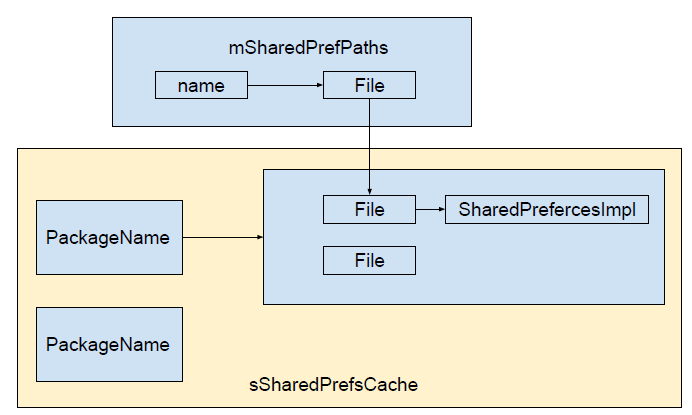

注意：

1. 对于一个相同的SharedPreferences name，获取到的都是同一个SharedPreferences对象，它其实是SharedPreferencesImpl对象。
2. sSharedPrefsCache在程序中是静态的，如果退出了程序但Context没有被清掉，那么下次进入程序仍然可能取到本应被删除掉的值。而换了另一种清除SharedPreferences的方式：使用SharedPreferences.Editor的commit方法能够起作用，调用后不退出程序都马上生效。

2、SharedPreferencesImpl对象

```
SharedPreferencesImpl(File file, int mode) {
    mFile = file;
    //  备份的File
    mBackupFile = makeBackupFile(file);
    mMode = mode;
    mLoaded = false;
    mMap = null;
    startLoadFromDisk();
}


private void startLoadFromDisk() {
    synchronized (this) {
        mLoaded = false;
    }
    new Thread("SharedPreferencesImpl-load") {
        public void run() {
            loadFromDisk();
        }
    }.start();
}


private void loadFromDisk() {
    synchronized (SharedPreferencesImpl.this) {
        if (mLoaded) {
            return;
        }
        if (mBackupFile.exists()) {
            mFile.delete();
            mBackupFile.renameTo(mFile);
        }
    }


    // Debugging
    if (mFile.exists() && !mFile.canRead()) {
        Log.w(TAG, "Attempt to read preferences file " + mFile + " without permission");
    }


    Map map = null;
    StructStat stat = null;
    try {
        stat = Os.stat(mFile.getPath());
        if (mFile.canRead()) {
            BufferedInputStream str = null;
            try {
                str = new BufferedInputStream(
                        new FileInputStream(mFile), 16*1024);
                map = XmlUtils.readMapXml(str);
            } catch (XmlPullParserException | IOException e) {
                Log.w(TAG, "getSharedPreferences", e);
            } finally {
                IoUtils.closeQuietly(str);
            }
        }
    } catch (ErrnoException e) {
        /* ignore */
    }


    synchronized (SharedPreferencesImpl.this) {
        mLoaded = true;
        if (map != null) {
            mMap = map;
            mStatTimestamp = stat.st_mtime;
            mStatSize = stat.st_size;
        } else {
            mMap = new HashMap<>();
        }
        notifyAll();
    }
}
```

可以看到对于一个SharedPreferences文件name，第一次调用getSharedPreferences时会去创建一个SharedPreferencesImpl对象，它会开启一个子线程，然后去把指定的SharedPreferences文件中的键值对全部读取出来，存放在一个Map中。
调用getString时那个SharedPreferencesImpl构造方法开启的子线程可能还没执行完（比如文件比较大时全部读取会比较久），这时getString当然还不能获取到相应的值，必须阻塞到那个子线程读取完为止，如getString方法：

```
public String getString(String key, @Nullable String defValue) {
    synchronized (mLock) {
        awaitLoadedLocked();
        String v = (String)mMap.get(key);
        return v != null ? v : defValue;
    }
}

private void awaitLoadedLocked() {
    if (!mLoaded) {
        // Raise an explicit StrictMode onReadFromDisk for this
        // thread, since the real read will be in a different
        // thread and otherwise ignored by StrictMode.
        BlockGuard.getThreadPolicy().onReadFromDisk();
    }
    while (!mLoaded) {
        try {
            wait();
        } catch (InterruptedException unused) {
        }
    }
}
```

显然这个awaitLoadedLocked方法就是用来等this这个锁的，在loadFromDisk方法的最后我们也可以看到它调用了notifyAll方法，这时如果getString之前阻塞了就会被唤醒。那么这里会存在一个问题，我们的getString是写在UI线程中，如果那个getString被阻塞太久了，比如60s，这时就会出现ANR，所以要根据具体情况考虑是否需要把SharedPreferences的读写放在子线程中。

关于mBackupFile，SharedPreferences在写入时会先把之前的xml文件改成名成一个备份文件，然后再将要写入的数据写到一个新的文件中，如果这个过程执行成功的话，就会把备份文件删除。由此可见每次即使只是添加一个键值对，也会重新写入整个文件的数据，这也说明SharedPreferences只适合保存少量数据，文件太大会有性能问题。

注意：

1. 在UI线程中调用getXXX可能会导致ANR。
2. 我们在初始化SharedPreferencesImpl对象时会加SharedPreferencesImpl对应的xml文件中的所有数据都加载到内存中，如果xml文件很大，将会占用大量的内存，我们只想读取xml文件中某个key的值，但我们获取它的时候是会加载整个文件。
3. 每添加一个键值对，都会重新写入整个文件的数据，不是增量写入；综上原因能说明Sharedpreferences只适合做轻量级的存储。

4、SharedPreferences的内部类Editor

```
SharedPreferences sharedPreferences= getSharedPreferences("data",Context.MODE_PRIVATE);
SharedPreferences.Editor editor = sharedPreferences.edit();
editor.putString("name", “Tom”);


public Editor edit() {
    // TODO: remove the need to call awaitLoadedLocked() when
    // requesting an editor.  will require some work on the
    // Editor, but then we should be able to do:
    //
    //      context.getSharedPreferences(..).edit().putString(..).apply()
    //
    // ... all without blocking.
    synchronized (this) {
        awaitLoadedLocked();
    }


    return new EditorImpl();
}
```

其实拿到的是一个EditorImpl对象，它是SharedPreferencesImpl的内部类：

```
  public final class EditorImpl implements Editor {
        private final Map<String, Object> mModified = Maps.newHashMap();
        private boolean mClear = false;


        public Editor putString(String key, @Nullable String value) {
            synchronized (this) {
                mModified.put(key, value);
                return this;
            }
        }
          .....
}
```

可以看到它有一个Map对象mModified，用来保存“修改的数据”，也就是你每次put的时候其实只是把那个键值对放到这个mModified 中，最后调用apply或者commit才会真正把数据写入文件中，如上面的putString方法，其它putXXX代码基本也是一样的。

5、commit方法和apply方法的不同

```
public void apply() {
    final long startTime = System.currentTimeMillis();

    final MemoryCommitResult mcr = commitToMemory();
    final Runnable awaitCommit = new Runnable() {
            @Override
            public void run() {
                try {
                    mcr.writtenToDiskLatch.await();
                } catch (InterruptedException ignored) {
                }

                if (DEBUG && mcr.wasWritten) {
                    Log.d(TAG, mFile.getName() + ":" + mcr.memoryStateGeneration
                            + " applied after " + (System.currentTimeMillis() - startTime)
                            + " ms");
                }
            }
        };

    QueuedWork.addFinisher(awaitCommit);

    Runnable postWriteRunnable = new Runnable() {
            @Override
            public void run() {
                awaitCommit.run();
                QueuedWork.removeFinisher(awaitCommit);
            }
        };

    SharedPreferencesImpl.this.enqueueDiskWrite(mcr, postWriteRunnable);

    // Okay to notify the listeners before it's hit disk
    // because the listeners should always get the same
    // SharedPreferences instance back, which has the
    // changes reflected in memory.
    notifyListeners(mcr);
}

public boolean commit() {
    long startTime = 0;

    if (DEBUG) {
        startTime = System.currentTimeMillis();
    }

    MemoryCommitResult mcr = commitToMemory();

    SharedPreferencesImpl.this.enqueueDiskWrite(
        mcr, null /* sync write on this thread okay */);
    try {
        mcr.writtenToDiskLatch.await();
    } catch (InterruptedException e) {
        return false;
    } finally {
    }
    notifyListeners(mcr);
    return mcr.writeToDiskResult;
}

private static class MemoryCommitResult {
    final long memoryStateGeneration;
    @Nullable final List<String> keysModified;
    @Nullable final Set<OnSharedPreferenceChangeListener> listeners;
    final Map<String, Object> mapToWriteToDisk;
    final CountDownLatch writtenToDiskLatch = new CountDownLatch(1);

    @GuardedBy("mWritingToDiskLock")
    volatile boolean writeToDiskResult = false;
    boolean wasWritten = false;

    private MemoryCommitResult(long memoryStateGeneration, @Nullable List<String> keysModified,
            @Nullable Set<OnSharedPreferenceChangeListener> listeners,
            Map<String, Object> mapToWriteToDisk) {
        this.memoryStateGeneration = memoryStateGeneration;
        this.keysModified = keysModified;
        this.listeners = listeners;
        this.mapToWriteToDisk = mapToWriteToDisk;
    }

    void setDiskWriteResult(boolean wasWritten, boolean result) {
        this.wasWritten = wasWritten;
        writeToDiskResult = result;
        writtenToDiskLatch.countDown();
    }
}
```

两种方式首先都会先使用commitTomemory函数将修改的内容写入到SharedPreferencesImpl当中，再调用enqueueDiskWrite写磁盘操作，commitToMemory就是产生一个“合适”的MemoryCommitResult对象mcr，然后调用enqueueDiskWrite时需要把这个对象传进去，commitToMemory方法：

```
private MemoryCommitResult commitToMemory() {
    long memoryStateGeneration;
    List<String> keysModified = null;
    Set<OnSharedPreferenceChangeListener> listeners = null;
    Map<String, Object> mapToWriteToDisk;

    synchronized (SharedPreferencesImpl.this.mLock) {
        // We optimistically don't make a deep copy until
        // a memory commit comes in when we're already
        // writing to disk.
        if (mDiskWritesInFlight > 0) {
            // We can't modify our mMap as a currently
            // in-flight write owns it.  Clone it before
            // modifying it.
            // noinspection unchecked
            mMap = new HashMap<String, Object>(mMap);
        }
        mapToWriteToDisk = mMap;
        mDiskWritesInFlight++;

        boolean hasListeners = mListeners.size() > 0;
        if (hasListeners) {
            keysModified = new ArrayList<String>();
            listeners = new HashSet<OnSharedPreferenceChangeListener>(mListeners.keySet());
        }

        synchronized (mEditorLock) {
            boolean changesMade = false;

            if (mClear) {
                if (!mapToWriteToDisk.isEmpty()) {
                    changesMade = true;
                    mapToWriteToDisk.clear();
                }
                mClear = false;
            }

            for (Map.Entry<String, Object> e : mModified.entrySet()) {
                String k = e.getKey();
                Object v = e.getValue();
                // "this" is the magic value for a removal mutation. In addition,
                // setting a value to "null" for a given key is specified to be
                // equivalent to calling remove on that key.
                if (v == this || v == null) {
                    if (!mapToWriteToDisk.containsKey(k)) {
                        continue;
                    }
                    mapToWriteToDisk.remove(k);
                } else {
                    if (mapToWriteToDisk.containsKey(k)) {
                        Object existingValue = mapToWriteToDisk.get(k);
                        if (existingValue != null && existingValue.equals(v)) {
                            continue;
                        }
                    }
                    mapToWriteToDisk.put(k, v);
                }

                changesMade = true;
                if (hasListeners) {
                    keysModified.add(k);
                }
            }

            mModified.clear();

            if (changesMade) {
                mCurrentMemoryStateGeneration++;
            }

            memoryStateGeneration = mCurrentMemoryStateGeneration;
        }
    }
    return new MemoryCommitResult(memoryStateGeneration, keysModified, listeners,mapToWriteToDisk);
}
```

这里需要弄清楚两个对象mMap和mModified，mMap是存放当前SharedPreferences文件中的键值对，而mModified是存放此时edit时put进去的键值对。mDiskWritesInFlight表示正在等待写的操作数量。
可以看到这个方法中首先处理了clear标志，它调用的是mMap.clear()，然后再遍历mModified将新的键值对put进mMap，也就是说在一次commit事务中，如果同时put一些键值对和调用clear后再commit，那么clear掉的只是之前的键值对，这次put进去的键值对还是会被写入的。
遍历mModified时，需要处理一个特殊情况，就是如果一个键值对的value是this（SharedPreferencesImpl）或者是null那么表示将此键值对删除，这个在remove方法中可以看到，如果之前有同样的key且value不同则用新的valu覆盖旧的value，如果没有存在同样的key则完整写入。需要注意的是这里使用了同步锁住edtor对象，保证了当前数据正确存入。

```
 public Editor remove(String key) {
    synchronized (this) {
        mModified.put(key, this);
        return this;
    }
}


public Editor clear() {
    synchronized (this) {
        mClear = true;
        return this;
    }
}
```

接下来就是调用enqueueDiskWrite方法：

```
private void enqueueDiskWrite(final MemoryCommitResult mcr,
                                  final Runnable postWriteRunnable) {
    final Runnable writeToDiskRunnable = new Runnable() {
            public void run() {
                synchronized (mWritingToDiskLock) {
                    writeToFile(mcr);
                }
                synchronized (SharedPreferencesImpl.this) {
                    mDiskWritesInFlight--;
                }
                if (postWriteRunnable != null) {
                    postWriteRunnable.run();
                }
            }
        };


    final boolean isFromSyncCommit = (postWriteRunnable == null);


    // Typical #commit() path with fewer allocations, doing a write on
    // the current thread.
    if (isFromSyncCommit) {
        boolean wasEmpty = false;
        synchronized (SharedPreferencesImpl.this) {
            wasEmpty = mDiskWritesInFlight == 1;
        }
        if (wasEmpty) {
            writeToDiskRunnable.run();
            return;
        }
    }


    QueuedWork.singleThreadExecutor().execute(writeToDiskRunnable);
}
```

定义一个Runnable任务，在Runnable中先调用writeToFile进行写操作，写操作需要先获得mWritingToDiskLock，也就是写锁。然后执行mDiskWritesInFlight–，表示正在等待写的操作减少1。

判断postWriteRunnable是否为null，调用commit时它为null，而调用apply时它不为null。isFromSyncCommit为true，而且有1个写操作需要执行，那么就调用writeToDiskRunnable.run()，注意这个调用是在当前线程中进行的。如果不是commit，那就是apply，这时调用QueuedWork.singleThreadExecutor().execute(writeToDiskRunnable)，这个QueuedWork类其实很简单，里面有一个SingleThreadExecutor，用于异步执行这个writeToDiskRunnable，commit的写操作是在调用线程中执行的，而apply内部是用一个单线程的线程池实现的，因此写操作是在子线程中执行的。

commit和apply的总结：

1. apply没有返回值而commit返回boolean表明修改是否提交成功 ；
2. commit是把内容同步提交到硬盘的，而apply先立即把修改提交到内存，然后开启一个异步的线程提交到硬盘，并且如果提交失败，不会收到任何通知。
3. 所有commit提交是同步过程，效率会比apply异步提交的速度慢，在不关心提交结果是否成功的情况下，优先考虑apply方法。
4. apply是使用异步线程写入磁盘，commit是同步写入磁盘。所以我们在主线程使用的commit的时候，需要考虑是否会出现ANR问题。（不适合大量数据存储）

## Handler机制

一、概述

1、Android消息处理机制

消息处理机制本质：==一个线程开启循环模式持续监听并依次处理其他线程给它发的消息。==

简单的说：一个线程开启一个无限循环模式，不断遍历自己的消息列表，如果有消息就挨个拿出来做处理，如果列表没消息，自己就堵塞（相当于wait，让出cpu资源给其他线程），其他线程如果想让该线程做什么事，就往该线程的消息队列插入消息，该线程会不断从队列里拿出消息做处理。

2、Android消息处理机制的工作原理

打个比方：公司类比App

PM 的主要工作是设计产品，写需求文档，改需求,中途改需求，提测前改需求...
UI 主要工作是UI设计，交互等。
RD 工作我就不说了
CEO 不解释。

公司开创之后（App启动），那么CEO开始干活了（主线程【UI线程】启动），这时候CEO开启了无限循环工作狂模式，自己的公司没办法啊（相当于UI主线程转成Looper线程【源码里面有】）CEO招了一名RD（new Handler 实例）并把告诉PM和UI,如果你们有什么任务和需求就让RD（Handler实例）转告给我（CEO）。RD会把PM和UI的需求（Message）一条条记到CEO的备忘录里（MessageQueue）。CEO 无限循环的工作就是不断查看备忘录，看有什么任务要做，有任务就从备忘录一条一条拿出任务来，然后交给这一名RD（Handler 实例）去处理（毕竟CEO 不会写代码）。当然如果备忘录都做完了，这时候CEO就会去睡觉（线程堵塞【简单理解成线程wait】，让出CPU资源，让其他线程去执行）。但是这个备忘录有个特殊的功能就是没有任务的时候突然插入第一条任务（从无到有）就会有闹钟功能叫醒CEO起床继续处理备忘录。 整个消息处理机制的工作原理基本就是这样的。后面会有源码分析，你再来结合这个场景，会更好理解一些。

这里先给一张Android消息处理机制流程图和具体执行动画，如果看不懂没事，接着往下看（后面会结合Android UI主线程来讲解），然后结合着图和动画一块看更能理解整个机制的实现原理。

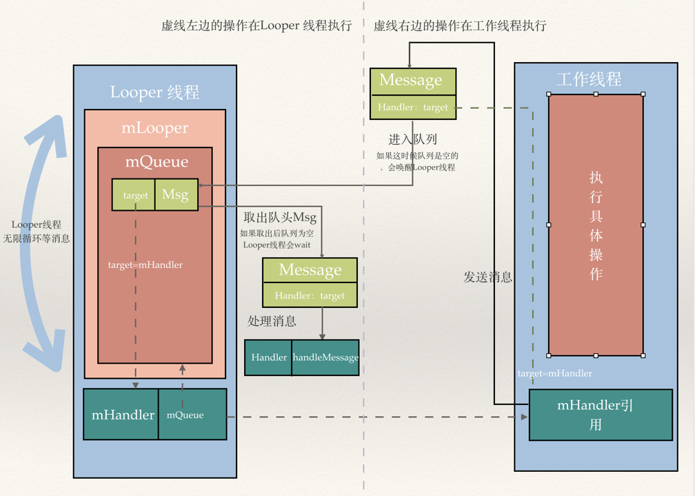


3、Looper、Handler、MessageQueue,Message作用和存在的意义？

* Looper 

我们知道一个线程是一段可执行的代码，当可执行代码执行完成后，线程生命周期便会终止，线程就会退出，那么做为App的主线程，如果代码段执行完了会怎样？，那么就会出现App启动后执行一段代码后就自动退出了，这是很不合理的。所以为了防止代码段被执行完，只能在代码中插入一个死循环，那么代码就不会被执行完，然后自动退出，怎么在在代码中插入一个死循环呢？那么Looper出现了，在主线程中调用Looper.prepare()...Looper.loop()就会变当前线程变成Looper线程（可以先简单理解：无限循环不退出的线程），Looper.loop()方法里面有一段死循环的代码，所以主线程会进入while(true){...}的代码段跳不出来，但是主线程也不能什么都不做吧？其实所有做的事情都在while(true){...}里面做了，主线程会在死循环中不断等其他线程给它发消息（消息包括：Activity启动，生命周期，更新UI，控件事件等），一有消息就根据消息做相应的处理，Looper的另外一部分工作就是在循环代码中会不断从消息队列挨个拿出消息给主线程处理。

* MessageQueue

MessageQueue 存在的原因很简单，就是同一线程在同一时间只能处理一个消息，同一线程代码执行是不具有并发性，所以需要队列来保存消息和安排每个消息的处理顺序。多个其他线程往UI线程发送消息，UI线程必须把这些消息保持到一个列表（它同一时间不能处理那么多任务),然后挨个拿出来处理，这种设计很简单，我们平时写代码其实也经常这么做。每一个Looper线程都会维护这样一个队列，而且仅此一个，这个队列的消息只能由该线程处理。

* Handler

简单说Handler用于同一个进程的线程间通信。Looper让主线程无限循环地从自己的MessageQueue拿出消息处理，既然这样我们就知道处理消息肯定是在主线程中处理的，那么怎样在其他的线程往主线程的队列里放入消息呢？其实很简单，我们知道在同一进程中线程和线程之间资源是共享的，也就是对于任何变量在任何线程都是可以访问和修改的，只要考虑并发性做好同步就行了，那么只要拿到MessageQueue 的实例，就可以往主线程的MessageQueue放入消息，主线程在轮询的时候就会在主线程处理这个消息。那么怎么拿到主线程 MessageQueue的实例，是可以拿到的(在主线程下mLooper = Looper.myLooper();mQueue = mLooper.mQueue;),但是Google 为了统一添加消息和消息的回调处理，又专门构建了Handler类，你只要在主线程构建Handler类，那么这个Handler实例就获取主线程MessageQueue实例的引用（获取方式mLooper = Looper.myLooper();mQueue = mLooper.mQueue;），Handler 在sendMessage的时候就通过这个引用往消息队列里插入新消息。Handler 的另外一个作用，就是能统一处理消息的回调。这样一个Handler发出消息又确保消息处理也是自己来做，这样的设计非常的赞。具体做法就是在队列里面的Message持有Handler的引用（哪个handler 把它放到队列里，message就持有了这个handler的引用），然后等到主线程轮询到这个message的时候，就来回调我们经常重写的Handler的handleMessage(Message msg)方法。

* Message

Message包含具体的消息数据，在成员变量target中保存了用来发送此消息的Handler引用。因此在消息获得这行时机时，能知道具体由哪一个Handler处理。此外静态成员变量sPool，则维护了消息缓存池以复用。

二、源码分析

结合App主线程（UI线程），从App启动后一步一步往下走分析整个Android的消息处理机制，首先在ActivityThread类有我们熟悉的main的函数，App启动的代码的入口就在这里，UI线程本来只是一个普通线程，在这里会把UI线程转换成Looper线程，什么是Looper线程？

```
public final class ActivityThread {
    public static final void main(String[] args) {
        ......
        Looper.prepareMainLooper();
        ......
        ActivityThread thread = new ActivityThread();
        thread.attach(false);

        if (sMainThreadHandler == null) {    
            sMainThreadHandler = thread.getHandler();
        }
        ......
        Looper.loop();
        ......
    }
}
```

首先执行的是 Looper.prepareMainLooper() 我们来看下Looper里面的这个方法做了什么？

> 注:看之前先稍微了解下ThreadLocal是什么？
> ThreadLocal： 线程本地存储区（Thread Local Storage，简称为TLS），每个线程都有自己的私有> 的本地存储区域，不同线程之间彼此不能访问对方的TLS区域。这里线程自己的本地存储区域存放是线程自> 己的Looper。具体看下ThreadLocal.java 的源码！

```
public final class Looper {
    // sThreadLocal 是static的变量，可以先简单理解它相当于map，key是线程，value是Looper，
    //那么你只要用当前的线程就能通过sThreadLocal获取当前线程所属的Looper。
    static final ThreadLocal<Looper> sThreadLocal = new ThreadLocal<Looper>();
    //主线程（UI线程）的Looper 单独处理，是static类型的，通过下面的方法getMainLooper() 
    //可以方便的获取主线程的Looper。
    private static Looper sMainLooper; 

    //Looper 所属的线程的消息队列
    final MessageQueue mQueue;
    //Looper 所属的线程
    final Thread mThread;

    public static void prepare() {
        prepare(true);
    }

    private static void prepare(boolean quitAllowed) {
         //如果线程的TLS已有数据，则会抛出异常，一个线程只能有一个Looper，prepare不能重复调用。
        if (sThreadLocal.get() != null) {
            throw new RuntimeException("Only one Looper may be created per thread");
        }
        //往线程的TLS插入数据，简单理解相当于map.put(Thread.currentThread(),new Looper(quitAllowed));
        sThreadLocal.set(new Looper(quitAllowed));
    }

    //实际上是调用  prepare(false)，并然后给sMainLooper赋值。
    public static void prepareMainLooper() {
        prepare(false);
        synchronized (Looper.class) {
            if (sMainLooper != null) {
                throw new IllegalStateException("The main Looper has already been prepared.");
            }
            sMainLooper = myLooper();
        }
    }
    //static 方法，方便获取主线程的Looper.
    public static Looper getMainLooper() {
        synchronized (Looper.class) {
            return sMainLooper;
        }
    }
    
    public static @Nullable Looper myLooper() {
        //具体看ThreadLocal类的源码的get方法，
        //简单理解相当于map.get(Thread.currentThread()) 获取当前线程的Looper
        return sThreadLocal.get();
    }
}
```

看了上面的代码（仔细看下注释），我们发现 Looper.prepareMainLooper()做的事件就是new了一个Looper实例并放入Looper类下面一个static的ThreadLocal<Looper> sThreadLocal静态变量中，同时给sMainLooper赋值,给sMainLooper赋值是为了方便通过Looper.getMainLooper()快速获取主线程的Looper，sMainLooper是主线程的Looper可能获取会比较频繁，避免每次都到 sThreadLocal 去查找获取。

接下来重点是看下Looper的构造函数，看看在new Looper的时候做了什么事？

```
private Looper(boolean quitAllowed) {
        mQueue = new MessageQueue(quitAllowed);
        mThread = Thread.currentThread();
}
```

这时候给当前线程创建了消息队列MessageQueue，并且让Looper持有MessageQueue的引用。执行完Looper.prepareMainLooper() 之后，主线程从普通线程转成一个Looper线程。目前的主线程线程已经有一个Looper对象和一个消息队列mQueue,引用关系如下图：（主线程可以轻松获取它的Looper，主线程的Looper持有主线程消息队列的引用）

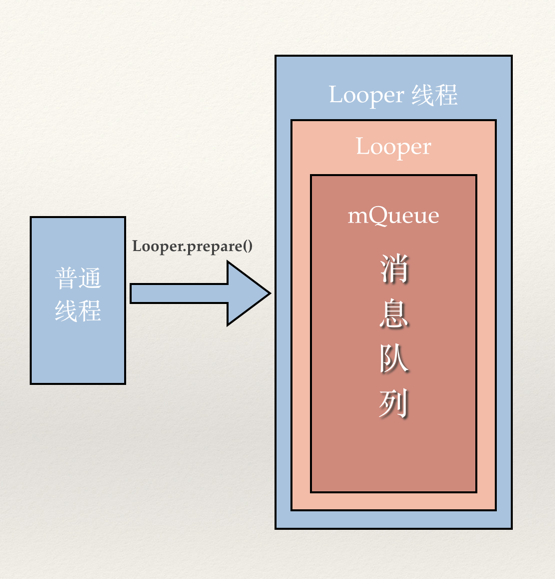

具体如何获取主线程的Looper对象和消息列表呢？

```
//在主线程中执行
mLooper = Looper.myLooper();
mQueue = mLooper.mQueue
//或者
mLooper=Looper.getMainLooper()
```

接下来回到ActivityThread 的main函数，执行完Looper.prepareMainLooper() 之后下一句代码是ActivityThread thread = new ActivityThread();这句话就是创建一下ActivityThread对象，这边需要注意的时候ActivityThread并不是一个线程，它并没有继承Thread，而只是一个普通的类public final class ActivityThread{...}ActivityThread的构造函数并没有做什么事只是初始化了资源管理器。

```
ActivityThread() {
     mResourcesManager = ResourcesManager.getInstance();
 }
```

接着往下看下一行代码

```
ActivityThread thread = new ActivityThread();
//建立Binder通道 (创建新线程)
thread.attach(false);
```

thread.attach(false);便会创建一个Binder线程（具体是指ApplicationThread，该Binder线程会通过Handler将Message发送给主线程，之后讲)。我们之前提到主线程最后会进入无限循环当中，如果没有在进入死循环之前创建其他线程，那么待会谁会给主线程发消息呢？，没错就是在这里创建了这个线程，这个线程会接收来自系统服务发送来的一些事件封装了Message并发送给主线程，主线程在无限循环中从队列里拿到这些消息并处理这些消息。（Binder线程发生的消息包括LAUNCH_ACTIVITY，PAUSE_ACTIVITY 等等）

继续回到mian 函数的下一句代码Looper.loop() 那么重点来了，我们来看下Looper.loop()的源码：

```
public static void loop() {
    final Looper me = myLooper();  //获取TLS存储的Looper对象,获取当前线程的Looper 
    if (me == null) {
        throw new RuntimeException("No Looper; Looper.prepare() wasn't called on this thread.");
    }
 
    final MessageQueue queue = me.mQueue;  //获取Looper对象中的消息队列
    ....

    for (;;) { //主线程开启无限循环模式
        Message msg = queue.next(); //获取队列中的下一条消息，可能会线程阻塞
        if (msg == null) { //没有消息，则退出循环，退出消息循环，那么你的程序也就可以退出了
            return;
        }
        ....
        //分发Message，msg.target 是一个Handler对象，哪个Handler把这个Message发到队列里，
        //这个Message会持有这个Handler的引用，并放到自己的target变量中,这样就可以回调我们重写
        //的handler的handleMessage方法。
        msg.target.dispatchMessage(msg);
        ....
        ....
        msg.recycleUnchecked();  //将Message回收到消息池,下次要用的时候不需要重新创建，obtain()就可以了。
    }
}
```

上面的代码，大家具体看下注释，这时候主线程（UI线程）执行到这一步就进入了死循环，不断地去拿消息队列里面的消息出来处理？那么问题来了

1、UI线程一直在这个循环里跳不出来，主线程不会因为Looper.loop()里的死循环卡死吗，那还怎么执行其他的操作呢？

在looper启动后，主线程上执行的任何代码都是被looper从消息队列里取出来执行的。也就是说主线程之后都是通过其他线程给它发消息来实现执行其他操作的。生命周期的回调也是如此的，系统服务ActivityManagerService通过Binder发送IPC调用给APP进程，App进程接到到调用后，通过App进程的Binder线程给主线程的消息队列插入一条消息来实现的。

2、主线程是UI线程和用户交互的线程，优先级应该很高，主线程的死循环一直运行是不是会特别消耗CPU资源吗？App进程的其他线程怎么办？

这基本是一个类似生产者消费者的模型，简单说如果在主线程的MessageQueue没有消息时，就会阻塞在loop的queue.next()方法里，这时候主线程会释放CPU资源进入休眠状态，直到有下个消息进来时候就会唤醒主线程，在2.2 版本以前，这套机制是用我们熟悉的线程的wait和notify 来实现的，之后的版本涉及到Linux pipe/epoll机制，通过往pipe管道写端写入数据来唤醒主线程工作。原理类似于I/O,读写是堵塞的，不占用CPU资源。

所以上面代码的重点是queue.next() 的函数，其他的我们就不多说了，我们来看下queue.next()的源码（主要还是看注释）：

```
Message next() {
       
    final long ptr = mPtr;
    if (ptr == 0) {
        return null;
    }
    int pendingIdleHandlerCount = -1; // -1 only during first iteration

    //nextPollTimeoutMillis 表示nativePollOnce方法需要等待nextPollTimeoutMillis 
    //才会返回
    int nextPollTimeoutMillis = 0;
    for (;;) {
        if (nextPollTimeoutMillis != 0) {
            Binder.flushPendingCommands();
        }
        //读取消息，队里里没有消息有可能会堵塞，两种情况该方法才会返回(代码才能往下执行)
        //一种是等到有消息产生就会返回,
        //另一种是当等了nextPollTimeoutMillis时长后，nativePollOnce也会返回
        nativePollOnce(ptr, nextPollTimeoutMillis);
        //nativePollOnce 返回之后才能往下执行
        synchronized (this) {
            // Try to retrieve the next message.  Return if found.
            final long now = SystemClock.uptimeMillis();
            Message prevMsg = null;
            Message msg = mMessages;
            if (msg != null && msg.target == null) {
                // 循环找到一条不是异步而且msg.target不为空的message
                do {
                    prevMsg = msg;
                    msg = msg.next;
                } while (msg != null && !msg.isAsynchronous());
            }
            if (msg != null) {
                if (now < msg.when) {
                   // 虽然有消息，但是还没有到运行的时候，像我们经常用的postDelay,
                   //计算出离执行时间还有多久赋值给nextPollTimeoutMillis，
                   //表示nativePollOnce方法要等待nextPollTimeoutMillis时长后返回
                    nextPollTimeoutMillis = (int) Math.min(msg.when - now, Integer.MAX_VALUE);
                } else {
                    // 获取到消息
                    mBlocked = false;
                   //链表一些操作，获取msg并且删除该节点 
                    if (prevMsg != null) 
                        prevMsg.next = msg.next;
                    } else {
                        mMessages = msg.next;
                    }
                    msg.next = null；
                    msg.markInUse();
                    //返回拿到的消息
                    return msg;
                }
            } else {
                //没有消息，nextPollTimeoutMillis复位
                nextPollTimeoutMillis = -1;
            }
            .....
            .....
          
}
```

nativePollOnce()很重要，是一个native的函数，在native做了大量的工作，主要涉及到epoll机制的处理（在没有消息处理时阻塞在管道的读端）。

分析到这里，从应用启动创建Looper，创建消息队列，到进入loop方法执行无限循环中，那么这一块就告一段落了，主线程已经在死循环里轮询等待消息了，接下来我们就要再看看，系统是怎么发消息给主线程的，主线程是怎么处理这些个消息的？

在准备启动一个Activity的时候，系统服务进程下的ActivityManagerService（简称AMS）线程会通过Binder发送IPC调用给APP进程，App进程接到到调用后，通过App进程下的Binder线程最终调用ActivityThread类下面的scheduleLaunchActivity方法来准备启动Activity，看下scheduleLaunchActivity方法:

>注：Binder线程：具体是指ApplicationThread，在App进程中接受系统进程传递过来的信息的线程（在主线程进入死循环之前创建了这个线程）。

```
//这个方法不是在主线程调用，是Binder线程下调用的
  public final void scheduleLaunchActivity(Intent intent, IBinder token, int ident,
                ActivityInfo info, Configuration curConfig, Configuration overrideConfig,
                CompatibilityInfo compatInfo, String referrer, IVoiceInteractor voiceInteractor,
                int procState, Bundle state, PersistableBundle persistentState,
                List<ResultInfo> pendingResults, List<ReferrerIntent> pendingNewIntents,
                boolean notResumed, boolean isForward, ProfilerInfo profilerInfo) {

            updateProcessState(procState, false);

            ActivityClientRecord r = new ActivityClientRecord();

            r.token = token;
            r.ident = ident;
            r.intent = intent;
            r.referrer = referrer;
            r.voiceInteractor = voiceInteractor;
            r.activityInfo = info;
            r.compatInfo = compatInfo;
            r.state = state;
            r.persistentState = persistentState;

            r.pendingResults = pendingResults;
            r.pendingIntents = pendingNewIntents;

            r.startsNotResumed = notResumed;
            r.isForward = isForward;

            r.profilerInfo = profilerInfo;

            r.overrideConfig = overrideConfig;
            updatePendingConfiguration(curConfig);

            sendMessage(H.LAUNCH_ACTIVITY, r);
  }
```

把启动一些信息封装成ActivityClientRecord之后，最后一句调用sendMessage(H.LAUNCH_ACTIVITY, r);我们接着往下看:

```
private void sendMessage(int what, Object obj) {
        sendMessage(what, obj, 0, 0, false);
    }
private void sendMessage(int what, Object obj, int arg1, int arg2, boolean async) {
     Message msg = Message.obtain();
    msg.what = what;
    msg.obj = obj;
    msg.arg1 = arg1;
    msg.arg2 = arg2;
    if (async) {
        msg.setAsynchronous(true);
    }
    mH.sendMessage(msg);
}
```

最后启动Activity的信息都封装一个Message，但是这里有个问题了，之前在分析main函数的时候，完全没给出往主线程消息队列插入消息的方式，这里有了消息，但是怎么发到主线程的消息队列呢？最后一句又是重点mH.sendMessage(msg); mH 是什么呢？难道是Handler，我们来看下它是什么东西？

我们看了下ActivityThread 的成员变量，发现一句初始化的代码

```
final H mH = new H();
```

继续往下看H是什么？

```
public final class ActivityThread{
     ....
     final H mH = new H();
     ....
     private class H extends Handler {
     ....
     ....
     public void handleMessage(Message msg) {
            if (DEBUG_MESSAGES) Slog.v(TAG, ">>> handling: " + codeToString(msg.what));
            switch (msg.what) {
                case LAUNCH_ACTIVITY: {
                    Trace.traceBegin(Trace.TRACE_TAG_ACTIVITY_MANAGER, "activityStart");
                    final ActivityClientRecord r = (ActivityClientRecord) msg.obj;

                    r.packageInfo = getPackageInfoNoCheck(
                            r.activityInfo.applicationInfo, r.compatInfo);
                    handleLaunchActivity(r, null);
                    Trace.traceEnd(Trace.TRACE_TAG_ACTIVITY_MANAGER);
                } break;
                case RELAUNCH_ACTIVITY: {
                    Trace.traceBegin(Trace.TRACE_TAG_ACTIVITY_MANAGER, "activityRestart");
                    ActivityClientRecord r = (ActivityClientRecord)msg.obj;
                    handleRelaunchActivity(r);
                    Trace.traceEnd(Trace.TRACE_TAG_ACTIVITY_MANAGER);
                } break;
                case PAUSE_ACTIVITY:
                    Trace.traceBegin(Trace.TRACE_TAG_ACTIVITY_MANAGER, "activityPause");
                    handlePauseActivity((IBinder)msg.obj, false, (msg.arg1&1) != 0, msg.arg2,
                            (msg.arg1&2) != 0);
                    maybeSnapshot();
                    Trace.traceEnd(Trace.TRACE_TAG_ACTIVITY_MANAGER);
                    break;
                   .....
         }
         .....
         .....
     }
}
```

H 果不出其然是Handler，而且是ActivityThread的内部类，看了一下它的handleMessage 方法，LAUNCH_ACTIVITY、PAUSE_ACTIVITY、RESUME_ACTIVITY...好多好多，H 类帮我们处理了好多声明周期的事情。那么再回到mH.sendMessage(msg)这句代码上，在Binder线程执行mH.sendMessage(msg);，由主线程创建的Handler mH实例发送消息到主线程的消息队列里，消息队列从无到有，主线程堵塞被唤醒，主线程loop拿到消息，并回调mH的handleMessage 方法处理LAUNCH_ACTIVITY 等消息。从而实现Activity的启动。

讲到这里，基本一个启动流程分析完了，大家可能比较想知道的是 mH.sendMessage(msg); 关于Hanlder是怎么把消息发到主线程的消息队列的？我们接下来就讲解下Handler，首先看下Handler的源码！我们先来看看我们经常用的Handler的无参构造函数，实际调用的是Handler(Callback callback, boolean async)构造函数（看注释）

```
public Handler() {
        this(null, false);
 }
 public Handler(Callback callback, boolean async) {
    //不是static 发出可能内存泄露的警告！
    if (FIND_POTENTIAL_LEAKS) {
        final Class<? extends Handler> klass = getClass();
        if ((klass.isAnonymousClass() || klass.isMemberClass() || klass.isLocalClass()) &&
                (klass.getModifiers() & Modifier.STATIC) == 0) {
            Log.w(TAG, "The following Handler class should be static or leaks might occur: " +
                klass.getCanonicalName());
        }
    }
    //获取当前线程的Looper，还记得前面讲过 Looper.myLooper()方法了吗？
    //Looper.myLooper()内部实现可以先简单理解成：map.get(Thread.currentThread()) 
    //获取当前线程的Looper
    mLooper = Looper.myLooper();
    if (mLooper == null) {
        //当前线程不是Looper 线程，没有调用Looper.prepare()给线程创建Looper对象
        throw new RuntimeException(
            "Can't create handler inside thread that has not called Looper.prepare()");
    }
    //让Handler 持有当前线程消息队列的引用
    mQueue = mLooper.mQueue;
    //这些callback先不管，主要用于handler的消息发送的回调，优先级是比handlerMessage高，但是不常用
    mCallback = callback;
    mAsynchronous = async;
}
```

上面的代码说明了下面几个问题：

1. Handler 对象在哪个线程下构建（Handler的构造函数在哪个线程下调用），那么Handler 就会持有这个线程的Looper引用和这个线程的消息队列的引用。因为持有这个线程的消息队列的引用，意味着这个Handler对象可以在任意其他线程给该线程的消息队列添加消息，也意味着Handler的handlerMessage 肯定也是在该线程执行的。
2. 如果该线程不是Looper线程，在这个线程new Handler 就会报错！
3. 上面两点综合说明了下面一段很常见的代码：把普通线程转成Looper线程的代码，为什么在Looper.prepare()和Looper.loop()中间要创建Handler:

```
class LooperThread extends Thread {
   //其他线程可以通过mHandler这个引用给该线程的消息队列添加消息
   public Handler mHandler;
   public void run() {
        Looper.prepare();
        //需要在线程进入死循环之前，创建一个Handler实例供外界线程给自己发消息
        mHandler = new Handler() {
            public void handleMessage(Message msg) {
                //Handler 对象在这个线程构建，那么handleMessage的方法就在这个线程执行
            }
        };
        Looper.loop();
    }
}
```

那么接下来，我们接着往下看Handler的sendMessage(msg)方法，这个方法也是比较重要的，也比较常用，Handler 有很多sendXXXX开头的方法sendMessageAtTime、sendEmptyMessageDelayed、sendEmptyMessage等等，都是用来给消息队列添加消息的，那么这些方法最终都会调用enqueueMessage来实现消息进入队列：

```
private boolean enqueueMessage(MessageQueue queue, Message msg, long uptimeMillis) {
    //这句话很重要，让消息持有当前Handler的引用，在消息被Looper线程轮询到的时候
    //回调handler的handleMessage方法
    msg.target = this;
    if (mAsynchronous) {
        msg.setAsynchronous(true);
    }
    //调用MessageQueue 的enqueueMessage 方法把消息放入队列
    return queue.MessageQueue(msg, uptimeMillis);
}
```

我们再来看下MessageQueue 的enqueueMessage(msg, uptimeMillis)方法：

```
boolean enqueueMessage(Message msg, long when) {
    // msg 必须有target也就是必须有handler
    if (msg.target == null) {
        throw new IllegalArgumentException("Message must have a target.");
    }
    if (msg.isInUse()) {
        throw new IllegalStateException(msg + " This message is already in use.");
    }
    //插入消息队列的时候需要做同步，因为会有多个线程同时做往这个队列插入消息
    synchronized (this) {
        if (mQuitting) {
            IllegalStateException e = new IllegalStateException(
                    msg.target + " sending message to a Handler on a dead thread");
            Log.w(TAG, e.getMessage(), e);
            msg.recycle();
            return false;
        }

        msg.markInUse();
        //when 表示这个消息执行的时间，队列是按照消息执行时间排序的
        //如果handler 调用的是postDelay 那么when=SystemClock.uptimeMillis()+delayMillis
        msg.when = when;
        Message p = mMessages;
        boolean needWake;
        if (p == null || when == 0 || when < p.when) {
            // p==null 表示当前消息队列没有消息
            msg.next = p;
            mMessages = msg;
            //需要唤醒主线程，如果队列没有元素，主线程会堵塞在管道的读端，这时
            //候队列突然有消息了，就会往管道写入字符，唤醒主线程
            needWake = mBlocked;
        } else {
            // Inserted within the middle of the queue.  Usually we don't have to wake
            // up the event queue unless there is a barrier at the head of the queue
            // and the message is the earliest asynchronous message in the queue.
            needWake = mBlocked && p.target == null && msg.isAsynchronous();
            Message prev;
            //将消息放到队列的确切位置，队列是按照msg的when 排序的，链表操作自己看咯
            for (;;) {
                prev = p;
                p = p.next;
                if (p == null || when < p.when) {
                    break;
                }
                if (needWake && p.isAsynchronous()) {
                    needWake = false;
                }
            }
            msg.next = p; // invariant: p == prev.next
            prev.next = msg;
        }

        // 如果需要唤醒Looper线程，这里调用native的方法实现epoll机制唤醒线程，我们就不在深入探讨了
        if (needWake) {
            nativeWake(mPtr);
        }
    }
    return true;
}
```

最后我们再看下Handler 的dispatchMessage方法,这个方法在Looper线程从消息队列拿出来的时候，通过msg.target.dispatchMessage(msg)调用的。

```
public void dispatchMessage(Message msg) {
    //优先调用callback方法
    if (msg.callback != null) {
        handleCallback(msg);
    } else {
        if (mCallback != null) {
            if (mCallback.handleMessage(msg)) {
                return;
            }
        }
        //最后会回调我们重写的handleMessage 方法
        handleMessage(msg);
    }
}
```

## ActivityManagerService(AMS)

1.概述

AMS是系统的引导服务，应用进程的启动、切换和调度、四大组件的启动和管理都需要AMS的支持。从这里可以看出AMS的功能会十分的繁多，当然它并不是一个类承担这个重责，它有一些关联类。

一、AMS的启动流程

AMS的启动是在SyetemServer进程中启动的，这里从SyetemServer的main方法开始讲起：
frameworks/base/services/java/com/android/server/SystemServer.java

```
//是由zygote进程fork来的
public static void main(String[] args) {
    new SystemServer().run();
}
```

main方法中只调用了SystemServer的run方法，如下所示。

frameworks/base/services/java/com/android/server/SystemServer.java

```
private void run() {
   ...
       System.loadLibrary("android_servers");//1
   ...
       mSystemServiceManager = new SystemServiceManager(mSystemContext);//2
       LocalServices.addService(SystemServiceManager.class, mSystemServiceManager);
   ...    
    try {
       Trace.traceBegin(Trace.TRACE_TAG_SYSTEM_SERVER, "StartServices");
       startBootstrapServices();//3
       startCoreServices();//4
       startOtherServices();//5
   } catch (Throwable ex) {
       Slog.e("System", "******************************************");
       Slog.e("System", "************ Failure starting system services", ex);
       throw ex;
   } finally {
       Trace.traceEnd(Trace.TRACE_TAG_SYSTEM_SERVER);
   }
   ...
}
```

1. 注释1：加载了动态库libandroid_servers.so。
2. 注释2：创建SystemServiceManager，它会对系统的服务进行创建、启动和生命周期管理。
3. 注释3：中的startBootstrapServices方法中用SystemServiceManager启动了ActivityManagerService、PowerManagerService、PackageManagerService等服务。
4. 注释4：startCoreServices方法中则启动了BatteryService、UsageStatsService和WebViewUpdateService。
5. 注释5：startOtherServices方法中启动了CameraService、AlarmManagerService、VrManagerService等服务。这些服务的父类均为SystemService。

从注释3、4、5的方法可以看出，官方把系统服务分为了三种类型，分别是引导服务、核心服务和其他服务，其中其他服务是一些非紧要和一些不需要立即启动的服务。系统服务总共大约有80多个，我们主要来查看引导服务AMS是如何启动的，注释3处的startBootstrapServices方法如下所示。

frameworks/base/services/java/com/android/server/SystemServer.java

```
private void startBootstrapServices() {
    Installer installer = mSystemServiceManager.startService(Installer.class);
    //真正启动AMS的地方
    mActivityManagerService = mSystemServiceManager.startService(
            ActivityManagerService.Lifecycle.class).getService();//1
    mActivityManagerService.setSystemServiceManager(mSystemServiceManager);
    mActivityManagerService.setInstaller(installer);
  ...
}
```

注释1：调用了SystemServiceManager的startService方法，方法的参数是ActivityManagerService.Lifecycle.class：

frameworks/base/services/core/java/com/android/server/SystemServiceManager.java

```
@SuppressWarnings("unchecked")
public <T extends SystemService> T startService(Class<T> serviceClass) {
    try {
       ...
        final T service;
        try {
            Constructor<T> constructor = serviceClass.getConstructor(Context.class);//1
            service = constructor.newInstance(mContext);//2
        } catch (InstantiationException ex) {
          ...
        }
        // Start it.
        startService(service);
        return service;
    } finally {
        Trace.traceEnd(Trace.TRACE_TAG_SYSTEM_SERVER);
    }
}

public void startService(@NonNull final SystemService service) {
    // Register it.
    mServices.add(service);//3
    // Start it.
    long time = SystemClock.elapsedRealtime();
    try {
        service.onStart();//4
    } catch (RuntimeException ex) {
        throw new RuntimeException("Failed to start service " + service.getClass().getName()
                + ": onStart threw an exception", ex);
    }
    warnIfTooLong(SystemClock.elapsedRealtime() - time, service, "onStart");
}
```

startService方法传入的参数是Lifecycle.class，Lifecycle继承自SystemService。首先，通过反射来创建Lifecycle实例

* 注释1：得到传进来的Lifecycle的构造器constructor
* 注释2：调用constructor的newInstance方法来创建Lifecycle类型的service对象。
* 注释3：将刚创建的service添加到ArrayList类型的mServices对象中来完成注册。
* 注释4：调用service的onStart方法来启动service，并返回该service。

Lifecycle是AMS的内部类，代码如下所示。

frameworks/base/services/core/java/com/android/server/am/ActivityManagerService.java

```
public static final class Lifecycle extends SystemService {
    private final ActivityManagerService mService;
    public Lifecycle(Context context) {
        super(context);
        mService = new ActivityManagerService(context);//1
    }
    @Override
    public void onStart() {
        mService.start();//2
    }
    public ActivityManagerService getService() {
        return mService;//3
    }
}
```

上面的代码结合SystemServiceManager的startService方法来分析，当通过反射来创建Lifecycle实例时：

* 注释1：调用的方法创建AMS实例，当调用Lifecycle类型的service的onStart方法时，实际上是调用了注释2处AMS的start方法。在SystemServer的startBootstrapServices方法的注释1处，调用了如下代码：

```
mActivityManagerService = mSystemServiceManager.startService(
                ActivityManagerService.Lifecycle.class).getService();
```

我们知道SystemServiceManager的startService方法最终会返回Lifecycle类型的对象，紧接着又调用了Lifecycle的getService方法，这个方法会返回AMS类型的mService对象，见注释3处，这样AMS实例就会被创建并且返回。

这里Lifecycle.class中有两步操作：

1、mService = new ActivityManagerService(context);

```
// Note: This method is invoked on the main thread but may need to attach various
// handlers to other threads.  So take care to be explicit about the looper.
public ActivityManagerService(Context systemContext) {
    ...
    mServices = new ActiveServices(this);
    mProviderMap = new ProviderMap(this);
    mAppErrors = new AppErrors(mUiContext, this);
    ...
    Watchdog.getInstance().addMonitor(this);
    Watchdog.getInstance().addThread(mHandler);
}
```

可以看得出来AMS的构造方法中都是一些初始化操作，以及增加了看门狗

2、mService.start();

```
private void start() {
    //完成统计前的复位工作
    removeAllProcessGroups();
    //开始监控进程的CPU使用情况
    mProcessCpuThread.start();
    //注册服务
    mBatteryStatsService.publish(mContext);
    mAppOpsService.publish(mContext);
    Slog.d("AppOps", "AppOpsService published");
    LocalServices.addService(ActivityManagerInternal.class, new LocalService());
    // Wait for the synchronized block started in mProcessCpuThread,
    // so that any other acccess to mProcessCpuTracker from main thread
    // will be blocked during mProcessCpuTracker initialization.
    try {
        mProcessCpuInitLatch.await();
    } catch (InterruptedException e) {
        Slog.wtf(TAG, "Interrupted wait during start", e);
        Thread.currentThread().interrupt();
        throw new IllegalStateException("Interrupted wait during start");
    }
}
```

主要处理了：

1. 启动CPU监控线程。该线程将会开始统计不同进程使用CPU的情况。
2. 发布一些服务，如BatteryStatsService、AppOpsService(权限管理相关)和本地实现的继承ActivityManagerInternal的服务。

startBootstrapServices方法中mActivityManagerService.setSystemProcess()方法

```
public void setSystemProcess() {
    try {
        ServiceManager.addService(Context.ACTIVITY_SERVICE, this, true);
        ServiceManager.addService(ProcessStats.SERVICE_NAME, mProcessStats);
        ServiceManager.addService("meminfo", new MemBinder(this));
        ServiceManager.addService("gfxinfo", new GraphicsBinder(this));
        ServiceManager.addService("dbinfo", new DbBinder(this));
        if (MONITOR_CPU_USAGE) {
            ServiceManager.addService("cpuinfo", new CpuBinder(this));
        }
        ServiceManager.addService("permission", new PermissionController(this));
        ServiceManager.addService("processinfo", new ProcessInfoService(this));

        ApplicationInfo info = mContext.getPackageManager().getApplicationInfo(
                "android", STOCK_PM_FLAGS | MATCH_SYSTEM_ONLY);
        mSystemThread.installSystemApplicationInfo(info, getClass().getClassLoader());

        synchronized (this) {
            ProcessRecord app = newProcessRecordLocked(info, info.processName, false, 0);
            app.persistent = true;
            app.pid = MY_PID;
            app.maxAdj = ProcessList.SYSTEM_ADJ;
            app.makeActive(mSystemThread.getApplicationThread(), mProcessStats);
            synchronized (mPidsSelfLocked) {
                mPidsSelfLocked.put(app.pid, app);
            }
            updateLruProcessLocked(app, false, null);
            updateOomAdjLocked();
        }
    } catch (PackageManager.NameNotFoundException e) {
        throw new RuntimeException(
                "Unable to find android system package", e);
    }
}
```

此方法中主要处理了

1. 注册一些服务；
2. 获取package名为“android”的应用的ApplicationInfo；
3. 调用ActivityThread的installSystemApplicationInfo；
4. AMS进程管理相关的操作。

这里注意installSystemApplicationInfo ()方法：它主要处理了将package名为“android”的应用的ApplicationInfo;(即framework-res.apk,资源apk)赋值给LoadedApk，这里不详细拆分
在SystemServer.run()下startOtherServices();方法中有一类似的代码mActivityManagerService.installSystemProviders();此方法是加载运行在SystemServer进程中的ContentProvider，即SettingsProvider.apk (定义于frameworks/base/packages/SettingsProvider)。最终ContentProvider信息都将注册到AMS中的mProviderMap集合中。

SystemSever#startOtherServices中调用ActivityManagerService#systemReady方法

```
public void systemReady(final Runnable goingCallback, BootTimingsTraceLog traceLog) {
...
//通知一些服务可以进行systemReady相关的工作，并进行启动服务或应用进程的工作
...
//开启HomeActivity
startHomeActivityLocked(currentUserId, "systemReady");
...
}
```

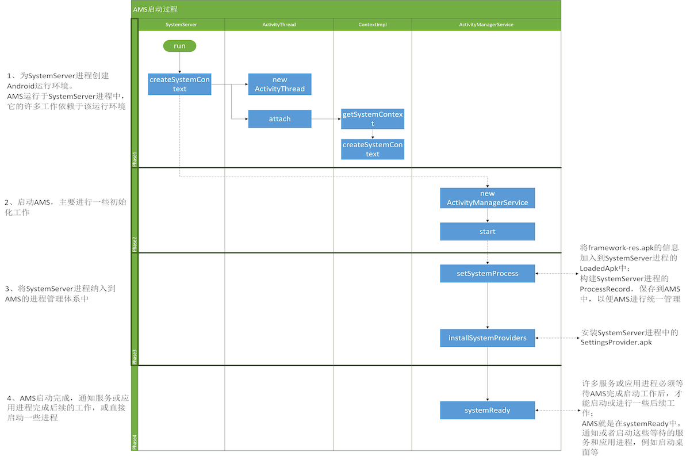

二、AMS与进程启动

在Zygote的Java框架层中，会创建一个Server端的Socket，这个Socket用来等待AMS来请求Zygote来创建新的应用程序进程。要启动一个应用程序，首先要保证这个应用程序所需要的应用程序进程已经被启动。AMS在启动应用程序时会检查这个应用程序需要的应用程序进程是否存在，不存在就会请求Zygote进程将需要的应用程序进程启动。Service的启动过程中会调用ActiveServices的bringUpServiceLocked方法，如下所示。

frameworks/base/services/core/java/com/android/server/am/ActiveServices.java

```
private String bringUpServiceLocked(ServiceRecord r, int intentFlags, boolean execInFg,
            boolean whileRestarting, boolean permissionsReviewRequired)
            throws TransactionTooLargeException {
  ...
  final String procName = r.processName;//1
  ProcessRecord app;
  if (!isolated) {
            app = mAm.getProcessRecordLocked(procName, r.appInfo.uid, false);//2
            if (DEBUG_MU) Slog.v(TAG_MU, "bringUpServiceLocked: appInfo.uid=" + r.appInfo.uid
                        + " app=" + app);
            if (app != null && app.thread != null) {//3
                try {
                    app.addPackage(r.appInfo.packageName, r.appInfo.versionCode,
                    mAm.mProcessStats);
                    realStartServiceLocked(r, app, execInFg);//4
                    return null;
                } catch (TransactionTooLargeException e) {
              ...
            }
        } else {
            app = r.isolatedProc;
        }
 if (app == null && !permissionsReviewRequired) {//5
            if ((app=mAm.startProcessLocked(procName, r.appInfo, true, intentFlags,
                    "service", r.name, false, isolated, false)) == null) {//6
              ...
            }
            if (isolated) {
                r.isolatedProc = app;
            }
        }
 ...     
}
```

在注释1处得到ServiceRecord的processName的值赋值给procName ，其中ServiceRecord用来描述Service的android:process属性。注释2处将procName和Service的uid传入到AMS的getProcessRecordLocked方法中，来查询是否存在一个与Service对应的ProcessRecord类型的对象app，ProcessRecord主要用来记录运行的应用程序进程的信息。注释5处判断Service对应的app为null则说明用来运行Service的应用程序进程不存在，则调用注释6处的AMS的startProcessLocked方法来创建对应的应用程序进程。

## AIDL

一、概要

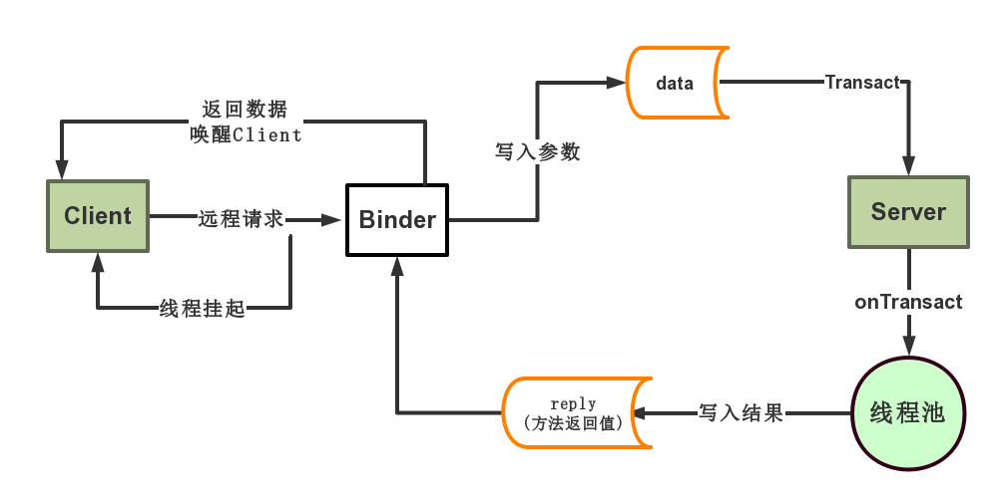

先用上图整体描述这个AIDL从客户端(Client)发起请求至服务端(Server)相应的工作流程，我们可以看出整体的核心就是Binder

二、解析

1、asInterface

> 用于将服务端的Binder对象转换成客户端所需的AIDL接口类型的对象，这种转换过程是区分进程的【如果客户端和服务端位于同一进程，那么此方法返回的就是服务端的Stub对象本身，否则返回的是系统封装后的Stub.proxy对象】

```
private ServiceConnection connection = new ServiceConnection() {
    @Override
    public void onServiceConnected(ComponentName name, IBinder service) {

        IDemandManager demandManager = IDemandManager.Stub.asInterface(service);
    }
};
```

在ServiceConnection绑定服务的方法里，我们通过IDemandManager.Stub.asInterface(service)方法获得IDemandManager对象，我们跟着asInterface步伐看看里面有什么名堂。
PS : onServiceConnected方法的(IBinder)service参数在ActivityThread创建，他们之间还会扯出ActivityManagerService，ManagerService等

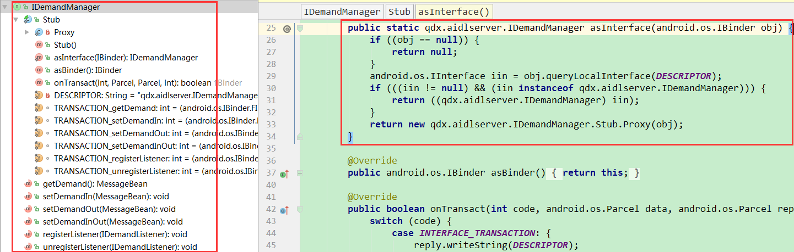

从上图的类结构图中我们可以看出，这个IDemandManager.aidl文件通过编译成为一个接口类，而这个类最核心的成员是Stub类和Stub的内部代理类Proxy。

顺着asInterface方法，结合上面对该方法的描述，可以看出通过DESCRIPTOR标识判断
如果是同一进程，那么就返回Stub对象本身(obj.queryLocalInterface(DESCRIPTOR))，否则如果是跨进程则返回Stub的代理内部类Proxy。

也就是说这个asInterface方法返回的是一个远程接口具备的能力（有什么方法可以调用），在我们项目里，asInterface的能力就是get/setDemand和注册/解绑监听接口。

2、asBinder

紧接着asInterface，我们看到一个简洁的方法asBinder

> 顾名思义，asBinder用于返回当前Binder对象。

```
//Stub
@Override
public android.os.IBinder asBinder() {
    return this;
}
```

```
//Proxy
private android.os.IBinder mRemote;

@Override
public android.os.IBinder asBinder() {
    return mRemote;
}
```

根据代码我们可以追溯到，proxy的这个mRemote就是绑定服务(bindService)时候
由IDemandManager.Stub.asInterface(binder);传入的IBinder对象。

这个Binder对象具有跨进程能力，在Stub类里面（也就是本进程）直接就是Binder本地对象，在Proxy类里面返回的是远程代理对象(Binder代理对象)。[所以跨进程的谜团，会随着对Binder的分析和研究，逐渐变得清晰起来。]

因为我们这个编译生成的IDemandManager接口继承了android.os.IInterface接口,所以我们先分析IInterface接口。

```
public interface IDemandManager extends android.os.IInterface
```

3、IInterface

而这个IInterface接口就只声明了一个方法，但是Stub和Proxy都分别间接的实现了该接口。

```
public interface IInterface{
    /**
     * Retrieve the Binder object associated with this interface.
     * You must use this instead of a plain cast, so that proxy objects
     * can return the correct result.
     */
    public IBinder asBinder();
}
```

> Binder接口的基类。 定义新接口时，必须实现IInterface接口。

> 检索与此界面关联的Binder对象。必须使用它而不是一个简单的转换,这样代理对象才可以返回正确的结果。

从上面的系统注释中我们可以理解出：

* 要声明(或者是手动diy创建)AIDL性质的接口，就要继承IInterface
* 代表远程server对象具有的能力，具体是由Binder表达出这个能力。

4、DESCRIPTOR

```
private static final java.lang.String DESCRIPTOR = "qdx.aidlserver.IDemandManager";//系统生成的
```

Binder的唯一标识，一般用当前Binder的类名表示。

5、onTransact(服务端接收)

我们发现IDemandManager接口，实际上并没有太多复杂的方法，看完了asInterface和asBinder方法，我们再来分析onTransact方法。

> onTransact方法运行在服务端中的Binder线程池中
> 客户端发起跨进程请求时，远程请求会通过系统底层封装后交给此方法来处理。
> 如果此方法返回false,那么客户端的请求就会失败。

* code : 确定客户端请求的目标方法是什么。（项目中的getDemand或者是setDemandIn方法）
* data : 如果目标方法有参数的话，就从data取出目标方法所需的参数。
* reply : 当目标方法执行完毕后，如果目标方法有返回值，就向reply中写入返回值。
* flag : Additional operation flags. Either 0 for a normal RPC, or FLAG_ONEWAY for a one-way RPC.（暂时还没有发现用处，先标记上英文注释）


也就是说，这个onTransact方法就是服务端处理的核心，接收到客户端的请求，并且通过客户端携带的参数，执行完服务端的方法，返回结果。下面通过系统生成的代码，我们简要的分析一下onTransact方法里我们项目写的setDemandIn和setDemandOut方法。

```
case TRANSACTION_setDemandIn: {
    data.enforceInterface(DESCRIPTOR);
    qdx.aidlserver.MessageBean _arg0;
    if ((0 != data.readInt())) {
        _arg0 = qdx.aidlserver.MessageBean.CREATOR.createFromParcel(data);
    } else {
        _arg0 = null;
    }
    this.setDemandIn(_arg0);
    reply.writeNoException();
    return true;
}
case TRANSACTION_setDemandOut: {
    data.enforceInterface(DESCRIPTOR);
    qdx.aidlserver.MessageBean _arg0;
    _arg0 = new qdx.aidlserver.MessageBean();
    this.setDemandOut(_arg0);
    reply.writeNoException();
    if ((_arg0 != null)) {
        reply.writeInt(1);
        _arg0.writeToParcel(reply,android.os.Parcelable.PARCELABLE_WRITE_RETURN_VALUE);
    } else {
        reply.writeInt(0);
    }
    return true;
}

```

此段代码并没有多少玄机，就是负责数据的读写，以及结果的返回。
但是有一个知识点可以在此验证，就是定向tag的作用，上面的方法定向tag分别是in和out，定向tag的作用就是跨进程中数据的流向，setDemandIn方法中我们可以看到我们读取了客户端传递过来的数据参数data，即客户端->服务端。out方法可以同理自行分析。

5、transact(客户端调用)

分析完了Stub，就剩下Stub的内部代理类Proxy
惊奇的发现Proxy类主要是用来方法调用，也就是用来客户端的跨进程调用。

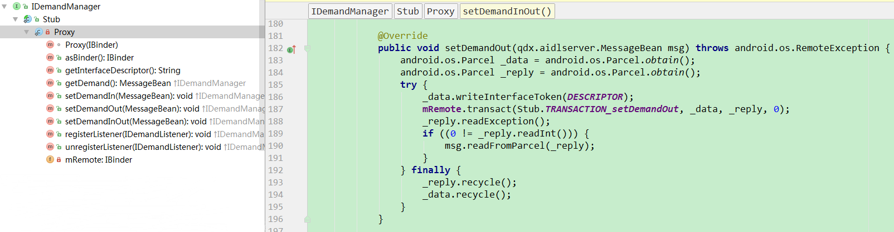

> transact方法运行在客户端，首先它创建该方法所需要的输入型Parcel对象_data、输出型Parcel对象_reply;
> 接着调用绑定服务传来的IBinder对象的transact方法来发起远程过程调用（RPC）请求，同时当前线程挂起;
> 然后服务端的onTransact方法会被调用，直到RPC过程返回后，当前线程继续执行，并从_reply中取出RPC过程的返回结果，也就是返回_reply中的数据。

我们看到获得Parcel的方法为Parcel.obtain()，按照套路这个应该就是从Parcel池中获取该对象，减少创建对象的开支，跟进方法我们可以看得的确是创建了一个POOL_SIZE为6的池用来获取Parcel对象。
所以在跨进程通讯中Parcel是通讯的基本单元，传递载体。

而这个transact方法是一个本地方法，在native层中实现，功力不足，点到为止。
分析到了这里，感觉顿悟了许多，再一次引用开头概述的图片来看大概，整体的思路便浮在脑海中。


三、总结

通过对AIDL的分析，我们发现原来这一切围绕着Binder有序的展开
AIDL通过Stub类用来接收并处理数据，Proxy代理类用来发送数据，而这两个类也只是通过对Binder的处理和调用。

所以所谓的服务端和客户端，我们拆开看之后发现原来竟是不同类的处理

Stub充当服务端角色，持有Binder实体（本地对象）。

* 获取客户端传过来的数据，根据方法 ID 执行相应操作。
* 将传过来的数据取出来，调用本地写好的对应方法。
* 将需要回传的数据写入 reply 流，传回客户端。


Proxy代理类充当客户端角色，持有Binder引用（句柄）。

* 生成 _data 和 _reply 数据流，并向 _data 中存入客户端的数据。
* 通过 transact() 方法将它们传递给服务端，并请求服务端调用指定方法。
* 接收 _reply 数据流，并从中取出服务端传回来的数据。

而且所谓的服务端和客户端都是相对而言的，服务端不仅可以接收和处理消息，而且可以定时往客户端发送数据，与此同时服务端使用Proxy类跨进程调用，相当于充当了"Client"。
并且有一点要理解是，跨进程通讯的时候，传递的数据对象并不是从进程A原原本本的发给进程B。

## Binder应用层总结与分析

一、为何选择Binder

Linux已经拥有管道，system V IPC，socket等IPC手段，却还要倚赖Binder来实现进程间通信，说明Binder具有无可比拟的优势。

1、传输性能好

Binder很重要的的优点之一就是，复杂数据类型传递可以复用内存。

* socket：是一个通用接口，导致其传输效率低，开销大，主要用在跨网络的进程间通信和本机上进程间的低速通信
* 管道和消息队列：因为采用存储转发方式，所以至少需要拷贝2次数据，效率低；
* 共享内存：虽然在传输时没有拷贝数据，但其控制机制复杂。

| IPC | 数据拷贝次数 |
| :--:| :--: |
| 共享内存 | 0 |
| Binder | 1 |
| Socket/管道/消息队列 | 2 |

2、安全性高

* 传统IPC没有任何安全措施，完全依赖上层协议来确保。首先传统IPC的接收方无法获得对方进程可靠的UID/PID（用户ID/进程ID），从而无法鉴别对方身份。
* Android为每个安装好的应用程序分配了自己的UID，故进程的UID是鉴别进程身份的重要标志。可靠的身份标记只有由IPC机制本身在内核中添加。
* 传统IPC访问接入点是开放的，无法建立私有通道。Binder可以使用匿名 Binder建立私密通道，别的进程就无法通过穷举或猜测等任何方式获得该Binder的引用，向该Binder发送请求。

二、Binder总体架构

在Android系统中，这个运行在内核空间的，负责各个用户进程通过Binder通信的内核模块叫做Binder驱动，Binder驱动虽然默默无闻，却是通信的核心。尽管名叫‘驱动’，实际上和硬件设备没有任何关系，只是实现方式和设备驱动程序是一样的。

> 面向对象思想的引入将进程间通信转化为通过对某个Binder对象的引用调用该对象的方法，而其独特之处在于Binder对象是一个可以跨进程引用的对象，它的实体位于一个进程中，而它的引用却遍布于系统的各个进程之中。最诱人的是，这个引用和java里引用一样既可以是强类型，也可以是弱类型，而且可以从一个进程传给其它进程，让大家都能访问同一Server，就象将一个对象或引用赋值给另一个引用一样。Binder模糊了进程边界，淡化了进程间通信过程，整个系统仿佛运行于同一个面向对象的程序之中。形形色色的Binder对象以及星罗棋布的引用仿佛粘接各个应用程序的胶水，这也是Binder在英文里的原意。

首先我们要理解我们说的Binder分为Binder对象和Binder驱动，即Binder驱动就是主要的内核模块，而这个Binder对象是通讯的载体，可以自由的通过Binder驱动自由穿梭任意进程。所以客户端或者服务器就可以把数据放入Binder对象里，然后进行调用和通讯。类似于胞吞胞吐吧。

Binder框架定义了四个角色：Server，Client，ServiceManager（以后简称SMgr）以及Binder驱动。其中Server，Client，SMgr运行于用户空间，驱动运行于内核空间。这四个角色的关系和互联网类似：Server是服务器，Client是客户终端，SMgr是域名服务器（DNS），驱动是路由器。

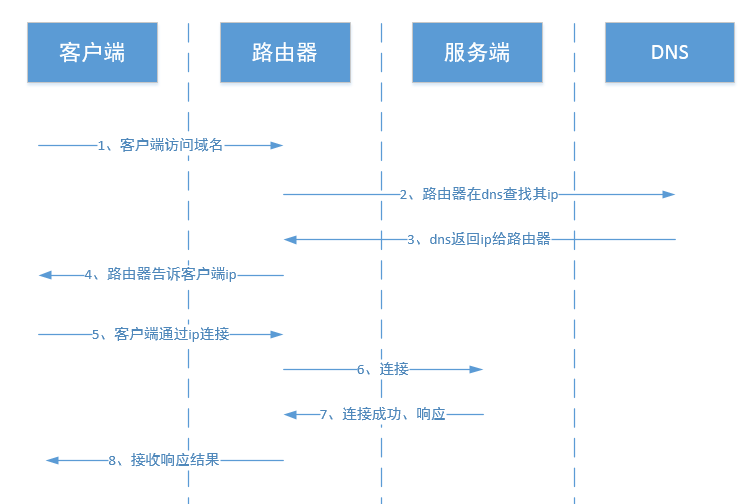

> 和DNS类似，SMgr的作用是将字符形式的Binder名字转化成Client中对该Binder的引用，使得Client能够通过Binder名字获得对Server中Binder实体的引用。注册了名字的Binder叫实名Binder，就象每个网站除了有IP地址外还有自己的网址。Server创建了Binder实体，为其取一个字符形式，可读易记的名字，将这个Binder连同名字以数据包的形式通过Binder驱动发送给SMgr，通知SMgr注册一个名叫张三的Binder，它位于某个Server中。驱动为这个穿过进程边界的Binder创建位于内核中的实体节点以及SMgr对实体的引用，将名字及新建的引用打包传递给SMgr。SMgr收数据包后，从中取出名字和引用填入一张查找表中。Server向SMgr注册了Binder引用及其名字后，Client就可以通过名字获得该Binder的引用了。


三、Binder原理

Binder通信采用C/S架构，从组件视角来说，包含Client、Server、ServiceManager以及binder驱动，其中ServiceManager用于管理系统中的各种服务。架构图如下所示：


> 可以看出无论是注册服务和获取服务的过程都需要ServiceManager，需要注意的是此处的Service Manager是指Native层的ServiceManager（C++），并非指framework层的ServiceManager(Java)。ServiceManager是整个Binder通信机制的大管家，是Android进程间通信机制Binder的守护进程，要掌握Binder机制，首先需要了解系统是如何首次启动Service Manager。当Service Manager启动之后，Client端和Server端通信时都需要先获取Service Manager接口，才能开始通信服务。

> 图中Client/Server/ServiceManage之间的相互通信都是基于Binder机制。既然基于Binder机制通信，那么同样也是C/S架构，则图中的3大步骤都有相应的Client端与Server端。

> 注册服务(addService)：Server进程要先注册Service到ServiceManager。该过程：Server是客户端，ServiceManager是服务端。
获取服务(getService)：Client进程使用某个Service前，须先向ServiceManager中获取相应的Service。该过程：Client是客户端，ServiceManager是服务端。
使用服务：Client根据得到的Service信息建立与Service所在的Server进程通信的通路，然后就可以直接与Service交互。该过程：client是客户端，server是服务端。
图中的Client,Server,Service Manager之间交互都是虚线表示，是由于它们彼此之间不是直接交互的，而是都通过与Binder驱动进行交互的，从而实现IPC通信方式。其中Binder驱动位于内核空间，Client,Server,Service Manager位于用户空间。Binder驱动和Service Manager可以看做是Android平台的基础架构，而Client和Server是Android的应用层，开发人员只需自定义实现client、Server端，借助Android的基本平台架构便可以直接进行IPC通信。

四、Binder通信模型

看到这里想必对Binder的一个整体构架有了大致的了解，另外通过一个栗子来描述一下整体过程。

> 回想一下日常生活中我们通信的过程：假设A和B要进行通信，通信的媒介是打电话（A是Client，B是Server）；A要给B打电话，必须知道B的号码，这个号码怎么获取呢？通信录.

> 先查阅通信录，拿到B的号码；才能进行通信；否则，怎么知道应该拨什么号码？回想一下古老的电话机，如果A要给B打电话，必须先连接通话中心，说明给我接通B的电话；这时候通话中心帮他呼叫B；连接建立，就完成了通信。

> 另外，光有电话和通信录是不可能完成通信的，没有基站支持；信息根本无法传达。

> 我们看到，一次电话通信的过程除了通信的双方还有两个隐藏角色：通信录和基站。Binder通信机制也是一样：两个运行在用户空间的进程要完成通信，必须借助内核的帮助，这个运行在内核里面的程序叫做Binder驱动，它的功能类似于基站；通信录呢，就是一个叫做ServiceManager的东西（简称SMgr）

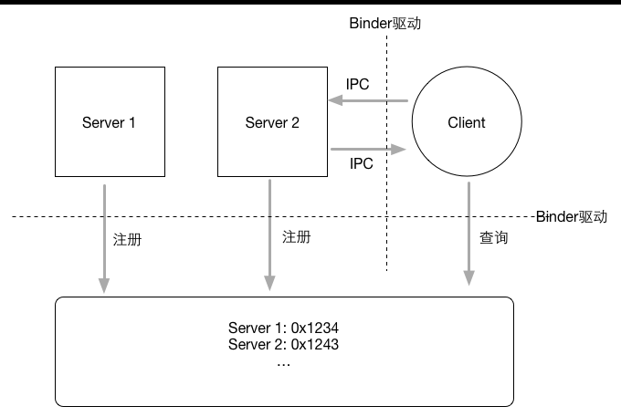

整个通信步骤如下：

1. SM建立(建立通信录)；首先有一个进程向驱动提出申请为SM；驱动同意之后，SM进程负责管理Service（注意这里是Service而不是Server，因为如果通信过程反过来的话，那么原来的客户端Client也会成为服务端Server）不过这时候通信录还是空的，一个号码都没有。
2. 各个Server向SM注册(完善通信录)；每个Server端进程启动之后，向SM报告，我是zhangsan, 要找我请返回0x1234(这个地址没有实际意义，类比)；其他Server进程依次如此；这样SM就建立了一张表，对应着各个Server的名字和地址；就好比B与A见面了，说存个我的号码吧，以后找我拨打10086；
3. Client想要与Server通信，首先询问SM；请告诉我如何联系zhangsan，SM收到后给他一个号码0x1234；Client收到之后，开心滴用这个号码拨通了Server的电话，于是就开始通信了。

> Server进程里面的Binder对象指的是Binder本地对象，Client里面的对象指的是Binder代理对象；在Binder对象进行跨进程传递的时候，Binder驱动会自动完成这两种类型的转换；因此Binder驱动必然保存了每一个跨越进程的Binder对象的相关信息；在驱动中，Binder本地对象的代表是一个叫做binder_node的数据结构，Binder代理对象是用binder_ref代表的；有的地方把Binder本地对象直接称作Binder实体，把Binder代理对象直接称作Binder引用（句柄）

1、ServiceManager 与实名Binder

> SMgr是一个进程，Server是另一个进程，Server向SMgr注册Binder必然会涉及进程间通信。当前实现的是进程间通信却又要用到进程间通信，这就好象蛋可以孵出鸡前提却是要找只鸡来孵蛋。Binder的实现比较巧妙：预先创造一只鸡来孵蛋：SMgr和其它进程同样采用Binder通信，SMgr是Server端，有自己的Binder对象（实体），其它进程都是Client，需要通过这个Binder的引用来实现Binder的注册，查询和获取。SMgr提供的Binder比较特殊，它没有名字也不需要注册，当一个进程使用BINDER_SET_CONTEXT_MGR命令将自己注册成SMgr时Binder驱动会自动为它创建Binder实体（这就是那只预先造好的鸡）。其次这个Binder的引用在所有Client中都固定为0而无须通过其它手段获得。也就是说，一个Server若要向SMgr注册自己Binder就必需通过0这个引用号和SMgr的Binder通信。类比网络通信，0号引用就好比域名服务器的地址，你必须预先手工或动态配置好。要注意这里说的Client是相对SMgr而言的，一个应用程序可能是个提供服务的Server，但对SMgr来说它仍然是个Client。

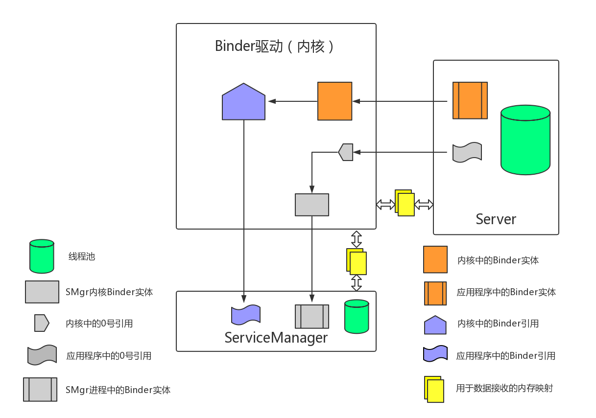

* 首先，Server在自己的进程中向Binder驱动申请创建一个Server的Binder的实体。
* Binder驱动为这个Server创建位于内核中的Binder实体节点以及Binder的引用。(在Binder驱动中创建一块内存)
* 然后Server通过0这个引用号和SMgr的Binder通信将名字和新建的引用打包传递给SM（实体没有传给SM），通知SM注册一个名叫XXX的Server。
* SM收到数据包后，从中取出Server名字和引用，填入一张查找表中。

Server初始化的时候，SMgr做了一下操作：

* 为binder分配128k的内存
* 通知binder驱动，使自身成为binder驱动的“DNS”
* 维护一个监听Server的死循环，并且维护持有所有Server句柄的svclist
* 添加Server的时候，进行权限，内存（充足）进行判断，如果没有添加过则将Server添加至svclist。

2、Client 获得实名Binder的引用

Server向SMgr注册了Binder引用及其名字后，Client就可以通过名字获得该Binder的引用了。Client也利用保留的0号引用向SMgr请求访问某个Binder：我申请获得名字叫张三的Binder的引用。SMgr收到这个连接请求，从请求数据包里获得Binder的名字，在查找表里找到该名字对应的条目，从条目中取出Binder的引用，将该引用作为回复发送给发起请求的Client。从面向对象的角度，这个Binder对象现在有了两个引用：一个位于SMgr中，一个位于发起请求的Client中。如果接下来有更多的Client请求该Binder，系统中就会有更多的引用指向该Binder，就象java里一个对象存在多个引用一样。而且类似的这些指向Binder的引用是强类型，从而确保只要有引用Binder实体就不会被释放掉。通过以上过程可以看出，SMgr象个火车票代售点，收集了所有火车的车票，可以通过它购买到乘坐各趟火车的票-得到某个Binder的引用。


3、Client 与 Server通讯

Client向SM发送申请服务Server的请求，那么SM就可以在查找表中找到该Service的Binder引用，并把Binder引用(BpBinder)返回给Client，此时Client便可以通过这个引用向Server（间接）发起调用，Binder引用将参数包装然后交给驱动并获取Server的调用结果。

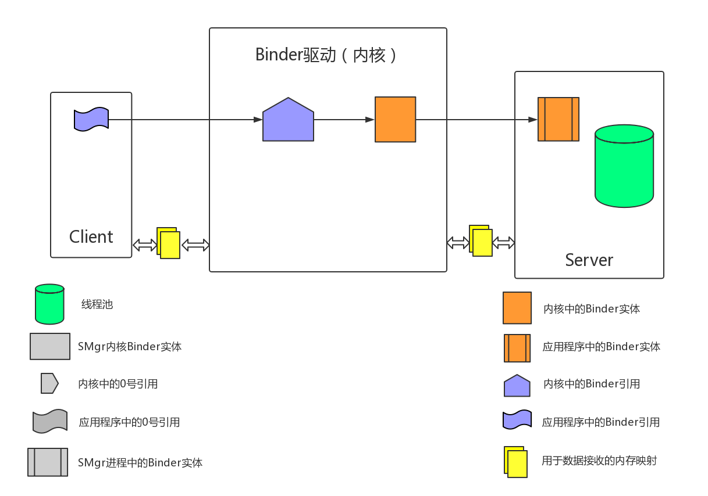

4、Binder的线程管理

每个Binder的Server进程会创建很多线程来处理Binder请求，可以简单的理解为创建了一个Binder的线程池吧（虽然实际上并不完全是这样简单的线程管理方式），而真正管理这些线程并不是由这个Server端来管理的，而是由Binder驱动进行管理的。

一个进程的Binder线程数默认最大是16，超过的请求会被阻塞等待空闲的Binder线程。理解这一点的话，你做进程间通信时处理并发问题就会有一个底，比如使用ContentProvider时（又一个使用Binder机制的组件），你就很清楚它的CRUD（创建、检索、更新和删除）方法只能同时有16个线程在跑。(应用与ContentProvider为不同进程时)


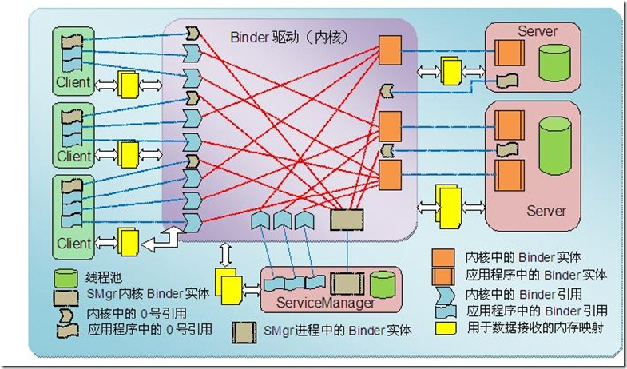

## Activity启动流程

一、根Activity启动过程

1.概述

Activity的启动过程分为两种，一种是根Activity的启动过程，另一种是普通Activity的启动过程，根Activity指的是应用程序启动的第一个Activity，因此根Activity的启动过程一般情况下也可以理解为应用程序的启动过程。普通Activity指的是除了应用程序启动的第一个Activity之外的其他的Activity。这里介绍的是根Activity的启动过程，它和普通Activity的启动过程是有重叠部分的，只不过根Activity的启动过程一般情况下指的就是应用程序的启动过程，更具有指导性意义。

根Activity的启动过程比较复杂，因此这里分为三个部分来讲，分别是Launcher请求AMS过程、 AMS到ApplicationThread的调用过程和ActivityThread启动Activity。

2.Launcher请求AMS过程

Launcher启动后会将已安装应用程序的快捷图标显示到桌面上，这些应用程序的快捷图标就是启动根Activity的入口，当我们点击某个应用程序的快捷图标时就会通过Launcher请求AMS来启动该应用程序。时序图如下图所示。


当我们点击应用程序的快捷图标时，就会调用Launcher的startActivitySafely方法，如下所示。

```
// packages/apps/Launcher3/src/com/android/launcher3/Launcher.java

public boolean startActivitySafely(View v, Intent intent, ItemInfo item) {
 ...
 intent.addFlags(Intent.FLAG_ACTIVITY_NEW_TASK);//1
 if (v != null) {
     intent.setSourceBounds(getViewBounds(v));
 }
 try {
     if (Utilities.ATLEAST_MARSHMALLOW
             && (item instanceof ShortcutInfo)
             && (item.itemType == Favorites.ITEM_TYPE_SHORTCUT
              || item.itemType == Favorites.ITEM_TYPE_DEEP_SHORTCUT)
             && !((ShortcutInfo) item).isPromise()) {
         startShortcutIntentSafely(intent, optsBundle, item);
     } else if (user == null || user.equals(Process.myUserHandle())) {
         startActivity(intent, optsBundle);//2
     } else {
         LauncherAppsCompat.getInstance(this).startActivityForProfile(
                 intent.getComponent(), user, intent.getSourceBounds(), optsBundle);
     }
     return true;
 } catch (ActivityNotFoundException|SecurityException e) {
     Toast.makeText(this, R.string.activity_not_found, Toast.LENGTH_SHORT).show();
     Log.e(TAG, "Unable to launch. tag=" + item + " intent=" + intent, e);
 }
 return false;
}
```

* 注释1：设置Flag为Intent.FLAG_ACTIVITY_NEW_TASK，这样根Activity会在新的任务栈中启动。
* 注释2：调用startActivity方法，这个startActivity方法的实现在Activity中。

```
// frameworks/base/core/java/android/app/Activity.java

public void startActivity(Intent intent, @Nullable Bundle options) {
    if (options != null) {
        startActivityForResult(intent, -1, options);
    } else {
        // 通过此调用来实现与可能已覆盖该方法的应用程序的兼容性。
        startActivityForResult(intent, -1);
    }
}
```

startActivity方法中会调用startActivityForResult方法，它的第二个参数为-1，表示Launcher不需要知道Activity启动的结果，startActivityForResult方法的代码如下所示。

```
// frameworks/base/core/java/android/app/Activity.java

public void startActivityForResult(@RequiresPermission Intent intent, int requestCode,
           @Nullable Bundle options) {
   if (mParent == null) {//1
       options = transferSpringboardActivityOptions(options);
       Instrumentation.ActivityResult ar =
           mInstrumentation.execStartActivity(
               this, mMainThread.getApplicationThread(), mToken, this,
               intent, requestCode, options);
      ...
   } else {
     ...
   }
}
```

* 注释1：mParent是Activity类型的，表示当前Activity的父类。因为目前根Activity还没有创建出来，因此，mParent == null成立。接着调用Instrumentation的execStartActivity方法，Instrumentation主要用来监控应用程序和系统的交互，execStartActivity方法的代码如下所示。

```
// frameworks/base/core/java/android/app/Instrumentation.java

public ActivityResult execStartActivity(
          Context who, IBinder contextThread, IBinder token, Activity target,
          Intent intent, int requestCode, Bundle options) {
  ...
  try {
      intent.migrateExtraStreamToClipData();
      intent.prepareToLeaveProcess(who);
      int result = ActivityManager.getService()
          .startActivity(whoThread, who.getBasePackageName(), intent,
                  intent.resolveTypeIfNeeded(who.getContentResolver()),
                  token, target != null ? target.mEmbeddedID : null,
                  requestCode, 0, null, options);
      checkStartActivityResult(result, intent);
  } catch (RemoteException e) {
      throw new RuntimeException("Failure from system", e);
  }
  return null;
}
```

首先会调用ActivityManager的getService方法来获取AMS的代理对象，接着调用它的startActivity方法。这里与Android 7.0代码的逻辑有些不同，Android 7.0是通过ActivityManagerNative的getDefault来获取AMS的代理对象，8.0这个逻辑封装到了ActivityManager中而不是ActivityManagerNative中。首先我们先来查看ActivityManager的getService方法做了什么：

```
// frameworks/base/core/java/android/app/ActivityManager.java

public static IActivityManager getService() {
        return IActivityManagerSingleton.get();
}

private static final Singleton<IActivityManager> IActivityManagerSingleton =
        new Singleton<IActivityManager>() {
            @Override
            protected IActivityManager create() {
                final IBinder b = ServiceManager.getService(Context.ACTIVITY_SERVICE);//1
                final IActivityManager am = IActivityManager.Stub.asInterface(b);//2
                return am;
            }
        };
```

getService方法调用了IActivityManagerSingleton的get方法，我们接着往下看，IActivityManagerSingleton 是一个Singleton类。

* 注释1：得到名为”activity”的Service引用，也就是IBinder类型的AMS的引用。
* 注释2：将它转换成IActivityManager类型的对象，这段代码采用的是AIDL，IActivityManager.java类是由AIDL工具在编译时自动生成的，IActivityManager.aidl的文件路径为：frameworks/base/core/java/android/app/IActivityManager.aidl 。要实现进程间通信，服务端也就是AMS只需要继承IActivityManager.Stub类并实现相应的方法就可以了。
注意Android 8.0 之前并没有采用AIDL，而是采用了类似AIDL的形式，用AMS的代理对象ActivityManagerProxy来与AMS进行进程间通信，Android 8.0 去除了ActivityManagerNative的内部类ActivityManagerProxy，代替它的则是IActivityManager，它是AMS在本地的代理。

3.AMS到ApplicationThread的调用过程

Launcher请求AMS后，代码逻辑已经走到了AMS中，接着是AMS到ApplicationThread的调用流程，时序图如图4-2所示。

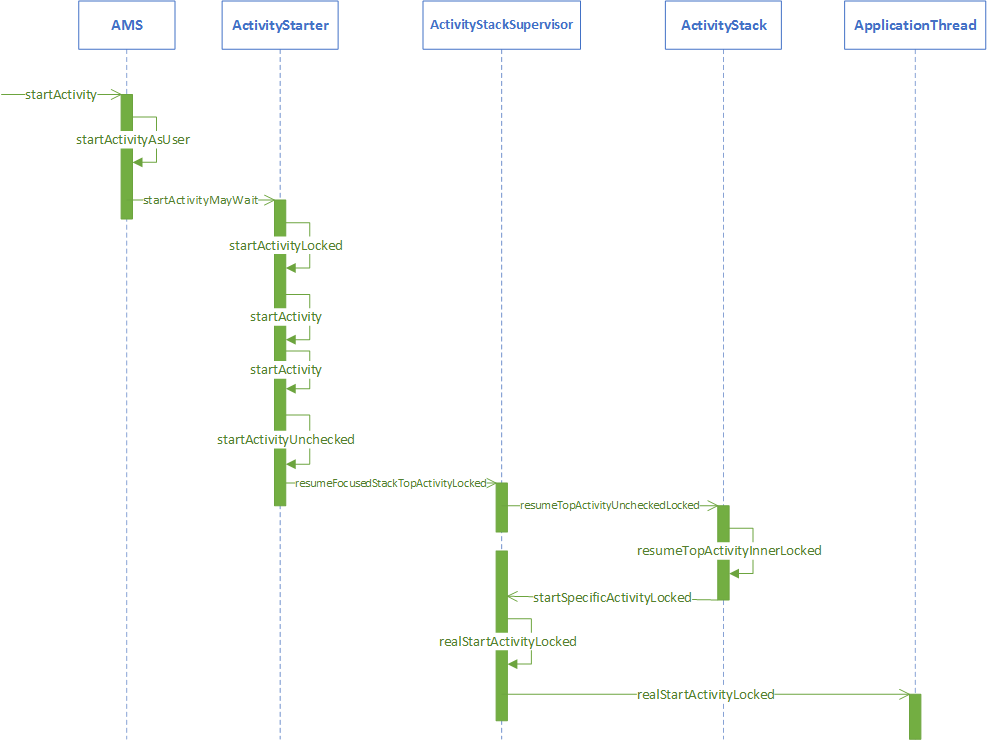

AMS的startActivity方法如下所示。

```
// frameworks/base/services/core/java/com/android/server/am/ActivityManagerService.java

@Override
public final int startActivity(IApplicationThread caller, String callingPackage,
        Intent intent, String resolvedType, IBinder resultTo, String resultWho, int requestCode,
        int startFlags, ProfilerInfo profilerInfo, Bundle bOptions) {
    return startActivityAsUser(caller, callingPackage, intent, resolvedType, resultTo,
            resultWho, requestCode, startFlags, profilerInfo, bOptions,
            UserHandle.getCallingUserId());
}
```

AMS的startActivity方法中return了startActivityAsUser方法，可以发现startActivityAsUser方法比startActivity方法多了一个参数UserHandle.getCallingUserId()，这个方法会获得调用者的UserId，AMS会根据这个UserId来确定调用者的权限。

```
// frameworks/base/services/core/java/com/android/server/am/ActivityManagerService.java

@Override
public final int startActivityAsUser(IApplicationThread caller, String callingPackage,
        Intent intent, String resolvedType, IBinder resultTo, String resultWho, int requestCode,
        int startFlags, ProfilerInfo profilerInfo, Bundle bOptions, int userId) {
    //判断调用者进程是否被隔离    
    enforceNotIsolatedCaller("startActivity");//1
    //检查调用者权限
    userId = mUserController.handleIncomingUser(Binder.getCallingPid(), Binder.getCallingUid(),
            userId, false, ALLOW_FULL_ONLY, "startActivity", null);//2
    return mActivityStarter.startActivityMayWait(caller, -1, callingPackage, intent,
            resolvedType, null, null, resultTo, resultWho, requestCode, startFlags,
            profilerInfo, null, null, bOptions, false, userId, null, null,
            "startActivityAsUser");
}
```

* 注释1：处判断调用者进程是否被隔离，如果被隔离则抛出SecurityException异常
* 注释2：用于检查调用者是否有权限，如果没有权限也会抛出SecurityException异常。

最后调用了ActivityStarter的startActivityLocked方法，startActivityLocked方法的参数要比startActivityAsUser多几个，需要注意的是倒数第二个参数类型为TaskRecord，代表启动的Activity所在的栈。最后一个参数”startActivityAsUser”代表启动的理由。 代码如下所示。

```
// frameworks/base/services/core/java/com/android/server/am/ActivityStarter.java

final int startActivityMayWait(IApplicationThread caller, int callingUid,
            String callingPackage, Intent intent, String resolvedType,
            IVoiceInteractionSession voiceSession, IVoiceInteractor voiceInteractor,
            IBinder resultTo, String resultWho, int requestCode, int startFlags,
            ProfilerInfo profilerInfo, WaitResult outResult,
            Configuration globalConfig, Bundle bOptions, boolean ignoreTargetSecurity, int userId,
            IActivityContainer iContainer, TaskRecord inTask, String reason) {
         ...
        int res = startActivityLocked(caller, intent, ephemeralIntent, resolvedType,
                    aInfo, rInfo, voiceSession, voiceInteractor,
                    resultTo, resultWho, requestCode, callingPid,
                    callingUid, callingPackage, realCallingPid, realCallingUid, startFlags,
                    options, ignoreTargetSecurity, componentSpecified, outRecord, container,
                    inTask, reason);
         ...
         return res;
     }
 }
```

ActivityStarter是Android 7.0新加入的类，它是加载Activity的控制类，会收集所有的逻辑来决定如何将Intent和Flags转换为Activity，并将Activity和Task以及Stack相关联。ActivityStarter的startActivityMayWait方法调用了startActivityLocked方法，如下所示。

```
// frameworks/base/services/core/java/com/android/server/am/ActivityStarter.java

int startActivityLocked(IApplicationThread caller, Intent intent, Intent ephemeralIntent,
         String resolvedType, ActivityInfo aInfo, ResolveInfo rInfo,
         IVoiceInteractionSession voiceSession, IVoiceInteractor voiceInteractor,
         IBinder resultTo, String resultWho, int requestCode, int callingPid, int callingUid,
         String callingPackage, int realCallingPid, int realCallingUid, int startFlags,
         ActivityOptions options, boolean ignoreTargetSecurity, boolean componentSpecified,
         ActivityRecord[] outActivity, ActivityStackSupervisor.ActivityContainer container,
         TaskRecord inTask, String reason) {
     //判断启动的理由不为空
     if (TextUtils.isEmpty(reason)) {//1
         throw new IllegalArgumentException("Need to specify a reason.");
     }
     mLastStartReason = reason;
     mLastStartActivityTimeMs = System.currentTimeMillis();
     mLastStartActivityRecord[0] = null;
     mLastStartActivityResult = startActivity(caller, intent, ephemeralIntent, resolvedType,
             aInfo, rInfo, voiceSession, voiceInteractor, resultTo, resultWho, requestCode,
             callingPid, callingUid, callingPackage, realCallingPid, realCallingUid, startFlags,
             options, ignoreTargetSecurity, componentSpecified, mLastStartActivityRecord,
             container, inTask);
     if (outActivity != null) {
         outActivity[0] = mLastStartActivityRecord[0];
     }
     return mLastStartActivityResult;
 }
```

注释1:判断启动的理由不为空，如果为空则抛出IllegalArgumentException异常。紧接着又调用了startActivity方法，如下所示。

```
// frameworks/base/services/core/java/com/android/server/am/ActivityStarter.java

private int startActivity(IApplicationThread caller, Intent intent, Intent ephemeralIntent,
          String resolvedType, ActivityInfo aInfo, ResolveInfo rInfo,
          IVoiceInteractionSession voiceSession, IVoiceInteractor voiceInteractor,
          IBinder resultTo, String resultWho, int requestCode, int callingPid, int callingUid,
          String callingPackage, int realCallingPid, int realCallingUid, int startFlags,
          ActivityOptions options, boolean ignoreTargetSecurity, boolean componentSpecified,
          ActivityRecord[] outActivity, ActivityStackSupervisor.ActivityContainer container,
          TaskRecord inTask) {
  int err = ActivityManager.START_SUCCESS;
  final Bundle verificationBundle
          = options != null ? options.popAppVerificationBundle() : null;
  ProcessRecord callerApp = null;
  if (caller != null) {//1
      //获取Launcher进程
      callerApp = mService.getRecordForAppLocked(caller);//2
      if (callerApp != null) {
        //获取Launcher进程的pid和uid并赋值
          callingPid = callerApp.pid;
          callingUid = callerApp.info.uid;
      } else {
          Slog.w(TAG, "Unable to find app for caller " + caller
                  + " (pid=" + callingPid + ") when starting: "
                  + intent.toString());
          err = ActivityManager.START_PERMISSION_DENIED;
      }
  }
  ...
  //创建即将要启动的Activity的描述类ActivityRecord
  ActivityRecord r = new ActivityRecord(mService, callerApp, callingPid, callingUid,
          callingPackage, intent, resolvedType, aInfo, mService.getGlobalConfiguration(),
          resultRecord, resultWho, requestCode, componentSpecified, voiceSession != null,
          mSupervisor, container, options, sourceRecord); //2  
  if (outActivity != null) {
      outActivity[0] = r;//3
  }
  ...
  doPendingActivityLaunchesLocked(false);
  return startActivity(r, sourceRecord, voiceSession, voiceInteractor, startFlags, true,
      options, inTask, outActivity);//4
}
```

ActivityStarter的startActivity方法逻辑比较多，这里列出部分我们需要关心的代码。

* 注释1：判断IApplicationThread类型的caller是否为null，这个caller是方法调用一路传过来的，指向的是Launcher进程的ApplicationThread对象
* 注释2：调用AMS的getRecordForAppLocked方法得到的是代表Launcher进程的callerApp对象，它是ProcessRecord类型的，ProcessRecord用于描述一个应用程序进程。同样的，ActivityRecord用于描述一个Activity，用来记录一个Activity的所有信息。在注释2处创建ActivityRecord，这个ActivityRecord用于描述即将要启动的Activity
* 注释3：将创建的ActivityRecord赋值给ActivityRecord[]类型的outActivity，这个
* 注释4：outActivity会作为，startActivity方法的参数传递下去。

```
// frameworks/base/services/core/java/com/android/server/am/ActivityStarter.java

private int startActivity(final ActivityRecord r, ActivityRecord sourceRecord,
        IVoiceInteractionSession voiceSession, IVoiceInteractor voiceInteractor,
        int startFlags, boolean doResume, ActivityOptions options, TaskRecord inTask,
        ActivityRecord[] outActivity) {
    int result = START_CANCELED;
    try {
        mService.mWindowManager.deferSurfaceLayout();
        result = startActivityUnchecked(r, sourceRecord, voiceSession, voiceInteractor,
                startFlags, doResume, options, inTask, outActivity);
    }
    ...
    return result;
}
```

startActivity方法紧接着调用了startActivityUnchecked方法：

```
// frameworks/base/services/core/java/com/android/server/am/ActivityStarter.java

private int startActivityUnchecked(final ActivityRecord r, ActivityRecord sourceRecord,
            IVoiceInteractionSession voiceSession, IVoiceInteractor voiceInteractor,
            int startFlags, boolean doResume, ActivityOptions options, TaskRecord inTask,
            ActivityRecord[] outActivity) {
...
 if (mStartActivity.resultTo == null && mInTask == null && !mAddingToTask
                && (mLaunchFlags & FLAG_ACTIVITY_NEW_TASK) != 0) {//1
            newTask = true;
            //创建新的TaskRecord
            result = setTaskFromReuseOrCreateNewTask(
                    taskToAffiliate, preferredLaunchStackId, topStack);//2
        } else if (mSourceRecord != null) {
            result = setTaskFromSourceRecord();
        } else if (mInTask != null) {
            result = setTaskFromInTask();
        } else {
            setTaskToCurrentTopOrCreateNewTask();
        }
       ...
 if (mDoResume) {
            final ActivityRecord topTaskActivity =
                    mStartActivity.getTask().topRunningActivityLocked();
            if (!mTargetStack.isFocusable()
                    || (topTaskActivity != null && topTaskActivity.mTaskOverlay
                    && mStartActivity != topTaskActivity)) {
               ...
            } else {
                if (mTargetStack.isFocusable() && !mSupervisor.isFocusedStack(mTargetStack)) {
                    mTargetStack.moveToFront("startActivityUnchecked");
                }
                mSupervisor.resumeFocusedStackTopActivityLocked(mTargetStack, mStartActivity,
                        mOptions);//3
            }
        } else {
            mTargetStack.addRecentActivityLocked(mStartActivity);
        }
        ...

}
```

startActivityUnchecked方法主要处理栈管理相关的逻辑。在标注前边的代码我们得知，启动根Activity时会将Intent的Flag设置为FLAG_ACTIVITY_NEW_TASK，这样：

* 注释1：条件判断就会满足，接着执行
* 注释2：setTaskFromReuseOrCreateNewTask方法，其内部会创建一个新的TaskRecord，TaskRecord用来描述一个Activity任务栈，也就是说setTaskFromReuseOrCreateNewTask方法内部会创建一个新的Activity任务栈。
* 注释3：调用ActivityStackSupervisor的resumeFocusedStackTopActivityLocked方法，如下所示。

```
// frameworks/base/services/core/java/com/android/server/am/ActivityStackSupervisor.java

boolean resumeFocusedStackTopActivityLocked(
        ActivityStack targetStack, ActivityRecord target, ActivityOptions targetOptions) {
    if (targetStack != null && isFocusedStack(targetStack)) {
        return targetStack.resumeTopActivityUncheckedLocked(target, targetOptions);
    }
    //获取要启动的Activity所在栈的栈顶的不是处于停止状态的ActivityRecord
    final ActivityRecord r = mFocusedStack.topRunningActivityLocked();//1
    if (r == null || r.state != RESUMED) {//2
        mFocusedStack.resumeTopActivityUncheckedLocked(null, null);//3
    } else if (r.state == RESUMED) {
        mFocusedStack.executeAppTransition(targetOptions);
    }
    return false;
}
```

* 注释1：调用ActivityStack的topRunningActivityLocked方法获取要启动的Activity所在栈的栈顶的不是处于停止状态的ActivityRecord。
* 注释2：如果ActivityRecord不为null，或者要启动的Activity的状态不是RESUMED状态，就会调用注释3处的ActivityStack的resumeTopActivityUncheckedLocked方法，对于即将要启动的Activity，注释2的条件判断是肯定满足，因此我们来查看ActivityStack的resumeTopActivityUncheckedLocked方法，如下所示。

```
// frameworks/base/services/core/java/com/android/server/am/ActivityStack.java

boolean resumeTopActivityUncheckedLocked(ActivityRecord prev, ActivityOptions options) {
  if (mStackSupervisor.inResumeTopActivity) {
      return false;
  }
  boolean result = false;
  try {
      mStackSupervisor.inResumeTopActivity = true;
      result = resumeTopActivityInnerLocked(prev, options);//1
  } finally {
      mStackSupervisor.inResumeTopActivity = false;
  }
  mStackSupervisor.checkReadyForSleepLocked();
  return result;
}
```

紧接着查看注释1处ActivityStack的resumeTopActivityInnerLocked方法：

```
// frameworks/base/services/core/java/com/android/server/am/ActivityStack.java

private boolean resumeTopActivityInnerLocked(ActivityRecord prev, ActivityOptions options) {
      ...
           mStackSupervisor.startSpecificActivityLocked(next, true, true);
       }
        if (DEBUG_STACK) mStackSupervisor.validateTopActivitiesLocked();
       return true;
}
```

resumeTopActivityInnerLocked方法代码非常多，我们只需要关注调用了ActivityStackSupervisor的startSpecificActivityLocked方法，代码如下所示。

```
// frameworks/base/services/core/java/com/android/server/am/ActivityStackSupervisor.java

void startSpecificActivityLocked(ActivityRecord r,
           boolean andResume, boolean checkConfig) {
   //获取即将要启动的Activity的所在的应用程序进程
   ProcessRecord app = mService.getProcessRecordLocked(r.processName,
           r.info.applicationInfo.uid, true);//1
   r.getStack().setLaunchTime(r);

   if (app != null && app.thread != null) {//2
       try {
           if ((r.info.flags&ActivityInfo.FLAG_MULTIPROCESS) == 0
                   || !"android".equals(r.info.packageName)) {
               app.addPackage(r.info.packageName, r.info.applicationInfo.versionCode,
                       mService.mProcessStats);
           }
           realStartActivityLocked(r, app, andResume, checkConfig);//3
           return;
       } catch (RemoteException e) {
           Slog.w(TAG, "Exception when starting activity "
                   + r.intent.getComponent().flattenToShortString(), e);
       }
   }
   mService.startProcessLocked(r.processName, r.info.applicationInfo, true, 0,
           "activity", r.intent.getComponent(), false, false, true);
}
```

* 注释1：获取即将要启动的Activity的所在的应用程序进程
* 注释2：判断要启动的Activity的所在应用程序进程已经运行的话，就会调用注释3处的realStartActivityLocked方法，需要注意的是，这个方法的第二个参数是代表要启动的Activity的所在的应用程序进程的ProcessRecord。

```
// frameworks/base/services/core/java/com/android/server/am/ActivityStackSupervisor.java

final boolean realStartActivityLocked(ActivityRecord r, ProcessRecord app,
          boolean andResume, boolean checkConfig) throws RemoteException {
   ...
          app.thread.scheduleLaunchActivity(new Intent(r.intent), r.appToken,
                  System.identityHashCode(r), r.info, new Configuration(mService.mConfiguration),
                  new Configuration(task.mOverrideConfig), r.compat, r.launchedFromPackage,
                  task.voiceInteractor, app.repProcState, r.icicle, r.persistentState, results,
                  newIntents, !andResume, mService.isNextTransitionForward(), profilerInfo);
  ...      
      return true;
  }
```

这里的 app.thread指的是IApplicationThread，它的实现是ActivityThread的内部类ApplicationThread，其中ApplicationThread继承了IApplicationThread.Stub。app指的是传入的要启动的Activity的所在的应用程序进程，因此，注释1处的代码指的就是要在目标应用程序进程启动Activity。当前代码逻辑运行在AMS所在的进程（SyetemServer进程），通过ApplicationThread来与应用程序进程进行Binder通信，换句话说，ApplicationThread是AMS所在进程（SyetemServer进程）和应用程序进程的通信桥梁，如下图所示。


4.ActivityThread启动Activity的过程

先来查看ActivityThread启动Activity的过程的时序图。

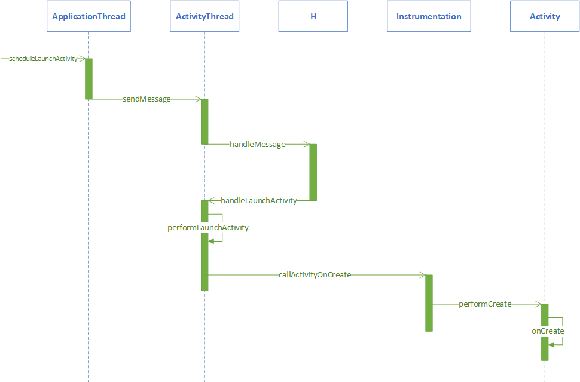

我们接着来查看ApplicationThread的scheduleLaunchActivity方法，其中ApplicationThread是ActivityThread的内部类，应用程序进程创建后会运行代表主线程的实例ActivityThread，它管理着当前应用程序进程的线程。ApplicationThread的scheduleLaunchActivity方法如下所示。

```
// frameworks/base/core/java/android/app/ActivityThread.java
@Override
public final void scheduleLaunchActivity(Intent intent, IBinder token, int ident,
        ActivityInfo info, Configuration curConfig, Configuration overrideConfig,
        CompatibilityInfo compatInfo, String referrer, IVoiceInteractor voiceInteractor,
        int procState, Bundle state, PersistableBundle persistentState,
        List<ResultInfo> pendingResults, List<ReferrerIntent> pendingNewIntents,
        boolean notResumed, boolean isForward, ProfilerInfo profilerInfo) {
    updateProcessState(procState, false);
    ActivityClientRecord r = new ActivityClientRecord();
    r.token = token;
    r.ident = ident;
    r.intent = intent;
    r.referrer = referrer;
    ...
    updatePendingConfiguration(curConfig);
    sendMessage(H.LAUNCH_ACTIVITY, r);
}
```

scheduleLaunchActivity方法会将启动Activity的参数封装成ActivityClientRecord ，sendMessage方法向H类发送类型为LAUNCH_ACTIVITY的消息，并将ActivityClientRecord 传递过去，sendMessage方法有多个重载方法，最终调用的sendMessage方法如下所示。

```
// frameworks/base/core/java/android/app/ActivityThread.java

private void sendMessage(int what, Object obj, int arg1, int arg2, boolean async) {
     ...
     Message msg = Message.obtain();
     msg.what = what;
     msg.obj = obj;
     msg.arg1 = arg1;
     msg.arg2 = arg2;
     if (async) {
         msg.setAsynchronous(true);
     }
     mH.sendMessage(msg);
 }
```

这里mH指的是H，它是ActivityThread的内部类并继承Handler，是应用程序进程中主线程的消息管理类。H的代码如下所示。

```
// frameworks/base/core/java/android/app/ActivityThread.java

private class H extends Handler {
      public static final int LAUNCH_ACTIVITY         = 100;
      public static final int PAUSE_ACTIVITY          = 101;
...
public void handleMessage(Message msg) {
          if (DEBUG_MESSAGES) Slog.v(TAG, ">>> handling: " + codeToString(msg.what));
          switch (msg.what) {
              case LAUNCH_ACTIVITY: {
                  Trace.traceBegin(Trace.TRACE_TAG_ACTIVITY_MANAGER, "activityStart");
                  final ActivityClientRecord r = (ActivityClientRecord) msg.obj;//1
                  r.packageInfo = getPackageInfoNoCheck(
                          r.activityInfo.applicationInfo, r.compatInfo);//2
                  handleLaunchActivity(r, null, "LAUNCH_ACTIVITY");//3
                  Trace.traceEnd(Trace.TRACE_TAG_ACTIVITY_MANAGER);
              } break;
              case RELAUNCH_ACTIVITY: {
                  Trace.traceBegin(Trace.TRACE_TAG_ACTIVITY_MANAGER, "activityRestart");
                  ActivityClientRecord r = (ActivityClientRecord)msg.obj;
                  handleRelaunchActivity(r);
                  Trace.traceEnd(Trace.TRACE_TAG_ACTIVITY_MANAGER);
              } break;
            ...
}
```

查看H的handleMessage方法中对LAUNCH_ACTIVITY的处理，

* 注释1：将传过来的msg的成员变量obj转换为ActivityClientRecord。
* 注释2：通过getPackageInfoNoCheck方法获得LoadedApk类型的对象并赋值给ActivityClientRecord 的成员变量packageInfo 。应用程序进程要启动Activity时需要将该Activity所属的APK加载进来，而LoadedApk就是用来描述已加载的APK文件。
* 注释3：调用handleLaunchActivity方法，代码如下所示。

```
// frameworks/base/core/java/android/app/ActivityThread.java

private void handleLaunchActivity(ActivityClientRecord r, Intent customIntent, String reason) {
    ...
    WindowManagerGlobal.initialize();
    //启动Activity
    Activity a = performLaunchActivity(r, customIntent);//1
    if (a != null) {
        r.createdConfig = new Configuration(mConfiguration);
        reportSizeConfigurations(r);
        Bundle oldState = r.state;
        //将Activity的状态置为Resume
        handleResumeActivity(r.token, false, r.isForward,
                !r.activity.mFinished && !r.startsNotResumed, r.lastProcessedSeq, reason);//2
        if (!r.activity.mFinished && r.startsNotResumed) {
            performPauseActivityIfNeeded(r, reason);
            if (r.isPreHoneycomb()) {
                r.state = oldState;
            }
        }
    } else {
        try {
            //停止Activity启动
            ActivityManager.getService()
                .finishActivity(r.token, Activity.RESULT_CANCELED, null,
                        Activity.DONT_FINISH_TASK_WITH_ACTIVITY);
        } catch (RemoteException ex) {
            throw ex.rethrowFromSystemServer();
        }
    }
}
```

* 注释1：performLaunchActivity方法用来启动Activity 
* 注释2：用来将Activity 的状态置为Resume。如果该Activity为null则会通知AMS停止启动Activity。来查看performLaunchActivity方法做了什么：

```
// frameworks/base/core/java/android/app/ActivityThread.java

private Activity performLaunchActivity(ActivityClientRecord r, Intent customIntent) {
   //获取ActivityInfo类
   ActivityInfo aInfo = r.activityInfo;//1
   if (r.packageInfo == null) {
   //获取APK文件的描述类LoadedApk
       r.packageInfo = getPackageInfo(aInfo.applicationInfo, r.compatInfo,
               Context.CONTEXT_INCLUDE_CODE);//2
   }

   ComponentName component = r.intent.getComponent();//3
   ...
   //创建要启动Activity的上下文环境
   ContextImpl appContext = createBaseContextForActivity(r);//4
   Activity activity = null;
   try {
       java.lang.ClassLoader cl = appContext.getClassLoader();
       //用类加载器来创建该Activity的实例
       activity = mInstrumentation.newActivity(
               cl, component.getClassName(), r.intent);//5
     ...
   } catch (Exception e) {
     ...
   }

   try {
       //创建Application
       Application app = r.packageInfo.makeApplication(false, mInstrumentation);//6
       ...
       if (activity != null) {
          ...
           /**
           *7 初始化Activity
           */
           activity.attach(appContext, this, getInstrumentation(), r.token,
                   r.ident, app, r.intent, r.activityInfo, title, r.parent,
                   r.embeddedID, r.lastNonConfigurationInstances, config,
                   r.referrer, r.voiceInteractor, window, r.configCallback);

          ...
           if (r.isPersistable()) {
               mInstrumentation.callActivityOnCreate(activity, r.state, r.persistentState);//8
           } else {
               mInstrumentation.callActivityOnCreate(activity, r.state);
           }
          ...
       }
       r.paused = true;
       mActivities.put(r.token, r);
   } catch (SuperNotCalledException e) {
       throw e;
   } catch (Exception e) {
     ...
   }

   return activity;
}
```

* 注释1：用来获取ActivityInfo，ActivityInfo用于存储代码和AndroidManifes设置的Activity和receiver节点信息，比如Activity的theme和launchMode。
* 注释2：获取APK文件的描述类LoadedApk。
* 注释3：获取要启动的Activity的ComponentName类，ComponentName类中保存了该Activity的包名和类名。
* 注释4：用来创建要启动Activity的上下文环境。
* 注释5：根据ComponentName中存储的Activity类名，用类加载器来创建该Activity的实例。
* 注释6：用来创建Application，makeApplication方法内部会调用Application的onCreate方法。
* 注释7：调用Activity的attach方法初始化Activity，attach方法中会创建Window对象（PhoneWindow）并与Activity自身进行关联。
* 注释8：会调用Instrumentation的callActivityOnCreate方法来启动Activity，如下所示。

```
// frameworks/base/core/java/android/app/Instrumentation.java

public void callActivityOnCreate(Activity activity, Bundle icicle,
            PersistableBundle persistentState) {
    prePerformCreate(activity);
    activity.performCreate(icicle, persistentState);//1
    postPerformCreate(activity);
}
```

注释1处调用了Activity的performCreate方法，代码如下所示。

```
// frameworks/base/core/java/android/app/Activity.java

final void performCreate(Bundle icicle, PersistableBundle persistentState) {
    mCanEnterPictureInPicture = true;
    restoreHasCurrentPermissionRequest(icicle);
    if (persistentState != null) {
        onCreate(icicle, persistentState);
    } else {
        onCreate(icicle);
    }
    mActivityTransitionState.readState(icicle);

    mVisibleFromClient = !mWindow.getWindowStyle().getBoolean(
            com.android.internal.R.styleable.Window_windowNoDisplay, false);
    mFragments.dispatchActivityCreated();
    mActivityTransitionState.setEnterActivityOptions(this, getActivityOptions());
}
```

performCreate方法中会调用Activity的onCreate方法，讲到这里，根Activity就启动了，即应用程序就启动了。

二、根Activity启动过程中涉及的进程

在应用程序进程没有创建的情况下，根Activity启动过程中会涉及到4个进程，分别是Zygote进程、Launcher进程、AMS所在进程（SyetemServer进程）、应用程序进程。它们之间的关系如下图所示。

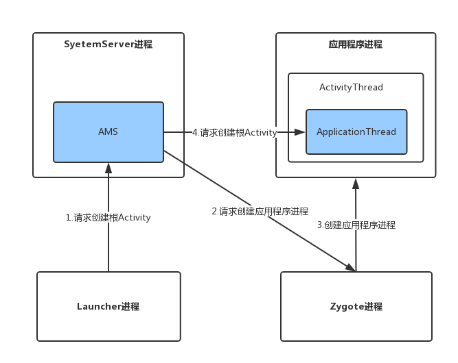

首先Launcher进程向AMS请求创建根Activity，AMS会判断根Activity所需的应用程序进程是否存在并启动，如果不存在就会请求Zygote进程创建应用程序进程。应用程序进程准备就绪后会通知AMS，AMS会请求应用程序进程创建根Activity。上图中步骤2采用的是Socket通信，步骤1和步骤4采用的是Binder通信。
上图可能并不是很直观，为了更好的理解，下面给出这四个进程调用的时序图。

上图可能并不是很直观，为了更好的理解，下面给出这四个进程调用的时序图。

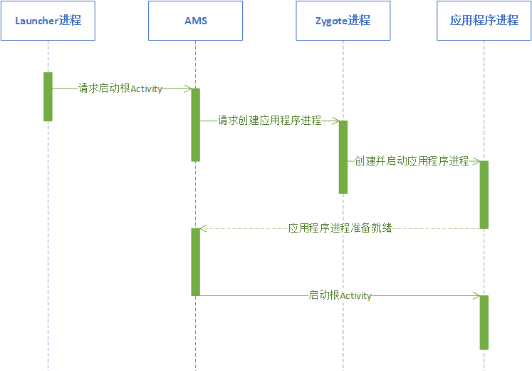

如果是普通Activity启动过程会涉及到几个进程呢？答案是两个，AMS所在进程和应用程序进程。

三、普通Activity启动

1、从Activity到ActivityManagerService。

我们启动Activity启动时，首先从Activity源码会请求调用ActivityManagerService中的方法，大致流程如下图所示：

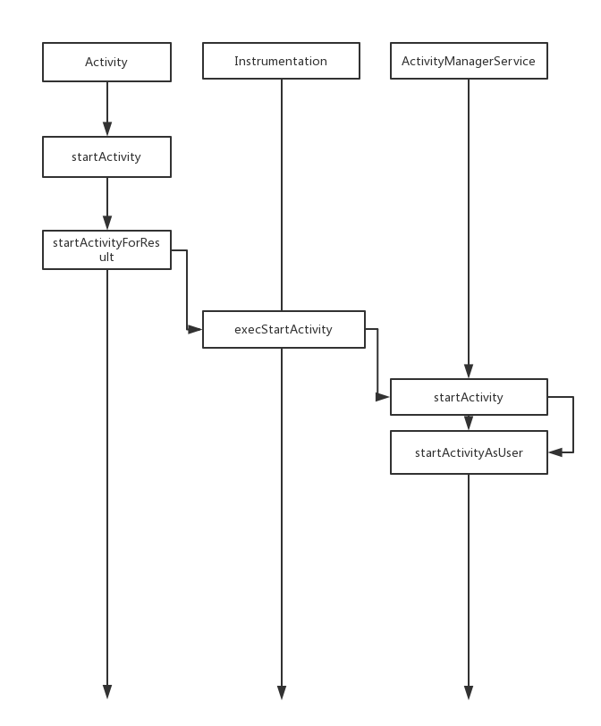

首先我们在Activity中调用startActivity（intent）时会执行下面的方法。

```
// android/app/Activity.class

@Override
public void startActivity(Intent intent) {
    this.startActivity(intent, null);
}
```

上面的方法会调用下面的方法。由于传入的options参数是null 所以会执行startActivityForResult（intent ，-1）；

```
// android/app/Activity.class

@Override
public void startActivity(Intent intent, @Nullable Bundle options) {
    if (options != null) {
        startActivityForResult(intent, -1, options);
    } else {
        // Note we want to go through this call for compatibility with
        // applications that may have overridden the method.
        startActivityForResult(intent, -1);
    }
}
```

由于在上一步中我们传入的options是null所以我们执行startActivityForResult(intent，-1);
在这里我们会发现startActivity最终调用的还是startActivityForResult方法，细心的读者会想“startActivity最终调用的还是startActivityForResult方法，那么为什么我们在Activity调用startActivity不可以在Activity中会调用onActivityResult，而调用startActivityForResult时可以回调onActivityResult?"
我们继续往下看代码，看完这个startActivityForResult的源码就知道了

```
// android/app/Activity.class

public void startActivityForResult(@RequiresPermission Intent intent, int requestCode) {
    startActivityForResult(intent, requestCode, null);
}
```

上面的方法又会调用下面的startActivityForResult方法

```
// android/app/Activity.class

public void startActivityForResult(@RequiresPermission Intent intent, int requestCode,@Nullable Bundle options) {
    if (mParent == null) {
        options = transferSpringboardActivityOptions(options);
        Instrumentation.ActivityResult ar =
            mInstrumentation.execStartActivity(
                this, mMainThread.getApplicationThread(), mToken, this,
                intent, requestCode, options);
        if (ar != null) {
            mMainThread.sendActivityResult(
                mToken, mEmbeddedID, requestCode, ar.getResultCode(),
                ar.getResultData());
        }
        if (requestCode >= 0) {//1
            mStartedActivity = true;
        }

        cancelInputsAndStartExitTransition(options);
    } else {
        if (options != null) {
            mParent.startActivityFromChild(this, intent, requestCode, options);
        } else {
            mParent.startActivityFromChild(this, intent, requestCode);
        }
    }
}
```

看了上面的源码我们才发现，由于第一次启动Activity所以mParent值为空，所以会执行if分支，原来在注释1会判断returnCode是否大于0，如果大于0，mStartedActivity置为true，只有当它为true时才会在Activity中回调onActivityResult。通过前面的代码我们发现，由于我们之前在Activity中调用startActivity后最终调用startActivityForResult时传入的returnCode为-1，所以才不会回调onActivityResult。

上面我们看由于mParent为空，所以执行mInstrumentation.execStartActivity方法，这里的mInstrumentation是Instrumentation的一个对象，Instrumentation是Android系统中启动Activity的一个实际操作类，即：Activity 在Application的进程端的启动实际都是由Instrumentation执行的。由于Activity的启动分为Application进程端的启动和SystemService端的启动，所以这里才说是Application进程端的启动是由Instrumentation执行的，下面我们来看下它的execStartActivity方法的源码：

```
// android/app/Instrumentation.java

public ActivityResult execStartActivity(
        Context who, IBinder contextThread, IBinder token, String target,
        Intent intent, int requestCode, Bundle options) {
    IApplicationThread whoThread = (IApplicationThread) contextThread;
    ...
    try {
        intent.migrateExtraStreamToClipData();
        intent.prepareToLeaveProcess(who);
        int result = ActivityManager.getService()
            .startActivity(whoThread, who.getBasePackageName(), intent,
                    intent.resolveTypeIfNeeded(who.getContentResolver()),
                    token, target, requestCode, 0, null, options);
        checkStartActivityResult(result, intent);
    } catch (RemoteException e) {
        throw new RuntimeException("Failure from system", e);
    }
    return null;
}
```

在这个方法中我们发现主要调用了ActivityManager.getService().startActivity()方法，那么ActivityManager.getService()又是啥昵？我们来看下 源码：

```
// android/app/ActivityManager.java

public static IActivityManager getService() {
    return IActivityManagerSingleton.get();
}

private static final Singleton<IActivityManager> IActivityManagerSingleton =
        new Singleton<IActivityManager>() {
            @Override
            protected IActivityManager create() {
                final IBinder b = ServiceManager.getService(Context.ACTIVITY_SERVICE);
                final IActivityManager am = IActivityManager.Stub.asInterface(b);
                return am;
            }
        };
```

我们发现它返回的是IActivityManager.Stub.asInterface(b)；我们都知道Stub是AIDL（Android Interface Definition Language）生成的一个Binder类，当客户端和服务端要跨进程走transact过程时，它的逻辑就时由Stub的内部类Proxy来代理的。而asInterdace()方法的作用是：将服务端的Binder对象转换为客户端所需要的AIDL接口类型。如果客户端和服务端在同一个进程他返回的就是服务端Stub对象本身，否则他返回的就是系统封装后的Stub.proxy对象。
下面我们来看下IActivityManager.Stub.asInterface到底是啥？其实我们发现ActivityManagerService继承自IActivityManager.Stub，所以上面返回的就是一个ActivityManagerService对象。

2、从ActivityManagerService 到ApplicationThread

所以ActivityManager.getService().startActivity()执行的是ActivityManagerService中的startActivity方法，

```
// com/android/server/am/ActivityManagerService.java

@Override
public final int startActivity(IApplicationThread caller, String callingPackage,
        Intent intent, String resolvedType, IBinder resultTo, String resultWho, int requestCode,int startFlags, ProfilerInfo profilerInfo, Bundle bOptions) {
    return startActivityAsUser(caller, callingPackage, intent, resolvedType, resultTo,resultWho, requestCode, startFlags, profilerInfo, bOptions,
            UserHandle.getCallingUserId());
}
```

这里有调用了startActivityAsUser方法，我们继续往下看它的源码：

```
// com/android/server/am/ActivityManagerService.java

@Override
public final int startActivityAsUser(IApplicationThread caller, String callingPackage,Intent intent, String resolvedType, IBinder resultTo, String resultWho, int requestCode,int startFlags, ProfilerInfo profilerInfo, Bundle bOptions, int userId) {
    enforceNotIsolatedCaller("startActivity");
    userId = mUserController.handleIncomingUser(Binder.getCallingPid(), Binder.getCallingUid(),userId, false, ALLOW_FULL_ONLY, "startActivity", null);
    // TODO: Switch to user app stacks here.
    return mActivityStarter.startActivityMayWait(caller, -1, callingPackage, intent,resolvedType, null, null, resultTo, resultWho, requestCode, startFlags,
            profilerInfo, null, null, bOptions, false, userId, null, "startActivityAsUser");
}
```

这里返回了mActivtyStarter.startActivityMayWait方法，mActivityStarter是ActivityStarter的对象，ActivityStarter是Android 7.0新加入的类，它是加载Activity的控制类，会收集所有的逻辑来决定如何将Intent和Flags转换为Activity，并将Activity和Task以及Stack相关联。我们来看它的startActivityMayWait方法

```
 final int startActivityMayWait(IApplicationThread caller, int callingUid,
            String callingPackage, Intent intent, String resolvedType,
            IVoiceInteractionSession voiceSession, IVoiceInteractor voiceInteractor,
            IBinder resultTo, String resultWho, int requestCode, int startFlags,
            ProfilerInfo profilerInfo, WaitResult outResult,
            Configuration globalConfig, Bundle bOptions, boolean ignoreTargetSecurity, int userId,
            IActivityContainer iContainer, TaskRecord inTask, String reason) {
         .........code............
    synchronized (mService) {
         ......code...............
     
        //启动Activity
        int res = startActivityLocked(caller, intent, ephemeralIntent, resolvedType,
                aInfo, rInfo, voiceSession, voiceInteractor,
                resultTo, resultWho, requestCode, callingPid,
                callingUid, callingPackage, realCallingPid, realCallingUid, startFlags,
                options, ignoreTargetSecurity, componentSpecified, outRecord, container,
                inTask, reason);
 
        Binder.restoreCallingIdentity(origId);
        //如果配置Configration发生变化，则调用AMS的updateConfigurationLocked进行处理
        if (stack.mConfigWillChange) {
            mService.enforceCallingPermission(android.Manifest.permission.CHANGE_CONFIGURATION,
                    "updateConfiguration()");
            stack.mConfigWillChange = false;
            mService.updateConfigurationLocked(globalConfig, null, false);
        }
        ..........code..........
        mSupervisor.mActivityMetricsLogger.notifyActivityLaunched(res, outRecord[0]);
        return res;
    }
}
```

startActivityMayWait这个方法的源码比较多，我们省略掉一些非重要的源码，这里重点我们看调用的startActivityLocked方法。

```
int startActivityLocked(IApplicationThread caller, Intent intent, Intent ephemeralIntent,
        String resolvedType, ActivityInfo aInfo, ResolveInfo rInfo,
        IVoiceInteractionSession voiceSession, IVoiceInteractor voiceInteractor,
        IBinder resultTo, String resultWho, int requestCode, int callingPid, int callingUid,
        String callingPackage, int realCallingPid, int realCallingUid, int startFlags,
        ActivityOptions options, boolean ignoreTargetSecurity, boolean componentSpecified,
        ActivityRecord[] outActivity, ActivityStackSupervisor.ActivityContainer container,
        TaskRecord inTask, String reason) {
     //判断启动的理由不为空
    if (TextUtils.isEmpty(reason)) {
        throw new IllegalArgumentException("Need to specify a reason.");
    }
    mLastStartReason = reason;
    mLastStartActivityTimeMs = System.currentTimeMillis();
    mLastStartActivityRecord[0] = null;
 
    mLastStartActivityResult = startActivity(caller, intent, ephemeralIntent, resolvedType,
            aInfo, rInfo, voiceSession, voiceInteractor, resultTo, resultWho, requestCode,
            callingPid, callingUid, callingPackage, realCallingPid, realCallingUid, startFlags,
            options, ignoreTargetSecurity, componentSpecified, mLastStartActivityRecord,
            container, inTask);
 
    if (outActivity != null) {
        // mLastStartActivityRecord[0] is set in the call to startActivity above.
        outActivity[0] = mLastStartActivityRecord[0];
    }
    return mLastStartActivityResult;
}
```

我们看到这个方法，首先判断Activity启动的理由是否为空，如果为空抛出异常，紧接着调用了它的内部方法startActivity，那么我们下面来继续看startActivity方法的源码。

```
private int startActivity(IApplicationThread caller, Intent intent, Intent ephemeralIntent,
        String resolvedType, ActivityInfo aInfo, ResolveInfo rInfo,
        IVoiceInteractionSession voiceSession, IVoiceInteractor voiceInteractor,
        IBinder resultTo, String resultWho, int requestCode, int callingPid, int callingUid,
        String callingPackage, int realCallingPid, int realCallingUid, int startFlags,
        ActivityOptions options, boolean ignoreTargetSecurity, boolean componentSpecified,
        ActivityRecord[] outActivity, ActivityStackSupervisor.ActivityContainer container,
        TaskRecord inTask) {
    int err = ActivityManager.START_SUCCESS;
    // Pull the optional Ephemeral Installer-only bundle out of the options early.
    final Bundle verificationBundle
            = options != null ? options.popAppVerificationBundle() : null;
 
    ProcessRecord callerApp = null;
    if (caller != null) {
        //获取launcher进程
        callerApp = mService.getRecordForAppLocked(caller);
        if (callerApp != null) {
            //获取launcher进程的pid 和Uid并赋值
            callingPid = callerApp.pid;
            callingUid = callerApp.info.uid;
        } else {
            Slog.w(TAG, "Unable to find app for caller " + caller
                    + " (pid=" + callingPid + ") when starting: "
                    + intent.toString());
            err = ActivityManager.START_PERMISSION_DENIED;
        }
    }
   ..............code.................
   //创建将要启动的Activity的描述类ActivityRecord
    ActivityRecord r = new ActivityRecord(mService, callerApp, callingPid, callingUid,
            callingPackage, intent, resolvedType, aInfo, mService.getGlobalConfiguration(),
            resultRecord, resultWho, requestCode, componentSpecified, voiceSession != null,
            mSupervisor, container, options, sourceRecord);
    if (outActivity != null) {
        outActivity[0] = r;
    }
   ..........code...............  
    doPendingActivityLaunchesLocked(false);
    return startActivity(r, sourceRecord, voiceSession, voiceInteractor, startFlags, true,
            options, inTask, outActivity);
}
```

这个方法中的逻辑还是比较多的，这里还是列出我们重点关心的代码，我们看到首先在这个方法中会根据IApplicationThread类型的一个对象来获取launcher进程。随后我们又看到根据获取的进程callerApp创建一个ActivityRecord对象，这个类是类似与ProcessRecord，就是用来描述Activity，记录一个Activity对象的所有信息。所以这里创建的r就是记录将要启动的Activity的所有信息。紧接着将它传给一个ActivityRecord[]类型的的outActivity，而这个outActivity和之前创建的对象我们看到它是做为入参继续传入下一个start Activity方法。

```
private int startActivity(final ActivityRecord r, ActivityRecord sourceRecord,
        IVoiceInteractionSession voiceSession, IVoiceInteractor voiceInteractor,
        int startFlags, boolean doResume, ActivityOptions options, TaskRecord inTask,
        ActivityRecord[] outActivity) {
    int result = START_CANCELED;
    try {
        mService.mWindowManager.deferSurfaceLayout();
        result = startActivityUnchecked(r, sourceRecord, voiceSession, voiceInteractor,
                startFlags, doResume, options, inTask, outActivity);
    } finally {
        // If we are not able to proceed, disassociate the activity from the task. Leaving an
        // activity in an incomplete state can lead to issues, such as performing operations
        // without a window container.
        if (!ActivityManager.isStartResultSuccessful(result)
                && mStartActivity.getTask() != null) {
            mStartActivity.getTask().removeActivity(mStartActivity);
        }
        mService.mWindowManager.continueSurfaceLayout();
    }
 
    postStartActivityProcessing(r, result, mSupervisor.getLastStack().mStackId,  mSourceRecord,
            mTargetStack);
 
    return result;
}
```

紧接着这个方法又调用了startActivityUnchecked方法

```
// Note: This method should only be called from {@link startActivity}.
private int startActivityUnchecked(final ActivityRecord r, ActivityRecord sourceRecord,
        IVoiceInteractionSession voiceSession, IVoiceInteractor voiceInteractor,
        int startFlags, boolean doResume, ActivityOptions options, TaskRecord inTask,
        ActivityRecord[] outActivity) {
    ......code......
    // Should this be considered a new task?
    int result = START_SUCCESS;
    if (mStartActivity.resultTo == null && mInTask == null && !mAddingToTask
            && (mLaunchFlags & FLAG_ACTIVITY_NEW_TASK) != 0) {//
        newTask = true;
    //创建新的TaskRecord
        result = setTaskFromReuseOrCreateNewTask(
                taskToAffiliate, preferredLaunchStackId, topStack);//1
    } else if (mSourceRecord != null) {
        result = setTaskFromSourceRecord();
    } else if (mInTask != null) {
        result = setTaskFromInTask();
    } else {
        // This not being started from an existing activity, and not part of a new task...
        // just put it in the top task, though these days this case should never happen.
        setTaskToCurrentTopOrCreateNewTask();
    }
    if (result != START_SUCCESS) {
        return result;
    }
    ......code......
    if (mDoResume) {
        final ActivityRecord topTaskActivity =
                mStartActivity.getTask().topRunningActivityLocked();
        if (!mTargetStack.isFocusable()
                || (topTaskActivity != null && topTaskActivity.mTaskOverlay
                && mStartActivity != topTaskActivity)) {
            
            mTargetStack.ensureActivitiesVisibleLocked(null, 0, !PRESERVE_WINDOWS);
            mWindowManager.executeAppTransition();
        } else {
            if (mTargetStack.isFocusable() && !mSupervisor.isFocusedStack(mTargetStack)) {
                mTargetStack.moveToFront("startActivityUnchecked");
            }
            mSupervisor.resumeFocusedStackTopActivityLocked(mTargetStack, mStartActivity,
                    mOptions);//2
        }
    } else {
        mTargetStack.addRecentActivityLocked(mStartActivity);
    }
    mSupervisor.updateUserStackLocked(mStartActivity.userId, mTargetStack);
 
    mSupervisor.handleNonResizableTaskIfNeeded(mStartActivity.getTask(), preferredLaunchStackId,
            preferredLaunchDisplayId, mTargetStack.mStackId);
 
    return START_SUCCESS;
}
```

从第一行注释理解，这个方法主要处理栈管理相关的一些逻辑，启动根Activity时会将Intent的Flag设置为FLAG_ACTIVITY_NEW_TASK,所以会执行if条件里面的，在注释1我们看到会通过setTaskFromReuseOrCreateNewTask方法创建一个TaskRecord对象，TaskRecord类似于ActivityRecordd，这个类的作用是描述一个Activity任务栈，也就是说setTaskFromReuseOrCreateNewTask方法会创建一个新的Activity任务栈。主要代码是注释2处，调用的ActivityStackSupervisor.resumeFocusedStackTopActivityLocked

```
// com/android/server/am/ActivityStackSupervisor.java

boolean resumeFocusedStackTopActivityLocked(
        ActivityStack targetStack, ActivityRecord target, ActivityOptions targetOptions) {
    if (targetStack != null && isFocusedStack(targetStack)) {
        return targetStack.resumeTopActivityUncheckedLocked(target, targetOptions);
    }
    final ActivityRecord r = mFocusedStack.topRunningActivityLocked();//1
    if (r == null || r.state != RESUMED) {
        mFocusedStack.resumeTopActivityUncheckedLocked(null, null);
    } else if (r.state == RESUMED) {
        // Kick off any lingering app transitions form the MoveTaskToFront operation.
        mFocusedStack.executeAppTransition(targetOptions);
    }
    return false;
}
```

这个方法我们主要看注释1后面的判断语句，注释1这个方法是获取启动Activity所在栈的栈顶处于非停止状态的ActivityRecord。紧接着后面判断获取的这个ActivityRecord对象为空 或者它的状态不是RESUME，就会执行if里面的语句，调用ActivityStack的resumeTopActivityUncheckedLocked方法，对于将要启动的Activity肯定满足条件，所以下面我们来看ActivityStack的resumeTopActivityUncheckedLocked方法，

```
// com/android/server/am/ActivityStack.java
boolean resumeTopActivityUncheckedLocked(ActivityRecord prev, ActivityOptions options) {
    if (mStackSupervisor.inResumeTopActivity) {
        // Don't even start recursing.
        return false;
    }

    boolean result = false;
    try {
        // Protect against recursion.
        mStackSupervisor.inResumeTopActivity = true;
        result = resumeTopActivityInnerLocked(prev, options);
    } finally {
        mStackSupervisor.inResumeTopActivity = false;
    }

    // When resuming the top activity, it may be necessary to pause the top activity (for
    // example, returning to the lock screen. We suppress the normal pause logic in
    // {@link #resumeTopActivityUncheckedLocked}, since the top activity is resumed at the end.
    // We call the {@link ActivityStackSupervisor#checkReadyForSleepLocked} again here to ensure
    // any necessary pause logic occurs. In the case where the Activity will be shown regardless
    // of the lock screen, the call to {@link ActivityStackSupervisor#checkReadyForSleepLocked}
    // is skipped.
    final ActivityRecord next = topRunningActivityLocked(true /* focusableOnly */);
    if (next == null || !next.canTurnScreenOn()) {
        checkReadyForSleep();
    }

    return result;
}
```

这里又调用了resumeTopActivityInnerLocked方法：

```
// com/android/server/am/ActivityStack.java

private boolean resumeTopActivityInnerLocked(ActivityRecord prev, ActivityOptions options) {
  ......code......
    mStackSupervisor.startSpecificActivityLocked(next, true, true);

    if (DEBUG_STACK) mStackSupervisor.validateTopActivitiesLocked();
   return true;
}
```

这个方法中只需要关注调用的ActivityStackSupervisor 的startSpecificActivityLocked方法，代码如下所示：

```
// com/android/server/am/ActivityStackSupervisor.java

void startSpecificActivityLocked(ActivityRecord r,
            boolean andResume, boolean checkConfig) {
    // 获取将要启动Activity所在应用程序的进程
    ProcessRecord app = mService.getProcessRecordLocked(r.processName,
            r.info.applicationInfo.uid, true);

    r.getStack().setLaunchTime(r);

    if (app != null && app.thread != null) {
        try {
            if ((r.info.flags&ActivityInfo.FLAG_MULTIPROCESS) == 0
                    || !"android".equals(r.info.packageName)) {
                // Don't add this if it is a platform component that is marked
                // to run in multiple processes, because this is actually
                // part of the framework so doesn't make sense to track as a
                // separate apk in the process.
                app.addPackage(r.info.packageName, r.info.applicationInfo.versionCode,
                        mService.mProcessStats);
            }
            realStartActivityLocked(r, app, andResume, checkConfig);//1
            return;
        } catch (RemoteException e) {
            Slog.w(TAG, "Exception when starting activity "
                    + r.intent.getComponent().flattenToShortString(), e);
        }

        // If a dead object exception was thrown -- fall through to
        // restart the application.
    }

    mService.startProcessLocked(r.processName, r.info.applicationInfo, true, 0,
            "activity", r.intent.getComponent(), false, false, true);
}
```

这个方法首先获取将要启动Activity所在应用程序的进程，之后判断该进程不为空的话，且其对象thread不为空，就会调用注释1的realStartActivityLocked方法，并且将该进程作为入参传入方法：

```
// com/android/server/am/ActivityStackSupervisor.java

final boolean realStartActivityLocked(ActivityRecord r, ProcessRecord app,
          boolean andResume, boolean checkConfig) throws RemoteException {
...
      app.thread.scheduleLaunchActivity(new Intent(r.intent), r.appToken,
              System.identityHashCode(r), r.info, new Configuration(mService.mConfiguration),
              new Configuration(task.mOverrideConfig), r.compat, r.launchedFromPackage,
              task.voiceInteractor, app.repProcState, r.icicle, r.persistentState, results,
              newIntents, !andResume, mService.isNextTransitionForward(), profilerInfo);
...      
  return true;
}
```

上面提到app.thread指的是IApplicationThread，它的是现实ActivityThread的内部类，ApplicationThread，其中ApplicationThread继承了IApplicationThread.Stub。所以这里调用了ApplicationThread的scheduleLuaunchActivity。说到这里就是AMS与ApplicationThread之间通过Binder通信。

总结:

关于Activity的启动流程，先看到ApplicationThread这里，后面的流程参考根Activity启动：

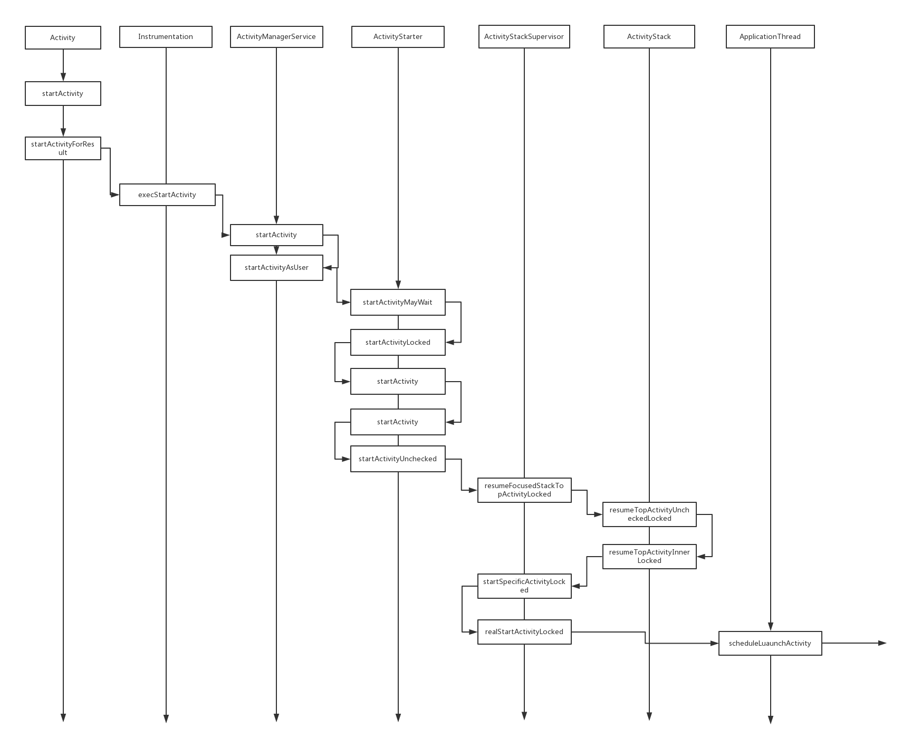

## Activity启动模式

一、Activity的四种启动模式

1.standard

默认启动模式，栈内多实例，每次启动都会新建Activity实例压于当前栈顶。

2.singleTop

栈顶复用模式，栈内多实例，启动Activity时若栈顶已有该Activity实例，会直接调用onNewIntent()方法复用该栈顶实例，其它场景和standard表现一致，此模式下需要指定android:launchMode=“singleleTop”。

3.singleTask

栈内复用模式，栈内单实例，此模式下需要指定android:launchMode=“singleleTask”，启动Activity时：

* 若栈内无该Activity类实例，新建实例并压入栈顶；
* 若栈内已有该Activity类实例（假设为A），栈内位于A上部的Activity逐个pop，调用onDestroy()生命周期（除去相邻的Activity实例，假设为B），B的生命周期如下：
B onPause() - A onNewIntent() - A onRestart() - A onStart() - A onResume() - B onStop() - B onDestroy()

 * 未配置taskAffinity属性时：以上操作均在当前栈操作。
 * 配置了taskAffinity属性时：检测当前栈是否与taskAffinity属性相符，若相符则在当前栈操作；若不相符则新建栈，再新建Activity实例压于栈顶。

4.singleInstance

单实例模式，全局单实例，即全局只有一个栈中有该实例，且该栈中有且只有一个该实例。此模式下需要指定android:launchMode=“singleleInstance”，当启动Activity时，

若栈中无该实例，则新建栈，新建Activity并压入栈顶；
若已有栈中有该实例，则调用onNewIntent()复用该实例。

二、使用场景

1.standard 一般场景均适用

2.singleTop 此模式下栈顶只存在单个该实例，有如下场景可用（适用于非主架构Activity）：

1. 防止Activity多次启动，比如多次点击启动按钮导致启动多个相同Activity（如登录跳转）；
2. 业务流程要更新数据，Activity需要自己跳转到自己，回调onNewIntent()刷新数据；
3. Activity需要启动service执行耗时操作或进行某类事件监听，过程中用户点击home键切换了应用，当service响应时需要回到Activity，此时可用singleTop复用已有实例；
4. 通知栏内有若干个通知，点击通知需要跳转到新Activity，此时可用singleTop，避免每次点击都创建新实例造成资源浪费；

3.singleTask 此模式下栈内只有单个该实例，且不会多次创建，适用于主架构Activity（常驻型），如应用主页（home页）；

4.singleInstance 此模式下全局栈内只有单个该实例，且该栈有且仅有一个实例，此类Activity适用于共享型Activity，如Activity作为公共组件被多个三方app访问。

上面的场景仅仅适用于Activity启动Activity，并且采用的都是默认Intent，没有额外添加任何Flag，否则表现就可能跟上面的完全不一致，尤其要注意的是FLAG_ACTIVITY_NEW_TASK的使用，后面从源码中看，依靠FLAG_ACTIVITY_NEW_TASK其实可以分为两派。

三、Intent.FLAG_ACTIVITY_NEW_TASK分析

从源码来看，Intent.FLAG_ACTIVITY_NEW_TASK是启动模式中最关键的一个Flag，依据该Flag启动模式可以分成两类，设置了该属性的与未设置该属性的，对于非Activity启动的Activity（比如Service或者通知中启动的Activity）需要显示的设置Intent.FLAG_ACTIVITY_NEW_TASK，而singleTask及singleInstance在AMS中被预处理后，隐形的设置了Intent.FLAG_ACTIVITY_NEW_TASK，而启动模式是standard及singletTop的Activity不会被设置Intent.FLAG_ACTIVITY_NEW_TASK，除非通过显示的intent setFlag进行设置。

FLAG_ACTIVITY_NEW_TASK这个属性更多的关注点是在Task，可以认为没有设置FLAG_ACTIVITY_NEW_TASK的情况下，taskAffinity可以不考虑，大多数情况下，需要将Activity引入到自己taskAffinity的Task中，Intent.FLAG_ACTIVITY_NEW_TASK的初衷是在Activity目标taskAffinity的Task中启动，非Activity启动Activity都必须添加Intent.FLAG_ACTIVITY_NEW_TASK才行，以Service启动的Activity为例：

```
Intent intent = new Intent(BackGroundService.this, A.class);
intent.setFlags(Intent.FLAG_ACTIVITY_NEW_TASK);
startActivity(intent);  
```

这种情况很有意思，如果目标Activity实例或者Task不存在，则一定会新建Activity，并将目标Task移动到前台，但是如果Activity存在，却并不一定复用，也不一定可见。这里假定A是standard的Activity，如果已经有一个A实例，并且所在的堆栈的taskAffinity跟A的taskAffinity一致，这个时候要看这个task的根Activity是不是A，如果是A，还要看A的intent是不是跟当前的启动的intent相等，如果都满足，只要将task可见即可。否则，就需要新建A，并根据A的task栈的存在情况而选择直接入栈还是新建栈。但是，如果Intent想要的启动的Activity的目标堆栈存在，那就将整个堆栈往前迁移，如果位于顶部的Task栈正好是目标Activity的Task栈，那就不做任何处理，连onNewIntent都不会回调，怎么判断目标的Activity的Task栈同找到的栈一致呢？如果找不到目标Task自然会启动Task，如果目标task栈根Activit的intent同新将要启动的Activit相同，就不启动新Activity，否则启动Activity。

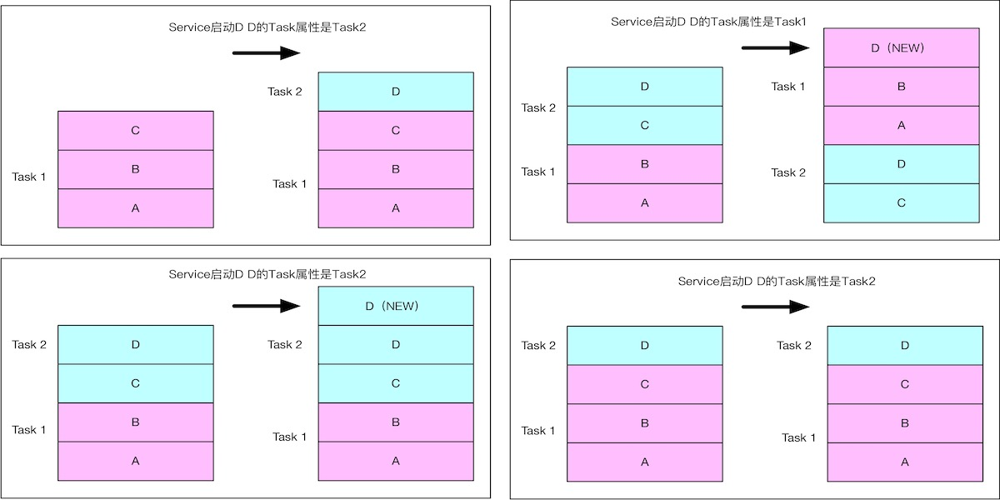

1、Intent.FLAG_ACTIVITY_CLEAR_TASK：必须配合FLAG_ACTIVITY_NEW_TASK使用

这个属性必须同FLAG_ACTIVITY_NEW_TASK配合使用，如果设置了FLAG_ACTIVITY_NEW_TASK|Intent.FLAG_ACTIVITY_CLEAR_TASK，如果目标task已经存在，将清空已存在的目标Task，否则，新建一个Task栈，之后，新建一个Activity作为根Activity。Intent.FLAG_ACTIVITY_CLEAR_TASK的优先级最高，基本可以无视所有的配置，包括启动模式及Intent Flag，哪怕是singleInstance也会被finish，并重建。

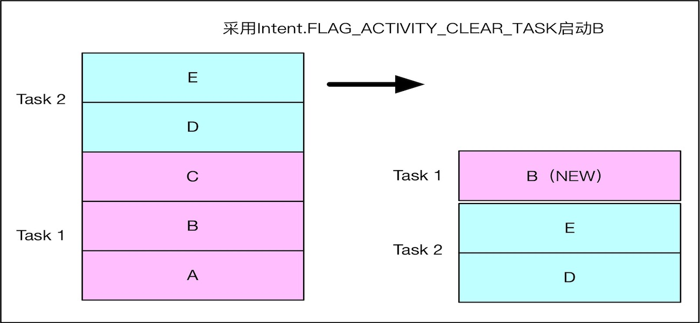

2、Intent.FLAG_ACTIVITY_CLEAR_TOP

如果没有使用FLAG_ACTIVITY_NEW_TASK，目标是当前Task栈，根据不同的组合会产生不同的效果，如果单独使用Intent.FLAG_ACTIVITY_CLEAR_TOP，并且没有设置特殊的launchmode，那么，Google官方的示例是：如果ABCD Task中的D采用Intent.FLAG_ACTIVITY_CLEAR_TOP唤起B，这个时候首先会将CD出栈，但是至于B是否会重建，要视情况而定，如果没有设置FLAG_ACTIVITY_SINGLE_TOP，则会将B finish掉，之后创建新的入栈。如果同一个栈中原来有

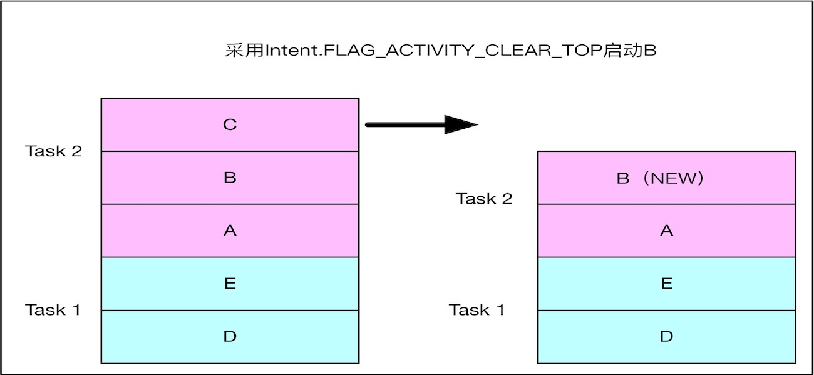

如果没有则新建，不会去另一个栈中寻找。


如果同时设置了FLAG_ACTIVITY_SINGLE_TOP，在当前栈已有的情况下就不会重建，而是直接回调B的onNewIntent(),

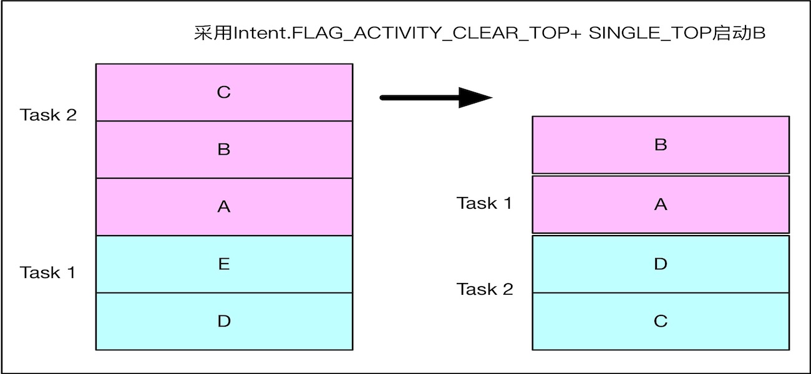

如果同时使用了FLAG_ACTIVITY_NEW_TASK ，这个时候，目标是Activity自己所属的Task栈，如果在自己的Task中能找到一个Activity实例，则将其上面的及自身清理掉，之后重建。


如果同时在加上FLAG_ACTIVITY_SINGLE_TOP，会更特殊一些，如果topActivity不是目标Activity，就会去目标Task中去找，并唤起


如果topActivity是目标Activity，就直接回调topActivity的onNewIntent，无论topActivity是不是在目标Task中

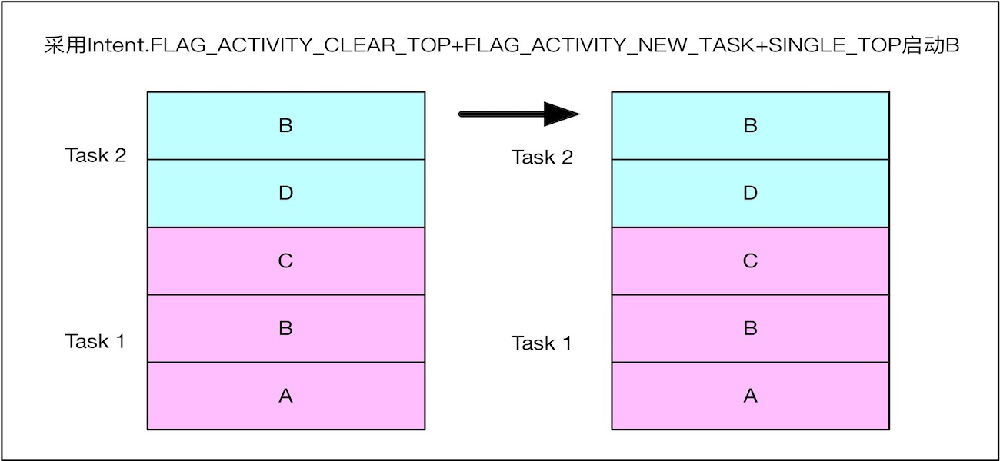

3、Intent.FLAG_ACTIVITY_SINGLE_TOP

Intent.FLAG_ACTIVITY_SINGLE_TOP多用来做辅助作用，跟launchmode中的singleTop作用一样，在Task栈顶有的话，就不新建，栈顶没有的话，就新建，这里的Task可能是目标栈，也可能是当前Task栈，配合FLAG_ACTIVITY_NEW_TASK及FLAG_ACTIVITY_CLEAR_TOP都会有很有意思的效果。

4、Intent.FLAG_ACTIVITY_NO_HISTORY

使用该模式来启动Activity，当该Activity启动其他Activity后，该Activity就被销毁了，不会保留在任务栈中。如A-B,B中以这种模式启动C，C再启动D，则任务栈只有ABD。

5、Intent.FLAG_ACTIVITY_EXCLUDE_FROM_RECENTS

使用该标识位启动的Activity不添加到最近应用列表，也即我们从最近应用里面查看不到我们启动的这个Activity。与属性android:excludeFromRecents=”true”效果相同。当用户正处于此Activity并按home键回到桌面或通过任务列表切换到其他应用后，用户再唤出最近任务列表时便看不到此Activity。

四、源码分析

为什么非Activity启动Activity要强制规定使用参数FLAG_ACTIVITY_NEW_TASK
从源码上说，ContextImpl在前期做了检查，如果没添加Intent.FLAG_ACTIVITY_NEW_TASK就抛出异常，

```
@Override
public void startActivity(Intent intent, Bundle options) {
    warnIfCallingFromSystemProcess();
    if ((intent.getFlags()&Intent.FLAG_ACTIVITY_NEW_TASK) == 0) {
        throw new AndroidRuntimeException(
                "Calling startActivity() from outside of an Activity "
                + " context requires the FLAG_ACTIVITY_NEW_TASK flag."
                + " Is this really what you want?");
    }
    ...
}
```

为什么要这么呢？其实直观很好理解，如果不是在Activity中启动的，那就可以看做不是用户主动的行为，也就说这个界面可能出现在任何APP之上，如果不用Intent.FLAG_ACTIVITY_NEW_TASK将其限制在自己的Task中，那用户可能会认为该Activity是当前可见APP的页面，这是不合理的。举个例子：我们在听音乐，这个时候如果邮件Service突然要打开一个Activity，如果不用Intent.FLAG_ACTIVITY_NEW_TASK做限制，那用户可能认为这个Activity是属于音乐APP的，因为用户点击返回的时候，可能会回到音乐，而不是邮件（如果邮件之前就有界面）。

## Android View的事件分发机制

一、概要

我们常说的View事件是指： 从手指亲密接触屏幕的那一刻到手指离开屏幕的这个过程，该事件序列以down事件为起点，move事件为过程，up事件为终点。一次down-move-up这一个事件过程我们称为一个事件序列。所以我们今天研究的对象就是MotionEvent。

二、事件分发

1、理论知识

* ```public boolean dispatchTouchEvent(MotionEvent ev)``` 

用来分发事件，即事件序列的大门，如果事件传递到当前View的onTouchEvent或者是子View的dispatchTouchEvent，即该方法被调用了。
return true: 表示消耗了当前事件，有可能是当前View的onTouchEvent或者是子View的dispatchTouchEvent消费了，事件终止，不再传递。
return false: 调用父ViewGroup或者Activity的onTouchEvent。 （不再往下传）。①另外如果不消耗ACTION_DOWN事件，那么down,move,up事件都与该View无关，交由父类处理(父类的onTouchEvent方法)
return super.dispatherTouchEvent: 则继续往下(子View)传递，或者是调用当前View的onTouchEvent方法;

* ```public boolean onInterceptTouchEvent(MotionEvent ev)```

在dispatchTouchEvent内部调用，顾名思义就是判断是否拦截某个事件。(注：ViewGroup才有的方法，View因为没有子View了，所以不需要也没有该方法)
return true: ViewGroup将该事件拦截，交给自己的onTouchEvent处理。②而且这一个事件序列（当前和其它事件）都只能由该ViewGroup处理，并且不会再调用该onInterceptTouchEvent方法去询问是否拦截。
return false: 继续传递给子元素的dispatchTouchEvent处理。
return super.dispatherTouchEvent: 事件默认不会被拦截。

* ```public boolean onTouchEvent(MotionEvent ev)```

在dispatchTouchEvent内部调用
return true: 事件消费，当前事件终止。
return false: 交给父View的onTouchEvent。
return super.dispatherTouchEvent: 默认处理事件的逻辑和返回 false 时相同。

上面的关系可以用以下代码简单描述。

```
public boolean dispatchTouchEvent(MotionEvent ev){
    boolean consume = false;//是否消费事件
    if(onInterceptTouchEvent(ev)){//是否拦截事件
        consume = onTouchEvent(ev);//拦截了，交给自己的View处理
    }else{
        consume = child.dispatchTouchEvent(ev);//不拦截，就交给子View处理
    }

    return consume;//true：消费事件，终止。false:交给父onTouchEvent处理。并不再往下传递当前事件。
}
```


三、源码

1、Activity的事件分发机制

```
public boolean dispatchTouchEvent(MotionEvent ev) {

    // 一般事件列开始都是DOWN事件 = 按下事件，故此处基本是true
    if (ev.getAction() == MotionEvent.ACTION_DOWN) {

        onUserInteraction();
        // ->>分析1

    }

    // ->>分析2
    if (getWindow().superDispatchTouchEvent(ev)) {

        return true;
        // 若getWindow().superDispatchTouchEvent(ev)的返回true
        // 则Activity.dispatchTouchEvent（）就返回true，则方法结束。即 ：该点击事件停止往下传递 & 事件传递过程结束
        // 否则：继续往下调用Activity.onTouchEvent

    }
    // ->>分析4
    return onTouchEvent(ev);
}


 /**
  * 分析1：onUserInteraction()
  * 作用：实现屏保功能
  * 注：
  *    a. 该方法为空方法
  *    b. 当此activity在栈顶时，触屏点击按home，back，menu键等都会触发此方法
  */
  public void onUserInteraction() { 

  }
  // 回到最初的调用原处

 /**
  * 分析2：getWindow().superDispatchTouchEvent(ev)
  * 说明：
  *     a. getWindow() = 获取Window类的对象
  *     b. Window类是抽象类，其唯一实现类 = PhoneWindow类；即此处的Window类对象 = PhoneWindow类对象
  *     c. Window类的superDispatchTouchEvent() = 1个抽象方法，由子类PhoneWindow类实现
  */
    @Override
    public boolean superDispatchTouchEvent(MotionEvent event) {

        return mDecor.superDispatchTouchEvent(event);
        // mDecor = 顶层View（DecorView）的实例对象
        // ->> 分析3
    }

 /**
  * 分析3：mDecor.superDispatchTouchEvent(event)
  * 定义：属于顶层View（DecorView）
  * 说明：
  *     a. DecorView类是PhoneWindow类的一个内部类
  *     b. DecorView继承自FrameLayout，是所有界面的父类
  *     c. FrameLayout是ViewGroup的子类，故DecorView的间接父类 = ViewGroup
  */
    public boolean superDispatchTouchEvent(MotionEvent event) {

        return super.dispatchTouchEvent(event);
        // 调用父类的方法 = ViewGroup的dispatchTouchEvent()
        // 即 将事件传递到ViewGroup去处理，详细请看ViewGroup的事件分发机制

    }
    // 回到最初的调用原处

 /**
  * 分析4：Activity.onTouchEvent（）
  * 定义：属于顶层View（DecorView）
  * 说明：
  *     a. DecorView类是PhoneWindow类的一个内部类
  *     b. DecorView继承自FrameLayout，是所有界面的父类
  *     c. FrameLayout是ViewGroup的子类，故DecorView的间接父类 = ViewGroup
  */
  public boolean onTouchEvent(MotionEvent event) {

        // 当一个点击事件未被Activity下任何一个View接收 / 处理时
        // 应用场景：处理发生在Window边界外的触摸事件
        // ->> 分析5
        if (mWindow.shouldCloseOnTouch(this, event)) {
            finish();
            return true;
        }
        
        return false;
        // 即 只有在点击事件在Window边界外才会返回true，一般情况都返回false，分析完毕
    }

   /**
    * 分析5：mWindow.shouldCloseOnTouch(this, event)
    */
    public boolean shouldCloseOnTouch(Context context, MotionEvent event) {
    // 主要是对于处理边界外点击事件的判断：是否是DOWN事件，event的坐标是否在边界内等
    if (mCloseOnTouchOutside && event.getAction() == MotionEvent.ACTION_DOWN
            && isOutOfBounds(context, event) && peekDecorView() != null) {
        return true;
    }
    return false;
    // 返回true：说明事件在边界外，即 消费事件
    // 返回false：未消费（默认）
}
// 回到分析4调用原处
```


2、ViewGroup事件的分发机制

1.判断要不要分发本次触摸事件

```
if (onFilterTouchEventForSecurity(ev)) {
    // 获取MotionEvent的事件类型
    final int action = ev.getAction();
    // actionMasked能够区分出多点触控事件
    final int actionMasked = action & MotionEvent.ACTION_MASK;
    ...
```

首先通过```onFilterTouchEventForSecurity(ev)```检查要不要分发本次事件，检查通过了才会进行分发，走if中的逻辑。否则就放弃对本次事件的处理。

```
public boolean onFilterTouchEventForSecurity(MotionEvent event) {
    if (// 先检查View有没有设置被遮挡时不处理触摸事件的flag
        (mViewFlags & FILTER_TOUCHES_WHEN_OBSCURED) != 0
            // 再检查受到该事件的窗口是否被其它窗口遮挡
            && (event.getFlags() & MotionEvent.FLAG_WINDOW_IS_OBSCURED) != 0) {
        // Window is obscured, drop this touch.
        return false;
    }
    return true;
}
```

* 第一个条件FILTER_TOUCHES_WHEN_OBSCURED可以通过在xml文件中的android:filterTouchesWhenObscured来设置，或者在Java中通过setFilterTouchesWhenObscured()来添加或移除。DecorView默认是没有这个标志位的，而其他View基本上默认都是有的。Android这样设计是为了让我们可以自主的选择要不要过滤不安全事件。如果我们让自己的View不过滤这样的事件，那么在一个事件流进行中，如果突然弹出一个新窗口，我们的View仍然能接收到触摸事件。
* 第二个条件是在本次触摸事件分发到ViewGroup所在窗口时，判断窗口如果处于被其它窗口遮挡的状态的话，就会给这个MotionEvent加上这个标志位。

> 知识点：通过设置或清除FILTER_TOUCHES_WHEN_OBSCURED标志位，可以控制在事件流过程中，突然弹出窗口后，后续事件流是否还能继续处理。

接下来是获取当前触摸事件的类型，可以看到这里获取了ACTION_MASK。action的值包括了触摸事件的类型和触摸事件的索引（Android中在一条16位指令的高8位中储存触摸事件的索引，在低8位中储存触摸事件的类型），而actionMask仅仅包括事件类型。对于多点触控，我们需要获取到索引信息才能区分不同的触摸点，进行操作。

2.ACTION_DOWN会重置状态

```
if (actionMasked == MotionEvent.ACTION_DOWN) {
    // 清理上一次接收触摸事件的View的状态
    cancelAndClearTouchTargets(ev);
    // 重置ViewGroup的触摸相关状态
    resetTouchState();
}
```

这一步会先判断是不是ACTION_DWON事件，如果是的话需要进行一些重置，防止对新的事件流产生影响。下面我们看看上段代码中调用的两个重置方法吧。

```
private void cancelAndClearTouchTargets(MotionEvent event) {
    // 如果触摸事件目标队列不为空才执行后面的逻辑
    if (mFirstTouchTarget != null) {
        boolean syntheticEvent = false;
        if (event == null) {
            final long now = SystemClock.uptimeMillis();
            // 自己创建一个ACTION_CANCEL事件
            event = MotionEvent.obtain(now, now,
                    MotionEvent.ACTION_CANCEL, 0.0f, 0.0f, 0);
            // 设置事件源类型为触摸屏幕
            event.setSource(InputDevice.SOURCE_TOUCHSCREEN);
            // 标记一下，这是一个合成事件
            syntheticEvent = true;
        }
        // TouchTarget是一个链表结构，保存了事件传递的子一系列目标View
        for (TouchTarget target = mFirstTouchTarget; target != null; target = target.next) {
            // 检查View是否设置了暂时不在接收事件的标志位，如果有清除该标志位
            // 这样该View就能够接收下一次事件了。
            resetCancelNextUpFlag(target.child);
            // 将这个取消事件传给子View
            dispatchTransformedTouchEvent(event, true, target.child, target.pointerIdBits);
        }
        // 清空触摸事件目标队列
        clearTouchTargets();
        if (syntheticEvent) {
            // 如果是合成事件，需要回收它
            event.recycle();
        }
    }
}
```

```cancelAndClearTouchTargets(ev)```流程不长，它就是清除上一次触摸事件流中能够接收事件的所有子View的PFLAG_CANCEL_NEXT_UP_EVENT标志，并且模拟了一个ACTION_CANCEL事件分发给它们。

一个View如果有PFLAG_CANCEL_NEXT_UP_EVENT标志，表示它跟ViewGroup解除了绑定，通常会在调用ViewGroup#detachViewFromParent(View)后被添加。一般不会有这个标记的。

给上一次接收事件流的子View发送模拟的ACTION_CANCEL事件，可以重置这些子View的触摸状态。比如取消它们的点击或者长按事件。

这里先讲一下能够接收触摸事件流的子View怎么被记录的。其实就是使用一个TouchTarget去记录，它是一个单链表结构，并且有复用机制，设计的比较巧妙。下面是TouchTarget中的与我们关连最大的两个成员。

```
// 用来保存能够处理触摸事件的View
public View child;
// 指向下一个TouchTarget
public TouchTarget next;
```

不难看出，每一个能够接收触摸事件流的子View都对应着一个TouchTarget。

mFirstTouchTarget是ViewGroup的成员变量，用来记录当前触摸目标链表的起始对象。

```
private void resetTouchState() {
    // 再清除一次事件传递链中的View
    clearTouchTargets();
    // 再次清除View中不接收TouchEvent的标志
    resetCancelNextUpFlag(this);
    // 设置为允许拦截事件
    mGroupFlags &= ~FLAG_DISALLOW_INTERCEPT;
    mNestedScrollAxes = SCROLL_AXIS_NONE;
}
```

这个方法后中就是把触摸链表清空了，然后清除ViewGroup的PFLAG_CANCEL_NEXT_UP_EVENT标志，如果有的话。然后清除FLAG_DISALLOW_INTERCEPT标志

3.检查ViewGroup要不要拦截事件

```
// 这个变量用于检查是否拦截这个TouchEvent
final boolean intercepted;
if (actionMasked == MotionEvent.ACTION_DOWN 
        || mFirstTouchTarget != null) {
        
    // 检查是否不允许拦截事件
    final boolean disallowIntercept = (mGroupFlags & FLAG_DISALLOW_INTERCEPT) != 0;
    if (!disallowIntercept) {
        // 如果没有不允许拦截，就是允许拦截。
        // 调用onInterceptTouchEvent看ViewGroup是否拦截事件
        intercepted = onInterceptTouchEvent(ev);
        // 在这里防止Event中途被篡改
        // 所以要篡改TouchEvent的Action不要在这之前改
        ev.setAction(action); // restore action in case it was changed
    } else {
        // 不允许拦截就直接设置为false
        intercepted = false;
    }
} else {
    // There are no touch targets and this action is not an initial down
    // so this view group continues to intercept touches.
    // 如果没有子View，并且也不是ACTION_DOWN事件，直接设置为拦截
    // 这样后面就自己处理事件
    intercepted = true;
}
```

* 第一个if中的判断限制了，必须是ACTION_DOWN事件，或者mFirstTouchTarget != null才会询问onInterceptTouchEvent()要不要拦截事件，否则ViewGroup就直接拦截了。
* 在第二个if的逻辑中，我们看到它先检查ViewGroup是否有FLAG_DISALLOW_INTERCEPT标志，如果有就直接不进行拦截，如果没有才会询问onInterceptTouchEvent()要不要拦截。这个标志在上一步中也出现了，只不过是清理掉它，所以ACTION_DOWN发生时，ViewGroup肯定是没这个标志的。那什么时候可能会有呢？只有在有子View处理触摸事件流的过程中，有子View调用```requestDisallowInterceptTouchEvent()```，可以给ViewGroup添加这个标志位。

> 知识点：如果子View在ACTION_DWON时处理了事件，那么后面可以通过requestDisallowInterceptTouchEvent(true)来禁止父View拦截后续事件。

一个纵向滑动的RecyclerView嵌套一个横向滑动的RecyclerView时之所以在触发横向滑动后，就再不能触发纵向滑动，就是因为RecyclerView在发生横滑时调用了requestDisallowInterceptTouchEvent(true)禁止父View再拦截事件。

4.初始化用于后续判断的变量

```
// 标识本次事件需不需要取消
final boolean canceled = resetCancelNextUpFlag(this)
        || actionMasked == MotionEvent.ACTION_CANCEL;
// 检查父View是否支持多点触控，即将多个TouchEvent分发给子View，
// 通过setMotionEventSplittingEnabled()可以修改这个值。
// FLAG_SPLIT_MOTION_EVENTS在3.0是默认为true的，即支持多点触控的分发。
final boolean split = (mGroupFlags & FLAG_SPLIT_MOTION_EVENTS) != 0;
TouchTarget newTouchTarget = null;
boolean alreadyDispatchedToNewTouchTarget = false;
```

5.判断是否要给子View分发事件

```
if (!canceled && !intercepted) {
    // 检查TouchEvent是否可以触发View获取焦点，如果可以，查找本View中有没有获得焦点的子View，
    // 有就获取它，没有就为null
    View childWithAccessibilityFocus = ev.isTargetAccessibilityFocus()
            ? findChildWithAccessibilityFocus() : null;
```

从这个if可以看出，只有不需要发送取消事件，并且ViewGroup没有拦截事件时才会进行分发。

上面代码中，还尝试获取了一下ViewGroup中当前获得焦点的View，这个在后面的判断中会用到。

6.判断是不是DOWN事件

```
// 可以执行if里面的情况：
// 1. ACTION_DOWN事件
// 2. 支持多点触控且是ACTION_POINTER_DOWN事件，即新的事件流的DOWN事件
// 3. 需要鼠标等外设支持，暂时无意义
// 就是说同一个事件流，只有Down的时候才会去寻找谁要处理它，
// 如果找到了后面的事件直接让它处理，否则后面的事件会直接让父View处理
if (actionMasked == MotionEvent.ACTION_DOWN
        || (split && actionMasked == MotionEvent.ACTION_POINTER_DOWN)
        || actionMasked == MotionEvent.ACTION_HOVER_MOVE) {
    // 获取当前触摸手指在多点触控中的排序
    // 这个值可能因为有手指发生Down或Up而发生改变
    final int actionIndex = ev.getActionIndex(); // always 0 for down
    // 标识当前是那一个点的触摸事件
    final int idBitsToAssign = split ? 1 <<
            // 此时获取到手指的Id，这个值在Down到Up这个过程中是不会改变的
            ev.getPointerId(actionIndex)
            : TouchTarget.ALL_POINTER_IDS;
    // Clean up earlier touch targets for this pointer id in case they
    // have become out of sync.
    // 清理之前触摸事件中的目标
    removePointersFromTouchTargets(idBitsToAssign);
```

这个if判断当前的触摸事件类型是不是DOWN类型，如果是才会进入if开始真正的遍历给子View分发事件。也就是说，一个事件流只有一开始的DOWN事件才会去遍历分发事件，后面的事件将不再通过遍历分发，而是直接发到触摸目标队列的View中去。

7.初始化子View集合

```
// 子View数量
final int childrenCount = mChildrenCount;
// 第一个点的Down事件newTouchTarget肯定为null，后面的点的Down事件就可能有值了
// 所以只有第一个点的Down事件时走if中逻辑
if (newTouchTarget == null && childrenCount != 0) {
    final float x = ev.getX(actionIndex);
    final float y = ev.getY(actionIndex);
    // Find a child that can receive the event.
    // Scan children from front to back.
    // 将所有子View放到集合中，按照添加顺序排序，但是受到Z轴影响
    // 只有子View数量大于1，并且其中至少有一个子View的Z轴不为0，它才不为null
    // 7.0中，View的elevation默认为0
    final ArrayList<View> preorderedList = buildTouchDispatchChildList();
    // 如果preorderedList为空，并且按炸后
    final boolean customOrder = preorderedList == null
      //检查ViewGroup中的子视图是否是按照顺序绘制，其实就是不受z轴影响
            && isChildrenDrawingOrderEnabled();
    final View[] children = mChildren;
```

这一步中，获取了触摸事件的坐标，然后初始化了preorderedList和mChildren两个子View集合。为什么需要两个呢？肯定是有所区别的。先看看preorderedList。

通过buildTouchDispatchChildList()构建出来的子View集合有如下特点：

* 如果ViewGroup的子View数量不多于一个，为null；
* 如果ViewGroup的所有子View的z轴都为0，为null；
* 子View的排序和mChildren一样，是按照View添加顺序从前往后排的，但是还会受到子View z轴的影响。z轴较大的子View会往后排。

mChildren上面说过，就是按照View添加顺序从前往后排的。

所以，这两个子View集合的最大区别就是preorderedList中z轴较大的子View会往后排。

8.开始遍历寻找能够处理事件的子View

```
// 开始遍历子View啦，从后往前遍历
for (int i = childrenCount - 1; i >= 0; i--) {
    // 7.0就是i
    final int childIndex = getAndVerifyPreorderedIndex(
            childrenCount, i, customOrder);
    // 如果preorderedList不为空，从preorderedList中取View
    // 如果preorderedList为空，从mChildren中取View
    final View child = getAndVerifyPreorderedView(
            preorderedList, children, childIndex);
    // 如果当前已经有View获得焦点了，找到它。后面的触摸事件会优先传给它。
    // 应该主要影响后面触摸点的Down事件
    if (childWithAccessibilityFocus != null) {
        if (childWithAccessibilityFocus != child) {
            continue;
        }
        childWithAccessibilityFocus = null;
        // 找到后i设为最后一个View
        i = childrenCount - 1;
    }
```

可以看到，对子View集合的遍历是倒序的。这就是为什么覆盖在上层的View总是能有限获取到事件的原因。

通过getAndVerifyPreorderedView()从preorderedList或者mChildren中取到一个子View。然后如果ViewGroup中有子View获得了焦点，那么就会去找到这个获得焦点的子View。注意，如果找到了会执行i = childrenCount - 1，这意味for中的逻辑执行完就结束了，如果中途有continue的操作，就直接退出循环。

9.检查事件是否在View内

```
// 检查View是否显示或者播放动画以及TouchEvent点是否在View内
// 如果不满足会继续寻找满足的子View
if (!canViewReceivePointerEvents(child)
        || !isTransformedTouchPointInView(x, y, child, null)) {
    ev.setTargetAccessibilityFocus(false);
    continue;
}
```

如果上一步找到了获取焦点的View，并且触摸事件又没在焦点View中，退出循环。

如果没有任何的子View包含触摸点，也退出循环。

如果没有View获得焦点，就直到找到包含触摸点的View才会继续往下执行。

10.进行DOWN事件的分发

```
// 再次重置View
resetCancelNextUpFlag(child);
// 将事件传给子View，看子View有没有消费，消费了执行if中逻辑，并结束循环。
// 就是说该View之后的子View将都不能接收到这个TouchEvent了
if (dispatchTransformedTouchEvent(ev, false, child, idBitsToAssign)) {
    // 记录这次TouchEvent按下的时间
    mLastTouchDownTime = ev.getDownTime();
    if (preorderedList != null) {
        // childIndex points into presorted list, find original index
        for (int j = 0; j < childrenCount; j++) {
            if (children[childIndex] == mChildren[j]) {
                // 记录触摸的View的位置
                // 然后结束本次事件传递
                mLastTouchDownIndex = j;
                break;
            }
        }
    } else {
        // 记录触摸的View的位置
        mLastTouchDownIndex = childIndex;
    }
    mLastTouchDownX = ev.getX();
    mLastTouchDownY = ev.getY();
    // 创建一个TouchTarget
    newTouchTarget = addTouchTarget(child, idBitsToAssign);
    // 标记已经把事件分发给了newTouchTarget，退出子View遍历
    alreadyDispatchedToNewTouchTarget = true;
    break;
}
```

一开始再一次的尝试清除子View的PFLAG_CANCEL_NEXT_UP_EVENT标志。然后在给子View分发事件，如果子View处理了，走if中逻辑，如果没处理，继续寻找下一个满足条件的View，然后看它处不处理。

这里插入讲解一下dispatchTransformedTouchEvent()方法。这个方法在第一步的cancelAndClearTouchTargets()方法中也出现过，当时是用它来给子View分发取消事件。下面同样分段来讲解这个方法。

```
private boolean dispatchTransformedTouchEvent(MotionEvent event, boolean cancel,
        View child, int desiredPointerIdBits) {
    final boolean handled;
    // 先记录原本的Action
    final int oldAction = event.getAction();
    if (cancel || oldAction == MotionEvent.ACTION_CANCEL) {
        // 可能过来的事件没有ACTION_CANCEL，如果希望取消的话，那么为事件添加取消标志。
        event.setAction(MotionEvent.ACTION_CANCEL);
        if (child == null) {
            // 如果没有子View了，调用View中的dispatchTouchEvent
            // 进而调用View的onTouch或者onTouchEvent方法，触发ACTION_CANCEL逻辑
            handled = super.dispatchTouchEvent(event);
        } else {
            // 如果有子View，将这个取消事件传递给子View
            handled = child.dispatchTouchEvent(event);
        }
        // 在设置回原本的Action
        // 此时TouchEvent的行为相当于没变
        // 但是却把该ViewGroup的
        event.setAction(oldAction);
        return handled;
    }
    ...
```

这一段代码实现的功能就是：如果需要分发取消事件，那么就会分发取消事件。如果有目标子View则将取消事件分发给目标子View，如果没有就分发给ViewGroup自己，走的是View的dispatchTouchEvent()，和普通View一样。

如果不需要分发取消事件，就走下面一般事件的分发流程。

```
private boolean dispatchTransformedTouchEvent(MotionEvent event, boolean cancel,
        View child, int desiredPointerIdBits) {
    final boolean handled;
    ...
    // 获取触摸事件的触摸点id
    final int oldPointerIdBits = event.getPointerIdBits();
    // 看和期望的触摸点是不是一个
    final int newPointerIdBits = oldPointerIdBits & desiredPointerIdBits;
    if (newPointerIdBits == 0) {
        // 表示不是
        return false;
    }
    final MotionEvent transformedEvent;
    // 如果是同一个触摸点，进入if逻辑
    if (newPointerIdBits == oldPointerIdBits) {
        if (child == null || child.hasIdentityMatrix()) {
            if (child == null) {
                // 如果不给子传事件，自己在onTouch或onTouchEvent中处理
                handled = super.dispatchTouchEvent(event);
            } else {
                final float offsetX = mScrollX - child.mLeft;
                final float offsetY = mScrollY - child.mTop;
                // 根据滚动值计算触摸事件的偏移位置
                event.offsetLocation(offsetX, offsetY);
                // 让子View处理事件
                handled = child.dispatchTouchEvent(event);
                // 恢复TouchEvent坐标到原来位置，避免影响后面的流程
                event.offsetLocation(-offsetX, -offsetY);
            }
            return handled;
        }
        transformedEvent = MotionEvent.obtain(event);
    } else {
        transformedEvent = event.split(newPointerIdBits);
    }
    ...
    if (child == null) {
        handled = super.dispatchTouchEvent(transformedEvent);
    } else {
        final float offsetX = mScrollX - child.mLeft;
        final float offsetY = mScrollY - child.mTop;
        // 根据滚动值计算触摸事件的偏移位置
        transformedEvent.offsetLocation(offsetX, offsetY);
        if (! child.hasIdentityMatrix()) {
            transformedEvent.transform(child.getInverseMatrix());
        }
        // 让子View处理事件
        handled = child.dispatchTouchEvent(transformedEvent);
    }
    // Done.
    transformedEvent.recycle();
    return handled;
}
```

开始先判断所指的是不是同一个触摸点，如果是的话再判断传入的child为不为空，或者传入的child的变换矩阵还是不是单位矩阵。如果满足再看传入的child为不为null，如果为空说明需要让ViewGroup去处理事件，反之将把事件分发给child处理。

如果是把事件分发给child的话，接下来会计算事件的偏移量。因为child在ViewGroup中可能会发生位置变化，需要除去这些移动距离，以保证事件到达child的onTouchEvent()中时，能够正确的表示它在child中的相对坐标。就相当于事件也要跟着child的偏移而偏移。

可以看到，在进行事件传递时，会根据本次触摸事件构建出一个临时事件transformedEvent，然后用临时事件去分发。这样做的目的是为了防止事件传递过程中被更改。

所以，这个方法主要就是用来根据参数把一个事件分发到指定View的。

我们回到dispatchTouchEvent()中继续。如果if中的dispatchTransformedTouchEvent(ev, false, child, idBitsToAssign)返回true，表示子View处理了本事件，那么接着会创建一个TouchTarget，并且关联该子View，后续的触摸事件就会通过这个TouchTarget取出子View，直接把事件分发给它。我们看看这里TouchTarget的创建。

```
private TouchTarget addTouchTarget(@NonNull View child, int pointerIdBits) {
    final TouchTarget target = TouchTarget.obtain(child, pointerIdBits);
    target.next = mFirstTouchTarget;
    mFirstTouchTarget = target;
    return target;
}
```

注意啦，创建之后还给mFirstTouchTarget赋值了，从此，mFirstTouchTarget就不为空了。

最后，在有子View消费本次Down事件后，会执行alreadyDispatchedToNewTouchTarget = true，标记一下已经有子View消费了事件。然后退出循环遍历，其余还没遍历到的子将收不到该触摸事件。

11.处理多点触控

```
// newTouchTarget在不是Down事件，或者没有找到处理事件的View时是null
// mFirstTouchTarget在Down事件时，如果找到了处理的View就不为null
if (newTouchTarget == null && mFirstTouchTarget != null) {
    // 直接让上次处理的View继续处理
    newTouchTarget = mFirstTouchTarget;
    while (newTouchTarget.next != null) {
        newTouchTarget = newTouchTarget.next;
    }
    newTouchTarget.pointerIdBits |= idBitsToAssign;
}
```

if中的代码只有在多点触控中才能执行。

12.处理后续事件

```
if (mFirstTouchTarget == null) {
    // No touch targets so treat this as an ordinary view.
    // 父View自己处理事件
    handled = dispatchTransformedTouchEvent(ev, canceled, null,
            TouchTarget.ALL_POINTER_IDS);
} else {
    TouchTarget predecessor = null;
    TouchTarget target = mFirstTouchTarget;
    while (target != null) {
        final TouchTarget next = target.next;
        // 只有down时，并且有View处理了事件才会走if中逻辑
        if (alreadyDispatchedToNewTouchTarget && target == newTouchTarget) {
            // 表示触摸事件已经被子View处理，并且找到了子View，设置处理标记为true
            handled = true;
        } else {
            // 父View拦截，或者child原本不可接收TouchEvent的状态，为true
            final boolean cancelChild = resetCancelNextUpFlag(target.child)
                    || intercepted;
            // 如果事件被父View拦截了，或者child原本被打上了暂时不可接收TouchEvent的标记PFLAG_CANCEL_NEXT_UP_EVENT
            // 给它发送取消事件
            // 如果父View没有拦截，并且子View原本没有PFLAG_CANCEL_NEXT_UP_EVENT
            // 给它分发事件
            if (dispatchTransformedTouchEvent(ev, cancelChild,
                    target.child, target.pointerIdBits)) {
                handled = true;
            }
            if (cancelChild) {
                if (predecessor == null) {
                    mFirstTouchTarget = next;
                } else {
                    predecessor.next = next;
                }
                target.recycle();
                target = next;
                continue;
            }
        }
        predecessor = target;
        target = next;
    }
}
```


如果Down事件没有子View处理，mFirstTouchTarget肯定会为null，所以在这里把事件分发给ViewGroup的onTouchEvent()自己处理。

如果Down事件有子View处理，那么会通过alreadyDispatchedToNewTouchTarget看是不是接着上面找到处理事件的子View的逻辑，如果是的话直接标记本次Down事件已经被处理。

如果是非Down事件，则通过TouchTarget拿到能够处理事件的View，然后给它分发事件。

上面的代码中，需要注意这里：

```
final boolean cancelChild = resetCancelNextUpFlag(target.child)
        || intercepted;
...
if (cancelChild) {
    if (predecessor == null) {
        mFirstTouchTarget = next;
    } else {
        predecessor.next = next;
    }
    target.recycle();
    target = next;
    continue;
}
```

> 知识点：如果父View中途拦截了子View的触摸事件流，那么事件流中的后续事件将都被父View拦截，并且不能取消拦截。

1. 如果一个View想要处理触摸事件，需要在onTouchEvent()或onTouch()中接收ACTION_DOWN时返回true，通知父View。否则该事件流中的后续事件就不会再往该View中分发了。
2. 如果一个父View拦截了一个事件，那么从这个事件开始之后的事件都不会在分发到子View中，同时父View也不会再询问onInterceptTouchEvent()是否拦截，而是直接拦截事件。并且会给之前处理事件的子View分发一个ACTION_CANCEL事件，让子View停止处理事件。
3. 在父View拦截事件前，可以子View可以通过requestDisallowInterceptTouchEvent()方法给父View添加FLAG_DISALLOW_INTERCEPT标志，使父View不能再拦截事件。
4. 通过setFilterTouchesWhenObscured()或者在xml中设置android:filterTouchesWhenObscured来自行决定要不要在窗口被遮挡时继续处理事件。
5. 触摸事件的分发是按View添加的顺序逆序分发的，所以在上层的View总能优先收到事件。如果ViewGruop设置了FLAG_USE_CHILD_DRAWING_ORDER标志，即开启按z轴顺序绘制，则z轴值最大的子View将优先收到事件。

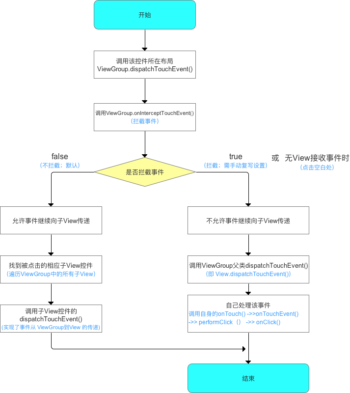

3、View事件的分发机制

```
public boolean dispatchTouchEvent(MotionEvent event) {
    ...
    final int actionMasked = event.getActionMasked();
    ...
    if (onFilterTouchEventForSecurity(event)) {
        // 是否是enable可点击的 && 通过鼠标操作滚动条
        if ((mViewFlags & ENABLED_MASK) == ENABLED && handleScrollBarDragging(event)) {
            result = true;
        }
        // 首先会判断当前View有没有设置OnTouchListener，
        // 如果OnTouchListener中的onTouch方法返回true，那么onTouchEvent方法就不会被调用，
        // 可见OnTouchListener的优先级要高于onTouchEvent，这样做的好处是方便在外界处理点击事件。
        ListenerInfo li = mListenerInfo;
        if (li != null && li.mOnTouchListener != null
                && (mViewFlags & ENABLED_MASK) == ENABLED
                && li.mOnTouchListener.onTouch(this, event)) {
            result = true;
        }

        if (!result && onTouchEvent(event)) {
            result = true;
        }
    }
   ...
    return result;
}
```

1.View的onTouchEvent

```
public boolean onTouchEvent(MotionEvent event) {
    final float x = event.getX();
    final float y = event.getY();
    final int viewFlags = mViewFlags;
    final int action = event.getAction();

    final boolean clickable = ((viewFlags & CLICKABLE) == CLICKABLE
            || (viewFlags & LONG_CLICKABLE) == LONG_CLICKABLE)
            || (viewFlags & CONTEXT_CLICKABLE) == CONTEXT_CLICKABLE;
    /**
     *讲解一
     */
    //首先判断当前View是不是DISABLED不可用状态
    if ((viewFlags & ENABLED_MASK) == DISABLED) {
        if (action == MotionEvent.ACTION_UP && (mPrivateFlags & PFLAG_PRESSED) != 0) {
            setPressed(false);
        }
        mPrivateFlags3 &= ~PFLAG3_FINGER_DOWN;
        //可点击的禁用视图仍然会消耗触摸事件，只是没有响应
        //如果不可用 同时当前控件的clickable与long_clickable
        //与CONTEXT_CLICKABLE全是false
        //那么才返回false
        return clickable;
    }
    //如果View有代理会执行这个方法
    if (mTouchDelegate != null) {
        if (mTouchDelegate.onTouchEvent(event)) {
            return true;
        }
    }
    
   /**
    *讲解二
    */
    //只要控件的clickable与long_clickable
    //与CONTEXT_CLICKABLE 有一个为true 
    // 或者此View可以在悬停或长按时显示工具提示，就进入
    if (clickable || (viewFlags & TOOLTIP) == TOOLTIP) {
        switch (action) {
            case MotionEvent.ACTION_UP:
                   ...
                    if (!mHasPerformedLongPress && !mIgnoreNextUpEvent) {
                        //移除长按监测
                        removeLongPressCallback();

                        // Only perform take click actions if we were in the pressed state
                        if (!focusTaken) {
                            // 当up事件发生时，会触发performClick方法
                            if (mPerformClick == null) {
                                mPerformClick = new PerformClick();
                            }
                            /**
                             *讲解三
                             */
                            // 如果View设置OnClickListener，那么performClick就会调用View的onClick方法
                            //发送到message到MessageQueue中，如果主线程还在运行中，就会返回true;
                            if (!post(mPerformClick)) {
                                performClickInternal();
                            }
                        }
                    }

                    ....
                break;

            case MotionEvent.ACTION_DOWN:
                ...
                //检查是否长按；最后会调用performLongClick()方法
                if (!clickable) {
                    checkForLongClick(0, x, y);
                    break;
                }
                
                ...
                break;

            case MotionEvent.ACTION_CANCEL:
                //取消相关Callback，修改状态值；
                if (clickable) {
                    setPressed(false);
                }
                removeTapCallback();
                removeLongPressCallback();
                mInContextButtonPress = false;
                mHasPerformedLongPress = false;
                mIgnoreNextUpEvent = false;
                mPrivateFlags3 &= ~PFLAG3_FINGER_DOWN;
                break;

            case MotionEvent.ACTION_MOVE:
                if (clickable) {
                    drawableHotspotChanged(x, y);
                }

                 //不在按钮内滑动，取消相关Callback
                if (!pointInView(x, y, mTouchSlop)) {
                    // Outside button
                    // Remove any future long press/tap checks
                    removeTapCallback();
                    removeLongPressCallback();
                    if ((mPrivateFlags & PFLAG_PRESSED) != 0) {
                        setPressed(false);
                    }
                    mPrivateFlags3 &= ~PFLAG3_FINGER_DOWN;
                }
                break;
        }
        /**
         *讲解四
         */
        return true;
    }

    return false;
}
```

PerformClick类

```
private final class PerformClick implements Runnable {
    @Override
    public void run() {
        performClickInternal();
    }
}

private boolean performClickInternal() {
    // Must notify autofill manager before performing the click actions to avoid scenarios where
    // the app has a click listener that changes the state of views the autofill service might
    // be interested on.
    notifyAutofillManagerOnClick();

    return performClick();
}

public boolean performClick() {
    
    notifyAutofillManagerOnClick();

    final boolean result;
    final ListenerInfo li = mListenerInfo;
    if (li != null && li.mOnClickListener != null) {
        playSoundEffect(SoundEffectConstants.CLICK);
        //调用onClick()方法；
        li.mOnClickListener.onClick(this);
        result = true;
    } else {
        result = false;
    }

    sendAccessibilityEvent(AccessibilityEvent.TYPE_VIEW_CLICKED);

    notifyEnterOrExitForAutoFillIfNeeded(true);

    return result;
}
```

```
private void checkForLongClick(int delayOffset, float x, float y) {
    if ((mViewFlags & LONG_CLICKABLE) == LONG_CLICKABLE || (mViewFlags & TOOLTIP) == TOOLTIP) {
        mHasPerformedLongPress = false;

        if (mPendingCheckForLongPress == null) {
            mPendingCheckForLongPress = new CheckForLongPress();
        }
        mPendingCheckForLongPress.setAnchor(x, y);
        mPendingCheckForLongPress.rememberWindowAttachCount();
        mPendingCheckForLongPress.rememberPressedState();
        //ViewConfiguration.getLongPressTimeout()时间为500ms，所以当用户按下去500ms之后就会回OnLongClickListener.onLongClick方法；
        //如果500ms之内手指弹起，会发生ACTION_UP事件，此时会移出长按监测，这样就不会发生长按事件
        postDelayed(mPendingCheckForLongPress,
                ViewConfiguration.getLongPressTimeout() - delayOffset);
    }
}
```

通过以上代码可以看出：

* 当发生ACTION_DOWN的时候，开始长按监测，如果用户手指按下时间超过500ms才会发生长按事件，少于500ms就是onClick事件；可以得知，是否是长按事件是在Java层进行判断的，并且和ACTION_MOVE事件没有关系。
* onLongClick方法返回true之后会将mHasPerformedLongPress属性置为true，在Up的时候就不会执行onClick，如果onlongClick返回false在Up事件到来时就会执行onClick
* onClick是否会发生的前提是当前View是可点击的，并且它收到了Down和Up事件，
* 只要View的CLICKABLE和LONG_CLICKABLE有一个为TRUE，那么该View就会消耗掉该事件，可以看出以上无论是Down、Move还是Up事件，最终都return true；

* 讲解一

由代码可知即使控件是DISABLED状态，只要clickable与longclickable有一个返回true那么此方法就返回true，即事件被消费。但是不会执行onClick()方法。这点通过代码很容易理解。

* 讲解二

讲解二中只要有一个条件满足。就会进入switch语句。当接收到MotionEvent.ACTION_UP时(前提MotionEvent.ACTION_DOWN也接收到了)会经过判断最后执行 performClick();方法。

* 讲解三

performClick()方法内部会执行我们设置的监听，即onClick()方法。

* 讲解四

由代码可知只要讲解二中的if语句成立，不管进入switch中的任何ACTION或是都不进入，返回值都是true，即事件消费了。同时讲解四也证明默认情况下是返回true


总结：

1. 整个View的事件分发流程：

View.dispatchEvent->View.setOnTouchListener->View.onTouchEvent
在dispatchTouchEvent中会进行OnTouchListener的判断，如果OnTouchListener不为null且返回true，则表示事件被消费，onTouchEvent不会被执行；否则执行onTouchEvent。

2. onTouchEvent中的DOWN,MOVE,UP

* DOWN时：

a、首先设置标志为PREPRESSED，设置mHasPerformedLongPress=false ;然后发出一个115ms后的mPendingCheckForTap；
b、如果115ms内没有触发UP，则将标志置为PRESSED，清除PREPRESSED标志，同时发出一个延时为500-115ms的，检测长按任务消息；
c、如果500ms内（从DOWN触发开始算），则会触发LongClickListener:

此时如果LongClickListener不为null，则会执行回调，同时如果LongClickListener.onClick返回true，才把mHasPerformedLongPress设置为true;否则mHasPerformedLongPress依然为false;

* MOVE时：

主要就是检测用户是否划出控件，如果划出了：

115ms内，直接移除mPendingCheckForTap；
115ms后，则将标志中的PRESSED去除，同时移除长按的检查：removeLongPressCallback();

* UP时：

a、如果115ms内，触发UP，此时标志为PREPRESSED，则执行UnsetPressedState，setPressed(false);会把setPress转发下去，可以在View中复写dispatchSetPressed方法接收；
b、如果是115ms-500ms间，即长按还未发生，则首先移除长按检测，执行onClick回调；
c、如果是500ms以后，那么有两种情况：
i.设置了onLongClickListener，且onLongClickListener.onClick返回true，则点击事件OnClick事件无法触发；
ii.没有设置onLongClickListener或者onLongClickListener.onClick返回false，则点击事件OnClick事件依然可以触发；
d、最后执行setPressed刷新背景，然后将PRESSED标识去除；


## Android View 绘制流程 & 自定义View

一、ViewRoot和DecorView

1、ViewRoot对应于ViewRootImp类，它是连接WindowManager和DecorView的纽带，View的三大流程均是通过ViewRoot来完成的。在ActivityThread中，当Activity对象被创建完毕后，会将DecorView添加到Window中，同时会创建ViewRootImp对象，并将ViewRootImp对象和DecorView建立关联，这个过程如下：

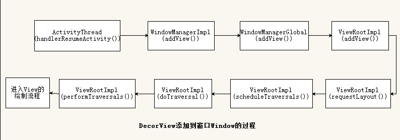

2、View的绘制流程:

从ViewRoot的performTraversals方法开始

1. measure:用来测量View的宽高
2. layout:来确定View在父容器的放置位置
3. draw:负责将View绘制在屏幕上。

3、performTraversals的绘制流程如图：


1. performTraversals会依次调用performMeasure、performLayout、performDraw，这三个方法，这三个方法分别完成顶级View的measure、、layout、draw这三个流程
2. 其中在performMeasure会调用measure方法，在measure方法中又会调用onMeasure方法，在onMeasure方法中则会对所有的子元素进行measure过程，这个时候measure流程就从父容器传递到子元素中了，这样就完成了一次measure过程。接着子元素会重复父容器的measure过程，如此反复就完成了整个View树的遍历。
3. 同理performLayout和performDraw的传递流程和performMeasure是类似的，唯一不同的是，performDraw的传递过程是在draw方法中通过dispatch来实现的。

注意：

* measure的过程决定了View的宽高，Measure完成以后，可以通过getMeasuredWidth和getMeasuredHeight方法来获取到View测量后的宽高，在几乎所有的情况下他都等同于View最终的宽高，但是特殊情况除外。
* Layout过程决定了View的四个顶点的坐标和实际View的宽高，完成以后，可以通过getTop、getBottom、getLeft、getRight来拿到View的四个顶点的位置，并可以通过getWith和getHeight方法拿到View的最终宽高。
* Draw过程决定了View的显示，只有draw方法完成以后View的内容才能呈现在屏幕上。

4、顶级View：DecorView

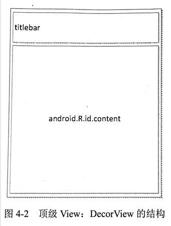

DecorView作为顶级View，其实是一个的FrameLayout ，它包含一个竖直方向的LinearLayout，这个 LinearLayout分为标题栏和内容栏两个部分。在Activity通过setContextView所设置的布局文件其实就是被加载到内容栏之中的。这个内容栏的id 是 R.android.id.content ，通过 ViewGroup content = findViewById(R.android.id.content); 可以得到这个contentView，通过content.getChildAt(0)可以得到我们自己设置的View。View层的事件都是先经 过DecorView，然后才传递到子View。

二、理解MeasureSpec

测量过程中，系统将View的 LayoutParams 根据父容器所施加的规则转换成对应的 MeasureSpec，然后根据这个MeasureSpec来测量出View的宽高。这里宽高是测量宽高，不一定等于View最终的宽高。

1、MeasureSpec

1.MeasureSpec代表一个32位int值，高2位代表SpecMode（测量模式），低30位代表 SpecSize（在某个测量模式下的规格大小）

```
private static final int MODE_SHIFT = 30;
private static final int MODE_MASK  = 0x3 << MODE_SHIFT;
public static final int UNSPECIFIED = 0 << MODE_SHIFT;
public static final int EXACTLY     = 1 << MODE_SHIFT;
public static final int AT_MOST     = 2 << MODE_SHIFT;
...
public static int makeMeasureSpec(int size,int mode) {
    if (sUseBrokenMakeMeasureSpec) {
        return size + mode;
    } else {
        return (size & ~MODE_MASK) | (mode & MODE_MASK);
    }
}
...
public static int getMode(int measureSpec) {
    //noinspection ResourceType
    return (measureSpec & MODE_MASK);
}
      
public static int getSize(int measureSpec) {
    return (measureSpec & ~MODE_MASK);
}        
```

2.SpecMode有三种：

1. UNSPECIFIED ：父容器对View不进行任何限制，要多大给多大，一般用于系统内部，表示一种测量状态
2. EXACTLY：父容器检测到View所需要的精确大小，这时候View的最终大小就是SpecSize所指定的值，对应LayoutParams中的match_parent和具体数值这两种模式
3. AT_MOST ：对应View的默认⼤大⼩小，不不同View实现不不同，View的⼤大⼩小不不能⼤大于⽗父容 器器 的SpecSize，对应 LayoutParams 中的 wrap_content

3.MeasureSpec和LayoutParams的对应关系

View测量的时候，系统会将LayoutParams在父容器的约束下转换成对应的MeasureSpec，然后再根据这个MeasureSpec来确定View测量后的宽高。

View的MeasureSpec由父容器的MeasureSpec和自身的LayoutParams共同决定。

顶级View（DecorView）和普通View的MeasureSpec转换略不同。

* DecorView：MeasureSpec由窗口尺寸和自身的LayoutParams共同确定。
* 普通View：MeasureSpec由父容器的MeasureSpec和自身LayoutParams共同确定。

MeasureSpec一旦确定，onMeasure中就可以确定View的测量宽高

DecorView在ViewRootImpl中measureHierarchy方法中展示了DecorView的MeasureSpec创建过程，其中desiredWindowWidth和desiredWindowHeight是屏幕尺寸：

```
childWidthMeasureSpec = getRootMeasureSpec(desiredWindowWidth, lp.width);
childHeightMeasureSpec = getRootMeasureSpec(desiredWindowHeight, lp.height);

private static int getRootMeasureSpec(int windowSize, int rootDimension) {
    int measureSpec;
    switch (rootDimension) {

    case ViewGroup.LayoutParams.MATCH_PARENT:
        // Window can't resize. Force root view to be windowSize.
        measureSpec = MeasureSpec.makeMeasureSpec(windowSize, MeasureSpec.EXACTLY);
        break;
    case ViewGroup.LayoutParams.WRAP_CONTENT:
        // Window can resize. Set max size for root view.
        measureSpec = MeasureSpec.makeMeasureSpec(windowSize, MeasureSpec.AT_MOST);
        break;
    default:
        // Window wants to be an exact size. Force root view to be that size.
        measureSpec = MeasureSpec.makeMeasureSpec(rootDimension, MeasureSpec.EXACTLY);
        break;
    }
    return measureSpec;
}
```
通过上述代码:DecorView的MeasureSpec产生过程遵循如下规则，根据它的LayoutParams中的宽高来划分。

* LayoutParams.MATCH_PARENT：精确模式，大小就是窗口大小
* LayoutParams.WRAP_CONTENT：最大模式，大小不定，但是不能超过窗口大小
* 固定大小：精确模式，大小为LayoutParams中指定的大小

普通View(我们布局中的View)，View的measure过程由ViewGroup传递

* ViewGroup的measureChildWithMargins

```
protected void measureChildWithMargins(View child,
            int parentWidthMeasureSpec, int widthUsed,
            int parentHeightMeasureSpec, int heightUsed) {
    final MarginLayoutParams lp = (MarginLayoutParams) child.getLayoutParams();

    final int childWidthMeasureSpec = getChildMeasureSpec(parentWidthMeasureSpec,
            mPaddingLeft + mPaddingRight + lp.leftMargin + lp.rightMargin
                    + widthUsed, lp.width);
    final int childHeightMeasureSpec = getChildMeasureSpec(parentHeightMeasureSpec,
            mPaddingTop + mPaddingBottom + lp.topMargin + lp.bottomMargin
                    + heightUsed, lp.height);

    child.measure(childWidthMeasureSpec, childHeightMeasureSpec);
}
```

上述方法会对子元素进行measure，在调用子元素measure方法之前会通过getChildMeasureSpec方法得到子元素的MeasureSpec。
子元素的MeasureSpec的创建与父容器的MeasureSpec和子元素本身LayoutParams有关，还和View的margin及Padding有关。

```
public static int getChildMeasureSpec(int spec, int padding, int childDimension) {
    int specMode = MeasureSpec.getMode(spec);
    int specSize = MeasureSpec.getSize(spec);

    int size = Math.max(0, specSize - padding);

    int resultSize = 0;
    int resultMode = 0;

    switch (specMode) {
    // Parent has imposed an exact size on us
    case MeasureSpec.EXACTLY:
        if (childDimension >= 0) {
            resultSize = childDimension;
            resultMode = MeasureSpec.EXACTLY;
        } else if (childDimension == LayoutParams.MATCH_PARENT) {
            // Child wants to be our size. So be it.
            resultSize = size;
            resultMode = MeasureSpec.EXACTLY;
        } else if (childDimension == LayoutParams.WRAP_CONTENT) {
            // Child wants to determine its own size. It can't be
            // bigger than us.
            resultSize = size;
            resultMode = MeasureSpec.AT_MOST;
        }
        break;

    // Parent has imposed a maximum size on us
    case MeasureSpec.AT_MOST:
        if (childDimension >= 0) {
            // Child wants a specific size... so be it
            resultSize = childDimension;
            resultMode = MeasureSpec.EXACTLY;
        } else if (childDimension == LayoutParams.MATCH_PARENT) {
            // Child wants to be our size, but our size is not fixed.
            // Constrain child to not be bigger than us.
            resultSize = size;
            resultMode = MeasureSpec.AT_MOST;
        } else if (childDimension == LayoutParams.WRAP_CONTENT) {
            // Child wants to determine its own size. It can't be
            // bigger than us.
            resultSize = size;
            resultMode = MeasureSpec.AT_MOST;
        }
        break;

    // Parent asked to see how big we want to be
    case MeasureSpec.UNSPECIFIED:
        if (childDimension >= 0) {
            // Child wants a specific size... let him have it
            resultSize = childDimension;
            resultMode = MeasureSpec.EXACTLY;
        } else if (childDimension == LayoutParams.MATCH_PARENT) {
            // Child wants to be our size... find out how big it should
            // be
            resultSize = View.sUseZeroUnspecifiedMeasureSpec ? 0 : size;
            resultMode = MeasureSpec.UNSPECIFIED;
        } else if (childDimension == LayoutParams.WRAP_CONTENT) {
            // Child wants to determine its own size.... find out how
            // big it should be
            resultSize = View.sUseZeroUnspecifiedMeasureSpec ? 0 : size;
            resultMode = MeasureSpec.UNSPECIFIED;
        }
        break;
    }
    //noinspection ResourceType
    return MeasureSpec.makeMeasureSpec(resultSize, resultMode);
}
```

getChildMeasureSpec清楚地展示了普通View的MeasureSpec的创建规则，是根据父容器的MeasureSpec同时结合View自身的LayoutParams来确定子元素的MeasureSpec


规则：

1. 当View采用固定宽/高时（即设置固定的dp/px）,不管父容器的MeasureSpec是什么， View的MeasureSpec都是EXACTLY模式，并且大小遵循我们设置的值。
2. 当View的宽/高是 match_parent 时，View的MeasureSpec都是EXACTLY模式并且其大小等于父容器的剩余空间。
3. 当View的宽/高是 wrap_content时，View的MeasureSpec都是AT_MOST模式并且其大小不能超过父容器的剩余空间。
4. 父容器的UNSPECIFIED模式，一般用于系统内部多次Measure时，表示一种测量的状态，一般来说我们不需要关注此模式。

三、View的工作流程

1、measure过程

分两种情况：

* View：通过 measure 方法就完成了测量过程
* ViewGroup：除了完成自己的测量过程还会便利调用所有子View的measure方法，而且各个子View还会递归执行这个过程。

1.View的measure过程

* View的measure过程由measure方法来完成，measure方法是一个final类型的方法，意味着不能重写，它会调用View的onMeasure方法。

```
protected void onMeasure(int widthMeasureSpec, int heightMeasureSpec) {
    setMeasuredDimension(getDefaultSize(getSuggestedMinimumWidth(), widthMeasureSpec),
            getDefaultSize(getSuggestedMinimumHeight(), heightMeasureSpec));
}
```

setMeasuredDimension方法会设置View的宽高的测量值

```
public static int getDefaultSize(int size, int measureSpec) {
    int result = size;
    int specMode = MeasureSpec.getMode(measureSpec);
    int specSize = MeasureSpec.getSize(measureSpec);

    switch (specMode) {
    case MeasureSpec.UNSPECIFIED:
        result = size;
        break;
    case MeasureSpec.AT_MOST:
    case MeasureSpec.EXACTLY:
        result = specSize;
        break;
    }
    return result;
}
```
MeasureSpec.AT_MOST/MeasureSpec.EXACTLY模式：getDefaultSize返回的大小就是MeasureSpec中的specSize，这个specSize就是View测量后的大小（这里提到的的测量后的大小，是因为View最终的大小是在layout阶段确定的，所以要加以区分，但是几乎所有情况下View的测量大小和最终大小是相等的）

MeasureSpec.UNSPECIFIED：一般用于系统内部的测量，getDefaultSize返回的大小为它的第一个参数size，即宽高为getSuggestedMinimumWidth和getSuggestedMinimumHeight

```
protected int getSuggestedMinimumWidth() {
    return (mBackground == null) ? mMinWidth : max(mMinWidth, mBackground.getMinimumWidth());
}

protected int getSuggestedMinimumHeight() {
    return (mBackground == null) ? mMinHeight : max(mMinHeight, mBackground.getMinimumHeight());
}

//android/graphics/drawable/Drawable.java
// 返回Drawable的原始宽度，前提是这个Drawable有原始宽度，否则为0
public int getMinimumWidth() {
    final int intrinsicWidth = getIntrinsicWidth();
    return intrinsicWidth > 0 ? intrinsicWidth : 0;
}
```

通过getSuggestedMinimumWidth方法可以看出：

* 如果View没有设置背景，那么View的宽高为mMinWidth(对应于android:minWidth这个属性所指的值，这个属性如果不指定则默认为0)
* 如果View设置了背景，那么View的宽度为max(mMinWidth, mBackground.getMinimumWidth())(返回Drawable的原始宽度，前提是这个Drawable有原始宽度，否则为0)

总结：getSuggestedMinimumWidth逻辑

1. 如果View没有设置背景，那么返回android:minWidth这个属性所指定的值，这个值可以为0
2. 如果View设置了背景，那么返回android:minWidth和北京最小宽度这两者中最大的值

getSuggestedMinimumWidth和getSuggestedMinimumHeight的返回值就是View在UNSPECIFIED情况下的测量宽高

总结：View的宽高由specSize决定

直接继承View的自定义控件需要重写onMeasure方法并设置wrap_content(即specMode是AT_MOST模式）时的自身大小，否则在布局中使用 wrap_content相当于使用match_parent 。对于非 wrap_content 的情形，我们沿用系统的测量值即可。

原因：根据getDefaultSize方法和表4-1(普通View的MeasureSpec创建规则)，如果布局中使用wrap_content，那么它的speckMode是AT_MOST模式，在这种模式下，它的宽高等于specSize，查表可知，这种情况下View的speckSize是parentSize，而parentSize的父容器中可以使用的大小，也就是父容器中当前剩余的空间大小。很显然View的宽高就等于父容器当前剩余的空间大小，这种效果和布局中match_parent完全一致。
解决问题方法：

```
@Override
protected void onMeasure(int widthMeasureSpec, int heightMeasureSpec) {
    super.onMeasure(widthMeasureSpec, heightMeasureSpec);
    int widthSpaceSize = MeasureSpec.getSize(widthMeasureSpec);
    int widthSpecMode = MeasureSpec.getMode(widthMeasureSpec);
    int heightSpaceSize = MeasureSpec.getSize(heightMeasureSpec);
    int heightSpecMode = MeasureSpec.getMode(heightMeasureSpec);
    if(widthSpecMode == MeasureSpec.AT_MOST && heightSpecMode == MeasureSpec.AT_MOST){
    	setMeasuredDimension(mWidth,mHeight);
    } else if(widthSpecMode == MeasureSpec.AT_MOST){
    	setMeasuredDimension(mWidth,heightSpaceSize);
    } else if(heightSpecMode == MeasureSpec.AT_MOST){
    	setMeasuredDimension(widthSpaceSize, mHeight);
	 }
}	 
```

2.ViewGroup的measure过程

ViewGroup是一个抽象类，没有重写View的 onMeasure 方法，但是它提供了一个 measureChildren 方法。这是因为不同的ViewGroup子类有不同的布局特性，导致他们的测量细节各不相同，比如 LinearLayout 和 RelativeLayout,因此ViewGroup没办法统一实现onMeasure方法。

* measureChildren：

```
protected void measureChildren(int widthMeasureSpec, int heightMeasureSpec) {
    final int size = mChildrenCount;
    final View[] children = mChildren;
    for (int i = 0; i < size; ++i) {
        final View child = children[i];
        if ((child.mViewFlags & VISIBILITY_MASK) != GONE) {
            measureChild(child, widthMeasureSpec, heightMeasureSpec);
        }
    }
}
```

ViewGroup在measure时，会对每一个子元素进行measure

```
protected void measureChild(View child, int parentWidthMeasureSpec,
            int parentHeightMeasureSpec) {
    final LayoutParams lp = child.getLayoutParams();

    final int childWidthMeasureSpec = getChildMeasureSpec(parentWidthMeasureSpec,
            mPaddingLeft + mPaddingRight, lp.width);
    final int childHeightMeasureSpec = getChildMeasureSpec(parentHeightMeasureSpec,
            mPaddingTop + mPaddingBottom, lp.height);

    child.measure(childWidthMeasureSpec, childHeightMeasureSpec);
}
```	
measureChildren方法的流程：

1. measureChild取出子元素的LayoutParams
2. 通过getChildMeasureSpec来创建子元素的MeasureSpec
3. 传递给View的measure方法来进行测量。

通过LinearLayout的onMeasure方法里来分析ViewGroup的measure过程

```
protected void onMeasure(int widthMeasureSpec, int heightMeasureSpec) {
    if (mOrientation == VERTICAL) {
        measureVertical(widthMeasureSpec, heightMeasureSpec);
    } else {
        measureHorizontal(widthMeasureSpec, heightMeasureSpec);
    }
}
```

查看垂直布局

```
// See how tall everyone is. Also remember max width.
for (int i = 0; i < count; ++i) {
    final View child = getVirtualChildAt(i);
    ...
    // Determine how big this child would like to be. If this or
    // previous children have given a weight, then we allow it to
    // use all available space (and we will shrink things later
    // if needed).
    ...
    measureChildBeforeLayout(child, i, widthMeasureSpec, 0, heightMeasureSpec, usedHeight);
    final int childHeight = child.getMeasuredHeight();
    ...
    final int totalLength = mTotalLength;
    mTotalLength = Math.max(totalLength, totalLength + childHeight + lp.topMargin +
           lp.bottomMargin + getNextLocationOffset(child));        
```

遍历子元素并对每个子元素执行measureChildBeforeLayout方法，这个方法内部会调用子元素的measure方法，这样每个子元素就依次进入measure方法，并且通过mTotalLength这个变量来存储LinearLayout在竖直方向的初始高度，每测量一个子元素，mTotalLength就会增加，增加的部分主要包括子元素的高度以及子元素在处置方向上的margin等。当子元素测量完毕后，LinearLayout会测量自己的大小。

```
// Add in our padding
mTotalLength += mPaddingTop + mPaddingBottom;

int heightSize = mTotalLength;

// Check against our minimum height
heightSize = Math.max(heightSize, getSuggestedMinimumHeight());

// Reconcile our calculated size with the heightMeasureSpec
int heightSizeAndState = resolveSizeAndState(heightSize, heightMeasureSpec, 0);
heightSize = heightSizeAndState & MEASURED_SIZE_MASK;
...
setMeasuredDimension(resolveSizeAndState(maxWidth, widthMeasureSpec, childState), heightSizeAndState);
```

在水平方向测量遵循View测量过程，在竖直方向的测量过程：

1. 如果布局高度采用的是match_parent或者具体数值，那么测量过程和View一致，即高度为specSize
2. 如果布局高度采用的是wrap_content，那么它的高度是所有子元素占用的高度总和，但是任然不能超过父容器的剩余空间，还要考虑竖直方向上的padding

```
public static int resolveSizeAndState(int size, int measureSpec, int childMeasuredState) {
    final int specMode = MeasureSpec.getMode(measureSpec);
    final int specSize = MeasureSpec.getSize(measureSpec);
    final int result;
    switch (specMode) {
        case MeasureSpec.AT_MOST:
            if (specSize < size) {
                result = specSize | MEASURED_STATE_TOO_SMALL;
            } else {
                result = size;
            }
            break;
        case MeasureSpec.EXACTLY:
            result = specSize;
            break;
        case MeasureSpec.UNSPECIFIED:
        default:
            result = size;
    }
    return result | (childMeasuredState & MEASURED_STATE_MASK);
}
```

View的measure总结：

View的measure过程是三大流程中最复杂的一个，measure完成以后，通过 getMeasuredWidth/Height 方法就可以正确获取到View的测量后宽/高。在某些情况下，系统可能需要多次measure才能确定最终的测量宽/高，所以在onMeasure中拿到的宽/高很可能不是准确的。同时View的measure过程和Activity的生命周期并不是同步执行，因此无法保证在 Activity的 onCreate、onStart、onResume时某个View就已经测量完毕。所以有以下四种方式来获取View的宽高：

1.  Activity/View#onWindowFocusChanged。 onWindowFocusChanged这个方法的含义是：VieW已经初始化完毕了，宽高已经准备好了，需要注意：它会被调用多次，当Activity的窗口得到焦点和失去焦点均会被调用。

```
@Override
public void onWindowFocusChanged(boolean hasFocus) {
    super.onWindowFocusChanged(hasFocus);
    if (hasFocus) {
        int width = view.getMeasuredWidth();
        int height = view.getMeasuredHeight();
        Log.d(TAG, "onWindowFocusChanged, width= " + view.getMeasuredWidth() + " height= " + view.getMeasuredHeight());
    }
}
```

2. view.post(runnable)。 通过post将一个runnable投递到消息队列的尾部，当Looper调用此 runnable的时候，View也初始化好了。

```
@Override
protected void onStart() {
    super.onStart();
    view.post(new Runnable() {

        @Override
        public void run() {
            int width = view.getMeasuredWidth();
            int height = view.getMeasuredHeight();
        }
    });
}
```

3. ViewTreeObserver。 使用 ViewTreeObserver 的众多回调可以完成这个功能，比如OnGlobalLayoutListener这个接口，当View树的状态发生改变或View树内部的View的可见性发生改变时，onGlobalLayout 方法会被回调。需要注意的是，伴随着View树状态onGlobalLayout会被回调多次。

```
@Override
protected void onStart() {
    super.onStart();

    ViewTreeObserver observer = view.getViewTreeObserver();
    observer.addOnGlobalLayoutListener(new OnGlobalLayoutListener() {

        @SuppressWarnings("deprecation")
        @Override
        public void onGlobalLayout() {
            view.getViewTreeObserver().removeGlobalOnLayoutListener(this);
            int width = view.getMeasuredWidth();
            int height = view.getMeasuredHeight();
        }
    });
}
```

4. view.measure(int widthMeasureSpec,int heightMeasureSpec)，通过手动对View进行measure来得到View的宽高。

* match_parent： 无法measure出具体的宽高，因为不知道父容器的剩余空间即无法知道parentSize的大小，无法测量出View的大小，直接放弃
* 具体的数值（dp/px）：

比如宽高都是100px，measure如下

```
int widthMeasureSpec = MeasureSpec.makeMeasureSpec(100,MeasureSpec.EXACTLY);
int heightMeasureSpec = MeasureSpec.makeMeasureSpec(100,MeasureSpec.EXACTLY);
view.measure(widthMeasureSpec,heightMeasureSpec);
```

* wrap_content：

```
int widthMeasureSpec = MeasureSpec.makeMeasureSpec((1<<30)-1,MeasureSpec.AT_MOST);
// View的尺寸使用30位二进制表示，最大值30个1，在AT_MOST模式下，我们用View理论上能支持的最大值去构造MeasureSpec是合理的
int heightMeasureSpec = MeasureSpec.makeMeasureSpec((1<<30)-1,MeasureSpec.AT_MOST);
view.measure(widthMeasureSpec,heightMeasureSpec);
```

2、layout过程

layout的作用是ViewGroup用来确定子View的位置，当ViewGroup的位置被确定后，它会在 onLayout中遍历所有的子View并调用其layout方法，在 layout 方法中， onLayout 方法又会被调用。 layout 方法确定View本身的位置，而onLayout方法则会确定所有子元素的位置。

1.View的layout方法

```
public void layout(int l, int t, int r, int b) {
    if ((mPrivateFlags3 & PFLAG3_MEASURE_NEEDED_BEFORE_LAYOUT) != 0) {
        onMeasure(mOldWidthMeasureSpec, mOldHeightMeasureSpec);
        mPrivateFlags3 &= ~PFLAG3_MEASURE_NEEDED_BEFORE_LAYOUT;
    }

    int oldL = mLeft;
    int oldT = mTop;
    int oldB = mBottom;
    int oldR = mRight;

    boolean changed = isLayoutModeOptical(mParent) ?
            setOpticalFrame(l, t, r, b) : setFrame(l, t, r, b);

    if (changed || (mPrivateFlags & PFLAG_LAYOUT_REQUIRED) == PFLAG_LAYOUT_REQUIRED) {
        onLayout(changed, l, t, r, b);

        if (shouldDrawRoundScrollbar()) {
            if(mRoundScrollbarRenderer == null) {
                mRoundScrollbarRenderer = new RoundScrollbarRenderer(this);
            }
        } else {
            mRoundScrollbarRenderer = null;
        }

        mPrivateFlags &= ~PFLAG_LAYOUT_REQUIRED;

        ListenerInfo li = mListenerInfo;
        if (li != null && li.mOnLayoutChangeListeners != null) {
            ArrayList<OnLayoutChangeListener> listenersCopy =
                    (ArrayList<OnLayoutChangeListener>)li.mOnLayoutChangeListeners.clone();
            int numListeners = listenersCopy.size();
            for (int i = 0; i < numListeners; ++i) {
                listenersCopy.get(i).onLayoutChange(this, l, t, r, b, oldL, oldT, oldR, oldB);
            }
        }
    }

    final boolean wasLayoutValid = isLayoutValid();

    mPrivateFlags &= ~PFLAG_FORCE_LAYOUT;
    mPrivateFlags3 |= PFLAG3_IS_LAID_OUT;
    ...
}
```

layout大致流程如下：

1.  setFrame 确定View的四个顶点位置(即初始化mLeft,mRight,mTop,mBottom)，从而确定了View在父容器中的位置
2. 调用 onLayout 方法，确定所有子View的位置，View和ViewGroup均没有真正实(和onMeasure类似，onLayout的具体实现和具体布局相关)

2.通过LinearLayout的onLayout方法分析ViewGroup的onLayout方法

```
@Override
protected void onLayout(boolean changed, int l, int t, int r, int b) {
    if (mOrientation == VERTICAL) {
        layoutVertical(l, t, r, b);
    } else {
        layoutHorizontal(l, t, r, b);
    }
}
```

选择竖直方向

```
void layoutVertical(int left, int top, int right, int bottom) {
    final int paddingLeft = mPaddingLeft;

    int childTop;
    int childLeft;

    // Where right end of child should go
    final int width = right - left;
    int childRight = width - mPaddingRight;

    // Space available for child
    int childSpace = width - paddingLeft - mPaddingRight;

    final int count = getVirtualChildCount();

	 ...
    for (int i = 0; i < count; i++) {
        final View child = getVirtualChildAt(i);
        if (child == null) {
            childTop += measureNullChild(i);
        } else if (child.getVisibility() != GONE) {
            final int childWidth = child.getMeasuredWidth();
            final int childHeight = child.getMeasuredHeight();

            final LinearLayout.LayoutParams lp =
                    (LinearLayout.LayoutParams) child.getLayoutParams();
            ...
            if (hasDividerBeforeChildAt(i)) {
                childTop += mDividerHeight;
            }

            childTop += lp.topMargin;
            setChildFrame(child, childLeft, childTop + getLocationOffset(child),
                    childWidth, childHeight);
            childTop += childHeight + lp.bottomMargin + getNextLocationOffset(child);

            i += getChildrenSkipCount(child, i);
        }
    }
}
```

1. 遍历所有子元素并调用setChildFrame方法来为子元素指定对应位置，其中childTop会逐渐增大，这意味着后边的子元素会被放置在靠下位置，这符合LinearLayout竖直方向这一特性。
2. setChildFrame仅仅调用子元素的layout方法

这样父元素在layout方法中完成自己的定位后，就通过onLayout方法去调用子元素layout方法，子元素又会通过自己的layout方法来确定自己的位置，这样一层一层的传递下去就完成了整个View树的layout过程。

```
private void setChildFrame(View child, int left, int top, int width, int height) {
    child.layout(left, top, left + width, top + height);
}
```

该方法中的width和height实际上就是子元素的测量宽高。从下面代码可以得出：

```
final int childWidth = child.getMeasuredWidth();
final int childHeight = child.getMeasuredHeight();
setChildFrame(child, childLeft, childTop + getLocationOffset(child), childWidth, childHeight);
```

在子元素layout方法中会通过setFrame去设置子元素四个顶点的位置。这样子元素的位置就确定了

```
mLeft = left;
mTop = top;
mRight = right;
mBottom = bottom;
```

3、draw过程

View的绘制过程遵循如下几步：

1. 绘制背景 drawBackground(canvas)
2. 绘制自己(onDraw)
3. 绘制children(dispatchDraw 遍历所有子View的draw方法)
4. 绘制装饰(onDrawScrollBars)

```
public void draw(Canvas canvas) {
    final int privateFlags = mPrivateFlags;
    final boolean dirtyOpaque = (privateFlags & PFLAG_DIRTY_MASK) == PFLAG_DIRTY_OPAQUE &&
            (mAttachInfo == null || !mAttachInfo.mIgnoreDirtyState);
    mPrivateFlags = (privateFlags & ~PFLAG_DIRTY_MASK) | PFLAG_DRAWN;

    /*
     * Draw traversal performs several drawing steps which must be executed
     * in the appropriate order:
     *
     *      1. Draw the background
     *      2. If necessary, save the canvas' layers to prepare for fading
     *      3. Draw view's content
     *      4. Draw children
     *      5. If necessary, draw the fading edges and restore layers
     *      6. Draw decorations (scrollbars for instance)
     */

    // Step 1, draw the background, if needed
    int saveCount;

    if (!dirtyOpaque) {
        drawBackground(canvas);
    }

    // skip step 2 & 5 if possible (common case)
    final int viewFlags = mViewFlags;
    boolean horizontalEdges = (viewFlags & FADING_EDGE_HORIZONTAL) != 0;
    boolean verticalEdges = (viewFlags & FADING_EDGE_VERTICAL) != 0;
    if (!verticalEdges && !horizontalEdges) {
        // Step 3, draw the content
        if (!dirtyOpaque) onDraw(canvas);

        // Step 4, draw the children
        dispatchDraw(canvas);

        drawAutofilledHighlight(canvas);

        // Overlay is part of the content and draws beneath Foreground
        if (mOverlay != null && !mOverlay.isEmpty()) {
            mOverlay.getOverlayView().dispatchDraw(canvas);
        }

        // Step 6, draw decorations (foreground, scrollbars)
        onDrawForeground(canvas);

        // Step 7, draw the default focus highlight
        drawDefaultFocusHighlight(canvas);

        if (debugDraw()) {
            debugDrawFocus(canvas);
        }

        // we're done...
        return;
    }

    ...
}
```

View的绘制过程是通过dispatchDraw来实现的，dispatchDraw会遍历调用所有子元素的draw方法，这样draw事件就一层一层的传递下去了。

注：ViewGroup会默认启用 setWillNotDraw 为ture，导致系统不会去执行 onDraw ，所以自定义ViewGroup需要通过onDraw来绘制内容时，必须显式的关闭 WILL_NOT_DRAW 这个标记位，即调用setWillNotDraw(false)


四、自定义View

1、自定义View的分类

1. 继承View：通过 onDraw 方法来实现一些效果，需要自己支持 wrap_content ，并且 padding也要去进行处理。
2. 继承ViewGroup：实现自定义的布局方式，需要合适地处理ViewGroup的测量、布局这两个过程，并同时处理子View的测量和布局过程。
3. 继承特定的View子类（如TextView、Button）： 扩展某种已有的控件的功能，且不需要自己去管理wrap_content 和padding
4. 继承特定的ViewGroup子类（如LinearLayout）

2、自定义View须知

1. 直接继承View或ViewGroup的控件， 需要在onmeasure中对wrap_content做特殊处理。 指定wrap_content模式下的默认宽/高。
2. 直接继承View的控件，如果不在draw方法中处理padding，那么padding属性就无法起作用。直接继承ViewGroup的控件也需要在onMeasure和onLayout中考虑padding和子元素 margin的影响，不然padding和子元素的margin无效。
3. 尽量不要在View中使用Handler，因为没必要。View内部提供了post系列的方法，完全可以替代Handler的作用。
4. View中有线程和动画，需要在View的onDetachedFromWindow中停止。
5. View带有滑动嵌套情形时，需要处理好滑动冲突

3、如何对自定义View进行控制

1. 如果想控制View在屏幕上的渲染效果，就在重写onDraw()方法，在里面进行相应的处理。
2. 如果想要控制用户同View之间的交互操作，则在onTouchEvent()方法中对手势进行控制处理。
3. 如果想要控制View中内容在屏幕上显示的尺寸大小，就重写onMeasure()方法中进行处理。
4. 在 XML文件中设置自定义View的XML属性。
5. 如果想避免失去View的相关状态参数的话，就在onSaveInstanceState() 和 onRestoreInstanceState()方法中保存有关View的状态信息。

4、invalidate() 、postInvalidate()、requestLayout() 

1、invalidate() 

请求重绘View树，调用onDraw()方法。从头到尾并不会触发onMeasure（）方法（控制大小用）。如果是View就重绘View,如果是ViewGroup就全部重绘。

1.一般引起invalidate()操作的函数如下：

1. 直接调用invalidate()方法，请求重新draw()，但只会绘制调用者本身。
2. setSelection()方法 ：请求重新draw()，但只会绘制调用者本身。
3. setVisibility()方法 ： 当View可视状态在INVISIBLE转换VISIBLE时，会间接调用invalidate()方法，继而绘制该View。
4. setEnabled()方法 ： 请求重新draw()，但不会重新绘制任何视图包括该调用者本身。

2、postInvalidate(); 与invalidate()方法区别就是，postInvalidate()方法可以在UI线程执行，也可以在工作线程执行,而invalidate()只能在UI线程操作。但是从重绘速率讲：invalidate()效率高。

3。requestLayout():他跟invalidate()相反，他只调用measure()和layout()过程，不会调用draw()。不会重新绘制任何视图包括该调用者本身。

## Jvm、Dalvik和Art的区别

1、JVM Java虚拟机

JVM(Java Virtual Machine)是一种软件实现，执行像物理程序的机器。JVM并是不专为Java所实现运行的，只要其他编程语言的编译器能生成Java字节码，那这个语言也能实现在JVM上运行。因此，JVM通过执行Java bytecode可以使java代码在不改变的情况下在各种硬件之上。

2、Dalvik 虚拟机

DVM是Google专门为Android平台开发的虚拟机，它运行在Android运行时库中。Dalvik虚拟机是基于apache的java虚拟机，并被改进以适应低内存，低处理器速度的移动设备环境。Dalvik虚拟机依赖于Linux内核，实现进程隔离与线程调试管理，安全和异常管理，垃圾回收等重要功能。

3、DVM与JVM的区别

DVM之所以不是一个JVM ，主要原因是DVM并没有遵循JVM规范来实现。DVM与JVM主要有以下区别。

* 基于的架构不同

JVM基于栈则意味着需要去栈中读写数据，所需的指令会更多，这样会导致速度慢，对于性能有限的移动设备，显然不是很适合。
DVM是基于寄存器的，它没有基于栈的虚拟机在拷贝数据而使用的大量的出入栈指令，同时指令更紧凑更简洁。但是由于显示指定了操作数，所以基于寄存器的指令会比基于栈的指令要大，但是由于指令数量的减少，总的代码数不会增加多少。

* 执行的字节码不同

在Java SE程序中，Java类会被编译成一个或多个.class文件，打包成jar文件，而后JVM会通过相应的.class文件和jar文件获取相应的字节码。执行顺序为： .java文件 -> .class文件 -> .jar文件
而DVM会用dx工具将所有的.class文件转换为一个.dex文件，然后DVM会从该.dex文件读取指令和数据。执行顺序为：.java文件 –>.class文件-> .dex文件

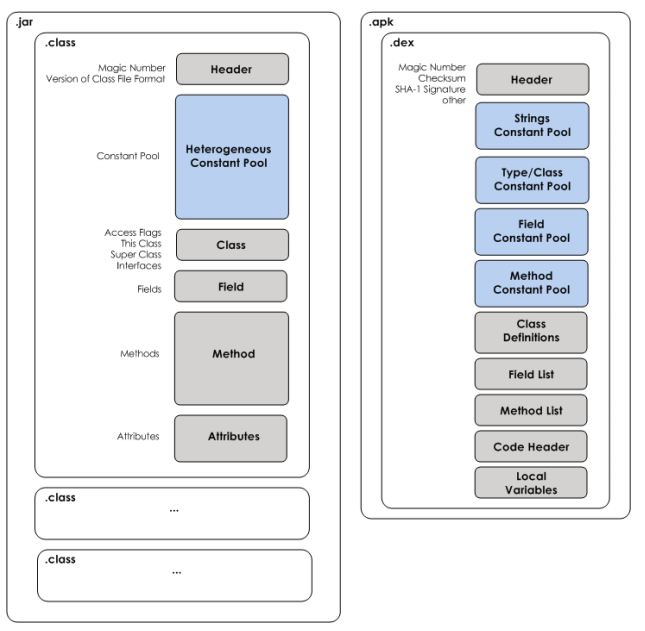

.jar文件里面包含多个.class文件，每个.class文件里面包含了该类的常量池、类信息、属性等等。当JVM加载该.jar文件的时候，会加载里面的所有的.class文件，JVM的这种加载方式很慢，对于内存有限的移动设备并不合适。
而在.apk文件中只包含了一个.dex文件，这个.dex文件里面将所有的.class里面所包含的信息全部整合在一起了，这样再加载就提高了速度。.class文件存在很多的冗余信息，dex工具会去除冗余信息，并把所有的.class文件整合到.dex文件中，减少了I/O操作，提高了类的查找速度。

* DVM允许在有限的内存中同时运行多个进程

DVM经过优化，允许在有限的内存中同时运行多个进程。在Android中的每一个应用都运行在一个DVM实例中，每一个DVM实例都运行在一个独立的进程空间。独立的进程可以防止在虚拟机崩溃的时候所有程序都被关闭。

4、ART虚拟机

ART(Android Runtime)是Android 4.4发布的，用来替换Dalvik虚拟，Android 4.4默认采用的还是DVM，系统会提供一个选项来开启ART。在Android 5.0时，默认采用ART，DVM从此退出历史舞台。

* ART与DVM的区别

ART 的机制与 Dalvik 不同。在Dalvik下，应用每次运行的时候，字节码都需要通过即时编译器（just in time ，JIT）转换为机器码，这会拖慢应用的运行效率，而在ART 环境中，应用在第一次安装的时候，字节码就会预先编译成机器码，使其成为真正的本地应用。这个过程叫做预编译（AOT,Ahead-Of-Time）。这样的话，应用的启动(首次)和执行都会变得更加快速。

Dalvik与Art的区别：

* Dalvik每次都要编译再运行，Art只会首次启动编译
* Art占用空间比Dalvik大（原生代码占用的存储空间更大），就是用“空间换时间”
* Art减少编译，减少了CPU使用频率，使用明显改善电池续航
* Art应用启动更快、运行更快、体验更流畅、触感反馈更及时

ART、Dalvik、AOT、JIT四个名称的关系：

* JIT代表运行时编译策略，也可以理解成一种运行时编译器，是为了加快Dalvik虚拟机解释dex速度提出的一种技术方案，来缓存频繁使用的本地机器码
* ART和Dalvik都算是一种Android运行时环境，或者叫做虚拟机，用来解释dex类型文件。但是ART是安装时解释，Dalvik是运行时解释
* AOT可以理解为一种编译策略，即运行前编译，ART虚拟机的主要特征就是AOT

## App打包原理

一、apk解压后的目录

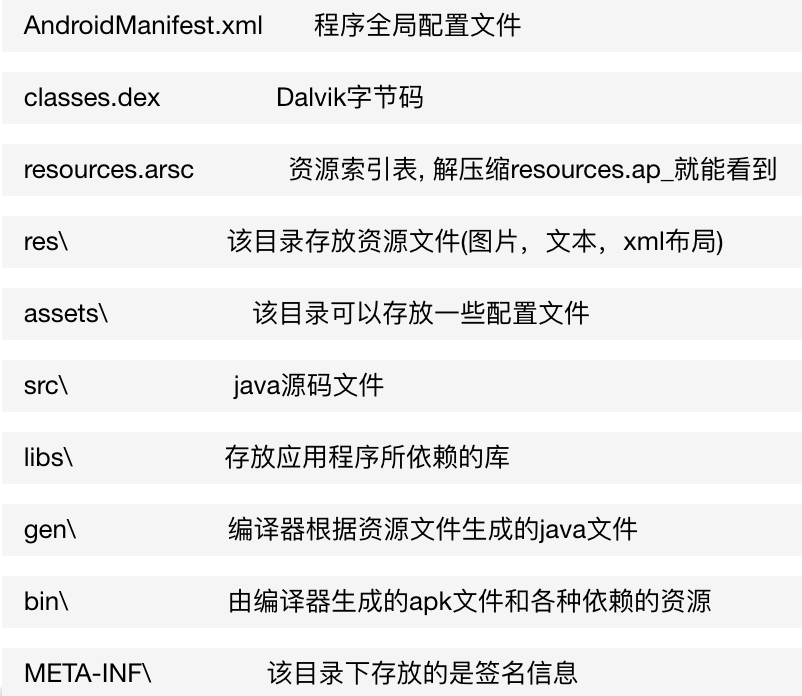

二、构建步骤：

1. AAPT（Android Asset Packaging Tool）工具，Android资源打包工具。会打包资源文件（res文件夹下的文件），并生成R.java和resources.arsc文件。
2. AIDL工具会将所有的.aidl文件编译成.java文件。
3. JAVAC工具将R.java、AIDL接口生成的java文件、应用代码java文件编译成.class文件。
4. dx脚本将很多.class文件转换打包成一个.dex文件。
5. apkbuilder脚本将资源文件和.dex文件生成未签名的.apk文件。
6. jarsigner对apk进行签名。

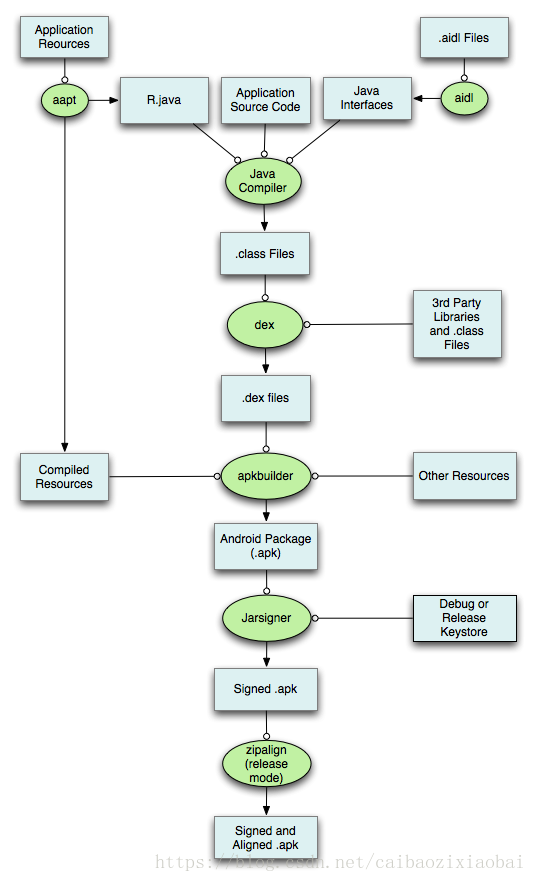

## Retrofit 原理

一、概要

Retrofit是square公司的开源力作，和同属square公司开源的OkHttp，一个负责网络调度，一个负责网络执行，为Android开发者提供了即方便又高效的网络访问框架。

1. 准确来说，Retrofit 是一个 RESTful 的 HTTP 网络请求框架的封装。
2. 原因：网络请求的工作本质上是 OkHttp 完成，而 Retrofit 仅负责网络请求接口的封装

二、使用

1.定义接口

Retrofit要求定义一个网络请求的接口，接口函数里要定义url路径、请求参数、返回类型。

```
public interface INetApiService {
    @GET("/demobiz/api.php")
    Call<Person> getBizInfo(@Query("id") String id);
}
```

在这个接口定义中，用注解@GET("/demobiz/api.php")声明了url路径，用注解@Query("id") 声明了请求参数。
最重要的是，用Call<Person>声明了返回值是一个Retrofit的Call对象，并且声明了这个对象处理的数据类型为Person，Person是我们自定义的数据模型。

2.依次获得Retrofit对象、接口实例对象、网络工作对象

首先，需要新建一个retrofit对象。
然后，根据上一步的接口，实现一个retrofit加工过的接口对象。
最后，调用接口函数，得到一个可以执行网络访问的网络工作对象。

```
//新建一个Retrofit对象
Retrofit retrofit=new Retrofit.Builder()
.baseUrl(Config.DOMAIN)//要访问的网络地址域名，如http://www.zhihu.com
.addConverterFactory(GsonConverterFactory.create())
.build();
...

//用retrofit加工出对应的接口实例对象
INetApiService netApiService= retrofit.create(INetApiService.class);
//可以继续加工出其他接口实例对象
IOtherService otherService= retrofit.create(IOtherService.class);
···

//调用接口函数，获得网络工作对象
Call<Person> callWorker= netApiService.getBizInfo("id001");
```

这个复杂的过程下来，最终得到的callWorker对象，才可以执行网络访问。

3.访问网络数据
用上一步获取的worker对象，执行网络请求

```
callWorker.enqueue(new Callback<Person>() {
            @Override
            public void onResponse(Call<Person> call, Response<Person> response) {...}
            @Override
            public void onFailure(Call<Person> call, Throwable t) {...}
        });

```

在回调函数里，取得我们需要的BizEntity数据对象。网络访问结束。

三、角色与作用

我们从上面的应用场景可以看出，Retrofit并不做网络请求，只是生成一个能做网络请求的对象。
Retrofit的作用是按照接口去定制Call网络工作对象

Retrofit一方面从底层统一用OkHttp去做网络处理；另一方面在外层灵活提供能直接融入业务逻辑的Call网络访问对象。

具体来说，Retrofit只负责生产对象，生产能做网络请求的工作对象，他有点像一个工厂，只提供产品，工厂本身不处理网络请求，产品才能处理网络请求。
Retrofit在网络请求中的作用大概可以这样理解：

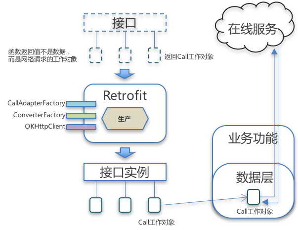

我们看到，从一开始，Retrofit要提供的就是个Call工作对象。
换句话说，对于给Retrofit提供的那个接口

```
public interface INetApiService {
    @GET("/demobiz/api.php")
    Call<Person> getBizInfo(@Query("id") String id);
}
```

这个接口并不是传统意义上的网络请求接口，这个接口不是用来获取数据的接口，而是用来生产对象的接口，这个接口相当于一个工厂，接口中每个函数的返回值不是网络数据，而是一个能进行网络请求的工作对象，我们要先调用函数获得工作对象，再用这个工作对象去请求网络数据。

所以Retrofit的实用价值意义在于，他能根据你的接口定义，灵活地生成对应的网络工作对象，然后你再择机去调用这个对象访问网络。

四、功能扩展

1、OkHttpClient

Retrofit使用OkHttpClient来实现网络请求，这个OkHttpClient虽然不能替换为其他的网络执行框架比如Volley，但是Retrofit允许我们使用自己扩展OkHttpClient，一般最常扩展的就是Interceptor拦截器了

```
OkHttpClient mClient = new OkHttpClient.Builder()
                .addInterceptor(new Interceptor() {
                    @Override
                    public Response intercept(Chain chain) throws IOException {
                        Request.Builder builder = chain.request().newBuilder();
                        builder.addHeader("Accept-Charset","UTF-8");
                        builder.addHeader("Accept","application/json");
                        builder.addHeader("Content-type", "application/json");
                        Request request = builder.build();
                        return chain.proceed(request);
                    }
                }).build();

Retrofit retrofit = new Retrofit.Builder()
                .baseUrl(Config.DOMAIN)
                .addConverterFactory(GsonConverterFactory.create())
                .client(mClient)
                .build();
```

2、addConverterFactory

扩展的是对返回的数据类型的自动转换，把一种数据对象转换为另一种数据对象。
在上述场景中，GsonConverterFactory可以把Http访问得到的json字符串转换为Java数据对象Person，这个Person是在INetApiService接口中要求的的。
这种转换我们自己也经常做，很好理解。
如果现有的扩展包不能满足需要，可以继承Retrofit的接口。retrofit2.Converter<F,T>，自己实现Converter和ConverterFactory。
在创建Retrofit对象时，可以插入我们自定义的ConverterFactory。

```
//retrofit对象
Retrofit retrofit=new Retrofit.Builder()
.baseUrl(Config.DOMAIN)
.addConverterFactory(GsonConverterFactory.create())
.addConverterFactory(YourConverterFactory.create())//添加自定义Converter
.build();
```

3、addCallAdapterFactory

扩展的是对网络工作对象callWorker的自动转换，把Retrofit中执行网络请求的Call对象，转换为接口中定义的Call对象。
这个转换不太好理解，我们可以对照下图来理解：


Retrofit本身用一个OkHttpCall的类负责处理网络请求，而我们在接口中定义需要定义很多种Call，例如Call<Person>，或者Flowable<Person>等，接口里的Call和Retrofit里的OkHttpCall并不一致，所以我们需要用一个CallAdapter去做一个适配转换。
（Retrofit底层虽然使用了OkHttpClient去处理网络请求，但她并没有使用okhttp3.call这个Call接口，而是自己又建了一个retrofit2.Call接口，OkHttpCall继承的是retrofit2.Call，与okhttp3.call只是引用关系。
这样的设计符合依赖倒置原则，可以尽可能的与OkHttpClient解耦。）

这其实是Retrofit非常核心，也非常好用的一个设计，如果我们在接口中要求的函数返回值是个RxJava的Flowable对象

```
public interface INetApiService {
    @GET("/demobiz/api.php")
    Flowable<Person> getBizInfo(@Query("id") String id);
}
```

那么我们只需要为Retrofit添加对应的扩展

```
//retrofit对象
Retrofit retrofit=new Retrofit.Builder()
.baseUrl(Config.DOMAIN)
.addConverterFactory(GsonConverterFactory.create())
.addCallAdapterFactory(RxJava2CallAdapterFactory.create())
.build();
```

就能得到Flowable类型的callWorker对象

```
//用retrofit加工出对应的接口实例对象
INetApiService netApiService= retrofit.create(INetApiService.class);
···
//调用接口函数，获得网络工作对象
Flowable<Person> callWorker= netApiService.getBizInfo("id001");
```

在这里，callAdapter做的事情就是把retrofit2.Call对象适配转换为Flowable<T>对象。
同样，如果现有的扩展包不能满足需要，可以继承Retrofit的接口retrofit2.CallAdapter<R,T>，自己实现CallAdapter和CallAdapterFactory。

五、Retrofit实现原理

Retrofit使用的，就是动态代理，方法注解、建造者和适配器等成熟的技术或模式

1、Retrofit实现原理——从动态代理开始

从前面的使用场景可知，retrofit会生成一个接口实例。

```
//用retrofit加工出对应的接口实例对象
INetApiService netApiService= retrofit.create(INetApiService.class);
```

到Retrofit源码里看create函数，是一个动态代理。

```
public <T> T create(final Class<T> service) {
    ...
    return (T) Proxy.newProxyInstance(service.getClassLoader(), new Class<?>[] { service },
        new InvocationHandler() {
          private final Platform platform = Platform.get();
          private final Object[] emptyArgs = new Object[0];

          @Override public Object invoke(Object proxy, Method method, @Nullable Object[] args)
              throws Throwable {
            // If the method is a method from Object then defer to normal invocation.
            if (method.getDeclaringClass() == Object.class) {
              return method.invoke(this, args);
            }
            if (platform.isDefaultMethod(method)) {
              return platform.invokeDefaultMethod(method, service, proxy, args);
            }
            return loadServiceMethod(method).invoke(args != null ? args : emptyArgs);
          }
        });
  }
```

要理解动态代理，最好要看到动态生成的代理类。

由于动态代理是在运行时动态生成的代理类，用常规的反编译方法无法查看，一般要使用Java提供的sun.misc.ProxyGenerator.generateProxyClass(String proxyName,class[] interfaces)函数生成代理类，函数会返回byte[]字节码，然后对字节码反编译得到Java代码。
有一个小问题是，AndroidStudio并不提供sun.misc这个包，我们需要用IntelliJ或者Eclipse建立一个Java工程，在Java环境里调用这个函数。

拿到的代理类，大概是这样的：

```
public final class INetApiService extends Proxy implements INetApiService {
  ...//一些Object自带方法
  private static Method m3;//接口定义的方法
  static {
    try {
      //Object自带方法的初始化
      m0,m1,m2 = ...
      //接口中定义的方法
      m3 = Class.forName("com.demo.net$INetApiService")//反射接口类
          .getMethod("getBizInfo",//反射函数
              new Class[] { Class.forName("java.lang.String") });//反射参数
      //接口中定义的其他方法
      ...
    } 
    ...
  }
//返回接口实例对象
public INetApiService (InvocationHandler invocationHandler){
  super(invocationHandler);
}
//
public final Call getBizInfo(String str){
  ...
  try{//用Handler去调用
    return (Call)this.h.invoke(this, m3, new Object[]{str});
  }
}

}
```

我们可以看到，代理类生成的是一个INetApiService接口的实例对象，该对象的getBizInfo函数返回的是接口中定义的Call网络工作对象，这也体现了Retrofit的核心价值，生成接口定义的Call网络工作对象。

那么，这个Call网络工作对象是如何生成的呢，上面动态代理生成的代码是这样的：

```
return (Call)this.h.invoke(this, m3, new Object[]{str});
```

也就是说，这个Call网络工作对象是在InvocationHandler中实现的，也就是在Retrofit.create函数中，由InvocationHandler实现的。

这样我们就明白了，Retrofit使用动态代理，其实是为了开发者在写代码时方便调用，而真正负责生产Call网络工作对象的，还是Retrofit.create函数中定义的这个InvocationHandler，这个InvocationHandler的代码我们再贴一遍：

ServiceMethod能让我们准确解析到INetApiService中定义的函数，为最后的适配转换提供转换目标

2、Retrofit实现原理——适配转换Call对象

我们在初始化Retrofit对象时，好像不添加CallAdapterFactory也能实现适配转换。

```
//retrofit对象
Retrofit retrofit=new Retrofit.Builder()
.baseUrl(Config.DOMAIN)
.addConverterFactory(GsonConverterFactory.create())
//可以不添加CallAdapterFactory
.build()
```

这是怎么回事呢，我们知道Retrofit使用了建造者模式，建造者模式的特定就是实现了建造和使用的分离，所以建造者模式的建造函数里，一般会有很复杂的对象创建和初始化过程，所以我们要看一下Retrofit的build函数。

```
public Retrofit build() {
  if (baseUrl == null) {
    throw new IllegalStateException("Base URL required.");
  }

  okhttp3.Call.Factory callFactory = this.callFactory;
  if (callFactory == null) {
    callFactory = new OkHttpClient();
  }

  Executor callbackExecutor = this.callbackExecutor;
  if (callbackExecutor == null) {
    callbackExecutor = platform.defaultCallbackExecutor();
  }

  //根据当前运行平台，设置默认的callAdapterFactory
  List<CallAdapter.Factory> callAdapterFactories = new ArrayList<>(this.callAdapterFactories);
  callAdapterFactories.addAll(platform.defaultCallAdapterFactories(callbackExecutor));

  // Make a defensive copy of the converters.
  List<Converter.Factory> converterFactories = new ArrayList<>(
      1 + this.converterFactories.size() + platform.defaultConverterFactoriesSize());

  // Add the built-in converter factory first. This prevents overriding its behavior but also
  // ensures correct behavior when using converters that consume all types.
  converterFactories.add(new BuiltInConverters());
  converterFactories.addAll(this.converterFactories);
  converterFactories.addAll(platform.defaultConverterFactories());

  return new Retrofit(callFactory, baseUrl, unmodifiableList(converterFactories),
      unmodifiableList(callAdapterFactories), callbackExecutor, validateEagerly);
}
```

这段代码里，我们看到Retrofit使用OkHttpClient处理网络请求，并且会添加默认的callAdapterFactory，这个platform是一个简单工厂，能根据当前系统平台去生成对应的callAdapterFactory

```
private static Platform findPlatform() {
    try {
      Class.forName("android.os.Build");
      if (Build.VERSION.SDK_INT != 0) {
        return new Android();//根据当前系统平台返回相应的对象
      }
    } catch (ClassNotFoundException ignored) {
    }
    try {
      Class.forName("java.util.Optional");
      return new Java8();
    } catch (ClassNotFoundException ignored) {
    }
    return new Platform();
  }
  
static class Android extends Platform {
    ...
    @Override CallAdapter.Factory defaultCallAdapterFactory(@Nullable Executor callbackExecutor) {
      if (callbackExecutor == null) throw new AssertionError();
      ExecutorCallAdapterFactory executorFactory = new ExecutorCallAdapterFactory(callbackExecutor);
      return Build.VERSION.SDK_INT >= 24
        ? asList(CompletableFutureCallAdapterFactory.INSTANCE, executorFactory)
        : singletonList(executorFactory);
    }
    ...
  }  
```

这个Platform是Retrofit在Builder的构造函数里初始化的。

所以，在Retrofit.build()函数中，我们为Retrofit默认添加的callAdapterFactory，是在Platform中为Android系统设定的ExecutorCallAdapterFactory。
我们看ExecutorCallAdapterFactory的代码，这是一个工厂类，可以返回CallAdapter对象：

```
@Override
  public CallAdapter<?, ?> get(Type returnType, Annotation[] annotations, Retrofit retrofit) {
    ...
    return new CallAdapter<Object, Call<?>>() {
      ...
      // 转换后              转换前，也就是OkHttpCall
      @Override public Call<Object> adapt(Call<Object> call) {
        return new ExecutorCallbackCall<>(callbackExecutor, call);
      }
    };
  }
```

在adapt函数中，适配器会把Retrofit中用来访问网络的OkHttpCall，转换为一个ExecutorCallbackCall(继承了INetApiService接口里要求返回的网络工作对象retrofit2.Call)，
这个例子里面，由于OkHttpCall和ExecutorCallbackCall都实现了retrofit2.Call接口，结果出现了从Call<Object>转换为Call<Object>的情况，这可能不容易理解，我们换个RxJava2CallAdapterFactory来看看

```
//RxJava2CallAdapterFactory中
  @Override
  public CallAdapter<?, ?> get(Type returnType, Annotation[] annotations, Retrofit retrofit) {
    ...
    return new RxJava2CallAdapter(responseType, scheduler, isAsync, isResult, isBody, isFlowable,
        isSingle, isMaybe, false);
}
  //RxJava2CallAdapter中
  //               转换后        转换前，也就是OkHttpCall
  @Override public Object adapt(Call<R> call) {
   ...
   Observable<?> observable;
   ...
   return observable;
  }
```

这个CallAdapter的转换就比较明显了，把retrofit2.Call对象通过适配器转换为了一个实为Observable<?>的Object对象。

至此，我们可以理解Retrofit根据接口定义动态生产Call网络请求工作对象的原理了，其实就是通过适配器把retrofit2.Call对象转换为目标对象。

至于适配器转换过程中，如何实现的对象转换，就可以根据需求来自由实现了，比如利用静态代理等，如有必要，我们可以自行开发扩展，Retrofit框架并不限制我们对于适配器的实现方式

3、Retrofit实现原理——函数解析、网络请求和数据转换

在前面分析中，我们知道了Retrofit的整体工作流程，就是Retrofit用动态代理生成Call网络请求对象，在这个过程中，用适配器把Retrofit底层的retrofit2.Call对象转换为INetApiService中定义的Call网络请求对象（如Flowable）。

问题是，Retrofit具体是如何知道了INetApiService中定义的Call网络请求对象，如何实现网络请求，以及如何执行的数据转换呢？

具体过程如下；
首先，根据INetApiService中定义的函数，解析函数，得到函数的具体定义，并生成对应的ServiceMethod。
然后，根据这个ServiceMethod，实现一个OkHttpCall的Call对象，负责在Retrofit底层实现网络访问。
其中，在网络访问返回了网络数据时，根据ServiceMethod实现数据转换。
最后，利用上一小节中匹配的适配器，把OkHttpCall对象转换为INetApiService要求的Call网络请求对象。

1.函数解析

在接口函数里，用注解描述了输入参数，用Java对象定义了返回值类型，所以对输入参数和返回值，ServiceMethod采取了不同的方式去处理。

* 输入参数

输入参数是用来描述url的，它的处理相对简单，ServiceMethod会根据反射得到的Method，取得Annotation注解信息，这些注解是Retrofit自己预定义好的（retrofit2.http.*），ServiceMethod根据预先的定义，直接判断注解所属的逻辑分支，在有网络请求时分情况进行处理，就能得到目标url，http请求头等数据。

* 返回值

返回值是需要用CallAdapter去适配的，所以核心在于生成对应的CallAdapter。
在Retrofit生成Call网络工作对象时，它通过动态代理获取到了接口函数的Method定义，从这个Method中可以获取函数定义的返回对象类型，由于这个转换是需要CallAdapterFactory生产CallAdapter对象去实现，而Retrofit事先并不知道要使用哪个Factory，所以她是遍历所有的CallAdapterFactory，根据目标函数的返回值类型，让每个Factory都去尝试生产一个CallAdapter，哪个成功就用哪个。

2.网络请求

OkHttpCall继承的retrofit2.Call接口是为了依赖倒置解耦的，真正的网络请求是由OkHttpCall内部引用的okhttp3.call处理的，这个okhttp3.call是借道ServiceMethod获取的Retrofit中的callFactory，也就是Retrofit中的OkHttpClient。

整个引用链条是这样的：

OkHttpCall--okhttp3.call
-->
ServiceMethod--callFactory
-->
Retrofit.build()--callFactory//(如未扩展赋值)new OkHttpClient();
-->
Retrofit.Builder().client(mClient)//(可能有扩展赋值)扩展过的OkHttpClient

最终的网络请求是由OkHttpCall调用OkHttpClient发出的，调用和回调等过程，也就是在OkHttpCall中处理的。

网络请求的生成过程中，为了使用接口函数中定义的参数，OkHttpCall会调用ServiceMethod来生成Request请求对象，再交给OkHttpCall去处理。

3.数据转换

因为回调是在OkHttpCall中处理的，所以对回调数据的转换也在OkHttpCall中触发，为了符合接口函数中定义的返回数据类型，OkHttpCall会调用ServiceMethod来转换Response返回数据对象。

OkHttpCall对返回的网络数据，会调用一个parseResponse函数，函数中执行的是：

```
Response<T> parseResponse(okhttp3.Response rawResponse) throws IOException {
...
ExceptionCatchingResponseBody catchingBody = new ExceptionCatchingResponseBody(rawBody);
    try {
      T body = responseConverter.convert(catchingBody);
      return Response.success(body, rawResponse);
    }
    ...
}    
```  
  
这个函数可以把原始的okhttp3. ResponseBody数据转换为INetApiService接口中要求的数据类型（如BizEntity类型）。
从代码可以看出，实现数据转换的核心对象其实是responseConverter，这个Converter实际上要依次经过Retrofit的建造和ServiceMethod的建造后，才能确定下来的。

* Retrofit建造时添加数据转换工厂

Retrofit里有converterFactries列表，这是在我们初始化Retrofit实例时添加的

```
//retrofit对象
Retrofit retrofit=new Retrofit.Builder()
.baseUrl(Config.DOMAIN)
.addConverterFactory(GsonConverterFactory.create())
.addConverterFactory(YourConverterFactory.create())//添加自定义Converter
.build();
```

* ServiceMethod建造时设定数据转换器

ServiceMethod在建造时，就已经确定了对应的是INetApiService中的哪个函数，所以需要明确设定自己的Converter<R,T>转换对象

```
ServiceMethod<?> loadServiceMethod(Method method) {
    ServiceMethod<?> result = serviceMethodCache.get(method);
    if (result != null) return result;

    synchronized (serviceMethodCache) {
      result = serviceMethodCache.get(method);
      if (result == null) {
        result = ServiceMethod.parseAnnotations(this, method);
        serviceMethodCache.put(method, result);
      }
    }
    return result;
  }
  
static <ResponseT, ReturnT> HttpServiceMethod<ResponseT, ReturnT> parseAnnotations(
      Retrofit retrofit, Method method, RequestFactory requestFactory) {
    CallAdapter<ResponseT, ReturnT> callAdapter = createCallAdapter(retrofit, method);
    Type responseType = callAdapter.responseType();
    
    ...

    Converter<ResponseBody, ResponseT> responseConverter =
        createResponseConverter(retrofit, method, responseType);

    okhttp3.Call.Factory callFactory = retrofit.callFactory;
    return new HttpServiceMethod<>(requestFactory, callFactory, callAdapter, responseConverter);
  } 
  
private static <ResponseT> Converter<ResponseBody, ResponseT> createResponseConverter(
      Retrofit retrofit, Method method, Type responseType) {
    Annotation[] annotations = method.getAnnotations();
    try {
      return retrofit.responseBodyConverter(responseType, annotations);
    } 
    ...
  } 

public <T> Converter<ResponseBody, T> responseBodyConverter(Type type, Annotation[] annotations) {
    return nextResponseBodyConverter(null, type, annotations);
  }    
```

Retrofit会在自己的转换器工厂列表中遍历每个ConverterFactory，尝试根据ServiceMethod所对应的目标数据类型，找到Converter数据转换类

```
 public <T> Converter<ResponseBody, T> nextResponseBodyConverter(
      @Nullable Converter.Factory skipPast, Type type, Annotation[] annotations) {
     
     ...
    int start = converterFactories.indexOf(skipPast) + 1;
    for (int i = start, count = converterFactories.size(); i < count; i++) {
      Converter<ResponseBody, ?> converter =
          converterFactories.get(i).responseBodyConverter(type, annotations, this);
      if (converter != null) {
        //noinspection unchecked
        return (Converter<ResponseBody, T>) converter;
      }
    }

   ...
  }
```
以Gson转换为例，GsonConverterFactory会通过getAdapter来尝试匹配目标数据类型：

```
public <T> TypeAdapter<T> getAdapter(TypeToken<T> type) {...}
```

如果可以匹配，那么前面调用serviceMethod. parseResponse函数时，会调用

```
Response<T> parseResponse(okhttp3.Response rawResponse) throws IOException {
...
ExceptionCatchingResponseBody catchingBody = new ExceptionCatchingResponseBody(rawBody);
    try {
      T body = responseConverter.convert(catchingBody);
      return Response.success(body, rawResponse);
    }
    ...
}    
``` 

在调用这段代码时，其实就是调用了Gson中最终执行数据转换的代码：

```
//  retrofit2/converter/gson/GsonResponseBodyConverter.class
@Override public T convert(ResponseBody value) throws IOException {
    JsonReader jsonReader = gson.newJsonReader(value.charStream());
    try {
      T result = adapter.read(jsonReader);
      if (jsonReader.peek() != JsonToken.END_DOCUMENT) {
        throw new JsonIOException("JSON document was not fully consumed.");
      }
      return result;
    } finally {
      value.close();
    }
  }
```

总结来说，Retrofit在类的单一职责方面分隔的很好，OkHttpCall类只负责网络交互，凡是需要知道函数定义的，都交给ServiceMethod类去处理，而ServiceMethod类对使用者不公开，因为Retrofit是个外观模式，而所有需要扩展的都在Retrofit的建造者中实现，他们的分工大概是这样的：


三个类的分工

这三个类分工合作，共同实现了函数解析、网络访问和数据转换，并保留了良好的可扩展性。

4、Retrofit实现原理——整体结构与分工实现

至此，Retrofit的实现细节就已经基本清楚了，他用动态代理去定制接口定义的Call网络工作对象，用适配器去把底层的Call对象转换为目标Call对象，用函数解析/OkHttpClient/数据转换等实现对Call对象的适配转换，并能处理真正的网络请求。
这里面涉及的整体结构和角色分工，大概可以这样表示：


其中，扩展适配器、扩展数据转换和扩展OkHttpClient，虽然都是通过Retrofit实现扩展，但真正的使用者是Retrofit内部的ServiceMethod、OkHttpCall和okhttp3.call等类或对象。

六、反推Retrofit的设计过程

如果我们不直接正面分析Retrofit的结构设计和技术细节，而是先从Retrofit的功能和作用入手，倒过来推测Retrofit的目标，进而分析其架构和搭建细节，Retrofit为什么会设计成这样就很好理解了。

Retrofit的功能是按照接口定义，自动定制Call网络工作对象，所以Retrofit的目标应该就是避免为网络访问开发大量的配套代码。

为了实现这一目标，Retrofit需要分析哪些是易变的，哪些是不变的，然后分别处理。

由于Retrofit提供网络访问的工作对象，又是服务于具体业务，所以可以分网络访问和具体业务两部分来分析。

1、网络访问的不变性

对于网络访问来说，不变的是一定有一个实现网络访问的对象，Retrofit选用了自家的OkHttpClient，不过为了把Retrofit和OkHttp两个项目解耦合，Retrofit根据依赖倒置原则，定义了Retrofit自己的Call即retrofit2.call，并定义了操作网络请求的OkHttpCall。

2、网络访问的易变性

对于网络访问来说，易变的是网络访问的url、请求方式（get/post等）、Http请求的Header设置与安全设置等，以及返回的数据类型。

针对易变的url和请求方式，Retrofit使用了方法注解的方式，可读性良好，扩展性优异，但这需要实现对接口函数中注解的解析，这样就有了ServiceMethod。
针对Http请求的各种设置，其实Retrofit没做什么，因为Retrofit使用的OkHttp有拦截器机制，可以应付这种变化。
针对返回的数据类型，由于目标数据类型与业务有关，是不确定的，Retrofit无法提供一个万能的转换类，所以Retrofit提供了扩展接口，允许开发者自己定义ConverterFactory和Converter，去实现潜在的数据类型转换。

3、具体业务的不变性

对于具体业务来说，不变的是一定要有一个Call网络工作对象，所以Retrofit可以有一个生产对象的机制（像工厂一样）

具体业务的易变性

对于具体业务来说，易变的就是这个Call网络工作对象的类型，不仅有CallBacl回调、可能还有Flowable工作流、或者其他潜在的对象类型。

针对这种Call对象的易变性，Retrofit也是无法提供一个万能的实现类，所以也是提供了扩展解耦，允许开发者自己定义CallAdapterFactory和CallAdapter，去实现潜在的Call类型转换。

因为这种Call对象的生产需要有大量的配套代码，为了简化代码，Retrofit使用动态代理来生产这个对象。

最后，因为需要处理的方法和对象太多太复杂，需要使用建造者模式来把建造过程和使用过程分离开。

这样倒着走一遍之后，我们再看Retrofit的设计和实现原理，就会觉得水到渠成，对于Retrofit精妙的设计更会有一种切身体会。

七、借鉴与启示

1.万物皆对象

网络访问后，回调数据是个对象；网络访问本身也是个对象。

2.依赖倒置

哪怕是使用自家的OkHttp，哪怕底层调用的始终是OkHttpClient，也需要依赖一个抽象的retrofit2.Call接口，依赖于抽象，而不是依赖于具体。

3.单一职责

类的职责需要维持单一，流程需要但是超出自己职责的功能，去调用相关的类实现，比如OkHttpClient和ServiceMethod的各自职责与调用关系。

4.迪米特法则

内部实现再复杂，对于外部调用者也只展示他需要的那些功能，例如Retrofit。

5.自动>人工

动态代理的使用，可以用自动生成的模板代码，减轻人工编写配套代码的工作量，成本更低，风险更低。

6.利用工厂类开放扩展

对于流程确定，但方法不能确定的，利用工厂类，对调用者开放扩展能力。

7.利用多个工厂类组成扩展列表

如果1个工厂类不能实现兼得，何不设置一个工厂类列表，在多个工厂类中，看哪个工厂类能解决问题。

8.利用建造者模式把建造和使用分离

这样使用者不需要关系复杂的建造过程，例如Retrofit和ServiceMethod。

9.利用外观模式减少对复杂子系统的操作
虽然有复杂的子系统协同工作，调用者只需要调用最外层的Retrofit即可。

10.其他

开放封闭、接口隔离、里式替换、静态代理等设计原则或设计模式都有体现也都很熟悉了，就不再啰嗦。


## OkHttp3源码分析

一、概要

1、OKHttp优点
支持SPDY HTTP2.0；如果服务器和客户端都支持这两种它会用同一个socket来处理同一个服务器的所有请求提高http连接效率
如果服务器不支持SPDY 则通过连接池来减少请求延时
无缝的支持GZIP来减少数据流量
缓存响应数据减少重复的网络请求
请求失败时自动重试主机的其他ip，自动重定向
多路复用机制

2.OKHttp使用到的设计模式
单例模式：实例化OKHttpClient就要用到，因为每个OKHttpClient对象都有自己的连接池和线程池等资源，如果每次使用都去实例化一个新的对象，显然内存是吃不消的
外观模式：OKHttpClient里面包含了很多类对象，其实就是将很多功能模块都封装到OKHttpClient中，由它单独对外提供API；这样就隐藏了系统的复杂性
构建者模式：在实例化OKHttpClient和Request的时候，因为有太多的属性需要设置，而且开发者的需求组合千变万化，就需要通过Build一步一步构建需要的对象
工厂方法模式：Call接口提供了内部接口Factory，用于将对象的创建延迟到该工厂类的子类中进行，从而实现动态的配置；该模式可以使得对象的创建不会对客户端暴露创建逻辑，通过使用一个共同的接口来指向新创建的对象
享元模式：在Dispatcher的线程池中，所用到了享元模式，一个不限容量的线程池 ， 线程空闲时存活时间为 60 秒。线程池实现了对象复用，降低线程创建开销，从设计模式上来讲，使用了享元模式。（享元模式：尝试重用现有的同类对象，如果未找到匹配的对象，则创建新对象，主要用于减少创建对象的数量，以减少内存占用和提高性能）
责任链模式：很明显，在okhttp中的拦截器模块，执行过程用到。OkHttp3 的拦截器链中， 内置了5个默认的拦截器，分别用于重试、请求对象转换、缓存、链接、网络读写（责任链模式：为请求创建了一个接收者对象的链。这种模式给予请求的类型，对请求的发送者和接收者进行解耦。这种类型的设计模式属于行为型模式。在这种模式中，通常每个接收者都包含对另一个接收者的引用。如果一个对象不能处理该请求，那么它会把相同的请求传给下一个接收者，依此类推）
策略模式：CacheInterceptor 实现了数据的选择策略， 来自网络还是来自本地？ 这个场景也是比较契合策略模式场景， CacheInterceptor 需要一个策略提供者提供它一个策略， CacheInterceptor 根据这个策略去选择走网络数据还是本地缓存（策略模式：一个类的行为或其算法可以在运行时更改。这种类型的设计模式属于行为型模式。策略模式中，我们创建表示各种策略的对象和一个行为随着策略对象改变而改变的 context 对象。策略对象改变 context 对象的执行算法）

3.使用流程


二、流程分析

1、OKHTTP请求流程

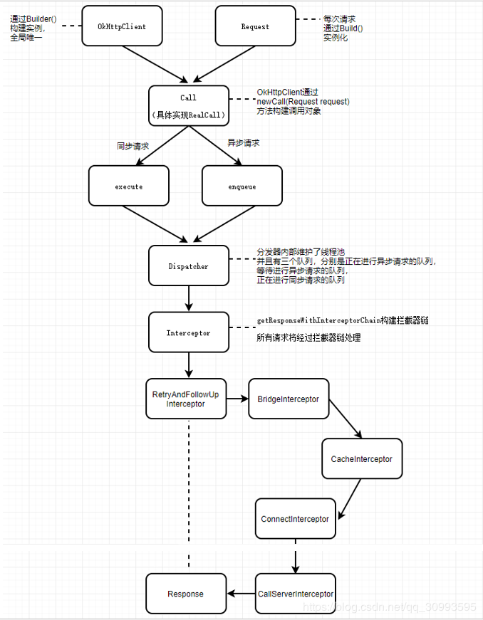

2、核心类

1. OkHttpClient：整个框架的客户端类，OkHttpClient强烈建议全局单例使用，因为每一个OkHttpClient都有自己单独的连接池和线程池，复用连接池和线程池能够减少延迟、节省内存
2. ConnectionPool：管理HTTP和HTTP / 2连接的重用，以减少网络延迟。 相同Address的HTTP请求可以共享Connection。 此类实现了哪些连接保持打开以供将来使用的策略
3. Request：封装请求报文信息的对象，比如请求url，请求方法，超时时间，还有各种请求头
4. Call：一个Call表示一个为执行而准备的请求，一个接口
5. RealCall：Call的实现类，它是连接Request和Response的桥梁
6. Response：请求响应的封装对象
7. Dispatcher：分发器类，维护同步请求和异步请求的状态，内部维护了一个线程池，用于执行网络请求的线程；同时还维护了三个请求队列，一个是正在进行异步请求的队列（包含了已取消但未完成的请求），一个是处于等待执行的异步请求队列，最后一个是正在进行同步请求的队列（包含了已取消但未完成的请求）
8. Interceptor：拦截器类，可以观察修改我们的请求和响应，是一个接口，有五个实现类，它们形成一个拦截器链，依次对我们的请求响应做处理
9. RetryAndFollowUpInterceptor：Interceptor实现类之一，是网络请求失败时进行重连及服务器返回当前请求需要进行重定向的拦截器
10. BridgeInterceptor：桥接连接器，主要是进行请求前的一些操作，将我们的请求设置成服务器能识别的请求，比如设置一系列头部信息，比如设置请求内容长度，编码，gzip压缩，cookie等
11. CacheInterceptor：缓存拦截器，这个就很明显了，作用是缓存请求和响应，比如同一个请求之前发生过，这次就不需要重新构建了，直接从缓存取；响应同理
12. ConnectInterceptor：连接拦截器，为当前请求找到一个合适的连接，比如如果从连接处中可以找到能复用的连接，就不要再创建新的连接了
13. CallServerInterceptor：连接服务器拦截器，负责向服务器发送真正的请求，接受服务器的响应

3、使用方法切入点

1. 同步请求方法：Call.execute，在当前线程执行请求，会阻塞当前线程
2. 异步请求方法：Call.enqueue，新开一个线程执行请求，不会阻塞当前线程

4、同步和异步请求代码

使用步骤基本分为如下几步：

* 第一步：实例化OKHttpClient对象
* 第二步：实例化网络请求对象Request
* 第三步：实例化一个准备执行的请求的对象
* 第四步：执行请求方法

1.同步请求

```
OkHttpClient okHttpClient = new OkHttpClient.Builder()
        .connectTimeout(3000, TimeUnit.SECONDS)
        .readTimeout(3000, TimeUnit.SECONDS)
        .build();

public String syncRequest(String url) {
    String result = null;
    Request request = new Request.Builder().url(url).build();
    Call call = okHttpClient.newCall(request);
    Response response = null;
    try {
        response = call.execute();
        if (response.isSuccessful()) {
            result = response.body().string();
        }
    } catch (IOException e) {
        e.printStackTrace();
    }
    return result;
}
```

2.异步请求

```
public void asyncRequest(String url) {
    Request request = new Request.Builder().url(url).build();
    Call call = okHttpClient.newCall(request);
    call.enqueue(new Callback() {
        @Override
        public void onFailure(Call call, IOException e) {
            //请求失败了，这里是在子线程回调，不能在这里直接更新UI
        }

        @Override
        public void onResponse(Call call, Response response) throws IOException {
            //获取请求结果，这里是在子线程回调
            String result = response.body().string();
        }
    });
}
```

5、同步和异步请求源码分析

1.OKHttpClient实例化

通过它的静态内部类Builder构建OKHttpClient，也就是使用常见的建造者模式，代码如下

```
public Builder() {
  //实例化分发器
  dispatcher = new Dispatcher();
  //设置支持的网络协议，默认支持HTTP/2和http/1.1
  protocols = DEFAULT_PROTOCOLS;
  //设置支持的连接，默认是使用SNI和ALPN等扩展的现代TLS连接和未加密、未认证的http连接
  connectionSpecs = DEFAULT_CONNECTION_SPECS;
  //Call状态监听器
  eventListenerFactory = EventListener.factory(EventListener.NONE);
  //使用默认的代理选择器
  proxySelector = ProxySelector.getDefault();
  if (proxySelector == null) {
    proxySelector = new NullProxySelector();
  }
  //默认没有cookie
  cookieJar = CookieJar.NO_COOKIES;
  //创建socket工厂类
  socketFactory = SocketFactory.getDefault();
  //下面四个是安全相关的配置
  hostnameVerifier = OkHostnameVerifier.INSTANCE;
  certificatePinner = CertificatePinner.DEFAULT;
  proxyAuthenticator = Authenticator.NONE;
  authenticator = Authenticator.NONE;
  //实例化连接池 使用连接池技术减少请求的延迟(如果SPDY是可用的话)
  connectionPool = new ConnectionPool();
  //域名解析系统
  dns = Dns.SYSTEM;
  followSslRedirects = true;
  followRedirects = true;
  retryOnConnectionFailure = true;
  callTimeout = 0;
  connectTimeout = 10_000;
  readTimeout = 10_000;
  writeTimeout = 10_000;
  //为了保持长连接，我们必须间隔一段时间发送一个ping指令进行保活
  pingInterval = 0;
}
```

这里有两个很重要的操作

* 一个就是实例化Dispatcher，由这个对象对OKHttp中的所有网络请求任务进行调度，我们发送的同步或异步请求都会由它进行管理；它里面维护了三个队列，上面有说到，后面在分析这个类的时候会详细介绍其操作
* 还有一个就是实例化了连接池ConnectionPool，我们常说OKHttp有多路复用机制和减少网络延迟功能就是由这个类去实现；我们将客户端与服务端之间的连接抽象为一个connection（接口），其实现类是RealConnection，为了管理所有connection，就产生了ConnectionPool这个类；当一些connection共享相同的地址，这时候就可以复用connection；同时还实现了某些connection保持连接状态，以备后续复用（不过是在一定时间限制内，不是永远保持打开的）

2.Request实例化

虽然Request构建如下方所示

```
Request request = new Request.Builder().url(url).build();
```

但是整个代码实现流程是

* 先通过Request构建内部Builder对象，在构建它的过程，默认指定请求方法为get，然后又构建了一个请求头Headers的Builder对象

```
public Builder() {
  this.method = "GET";
  this.headers = new Headers.Builder();
}
```

* Headers类的Builder对象没有构造方法，只不过内部定义了一个List数组，用来存放头部信息

```
public static final class Builder {
    final List<String> namesAndValues = new ArrayList<>(20);
}    
```

* 然后通过Request的Builder对象设置url，再调用build方法，该方法实例化了Request对象并返回

```
public Request build() {
  if (url == null) throw new IllegalStateException("url == null");
  return new Request(this);
}
```

* 在实例化Request的时候，Request的构造方法里又调用了内部Builder对象内部的Headers.Builder对象的build方法，这个方法实例化了Headers对象，Headers对象的构造方法将List数组转换成了String数组

```
  Request(Builder builder) {
    this.url = builder.url;
    this.method = builder.method;
    this.headers = builder.headers.build();
    this.body = builder.body;
    this.tag = builder.tag != null ? builder.tag : this;
  }

public Headers build() {
  return new Headers(this);
}

Headers(Builder builder) {
this.namesAndValues = builder.namesAndValues.toArray(new String[builder.namesAndValues.size()]);
}
```

3.Call实例化

Call在OKHttp中是一个接口，它抽象了用户对网络请求的一些操作，比如执行请求(enqueue方法和execute方法)，取消请求(cancel方法)等，真正实现是RealCall这个类

它的实例化是由OkHttpClient对象的newCall方法去完成的

```
/**
 * 准备在将来某个时间点执行Request
 */
@Override public Call newCall(Request request) {
	return RealCall.newRealCall(this, request, false /* for web socket */);
}
```

这里RealCall的构造方法第一个参数是OkHttpClient对象，第二个参数是Request对象，第三个参数是跟WebSocket请求有关，这个后续在讲到这点的时候再说；至于在RealCall里真正做了哪些事需要到构造方法看看

```
private RealCall(OkHttpClient client, Request originalRequest, boolean forWebSocket) {
    this.client = client;
    this.originalRequest = originalRequest;
    this.forWebSocket = forWebSocket;
    this.retryAndFollowUpInterceptor = new RetryAndFollowUpInterceptor(client, forWebSocket);
    this.timeout = new AsyncTimeout() {
      @Override protected void timedOut() {
        cancel();
      }
    };
    this.timeout.timeout(client.callTimeoutMillis(), MILLISECONDS);
  }

  static RealCall newRealCall(OkHttpClient client, Request originalRequest, boolean forWebSocket) {
    // Safely publish the Call instance to the EventListener.
    RealCall call = new RealCall(client, originalRequest, forWebSocket);
    call.eventListener = client.eventListenerFactory().create(call);//Call状态监听器
    return call;
 }
```

* 首先RealCall内部会持有OkHttpClient和Request这两个对象的引用
* 实例化了RetryAndFollowUpInterceptor对象，这是一个拦截器，上面说到，它是一个请求重试和重定向的拦截器，后续在讲到拦截器的时候具体分析它
* 最后持有一个Call状态监听器的引用

总结：不管是同步请求还是异步请求，在执行请求前都要做这三个操作，也就是实例化OKHttp客户端对象OkHttpClient，包含请求信息的Request对象，一个准备执行请求的对象Call；接下来就要分道扬镳了

4.执行同步请求execute

```
// okhttp3/RealCall.java

@Override public Response execute() throws IOException {
    //第一步
    synchronized (this) {
      if (executed) throw new IllegalStateException("Already Executed");
      executed = true;
    }
    //第二步
    captureCallStackTrace();
    timeout.enter();
    eventListener.callStart(this);
    try {
      //第三步 
      client.dispatcher().executed(this);
      //第四步
      Response result = getResponseWithInterceptorChain();
      if (result == null) throw new IOException("Canceled");
      return result;
    } catch (IOException e) {
      e = timeoutExit(e);
      eventListener.callFailed(this, e);
      throw e;
    } finally {
      //第五步
      client.dispatcher().finished(this);
    }
 }
```

* 第一步：出现一个同步代码块，对当前对象加锁，通过一个标志位executed判断该对象的execute方法是否已经执行过，如果执行过就抛出异常；这也就是同一个Call只能执行一次的原因
* 第二步：这个是用来捕获okhttp的请求堆栈信息不是重点
* 第三步：调用Dispatcher的executed方法，将请求放入分发器，这是非常重要的一步
* 第四步：通过拦截器连获取返回结果Response
* 第五步：调用dispatcher的finished方法，回收同步请求

来看下第三步源码：

```
synchronized void executed(RealCall call) {
    runningSyncCalls.add(call);
 }
```

可以看到这里的逻辑很简单，只是将请求添加到了runningSyncCalls中，它是一个队列，看看它的定义

```
private final Deque<RealCall> runningSyncCalls = new ArrayDeque<>();
```

这个队列会保存正在进行的同步请求（包含了已取消但未完成的请求）

接下来我们就要想了，executed方法只是将请求存到了队列当中，那什么时候去执行这个请求呢？上面说到过拦截器和拦截器链的概念，那么我们就回到上面的第四步去看看它的真面目

```
Response getResponseWithInterceptorChain() throws IOException {
    // Build a full stack of interceptors.
    List<Interceptor> interceptors = new ArrayList<>();
    interceptors.addAll(client.interceptors());
    interceptors.add(retryAndFollowUpInterceptor);
    interceptors.add(new BridgeInterceptor(client.cookieJar()));
    interceptors.add(new CacheInterceptor(client.internalCache()));
    interceptors.add(new ConnectInterceptor(client));
    if (!forWebSocket) {
      interceptors.addAll(client.networkInterceptors());
    }
    interceptors.add(new CallServerInterceptor(forWebSocket));

    Interceptor.Chain chain = new RealInterceptorChain(interceptors, null, null, null, 0,
        originalRequest, this, eventListener, client.connectTimeoutMillis(),
        client.readTimeoutMillis(), client.writeTimeoutMillis());

    return chain.proceed(originalRequest);
 }
```

我们通过Call.execute()方法进行同步请求获取最终的返回结果就是通过这个方法实现的，看看内部逻辑：

* 实例化一个List，用来存放Interceptor对象
* addAll(client.interceptors())这一步用来添加用户自定义的拦截器
* 依次添加OKHttp内部的五个拦截器
* 创建了一个RealInterceptorChain对象，它构建了一个拦截器链，通过proceed方法将这些拦截器一一执行

具体逻辑来看它的内部实现

```
public RealInterceptorChain(List<Interceptor> interceptors, StreamAllocation streamAllocation,
      HttpCodec httpCodec, RealConnection connection, int index, Request request, Call call,
      EventListener eventListener, int connectTimeout, int readTimeout, int writeTimeout) {
    this.interceptors = interceptors;
    this.connection = connection;
    this.streamAllocation = streamAllocation;
    this.httpCodec = httpCodec;
    this.index = index;
    this.request = request;
    // Call相关的设置
    this.call = call;
    this.eventListener = eventListener;
    this.connectTimeout = connectTimeout;
    this.readTimeout = readTimeout;
    this.writeTimeout = writeTimeout;
}
```

* interceptors 存放了众多拦截器
* 其中第二，第三，第四个参数都是null
* index默认传的是0，其实是interceptors数组的索引，在proceed方法获取数组中的拦截器用的
* request就是包含请求信息的对象

RealInterceptorChain.proceed

```
@Override public Response proceed(Request request) throws IOException {
    return proceed(request, streamAllocation, httpCodec, connection);
  }

  public Response proceed(Request request, StreamAllocation streamAllocation, HttpCodec httpCodec,
      RealConnection connection) throws IOException {
    if (index >= interceptors.size()) throw new AssertionError();

    calls++;

    ...

    // Call the next interceptor in the chain.
    RealInterceptorChain next = new RealInterceptorChain(interceptors, streamAllocation, httpCodec,
        connection, index + 1, request, call, eventListener, connectTimeout, readTimeout,
        writeTimeout);
    Interceptor interceptor = interceptors.get(index);
    Response response = interceptor.intercept(next);
    ...
    return response;
   }
```

* 如果索引index大于interceptors的大小，就抛出异常；然后将calls加一
* 接下来的几个关于httpCodec的if判断暂时不用管

我们重点看中间的几行代码：
又实例化了一个RealInterceptorChain对象，然后根据index从interceptors列表中取出下一个拦截器，最后调用该拦截器的intercept方法，并将拦截器链对象传递进去，最终获取结果返回

这里我们要看到一个很重要的点就是在实例化新的RealInterceptorChain时候，传入的参数是index+1；这样当第一个拦截器执行自己的intercept方法，做相关的逻辑，如果能获取结果就返回，不再继续执行接下来的拦截器；如果需要通过下一个拦截器获取结果，那就通过传入的参数RealInterceptorChain调用proceed方法，这样在这个方法里根据递增的索引index就能不断的从interceptors列表中取出下一个拦截器，执行每个拦截器自己的逻辑获取结果，直到所有拦截器执行完毕；这就是OKHttp拦截器链的由来，也是它的精妙所在

至于每个拦截器具体逻辑，在后续文章给出

接下来看看第五步

dispatcher.finished

```
void finished(RealCall call) {
    finished(runningSyncCalls, call);
}
```

当同步请求执行到这里说明这个请求已经完成了，需要进行收尾工作

```
private <T> void finished(Deque<T> calls, T call) {
    Runnable idleCallback;
    synchronized (this) {
      if (!calls.remove(call)) throw new AssertionError("Call wasn't in-flight!");
      idleCallback = this.idleCallback;
    }

    boolean isRunning = promoteAndExecute();

    if (!isRunning && idleCallback != null) {
      idleCallback.run();
    }
}

private boolean promoteAndExecute() {
    assert (!Thread.holdsLock(this));

    List<AsyncCall> executableCalls = new ArrayList<>();
    boolean isRunning;
    synchronized (this) {
      for (Iterator<AsyncCall> i = readyAsyncCalls.iterator(); i.hasNext(); ) {
        AsyncCall asyncCall = i.next();

        if (runningAsyncCalls.size() >= maxRequests) break; // Max capacity.
        if (runningCallsForHost(asyncCall) >= maxRequestsPerHost) continue; // Host max capacity.

        i.remove();
        executableCalls.add(asyncCall);
        runningAsyncCalls.add(asyncCall);
      }
      isRunning = runningCallsCount() > 0;
    }

    for (int i = 0, size = executableCalls.size(); i < size; i++) {
      AsyncCall asyncCall = executableCalls.get(i);
      asyncCall.executeOn(executorService());
    }

    return isRunning;
  }
  
  public synchronized int runningCallsCount() {
    return runningAsyncCalls.size() + runningSyncCalls.size();
  }
```

第一个参数是正在进行同步请求的队列，第二个参数是Call对象
这里也有一个同步代码块，因为队列是线程不安全的实现；首先将这个Call对象从队列中移出，不能移出就抛出异常；
然后给idleCallback赋值
最后判断isRunning，判断runningCallsCount 是否>0，这说明整个dispatcher分发器内部没有维护正在进行的请求了，同时idleCallback不为null，那就执行它的run方法（每当dispatcher内部没有正在执行的请求时进行的回调）
可以看出来，在进行同步请求的时候dispatcher分发器做的事很简单，就是添加请求到队列，从队列移除请求，那异步请求的时候是如何呢？

5.执行异步请求enqueue

```
@Override public void enqueue(Callback responseCallback) {
    synchronized (this) {
      if (executed) throw new IllegalStateException("Already Executed");
      executed = true;
    }
    captureCallStackTrace();
    eventListener.callStart(this);
    client.dispatcher().enqueue(new AsyncCall(responseCallback));
}
```

* 方法接收一个Callback参数，它是用来进行请求结束回调的
* 有一个同步代码块，判断该请求是否已经执行过；可以看出来，同一个Call对象，不管是调用execute方法还是enqueue方法，都只能调用一次
获取堆栈信息
* 调用dispatcher的enqueue方法

这里跟同步请求不同，它构建了一个新的Call，即AsyncCall对象，是RealCall内部类，继承NamedRunnable

```
public abstract class NamedRunnable implements Runnable {
  protected final String name;

  public NamedRunnable(String format, Object... args) {
    this.name = Util.format(format, args);
  }

  @Override public final void run() {
    String oldName = Thread.currentThread().getName();
    Thread.currentThread().setName(name);
    try {
      execute();
    } finally {
      Thread.currentThread().setName(oldName);
    }
  }

  protected abstract void execute();
}
```

内部逻辑比较简单，设置了线程名，然后调用execute方法，也就是说AsyncCall具体逻辑将在execute方法执行

dispatcher.enqueue

我们来看看分发器是如何处理异步请求的

```
void enqueue(AsyncCall call) {
    synchronized (this) {
      readyAsyncCalls.add(call);
    }
    promoteAndExecute();
}

private boolean promoteAndExecute() {
    assert (!Thread.holdsLock(this));

    List<AsyncCall> executableCalls = new ArrayList<>();
    boolean isRunning;
    synchronized (this) {
      // 循环readyAsyncCalls，取出AsyncCall
      for (Iterator<AsyncCall> i = readyAsyncCalls.iterator(); i.hasNext(); ) {
        AsyncCall asyncCall = i.next();
        // 判断正在进行异步请求队列长度是否小于64，且单个Host正在执行的请求数小于5； 
        if (runningAsyncCalls.size() >= maxRequests) break; // Max capacity.
        if (runningCallsForHost(asyncCall) >= maxRequestsPerHost) continue; // Host max capacity.
        // 移除当前队列
        i.remove();
        // 将请求添加到runningAsyncCalls队列和执行队列executableCalls
        executableCalls.add(asyncCall);
        runningAsyncCalls.add(asyncCall);
      }
      isRunning = runningCallsCount() > 0;
    }

    for (int i = 0, size = executableCalls.size(); i < size; i++) {
      AsyncCall asyncCall = executableCalls.get(i);
      // 使用内部线程池执行该请求
      asyncCall.executeOn(executorService());
    }

    return isRunning;
}
```

* 将请求添加到readyAsyncCalls队列
* 循环readyAsyncCalls，取出AsyncCall
* 判断正在进行异步请求队列长度是否小于64，且单个Host正在执行的请求数小于5； 
* 将请求移除当前队列
* 将请求添加到runningAsyncCalls队列和执行队列executableCalls
* 使用内部线程池执行该请求

看看线程池的构造

```
  public synchronized ExecutorService executorService() {
    if (executorService == null) {
      executorService = new ThreadPoolExecutor(0, Integer.MAX_VALUE, 60, TimeUnit.SECONDS,
          new SynchronousQueue<Runnable>(), Util.threadFactory("OkHttp Dispatcher", false));
    }
    return executorService;
  }
```

通过构造方法可以看出该线程池没有核心线程，且最大线程数是Integer.MAX_VALUE，基本上是无限大了，保活时间是60s，也就是说工作线程如果空闲时间超过60s，将被回收。没有设置最大线程数，那是不是对手机性能消耗是不是特别大；其实不会，因为OKHttp对正在进行的异步请求数有限制，最大是64个

既然要被执行，那就看看AsyncCall 的执行逻辑

AsyncCall

```
final class AsyncCall extends NamedRunnable {
    private final Callback responseCallback;

    AsyncCall(Callback responseCallback) {
      super("OkHttp %s", redactedUrl());
      this.responseCallback = responseCallback;
    }

    String host() {
      return originalRequest.url().host();
    }

    Request request() {
      return originalRequest;
    }

    RealCall get() {
      return RealCall.this;
    }

    /**
     * Attempt to enqueue this async call on {@code executorService}. This will attempt to clean up
     * if the executor has been shut down by reporting the call as failed.
     */
    void executeOn(ExecutorService executorService) {
      assert (!Thread.holdsLock(client.dispatcher()));
      boolean success = false;
      try {
        executorService.execute(this);
        success = true;
      } catch (RejectedExecutionException e) {
        InterruptedIOException ioException = new InterruptedIOException("executor rejected");
        ioException.initCause(e);
        eventListener.callFailed(RealCall.this, ioException);
        responseCallback.onFailure(RealCall.this, ioException);
      } finally {
        if (!success) {
          client.dispatcher().finished(this); // This call is no longer running!
        }
      }
    }

    @Override protected void execute() {
      boolean signalledCallback = false;
      timeout.enter();
      try {
        Response response = getResponseWithInterceptorChain();
        if (retryAndFollowUpInterceptor.isCanceled()) {
          signalledCallback = true;
          responseCallback.onFailure(RealCall.this, new IOException("Canceled"));
        } else {
          signalledCallback = true;
          responseCallback.onResponse(RealCall.this, response);
        }
      } catch (IOException e) {
        e = timeoutExit(e);
        if (signalledCallback) {
          // Do not signal the callback twice!
          Platform.get().log(INFO, "Callback failure for " + toLoggableString(), e);
        } else {
          eventListener.callFailed(RealCall.this, e);
          responseCallback.onFailure(RealCall.this, e);
        }
      } finally {
        client.dispatcher().finished(this);
      }
    }
 }
```

在execute方法中也有调用getResponseWithInterceptorChain这个方法，跟同步请求差不多，同时会将请求结果通过Callback返回回去，一定要注意，回调是在子线程执行的，不要直接在这里进行更新UI的操作

最后要注意client.dispatcher().finished(this)这一句，同步请求时也调用了它，我们去看看有什么不同

```
void finished(AsyncCall call) {
    finished(runningAsyncCalls, call);
}
```

其余代码在同步请求时已经讲过

在进行异步请求的时候，dispatcher分发类通过内部的两个队列和一个线程池对请求进行管理，保存传递进来的请求，执行传递进来的请求，移除执行完的请求


三、Dispatcher分发器源码解析

1、概述：

1.Dispatcher到底是什么，干啥用的

> 在OKHttp中Dispatcher就是用来保存并管理用户产生的同步请求（RealCall）和异步请求（AsyncCall），并负责执行AsyncCall

2.OKHttp是如何实现同步以及异步请求的？

> 是靠Dispatcher将我们发送的请求进行管理
> 在同步请求时，将请求添加到runningSyncCalls中（正在执行的同步请求队列）；在请求结束时从队列移除该请求
> 在异步请求时，将封装成AsyncCall的异步请求线程根据条件添加到readyAsyncCalls队列（等待执行的异步请求队列）然后循环readyAsyncCalls队列（等待执行的异步请求队列）添加到runningAsyncCalls队列（正在执行的异步请求队列），然后执行AsyncCall；在请求结束时，从队列移除，并调整两个队列的元素

2、Dispatcher特点

1.数据结构

在Dispatcher中维护了三个队列，队列类型是ArrayDeque，这是一个双端队列，即可以从队列头部和尾部进行数据操作，能够实现FIFO原则，即先进去的可以先执行，不过不是线程安全的实现，多线程环境中需要加锁；

* 第一个队列是runningSyncCalls，是一个正在执行的同步请求队列，所有我们添加的同步请求都会被添加到这里面，包括已被取消但没执行完的请求，队列泛型是RealCall对象
* 第二个队列是runningAsyncCalls，是一个正在执行的异步请求队列，所有我们添加的异步请求都会被添加到这里，包括已被取消但没执行完的请求，队列泛型是AsyncCall对象，实现了Runnable接口
* 第三个队列是readyAsyncCalls，是一个等待执行的异步请求队列，什么意思呢？因为OKHttp允许同时执行的异步请求数量必须在64个以内，且单个host同时执行的最大请求数量在5个以内，所以当我们添加的异步请求数超过它，该请求就会被添加到该队列，等runningAsyncCalls队列有空闲位置后添加到里面

对于单个host同时执行的最大请求数量：这里说明下，host在这里指的是hostname，即主机名（代表一个主机，每个主机都有一个唯一标识，即ip地址，但是每个主机的主机名并不一定是唯一的），你可以理解为同时往同一个服务器上发送的请求数量不能超过5个；不过OKHttp是通过URL的主机名判断的，所以对同一个ip地址的并发请求仍然可能会超过5个，因为多个主机名可能共享同一个ip地址或者路由（相同的HTTP代理）

有的人可能说了，用这些队列有什么用呢？好处在哪呢？

要知道通过这些队列，OKHttp可以轻松的实现并发请求，更方便的维护请求数以及后续对这些请求的操作（比如取消请求），大大提高网络请求效率；同时可以更好的管理请求数，防止同时运行的线程过多，导致OOM，同时限制了同一hostname下的请求数，防止一个应用占用的网络资源过多，优化用户体验

2.线程池

OKHttp在其内部维护了一个线程池，用于执行异步请求AsyncCall，其构造如下

```
public synchronized ExecutorService executorService() {
    if (executorService == null) {
      executorService = new ThreadPoolExecutor(0, Integer.MAX_VALUE, 60, TimeUnit.SECONDS,
          new SynchronousQueue<Runnable>(), Util.threadFactory("OkHttp Dispatcher", false));
    }
    return executorService;
}
```

我们需要关注的就是ThreadPoolExecutor前三个参数

* 第一个是0，说明该线程池没有核心线程，所有线程都是工作线程，即所有线程超过一定空闲时间会被回收
* 第二个参数是Integer.MAX_VALUE，即最大线程数，虽然设置值这么大，但是无须担心性能消耗过大问题，因为有队列去维护请求数
* 第三个参数是60，即工作线程空闲60s后就会被回收

3.请求管理

```
private int maxRequests = 64;
private int maxRequestsPerHost = 5;
```

在类里定义了这两个变量，其含义是默认支持的最大并发请求数量是64个，单个host并发请求的最大数量是5个；这两个值是可以通过后续设置进行更改的，并且这个要求只针对异步请求，对于同步请求数量不做限制

当异步请求进入Dispatcher中，如果满足上面两个数量要求，该请求会被添加到runningAsyncCalls中，然后执行它；如果不满足就将其添加到readyAsyncCalls中；当一个异步请求结束时，会遍历readyAsyncCalls队列，再进行条件判断，符合条件就将请求从该队列移到runningAsyncCalls队列中并执行它

不管是同步请求还是异步请求最终执行完后都会从队列中移除

除了添加和移除，OKHttp还支持用户取消添加过的请求，可以全部取消，即将队列清空；也可以取消某一个请求

3、源码

```
public final class Dispatcher {
  
  //最大并发请求数
  private int maxRequests = 64;
  //单个主机最大并发请求数
  private int maxRequestsPerHost = 5;
  private @Nullable Runnable idleCallback;

  /** 执行AsyncCall的线程池 */
  private @Nullable ExecutorService executorService;

  /** 等待执行的异步请求队列. */
  private final Deque<AsyncCall> readyAsyncCalls = new ArrayDeque<>();

  /** 正在执行的异步请求队列，包含已取消但为执行完的请求 */
  private final Deque<AsyncCall> runningAsyncCalls = new ArrayDeque<>();

  /** 正在执行的同步请求队列，包含已取消但为执行完的请求 */
  private final Deque<RealCall> runningSyncCalls = new ArrayDeque<>();

  //构造方法 接收一个线程池
  public Dispatcher(ExecutorService executorService) {
    this.executorService = executorService;
  }

  public Dispatcher() {
  }
  
  //构建一个线程池
  public synchronized ExecutorService executorService() {
    if (executorService == null) {
      executorService = new ThreadPoolExecutor(0, Integer.MAX_VALUE, 60, TimeUnit.SECONDS,
          new SynchronousQueue<Runnable>(), Util.threadFactory("OkHttp Dispatcher", false));
    }
    return executorService;
  }

  /**
   * 设置并发执行的最大请求数
   */
  public void setMaxRequests(int maxRequests) {
    if (maxRequests < 1) {
      throw new IllegalArgumentException("max < 1: " + maxRequests);
    }
    synchronized (this) {
      this.maxRequests = maxRequests;
    }
    promoteAndExecute();
  }

  /**
   * 获取并发执行的最大请求数
   */
  public synchronized int getMaxRequests() {
    return maxRequests;
  }

  /**
   * 设置每个主机同时执行的最大请求数
   */
  public void setMaxRequestsPerHost(int maxRequestsPerHost) {
    if (maxRequestsPerHost < 1) {
      throw new IllegalArgumentException("max < 1: " + maxRequestsPerHost);
    }
    synchronized (this) {
      this.maxRequestsPerHost = maxRequestsPerHost;
    }
    promoteAndExecute();
  }

  public synchronized int getMaxRequestsPerHost() {
    return maxRequestsPerHost;
  }

  /**
   * 当分发器处于空闲状态下，即没有正在运行的请求，设置回调
   */
  public synchronized void setIdleCallback(@Nullable Runnable idleCallback) {
    this.idleCallback = idleCallback;
  }
  
  /**
   * 执行异步请求
   * 当正在执行的异步请求数量小于64且单个host正在执行的请求数量小于5的时候，就执行该请求，并添加到队列
   * 否则添加到等待队列中
   */
  void enqueue(AsyncCall call) {
    synchronized (this) {
      readyAsyncCalls.add(call);
    }
    promoteAndExecute();
  }

  /**
   * 取消所有请求
   */
  public synchronized void cancelAll() {
    for (AsyncCall call : readyAsyncCalls) {
      call.get().cancel();
    }

    for (AsyncCall call : runningAsyncCalls) {
      call.get().cancel();
    }

    for (RealCall call : runningSyncCalls) {
      call.cancel();
    }
  }
  
  /**
   * 调整请求队列，将等待队列中的请求放入正在请求的队列
   */
  private boolean promoteAndExecute() {
    assert (!Thread.holdsLock(this));

    List<AsyncCall> executableCalls = new ArrayList<>();
    boolean isRunning;
    synchronized (this) {
      for (Iterator<AsyncCall> i = readyAsyncCalls.iterator(); i.hasNext(); ) {
        AsyncCall asyncCall = i.next();

        if (runningAsyncCalls.size() >= maxRequests) break; // Max capacity.
        if (runningCallsForHost(asyncCall) >= maxRequestsPerHost) continue; // Host max capacity.

        i.remove();
        executableCalls.add(asyncCall);
        runningAsyncCalls.add(asyncCall);
      }
      isRunning = runningCallsCount() > 0;
    }

    for (int i = 0, size = executableCalls.size(); i < size; i++) {
      AsyncCall asyncCall = executableCalls.get(i);
      asyncCall.executeOn(executorService());
    }

    return isRunning;
  }

  /** 返回单个host的请求数 */
  private int runningCallsForHost(AsyncCall call) {
    int result = 0;
    for (AsyncCall c : runningAsyncCalls) {
      if (c.get().forWebSocket) continue;
      if (c.host().equals(call.host())) result++;
    }
    return result;
  }

  /** 执行同步请求，只是将其添加到队列中 */
  synchronized void executed(RealCall call) {
    runningSyncCalls.add(call);
  }

  /** 异步请求执行完成调用. */
  void finished(AsyncCall call) {
    finished(runningAsyncCalls, call);
  }

  /** 同步请求执行完成调用. */
  void finished(RealCall call) {
    finished(runningSyncCalls, call);
  }

  private <T> void finished(Deque<T> calls, T call) {
    Runnable idleCallback;
    synchronized (this) {
      //从队列中移除
      if (!calls.remove(call)) throw new AssertionError("Call wasn't in-flight!");
      idleCallback = this.idleCallback;
    }

    boolean isRunning = promoteAndExecute();

    if (!isRunning && idleCallback != null) {
      idleCallback.run();
    }
  }

  /** 返回当前正在等待执行的异步请求的快照. */
  public synchronized List<Call> queuedCalls() {
    List<Call> result = new ArrayList<>();
    for (AsyncCall asyncCall : readyAsyncCalls) {
      result.add(asyncCall.get());
    }
    return Collections.unmodifiableList(result);
  }

   /** 返回当前正在执行的异步请求的快照. */
  public synchronized List<Call> runningCalls() {
    List<Call> result = new ArrayList<>();
    result.addAll(runningSyncCalls);
    for (AsyncCall asyncCall : runningAsyncCalls) {
      result.add(asyncCall.get());
    }
    return Collections.unmodifiableList(result);
  }
  
  //返回等待执行的异步请求数量
  public synchronized int queuedCallsCount() {
    return readyAsyncCalls.size();
  }
  
  //计算正在执行的请求数量
  public synchronized int runningCallsCount() {
    return runningAsyncCalls.size() + runningSyncCalls.size();
  }
}
```

可以说Dispatcher的源码比较简单，它的作用就是负责对用户的请求进行管理，保存，备份，重点在于使用线程池执行异步请求，对于同步请求基本不做多少处理

四、调用对象RealCall源码解析

1、Call

当我们封装好Request后需要执行这个请求，但是OKHttp并不是直接执行Request，而是将Request又封装了一层为Call对象，方便开发者对请求进行处理；一个Call对象代表一个已准备好执行的请求（Request），Call可以取消，同时一个Call对象代表了一个request/response 对（Stream），因此一个Call无法被执行两次

2、RealCall

Call只是一个接口，真正的实现类是RealCall，当我们执行同步请求时会调用它的execute方法，执行异步请求会调用enqueue方法，至于它内部是如何处理这些操作的，我们来通过源码进行分析

1.实例化RealCall

首先是通过OkHttpClient的newCall方法获取一个Call对象

```
Call call = httpClient.newCall(request);
```

```
@Override 
public Call newCall(Request request) {
	return RealCall.newRealCall(this, request, false /* for web socket */);
}
```
这里只是调用了静态方法newRealCall，进入newRealCall

```
private RealCall(OkHttpClient client, Request originalRequest, boolean forWebSocket) {
    this.client = client;
    this.originalRequest = originalRequest;
    this.forWebSocket = forWebSocket;
    this.retryAndFollowUpInterceptor = new RetryAndFollowUpInterceptor(client, forWebSocket);
    this.timeout = new AsyncTimeout() {
      @Override protected void timedOut() {
        cancel();
      }
    };
    this.timeout.timeout(client.callTimeoutMillis(), MILLISECONDS);
  }

  static RealCall newRealCall(OkHttpClient client, Request originalRequest, boolean forWebSocket) {
    // Safely publish the Call instance to the EventListener.
    RealCall call = new RealCall(client, originalRequest, forWebSocket);
    call.eventListener = client.eventListenerFactory().create(call);
    return call;
  }
```

这里可以看出RealCall对象会持有OkHttpClient对象，Request对象的引用，并且还实例化了拦截器链中的第一个拦截器RetryAndFollowUpInterceptor，也就是重试和重定向拦截器

重试这里好理解，请求失败了重新请求；那重定向什么意思呢？说到重定向一般会拿它跟请求转发进行比较

```
请求转发：
request.getRequestDispatcher().forward();

重定向：
response.sendRedirect();

例如：

请求转发：
request.getRequestDispatcher("/okhttp.jsp").forward(request,response);

重定向：
response.sendRedirect(request.getContextPath + "/okhttp.jsp")

```

* 转发过程：客户端首先发送一个请求到服务器，服务器匹配Servlet，并执行。当这个Servlet执行完后，它要调用getRequestDispacther()方法，把请求转发给指定的okhttp.jsp，整个流程都是在服务端完成的，而且是在同一个请求里面完成的，因此Servlet和jsp共享同一个request，在Servlet里面放的所有东西，在okhttp.jsp中都能取出来。因此，okhttp.jsp能把结果getAttribute()出来，getAttribute()出来后执行完把结果返回给客户端，整个过程只有一个请求，一个响应。
* 重定向过程：客户端发送一个请求到服务器端，服务器匹配Servlet，这都和请求转发一样。Servlet处理完之后调用了sendRedirect()这个方法，这个方法是response的方法。所以，当这个Servlet处理完后，即response.sendRedirect()方法执行完立即向客户端返回响应，响应行告诉客户端你必须再重新发送一个请求，去访问okhttp.jsp；紧接着客户端收到这个请求后，立刻发出一个新的请求，去请求okhttp.jsp，在这两个请求互不干扰、相互独立，在前面request里面setAttribute()的任何东西，在后面的request里面都获得不了。因此，在sendRedirect()里面是两个请求，两个响应。

Forward是在服务器端的跳转，就是客户端发一个请求给服务器，服务器直接将请求相关参数的信息原封不动的传递到该服务器的其他jsp或Servlet去处理。而sendRedirect()是客户端的跳转，服务器会返回客户端一个响应报头和新的URL地址，原来的参数信息如果服务器没有特殊处理就不存在了，浏览器会访问新的URL所指向的Servlet或jsp，这可能不是原来服务器上的webService了

总结：

* 转发是在服务器端完成的，重定向是在客户端发生的
* 转发的速度快，重定向速度慢
* 转发是同一次请求，重定向是两次请求
* 转发时浏览器地址栏没有变化，重定向时地址栏有变化
* 转发必须是在同一台服务器下完成，重定向可以在不同的服务器下完成

3、同步请求

同步请求会走到内部的execute方法

```
// okhttp3/RealCall.java

@Override public Response execute() throws IOException {
    //第一步
    synchronized (this) {
      if (executed) throw new IllegalStateException("Already Executed");
      executed = true;
    }
    //第二步
    captureCallStackTrace();
    timeout.enter();
    eventListener.callStart(this);
    try {
      //第三步 
      client.dispatcher().executed(this);
      //第四步
      Response result = getResponseWithInterceptorChain();
      if (result == null) throw new IOException("Canceled");
      return result;
    } catch (IOException e) {
      e = timeoutExit(e);
      eventListener.callFailed(this, e);
      throw e;
    } finally {
      //第五步
      client.dispatcher().finished(this);
    }
 }
```

* 第一步：出现一个同步代码块，对当前对象加锁，通过一个标志位executed判断该对象的execute方法是否已经执行过，如果执行过就抛出异常；这也就是同一个Call只能执行一次的原因
* 第二步：这个是用来捕获okhttp的请求堆栈信息不是重点
* 第三步：调用Dispatcher的executed方法，将请求放入分发器，这是非常重要的一步
* 第四步：通过拦截器连获取返回结果Response
* 第五步：调用dispatcher的finished方法，回收同步请求

第三步和第五步都在分发器内部处理，我们看下第四步

```
Response getResponseWithInterceptorChain() throws IOException {
    // Build a full stack of interceptors.
    List<Interceptor> interceptors = new ArrayList<>();
    interceptors.addAll(client.interceptors());
    interceptors.add(retryAndFollowUpInterceptor);
    interceptors.add(new BridgeInterceptor(client.cookieJar()));
    interceptors.add(new CacheInterceptor(client.internalCache()));
    interceptors.add(new ConnectInterceptor(client));
    if (!forWebSocket) {
      interceptors.addAll(client.networkInterceptors());
    }
    interceptors.add(new CallServerInterceptor(forWebSocket));

    Interceptor.Chain chain = new RealInterceptorChain(interceptors, null, null, null, 0,
        originalRequest, this, eventListener, client.connectTimeoutMillis(),
        client.readTimeoutMillis(), client.writeTimeoutMillis());

    return chain.proceed(originalRequest);
 }
```

我们通过Call.execute()方法进行同步请求获取最终的返回结果就是通过这个方法实现的，看看内部逻辑：

* 实例化一个List，用来存放Interceptor对象
* addAll(client.interceptors())这一步用来添加用户自定义的拦截器
* 依次添加OKHttp内部的五个拦截器
* 创建了一个RealInterceptorChain对象，它构建了一个拦截器链，通过proceed方法将这些拦截器一一执行

4、异步请求

异步请求会走到内部的enqueue方法

```
@Override public void enqueue(Callback responseCallback) {
    synchronized (this) {
      if (executed) throw new IllegalStateException("Already Executed");
      executed = true;
    }
    captureCallStackTrace();
    eventListener.callStart(this);
    client.dispatcher().enqueue(new AsyncCall(responseCallback));
  }
```

首先也是加同步，判断这个Call是否执行过；然后实例化了一个AsyncCall，最后调用分发器的enqueue方法

我们看下AsyncCall是什么

```
final class AsyncCall extends NamedRunnable {
    private final Callback responseCallback;

    AsyncCall(Callback responseCallback) {
      super("OkHttp %s", redactedUrl());
      this.responseCallback = responseCallback;
    }

    String host() {
      return originalRequest.url().host();
    }

    Request request() {
      return originalRequest;
    }

    RealCall get() {
      return RealCall.this;
    }

    /**
     * Attempt to enqueue this async call on {@code executorService}. This will attempt to clean up
     * if the executor has been shut down by reporting the call as failed.
     */
    void executeOn(ExecutorService executorService) {
      assert (!Thread.holdsLock(client.dispatcher()));
      boolean success = false;
      try {
        executorService.execute(this);
        success = true;
      } catch (RejectedExecutionException e) {
        InterruptedIOException ioException = new InterruptedIOException("executor rejected");
        ioException.initCause(e);
        eventListener.callFailed(RealCall.this, ioException);
        responseCallback.onFailure(RealCall.this, ioException);
      } finally {
        if (!success) {
          client.dispatcher().finished(this); // This call is no longer running!
        }
      }
    }

    @Override protected void execute() {
      boolean signalledCallback = false;
      timeout.enter();
      try {
        Response response = getResponseWithInterceptorChain();
        if (retryAndFollowUpInterceptor.isCanceled()) {
          signalledCallback = true;
          responseCallback.onFailure(RealCall.this, new IOException("Canceled"));
        } else {
          signalledCallback = true;
          responseCallback.onResponse(RealCall.this, response);
        }
      } catch (IOException e) {
        e = timeoutExit(e);
        if (signalledCallback) {
          // Do not signal the callback twice!
          Platform.get().log(INFO, "Callback failure for " + toLoggableString(), e);
        } else {
          eventListener.callFailed(RealCall.this, e);
          responseCallback.onFailure(RealCall.this, e);
        }
      } finally {
        client.dispatcher().finished(this);
      }
    }
  }
```

首先它是RealCall的内部类，我们都知道异步请求是在子线程执行的，但是到这里我们还没有看出来子线程的影子，那我们就需要看下RealCall的父类了

NamedRunnable实现了Runnable接口，从这里可以看出AsyncCall确实是在子线程执行网络请求

```
public abstract class NamedRunnable implements Runnable {
  protected final String name;

  public NamedRunnable(String format, Object... args) {
    this.name = Util.format(format, args);
  }

  @Override public final void run() {
    String oldName = Thread.currentThread().getName();
    Thread.currentThread().setName(name);
    try {
      execute();
    } finally {
      Thread.currentThread().setName(oldName);
    }
  }

  protected abstract void execute();
}
```

NamedRunnable并没有做过多的处理，但它提供了一个抽象方法execute，也就是让子类在这个方法中去执行耗时操作

回头看AsyncCall的execute方法，也有调用getResponseWithInterceptorChain这个方法，跟同步请求差不多，同时会将请求结果通过Callback返回回去，一定要注意，回调是在子线程执行的，不要直接在这里进行更新UI的操作

5、源码

```
/**
 * 一个Call封装一对Request和Response，能且仅能被执行一次。并且Call可以被取消。
 */
final class RealCall implements Call {
  //OKHttp客户端
  final OkHttpClient client;
  //重试和重定向拦截器
  final RetryAndFollowUpInterceptor retryAndFollowUpInterceptor;
  final AsyncTimeout timeout;

  //RealCall状态监听器
  private @Nullable EventListener eventListener;

  //请求对象
  final Request originalRequest;
  final boolean forWebSocket;

  // RealCall是否执行过
  private boolean executed;

  private RealCall(OkHttpClient client, Request originalRequest, boolean forWebSocket) {
    this.client = client;
    this.originalRequest = originalRequest;
    this.forWebSocket = forWebSocket;
    this.retryAndFollowUpInterceptor = new RetryAndFollowUpInterceptor(client, forWebSocket);
    this.timeout = new AsyncTimeout() {
      @Override protected void timedOut() {
        cancel();
      }
    };
    this.timeout.timeout(client.callTimeoutMillis(), MILLISECONDS);
  }

  static RealCall newRealCall(OkHttpClient client, Request originalRequest, boolean forWebSocket) {
    // Safely publish the Call instance to the EventListener.
    RealCall call = new RealCall(client, originalRequest, forWebSocket);
    call.eventListener = client.eventListenerFactory().create(call);
    return call;
  }

  /** 返回初始化此Call的原始请求 */
  @Override public Request request() {
    return originalRequest;
  }

  /** 进行同步请求
  * 立即发出请求，一直阻塞当前线程，直到返回结果或者报错
  * 可以使用Response.body获取结果
  * 为了复用连接，需要调用Response.close关闭响应体
  */
  @Override public Response execute() throws IOException {
    synchronized (this) {
      //同一个RealCall，只能执行一次
      if (executed) throw new IllegalStateException("Already Executed");
      executed = true;
    }
    //打印堆栈信息
    captureCallStackTrace();
    timeout.enter();
    eventListener.callStart(this);
    try {
      //加入分发器中的正在执行的同步请求队列
      client.dispatcher().executed(this);
      //获取请求结果
      Response result = getResponseWithInterceptorChain();
      if (result == null) throw new IOException("Canceled");
      return result;
    } catch (IOException e) {
      e = timeoutExit(e);
      eventListener.callFailed(this, e);
      throw e;
    } finally {
    //通知分发器请求完成，从队列移除
      client.dispatcher().finished(this);
    }
  }

  @Nullable IOException timeoutExit(@Nullable IOException cause) {
    if (!timeout.exit()) return cause;

    InterruptedIOException e = new InterruptedIOException("timeout");
    if (cause != null) {
      e.initCause(cause);
    }
    return e;
  }

  private void captureCallStackTrace() {
    Object callStackTrace = Platform.get().getStackTraceForCloseable("response.body().close()");
    retryAndFollowUpInterceptor.setCallStackTrace(callStackTrace);
  }
  
  /**
  * 进行异步请求
  * 至于何时执行这个请求由分发器决定
  * 通常是立即执行，除非当前有任务在执行或不符合限制条件
  * 如果不能立即执行，会被保存到等待执行的异步请求队列
  * 请求结束后，会通过回调接口将结果返回
  */
  @Override public void enqueue(Callback responseCallback) {
    synchronized (this) {
      if (executed) throw new IllegalStateException("Already Executed");
      executed = true;
    }
    captureCallStackTrace();
    eventListener.callStart(this);
    //实例化一个线程AsyncCall交给分发器，由分发器中的线程池执行这个线程
    client.dispatcher().enqueue(new AsyncCall(responseCallback));
  }
  
  //取消这个RealCall 如果请求已经有返回了，那么就不能被取消了
  @Override public void cancel() {
    retryAndFollowUpInterceptor.cancel();
  }

  @Override public Timeout timeout() {
    return timeout;
  }

  //判断是否执行过
  @Override public synchronized boolean isExecuted() {
    return executed;
  }
  
  //判断是否取消了
  @Override public boolean isCanceled() {
    return retryAndFollowUpInterceptor.isCanceled();
  }
  
  //复制一个相同的RealCall
  @SuppressWarnings("CloneDoesntCallSuperClone") // We are a final type & this saves clearing state.
  @Override public RealCall clone() {
    return RealCall.newRealCall(client, originalRequest, forWebSocket);
  }

  //StreamAllocation协调Connections，Streams，Calls三者之间的关系
  StreamAllocation streamAllocation() {
    return retryAndFollowUpInterceptor.streamAllocation();
  }

  //异步请求线程
  final class AsyncCall extends NamedRunnable {
    private final Callback responseCallback;

    AsyncCall(Callback responseCallback) {
      super("OkHttp %s", redactedUrl());
      this.responseCallback = responseCallback;
    }
    
    //主机名
    String host() {
      return originalRequest.url().host();
    }

    Request request() {
      return originalRequest;
    }

    RealCall get() {
      return RealCall.this;
    }

    /**
     * Attempt to enqueue this async call on {@code executorService}. This will attempt to clean up
     * if the executor has been shut down by reporting the call as failed.
     */
    void executeOn(ExecutorService executorService) {
      assert (!Thread.holdsLock(client.dispatcher()));
      boolean success = false;
      try {
        executorService.execute(this);
        success = true;
      } catch (RejectedExecutionException e) {
        InterruptedIOException ioException = new InterruptedIOException("executor rejected");
        ioException.initCause(e);
        eventListener.callFailed(RealCall.this, ioException);
        responseCallback.onFailure(RealCall.this, ioException);
      } finally {
        if (!success) {
          client.dispatcher().finished(this); // This call is no longer running!
        }
      }
    }
    
    //当分发器的线程池执行该对象时，该方法被调用
    @Override protected void execute() {
      //保证onFailure只被回调一次
      boolean signalledCallback = false;
      timeout.enter();
      try {
        //通过拦截器获取返回结果
        Response response = getResponseWithInterceptorChain();
        if (retryAndFollowUpInterceptor.isCanceled()) {
          signalledCallback = true;
          //如果请求被取消，回调onFailure
          responseCallback.onFailure(RealCall.this, new IOException("Canceled"));
        } else {
          signalledCallback = true;
          // 正常情况，调用onResponse
          responseCallback.onResponse(RealCall.this, response);
        }
      } catch (IOException e) {
        // 如果上面回调过，这里就不再进行回调，保证onFailure只会被调用一次
        e = timeoutExit(e);
        if (signalledCallback) {
          // Do not signal the callback twice!
          Platform.get().log(INFO, "Callback failure for " + toLoggableString(), e);
        } else {
          eventListener.callFailed(RealCall.this, e);
          responseCallback.onFailure(RealCall.this, e);
        }
      } finally {
        //通知分发器请求结束，从队列中移除该请求
        client.dispatcher().finished(this);
      }
    }
  }

  /**
   * Returns a string that describes this call. Doesn't include a full URL as that might contain
   * sensitive information.
   */
  String toLoggableString() {
    return (isCanceled() ? "canceled " : "")
        + (forWebSocket ? "web socket" : "call")
        + " to " + redactedUrl();
  }
  
  //返回包含此URL的字符串，无用户名，密码，查询信息 
  String redactedUrl() {
    return originalRequest.url().redact();
  }
  
  //依次执行拦截器链中的拦截器获取结果
  Response getResponseWithInterceptorChain() throws IOException {
    // Build a full stack of interceptors.
    List<Interceptor> interceptors = new ArrayList<>();
    //添加自定义拦截器
    interceptors.addAll(client.interceptors());
    //添加重试和重定向拦截器
    interceptors.add(retryAndFollowUpInterceptor);
    //添加桥接拦截器
    interceptors.add(new BridgeInterceptor(client.cookieJar()));
    //添加缓存拦截器
    interceptors.add(new CacheInterceptor(client.internalCache()));
    //添加链接拦截器
    interceptors.add(new ConnectInterceptor(client));
    if (!forWebSocket) {
       //添加网络拦截器
      interceptors.addAll(client.networkInterceptors());
    }
    //添加连接服务器拦截器，主要负责将我们的Http请求写进网络的IO流中
    interceptors.add(new CallServerInterceptor(forWebSocket));
    //构建拦截器链依次执行每一个拦截器
    Interceptor.Chain chain = new RealInterceptorChain(interceptors, null, null, null, 0,
        originalRequest, this, eventListener, client.connectTimeoutMillis(),
        client.readTimeoutMillis(), client.writeTimeoutMillis());

    return chain.proceed(originalRequest);
  }
}
```

五、拦截器链RealInterceptorChain源码解析

1、Interceptor

何为拦截器呢？

其实听这个名字我们也大概直到拦截器的意思，在OKHttp中，我们发出的HTTP请求并不是直接就连接到服务器然后获取结果，而是由OKHttp中的拦截器截获我们发出的请求，它可以观察，修改并可能使请求中断，然后返回结果，通常情况下，拦截器会对request或者response的头部headers进行添加，删除，转换操作

总而言之，拦截器是OKHttp提供的一种强大机制，它可以实现网络监听，请求以及响应重写，失败重连等功能

在OKHttp中，Interceptor是一个接口，定义了一个方法，以实现拦截功能

```
Response intercept(Chain chain) throws IOException;
```
其中入参是其内部定义的一个接口，具体实现类是RealInterceptorChain

```
interface Chain {
    Request request();

    Response proceed(Request request) throws IOException;

    @Nullable Connection connection();

    Call call();

    int connectTimeoutMillis();

    Chain withConnectTimeout(int timeout, TimeUnit unit);

    int readTimeoutMillis();

    Chain withReadTimeout(int timeout, TimeUnit unit);

    int writeTimeoutMillis();

    Chain withWriteTimeout(int timeout, TimeUnit unit);
  }
```

其中proceed方法很重要，参数是我们的请求对象；当拦截器链开始工作时，取出第一个拦截器，并实例化一个新的拦截器链，传入参数并执行它们的intercept方法；如果拦截器需要下一个拦截器获取响应，那就通过参数拿到拦截器链再次执行proceed方法，这里取出第二个拦截器，继续调用该拦截器的intercept方法；并依次类推，直到获取响应

2、RealInterceptorChain

前面的文章里讲到同步异步请求的时候，最终都会走到RealCall中的getResponseWithInterceptorChain方法

```
 //依次执行拦截器链中的拦截器获取结果
  Response getResponseWithInterceptorChain() throws IOException {
    // Build a full stack of interceptors.
    List<Interceptor> interceptors = new ArrayList<>();
    //添加自定义拦截器
    interceptors.addAll(client.interceptors());
    //添加重试和重定向拦截器
    interceptors.add(retryAndFollowUpInterceptor);
    //添加桥接拦截器
    interceptors.add(new BridgeInterceptor(client.cookieJar()));
    //添加缓存拦截器
    interceptors.add(new CacheInterceptor(client.internalCache()));
    //添加链接拦截器
    interceptors.add(new ConnectInterceptor(client));
    if (!forWebSocket) {
       //添加网络拦截器
      interceptors.addAll(client.networkInterceptors());
    }
    //添加连接服务器拦截器，主要负责将我们的Http请求写进网络的IO流中
    interceptors.add(new CallServerInterceptor(forWebSocket));
    //构建拦截器链依次执行每一个拦截器
    Interceptor.Chain chain = new RealInterceptorChain(interceptors, null, null, null, 0,
        originalRequest, this, eventListener, client.connectTimeoutMillis(),
        client.readTimeoutMillis(), client.writeTimeoutMillis());

    return chain.proceed(originalRequest);
  }
``` 

在实例化RealInterceptorChain之前，需要实例化很多有着具体功能的拦截器，它们分为三类，如图

 

* 绿色块上方是APPLication Interceptor，也就是应用程序拦截器，即开发者自己自定义的拦截器，代码中的client.interceptors()获取的就是这类拦截器
* 绿色块下方是NetWork Interceptor，也就是网络拦截器，用来观察单个网络请求和响应，只能调用一次proceed方法
* 绿色块代表的就是OKHttp提供的拦截器，共有5个，也是我们需要关注的重点

3、5个拦截器

* RetryAndFollowUpInterceptor：Interceptor实现类之一，是网络请求失败时进行重连及服务器返回当前请求需要进行重定向的拦截器
* BridgeInterceptor：桥接连接器，主要是进行请求前的一些操作，将我们的请求设置成服务器能识别的请求，比如设置一系列头部信息，比如设置请求内容长度，编码，gzip压缩，cookie等
* CacheInterceptor：缓存拦截器，作用是缓存请求和响应，比如同一个请求之前发生过，这次就不需要重新构建了，直接从缓存取；响应同理
* ConnectInterceptor：连接拦截器，为当前请求找到一个合适的连接，比如如果从连接处中可以找到能复用的连接，就不要再创建新的连接了
* CallServerInterceptor：连接服务器拦截器，负责向服务器发送真正的请求，接受服务器的响应

再次回到getResponseWithInterceptorChain方法，当拦截器列表组装完成，就会实例化拦截器对象RealInterceptorChain

```
Interceptor.Chain chain = new RealInterceptorChain(interceptors, null, null, null, 0,
        originalRequest, this, eventListener, client.connectTimeoutMillis(),
        client.readTimeoutMillis(), client.writeTimeoutMillis());
```

接收了11个有效参数，然后调用该对象的proceed方法，拦截器之所以可以依次调用，并最终再从后往前返回Response，都依赖于该方法，在解析该方法前，我们看下它的构造方法

```
//拦截器列表，装载了所有拦截器
private final List<Interceptor> interceptors;
//下面三个很重要，后续单独出文章解析
private final StreamAllocation streamAllocation;
private final HttpCodec httpCodec;
private final RealConnection connection;
//拦截器列表索引
private final int index;
//封装请求信息的对象
private final Request request;
private final Call call;
private final EventListener eventListener;
private final int connectTimeout;
private final int readTimeout;
private final int writeTimeout;
//proceed方法执行次数
private int calls;

public RealInterceptorChain(List<Interceptor> interceptors, StreamAllocation streamAllocation,
      HttpCodec httpCodec, RealConnection connection, int index, Request request, Call call,
      EventListener eventListener, int connectTimeout, int readTimeout, int writeTimeout) {
 this.interceptors = interceptors;
 this.connection = connection;
 this.streamAllocation = streamAllocation;
 this.httpCodec = httpCodec;
 this.index = index;
 this.request = request;
 this.call = call;
 this.eventListener = eventListener;
 this.connectTimeout = connectTimeout;
 this.readTimeout = readTimeout;
 this.writeTimeout = writeTimeout;
}
```

4、RealInterceptorChain.proceed

```
@Override public Response proceed(Request request) throws IOException {
    return proceed(request, streamAllocation, httpCodec, connection);
  }

  /**
  * 依次取出拦截器链表中的每个拦截器去获取Response
  */
  public Response proceed(Request request, StreamAllocation streamAllocation, HttpCodec httpCodec,
      RealConnection connection) throws IOException {
      
    //如果索引值大于等于拦截器列表大小，就抛出异常，因为后续会出现数组越界的异常
    if (index >= interceptors.size()) throw new AssertionError();
    
    // 记录本方法调用次数
    calls++;

    // 如果已经为该Request创建了stream，就不再继续创建了
    if (this.httpCodec != null && !this.connection.supportsUrl(request.url())) {
      throw new IllegalStateException("network interceptor " + interceptors.get(index - 1)
          + " must retain the same host and port");
    }

    // 如果已经为该Request创建了stream，那该方法只能调用一次
    if (this.httpCodec != null && calls > 1) {
      throw new IllegalStateException("network interceptor " + interceptors.get(index - 1)
          + " must call proceed() exactly once");
    }

    // 创建新的拦截器链对象，并将index索引+1
    RealInterceptorChain next = new RealInterceptorChain(interceptors, streamAllocation, httpCodec,
        connection, index + 1, request, call, eventListener, connectTimeout, readTimeout,
        writeTimeout);
    //获取拦截器    
    Interceptor interceptor = interceptors.get(index);
    //执行拦截器的intercept方法获取结果，并将新的拦截器链对象传入
    Response response = interceptor.intercept(next);

    // 确保该方法只能调用一次
    if (httpCodec != null && index + 1 < interceptors.size() && next.calls != 1) {
      throw new IllegalStateException("network interceptor " + interceptor
          + " must call proceed() exactly once");
    }

    // Confirm that the intercepted response isn't null.
    if (response == null) {
      throw new NullPointerException("interceptor " + interceptor + " returned null");
    }

    if (response.body() == null) {
      throw new IllegalStateException(
          "interceptor " + interceptor + " returned a response with no body");
    }

    return response;
  }
```

拦截器链的proceed方法并不复杂，其核心逻辑就是三行代码

* 实例化拦截器链RealInterceptorChain ，但是要注意到其中一个参数index是+1了，不像RealCall中是0；因为只有这样做，下一个拦截器执行拦截器链的proceed方法时，才能根据索引取出下一个拦截器，不至于总是把自己取出来；这样就形成了拦截器链的概念
* 根据index取出拦截器，因为index每次都+1，所以就能根据拦截器列表添加的顺序取出拦截器，依次取出RetryAndFollowUpInterceptor，BridgeInterceptor，CacheInterceptor，ConnectInterceptor，CallServerInterceptor（开发者未添加拦截器的情况下）
* 执行拦截器的intercept方法，并把实例化的RealInterceptorChain传入，这样每个拦截器在intercept方法又能调用RealInterceptorChain的proceed方法，这样循环

5、总结
这也就是拦截器链的执行逻辑了，到这里我们也可以简单理解OKHttp中的一个网络请求其实就是5个拦截器依次执行自己的intercept方法的过程

* 组装我们的请求对象Request
* 调用下一个拦截器，获取Response，以此形成拦截器链
* 对Response进行处理，返回给上一个拦截器

六、重试及重定向拦截器RetryAndFollowUpInterceptor源码解析

1、核心功能

其实从名字也可以大概知道它的意思，主要有两个方面：

* 请求失败后重新尝试连接：从Retry这个单词理解，但是在OKHttp中并不是所有的请求失败后（即返回码不是200）都会去重新连接，而是在发生 RouteException 或者 IOException 后再根据一些策略进行一些判断，如果可以恢复，就重新进请求
* 继续请求：FollowUp本意是跟进的意思，主要有以下几种类型可以继续发起请求
 * 407/401：未进行身份认证，需要对请求头进行处理后再发起新的请求
 * 408：客户端请求超时，如果 Request 的请求体没有被 UnrepeatableRequestBody 标记，会继续发起新的请求
 * 308/307/303/302/301/300：需要进行重定向，发起新的请求
 比如：
 client向server发送一个请求，要求获取一个资源
 但是server收到请求后发现这个资源在另一个位置，然后server就在返回的response的头部header的location字段中存入该资源新的地址url，并设置响应码为30x（常用状态码有301，303，也有临时码302，307）
 client收到响应后，根据响应码判断这是一个重定向的响应，就去解析url，最后再次发出请求获取资源
 
其中FollowUp的次数受到限制，OKHTTP内部限制次数为20次以内，避免消耗过多资源，20次是一个综合考虑的结果

> Chrome遵循21次重定向; Firefox，curl和wget遵循20; Safari跟随16; HTTP / 1.0建议5

2、RetryAndFollowUpInterceptor.intercept

既然是拦截器，那就必须要走intercept方法

```
/**
 * 拦截器的拦截方法，主要作用是失败重连和重定向
 */
@Override public Response intercept(Chain chain) throws IOException {
    // 获取请求对象
    Request request = chain.request();
    RealInterceptorChain realChain = (RealInterceptorChain) chain;
    Call call = realChain.call();
    EventListener eventListener = realChain.eventListener();
    
    /**
     * 实例化一个StreamAllocation对象，是一个管理类，字面理解是分配流，分配与服务器数据传输的流
     * 是用来建立HTTP请求所需的网络设施组件，比如说HttpCodec（跟服务端进行数据传输的流 HttpStream）、连接服务器的RealConnection等
     * 它还提供了调用RealConnection的connect()方法与服务器建立连接的方法，提供了断开连接的方法release()，提供了对路由的判断等等
     * 在这个拦截器里没有用到，真正使用的地方是在ConnectInterceptor
     */
    StreamAllocation streamAllocation = new StreamAllocation(client.connectionPool(),
        createAddress(request.url()), call, eventListener, callStackTrace);
    this.streamAllocation = streamAllocation;
    // 重连次数（包括重定向次数）
    int followUpCount = 0;
    // 上一个重试得到的响应
    Response priorResponse = null;
    // 死循环
    while (true) {
      // 如果RealCall调用了cancel，即取消请求，那就释放资源，抛出异常结束请求
      if (canceled) {
        streamAllocation.release();
        throw new IOException("Canceled");
      }
      // 定义请求的响应
      Response response;
      // 是否释放连接，默认为true
      boolean releaseConnection = true;
      try {
        // 调用下一个拦截器 即BridgeInterceptor；进行网络连接，获取response
        response = realChain.proceed(request, streamAllocation, null, null);
        // 如果没有发送异常，修改标志 不需要重试
        releaseConnection = false;
      } catch (RouteException e) {//后续拦截器抛出路由异常
        // 出现路由连接异常，通过recover方法判断能否恢复连接，如果不能将抛出异常不再重试
        // recover方法见下方
        if (!recover(e.getLastConnectException(), streamAllocation, false, request)) {
          throw e.getFirstConnectException();
        }
        // 能恢复连接，修改标志 不释放连接
        releaseConnection = false;
        //回到下一次循环 继续重试 除了finally代码外，下面的代码都不会执行
        continue;
      } catch (IOException e) {//后续拦截器在与服务器通信中抛出IO异常
        // 判断该异常是否是连接关闭异常
        boolean requestSendStarted = !(e instanceof ConnectionShutdownException);
        //通过recover方法判断能否恢复连接，如果不能将抛出异常不再重试
        if (!recover(e, streamAllocation, requestSendStarted, request)) throw e;
        //能恢复连接， 修改标志 不释放连接
        releaseConnection = false;
        //回到下一次循环 继续重试 除了finally代码外，下面的代码都不会执行
        continue;
      } finally {
        // 如果releaseConnection为true，说明后续拦截器抛出了其它异常，那就释放所有资源，结束请求
        if (releaseConnection) {
          streamAllocation.streamFailed(null);
          streamAllocation.release();
        }
      }

      // 走到这里，说明网络请求已经完成了，但是响应码并不一定是200
      // 可能是其它异常的响应码或者重定向响应码
      
      // 如果priorResponse 不等于null，说明前面已经完成了一次请求
      // 那就通过上一次的response构建新的response，但是body为null.
      if (priorResponse != null) {
        response = response.newBuilder()
            .priorResponse(priorResponse.newBuilder()
                    .body(null)
                    .build())
            .build();
      }
      
      // 对response进行响应码的判断，如果需要进行重定向，那就获取新的Request
      // followUpRequest方法见下方 
      Request followUp;
      try {
        followUp = followUpRequest(response, streamAllocation.route());
      } catch (IOException e) {
        streamAllocation.release();
        throw e;
      }
      
      // 如果为null，那就没必要重新请求，说明已经有了合适的Response，直接返回
      if (followUp == null) {
        streamAllocation.release();
        return response;
      }
      
      //关闭，忽略任何已检查的异常
      closeQuietly(response.body());
      
      //检测重连次数是否超过20次，如果超过就抛出异常，避免消耗客户端太多资源
      if (++followUpCount > MAX_FOLLOW_UPS) {
        streamAllocation.release();
        throw new ProtocolException("Too many follow-up requests: " + followUpCount);
      }
      
      //如果该请求体被UnrepeatableRequestBody标记，则不可重试
      if (followUp.body() instanceof UnrepeatableRequestBody) {
        streamAllocation.release();
        throw new HttpRetryException("Cannot retry streamed HTTP body", response.code());
      }
      
      // 判断重连前的Request与重新构建的Request是否有相同的连接，即host、port、scheme是否一致
      if (!sameConnection(response, followUp.url())) {
        // 如果不是相同的url连接，先释放之前的，再创建新的StreamAllocation
        streamAllocation.release();
        streamAllocation = new StreamAllocation(client.connectionPool(),
            createAddress(followUp.url()), call, eventListener, callStackTrace);
        this.streamAllocation = streamAllocation;
      } else if (streamAllocation.codec() != null) {
        // 如果相同，但是本次请求的流没有关闭，那就抛出异常
        throw new IllegalStateException("Closing the body of " + response
            + " didn't close its backing stream. Bad interceptor?");
      }
      // 将重定向的请求体赋值给request ，以便再次进入循环
      request = followUp;
      // 将重新构建的响应赋值给priorResponse，在下一次循环中使用
      priorResponse = response;
      // 本次循环结束，进入下一个循环，重新连接
    }
  }
```

RetryAndFollowUpInterceptor.recover

```
/**
 * 判断当与服务器通信失败时，连接能否进行恢复
 * 返回true，表示可以进行恢复
 * 返回false 表示不能恢复，即不能重连
 */
private boolean recover(IOException e, StreamAllocation streamAllocation,
      boolean requestSendStarted, Request userRequest) {
      
    //根据抛出的异常，做出连接、连接路线的一些处理，并且释放连接，关闭连接
    streamAllocation.streamFailed(e);

    // 判断开发者是否禁用了失败重连
    // 在构建OKHttpClient的时候可以通过build进行配置
    //如果禁用，那就返回false，不进行重连
    if (!client.retryOnConnectionFailure()) return false;

    // 如果不是连接关闭异常，且请求体被UnrepeatableRequestBody标记，那不能恢复
    if (requestSendStarted && userRequest.body() instanceof UnrepeatableRequestBody) return false;

    // 根据异常判断是否可以重连
    if (!isRecoverable(e, requestSendStarted)) return false;

    // 判断还有没有多余线路进行连接
    // 如果没有，返回false
    if (!streamAllocation.hasMoreRoutes()) return false;

    // 走到这里说明可以恢复连接，尝试重连
    return true;
  }
```

StreamAllocation.hasMoreRoutes

```
public boolean hasMoreRoutes() {
    return route != null
        || (routeSelection != null && routeSelection.hasNext())
        || routeSelector.hasNext();
  }
```

前面三个条件都通过了，就需要进行最后一步检验，判断是否有可用的路由，所以只要route为null且RouteSelector中没有可选择的路由了，那就返回false，不能进行重连

其中RouteSelector 封装了选择可用路由进行连接的策略，因为同一个请求会存在多个IP，多个代理的情况；比如 DNS 对域名解析后会返回多个 IP，在一个IP失败后，尝试另一个IP，而不是同一个代理或 IP 反复重试；而没有可选择的路由意味着

* 没有下一个 IP
* 没有下一个代理
* 没有下一个延迟使用的 Route（之前有失败过的路由，会在这个列表中延迟使用）

RetryAndFollowUpInterceptor.isRecoverable

```
/**
 * 根据异常类型判断能否恢复连接
 */
private boolean isRecoverable(IOException e, boolean requestSendStarted) {
    // 出现协议异常，不能恢复
    if (e instanceof ProtocolException) {
      return false;
    }

    // 如果是中断异常，即IO连接中断
    if (e instanceof InterruptedIOException) {
      // 如果该异常是超时异常且是连接关闭异常类型，那就尝试恢复，换个线路试一试（如果有的话）
      return e instanceof SocketTimeoutException && !requestSendStarted;
    }

    // 如果该异常是SSL握手异常
    if (e instanceof SSLHandshakeException) {
      // 如果证书出现问题，就不能进行恢复
      if (e.getCause() instanceof CertificateException) {
        return false;
      }
    }
    // 如果该异常是SSL握手未授权异常  不能进行恢复
    if (e instanceof SSLPeerUnverifiedException) {
      // 比如证书校验失败
      return false;
    }

    return true;
  }
```

RetryAndFollowUpInterceptor.recover

```
/**
 * 根据网络请求的响应码Code，判断当前请求是否还需要进一步添加身份验证或者重定向，
 * 如果需要则构建新的Request返回，用于重新发送请求，否则返回null
 */
private Request followUpRequest(Response userResponse, Route route) throws IOException {
    if (userResponse == null) throw new IllegalStateException();
    int responseCode = userResponse.code();

    final String method = userResponse.request().method();
    switch (responseCode) {
      // 407 未认证 需要代理身份验证
      case HTTP_PROXY_AUTH:
        Proxy selectedProxy = route != null
            ? route.proxy()
            : client.proxy();
        // 如果代理协议不是HTTP协议，那就抛出异常    
        if (selectedProxy.type() != Proxy.Type.HTTP) {
          throw new ProtocolException("Received HTTP_PROXY_AUTH (407) code while not using proxy");
        }
        //在请求头中添加 “Proxy-Authorization”授权后可以尝试重新连接
        return client.proxyAuthenticator().authenticate(route, userResponse);
      // 401 未认证 需要身份验证 
      case HTTP_UNAUTHORIZED:
        //在请求头中添加 “Authorization” 可以尝试重新连接
        return client.authenticator().authenticate(route, userResponse);
      // 308 永久重定向 
      case HTTP_PERM_REDIRECT:
      // 307 临时重定向
      case HTTP_TEMP_REDIRECT:
        // 如果接收到的状态码是307或者308去请求除GET或者HEAD以外的方法，用户代理不得自动重定向请求
        if (!method.equals("GET") && !method.equals("HEAD")) {
          return null;
        }
      // 300  响应存在多种选择，需要客户端做出其中一种选择  
      case HTTP_MULT_CHOICE:
      // 301 请求的资源路径永久改变
      case HTTP_MOVED_PERM:
      // 302 请求资源路径临时改变
      case HTTP_MOVED_TEMP:
      // 303 服务端要求客户端使用GET访问另一个URI
      case HTTP_SEE_OTHER:
        // 如果开发者不允许重定向，那就返回null
        if (!client.followRedirects()) return null;
        // 从头部取出location
        String location = userResponse.header("Location");
        if (location == null) return null;
        // 从location 中取出HttpUrl 
        HttpUrl url = userResponse.request().url().resolve(location);

        // 如果为null，说明协议有问题，取不出来HttpUrl，那就返回null，不进行重定向
        if (url == null) return null;

        // 检测是否存在http与https之间的重定向
        boolean sameScheme = url.scheme().equals(userResponse.request().url().scheme());
        if (!sameScheme && !client.followSslRedirects()) return null;

        // 大多数重定向不包含请求体
        Request.Builder requestBuilder = userResponse.request().newBuilder();
        if (HttpMethod.permitsRequestBody(method)) {
          final boolean maintainBody = HttpMethod.redirectsWithBody(method);
          if (HttpMethod.redirectsToGet(method)) {
            requestBuilder.method("GET", null);
          } else {
            RequestBody requestBody = maintainBody ? userResponse.request().body() : null;
            requestBuilder.method(method, requestBody);
          }
          if (!maintainBody) {
            requestBuilder.removeHeader("Transfer-Encoding");
            requestBuilder.removeHeader("Content-Length");
            requestBuilder.removeHeader("Content-Type");
          }
        }

        //在跨主机重定向时，请删除所有身份验证标头。 这对应用程序层来说可能很烦人，因为他们无法保留它们
        if (!sameConnection(userResponse, url)) {
          requestBuilder.removeHeader("Authorization");
        }

        return requestBuilder.url(url).build();
      // 408 客户端请求超时
      case HTTP_CLIENT_TIMEOUT:
        // 408在实际开发中很少见，但是像HAProxy这样的服务器使用这个响应代码
        // 请求体是否被UnrepeatableRequestBody标记，如果被标记，就不能进行重连
        if (!client.retryOnConnectionFailure()) {
          // The application layer has directed us not to retry the request.
          return null;
        }

        if (userResponse.request().body() instanceof UnrepeatableRequestBody) {
          return null;
        }

        if (userResponse.priorResponse() != null
            && userResponse.priorResponse().code() == HTTP_CLIENT_TIMEOUT) {
          // We attempted to retry and got another timeout. Give up.
          return null;
        }

        if (retryAfter(userResponse, 0) > 0) {
          return null;
        }

        return userResponse.request();
      // 503 服务不可用
      case HTTP_UNAVAILABLE:
        // 前一次响应不为null，并且前一次响应的code为503，则放弃重连
        if (userResponse.priorResponse() != null
            && userResponse.priorResponse().code() == HTTP_UNAVAILABLE) {
          // We attempted to retry and got another timeout. Give up.
          return null;
        }

        if (retryAfter(userResponse, Integer.MAX_VALUE) == 0) {
          // 明确的收到了一条指令，要求立即重试
          return userResponse.request();
        }

        return null;

      default:
        return null;
    }
  }
```

RetryAndFollowUpInterceptor.sameConnection

```
/**
 * 比较已经完成的请求的Url和经过followUpRequest()构建的新Request的Url
 * 判断它们的host、port、scheme协议是否一致
 * 如果不一致则以followUpRequest()返回的Request为准，释放掉旧的StreamAllocation，创建新的StreamAllocation重新向服务器发送请求
 * /
private boolean sameConnection(Response response, HttpUrl followUp) {
    HttpUrl url = response.request().url();
    return url.host().equals(followUp.host())
        && url.port() == followUp.port()
        && url.scheme().equals(followUp.scheme());
  }
```

3、RouteException

该异常最终是由RealConnection.connect和StreamAllocation.newStream这两个方法抛出的，而newStream方法又是由ConnectInterceptor的intercept方法内部调用的（newStream方法最终会调用connect方法）；connect()方法是与服务器建立连接，newStream()是获取流，所以在连接拦截器中抛出也是正常的

要注意抛出这个异常意味着请求还没有发出去，只在连接阶段出问题了，就是打开Socket失败了，比如连接超时抛出的 SocketTimeoutException，包裹在 RouteException 中

RouteException 是 OkHttp 自定义的异常，是一个包裹类，包裹住了建连失败中发生的各种 Exception

4、IOException

该异常抛出说明Request很有可能发出且在读取Response的过程中，TCP连接已经建立

主要发生在 CallServerInterceptor 中，通过建立好的通道，发送请求并且读取响应的环节

5、总结

该类的几个重要方法都分析完了，是时候来总结下该拦截器的工作逻辑了

1.获取请求对象Request和实例化streamAllocation ，streamAllocation 真正被使用是在ConnectInterceptor拦截器里，在本拦截器只是进行资源释放等工作

2.进入while循环

a.如果用户取消了该请求，即关闭了Socket连接，那就抛出IO异常结束循环
b.调用下一个拦截器的proceed方法获取响应Response，如果该方法没有抛出异常，就修改releaseConnection 为false，即不需要重连
c.如果后续拦截器在执行过程中抛出RouteException，会通过recover方法进行判断是否进行连接重试，判断条件如下：

1. 如果开发者禁用了失败重连，那就不能重试
2. 如果不是ConnectionShutdownException（连接关闭异常），且请求体被UnrepeatableRequestBody标记，那不能恢复
3. 如果没有多余线路进行连接，那就不能恢复
4. 根据异常类型进行判断能否恢复：
 * 出现ProtocolException（协议异常），不能恢复；主要发生在 RealConnection 中通过代理隧道构建HTTPS连接次数超过 21 次
 * 如果是InterruptedIOException（中断异常），这里分为两步：A 如果是建立连接时发生该异常，即建立TCP连接超时，那返回true，recover方法继续执行；B 如果是连接已经建立了，读取响应发生该异常，那返回false，recover方法直接return，不能恢复
 * 如果是SSLHandshakeException（SSL握手异常）且证书出现问题，就不能进行恢复；比如证书制作错误
 * 如果是SSLPeerUnverifiedException（SSL握手未授权异常），不能进行恢复，比如证书校验失败，访问网站的证书不在你可以信任的证书列表中
 
d.如果后续拦截器在执行过程中抛出IOException，也要通过recover方法进行判断是否进行连接重试，同上
e.在finally代码块中判断，如果releaseConnection为true，说明后续拦截器抛出了其它异常，那就释放所有资源，结束请求
f.走到这一步，说明一次网络请求已经完成，但并不说明这个请求是成功的，需要通过followUpRequest方法对响应码进行判断，是否需要进行身份验证或者重定向，如果需要就构建新的Request，如下：

1. 407/401：未进行身份认证，需要对请求头进行处理后再发起新的请求
2. 408：客户端请求超时，如果 Request 的请求体没有被 UnrepeatableRequestBody 标记，会继续发起新的请求
3. 308/307/303/302/301/300：需要进行重定向，发起新的请求

g.如果上一步判断不需要身份验证，重定向，没有超时，那就结束循环，返回response

h.检测重连次数是否超过20次，如果超过就抛出异常，不再进行连接检测重连次数是否超过20次，如果超过就抛出异常，不再进行连接

i.如果重连前的Request与重新构建的Request有不同的连接，那就释放之前的StreamAllocation，重新实例化；如果相同但是本次请求的流没有关闭，那就抛出异常

j.进入下次循环，重新连接

其中最重要的两步一定要注意：

* 当抛出RouteException或者发生IOException时，拦截器会根据用户的设置和异常分析，决定当前请求是否可以重连
* 当发送网络请求完成并获取到Response后，对响应码进行判断是否需要身份验证、重定向、是否超时，如果需要就构建新的Request重新发起请求

七、BridgeInterceptor

Bridge中文意思即桥梁，连接的意思，那在这里其实就是连接应用程序和服务器的桥梁，我们发出的请求将会经过它的处理才能成为一个服务器能识别的网络请求；所以它的具体作用就是在真正进行网络请求前对我们的请求头做一些设置，比如设置请求内容长度，编码，gzip压缩，cookie等，获取响应后为响应添加一些响应头信息，如图

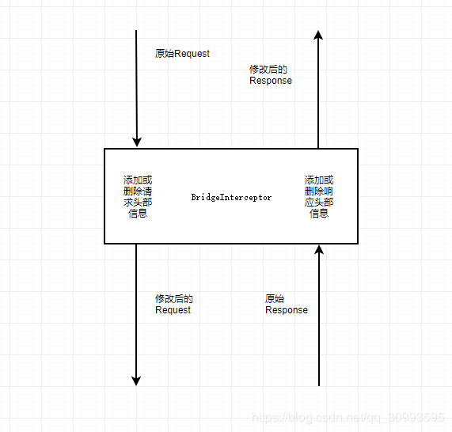

1、构造方法

```
public BridgeInterceptor(CookieJar cookieJar) {
    this.cookieJar = cookieJar;
}
```

构造方法接收一个CookieJar，还记得在RealCall中怎么实现这个拦截器的吗

```
interceptors.add(new BridgeInterceptor(client.cookieJar()));
```

原来这个参数是从OKHttpClient中取的，其实回去看看OKHttpClient的实现就知道在Build过程中会实例化一个CookieJar

```
public Builder() {
  ......
  cookieJar = CookieJar.NO_COOKIES;
  ......
}
```

这里只是提供一个默认的CookieJar的实现，到CookieJar中去看看

CookieJar

```
public interface CookieJar {
  /** A cookie jar that never accepts any cookies. */
  CookieJar NO_COOKIES = new CookieJar() {
    @Override public void saveFromResponse(HttpUrl url, List<Cookie> cookies) {
    }

    @Override public List<Cookie> loadForRequest(HttpUrl url) {
      return Collections.emptyList();
    }
  };

  
  void saveFromResponse(HttpUrl url, List<Cookie> cookies);

 
  List<Cookie> loadForRequest(HttpUrl url);
}
```

可以看到BridgeInterceptor的构造方法接收的只是一个空的CookieJar 实现，默认不对Cookie进行处理，那这个接口有什么作用呢？

> 为HTTP Cookie提供策略和持久化操作
> 策略也就是选择接收哪些cookie和拒绝哪些cookie
> 持久化也就是提供cookie的存储，可以存储在内存中，也可以在文件里，还可以在数据库中

所以如果我们想要保存Cookie，那我们需要自定义一个类去实现CookieJar接口，然后实现其中的方法，对Cookie做一些保存操作，最后在通过Build构建OKHttpClient的时候调用 public Builder cookieJar(CookieJar cookieJar) 方法去设置就行了

Cookie

用下图来展示Cookie的作用


简单的说，Cookie就是一些数据，用于服务器识别客户端的凭证，以避免每次访问服务器都要重复登录
因为HTTP协议是无状态的，你第一次连接服务器并登录成功后，下一次再访问服务器，服务器还是不知道你是谁；而有了Cookie后，就能解决这些问题；第一次登录成功后，服务器返回一些数据（Cookie）给浏览器，浏览器保存在本地；下次再访问服务器时，把这些数据即Cookie一起发送给服务器，服务器就能根据这些数据判断你是之前登录的那位用户；cookie存储的数据量有限，不同的浏览器有不同的存储大小，但一般不超过4KB。因此使用cookie只能存储一些小量的数据

说起Cookie，你可能还会想到Session，有一篇文章讲的比较全面[理解Cookie和Session机制](https://www.cnblogs.com/andy-zhou/p/5360107.html#_caption_0)

2、BridgeInterceptor.intercept

```
@Override public Response intercept(Chain chain) throws IOException {
    //获取请求信息
    Request userRequest = chain.request();
    /构建一个包含当前Request数据的Build对象
    Request.Builder requestBuilder = userRequest.newBuilder();
    // 获取请求体对象
    RequestBody body = userRequest.body();
    if (body != null) {
      // 如果用户设置了Content-Type，那就添加该头部信息
      // 设置请求体的MIME类型
      MediaType contentType = body.contentType();
      if (contentType != null) {
        requestBuilder.header("Content-Type", contentType.toString());
      }

      long contentLength = body.contentLength();
      if (contentLength != -1) {
        //如果用户设置了Content-Length，那就添加该头部信息，并删除Transfer-Encoding
        requestBuilder.header("Content-Length", Long.toString(contentLength));
        requestBuilder.removeHeader("Transfer-Encoding");
      } else {
        // 如果用户没有设置Content-Length，那就添加Transfer-Encoding，并删除Content-Length
        requestBuilder.header("Transfer-Encoding", "chunked");
        requestBuilder.removeHeader("Content-Length");
      }
    }
    
    // 添加host头部信息，即主机名
    if (userRequest.header("Host") == null) {
      requestBuilder.header("Host", hostHeader(userRequest.url(), false));
    }
    
    /**
    * 我们知道以前HTTP是无状态的，即进行请求时的操作是
    * 先进行TCP三次握手，再进行传输，最后释放连接；
    * 当网络内容复杂时候，需要多次数据传输，那么就会造成频繁的创建Socket和释放，频繁的握手
    * 延时和资源的消耗的问题就产生了
    * HTTP1.1开始引入长连接或者说持久连接后，这个问题得到解决
    * Keep-Alive机制可以在数据传输完成之后仍然保持TCP连接，以备后用
    * 当用户需要再次获取数据时，直接使用刚刚空闲下来的连接，无需再次握手，这样就解决了延时问题，提高了HTTP的性能
    */
    if (userRequest.header("Connection") == null) {
      requestBuilder.header("Connection", "Keep-Alive");
    }

    // 设置gzip压缩，告诉服务器，客户端是支持gzip的，希望服务器返回的数据是经过gzip压缩的
    boolean transparentGzip = false;
    if (userRequest.header("Accept-Encoding") == null && userRequest.header("Range") == null) {
      transparentGzip = true;
      //Accept-Encoding 向服务器端表明客户端支持的编码格式
      requestBuilder.header("Accept-Encoding", "gzip");
    }

    // 如果Cookie非空，则加入到请求头
    List<Cookie> cookies = cookieJar.loadForRequest(userRequest.url());
    if (!cookies.isEmpty()) {
      requestBuilder.header("Cookie", cookieHeader(cookies));
    }
    
    //如果没有设置用户代理，则默认为当前OkHttp的版本
    if (userRequest.header("User-Agent") == null) {
      requestBuilder.header("User-Agent", Version.userAgent());
    }
    
    //调用拦截器链的下一个拦截器，获取响应
    Response networkResponse = chain.proceed(requestBuilder.build());
    
    /**
     * 如果服务器给我们返回了Cookie，那就通过CookieJar的具体实现类去保存
     * 当然了，如果开发者没有设置CookieJar的实现类，默认是不会保存的
     */
    HttpHeaders.receiveHeaders(cookieJar, userRequest.url(), networkResponse.headers());
    //新建一个包含Request所有信息的Response.Builder实例
    Response.Builder responseBuilder = networkResponse.newBuilder()
        .request(userRequest);
    /**
     * 第一个判断是：客户端是否设置了gzip压缩，也就是有没有告诉服务器你要给我一个gzip压缩的响应体
     * 第二个判断是：服务器支不支持gzip压缩，也就是有没有对响应进行gzip压缩
     * 第三个判断是：有没有响应体
     * 如果三个条件都满足，说明响应体是经过gzip压缩的，那么就需要进行解压
     * 最后构建用户需要的Response
     * Content-Encoding 表示响应体内容的编码格式
     */
    if (transparentGzip
        && "gzip".equalsIgnoreCase(networkResponse.header("Content-Encoding"))
        && HttpHeaders.hasBody(networkResponse)) {
      // 将响应体的输入流转换成GzipSource类型，也就是进行解压  
      GzipSource responseBody = new GzipSource(networkResponse.body().source());
      //构建响应头
      Headers strippedHeaders = networkResponse.headers().newBuilder()
          .removeAll("Content-Encoding")
          .removeAll("Content-Length")
          .build();
      responseBuilder.headers(strippedHeaders);
      String contentType = networkResponse.header("Content-Type");
      responseBuilder.body(new RealResponseBody(contentType, -1L, Okio.buffer(responseBody)));
    }
    //将最终的响应返回给上一个拦截器
    return responseBuilder.build();
  }
```

3、BridgeInterceptor.cookieHeader

将所有的Cookie组装成String返回，添加到请求头

```
private String cookieHeader(List<Cookie> cookies) {
    StringBuilder cookieHeader = new StringBuilder();
    for (int i = 0, size = cookies.size(); i < size; i++) {
      if (i > 0) {
        cookieHeader.append("; ");
      }
      Cookie cookie = cookies.get(i);
      cookieHeader.append(cookie.name()).append('=').append(cookie.value());
    }
    return cookieHeader.toString();
  }
```

4、总结
从上面的代码可以看到，桥接拦截器的执行逻辑主要就是以下几点

* 对用户构建的Request进行添加或者删除相关头部信息，以转化成能够真正进行网络请求的Request
* 将符合网络请求规范的Request交给下一个拦截器处理，并获取Response
* 如果响应体经过了GZIP压缩，那就需要解压，再构建成用户可用的Response并返回

还有一点需要注意的是桥接拦截器可能会被执行多次，或者说重试及重定向拦截器后面的拦截器都有可能会被执行多次

八、CacheInterceptor

1、构造方法

```
final InternalCache cache;

public CacheInterceptor(InternalCache cache) {
	this.cache = cache;
}
```

它的实例化是在RealCall当中

```
interceptors.add(new CacheInterceptor(client.internalCache()));
```

从这里可以看到参数是需要我们在构建OKHttpClient的时候传入的，如果没有传，那OKHttp是默认不会使用缓存的

InternalCache它是一个接口，但是OKHttp不推荐开发者自定义该接口的实现类，而应该使用OKHttp提供的实现类Cache

```
public interface InternalCache {
  // 根据请求获取响应
  Response get(Request request) throws IOException;
 // 存储网络响应 并返回缓存的请求
  CacheRequest put(Response response) throws IOException;
  // 当缓存无效的时候移除缓存 
  // 比如OKHttp只支持缓存get请求，其它方法的响应不缓存
  void remove(Request request) throws IOException;
  
  void update(Response cached, Response network);

  void trackConditionalCacheHit();

  void trackResponse(CacheStrategy cacheStrategy);
}
```

所以我们在构建OKHttpClient的时候正确做法如下

```
httpClient = new OkHttpClient
                .Builder()
                .cache(new Cache(new File("cache"),1024*1024*24))
                .build();
```

Cache类接收两个参数，第一个参数是缓存目录，第二个参数是最大缓存值

2、intercept

```
@Override public Response intercept(Chain chain) throws IOException {
	// 通过request从缓存中获取响应
	Response cacheCandidate = cache != null
	        ? cache.get(chain.request())
	        : null;

    long now = System.currentTimeMillis();
    
   /**
    * CacheStrategy 是一个缓存策略类 比如强制缓存 对比缓存等 它决定是使用缓存还是进行网络请求
    * 其内部维护了Request、Response
    * 如果Request为null表示不使用网络
    * 如果Response为null表示不使用缓存
    */
    CacheStrategy strategy = new CacheStrategy.Factory(now, chain.request(), cacheCandidate).get();
    Request networkRequest = strategy.networkRequest;
    Response cacheResponse = strategy.cacheResponse;
    
    //根据缓存策略，更新统计指标：请求次数、使用网络请求次数、使用缓存次数
    if (cache != null) {
      cache.trackResponse(strategy);
    }
    
    // 能从缓存中获取响应但是缓存策略是不使用缓存，那就关闭获取的缓存
    if (cacheCandidate != null && cacheResponse == null) {
      closeQuietly(cacheCandidate.body()); // The cache candidate wasn't applicable. Close it.
    }

    // 如果缓存策略是不使用网络也不使用缓存，那就构建一个504错误码的响应并返回
    if (networkRequest == null && cacheResponse == null) {
      return new Response.Builder()
          .request(chain.request())
          .protocol(Protocol.HTTP_1_1)
          .code(504)
          .message("Unsatisfiable Request (only-if-cached)")
          .body(Util.EMPTY_RESPONSE)
          .sentRequestAtMillis(-1L)
          .receivedResponseAtMillis(System.currentTimeMillis())
          .build();
    }

    // 如果缓存策略是不使用网络但是可以使用缓存，那就通过缓存策略的缓存构建响应并返回
    if (networkRequest == null) {
      return cacheResponse.newBuilder()
          .cacheResponse(stripBody(cacheResponse))
          .build();
    }
    
    // 定义响应
    Response networkResponse = null;
    try {
      // 到这里就说明可以使用网络，那就交给下一个拦截器去处理获取响应
      networkResponse = chain.proceed(networkRequest);
    } finally {
      // 如果发生了IO异常或者其它异常，关闭缓存避免内存泄漏
      if (networkResponse == null && cacheCandidate != null) {
        closeQuietly(cacheCandidate.body());
      }
    }

    // 如果缓存策略是可以使用缓存
    if (cacheResponse != null) {
      // 且网络响应码是304 HTTP_NOT_MODIFIED说明本地缓存可以使用
      // 且网络响应是没有响应体的
      // 这时候就合并缓存响应和网络响应并构建新的响应
      if (networkResponse.code() == HTTP_NOT_MODIFIED) {
        Response response = cacheResponse.newBuilder()
            .headers(combine(cacheResponse.headers(), networkResponse.headers()))
            .sentRequestAtMillis(networkResponse.sentRequestAtMillis())
            .receivedResponseAtMillis(networkResponse.receivedResponseAtMillis())
            .cacheResponse(stripBody(cacheResponse))
            .networkResponse(stripBody(networkResponse))
            .build();
        networkResponse.body().close();

        // 在合并标头之后但在剥离Content-Encoding标头之前更新缓存
        cache.trackConditionalCacheHit();
        cache.update(cacheResponse, response);
        return response;
      } else {
        closeQuietly(cacheResponse.body());
      }
    }
    
    // 走到这里说明缓存策略是不可以使用缓存或本地缓存不可用
    // 那就通过网络响应构建响应对象
    Response response = networkResponse.newBuilder()
        .cacheResponse(stripBody(cacheResponse))
        .networkResponse(stripBody(networkResponse))
        .build();
    
    // 客户端允许使用缓存
    if (cache != null) {
      // 如果响应有响应体且响应可以缓存 那就将响应写入到缓存
      if (HttpHeaders.hasBody(response) && CacheStrategy.isCacheable(response, networkRequest)) {
        // 缓存响应的部分信息
        CacheRequest cacheRequest = cache.put(response);
        // 缓存响应体并返回响应
        return cacheWritingResponse(cacheRequest, response);
      }
      
      // 通过请求方法判断需不需要进行缓存
      if (HttpMethod.invalidatesCache(networkRequest.method())) {
        try {
          // 不合法就删除缓存
          cache.remove(networkRequest);
        } catch (IOException ignored) {
          // The cache cannot be written.
        }
      }
    }

    return response;    
}
```

可以看到想要缓存一个正确的网络响应，需要满足三个条件

* 客户端允许缓存，即设置了Cache
* 响应有响应体
* 响应是符合缓存条件的

第一个条件我们默认设置了，要不然就没得说了；第二个条件是通过hasBody方法判断的

1.HttpHeaders.hasBody

```
// 判断网络响应是否有响应体
public static boolean hasBody(Response response) {
    // 如果请求方法是HEAD，直接return
    // 该方法只有响应头，没有响应体
    if (response.request().method().equals("HEAD")) {
      return false;
    }

    int responseCode = response.code();
    //根据响应码判断，如果符合条件就返回true，认为有响应体
    if ((responseCode < HTTP_CONTINUE || responseCode >= 200)
        && responseCode != HTTP_NO_CONTENT
        && responseCode != HTTP_NOT_MODIFIED) {
      return true;
    }

    // 如果不符合上述响应码，我们还是要看下Content-Length和Transfer-Encoding响应头的情况来决定是否缓存
    // Content-Length:这是表示响应体的长度,contentLength(response)也就是获取该字段的值，如果大于0那就肯定有响应体
    // Transfer-Encoding:分块传输 就是将响应体分成多个块进行传输，这个也就代表着肯定有响应体
    if (contentLength(response) != -1
        || "chunked".equalsIgnoreCase(response.header("Transfer-Encoding"))) {
      return true;
    }

    return false;
  }
```

1. 响应码

* 1XX: 100-199 的状态码代表着信息性状态码，比如上面的HTTP_CONTINUE（100）
* 2xx: 200-299 的状态码代表着成功状态码,但是204状态码代表着没有实体仅仅有响应行和响应头，HTTP_NO_CONTENT即是204
* 3xx: 300-399 的状态码代表着重定向 但是304状态码代表着请求资源未修改,请使用缓存,只有响应行和响应头没有响应体，即HTTP_NOT_MODIFIED
* 4xx: 400-499 的状态码代表着客户端错误代码
* 5xx: 500-599 的状态码代表着服务器错误代码

上面的通过响应码的判断逻辑也就是当状态码小于100的时候，那肯定也就小于204和304，是有响应体的，当状态码大于等于200的时候，同时不等于204和304，也说明有响应体，需要进行缓存网络响应

这里讲下304这个响应码，即HTTP_NOT_MODIFIED对应的值：

* 当客户端第一次访问服务器，服务器在返回资源的同时会将一个ETag值保存在响应头，ETag值表示当前请求的资源在服务器的唯一标识，生成规则由服务器决定；客户端接收到后会缓存响应中的数据和ETag值
* 当客户端发现该资源过期时，如果它还有ETag声明，那再次向服务器请求时会带上If-None-Match请求头，值就是ETag的值
* 服务器接收到请求后，发现请求头有If-None-Match值，那就跟该资源的ETag值进行比较，根据结果返回200或者304

更多关于HTTP响应码可以参考[HTTP响应码](https://www.iteye.com/blog/desert3-1136548)

2.CacheStrategy.isCacheable

第三个条件就是判断响应是否符合缓存条件

```
public static boolean isCacheable(Response response, Request request) {
    // Always go to network for uncacheable response codes (RFC 7231 section 6.1),
    // This implementation doesn't support caching partial content.
    switch (response.code()) {
      //200 成功返回状态码
      case HTTP_OK:
      //203 实体头部包含的信息来自于资源源服务器的副本而不是来自于源服务器
      case HTTP_NOT_AUTHORITATIVE:
      //204 只有头部没有实体,在根据响应码判断是否有响应体那时已经排除了204 和304的状态码
      case HTTP_NO_CONTENT:
      case HTTP_MULT_CHOICE:
      case HTTP_MOVED_PERM:
      //404 找不到资源
      case HTTP_NOT_FOUND:
      //405 请求方法不支持
      case HTTP_BAD_METHOD:
      //410 和404类似 只是服务器以前拥有该资源但是删除了
      case HTTP_GONE:
      /414 客户端发出的url长度太长
      case HTTP_REQ_TOO_LONG:
      //501 服务器发生一个错误 无法提供服务
      case HTTP_NOT_IMPLEMENTED:
      case StatusLine.HTTP_PERM_REDIRECT:
        // These codes can be cached unless headers forbid it.
        break;
      //302 请求的url已被移除  
      case HTTP_MOVED_TEMP:
      //307 和302类似
      case StatusLine.HTTP_TEMP_REDIRECT:
        // These codes can only be cached with the right response headers.
        // http://tools.ietf.org/html/rfc7234#section-3
        // s-maxage is not checked because OkHttp is a private cache that should ignore s-maxage.
        if (response.header("Expires") != null
            || response.cacheControl().maxAgeSeconds() != -1
            || response.cacheControl().isPublic()
            || response.cacheControl().isPrivate()) {
          break;
        }
        // Fall-through.

      default:
        // 其它状态吗都不给予缓存
        return false;
    }

    // A 'no-store' directive on request or response prevents the response from being cached.
    return !response.cacheControl().noStore() && !request.cacheControl().noStore();
  }
```

3.HttpMethod.invalidatesCache

```
public static boolean invalidatesCache(String method) {
	return method.equals("POST")
	    || method.equals("PATCH")
	    || method.equals("PUT")
	    || method.equals("DELETE")
	    || method.equals("MOVE");
}
```

可以看到我们的网络请求方法是POST，PATCH，PUT，DELETE，MOVE这些方法的时候，会将对应的缓存删除

同时在hasBody方法中还屏蔽了HEAD方法，所以这里会产生一条结论就是OKHttp支持缓存的网络请求方法只有get方法了

3、总结

从上面的方法总结下缓存拦截器的工作逻辑

* 通过request从缓存中获取响应
* 创建缓存策略，从缓存策略类中获取Request和Response
* 如果Request和Response都为null，说明网络不可用且缓存也不可用，那就构建504响应返回
* 如果Request为null，说明网络不可用，但是可以使用缓存，那就通过缓存策略获取到的缓存构建响应返回
* 如果网络可以使用，那就通过下一个拦截器获取响应
* 如果缓存策略获取到的缓存可以用，同时网络请求获取到的响应码是304，说明服务器没有修改数据，本地缓存是可以用的，那就通过这两个响应构建新的响应并返回
* 走到这里说明缓存策略中的缓存不能使用，即服务器修改了数据，那就通过网络响应构建新的响应
* 如果客户端允许缓存，且响应有响应体，同时响应可以缓存 那就将响应写入到缓存
* 再通过请求方法判断是否需要缓存，不需要的话就删除
* 将最新数据返回给上一个拦截器

总体看下来缓存拦截器并不难理解，但是其中涉及到两个非常重要的类

* Cache：OKHttp中缓存具体的操作类
* CacheStrategy：缓存策略类，由它决定是使用缓存还是使用网络请求

九、缓存机制解析 缓存处理类Cache和缓存策略类CacheStrategy源码分析

1、HTTP缓存机制

HTTP协议详细解释可参考[Hypertext Transfer Protocol – HTTP/1.1](https://www.w3.org/Protocols/rfc2616/rfc2616.html)

HTTP头部字段定义可参考[Header Field Definitions](https://www.w3.org/Protocols/rfc2616/rfc2616-sec14.html)

OKHttp的缓存机制遵循了HTTP协议的缓存机制，所以在了解它之前，我们先来看下HTTP协议的缓存机制

HTTP的缓存机制通常有两种：客户端缓存和服务端缓存，我们今天主要介绍下客户端缓存

1.服务端缓存

服务端缓存通常分为代理服务器缓存和反向代理服务器缓存（比如 Nginx反向代理、Squid等）

2.客户端缓存

客户端缓存一般指的是浏览器缓存，而它的实现一般有HTTP协议定义的缓存机制（由头部信息决定），非HTTP协议的缓存机制（HTML Meta标签实现）

非HTTP协议的缓存机制实现就是在< head>节点中加入< meta>标签，如下

```
<META HTTP-EQUIV="Pragma" CONTENT="no-cache">
```

加这句代码就是告诉浏览器当前页面不需要缓存，每次访问都去服务器拉取最新数据；但是它的作用很有限，仅有IE能识别这段meta标签含义，其它主流浏览器仅识别“Cache-Control: no-store”的meta标签

我们这里主要讲HTTP协议定义的缓存机制：

这里通常从两个维度来规定浏览器是直接使用缓存中的数据，还是去服务器获取新的数据：

* 新鲜度：这对应着缓存中的过期机制，也就是表明缓存的有效期；一个缓存资源需要满足下面的条件之一，浏览器会认为该资源是可以使用的，无需向服务器重新拉取
 * 含有完整的过期时间控制头信息（HTTP协议报头），并且仍在有效期内；
 * 浏览器已经使用过这个缓存资源，并且在一个会话中已经检查过新鲜度
* 校验值：这对应着验证机制；服务器返回资源的时候有时会在头信息带上这个资源的实体标签Etag（Entity Tag），它可以用来作为浏览器再次请求该资源的校验标识。如发现校验标识不匹配，说明资源在服务器已经被修改或过期，浏览器需重新获取资源

接下来我们从实际场景来看看：

当我们第一次通过浏览器访问服务器时，肯定是没有缓存的，直接向服务器请求数据；当获取到响应后根据头部信息决定是否将其保存在浏览器中，如图


当再次请求服务器时，再根据头部信息中的字段，比如Expires，Cache-control，Last-Modified ， If-Modified-Since ，Etag，If-None-Match等字段来决定是使用缓存还是重新获取资源；流程如图


当我们取出缓存时，先要判断缓存是否过期，那怎么判断呢？有两个头部信息可以知道：

* 第一个就是Expires：该字段是存在于服务器返回的响应头中，目的是告诉浏览器该资源的过期时间；也就是说当浏览器再次请求的时候如果当前时间早于这个过期时间，那么就不需要请求了，直接使用缓存；如果晚于这个时间，那么再向浏览器请求数据；该字段存在于HTTP/1.0中，格式如下

```
Expires: Thu, 12 Mar 2019 12:08:54 GMT
```

这种机制有一个非常大的问题，因为该字段是存在于响应头中，也就是说它的时间是服务器上的时间，但是客户端的时间是很有可能与服务器上的时间存在误差的，比如不在一个时区，用户修改了自己电脑时间等因素，这样这个字段就没有意义了；在HTTP 1.1开始，使用Cache-Control: max-age=秒 替代；而且现在浏览器均默认使用HTTP 1.1，所以它的作用基本忽略

* 第二个就是Cache-control：它是当前浏览器缓存中非常重要的一个字段，作用与Expires差不多，存在于响应头，都是标注当前资源的有效期；但是它有很多的值，可以指定较为复杂的缓存规则，如果与Expires同时存在，Cache-control的优先级高，它的一般格式如下

```
Cache-Control: private, max-age=0, no-cache
```

可以组合的值有：

* public：表明该资源或者说响应可以被任何用户缓存，比如客户端，代理服务器等都可以缓存资源，写法：Cache-Control:public
* private：表明该资源只能被单个用户缓存，默认是private，即只能被客户端缓存，不能被代理服务器缓存，写法：Cache-Control:private
* max-age：表明该资源的有效时间，单位是s，写法： Cache-Control:max-age=3600，即在获取该资源后3600s内不需要再向服务器获取
* no-cache：表明客户端需要忽略已存在的缓存，强制每次请求直接发送给服务器，拉取资源，写法：Cache-Control:no-cache
* no-store：表明该资源不能被缓存，如果缓存了需要删除，写法：Cache-Control:no-store
* s-maxage：和max-age含义类似，只不过用于public 修饰的缓存，写法：Cache-Control:s-maxage=3600
* must-revalidate：表明在使用缓存前必须要验证旧资源状态，并且不可使用过期资源， 写法：Cache-Control:must-revalidate
* max-stale：表明缓存的资源在过期了但未超过max-stale指定的时间，那么就可以继续使用该缓存，超过后就必须去服务器获取；写法：Cache-Control:max-stale（代表着资源永不过期）； Cache-Control:max-stale=3600(表明在缓存过期后的3600秒内还可以继续用)
* min-fresh：字面意思是最小新鲜度，跟max-age相对应（最大新鲜度），比如max-age=3600，min-fresh=600，那么 他两的差值就是3000，也就是说缓存真正有效时间只有3000s，超过这个时间就要去服务器拉取了
* only-if-cached：不管缓存是否过期，或者服务端有更新，只要存在缓存就是用它，写法：Cache-Control:only-if-cached
* no-transform：不得对资源进行转换，即代理服务器不能修改Content-Encoding, Content-Range, Content-Type等HTTP头；因为有时候代理服务器为了节省缓存空间或者提高传输效率，会对图片等进行压缩；写法： Cache-Control:no-transform、
* immutable：表示资源在有效期内服务器不会对其更改，这样客户端就不需要再发送验证请求头，比如If-None-Match或If-Modified-Since来检测更新，即使用户主动刷新页面，写法：Cache-Control:immutable

上面所列举的Expires和Cache-control是从新鲜度的角度来强制决定客户端缓存，下面所说的是从校验值的角度来与服务器协商验证是使用缓存还是重新获取数据，也就是上图在判断缓存过期后的流程

这里有几个字段来标识缓存规则：Last-Modified / If-Modified-Since ，Etag / If-None-Match（优先级大于Last-Modified / If-Modified-Since)）

* Etag：服务器在响应客户端请求时，会在响应头带上该字段；它表示该资源在服务器中的唯一标识，生成规则由服务器决定，在Apache中，ETag的值默认是对文件的索引节（INode），大小（Size）和最后修改时间（MTime）进行Hash后得到的
* If-None-Match：这是在请求头中的字段，值就是Etag的值

它们两的使用逻辑就是：当客户端判断资源过期时（通常使用Cache-Control标识的max-age），如果发现缓存的响应有Etag头部声明，那再次向服务器请求时带上If-None-Match头部，值就是Etag的值，web服务器收到请求后发现有If-None-Match头，就将其与存在服务端的Etag值进行比较；如果匹配，说明该资源没有修改，那就返回304，告诉客户端可以继续使用缓存；如果不匹配，说明资源修改过，那就返回200，重新响应该资源给客户端

接下来就是客户端发现缓存的响应没有Etag声明，那就从Last-Modified / If-Modified-Since进行判断

* Last-Modified：标识资源在服务器上的最后修改时间，随着响应头带给客户端
* If-Modified-Since：这是在请求头中的字段，值就是Last-Modified的值

它们两的使用逻辑是：当客户端判断资源过期时，同时缓存的响应头没有Etag声明，如果发现头部有Last-Modified声明，则再次向服务器请求资源时，在请求头带上 If-Modified-Since头部，值就是Last-Modified的值；服务器收到请求后发现有头If-Modified-Since 则与被请求资源的最后修改时间进行比对。若最后修改时间较新，说明资源被改动过，则响应整片资源给客户端，响应码是 200；若最后修改时间较旧，说明资源无修改，则响应304 ，告知浏览器继续使用缓存

一般情况下，使用Cache-Control/Expires会配合Last-Modified/ETag一起使用，因为即使服务器设置缓存时间，当用户点击“刷新”按钮时，浏览器会忽略缓存继续向服务器发送请求，这时Last-Modified/ETag就能够起作用，服务器如果资源没有修改就返回304，从而减少响应开销

3.Etag与Last-Modified

不知道你有没有疑惑，Etag也是判断资源有没有修改，Last-Modified也是判断资源有没有修改，那两个重复功能的存在是不是多余呢?

要知道Last-Modified是出现在HTTP1.0中的，但是它有几个问题：

Last-Modified表示的最后修改时间只能精确到秒级，如果某些文件在1秒钟以内，被修改多次的话，它就不能准确标注文件的新鲜度
一些文件也许会周期性的更改，但是他的内容并不改变(仅仅改变的修改时间)，这个时候我们并不希望客户端认为这个文件被修改了，而重新GET
服务器可能没有获取准确的修改时间，或者与代理服务器时间不一致
在HTTP1.1出现的Etag就主要就是为了解决它的几个问题，Etag是服务器自动生成或者由开发者生成的对应资源在服务器端的唯一标识符，能够更加准确的控制缓存。Last-Modified与ETag是可以一起使用的，服务器会优先验证ETag，一致的情况下，才会继续比对Last-Modified，最后才决定是否返回304，

4.用户行为

浏览器的缓存不光与HTTP协议有关，还与用户的行为有关，比如用户手动点击浏览器的刷新按钮，或者按Ctrl+F5进行强制刷新，这些操作都会对从缓存中获取到的响应的头部字段Expires/Cache-Control，Last-Modified/Etag产生影响

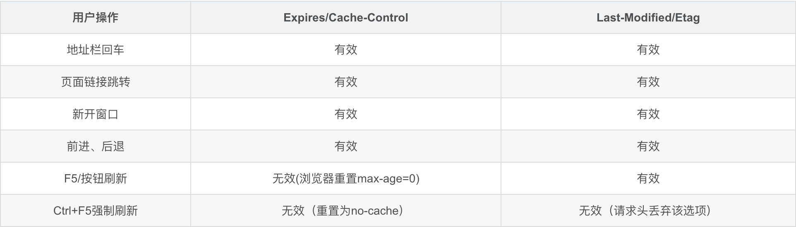

2、Cache

OKHttp提供了缓存机制以将我们的的HTTP和HTTPS请求的响应缓存到文件系统中，但是它默认是不使用缓存的，所以如果我们需要使用缓存（强烈推荐使用），就得在实例化OKHttpClient的时候进行相关的配置，如下：

1.全局缓存配置

```
File cacheFile = new File(AppContextUtils.getContext().getCacheDir(), "HttpCache");
        Cache cache = new Cache(cacheFile, 1024 * 1024 * 100);

OkHttpClient.Builder httpClientBuilder = new OkHttpClient().newBuilder()
        .readTimeout(ApiConfig.getDefaultTimeout(), TimeUnit.MILLISECONDS)
        .connectTimeout(ApiConfig.getDefaultTimeout(), TimeUnit.MILLISECONDS)
        .addInterceptor(HttpLoggerInterceptor.getLoggerInterceptor())
        .addInterceptor(new HttpHeaderInterceptor())
        .addNetworkInterceptor(new HttpCacheInterceptor())
        .cache(cache)
        .build();
```

这里的Cache类是OKHttp内部提供的一个用于缓存实际操作的类，它内部维护了一个匿名内部类实现了InternalCache接口，该接口定义的功能由Cache实现

当然了你也可以自己实现InternalCache接口，采用自己的缓存逻辑，那就通过Build的如下方法进行设置

```
void setInternalCache(InternalCache internalCache) {
      this.internalCache = internalCache;
      this.cache = null;
}
```

2.单个请求缓存配置

上面的缓存配置是全局的，也可以对单个请求配置不同的缓存策略

```
new Request
         .Builder()
         .cacheControl(new CacheControl())
         .build();
```

这个CacheControl的构造方法有很多参数，参考上面的HTTP缓存机制那一节；同时CacheControl内部也提供了两个策略供开发者使用

```
//强制使用网络，不使用缓存
public static final CacheControl FORCE_NETWORK = new Builder().noCache().build();
//强制使用缓存，不使用网络
public static final CacheControl FORCE_CACHE = new Builder()
      .onlyIfCached()
      .maxStale(Integer.MAX_VALUE, TimeUnit.SECONDS)
      .build();
```

* 某些情况下，比如用户点击刷新按钮，那么就需要跳过缓存，重新去服务器获取最小数据，那就需要强制使用网络，不使用缓存

```
Request request = new Request.Builder()
        .cacheControl(new CacheControl.Builder().noCache().build())
        //.cacheControl(CacheControl.FORCE_NETWORK ) 两种写法一样
        .url("http://publicobject.com/helloworld.txt")
        .build();
```

* 如果必须要服务器验证下缓存的响应，可以使用max-age = 0 指令

```
Request request = new Request.Builder()
    .cacheControl(new CacheControl.Builder().maxAge(0, TimeUnit.SECONDS).build())
    .url("http://publicobject.com/helloworld.txt")
    .build();
```

* 如果某些资源不需要重复向服务器请求，可以设置强制使用缓存

```
Request request = new Request.Builder()
          .cacheControl(new CacheControl.Builder().onlyIfCached().maxStale(Integer.MAX_VALUE, TimeUnit.SECONDS).build())
          .url("http://publicobject.com/helloworld.txt")
          .build();
```

给单个请求进行配置最终会添加相应的请求头

```
/**
 * 该请求头将会替换掉任何缓存控制标头
 */
public Builder cacheControl(CacheControl cacheControl) {
  String value = cacheControl.toString();
  if (value.isEmpty()) return removeHeader("Cache-Control");
  return header("Cache-Control", value);
}
```

3.构造方法

```
public Cache(File directory, long maxSize) {
    this(directory, maxSize, FileSystem.SYSTEM);
  }

  Cache(File directory, long maxSize, FileSystem fileSystem) {
    this.cache = DiskLruCache.create(fileSystem, directory, VERSION, ENTRY_COUNT, maxSize);
  }
```

公开构造方法接收两个参数，然后调用内部重载的构造方法；在下面的这个构造方法可以看到实例化了一个DiskLruCache对象

DiskLruCache这个东西大家应该很熟悉了吧，我们通常做三级缓存的时候，其中的文件缓存或者说磁盘缓存就是通过它来实现的，使用的是著名的 最近最少使用算法（Least recently used），所以可以明白OKHttp的缓存其实是通过DiskLruCache实现的

4.Cache.put

```
@Nullable CacheRequest put(Response response) {
    // 获取网络请求方法
    String requestMethod = response.request().method();
    // 验证请求方法的合法性，具体什么方法不能缓存见下方
    if (HttpMethod.invalidatesCache(response.request().method())) {
      try {
        // 如果是这些请求方法就移除缓存
        remove(response.request());
      } catch (IOException ignored) {
        // The cache cannot be written.
      }
      return null;
    }
    // 如果请求方法不是get请求，那就直接返回null
    if (!requestMethod.equals("GET")) {
      // 不做非get请求的缓存，虽然其它方法的响应可以缓存，但是做起来成本太大且效率低下，所以放弃
      return null;
    }
    // 如果响应头含有 * 字符，那也不缓存，直接返回null
    if (HttpHeaders.hasVaryAll(response)) {
      return null;
    }
    // 创建Entry对象，这个对象封装了响应的一些信息，见下方
    Entry entry = new Entry(response);
    // 创建编辑对象 这个操作类似于SharedPerference
    DiskLruCache.Editor editor = null;
    try {
      // 通过DiskLruCache创建editor对象（需要将url转换成key，方法见下方）
      editor = cache.edit(key(response.request().url()));
      if (editor == null) {
        return null;
      }
      // 将entry封装的部分信息写入缓存，不包括响应体，该方法见下方
      entry.writeTo(editor);
      // 返回CacheRequestImpl对象给拦截器，用来缓存响应体
      return new CacheRequestImpl(editor);
    } catch (IOException e) {
      abortQuietly(editor);
      return null;
    }
  }
```

5.HttpMethod.invalidatesCache

```
  public static boolean invalidatesCache(String method) {
    return method.equals("POST")
        || method.equals("PATCH")
        || method.equals("PUT")
        || method.equals("DELETE")
        || method.equals("MOVE");     // WebDAV
  }
```

如果是以上这些请求方法，那么获取到的响应将不会进行缓存

HTTP请求方法一览：

* OPTIONS：获取服务器支持的HTTP请求方法和用来检查服务器的性能
* GET：请求获取Request-URI所标识的资源
* POST：在Request-URI所标识的资源后附加新的数据，通常我们用来提交表单
* PUT：请求服务器存储一个资源，并用Request-URI作为其标识
* PATCH：是对PUT方法的补充，用来对已知资源进行局部更新
* DELETE：请求服务器删除Request-URI所标识的资源
* HEAD：请求获取由Request-URI所标识的资源的响应消息报头
* MOVE：请求服务器将指定的页面移至另一个网络地址

6.Cache.Entry

```
  private static final class Entry {
    /** Synthetic response header: the local time when the request was sent. */
    private static final String SENT_MILLIS = Platform.get().getPrefix() + "-Sent-Millis";

    /** Synthetic response header: the local time when the response was received. */
    private static final String RECEIVED_MILLIS = Platform.get().getPrefix() + "-Received-Millis";

    private final String url;
    private final Headers varyHeaders;
    private final String requestMethod;
    private final Protocol protocol;
    private final int code;
    private final String message;
    private final Headers responseHeaders;
    private final Handshake handshake;
    private final long sentRequestMillis;
    private final long receivedResponseMillis;

    ...... 

}
```

Entry是Cache的一个静态内部类，封装了请求的一些信息，比如请求url，请求头，请求方法，请求协议类型；响应码，响应信息，响应头，TLS握手信息，请求发送时间，响应获取时间

7.Cache. key

```
 public static String key(HttpUrl url) {
    return ByteString.encodeUtf8(url.toString()).md5().hex();
  }
```

将url生成key

* 获取url的utf-8格式不可变字节序列
* 进行md5加密
* 获取16进制形式字符串

8.Cache.Entry.writeTo

```
    public void writeTo(DiskLruCache.Editor editor) throws IOException {
      BufferedSink sink = Okio.buffer(editor.newSink(ENTRY_METADATA));

      sink.writeUtf8(url)
          .writeByte('\n');
      sink.writeUtf8(requestMethod)
          .writeByte('\n');
      sink.writeDecimalLong(varyHeaders.size())
          .writeByte('\n');
      for (int i = 0, size = varyHeaders.size(); i < size; i++) {
        sink.writeUtf8(varyHeaders.name(i))
            .writeUtf8(": ")
            .writeUtf8(varyHeaders.value(i))
            .writeByte('\n');
      }

      sink.writeUtf8(new StatusLine(protocol, code, message).toString())
          .writeByte('\n');
      sink.writeDecimalLong(responseHeaders.size() + 2)
          .writeByte('\n');
      for (int i = 0, size = responseHeaders.size(); i < size; i++) {
        sink.writeUtf8(responseHeaders.name(i))
            .writeUtf8(": ")
            .writeUtf8(responseHeaders.value(i))
            .writeByte('\n');
      }
      sink.writeUtf8(SENT_MILLIS)
          .writeUtf8(": ")
          .writeDecimalLong(sentRequestMillis)
          .writeByte('\n');
      sink.writeUtf8(RECEIVED_MILLIS)
          .writeUtf8(": ")
          .writeDecimalLong(receivedResponseMillis)
          .writeByte('\n');

      if (isHttps()) {
        sink.writeByte('\n');
        sink.writeUtf8(handshake.cipherSuite().javaName())
            .writeByte('\n');
        writeCertList(sink, handshake.peerCertificates());
        writeCertList(sink, handshake.localCertificates());
        // 在旧的缓存响应和HttpsURLConnection上tls握手版本是null
        if (handshake.tlsVersion() != null) {
          sink.writeUtf8(handshake.tlsVersion().javaName())
              .writeByte('\n');
        }
      }
      sink.close();
    }
```

将Entry封装的url，请求方法，请求头；响应行（这里面包括请求协议类型，响应码，响应信息），响应头，发送请求的时间，获取响应的时间，TLS握手信息写入到缓存

总结

通过对put方法的分析我们可以知道：

* OkHttp只支持缓存GET方法的响应
* 如果响应头含有*字符也不缓存
* Cache类中并不会直接将响应体写入缓存，而是交给构建一个CacheRequestImpl对象交给拦截器去操作

9.Cache.get

继续看从缓存中获取响应的方法

CacheInterceptor的intercept方法中第一句代码就是调用Cache类的get方法获取缓存的响应，那我们来看下它的具体实现

```
  Response get(Request request) {
    // 将请求url转化成可以使用的key
    String key = key(request.url());
    // 定义缓存快照对象
    DiskLruCache.Snapshot snapshot;
    Entry entry;
    try {
      // 通过DiskLruCache对象获取一个该key对象的缓存快照
      snapshot = cache.get(key);
      // 如果快照是null，说明没有缓存响应，直接返回null
      if (snapshot == null) {
        return null;
      }
    } catch (IOException e) {
      // 出现异常 不能读取缓存
      return null;
    }

    try {
      // 创建Entry对象，将快照中的缓存信息封装到Entry对象
      entry = new Entry(snapshot.getSource(ENTRY_METADATA));
    } catch (IOException e) {
      Util.closeQuietly(snapshot);
      return null;
    }
	// 将缓存中的数据构建成一个响应 见下方
    Response response = entry.response(snapshot);
    // 通过比对请求和响应的相关字段，来判断是否是改请求对应的响应 见下方
    if (!entry.matches(request, response)) {
      Util.closeQuietly(response.body());
      return null;
    }

    return response;
  }
```

10.Cache.Entry.response

```
    public Response response(DiskLruCache.Snapshot snapshot) {
      String contentType = responseHeaders.get("Content-Type");
      String contentLength = responseHeaders.get("Content-Length");
      Request cacheRequest = new Request.Builder()
          .url(url)
          .method(requestMethod, null)
          .headers(varyHeaders)
          .build();
      return new Response.Builder()
          .request(cacheRequest)
          .protocol(protocol)
          .code(code)
          .message(message)
          .headers(responseHeaders)
          .body(new CacheResponseBody(snapshot, contentType, contentLength))
          .handshake(handshake)
          .sentRequestAtMillis(sentRequestMillis)
          .receivedResponseAtMillis(receivedResponseMillis)
          .build();
    }
```

通过Entry中的信息构建响应中非响应体的数据，而响应报文body是通过CacheResponseBody构建，CacheResponseBody又是通过缓存快照和内容类型，内容长度构成（见下方），最终就构成了一个完整的响应

11.Cache.CacheResponseBody

CacheResponseBody也是Cache中的一个静态内部类

```
  private static class CacheResponseBody extends ResponseBody {
    final DiskLruCache.Snapshot snapshot;
    private final BufferedSource bodySource;
    private final String contentType;
    private final String contentLength;

    public CacheResponseBody(final DiskLruCache.Snapshot snapshot,
        String contentType, String contentLength) {
      this.snapshot = snapshot;
      this.contentType = contentType;
      this.contentLength = contentLength;

      Source source = snapshot.getSource(ENTRY_BODY);
      bodySource = Okio.buffer(new ForwardingSource(source) {
        @Override 
        public void close() throws IOException {
          snapshot.close();
          super.close();
        }
      });
    }
  }

```

12.Cache.Entry.matches

```
public boolean matches(Request request, Response response) {
  return url.equals(request.url().toString())
      && requestMethod.equals(request.method())
      && HttpHeaders.varyMatches(response, varyHeaders, request);
}
```

将Entry封装的从缓存读取的响应的数据和传递过来的Request中的数据进行对比，判断是否匹配

总结
获取缓存的方法比较简单，通过url获取缓存快照，如果没有就返回null；反之通过快照构建Entry对象，然后通过Entry和Snapshot 构建完整的响应，最后比对Request和Response，如果匹配就返回

3、CacheStrategy

缓存拦截器CacheInterceptor决定使用缓存还是网络请求是由这个策略类决定的，它里面维护两个变量：

```
/** 如果最终这个变量为null，那就不能使用网络；反之就通过网络发送请求. */
public final Request networkRequest;

/** 如果最终这个变量为null，那就不能使用缓存；反之就返回缓存的响应. */
public final Response cacheResponse;

```
在上篇文章我们分析拦截器的拦截方法开头有这么一段代码，并且分析完后可以看到CacheStrategy 在拦截方法里起到了非常重要的作用

```
  @Override 
  public Response intercept(Chain chain) throws IOException {

    CacheStrategy strategy = new CacheStrategy.Factory(now, chain.request(), cacheCandidate).get();
    Request networkRequest = strategy.networkRequest;
    Response cacheResponse = strategy.cacheResponse;
  }
```

1.CacheStrategy.Factory

```
    public Factory(long nowMillis, Request request, Response cacheResponse) {
      this.nowMillis = nowMillis;
      this.request = request;
      this.cacheResponse = cacheResponse;
      // 若有缓存
      if (cacheResponse != null) {
        // 当时发出请求获取该响应的时间
        this.sentRequestMillis = cacheResponse.sentRequestAtMillis();
        // 收到该响应的时间
        this.receivedResponseMillis = cacheResponse.receivedResponseAtMillis();
        // 取出缓存的响应头
        Headers headers = cacheResponse.headers();
        // 遍历header，保存Date、Expires、Last-Modified、ETag、Age等缓存机制相关字段的值
        for (int i = 0, size = headers.size(); i < size; i++) {
          String fieldName = headers.name(i);
          String value = headers.value(i);
          if ("Date".equalsIgnoreCase(fieldName)) {
            servedDate = HttpDate.parse(value);
            servedDateString = value;
          } else if ("Expires".equalsIgnoreCase(fieldName)) {
            expires = HttpDate.parse(value);
          } else if ("Last-Modified".equalsIgnoreCase(fieldName)) {
            lastModified = HttpDate.parse(value);
            lastModifiedString = value;
          } else if ("ETag".equalsIgnoreCase(fieldName)) {
            etag = value;
          } else if ("Age".equalsIgnoreCase(fieldName)) {
            ageSeconds = HttpHeaders.parseSeconds(value, -1);
          }
        }
      }
    }
```

Factory是CacheStrategy的一个静态内部类，用来获取缓存的响应信息，然后根据这些信息生成缓存策略

最后通过get方法获取CacheStrategy实例

2.CacheStrategy.Factory.get

```
public CacheStrategy get() {
  // 获取CacheStrategy 对象
  CacheStrategy candidate = getCandidate();

  if (candidate.networkRequest != null && request.cacheControl().onlyIfCached()) {
    // We're forbidden from using the network and the cache is insufficient.
    return new CacheStrategy(null, null);
  }

  return candidate;
}
```

通过getCandidate方法获取CacheStrategy 对象，但是下面有个判断，意思就是通过对缓存的解析，得到的结果是我们需要通过网络请求获取响应；但是我们的请求头设置了only-if-cached，那这里的意思就不是说只是用缓存，而是不要使用网络；那这两个就出现了矛盾，OKHttp的解决方法是直接new一个新的CacheStrategy返回，参数是null，这样在缓存拦截器中将会构建一个504错误返回给用户


3.CacheStrategy.Factory.getCandidate

```
    private CacheStrategy getCandidate() {
      // 如果没有缓存 那就将response置null，直接进行网络请求
      if (cacheResponse == null) {
        return new CacheStrategy(request, null);
      }

      // 如果是https连接，但没有握手信息，那就进行网络请求
      if (request.isHttps() && cacheResponse.handshake() == null) {
        return new CacheStrategy(request, null);
      }

      //该方法在解析缓存拦截器的文章里分析过了，主要是通过响应码以及头部缓存控制字段判断响应能不能缓存
      // 如果不能缓存那就进行网络请求
      if (!isCacheable(cacheResponse, request)) {
        return new CacheStrategy(request, null);
      }

       // 取出请求头缓存控制对象
      CacheControl requestCaching = request.cacheControl();
      // noCache表明要忽略本地缓存
      // If-Modified-Since/If-None-Match说明缓存过期，需要服务端验证
      // 这两种情况就需要进行网络请求
      if (requestCaching.noCache() || hasConditions(request)) {
        return new CacheStrategy(request, null);
      }

      // 该响应已缓存的时长
      long ageMillis = cacheResponseAge();//见下方
      // 该响应可以缓存的时长
      long freshMillis = computeFreshnessLifetime();//见下方

      if (requestCaching.maxAgeSeconds() != -1) {
        // 取出两者最小值
        //走到这里 ，从computeFreshnessLifetime方法可以知道就是拿Request和Response的CacheControl头中
        // max-age值作比较
        freshMillis = Math.min(freshMillis, SECONDS.toMillis(requestCaching.maxAgeSeconds()));
      }

      long minFreshMillis = 0;
      if (requestCaching.minFreshSeconds() != -1) {
        // 这里是取出min_fresh值，即缓存过期后还能继续使用的时长
        minFreshMillis = SECONDS.toMillis(requestCaching.minFreshSeconds());
      }

      long maxStaleMillis = 0;
      //取出响应头缓存控制字段
      CacheControl responseCaching = cacheResponse.cacheControl();
      // 第一个判断：是否要求必须去服务器验证资源状态
      // 第二个判断：获取max-stale值，如果不等于-1，说明缓存过期后还能使用指定的时长
      if (!responseCaching.mustRevalidate() && requestCaching.maxStaleSeconds() != -1) {
        // 如果不用去服务器验证状态且max-stale值不等于-1，那就取出来
        maxStaleMillis = SECONDS.toMillis(requestCaching.maxStaleSeconds());
      }
 
      // 如果响应头没有要求忽略本地缓存
      // 已缓存时长+最小新鲜度时长 < 最大新鲜度时长 + 过期后继续使用时长
      // 通过不等式转换：最大新鲜度时长减去最小新鲜度时长就是缓存的有效期，再加上过期后继续使用时长，那就是缓存极限有效时长
      //如果已缓存的时长小于极限时长，说明还没到极限，对吧，那就继续使用
      if (!responseCaching.noCache() && ageMillis + minFreshMillis < freshMillis + maxStaleMillis) {
        Response.Builder builder = cacheResponse.newBuilder();
        // 如果已过期，但未超过 过期后继续使用时长，那还可以继续使用，只用添加相应的头部字段
        if (ageMillis + minFreshMillis >= freshMillis) {
          builder.addHeader("Warning", "110 HttpURLConnection \"Response is stale\"");
        }
        long oneDayMillis = 24 * 60 * 60 * 1000L;
        //如果缓存已超过一天并且响应中没有设置过期时间也需要添加警告
        if (ageMillis > oneDayMillis && isFreshnessLifetimeHeuristic()) {
          builder.addHeader("Warning", "113 HttpURLConnection \"Heuristic expiration\"");
        }
        //缓存继续使用，不进行网络请求
        return new CacheStrategy(null, builder.build());
      }

      // 走到这里说明缓存真的过期了
      String conditionName;
      String conditionValue;
      if (etag != null) {//判断缓存的响应头是否设置了Etag
        conditionName = "If-None-Match";
        conditionValue = etag;
      } else if (lastModified != null) {//判断缓存的响应头是否设置了lastModified 
        conditionName = "If-Modified-Since";
        conditionValue = lastModifiedString;
      } else if (servedDate != null) {//判断缓存的响应头是否设置了Date
        conditionName = "If-Modified-Since";
        conditionValue = servedDateString;
      } else {
        //如果都没有设置就使用网络请求
        return new CacheStrategy(request, null);
      }

      //复制一份和当前请求一样的头部
      Headers.Builder conditionalRequestHeaders = request.headers().newBuilder();
      //将上面判断的字段添加到头部
      Internal.instance.addLenient(conditionalRequestHeaders, conditionName, conditionValue);
      //使用新的头部
      Request conditionalRequest = request.newBuilder()
          .headers(conditionalRequestHeaders.build())
          .build();
      //返回策略类
      return new CacheStrategy(conditionalRequest, cacheResponse);
    }
```
在上面说到HTTP缓存机制的时候提到过新鲜度的概念，做一个通俗的比喻，一根香蕉从树上摘下来，这是新鲜的，并且它有一个维持新鲜的时间跨度，比如三天后就会烂掉，那它的新鲜度就是从树上摘下来放到家里保存的这三天

这个类比中树就是服务器，香蕉就是响应的资源，摘到家里就是客户端请求资源保存在本地，缓存有效期就是三天

HTTP头部跟新鲜度有关的字段有：Age，Expires，Date，Last-Modified，max-age

同时这里再注明这个类里的几个变量

* Date servedDate：对应着响应头的“Date”字段，服务器认定的报文创建时间和日期
* long receivedResponseMillis：收到该响应的时间戳
* int ageSeconds：对应着响应头的“Age”字段，当代理服务器用自己缓存的实体去响应请求时，用该头部表明该实体从产生到现在经过多长时间了
* long sentRequestMillis：发起请求的时间戳

4.CacheStrategy.Factory.cacheResponseAge

```
private long cacheResponseAge() {
  long apparentReceivedAge = servedDate != null
      ? Math.max(0, receivedResponseMillis - servedDate.getTime())
      : 0;
  long receivedAge = ageSeconds != -1
      ? Math.max(apparentReceivedAge, SECONDS.toMillis(ageSeconds))
      : apparentReceivedAge;
  long responseDuration = receivedResponseMillis - sentRequestMillis;
  long residentDuration = nowMillis - receivedResponseMillis;
  return receivedAge + responseDuration + residentDuration;
}
```

该方法是返回响应的已缓存时间：

* 计算收到响应的时间与服务器创建该响应时间的差值apparentReceivedAge
* 取出apparentReceivedAge 与ageSeconds最大值并赋予receivedAge
* 计算从发起请求到收到响应的时间差responseDuration
* 计算现在与收到响应的时间差residentDuration
* 三者加起来就是响应已存在的总时长

5.CacheStrategy.Factory.computeFreshnessLifetime

```
    // 获取缓存的新鲜度，或者说可以缓存的时长
    private long computeFreshnessLifetime() {
      // 取出响应头部
      CacheControl responseCaching = cacheResponse.cacheControl();
      //如果设置了max-age，那就返回它的值
      if (responseCaching.maxAgeSeconds() != -1) {
        return SECONDS.toMillis(responseCaching.maxAgeSeconds());
      } else if (expires != null) {//如果设置了过期时间
        long servedMillis = servedDate != null
            ? servedDate.getTime()
            : receivedResponseMillis;
        // 计算过期时间与产生时间的差就是可以缓存的时长
        long delta = expires.getTime() - servedMillis;
        return delta > 0 ? delta : 0;
      } else if (lastModified != null && cacheResponse.request().url().query() == null) {//当上述2个字段都不存在时 进行试探性过期计算
      
        // As recommended by the HTTP RFC and implemented in Firefox, the
        // max age of a document should be defaulted to 10% of the
        // document's age at the time it was served. Default expiration
        // dates aren't used for URIs containing a query.
        long servedMillis = servedDate != null
            ? servedDate.getTime()
            : sentRequestMillis;
        long delta = servedMillis - lastModified.getTime();
        return delta > 0 ? (delta / 10) : 0;
      }
      //走到这里，说明缓存不能继续使用了，需要进行网络请求
      return 0;
    }
```

试探性过期时间
采用LM_Factor算法计算，方法如下
time_since_modify = max(0,date - last-modified);
freshness_time = (int)(time_since_modify*lm_factor)

详细解释下：
time_since_modify = max(0,date - last-modified)；就是将服务器响应时间(date) 减去 服务器最后一次修改资源的时间(last-modified) 得到一个时间差，用这个时间差和0比较取最大值得到time_since_modify,
freshness_time = (int)(time_since_modify*lm_factor)；前面我们已经得到time_since_modify 这里我们取其中一小段时间作为过期时间，lm_factor就是这一小段的比例，在okhttp中比例是10%

总结
总结一波使用缓存还是使用网络的策略

* 如果从Cache获取的Response是null，那就需要使用网络请求获取响应
* 如果是Https请求，但是又丢失了握手信息，那也不能使用缓存，需要进行网络请求
* 如果从响应码判断响应不能缓存且响应头有no-store标识，那就需要进行网络请求
* 如果请求头有no-cache标识或者有If-Modified-Since/If-None-Match，那么需要进行网络请求
* 如果响应头没有no-cache标识，且缓存时间没有超过极限时间，那么可以使用缓存，不需要进行网络请求
* 如果缓存过期了，但是响应头没有设置Etag，Last-Modified，Date，那就直接使用网络请求
* 将上一步的头部信息添加到请求头，构建策略类并返回，这一步的效果其实也是需要使用网络请求

一路分析下来发现Request和Resonse都为null的情况只有一种，就是在get方法里面

```
if (candidate.networkRequest != null && request.cacheControl().onlyIfCached()) {
// We're forbidden from using the network and the cache is insufficient.
return new CacheStrategy(null, null);
}
```
也就是说getCandidate方法告诉客户端需要进行网络请求，但是我们设置的请求头有only-if-cached标识（只要有缓存就使用缓存），那就发送矛盾，所以就两者都为null，返回一个504给用户

抛开这种特殊情况，只有Request为null的情况只有一种，也就是响应头没有no-cache标识，且缓存时间没有超过极限时间，这时候需要使用缓存；只有Response为null的情况就有5种，这都需要进行网络请求；两者都不为nul只有一种情况，这也需要进行网络请求（可能并不是重新获取资源，而只是根据头部信息向服务器验证资源的有效性）

十、Android LruCache源码分析

1、概要

LRU (Least Recently Used) 即最近最少使用算法。在Android开发中，LruCache是基于LRU算法实现的。当缓存空间使用完的情况下，最久没被使用的对象会被清除出缓存。

LruCache常用的场景是做图片内存缓存，电商类APP经常会用到图片，当我们对图片资源做了内存缓存，不仅可以增强用户体验，而且可以减少图片网络请求，减少用户流量耗费。

LruCache是一个内存层面的缓存，如果想要进行本地磁盘缓存，推荐使用DiskLruCache，虽然没包含在官方API中，但是官方推荐我们使用。

2、使用方法

LruCache的使用方法如下：

```
public class BitmapLruCache extends LruCache<String, Bitmap> {
    /**
     * 设置缓存大小，建议当前应用可用最大内存的八分之一 即(int) (Runtime.getRuntime().maxMemory() / 1024 / 8)
     */
    public BitmapLruCache(int maxSize) {
        super(maxSize);
    }

    /**
     * 计算当前节点的内存大小 这个方法需要重写 不然返回1
     */
    @Override
    protected int sizeOf(String key, Bitmap value) {
        return value.getByteCount() / 1024;
    }

    /**
     * 当节点移除时该方法会回调，可根据需求来决定是否重写该方法
     */
    @Override
    protected void entryRemoved(boolean evicted, String key, Bitmap oldValue, Bitmap newValue) {
        super.entryRemoved(evicted, key, oldValue, newValue);
    }
}
```

往缓存中放一张图片：

```
mLruCache.put(name, bitmap);
```

获取一张图片：

```
mLruCache.get(name);
```

删除一张图片：

```
mLruCache.remove(name);
```

3、源码分析

1.LruCache构造方法

```
public LruCache(int maxSize) {
    if (maxSize <= 0) {
        throw new IllegalArgumentException("maxSize <= 0");
    }
    this.maxSize = maxSize;
   //我们发现实现用的是LinkedHashMap   注意最后的true 表示LinkedHashMap 中accessOrder设置为true
    this.map = new LinkedHashMap<K, V>(0, 0.75f, true);
}
```

2.put方法

```
public final V put(K key, V value) {
    //不允许key 和 value 为 null
    if (key == null || value == null) {
        throw new NullPointerException("key == null || value == null");
    }

    V previous;
    //多线程安全
    synchronized (this) {
        putCount++;
        //size 表示当期使用的缓存大小  safeSizeOf 会掉用sizeOf方法 用于计算当前节点的大小
        size += safeSizeOf(key, value);
        // 将新节点放入LinkedHashMap 如果有返回值，表示map集合中存在旧值
        previous = map.put(key, value);
        //存在旧值 在移除旧值后 更新缓存大小
        if (previous != null) {
            size -= safeSizeOf(key, previous);
        }
    }
    //有旧值移除 回调entryRemoved
    if (previous != null) {
        entryRemoved(false, key, previous, value);
    }
    //整理每个节点 主要判断当前size是否超过maxSize 
    trimToSize(maxSize);
    return previous;
}

private void trimToSize(int maxSize) {
    while (true) {
        K key;
        V value;
        synchronized (this) {
                if (size < 0 || (map.isEmpty() && size != 0)) {
                    throw new IllegalStateException(getClass().getName()
                            + ".sizeOf() is reporting inconsistent results!");
                }

                if (size <= maxSize) {
                    break;
                }
                // 获取链表头部，这个就是最近最少使用的数据
                Map.Entry<K, V> toEvict = map.eldest();
                if (toEvict == null) {
                    break;
                }

                key = toEvict.getKey();
                value = toEvict.getValue();
                map.remove(key);
                size -= safeSizeOf(key, value);
                evictionCount++;
            }

        entryRemoved(true, key, value, null);
    }
}
```

我们看下safeSizeOf 和 entryRemoved方法

```
private int safeSizeOf(K key, V value) {
    int result = sizeOf(key, value);
    if (result < 0) {
        throw new IllegalStateException("Negative size: " + key + "=" + value);
    }
    return result;
}

protected int sizeOf(K key, V value) {
    return 1;
}

//entryRemoved的默认实现
protected void entryRemoved(boolean evicted, K key, V oldValue, V newValue) {}
```

3.get方法

```
public final V get(K key) {
    //key不能为 null 
    if (key == null) {
        throw new NullPointerException("key == null");
    }

    V mapValue;
    synchronized (this) {
        //调用LinkedHashMap 的get方法
        //get()方法会实现将访问的元素更新到队列尾部的功能
        mapValue = map.get(key);
        if (mapValue != null) {
            hitCount++;
            //返回mapValue
            return mapValue;
        }
        missCount++;
    }

    //缓存没有情况下走创建流程
    V createdValue = create(key);
    if (createdValue == null) {
        return null;
    }

    synchronized (this) {
        createCount++;
        mapValue = map.put(key, createdValue);

        if (mapValue != null) {
            // There was a conflict so undo that last put
            map.put(key, mapValue);
        } else {
            size += safeSizeOf(key, createdValue);
        }
    }

    if (mapValue != null) {
        entryRemoved(false, key, createdValue, mapValue);
        return mapValue;
    } else {
        trimToSize(maxSize);
        return createdValue;
    }
}

protected V create(K key) {//创建方法默认空实现 可根据需求决定是否重写该方法
    return null;
}
```

4.remove方法

```
public final V remove(K key) {
    if (key == null) {
        throw new NullPointerException("key == null");
    }

    V previous;
    synchronized (this) {
        //获得移除的节点
        previous = map.remove(key);
        if (previous != null) {
            //当节点不为空 更新缓存大小
            size -= safeSizeOf(key, previous);
        }
    }

    if (previous != null) {
        //当节点移除时回调entryRemoved方法
        entryRemoved(false, key, previous, null);
    }

    return previous;
}
```

通过上述几个方法代码，我们知道LruCache如何控制及更新缓存的大小的，主要是在线程同步块里对size字段进行更新,然后根据size字段和maxSize字段的大小关系来修剪节点。但如何做到最近最少使用呢？ 没错，LinkedHashMap 帮我们做到最近最少使用的排序。

让我们看下LinkedHashMap 如何实现的，在此过程我们不分析HashMap的实现，只关心LinkedHashMap 的一些实现，HashMap的实现有机会给大家分享。

```
//继承了HashMap 说明LinkedHashMap 的查找效率依然是O(1)
public class LinkedHashMap<K,V>
    extends HashMap<K,V>
    implements Map<K,V>{
 //重新定义了节点 用于实现链表
 private transient LinkedHashMapEntry<K,V> header;

 private static class LinkedHashMapEntry<K,V> extends HashMapEntry<K,V> {
        LinkedHashMapEntry<K,V> before, after;
        ...
 }
    ...
}
```

LinkedHashMap类并没有重写put方法，当我们调用put方法时，调用的依然是HashMap的put方法。我们看下HashMap的put方法：

```
public V put(K key, V value) {
    return putVal(hash(key), key, value, false, true);
}

final V putVal(int hash, K key, V value, boolean onlyIfAbsent,
               boolean evict) {
    Node<K,V>[] tab; Node<K,V> p; int n, i;
    if ((tab = table) == null || (n = tab.length) == 0)
        n = (tab = resize()).length;
    if ((p = tab[i = (n - 1) & hash]) == null)
        tab[i] = newNode(hash, key, value, null);
    else {
        Node<K,V> e; K k;
        if (p.hash == hash &&
            ((k = p.key) == key || (key != null && key.equals(k))))
            e = p;
        else if (p instanceof TreeNode)
            e = ((TreeNode<K,V>)p).putTreeVal(this, tab, hash, key, value);
        else {
            for (int binCount = 0; ; ++binCount) {
                if ((e = p.next) == null) {
                    p.next = newNode(hash, key, value, null);
                    if (binCount >= TREEIFY_THRESHOLD - 1) // -1 for 1st
                        treeifyBin(tab, hash);
                    break;
                }
                if (e.hash == hash &&
                    ((k = e.key) == key || (key != null && key.equals(k))))
                    break;
                p = e;
            }
        }
        if (e != null) { // existing mapping for key
            V oldValue = e.value;
            if (!onlyIfAbsent || oldValue == null)
                e.value = value;
            afterNodeAccess(e);
            //存在旧值 就把旧值移除掉 并返回旧值  由此可知 当我们更换缓存中已存在的值时，并不会影响它在链表中位置
            return oldValue;
        }
    }
    ++modCount;
    if (++size > threshold)
        resize();
    //LinkedHashMap 重写了该方法    
    afterNodeInsertion(evict);
    return null;
}
//LinkedHashMap中实现 
//将节点放在链表的末尾
void afterNodeAccess(Node<K,V> e) { // move node to last
    LinkedHashMapEntry<K,V> last;
    if (accessOrder && (last = tail) != e) {
        LinkedHashMapEntry<K,V> p =
            (LinkedHashMapEntry<K,V>)e, b = p.before, a = p.after;
        p.after = null;
        if (b == null)
            head = a;
        else
            b.after = a;
        if (a != null)
            a.before = b;
        else
            last = b;
        if (last == null)
            head = p;
        else {
            p.before = last;
            last.after = p;
        }
        tail = p;
        ++modCount;
    }
}
```

具体参考LinkedHashMap源码

读完源码我们可以总结出：

由此可见LruCache中维护了一个集合LinkedHashMap，该LinkedHashMap是以访问顺序排序的。当调用put()方法时，就会在结合中添加元素，并调用trimToSize()判断缓存是否已满，如果满了就用LinkedHashMap的迭代器删除队尾元素，即最近最少访问的元素。当调用get()方法访问缓存对象时，就会调用LinkedHashMap的get()方法获得对应集合元素，同时会更新该元素到队头。

## Glide 源码分析解读-基于最新版Glide 4.9.0

一、总览

按照逻辑功能划分，可以把 Glide 框架大概的分成如下几个部分：

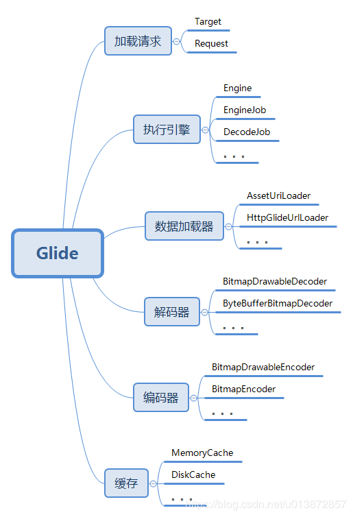

下面通过一个常用案例来分析整个流程。

一般来说，我们使用如下代码加载一张网络图片：

```
Glide.with(this).load(url).into(imgView);
```	

假设这是我们的 APP 第一次使用 Glide 加载一张图片，那么流程如下：

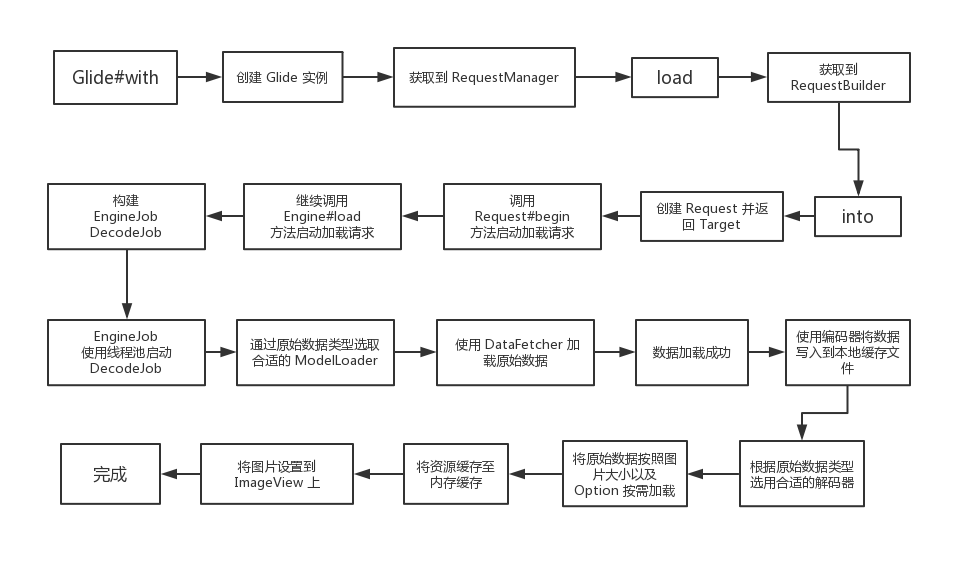

上面的流程是简化版，省去了一部分东西，可以通过这张图更直观的了解到 Glide 的加载流程以及机制。

看到上面这个流程图，下面我来慢慢介绍。

二、模块介绍

根据模块学习事半功倍，先看看 Glide 的分包结构：

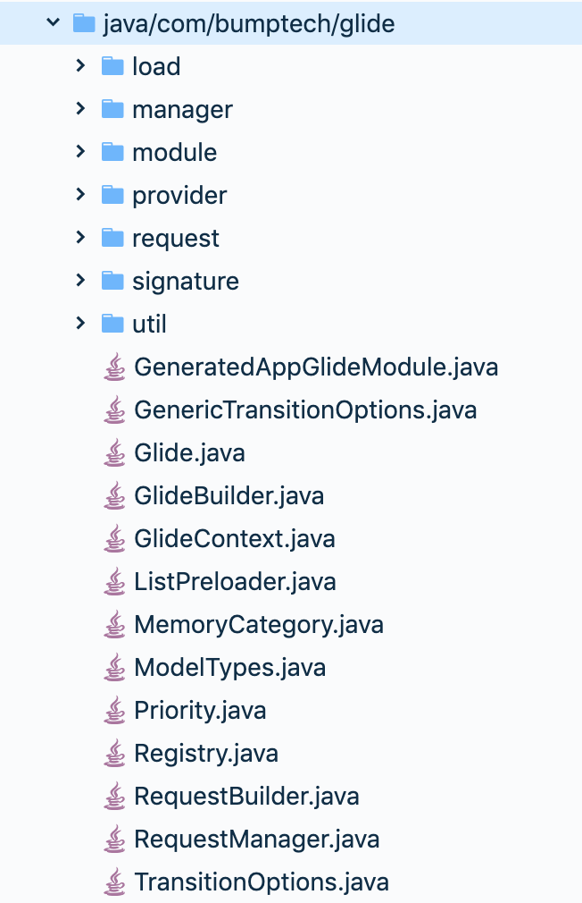

先看看最外层的几个类。

1、Glide

Glide 是单例类，通过 Glide#get(Context) 方法可以获取到实例。

Glide 类算是个全局的配置类，Encoder、Decoder、ModelLoader、Pool 等等都在这里设置，此外还提供了创建 RequestManager 的接口（Glide#with() 方法）。

使用 Glide 时会最先调用 Glide#with() 方法创建 RequestManager，Glide 中的 with() 方法有五个重载：

```
RequestManager with(Context context)
RequestManager with(android.app.Activity)
RequestManager with(android.app.Fragment)
RequestManager with(android.support.v4.app.Fragment)
RequestManager with(android.support.v4.app.FragmentActivity)
```

Glide#with() 方法会将 RequestManager 的创建委托给 RequestManagerRetriever，RequestManagerRetriever 为单例类，调用 get(Context) 创建 RequestManager。

2、GlideBuilder

GlideBuilder 是用来创建 Glide 实例的类，其中包含了很多个 get/set 方法，例如设置 BitmapPool、MemoryCache、ArrayPool 等等，最终通过这些设置调用 build 方法构建 Glide，可以截取 build 方法中的一段代码来看一下：

```
...
if (bitmapPool == null) {
    //创建 Bitmap 池
    int size = memorySizeCalculator.getBitmapPoolSize();
    if (size > 0) {
        bitmapPool = new LruBitmapPool(size);
    } else {
        bitmapPool = new BitmapPoolAdapter();
    }
}
​
//创建数组池
if (arrayPool == null) {
    arrayPool = new LruArrayPool(memorySizeCalculator.getArrayPoolSizeInBytes());
}
​
//创建内存缓存
if (memoryCache == null) {
    memoryCache = new LruResourceCache(memorySizeCalculator.getMemoryCacheSize());
}
​
//创建磁盘缓存
if (diskCacheFactory == null) {
    diskCacheFactory = new InternalCacheDiskCacheFactory(context);
}
...
```

上面截取的几行代码很具有代表性，这些数组池、缓存实现等等最终都会当做 Glide 构造器的参数创建 Glide 实例。

3、RequestManagerRetriever

上面说的 5 个重载的 Glide#with() 方法对应 RequestManagerRetriever 中的 5 个重载的 get() 方法。
由于这个比较重要，而且跟我们使用息息相关，所以仔细的说一下~

创建 RequestManager 逻辑如下：

* 如果 with 方法的参数为 Activity 或者 Fragment ，则最终调用 RequestManagerRetriever 中的 fragmentGet(Context, android.app.FragmentManager) 方法创建 RequestManager；
如果 with 方法的参数为 android.support.v4.app.Fragment 或者android.support.v4.app.FragmentActivity，则最终调用 supportFragmentGet(Context, android.support.v4.app.FragmentManager) 方法创建 RequestManager；
* 如果 with 方法的参数为 Context，则会判断其来源是否属于 FragmentActivity 及 Activity，是则按照上面的逻辑进行处理，否则最终调用 getApplicationManager(Context) 方法创建 RequestManager。

上面说的情况有个条件都是在主线程调用 Glide#with() 方法， 如果子线程调用 Glide#with() 或者系统版本小于 17，则最终会调用 getApplicationManager(Context) 方法创建 RequestManager 。

也就是说，无论使用什么参数，最终都会进入如下三个方法创建 RequestManager：

```
RequestManager fragmentGet(Context context, android.app.FragmentManager fm);
RequestManager supportFragmentGet(Context context, android.support.v4.app.FragmentManager fm);
RequestManager getApplicationManager(Context context);
```

以看到这三个方法作用都是用来创建 RequestManager，前两个方法主要是用来兼容 support 包中的 FragmentActivity、Fragment。

至于为什么需要传入一个 FragmentManager 参数留在后面说。

此外还有一种情况，即在子线程调用 Glide#with() 方法或传入 Context 对象为 ApplicationContext，此时会创建一个全局唯一的 RequestManager，生命周期与 APP 周期保持一致。

根据上述规则可以得出以下几个结论：

同一个 Activity 对应一个 FragmentManager，一个 FragmentManager 对应一个 RequestManagerFragment，一个 RequestManagerFragment 对应一个 RequestManager，所以一个 Activity 对应 一个 RequestManager；
同一个 Fragment 同样可得出上述结论；
但如果 Fragment 属于 Activity，或者 Fragment 属于 Fragment，在 Activity、Framgnent 中分别创建 Glide 请求是并不会只创建一个 RequestManager；
子线程发起 Glide 请求或传入对象为 ApplicationContext，则使用全局单例的 RequestManager。

4、RequestManager

RequestManager 主要由两个作用：

* 创建 RequestBuilder ；
* 通过生命周期管理请求的启动结束等。

我们都知道使用 Glide 加载图片时，如果当前页面被销毁或者不可见时会停止加载图片，但我们使用 Glide 加载图片时并没有显示的去设置 Glide 与当前页面的生命周期关联起来，只是传了个 Context 对象，那么 Glide 是如何通过一个上下文对象就能获取到页面生命周期的呢？

通过上面 RequestManagerRetriever 章节的介绍我们知道创建 RequestManager 时需要一个 FragmentManager 参数（全局 RequestManager 除外），那么再创建 RequestManager 时会先创建一个不可见的 Fragment ，通过 FM 加入到当前页面，用这个不可见的 Fragment 即可检测页面的生命周期。代码中保证了每个 Activity/Fragment 中只包含一个 RequestManagerFragment 与 一个 RequestManager。

创建 RequestBuilder 的 load 方法有很多：

```
RequestBuilder<Drawable> load(@Nullable Bitmap bitmap);
RequestBuilder<Drawable> load(@Nullable Drawable drawable);
RequestBuilder<Drawable> load(@Nullable String string);
RequestBuilder<Drawable> load(@Nullable Uri uri);
RequestBuilder<Drawable> load(@Nullable File file);
RequestBuilder<Drawable> load(@RawRes @DrawableRes @Nullable Integer resourceId);
RequestBuilder<Drawable> load(@Nullable URL url);
RequestBuilder<Drawable> load(@Nullable byte[] model);
RequestBuilder<Drawable> load(@Nullable Object model);
```

看看有这么多重载方法，每一个都代表不同的加载源。
除此之外还有两个特殊的方法：

```
RequestBuilder<File> downloadOnly();
RequestBuilder<File> download(@Nullable Object model);
```

这两个听名字就知道是用来下载图片的。

5、RequestBuilder

RequestBuilder 用来构建请求，例如设置 RequestOption、缩略图、加载失败占位图等等。
上面说到的 RequestManager 中诸多的 load 重载方法，同样也对应 RequestBuilder 中的重载 load 方法，一般来说 load 方法之后就是调用 into 方法设置 ImageView 或者 Target，into 方法中最后会创建 Request，并启动，这个后面会详细介绍。

6、Request

顾名思义， request 包下面的是封装的请求，里面有一个 Request 接口，估计所有的请求都是基于这个接口的，看一下：

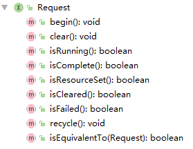

接口定义了对请求的开始、结束、状态获取、回收等操作，所以请求中不仅包含基本的信息，还负责管理请求。
Request 主要的实现类有三个：

* SingleRequest
* ThumbnailRequestCoordinator
* ErrorRequestCoordinator

1.SingleRequest

这个类负责执行请求并将结果反映到 Target 上。
当我们使用 Glide 加载图片时，会先根据 Target 类型创建不同的 Target，然后 RequestBuilder 将这个 target 当做参数创建 Request 对象，Request 与 Target 就是这样关联起来的。

这里就会先创建一个包含 Target 的 SingleRequest 对象。考虑到性能问题，可能会连续创建很多个 SingleRequest 对象，所以使用了对象池来做缓存。
再来说说 SingleRequest 的请求发起流程。

我们经常在 Activity#onCreate 方法中直接使用 Glide 方法，但此时的图片大小还未确定，所以调用 Request#begin 时并不会直接发起请求，而是等待 ImageView 初始化完成，对于 ViewTarget 以及其子类来说，会注册View 的 OnPreDrawListener 事件，等待 View 初始化完成后就调用 SingleRequest#onSizeReady 方法，这个方法里就会开始加载图片了。

onSizeReady 方法并不会去直接加载图片，而是调用了 Engine#load 方法加载，这个方法差不多有二十个参数，所以 onSizeReady 方法算是用来构建参数列表并且调用 Engine#load 方法的。

clear 方法用于停止并清除请求，主要就是从 Engine 中移除掉这个任务以及回调接口。
另外，SingleRequest 实现了 ResourceCallback 接口，这个接口就两个方法：

```
void onResourceReady(Resource<?> resource, DataSource dataSource);
void onLoadFailed(GlideException e);
```

即资源加载完成和加载失败的两个回调方法，刚刚说的 Engine#load 方法中有差不多二十个参数，其中有一个参数就是这个接口。那再来说这两个方法在 SingleRequest 中的实现。
其实很简单，重点就是调用 Target#onResourceReady 方法以及构建图片加载完成的动画，另外还要通知 ThumbnailRequestCoordinator 图片加载完成。
onLoadFailed 方法流程大体上也类似 onResourceReady。
那 SingleRequest 就差不多这样了。

2.ThumbnailRequestCoordinator

这个类是用来协调两个请求，因为有的请求需要同时加载原图和缩略图，比如启动这两个请求、原图加载完成后缩略图其实就不需要加载了等等，这些控制都由这个类来操作。
RequestBuilder 中会将缩略图和原图的两个 SingleRequest 都交给它，后面再对其操作时都由这个类来同一控制。
所以这个类其实没什么太多的功能，就是对两个对象的一个统一个管理协调包装。

3.ErrorRequestCoordinator

RequestBuilder 的父类 BaseRequestOptions 中有几个 error 的重载方法：

```
T error(@Nullable Drawable drawable);
T error(@DrawableRes int resourceId);
```

一般地，我们会使用这个方法设置一个加载失败时的填充图，大部分情况下都是一个通过 resource 资源文件中获取到的图片 ID 或者 Drawable。
但 RequestBuilder 中还提供了另一个 error 方法：

```
RequestBuilder<TranscodeType> error(@Nullable RequestBuilder<TranscodeType> errorBuilder);
```

考虑这样的一个场景，当我们加载失败时我可能希望继续去通过网络或者别的什么加载另一张图片，例如：

```
Glide.with(context)
    .load((Object) null)
    .error(
        Glide.with(context)
            .load(errorModel)
            .listener(requestListener))
    .submit();
```

当我们这样使用 error 时最终就会创建一个 ErrorRequestCoordinator 对象，这个类的功能类似 ThumbnailRequestCoordinator，其中也没多少代码，主要用来协调 ThumbnailRequestCoordinator 以及 error 中的 Request。

7、Target

Target 代表一个可被 Glide 加载并且具有生命周期的资源。
当我们调用 RequestBuilder#into 方法时会根据传入参数创建对应类型的 Target 实现类。

那么 Target 在 Glide 的整个加载流程中到底扮演者什么样的角色呢？Target 的中文意思为：目标，实际上就是指加载完成后的图片应该放在哪， Target 默认提供了很多很有用的实现类，当然我们也可以自定义 Target。

Glide 默认提供了用于放在 ImageView 上的 ImageViewTarget（以及其各种子类）、放在 AppWidget 上的 AppWidgetTarget、用于同步加载图片的 FutureTarget（只有一个实现类：RequestFutureTarget）等等，下面分别来看一下。

1.CustomViewTarget

这个是抽象类，负责加载 Bitmap、Drawable 并且放到 View 上。

上文提到过，如果在 View 还未初始化完成时就调用了 Glide 加载图片会等待加载完成再去执行 onSizeReady 方法，那如何监听 View 初始化完成呢？
CustomViewTarget 就针对这个问题给出了解决方案，其中会调用 View#addOnAttachStateChangeListener 方法添加一个监听器，这个监听器可以监听到 View 被添加到 Widow 以及移除 Window 时的事件，从而更好的管理 Request 生命周期。

另外，构建好的 Request 会通过 View#setTag 方法存入 View 中，后面再通过 View#getTag 方法获取。

但这个抽象类并没有实现类，也没有被使用过，View 相关的 Target 都是继承 ViewTarget 抽象基类，但这个类已经被标记为过期类了，推荐将 ViewTarget 替换成 CustomViewTarget 使用。

2.ViewTarget

这个类又继承了抽象类 BaseTarget，这个基类里只是实现了 Target 接口的 setRequest 以及 getRequest 方法。
ViewTarget 基本上类似 CustomViewTarget ，只是具体的实现上有点不同。

3.ImageViewTarget

听名字就知道，这是加载到 ImageView 上的 Target，继承了 ViewTarget，同样也是个抽象类。

构造器中限定了必须传入 ImageView 或者其子类，图片数据加载完成后会回调其中的 onResourceReady 方法，第一步是将图片设置给 ImageView，第二部是判断是否需要使用动画，需要的话就执行动画。

ImageViewTarget 的实现类比较多，总共有 5 个，但内容都很简单，主要用于区分加载的资源时 Bitmap 类型还是 Drawable 类型，这个在构建请求时确定，默认的加载请求最终都是 Drawable 类型，但如果构建请求时调用了 asBitmap 方法那就资源就会被转成 Bitmap 类型，另外一个就是资源使用缩略图展示。

4.RequestFutureTarget

这是用来同步加载图片的 Target，调用 RequestBuilder#submit 将会返回一个 FutureTarget，调用 get 方法即可获取到加载的资源对象。

5.AppWidgetTarget

用于将下载的 Bitmap 设置到 RemoteView 上。

6.NotificationTarget

与 AppWidgetTarget 类似，不同的是这是用来将 Bitmap 设置到 Notification 中的 RemoteView 上。

8、module

module 包下面的 GlideModel 比较重要，需要详细说一下。

这是用来延迟设置 Glide 相关参数的，我们可以通过这个接口使 Glide 在初始化时应用我们的设置，因为 Glide 是单例类，通过这个设置可以保证在 Glide 单例类初始时，所有请求发起之前应用到 Glide。

GlideModel 是个接口，所以代码很简单：

```
@Deprecated
public interface GlideModule extends RegistersComponents, AppliesOptions { }
```

可以看到该接口被标识已过期，Glide 推荐使用 AppGlideModule 替代，不用管他。

GlideModel 接口本身没有代码内容，但其继承了 RegistersComponents 与 AppliesOptions 接口，先分别看一下这两个接口。

1.RegistersComponents

这是用来注册 Glide 中一些组件的，这个接口只有一个方法：

```
void registerComponents(@NonNull Context context, @NonNull Glide glide,
      @NonNull Registry registry);
```

这个方法中提供了一个 Registry 对象，这是用来管理注册 ModelLoader、Encoder、Decoder 等等，具体可以看看 Registry 提供的公开方法。

例如我们可以在这里注册自己的 ModelLoader，比如我们的网络请求使用的 OkHttp，Glide 默认使用的是HttpURLConnection，我们想改成 OkHttp 就可以在这里设置，具体的使用方式[点此查看使用案例](https://github.com/0xZhangKe/Glide-note/blob/master/integration/okhttp3/src/main/java/com/bumptech/glide/integration/okhttp3/OkHttpGlideModule.java)。

2.AppliesOptions

这是用来管理一些 Glide 的参数设置项，同样只有一个方法。

```
void applyOptions(@NonNull Context context, @NonNull GlideBuilder builder);
```

这个方法提供了一个 GlideBuilder 参数，这是用来构建 Glide 的，我们可以使用 GlideBuilder 对象提供的公开方法做一些设置，例如设置线程池、设置 BitmapPool/ArrayPoll 等等。

那么说完这两个接口，在回过头来看看 GlideModel ，通过上面的描述已经明白 GlideModel 中两个方法的作用了，再来看看如何使用。

Glide 在实例化时会解析 manifest 文件并从中获取 value 为 GlideModule 的 meta-data 配置信息，我们定义好自己的 GlideModule 之后需要在 manifest 文件中进行配置，配置方式如下：

```
<meta-data
        android:name="com.zhangke.glide.samples.OkHttpGlideModule"
        android:value="GlideModule"/>
```

其中 OkHttpGlideModule 必须实现 GlideModel 接口。
具体的配置方式[点此查看](https://github.com/0xZhangKe/Glide-note/tree/master/integration/okhttp3)。

此外，Glide 默认提供了很多 ModelLoader，基本上可以满足所有场景的使用。
ModelLoader 的具体作用与机制后面会详细介绍。

9、load

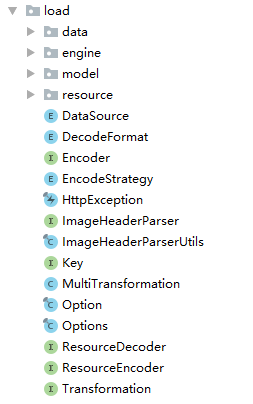

load 包下面是加载资源的核心，里面的东西很多，也很复杂，所以我先把其中两个比较重要的接口介绍完了在介绍别的。

1.ModelLoader

类路径：

```
com.bumptech.glide.load.model.ModelLoader
```

工厂接口，用于将任意复杂的数据模型转换为可由 DataFetcher 用于获取模型所代表的资源的数据的具体数据类型。叫他加载器比较合适，用来加载资源的。

除此之外，还允许将图片按照 ImageView 大小按需加载。防止浪费内存。

Glide 初始化时会注册很多个 ModelLoader ，除了Glide 默认提供的之外还会注册用户在 manifest 中配置的 ModelLoader，也就是上面 GlideModel 章节介绍的内容。

ModelLoader 中有两个方法以及一个内部类：LoadData，下来看看这两个方法：

```
@Nullable
LoadData<Data> buildLoadData(@NonNull Model model, int width, int height,
                                 @NonNull Options options);
boolean handles(@NonNull Model model);
```

buildLoadData 方法除了包含 Model 之外还有宽高以及 Option，所以光看参数列表应该能猜到，加载图片时可以根据需要的宽高以及其他设置做到按需加载。
返回的是 LoadData 实例，这个类待会再说。所以这个方法的意义就是通过参数构建一个 LoadData 实例。

handles 方法比较简单，就是用来判断给定模型是不是此加载器可能加载的已识别类型。

至于内部类 LoadData 呢，主要作用就是装了三个东西：

1. 用于识别资源唯一性的 Key;
2. 缓存相关的备用 Key 列表
3. DataFetcher

其中 DataFetcher最重要，为什么说它是最重要的呢，因为加载资源的根源就在这里（找了半天终于找到了），例如发起网络请求等等，都在这个里面。
那既然说到了 DataFetcher 就在说说它。

2.DataFetcher

类路径：

```
com.bumptech.glide.load.data.DataFetcher
```

DataFetcher 也是个接口，其中最重要的一个方法就是 loadData，听名字就很重要是吧：加载数据。

内部实现就是通过 HttpUrlConnect 发起网络请求，或者打开一个文件，或者使用 AssetManager 打开一个资源等等。。。

加载完成后通过 ```DataFetcher$DataCallback``` 接口回调。

DataCallback 中包含两个方法：

```
void onDataReady(@Nullable T data);
void onLoadFailed(@NonNull Exception e);
```

分别代表数据加载成功或者加载失败回调。

3.Encoder

Encoder 是个接口，在 Glide 中也是个很重要的概念，用来将给定的数据写入持久性存储介质中（文件）。

其中只有一个方法：

```
public interface Encoder<T> {
  /**
   * Writes the given data to the given output stream and returns True if the write completed
   * successfully and should be committed.
   *
   * @param data The data to write.
   * @param file The File to write the data to.
   * @param options The put of options to apply when encoding.
   */
  boolean encode(@NonNull T data, 
                 @NonNull File file, 
                 @NonNull Options options);
}
```

比较简单，注释写的很清楚了，就是把 data 存入文件中。

数据加载完成之后会先使用 Encoder 将数据存入本地磁盘缓存文件中。
同样，Encoder 对应的实现类都是在 Glide 初始化时注册进去的。

4.ResourceDecoder

与 Encoder 对应，数据解码器，用来将原始数据解码成相应的数据类型，针对不同的请求实现类都不同，例如通过网络请求最终获取到的是一个 InputStream，经过 ByteBufferBitmapDecoder 解码后再生成一个 Bitmap。

需要指出的是，这里解码时会根据option 以及图片大小（如果有的话）按需加载 Bitmap，防止内存的浪费。

与 Encoder 一样，Glide 初始化时会注册很多个类型的 ResourceDecoder 实现类，图片数据获取到之后会根据不同的类型使用对应的解码器对其解码。

5.Engine

上面的 Request 中也讲到了 Engine 这个类，可理解为执行引擎，算是整个 Glide 的核心发动机。

Engine 负责管理请求以及活动资源、缓存等。主要关注 load 方法，这个方法主要做了如下几件事：

1. 通过请求构建 Key；
2. 从活动资源中获取资源（详见缓存章节），获取到则返回；
3. 从缓存中获取资源，获取到则直接返回；
4. 判断当前请求是否正在执行，是则直接返回；
5. 构建 EngineJob 与 DecodeJob 并执行。


6.EngineJob

这个主要用来执行 DecodeJob 以及管理加载完成的回调，各种监听器，没有太多其他的东西。

7.DecodeJob

负责从缓存或数据源中加载原始数据并通过解码器转换为相应的资源类型（Resource）。DecodeJob 实现了 Runnable 接口，由 EngineJob 将其运行在指定线程池中。

首次加载一张图片资源时，资源加载完成后会先存入到本地缓存文件中，然后再从文件中获取。

上面已经说过，图片的加载最终是通过 DataFetcher 来实现，但是此处并没有直接这么调用，考虑到缓存文件，这里面使用的是 DataFetcherGenerator，其有三个实现类，对应不同的加载方式，这里就不多做介绍了，只需要知道它会根据资源类型去 Glide 中获取已注册的 DataFetcher ，然后通过 DataFetcher#loadData 方法获取原始数据，获取完成后使用 Encoder 将数据存入磁盘缓存文件中，同时使用对应的解码器将原始数据转换为相应的资源文件，这样整个流程就差不多结束了。

三、缓存机制

关于缓存的获取、数据加载相关的逻辑在 [Engine#load](https://github.com/0xZhangKe/Glide-note/blob/master/library/src/main/java/com/bumptech/glide/load/engine/Engine.java#L151) 方法中。

先来看看缓存流程，流程如下图：


1、缓存机制简介

1.缓存的图片资源

Glide 需要缓存的 图片资源分为两类：

* 原始图片（Source） ：即图片源的图片初始大小 & 分辨率
* 转换后的图片(Result) ：经过 尺寸缩放 和 大小压缩等处理后的图片 ，当使用 Glide加载图片时，Glide默认根据 View视图对图片进行压缩 & 转换，而不显示原始图（这也是Glide加载速度高于Picasso的原因）

2.缓存机制设计

* 并不是三级缓存，因为从网络加载不属于缓存
* 缓存读取顺序：内存缓存 –> 磁盘缓存 –> 网络
 * 内存缓存默认开启
 * Glide中，内存缓存 & 磁盘缓存相互不影响，独立配置
* 二级缓存的作用不同： 
 * 内存缓存：防止应用重复将图片数据读取到内存当中 ，只缓存转换过后的图片
 * 硬盘缓存：防止应用重复从网络或其他地方重复下载和读取数据，可缓存原始图片 & 缓存转换过后的图片，用户自行设置

Glide的缓存机制使得Glide具备非常好的图片缓存效果，从而使得具备较高的图片加载效率。

> 如，在 RecyclerView 上下滑动，而RecyclerView中只要是Glide加载过的图片，都可以直接从内存中读取 & 展示，从而不需要重复从网络或硬盘上读取，提高图片加载效率。

2、Glide缓存功能介绍

Glide 的缓存功能分为：内存缓存 & 磁盘缓存

1.内存缓存

* 作用：防止应用重复将图片数据读取到内存当中,只缓存转换过后的图片，而并非原始图片
 
* 具体使用 

默认情况下，Glide自动开启内存缓存

```
// 默认开启内存缓存，用户不需要作任何设置
Glide.with(this)
     .load(url)
     .into(imageView);

// 可通过 API 禁用 内存缓存功能
Glide.with(this)
     .load(url)
     .skipMemoryCache(true) // 禁用 内存缓存
     .into(imageView);
```

* 实现原理 

Glide的内存缓存实现是基于：LruCache 算法（Least Recently Used） & 弱引用机制 
  
1. LruCache算法原理：将 最近使用的对象用强引用的方式存储在LinkedHashMap中 ；当缓存满时 ，将最近最少使用的对象从内存中移除 
2. 弱引用：弱引用的对象具备更短生命周期，因为 **当JVM进行垃圾回收时，一旦发现弱引用对象，都会进行回收（无论内存充足否）

2.磁盘缓存

* 作用：防止应用重复从网络或其他地方重复下载和读取数据，可缓存原始图片 & 缓存转换过后的图片，用户自行设置
* 具体使用

```
Glide.with(this)
     .load(url)
     .diskCacheStrategy(DiskCacheStrategy.NONE)
     .into(imageView);

// 缓存参数说明
// DiskCacheStrategy.NONE：不缓存任何图片，即禁用磁盘缓存
// DiskCacheStrategy.ALL ：缓存原始图片 & 转换后的图片
// DiskCacheStrategy.SOURCE：只缓存原始图片（原来的全分辨率的图像，即不缓存转换后的图片）
// DiskCacheStrategy.RESULT：（默认）只缓存转换后的图片（即最终的图像：降低分辨率后 / 或者转换后 ，不缓存原始图片
```

* 实现原理 

使用Glide 自定义的DiskLruCache算法 
  
1. 该算法基于 Lru 算法中的DiskLruCache算法，具体应用在磁盘缓存的需求场景中 
2. 该算法被封装到Glide自定义的工具类中（该工具类基于Android 提供的DiskLruCache工具类

3、Glide 缓存流程解析

* Glide整个缓存流程从加载图片请求开始，其中过程有本文最关注的内存缓存的读取 & 写入、磁盘缓存的读取 & 写入
* 具体如下

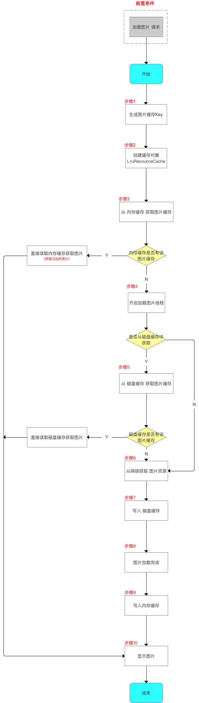

4、缓存流程源码分析

步骤1：从内存缓存读取图片资源

* Glide 实现内存 & 磁盘缓存 是根据图片的缓存Key 进行唯一标识，即根据图片的缓存Key去缓存区找对应的缓存图片
* 生成缓存 Key 的代码发生在Engine类的 load()中

```
// Engine.java
public synchronized <R> LoadStatus load(...) {

  long startTime = VERBOSE_IS_LOGGABLE ? LogTime.getLogTime() : 0;
  
  // 首先根据目标资源的相关参数得到对应的 key 值
  EngineKey key = keyFactory.buildKey(model, signature, width, height, transformations,
      resourceClass, transcodeClass, options);
      
  //（1）先从 ActiveResources 里面去获取
  EngineResource<?> active = loadFromActiveResources(key, isMemoryCacheable);
  if (active != null) {
    cb.onResourceReady(active, DataSource.MEMORY_CACHE);
    if (VERBOSE_IS_LOGGABLE) {
      logWithTimeAndKey("Loaded resource from active resources", startTime, key);
    }
    return null;
  }
  
  // （2）如果没有，则从内存缓存中去获取
  EngineResource<?> cached = loadFromCache(key, isMemoryCacheable);
  if (cached != null) {
    cb.onResourceReady(cached, DataSource.MEMORY_CACHE);
    if (VERBOSE_IS_LOGGABLE) {
      logWithTimeAndKey("Loaded resource from cache", startTime, key);
    }
    return null;
  }
  
  // 在两个方法都没有获取到缓存的情况下，才会继续向下执行，从而开启线程来加载图片
  ...
}  
```

loadFromActiveResources()

```
private EngineResource<?> loadFromActiveResources(Key key, boolean isMemoryCacheable) {
  // 先判断是否禁用内存缓存
  if (!isMemoryCacheable) {
    return null;
  }
  // 从 activeResources 中去获取资源
  EngineResource<?> active = activeResources.get(key);
  if (active != null) {
    // 标记资源被引用数量 +1
    active.acquire();
  }
  return active;
}
```

activeResources 为 ActiveResources 对象，其内部有一个 HashMap<Key, ResourceWeakReference>，即持有着 key 值对应的资源对象的弱引用。

activeResources 的目的是为了 缓存正在使用中的图片，从而可以保护这些图片不会被 LruCache 算法回收掉。

loadFromCache()

```
private EngineResource<?> loadFromCache(Key key, boolean isMemoryCacheable) {
  if (!isMemoryCacheable) {
    return null;
  }
  // 从 LruCache 对应的内存缓存中去获取
  EngineResource<?> cached = getEngineResourceFromCache(key);
  if (cached != null) {
    cached.acquire();
    // 将取出的资源添加到 activeResources 中
    activeResources.activate(key, cached);
  }
  return cached;
}

private EngineResource<?> getEngineResourceFromCache(Key key) {
  Resource<?> cached = cache.remove(key);
  final EngineResource<?> result;
  if (cached == null) {
    result = null;
  } else if (cached instanceof EngineResource) {
    // Save an object allocation if we've cached an EngineResource (the typical case).
    result = (EngineResource<?>) cached;
  } else {
    result = new EngineResource<>(cached, true /*isMemoryCacheable*/, true /*isRecyclable*/);
  }
  return result;
}
```

loadFromCache() 则是从前面说的默认为 LruResourceCache 中去获取目标资源。如果目标资源存在，则如 LruResourceCache 中取出，并加入到前面说的 activeResources 中。

从内存缓存中读取资源的逻辑大概就是这些。概括一下来说，就是如果能从内存缓存当中读取到要加载的图片，那么就直接进行回调，如果读取不到的话，才会开启线程执行后面的图片加载逻辑。

补充，根据郭神的说的，对于内存缓存，使用到 ActiveResources 和 LruResourceCache，目的是为了保护正在被使用的图片不会被 LruCache 算法回收掉。

步骤2：将图片资源缓存到内存

Engine 类实现了 EngineJobListener 接口，当资源加载完成后，就回调 Engine#onEngineJobComplete() 方法。

```
// Engine.java
public synchronized void onEngineJobComplete(
    EngineJob<?> engineJob, Key key, EngineResource<?> resource) {
  // A null resource indicates that the load failed, usually due to an exception.
  if (resource != null) {
    // 为 EngineResource 资源对象设置 ResourceListener 监听，即 Engine 对象自身，
    // 因为Engine 实现了 ResourceListener 接口。
    resource.setResourceListener(key, this);//7
    // 如果资源允许被缓存，则将其添加到 activeResources 中
    if (resource.isCacheable()) {
      activeResources.activate(key, resource);
    }
  }
  jobs.removeIfCurrent(key, engineJob);
}
```

这里注意的是，加载好的资源并不是直接被缓存到 LruResourceCache 中的，而是先被缓存到 activeResources 中。

而缓存到 LruResourceCache 中，则与注释7设置 ResourceListener 有关。之前有说过 EngineResource#acquire() 方法，该方法中就使用 EngineResource 对象的成员变量 acquired 来记录图片资源被引用的次数，调用 acquire() 方法会让变量加 1，而调用 release() 方法则会使变量减 1。

也就是说，当 acquired 变量大于0的时候，说明图片正在使用中，也就应该放到 activeResources 弱引用缓存当中。而经过 release() 之后，如果 acquired 变量等于 0 了，说明图片已经不是正在被使用状态 了。

```
void release() {
  synchronized (listener) {
    synchronized (this) {
      if (acquired <= 0) {
        throw new IllegalStateException("Cannot release a recycled or not yet acquired resource");
      }
      // 当 acquired 为 0 的时候就会回调设置的 ResourceListener 接口的 onResourceReleased() 方法
      if (--acquired == 0) {
        listener.onResourceReleased(key, this);
      }
    }
  }
}
```

前面说 Engine 也实现了 ResourceListener 接口，

```
// Engine.java
public synchronized void onResourceReleased(Key cacheKey, EngineResource<?> resource) {
  activeResources.deactivate(cacheKey);
  if (resource.isCacheable()) {
    cache.put(cacheKey, resource);
  } else {
    resourceRecycler.recycle(resource);
  }
}
```

在 onResourceReleased() 方法中，就会将已经不是正在被使用的图片资源从 activeResources 中移除，然后根据缓存状态，将其转移至 LruResourceCache 中，或者回收释放。

步骤3:磁盘缓存

Glide 默认在磁盘中缓存的图片并不是原始的图片，而是经过一系列操作（如压缩、转换为目标高宽）转换来的（Resource）。当然也可以设置缓存原始图片（Source）。（因而两种图片对应的 key 值也是不同的）

磁盘缓存实现类由 InternalCacheDiskCacheFactory 创建，最终会通过缓存路径及缓存文件夹最大值创建一个 DiskLruCacheWrapper 对象。

DiskLruCacheWrapper 顾名思义是一个包装类，包装的是 DiskLruCache。且实现了 DiskCache 接口，该接口定义了磁盘缓存的操作。

另外，内部还持有 SafeKeyGenerator 对象，该对象可以根据 Key 对象得到对应的字符串 key 值，而字符串 key 就是用于索引磁盘中缓存的图片资源的。

以及，在向磁盘写入文件时（put 方法）会使用重入锁来同步代码，也就是 DiskCacheWriteLocker 类，其中主要是对 ReentrantLock 的包装。

## ARouter源码

ARouter是通过APT生成代码在框架内部进行操作，那么，项目编译生成的文件位置在那里？

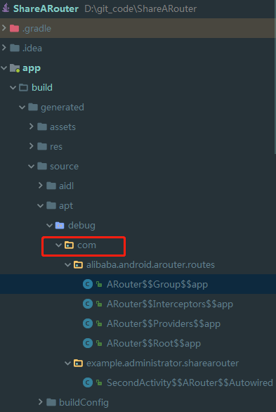

既然生成了这些源码，我们就先随便点点看看这些都是啥？

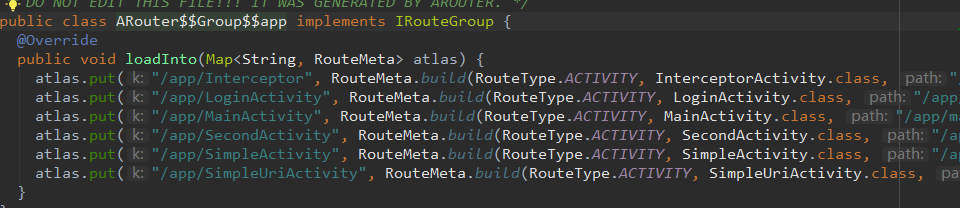

源码 - 1

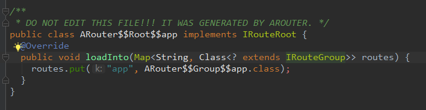

源码 - 2

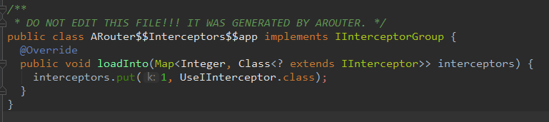

源码 - 3

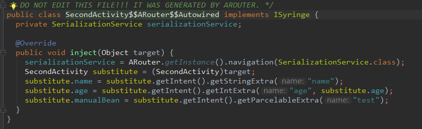

源码 - 4

一、注解分析

1、Route

```
@Target({ElementType.TYPE})
@Retention(RetentionPolicy.CLASS)
public @interface Route {

String path();

String group() default "";

String name() default "";

int extras() default Integer.MIN_VALUE;

int priority() default -1;
}
```


使用该注解标注的类将被自动添加至路由表中。而且，ARouter 并非仅提供页面（Activity）的路由功能，还可以用来路由模块想要暴露给其他模块调用的接口。也就是说 @Route 不仅可用于 Activity 类，还可用于模块对外接口的实现类。那么具体它可以实现那些类型？

从上面的源码 源码 - 1 截图可以看到，里面通过实现接口重写方法，方法里面都有一个RouteMeta，那么我们点进去RouteMeta这个类看看：

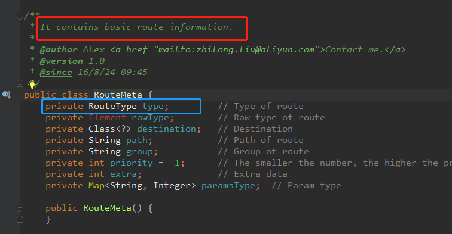

其中红色矩形中的类注释一目了然、翻译过来： 它包含基本路由信息。

截图中蓝色的矩形，RouteType，就是路由的类型。那么，这款路由框架的具体路由类型又有那些？带着这个疑问，点进RouteType 源码看看。

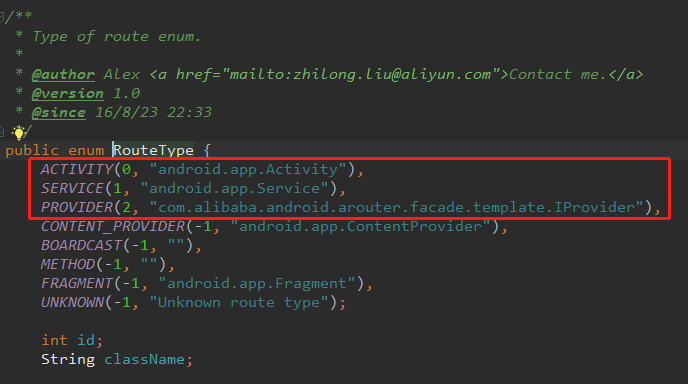

首先这是一个枚举，这些就是框架可以具体使用到的路由类型

2、拦截器注解@Interceptor

```
@Target({ElementType.TYPE})
@Retention(RetentionPolicy.CLASS)
public @interface Interceptor {
    /**
     * The priority of interceptor, ARouter will be excute them follow the priority.
     */
    int priority();

    /**
     * The name of interceptor, may be used to generate javadoc.
     */
    String name() default "Default";
}
```

拦截器的注解就2个方法，第一个是定义优先级的，第二个就是拦截器的名字。

3、@Autowired注解

```
@Target({ElementType.FIELD})
@Retention(RetentionPolicy.CLASS)
public @interface Autowired {

    // Mark param's name or service name.
    String name() default "";

    // If required, app will be crash when value is null.
    // Primitive type wont be check!
    boolean required() default false;

    // Description of the field
    String desc() default "";
}
```

我们知道这个注解是界面跳转时参数传递用的。Activity 中使用该注解标志的变量，会在页面被路由打开的时候自动赋予传递的参数值。赋值的操作可以参考上面的 源码 - 4截图。

二、初始化分析

我们知道，ARouter框架使用的第一个步骤，是要先初始化，也就是调用：ARouter.init( Application.this );这个API，那么，它的初始化究竟是做了那些东西？我们先点进源码看看：

```
/**
 * Init, it must be call before used router.
 */
public static void init(Application application) {
    if (!hasInit) {
        logger = _ARouter.logger;
        _ARouter.logger.info(Consts.TAG, "ARouter init start.");
        hasInit = _ARouter.init(application);//1

        if (hasInit) {
            _ARouter.afterInit();//2
        }

        _ARouter.logger.info(Consts.TAG, "ARouter init over.");
    }
}
```

该方法有两个初始化，一个是 _ARouter.init（application），还有一个是 _ARouter.afterInit( )。

我们首先点进 _ARouter.init（）看看，

```
/**
 * ARouter core (Facade patten)//1
 */
final class _ARouter {
    static ILogger logger = new DefaultLogger(Consts.TAG);
    private volatile static boolean monitorMode = false;
    private volatile static boolean debuggable = false;
    private volatile static boolean autoInject = false;
    private volatile static _ARouter instance = null;
    private volatile static boolean hasInit = false;
    private volatile static ThreadPoolExecutor executor = DefaultPoolExecutor.getInstance();//2
    private static Handler mHandler;
    private static Context mContext;

    private static InterceptorService interceptorService;

    private _ARouter() {
    }

    protected static synchronized boolean init(Application application) {
        mContext = application;
        LogisticsCenter.init(mContext, executor);//3
        logger.info(Consts.TAG, "ARouter init success!");//3
        hasInit = true;
        mHandler = new Handler(Looper.getMainLooper());

        return true;
    }
...
}    
```

注释1：是类注释，翻译过来就是：ARouter核心( 外观模式 )
注释2：代表的是一个线程池
注释3：_ARouter init（）实际是调用的LogisticsCenter里面的init方法

首先，什么是外观模式？

简单点理解就是，通过创建一个统一的类，用来包装子系统中一个或多个复杂的类，客户端可以通过调用外观类的方法来调用内部子系统中所有方法。大概意思就是这样，请参考设计模式。

其次，这个线程池做了什么功能？

点进去DefaultPoolExecutor这个类看看：

```
public class DefaultPoolExecutor extends ThreadPoolExecutor {
    //    Thread args
    private static final int CPU_COUNT = Runtime.getRuntime().availableProcessors();
    private static final int INIT_THREAD_COUNT = CPU_COUNT + 1;
    private static final int MAX_THREAD_COUNT = INIT_THREAD_COUNT;
    private static final long SURPLUS_THREAD_LIFE = 30L;

    private static DefaultPoolExecutor instance;

    public static DefaultPoolExecutor getInstance() {
        if (null == instance) {
            synchronized (DefaultPoolExecutor.class) {
                if (null == instance) {
                    instance = new DefaultPoolExecutor(
                            INIT_THREAD_COUNT,
                            MAX_THREAD_COUNT,
                            SURPLUS_THREAD_LIFE,
                            TimeUnit.SECONDS,
                            new ArrayBlockingQueue<Runnable>(64),
                            new DefaultThreadFactory());
                }
            }
        }
        return instance;
    }

    private DefaultPoolExecutor(int corePoolSize, int maximumPoolSize, long keepAliveTime, TimeUnit unit, BlockingQueue<Runnable> workQueue, ThreadFactory threadFactory) {
        super(corePoolSize, maximumPoolSize, keepAliveTime, unit, workQueue, threadFactory, new RejectedExecutionHandler() {
            @Override
            public void rejectedExecution(Runnable r, ThreadPoolExecutor executor) {
                ARouter.logger.error(Consts.TAG, "Task rejected, too many task!");
            }
        });
    }
    
    ...
}    
```

由源码得知就是创建了一个数组阻塞队列的线程池

最后，我们点进LogisticsCenter，看看里面的init方法执行了什么操作

```
public synchronized static void init(Context context, ThreadPoolExecutor tpe) throws HandlerException {
    mContext = context;
    executor = tpe;

    try {
        long startInit = System.currentTimeMillis();
        //billy.qi modified at 2017-12-06
        //load by plugin first
        loadRouterMap();
        if (registerByPlugin) {
            logger.info(TAG, "Load router map by arouter-auto-register plugin.");
        } else {
            Set<String> routerMap;

            // It will rebuild router map every times when debuggable.
            if (ARouter.debuggable() || PackageUtils.isNewVersion(context)) {
                logger.info(TAG, "Run with debug mode or new install, rebuild router map.");
                // These class was generated by arouter-compiler.
                routerMap = ClassUtils.getFileNameByPackageName(mContext, ROUTE_ROOT_PAKCAGE);
                if (!routerMap.isEmpty()) {
                    context.getSharedPreferences(AROUTER_SP_CACHE_KEY, Context.MODE_PRIVATE).edit().putStringSet(AROUTER_SP_KEY_MAP, routerMap).apply();//1
                }

                PackageUtils.updateVersion(context);    // Save new version name when router map update finishes.
            } else {
                logger.info(TAG, "Load router map from cache.");
                routerMap = new HashSet<>(context.getSharedPreferences(AROUTER_SP_CACHE_KEY, Context.MODE_PRIVATE).getStringSet(AROUTER_SP_KEY_MAP, new HashSet<String>()));
            }

            logger.info(TAG, "Find router map finished, map size = " + routerMap.size() + ", cost " + (System.currentTimeMillis() - startInit) + " ms.");
            startInit = System.currentTimeMillis();
            // 2
            for (String className : routerMap) {
                if (className.startsWith(ROUTE_ROOT_PAKCAGE + DOT + SDK_NAME + SEPARATOR + SUFFIX_ROOT)) {
                    // This one of root elements, load root.
                    ((IRouteRoot) (Class.forName(className).getConstructor().newInstance())).loadInto(Warehouse.groupsIndex);
                } else if (className.startsWith(ROUTE_ROOT_PAKCAGE + DOT + SDK_NAME + SEPARATOR + SUFFIX_INTERCEPTORS)) {
                    // Load interceptorMeta
                    ((IInterceptorGroup) (Class.forName(className).getConstructor().newInstance())).loadInto(Warehouse.interceptorsIndex);
                } else if (className.startsWith(ROUTE_ROOT_PAKCAGE + DOT + SDK_NAME + SEPARATOR + SUFFIX_PROVIDERS)) {
                    // Load providerIndex
                    ((IProviderGroup) (Class.forName(className).getConstructor().newInstance())).loadInto(Warehouse.providersIndex);
                }
            }
        }

        ...
}
```

* 注释1：如果是Debug模式，则执行if代码块；通过PackageUtils.isNewVersion(context)判断当前应用是否是第一次启动。接着，获取arouter-compiler生成的文件，然后将该文件，存储在sp中，下次启动应用的时候，直接从sp缓存中读取。 如果是Release模式,直接从sp缓存中读取。
* 注释2：首先遍历arouter-compiler生成的文件，将他们按照类型分别存储到Warehouse的对应字段中。也就是，如果类名前缀符合文件拼接规则，比如为com.alibaba.android.arouter.routes.ARouter$$Root的文件，就将其添加到具体的Warehouse里面的集合中。也就是对应的这里

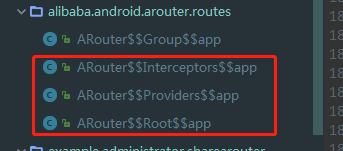

那么，这个文件拼接规则（也就是字符串拼接）是？

```
public final class Consts {
    public static final String SDK_NAME = "ARouter";
    public static final String TAG = SDK_NAME + "::";
    public static final String SEPARATOR = "$$";
    public static final String SUFFIX_ROOT = "Root";
    public static final String SUFFIX_INTERCEPTORS = "Interceptors";
    public static final String SUFFIX_PROVIDERS = "Providers";
    public static final String SUFFIX_AUTOWIRED = SEPARATOR + SDK_NAME + SEPARATOR + "Autowired";
    public static final String DOT = ".";
    public static final String ROUTE_ROOT_PAKCAGE = "com.alibaba.android.arouter.routes";

    public static final String AROUTER_SP_CACHE_KEY = "SP_AROUTER_CACHE";
    public static final String AROUTER_SP_KEY_MAP = "ROUTER_MAP";

    public static final String LAST_VERSION_NAME = "LAST_VERSION_NAME";
    public static final String LAST_VERSION_CODE = "LAST_VERSION_CODE";
}
```

Warehouse又是什么？点进源码看看

```
/**
 * Storage of route meta and other data.
 */
class Warehouse {
    // Cache route and metas
    static Map<String, Class<? extends IRouteGroup>> groupsIndex = new HashMap<>();
    static Map<String, RouteMeta> routes = new HashMap<>();

    // Cache provider
    static Map<Class, IProvider> providers = new HashMap<>();
    static Map<String, RouteMeta> providersIndex = new HashMap<>();

    // Cache interceptor
    static Map<Integer, Class<? extends IInterceptor>> interceptorsIndex = new UniqueKeyTreeMap<>("More than one interceptors use same priority [%s]");
    static List<IInterceptor> interceptors = new ArrayList<>();

    static void clear() {
        routes.clear();
        groupsIndex.clear();
        providers.clear();
        providersIndex.clear();
        interceptors.clear();
        interceptorsIndex.clear();
    }
}
```

其中，Warehouse的类注释写的非常好，翻译过来就是：路由元数据和其他数据的存储。这个类本质就是路由文件映射表。里面提供了各种HashMap集合（Map不允许重复的key），去存储SP存储的值。

我们再看看这里存储拦截器的集合，UniqueKeyTreeMap，这个类是存储拦截器的，我们看看它做了什么？

```
public class UniqueKeyTreeMap<K, V> extends TreeMap<K, V> {
    private String tipText;

    public UniqueKeyTreeMap(String exceptionText) {
        super();

        tipText = exceptionText;
    }

    @Override
    public V put(K key, V value) {
        if (containsKey(key)) {
            throw new RuntimeException(String.format(tipText, key));
        } else {
            return super.put(key, value);
        }
    }
}
```

原来，这个UniqueKeyTreeMap，就是继承了TreeMap，哦，我们知道TreeMap是一种有序的集合（底层帮我们排序）所以数值越小，它就优先添加拦截器。这样也就解释了为什么拦截器属性值设置的越低，优先级越高。

综上，针对 _ARouter init( ) 这个初始化的源码我们可以得知以下：

A：初始化这一操作，表面上是_ARouter ，实则是LogisticsCenter 在帮我们管理逻辑

B：LogisticsCenter 内部通过先存储SP，然后遍历、匹配（满足条件则添加到具体的集合中，按照文件的前缀不同，将他们添加到路由映射表Warehouse的groupsIndex、interceptorsIndex、providersIndex 中）

C：具体的路由清单是Warehouse ，不仅保存实例，还给我们提供了缓存。也就是说 同一个目标（RouteMeta、IProvider、IInterceptor）仅会在第一次使用的时候创建一次，然后缓存起来。后面都是直接使用的缓存。

初始化还有一个API，_ARouter.afterInit( ) ; 这个API在上面的截图也有，那么这个API是用来干什么的？我们点进去看看。

```
static void afterInit() {
    // Trigger interceptor init, use byName.
    interceptorService = (InterceptorService) ARouter.getInstance().build("/arouter/service/interceptor").navigation();
}
```

首先，它实例化了一个InterceptorService。这里的InterceptorService下面会说。 这里的build方法，最终返回的是一个Postcard对象：

```
public Postcard build(String path) {
    return _ARouter.getInstance().build(path);
}

@Deprecated
public Postcard build(String path, String group) {
    return _ARouter.getInstance().build(path, group);
}

 public Postcard build(Uri url) {
    return _ARouter.getInstance().build(url);
}
```

从源码可以得知，实际上它返回的却是，_ARouter.getInstance().build(path)这个方法，这个方法是一个方法重载（一般用的最多的就是这一个，也就是默认分组，不进行自定义分组），跟进去看看（源码很长，分为以下两个截图）：

```
protected Postcard build(Uri uri) {
    if (null == uri || TextUtils.isEmpty(uri.toString())) {
        throw new HandlerException(Consts.TAG + "Parameter invalid!");
    } else {
        PathReplaceService pService = ARouter.getInstance().navigation(PathReplaceService.class);//1
        if (null != pService) {
            uri = pService.forUri(uri);
        }
        return new Postcard(uri.getPath(), extractGroup(uri.getPath()), uri, null);//2
    }
}

protected Postcard build(String path) {
    if (TextUtils.isEmpty(path)) {
        throw new HandlerException(Consts.TAG + "Parameter is invalid!");
    } else {
        PathReplaceService pService = ARouter.getInstance().navigation(PathReplaceService.class);//1
        if (null != pService) {
            path = pService.forString(path);
        }
        return build(path, extractGroup(path));//2
    }
}

protected Postcard build(String path, String group) {
    if (TextUtils.isEmpty(path) || TextUtils.isEmpty(group)) {
        throw new HandlerException(Consts.TAG + "Parameter is invalid!");
    } else {
        PathReplaceService pService = ARouter.getInstance().navigation(PathReplaceService.class);//1
        if (null != pService) {
            path = pService.forString(path);
        }
        return new Postcard(path, group);//2
    }
}
```

发现这里有一个PathReplaceService（也就是红色矩形），这个PathReplaceService又是什么，点进去看看

```
/**
 * Preprocess your path
 */
public interface PathReplaceService extends IProvider {

    /**
     * For normal path.
     *
     * @param path raw path
     */
    String forString(String path);

    /**
     * For uri type.
     *
     * @param uri raw uri
     */
    Uri forUri(Uri uri);
}
``` 

这个类注释翻译过来就是：预处理路径。这个接口是IProvider的子类

让我们在看回注释2，其中，navigation(clazz)这种方式是属于根据类型查找，而build(path)是根据名称进行查找。如果应用中没有实现PathReplaceService这个接口，则pService=null。PathReplaceService可以对所有的路径进行预处理，然后返回一个新的值（返回一个新的String和Uri）。绿色箭头有一个extractGroup（）方法，点进去看看：

```
 private String extractGroup(String path) {
    if (TextUtils.isEmpty(path) || !path.startsWith("/")) {
        throw new HandlerException(Consts.TAG + "Extract the default group failed, the path must be start with '/' and contain more than 2 '/'!");
    }

    try {
        String defaultGroup = path.substring(1, path.indexOf("/", 1));//1
        if (TextUtils.isEmpty(defaultGroup)) {
            throw new HandlerException(Consts.TAG + "Extract the default group failed! There's nothing between 2 '/'!");
        } else {
            return defaultGroup;
        }
    } catch (Exception e) {
        logger.warning(Consts.TAG, "Failed to extract default group! " + e.getMessage());
        return null;
    }
}
```

extractGroup(path)这个方法，核心逻辑是注释1的代码，这个方法主要是获取分组名称。切割path字符串，默认为path中第一部分为组名。这就证明了如果我们不自定义分组，默认就是第一个分号的内容。

分析完了build，我们在看看navigation

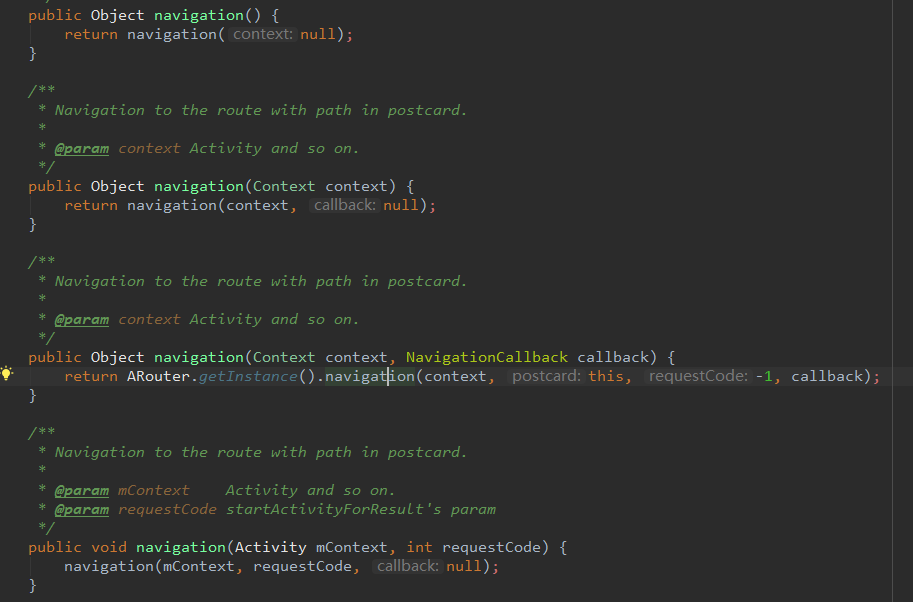

继续点进源码看看，发现进入了_ARouter这个类里面的navigation方法：

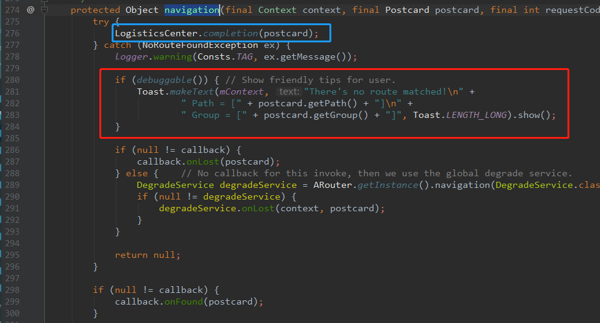

navigation - 1

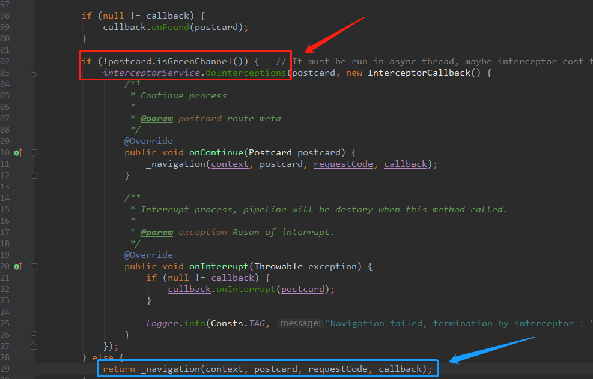

navigation - 2

其中，navigation - 1这幅图中的红色矩形代表的意思是，如果（两个）路径没写对，ARouter会Toast提示客户端，路径不对。

navigation - 2这幅图中的红色矩形代表的是忽略拦截器。interceptorService实例化对象的时机，是在_ARouter这类中的afterInit( )进行实例化的。这幅图中的蓝色矩形和箭头的方法真实逻辑是调用了下图的方法：

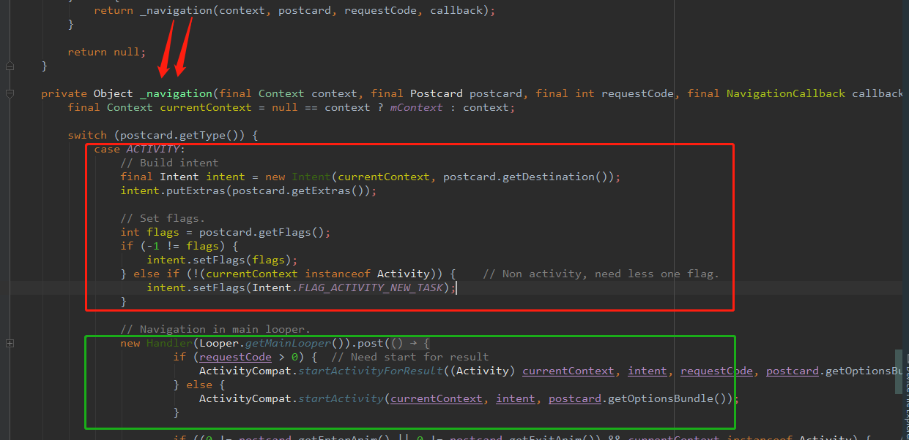

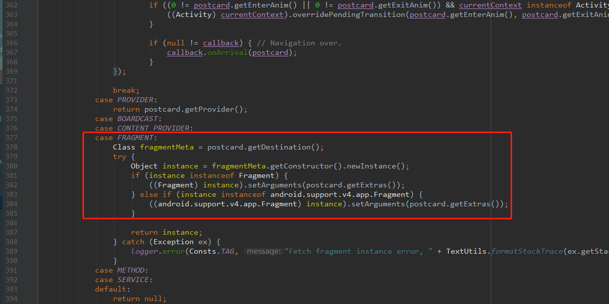

通过这段代码我们可以得知：

1：如果navigation()不传入Activity作为context，则使用Application作为context

2：内部使用了Intent来进行传递

3：如果在跳转时，设置了flags，且没有设置Activity作为context，则下面的startActivity()方法会发生错误，因为缺少Activity的Task栈；

4：Fragment的判断根据版本不同进行了相应的判断

看到了这里，我们在看回navigation - 2这幅图。如果（两个）路径匹配的话，会执行到截图中的蓝色矩形，点进蓝色矩形里面去看看（也就是 LogisticsCenter.completion( Postcard )）：

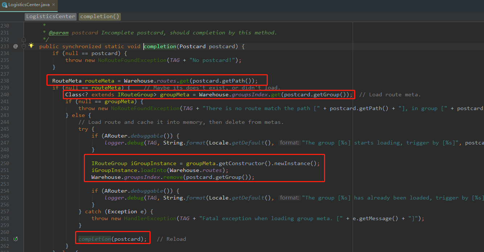

LogisticsCenter.completion - 1

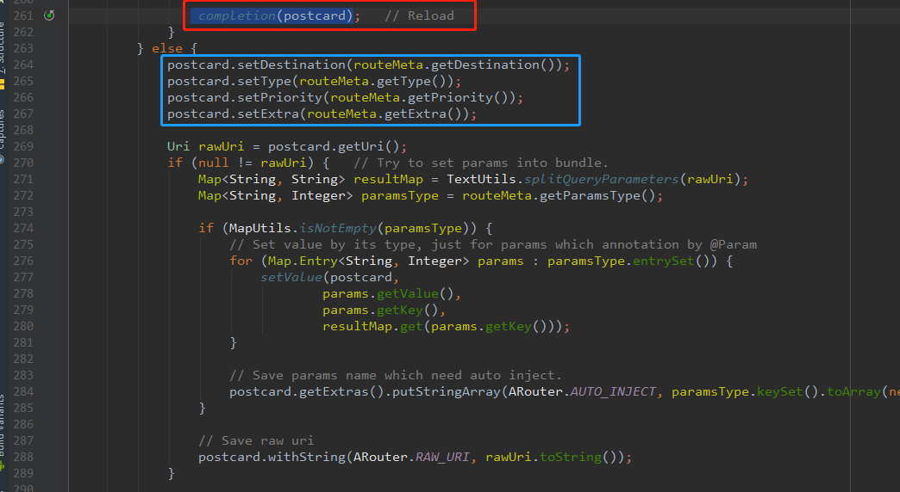

LogisticsCenter.completion - 2

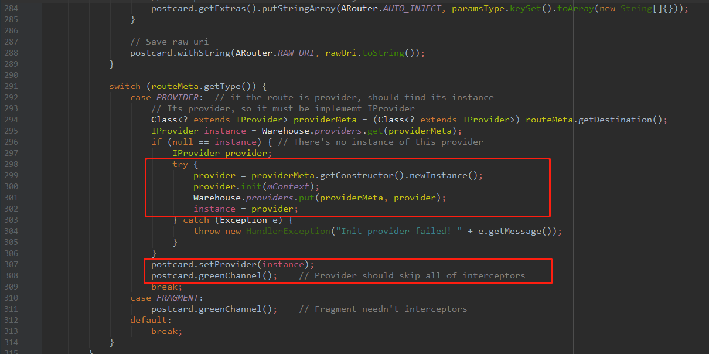

LogisticsCenter.completion - 3

首先，根据path在Warehouse.routes映射表中查找对应的RouteMeta。但是，第一次加载的时候，是没有数据的。(而第一次加载是在LogisticsCenter.init()中，上面也说了。因此只有```Warehouse```的```groupsIndex、interceptorsIndex、providersIndex``` 有数据)，因此这个时候routeMeta=null。所以，这个时候会先从Warehouse.groupsIndex中取出类名前缀为```com.alibaba.android.arouter.routes.ARouter$$Group$$group```的文件；接着，将我们添加@Route注解的类映射到Warehouse.routes中；然后将已经加载过的组从Warehouse.groupsIndex中移除，这样也避免了重复添加进Warehouse.routes；注意，这个时候Warehouse.routes已经有值了，所以重新调用本方法（completion(postcard)）执行了else代码块。

然后，LogisticsCenter.completion - 2 图中就是具体的设置属性值；然后在 LogisticsCenter.completion - 3 图中，对 IProvider的子类进行初始化 provider.init(mContext); 初始化完毕以后，将IProvider的子类添加进Warehouse.providers中；最后将IProvider的实现类保存在postcard中，因此可以从postcard获取IProvider的实例对象，其中，greenChannel()会忽略拦截器这个前面也说了。

小结：

在LogisticsCenter.completion这个方法里面完成了对Warehouse.providers、Warehouse.routes的赋值。那么Warehouse.interceptors又是在哪里赋值的呢？

IProvider有个子类接口，InterceptorService（在文章的上面，也简单提到过这个接口）

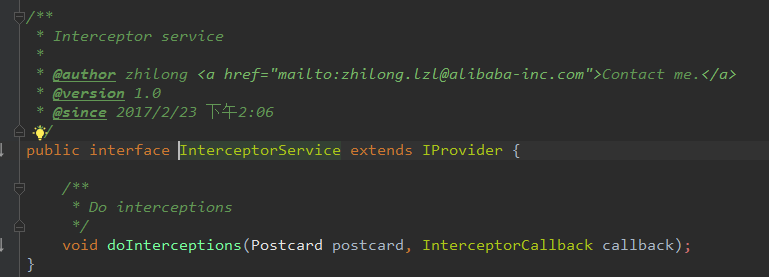

因此InterceptorServiceImpl也是IProvider的子类；在LogisticsCenter.completion()中，有provider.init(context)的初始化 ;那么，我们看看InterceptorServiceImpl这个拦截器的实现类，

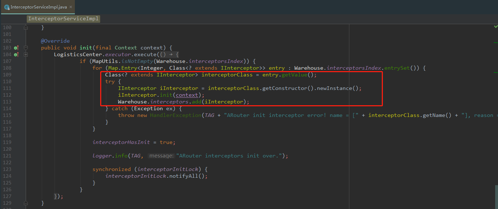

在InterceptorServiceImpl这个类里面的红色矩形中，完成了具体拦截器的初始化以及将拦截器添加到Warehouse.interceptors映射表中。

写到这里，ARouter框架的源码基本上就分析完毕了。可能你说，这不是只是初始化嘛，是的这只是初始化，但是界面跳转的源码都涵盖在上面了，你可能不信，我们点击跳转的API去看看

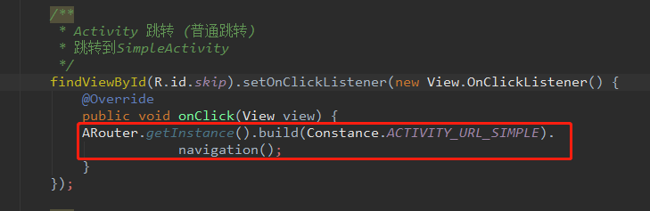

点击build，又跳进熟悉的build里面来了：

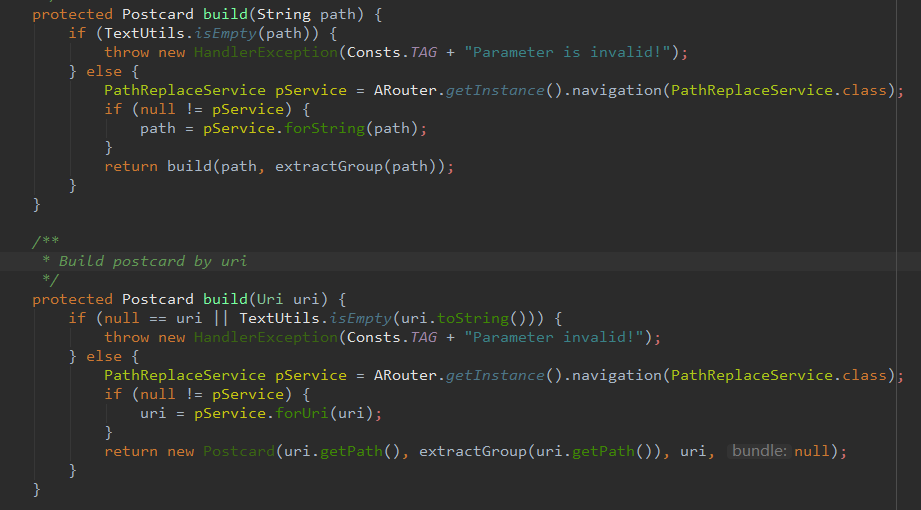

同样，点击navigation，也回到了上面的navigation中去了。


## RecyclerView与ListView对比

RecyclerView继承自ViewGroup，RecyclerView是support-v7版本中新增的一个Widget，官方对它的介绍是：RecyclerView是ListView的升级版本，更加先进灵活，以下从几个方面对比RecyclerView和ListView。

功能
ListView布局比较单一，只有一个纵向效果。RecyclerView的布局效果丰富，通过设置不同的LayoutManager可实现横纵向效果，表格效果，瀑布流效果。

空数据处理
ListView中有个setEmptyView用来处理数据为空的情况，而RecyclerView需要根据数据判断处理空数据情况

头尾布局
ListView自带addHeaderView和addFooterView来添加头部底部item来实现，并不影响Adapter的编写
RecyclerView需要借助Adapter实现头尾布局，通过设置ViewHolder不同的类型实现

局部刷新
ListView刷新数据用notifyDataSetChanged刷新所有数据，而RecyclerView可以调用notifyItemChanged实现局部刷新。当然，两者都可以通过position找到对应item的布局，然后刷新对应子布局，从而实现局部刷新

动画效果
RecyclerView自带动画效果，如果需要自定义动画可通过自定义RecyclerView.ItemAnimator类，然后调用setItemAnimator设置。ListView没有动画效果的实现，但可以对单个item添加动画实现动画效果，相对比较麻烦

item点击事件
ListView自带onItemClickListener等方法
RecyclerView提供addOnItemTouchListener监听item的触摸事件，通过addOnItemTouchListener加上Gesture Detector来实现item响应方法

缓存机制

ListView与RecyclerView缓存机制原理大致相似，滑动过程中，离开屏幕的ItemView即被回收池缓存，进入屏幕的ItemView则会优先从缓存中获取

1.缓存层级不同
RecyclerView比ListView多两级缓存，支持多个ItemView缓存，支持开发者自定义缓存处理逻辑，支持所有RecyclerView共用同一个RecyclerViewPool，ListView和RecyclerView缓存机制基本一致

1、mActiveViews和mAttachedScrap功能相似，意义在于快速重用屏幕上可见的列表项ItemView，而不需要重新createView和bindView
2、mScrapView和mCachedViews + mRecyclerViewPool功能相似，意义在于缓存离开屏幕的ItemView，目的是让即将进入屏幕的ItemView重用
3、RecyclerView的优势在于：

a. mCacheViews的使用，可以做到屏幕外的列表项ItemView进入屏幕内时也无需bindView快速复用
b. mRecyclerPool可以供多个RecyclerView共同使用，在特定场景下，如viewpager+多个列表页下有优势

2.缓存层级不同 

> 1、RecyclerView缓存RecyclerView.ViewHolder，抽象可理解为：View + ViewHolder(避免每次createView时调用findViewById) + flag(标识状态)
> 2、ListView缓存View

3.获取缓存流程不同

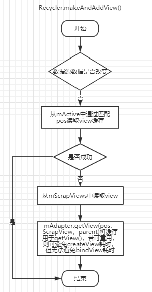

ListView获取缓存流程图

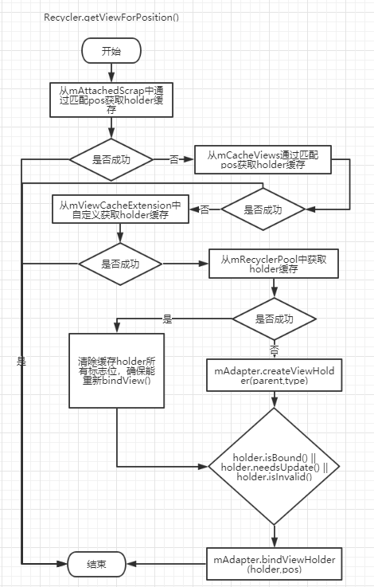

RecyclerView获取缓存流程图

RecyclerView中mCacheViews(屏幕外)获取缓存时，是通过匹配pos获取目标位置的缓存，这样做的好处是，当数据源数据不变的情况下，无需重新bindView。而同样是离屏缓存，ListView从mScrapViews根据pos获取相应的缓存，但是并没有直接使用，而是重新getView(即必定会重新bindView)

ListView中通过pos获取的是view，即pos->view；RecyclerView中通过pos获取的是viewholder，即pos -> (view，viewHolder，flag)；从流程图中可以看出，标志flag的作用是判断view是否需要重新bindView，这也是RecyclerView实现局部刷新的一个核心

ListView两级缓存，屏幕内、屏幕外

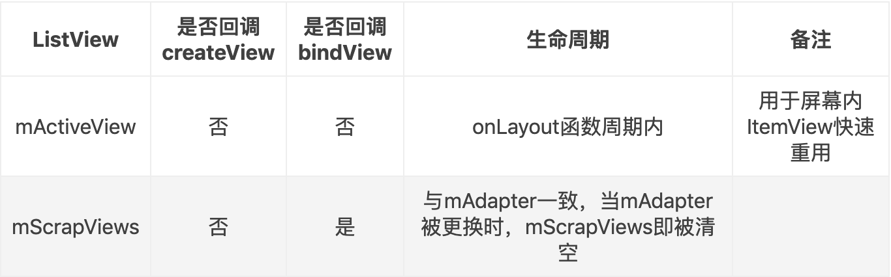

RecyclerView四级缓存，屏幕内、屏幕外、自定义缓存、缓存池

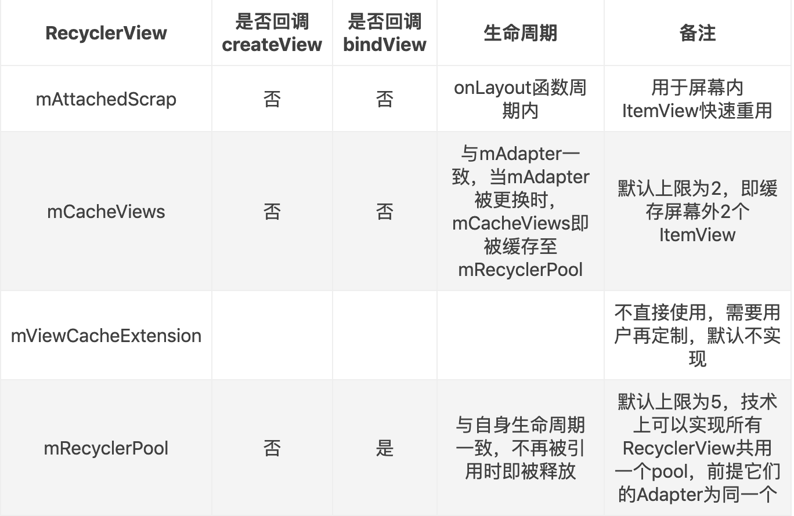

局部刷新
RecyclerView更大的亮点在于提供了局部刷新的接口，通过局部刷新，就能避免调用许多无用的bindView

RecyclerView局部刷新实现
以notifyItemRemoved(1)为例，最终会调用requestLayout()，是整个RecyclerView重新绘制，过程为：
onMeasure -> onLayout -> onDraw
其中onLayout为重点，分为三步：

记录RecyclerView刷新前列表项ItemView的各种信息，如Top，Left，Bottom，Right用于动画的相关计算
真正测量布局大小，位置，核心函数为layoutChildren
计算布局签后各个ItemView的状态，如Remove，Add，Move，Update等，如有必要执行相应的动画
当调用notifyItemRemoved时，会对屏幕内ItemView做预处理，修改ItemView相应的pos以及flag。当调用fill()中RecyclerView.getViewForPosition(pos)时，RecyclerView通过对pos和flag的预处理，是的bindView只调用一次。ListView和RecyclerView最大的区别在于数据源改变时的缓存的处理逻辑。ListView是将所有的mActiveViews都移入到二级缓存mScrapViews，而RecyclerView则是更加灵活的对每个View修改标志位，区分是否bindView。

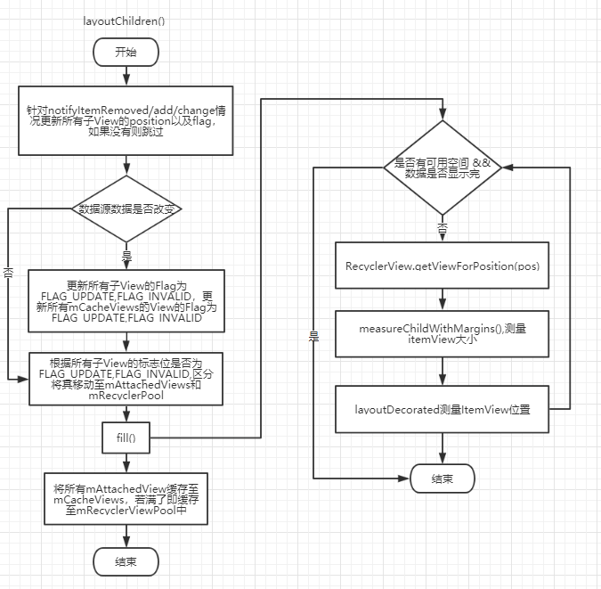

## 保活

一、7.0一下保活

进程保活的关键点有两个，一个是进程优先级的理解，优先级越高存活几率越大。二是弄清楚哪些场景会导致进程会kill，然后采取下面的策略对各种场景进行优化：

1. 提高进程的优先级
2. 在进程被kill之后能够唤醒

1、进程优先级

Android一般的进程优先级划分：

1. 前台进程 (Foreground process)
2. 可见进程 (Visible process)
3. 服务进程 (Service process)
4. 后台进程 (Background process)
5. 空进程 (Empty process)

这是一种粗略的划分，进程其实有一种具体的数值，称作oom_adj，注意：数值越大优先级越低：

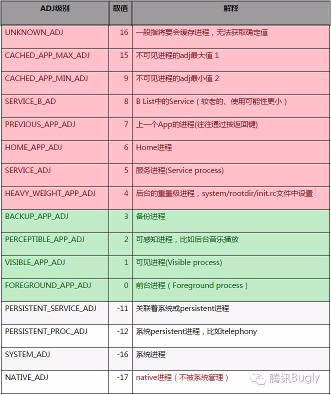

* 红色部分是容易被回收的进程，属于android进程
* 绿色部分是较难被回收的进程，属于android进程
* 其他部分则不是android进程，也不会被系统回收，一般是ROM自带的app和服务才能拥有

2、进程被kill的场景

1.点击home键使app长时间停留在后台，内存不足被kill

处理这种情况前提是你的app至少运行了一个service，然后通过Service.startForeground() 设置为前台服务，可以将oom_adj的数值由4降低到1，大大提高存活率。

* 要注意的是android4.3之后Service.startForeground() 会强制弹出通知栏，解决办法是再启动一个service和推送共用一个通知栏，然后stop这个service使得通知栏消失。
* Android 7.1之后google修复这个bug，目前没有解决办法

下面的代码放到你的service的onStartCommand方法中：

```
//设置service为前台服务，提高优先级
if (Build.VERSION.SDK_INT < 18) {
    //Android4.3以下 ，此方法能有效隐藏Notification上的图标
    service.startForeground(GRAY_SERVICE_ID, new Notification());
} else if(Build.VERSION.SDK_INT>18 && Build.VERSION.SDK_INT<25){
    //Android4.3 - Android7.0，此方法能有效隐藏Notification上的图标
    Intent innerIntent = new Intent(service, GrayInnerService.class);
    service.startService(innerIntent);
    service.startForeground(GRAY_SERVICE_ID, new Notification());
}else{
    //Android7.1 google修复了此漏洞，暂无解决方法（现状：Android7.1以上app启动后通知栏会出现一条"正在运行"的通知消息）
    service.startForeground(GRAY_SERVICE_ID, new Notification());
}
```

2.在大多数国产手机下，进入锁屏状态一段时间，省电机制会kill后台进程

这种情况和上面不太一样，是很过国产手机rom自带的优化，当锁屏一段时间之后，即使手机内存够用为了省电，也会释放掉一部分内存。

策略：注册广播监听锁屏和解锁事件， 锁屏后启动一个1像素的透明Activity，这样直接把进程的oom_adj数值降低到0，0是android进程的最高优先级。 解锁后销毁这个透明Activity。这里我把这个Activity放到:remote进程也就是我那个后台服务进程，当然你也可以放到主进程，看你打算保活哪个进程。


我们可以写一个KeepLiveManager来负责接收广播，维护这个Activity的创建和销毁，注意锁屏广播和解锁分别是：ACTION_SCREEN_OOF和ACTION_USER_PRESENT，并且只能通过动态注册来绑定，并且是绑定到你的后台service里面,onCreate绑定,onDestroy里面解绑

3.用户手动释放内存：包括手机自带清理工具，和第三方app（360，猎豹清理大师等）

理内存软件会把优先级低于 前台进程(oom_adj = 0)的所有进程放入清理列表，而当我们打开了清理软件就意味着其他app不可能处于前台。所以说理论上可以kill任何app。

因此这类场景唯一的处理办法就是加入手机rom 白名单，比如你打开小米，魅族的权限管理 -> 自启动管理可以看到 QQ，微信，天猫默认被勾选，这就是厂商合作。那我们普通app可以这么做：在app的设置界面加一个选项，提示用户自己去勾选自启动。

3、进程唤醒

分两种情况，一是主进程（含有Activity没有service），这种进程由于内存不足被kill之后，用户再次打开app系统会恢复到上次的Activity。另一种是service的后台进程被kill，可以通过service自有api来重启service：

```
@Override
public int onStartCommand(Intent intent, int flags, int startId) {
    // service被异常停止后，系统尝试重启service，不能保证100%重启成功
    return START_STICKY;    
}
```

但它不是100%保证重启成功，比如下面2种情况：

Service 第一次被异常杀死后会在5秒内重启，第二次被杀死会在10秒内重启，第三次会在20秒内重启，一旦在短时间内 Service 被杀死达到5次，则系统不再拉起。

进程被取得 Root 权限的管理工具或系统工具通过 forestop 停止掉，无法重启。

4、结论

1.和Android版本关系很大

对于Android6.0以及以下的大部分机型还是有效果的，但是Android7.0和Android8.0基本上所有机型全部阵亡，大部分后台进程在锁屏后无法存活超过20分钟。
这个可以从Android 6.0，7.0和8.0的新特性看出一些端倪，google对于内存/电量使用越来越严格。

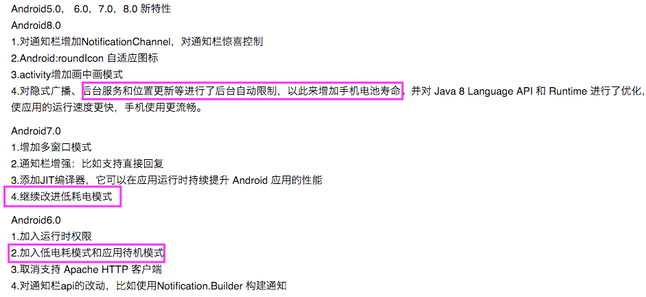

2.和手机厂商关系比较大，测试结果显示，oppo/vivo这两家厂商进程保活最困难，小米和三星比较宽松。其他的机型居中

二、2018年Android的保活方案效果统计

1、常见保活方案

1. 监听广播：监听全局的静态广播，比如时间更新的广播、开机广播、解锁屏、网络状态、解锁加锁亮屏暗屏（3.1版本），高版本需要应用开机后运行一次才能监听这些系统广播，目前此方案失效。可以更换思路，做APP启动后的保活（监听广播启动保活的前台服务）
2. 定时器、JobScheduler：假如应用被系统杀死，那么定时器则失效，此方案失效。JobService在5.0,5.1,6.0作用很大，7.0时候有一定影响（可以在电源管理中给APP授权）
3. 双进程（NDK方式Fork子进程）、双Service守护：高版本已失效，5.0起系统回收策略改成进程组。双Service方案也改成了应用被杀，任何后台Service无法正常状态运行
4. 提高Service优先级：只能一定程度上缓解Service被立马回收

2、保活

1. AIDL方式单进程、双进程方式保活Service
2. 降低oom_adj的值：常驻通知栏（可通过启动另外一个服务关闭Notification，不对oom_adj值有影响）、使用”1像素“的Activity覆盖在getWindow()的view上、循环播放无声音频（黑科技，7.0下杀不掉）
3. 监听锁屏广播：使Activity始终保持前台
4. 使用自定义锁屏界面：覆盖了系统锁屏界面。
5. 通过android:process属性来为Service创建一个进程
6. 跳转到系统白名单界面让用户自己添加app进入白名单

3、复活

1. JobScheduler：原理类似定时器，5.0,5.1,6.0作用很大，7.0时候有一定影响（可以在电源管理中给APP授权）
2. 推送互相唤醒复活：极光、友盟、以及各大厂商的推送
3. 同派系APP广播互相唤醒：比如今日头条系、阿里系

4、方案实现效果统计

1.双进程守护方案（基于onStartCommand() return START_STICKY）

结论：除了华为此方案无效以及未更改底层的厂商不起作用外（START_STICKY字段就可以保持Service不被杀）。此方案可以与其他方案混合使用

2.监听锁屏广播打开1像素Activity（基于onStartCommand() return START_STICKY）

结论：此方案无效果

3.故意在后台播放无声的音乐（基于onStartCommand() return START_STICKY）

结论：成功对华为手机保活。小米8下也成功突破20分钟

4.使用JobScheduler唤醒Service（基于onStartCommand() return START_STICKY）

结论：只对5.0，5.1、6.0起作用

5.混合使用的效果，并且在通知栏弹出通知

结论：高版本情况下可以使用弹出通知栏、双进程、无声音乐提高后台服务的保活概率


## https原理

一、什么是HTTP协议？

HTTP协议全称Hyper Text Transfer Protocol，翻译过来就是超文本传输协议，位于TCP/IP四层模型当中的应用层。

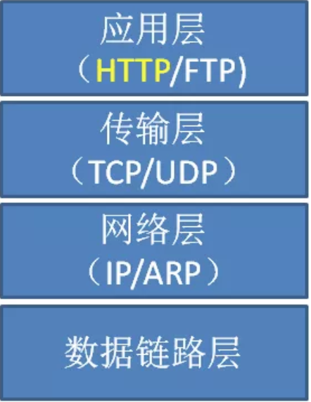

HTTP协议通过请求/响应的方式，在客户端和服务端之间进行通信。

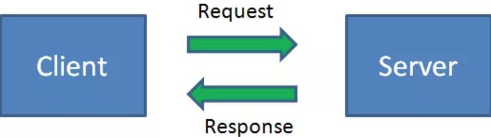

这一切看起来很美好，但是HTTP协议有一个致命的缺点：不够安全。

HTTP协议的信息传输完全以明文方式，不做任何加密，相当于是在网络上“裸奔”。这样会导致什么问题呢？让我们打一个比方：

小灰是客户端，小灰的同事小红是服务端，有一天小灰试图给小红发送请求。


但是，由于传输信息是明文，这个信息有可能被某个中间人恶意截获甚至篡改。这种行为叫做中间人攻击。


如何进行加密呢？

小灰和小红可以事先约定一种对称加密方式，并且约定一个随机生成的密钥。后续的通信中，信息发送方都使用密钥对信息加密，而信息接收方通过同样的密钥对信息解密。

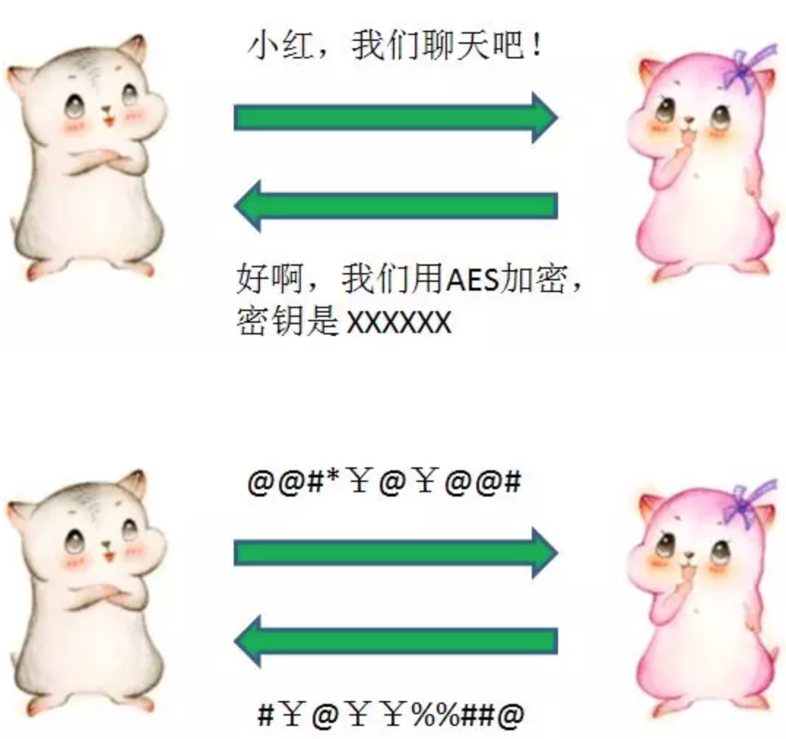

这样做是不是就绝对安全了呢？并不是。

虽然我们在后续的通信中对明文进行了加密，但是第一次约定加密方式和密钥的通信仍然是明文，如果第一次通信就已经被拦截了，那么密钥就会泄露给中间人，中间人仍然可以解密后续所有的通信内容。

这可怎么办呢？别担心，我们可以使用非对称加密，为密钥的传输做一层额外的保护。

非对称加密的一组秘钥对中，包含一个公钥和一个私钥。明文既可以用公钥加密，用私钥解密；也可以用私钥加密，用公钥解密。

在小灰和小红建立通信的时候，小红首先把自己的公钥Key1发给小灰：


收到小红的公钥以后，小灰自己生成一个用于对称加密的密钥Key2，并且用刚才接收的公钥Key1对Key2进行加密（这里有点绕），发送给小红：


小红利用自己非对称加密的私钥，解开了公钥Key1的加密，获得了Key2的内容。从此以后，两人就可以利用Key2进行对称加密的通信了。

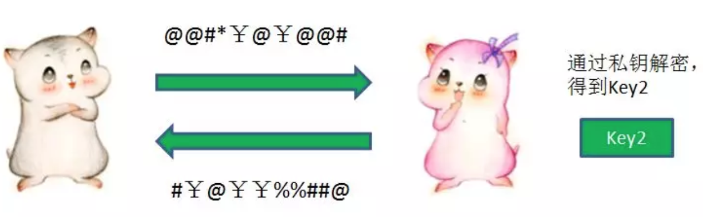

在通信过程中，即使中间人在一开始就截获了公钥Key1，由于不知道私钥是什么，也无从解密。

存在问题:中间人虽然不知道小红的私钥是什么，但是在截获了小红的公钥Key1之后，却可以偷天换日，自己另外生成一对公钥私钥，把自己的公钥Key3发送给小灰。

小灰不知道公钥被偷偷换过，以为Key3就是小红的公钥。于是按照先前的流程，用Key3加密了自己生成的对称加密密钥Key2，发送给小红。

这一次通信再次被中间人截获，中间人先用自己的私钥解开了Key3的加密，获得Key2，然后再用当初小红发来的Key1重新加密，再发给小红。

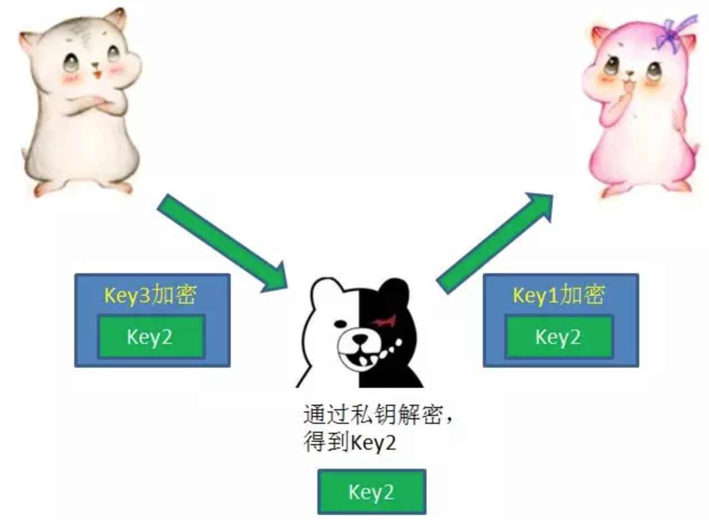

这样一来，两个人后续的通信尽管用Key2做了对称加密，但是中间人已经掌握了Key2，所以可以轻松进行解密。

这时候，我们有必要引入第三方，一个权威的证书颁发机构（CA）来解决。

到底什么是证书呢？证书包含如下信息：

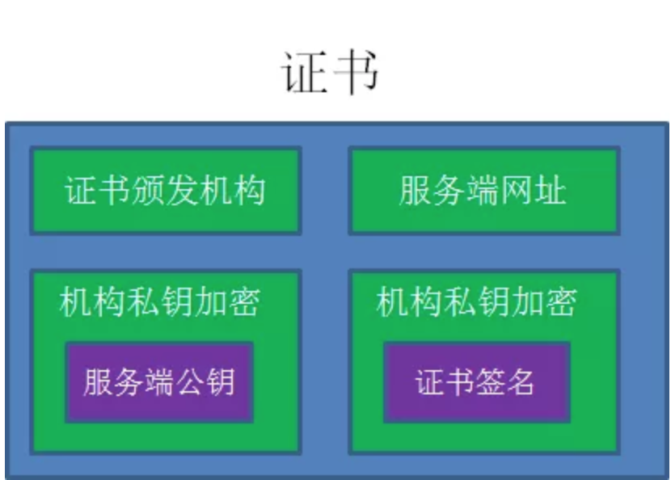

流程如下：

1. 作为服务端的小红，首先把自己的公钥发给证书颁发机构，向证书颁发机构申请证书。
2. 证书颁发机构自己也有一对公钥私钥。机构利用自己的私钥来加密Key1，并且通过服务端网址等信息生成一个证书签名，证书签名同样经过机构的私钥加密。证书制作完成后，机构把证书发送给了服务端小红。
3. 当小灰向小红请求通信的时候，小红不再直接返回自己的公钥，而是把自己申请的证书返回给小灰。
4. 小灰收到证书以后，要做的第一件事情是验证证书的真伪。需要说明的是，各大浏览器和操作系统已经维护了所有权威证书机构的名称和公钥。所以小灰只需要知道是哪个机构颁布的证书，就可以从本地找到对应的机构公钥，解密出证书签名。

接下来，小灰按照同样的签名规则，自己也生成一个证书签名，如果两个签名一致，说明证书是有效的。

验证成功后，小灰就可以放心地再次利用机构公钥，解密出服务端小红的公钥Key1。

5. 像之前一样，小灰生成自己的对称加密密钥Key2，并且用服务端公钥Key1加密Key2，发送给小红。
6. 最后，小红用自己的私钥解开加密，得到对称加密密钥Key2。于是两人开始用Key2进行对称加密的通信。

二、HTTPS实现原理

在学习HTTPS原理之前我们先了解一下两种加密方式： 对称加密和非对称加密。 对称加密即加密和解密使用同一个密钥，虽然对称加密破解难度很大，但由于对称加密需要在网络上传输密钥和密文，一旦被黑客截取很容就能被破解，因此对称加密并不是一个较好的选择。 

非对称加密即加密和解密使用不同的密钥，分别称为公钥和私钥。我们可以用公钥对数据进行加密，但必须要用私钥才能解密。在网络上只需要传送公钥，私钥保存在服务端用于解密公钥加密后的密文。但是非对称加密消耗的CPU资源非常大，效率很低，严重影响HTTPS的性能和速度。因此非对称加密也不是HTTPS的理想选择。

那么HTTPS采用了怎样的加密方式呢？其实为了提高安全性和效率HTTPS结合了对称和非对称两种加密方式。即客户端使用对称加密生成密钥（key）对传输数据进行加密，然后使用非对称加密的公钥再对key进行加密。因此网络上传输的数据是被key加密的密文和用公钥加密后的密文key，因此即使被黑客截取，由于没有私钥，无法获取到明文key，便无法获取到明文数据。所以HTTPS的加密方式是安全的。

接下来我们以TLS1.2为例来认识HTTPS的握手过程。

* 客户端发送 client_hello，包含一个随机数 random1。 
* 服务端回复 server_hello，包含一个随机数 random2，携带了证书公钥 P。 
* 客户端接收到 random2 之后就能够生成 premaster_secrect （对称加密的密钥）以及 master_secrect（用premaster_secret加密后的数据）。 
* 客户端使用证书公钥 P 将 premaster_secrect 加密后发送给服务器 (用公钥P对premaster_secret加密)。 
* 服务端使用私钥解密得到 premaster_secrect。又由于服务端之前就收到了随机数 1，所以服务端根据相同的生成算法，在相同的输入参数下，求出了相同的 master secrect。

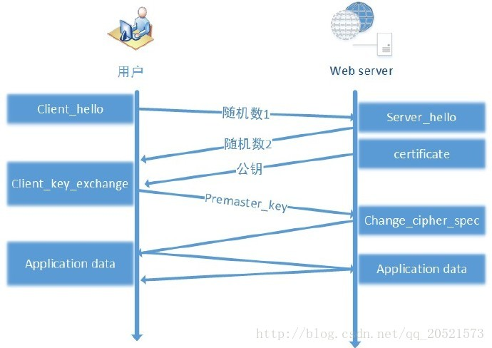

三、数字证书

我们上面提到了HTTPS的工作原理，通过对称加密和非对称加密实现数据的安全传输。我们也知道非对称加密过程需要用到公钥进行加密。那么公钥从何而来？其实公钥就被包含在数字证书中。数字证书通常来说是由受信任的数字证书颁发机构CA，在验证服务器身份后颁发，证书中包含了一个密钥对（公钥和私钥）和所有者识别信息。数字证书被放到服务端，具有服务器身份验证和数据传输加密功能。

除了CA机构颁发的证书之外，还有非CA机构颁发的证书和自签名证书。

非CA机构即是不受信任的机构颁发的证书，理所当然这样的证书是不受信任的。
自签名证书，就是自己给自己颁发的证书。当然自签名证书也是不受信任的。
例如大(chou)名(ming)鼎(zhao)鼎(zhu)的12306网站使用的就是非CA机构颁发的证书（最近发现12306购票页面已经改为CA证书了），12306的证书是由SRCA颁发，SRCA中文名叫中铁数字证书认证中心，简称中铁CA。这是个铁道部自己搞的机构，相当于是自己给自己颁发证书。

说了这么多，我们来总结一下数字证书的两个作用：

> 分发公钥。每个数字证书都包含了注册者生成的公钥。在 TLS握手时会通过 certificate 消息传输给客户端。
> 身份授权。确保客户端访问的网站是经过 CA 验证的可信任的网站。（在自签名证书的情况下可以验证是否是我们自己的服务器）

## APP 性能优化

一、卡顿优化

Android 应用启动慢，使用时经常卡顿，是非常影响用户体验的，应该尽量避免出现。卡顿的场景有很多，按场景可以分为4类：UI 绘制、应用启动、页面跳转、事件响应，如图：

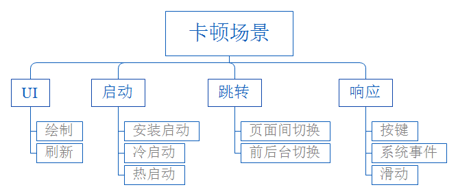

这4种卡顿场景的根本原因可以分为两大类：

* 界面绘制。主要原因是绘制的层级深、页面复杂、刷新不合理，由于这些原因导致卡顿的场景更多出现在 UI 和启动后的初始界面以及跳转到页面的绘制上。
* 数据处理。导致这种卡顿场景的原因是数据处理量太大，一般分为三种情况，一是数据在处理 UI 线程，二是数据处理占用 CPU 高，导致主线程拿不到时间片，三是内存增加导致 GC 频繁，从而引起卡顿。

1、影响绘制的根本原因有以下两个方面：

* 绘制任务太重，绘制一帧内容耗时太长。
* 主线程太忙，根据系统传递过来的 VSYNC 信号来时还没准备好数据导致丢帧。

绘制耗时太长，有一些工具可以帮助我们定位问题。主线程太忙则需要注意了，主线程关键职责是处理用户交互，在屏幕上绘制像素，并进行加载显示相关的数据，所以特别需要避免任何主线程的事情，这样应用程序才能保持对用户操作的即时响应。总结起来，主线程主要做以下几个方面工作：

* UI 生命周期控制
* 系统事件处理
* 消息处理
* 界面布局
* 界面绘制
* 界面刷新

除此之外，应该尽量避免将其他处理放在主线程中，特别复杂的数据计算和网络请求等。

2、性能分析工具

性能问题并不容易复现，也不好定位，但是真的碰到问题还是需要去解决的，那么分析问题和确认问题是否解决，就需要借助相应的的调试工具，比如查看 Layout 层次的 Hierarchy View、Android 系统上带的 GPU Profile 工具和静态代码检查工具 Lint 等，这些工具对性能优化起到非常重要的作用，所以要熟悉，知道在什么场景用什么工具来分析。

1. Profile GPU Rendering

在手机开发者模式下，有一个卡顿检测工具叫做：Profile GPU Rendering

它的功能特点如下：

* 一个图形监测工具，能实时反应当前绘制的耗时
* 横轴表示时间，纵轴表示每一帧的耗时
* 随着时间推移，从左到右的刷新呈现
* 提供一个标准的耗时，如果高于标准耗时，就表示当前这一帧丢失

2. TraceView

TraceView 是 Android SDK 自带的工具，用来分析函数调用过程，可以对 Android 的应用程序以及 Framework 层的代码进行性能分析。它是一个图形化的工具，最终会产生一个图表，用于对性能分析进行说明，可以分析到每一个方法的执行时间，其中可以统计出该方法调用次数和递归次数，实际时长等参数维度，使用非常直观，分析性能非常方便。

3. Systrace UI 性能分析

Systrace 是 Android 4.1及以上版本提供的性能数据采样和分析工具，它是通过系统的角度来返回一些信息。它可以帮助开发者收集 Android 关键子系统，如 surfaceflinger、WindowManagerService 等 Framework 部分关键模块、服务、View系统等运行信息，从而帮助开发者更直观地分析系统瓶颈，改进性能。

Systrace 的功能包括跟踪系统的 I/O 操作、内核工作队列、CPU 负载等，在 UI 显示性能分析上提供很好的数据，特别是在动画播放不流畅、渲染卡等问题上。

3、优化建议

1. 布局优化

布局是否合理主要影响的是页面测量时间的多少，我们知道一个页面的显示测量和绘制过程都是通过递归来完成的，多叉树遍历的时间与树的高度h有关，其时间复杂度 O(h)，如果层级太深，每增加一层则会增加更多的页面显示时间，所以布局的合理性就显得很重要。

那布局优化有哪些方法呢，主要通过减少层级、减少测量和绘制时间、提高复用性三个方面入手。

总结如下：

* 减少层级。合理使用 RelativeLayout 和 LinerLayout，合理使用Merge。
* 提高显示速度。使用 ViewStub，它是一个看不见的、不占布局位置、占用资源非常小的视图对象。
* 布局复用。可以通过<include> 标签来提高复用。
* 尽可能少用wrap_content。wrap_content 会增加布局 measure 时计算成本，在已知宽高为固定值时，不用wrap_content 。
* 删除控件中无用的属性。

2. 避免过度绘制

过度绘制是指在屏幕上的某个像素在同一帧的时间内被绘制了多次。在多层次重叠的 UI 结构中，如果不可见的 UI 也在做绘制的操作，就会导致某些像素区域被绘制了多次，从而浪费了多余的 CPU 以及 GPU 资源。

如何避免过度绘制呢，如下：

* 布局上的优化。移除 XML 中非必须的背景，移除 Window 默认的背景、按需显示占位背景图片
* 自定义View优化。使用 canvas.clipRect()来帮助系统识别那些可见的区域，只有在这个区域内才会被绘制。

3. 启动优化

通过对启动速度的监控，发现影响启动速度的问题所在，优化启动逻辑，提高应用的启动速度。启动主要完成三件事：UI 布局、绘制和数据准备。因此启动速度优化就是需要优化这三个过程：

* UI 布局。应用一般都有闪屏页，优化闪屏页的 UI 布局，可以通过 Profile GPU Rendering 检测丢帧情况。
* 启动加载逻辑优化。可以采用分布加载、异步加载、延期加载策略来提高应用启动速度。
* 数据准备。数据初始化分析，加载数据可以考虑用线程初始化等策略。

4. 合理的刷新机制

在应用开发过程中，因为数据的变化，需要刷新页面来展示新的数据，但频繁刷新会增加资源开销，并且可能导致卡顿发生，因此，需要一个合理的刷新机制来提高整体的 UI 流畅度。合理的刷新需要注意以下几点：

* 尽量减少刷新次数。
* 尽量避免后台有高的 CPU 线程运行。
* 缩小刷新区域。

5. 其他

在实现动画效果时，需要根据不同场景选择合适的动画框架来实现。有些情况下，可以用硬件加速方式来提供流畅度。

二、内存优化

1、内存分析工具

1. Memory Monitor

Memory Monitor 是一款使用非常简单的图形化工具，可以很好地监控系统或应用的内存使用情况，主要有以下功能：

* 显示可用和已用内存，并且以时间为维度实时反应内存分配和回收情况。
* 快速判断应用程序的运行缓慢是否由于过度的内存回收导致。
* 快速判断应用是否由于内存不足导致程序崩溃。

2. Heap Viewer

Heap Viewer 的主要功能是查看不同数据类型在内存中的使用情况，可以看到当前进程中的 Heap Size 的情况，分别有哪些类型的数据，以及各种类型数据占比情况。通过分析这些数据来找到大的内存对象，再进一步分析这些大对象，进而通过优化减少内存开销，也可以通过数据的变化发现内存泄漏。

3. Allocation Tracker

Memory Monitor 和 Heap Viewer 都可以很直观且实时地监控内存使用情况，还能发现内存问题，但发现内存问题后不能再进一步找到原因，或者发现一块异常内存，但不能区别是否正常，同时在发现问题后，也不能定位到具体的类和方法。
这时就需要使用另一个内存分析工具 Allocation Tracker，进行更详细的分析， Allocation Tracker 可以分配跟踪记录应用程序的内存分配，并列出了它们的调用堆栈，可以查看所有对象内存分配的周期。

4. Memory Analyzer Tool(MAT)

MAT 是一个快速，功能丰富的 Java Heap 分析工具，通过分析 Java 进程的内存快照 HPROF 分析，从众多的对象中分析，快速计算出在内存中对象占用的大小，查看哪些对象不能被垃圾收集器回收，并可以通过视图直观地查看可能造成这种结果的对象。

2、常见内存泄漏场景

如果在内存泄漏发生后再去找原因并修复会增加开发的成本，最好在编写代码时就能够很好地考虑内存问题，写出更高质量的代码，这里列出一些常见的内存泄漏场景，在以后的开发过程中需要避免这类问题。

* 资源性对象未关闭。比如Cursor、File文件等，往往都用了一些缓冲，在不使用时，应该及时关闭它们。
* 注册对象未注销。比如事件注册后未注销，会导致观察者列表中维持着对象的引用。
* 类的静态变量持有大数据对象。
* 非静态内部类的静态实例。
* Handler临时性内存泄漏。如果Handler是非静态的，容易导致 Activity 或 Service 不会被回收。
* 容器中的对象没清理造成的内存泄漏。
* WebView。WebView 存在着内存泄漏的问题，在应用中只要使用一次 WebView，内存就不会被释放掉。

除此之外，内存泄漏可监控，常见的就是用LeakCanary 第三方库，这是一个检测内存泄漏的开源库，使用非常简单，可以在发生内存泄漏时告警，并且生成 leak tarce 分析泄漏位置，同时可以提供 Dump 文件进行分析。

3、优化内存空间

没有内存泄漏，并不意味着内存就不需要优化，在移动设备上，由于物理设备的存储空间有限，Android 系统对每个应用进程也都分配了有限的堆内存，因此使用最小内存对象或者资源可以减小内存开销，同时让GC 能更高效地回收不再需要使用的对象，让应用堆内存保持充足的可用内存，使应用更稳定高效地运行。常见做法如下：

* 对象引用。强引用、软引用、弱引用、虚引用四种引用类型，根据业务需求合理使用不同，选择不同的引用类型。
*减少不必要的内存开销。注意自动装箱，增加内存复用，比如有效利用系统自带的资源、视图复用、对象池、Bitmap对象的复用。
* 使用最优的数据类型。比如针对数据类容器结构，可以使用ArrayMap数据结构，避免使用枚举类型，使用缓存Lrucache等等。
* 图片内存优化。可以设置位图规格，根据采样因子做压缩，用一些图片缓存方式对图片进行管理等等。

三、稳定性优化

Android 应用的稳定性定义很宽泛，影响稳定性的原因很多，比如内存使用不合理、代码异常场景考虑不周全、代码逻辑不合理等，都会对应用的稳定性造成影响。其中最常见的两个场景是：Crash 和 ANR，这两个错误将会使得程序无法使用，比较常用的解决方式如下：

* 提高代码质量。比如开发期间的代码审核，看些代码设计逻辑，业务合理性等。
* 代码静态扫描工具。常见工具有Android Lint、Findbugs、Checkstyle、PMD等等。
* Crash监控。把一些崩溃的信息，异常信息及时地记录下来，以便后续分析解决。
* Crash上传机制。在Crash后，尽量先保存日志到本地，然后等下一次网络正常时再上传日志信息。

四、耗电优化

在移动设备中，电池的重要性不言而喻，没有电什么都干不成。对于操作系统和设备开发商来说，耗电优化一直没有停止，去追求更长的待机时间，而对于一款应用来说，并不是可以忽略电量使用问题，特别是那些被归为“电池杀手”的应用，最终的结果是被卸载。因此，应用开发者在实现需求的同时，需要尽量减少电量的消耗。

在 Android5.0 以前，在应用中测试电量消耗比较麻烦，也不准确，5.0 之后专门引入了一个获取设备上电量消耗信息的 API:Battery Historian。Battery Historian 是一款由 Google 提供的 Android 系统电量分析工具，和Systrace 一样，是一款图形化数据分析工具，直观地展示出手机的电量消耗过程，通过输入电量分析文件，显示消耗情况，最后提供一些可供参考电量优化的方法。

除此之外，还有一些常用方案可提供：

* 计算优化，避开浮点运算等。
* 避免 WaleLock 使用不当。
* 使用 Job Scheduler。

五、安装包大小优化

减少安装包大小的常用方案

* 代码混淆。使用proGuard 代码混淆器工具，它包括压缩、优化、混淆等功能。
* 资源优化。比如使用 Android Lint 删除冗余资源，资源文件最少化等。
* 图片优化。比如利用 AAPT 工具对 PNG 格式的图片做压缩处理，降低图片色彩位数等。
* 避免重复功能的库，使用 WebP图片格式等。
* 插件化。比如功能模块放在服务器上，按需下载，可以减少安装包大小。

## EventBus

一、概述

1、EventBus的三要素

* Event：事件，可以是任意类型的对象。
* Subscriber：事件订阅者，在EventBus3.0之前消息处理的方法只能限定于onEvent、onEventMainThread、onEventBackgroundThread和onEventAsync，他们分别代表四种线程模型。而在EventBus3.0之后，事件处理的方法可以随便取名，但是需要添加一个注解@Subscribe，并且要指定线程模型（默认为POSTING）。
* Publisher：事件发布者，可以在任意线程任意位置发送事件，直接调用EventBus的post(Object)方法。可以自己实例化EventBus对象，但一般使用EventBus.getDefault()就好了，根据post函数参数的类型，会自动调用订阅相应类型事件的函数。

2、EventBus的四种ThreadMode（线程模型）

EventBus3.0有以下四种ThreadMode：

* POSTING（默认）：如果使用事件处理函数指定了线程模型为POSTING，那么该事件在哪个线程发布出来的，事件处理函数就会在这个线程中运行，也就是说发布事件和接收事件在同一个线程。在线程模型为POSTING的事件处理函数中尽量避免执行耗时操作，因为它会阻塞事件的传递，甚至有可能会引起ANR。
* MAIN:事件的处理会在UI线程中执行。事件处理时间不能太长，长了会ANR的。
* BACKGROUND：如果事件是在UI线程中发布出来的，那么该事件处理函数就会在新的线程中运行，如果事件本来就是子线程中发布出来的，那么该事件处理函数直接在发布事件的线程中执行。在此事件处理函数中禁止进行UI更新操作。
* ASYNC：无论事件在哪个线程发布，该事件处理函数都会在新建的子线程中执行，同样，此事件处理函数中禁止进行UI更新操作。

二、源码解析

1、构造函数

```
public static EventBus getDefault() {
    if (defaultInstance == null) {
        synchronized (EventBus.class) {
            if (defaultInstance == null) {
                defaultInstance = new EventBus();
            }
        }
    }
    return defaultInstance;
}
```

使用DCL双重检索单例模式创建

```
public EventBus() {
    this(DEFAULT_BUILDER);
}
```

DEFAULT_BUILDER是默认的EventBusBuilder，用来构造EventBus：

```
private static final EventBusBuilder DEFAULT_BUILDER = new EventBusBuilder();
```

this调用了EventBus另一个构造函数：

```
EventBus(EventBusBuilder builder) {
    logger = builder.getLogger();
    subscriptionsByEventType = new HashMap<>();
    typesBySubscriber = new HashMap<>();
    stickyEvents = new ConcurrentHashMap<>();
    mainThreadSupport = builder.getMainThreadSupport();
    mainThreadPoster = mainThreadSupport != null ? mainThreadSupport.createPoster(this) : null;
    backgroundPoster = new BackgroundPoster(this);
    asyncPoster = new AsyncPoster(this);
    indexCount = builder.subscriberInfoIndexes != null ? builder.subscriberInfoIndexes.size() : 0;
    subscriberMethodFinder = new SubscriberMethodFinder(builder.subscriberInfoIndexes,
            builder.strictMethodVerification, builder.ignoreGeneratedIndex);
    logSubscriberExceptions = builder.logSubscriberExceptions;
    logNoSubscriberMessages = builder.logNoSubscriberMessages;
    sendSubscriberExceptionEvent = builder.sendSubscriberExceptionEvent;
    sendNoSubscriberEvent = builder.sendNoSubscriberEvent;
    throwSubscriberException = builder.throwSubscriberException;
    eventInheritance = builder.eventInheritance;
    executorService = builder.executorService;
}
```

2、订阅者注册

```
public void register(Object subscriber) {
    Class<?> subscriberClass = subscriber.getClass();
    // 用 subscriberMethodFinder 提供的方法，找到在 subscriber 这个类里面订阅的内容。
    List<SubscriberMethod> subscriberMethods = subscriberMethodFinder.findSubscriberMethods(subscriberClass);
    synchronized (this) {
        for (SubscriberMethod subscriberMethod : subscriberMethods) {
            subscribe(subscriber, subscriberMethod);
        }
    }
}
```

1.查找订阅方法

findSubscriberMethods找出一个SubscriberMethod的集合，也就是传进来的订阅者所有的订阅的方法，接下来遍历订阅者的订阅方法来完成订阅者的订阅操作。对于SubscriberMethod（订阅方法）类中，主要就是用保存订阅方法的Method对象、线程模式、事件类型、优先级、是否是粘性事件等属性。下面就来看一下findSubscriberMethods方法：

```
List<SubscriberMethod> findSubscriberMethods(Class<?> subscriberClass) {
    //从缓存中获取SubscriberMethod集合 
    List<SubscriberMethod> subscriberMethods = METHOD_CACHE.get(subscriberClass);
    if (subscriberMethods != null) {
        return subscriberMethods;
    }
    //ignoreGeneratedIndex属性表示是否忽略注解器生成的MyEventBusIndex
    if (ignoreGeneratedIndex) {
        //通过反射获取subscriberMethods
        subscriberMethods = findUsingReflection(subscriberClass);
    } else {
        subscriberMethods = findUsingInfo(subscriberClass);
    }
    //在获得subscriberMethods以后，如果订阅者中不存在@Subscribe注解并且为public的订阅方法，则会抛出异常。
    if (subscriberMethods.isEmpty()) {
        throw new EventBusException("Subscriber " + subscriberClass
                + " and its super classes have no public methods with the @Subscribe annotation");
    } else {
        METHOD_CACHE.put(subscriberClass, subscriberMethods);
        return subscriberMethods;
    }
}
```

1. 从缓存中查找，如果找到了就立马返回。
2. 如果缓存中没有的话，则根据 ignoreGeneratedIndex 选择如何查找订阅方法，ignoreGeneratedIndex属性表示是否忽略注解器生成的MyEventBusIndex
3. 找到订阅方法后，放入缓存，以免下次继续查找。

ignoreGeneratedIndex 默认就是false，可以通过EventBusBuilder来设置它的值。我们在项目中经常通过EventBus单例模式来获取默认的EventBus对象，也就是ignoreGeneratedIndex为false的情况，这种情况调用了findUsingInfo方法：

```
private List<SubscriberMethod> findUsingInfo(Class<?> subscriberClass) {
    FindState findState = prepareFindState();
    findState.initForSubscriber(subscriberClass);
    while (findState.clazz != null) {
        //获取订阅者信息，没有配置MyEventBusIndex返回null
        findState.subscriberInfo = getSubscriberInfo(findState);
        if (findState.subscriberInfo != null) {
            SubscriberMethod[] array = findState.subscriberInfo.getSubscriberMethods();
            for (SubscriberMethod subscriberMethod : array) {
                if (findState.checkAdd(subscriberMethod.method, subscriberMethod.eventType)) {
                    findState.subscriberMethods.add(subscriberMethod);
                }
            }
        } else {
            //通过反射来查找订阅方法
            findUsingReflectionInSingleClass(findState);
        }
        findState.moveToSuperclass();
    }
    return getMethodsAndRelease(findState);
}
```

通过getSubscriberInfo方法来获取订阅者信息。
在我们开始查找订阅方法的时候并没有忽略注解器为我们生成的索引MyEventBusIndex，如果我们通过EventBusBuilder配置了MyEventBusIndex，便会获取到subscriberInfo，调用subscriberInfo的getSubscriberMethods方法便可以得到订阅方法相关的信息，这个时候就不在需要通过注解进行获取订阅方法。如果没有配置MyEventBusIndex，便会执行findUsingReflectionInSingleClass方法，将订阅方法保存到findState中。最后再通过getMethodsAndRelease方法对findState做回收处理并反回订阅方法的List集合。

看一下findUsingReflectionInSingleClass的执行过程：

```
private void findUsingReflectionInSingleClass(FindState findState) {
    Method[] methods;
    try {
        // This is faster than getMethods, especially when subscribers are fat classes like Activities
        methods = findState.clazz.getDeclaredMethods();
    } catch (Throwable th) {
        // Workaround for java.lang.NoClassDefFoundError, see https://github.com/greenrobot/EventBus/issues/149
        methods = findState.clazz.getMethods();
        findState.skipSuperClasses = true;
    }
    for (Method method : methods) {
        int modifiers = method.getModifiers();
        if ((modifiers & Modifier.PUBLIC) != 0 && (modifiers & MODIFIERS_IGNORE) == 0) {
            Class<?>[] parameterTypes = method.getParameterTypes();
            if (parameterTypes.length == 1) {
                Subscribe subscribeAnnotation = method.getAnnotation(Subscribe.class);
                if (subscribeAnnotation != null) {
                    Class<?> eventType = parameterTypes[0];
                    if (findState.checkAdd(method, eventType)) {
                        ThreadMode threadMode = subscribeAnnotation.threadMode();
                        findState.subscriberMethods.add(new SubscriberMethod(method, eventType, threadMode,
                                subscribeAnnotation.priority(), subscribeAnnotation.sticky()));
                    }
                }
            } else if (strictMethodVerification && method.isAnnotationPresent(Subscribe.class)) {
                String methodName = method.getDeclaringClass().getName() + "." + method.getName();
                throw new EventBusException("@Subscribe method " + methodName +
                        "must have exactly 1 parameter but has " + parameterTypes.length);
            }
        } else if (strictMethodVerification && method.isAnnotationPresent(Subscribe.class)) {
            String methodName = method.getDeclaringClass().getName() + "." + method.getName();
            throw new EventBusException(methodName +
                    " is a illegal @Subscribe method: must be public, non-static, and non-abstract");
        }
    }
}
```

在这里主要是使用了Java的反射和对注解的解析。首先通过反射来获取订阅者中所有的方法。并根据方法的类型，参数和注解来找到订阅方法。找到订阅方法后将订阅方法相关信息保存到FindState当中。

2.订阅者的注册过程

```
private void subscribe(Object subscriber, SubscriberMethod subscriberMethod) {
    Class<?> eventType = subscriberMethod.eventType;
    //根据订阅者和订阅方法构造一个订阅事件
    Subscription newSubscription = new Subscription(subscriber, subscriberMethod);
    //获取当前订阅事件中Subscription的List集合
    CopyOnWriteArrayList<Subscription> subscriptions = subscriptionsByEventType.get(eventType);
    //该事件对应的Subscription的List集合不存在，则重新创建并保存在subscriptionsByEventType中
    if (subscriptions == null) {
        subscriptions = new CopyOnWriteArrayList<>();
        subscriptionsByEventType.put(eventType, subscriptions);
    } else {
        //订阅者已经注册则抛出EventBusException
        if (subscriptions.contains(newSubscription)) {
            throw new EventBusException("Subscriber " + subscriber.getClass() + " already registered to event "
                    + eventType);
        }
    }
    //遍历订阅事件，找到比subscriptions中订阅事件小的位置，然后插进去
    int size = subscriptions.size();
    for (int i = 0; i <= size; i++) {
        if (i == size || subscriberMethod.priority > subscriptions.get(i).subscriberMethod.priority) {
            subscriptions.add(i, newSubscription);
            break;
        }
    }
     //通过订阅者获取该订阅者所订阅事件的集合
    List<Class<?>> subscribedEvents = typesBySubscriber.get(subscriber);
    if (subscribedEvents == null) {
        subscribedEvents = new ArrayList<>();
        typesBySubscriber.put(subscriber, subscribedEvents);
    }
    //将当前的订阅事件添加到subscribedEvents中
    subscribedEvents.add(eventType);

    if (subscriberMethod.sticky) {
        if (eventInheritance) {
            //粘性事件的处理
            Set<Map.Entry<Class<?>, Object>> entries = stickyEvents.entrySet();
            for (Map.Entry<Class<?>, Object> entry : entries) {
                Class<?> candidateEventType = entry.getKey();
                if (eventType.isAssignableFrom(candidateEventType)) {
                    Object stickyEvent = entry.getValue();
                    checkPostStickyEventToSubscription(newSubscription, stickyEvent);
                }
            }
        } else {
            Object stickyEvent = stickyEvents.get(eventType);
            checkPostStickyEventToSubscription(newSubscription, stickyEvent);
        }
    }
}
```

订阅的代码主要就做了两件事

* 第一件事是将我们的订阅方法和订阅者封装到subscriptionsByEventType和typesBySubscriber中，subscriptionsByEventType是我们投递订阅事件的时候，就是根据我们的EventType找到我们的订阅事件，从而去分发事件，处理事件的；typesBySubscriber在调用unregister(this)的时候，根据订阅者找到EventType，又根据EventType找到订阅事件，从而对订阅者进行解绑。
* 第二件事，如果是粘性事件的话，就立马投递、执行。


3、事件的发送

```
public void post(Object event) {
    //PostingThreadState保存着事件队列和线程状态信息
    PostingThreadState postingState = currentPostingThreadState.get();
    List<Object> eventQueue = postingState.eventQueue;
    /获取事件队列，并将当前事插入到事件队列中
    eventQueue.add(event);

    if (!postingState.isPosting) {
        postingState.isMainThread = isMainThread();
        postingState.isPosting = true;
        if (postingState.canceled) {
            throw new EventBusException("Internal error. Abort state was not reset");
        }
        try {
            //处理队列中的所有事件
            while (!eventQueue.isEmpty()) {
                postSingleEvent(eventQueue.remove(0), postingState);
            }
        } finally {
            postingState.isPosting = false;
            postingState.isMainThread = false;
        }
    }
}
```

* 从PostingThreadState对象中取出事件队列
* 将当前的事件插入到事件队列当中
* 将队列中的事件依次交由postSingleEvent方法进行处理，并移除该事件。

```
private void postSingleEvent(Object event, PostingThreadState postingState) throws Error {
    Class<?> eventClass = event.getClass();
    boolean subscriptionFound = false;
    //eventInheritance表示是否向上查找事件的父类,默认为true
    if (eventInheritance) {
        List<Class<?>> eventTypes = lookupAllEventTypes(eventClass);
        int countTypes = eventTypes.size();
        for (int h = 0; h < countTypes; h++) {
            Class<?> clazz = eventTypes.get(h);
            subscriptionFound |= postSingleEventForEventType(event, postingState, clazz);
        }
    } else {
        subscriptionFound = postSingleEventForEventType(event, postingState, eventClass);
    }
    //找不到该事件时的异常处理
    if (!subscriptionFound) {
        if (logNoSubscriberMessages) {
            logger.log(Level.FINE, "No subscribers registered for event " + eventClass);
        }
        if (sendNoSubscriberEvent && eventClass != NoSubscriberEvent.class &&
                eventClass != SubscriberExceptionEvent.class) {
            post(new NoSubscriberEvent(this, event));
        }
    }
}
```

eventInheritance表示是否向上查找事件的父类,它的默认值为true，可以通过在EventBusBuilder中来进行配置。当eventInheritance为true时，则通过lookupAllEventTypes找到所有的父类事件并存在List中，然后通过postSingleEventForEventType方法对事件逐一处理

```
private boolean postSingleEventForEventType(Object event, PostingThreadState postingState, Class<?> eventClass) {
    CopyOnWriteArrayList<Subscription> subscriptions;
    //取出该事件对应的Subscription集合
    synchronized (this) {
        subscriptions = subscriptionsByEventType.get(eventClass);
    }
    if (subscriptions != null && !subscriptions.isEmpty()) {
       //将该事件的event和对应的Subscription中的信息（包扩订阅者类和订阅方法）传递给postingState
        for (Subscription subscription : subscriptions) {
            postingState.event = event;
            postingState.subscription = subscription;
            boolean aborted = false;
            try {
                //对事件进行处理
                postToSubscription(subscription, event, postingState.isMainThread);
                aborted = postingState.canceled;
            } finally {
                postingState.event = null;
                postingState.subscription = null;
                postingState.canceled = false;
            }
            if (aborted) {
                break;
            }
        }
        return true;
    }
    return false;
}
```

同步取出该事件对应的Subscription集合并遍历该集合将事件event和对应Subscription传递给postingState并调用postToSubscription方法对事件进行处理

```
private void postToSubscription(Subscription subscription, Object event, boolean isMainThread) {
    switch (subscription.subscriberMethod.threadMode) {
        case POSTING:
            invokeSubscriber(subscription, event);
            break;
        case MAIN:
            if (isMainThread) {
                invokeSubscriber(subscription, event);
            } else {
                mainThreadPoster.enqueue(subscription, event);
            }
            break;
        case MAIN_ORDERED:
            if (mainThreadPoster != null) {
                mainThreadPoster.enqueue(subscription, event);
            } else {
                // temporary: technically not correct as poster not decoupled from subscriber
                invokeSubscriber(subscription, event);
            }
            break;
        case BACKGROUND:
            if (isMainThread) {
                backgroundPoster.enqueue(subscription, event);
            } else {
                invokeSubscriber(subscription, event);
            }
            break;
        case ASYNC:
            asyncPoster.enqueue(subscription, event);
            break;
        default:
            throw new IllegalStateException("Unknown thread mode: " + subscription.subscriberMethod.threadMode);
    }
}
```

取出订阅方法的线程模式，之后根据线程模式来分别处理。举个例子，如果线程模式是MAIN，提交事件的线程是主线程的话则通过反射，直接运行订阅的方法，如果不是主线程，我们需要mainThreadPoster将我们的订阅事件入队列，mainThreadPoster是HandlerPoster类型的继承自Handler，通过Handler将订阅方法切换到主线程执行。


4、订阅者取消注册

```
public synchronized void unregister(Object subscriber) {
    List<Class<?>> subscribedTypes = typesBySubscriber.get(subscriber);
    if (subscribedTypes != null) {
        for (Class<?> eventType : subscribedTypes) {
            unsubscribeByEventType(subscriber, eventType);
        }
        typesBySubscriber.remove(subscriber);
    } else {
        logger.log(Level.WARNING, "Subscriber to unregister was not registered before: " + subscriber.getClass());
    }
}
```

typesBySubscriber我们在订阅者注册的过程中讲到过这个属性，他根据订阅者找到EventType，然后根据EventType和订阅者来得到订阅事件来对订阅者进行解绑。

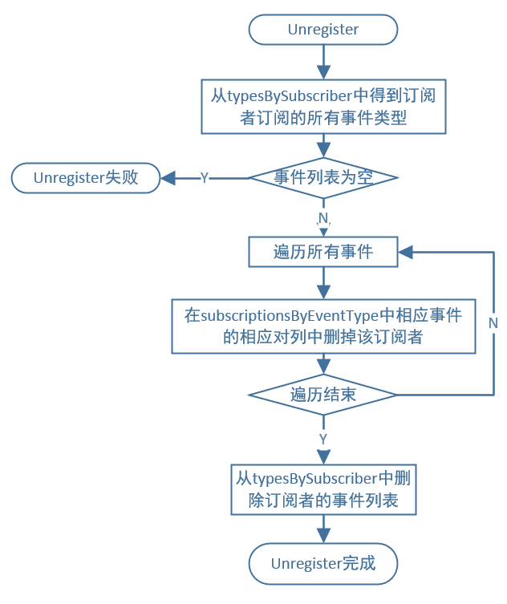

三、核心架构与利弊

1、核心架构


从EventBus作者提供的图我们可以看到EventBus的核心架构，其实就是基于观察者模式来实现的

2、利与弊

EventBus好处比较明显，它能够解耦和，将业务和视图分离，代码实现比较容易。而且3.0后，我们可以通过apt预编译找到订阅者，避免了运行期间的反射处理解析，大大提高了效率。当然EventBus也会带来一些隐患和弊端，如果滥用的话会导致逻辑的分散并造成维护起来的困难。另外大量采用EventBus代码的可读性也会变差。


