## 适配

一、屏幕适配概念

随着支持Android系统的设备(手机、平板、电视、手表)的增多，设备碎片化、品牌碎片化、系统碎片化、传感器碎片化和屏幕碎片化的程度也在不断地加深。今天要探讨的，则是对我们开发影响比较大的——屏幕的碎片化。

* Android系统碎片化：基于Google原生系统，小米定制的MIUI、魅族定制的flyme、华为定制的EMUI等等；
* Android机型屏幕尺寸碎片化：5寸、5.5寸、6寸等等；
* Android屏幕分辨率碎片化：320x480、480x800、720x1280、1080x1920等；

下面这张图是Android屏幕尺寸的示意图，在这张图里面，蓝色矩形的大小代表不同尺寸，颜色深浅则代表所占百分比的大小。


下面是IOS的

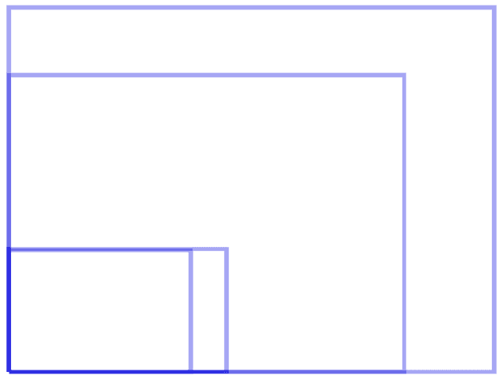

通过对比可以很明显知道android的屏幕到底有多少种了吧。而苹果只有5种包括现在最新的刘海屏。随着Android设备的增多，设备碎片化、系统碎片化、屏幕尺寸碎片化、屏幕碎片化的程度也在不断加深。

当Android系统、屏幕尺寸、屏幕密度出现碎片化的时候，就很容易出现同一元素在不同手机上显示不同的问题。试想一下这么一个场景：为4.3寸屏幕准备的UI设计图，运行在5.0寸的屏幕上，很可能在右侧和下侧存在大量的空白；而5.0寸的UI设计图运行到4.3寸的设备上，很可能显示不下。为了保证用户获得一致的用户体验效果,使得某一元素在Android不同尺寸、不同分辨率的、不同系统的手机上具备相同的显示效果，能够保持界面上的效果一致,我们需要对各种手机屏幕进行适配！

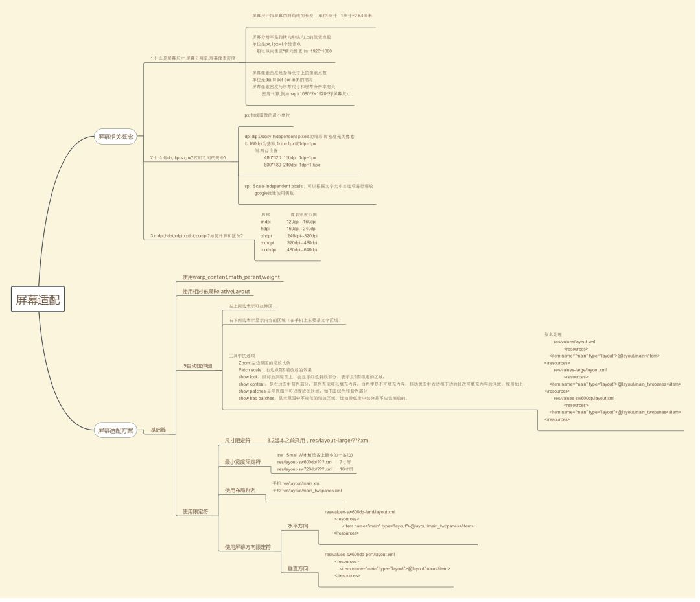

二、基本概念

1、像素（px）：

* 含义：通常所说的像素，就是CCD/CMOS上光电感应元件的数量，一个感光元件经过感光，光电信号转换，A/D转换等步骤以后，在输出的照片上就形成一个点，我们如果把影像放大数倍，会发现这些连续色调其实是由许多色彩相近的小方点所组成，这些小方点就是构成影像的最小单位“像素”（Pixel）。简而言之，像素就是手机屏幕的最小构成单元。
* 单位：px（pixel），1px = 1像素点。一般情况下UI设计师的设计图会以px作为统一的计量单位。

2、分辨率：

* 含义：手机在横向、纵向上的像素点数总和一般描述成 宽*高 ，即横向像素点个数 * 纵向像素点个数（如1080 x 1920）。
* 单位：px（pixel），1px = 1像素点

3、屏幕尺寸指的是：


* 含义：手机对角线的物理尺寸
* 单位：英寸（inch），一英寸大约2.54cm 常见的尺寸有4.7寸、5寸、5.5寸、6寸

4、屏幕像素密度（dpi）：

* 含义：每英寸的像素点数。例如每英寸内有160个像素点，则其像素密度为160dpi。是在系统软件上指定的单位尺寸的像素数量，它往往是写在系统出厂配置文件的一个固定值。
* 单位：dpi（dots per inch）
* 计算公式： 像素密度 = 像素 / 尺寸 （dpi = px / in）
* 标准屏幕像素密度（mdpi）： 每英寸长度上有160个像素点（160dpi），即称为标准屏幕像素密度（mdpi）。


为什么是软件系统上的概念？

因为大家买手机的时候，往往会听到另一个叫ppi的参数，这个在手机屏幕中指的也是像素密度，但是这个是物理上的概念，它是客观存在的不会改变。dpi是软件参考了物理像素密度后，人为指定的一个值，这样保证了某一个区间内的物理像素密度在软件上都使用同一个值。这样会有利于我们的UI适配。

比如，几部相同分辨率不同尺寸的手机的ppi可能分别是是430,440,450,那么在Android系统中，可能dpi会全部指定为480.这样的话，dpi/160就会是一个相对固定的数值，这样就能保证相同分辨率下不同尺寸的手机表现一致。

5、屏幕密度density：
屏幕密度，density和dpi的关系为

```
//这里dpi和160的单位都是（像素/英寸），可以说density没有单位，
//个人读法是“像素密度的比例”，其实就是实际像素密度比标准像素密度
//标准像素密度都是160（像素/英寸）
density = dpi/160
```

```
drawable-ldpi (dpi=120, density=0.75)

drawable-mdpi (dpi=160, density=1)

drawable-hdpi (dpi=240, density=1.5)

drawable-xhdpi (dpi=320, density=2)

drawable-xxhdpi (dpi=480, density=3)
```

屏幕尺寸、分辨率、像素密度三者关系

一部手机的分辨率是宽x高，屏幕大小是以寸为单位，那么三者的关系是：

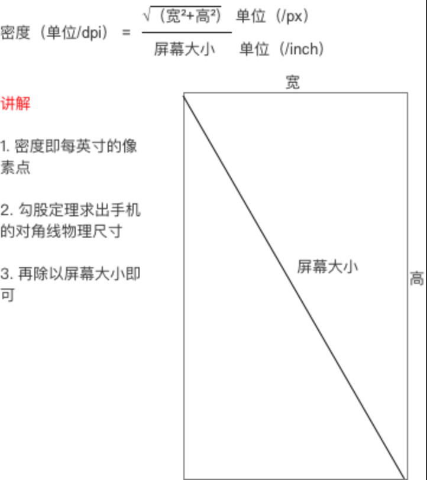

假设一部手机的分辨率是1080x1920（px），屏幕大小是5寸

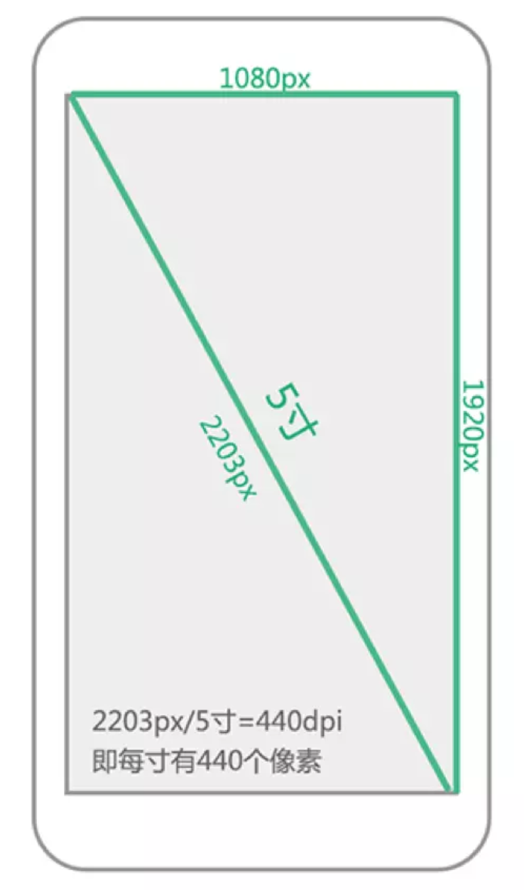

6、密度无关像素（dp）：

* 含义：density-independent pixel，叫dp或dip，与终端上的实际物理像素点无关
* 单位：dp，可以保证在不同屏幕像素密度的设备上显示相同的效果，是安卓特有的长度单位。
* 场景例子：假如同样都是画一条长度是屏幕一半的线，如果使用px作为计量单位，那么在480x800分辨率手机上设置应为240px；在320x480的手机上应设置为160px，二者设置就不同了；如果使用dp为单位，在这两种分辨率下，160dp都显示为屏幕一半的长度。
* dp与px的转换：1px = （dpi / 160 ） * 1dp;

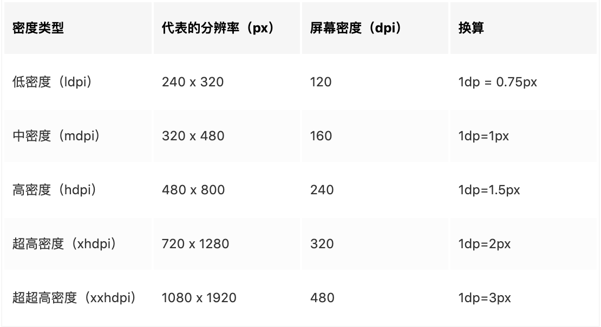

7、独立比例像素（sp）：

* 含义：scale-independent pixel，叫sp或sip
* 单位：sp，字体大小专用单位。Android开发时用此单位设置文字大小，可根据字体大小首选项进行缩放；推荐使用12sp、14sp、18sp、22sp作为字体大小，不推荐使用奇数和小数，容易造成精度丢失，12sp以下字体太小。

8、sp 与 dp 的区别：

* dp只跟屏幕的像素密度有关；
* sp和dp很类似但唯一的区别是，Android系统允许用户自定义文字尺寸大小（小、正常、大、超大等等），当文字尺寸是“正常”时1sp=1dp=0.00625英寸，而当文字尺寸是“大”或“超大”时，1sp>1dp=0.00625英寸。类似我们在windows里调整字体尺寸以后的效果——窗口大小不变，只有文字大小改变。

追到android源码，发现系统内部用applyDimension() （路径：android.util.TypedValue.applyDimension()）将所有单位都转换成px 再处理：

```
public static float applyDimension(int unit, float value,DisplayMetrics metrics){
    switch (unit) {
    //px：pixel 
    case COMPLEX_UNIT_PX:
        return value;
    //dp（dip）    
    case COMPLEX_UNIT_DIP:
        return value * metrics.density;
    //sp      
    case COMPLEX_UNIT_SP:
        return value * metrics.scaledDensity;
    //pt(Point) ： 1/72英寸(用于印刷业)    
    case COMPLEX_UNIT_PT:
        return value * metrics.xdpi * (1.0f/72);
    //in： inch 英寸    
    case COMPLEX_UNIT_IN:
        return value * metrics.xdpi;
    //mm ： 毫米  1英寸=25.4毫米    
    case COMPLEX_UNIT_MM:
        return value * metrics.xdpi * (1.0f/25.4f);
    }
    return 0;
}
```

可以发现dp和sp的区别在于density和scaledDensity两个值上；

```
public float density;
public float scaledDensity;
```

三、适配方案

屏幕适配问题的本质是使得布局、布局组件在Android不同尺寸、不同分辨率的手机上具备相同的显示效果，下面我将分几个方面来谈谈如何去适配。

1、关于布局组件的适配：

1.1 使用密度无关像素指定尺寸

由于各种屏幕的像素密度都有所不同，因此相同数量的像素在不同设备上的实际大小也会有所差异，这样使用像素（px）定义布局尺寸就会产生问题。
因此，请务必使用密度无关像素 dp 或独立比例像素 sp 单位指定尺寸。

==备注 :==在生产过程中，厂家不会完全按照屏幕密度标准去生产Android设备，会在Google的标准周围浮动变化，或是偏离Google的屏幕密度标准比较大，再加上理论计算（开方）造成的误差，实际上使用dp作为单位是不能完完全全的完成适配操作；

1.2 使用相对布局或线性布局，不要使用绝对布局

对于线性布局（Linearlayout）、相对布局（RelativeLayout）、帧布局（FrameLayout）、绝对布局（AbsoluteLayout）以及新增的加强版帧布局（CoordinatorLayout）需要根据需求进行选择，没有绝对而言。
但因为RelativeLayout讲究的是相对位置，即使屏幕的大小改变，视图之前的相对位置都不会变化，与屏幕大小无关，灵活性很强，而LinearLayout法准确地控制子视图之间的位置关系，只能简单的一个挨着一个地排列，所以，对于屏幕适配来说，使用相对布局（RelativeLayout）将会是更好的解决方案，至于绝对布局由于适配性极差，所以极少使用。

1. RelativeLayout和LinearLayout性能分析

* RelativeLayout会让子View调用2次onMeasure(measureChildHorizontal和measureChild)，LinearLayout在有weight时，也会调用子View2次onMeasure
* RelativeLayout的子View如果高度和RelativeLayout不同，则会引发效率问题，当子View很复杂时，这个问题会更加严重。如果可以，尽量使用padding代替margin。
* 在不影响层级深度的情况下,使用LinearLayout和FrameLayout而不是RelativeLayout。
最后再思考一下一个矛盾问题，为什么Google给开发者默认新建了个RelativeLayout，而自己却在DecorView自己是FrameLayout但是它只有一个子元素是属于LinearLayout。因为DecorView的层级深度是已知而且固定的，上面一个标题栏，下面一个内容栏。采用RelativeLayout并不会降低层级深度，所以此时在根节点上用LinearLayout是效率最高的。而之所以给开发者默认新建了个RelativeLayout是希望开发者能采用尽量少的View层级来表达布局以实现性能最优，因为复杂的View嵌套对性能的影响会更大一些。
* 能用两层LinearLayout，尽量用一个RelativeLayout，在时间上此时RelativeLayout耗时更小。另外LinearLayout慎用layout_weight,也将会增加一倍耗时操作。由于使用LinearLayout的layout_weight,大多数时间是不一样的，这会降低测量的速度。这只是一个如何合理使用Layout的案例，必要的时候，你要小心考虑是否用layout weight。总之减少层级结构，才是王道，让onMeasure做延迟加载，用viewStub，include等一些技巧。

1.3 使用```wrap_content、match_parent```、权重

使用 ```wrap_content``` 和 ```match_parent``` 尺寸值而不是硬编码的尺寸，系统会自动计算相应的数值，视图就会相应地使用自身所需的空间或填满可用空间，让布局正确适应各种屏幕尺寸和屏幕方向，组件的权重比同理。

1.4 使用minWidth、minHeight、lines等属性
很多时候我们显示的数据都是由后台返回的，再由我们加工处理后去适配我们的组件，这些数据的长度我们是无法确定的，而正常情况下我们构思的布局都仅是适用于理想的情况下，为了保证界面的对齐、数据显示完整等等的原因，我们需要在构思布局时增加对组件最小宽高度、行数等属性的设置，确保在特殊的数据下不会破坏我们的整体布局。

1.5 dimens使用
组件的长宽我们可以通过dimens来定义，不同的屏幕尺寸可以定义不同的数值，或者是不同的语言显示我们也可以定义不同的数值，因为翻译后的长度一般都不会跟中文的一致。

2、关于布局的适配：

2.1 dp直接适配

而在不同分辨率下，dpi将会不同，比如：


根据上面的表格，我们可以发现，720P,和1080P的手机，dpi是不同的，这也就意味着，不同的分辨率中，1dp对应不同数量的px(720P中，1dp=2px，1080P中1dp=3px)，这就实现了，当我们使用dp来定义一个控件大小的时候，他在不同的手机里表现出相应大小的像素值。


==我们可以说，通过dp加上自适应布局和weight比例布局可以基本解决不同手机上适配的问题，这基本是最原始的Android适配方案。==

这种方式存在两个小问题，第一，这只能保证我们写出来的界面适配绝大部分手机，部分手机仍然需要单独适配，为什么dp只解决了90%的适配问题，因为并不是所有的1080P的手机dpi都是480，比如Google 的Pixel2 ```（1920*1080）的dpi是420，也就是说，在Pixel2中，1dp=2.625px,这样会导致相同分辨率的手机中，这样，一个100dp*100dp``` 的控件，在一般的1080P手机上，可能都是300px,而Pixel 2 中 ，就只有262.5px,这样控件的实际大小会有所不同。

为了更形象的展示，假设我们在布局文件中把一个ImageView的宽度设置为360dp,那么在下面两张图中表现是不一样的：

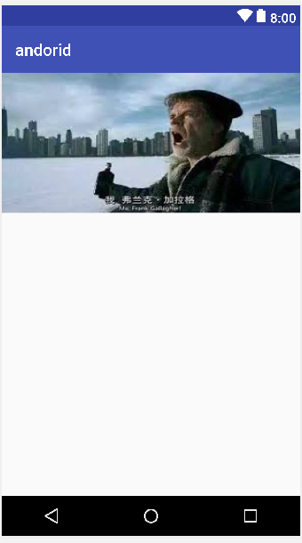


从上面的布局中可以看到，同样是1080P的手机，差异是比较明显的。在这种情况下，我们的UI可能需要做一些微调甚至单独适配。

第二个问题，这种方式无法快速高效的把设计师的设计稿实现到布局代码中，通过dp直接适配，我们只能让UI基本适配不同的手机,但是在设计图和UI代码之间的鸿沟，dp是无法解决的，因为dp不是真实像素。而且，设计稿的宽高往往和Android的手机真实宽高差别极大，以我们的设计稿为例，设计稿的宽高是```375px*750px，而真实手机可能普遍是1080*1920```。

那么在日常开发中我们是怎么跨过这个鸿沟的呢？基本都是通过百分比啊，或者通过估算，或者设定一个规范值等等。总之，当我们拿到设计稿的时候，设计稿的 ```ImageView是128px*128px，当我们在编写layout文件的时候，却不能直接写成128dp*128dp``` 。在把设计稿向UI代码转换的过程中，我们需要耗费相当的精力去转换尺寸，这会极大的降低我们的生产力，拉低开发效率。

2.2 宽高限定符适配

2.2.1 限定符

我们在做屏幕的适配时在屏幕 尺寸相差不大的情况下，dp可以使不同分辨率的设备上展示效果相似。但是在屏幕尺寸相差比较大的情况下(平板)，dp就失去了这种效果。所以需要以下的限定符来约束，采用多套布局，数值等方式来适配。

那么其实所谓的限定符就是android在进行资源加载的时候会按照屏幕的相关信息对文件夹对应的名字进行识别，而这些特殊名字就是我们的限定符

```
限定符分类：
   屏幕尺寸    
       small   小屏幕
       normal  基准屏幕
       large   大屏幕
       xlarge  超大屏幕
   屏幕密度
       ldpi    <=120dpi
       mdpi    <= 160dpi
       hdpi    <= 240dpi
       xhdpi   <= 320dpi
       xxhdpi  <= 480dpi
       xxhdpi  <= 640dpi(只用来存放icon)
       nodpi   与屏幕密度无关的资源.系统不会针对屏幕密度对其中资源进行压缩或者拉伸
       tvdpi   介于mdpi与hdpi之间,特定针对213dpi,专门为电视准备的,手机应用开发不需要关心这个密度值.
   屏幕方向    
       land    横向
       port    纵向
   屏幕宽高比  
       long    比标准屏幕宽高比明显的高或者宽的这样屏幕
       notlong 和标准屏幕配置一样的屏幕宽高比
```

2.2.2 布局适配

1 使用尺寸限定符：

当我们要在大屏幕上显示不同的布局，就要使用large限定符。例如，在宽的屏幕左边显示列表右边显示列表项的详细信息，在一般宽度的屏幕只显示列表，不显示列表项的详细信息，我们就可以使用large限定符。

res/layout/activity_main.xml 单面板：

```
<LinearLayout xmlns:android="http://schemas.android.com/apk/res/android"
    android:layout_width="match_parent"
    android:layout_height="match_parent"
    android:orientation="vertical"
    >
    <!-- 列表 -->
    <fragment
        android:id="@+id/headlines"
        android:layout_width="match_parent"
        android:layout_height="match_parent"
        android:name="com.mp5a5.goodsalary.HeadlinesFragment"
        />
</LinearLayout>
```

res/layout-large/activity_main.xml 双面板：

```
<LinearLayout xmlns:android="http://schemas.android.com/apk/res/android"
    android:layout_width="match_parent"
    android:layout_height="match_parent"
    android:orientation="horizontal"
    >
    <!-- 列表 -->
    <fragment
        android:id="@+id/headlines"
        android:layout_width="400dp"
        android:layout_height="match_parent"
        android:layout_marginStart="10dp"
        android:name="com.mp5a5.goodsalary.HeadlinesFragment"
        />
    <!-- 列表项的详细信息 -->
    <fragment
        android:id="@+id/article"
        android:layout_width="match_parent"
        android:layout_height="match_parent"
        android:name="com.mp5a5.goodsalary.ArticleFragment"
        />
</LinearLayout>
```

如果这个程序运行在屏幕尺寸大于7inch的设备上，系统就会加载 ```res/layout-large/main.xml``` 而不是 ```res/layout/main.xml```，在小于7inch的设备上就会加载 ```res/layout/main.xml```。

需要注意的是，这种通过large限定符分辨屏幕尺寸的方法，适用于android3.2之前。在android3.2之后，为了更精确地分辨屏幕尺寸大小，Google推出了最小宽度限定符。

2 使用最小宽度限定符

最小宽度限定符的使用和large基本一致，只是使用了具体的宽度限定。

res/layout/activity_main.xml，单面板（默认）布局：

```
<LinearLayout xmlns:android="http://schemas.android.com/apk/res/android"
    android:layout_width="match_parent"
    android:layout_height="match_parent"
    android:orientation="vertical"
    >
    <!-- 列表 -->
    <fragment
        android:id="@+id/headlines"
        android:layout_width="match_parent"
        android:layout_height="match_parent"
        android:name="com.mp5a5.goodsalary.HeadlinesFragment"
        />
</LinearLayout>
```

res/layout-sw600dp/activity_main.xml，双面板布局： Small Width 最小宽度

```
<LinearLayout xmlns:android="http://schemas.android.com/apk/res/android"
    android:layout_width="match_parent"
    android:layout_height="match_parent"
    android:orientation="horizontal"
    >

   <fragment
        android:id="@+id/headlines"
        android:layout_width="400dp"
        android:layout_height="match_parent"
        android:layout_marginStart="10dp"
        android:name="com.mp5a5.goodsalary.HeadlinesFragment"
        />

    <fragment
        android:id="@+id/article"
        android:layout_width="match_parent"
        android:layout_height="match_parent"
        android:name="com.mp5a5.goodsalary.ArticleFragment"
        />
</LinearLayout>
```

这种方式是不区分屏幕方向的。这种最小宽度限定符适用于android3.2之后，所以如果要适配android全部的版本，就要使用large限定符和sw600dp文件同时存在于项目res目录下。

这就要求我们维护两个相同功能的文件。为了避免繁琐操作，我们就要使用布局别名。

3 使用布局别名
```res/layout/activity_main.xml: 单面板布局```
```res/layout-large/activity_main.xml: 多面板布局```
```res/layout-sw600dp/activity_main.xml: 多面板布局```
由于后两个文具文件一样，我们可以用以下两个文件代替上面三个布局文件：

```res/layout/activity_main.xml 单面板布局```
```res/layout/activity_main_twopanes.xml 双面板布局```

然后在res下建立
res/values/layout.xml、
res/values-large/layout.xml、
res/values-sw600dp/layout.xml三个文件。

默认布局
res/values/layout.xml:

```
<resources>
   <item name="main" type="layout">@layout/activity_main</item>
</resources>
```

Android3.2之前的平板布局
res/values-large/layout.xml:

```
<resources>
   <item name="main" type="layout">@layout/activity_main_twopanes</item>
</resources>
```

Android3.2之后的平板布局
res/values-sw600dp/layout.xml:

```
<resources>
   <item name="main" type="layout">@layout/activity_main_twopanes</item>
</resources>
```

这样就有了main为别名的布局。

在activity中setContentView(R.layout.main);

这样，程序在运行时，就会检测手机的屏幕大小，如果是平板设备就会加载```res/layout/activity_main_twopanes.xml```，如果是手机设备，就会加载```res/layout/activity_main.xml``` 。我们就解决了只使用一个布局文件来适配android3.2前后的所有平板设备。

4 使用屏幕方向限定符

如果我们要求给横屏、竖屏显示的布局不一样。就可以使用屏幕方向限定符来实现。
例如，要在平板上实现横竖屏显示不用的布局，可以用以下方式实现。
res/values-sw600dp-land/layouts.xml:横屏

```
<resources>
   <item name="main" type="layout">@layout/main_twopanes</item>
</resources>
```

res/values-sw600dp-port/layouts.xml:竖屏、

```
<resources>
   <item name="main" type="layout">@layout/main</item>
</resources>
```

2.2.3 尺寸适配

为了高效的实现UI开发，出现了新的适配方案，我把它称作宽高限定符适配。简单说，就是穷举市面上所有的Android手机的宽高像素值：

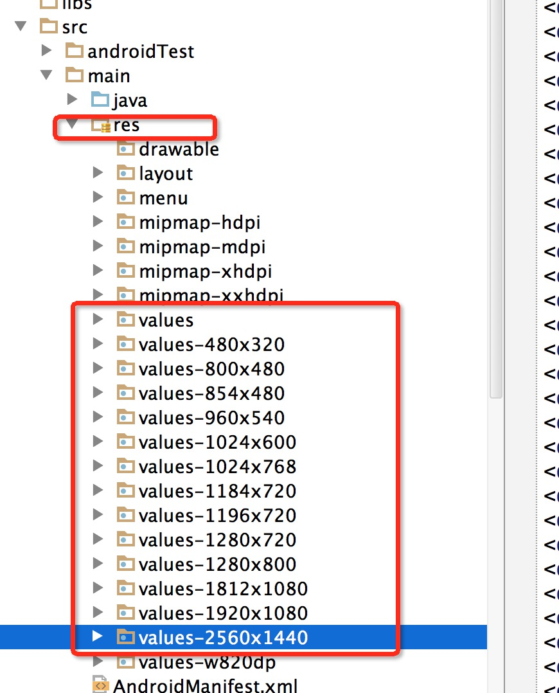

设定一个基准的分辨率，其他分辨率都根据这个基准分辨率来计算，在不同的尺寸文件夹内部，根据该尺寸编写对应的dimens文件。

比如以480x320为基准分辨率

* 宽度为320，将任何分辨率的宽度整分为320份，取值为x1-x320
* 高度为480，将任何分辨率的高度整分为480份，取值为y1-y480

那么对于800*480的分辨率的dimens文件来说，

x1=(480/320)*1=1.5px

x2=(480/320)*2=3px

...


代码中使用：

```
R.dimen.x2
```

布局中使用：

```
@dimen/x2
```

这个时候，如果我们的UI设计界面使用的就是基准分辨率，那么我们就可以按照设计稿上的尺寸填写相对应的dimens引用了,而当APP运行在不同分辨率的手机中时，这些系统会根据这些dimens引用去该分辨率的文件夹下面寻找对应的值。这样基本解决了我们的适配问题，而且极大的提升了我们UI开发的效率，

但是这个方案有一个致命的缺陷，那就是需要精准命中才能适配，比如1920x1080的手机就一定要找到1920x1080的限定符，否则就只能用统一的默认的dimens文件了。而使用默认的尺寸的话，UI就很可能变形，简单说，就是容错机制很差。

不过这个方案有一些团队用过，我们可以认为它是一个比较成熟有效的方案了。

2.3 今日头条适配

1 简介

* 梳理需求

首先来梳理下我们的需求，一般我们设计图都是以固定的尺寸来设计的。比如以分辨率1920px * 1080px来设计，以density为3来标注，也就是屏幕其实是640dp * 360dp。如果我们想在所有设备上显示完全一致，其实是不现实的，因为屏幕高宽比不是固定的，16:9、4:3甚至其他宽高比层出不穷，宽高比不同，显示完全一致就不可能了。但是通常下，我们只需要以宽或高一个维度去适配，比如我们Feed是上下滑动的，只需要保证在所有设备中宽的维度上显示一致即可，再比如一个不支持上下滑动的页面，那么需要保证在高这个维度上都显示一致，尤其不能存在某些设备上显示不全的情况。同时考虑到现在基本都是以dp为单位去做的适配，如果新的方案不支持dp，那么迁移成本也非常高。

因此，总结下大致需求如下：

1. 支持以宽或者高一个维度去适配，保持该维度上和设计图一致；
2. 支持dp和sp单位，控制迁移成本到最小。

* 找兼容突破口

从dp和px的转换公式 ：px = dp * density 

可以看出，如果设计图宽为360dp，想要保证在所有设备计算得出的px值都正好是屏幕宽度的话，我们只能修改 density 的值。

通过阅读源码，我们可以得知，density 是 DisplayMetrics 中的成员变量，而 DisplayMetrics 实例通过 Resources#getDisplayMetrics 可以获得，而Resouces通过Activity或者Application的Context获得。

那么是不是所有的dp和px的转换都是通过 DisplayMetrics 中相关的值来计算的呢？

首先来看看布局文件中dp的转换，最终都是调用 TypedValue#applyDimension(int unit, float value, DisplayMetrics metrics) 来进行转换。

这里用到的DisplayMetrics正是从Resources中获得的。

再看看图片的decode，BitmapFactory#decodeResourceStream方法:


可见也是通过 DisplayMetrics 中的值来计算的。

当然还有些其他dp转换的场景，基本都是通过 DisplayMetrics 来计算的，这里不再详述。因此，想要满足上述需求，我们只需要修改 DisplayMetrics 中和 dp 转换相关的变量即可。

* 最终方案

下面假设设计图宽度是360dp，以宽维度来适配。

那么适配后的 density = 设备真实宽(单位px) / 360，接下来只需要把我们计算好的 density 在系统中修改下即可，代码实现如下：

```
public class DensityUtils {

  private static float sNoncompatDensity;
  private static float sNoncompatScaledDensity;

  public static void setCustomDensity(@NonNull Activity activity, @NonNull Application application) {
    final DisplayMetrics appDisplayMetrics = application.getResources().getDisplayMetrics();


    if (sNoncompatDensity == 0) {
      sNoncompatDensity = appDisplayMetrics.density;
      sNoncompatScaledDensity = appDisplayMetrics.scaledDensity;
      application.registerComponentCallbacks(new ComponentCallbacks() {
        @Override
        public void onConfigurationChanged(@NonNull Configuration configuration) {
          if (configuration != null && configuration.fontScale > 0) {
            sNoncompatScaledDensity = application.getResources().getDisplayMetrics().scaledDensity;
          }
        }

        @Override
        public void onLowMemory() {

        }
      });
    }


    final float targetDensity = appDisplayMetrics.widthPixels / 360;
    final float targetScaledDensity = targetDensity * (sNoncompatScaledDensity / sNoncompatDensity);
    final int targetDensityDpi = (int) (160 * targetDensity);
    appDisplayMetrics.density = targetDensity;
    appDisplayMetrics.scaledDensity = targetScaledDensity;
    appDisplayMetrics.densityDpi = targetDensityDpi;

    final DisplayMetrics actDisplayMetrics = activity.getResources().getDisplayMetrics();
    actDisplayMetrics.density = targetDensity;
    actDisplayMetrics.scaledDensity = targetScaledDensity;
    actDisplayMetrics.densityDpi = targetDensityDpi;
  }
}
```

同时在 Activity#onCreate 方法中调用下。代码比较简单，也没有涉及到系统非公开api的调用。

2 原理

今日头条屏幕适配方案的核心原理在于，根据以下公式算出 density

当前设备屏幕总宽度（单位为像素）/  设计图总宽度（单位为 dp) = density

density 的意思就是 1 dp 占当前设备多少像素

为什么要算出 density，这和屏幕适配有什么关系呢？

```
public static float applyDimension(int unit, float value,
                                       DisplayMetrics metrics)
    {
        switch (unit) {
        case COMPLEX_UNIT_PX:
            return value;
        case COMPLEX_UNIT_DIP:
            return value * metrics.density;
        case COMPLEX_UNIT_SP:
            return value * metrics.scaledDensity;
        case COMPLEX_UNIT_PT:
            return value * metrics.xdpi * (1.0f/72);
        case COMPLEX_UNIT_IN:
            return value * metrics.xdpi;
        case COMPLEX_UNIT_MM:
            return value * metrics.xdpi * (1.0f/25.4f);
        }
        return 0;
    }
```

不管你在布局文件中填写的是什么单位，最后都会被转化为 px，系统就是通过上面的方法，将项目中任何地方填写的单位都转换为 px 的

所以我们常用的 px 转 dp 的公式 dp = px / density，就是根据上面的方法得来的，density 在公式的运算中扮演着至关重要的一步

==今日头条适配方案默认项目中只能以高或宽中的一个作为基准，进行适配==

这就引出了一个现在比较棘手的问题，大部分市面上的 Android 设备的屏幕高宽比都不一致，特别是现在大量全面屏的问世，这个问题更加严重，不同厂商推出的全面屏手机的屏幕高宽比都可能不一致

这时我们只以高或宽其中的一个作为基准进行适配，就会有效的避免布局在高宽比不一致的屏幕上出现变形的问题

明白这个后，我再来说说 density，density 在每个设备上都是固定的，dpi / 160 = density，屏幕的总 px 宽度 / density = 屏幕的总 dp 宽度

* 设备 1，屏幕宽度为 1080px，480dpi，屏幕总 dp 宽度为 1080 / (480 / 160) = 360dp
* 设备 2，屏幕宽度为 1440px，560dpi，屏幕总 dp 宽度为 1440 / (560 / 160) = 411dp

可以看到屏幕的总 dp 宽度在不同的设备上是会变化的，但是我们在布局中填写的 dp 值却是固定不变的

这会导致什么呢？假设我们布局中有一个 View 的宽度为 100dp，在设备 1 中 该 View 的宽度占整个屏幕宽度的 27.8% (100 / 360 = 0.278)

但在设备 2 中该 View 的宽度就只能占整个屏幕宽度的 24.3% (100 / 411 = 0.243)，可以看到这个 View 在像素越高的屏幕上，dp 值虽然没变，但是与屏幕的实际比例却发生了较大的变化，所以肉眼的观看效果，会越来越小，这就导致了传统的填写 dp 的屏幕适配方式产生了较大的误差

这时我们要想完美适配，那就必须保证这个 View 在任何分辨率的屏幕上，与屏幕的比例都是相同的

这时我们该怎么做呢？改变每个 View 的 dp 值？不现实，在每个设备上都要通过代码动态计算 View 的 dp 值，工作量太大

如果每个 View 的 dp 值是固定不变的，那我们只要保证每个设备的屏幕总 dp 宽度不变，就能保证每个 View 在所有分辨率的屏幕上与屏幕的比例都保持不变，从而完成等比例适配，并且这个屏幕总 dp 宽度如果还能保证和设计图的宽度一致的话，那我们在布局时就可以直接按照设计图上的尺寸填写 dp 值

屏幕的总 px 宽度 / density = 屏幕的总 dp 宽度

在这个公式中我们要保证 屏幕的总 dp 宽度 和 设计图总宽度 一致，并且在所有分辨率的屏幕上都保持不变，我们需要怎么做呢？屏幕的总 px 宽度 每个设备都不一致，这个值是肯定会变化的，这时今日头条的公式就派上用场了

当前设备屏幕总宽度（单位为像素）/ 设计图总宽度（单位为 dp) = density

这个公式就是把上面公式中的 屏幕的总 dp 宽度 换成 设计图总宽度，原理都是一样的，只要 density 根据不同的设备进行实时计算并作出改变，就能保证 设计图总宽度 不变，也就完成了适配

3 验证方案可行性

假设设计图总宽度为 375 dp，一个 View 在这个设计图上的尺寸是 50dp * 50dp，这个 View 的宽度占整个设计图宽度的 13.3% (50 / 375 = 0.133)，那我们就来验证下在使用今日头条屏幕适配方案的情况下，这个 View 与屏幕宽度的比例在分辨率不同的设备上是否还能保持和设计图中的比例一致

* 验证设备 1

屏幕总宽度为 1080 px，根据今日头条的的公式求出 density，1080 / 375 = 2.88 (density)
这个 50dp * 50dp 的 View，系统最后会将高宽都换算成 px，50dp * 2.88 = 144 px (根据公式 dp * density = px)
144 / 1080 = 0.133，View 实际宽度与 屏幕总宽度 的比例和 View 在设计图中的比例一致 (50 / 375 = 0.133)，所以完成了等比例缩放
某些设备总宽度为 1080 px，但是 DPI 可能不同，是否会对今日头条适配方案产生影响？其实这个方案根本没有根据 DPI 求出 density，是根据自己的公式求出的 density，所以这对今日头条的方案没有影响
上面只能确定在所有屏幕总宽度为 1080 px 的设备上能完成等比例适配，那我们再来试试其他分辨率的设备

* 验证设备 2

屏幕总宽度为 1440 px，根据今日头条的的公式求出 density，1440 / 375 = 3.84 (density)
这个 50dp * 50dp 的 View，系统最后会将高宽都换算成 px，50dp * 3.84 = 192 px (根据公式 dp * density = px)
192 / 1440 = 0.133，View 实际宽度与 屏幕总宽度 的比例和 View 在设计图中的比例一致 (50 / 375 = 0.133)，所以也完成了等比例缩放
两个不同分辨率的设备都完成了等比例缩放，证明今日头条屏幕适配方案在不同分辨率的设备上都是有效的，如果大家还心存疑虑，可以再试试其他分辨率的设备，其实到最后得出的比例不会有任何偏差, 都是 0.133

4 优点

* 使用成本非常低，操作非常简单，使用该方案后在页面布局时不需要额外的代码和操作，这点可以说完虐其他屏幕适配方案
* 侵入性非常低，该方案和项目完全解耦，在项目布局时不会依赖哪怕一行该方案的代码，而且使用的还是 Android 官方的 API，意味着当你遇到什么问题无法解决，想切换为其他屏幕适配方案时，基本不需要更改之前的代码，整个切换过程几乎在瞬间完成，会少很多麻烦，节约很多时间，试错成本接近于 0
* 可适配三方库的控件和系统的控件(不止是是 Activity 和 Fragment，Dialog、Toast 等所有系统控件都可以适配)，由于修改的 density 在整个项目中是全局的，所以只要一次修改，项目中的所有地方都会受益
* 不会有任何性能的损耗

5 缺点

暂时没发现其他什么很明显的缺点，已知的缺点有一个，那就是第三个优点，它既是这个方案的优点也同样是缺点，但是就这一个缺点也是非常致命的
只需要修改一次 density，项目中的所有地方都会自动适配，这个看似解放了双手，减少了很多操作，但是实际上反应了一个缺点，那就是只能一刀切的将整个项目进行适配，但适配范围是不可控的
这样不是很好吗？这样本来是很好的，但是应用到这个方案是就不好了，因为我上面的原理也分析了，这个方案依赖于设计图尺寸，但是项目中的系统控件、三方库控件、等非我们项目自身设计的控件，它们的设计图尺寸并不会和我们项目自身的设计图尺寸一样
当这个适配方案不分类型，将所有控件都强行使用我们项目自身的设计图尺寸进行适配时，这时就会出现问题，当某个系统控件或三方库控件的设计图尺寸和和我们项目自身的设计图尺寸差距非常大时，这个问题就越严重

* 举个例子

假设一个三方库的 View，作者在设计时，把它设计为 100dp * 100dp，设计图的最大宽度为 1000dp，这个 View 在设计图中的比例是 100 / 1000 = 0.1，意思是这个 View 的宽度在设计图中占整个宽度的 10%，如果我们要完成等比例适配，那这个三方库 View 在所有的设备上与屏幕的总宽度的比例，都必须保持在 10%
这时在一个使用今日头条屏幕适配方案的项目上，设置的设计图最大宽度如果是 1000dp，那这个三方库 View，与项目自身都可以完美的适配，但当我们项目自身的设计图最大宽度不是 1000dp，是 500dp 时，100 / 500 = 0.2，可以看到，比例发生了较大的变化，从 10% 上升为 20%，明显这个三方库 View 高于作者的预期，比之前更大了
这就是两个设计图尺寸不一致导致的非常严重的问题，当两个设计图尺寸差距越大，那适配的效果也就天差万别了

* 解决方案

 * 方案 1

 调整设计图尺寸，因为三方库可能是远程依赖的，无法修改源码，也就无法让三方库来适应我们项目的设计图尺寸，所以只有我们自身作出修改，去适应三方库的设计图尺寸，我们将项目自身的设计图尺寸修改为这个三方库的设计图尺寸，就能完成项目自身和三方库的适配
这时项目的设计图尺寸修改了，所以项目布局文件中的 dp 值，也应该按照修改的设计图尺寸，按比例增减，保持与之前设计图中的比例不变
但是如果为了适配一个三方库修改整个项目的设计图尺寸，是非常不值得的，所以这个方案支持以 Activity 为单位修改设计图尺寸，相当于每个 Activity 都可以自定义设计图尺寸，因为有些 Activity 不会使用三方库 View，也就不需要自定义尺寸，所以每个 Activity 都有控制权的话，这也是最灵活的
但这也有个问题，当一个 Activity 使用了多个设计图尺寸不一样的三方库 View，就会同样出现上面的问题，这也就只有把设计图改为与几个三方库比较折中的尺寸，才能勉强缓解这个问题
 
 * 方案 2

 第二个方案是最简单的，也是按 Activity 为单位，取消当前 Activity 的适配效果，改用其他的适配方案
 
2.4 smallestWidth 限定符适配方案

1 简介

这个方案的的使用方式和我们平时在布局中引用 dimens 无异，核心点在于生成 dimens.xml 文件

```
├── src/main
│   ├── res
│   ├── ├──values
│   ├── ├──values-800x480
│   ├── ├──values-860x540
│   ├── ├──values-1024x600
│   ├── ├──values-1024x768
│   ├── ├──...
│   ├── ├──values-2560x1440
```

smallestWidth 限定符屏幕适配方案 当成宽高限定符方案的升级版，smallestWidth 限定符屏幕适配方案 只是把 dimens.xml 文件中的值从 px 换成了 dp，原理和使用方式都是没变的，下面就直接开始剖析原理，smallestWidth 限定符屏幕适配方案 长这样

```
├── src/main
│   ├── res
│   ├── ├──values
│   ├── ├──values-sw320dp
│   ├── ├──values-sw360dp
│   ├── ├──values-sw400dp
│   ├── ├──values-sw411dp
│   ├── ├──values-sw480dp
│   ├── ├──...
│   ├── ├──values-sw600dp
│   ├── ├──values-sw640dp
```

2 原理

其实 smallestWidth 限定符屏幕适配方案 的原理也很简单，开发者先在项目中根据主流屏幕的 最小宽度 (smallestWidth) 生成一系列 values-sw<N>dp 文件夹 (含有 dimens.xml 文件)，当把项目运行到设备上时，系统会根据当前设备屏幕的 最小宽度 (smallestWidth) 去匹配对应的 values-sw<N>dp 文件夹，而对应的 values-sw<N>dp 文件夹中的 dimens.xml 文字中的值，又是根据当前设备屏幕的 最小宽度 (smallestWidth) 而定制的，所以一定能适配当前设备

如果系统根据当前设备屏幕的 最小宽度 (smallestWidth) 没找到对应的 values-sw<N>dp 文件夹，则会去寻找与之 最小宽度 (smallestWidth) 相近的 values-sw<N>dp 文件夹，系统只会寻找小于或等于当前设备 最小宽度 (smallestWidth) 的 values-sw<N>dp，这就是优于 宽高限定符屏幕适配方案 的容错率，并且也可以少生成很多 values-sw<N>dp 文件夹，减轻 App 的体积

1、什么是 smallestWidth

要先算出当前设备的 smallestWidth 值我们才能知道当前设备该匹配哪个 values-sw<N>dp 文件夹

现在来举例说明，帮助更好理解

我们假设设备的屏幕信息是 1920 * 1080、480 dpi

根据上面的规则我们要在屏幕的高度和宽度中选择值最小的一方作为最小宽度，1080 < 1920，明显 1080 px 就是我们要找的 最小宽度 的值，但 最小宽度 的单位是 dp，所以我们要把 px 转换为 dp

再巩固下基础，下面的公式一定不能再忘了！

px / density = dp，DPI / 160 = density，所以最终的公式是 px / (DPI / 160) = dp

所以我们得到的 最小宽度 的值是 360dp (1080 / (480 / 160) = 360)

现在我们已经算出了当前设备的最小宽度是 360 dp，我们晓得系统会根据这个 最小宽度 帮助我们匹配到 values-sw360dp 文件夹下的 dimens.xml 文件，如果项目中没有 values-sw360dp 这个文件夹，系统才会去匹配相近的 values-sw<N>dp 文件夹

dimens.xml 文件是整个方案的核心所在，所以接下来我们再来看看 values-sw360dp 文件夹中的这个 dimens.xml 是根据什么原理生成的

2、dimens.xml 生成原理

因为我们在项目布局中引用的 dimens 的实际值，来源于根据当前设备屏幕的 最小宽度 所匹配的 values-sw<N>dp 文件夹中的 dimens.xml，所以搞清楚 dimens.xml 的生成原理，有助于我们理解 smallestWidth 限定符屏幕适配方案

说到 dimens.xml 的生成，就要涉及到两个因数，第一个因素是 最小宽度基准值，第二个因素就是您的项目需要适配哪些 最小宽度，通俗理解就是需要生成多少个 values-sw<N>dp 文件夹

* 第一个因素

最小宽度基准值 是什么意思呢？简单理解就是您需要把设备的屏幕宽度分为多少份，假设我们现在把项目的 最小宽度基准值 定为 360，那这个方案就会理解为您想把所有设备的屏幕宽度都分为 360 份，方案会帮您在 dimens.xml 文件中生成 1 到 360 的 dimens 引用，比如 values-sw360dp 中的 dimens.xml 是长这样的

```
<?xml version="1.0" encoding="UTF-8"?>
<resources>
	<dimen name="dp_1">1dp</dimen>
	<dimen name="dp_2">2dp</dimen>
	<dimen name="dp_3">3dp</dimen>
	<dimen name="dp_4">4dp</dimen>
	<dimen name="dp_5">5dp</dimen>
	<dimen name="dp_6">6dp</dimen>
	<dimen name="dp_7">7dp</dimen>
	<dimen name="dp_8">8dp</dimen>
	<dimen name="dp_9">9dp</dimen>
	<dimen name="dp_10">10dp</dimen>
	...
	<dimen name="dp_356">356dp</dimen>
	<dimen name="dp_357">357dp</dimen>
	<dimen name="dp_358">358dp</dimen>
	<dimen name="dp_359">359dp</dimen>
	<dimen name="dp_360">360dp</dimen>
</resources>
```

values-sw360dp 指的是当前设备屏幕的 最小宽度 为 360dp (该设备高度大于宽度，则最小宽度就是宽度，所以该设备宽度为 360dp)，把屏幕宽度分为 360 份，刚好每份等于 1dp，所以每个引用都递增 1dp，值最大的 dimens 引用 dp_360 值也是 360dp，刚好覆盖屏幕宽度
下面再来看看将 最小宽度基准值 定为 360 时，values-sw400dp 中的 dimens.xml 长什么样

```
<?xml version="1.0" encoding="UTF-8"?>
<resources>
	<dimen name="dp_1">1.1111dp</dimen>
	<dimen name="dp_2">2.2222dp</dimen>
	<dimen name="dp_3">3.3333dp</dimen>
	<dimen name="dp_4">4.4444dp</dimen>
	<dimen name="dp_5">5.5556dp</dimen>
	<dimen name="dp_6">6.6667dp</dimen>
	<dimen name="dp_7">7.7778dp</dimen>
	<dimen name="dp_8">8.8889dp</dimen>
	<dimen name="dp_9">10.0000dp</dimen>
	<dimen name="dp_10">11.1111dp</dimen>
	...
	<dimen name="dp_355">394.4444dp</dimen>
	<dimen name="dp_356">395.5556dp</dimen>
	<dimen name="dp_357">396.6667dp</dimen>
	<dimen name="dp_358">397.7778dp</dimen>
	<dimen name="dp_359">398.8889dp</dimen>
	<dimen name="dp_360">400.0000dp</dimen>
</resources>
```

values-sw400dp 指的是当前设备屏幕的 最小宽度 为 400dp (该设备高度大于宽度，则最小宽度就是宽度，所以该设备宽度为 400dp)，把屏幕宽度同样分为 360份，这时每份就等于 1.1111dp 了，每个引用都递增 1.1111dp，值最大的 dimens 引用 dp_360 同样刚好覆盖屏幕宽度，为 400dp

通过两个 dimens.xml 文件的比较，dimens.xml 的生成原理一目了然，方案会先确定 最小宽度基准值，然后将每个 values-sw<N>dp 中的 dimens.xml 文件都分配与 最小宽度基准值 相同的份数，再根据公式 屏幕最小宽度 / 份数 (最小宽度基准值) 求出每份占多少 dp，保证不管在哪个 values-sw<N>dp 中，份数 (最小宽度基准值) * 每份占的 dp 值 的结果都是刚好覆盖屏幕宽度，所以在 份数 不变的情况下，只需要根据屏幕的宽度在不同的设备上动态调整 每份占的 dp 值，就能完成适配

这样就能保证不管将项目运行到哪个设备上，只要当前设备能匹配到对应的 values-sw<N>dp 文件夹，那布局中的 dimens 引用就能根据当前屏幕的情况进行缩放，保证能完美适配，如果没有匹配到对应的 values-sw<N>dp 文件夹，也没关系，它会去寻找与之相近的 values-sw<N>dp 文件夹，虽然在这种情况下，布局中的 dimens 引用的值可能有些许误差，但是也能保证最大程度的完成适配

说到这里，应该就会明白我为什么会说 smallestWidth 限定符屏幕适配方案 的原理也同样是按百分比进行布局，如果在布局中，一个 View 的宽度引用 dp_100，那不管运行到哪个设备上，这个 View 的宽度都是当前设备屏幕总宽度的 360分之100，前提是项目提供有当前设备屏幕对应的 values-sw<N>dp，如果没有对应的 values-sw<N>dp，就会去寻找相近的 values-sw<N>dp，这时就会存在误差了，至于误差是大是小，这就要看您的第二个因数怎么分配了

其实 smallestWidth 限定符屏幕适配方案 的原理和 今日头条屏幕适配方案 挺像的，今日头条屏幕适配方案 是根据屏幕的宽度或高度动态调整每个设备的 density (每 dp 占当前设备屏幕多少像素)，而 smallestWidth 限定符屏幕适配方案 同样是根据屏幕的宽度动态调整每个设备 每份占的 dp 值

* 第二个因素

第二个因数是需要适配哪些 最小宽度？比如您想适配的 最小宽度 有 320dp、360dp、400dp、411dp、480dp，那方案就会为您的项目生成 values-sw320dp、values-sw360dp、values-sw400dp、values-sw411dp、values-sw480dp 这几个资源文件夹，像这样

```
├── src/main
│   ├── res
│   ├── ├──values
│   ├── ├──values-sw320dp
│   ├── ├──values-sw360dp
│   ├── ├──values-sw400dp
│   ├── ├──values-sw411dp
│   ├── ├──values-sw480dp
```

方案会为您需要适配的 最小宽度，在项目中生成一系列对应的 values-sw<N>dp，在前面也说了，如果某个设备没有为它提供对应的 values-sw<N>dp，那它就会去寻找相近的 values-sw<N>dp，但如果这个相近的 values-sw<N>dp 与期望的 values-sw<N>dp 差距太大，那适配效果也就会大打折扣

那是不是 values-sw<N>dp 文件夹生成的越多，覆盖越多市面上的设备，就越好呢？
也不是，因为每个 values-sw<N>dp 文件夹其实都会占用一定的 App 体积，values-sw<N>dp 文件夹越多，App 的体积也就会越大

所以一定要合理分配 values-sw<N>dp，以越少的 values-sw<N>dp 文件夹，覆盖越多的机型

3、验证方案可行性

假设设计图总宽度为 375 dp，一个 View 在这个设计图上的尺寸是 50dp * 50dp，这个 View 的宽度占整个设计图宽度的 13.3% (50 / 375 = 0.133)
在使用 smallestWidth 限定符屏幕适配方案 时，需要提供 最小宽度基准值 和需要适配哪些 最小宽度，我们就把 最小宽度基准值 设置为 375 (和 设计图 一致)，这时方案就会为我们需要适配的 最小宽度 生成对应的 values-sw<N>dp 文件夹，文件夹中的 dimens.xml 文件是由从 1 到 375 组成的 dimens 引用，把所有设备的屏幕宽度都分为 375 份，所以在布局文件中我们应该把这个 View 的高宽都引用 dp_50

下面就来验证下在使用 smallestWidth 限定符屏幕适配方案 的情况下，这个 View 与屏幕宽度的比例在分辨率不同的设备上是否还能保持和设计图中的比例一致

* 验证设备 1

设备 1 的屏幕总宽度为 1080 px，屏幕总高度为 1920 px，DPI 为 480

设备 1 的屏幕高度大于屏幕宽度，所以 设备 1 的 最小宽度 为屏幕宽度，再根据公式 px / (DPI / 160) = dp，求出 设备 1 的 最小宽度 的值为 360 dp (1080 / (480 / 160) = 360)

根据 设备 1 的 最小宽度 应该匹配的是 values-sw360dp 这个文件夹，假设 values-sw360dp 文件夹及里面的 dimens.xml 已经生成，且是按 最小宽度基准值 为 375 生成的，360 / 375 = 0.96，所以每份占的 dp 值为 0.96，dimens.xml 里面的内容是长下面这样的

```
<?xml version="1.0" encoding="UTF-8"?>
<resources>
	<dimen name="dp_1">0.96dp</dimen>
	<dimen name="dp_2">1.92dp</dimen>
	<dimen name="dp_3">2.88dp</dimen>
	<dimen name="dp_4">3.84dp</dimen>
	<dimen name="dp_5">4.8dp</dimen>
	...
	<dimen name="dp_50">48dp</dimen>
	...
	<dimen name="dp_371">356.16dp</dimen>
	<dimen name="dp_372">357.12dp</dimen>
	<dimen name="dp_373">358.08dp</dimen>
	<dimen name="dp_374">359.04dp</dimen>
	<dimen name="dp_375">360dp</dimen>
</resources>
```

可以看到这个 View 在布局中引用的 dp_50，最终在 values-sw360dp 中定格在了 48 dp，所以这个 View 在 设备 1 上的高宽都为 48 dp，系统最后会将高宽都换算成 px，根据公式 dp * (DPI / 160) = px，所以这个 View 的高宽换算为 px 后等于 144 px (48 * (480 / 160) = 144)

144 / 1080 = 0.133，View 的实际宽度与 屏幕总宽度 的比例和 View 在设计图中的比例一致 (50 / 375 = 0.133)，所以完成了等比例缩放

某些设备的高宽是和 设备 1 相同的，但是 DPI 可能不同，而由于 smallestWidth 限定符屏幕适配方案 并没有像 今日头条屏幕适配方案 一样去自行修改 density，所以系统就会使用默认的公式 DPI / 160 求出 density，density 又会影响到 dp 和 px 的换算，因此 DPI 的变化，是有可能会影响到 smallestWidth 限定符屏幕适配方案 的

所以我们再来试试在这种特殊情况下 smallestWidth 限定符屏幕适配方案 是否也能完成适配

* 验证设备 2

设备 2 的屏幕总宽度为 1080 px，屏幕总高度为 1920 px，DPI 为 420

设备 2 的屏幕高度大于屏幕宽度，所以 设备 2 的 最小宽度 为屏幕宽度，再根据公式 px / (DPI / 160) = dp，求出 设备 2 的 最小宽度 的值为 411.429 dp (1080 / (420 / 160) = 411.429)

根据 设备 2 的 最小宽度 应该匹配的是 values-sw411dp 这个文件夹，假设 values-sw411dp 文件夹及里面的 dimens.xml 已经生成，且是按 最小宽度基准值 为 375 生成的，411 / 375 = 1.096，所以每份占的 dp 值为 1.096，dimens.xml 里面的内容是长下面这样的

```
<?xml version="1.0" encoding="UTF-8"?>
<resources>
	<dimen name="dp_1">1.096dp</dimen>
	<dimen name="dp_2">2.192dp</dimen>
	<dimen name="dp_3">3.288dp</dimen>
	<dimen name="dp_4">4.384dp</dimen>
	<dimen name="dp_5">5.48dp</dimen>
	...
	<dimen name="dp_50">54.8dp</dimen>
	...
	<dimen name="dp_371">406.616dp</dimen>
	<dimen name="dp_372">407.712dp</dimen>
	<dimen name="dp_373">408.808dp</dimen>
	<dimen name="dp_374">409.904dp</dimen>
	<dimen name="dp_375">411dp</dimen>
</resources>
```

可以看到这个 View 在布局中引用的 dp_50，最终在 values-sw411dp 中定格在了 54.8dp，所以这个 View 在 设备 2 上的高宽都为 54.8 dp，系统最后会将高宽都换算成 px，根据公式 dp * (DPI / 160) = px，所以这个 View 的高宽换算为 px 后等于 143.85 px (54.8 * (420 / 160) = 143.85)

143.85 / 1080 = 0.133，View 的实际宽度与 屏幕总宽度 的比例和 View 在设计图中的比例一致 (50 / 375 = 0.133)，所以完成了等比例缩放

虽然 View 在 设备 2 上的高宽是 143.85 px，比 设备 1 的 144 px 少了 0.15 px，但是误差非常小，整体的比例并没有发生太大的变化，是完全可以接受的

这个误差是怎么引起的呢，因为 设备 2 的 最小宽度 的实际值是 411.429 dp，但是匹配的 values-sw411dp 舍去了小数点后面的位数 (切记！系统会去寻找小于或等于 411.429 dp 的 values-sw<N>dp，所以 values-sw412dp 这个文件夹，设备 2 是匹配不了的)，所以才存在了一定的误差，因此上面介绍的第二个因数是非常重要的，这直接决定误差是大还是小

可以看到即使在高宽一样但 DPI 不一样的设备上，smallestWidth 限定符屏幕适配方案 也能完成等比例适配，证明这个方案是可行的，如果还心存疑虑，也可以再试试其他分辨率的设备，其实到最后得出的比例都是在 0.133 左右，唯一的变数就是第二个因数，如果您生成的 values-sw<N>dp 与设备实际的 最小宽度 差别不大，那误差也就在能接受的范围内，如果差别很大，那就直接 GG

4、优点

1. 非常稳定，极低概率出现意外
2. 不会有任何性能的损耗
3. 适配范围可自由控制，不会影响其他三方库
4. 在插件的配合下，学习成本低

5、缺点

1. 在布局中引用 dimens 的方式，虽然学习成本低，但是在日常维护修改时较麻烦
2. 侵入性高，如果项目想切换为其他屏幕适配方案，因为每个 Layout 文件中都存在有大量 dimens 的引用，这时修改起来工作量非常巨大，切换成本非常高昂
3. 无法覆盖全部机型，想覆盖更多机型的做法就是生成更多的资源文件，但这样会增加 App 体积，在没有覆盖的机型上还会出现一定的误差，所以有时需要在适配效果和占用空间上做一些抉择
4. 如果想使用 sp，也需要生成一系列的 dimens，导致再次增加 App 的体积
5. 不能自动支持横竖屏切换时的适配，如上文所说，如果想自动支持横竖屏切换时的适配，需要使用 values-w<N>dp 或 屏幕方向限定符 再生成一套资源文件，这样又会再次增加 App 的体积
6. 不能以高度为基准进行适配，考虑到这个方案的名字本身就叫 最小宽度限定符适配方案，所以在使用这个方案之前就应该要知道这个方案只能以宽度为基准进行适配

四、方案对比

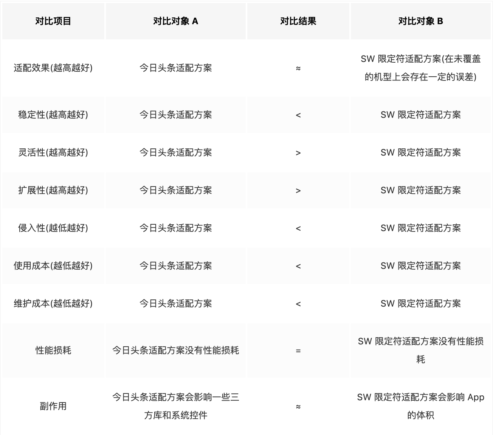

可以看到 SmallestWidth 限定符适配方案 和 今日头条适配方案 的适配效果其实都是差不多的，在前面的文章中也通过公式计算过它们的精确度，SmallestWidth 限定符适配方案 运行在未覆盖的机型上虽然也可以适配，但是却会出现一定的误差，所以 今日头条适配方案 的适配精确度确实要比 SmallestWidth 限定符适配方案 略高的，不过只要 SmallestWidth 限定符适配方案 合理的分配资源文件，适配效果的差距应该也不大

SmallestWidth 限定符适配方案 主打的是稳定性，在运行过程中极少会出现安全隐患，适配范围也可控，不会产生其他未知的影响，而 今日头条适配方案 主打的是降低开发成本、提高开发效率，使用上更灵活，也能满足更多的扩展需求，简单一句话概括就是，这两兄弟，一个求稳，一个求快。

## Handler机制

一、概述

1、Android消息处理机制

消息处理机制本质：==一个线程开启循环模式持续监听并依次处理其他线程给它发的消息。==

简单的说：一个线程开启一个无限循环模式，不断遍历自己的消息列表，如果有消息就挨个拿出来做处理，如果列表没消息，自己就堵塞（相当于wait，让出cpu资源给其他线程），其他线程如果想让该线程做什么事，就往该线程的消息队列插入消息，该线程会不断从队列里拿出消息做处理。

2、Android消息处理机制的工作原理

打个比方：公司类比App

PM 的主要工作是设计产品，写需求文档，改需求,中途改需求，提测前改需求...
UI 主要工作是UI设计，交互等。
RD 工作我就不说了
CEO 不解释。

公司开创之后（App启动），那么CEO开始干活了（主线程【UI线程】启动），这时候CEO开启了无限循环工作狂模式，自己的公司没办法啊（相当于UI主线程转成Looper线程【源码里面有】）CEO招了一名RD（new Handler 实例）并把告诉PM和UI,如果你们有什么任务和需求就让RD（Handler实例）转告给我（CEO）。RD会把PM和UI的需求（Message）一条条记到CEO的备忘录里（MessageQueue）。CEO 无限循环的工作就是不断查看备忘录，看有什么任务要做，有任务就从备忘录一条一条拿出任务来，然后交给这一名RD（Handler 实例）去处理（毕竟CEO 不会写代码）。当然如果备忘录都做完了，这时候CEO就会去睡觉（线程堵塞【简单理解成线程wait】，让出CPU资源，让其他线程去执行）。但是这个备忘录有个特殊的功能就是没有任务的时候突然插入第一条任务（从无到有）就会有闹钟功能叫醒CEO起床继续处理备忘录。 整个消息处理机制的工作原理基本就是这样的。后面会有源码分析，你再来结合这个场景，会更好理解一些。

这里先给一张Android消息处理机制流程图和具体执行动画，如果看不懂没事，接着往下看（后面会结合Android UI主线程来讲解），然后结合着图和动画一块看更能理解整个机制的实现原理。


3、Looper、Handler、MessageQueue,Message作用和存在的意义？

* Looper 

我们知道一个线程是一段可执行的代码，当可执行代码执行完成后，线程生命周期便会终止，线程就会退出，那么做为App的主线程，如果代码段执行完了会怎样？，那么就会出现App启动后执行一段代码后就自动退出了，这是很不合理的。所以为了防止代码段被执行完，只能在代码中插入一个死循环，那么代码就不会被执行完，然后自动退出，怎么在在代码中插入一个死循环呢？那么Looper出现了，在主线程中调用Looper.prepare()...Looper.loop()就会变当前线程变成Looper线程（可以先简单理解：无限循环不退出的线程），Looper.loop()方法里面有一段死循环的代码，所以主线程会进入while(true){...}的代码段跳不出来，但是主线程也不能什么都不做吧？其实所有做的事情都在while(true){...}里面做了，主线程会在死循环中不断等其他线程给它发消息（消息包括：Activity启动，生命周期，更新UI，控件事件等），一有消息就根据消息做相应的处理，Looper的另外一部分工作就是在循环代码中会不断从消息队列挨个拿出消息给主线程处理。

* MessageQueue

MessageQueue 存在的原因很简单，就是同一线程在同一时间只能处理一个消息，同一线程代码执行是不具有并发性，所以需要队列来保存消息和安排每个消息的处理顺序。多个其他线程往UI线程发送消息，UI线程必须把这些消息保持到一个列表（它同一时间不能处理那么多任务),然后挨个拿出来处理，这种设计很简单，我们平时写代码其实也经常这么做。每一个Looper线程都会维护这样一个队列，而且仅此一个，这个队列的消息只能由该线程处理。

* Handler

简单说Handler用于同一个进程的线程间通信。Looper让主线程无限循环地从自己的MessageQueue拿出消息处理，既然这样我们就知道处理消息肯定是在主线程中处理的，那么怎样在其他的线程往主线程的队列里放入消息呢？其实很简单，我们知道在同一进程中线程和线程之间资源是共享的，也就是对于任何变量在任何线程都是可以访问和修改的，只要考虑并发性做好同步就行了，那么只要拿到MessageQueue 的实例，就可以往主线程的MessageQueue放入消息，主线程在轮询的时候就会在主线程处理这个消息。那么怎么拿到主线程 MessageQueue的实例，是可以拿到的(在主线程下mLooper = Looper.myLooper();mQueue = mLooper.mQueue;),但是Google 为了统一添加消息和消息的回调处理，又专门构建了Handler类，你只要在主线程构建Handler类，那么这个Handler实例就获取主线程MessageQueue实例的引用（获取方式mLooper = Looper.myLooper();mQueue = mLooper.mQueue;），Handler 在sendMessage的时候就通过这个引用往消息队列里插入新消息。Handler 的另外一个作用，就是能统一处理消息的回调。这样一个Handler发出消息又确保消息处理也是自己来做，这样的设计非常的赞。具体做法就是在队列里面的Message持有Handler的引用（哪个handler 把它放到队列里，message就持有了这个handler的引用），然后等到主线程轮询到这个message的时候，就来回调我们经常重写的Handler的handleMessage(Message msg)方法。

* Message

Message包含具体的消息数据，在成员变量target中保存了用来发送此消息的Handler引用。因此在消息获得这行时机时，能知道具体由哪一个Handler处理。此外静态成员变量sPool，则维护了消息缓存池以复用。

二、源码分析

结合App主线程（UI线程），从App启动后一步一步往下走分析整个Android的消息处理机制，首先在ActivityThread类有我们熟悉的main的函数，App启动的代码的入口就在这里，UI线程本来只是一个普通线程，在这里会把UI线程转换成Looper线程，什么是Looper线程？

```
public final class ActivityThread {
    public static final void main(String[] args) {
        ......
        Looper.prepareMainLooper();
        ......
        ActivityThread thread = new ActivityThread();
        thread.attach(false);

        if (sMainThreadHandler == null) {    
            sMainThreadHandler = thread.getHandler();
        }
        ......
        Looper.loop();
        ......
    }
}
```

首先执行的是 Looper.prepareMainLooper() 我们来看下Looper里面的这个方法做了什么？

> 注:看之前先稍微了解下ThreadLocal是什么？
> ThreadLocal： 线程本地存储区（Thread Local Storage，简称为TLS），每个线程都有自己的私有> 的本地存储区域，不同线程之间彼此不能访问对方的TLS区域。这里线程自己的本地存储区域存放是线程自> 己的Looper。具体看下ThreadLocal.java 的源码！

```
public final class Looper {
    // sThreadLocal 是static的变量，可以先简单理解它相当于map，key是线程，value是Looper，
    //那么你只要用当前的线程就能通过sThreadLocal获取当前线程所属的Looper。
    static final ThreadLocal<Looper> sThreadLocal = new ThreadLocal<Looper>();
    //主线程（UI线程）的Looper 单独处理，是static类型的，通过下面的方法getMainLooper() 
    //可以方便的获取主线程的Looper。
    private static Looper sMainLooper; 

    //Looper 所属的线程的消息队列
    final MessageQueue mQueue;
    //Looper 所属的线程
    final Thread mThread;

    public static void prepare() {
        prepare(true);
    }

    private static void prepare(boolean quitAllowed) {
         //如果线程的TLS已有数据，则会抛出异常，一个线程只能有一个Looper，prepare不能重复调用。
        if (sThreadLocal.get() != null) {
            throw new RuntimeException("Only one Looper may be created per thread");
        }
        //往线程的TLS插入数据，简单理解相当于map.put(Thread.currentThread(),new Looper(quitAllowed));
        sThreadLocal.set(new Looper(quitAllowed));
    }

    //实际上是调用  prepare(false)，并然后给sMainLooper赋值。
    public static void prepareMainLooper() {
        prepare(false);
        synchronized (Looper.class) {
            if (sMainLooper != null) {
                throw new IllegalStateException("The main Looper has already been prepared.");
            }
            sMainLooper = myLooper();
        }
    }
    //static 方法，方便获取主线程的Looper.
    public static Looper getMainLooper() {
        synchronized (Looper.class) {
            return sMainLooper;
        }
    }
    
    public static @Nullable Looper myLooper() {
        //具体看ThreadLocal类的源码的get方法，
        //简单理解相当于map.get(Thread.currentThread()) 获取当前线程的Looper
        return sThreadLocal.get();
    }
}
```

看了上面的代码（仔细看下注释），我们发现 Looper.prepareMainLooper()做的事件就是new了一个Looper实例并放入Looper类下面一个static的ThreadLocal<Looper> sThreadLocal静态变量中，同时给sMainLooper赋值,给sMainLooper赋值是为了方便通过Looper.getMainLooper()快速获取主线程的Looper，sMainLooper是主线程的Looper可能获取会比较频繁，避免每次都到 sThreadLocal 去查找获取。

接下来重点是看下Looper的构造函数，看看在new Looper的时候做了什么事？

```
private Looper(boolean quitAllowed) {
        mQueue = new MessageQueue(quitAllowed);
        mThread = Thread.currentThread();
}
```

这时候给当前线程创建了消息队列MessageQueue，并且让Looper持有MessageQueue的引用。执行完Looper.prepareMainLooper() 之后，主线程从普通线程转成一个Looper线程。目前的主线程线程已经有一个Looper对象和一个消息队列mQueue,引用关系如下图：（主线程可以轻松获取它的Looper，主线程的Looper持有主线程消息队列的引用）


具体如何获取主线程的Looper对象和消息列表呢？

```
//在主线程中执行
mLooper = Looper.myLooper();
mQueue = mLooper.mQueue
//或者
mLooper=Looper.getMainLooper()
```

接下来回到ActivityThread 的main函数，执行完Looper.prepareMainLooper() 之后下一句代码是ActivityThread thread = new ActivityThread();这句话就是创建一下ActivityThread对象，这边需要注意的时候ActivityThread并不是一个线程，它并没有继承Thread，而只是一个普通的类public final class ActivityThread{...}ActivityThread的构造函数并没有做什么事只是初始化了资源管理器。

```
ActivityThread() {
     mResourcesManager = ResourcesManager.getInstance();
 }
```

接着往下看下一行代码

```
ActivityThread thread = new ActivityThread();
//建立Binder通道 (创建新线程)
thread.attach(false);
```

thread.attach(false);便会创建一个Binder线程（具体是指ApplicationThread，该Binder线程会通过Handler将Message发送给主线程，之后讲)。我们之前提到主线程最后会进入无限循环当中，如果没有在进入死循环之前创建其他线程，那么待会谁会给主线程发消息呢？，没错就是在这里创建了这个线程，这个线程会接收来自系统服务发送来的一些事件封装了Message并发送给主线程，主线程在无限循环中从队列里拿到这些消息并处理这些消息。（Binder线程发生的消息包括```LAUNCH_ACTIVITY，PAUSE_ACTIVITY``` 等等）

继续回到mian 函数的下一句代码Looper.loop() 那么重点来了，我们来看下Looper.loop()的源码：

```
public static void loop() {
    final Looper me = myLooper();  //获取TLS存储的Looper对象,获取当前线程的Looper 
    if (me == null) {
        throw new RuntimeException("No Looper; Looper.prepare() wasn't called on this thread.");
    }
 
    final MessageQueue queue = me.mQueue;  //获取Looper对象中的消息队列
    ....

    for (;;) { //主线程开启无限循环模式
        Message msg = queue.next(); //获取队列中的下一条消息，可能会线程阻塞
        if (msg == null) { //没有消息，则退出循环，退出消息循环，那么你的程序也就可以退出了
            return;
        }
        ....
        //分发Message，msg.target 是一个Handler对象，哪个Handler把这个Message发到队列里，
        //这个Message会持有这个Handler的引用，并放到自己的target变量中,这样就可以回调我们重写
        //的handler的handleMessage方法。
        msg.target.dispatchMessage(msg);
        ....
        ....
        msg.recycleUnchecked();  //将Message回收到消息池,下次要用的时候不需要重新创建，obtain()就可以了。
    }
}
```

上面的代码，大家具体看下注释，这时候主线程（UI线程）执行到这一步就进入了死循环，不断地去拿消息队列里面的消息出来处理？那么问题来了

1、UI线程一直在这个循环里跳不出来，主线程不会因为Looper.loop()里的死循环卡死吗，那还怎么执行其他的操作呢？

2、主线程是UI线程和用户交互的线程，优先级应该很高，主线程的死循环一直运行是不是会特别消耗CPU资源吗？App进程的其他线程怎么办？

这基本是一个类似生产者消费者的模型，简单说如果在主线程的MessageQueue没有消息时，就会阻塞在loop的queue.next()方法里，这时候主线程会释放CPU资源进入休眠状态，直到有下个消息进来时候就会唤醒主线程，在2.2 版本以前，这套机制是用我们熟悉的线程的wait和notify 来实现的，之后的版本涉及到Linux pipe/epoll机制，通过往pipe管道写端写入数据来唤醒主线程工作。原理类似于I/O,读写是堵塞的，不占用CPU资源。

所以上面代码的重点是queue.next() 的函数，其他的我们就不多说了，我们来看下queue.next()的源码（主要还是看注释）：

```
Message next() {
       
    final long ptr = mPtr;
    if (ptr == 0) {
        return null;
    }
    int pendingIdleHandlerCount = -1; // -1 only during first iteration

    //nextPollTimeoutMillis 表示nativePollOnce方法需要等待nextPollTimeoutMillis 
    //才会返回
    int nextPollTimeoutMillis = 0;
    for (;;) {
        if (nextPollTimeoutMillis != 0) {
            Binder.flushPendingCommands();
        }
        //读取消息，队里里没有消息有可能会堵塞，两种情况该方法才会返回(代码才能往下执行)
        //一种是等到有消息产生就会返回,
        //另一种是当等了nextPollTimeoutMillis时长后，nativePollOnce也会返回
        nativePollOnce(ptr, nextPollTimeoutMillis);
        //nativePollOnce 返回之后才能往下执行
        synchronized (this) {
            // Try to retrieve the next message.  Return if found.
            final long now = SystemClock.uptimeMillis();
            Message prevMsg = null;
            Message msg = mMessages;
            if (msg != null && msg.target == null) {
                // 循环找到一条不是异步而且msg.target不为空的message
                do {
                    prevMsg = msg;
                    msg = msg.next;
                } while (msg != null && !msg.isAsynchronous());
            }
            if (msg != null) {
                if (now < msg.when) {
                   // 虽然有消息，但是还没有到运行的时候，像我们经常用的postDelay,
                   //计算出离执行时间还有多久赋值给nextPollTimeoutMillis，
                   //表示nativePollOnce方法要等待nextPollTimeoutMillis时长后返回
                    nextPollTimeoutMillis = (int) Math.min(msg.when - now, Integer.MAX_VALUE);
                } else {
                    // 获取到消息
                    mBlocked = false;
                   //链表一些操作，获取msg并且删除该节点 
                    if (prevMsg != null) 
                        prevMsg.next = msg.next;
                    } else {
                        mMessages = msg.next;
                    }
                    msg.next = null；
                    msg.markInUse();
                    //返回拿到的消息
                    return msg;
                }
            } else {
                //没有消息，nextPollTimeoutMillis复位
                nextPollTimeoutMillis = -1;
            }
            .....
            .....
          
}
```

nativePollOnce()很重要，是一个native的函数，在native做了大量的工作，主要涉及到epoll机制的处理（在没有消息处理时阻塞在管道的读端）。

分析到这里，从应用启动创建Looper，创建消息队列，到进入loop方法执行无限循环中，那么这一块就告一段落了，主线程已经在死循环里轮询等待消息了，接下来我们就要再看看，系统是怎么发消息给主线程的，主线程是怎么处理这些个消息的？

在准备启动一个Activity的时候，系统服务进程下的ActivityManagerService（简称AMS）线程会通过Binder发送IPC调用给APP进程，App进程接到到调用后，通过App进程下的Binder线程最终调用ActivityThread类下面的scheduleLaunchActivity方法来准备启动Activity，看下scheduleLaunchActivity方法:

>注：Binder线程：具体是指ApplicationThread，在App进程中接受系统进程传递过来的信息的线程（在主线程进入死循环之前创建了这个线程）。

```
//这个方法不是在主线程调用，是Binder线程下调用的
  public final void scheduleLaunchActivity(Intent intent, IBinder token, int ident,
                ActivityInfo info, Configuration curConfig, Configuration overrideConfig,
                CompatibilityInfo compatInfo, String referrer, IVoiceInteractor voiceInteractor,
                int procState, Bundle state, PersistableBundle persistentState,
                List<ResultInfo> pendingResults, List<ReferrerIntent> pendingNewIntents,
                boolean notResumed, boolean isForward, ProfilerInfo profilerInfo) {

            updateProcessState(procState, false);

            ActivityClientRecord r = new ActivityClientRecord();

            r.token = token;
            r.ident = ident;
            r.intent = intent;
            r.referrer = referrer;
            r.voiceInteractor = voiceInteractor;
            r.activityInfo = info;
            r.compatInfo = compatInfo;
            r.state = state;
            r.persistentState = persistentState;

            r.pendingResults = pendingResults;
            r.pendingIntents = pendingNewIntents;

            r.startsNotResumed = notResumed;
            r.isForward = isForward;

            r.profilerInfo = profilerInfo;

            r.overrideConfig = overrideConfig;
            updatePendingConfiguration(curConfig);

            sendMessage(H.LAUNCH_ACTIVITY, r);
  }
```

把启动一些信息封装成ActivityClientRecord之后，最后一句调用sendMessage(H.LAUNCH_ACTIVITY, r);我们接着往下看:

```
private void sendMessage(int what, Object obj) {
        sendMessage(what, obj, 0, 0, false);
    }
private void sendMessage(int what, Object obj, int arg1, int arg2, boolean async) {
     Message msg = Message.obtain();
    msg.what = what;
    msg.obj = obj;
    msg.arg1 = arg1;
    msg.arg2 = arg2;
    if (async) {
        msg.setAsynchronous(true);
    }
    mH.sendMessage(msg);
}
```

最后启动Activity的信息都封装一个Message，但是这里有个问题了，之前在分析main函数的时候，完全没给出往主线程消息队列插入消息的方式，这里有了消息，但是怎么发到主线程的消息队列呢？最后一句又是重点mH.sendMessage(msg); mH 是什么呢？难道是Handler，我们来看下它是什么东西？

我们看了下ActivityThread 的成员变量，发现一句初始化的代码

```
final H mH = new H();
```

继续往下看H是什么？

```
public final class ActivityThread{
     ....
     final H mH = new H();
     ....
     private class H extends Handler {
     ....
     ....
     public void handleMessage(Message msg) {
            if (DEBUG_MESSAGES) Slog.v(TAG, ">>> handling: " + codeToString(msg.what));
            switch (msg.what) {
                case LAUNCH_ACTIVITY: {
                    Trace.traceBegin(Trace.TRACE_TAG_ACTIVITY_MANAGER, "activityStart");
                    final ActivityClientRecord r = (ActivityClientRecord) msg.obj;

                    r.packageInfo = getPackageInfoNoCheck(
                            r.activityInfo.applicationInfo, r.compatInfo);
                    handleLaunchActivity(r, null);
                    Trace.traceEnd(Trace.TRACE_TAG_ACTIVITY_MANAGER);
                } break;
                case RELAUNCH_ACTIVITY: {
                    Trace.traceBegin(Trace.TRACE_TAG_ACTIVITY_MANAGER, "activityRestart");
                    ActivityClientRecord r = (ActivityClientRecord)msg.obj;
                    handleRelaunchActivity(r);
                    Trace.traceEnd(Trace.TRACE_TAG_ACTIVITY_MANAGER);
                } break;
                case PAUSE_ACTIVITY:
                    Trace.traceBegin(Trace.TRACE_TAG_ACTIVITY_MANAGER, "activityPause");
                    handlePauseActivity((IBinder)msg.obj, false, (msg.arg1&1) != 0, msg.arg2,
                            (msg.arg1&2) != 0);
                    maybeSnapshot();
                    Trace.traceEnd(Trace.TRACE_TAG_ACTIVITY_MANAGER);
                    break;
                   .....
         }
         .....
         .....
     }
}
```

H 果不出其然是Handler，而且是ActivityThread的内部类，看了一下它的handleMessage 方法，LAUNCH_ACTIVITY、PAUSE_ACTIVITY、RESUME_ACTIVITY...好多好多，H 类帮我们处理了好多声明周期的事情。那么再回到mH.sendMessage(msg)这句代码上，在Binder线程执行mH.sendMessage(msg);，由主线程创建的Handler mH实例发送消息到主线程的消息队列里，消息队列从无到有，主线程堵塞被唤醒，主线程loop拿到消息，并回调mH的handleMessage 方法处理LAUNCH_ACTIVITY 等消息。从而实现Activity的启动。

讲到这里，基本一个启动流程分析完了，大家可能比较想知道的是 mH.sendMessage(msg); 关于Hanlder是怎么把消息发到主线程的消息队列的？我们接下来就讲解下Handler，首先看下Handler的源码！我们先来看看我们经常用的Handler的无参构造函数，实际调用的是Handler(Callback callback, boolean async)构造函数（看注释）

```
public Handler() {
        this(null, false);
 }
 public Handler(Callback callback, boolean async) {
    //不是static 发出可能内存泄露的警告！
    if (FIND_POTENTIAL_LEAKS) {
        final Class<? extends Handler> klass = getClass();
        if ((klass.isAnonymousClass() || klass.isMemberClass() || klass.isLocalClass()) &&
                (klass.getModifiers() & Modifier.STATIC) == 0) {
            Log.w(TAG, "The following Handler class should be static or leaks might occur: " +
                klass.getCanonicalName());
        }
    }
    //获取当前线程的Looper，还记得前面讲过 Looper.myLooper()方法了吗？
    //Looper.myLooper()内部实现可以先简单理解成：map.get(Thread.currentThread()) 
    //获取当前线程的Looper
    mLooper = Looper.myLooper();
    if (mLooper == null) {
        //当前线程不是Looper 线程，没有调用Looper.prepare()给线程创建Looper对象
        throw new RuntimeException(
            "Can't create handler inside thread that has not called Looper.prepare()");
    }
    //让Handler 持有当前线程消息队列的引用
    mQueue = mLooper.mQueue;
    //这些callback先不管，主要用于handler的消息发送的回调，优先级是比handlerMessage高，但是不常用
    mCallback = callback;
    mAsynchronous = async;
}
```

上面的代码说明了下面几个问题：

1. Handler 对象在哪个线程下构建（Handler的构造函数在哪个线程下调用），那么Handler 就会持有这个线程的Looper引用和这个线程的消息队列的引用。因为持有这个线程的消息队列的引用，意味着这个Handler对象可以在任意其他线程给该线程的消息队列添加消息，也意味着Handler的handlerMessage 肯定也是在该线程执行的。
2. 如果该线程不是Looper线程，在这个线程new Handler 就会报错！
3. 上面两点综合说明了下面一段很常见的代码：把普通线程转成Looper线程的代码，为什么在Looper.prepare()和Looper.loop()中间要创建Handler:

```
class LooperThread extends Thread {
   //其他线程可以通过mHandler这个引用给该线程的消息队列添加消息
   public Handler mHandler;
   public void run() {
        Looper.prepare();
        //需要在线程进入死循环之前，创建一个Handler实例供外界线程给自己发消息
        mHandler = new Handler() {
            public void handleMessage(Message msg) {
                //Handler 对象在这个线程构建，那么handleMessage的方法就在这个线程执行
            }
        };
        Looper.loop();
    }
}
```

那么接下来，我们接着往下看Handler的sendMessage(msg)方法，这个方法也是比较重要的，也比较常用，Handler 有很多sendXXXX开头的方法sendMessageAtTime、sendEmptyMessageDelayed、sendEmptyMessage等等，都是用来给消息队列添加消息的，那么这些方法最终都会调用enqueueMessage来实现消息进入队列：

```
private boolean enqueueMessage(MessageQueue queue, Message msg, long uptimeMillis) {
    //这句话很重要，让消息持有当前Handler的引用，在消息被Looper线程轮询到的时候
    //回调handler的handleMessage方法
    msg.target = this;
    if (mAsynchronous) {
        msg.setAsynchronous(true);
    }
    //调用MessageQueue 的enqueueMessage 方法把消息放入队列
    return queue.MessageQueue(msg, uptimeMillis);
}
```

我们再来看下MessageQueue 的enqueueMessage(msg, uptimeMillis)方法：

```
boolean enqueueMessage(Message msg, long when) {
    // msg 必须有target也就是必须有handler
    if (msg.target == null) {
        throw new IllegalArgumentException("Message must have a target.");
    }
    if (msg.isInUse()) {
        throw new IllegalStateException(msg + " This message is already in use.");
    }
    //插入消息队列的时候需要做同步，因为会有多个线程同时做往这个队列插入消息
    synchronized (this) {
        if (mQuitting) {
            IllegalStateException e = new IllegalStateException(
                    msg.target + " sending message to a Handler on a dead thread");
            Log.w(TAG, e.getMessage(), e);
            msg.recycle();
            return false;
        }

        msg.markInUse();
        //when 表示这个消息执行的时间，队列是按照消息执行时间排序的
        //如果handler 调用的是postDelay 那么when=SystemClock.uptimeMillis()+delayMillis
        msg.when = when;
        Message p = mMessages;
        boolean needWake;
        if (p == null || when == 0 || when < p.when) {
            // p==null 表示当前消息队列没有消息
            msg.next = p;
            mMessages = msg;
            //需要唤醒主线程，如果队列没有元素，主线程会堵塞在管道的读端，这时
            //候队列突然有消息了，就会往管道写入字符，唤醒主线程
            needWake = mBlocked;
        } else {
            // Inserted within the middle of the queue.  Usually we don't have to wake
            // up the event queue unless there is a barrier at the head of the queue
            // and the message is the earliest asynchronous message in the queue.
            needWake = mBlocked && p.target == null && msg.isAsynchronous();
            Message prev;
            //将消息放到队列的确切位置，队列是按照msg的when 排序的，链表操作自己看咯
            for (;;) {
                prev = p;
                p = p.next;
                if (p == null || when < p.when) {
                    break;
                }
                if (needWake && p.isAsynchronous()) {
                    needWake = false;
                }
            }
            msg.next = p; // invariant: p == prev.next
            prev.next = msg;
        }

        // 如果需要唤醒Looper线程，这里调用native的方法实现epoll机制唤醒线程，我们就不在深入探讨了
        if (needWake) {
            nativeWake(mPtr);
        }
    }
    return true;
}
```

最后我们再看下Handler 的dispatchMessage方法,这个方法在Looper线程从消息队列拿出来的时候，通过msg.target.dispatchMessage(msg)调用的。

```
public void dispatchMessage(Message msg) {
    //优先调用callback方法
    if (msg.callback != null) {
        handleCallback(msg);
    } else {
        if (mCallback != null) {
            if (mCallback.handleMessage(msg)) {
                return;
            }
        }
        //最后会回调我们重写的handleMessage 方法
        handleMessage(msg);
    }
}
```

## ThreadLocal原理

ThreadLocal很容易让人望文生义，想当然地认为是一个“本地线程”。其实，ThreadLocal并不是一个Thread，而是Thread的一个局部变量，也许把它命名为ThreadLocalVariable更容易让人理解一些。

当使用ThreadLocal维护变量时，ThreadLocal为每个使用该变量的线程提供独立的变量副本，所以每一个线程都可以独立地改变自己的副本，而不会影响其它线程所对应的副本。

ThreadLocal 的作用是提供线程内的局部变量，这种变量在线程的生命周期内起作用，减少同一个线程内多个函数或者组件之间一些公共变量的传递的复杂度。

从线程的角度看，目标变量就像是线程的本地变量，这也是类名中“Local”所要表达的意思。

ThreadLocal公有的方法，分别为：get、set、remove、withInitial:

ThreadLocal是如何做到为每一个线程维护变量的副本的呢？

其实实现的思路很简单：在ThreadLocal类中有一个static声明的Map，用于存储每一个线程的变量副本，Map中元素的键为线程对象，而值对应线程的变量副本。我们自己就可以提供一个简单的实现版本：

```
public class SimpleThreadLocal<T> {

    /**
     * Key为线程对象，Value为传入的值对象
     */
    private static Map<Thread, T> valueMap = Collections.synchronizedMap(new HashMap<Thread, T>());

    /**
     * 设值
     * @param value Map键值对的value
     */
    public void set(T value) {
        valueMap.put(Thread.currentThread(), value);
    }

    /**
     * 取值
     * @return
     */
    public T get() {
        Thread currentThread = Thread.currentThread();
        //返回当前线程对应的变量
        T t = valueMap.get(currentThread);
        //如果当前线程在Map中不存在，则将当前线程存储到Map中
        if (t == null && !valueMap.containsKey(currentThread)) {
            t = initialValue();
            valueMap.put(currentThread, t);
        }
        return t;
    }

    public void remove() {
        valueMap.remove(Thread.currentThread());
    }

    public T initialValue() {
        return null;
    }

    public static void main(String[] args) {

        SimpleThreadLocal<List<String>> threadLocal = new SimpleThreadLocal<>();

        new Thread(() -> {
            List<String> params = new ArrayList<>(3);
            params.add("张三");
            params.add("李四");
            params.add("王五");
            threadLocal.set(params);
            System.out.println(Thread.currentThread().getName());
            threadLocal.get().forEach(param -> System.out.println(param));
        }).start();

        new Thread(() -> {
            try {
                Thread.sleep(1000);
                List<String> params = new ArrayList<>(2);
                params.add("Chinese");
                params.add("English");
                threadLocal.set(params);
                System.out.println(Thread.currentThread().getName());
                threadLocal.get().forEach(param -> System.out.println(param));
            } catch (InterruptedException e) {
                e.printStackTrace();
            }
        }).start();
    }
} 
```

运行结果：


虽然上面的代码清单中的这个ThreadLocal实现版本显得比较简单粗，但其目的主要在与呈现JDK中所提供的ThreadLocal类在实现上的思路。

一、ThreadLocal源码分析

1、线程局部变量在Thread中的位置

既然是线程局部变量，那么理所当然就应该存储在自己的线程对象中，我们可以从 Thread 的源码中找到线程局部变量存储的地方：

```
public class Thread implements Runnable {
   
    //省略其他代码

    /* ThreadLocal values pertaining to this thread. This map is maintained
     * by the ThreadLocal class. */
    ThreadLocal.ThreadLocalMap threadLocals = null;

    /*
     * InheritableThreadLocal values pertaining to this thread. This map is
     * maintained by the InheritableThreadLocal class.
     */
    ThreadLocal.ThreadLocalMap inheritableThreadLocals = null;
}
```

我们可以看到线程局部变量是存储在Thread对象的 threadLocals 属性中，而 threadLocals 属性是一个 ThreadLocal.ThreadLocalMap 对象。

ThreadLocalMap为ThreadLocal的静态内部类

2、Thread和ThreadLocalMap的关系

Thread和ThreadLocalMap的关系，先看下边这个简单的图，可以看出Thread中的threadLocals就是ThreadLocal中的ThreadLocalMap：

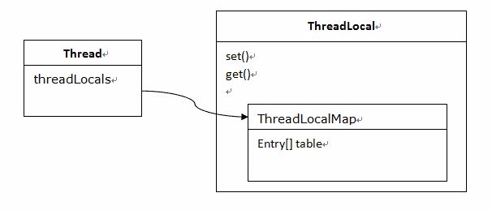

到这里应该大致能够感受到上述三者之间微妙的关系，再看一个复杂点的图：


可以看出每个thread实例都有一个ThreadLocalMap。在上图中的一个Thread的这个ThreadLocalMap中分别存放了3个Entry，默认一个ThreadLocalMap初始化了16个Entry，每一个Entry对象存放的是一个ThreadLocal变量对象。

再简单一点的说就是：一个Thread中只有一个ThreadLocalMap，一个ThreadLocalMap中可以有多个ThreadLocal对象，其中一个ThreadLocal对象对应一个ThreadLocalMap中的一个Entry（也就是说：一个Thread可以依附有多个ThreadLocal对象）。

再看一张网络上的图片，应该可以更好的理解，如下图：


这里的Map其实是ThreadLocalMap。

3、ThreadLocalMap与WeakReference

ThreadLocalMap从字面上就可以看出这是一个保存ThreadLocal对象的map(其实是以它为Key)，不过是经过了两层包装的ThreadLocal对象：

1. 第一层包装是使用 WeakReference<ThreadLocal<?>> 将ThreadLocal对象变成一个弱引用的对象；
2. 第二层包装是定义了一个专门的类 Entry 来扩展 WeakReference<ThreadLocal<?>>：

```
static class ThreadLocalMap {
    //该类继承了WeakReference是方便垃圾回收，在底层map扩容之前进行entry的回收，减     
    //少扩容的概率,提高性能
	static class Entry extends WeakReference<ThreadLocal<?>> {
	    /** The value associated with this ThreadLocal. */
	    Object value;
	
	    Entry(ThreadLocal<?> k, Object v) {
	        super(k);
	        value = v;
	    }
	}
}	
```

类 Entry 很显然是一个保存map键值对的实体，ThreadLocal<?>为key, 要保存的线程局部变量的值为value。super(k)调用的WeakReference的构造函数，表示将ThreadLocal<?>对象转换成弱引用对象，用做key。

4、ThreadLocalMap 的构造函数

```
/**
 * 根据key和value构建ThreadLocaMap
 */
ThreadLocalMap(ThreadLocal<?> firstKey, Object firstValue) {
    table = new Entry[INITIAL_CAPACITY];
    int i = firstKey.threadLocalHashCode & (INITIAL_CAPACITY - 1);
    table[i] = new Entry(firstKey, firstValue);
    size = 1;
    setThreshold(INITIAL_CAPACITY);
}
```

可以看出，ThreadLocalMap这个map的实现是使用一个数组 private Entry[] table 来保存键值对的实体，初始大小为16，ThreadLocalMap自己实现了如何从 key 到 value 的映射：

```
int i = firstKey.threadLocalHashCode & (INITIAL_CAPACITY - 1);
```

使用一个 static 的原子属性``` AtomicInteger nextHashCode```，通过每次增加 ```HASH_INCREMENT = 0x61c88647``` ，然后 ```& (INITIAL_CAPACITY - 1) ```取得在数组 ```private Entry[] table ```中的索引。

```
public class ThreadLocal<T> {
    /**
     * 初始hashcode的值
     */
    private final int threadLocalHashCode = nextHashCode();
    /**
 	  *  哈希增加值
     */
    private static AtomicInteger nextHashCode =
        new AtomicInteger();
    
    private static final int HASH_INCREMENT = 0x61c88647;

    private static int nextHashCode() {
        return nextHashCode.getAndAdd(HASH_INCREMENT);
    }
    //省略其它代码
}
```

总的来说，ThreadLocalMap是一个类似HashMap的集合，只不过自己实现了寻址，也没有HashMap中的put方法，而是set方法等区别。

二、ThreadLocal的set方法

```
public void set(T value) {
    Thread t = Thread.currentThread();
    // Thread类中存在一个ThreadLocalMap的属性，该方法就相当于t.threadLocalMap
    ThreadLocalMap map = getMap(t);
    if (map != null)
        // 代理到内部类ThreadLocalMap
        map.set(this, value);
    else
        //当map为空的时候需要创建一个map
        createMap(t, value);
}

void createMap(Thread t, T firstValue) {
    t.threadLocals = new ThreadLocalMap(this, firstValue);
}
```

由于每个thread实例都有一个ThreadLocalMap，所以在进行set的时候，首先根据Thread.currentThread（）获取当前线程，然后根据当前线程t，调用getMap(t)获取ThreadLocalMap对象， 
如果是第一次设置值，ThreadLocalMap对象是空值，所以会进行初始化操作，即调用createMap(t,value)方法：

```
ThreadLocalMap(ThreadLocal<?> firstKey, Object firstValue) {
    table = new Entry[INITIAL_CAPACITY];
    int i = firstKey.threadLocalHashCode & (INITIAL_CAPACITY - 1);
    table[i] = new Entry(firstKey, firstValue);
    size = 1;
    setThreshold(INITIAL_CAPACITY);
}

/**
 * 阈值是底层数组长度的2/3
 */
private void setThreshold(int len) {
    threshold = len * 2 / 3;
}
```

即是调用上述的构造方法进行构造，这里仅仅是初始化了16个元素的引用数组，并没有初始化16个 Entry 对象。而是一个线程中有多少个线程局部对象要保存，那么就初始化多少个 Entry 对象来保存它们。 
到了这里，我们可以思考一下，为什么要这样实现了。

1、为什么要用 ThreadLocalMap 来保存线程局部对象呢？

原因是一个线程拥有的的局部对象可能有很多，这样实现的话，那么不管你一个线程拥有多少个局部变量，都是使用同一个 ThreadLocalMap 来保存的，ThreadLocalMap 中 private Entry[] table 的初始大小是16。超过容量的2/3时，会扩容。

然后在回到如果map不为空的情况，会调用map.set(this, value);方法，我们看到是以当前 thread 的引用为 key, 获得 ThreadLocalMap ，然后调用 map.set(this, value); 保存进 private Entry[] table :

```
private void set(ThreadLocal<?> key, Object value) {

    Entry[] tab = table;
    int len = tab.length;
    int i = key.threadLocalHashCode & (len-1);
    //循环查找放入的位置
    for (Entry e = tab[i];
         e != null;
         e = tab[i = nextIndex(i, len)]) {
        ThreadLocal<?> k = e.get();
        //存在对应的key就直接替换
        if (k == key) {
            e.value = value;
            return;
        }
        //处理key为null的情况
        if (k == null) {
            replaceStaleEntry(key, value, i);
            return;
        }
    }
    //通过hash算法定位的数组索引位置为null，直接创建一个entry放入即可
    tab[i] = new Entry(key, value);
    int sz = ++size;
    //首先清理槽，底层数组entry的个数还是大于等于3/4*threshold就需要扩容
    if (!cleanSomeSlots(i, sz) && sz >= threshold)
        rehash();
}
```

可以看到，```set(T value)```方法为每个Thread对象都创建了一个ThreadLocalMap，并且将value放入ThreadLocalMap中，ThreadLocalMap作为Thread对象的成员变量保存。那么可以用下图来表示ThreadLocal在存储value时的关系。

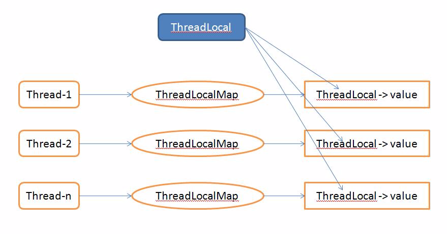

2、了解了set方法的大致原理之后，我们在研究一段程序如下：

```
/**
  * 三个ThreadLocal
  */
private static ThreadLocal<String> threadLocal1 = new ThreadLocal<>();
private static ThreadLocal<String> threadLocal2 = new ThreadLocal<>();
private static ThreadLocal<String> threadLocal3 = new ThreadLocal<>();

//线程池变量指定一个线程
ExecutorService executorService = Executors.newFixedThreadPool(1);

executorService.execute(() -> {
    threadLocal1.set("123");
    threadLocal2.set("234");
    threadLocal3.set("345");
    Thread t = Thread.currentThread();
    System.out.println(Thread.currentThread().getName());
});
```

这样的话就相当于一个线程依附了三个ThreadLocal对象,执行完最后一个set方法之后，调试过程如下：

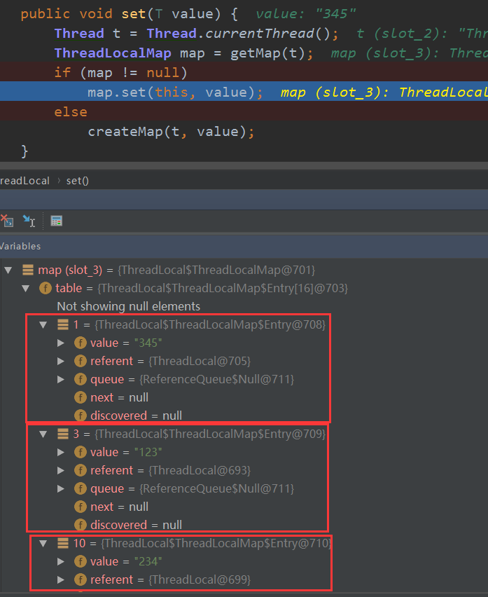

可以看到table（Entry集合）中有三个对象，对象的值就是我们设置的三个threadLocal的对象值；

3、如果在修改一下代码，修改为两个线程：

```
private static final int THREAD_LOOP_SIZE = 2;

private static ThreadLocal<String> threadLocal1 = new ThreadLocal<>();
private static ThreadLocal<String> threadLocal2 = new ThreadLocal<>();
private static ThreadLocal<String> threadLocal3 = new ThreadLocal<>();

ExecutorService executorService = Executors.newFixedThreadPool(THREAD_LOOP_SIZE);

for (int i = 0; i < THREAD_LOOP_SIZE; i++) {
    executorService.execute(() -> {
        threadLocal1.set("123");
        threadLocal2.set("234");
        threadLocal3.set("345");
    });
}
```

这样的话，可以看到运行调试图如下：

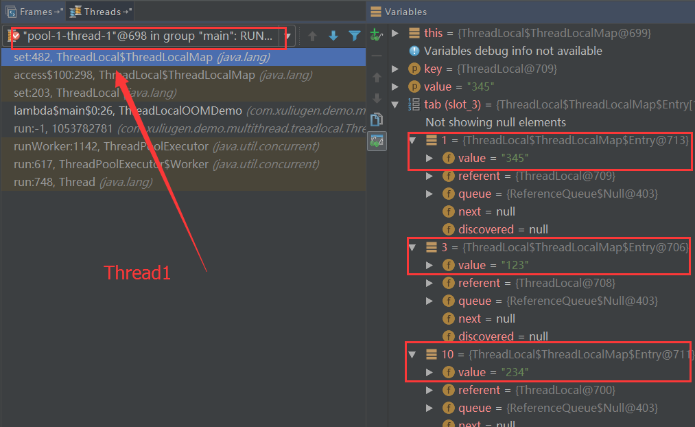

然后更改到Thread2，查看，由于多线程，线程1运行到上图情况，线程2运行到下图情况，也可以看出他们是不同的ThreadLocalMap：

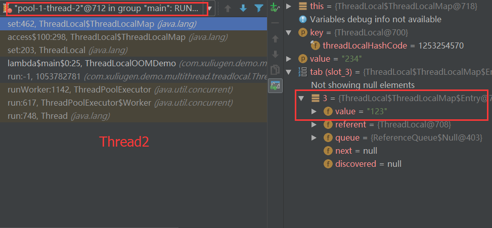

那如果多个线程，只设置一个ThreadLocal变量那，结果可想而知，这里不再赘述！

另外，有一点需要提示一下，代码如下：

```
private static final int THREAD_LOOP_SIZE = 1;
private static final int MOCK_DIB_DATA_LOOP_SIZE = 1000;
private static ThreadLocal<String> threadLocal = new ThreadLocal<>();

ExecutorService executorService = Executors.newFixedThreadPool(THREAD_LOOP_SIZE);

for (int i = 0; i < THREAD_LOOP_SIZE; i++) {
    for (int j = 0; j < MOCK_DIB_DATA_LOOP_SIZE; j++) {
        executorService.execute(() -> threadLocal.set(("123" + j).toString()));
    }
}
```

运行结果：

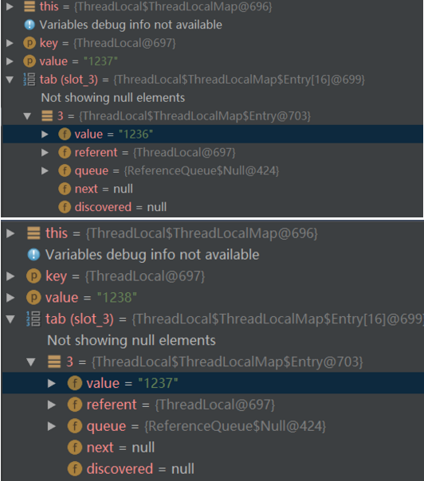

可以看到，在这个线程中的ThreadLocal变量的值始终是只有一个的，即以前的值被覆盖了的！这里是因为Entry对象是以该ThreadLocal变量的引用为key的，所以多次赋值以前的值会被覆盖，特此注意！

到这里应该可以清楚了的了解Thread、ThreadLocal和ThreadLocalMap之间的关系了！

4、碰撞解决与神奇的 0x61c88647

既然ThreadLocal用map就避免不了冲突的产生

4.1 碰撞避免和解决

这里碰撞其实有两种类型

1. 只有一个ThreadLocal实例的时候，当向thread-local变量中设置多个值的时产生的碰撞，碰撞解决是通过开放定址法， 且是线性探测(linear-probe)
2. 多个ThreadLocal实例的时候，最极端的是每个线程都new一个ThreadLocal实例，此时利用特殊的哈希码0x61c88647大大降低碰撞的几率， 同时利用开放定址法处理碰撞

4.2 0x61c88647

* 生成hashcode间隙为这个魔数，可以让生成出来的值或者说ThreadLocal的ID较为均匀地分布在2的幂大小的数组中。 
* 它是在上一个被构造出的ThreadLocal的ID/threadLocalHashCode的基础上加上一个魔数0x61c88647的。
* 斐波那契散列的乘数可以用(long) ((1L << 31) * (Math.sqrt(5) - 1))(代表着2的31次方乘以黄金比率(5的平方根-1))可以得到2654435769，如果把这个转换为带符号的int，则会得到-1640531527。换句话说 
(1L << 32) - (long) ((1L << 31) * (Math.sqrt(5) - 1))得到的结果就是1640531527也就是0x61c88647 
* 通过理论与实践，当我们用0x61c88647作为魔数累加为每个ThreadLocal分配各自的ID也就是threadLocalHashCode再与2的幂取模，得到的结果分布很均匀。
* ThreadLocalMap使用的是线性探测法，均匀分布的好处在于很快就能探测到下一个临近的可用slot，从而保证效率。。为了优化效率。


三、ThreadLocal的get方法

```
public T get() {
    Thread t = Thread.currentThread();
    ThreadLocalMap map = getMap(t);
    if (map != null) {
        ThreadLocalMap.Entry e = map.getEntry(this);
        if (e != null) {
            @SuppressWarnings("unchecked")
            T result = (T)e.value;
            return result;
        }
    }
    //map为空的状况
    return setInitialValue();
}

private Entry getEntry(ThreadLocal<?> key) {
    int i = key.threadLocalHashCode & (table.length - 1);
    Entry e = table[i];
    if (e != null && e.get() == key)
        return e;
    else
        //处理key丢失的情况
        return getEntryAfterMiss(key, i, e);
}

/**
 *  处理key丢失的情况，
 *  总体思想就是通过从当前位置开始循环遍历，将下一个entry的key和当前key进
 *  形比较，如果想等就返回，不想等就找下一个索引，再此期间还需要进行entry的
 *  清理。如果最后没有找到丢失的key就返回null
 */
private Entry getEntryAfterMiss(ThreadLocal<?> key, int i, Entry e) {
    Entry[] tab = table;
    int len = tab.length;

    //循环遍历查找
    while (e != null) {
        ThreadLocal<?> k = e.get();
        if (k == key)
            return e;
        if (k == null)
            //该方法是处理清理ThreadLocalMap的slot
            expungeStaleEntry(i);
        else
            //没找到，下一个位置查找
            i = nextIndex(i, len);
        e = tab[i];
    }
    // 循环一周没找到key，返回null
    return null;
}

//创建一个初始值放入到map中
private T setInitialValue() {
    T value = initialValue();
    Thread t = Thread.currentThread();
    ThreadLocalMap map = getMap(t);
    if (map != null)
        map.set(this, value);
    else
        createMap(t, value);
    return value;
}

//可以自行覆盖该方法
protected T initialValue() {
    return null;
}
```

经过上述set方法的分析，对于get方法应该理解起来轻松了许多，首先获取ThreadLocalMap对象，由于ThreadLocalMap使用的当前的ThreadLocal作为key，所以传入的参数为this，然后调用getEntry（）方法，通过这个key构造索引，根据索引去table（Entry数组）中去查找线程本地变量，根据下边找到Entry对象，然后判断Entry对象e不为空并且e的引用与传入的key一样则直接返回，如果找不到则调用getEntryAfterMiss（）方法。调用getEntryAfterMiss表示直接散列到的位置没找到，那么顺着hash表递增（循环）地往下找，从i开始，一直往下找，直到出现空的槽为止。

```
private Entry getEntryAfterMiss(ThreadLocal<?> key, int i, Entry e) {
    Entry[] tab = table;
    int len = tab.length;

    while (e != null) {
        ThreadLocal<?> k = e.get();
        if (k == key)
            return e;
        if (k == null)
            expungeStaleEntry(i);
        else
            i = nextIndex(i, len);
        e = tab[i];
    }
    return null;
}
```

四、ThreadLocal的内存回收

ThreadLocal 涉及到的两个层面的内存自动回收：

1）在 ThreadLocal 层面的内存回收：

```
/**<p>Each thread holds an implicit reference to its copy of a thread-local
 * variable as long as the thread is alive and the {@code ThreadLocal}
 * instance is accessible; after a thread goes away, all of its copies of
 * thread-local instances are subject to garbage collection (unless other
 * references to these copies exist).
 *
 * @author  Josh Bloch and Doug Lea
 * @since   1.2
 */
public class ThreadLocal<T> {
```

当线程死亡时，那么所有的保存在的线程局部变量就会被回收，其实这里是指线程Thread对象中的 ThreadLocal.ThreadLocalMap threadLocals 会被回收，这是显然的。

2）ThreadLocalMap 层面的内存回收：

```
/**
 * ThreadLocalMap is a customized hash map suitable only for
 * maintaining thread local values. No operations are exported
 * outside of the ThreadLocal class. The class is package private to
 * allow declaration of fields in class Thread.  To help deal with
 * very large and long-lived usages, the hash table entries use
 * WeakReferences for keys. However, since reference queues are not
 * used, stale entries are guaranteed to be removed only when
 * the table starts running out of space.
 */
static class ThreadLocalMap {
```

如果线程可以活很长的时间，并且该线程保存的线程局部变量有很多(也就是 Entry 对象很多)，那么就涉及到在线程的生命期内如何回收 ThreadLocalMap 的内存了，不然的话，Entry对象越多，那么ThreadLocalMap 就会越来越大，占用的内存就会越来越多，所以对于已经不需要了的线程局部变量，就应该清理掉其对应的Entry对象。

使用的方式是，Entry对象的key是WeakReference 的包装，当ThreadLocalMap 的 private Entry[] table，已经被占用达到了三分之二时 threshold = 2/3(也就是线程拥有的局部变量超过了10个) ，就会尝试回收 Entry 对象，我们可以看到 ThreadLocalMap.set（）方法中有下面的代码：

```
if (!cleanSomeSlots(i, sz) && sz >= threshold)
       rehash();
```

cleanSomeSlots 就是进行回收内存：

```
private boolean cleanSomeSlots(int i, int n) {
    boolean removed = false;
    Entry[] tab = table;
    int len = tab.length;
    do {
        i = nextIndex(i, len);
        Entry e = tab[i];
        if (e != null && e.get() == null) {
            n = len;
            removed = true;
            i = expungeStaleEntry(i);
        }
    } while ( (n >>>= 1) != 0);
    return removed;
}
```
五、ThreadLocal可能引起的OOM内存溢出问题简要分析

通过上诉的分析我们明白了ThreadLocal的原理大致如下图所示： 

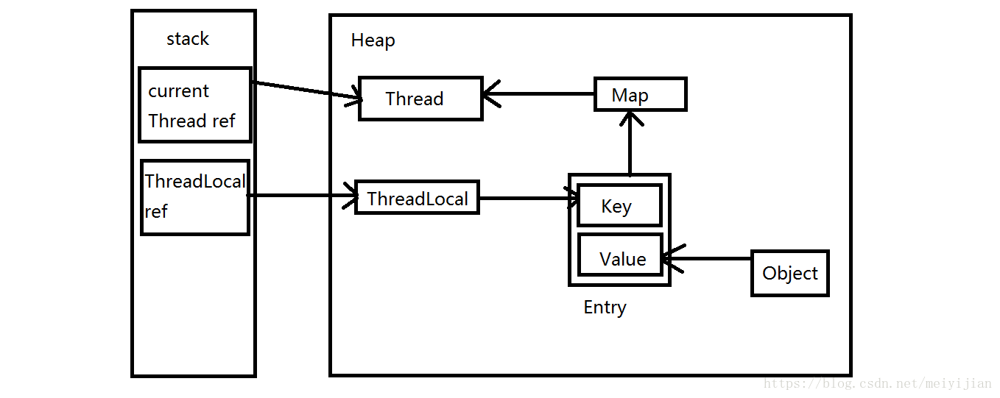

对着原理图来分析一下ThreadLocal内存泄漏产生的原因： 
首先ThreadLocalMap用ThreadLocal对象作为key，而ThreadLocal对象是weakreference对象，那么在下一次GC的时候会回收Map中为null的key对象，而此时存在另外一条强引用链，这一条链就是CurrentThread ref–>ThreadLocalMap–>value，由于这一条强引用链的存在导致value对象无法被回收。我们在上面分析得知set和get方法，会检查key是否为null，并且回收key == null的Entry，但是set和get方法的检查只能减少内存泄漏的概率，而无法确保不发生内存泄漏。

我们知道ThreadLocal变量是维护在Thread内部的，这样的话只要我们的线程不退出，对象的引用就会一直存在。当线程退出时，Thread类会进行一些清理工作，其中就包含ThreadLocalMap，Thread调用exit方法如下：

```
private void exit() {
    if (group != null) {
        group.threadTerminated(this);
        group = null;
    }
    /* Aggressively null out all reference fields: see bug 4006245 */
    target = null;
    /* Speed the release of some of these resources */
    threadLocals = null;
    inheritableThreadLocals = null;
    inheritedAccessControlContext = null;
    blocker = null;
    uncaughtExceptionHandler = null;
}
```

但是，当我们使用线程池的时候，就意味着当前线程未必会退出（比如固定大小的线程池，线程总是存在的）。如果这样的话，将一些很大的对象设置到ThreadLocal中（这个很大的对象实际保存在Thread的threadLocals属性中），这样的话就可能会出现内存溢出的情况。

一种场景就是说如果使用了线程池并且设置了固定的线程，处理一次业务的时候存放到ThreadLocalMap中一个大对象，处理另一个业务的时候，又一个线程存放到ThreadLocalMap中一个大对象，但是这个线程由于是线程池创建的他会一直存在，不会被销毁，这样的话，以前执行业务的时候存放到ThreadLocalMap中的对象可能不会被再次使用，但是由于线程不会被关闭，因此无法释放Thread 中的ThreadLocalMap对象，造成内存溢出。

也就是说，ThreadLocal在没有线程池使用的情况下，正常情况下不会存在内存泄露，但是如果使用了线程池的话，就依赖于线程池的实现，如果线程池不销毁线程的话，那么就会存在内存泄露。所以我们在使用线程池的时候，使用ThreadLocal要格外小心！

所以，ThreadLocal的正确使用习惯是，在不使用该对象之后调用该对象之后调用remove方法。

六、总结

通过源代码可以看到每个线程都可以独立修改属于自己的副本而不会互相影响，从而隔离了线程和线程.避免了线程访问实例变量发生安全问题. 同时我们也能得出下面的结论：

（1）ThreadLocal只是操作Thread中的ThreadLocalMap对象的集合；

（2）ThreadLocalMap变量属于线程的内部属性，不同的线程拥有完全不同的ThreadLocalMap变量；

（3）线程中的ThreadLocalMap变量的值是在ThreadLocal对象进行set或者get操作时创建的；

（4）使用当前线程的ThreadLocalMap的关键在于使用当前的ThreadLocal的实例作为key来存储value值；

（5） ThreadLocal模式至少从两个方面完成了数据访问隔离，即纵向隔离(线程与线程之间的ThreadLocalMap不同)和横向隔离(不同的ThreadLocal实例之间的互相隔离)；

（6）一个线程中的所有的局部变量其实存储在该线程自己的同一个map属性中；

（7）线程死亡时，线程局部变量会自动回收内存；

（8）线程局部变量时通过一个 Entry 保存在map中，该Entry 的key是一个 WeakReference包装的ThreadLocal, value为线程局部变量，key 到 value 的映射是通过：ThreadLocal.threadLocalHashCode & (INITIAL_CAPACITY - 1) 来完成的；

（9）当线程拥有的局部变量超过了容量的2/3(没有扩大容量时是10个)，会涉及到ThreadLocalMap中Entry的回收；

对于多线程资源共享的问题，同步机制采用了“以时间换空间”的方式，而ThreadLocal采用了“以空间换时间”的方式。前者仅提供一份变量，让不同的线程排队访问，而后者为每一个线程都提供了一份变量，因此可以同时访问而互不影响。

## Android View的事件分发机制

一、概要

我们常说的View事件是指： 从手指亲密接触屏幕的那一刻到手指离开屏幕的这个过程，该事件序列以down事件为起点，move事件为过程，up事件为终点。一次down-move-up这一个事件过程我们称为一个事件序列。所以我们今天研究的对象就是MotionEvent。

二、事件分发

1、理论知识

* ```public boolean dispatchTouchEvent(MotionEvent ev)``` 

用来分发事件，即事件序列的大门，如果事件传递到当前View的onTouchEvent或者是子View的dispatchTouchEvent，即该方法被调用了。
return true: 表示消耗了当前事件，有可能是当前View的onTouchEvent或者是子View的dispatchTouchEvent消费了，事件终止，不再传递。
return false: 调用父ViewGroup或者Activity的onTouchEvent。 （不再往下传）。①另外如果不消耗ACTION_DOWN事件，那么down,move,up事件都与该View无关，交由父类处理(父类的onTouchEvent方法)
return super.dispatherTouchEvent: 则继续往下(子View)传递，或者是调用当前View的onTouchEvent方法;

* ```public boolean onInterceptTouchEvent(MotionEvent ev)```

在dispatchTouchEvent内部调用，顾名思义就是判断是否拦截某个事件。(注：ViewGroup才有的方法，View因为没有子View了，所以不需要也没有该方法)
return true: ViewGroup将该事件拦截，交给自己的onTouchEvent处理。②而且这一个事件序列（当前和其它事件）都只能由该ViewGroup处理，并且不会再调用该onInterceptTouchEvent方法去询问是否拦截。
return false: 继续传递给子元素的dispatchTouchEvent处理。
return super.dispatherTouchEvent: 事件默认不会被拦截。

* ```public boolean onTouchEvent(MotionEvent ev)```

在dispatchTouchEvent内部调用
return true: 事件消费，当前事件终止。
return false: 交给父View的onTouchEvent。
return super.dispatherTouchEvent: 默认处理事件的逻辑和返回 false 时相同。

上面的关系可以用以下代码简单描述。

```
public boolean dispatchTouchEvent(MotionEvent ev){
    boolean consume = false;//是否消费事件
    if(onInterceptTouchEvent(ev)){//是否拦截事件
        consume = onTouchEvent(ev);//拦截了，交给自己的View处理
    }else{
        consume = child.dispatchTouchEvent(ev);//不拦截，就交给子View处理
    }

    return consume;//true：消费事件，终止。false:交给父onTouchEvent处理。并不再往下传递当前事件。
}
```

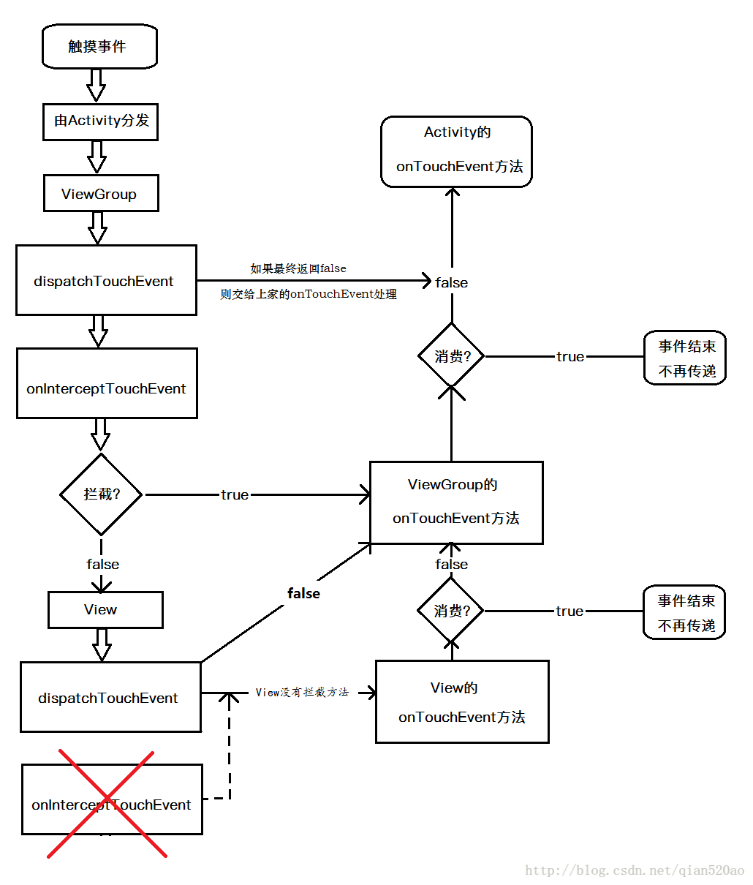

三、源码

1、Activity的事件分发机制

```
public boolean dispatchTouchEvent(MotionEvent ev) {

    // 一般事件列开始都是DOWN事件 = 按下事件，故此处基本是true
    if (ev.getAction() == MotionEvent.ACTION_DOWN) {

        onUserInteraction();
        // ->>分析1

    }

    // ->>分析2
    if (getWindow().superDispatchTouchEvent(ev)) {

        return true;
        // 若getWindow().superDispatchTouchEvent(ev)的返回true
        // 则Activity.dispatchTouchEvent（）就返回true，则方法结束。即 ：该点击事件停止往下传递 & 事件传递过程结束
        // 否则：继续往下调用Activity.onTouchEvent

    }
    // ->>分析4
    return onTouchEvent(ev);
}


 /**
  * 分析1：onUserInteraction()
  * 作用：实现屏保功能
  * 注：
  *    a. 该方法为空方法
  *    b. 当此activity在栈顶时，触屏点击按home，back，menu键等都会触发此方法
  */
  public void onUserInteraction() { 

  }
  // 回到最初的调用原处

 /**
  * 分析2：getWindow().superDispatchTouchEvent(ev)
  * 说明：
  *     a. getWindow() = 获取Window类的对象
  *     b. Window类是抽象类，其唯一实现类 = PhoneWindow类；即此处的Window类对象 = PhoneWindow类对象
  *     c. Window类的superDispatchTouchEvent() = 1个抽象方法，由子类PhoneWindow类实现
  */
    @Override
    public boolean superDispatchTouchEvent(MotionEvent event) {

        return mDecor.superDispatchTouchEvent(event);
        // mDecor = 顶层View（DecorView）的实例对象
        // ->> 分析3
    }

 /**
  * 分析3：mDecor.superDispatchTouchEvent(event)
  * 定义：属于顶层View（DecorView）
  * 说明：
  *     a. DecorView类是PhoneWindow类的一个内部类
  *     b. DecorView继承自FrameLayout，是所有界面的父类
  *     c. FrameLayout是ViewGroup的子类，故DecorView的间接父类 = ViewGroup
  */
    public boolean superDispatchTouchEvent(MotionEvent event) {

        return super.dispatchTouchEvent(event);
        // 调用父类的方法 = ViewGroup的dispatchTouchEvent()
        // 即 将事件传递到ViewGroup去处理，详细请看ViewGroup的事件分发机制

    }
    // 回到最初的调用原处

 /**
  * 分析4：Activity.onTouchEvent（）
  * 定义：属于顶层View（DecorView）
  * 说明：
  *     a. DecorView类是PhoneWindow类的一个内部类
  *     b. DecorView继承自FrameLayout，是所有界面的父类
  *     c. FrameLayout是ViewGroup的子类，故DecorView的间接父类 = ViewGroup
  */
  public boolean onTouchEvent(MotionEvent event) {

        // 当一个点击事件未被Activity下任何一个View接收 / 处理时
        // 应用场景：处理发生在Window边界外的触摸事件
        // ->> 分析5
        if (mWindow.shouldCloseOnTouch(this, event)) {
            finish();
            return true;
        }
        
        return false;
        // 即 只有在点击事件在Window边界外才会返回true，一般情况都返回false，分析完毕
    }

   /**
    * 分析5：mWindow.shouldCloseOnTouch(this, event)
    */
    public boolean shouldCloseOnTouch(Context context, MotionEvent event) {
    // 主要是对于处理边界外点击事件的判断：是否是DOWN事件，event的坐标是否在边界内等
    if (mCloseOnTouchOutside && event.getAction() == MotionEvent.ACTION_DOWN
            && isOutOfBounds(context, event) && peekDecorView() != null) {
        return true;
    }
    return false;
    // 返回true：说明事件在边界外，即 消费事件
    // 返回false：未消费（默认）
}
// 回到分析4调用原处
```

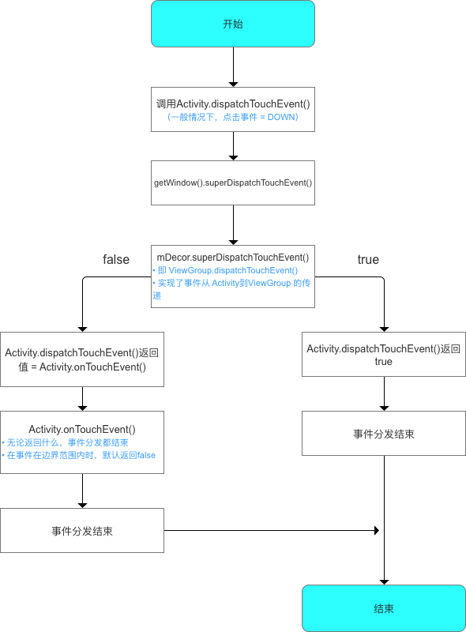

2、ViewGroup事件的分发机制

1.判断要不要分发本次触摸事件

```
if (onFilterTouchEventForSecurity(ev)) {
    // 获取MotionEvent的事件类型
    final int action = ev.getAction();
    // actionMasked能够区分出多点触控事件
    final int actionMasked = action & MotionEvent.ACTION_MASK;
    ...
```

首先通过```onFilterTouchEventForSecurity(ev)```检查要不要分发本次事件，检查通过了才会进行分发，走if中的逻辑。否则就放弃对本次事件的处理。

```
public boolean onFilterTouchEventForSecurity(MotionEvent event) {
    if (// 先检查View有没有设置被遮挡时不处理触摸事件的flag
        (mViewFlags & FILTER_TOUCHES_WHEN_OBSCURED) != 0
            // 再检查受到该事件的窗口是否被其它窗口遮挡
            && (event.getFlags() & MotionEvent.FLAG_WINDOW_IS_OBSCURED) != 0) {
        // Window is obscured, drop this touch.
        return false;
    }
    return true;
}
```

* 第一个条件```FILTER_TOUCHES_WHEN_OBSCURED```可以通过在xml文件中的android:filterTouchesWhenObscured来设置，或者在Java中通过setFilterTouchesWhenObscured()来添加或移除。DecorView默认是没有这个标志位的，而其他View基本上默认都是有的。Android这样设计是为了让我们可以自主的选择要不要过滤不安全事件。如果我们让自己的View不过滤这样的事件，那么在一个事件流进行中，如果突然弹出一个新窗口，我们的View仍然能接收到触摸事件。
* 第二个条件是在本次触摸事件分发到ViewGroup所在窗口时，判断窗口如果处于被其它窗口遮挡的状态的话，就会给这个MotionEvent加上这个标志位。

> 知识点：通过设置或清除```FILTER_TOUCHES_WHEN_OBSCURED```标志位，可以控制在事件流过程中，突然弹出窗口后，后续事件流是否还能继续处理。

接下来是获取当前触摸事件的类型，可以看到这里获取了ACTION_MASK。action的值包括了触摸事件的类型和触摸事件的索引（Android中在一条16位指令的高8位中储存触摸事件的索引，在低8位中储存触摸事件的类型），而actionMask仅仅包括事件类型。对于多点触控，我们需要获取到索引信息才能区分不同的触摸点，进行操作。

2.ACTION_DOWN会重置状态

```
/**由于一些特殊原因丢失ACTION_UP或者ACTION_CANCEL，
 * 导致事件序列结束时mFirstTouchTarget(TouchTarget链表)未被清空，
 * 新事件序列到达时，要先清空mFirstTouchTarget
 */
if (actionMasked == MotionEvent.ACTION_DOWN) {
    // 清理上一次接收触摸事件的View的状态
    cancelAndClearTouchTargets(ev);
    // 重置ViewGroup的触摸相关状态
    resetTouchState();
}
```

这一步会先判断是不是ACTION_DWON事件，如果是的话需要进行一些重置，防止对新的事件流产生影响。下面我们看看上段代码中调用的两个重置方法吧。

```
// 取消并清空所有的的触摸目标
private void cancelAndClearTouchTargets(MotionEvent event) {
    // 如果触摸事件目标队列不为空才执行后面的逻辑
    if (mFirstTouchTarget != null) {
        boolean syntheticEvent = false;
        if (event == null) {
            final long now = SystemClock.uptimeMillis();
            //人为合成一个 ACTION_CANCEL 事件
            event = MotionEvent.obtain(now, now,
                    MotionEvent.ACTION_CANCEL, 0.0f, 0.0f, 0);
            // 设置事件源类型为触摸屏幕
            event.setSource(InputDevice.SOURCE_TOUCHSCREEN);
            // 标记一下，这是一个合成事件
            syntheticEvent = true;
        }
        // TouchTarget是一个链表结构，保存了事件传递的子一系列目标View
        for (TouchTarget target = mFirstTouchTarget; target != null; target = target.next) {
            // 检查View是否设置了暂时不在接收事件的标志位，如果有清除该标志位
            // 这样该View就能够接收下一次事件了。
            resetCancelNextUpFlag(target.child);
            //从cancelAndClearTouchTargets的调用关系,我们可以发现,这里发送出去的事件只可能是两种:
            // 1、处理 DOWN 事件时的DOWN事件
            // 2、当该ViewGroup离开屏幕(Window)时,发送上面人为合成的ACTION_CANCEL 消息。
            // 但因为第二个参数为true,无论是哪种事件,最终都会被转化为取消事件。
            dispatchTransformedTouchEvent(event, true, target.child, target.pointerIdBits);
        }
        // 清空触摸事件目标队列
        clearTouchTargets();
        if (syntheticEvent) {
            // 如果是合成事件，需要回收它
            event.recycle();
        }
    }
}
```

1）遍历触摸目标列表，将链表中的所有子View的 ```CANCEL_NEXT_UP_EVENT``` 标志全部重置
2）将取消事件传递给链表中所有的子View。（这里事件虽未DOWN事件,但dispatchTransformedTouchEvent方法第二个参数为true，最终都会被转化为ACTION_CANCEL事件）
3）清空触摸链表 clearTouchTargets()。

这里先讲一下能够接收触摸事件流的子View怎么被记录的。其实就是使用一个TouchTarget去记录，它是一个单链表结构，并且有复用机制，设计的比较巧妙。下面是TouchTarget中的与我们关连最大的两个成员。

```
// 用来保存能够处理触摸事件的View
public View child;
// 指向下一个TouchTarget
public TouchTarget next;
```

不难看出，每一个能够接收触摸事件流的子View都对应着一个TouchTarget。

mFirstTouchTarget是ViewGroup的成员变量，用来记录当前触摸目标链表的起始对象。

```
private void resetTouchState() {
    // 清空触摸链表
    clearTouchTargets();
    // 重置CANCEL_NEXT_UP_EVENT 标志
    resetCancelNextUpFlag(this);
    //重置 FLAG_DISALLOW_INTERCEPT 标志
    mGroupFlags &= ~FLAG_DISALLOW_INTERCEPT;
}
```

这里代码非常简单，就是清空触摸链表、重置本ViewGroup实例的 ```CANCEL_NEXT_UP_EVENT``` 标志、重置 ```FLAG_DISALLOW_INTERCEPT```标志。和cancelAndClearTouchTargets()方法主要处理触摸链表中的子View不同，该方法主要是针对ViewGroup实例自身的一些处理。

3.检查ViewGroup要不要拦截事件

```
// 这个变量用于检查是否拦截这个TouchEvent
final boolean intercepted;
if (actionMasked == MotionEvent.ACTION_DOWN 
        || mFirstTouchTarget != null) {
        
    // 检查是否不允许拦截事件
    final boolean disallowIntercept = (mGroupFlags & FLAG_DISALLOW_INTERCEPT) != 0;
    if (!disallowIntercept) {
        // 如果没有不允许拦截，就是允许拦截。
        // 调用onInterceptTouchEvent看ViewGroup是否拦截事件
        intercepted = onInterceptTouchEvent(ev);
        // 在这里防止Event中途被篡改
        // 所以要篡改TouchEvent的Action不要在这之前改
        ev.setAction(action); // restore action in case it was changed
    } else {
        // 不允许拦截就直接设置为false
        intercepted = false;
    }
} else {
    // There are no touch targets and this action is not an initial down
    // so this view group continues to intercept touches.
    // 如果没有子View，并且也不是ACTION_DOWN事件，直接设置为拦截
    // 这样后面就自己处理事件
    intercepted = true;
}
```

* 第一个if中的判断限制了，必须是ACTION_DOWN事件，或者mFirstTouchTarget != null才会询问onInterceptTouchEvent()要不要拦截事件，否则ViewGroup就直接拦截了。
* 在第二个if的逻辑中，我们看到它先检查ViewGroup是否有FLAG_DISALLOW_INTERCEPT标志，如果有就直接不进行拦截，如果没有才会询问onInterceptTouchEvent()要不要拦截。这个标志在上一步中也出现了，只不过是清理掉它，所以ACTION_DOWN发生时，ViewGroup肯定是没这个标志的。那什么时候可能会有呢？只有在有子View处理触摸事件流的过程中，有子View调用```requestDisallowInterceptTouchEvent()```，可以给ViewGroup添加这个标志位。

> 知识点：如果子View在ACTION_DWON时处理了事件，那么后面可以通过requestDisallowInterceptTouchEvent(true)来禁止父View拦截后续事件。

一个纵向滑动的RecyclerView嵌套一个横向滑动的RecyclerView时之所以在触发横向滑动后，就再不能触发纵向滑动，就是因为RecyclerView在发生横滑时调用了requestDisallowInterceptTouchEvent(true)禁止父View再拦截事件。

4.初始化用于后续判断的变量

```
// 标识本次事件需不需要取消
final boolean canceled = resetCancelNextUpFlag(this)
        || actionMasked == MotionEvent.ACTION_CANCEL;
// 检查父View是否支持多点触控，即将多个TouchEvent分发给子View，
// 通过setMotionEventSplittingEnabled()可以修改这个值。
// FLAG_SPLIT_MOTION_EVENTS在3.0是默认为true的，即支持多点触控的分发。
final boolean split = (mGroupFlags & FLAG_SPLIT_MOTION_EVENTS) != 0;
TouchTarget newTouchTarget = null;
boolean alreadyDispatchedToNewTouchTarget = false;
```

5.判断是否要给子View分发事件

```
if (!canceled && !intercepted) {
    // 检查TouchEvent是否可以触发View获取焦点，如果可以，查找本View中有没有获得焦点的子View，
    // 有就获取它，没有就为null
    View childWithAccessibilityFocus = ev.isTargetAccessibilityFocus()
            ? findChildWithAccessibilityFocus() : null;
```

从这个if可以看出，只有不需要发送取消事件，并且ViewGroup没有拦截事件时才会进行分发。

上面代码中，还尝试获取了一下ViewGroup中当前获得焦点的View，这个在后面的判断中会用到。

6.判断是不是DOWN事件

```
// 可以执行if里面的情况：
// 1. ACTION_DOWN事件
// 2. 支持多点触控且是ACTION_POINTER_DOWN事件，即新的事件流的DOWN事件
// 3. 需要鼠标等外设支持，暂时无意义
// 就是说同一个事件流，只有Down的时候才会去寻找谁要处理它，
// 如果找到了后面的事件直接让它处理，否则后面的事件会直接让父View处理
if (actionMasked == MotionEvent.ACTION_DOWN
        || (split && actionMasked == MotionEvent.ACTION_POINTER_DOWN)
        || actionMasked == MotionEvent.ACTION_HOVER_MOVE) {
    // 获取当前触摸手指在多点触控中的排序
    // 这个值可能因为有手指发生Down或Up而发生改变
    final int actionIndex = ev.getActionIndex(); // always 0 for down
    // 标识当前是那一个点的触摸事件
    final int idBitsToAssign = split ? 1 <<
            // 此时获取到手指的Id，这个值在Down到Up这个过程中是不会改变的
            ev.getPointerId(actionIndex)
            : TouchTarget.ALL_POINTER_IDS;
    // Clean up earlier touch targets for this pointer id in case they
    // have become out of sync.
    // 清理之前触摸事件中的目标
    removePointersFromTouchTargets(idBitsToAssign);
```

这个if判断当前的触摸事件类型是不是DOWN类型，如果是才会进入if开始真正的遍历给子View分发事件。也就是说，一个事件流只有一开始的DOWN事件才会去遍历分发事件，后面的事件将不再通过遍历分发，而是直接发到触摸目标队列的View中去。

7.初始化子View集合

```
// 子View数量
final int childrenCount = mChildrenCount;
// 第一个点的Down事件newTouchTarget肯定为null，后面的点的Down事件就可能有值了
// 所以只有第一个点的Down事件时走if中逻辑
if (newTouchTarget == null && childrenCount != 0) {
    final float x = ev.getX(actionIndex);
    final float y = ev.getY(actionIndex);
    // Find a child that can receive the event.
    // Scan children from front to back.
    // 将所有子View放到集合中，按照添加顺序排序，但是受到Z轴影响
    // 只有子View数量大于1，并且其中至少有一个子View的Z轴不为0，它才不为null
    // 7.0中，View的elevation默认为0
    final ArrayList<View> preorderedList = buildTouchDispatchChildList();
    // 如果preorderedList为空
    final boolean customOrder = preorderedList == null
      //检查ViewGroup中的子视图是否是按照顺序绘制，其实就是不受z轴影响
            && isChildrenDrawingOrderEnabled();
    final View[] children = mChildren;
```

这一步中，获取了触摸事件的坐标，然后初始化了preorderedList和mChildren两个子View集合。为什么需要两个呢？肯定是有所区别的。先看看preorderedList。

通过buildTouchDispatchChildList()构建出来的子View集合有如下特点：

* 如果ViewGroup的子View数量不多于一个，为null；
* 如果ViewGroup的所有子View的z轴都为0，为null；
* 子View的排序和mChildren一样，是按照View添加顺序从前往后排的，但是还会受到子View z轴的影响。z轴较大的子View会往后排。

mChildren上面说过，就是按照View添加顺序从前往后排的。

所以，这两个子View集合的最大区别就是preorderedList中z轴较大的子View会往后排。

8.开始遍历寻找能够处理事件的子View

```
// 开始遍历子View啦，从后往前遍历
for (int i = childrenCount - 1; i >= 0; i--) {
    // 7.0就是i
    final int childIndex = getAndVerifyPreorderedIndex(
            childrenCount, i, customOrder);
    // 如果preorderedList不为空，从preorderedList中取View
    // 如果preorderedList为空，从mChildren中取View
    final View child = getAndVerifyPreorderedView(
            preorderedList, children, childIndex);
    // 如果当前已经有View获得焦点了，找到它。后面的触摸事件会优先传给它。
    // 应该主要影响后面触摸点的Down事件
    if (childWithAccessibilityFocus != null) {
        if (childWithAccessibilityFocus != child) {
            continue;
        }
        childWithAccessibilityFocus = null;
        // 找到后i设为最后一个View
        i = childrenCount - 1;
    }
```

可以看到，对子View集合的遍历是倒序的。这就是为什么覆盖在上层的View总是能有限获取到事件的原因。

通过getAndVerifyPreorderedView()从preorderedList或者mChildren中取到一个子View。然后如果ViewGroup中有子View获得了焦点，那么就会去找到这个获得焦点的子View。注意，如果找到了会执行i = childrenCount - 1，这意味for中的逻辑执行完就结束了，如果中途有continue的操作，就直接退出循环。

9.检查事件是否在View内

```
// 检查View是否显示或者播放动画以及TouchEvent点是否在View内
// 如果不满足会继续寻找满足的子View
if (!canViewReceivePointerEvents(child)
        || !isTransformedTouchPointInView(x, y, child, null)) {
    ev.setTargetAccessibilityFocus(false);
    continue;
}
```

如果上一步找到了获取焦点的View，并且触摸事件又没在焦点View中，退出循环。

如果没有任何的子View包含触摸点，也退出循环。

如果没有View获得焦点，就直到找到包含触摸点的View才会继续往下执行。

10.进行DOWN事件的分发

```
// 再次重置View
resetCancelNextUpFlag(child);
// 将事件传给子View，看子View有没有消费，消费了执行if中逻辑，并结束循环。
// 就是说该View之后的子View将都不能接收到这个TouchEvent了
if (dispatchTransformedTouchEvent(ev, false, child, idBitsToAssign)) {
    // 记录这次TouchEvent按下的时间
    mLastTouchDownTime = ev.getDownTime();
    if (preorderedList != null) {
        // childIndex points into presorted list, find original index
        for (int j = 0; j < childrenCount; j++) {
            if (children[childIndex] == mChildren[j]) {
                // 记录触摸的View的位置
                // 然后结束本次事件传递
                mLastTouchDownIndex = j;
                break;
            }
        }
    } else {
        // 记录触摸的View的位置
        mLastTouchDownIndex = childIndex;
    }
    mLastTouchDownX = ev.getX();
    mLastTouchDownY = ev.getY();
    // 创建一个TouchTarget
    newTouchTarget = addTouchTarget(child, idBitsToAssign);
    // 标记已经把事件分发给了newTouchTarget，退出子View遍历
    alreadyDispatchedToNewTouchTarget = true;
    break;
}
```

一开始再一次的尝试清除子View的```PFLAG_CANCEL_NEXT_UP_EVENT```标志。然后在给子View分发事件，如果子View处理了，走if中逻辑，如果没处理，继续寻找下一个满足条件的View，然后看它处不处理。

这里插入讲解一下dispatchTransformedTouchEvent()方法。这个方法在第一步的cancelAndClearTouchTargets()方法中也出现过，当时是用它来给子View分发取消事件。下面同样分段来讲解这个方法。

```
private boolean dispatchTransformedTouchEvent(MotionEvent event, boolean cancel,
        View child, int desiredPointerIdBits) {
    final boolean handled;
    // 先记录原本的Action
    final int oldAction = event.getAction();
    if (cancel || oldAction == MotionEvent.ACTION_CANCEL) {
        // 可能过来的事件没有ACTION_CANCEL，如果希望取消的话，那么为事件添加取消标志。
        event.setAction(MotionEvent.ACTION_CANCEL);
        if (child == null) {
            // 如果没有子View了，调用View中的dispatchTouchEvent
            // 进而调用View的onTouch或者onTouchEvent方法，触发ACTION_CANCEL逻辑
            handled = super.dispatchTouchEvent(event);
        } else {
            // 如果有子View，将这个取消事件传递给子View
            handled = child.dispatchTouchEvent(event);
        }
        // 在设置回原本的Action
        // 此时TouchEvent的行为相当于没变
        // 但是却把该ViewGroup的
        event.setAction(oldAction);
        return handled;
    }
    ...
```

这一段代码实现的功能就是：如果需要分发取消事件，那么就会分发取消事件。如果有目标子View则将取消事件分发给目标子View，如果没有就分发给ViewGroup自己，走的是View的dispatchTouchEvent()，和普通View一样。

如果不需要分发取消事件，就走下面一般事件的分发流程。

```
private boolean dispatchTransformedTouchEvent(MotionEvent event, boolean cancel,
        View child, int desiredPointerIdBits) {
    final boolean handled;
    ...
    // 获取触摸事件的触摸点id
    final int oldPointerIdBits = event.getPointerIdBits();
    // 看和期望的触摸点是不是一个
    final int newPointerIdBits = oldPointerIdBits & desiredPointerIdBits;
    if (newPointerIdBits == 0) {
        // 表示不是
        return false;
    }
    final MotionEvent transformedEvent;
    // 如果是同一个触摸点，进入if逻辑
    if (newPointerIdBits == oldPointerIdBits) {
        if (child == null || child.hasIdentityMatrix()) {
            if (child == null) {
                // 如果不给子传事件，自己在onTouch或onTouchEvent中处理
                handled = super.dispatchTouchEvent(event);
            } else {
                final float offsetX = mScrollX - child.mLeft;
                final float offsetY = mScrollY - child.mTop;
                // 根据滚动值计算触摸事件的偏移位置
                event.offsetLocation(offsetX, offsetY);
                // 让子View处理事件
                handled = child.dispatchTouchEvent(event);
                // 恢复TouchEvent坐标到原来位置，避免影响后面的流程
                event.offsetLocation(-offsetX, -offsetY);
            }
            return handled;
        }
        transformedEvent = MotionEvent.obtain(event);
    } else {
        transformedEvent = event.split(newPointerIdBits);
    }
    ...
    if (child == null) {
        handled = super.dispatchTouchEvent(transformedEvent);
    } else {
        final float offsetX = mScrollX - child.mLeft;
        final float offsetY = mScrollY - child.mTop;
        // 根据滚动值计算触摸事件的偏移位置
        transformedEvent.offsetLocation(offsetX, offsetY);
        if (! child.hasIdentityMatrix()) {
            transformedEvent.transform(child.getInverseMatrix());
        }
        // 让子View处理事件
        handled = child.dispatchTouchEvent(transformedEvent);
    }
    // Done.
    transformedEvent.recycle();
    return handled;
}
```

开始先判断所指的是不是同一个触摸点，如果是的话再判断传入的child为不为空，或者传入的child的变换矩阵还是不是单位矩阵。如果满足再看传入的child为不为null，如果为空说明需要让ViewGroup去处理事件，反之将把事件分发给child处理。

如果是把事件分发给child的话，接下来会计算事件的偏移量。因为child在ViewGroup中可能会发生位置变化，需要除去这些移动距离，以保证事件到达child的onTouchEvent()中时，能够正确的表示它在child中的相对坐标。就相当于事件也要跟着child的偏移而偏移。

可以看到，在进行事件传递时，会根据本次触摸事件构建出一个临时事件transformedEvent，然后用临时事件去分发。这样做的目的是为了防止事件传递过程中被更改。

所以，这个方法主要就是用来根据参数把一个事件分发到指定View的。

我们回到dispatchTouchEvent()中继续。如果if中的dispatchTransformedTouchEvent(ev, false, child, idBitsToAssign)返回true，表示子View处理了本事件，那么接着会创建一个TouchTarget，并且关联该子View，后续的触摸事件就会通过这个TouchTarget取出子View，直接把事件分发给它。我们看看这里TouchTarget的创建。

```
private TouchTarget addTouchTarget(@NonNull View child, int pointerIdBits) {
    final TouchTarget target = TouchTarget.obtain(child, pointerIdBits);
    target.next = mFirstTouchTarget;
    mFirstTouchTarget = target;
    return target;
}
```

注意啦，创建之后还给mFirstTouchTarget赋值了，从此，mFirstTouchTarget就不为空了。

最后，在有子View消费本次Down事件后，会执行alreadyDispatchedToNewTouchTarget = true，标记一下已经有子View消费了事件。然后退出循环遍历，其余还没遍历到的子将收不到该触摸事件。

11.处理多点触控

```
// newTouchTarget在不是Down事件，或者没有找到处理事件的View时是null
// mFirstTouchTarget在Down事件时，如果找到了处理的View就不为null
if (newTouchTarget == null && mFirstTouchTarget != null) {
    // 直接让上次处理的View继续处理
    newTouchTarget = mFirstTouchTarget;
    while (newTouchTarget.next != null) {
        newTouchTarget = newTouchTarget.next;
    }
    newTouchTarget.pointerIdBits |= idBitsToAssign;
}
```

if中的代码只有在多点触控中才能执行。

12.处理后续事件

```
if (mFirstTouchTarget == null) {
    // No touch targets so treat this as an ordinary view.
    // 父View自己处理事件
    handled = dispatchTransformedTouchEvent(ev, canceled, null,
            TouchTarget.ALL_POINTER_IDS);
} else {
    TouchTarget predecessor = null;
    TouchTarget target = mFirstTouchTarget;
    while (target != null) {
        final TouchTarget next = target.next;
        // 只有down时，并且有View处理了事件才会走if中逻辑
        if (alreadyDispatchedToNewTouchTarget && target == newTouchTarget) {
            // 表示触摸事件已经被子View处理，并且找到了子View，设置处理标记为true
            handled = true;
        } else {
            // 父View拦截，或者child原本不可接收TouchEvent的状态，为true
            final boolean cancelChild = resetCancelNextUpFlag(target.child)
                    || intercepted;
            // 如果事件被父View拦截了，或者child原本被打上了暂时不可接收TouchEvent的标记PFLAG_CANCEL_NEXT_UP_EVENT
            // 给它发送取消事件
            // 如果父View没有拦截，并且子View原本没有PFLAG_CANCEL_NEXT_UP_EVENT
            // 给它分发事件
            if (dispatchTransformedTouchEvent(ev, cancelChild,
                    target.child, target.pointerIdBits)) {
                handled = true;
            }
            if (cancelChild) {
                if (predecessor == null) {
                    mFirstTouchTarget = next;
                } else {
                    predecessor.next = next;
                }
                target.recycle();
                target = next;
                continue;
            }
        }
        predecessor = target;
        target = next;
    }
}
```


如果Down事件没有子View处理，mFirstTouchTarget肯定会为null，所以在这里把事件分发给ViewGroup的onTouchEvent()自己处理。

如果Down事件有子View处理，那么会通过alreadyDispatchedToNewTouchTarget看是不是接着上面找到处理事件的子View的逻辑，如果是的话直接标记本次Down事件已经被处理。

如果是非Down事件，则通过TouchTarget拿到能够处理事件的View，然后给它分发事件。

上面的代码中，需要注意这里：

```
final boolean cancelChild = resetCancelNextUpFlag(target.child)
        || intercepted;
...
if (cancelChild) {
    if (predecessor == null) {
        mFirstTouchTarget = next;
    } else {
        predecessor.next = next;
    }
    target.recycle();
    target = next;
    continue;
}
```

> 知识点：如果父View中途拦截了子View的触摸事件流，那么事件流中的后续事件将都被父View拦截，并且不能取消拦截。

1. 如果一个View想要处理触摸事件，需要在onTouchEvent()或onTouch()中接收ACTION_DOWN时返回true，通知父View。否则该事件流中的后续事件就不会再往该View中分发了。
2. 如果一个父View拦截了一个事件，那么从这个事件开始之后的事件都不会在分发到子View中，同时父View也不会再询问onInterceptTouchEvent()是否拦截，而是直接拦截事件。并且会给之前处理事件的子View分发一个ACTION_CANCEL事件，让子View停止处理事件。
3. 在父View拦截事件前，可以子View可以通过requestDisallowInterceptTouchEvent()方法给父View添加```FLAG_DISALLOW_INTERCEPT```标志，使父View不能再拦截事件。
4. 通过setFilterTouchesWhenObscured()或者在xml中设置android:filterTouchesWhenObscured来自行决定要不要在窗口被遮挡时继续处理事件。
5. 触摸事件的分发是按View添加的顺序逆序分发的，所以在上层的View总能优先收到事件。如果ViewGruop设置了```FLAG_USE_CHILD_DRAWING_ORDER```标志，即开启按z轴顺序绘制，则z轴值最大的子View将优先收到事件。


3、View事件的分发机制

```
public boolean dispatchTouchEvent(MotionEvent event) {
    ...
    final int actionMasked = event.getActionMasked();
    ...
    if (onFilterTouchEventForSecurity(event)) {
        // 是否是enable可点击的 && 通过鼠标操作滚动条
        if ((mViewFlags & ENABLED_MASK) == ENABLED && handleScrollBarDragging(event)) {
            result = true;
        }
        // 首先会判断当前View有没有设置OnTouchListener，
        // 如果OnTouchListener中的onTouch方法返回true，那么onTouchEvent方法就不会被调用，
        // 可见OnTouchListener的优先级要高于onTouchEvent，这样做的好处是方便在外界处理点击事件。
        ListenerInfo li = mListenerInfo;
        if (li != null && li.mOnTouchListener != null
                && (mViewFlags & ENABLED_MASK) == ENABLED
                && li.mOnTouchListener.onTouch(this, event)) {
            result = true;
        }

        if (!result && onTouchEvent(event)) {
            result = true;
        }
    }
   ...
    return result;
}
```

1.View的onTouchEvent

```
public boolean onTouchEvent(MotionEvent event) {
    final float x = event.getX();
    final float y = event.getY();
    final int viewFlags = mViewFlags;
    final int action = event.getAction();

    final boolean clickable = ((viewFlags & CLICKABLE) == CLICKABLE
            || (viewFlags & LONG_CLICKABLE) == LONG_CLICKABLE)
            || (viewFlags & CONTEXT_CLICKABLE) == CONTEXT_CLICKABLE;
    /**
     *讲解一
     */
    //首先判断当前View是不是DISABLED不可用状态
    if ((viewFlags & ENABLED_MASK) == DISABLED) {
        if (action == MotionEvent.ACTION_UP && (mPrivateFlags & PFLAG_PRESSED) != 0) {
            setPressed(false);
        }
        mPrivateFlags3 &= ~PFLAG3_FINGER_DOWN;
        //可点击的禁用视图仍然会消耗触摸事件，只是没有响应
        //如果不可用 同时当前控件的clickable与long_clickable
        //与CONTEXT_CLICKABLE全是false
        //那么才返回false
        return clickable;
    }
    //如果View有代理会执行这个方法
    if (mTouchDelegate != null) {
        if (mTouchDelegate.onTouchEvent(event)) {
            return true;
        }
    }
    
   /**
    *讲解二
    */
    //只要控件的clickable与long_clickable
    //与CONTEXT_CLICKABLE 有一个为true 
    // 或者此View可以在悬停或长按时显示工具提示，就进入
    if (clickable || (viewFlags & TOOLTIP) == TOOLTIP) {
        switch (action) {
            case MotionEvent.ACTION_UP:
                   ...
                    if (!mHasPerformedLongPress && !mIgnoreNextUpEvent) {
                        //移除长按监测
                        removeLongPressCallback();

                        // Only perform take click actions if we were in the pressed state
                        if (!focusTaken) {
                            // 当up事件发生时，会触发performClick方法
                            if (mPerformClick == null) {
                                mPerformClick = new PerformClick();
                            }
                            /**
                             *讲解三
                             */
                            // 如果View设置OnClickListener，那么performClick就会调用View的onClick方法
                            //发送到message到MessageQueue中，如果主线程还在运行中，就会返回true;
                            if (!post(mPerformClick)) {
                                performClickInternal();
                            }
                        }
                    }

                    ....
                break;

            case MotionEvent.ACTION_DOWN:
                ...
                //检查是否长按；最后会调用performLongClick()方法
                if (!clickable) {
                    checkForLongClick(0, x, y);
                    break;
                }
                
                ...
                break;

            case MotionEvent.ACTION_CANCEL:
                //取消相关Callback，修改状态值；
                if (clickable) {
                    setPressed(false);
                }
                removeTapCallback();
                removeLongPressCallback();
                mInContextButtonPress = false;
                mHasPerformedLongPress = false;
                mIgnoreNextUpEvent = false;
                mPrivateFlags3 &= ~PFLAG3_FINGER_DOWN;
                break;

            case MotionEvent.ACTION_MOVE:
                if (clickable) {
                    drawableHotspotChanged(x, y);
                }

                 //不在按钮内滑动，取消相关Callback
                if (!pointInView(x, y, mTouchSlop)) {
                    // Outside button
                    // Remove any future long press/tap checks
                    removeTapCallback();
                    removeLongPressCallback();
                    if ((mPrivateFlags & PFLAG_PRESSED) != 0) {
                        setPressed(false);
                    }
                    mPrivateFlags3 &= ~PFLAG3_FINGER_DOWN;
                }
                break;
        }
        /**
         *讲解四
         */
        return true;
    }

    return false;
}
```

PerformClick类

```
private final class PerformClick implements Runnable {
    @Override
    public void run() {
        performClickInternal();
    }
}

private boolean performClickInternal() {
    // Must notify autofill manager before performing the click actions to avoid scenarios where
    // the app has a click listener that changes the state of views the autofill service might
    // be interested on.
    notifyAutofillManagerOnClick();

    return performClick();
}

public boolean performClick() {
    
    notifyAutofillManagerOnClick();

    final boolean result;
    final ListenerInfo li = mListenerInfo;
    if (li != null && li.mOnClickListener != null) {
        playSoundEffect(SoundEffectConstants.CLICK);
        //调用onClick()方法；
        li.mOnClickListener.onClick(this);
        result = true;
    } else {
        result = false;
    }

    sendAccessibilityEvent(AccessibilityEvent.TYPE_VIEW_CLICKED);

    notifyEnterOrExitForAutoFillIfNeeded(true);

    return result;
}
```

```
private void checkForLongClick(int delayOffset, float x, float y) {
    if ((mViewFlags & LONG_CLICKABLE) == LONG_CLICKABLE || (mViewFlags & TOOLTIP) == TOOLTIP) {
        mHasPerformedLongPress = false;

        if (mPendingCheckForLongPress == null) {
            mPendingCheckForLongPress = new CheckForLongPress();
        }
        mPendingCheckForLongPress.setAnchor(x, y);
        mPendingCheckForLongPress.rememberWindowAttachCount();
        mPendingCheckForLongPress.rememberPressedState();
        //ViewConfiguration.getLongPressTimeout()时间为500ms，所以当用户按下去500ms之后就会回OnLongClickListener.onLongClick方法；
        //如果500ms之内手指弹起，会发生ACTION_UP事件，此时会移出长按监测，这样就不会发生长按事件
        postDelayed(mPendingCheckForLongPress,
                ViewConfiguration.getLongPressTimeout() - delayOffset);
    }
}
```

通过以上代码可以看出：

* 当发生ACTION_DOWN的时候，开始长按监测，如果用户手指按下时间超过500ms才会发生长按事件，少于500ms就是onClick事件；可以得知，是否是长按事件是在Java层进行判断的，并且和ACTION_MOVE事件没有关系。
* onLongClick方法返回true之后会将mHasPerformedLongPress属性置为true，在Up的时候就不会执行onClick，如果onlongClick返回false在Up事件到来时就会执行onClick
* onClick是否会发生的前提是当前View是可点击的，并且它收到了Down和Up事件，
* 只要View的CLICKABLE和LONG_CLICKABLE有一个为TRUE，那么该View就会消耗掉该事件，可以看出以上无论是Down、Move还是Up事件，最终都return true；

* 讲解一

由代码可知即使控件是DISABLED状态，只要clickable与longclickable有一个返回true那么此方法就返回true，即事件被消费。但是不会执行onClick()方法。这点通过代码很容易理解。

* 讲解二

讲解二中只要有一个条件满足。就会进入switch语句。当接收到MotionEvent.ACTION_UP时(前提MotionEvent.ACTION_DOWN也接收到了)会经过判断最后执行 performClick();方法。

* 讲解三

performClick()方法内部会执行我们设置的监听，即onClick()方法。

* 讲解四

由代码可知只要讲解二中的if语句成立，不管进入switch中的任何ACTION或是都不进入，返回值都是true，即事件消费了。同时讲解四也证明默认情况下是返回true

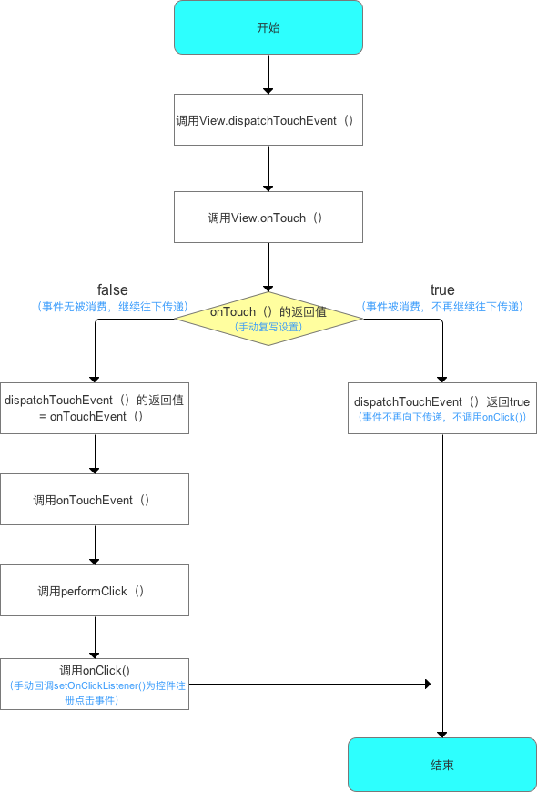

总结：

1. 整个View的事件分发流程：

View.dispatchEvent->View.setOnTouchListener->View.onTouchEvent
在dispatchTouchEvent中会进行OnTouchListener的判断，如果OnTouchListener不为null且返回true，则表示事件被消费，onTouchEvent不会被执行；否则执行onTouchEvent。

2. onTouchEvent中的DOWN,MOVE,UP

* DOWN时：

a、首先设置标志为```PREPRESSED```，设置mHasPerformedLongPress=false ;然后发出一个115ms后的mPendingCheckForTap；
b、如果115ms内没有触发UP，则将标志置为PRESSED，清除```PREPRESSED```标志，同时发出一个延时为500-115ms的，检测长按任务消息；
c、如果500ms内（从DOWN触发开始算），则会触发LongClickListener:

此时如果LongClickListener不为null，则会执行回调，同时如果LongClickListener.onClick返回true，才把mHasPerformedLongPress设置为true;否则mHasPerformedLongPress依然为false;

* MOVE时：

主要就是检测用户是否划出控件，如果划出了：

115ms内，直接移除mPendingCheckForTap；
115ms后，则将标志中的PRESSED去除，同时移除长按的检查：removeLongPressCallback();

* UP时：

a、如果115ms内，触发UP，此时标志为PREPRESSED，则执行UnsetPressedState，setPressed(false);会把setPress转发下去，可以在View中复写dispatchSetPressed方法接收；
b、如果是115ms-500ms间，即长按还未发生，则首先移除长按检测，执行onClick回调；
c、如果是500ms以后，那么有两种情况：
i.设置了onLongClickListener，且onLongClickListener.onClick返回true，则点击事件OnClick事件无法触发；
ii.没有设置onLongClickListener或者onLongClickListener.onClick返回false，则点击事件OnClick事件依然可以触发；
d、最后执行setPressed刷新背景，然后将PRESSED标识去除；

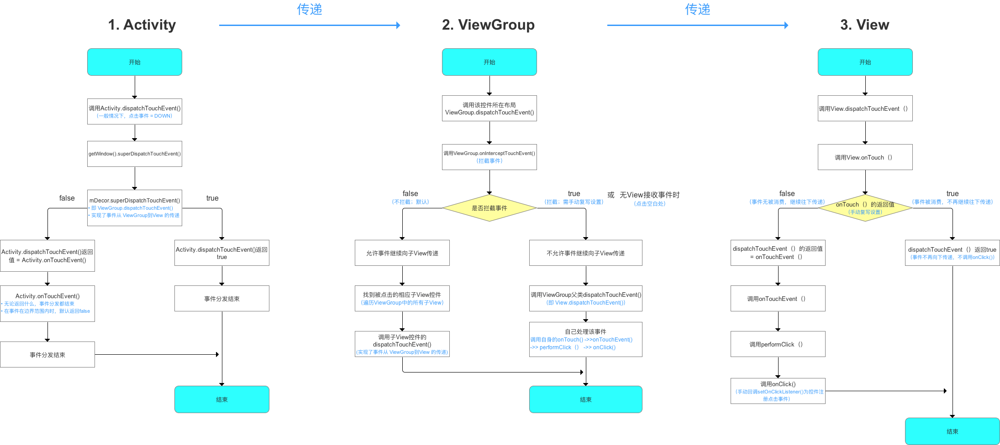

## 滑动冲突

一、概述

滑动冲突的基本形式分为两种，其他复杂的滑动冲突都可以拆成这两种基本形式：

1. 外部滑动方向与内部方向不一致。
2. 外部方向与内部方向一致。

先来看第一种，比如你用ViewPaper和Fragment搭配，而Fragment里往往是一个竖直滑动的ListView,这种情况是就会产生滑动冲突,但是由于ViewPaper本身已经处理好了滑动冲突，所以我们无需考虑，不过若是换成ScrollView，我们就得自己处理滑动冲突了。图示如下：


再看看第二种，这种情况下，因为内部和外部滑动方向一致，系统会分不清你要滑动哪个部分，所以会要么只有一层能滑动，要么两层一起滑动得很卡顿。图示如下:

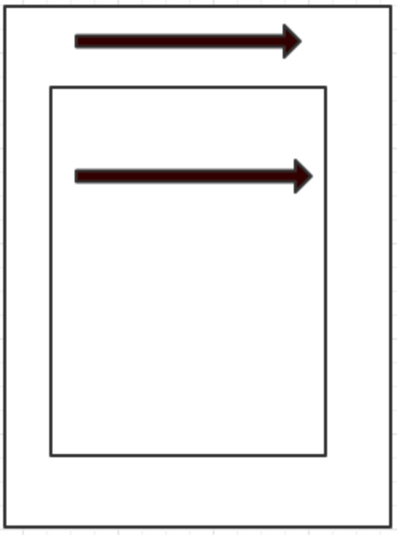

对于这两种情况，我们处理的方法也很简单，并且都有相应的套路。

* 第一种：第一种的冲突主要是一个横向一个竖向的，所以我们只要判断滑动方向是竖向还是横向的，再让对应的View滑动即可。判断的方法有很多，比如竖直距离与横向距离的大小比较；滑动路径与水平形成的夹角等等。
* 第二种：对于这种情况，比较特殊，我们没有通用的规则，得根据业务逻辑来得出相应的处理规则。举个最常见的例子，ListView下拉刷新，需要ListView自身滑动，但是当滑动到头部时需要ListView和Header一起滑动，也就是整个父容器的滑动。如果不处理好滑动冲突，就会出现各种意想不到情况。

二、滑动冲突的处理方法

滑动冲突的拦截方法有两种：
一种是让事件都经过父容器的拦截处理，如果父容器需要则拦截，如果不需要则不拦截，称为外部拦截法，其伪代码如下:

```
public boolean onInterceptTouchEvent(MotionEvent event) {
    boolean intercepted = false;
    int x = (int)event.getX();
    int y = (int)event.getY();
    switch (event.getAction()) {
        case MotionEvent.ACTION_DOWN: {
            intercepted = false;
           break;
       }
       case MotionEvent.ACTION_MOVE: {
           if (满足父容器的拦截要求) {
                intercepted = true;
           } else {
                intercepted = false;
           }
           break;
       }
       case MotionEvent.ACTION_UP: {
           intercepted = false;
           break;
       }
       default:
           break;
       }
            mLastXIntercept = x;
            mLastYIntercept = y;
            return intercepted;
}
```

* 首先down事件父容器必须返回false ，因为若是返回true，也就是拦截了down事件，那么后续的move和up事件就都会传递给父容器，子元素就没有机会处理事件了。
* 其次是up事件也返回了false，一是因为up事件对父容器没什么意义，其次是因为若事件是子元素处理的，却没有收到up事件会让子元素的onClick事件无法触发。

另一种是父容器不拦截任何事件，将所有事件传递给子元素，如果子元素需要则消耗掉，如果不需要则通过requestDisallowInterceptTouchEvent方法交给父容器处理，称为内部拦截法，使用起来稍显麻烦。伪代码如下：
首先我们需要重写子元素的dispatchTouchEvent方法：

```
@Override
 public boolean dispatchTouchEvent(MotionEvent event) {
     int x = (int) event.getX();
     int y = (int) event.getY();

     switch (event.getAction()) {
     case MotionEvent.ACTION_DOWN: {
         parent.requestDisallowInterceptTouchEvent(true);
         break;
     }
     case MotionEvent.ACTION_MOVE: {
         int deltaX = x - mLastX;
         int deltaY = y - mLastY;
         if (父容器需要此类点击事件) {
             parent.requestDisallowInterceptTouchEvent(false);
         }
         break;
     }
     case MotionEvent.ACTION_UP: {
         break;
     }
     default:
         break;
     }

     mLastX = x;
     mLastY = y;
     return super.dispatchTouchEvent(event);
 } 
```

然后修改父容器的onInterceptTouchEvent方法：

```
@Override
 public boolean onInterceptTouchEvent(MotionEvent event) {

     int action = event.getAction();
     if (action == MotionEvent.ACTION_DOWN) {
         return false;
     } else {
         return true;
     }
 } 
```

这里父容器也不能拦截down事件。

看代码看不出所以然，我们通过实例来看看滑动冲突是怎么样的。我们先模拟第一种场景，内外滑动方向不一致，我们先自定义一个父控件，让其可以左右滑动，类似于ViewPaper：

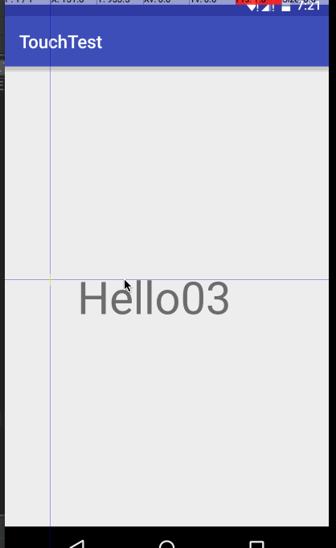

然后将里面换成三个ListView:

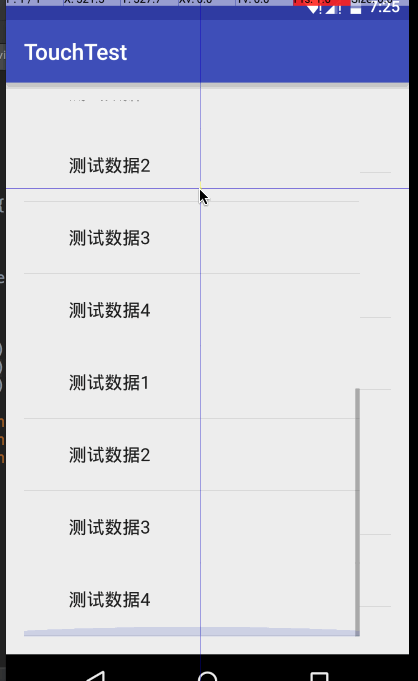

可以看到左右滑动失效了，说明确实冲突了。那么我们就来解决一下，首先我们要明白滑动规则是什么，这个例子中如果我们竖直滑动就让ListView消耗事件，水平滑动就让我们自定义的父容器滑动。知道了这个我们只需要将其替换到之前伪代码里的拦截条件里即可。

* 先用外部拦截法：

```
@Override
    public boolean onInterceptTouchEvent(MotionEvent event) {
    boolean intercepted = false;
    int x = (int) event.getX();
    int y = (int) event.getY();

    switch (event.getAction()) {
        case MotionEvent.ACTION_DOWN: {
            Log.d(TAG, "onInterceptTouchEvent: ACTION_DOWN");
            intercepted = false;
            break;
        }
        case MotionEvent.ACTION_MOVE: {
            Log.d(TAG, "onInterceptTouchEvent: ACTION_MOVE");
            int deltaX = x - mLastXIntercept;
            int deltaY = y - mLastYIntercept;
            if (Math.abs(deltaX) > Math.abs(deltaY)) {
                intercepted = true;
            } else {
                intercepted = false;
            }
            break;
        }
        case MotionEvent.ACTION_UP: {
            intercepted = false;
            break;
        }
        default:
            break;
    }

    Log.d(TAG, "intercepted=" + intercepted);
    mLastX = x;
    mLastY = y;
    mLastXIntercept = x;
    mLastYIntercept = y;

    return intercepted;
}  
```

这里我们判断横向滑动的距离与竖直滑动距离的长短。若是竖直滑动的长，则判断为竖直滑动，那么就是ListView的滑动，就将intercepted置为false，让父容器不拦截，交由子元素ListView处理。若是横向，则intercepted置为true，交由父容器处理。

效果如下：

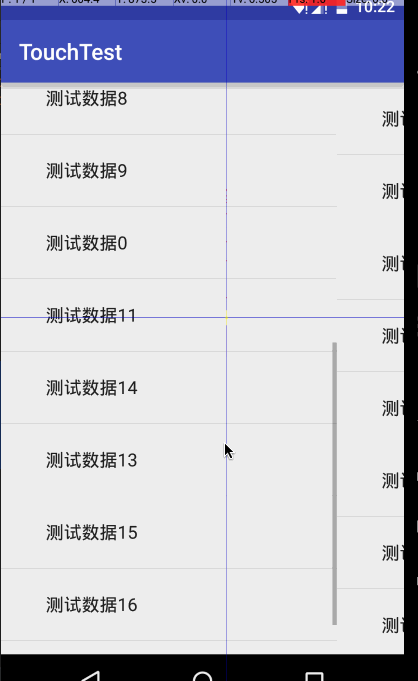

* 内部拦截法：

先自定义一个MyListView继承ListView，重写其dispatchTouchEvent方法：

```
@Override
 public boolean dispatchTouchEvent(MotionEvent event) {
     int x = (int) event.getX();
     int y = (int) event.getY();

     switch (event.getAction()) {
     case MotionEvent.ACTION_DOWN: {
         mHorizontalScrollViewEx.requestDisallowInterceptTouchEvent(true);
         break;
     }
     case MotionEvent.ACTION_MOVE: {
         int deltaX = x - mLastX;
         int deltaY = y - mLastY;
         Log.d(TAG, "dx:" + deltaX + " dy:" + deltaY);
         if (Math.abs(deltaX) > Math.abs(deltaY)) {
             mHorizontalScrollViewEx.requestDisallowInterceptTouchEvent(false);
         }
         break;
     }
     case MotionEvent.ACTION_UP: {
         break;
     }
     default:
         break;
     }

     mLastX = x;
     mLastY = y;
     return super.dispatchTouchEvent(event);
 } 
```

再重写外部父容器的oninterceptTouchEvent方法:

```
@Override
  public boolean onInterceptTouchEvent(MotionEvent event) {
      int x = (int) event.getX();
      int y = (int) event.getY();
      int action = event.getAction();
      if (action == MotionEvent.ACTION_DOWN) {
          mLastX = x;
          mLastY = y;
          return false;
      } else {
          return true;
      }
  }  
```

接下来看看同方向的滑动冲突,这里我们用一个竖直的ScrollView嵌套一个ListView做例子。首先看看没有解决滑动冲突的时候是咋样的：

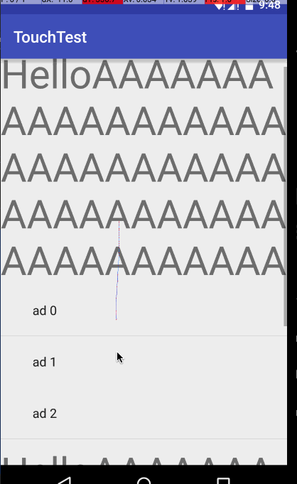

我们看到只要ScrollView可以滑动，内部的ListView是不能滑动的。那我们现在来解决这个问题，同向滑动冲突和与不同向滑动冲突不一样，得根据实际的需求来确定拦截的规则。

* 这里我们的需求是当ListView滑到顶部了，并且继续向下滑就让ScrollView拦截掉；
* 当ListView滑到底部了，并且继续向下滑，就让ScrollView拦截掉，其余时候都交给ListView自身处理事件。

首先用外部拦截法，我们需要重写ScrollView的onInterceptTouchEvent方法，代码如下:

```
@Override
public boolean onInterceptTouchEvent(MotionEvent event) {
    boolean intercepted = false;
    int y = (int) event.getY();

    switch (event.getAction()) {

        case MotionEvent.ACTION_DOWN: {
            nowY = y;
            intercepted = super.onInterceptTouchEvent(event);
            break;
        }
        case MotionEvent.ACTION_MOVE: {
            if(mListView.getFirstVisiblePosition()==0
                    && y>nowY){
                intercepted = true;
                break;
            }
            else if(mListView.getLastVisiblePosition()==mListView.getCount()-1
                    && y<nowY){
                intercepted = true;
                break;
            }
            intercepted = false;
            break;
        }
        case MotionEvent.ACTION_UP: {
            intercepted = false;
            break;
        }
        default:
            break;
    }

    return intercepted;
} 
```

这里我们看到Down事件里我们并没有返回false而是返回了super.onInterceptTouchEvent(event),这是因为ScrollView在Down方法时需要初始化一些参数如果我们直接返回false,会导致滑动出现问题。并且前面说过ViewGroup的onInterceptTouchEvent方法是默认返回false的，所以我们这里直接返回super方法即可。
处理了滑动冲突后效果如下：


接下来看看内部拦截法：

先重写ScrollView的onInterceptTouchEvent方法，让其拦截除了Down事件以外的其他方法：

```
@Override
public boolean onInterceptTouchEvent(MotionEvent event) {
    int x = (int) event.getX();
    int y = (int) event.getY();
    int action = event.getAction();
    if (action == MotionEvent.ACTION_DOWN) {
        mLastX = x;
        mLastY = y;
        return super.onInterceptTouchEvent(event);
    } else {
        return true;
    }
}
```

在重写ListView的dispatchTouchEvent方法，规则已经说明过了：

```
@Override
public boolean dispatchTouchEvent(MotionEvent event) {
    int y = (int) event.getY();

    switch (event.getAction()) {
        case MotionEvent.ACTION_DOWN: {
            nowY = y;
            mHorizontalScrollViewEx2.requestDisallowInterceptTouchEvent(true);
            break;
        }
        case MotionEvent.ACTION_MOVE: {
            if(this.getFirstVisiblePosition()==0
                    && y>nowY){
                mHorizontalScrollViewEx2.requestDisallowInterceptTouchEvent(false);
                break;
            }
            else if(this.getLastVisiblePosition()==this.getCount()-1
                    && y<nowY){
                mHorizontalScrollViewEx2.requestDisallowInterceptTouchEvent(false);
                break;
            }
            mHorizontalScrollViewEx2.requestDisallowInterceptTouchEvent(true);
            break;
        }
        case MotionEvent.ACTION_UP: {
            break;
        }
        default:
            break;
    }
    
    return super.dispatchTouchEvent(event);
}
```

## Android View 绘制流程 & 自定义View

一、ViewRoot和DecorView

1、ViewRoot对应于ViewRootImp类，它是连接WindowManager和DecorView的纽带，View的三大流程均是通过ViewRoot来完成的。在ActivityThread中，当Activity对象被创建完毕后，会将DecorView添加到Window中，同时会创建ViewRootImp对象，并将ViewRootImp对象和DecorView建立关联，这个过程如下：


2、View的绘制流程:

从ViewRoot的performTraversals方法开始

1. measure:用来测量View的宽高
2. layout:来确定View在父容器的放置位置
3. draw:负责将View绘制在屏幕上。

3、performTraversals的绘制流程如图：

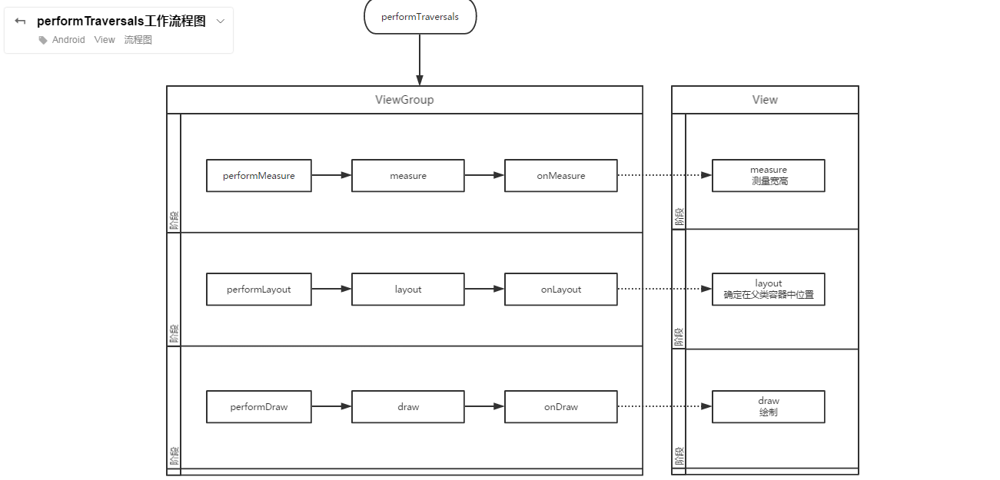

1. performTraversals会依次调用performMeasure、performLayout、performDraw，这三个方法，这三个方法分别完成顶级View的measure、、layout、draw这三个流程
2. 其中在performMeasure会调用View#measure方法，在View#measure方法中又会调用View#onMeasure方法，在onMeasure方法中则会对所有的子元素进行measure过程，这个时候measure流程就从父容器传递到子元素中了，这样就完成了一次measure过程。接着子元素会重复父容器的measure过程，如此反复就完成了整个View树的遍历。
3. 同理performLayout和performDraw的传递流程和performMeasure是类似的，唯一不同的是，performDraw的传递过程是在draw方法中通过dispatch来实现的。

注意：

* measure的过程决定了View的宽高，Measure完成以后，可以通过getMeasuredWidth和getMeasuredHeight方法来获取到View测量后的宽高，在几乎所有的情况下他都等同于View最终的宽高，但是特殊情况除外。
* Layout过程决定了View的四个顶点的坐标和实际View的宽高，完成以后，可以通过getTop、getBottom、getLeft、getRight来拿到View的四个顶点的位置，并可以通过getWith和getHeight方法拿到View的最终宽高。
* Draw过程决定了View的显示，只有draw方法完成以后View的内容才能呈现在屏幕上。

4、顶级View：DecorView


DecorView作为顶级View，其实是一个的FrameLayout ，它包含一个竖直方向的LinearLayout，这个 LinearLayout分为标题栏和内容栏两个部分。在Activity通过setContextView所设置的布局文件其实就是被加载到内容栏之中的。这个内容栏的id 是 R.android.id.content ，通过 ViewGroup content = findViewById(R.android.id.content); 可以得到这个contentView，通过content.getChildAt(0)可以得到我们自己设置的View。View层的事件都是先经 过DecorView，然后才传递到子View。

二、理解MeasureSpec

测量过程中，系统将View的 LayoutParams 根据父容器所施加的规则转换成对应的 MeasureSpec，然后根据这个MeasureSpec来测量出View的宽高。这里宽高是测量宽高，不一定等于View最终的宽高。

1、MeasureSpec

1.MeasureSpec代表一个32位int值，高2位代表SpecMode（测量模式），低30位代表 SpecSize（在某个测量模式下的规格大小）

```
private static final int MODE_SHIFT = 30;
private static final int MODE_MASK  = 0x3 << MODE_SHIFT;
public static final int UNSPECIFIED = 0 << MODE_SHIFT;
public static final int EXACTLY     = 1 << MODE_SHIFT;
public static final int AT_MOST     = 2 << MODE_SHIFT;
...
public static int makeMeasureSpec(int size,int mode) {
    if (sUseBrokenMakeMeasureSpec) {
        return size + mode;
    } else {
        return (size & ~MODE_MASK) | (mode & MODE_MASK);
    }
}
...
public static int getMode(int measureSpec) {
    //noinspection ResourceType
    return (measureSpec & MODE_MASK);
}
      
public static int getSize(int measureSpec) {
    return (measureSpec & ~MODE_MASK);
}        
```

2.SpecMode有三种：

1. UNSPECIFIED ：父容器对View不进行任何限制，要多大给多大，一般用于系统内部，表示一种测量状态
2. EXACTLY：父容器检测到View所需要的精确大小，这时候View的最终大小就是SpecSize所指定的值，对应LayoutParams中的match_parent和具体数值这两种模式
3. ```AT_MOST``` ：对应View的默认⼤大⼩小，不不同View实现不不同，View的⼤大⼩小不不能⼤大于⽗父容 器器 的SpecSize，对应 LayoutParams 中的 wrap_content

3.MeasureSpec和LayoutParams的对应关系

View测量的时候，系统会将LayoutParams在父容器的约束下转换成对应的MeasureSpec，然后再根据这个MeasureSpec来确定View测量后的宽高。

View的MeasureSpec由父容器的MeasureSpec和自身的LayoutParams共同决定。

顶级View（DecorView）和普通View的MeasureSpec转换略不同。

* DecorView：MeasureSpec由窗口尺寸和自身的LayoutParams共同确定。
* 普通View：MeasureSpec由父容器的MeasureSpec和自身LayoutParams共同确定。

MeasureSpec一旦确定，onMeasure中就可以确定View的测量宽高

DecorView在ViewRootImpl中measureHierarchy方法中展示了DecorView的MeasureSpec创建过程，其中desiredWindowWidth和desiredWindowHeight是屏幕尺寸：

```
childWidthMeasureSpec = getRootMeasureSpec(desiredWindowWidth, lp.width);
childHeightMeasureSpec = getRootMeasureSpec(desiredWindowHeight, lp.height);

private static int getRootMeasureSpec(int windowSize, int rootDimension) {
    int measureSpec;
    switch (rootDimension) {

    case ViewGroup.LayoutParams.MATCH_PARENT:
        // Window can't resize. Force root view to be windowSize.
        measureSpec = MeasureSpec.makeMeasureSpec(windowSize, MeasureSpec.EXACTLY);
        break;
    case ViewGroup.LayoutParams.WRAP_CONTENT:
        // Window can resize. Set max size for root view.
        measureSpec = MeasureSpec.makeMeasureSpec(windowSize, MeasureSpec.AT_MOST);
        break;
    default:
        // Window wants to be an exact size. Force root view to be that size.
        measureSpec = MeasureSpec.makeMeasureSpec(rootDimension, MeasureSpec.EXACTLY);
        break;
    }
    return measureSpec;
}
```
通过上述代码:DecorView的MeasureSpec产生过程遵循如下规则，根据它的LayoutParams中的宽高来划分。

* LayoutParams.MATCH_PARENT：精确模式，大小就是窗口大小
* LayoutParams.WRAP_CONTENT：最大模式，大小不定，但是不能超过窗口大小
* 固定大小：精确模式，大小为LayoutParams中指定的大小

普通View(我们布局中的View)，View的measure过程由ViewGroup传递

* ViewGroup的measureChildWithMargins

```
protected void measureChildWithMargins(View child,
            int parentWidthMeasureSpec, int widthUsed,
            int parentHeightMeasureSpec, int heightUsed) {
    final MarginLayoutParams lp = (MarginLayoutParams) child.getLayoutParams();

    final int childWidthMeasureSpec = getChildMeasureSpec(parentWidthMeasureSpec,
            mPaddingLeft + mPaddingRight + lp.leftMargin + lp.rightMargin
                    + widthUsed, lp.width);
    final int childHeightMeasureSpec = getChildMeasureSpec(parentHeightMeasureSpec,
            mPaddingTop + mPaddingBottom + lp.topMargin + lp.bottomMargin
                    + heightUsed, lp.height);

    child.measure(childWidthMeasureSpec, childHeightMeasureSpec);
}
```

上述方法会对子元素进行measure，在调用子元素measure方法之前会通过getChildMeasureSpec方法得到子元素的MeasureSpec。
子元素的MeasureSpec的创建与父容器的MeasureSpec和子元素本身LayoutParams有关，还和View的margin及Padding有关。

```
public static int getChildMeasureSpec(int spec, int padding, int childDimension) {
    int specMode = MeasureSpec.getMode(spec);
    int specSize = MeasureSpec.getSize(spec);

    int size = Math.max(0, specSize - padding);

    int resultSize = 0;
    int resultMode = 0;

    switch (specMode) {
    // Parent has imposed an exact size on us
    case MeasureSpec.EXACTLY:
        if (childDimension >= 0) {
            resultSize = childDimension;
            resultMode = MeasureSpec.EXACTLY;
        } else if (childDimension == LayoutParams.MATCH_PARENT) {
            // Child wants to be our size. So be it.
            resultSize = size;
            resultMode = MeasureSpec.EXACTLY;
        } else if (childDimension == LayoutParams.WRAP_CONTENT) {
            // Child wants to determine its own size. It can't be
            // bigger than us.
            resultSize = size;
            resultMode = MeasureSpec.AT_MOST;
        }
        break;

    // Parent has imposed a maximum size on us
    case MeasureSpec.AT_MOST:
        if (childDimension >= 0) {
            // Child wants a specific size... so be it
            resultSize = childDimension;
            resultMode = MeasureSpec.EXACTLY;
        } else if (childDimension == LayoutParams.MATCH_PARENT) {
            // Child wants to be our size, but our size is not fixed.
            // Constrain child to not be bigger than us.
            resultSize = size;
            resultMode = MeasureSpec.AT_MOST;
        } else if (childDimension == LayoutParams.WRAP_CONTENT) {
            // Child wants to determine its own size. It can't be
            // bigger than us.
            resultSize = size;
            resultMode = MeasureSpec.AT_MOST;
        }
        break;

    // Parent asked to see how big we want to be
    case MeasureSpec.UNSPECIFIED:
        if (childDimension >= 0) {
            // Child wants a specific size... let him have it
            resultSize = childDimension;
            resultMode = MeasureSpec.EXACTLY;
        } else if (childDimension == LayoutParams.MATCH_PARENT) {
            // Child wants to be our size... find out how big it should
            // be
            resultSize = View.sUseZeroUnspecifiedMeasureSpec ? 0 : size;
            resultMode = MeasureSpec.UNSPECIFIED;
        } else if (childDimension == LayoutParams.WRAP_CONTENT) {
            // Child wants to determine its own size.... find out how
            // big it should be
            resultSize = View.sUseZeroUnspecifiedMeasureSpec ? 0 : size;
            resultMode = MeasureSpec.UNSPECIFIED;
        }
        break;
    }
    //noinspection ResourceType
    return MeasureSpec.makeMeasureSpec(resultSize, resultMode);
}
```

getChildMeasureSpec清楚地展示了普通View的MeasureSpec的创建规则，是根据父容器的MeasureSpec同时结合View自身的LayoutParams来确定子元素的MeasureSpec

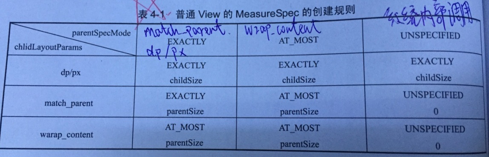

规则：

1. 当View采用固定宽/高时（即设置固定的dp/px）,不管父容器的MeasureSpec是什么， View的MeasureSpec都是```EXACTLY```模式，并且大小遵循我们设置的值。
2. 当View的宽/高是 ```match_parent``` 时，View的MeasureSpec都是```EXACTLY```模式并且其大小等于父容器的剩余空间。
3. 当View的宽/高是 ```wrap_content```时，View的MeasureSpec都是```AT_MOST```模式并且其大小不能超过父容器的剩余空间。
4. 父容器的UNSPECIFIED模式，一般用于系统内部多次Measure时，表示一种测量的状态，一般来说我们不需要关注此模式。

三、View的工作流程

1、measure过程

分两种情况：

* View：通过 measure 方法就完成了测量过程
* ViewGroup：除了完成自己的测量过程还会便利调用所有子View的measure方法，而且各个子View还会递归执行这个过程。

1.View的measure过程

* View的measure过程由measure方法来完成，measure方法是一个final类型的方法，意味着不能重写，它会调用View的onMeasure方法。

```
protected void onMeasure(int widthMeasureSpec, int heightMeasureSpec) {
    setMeasuredDimension(getDefaultSize(getSuggestedMinimumWidth(), widthMeasureSpec),
            getDefaultSize(getSuggestedMinimumHeight(), heightMeasureSpec));
}
```

setMeasuredDimension方法会设置View的宽高的测量值

```
public static int getDefaultSize(int size, int measureSpec) {
    int result = size;
    int specMode = MeasureSpec.getMode(measureSpec);
    int specSize = MeasureSpec.getSize(measureSpec);

    switch (specMode) {
    case MeasureSpec.UNSPECIFIED:
        result = size;
        break;
    case MeasureSpec.AT_MOST:
    case MeasureSpec.EXACTLY:
        result = specSize;
        break;
    }
    return result;
}
```
MeasureSpec.AT_MOST/MeasureSpec.EXACTLY模式：getDefaultSize返回的大小就是MeasureSpec中的specSize，这个specSize就是View测量后的大小（这里提到的的测量后的大小，是因为View最终的大小是在layout阶段确定的，所以要加以区分，但是几乎所有情况下View的测量大小和最终大小是相等的）

MeasureSpec.UNSPECIFIED：一般用于系统内部的测量，getDefaultSize返回的大小为它的第一个参数size，即宽高为getSuggestedMinimumWidth和getSuggestedMinimumHeight

```
protected int getSuggestedMinimumWidth() {
    return (mBackground == null) ? mMinWidth : max(mMinWidth, mBackground.getMinimumWidth());
}

protected int getSuggestedMinimumHeight() {
    return (mBackground == null) ? mMinHeight : max(mMinHeight, mBackground.getMinimumHeight());
}

//android/graphics/drawable/Drawable.java
// 返回Drawable的原始宽度，前提是这个Drawable有原始宽度，否则为0
public int getMinimumWidth() {
    final int intrinsicWidth = getIntrinsicWidth();
    return intrinsicWidth > 0 ? intrinsicWidth : 0;
}
```

通过getSuggestedMinimumWidth方法可以看出：

* 如果View没有设置背景，那么View的宽高为mMinWidth(对应于android:minWidth这个属性所指的值，这个属性如果不指定则默认为0)
* 如果View设置了背景，那么View的宽度为max(mMinWidth, mBackground.getMinimumWidth())(返回Drawable的原始宽度，前提是这个Drawable有原始宽度，否则为0)

总结：getSuggestedMinimumWidth逻辑

1. 如果View没有设置背景，那么返回android:minWidth这个属性所指定的值，这个值可以为0
2. 如果View设置了背景，那么返回android:minWidth和背景最小宽度这两者中最大的值

getSuggestedMinimumWidth和getSuggestedMinimumHeight的返回值就是View在UNSPECIFIED情况下的测量宽高

总结：View的宽高由specSize决定

直接继承View的自定义控件需要重写onMeasure方法并设置```wrap_content```(即specMode是```AT_MOST```模式）时的自身大小，否则在布局中使用 ```wrap_content```相当于使用```match_parent``` 。对于非 wrap_content 的情形，我们沿用系统的测量值即可。

原因：根据getDefaultSize方法和表4-1(普通View的MeasureSpec创建规则)，如果布局中使用```wrap_content```，那么它的speckMode是```AT_MOST```模式，在这种模式下，它的宽高等于specSize，查表可知，这种情况下View的speckSize是parentSize，而parentSize的父容器中可以使用的大小，也就是父容器中当前剩余的空间大小。很显然View的宽高就等于父容器当前剩余的空间大小，这种效果和布局中match_parent完全一致。
解决问题方法：

```
@Override
protected void onMeasure(int widthMeasureSpec, int heightMeasureSpec) {
    super.onMeasure(widthMeasureSpec, heightMeasureSpec);
    int widthSpaceSize = MeasureSpec.getSize(widthMeasureSpec);
    int widthSpecMode = MeasureSpec.getMode(widthMeasureSpec);
    int heightSpaceSize = MeasureSpec.getSize(heightMeasureSpec);
    int heightSpecMode = MeasureSpec.getMode(heightMeasureSpec);
    if(widthSpecMode == MeasureSpec.AT_MOST && heightSpecMode == MeasureSpec.AT_MOST){
    	setMeasuredDimension(mWidth,mHeight);
    } else if(widthSpecMode == MeasureSpec.AT_MOST){
    	setMeasuredDimension(mWidth,heightSpaceSize);
    } else if(heightSpecMode == MeasureSpec.AT_MOST){
    	setMeasuredDimension(widthSpaceSize, mHeight);
	 }
}	 
```

2.ViewGroup的measure过程

ViewGroup是一个抽象类，没有重写View的 onMeasure 方法，但是它提供了一个 measureChildren 方法。这是因为不同的ViewGroup子类有不同的布局特性，导致他们的测量细节各不相同，比如 LinearLayout 和 RelativeLayout,因此ViewGroup没办法统一实现onMeasure方法。

* measureChildren：

```
protected void measureChildren(int widthMeasureSpec, int heightMeasureSpec) {
    final int size = mChildrenCount;
    final View[] children = mChildren;
    for (int i = 0; i < size; ++i) {
        final View child = children[i];
        if ((child.mViewFlags & VISIBILITY_MASK) != GONE) {
            measureChild(child, widthMeasureSpec, heightMeasureSpec);
        }
    }
}
```

ViewGroup在measure时，会对每一个子元素进行measure

```
protected void measureChild(View child, int parentWidthMeasureSpec,
            int parentHeightMeasureSpec) {
    final LayoutParams lp = child.getLayoutParams();

    final int childWidthMeasureSpec = getChildMeasureSpec(parentWidthMeasureSpec,
            mPaddingLeft + mPaddingRight, lp.width);
    final int childHeightMeasureSpec = getChildMeasureSpec(parentHeightMeasureSpec,
            mPaddingTop + mPaddingBottom, lp.height);

    child.measure(childWidthMeasureSpec, childHeightMeasureSpec);
}
```	
measureChildren方法的流程：

1. measureChild取出子元素的LayoutParams
2. 通过getChildMeasureSpec来创建子元素的MeasureSpec
3. 传递给View的measure方法来进行测量。

通过LinearLayout的onMeasure方法里来分析ViewGroup的measure过程

```
protected void onMeasure(int widthMeasureSpec, int heightMeasureSpec) {
    if (mOrientation == VERTICAL) {
        measureVertical(widthMeasureSpec, heightMeasureSpec);
    } else {
        measureHorizontal(widthMeasureSpec, heightMeasureSpec);
    }
}
```

查看垂直布局

```
// See how tall everyone is. Also remember max width.
for (int i = 0; i < count; ++i) {
    final View child = getVirtualChildAt(i);
    ...
    // Determine how big this child would like to be. If this or
    // previous children have given a weight, then we allow it to
    // use all available space (and we will shrink things later
    // if needed).
    ...
    measureChildBeforeLayout(child, i, widthMeasureSpec, 0, heightMeasureSpec, usedHeight);
    final int childHeight = child.getMeasuredHeight();
    ...
    final int totalLength = mTotalLength;
    mTotalLength = Math.max(totalLength, totalLength + childHeight + lp.topMargin +
           lp.bottomMargin + getNextLocationOffset(child));        
```

遍历子元素并对每个子元素执行measureChildBeforeLayout方法，这个方法内部会调用子元素的measure方法，这样每个子元素就依次进入measure方法，并且通过mTotalLength这个变量来存储LinearLayout在竖直方向的初始高度，每测量一个子元素，mTotalLength就会增加，增加的部分主要包括子元素的高度以及子元素在处置方向上的margin等。当子元素测量完毕后，LinearLayout会测量自己的大小。

```
// Add in our padding
mTotalLength += mPaddingTop + mPaddingBottom;

int heightSize = mTotalLength;

// Check against our minimum height
heightSize = Math.max(heightSize, getSuggestedMinimumHeight());

// Reconcile our calculated size with the heightMeasureSpec
int heightSizeAndState = resolveSizeAndState(heightSize, heightMeasureSpec, 0);
heightSize = heightSizeAndState & MEASURED_SIZE_MASK;
...
setMeasuredDimension(resolveSizeAndState(maxWidth, widthMeasureSpec, childState), heightSizeAndState);
```

在水平方向测量遵循View测量过程，在竖直方向的测量过程：

1. 如果布局高度采用的是match_parent或者具体数值，那么测量过程和View一致，即高度为specSize
2. 如果布局高度采用的是wrap_content，那么它的高度是所有子元素占用的高度总和，但是任然不能超过父容器的剩余空间，还要考虑竖直方向上的padding

```
public static int resolveSizeAndState(int size, int measureSpec, int childMeasuredState) {
    final int specMode = MeasureSpec.getMode(measureSpec);
    final int specSize = MeasureSpec.getSize(measureSpec);
    final int result;
    switch (specMode) {
        case MeasureSpec.AT_MOST:
            if (specSize < size) {
                result = specSize | MEASURED_STATE_TOO_SMALL;
            } else {
                result = size;
            }
            break;
        case MeasureSpec.EXACTLY:
            result = specSize;
            break;
        case MeasureSpec.UNSPECIFIED:
        default:
            result = size;
    }
    return result | (childMeasuredState & MEASURED_STATE_MASK);
}
```

View的measure总结：

View的measure过程是三大流程中最复杂的一个，measure完成以后，通过 getMeasuredWidth/Height 方法就可以正确获取到View的测量后宽/高。在某些情况下，系统可能需要多次measure才能确定最终的测量宽/高，所以在onMeasure中拿到的宽/高很可能不是准确的。同时View的measure过程和Activity的生命周期并不是同步执行，因此无法保证在 Activity的 onCreate、onStart、onResume时某个View就已经测量完毕。所以有以下四种方式来获取View的宽高：

1.  Activity/View#onWindowFocusChanged。 onWindowFocusChanged这个方法的含义是：VieW已经初始化完毕了，宽高已经准备好了，需要注意：它会被调用多次，当Activity的窗口得到焦点和失去焦点均会被调用。

```
@Override
public void onWindowFocusChanged(boolean hasFocus) {
    super.onWindowFocusChanged(hasFocus);
    if (hasFocus) {
        int width = view.getMeasuredWidth();
        int height = view.getMeasuredHeight();
        Log.d(TAG, "onWindowFocusChanged, width= " + view.getMeasuredWidth() + " height= " + view.getMeasuredHeight());
    }
}
```

2. view.post(runnable)。 通过post将一个runnable投递到消息队列的尾部，当Looper调用此 runnable的时候，View也初始化好了。

```
@Override
protected void onStart() {
    super.onStart();
    view.post(new Runnable() {

        @Override
        public void run() {
            int width = view.getMeasuredWidth();
            int height = view.getMeasuredHeight();
        }
    });
}
```

3. ViewTreeObserver。 使用 ViewTreeObserver 的众多回调可以完成这个功能，比如OnGlobalLayoutListener这个接口，当View树的状态发生改变或View树内部的View的可见性发生改变时，onGlobalLayout 方法会被回调。需要注意的是，伴随着View树状态onGlobalLayout会被回调多次。

```
@Override
protected void onStart() {
    super.onStart();

    ViewTreeObserver observer = view.getViewTreeObserver();
    observer.addOnGlobalLayoutListener(new OnGlobalLayoutListener() {

        @SuppressWarnings("deprecation")
        @Override
        public void onGlobalLayout() {
            view.getViewTreeObserver().removeGlobalOnLayoutListener(this);
            int width = view.getMeasuredWidth();
            int height = view.getMeasuredHeight();
        }
    });
}
```

4. view.measure(int widthMeasureSpec,int heightMeasureSpec)，通过手动对View进行measure来得到View的宽高。

* match_parent： 无法measure出具体的宽高，因为不知道父容器的剩余空间即无法知道parentSize的大小，无法测量出View的大小，直接放弃
* 具体的数值（dp/px）：

比如宽高都是100px，measure如下

```
int widthMeasureSpec = MeasureSpec.makeMeasureSpec(100,MeasureSpec.EXACTLY);
int heightMeasureSpec = MeasureSpec.makeMeasureSpec(100,MeasureSpec.EXACTLY);
view.measure(widthMeasureSpec,heightMeasureSpec);
```

* wrap_content：

```
int widthMeasureSpec = MeasureSpec.makeMeasureSpec((1<<30)-1,MeasureSpec.AT_MOST);
// View的尺寸使用30位二进制表示，最大值30个1，在AT_MOST模式下，我们用View理论上能支持的最大值去构造MeasureSpec是合理的
int heightMeasureSpec = MeasureSpec.makeMeasureSpec((1<<30)-1,MeasureSpec.AT_MOST);
view.measure(widthMeasureSpec,heightMeasureSpec);
```

2、layout过程

layout的作用是ViewGroup用来确定子View的位置，当ViewGroup的位置被确定后，它会在 onLayout中遍历所有的子View并调用其layout方法，在 layout 方法中， onLayout 方法又会被调用。 layout 方法确定View本身的位置，而onLayout方法则会确定所有子元素的位置。

1.View的layout方法

```
public void layout(int l, int t, int r, int b) {
    if ((mPrivateFlags3 & PFLAG3_MEASURE_NEEDED_BEFORE_LAYOUT) != 0) {
        onMeasure(mOldWidthMeasureSpec, mOldHeightMeasureSpec);
        mPrivateFlags3 &= ~PFLAG3_MEASURE_NEEDED_BEFORE_LAYOUT;
    }

    int oldL = mLeft;
    int oldT = mTop;
    int oldB = mBottom;
    int oldR = mRight;

    boolean changed = isLayoutModeOptical(mParent) ?
            setOpticalFrame(l, t, r, b) : setFrame(l, t, r, b);

    if (changed || (mPrivateFlags & PFLAG_LAYOUT_REQUIRED) == PFLAG_LAYOUT_REQUIRED) {
        onLayout(changed, l, t, r, b);

        if (shouldDrawRoundScrollbar()) {
            if(mRoundScrollbarRenderer == null) {
                mRoundScrollbarRenderer = new RoundScrollbarRenderer(this);
            }
        } else {
            mRoundScrollbarRenderer = null;
        }

        mPrivateFlags &= ~PFLAG_LAYOUT_REQUIRED;

        ListenerInfo li = mListenerInfo;
        if (li != null && li.mOnLayoutChangeListeners != null) {
            ArrayList<OnLayoutChangeListener> listenersCopy =
                    (ArrayList<OnLayoutChangeListener>)li.mOnLayoutChangeListeners.clone();
            int numListeners = listenersCopy.size();
            for (int i = 0; i < numListeners; ++i) {
                listenersCopy.get(i).onLayoutChange(this, l, t, r, b, oldL, oldT, oldR, oldB);
            }
        }
    }

    final boolean wasLayoutValid = isLayoutValid();

    mPrivateFlags &= ~PFLAG_FORCE_LAYOUT;
    mPrivateFlags3 |= PFLAG3_IS_LAID_OUT;
    ...
}
```

layout大致流程如下：

1.  setFrame 确定View的四个顶点位置(即初始化mLeft,mRight,mTop,mBottom)，从而确定了View在父容器中的位置
2. 调用 onLayout 方法，确定所有子View的位置，View和ViewGroup均没有真正实(和onMeasure类似，onLayout的具体实现和具体布局相关)

2.通过LinearLayout的onLayout方法分析ViewGroup的onLayout方法

```
@Override
protected void onLayout(boolean changed, int l, int t, int r, int b) {
    if (mOrientation == VERTICAL) {
        layoutVertical(l, t, r, b);
    } else {
        layoutHorizontal(l, t, r, b);
    }
}
```

选择竖直方向

```
void layoutVertical(int left, int top, int right, int bottom) {
    final int paddingLeft = mPaddingLeft;

    int childTop;
    int childLeft;

    // Where right end of child should go
    final int width = right - left;
    int childRight = width - mPaddingRight;

    // Space available for child
    int childSpace = width - paddingLeft - mPaddingRight;

    final int count = getVirtualChildCount();

	 ...
    for (int i = 0; i < count; i++) {
        final View child = getVirtualChildAt(i);
        if (child == null) {
            childTop += measureNullChild(i);
        } else if (child.getVisibility() != GONE) {
            final int childWidth = child.getMeasuredWidth();
            final int childHeight = child.getMeasuredHeight();

            final LinearLayout.LayoutParams lp =
                    (LinearLayout.LayoutParams) child.getLayoutParams();
            ...
            if (hasDividerBeforeChildAt(i)) {
                childTop += mDividerHeight;
            }

            childTop += lp.topMargin;
            setChildFrame(child, childLeft, childTop + getLocationOffset(child),
                    childWidth, childHeight);
            childTop += childHeight + lp.bottomMargin + getNextLocationOffset(child);

            i += getChildrenSkipCount(child, i);
        }
    }
}
```

1. 遍历所有子元素并调用setChildFrame方法来为子元素指定对应位置，其中childTop会逐渐增大，这意味着后边的子元素会被放置在靠下位置，这符合LinearLayout竖直方向这一特性。
2. setChildFrame仅仅调用子元素的layout方法

这样父元素在layout方法中完成自己的定位后，就通过onLayout方法去调用子元素layout方法，子元素又会通过自己的layout方法来确定自己的位置，这样一层一层的传递下去就完成了整个View树的layout过程。

```
private void setChildFrame(View child, int left, int top, int width, int height) {
    child.layout(left, top, left + width, top + height);
}
```

该方法中的width和height实际上就是子元素的测量宽高。从下面代码可以得出：

```
final int childWidth = child.getMeasuredWidth();
final int childHeight = child.getMeasuredHeight();
setChildFrame(child, childLeft, childTop + getLocationOffset(child), childWidth, childHeight);
```

在子元素layout方法中会通过setFrame去设置子元素四个顶点的位置。这样子元素的位置就确定了

```
mLeft = left;
mTop = top;
mRight = right;
mBottom = bottom;
```

3、draw过程

View的绘制过程遵循如下几步：

1. 绘制背景 drawBackground(canvas)
2. 绘制自己(onDraw)
3. 绘制children(dispatchDraw 遍历所有子View的draw方法)
4. 绘制装饰(onDrawScrollBars)

```
public void draw(Canvas canvas) {
    final int privateFlags = mPrivateFlags;
    final boolean dirtyOpaque = (privateFlags & PFLAG_DIRTY_MASK) == PFLAG_DIRTY_OPAQUE &&
            (mAttachInfo == null || !mAttachInfo.mIgnoreDirtyState);
    mPrivateFlags = (privateFlags & ~PFLAG_DIRTY_MASK) | PFLAG_DRAWN;

    /*
     * Draw traversal performs several drawing steps which must be executed
     * in the appropriate order:
     *
     *      1. Draw the background
     *      2. If necessary, save the canvas' layers to prepare for fading
     *      3. Draw view's content
     *      4. Draw children
     *      5. If necessary, draw the fading edges and restore layers
     *      6. Draw decorations (scrollbars for instance)
     */

    // Step 1, draw the background, if needed
    int saveCount;

    if (!dirtyOpaque) {
        drawBackground(canvas);
    }

    // skip step 2 & 5 if possible (common case)
    final int viewFlags = mViewFlags;
    boolean horizontalEdges = (viewFlags & FADING_EDGE_HORIZONTAL) != 0;
    boolean verticalEdges = (viewFlags & FADING_EDGE_VERTICAL) != 0;
    if (!verticalEdges && !horizontalEdges) {
        // Step 3, draw the content
        if (!dirtyOpaque) onDraw(canvas);

        // Step 4, draw the children
        dispatchDraw(canvas);

        drawAutofilledHighlight(canvas);

        // Overlay is part of the content and draws beneath Foreground
        if (mOverlay != null && !mOverlay.isEmpty()) {
            mOverlay.getOverlayView().dispatchDraw(canvas);
        }

        // Step 6, draw decorations (foreground, scrollbars)
        onDrawForeground(canvas);

        // Step 7, draw the default focus highlight
        drawDefaultFocusHighlight(canvas);

        if (debugDraw()) {
            debugDrawFocus(canvas);
        }

        // we're done...
        return;
    }

    ...
}
```

View的绘制过程是通过dispatchDraw来实现的，dispatchDraw会遍历调用所有子元素的draw方法，这样draw事件就一层一层的传递下去了。

注：ViewGroup会默认启用 setWillNotDraw 为ture，导致系统不会去执行 onDraw ，所以自定义ViewGroup需要通过onDraw来绘制内容时，必须显式的关闭 ```WILL_NOT_DRAW``` 这个标记位，即调用setWillNotDraw(false)

四、自定义View

1、自定义View的分类

1. 继承View：通过 onDraw 方法来实现一些效果，需要自己支持 wrap_content ，并且 padding也要去进行处理。
2. 继承ViewGroup：实现自定义的布局方式，需要合适地处理ViewGroup的测量、布局这两个过程，并同时处理子View的测量和布局过程。
3. 继承特定的View子类（如TextView、Button）： 扩展某种已有的控件的功能，且不需要自己去管理wrap_content 和padding
4. 继承特定的ViewGroup子类（如LinearLayout）

2、自定义View须知

1. 直接继承View或ViewGroup的控件， 需要在onmeasure中对```wrap_content```做特殊处理。 指定```wrap_content```模式下的默认宽/高。
2. 直接继承View的控件，如果不在draw方法中处理padding，那么padding属性就无法起作用。直接继承ViewGroup的控件也需要在onMeasure和onLayout中考虑padding和子元素 margin的影响，不然padding和子元素的margin无效。
3. 尽量不要在View中使用Handler，因为没必要。View内部提供了post系列的方法，完全可以替代Handler的作用。
4. View中有线程和动画，需要在View的onDetachedFromWindow中停止。
5. View带有滑动嵌套情形时，需要处理好滑动冲突

3、如何对自定义View进行控制

1. 如果想控制View在屏幕上的渲染效果，就在重写onDraw()方法，在里面进行相应的处理。
2. 如果想要控制用户同View之间的交互操作，则在onTouchEvent()方法中对手势进行控制处理。
3. 如果想要控制View中内容在屏幕上显示的尺寸大小，就重写onMeasure()方法中进行处理。
4. 在 XML文件中设置自定义View的XML属性。
5. 如果想避免失去View的相关状态参数的话，就在onSaveInstanceState() 和 onRestoreInstanceState()方法中保存有关View的状态信息。

4、invalidate() 、postInvalidate()、requestLayout() 

1、invalidate() 

请求重绘View树，调用onDraw()方法。从头到尾并不会触发onMeasure（）方法（控制大小用）。如果是View就重绘View,如果是ViewGroup就全部重绘。

1.一般引起invalidate()操作的函数如下：

1. 直接调用invalidate()方法，请求重新draw()，但只会绘制调用者本身。
2. setSelection()方法 ：请求重新draw()，但只会绘制调用者本身。
3. setVisibility()方法 ： 当View可视状态在INVISIBLE转换VISIBLE时，会间接调用invalidate()方法，继而绘制该View。
4. setEnabled()方法 ： 请求重新draw()，但不会重新绘制任何视图包括该调用者本身。

2、postInvalidate(); 与invalidate()方法区别就是，postInvalidate()方法可以在UI线程执行，也可以在工作线程执行,而invalidate()只能在UI线程操作。但是从重绘速率讲：invalidate()效率高。

3。requestLayout():他跟invalidate()相反，他只调用measure()和layout()过程，不会调用draw()。不会重新绘制任何视图包括该调用者本身。

## Activity启动模式

一、Activity的四种启动模式

1.standard

默认启动模式，栈内多实例，每次启动都会新建Activity实例压于当前栈顶。

2.singleTop

栈顶复用模式，栈内多实例，启动Activity时若栈顶已有该Activity实例，会直接调用onNewIntent()方法复用该栈顶实例，其它场景和standard表现一致，此模式下需要指定android:launchMode=“singleleTop”。

3.singleTask

栈内复用模式，栈内单实例，此模式下需要指定android:launchMode=“singleleTask”，启动Activity时：

* 若栈内无该Activity类实例，新建实例并压入栈顶；
* 若栈内已有该Activity类实例（假设为A），栈内位于A上部的Activity逐个pop，调用onDestroy()生命周期（除去相邻的Activity实例，假设为B），B的生命周期如下：
B onPause() - A onNewIntent() - A onRestart() - A onStart() - A onResume() - B onStop() - B onDestroy()

 * 未配置taskAffinity属性时：以上操作均在当前栈操作。
 * 配置了taskAffinity属性时：检测当前栈是否与taskAffinity属性相符，若相符则在当前栈操作；若不相符则新建栈，再新建Activity实例压于栈顶。

4.singleInstance

单实例模式，全局单实例，即全局只有一个栈中有该实例，且该栈中有且只有一个该实例。此模式下需要指定android:launchMode=“singleleInstance”，当启动Activity时，

若栈中无该实例，则新建栈，新建Activity并压入栈顶；
若已有栈中有该实例，则调用onNewIntent()复用该实例。

二、使用场景

1.standard 一般场景均适用

2.singleTop 此模式下栈顶只存在单个该实例，有如下场景可用（适用于非主架构Activity）：

1. 防止Activity多次启动，比如多次点击启动按钮导致启动多个相同Activity（如登录跳转）；
2. 业务流程要更新数据，Activity需要自己跳转到自己，回调onNewIntent()刷新数据；
3. Activity需要启动service执行耗时操作或进行某类事件监听，过程中用户点击home键切换了应用，当service响应时需要回到Activity，此时可用singleTop复用已有实例；
4. 通知栏内有若干个通知，点击通知需要跳转到新Activity，此时可用singleTop，避免每次点击都创建新实例造成资源浪费；

3.singleTask 此模式下栈内只有单个该实例，且不会多次创建，适用于主架构Activity（常驻型），如应用主页（home页）；

4.singleInstance 此模式下全局栈内只有单个该实例，且该栈有且仅有一个实例，此类Activity适用于共享型Activity，如Activity作为公共组件被多个三方app访问。

上面的场景仅仅适用于Activity启动Activity，并且采用的都是默认Intent，没有额外添加任何Flag，否则表现就可能跟上面的完全不一致，尤其要注意的是FLAG_ACTIVITY_NEW_TASK的使用，后面从源码中看，依靠FLAG_ACTIVITY_NEW_TASK其实可以分为两派。

三、Intent.FLAG_ACTIVITY_NEW_TASK分析

从源码来看，Intent.FLAG_ACTIVITY_NEW_TASK是启动模式中最关键的一个Flag，依据该Flag启动模式可以分成两类，设置了该属性的与未设置该属性的，对于非Activity启动的Activity（比如Service或者通知中启动的Activity）需要显示的设置Intent.FLAG_ACTIVITY_NEW_TASK，而singleTask及singleInstance在AMS中被预处理后，隐形的设置了Intent.FLAG_ACTIVITY_NEW_TASK，而启动模式是standard及singletTop的Activity不会被设置Intent.FLAG_ACTIVITY_NEW_TASK，除非通过显示的intent setFlag进行设置。

FLAG_ACTIVITY_NEW_TASK这个属性更多的关注点是在Task，可以认为没有设置FLAG_ACTIVITY_NEW_TASK的情况下，taskAffinity可以不考虑，大多数情况下，需要将Activity引入到自己taskAffinity的Task中，Intent.FLAG_ACTIVITY_NEW_TASK的初衷是在Activity目标taskAffinity的Task中启动，非Activity启动Activity都必须添加Intent.FLAG_ACTIVITY_NEW_TASK才行，以Service启动的Activity为例：

```
Intent intent = new Intent(BackGroundService.this, A.class);
intent.setFlags(Intent.FLAG_ACTIVITY_NEW_TASK);
startActivity(intent);  
```

这种情况很有意思，如果目标Activity实例或者Task不存在，则一定会新建Activity，并将目标Task移动到前台，但是如果Activity存在，却并不一定复用，也不一定可见。这里假定A是standard的Activity，如果已经有一个A实例，并且所在的堆栈的taskAffinity跟A的taskAffinity一致，这个时候要看这个task的根Activity是不是A，如果是A，还要看A的intent是不是跟当前的启动的intent相等，如果都满足，只要将task可见即可。否则，就需要新建A，并根据A的task栈的存在情况而选择直接入栈还是新建栈。但是，如果Intent想要的启动的Activity的目标堆栈存在，那就将整个堆栈往前迁移，如果位于顶部的Task栈正好是目标Activity的Task栈，那就不做任何处理，连onNewIntent都不会回调，怎么判断目标的Activity的Task栈同找到的栈一致呢？如果找不到目标Task自然会启动Task，如果目标task栈根Activit的intent同新将要启动的Activit相同，就不启动新Activity，否则启动Activity。


1、Intent.FLAG_ACTIVITY_CLEAR_TASK：必须配合FLAG_ACTIVITY_NEW_TASK使用

这个属性必须同FLAG_ACTIVITY_NEW_TASK配合使用，如果设置了FLAG_ACTIVITY_NEW_TASK|Intent.FLAG_ACTIVITY_CLEAR_TASK，如果目标task已经存在，将清空已存在的目标Task，否则，新建一个Task栈，之后，新建一个Activity作为根Activity。Intent.FLAG_ACTIVITY_CLEAR_TASK的优先级最高，基本可以无视所有的配置，包括启动模式及Intent Flag，哪怕是singleInstance也会被finish，并重建。


2、Intent.FLAG_ACTIVITY_CLEAR_TOP

如果没有使用FLAG_ACTIVITY_NEW_TASK，目标是当前Task栈，根据不同的组合会产生不同的效果，如果单独使用Intent.FLAG_ACTIVITY_CLEAR_TOP，并且没有设置特殊的launchmode，那么，Google官方的示例是：如果ABCD Task中的D采用Intent.FLAG_ACTIVITY_CLEAR_TOP唤起B，这个时候首先会将CD出栈，但是至于B是否会重建，要视情况而定，如果没有设置FLAG_ACTIVITY_SINGLE_TOP，则会将B finish掉，之后创建新的入栈。如果同一个栈中原来有


如果没有则新建，不会去另一个栈中寻找。


如果同时设置了FLAG_ACTIVITY_SINGLE_TOP，在当前栈已有的情况下就不会重建，而是直接回调B的onNewIntent(),


如果同时使用了FLAG_ACTIVITY_NEW_TASK ，这个时候，目标是Activity自己所属的Task栈，如果在自己的Task中能找到一个Activity实例，则将其上面的及自身清理掉，之后重建。


如果同时在加上FLAG_ACTIVITY_SINGLE_TOP，会更特殊一些，如果topActivity不是目标Activity，就会去目标Task中去找，并唤起


如果topActivity是目标Activity，就直接回调topActivity的onNewIntent，无论topActivity是不是在目标Task中


3、Intent.FLAG_ACTIVITY_SINGLE_TOP

Intent.FLAG_ACTIVITY_SINGLE_TOP多用来做辅助作用，跟launchmode中的singleTop作用一样，在Task栈顶有的话，就不新建，栈顶没有的话，就新建，这里的Task可能是目标栈，也可能是当前Task栈，配合FLAG_ACTIVITY_NEW_TASK及FLAG_ACTIVITY_CLEAR_TOP都会有很有意思的效果。

4、Intent.FLAG_ACTIVITY_NO_HISTORY

使用该模式来启动Activity，当该Activity启动其他Activity后，该Activity就被销毁了，不会保留在任务栈中。如A-B,B中以这种模式启动C，C再启动D，则任务栈只有ABD。

5、Intent.FLAG_ACTIVITY_EXCLUDE_FROM_RECENTS

使用该标识位启动的Activity不添加到最近应用列表，也即我们从最近应用里面查看不到我们启动的这个Activity。与属性android:excludeFromRecents=”true”效果相同。当用户正处于此Activity并按home键回到桌面或通过任务列表切换到其他应用后，用户再唤出最近任务列表时便看不到此Activity。

四、源码分析

为什么非Activity启动Activity要强制规定使用参数FLAG_ACTIVITY_NEW_TASK
从源码上说，ContextImpl在前期做了检查，如果没添加Intent.FLAG_ACTIVITY_NEW_TASK就抛出异常，

```
@Override
public void startActivity(Intent intent, Bundle options) {
    warnIfCallingFromSystemProcess();
    if ((intent.getFlags()&Intent.FLAG_ACTIVITY_NEW_TASK) == 0) {
        throw new AndroidRuntimeException(
                "Calling startActivity() from outside of an Activity "
                + " context requires the FLAG_ACTIVITY_NEW_TASK flag."
                + " Is this really what you want?");
    }
    ...
}
```

为什么要这么呢？其实直观很好理解，如果不是在Activity中启动的，那就可以看做不是用户主动的行为，也就说这个界面可能出现在任何APP之上，如果不用Intent.FLAG_ACTIVITY_NEW_TASK将其限制在自己的Task中，那用户可能会认为该Activity是当前可见APP的页面，这是不合理的。举个例子：我们在听音乐，这个时候如果邮件Service突然要打开一个Activity，如果不用Intent.FLAG_ACTIVITY_NEW_TASK做限制，那用户可能认为这个Activity是属于音乐APP的，因为用户点击返回的时候，可能会回到音乐，而不是邮件（如果邮件之前就有界面）。

三、Activity异常生命周期

异常的生命周期是指Activity被系统回收或者当前设备的Configuration发生变化（一般指横竖屏切换）从而导致Activity被销毁重建。异常的生命周期主要分以下两种情况：

1. 相关的系统配置发生改变导致Activity被杀死并重新创建（一般指横竖屏切换）
2. 内存不足导致低优先级的Activity被杀死

1、相关的系统配置发生改变导致Activity被杀死并重新创建（一般指横竖屏切换）

```
public class MainActivity extends AppCompatActivity {
    Button bt;
    /**
     * Activity创建时被调用
     * @param savedInstanceState
     */
    @Override
    protected void onCreate(Bundle savedInstanceState) {
        super.onCreate(savedInstanceState);
		 setContentView(R.layout.activity_main);
        LogUtils.e("onCreate is invoke!!!");
        bt= (Button) findViewById(R.id.bt);
        bt.setOnClickListener(new View.OnClickListener() {
            @Override
            public void onClick(View v) {
                Intent i = new Intent(MainActivity.this,SecondActivity.class);
                startActivity(i);
            }
        });
    }

    @Override
    protected void onSaveInstanceState(Bundle outState) {
        super.onSaveInstanceState(outState);
        LogUtils.e("onSaveInstanceState is invoke!!!");
    }

    @Override
    protected void onRestoreInstanceState(Bundle savedInstanceState) {
        super.onRestoreInstanceState(savedInstanceState);
        LogUtils.e("onRestoreInstanceState is invoke!!!");
    }

    /**
     * Activity从后台重新回到前台时被调用
     */
    @Override
    protected void onRestart() {
		 LogUtils.e("onRestart is invoke!!!");
    }

    /**
     *Activity创建或者从后台重新回到前台时被调用
     */
    @Override
    protected void onStart() {
        super.onStart();
        LogUtils.e("onStart is invoke!!!");
    }


    /**
     *Activity创建或者从被覆盖、后台重新回到前台时被调用
     */
    @Override
    protected void onResume() {
        super.onResume();
        LogUtils.e("onResume is invoke!!!");
    }

    /**
     *  Activity被覆盖到下面或者锁屏时被调用
      */
    @Override
    protected void onPause() {
        super.onPause();
		 LogUtils.e("onPause is invoke!!!");
    }

    /**
     *退出当前Activity或者跳转到新Activity时被调用
     */
    @Override
    protected void onStop() {
        super.onStop();
        LogUtils.e("onStop is invoke!!!");
    }

    /**
     *退出当前Activity时被调用,调用之后Activity就结束了
     */
    @Override
    protected void onDestroy() {
        super.onDestroy();
        LogUtils.e("onDestroy is invoke!!!");
    }
}
```

我们重写了onSaveInstanceState方法和onRestoreInstanceState方法，这两个方法后面我们会详细介绍，这里先看看运行结果：


从Log中我们可以看出当我们正常启动Activity时，onCreate，onStart，onResume方法都会依次被回调，而如果我们此时把竖屏的Activity人为的调整为横屏，我们可以发现onPause，onSaveInstanceState，onStop，onDestroy，onCreate，onStart，onRestoreInstanceState，onResume依次被调用，单从调用的方法我们就可以知道，Activity先被销毁后再重新创建，其异常生命周期如下：


现在异常生命周期的流程我们大概也就都明白，但是onSaveInstanceState和onRestoreInstanceState方法是干什么用的呢？实际上这两个方法是系统自动调用的，当系统配置发生变化后，Activity会被销毁，也就是onPause，onStop，onDestroy会被依次调用，同时因为Activity是在异常情况下销毁的，Android系统会自动调用onSaveInstanceState方法来保存当前Activity的状态信息，因此我们可以在onSaveInstanceState方法中存储一些数据以便Activity重建之后可以恢复这些数据，当然这个方法的调用时机必须在onStop方法之前，也就是Activity停止之前。至跟onPause方法的调用时机可以随意。而通过前面的Log信息我们也可以知道当Activity被重新创建之后，系统还会去调用onRestoreInstanceState方法，并把Activity销毁时通过onSaveInstanceState方法保存的Bundle对象作为参数同时传递给onRestoreInstanceState和onCreate方法，因此我们可以通过onRestoreInstanceState和onCreate方法来判断Activity是否被重新创建，倘若被重建了，我们就可以对之前的数据进行恢复。从Log信息，我们可以看出onRestoreInstanceState方法的调用时机是在onStart之后的。这里有点需要特别注意，onSaveInstanceState和onRestoreInstanceState只有在Activity异常终止时才会被调用的，正常情况是不会调用这两个方法的。 

到这里大家可能还有一个疑问，onRestoreInstanceState和onCreate方法都可以进行数据恢复，那到底用哪个啊?其实两者都可以，两者的区别在于，onRestoreInstanceState方法一旦被系统回调，其参数Bundle一定不为空，无需额外的判断，而onCreate的Bundle却不一定有值，因为如果Activity是正常启动的话，Bundle参数是不会有值的，因此我们需要额外的判断条件，当然虽说两者都可以数据恢复，但更倾向于onRestoreInstanceState方法。 

最后还有点我们要知道的是，在onSaveInstanceState方法和onRestoreInstanceState方法中，android系统会自动帮我们恢复一定的数据，如当前Activity的视图结构，文本框的数据，ListView的滚动位置等，这些View相关的状态系统都会帮我们恢复，这是因为每个View也有onSaveInstanceState方法和onRestoreInstanceState方法

2、内存不足导致低优先级的Activity被杀死

内存不足导致低优先级的Activity被杀死，然后重建，其实也不用聊了，其数据的存储过程和恢复过程跟上面的情况基本没差。我们还是继续聊聊Activity被杀死的情况吧，当系统内存不足的时候，系统就会按照一定的优先级去杀死目标Acitivity的进程来回收内存，并且此时Activity的onSaveInstanceState方法会被调用来存储数据，并在后续Activity恢复时调用onRestoreInstanceState方法来恢复数据，所以为了Activity所在进程尽量不被杀死，我们应该尽量让其保持高的优先级。

3、解决Activity销毁重建问题

通过上面的分析我们知道当系统配置发生变化后，Activity会被重建，那有没有办法使其不重建呢？方法自然是有的，那就是我们可以给Activity指定configChange属性，当我们不想Activity在屏幕旋转后导致销毁重建时，可以设置configChange=“orientation”；当SDK版本大于13时，我们还需额外添加一个“screenSize”的值，对于这两个值含义如下： 

* orientation：屏幕方向发生变化，配置该参数可以解决横竖屏切换时，Activity重建问题（API<13） 
* screenSize：当设备旋转时，屏幕尺寸发生变化，API>13后必须配置该参数才可以保证横竖切换不会导致Activity重建。 

说白了就是设置了这两个参数后，当横竖屏切换时，Activity不会再重建并且也不会调用之前相关的方法，取而代之的是回调onConfigurationChanged方法。

## OkHttp3源码分析

一、概要

1、OKHttp优点
支持SPDY HTTP2.0；如果服务器和客户端都支持这两种它会用同一个socket来处理同一个服务器的所有请求提高http连接效率
如果服务器不支持SPDY 则通过连接池来减少请求延时
无缝的支持GZIP来减少数据流量
缓存响应数据减少重复的网络请求
请求失败时自动重试主机的其他ip，自动重定向
多路复用机制

2.OKHttp使用到的设计模式
单例模式：实例化OKHttpClient就要用到，因为每个OKHttpClient对象都有自己的连接池和线程池等资源，如果每次使用都去实例化一个新的对象，显然内存是吃不消的
外观模式：OKHttpClient里面包含了很多类对象，其实就是将很多功能模块都封装到OKHttpClient中，由它单独对外提供API；这样就隐藏了系统的复杂性
构建者模式：在实例化OKHttpClient和Request的时候，因为有太多的属性需要设置，而且开发者的需求组合千变万化，就需要通过Build一步一步构建需要的对象
工厂方法模式：Call接口提供了内部接口Factory，用于将对象的创建延迟到该工厂类的子类中进行，从而实现动态的配置；该模式可以使得对象的创建不会对客户端暴露创建逻辑，通过使用一个共同的接口来指向新创建的对象
享元模式：在Dispatcher的线程池中，所用到了享元模式，一个不限容量的线程池 ， 线程空闲时存活时间为 60 秒。线程池实现了对象复用，降低线程创建开销，从设计模式上来讲，使用了享元模式。（享元模式：尝试重用现有的同类对象，如果未找到匹配的对象，则创建新对象，主要用于减少创建对象的数量，以减少内存占用和提高性能）
责任链模式：很明显，在okhttp中的拦截器模块，执行过程用到。OkHttp3 的拦截器链中， 内置了5个默认的拦截器，分别用于重试、请求对象转换、缓存、链接、网络读写（责任链模式：为请求创建了一个接收者对象的链。这种模式给予请求的类型，对请求的发送者和接收者进行解耦。这种类型的设计模式属于行为型模式。在这种模式中，通常每个接收者都包含对另一个接收者的引用。如果一个对象不能处理该请求，那么它会把相同的请求传给下一个接收者，依此类推）
策略模式：CacheInterceptor 实现了数据的选择策略， 来自网络还是来自本地？ 这个场景也是比较契合策略模式场景， CacheInterceptor 需要一个策略提供者提供它一个策略， CacheInterceptor 根据这个策略去选择走网络数据还是本地缓存（策略模式：一个类的行为或其算法可以在运行时更改。这种类型的设计模式属于行为型模式。策略模式中，我们创建表示各种策略的对象和一个行为随着策略对象改变而改变的 context 对象。策略对象改变 context 对象的执行算法）

3.使用流程


二、流程分析

1、OKHTTP请求流程


2、核心类

1. OkHttpClient：整个框架的客户端类，OkHttpClient强烈建议全局单例使用，因为每一个OkHttpClient都有自己单独的连接池和线程池，复用连接池和线程池能够减少延迟、节省内存
2. ConnectionPool：管理HTTP和HTTP / 2连接的重用，以减少网络延迟。 相同Address的HTTP请求可以共享Connection。 此类实现了哪些连接保持打开以供将来使用的策略
3. Request：封装请求报文信息的对象，比如请求url，请求方法，超时时间，还有各种请求头
4. Call：一个Call表示一个为执行而准备的请求，一个接口
5. RealCall：Call的实现类，它是连接Request和Response的桥梁
6. Response：请求响应的封装对象
7. Dispatcher：分发器类，维护同步请求和异步请求的状态，内部维护了一个线程池，用于执行网络请求的线程；同时还维护了三个请求队列，一个是正在进行异步请求的队列（包含了已取消但未完成的请求），一个是处于等待执行的异步请求队列，最后一个是正在进行同步请求的队列（包含了已取消但未完成的请求）
8. Interceptor：拦截器类，可以观察修改我们的请求和响应，是一个接口，有五个实现类，它们形成一个拦截器链，依次对我们的请求响应做处理
9. RetryAndFollowUpInterceptor：Interceptor实现类之一，是网络请求失败时进行重连及服务器返回当前请求需要进行重定向的拦截器
10. BridgeInterceptor：桥接连接器，主要是进行请求前的一些操作，将我们的请求设置成服务器能识别的请求，比如设置一系列头部信息，比如设置请求内容长度，编码，gzip压缩，cookie等
11. CacheInterceptor：缓存拦截器，这个就很明显了，作用是缓存请求和响应，比如同一个请求之前发生过，这次就不需要重新构建了，直接从缓存取；响应同理
12. ConnectInterceptor：连接拦截器，为当前请求找到一个合适的连接，比如如果从连接处中可以找到能复用的连接，就不要再创建新的连接了
13. CallServerInterceptor：连接服务器拦截器，负责向服务器发送真正的请求，接受服务器的响应

3、使用方法切入点

1. 同步请求方法：Call.execute，在当前线程执行请求，会阻塞当前线程
2. 异步请求方法：Call.enqueue，新开一个线程执行请求，不会阻塞当前线程

4、同步和异步请求代码

使用步骤基本分为如下几步：

* 第一步：实例化OKHttpClient对象
* 第二步：实例化网络请求对象Request
* 第三步：实例化一个准备执行的请求的对象
* 第四步：执行请求方法

1.同步请求

```
OkHttpClient okHttpClient = new OkHttpClient.Builder()
        .connectTimeout(3000, TimeUnit.SECONDS)
        .readTimeout(3000, TimeUnit.SECONDS)
        .build();

public String syncRequest(String url) {
    String result = null;
    Request request = new Request.Builder().url(url).build();
    Call call = okHttpClient.newCall(request);
    Response response = null;
    try {
        response = call.execute();
        if (response.isSuccessful()) {
            result = response.body().string();
        }
    } catch (IOException e) {
        e.printStackTrace();
    }
    return result;
}
```

2.异步请求

```
public void asyncRequest(String url) {
    Request request = new Request.Builder().url(url).build();
    Call call = okHttpClient.newCall(request);
    call.enqueue(new Callback() {
        @Override
        public void onFailure(Call call, IOException e) {
            //请求失败了，这里是在子线程回调，不能在这里直接更新UI
        }

        @Override
        public void onResponse(Call call, Response response) throws IOException {
            //获取请求结果，这里是在子线程回调
            String result = response.body().string();
        }
    });
}
```

5、同步和异步请求源码分析

1.OKHttpClient实例化

通过它的静态内部类Builder构建OKHttpClient，也就是使用常见的建造者模式，代码如下

```
public Builder() {
  //实例化分发器
  dispatcher = new Dispatcher();
  //设置支持的网络协议，默认支持HTTP/2和http/1.1
  protocols = DEFAULT_PROTOCOLS;
  //设置支持的连接，默认是使用SNI和ALPN等扩展的现代TLS连接和未加密、未认证的http连接
  connectionSpecs = DEFAULT_CONNECTION_SPECS;
  //Call状态监听器
  eventListenerFactory = EventListener.factory(EventListener.NONE);
  //使用默认的代理选择器
  proxySelector = ProxySelector.getDefault();
  if (proxySelector == null) {
    proxySelector = new NullProxySelector();
  }
  //默认没有cookie
  cookieJar = CookieJar.NO_COOKIES;
  //创建socket工厂类
  socketFactory = SocketFactory.getDefault();
  //下面四个是安全相关的配置
  hostnameVerifier = OkHostnameVerifier.INSTANCE;
  certificatePinner = CertificatePinner.DEFAULT;
  proxyAuthenticator = Authenticator.NONE;
  authenticator = Authenticator.NONE;
  //实例化连接池 使用连接池技术减少请求的延迟(如果SPDY是可用的话)
  connectionPool = new ConnectionPool();
  //域名解析系统
  dns = Dns.SYSTEM;
  followSslRedirects = true;
  followRedirects = true;
  retryOnConnectionFailure = true;
  callTimeout = 0;
  connectTimeout = 10_000;
  readTimeout = 10_000;
  writeTimeout = 10_000;
  //为了保持长连接，我们必须间隔一段时间发送一个ping指令进行保活
  pingInterval = 0;
}
```

这里有两个很重要的操作

* 一个就是实例化Dispatcher，由这个对象对OKHttp中的所有网络请求任务进行调度，我们发送的同步或异步请求都会由它进行管理；它里面维护了三个队列，上面有说到，后面在分析这个类的时候会详细介绍其操作
* 还有一个就是实例化了连接池ConnectionPool，我们常说OKHttp有多路复用机制和减少网络延迟功能就是由这个类去实现；我们将客户端与服务端之间的连接抽象为一个connection（接口），其实现类是RealConnection，为了管理所有connection，就产生了ConnectionPool这个类；当一些connection共享相同的地址，这时候就可以复用connection；同时还实现了某些connection保持连接状态，以备后续复用（不过是在一定时间限制内，不是永远保持打开的）

2.Request实例化

虽然Request构建如下方所示

```
Request request = new Request.Builder().url(url).build();
```

但是整个代码实现流程是

* 先通过Request构建内部Builder对象，在构建它的过程，默认指定请求方法为get，然后又构建了一个请求头Headers的Builder对象

```
public Builder() {
  this.method = "GET";
  this.headers = new Headers.Builder();
}
```

* Headers类的Builder对象没有构造方法，只不过内部定义了一个List数组，用来存放头部信息

```
public static final class Builder {
    final List<String> namesAndValues = new ArrayList<>(20);
}    
```

* 然后通过Request的Builder对象设置url，再调用build方法，该方法实例化了Request对象并返回

```
public Request build() {
  if (url == null) throw new IllegalStateException("url == null");
  return new Request(this);
}
```

* 在实例化Request的时候，Request的构造方法里又调用了内部Builder对象内部的Headers.Builder对象的build方法，这个方法实例化了Headers对象，Headers对象的构造方法将List数组转换成了String数组

```
  Request(Builder builder) {
    this.url = builder.url;
    this.method = builder.method;
    this.headers = builder.headers.build();
    this.body = builder.body;
    this.tag = builder.tag != null ? builder.tag : this;
  }

public Headers build() {
  return new Headers(this);
}

Headers(Builder builder) {
this.namesAndValues = builder.namesAndValues.toArray(new String[builder.namesAndValues.size()]);
}
```

3.Call实例化

Call在OKHttp中是一个接口，它抽象了用户对网络请求的一些操作，比如执行请求(enqueue方法和execute方法)，取消请求(cancel方法)等，真正实现是RealCall这个类

它的实例化是由OkHttpClient对象的newCall方法去完成的

```
/**
 * 准备在将来某个时间点执行Request
 */
@Override public Call newCall(Request request) {
	return RealCall.newRealCall(this, request, false /* for web socket */);
}
```

这里RealCall的构造方法第一个参数是OkHttpClient对象，第二个参数是Request对象，第三个参数是跟WebSocket请求有关，这个后续在讲到这点的时候再说；至于在RealCall里真正做了哪些事需要到构造方法看看

```
private RealCall(OkHttpClient client, Request originalRequest, boolean forWebSocket) {
    this.client = client;
    this.originalRequest = originalRequest;
    this.forWebSocket = forWebSocket;
    this.retryAndFollowUpInterceptor = new RetryAndFollowUpInterceptor(client, forWebSocket);
    this.timeout = new AsyncTimeout() {
      @Override protected void timedOut() {
        cancel();
      }
    };
    this.timeout.timeout(client.callTimeoutMillis(), MILLISECONDS);
  }

  static RealCall newRealCall(OkHttpClient client, Request originalRequest, boolean forWebSocket) {
    // Safely publish the Call instance to the EventListener.
    RealCall call = new RealCall(client, originalRequest, forWebSocket);
    call.eventListener = client.eventListenerFactory().create(call);//Call状态监听器
    return call;
 }
```

* 首先RealCall内部会持有OkHttpClient和Request这两个对象的引用
* 实例化了RetryAndFollowUpInterceptor对象，这是一个拦截器，上面说到，它是一个请求重试和重定向的拦截器，后续在讲到拦截器的时候具体分析它
* 最后持有一个Call状态监听器的引用

总结：不管是同步请求还是异步请求，在执行请求前都要做这三个操作，也就是实例化OKHttp客户端对象OkHttpClient，包含请求信息的Request对象，一个准备执行请求的对象Call；接下来就要分道扬镳了

4.执行同步请求execute

```
// okhttp3/RealCall.java

@Override public Response execute() throws IOException {
    //第一步
    synchronized (this) {
      if (executed) throw new IllegalStateException("Already Executed");
      executed = true;
    }
    //第二步
    captureCallStackTrace();
    timeout.enter();
    eventListener.callStart(this);
    try {
      //第三步 
      client.dispatcher().executed(this);
      //第四步
      Response result = getResponseWithInterceptorChain();
      if (result == null) throw new IOException("Canceled");
      return result;
    } catch (IOException e) {
      e = timeoutExit(e);
      eventListener.callFailed(this, e);
      throw e;
    } finally {
      //第五步
      client.dispatcher().finished(this);
    }
 }
```

* 第一步：出现一个同步代码块，对当前对象加锁，通过一个标志位executed判断该对象的execute方法是否已经执行过，如果执行过就抛出异常；这也就是同一个Call只能执行一次的原因
* 第二步：这个是用来捕获okhttp的请求堆栈信息不是重点
* 第三步：调用Dispatcher的executed方法，将请求放入分发器，这是非常重要的一步
* 第四步：通过拦截器连获取返回结果Response
* 第五步：调用dispatcher的finished方法，回收同步请求

来看下第三步源码：

```
synchronized void executed(RealCall call) {
    runningSyncCalls.add(call);
 }
```

可以看到这里的逻辑很简单，只是将请求添加到了runningSyncCalls中，它是一个队列，看看它的定义

```
private final Deque<RealCall> runningSyncCalls = new ArrayDeque<>();
```

这个队列会保存正在进行的同步请求（包含了已取消但未完成的请求）

接下来我们就要想了，executed方法只是将请求存到了队列当中，那什么时候去执行这个请求呢？上面说到过拦截器和拦截器链的概念，那么我们就回到上面的第四步去看看它的真面目

```
Response getResponseWithInterceptorChain() throws IOException {
    // Build a full stack of interceptors.
    List<Interceptor> interceptors = new ArrayList<>();
    interceptors.addAll(client.interceptors());
    interceptors.add(retryAndFollowUpInterceptor);
    interceptors.add(new BridgeInterceptor(client.cookieJar()));
    interceptors.add(new CacheInterceptor(client.internalCache()));
    interceptors.add(new ConnectInterceptor(client));
    if (!forWebSocket) {
      interceptors.addAll(client.networkInterceptors());
    }
    interceptors.add(new CallServerInterceptor(forWebSocket));

    Interceptor.Chain chain = new RealInterceptorChain(interceptors, null, null, null, 0,
        originalRequest, this, eventListener, client.connectTimeoutMillis(),
        client.readTimeoutMillis(), client.writeTimeoutMillis());

    return chain.proceed(originalRequest);
 }
```

我们通过Call.execute()方法进行同步请求获取最终的返回结果就是通过这个方法实现的，看看内部逻辑：

* 实例化一个List，用来存放Interceptor对象
* addAll(client.interceptors())这一步用来添加用户自定义的拦截器
* 依次添加OKHttp内部的五个拦截器
* 创建了一个RealInterceptorChain对象，它构建了一个拦截器链，通过proceed方法将这些拦截器一一执行

具体逻辑来看它的内部实现

```
public RealInterceptorChain(List<Interceptor> interceptors, StreamAllocation streamAllocation,
      HttpCodec httpCodec, RealConnection connection, int index, Request request, Call call,
      EventListener eventListener, int connectTimeout, int readTimeout, int writeTimeout) {
    this.interceptors = interceptors;
    this.connection = connection;
    this.streamAllocation = streamAllocation;
    this.httpCodec = httpCodec;
    this.index = index;
    this.request = request;
    // Call相关的设置
    this.call = call;
    this.eventListener = eventListener;
    this.connectTimeout = connectTimeout;
    this.readTimeout = readTimeout;
    this.writeTimeout = writeTimeout;
}
```

* interceptors 存放了众多拦截器
* 其中第二，第三，第四个参数都是null
* index默认传的是0，其实是interceptors数组的索引，在proceed方法获取数组中的拦截器用的
* request就是包含请求信息的对象

RealInterceptorChain.proceed

```
@Override public Response proceed(Request request) throws IOException {
    return proceed(request, streamAllocation, httpCodec, connection);
  }

  public Response proceed(Request request, StreamAllocation streamAllocation, HttpCodec httpCodec,
      RealConnection connection) throws IOException {
    if (index >= interceptors.size()) throw new AssertionError();

    calls++;

    ...

    // Call the next interceptor in the chain.
    RealInterceptorChain next = new RealInterceptorChain(interceptors, streamAllocation, httpCodec,
        connection, index + 1, request, call, eventListener, connectTimeout, readTimeout,
        writeTimeout);
    Interceptor interceptor = interceptors.get(index);
    Response response = interceptor.intercept(next);
    ...
    return response;
   }
```

* 如果索引index大于interceptors的大小，就抛出异常；然后将calls加一
* 接下来的几个关于httpCodec的if判断暂时不用管

我们重点看中间的几行代码：
又实例化了一个RealInterceptorChain对象，然后根据index从interceptors列表中取出下一个拦截器，最后调用该拦截器的intercept方法，并将拦截器链对象传递进去，最终获取结果返回

这里我们要看到一个很重要的点就是在实例化新的RealInterceptorChain时候，传入的参数是index+1；这样当第一个拦截器执行自己的intercept方法，做相关的逻辑，如果能获取结果就返回，不再继续执行接下来的拦截器；如果需要通过下一个拦截器获取结果，那就通过传入的参数RealInterceptorChain调用proceed方法，这样在这个方法里根据递增的索引index就能不断的从interceptors列表中取出下一个拦截器，执行每个拦截器自己的逻辑获取结果，直到所有拦截器执行完毕；这就是OKHttp拦截器链的由来，也是它的精妙所在

至于每个拦截器具体逻辑，在后续文章给出

接下来看看第五步

dispatcher.finished

```
void finished(RealCall call) {
    finished(runningSyncCalls, call);
}
```

当同步请求执行到这里说明这个请求已经完成了，需要进行收尾工作

```
private <T> void finished(Deque<T> calls, T call) {
    Runnable idleCallback;
    synchronized (this) {
      if (!calls.remove(call)) throw new AssertionError("Call wasn't in-flight!");
      idleCallback = this.idleCallback;
    }

    boolean isRunning = promoteAndExecute();

    if (!isRunning && idleCallback != null) {
      idleCallback.run();
    }
}

private boolean promoteAndExecute() {
    assert (!Thread.holdsLock(this));

    List<AsyncCall> executableCalls = new ArrayList<>();
    boolean isRunning;
    synchronized (this) {
      for (Iterator<AsyncCall> i = readyAsyncCalls.iterator(); i.hasNext(); ) {
        AsyncCall asyncCall = i.next();

        if (runningAsyncCalls.size() >= maxRequests) break; // Max capacity.
        if (runningCallsForHost(asyncCall) >= maxRequestsPerHost) continue; // Host max capacity.

        i.remove();
        executableCalls.add(asyncCall);
        runningAsyncCalls.add(asyncCall);
      }
      isRunning = runningCallsCount() > 0;
    }

    for (int i = 0, size = executableCalls.size(); i < size; i++) {
      AsyncCall asyncCall = executableCalls.get(i);
      asyncCall.executeOn(executorService());
    }

    return isRunning;
  }
  
  public synchronized int runningCallsCount() {
    return runningAsyncCalls.size() + runningSyncCalls.size();
  }
```

第一个参数是正在进行同步请求的队列，第二个参数是Call对象
这里也有一个同步代码块，因为队列是线程不安全的实现；首先将这个Call对象从队列中移出，不能移出就抛出异常；
然后给idleCallback赋值
最后判断isRunning，判断runningCallsCount 是否>0，这说明整个dispatcher分发器内部没有维护正在进行的请求了，同时idleCallback不为null，那就执行它的run方法（每当dispatcher内部没有正在执行的请求时进行的回调）
可以看出来，在进行同步请求的时候dispatcher分发器做的事很简单，就是添加请求到队列，从队列移除请求，那异步请求的时候是如何呢？

5.执行异步请求enqueue

```
@Override public void enqueue(Callback responseCallback) {
    synchronized (this) {
      if (executed) throw new IllegalStateException("Already Executed");
      executed = true;
    }
    captureCallStackTrace();
    eventListener.callStart(this);
    client.dispatcher().enqueue(new AsyncCall(responseCallback));
}
```

* 方法接收一个Callback参数，它是用来进行请求结束回调的
* 有一个同步代码块，判断该请求是否已经执行过；可以看出来，同一个Call对象，不管是调用execute方法还是enqueue方法，都只能调用一次
获取堆栈信息
* 调用dispatcher的enqueue方法

这里跟同步请求不同，它构建了一个新的Call，即AsyncCall对象，是RealCall内部类，继承NamedRunnable

```
public abstract class NamedRunnable implements Runnable {
  protected final String name;

  public NamedRunnable(String format, Object... args) {
    this.name = Util.format(format, args);
  }

  @Override public final void run() {
    String oldName = Thread.currentThread().getName();
    Thread.currentThread().setName(name);
    try {
      execute();
    } finally {
      Thread.currentThread().setName(oldName);
    }
  }

  protected abstract void execute();
}
```

内部逻辑比较简单，设置了线程名，然后调用execute方法，也就是说AsyncCall具体逻辑将在execute方法执行

dispatcher.enqueue

我们来看看分发器是如何处理异步请求的

```
void enqueue(AsyncCall call) {
    synchronized (this) {
      readyAsyncCalls.add(call);
    }
    promoteAndExecute();
}

private boolean promoteAndExecute() {
    assert (!Thread.holdsLock(this));

    List<AsyncCall> executableCalls = new ArrayList<>();
    boolean isRunning;
    synchronized (this) {
      // 循环readyAsyncCalls，取出AsyncCall
      for (Iterator<AsyncCall> i = readyAsyncCalls.iterator(); i.hasNext(); ) {
        AsyncCall asyncCall = i.next();
        // 判断正在进行异步请求队列长度是否小于64，且单个Host正在执行的请求数小于5； 
        if (runningAsyncCalls.size() >= maxRequests) break; // Max capacity.
        if (runningCallsForHost(asyncCall) >= maxRequestsPerHost) continue; // Host max capacity.
        // 移除当前队列
        i.remove();
        // 将请求添加到runningAsyncCalls队列和执行队列executableCalls
        executableCalls.add(asyncCall);
        runningAsyncCalls.add(asyncCall);
      }
      isRunning = runningCallsCount() > 0;
    }

    for (int i = 0, size = executableCalls.size(); i < size; i++) {
      AsyncCall asyncCall = executableCalls.get(i);
      // 使用内部线程池执行该请求
      asyncCall.executeOn(executorService());
    }

    return isRunning;
}
```

* 将请求添加到readyAsyncCalls队列
* 循环readyAsyncCalls，取出AsyncCall
* 判断正在进行异步请求队列长度是否小于64，且单个Host正在执行的请求数小于5； 
* 将请求移除当前队列
* 将请求添加到runningAsyncCalls队列和执行队列executableCalls
* 使用内部线程池执行该请求

看看线程池的构造

```
  public synchronized ExecutorService executorService() {
    if (executorService == null) {
      executorService = new ThreadPoolExecutor(0, Integer.MAX_VALUE, 60, TimeUnit.SECONDS,
          new SynchronousQueue<Runnable>(), Util.threadFactory("OkHttp Dispatcher", false));
    }
    return executorService;
  }
```

通过构造方法可以看出该线程池没有核心线程，且最大线程数是Integer.MAX_VALUE，基本上是无限大了，保活时间是60s，也就是说工作线程如果空闲时间超过60s，将被回收。没有设置最大线程数，那是不是对手机性能消耗是不是特别大；其实不会，因为OKHttp对正在进行的异步请求数有限制，最大是64个

既然要被执行，那就看看AsyncCall 的执行逻辑

AsyncCall

```
final class AsyncCall extends NamedRunnable {
    private final Callback responseCallback;

    AsyncCall(Callback responseCallback) {
      super("OkHttp %s", redactedUrl());
      this.responseCallback = responseCallback;
    }

    String host() {
      return originalRequest.url().host();
    }

    Request request() {
      return originalRequest;
    }

    RealCall get() {
      return RealCall.this;
    }

    /**
     * Attempt to enqueue this async call on {@code executorService}. This will attempt to clean up
     * if the executor has been shut down by reporting the call as failed.
     */
    void executeOn(ExecutorService executorService) {
      assert (!Thread.holdsLock(client.dispatcher()));
      boolean success = false;
      try {
        executorService.execute(this);
        success = true;
      } catch (RejectedExecutionException e) {
        InterruptedIOException ioException = new InterruptedIOException("executor rejected");
        ioException.initCause(e);
        eventListener.callFailed(RealCall.this, ioException);
        responseCallback.onFailure(RealCall.this, ioException);
      } finally {
        if (!success) {
          client.dispatcher().finished(this); // This call is no longer running!
        }
      }
    }

    @Override protected void execute() {
      boolean signalledCallback = false;
      timeout.enter();
      try {
        Response response = getResponseWithInterceptorChain();
        if (retryAndFollowUpInterceptor.isCanceled()) {
          signalledCallback = true;
          responseCallback.onFailure(RealCall.this, new IOException("Canceled"));
        } else {
          signalledCallback = true;
          responseCallback.onResponse(RealCall.this, response);
        }
      } catch (IOException e) {
        e = timeoutExit(e);
        if (signalledCallback) {
          // Do not signal the callback twice!
          Platform.get().log(INFO, "Callback failure for " + toLoggableString(), e);
        } else {
          eventListener.callFailed(RealCall.this, e);
          responseCallback.onFailure(RealCall.this, e);
        }
      } finally {
        client.dispatcher().finished(this);
      }
    }
 }
```

在execute方法中也有调用getResponseWithInterceptorChain这个方法，跟同步请求差不多，同时会将请求结果通过Callback返回回去，一定要注意，回调是在子线程执行的，不要直接在这里进行更新UI的操作

最后要注意client.dispatcher().finished(this)这一句，同步请求时也调用了它，我们去看看有什么不同

```
void finished(AsyncCall call) {
    finished(runningAsyncCalls, call);
}
```

其余代码在同步请求时已经讲过

在进行异步请求的时候，dispatcher分发类通过内部的两个队列和一个线程池对请求进行管理，保存传递进来的请求，执行传递进来的请求，移除执行完的请求


三、Dispatcher分发器源码解析

1、概述：

1.Dispatcher到底是什么，干啥用的

> 在OKHttp中Dispatcher就是用来保存并管理用户产生的同步请求（RealCall）和异步请求（AsyncCall），并负责执行AsyncCall

2.OKHttp是如何实现同步以及异步请求的？

> 是靠Dispatcher将我们发送的请求进行管理
> 在同步请求时，将请求添加到runningSyncCalls中（正在执行的同步请求队列）；在请求结束时从队列移除该请求
> 在异步请求时，将封装成AsyncCall的异步请求线程根据条件添加到readyAsyncCalls队列（等待执行的异步请求队列）然后循环readyAsyncCalls队列（等待执行的异步请求队列）添加到runningAsyncCalls队列（正在执行的异步请求队列），然后执行AsyncCall；在请求结束时，从队列移除，并调整两个队列的元素

2、Dispatcher特点

1.数据结构

在Dispatcher中维护了三个队列，队列类型是ArrayDeque，这是一个双端队列，即可以从队列头部和尾部进行数据操作，能够实现FIFO原则，即先进去的可以先执行，不过不是线程安全的实现，多线程环境中需要加锁；

* 第一个队列是runningSyncCalls，是一个正在执行的同步请求队列，所有我们添加的同步请求都会被添加到这里面，包括已被取消但没执行完的请求，队列泛型是RealCall对象
* 第二个队列是runningAsyncCalls，是一个正在执行的异步请求队列，所有我们添加的异步请求都会被添加到这里，包括已被取消但没执行完的请求，队列泛型是AsyncCall对象，实现了Runnable接口
* 第三个队列是readyAsyncCalls，是一个等待执行的异步请求队列，什么意思呢？因为OKHttp允许同时执行的异步请求数量必须在64个以内，且单个host同时执行的最大请求数量在5个以内，所以当我们添加的异步请求数超过它，该请求就会被添加到该队列，等runningAsyncCalls队列有空闲位置后添加到里面

对于单个host同时执行的最大请求数量：这里说明下，host在这里指的是hostname，即主机名（代表一个主机，每个主机都有一个唯一标识，即ip地址，但是每个主机的主机名并不一定是唯一的），你可以理解为同时往同一个服务器上发送的请求数量不能超过5个；不过OKHttp是通过URL的主机名判断的，所以对同一个ip地址的并发请求仍然可能会超过5个，因为多个主机名可能共享同一个ip地址或者路由（相同的HTTP代理）

有的人可能说了，用这些队列有什么用呢？好处在哪呢？

要知道通过这些队列，OKHttp可以轻松的实现并发请求，更方便的维护请求数以及后续对这些请求的操作（比如取消请求），大大提高网络请求效率；同时可以更好的管理请求数，防止同时运行的线程过多，导致OOM，同时限制了同一hostname下的请求数，防止一个应用占用的网络资源过多，优化用户体验

2.线程池

OKHttp在其内部维护了一个线程池，用于执行异步请求AsyncCall，其构造如下

```
public synchronized ExecutorService executorService() {
    if (executorService == null) {
      executorService = new ThreadPoolExecutor(0, Integer.MAX_VALUE, 60, TimeUnit.SECONDS,
          new SynchronousQueue<Runnable>(), Util.threadFactory("OkHttp Dispatcher", false));
    }
    return executorService;
}
```

我们需要关注的就是ThreadPoolExecutor前三个参数

* 第一个是0，说明该线程池没有核心线程，所有线程都是工作线程，即所有线程超过一定空闲时间会被回收
* 第二个参数是Integer.MAX_VALUE，即最大线程数，虽然设置值这么大，但是无须担心性能消耗过大问题，因为有队列去维护请求数
* 第三个参数是60，即工作线程空闲60s后就会被回收

3.请求管理

```
private int maxRequests = 64;
private int maxRequestsPerHost = 5;
```

在类里定义了这两个变量，其含义是默认支持的最大并发请求数量是64个，单个host并发请求的最大数量是5个；这两个值是可以通过后续设置进行更改的，并且这个要求只针对异步请求，对于同步请求数量不做限制

当异步请求进入Dispatcher中，如果满足上面两个数量要求，该请求会被添加到runningAsyncCalls中，然后执行它；如果不满足就将其添加到readyAsyncCalls中；当一个异步请求结束时，会遍历readyAsyncCalls队列，再进行条件判断，符合条件就将请求从该队列移到runningAsyncCalls队列中并执行它

不管是同步请求还是异步请求最终执行完后都会从队列中移除

除了添加和移除，OKHttp还支持用户取消添加过的请求，可以全部取消，即将队列清空；也可以取消某一个请求

3、源码

```
public final class Dispatcher {
  
  //最大并发请求数
  private int maxRequests = 64;
  //单个主机最大并发请求数
  private int maxRequestsPerHost = 5;
  private @Nullable Runnable idleCallback;

  /** 执行AsyncCall的线程池 */
  private @Nullable ExecutorService executorService;

  /** 等待执行的异步请求队列. */
  private final Deque<AsyncCall> readyAsyncCalls = new ArrayDeque<>();

  /** 正在执行的异步请求队列，包含已取消但为执行完的请求 */
  private final Deque<AsyncCall> runningAsyncCalls = new ArrayDeque<>();

  /** 正在执行的同步请求队列，包含已取消但为执行完的请求 */
  private final Deque<RealCall> runningSyncCalls = new ArrayDeque<>();

  //构造方法 接收一个线程池
  public Dispatcher(ExecutorService executorService) {
    this.executorService = executorService;
  }

  public Dispatcher() {
  }
  
  //构建一个线程池
  public synchronized ExecutorService executorService() {
    if (executorService == null) {
      executorService = new ThreadPoolExecutor(0, Integer.MAX_VALUE, 60, TimeUnit.SECONDS,
          new SynchronousQueue<Runnable>(), Util.threadFactory("OkHttp Dispatcher", false));
    }
    return executorService;
  }

  /**
   * 设置并发执行的最大请求数
   */
  public void setMaxRequests(int maxRequests) {
    if (maxRequests < 1) {
      throw new IllegalArgumentException("max < 1: " + maxRequests);
    }
    synchronized (this) {
      this.maxRequests = maxRequests;
    }
    promoteAndExecute();
  }

  /**
   * 获取并发执行的最大请求数
   */
  public synchronized int getMaxRequests() {
    return maxRequests;
  }

  /**
   * 设置每个主机同时执行的最大请求数
   */
  public void setMaxRequestsPerHost(int maxRequestsPerHost) {
    if (maxRequestsPerHost < 1) {
      throw new IllegalArgumentException("max < 1: " + maxRequestsPerHost);
    }
    synchronized (this) {
      this.maxRequestsPerHost = maxRequestsPerHost;
    }
    promoteAndExecute();
  }

  public synchronized int getMaxRequestsPerHost() {
    return maxRequestsPerHost;
  }

  /**
   * 当分发器处于空闲状态下，即没有正在运行的请求，设置回调
   */
  public synchronized void setIdleCallback(@Nullable Runnable idleCallback) {
    this.idleCallback = idleCallback;
  }
  
  /**
   * 执行异步请求
   * 当正在执行的异步请求数量小于64且单个host正在执行的请求数量小于5的时候，就执行该请求，并添加到队列
   * 否则添加到等待队列中
   */
  void enqueue(AsyncCall call) {
    synchronized (this) {
      readyAsyncCalls.add(call);
    }
    promoteAndExecute();
  }

  /**
   * 取消所有请求
   */
  public synchronized void cancelAll() {
    for (AsyncCall call : readyAsyncCalls) {
      call.get().cancel();
    }

    for (AsyncCall call : runningAsyncCalls) {
      call.get().cancel();
    }

    for (RealCall call : runningSyncCalls) {
      call.cancel();
    }
  }
  
  /**
   * 调整请求队列，将等待队列中的请求放入正在请求的队列
   */
  private boolean promoteAndExecute() {
    assert (!Thread.holdsLock(this));

    List<AsyncCall> executableCalls = new ArrayList<>();
    boolean isRunning;
    synchronized (this) {
      for (Iterator<AsyncCall> i = readyAsyncCalls.iterator(); i.hasNext(); ) {
        AsyncCall asyncCall = i.next();

        if (runningAsyncCalls.size() >= maxRequests) break; // Max capacity.
        if (runningCallsForHost(asyncCall) >= maxRequestsPerHost) continue; // Host max capacity.

        i.remove();
        executableCalls.add(asyncCall);
        runningAsyncCalls.add(asyncCall);
      }
      isRunning = runningCallsCount() > 0;
    }

    for (int i = 0, size = executableCalls.size(); i < size; i++) {
      AsyncCall asyncCall = executableCalls.get(i);
      asyncCall.executeOn(executorService());
    }

    return isRunning;
  }

  /** 返回单个host的请求数 */
  private int runningCallsForHost(AsyncCall call) {
    int result = 0;
    for (AsyncCall c : runningAsyncCalls) {
      if (c.get().forWebSocket) continue;
      if (c.host().equals(call.host())) result++;
    }
    return result;
  }

  /** 执行同步请求，只是将其添加到队列中 */
  synchronized void executed(RealCall call) {
    runningSyncCalls.add(call);
  }

  /** 异步请求执行完成调用. */
  void finished(AsyncCall call) {
    finished(runningAsyncCalls, call);
  }

  /** 同步请求执行完成调用. */
  void finished(RealCall call) {
    finished(runningSyncCalls, call);
  }

  private <T> void finished(Deque<T> calls, T call) {
    Runnable idleCallback;
    synchronized (this) {
      //从队列中移除
      if (!calls.remove(call)) throw new AssertionError("Call wasn't in-flight!");
      idleCallback = this.idleCallback;
    }

    boolean isRunning = promoteAndExecute();

    if (!isRunning && idleCallback != null) {
      idleCallback.run();
    }
  }

  /** 返回当前正在等待执行的异步请求的快照. */
  public synchronized List<Call> queuedCalls() {
    List<Call> result = new ArrayList<>();
    for (AsyncCall asyncCall : readyAsyncCalls) {
      result.add(asyncCall.get());
    }
    return Collections.unmodifiableList(result);
  }

   /** 返回当前正在执行的异步请求的快照. */
  public synchronized List<Call> runningCalls() {
    List<Call> result = new ArrayList<>();
    result.addAll(runningSyncCalls);
    for (AsyncCall asyncCall : runningAsyncCalls) {
      result.add(asyncCall.get());
    }
    return Collections.unmodifiableList(result);
  }
  
  //返回等待执行的异步请求数量
  public synchronized int queuedCallsCount() {
    return readyAsyncCalls.size();
  }
  
  //计算正在执行的请求数量
  public synchronized int runningCallsCount() {
    return runningAsyncCalls.size() + runningSyncCalls.size();
  }
}
```

可以说Dispatcher的源码比较简单，它的作用就是负责对用户的请求进行管理，保存，备份，重点在于使用线程池执行异步请求，对于同步请求基本不做多少处理

四、调用对象RealCall源码解析

1、Call

当我们封装好Request后需要执行这个请求，但是OKHttp并不是直接执行Request，而是将Request又封装了一层为Call对象，方便开发者对请求进行处理；一个Call对象代表一个已准备好执行的请求（Request），Call可以取消，同时一个Call对象代表了一个request/response 对（Stream），因此一个Call无法被执行两次

2、RealCall

Call只是一个接口，真正的实现类是RealCall，当我们执行同步请求时会调用它的execute方法，执行异步请求会调用enqueue方法，至于它内部是如何处理这些操作的，我们来通过源码进行分析

1.实例化RealCall

首先是通过OkHttpClient的newCall方法获取一个Call对象

```
Call call = httpClient.newCall(request);
```

```
@Override 
public Call newCall(Request request) {
	return RealCall.newRealCall(this, request, false /* for web socket */);
}
```
这里只是调用了静态方法newRealCall，进入newRealCall

```
private RealCall(OkHttpClient client, Request originalRequest, boolean forWebSocket) {
    this.client = client;
    this.originalRequest = originalRequest;
    this.forWebSocket = forWebSocket;
    this.retryAndFollowUpInterceptor = new RetryAndFollowUpInterceptor(client, forWebSocket);
    this.timeout = new AsyncTimeout() {
      @Override protected void timedOut() {
        cancel();
      }
    };
    this.timeout.timeout(client.callTimeoutMillis(), MILLISECONDS);
  }

  static RealCall newRealCall(OkHttpClient client, Request originalRequest, boolean forWebSocket) {
    // Safely publish the Call instance to the EventListener.
    RealCall call = new RealCall(client, originalRequest, forWebSocket);
    call.eventListener = client.eventListenerFactory().create(call);
    return call;
  }
```

这里可以看出RealCall对象会持有OkHttpClient对象，Request对象的引用，并且还实例化了拦截器链中的第一个拦截器RetryAndFollowUpInterceptor，也就是重试和重定向拦截器

重试这里好理解，请求失败了重新请求；那重定向什么意思呢？说到重定向一般会拿它跟请求转发进行比较

```
请求转发：
request.getRequestDispatcher().forward();

重定向：
response.sendRedirect();

例如：

请求转发：
request.getRequestDispatcher("/okhttp.jsp").forward(request,response);

重定向：
response.sendRedirect(request.getContextPath + "/okhttp.jsp")

```

* 转发过程：客户端首先发送一个请求到服务器，服务器匹配Servlet，并执行。当这个Servlet执行完后，它要调用getRequestDispacther()方法，把请求转发给指定的okhttp.jsp，整个流程都是在服务端完成的，而且是在同一个请求里面完成的，因此Servlet和jsp共享同一个request，在Servlet里面放的所有东西，在okhttp.jsp中都能取出来。因此，okhttp.jsp能把结果getAttribute()出来，getAttribute()出来后执行完把结果返回给客户端，整个过程只有一个请求，一个响应。
* 重定向过程：客户端发送一个请求到服务器端，服务器匹配Servlet，这都和请求转发一样。Servlet处理完之后调用了sendRedirect()这个方法，这个方法是response的方法。所以，当这个Servlet处理完后，即response.sendRedirect()方法执行完立即向客户端返回响应，响应行告诉客户端你必须再重新发送一个请求，去访问okhttp.jsp；紧接着客户端收到这个请求后，立刻发出一个新的请求，去请求okhttp.jsp，在这两个请求互不干扰、相互独立，在前面request里面setAttribute()的任何东西，在后面的request里面都获得不了。因此，在sendRedirect()里面是两个请求，两个响应。

Forward是在服务器端的跳转，就是客户端发一个请求给服务器，服务器直接将请求相关参数的信息原封不动的传递到该服务器的其他jsp或Servlet去处理。而sendRedirect()是客户端的跳转，服务器会返回客户端一个响应报头和新的URL地址，原来的参数信息如果服务器没有特殊处理就不存在了，浏览器会访问新的URL所指向的Servlet或jsp，这可能不是原来服务器上的webService了

总结：

* 转发是在服务器端完成的，重定向是在客户端发生的
* 转发的速度快，重定向速度慢
* 转发是同一次请求，重定向是两次请求
* 转发时浏览器地址栏没有变化，重定向时地址栏有变化
* 转发必须是在同一台服务器下完成，重定向可以在不同的服务器下完成

3、同步请求

同步请求会走到内部的execute方法

```
// okhttp3/RealCall.java

@Override public Response execute() throws IOException {
    //第一步
    synchronized (this) {
      if (executed) throw new IllegalStateException("Already Executed");
      executed = true;
    }
    //第二步
    captureCallStackTrace();
    timeout.enter();
    eventListener.callStart(this);
    try {
      //第三步 
      client.dispatcher().executed(this);
      //第四步
      Response result = getResponseWithInterceptorChain();
      if (result == null) throw new IOException("Canceled");
      return result;
    } catch (IOException e) {
      e = timeoutExit(e);
      eventListener.callFailed(this, e);
      throw e;
    } finally {
      //第五步
      client.dispatcher().finished(this);
    }
 }
```

* 第一步：出现一个同步代码块，对当前对象加锁，通过一个标志位executed判断该对象的execute方法是否已经执行过，如果执行过就抛出异常；这也就是同一个Call只能执行一次的原因
* 第二步：这个是用来捕获okhttp的请求堆栈信息不是重点
* 第三步：调用Dispatcher的executed方法，将请求放入分发器，这是非常重要的一步
* 第四步：通过拦截器连获取返回结果Response
* 第五步：调用dispatcher的finished方法，回收同步请求

第三步和第五步都在分发器内部处理，我们看下第四步

```
Response getResponseWithInterceptorChain() throws IOException {
    // Build a full stack of interceptors.
    List<Interceptor> interceptors = new ArrayList<>();
    interceptors.addAll(client.interceptors());
    interceptors.add(retryAndFollowUpInterceptor);
    interceptors.add(new BridgeInterceptor(client.cookieJar()));
    interceptors.add(new CacheInterceptor(client.internalCache()));
    interceptors.add(new ConnectInterceptor(client));
    if (!forWebSocket) {
      interceptors.addAll(client.networkInterceptors());
    }
    interceptors.add(new CallServerInterceptor(forWebSocket));

    Interceptor.Chain chain = new RealInterceptorChain(interceptors, null, null, null, 0,
        originalRequest, this, eventListener, client.connectTimeoutMillis(),
        client.readTimeoutMillis(), client.writeTimeoutMillis());

    return chain.proceed(originalRequest);
 }
```

我们通过Call.execute()方法进行同步请求获取最终的返回结果就是通过这个方法实现的，看看内部逻辑：

* 实例化一个List，用来存放Interceptor对象
* addAll(client.interceptors())这一步用来添加用户自定义的拦截器
* 依次添加OKHttp内部的五个拦截器
* 创建了一个RealInterceptorChain对象，它构建了一个拦截器链，通过proceed方法将这些拦截器一一执行

4、异步请求

异步请求会走到内部的enqueue方法

```
@Override public void enqueue(Callback responseCallback) {
    synchronized (this) {
      if (executed) throw new IllegalStateException("Already Executed");
      executed = true;
    }
    captureCallStackTrace();
    eventListener.callStart(this);
    client.dispatcher().enqueue(new AsyncCall(responseCallback));
  }
```

首先也是加同步，判断这个Call是否执行过；然后实例化了一个AsyncCall，最后调用分发器的enqueue方法

我们看下AsyncCall是什么

```
final class AsyncCall extends NamedRunnable {
    private final Callback responseCallback;

    AsyncCall(Callback responseCallback) {
      super("OkHttp %s", redactedUrl());
      this.responseCallback = responseCallback;
    }

    String host() {
      return originalRequest.url().host();
    }

    Request request() {
      return originalRequest;
    }

    RealCall get() {
      return RealCall.this;
    }

    /**
     * Attempt to enqueue this async call on {@code executorService}. This will attempt to clean up
     * if the executor has been shut down by reporting the call as failed.
     */
    void executeOn(ExecutorService executorService) {
      assert (!Thread.holdsLock(client.dispatcher()));
      boolean success = false;
      try {
        executorService.execute(this);
        success = true;
      } catch (RejectedExecutionException e) {
        InterruptedIOException ioException = new InterruptedIOException("executor rejected");
        ioException.initCause(e);
        eventListener.callFailed(RealCall.this, ioException);
        responseCallback.onFailure(RealCall.this, ioException);
      } finally {
        if (!success) {
          client.dispatcher().finished(this); // This call is no longer running!
        }
      }
    }

    @Override protected void execute() {
      boolean signalledCallback = false;
      timeout.enter();
      try {
        Response response = getResponseWithInterceptorChain();
        if (retryAndFollowUpInterceptor.isCanceled()) {
          signalledCallback = true;
          responseCallback.onFailure(RealCall.this, new IOException("Canceled"));
        } else {
          signalledCallback = true;
          responseCallback.onResponse(RealCall.this, response);
        }
      } catch (IOException e) {
        e = timeoutExit(e);
        if (signalledCallback) {
          // Do not signal the callback twice!
          Platform.get().log(INFO, "Callback failure for " + toLoggableString(), e);
        } else {
          eventListener.callFailed(RealCall.this, e);
          responseCallback.onFailure(RealCall.this, e);
        }
      } finally {
        client.dispatcher().finished(this);
      }
    }
  }
```

首先它是RealCall的内部类，我们都知道异步请求是在子线程执行的，但是到这里我们还没有看出来子线程的影子，那我们就需要看下RealCall的父类了

NamedRunnable实现了Runnable接口，从这里可以看出AsyncCall确实是在子线程执行网络请求

```
public abstract class NamedRunnable implements Runnable {
  protected final String name;

  public NamedRunnable(String format, Object... args) {
    this.name = Util.format(format, args);
  }

  @Override public final void run() {
    String oldName = Thread.currentThread().getName();
    Thread.currentThread().setName(name);
    try {
      execute();
    } finally {
      Thread.currentThread().setName(oldName);
    }
  }

  protected abstract void execute();
}
```

NamedRunnable并没有做过多的处理，但它提供了一个抽象方法execute，也就是让子类在这个方法中去执行耗时操作

回头看AsyncCall的execute方法，也有调用getResponseWithInterceptorChain这个方法，跟同步请求差不多，同时会将请求结果通过Callback返回回去，一定要注意，回调是在子线程执行的，不要直接在这里进行更新UI的操作

5、源码

```
/**
 * 一个Call封装一对Request和Response，能且仅能被执行一次。并且Call可以被取消。
 */
final class RealCall implements Call {
  //OKHttp客户端
  final OkHttpClient client;
  //重试和重定向拦截器
  final RetryAndFollowUpInterceptor retryAndFollowUpInterceptor;
  final AsyncTimeout timeout;

  //RealCall状态监听器
  private @Nullable EventListener eventListener;

  //请求对象
  final Request originalRequest;
  final boolean forWebSocket;

  // RealCall是否执行过
  private boolean executed;

  private RealCall(OkHttpClient client, Request originalRequest, boolean forWebSocket) {
    this.client = client;
    this.originalRequest = originalRequest;
    this.forWebSocket = forWebSocket;
    this.retryAndFollowUpInterceptor = new RetryAndFollowUpInterceptor(client, forWebSocket);
    this.timeout = new AsyncTimeout() {
      @Override protected void timedOut() {
        cancel();
      }
    };
    this.timeout.timeout(client.callTimeoutMillis(), MILLISECONDS);
  }

  static RealCall newRealCall(OkHttpClient client, Request originalRequest, boolean forWebSocket) {
    // Safely publish the Call instance to the EventListener.
    RealCall call = new RealCall(client, originalRequest, forWebSocket);
    call.eventListener = client.eventListenerFactory().create(call);
    return call;
  }

  /** 返回初始化此Call的原始请求 */
  @Override public Request request() {
    return originalRequest;
  }

  /** 进行同步请求
  * 立即发出请求，一直阻塞当前线程，直到返回结果或者报错
  * 可以使用Response.body获取结果
  * 为了复用连接，需要调用Response.close关闭响应体
  */
  @Override public Response execute() throws IOException {
    synchronized (this) {
      //同一个RealCall，只能执行一次
      if (executed) throw new IllegalStateException("Already Executed");
      executed = true;
    }
    //打印堆栈信息
    captureCallStackTrace();
    timeout.enter();
    eventListener.callStart(this);
    try {
      //加入分发器中的正在执行的同步请求队列
      client.dispatcher().executed(this);
      //获取请求结果
      Response result = getResponseWithInterceptorChain();
      if (result == null) throw new IOException("Canceled");
      return result;
    } catch (IOException e) {
      e = timeoutExit(e);
      eventListener.callFailed(this, e);
      throw e;
    } finally {
    //通知分发器请求完成，从队列移除
      client.dispatcher().finished(this);
    }
  }

  @Nullable IOException timeoutExit(@Nullable IOException cause) {
    if (!timeout.exit()) return cause;

    InterruptedIOException e = new InterruptedIOException("timeout");
    if (cause != null) {
      e.initCause(cause);
    }
    return e;
  }

  private void captureCallStackTrace() {
    Object callStackTrace = Platform.get().getStackTraceForCloseable("response.body().close()");
    retryAndFollowUpInterceptor.setCallStackTrace(callStackTrace);
  }
  
  /**
  * 进行异步请求
  * 至于何时执行这个请求由分发器决定
  * 通常是立即执行，除非当前有任务在执行或不符合限制条件
  * 如果不能立即执行，会被保存到等待执行的异步请求队列
  * 请求结束后，会通过回调接口将结果返回
  */
  @Override public void enqueue(Callback responseCallback) {
    synchronized (this) {
      if (executed) throw new IllegalStateException("Already Executed");
      executed = true;
    }
    captureCallStackTrace();
    eventListener.callStart(this);
    //实例化一个线程AsyncCall交给分发器，由分发器中的线程池执行这个线程
    client.dispatcher().enqueue(new AsyncCall(responseCallback));
  }
  
  //取消这个RealCall 如果请求已经有返回了，那么就不能被取消了
  @Override public void cancel() {
    retryAndFollowUpInterceptor.cancel();
  }

  @Override public Timeout timeout() {
    return timeout;
  }

  //判断是否执行过
  @Override public synchronized boolean isExecuted() {
    return executed;
  }
  
  //判断是否取消了
  @Override public boolean isCanceled() {
    return retryAndFollowUpInterceptor.isCanceled();
  }
  
  //复制一个相同的RealCall
  @SuppressWarnings("CloneDoesntCallSuperClone") // We are a final type & this saves clearing state.
  @Override public RealCall clone() {
    return RealCall.newRealCall(client, originalRequest, forWebSocket);
  }

  //StreamAllocation协调Connections，Streams，Calls三者之间的关系
  StreamAllocation streamAllocation() {
    return retryAndFollowUpInterceptor.streamAllocation();
  }

  //异步请求线程
  final class AsyncCall extends NamedRunnable {
    private final Callback responseCallback;

    AsyncCall(Callback responseCallback) {
      super("OkHttp %s", redactedUrl());
      this.responseCallback = responseCallback;
    }
    
    //主机名
    String host() {
      return originalRequest.url().host();
    }

    Request request() {
      return originalRequest;
    }

    RealCall get() {
      return RealCall.this;
    }

    /**
     * Attempt to enqueue this async call on {@code executorService}. This will attempt to clean up
     * if the executor has been shut down by reporting the call as failed.
     */
    void executeOn(ExecutorService executorService) {
      assert (!Thread.holdsLock(client.dispatcher()));
      boolean success = false;
      try {
        executorService.execute(this);
        success = true;
      } catch (RejectedExecutionException e) {
        InterruptedIOException ioException = new InterruptedIOException("executor rejected");
        ioException.initCause(e);
        eventListener.callFailed(RealCall.this, ioException);
        responseCallback.onFailure(RealCall.this, ioException);
      } finally {
        if (!success) {
          client.dispatcher().finished(this); // This call is no longer running!
        }
      }
    }
    
    //当分发器的线程池执行该对象时，该方法被调用
    @Override protected void execute() {
      //保证onFailure只被回调一次
      boolean signalledCallback = false;
      timeout.enter();
      try {
        //通过拦截器获取返回结果
        Response response = getResponseWithInterceptorChain();
        if (retryAndFollowUpInterceptor.isCanceled()) {
          signalledCallback = true;
          //如果请求被取消，回调onFailure
          responseCallback.onFailure(RealCall.this, new IOException("Canceled"));
        } else {
          signalledCallback = true;
          // 正常情况，调用onResponse
          responseCallback.onResponse(RealCall.this, response);
        }
      } catch (IOException e) {
        // 如果上面回调过，这里就不再进行回调，保证onFailure只会被调用一次
        e = timeoutExit(e);
        if (signalledCallback) {
          // Do not signal the callback twice!
          Platform.get().log(INFO, "Callback failure for " + toLoggableString(), e);
        } else {
          eventListener.callFailed(RealCall.this, e);
          responseCallback.onFailure(RealCall.this, e);
        }
      } finally {
        //通知分发器请求结束，从队列中移除该请求
        client.dispatcher().finished(this);
      }
    }
  }

  /**
   * Returns a string that describes this call. Doesn't include a full URL as that might contain
   * sensitive information.
   */
  String toLoggableString() {
    return (isCanceled() ? "canceled " : "")
        + (forWebSocket ? "web socket" : "call")
        + " to " + redactedUrl();
  }
  
  //返回包含此URL的字符串，无用户名，密码，查询信息 
  String redactedUrl() {
    return originalRequest.url().redact();
  }
  
  //依次执行拦截器链中的拦截器获取结果
  Response getResponseWithInterceptorChain() throws IOException {
    // Build a full stack of interceptors.
    List<Interceptor> interceptors = new ArrayList<>();
    //添加自定义拦截器
    interceptors.addAll(client.interceptors());
    //添加重试和重定向拦截器
    interceptors.add(retryAndFollowUpInterceptor);
    //添加桥接拦截器
    interceptors.add(new BridgeInterceptor(client.cookieJar()));
    //添加缓存拦截器
    interceptors.add(new CacheInterceptor(client.internalCache()));
    //添加链接拦截器
    interceptors.add(new ConnectInterceptor(client));
    if (!forWebSocket) {
       //添加网络拦截器
      interceptors.addAll(client.networkInterceptors());
    }
    //添加连接服务器拦截器，主要负责将我们的Http请求写进网络的IO流中
    interceptors.add(new CallServerInterceptor(forWebSocket));
    //构建拦截器链依次执行每一个拦截器
    Interceptor.Chain chain = new RealInterceptorChain(interceptors, null, null, null, 0,
        originalRequest, this, eventListener, client.connectTimeoutMillis(),
        client.readTimeoutMillis(), client.writeTimeoutMillis());

    return chain.proceed(originalRequest);
  }
}
```

五、拦截器链RealInterceptorChain源码解析

1、Interceptor

何为拦截器呢？

其实听这个名字我们也大概直到拦截器的意思，在OKHttp中，我们发出的HTTP请求并不是直接就连接到服务器然后获取结果，而是由OKHttp中的拦截器截获我们发出的请求，它可以观察，修改并可能使请求中断，然后返回结果，通常情况下，拦截器会对request或者response的头部headers进行添加，删除，转换操作

总而言之，拦截器是OKHttp提供的一种强大机制，它可以实现网络监听，请求以及响应重写，失败重连等功能

在OKHttp中，Interceptor是一个接口，定义了一个方法，以实现拦截功能

```
Response intercept(Chain chain) throws IOException;
```
其中入参是其内部定义的一个接口，具体实现类是RealInterceptorChain

```
interface Chain {
    Request request();

    Response proceed(Request request) throws IOException;

    @Nullable Connection connection();

    Call call();

    int connectTimeoutMillis();

    Chain withConnectTimeout(int timeout, TimeUnit unit);

    int readTimeoutMillis();

    Chain withReadTimeout(int timeout, TimeUnit unit);

    int writeTimeoutMillis();

    Chain withWriteTimeout(int timeout, TimeUnit unit);
  }
```

其中proceed方法很重要，参数是我们的请求对象；当拦截器链开始工作时，取出第一个拦截器，并实例化一个新的拦截器链，传入参数并执行它们的intercept方法；如果拦截器需要下一个拦截器获取响应，那就通过参数拿到拦截器链再次执行proceed方法，这里取出第二个拦截器，继续调用该拦截器的intercept方法；并依次类推，直到获取响应

2、RealInterceptorChain

前面的文章里讲到同步异步请求的时候，最终都会走到RealCall中的getResponseWithInterceptorChain方法

```
 //依次执行拦截器链中的拦截器获取结果
  Response getResponseWithInterceptorChain() throws IOException {
    // Build a full stack of interceptors.
    List<Interceptor> interceptors = new ArrayList<>();
    //添加自定义拦截器
    interceptors.addAll(client.interceptors());
    //添加重试和重定向拦截器
    interceptors.add(retryAndFollowUpInterceptor);
    //添加桥接拦截器
    interceptors.add(new BridgeInterceptor(client.cookieJar()));
    //添加缓存拦截器
    interceptors.add(new CacheInterceptor(client.internalCache()));
    //添加链接拦截器
    interceptors.add(new ConnectInterceptor(client));
    if (!forWebSocket) {
       //添加网络拦截器
      interceptors.addAll(client.networkInterceptors());
    }
    //添加连接服务器拦截器，主要负责将我们的Http请求写进网络的IO流中
    interceptors.add(new CallServerInterceptor(forWebSocket));
    //构建拦截器链依次执行每一个拦截器
    Interceptor.Chain chain = new RealInterceptorChain(interceptors, null, null, null, 0,
        originalRequest, this, eventListener, client.connectTimeoutMillis(),
        client.readTimeoutMillis(), client.writeTimeoutMillis());

    return chain.proceed(originalRequest);
  }
``` 

在实例化RealInterceptorChain之前，需要实例化很多有着具体功能的拦截器，它们分为三类，如图

 

* 绿色块上方是APPLication Interceptor，也就是应用程序拦截器，即开发者自己自定义的拦截器，代码中的client.interceptors()获取的就是这类拦截器
* 绿色块下方是NetWork Interceptor，也就是网络拦截器，用来观察单个网络请求和响应，只能调用一次proceed方法
* 绿色块代表的就是OKHttp提供的拦截器，共有5个，也是我们需要关注的重点

3、5个拦截器

* RetryAndFollowUpInterceptor：Interceptor实现类之一，是网络请求失败时进行重连及服务器返回当前请求需要进行重定向的拦截器
* BridgeInterceptor：桥接连接器，主要是进行请求前的一些操作，将我们的请求设置成服务器能识别的请求，比如设置一系列头部信息，比如设置请求内容长度，编码，gzip压缩，cookie等
* CacheInterceptor：缓存拦截器，作用是缓存请求和响应，比如同一个请求之前发生过，这次就不需要重新构建了，直接从缓存取；响应同理
* ConnectInterceptor：连接拦截器，为当前请求找到一个合适的连接，比如如果从连接处中可以找到能复用的连接，就不要再创建新的连接了
* CallServerInterceptor：连接服务器拦截器，负责向服务器发送真正的请求，接受服务器的响应

再次回到getResponseWithInterceptorChain方法，当拦截器列表组装完成，就会实例化拦截器对象RealInterceptorChain

```
Interceptor.Chain chain = new RealInterceptorChain(interceptors, null, null, null, 0,
        originalRequest, this, eventListener, client.connectTimeoutMillis(),
        client.readTimeoutMillis(), client.writeTimeoutMillis());
```

接收了11个有效参数，然后调用该对象的proceed方法，拦截器之所以可以依次调用，并最终再从后往前返回Response，都依赖于该方法，在解析该方法前，我们看下它的构造方法

```
//拦截器列表，装载了所有拦截器
private final List<Interceptor> interceptors;
//下面三个很重要，后续单独出文章解析
private final StreamAllocation streamAllocation;
private final HttpCodec httpCodec;
private final RealConnection connection;
//拦截器列表索引
private final int index;
//封装请求信息的对象
private final Request request;
private final Call call;
private final EventListener eventListener;
private final int connectTimeout;
private final int readTimeout;
private final int writeTimeout;
//proceed方法执行次数
private int calls;

public RealInterceptorChain(List<Interceptor> interceptors, StreamAllocation streamAllocation,
      HttpCodec httpCodec, RealConnection connection, int index, Request request, Call call,
      EventListener eventListener, int connectTimeout, int readTimeout, int writeTimeout) {
 this.interceptors = interceptors;
 this.connection = connection;
 this.streamAllocation = streamAllocation;
 this.httpCodec = httpCodec;
 this.index = index;
 this.request = request;
 this.call = call;
 this.eventListener = eventListener;
 this.connectTimeout = connectTimeout;
 this.readTimeout = readTimeout;
 this.writeTimeout = writeTimeout;
}
```

4、RealInterceptorChain.proceed

```
@Override public Response proceed(Request request) throws IOException {
    return proceed(request, streamAllocation, httpCodec, connection);
  }

  /**
  * 依次取出拦截器链表中的每个拦截器去获取Response
  */
  public Response proceed(Request request, StreamAllocation streamAllocation, HttpCodec httpCodec,
      RealConnection connection) throws IOException {
      
    //如果索引值大于等于拦截器列表大小，就抛出异常，因为后续会出现数组越界的异常
    if (index >= interceptors.size()) throw new AssertionError();
    
    // 记录本方法调用次数
    calls++;

    // 如果已经为该Request创建了stream，就不再继续创建了
    if (this.httpCodec != null && !this.connection.supportsUrl(request.url())) {
      throw new IllegalStateException("network interceptor " + interceptors.get(index - 1)
          + " must retain the same host and port");
    }

    // 如果已经为该Request创建了stream，那该方法只能调用一次
    if (this.httpCodec != null && calls > 1) {
      throw new IllegalStateException("network interceptor " + interceptors.get(index - 1)
          + " must call proceed() exactly once");
    }

    // 创建新的拦截器链对象，并将index索引+1
    RealInterceptorChain next = new RealInterceptorChain(interceptors, streamAllocation, httpCodec,
        connection, index + 1, request, call, eventListener, connectTimeout, readTimeout,
        writeTimeout);
    //获取拦截器    
    Interceptor interceptor = interceptors.get(index);
    //执行拦截器的intercept方法获取结果，并将新的拦截器链对象传入
    Response response = interceptor.intercept(next);

    // 确保该方法只能调用一次
    if (httpCodec != null && index + 1 < interceptors.size() && next.calls != 1) {
      throw new IllegalStateException("network interceptor " + interceptor
          + " must call proceed() exactly once");
    }

    // Confirm that the intercepted response isn't null.
    if (response == null) {
      throw new NullPointerException("interceptor " + interceptor + " returned null");
    }

    if (response.body() == null) {
      throw new IllegalStateException(
          "interceptor " + interceptor + " returned a response with no body");
    }

    return response;
  }
```

拦截器链的proceed方法并不复杂，其核心逻辑就是三行代码

* 实例化拦截器链RealInterceptorChain ，但是要注意到其中一个参数index是+1了，不像RealCall中是0；因为只有这样做，下一个拦截器执行拦截器链的proceed方法时，才能根据索引取出下一个拦截器，不至于总是把自己取出来；这样就形成了拦截器链的概念
* 根据index取出拦截器，因为index每次都+1，所以就能根据拦截器列表添加的顺序取出拦截器，依次取出RetryAndFollowUpInterceptor，BridgeInterceptor，CacheInterceptor，ConnectInterceptor，CallServerInterceptor（开发者未添加拦截器的情况下）
* 执行拦截器的intercept方法，并把实例化的RealInterceptorChain传入，这样每个拦截器在intercept方法又能调用RealInterceptorChain的proceed方法，这样循环

5、总结
这也就是拦截器链的执行逻辑了，到这里我们也可以简单理解OKHttp中的一个网络请求其实就是5个拦截器依次执行自己的intercept方法的过程

* 组装我们的请求对象Request
* 调用下一个拦截器，获取Response，以此形成拦截器链
* 对Response进行处理，返回给上一个拦截器

## Android LruCache源码分析

1、概要

LRU (Least Recently Used) 即最近最少使用算法。在Android开发中，LruCache是基于LRU算法实现的。当缓存空间使用完的情况下，最久没被使用的对象会被清除出缓存。

LruCache常用的场景是做图片内存缓存，电商类APP经常会用到图片，当我们对图片资源做了内存缓存，不仅可以增强用户体验，而且可以减少图片网络请求，减少用户流量耗费。

LruCache是一个内存层面的缓存，如果想要进行本地磁盘缓存，推荐使用DiskLruCache，虽然没包含在官方API中，但是官方推荐我们使用。

2、使用方法

LruCache的使用方法如下：

```
public class BitmapLruCache extends LruCache<String, Bitmap> {
    /**
     * 设置缓存大小，建议当前应用可用最大内存的八分之一 即(int) (Runtime.getRuntime().maxMemory() / 1024 / 8)
     */
    public BitmapLruCache(int maxSize) {
        super(maxSize);
    }

    /**
     * 计算当前节点的内存大小 这个方法需要重写 不然返回1
     */
    @Override
    protected int sizeOf(String key, Bitmap value) {
        return value.getByteCount() / 1024;
    }

    /**
     * 当节点移除时该方法会回调，可根据需求来决定是否重写该方法
     */
    @Override
    protected void entryRemoved(boolean evicted, String key, Bitmap oldValue, Bitmap newValue) {
        super.entryRemoved(evicted, key, oldValue, newValue);
    }
}
```

往缓存中放一张图片：

```
mLruCache.put(name, bitmap);
```

获取一张图片：

```
mLruCache.get(name);
```

删除一张图片：

```
mLruCache.remove(name);
```

3、源码分析

1.LruCache构造方法

```
public LruCache(int maxSize) {
    if (maxSize <= 0) {
        throw new IllegalArgumentException("maxSize <= 0");
    }
    this.maxSize = maxSize;
   //我们发现实现用的是LinkedHashMap   注意最后的true 表示LinkedHashMap 中accessOrder设置为true
    this.map = new LinkedHashMap<K, V>(0, 0.75f, true);
}
```

2.put方法

```
public final V put(K key, V value) {
    //不允许key 和 value 为 null
    if (key == null || value == null) {
        throw new NullPointerException("key == null || value == null");
    }

    V previous;
    //多线程安全
    synchronized (this) {
        putCount++;
        //size 表示当期使用的缓存大小  safeSizeOf 会掉用sizeOf方法 用于计算当前节点的大小
        size += safeSizeOf(key, value);
        // 将新节点放入LinkedHashMap 如果有返回值，表示map集合中存在旧值
        previous = map.put(key, value);
        //存在旧值 在移除旧值后 更新缓存大小
        if (previous != null) {
            size -= safeSizeOf(key, previous);
        }
    }
    //有旧值移除 回调entryRemoved
    if (previous != null) {
        entryRemoved(false, key, previous, value);
    }
    //整理每个节点 主要判断当前size是否超过maxSize 
    trimToSize(maxSize);
    return previous;
}

private void trimToSize(int maxSize) {
    while (true) {
        K key;
        V value;
        synchronized (this) {
                if (size < 0 || (map.isEmpty() && size != 0)) {
                    throw new IllegalStateException(getClass().getName()
                            + ".sizeOf() is reporting inconsistent results!");
                }

                if (size <= maxSize) {
                    break;
                }
                // 获取链表头部，这个就是最近最少使用的数据
                Map.Entry<K, V> toEvict = map.eldest();
                if (toEvict == null) {
                    break;
                }

                key = toEvict.getKey();
                value = toEvict.getValue();
                map.remove(key);
                size -= safeSizeOf(key, value);
                evictionCount++;
            }

        entryRemoved(true, key, value, null);
    }
}
```

我们看下safeSizeOf 和 entryRemoved方法

```
private int safeSizeOf(K key, V value) {
    int result = sizeOf(key, value);
    if (result < 0) {
        throw new IllegalStateException("Negative size: " + key + "=" + value);
    }
    return result;
}

protected int sizeOf(K key, V value) {
    return 1;
}

//entryRemoved的默认实现
protected void entryRemoved(boolean evicted, K key, V oldValue, V newValue) {}
```

3.get方法

```
public final V get(K key) {
    //key不能为 null 
    if (key == null) {
        throw new NullPointerException("key == null");
    }

    V mapValue;
    synchronized (this) {
        //调用LinkedHashMap 的get方法
        //get()方法会实现将访问的元素更新到队列尾部的功能
        mapValue = map.get(key);
        if (mapValue != null) {
            hitCount++;
            //返回mapValue
            return mapValue;
        }
        missCount++;
    }

    //缓存没有情况下走创建流程
    V createdValue = create(key);
    if (createdValue == null) {
        return null;
    }

    synchronized (this) {
        createCount++;
        mapValue = map.put(key, createdValue);

        if (mapValue != null) {
            // There was a conflict so undo that last put
            map.put(key, mapValue);
        } else {
            size += safeSizeOf(key, createdValue);
        }
    }

    if (mapValue != null) {
        entryRemoved(false, key, createdValue, mapValue);
        return mapValue;
    } else {
        trimToSize(maxSize);
        return createdValue;
    }
}

protected V create(K key) {//创建方法默认空实现 可根据需求决定是否重写该方法
    return null;
}
```

4.remove方法

```
public final V remove(K key) {
    if (key == null) {
        throw new NullPointerException("key == null");
    }

    V previous;
    synchronized (this) {
        //获得移除的节点
        previous = map.remove(key);
        if (previous != null) {
            //当节点不为空 更新缓存大小
            size -= safeSizeOf(key, previous);
        }
    }

    if (previous != null) {
        //当节点移除时回调entryRemoved方法
        entryRemoved(false, key, previous, null);
    }

    return previous;
}
```

通过上述几个方法代码，我们知道LruCache如何控制及更新缓存的大小的，主要是在线程同步块里对size字段进行更新,然后根据size字段和maxSize字段的大小关系来修剪节点。但如何做到最近最少使用呢？ 没错，LinkedHashMap 帮我们做到最近最少使用的排序。

让我们看下LinkedHashMap 如何实现的，在此过程我们不分析HashMap的实现，只关心LinkedHashMap 的一些实现，HashMap的实现有机会给大家分享。

```
//继承了HashMap 说明LinkedHashMap 的查找效率依然是O(1)
public class LinkedHashMap<K,V>
    extends HashMap<K,V>
    implements Map<K,V>{
 //重新定义了节点 用于实现链表
 private transient LinkedHashMapEntry<K,V> header;

 private static class LinkedHashMapEntry<K,V> extends HashMapEntry<K,V> {
        LinkedHashMapEntry<K,V> before, after;
        ...
 }
    ...
}
```

LinkedHashMap类并没有重写put方法，当我们调用put方法时，调用的依然是HashMap的put方法。我们看下HashMap的put方法：

```
public V put(K key, V value) {
    return putVal(hash(key), key, value, false, true);
}

final V putVal(int hash, K key, V value, boolean onlyIfAbsent,
               boolean evict) {
    Node<K,V>[] tab; Node<K,V> p; int n, i;
    if ((tab = table) == null || (n = tab.length) == 0)
        n = (tab = resize()).length;
    if ((p = tab[i = (n - 1) & hash]) == null)
        tab[i] = newNode(hash, key, value, null);
    else {
        Node<K,V> e; K k;
        if (p.hash == hash &&
            ((k = p.key) == key || (key != null && key.equals(k))))
            e = p;
        else if (p instanceof TreeNode)
            e = ((TreeNode<K,V>)p).putTreeVal(this, tab, hash, key, value);
        else {
            for (int binCount = 0; ; ++binCount) {
                if ((e = p.next) == null) {
                    p.next = newNode(hash, key, value, null);
                    if (binCount >= TREEIFY_THRESHOLD - 1) // -1 for 1st
                        treeifyBin(tab, hash);
                    break;
                }
                if (e.hash == hash &&
                    ((k = e.key) == key || (key != null && key.equals(k))))
                    break;
                p = e;
            }
        }
        if (e != null) { // existing mapping for key
            V oldValue = e.value;
            if (!onlyIfAbsent || oldValue == null)
                e.value = value;
            afterNodeAccess(e);
            //存在旧值 就把旧值移除掉 并返回旧值  由此可知 当我们更换缓存中已存在的值时，并不会影响它在链表中位置
            return oldValue;
        }
    }
    ++modCount;
    if (++size > threshold)
        resize();
    //LinkedHashMap 重写了该方法    
    afterNodeInsertion(evict);
    return null;
}
//LinkedHashMap中实现 
//将节点放在链表的末尾
void afterNodeAccess(Node<K,V> e) { // move node to last
    LinkedHashMapEntry<K,V> last;
    if (accessOrder && (last = tail) != e) {
        LinkedHashMapEntry<K,V> p =
            (LinkedHashMapEntry<K,V>)e, b = p.before, a = p.after;
        p.after = null;
        if (b == null)
            head = a;
        else
            b.after = a;
        if (a != null)
            a.before = b;
        else
            last = b;
        if (last == null)
            head = p;
        else {
            p.before = last;
            last.after = p;
        }
        tail = p;
        ++modCount;
    }
}
```

具体参考LinkedHashMap源码

读完源码我们可以总结出：

由此可见LruCache中维护了一个集合LinkedHashMap，该LinkedHashMap是以访问顺序排序的。当调用put()方法时，就会在结合中添加元素，并调用trimToSize()判断缓存是否已满，如果满了就用LinkedHashMap的迭代器删除队尾元素，即最近最少访问的元素。当调用get()方法访问缓存对象时，就会调用LinkedHashMap的get()方法获得对应集合元素，同时会更新该元素到队头。

## Glide 缓存策略

一、图片框架glide、picasso、fresco比较：

1、glide和picasso比较：

* 基础：

Glide 加载图片的方式和 Picasso 如出一辙。虽然两者看起来一样，但 Glide 更易用，因为 Glide 的 with 方法不光接受 Context,还接受 Activity 和 Fragment,Context 会自动的从他们获取，同时将 Activity/Fragment 作为 with()参数的好处是：图片加载会和 Activity/Fragment 的生命周期保持一致，比如 Paused 状态在暂停加载，在 Resumed 的时候又自动重新加载。

* 图像和内存：

同样将 1920×1080 像素的图片加载到 500×500 的 ImageView 中，Glide 加载的图片质量要差于Picasso，这是因为 Glide 默认的 Bitmap 格式是 RGB-565 ，比 ARGB-8888 格式的内存开销要小一半。想要提高 Glide 的图片效果，可以创建一个新的 GlideModule 将 Bitmap 格式转换到 ARGB-8888。同时在 AndroidManifest.xml 中将 GlideModule 定义为 meta-data。修改了 Bitmap 格式后，Glide 将花费两倍于上次的内存，但是仍远远小于 Picasso 的内存开销，原因在于 Picasso 是加载了全尺寸的图片到内存，然后让 GPU 来实时重绘大小。而 Glide 加载的大小和 ImageView 的大小是一致的，当然，Picasso 也是可以指定加载图片大小的，但是问题在于你需要主动计算 ImageView 的大小，或者说你的 ImageView 大小是具体的值（而不是 wrap_content ）在加载图片这个问题上 Glide 完胜 Picasso，因为 Glide 可以自动计算出任意情况下的 ImageView 大小。

* Image质量的细节

将 ImageView 还原到真实大小时，Glide 加载的图片没有 Picasso 那么平滑。

* 磁盘缓存：

Picasso 和 Glide 在磁盘缓存策略上有很大的不同。Picasso 缓存的是全尺寸的，而 Glide 缓存的是跟 ImageView 尺寸相同的。我们可以将 ImageView 调整成不同大小，但不管大小如何 Picasso 只缓存一个全尺寸的。Glide 则不同，它会为每种大小的 ImageView 缓存 一次。尽管一张图片已经缓存了一次，但是假如你要在另外一个地方再次以不同尺寸显示，需要重新下载，调整成新尺寸的大小，然后将这个尺寸的也缓存起来。具体说来就是：假如在第一个页面有一个 200×200 的 ImageView，在第二个页面有一个 100×100 的 ImageView，这两个 ImageView 本来是要显示同一张图片，却需要下载两次。不过，你可以通过代码改变这种行为，让Glide既缓存全尺寸又缓存其他尺寸，这样就使得下次在任何 ImageView 中加载图片的时候，全尺寸的图片将从缓存中取出，重新调整大小，然后缓存。Glide 的这种方式优点是加载显示非常快。而 Picasso 的方式则因为需要在显示之前重新调整大小而导致一些延迟。不过 Glide 比 Picasso 需要更大的空间来缓存。

总结：
Glide 可以做到和 Picasso 几乎一样多的事，代码也几乎一样。但 Glide 可以加载 GIF 动态图，而 Picasso 不能，但是 Glide 动画会消费太多的内存，因此谨慎使用。除了 gif 动画之外，Glide 还可以将任何的本地视频解码成一张静态图片。还有一个特性是你可以配置图片显示的动画，而 Picasso 只有一种动画：fading in，最后一个是可以使用 thumbnail()产生一个你所加载图片的 thumbnail。其实还有一些特性，不过不是非常重要，比如将图像转换成字节数组等。

2、Fresco

* 内存管理：

Fresco 的最大亮点在于它的内存管理。解压后的图片,即 Android 中的 Bitmap ，占用大量的内存，在 Android 5.0以下系统中，这会显著地引发界面卡顿。而使用 Fresco 将很好地解决这个问题，Fresco 会将图片放到一个特别的内存区域，当图片不再显示的时候，占用的内存会自动被释放，这会使得 APP 更流畅，减少因图片内存占用而引发的 OOM。当 APP 包含的图片较多时，这个效果尤其明显。

* 图像：

Fresco 支持图像的渐进式呈现，渐进式的图片格式先呈现大致的图片轮廓，然后随着图片下载的继续，逐渐呈现清晰的图片，这在低网速情况下浏览图片十分有帮助，可以带来更好地用户体验。另外，Fresco 支持加载 gif 图，支持 WebP 格式。

3、总结：
Picasso 所能实现的功能 Glide 都能做到，只是所需设置不同。两者的区别是 Picasso 比 Glide 体积小很多且图像质量比 Glide 高，但Glide 的速度比 Picasso 更快，Glide 的长处是处理大型的图片流，如 gif、video，如果要制作视频类应用，Glide 当为首选。
Fresco 可以说是综合了之前图片加载库的优点，其在5.0以下的内存优化非常好，但它的不足是体积太大，按体积进行比较：Fresco>Glide>Picasso，所以 Fresco 在图片较多的应用中更能凸显其价值，如果应用没有太多图片需求，不推荐使用 Fresco。

二、Glide缓存功能介绍

关于缓存的获取、数据加载相关的逻辑在 [Engine#load](https://github.com/0xZhangKe/Glide-note/blob/master/library/src/main/java/com/bumptech/glide/load/engine/Engine.java#L151) 方法中。

先来看看缓存流程，流程如下图：


1、缓存机制简介

1.缓存的图片资源

Glide 需要缓存的 图片资源分为两类：

* 原始图片（Source） ：即图片源的图片初始大小 & 分辨率
* 转换后的图片(Result) ：经过 尺寸缩放 和 大小压缩等处理后的图片 ，当使用 Glide加载图片时，Glide默认根据 View视图对图片进行压缩 & 转换，而不显示原始图（这也是Glide加载速度高于Picasso的原因）

2.缓存机制设计

* 并不是三级缓存，因为从网络加载不属于缓存
* 缓存读取顺序：内存缓存 –> 磁盘缓存 –> 网络
 * 内存缓存默认开启
 * Glide中，内存缓存 & 磁盘缓存相互不影响，独立配置
* 二级缓存的作用不同： 
 * 内存缓存：防止应用重复将图片数据读取到内存当中 ，只缓存转换过后的图片
 * 硬盘缓存：防止应用重复从网络或其他地方重复下载和读取数据，可缓存原始图片 & 缓存转换过后的图片，用户自行设置

Glide的缓存机制使得Glide具备非常好的图片缓存效果，从而使得具备较高的图片加载效率。

> 如，在 RecyclerView 上下滑动，而RecyclerView中只要是Glide加载过的图片，都可以直接从内存中读取 & 展示，从而不需要重复从网络或硬盘上读取，提高图片加载效率。

2、Glide 的缓存功能分为：内存缓存 & 磁盘缓存

1.内存缓存

* 作用：防止应用重复将图片数据读取到内存当中,只缓存转换过后的图片，而并非原始图片
 
* 具体使用 

默认情况下，Glide自动开启内存缓存

```
// 默认开启内存缓存，用户不需要作任何设置
Glide.with(this)
     .load(url)
     .into(imageView);

// 可通过 API 禁用 内存缓存功能
Glide.with(this)
     .load(url)
     .skipMemoryCache(true) // 禁用 内存缓存
     .into(imageView);
```

* 实现原理 

Glide的内存缓存实现是基于：LruCache 算法（Least Recently Used） & 弱引用机制 
  
1. LruCache算法原理：将 最近使用的对象用强引用的方式存储在LinkedHashMap中 ；当缓存满时 ，将最近最少使用的对象从内存中移除 
2. 弱引用：弱引用的对象具备更短生命周期，因为 **当JVM进行垃圾回收时，一旦发现弱引用对象，都会进行回收（无论内存充足否）

2.磁盘缓存

* 作用：防止应用重复从网络或其他地方重复下载和读取数据，可缓存原始图片 & 缓存转换过后的图片，用户自行设置
* 具体使用

```
Glide.with(this)
     .load(url)
     .diskCacheStrategy(DiskCacheStrategy.NONE)
     .into(imageView);

// 缓存参数说明
// DiskCacheStrategy.NONE：不缓存任何图片，即禁用磁盘缓存
// DiskCacheStrategy.ALL ：缓存原始图片 & 转换后的图片
// DiskCacheStrategy.SOURCE：只缓存原始图片（原来的全分辨率的图像，即不缓存转换后的图片）
// DiskCacheStrategy.RESULT：（默认）只缓存转换后的图片（即最终的图像：降低分辨率后 / 或者转换后 ，不缓存原始图片
```

* 实现原理 

使用Glide 自定义的DiskLruCache算法 
  
1. 该算法基于 Lru 算法中的DiskLruCache算法，具体应用在磁盘缓存的需求场景中 
2. 该算法被封装到Glide自定义的工具类中（该工具类基于Android 提供的DiskLruCache工具类

3、Glide 缓存流程解析

* Glide整个缓存流程从加载图片请求开始，其中过程有本文最关注的内存缓存的读取 & 写入、磁盘缓存的读取 & 写入
* 具体如下


4、缓存流程源码分析

步骤1：从内存缓存读取图片资源

* Glide 实现内存 & 磁盘缓存 是根据图片的缓存Key 进行唯一标识，即根据图片的缓存Key去缓存区找对应的缓存图片
* 生成缓存 Key 的代码发生在Engine类的 load()中

```
// Engine.java
public synchronized <R> LoadStatus load(...) {

  long startTime = VERBOSE_IS_LOGGABLE ? LogTime.getLogTime() : 0;
  
  // 首先根据目标资源的相关参数得到对应的 key 值
  EngineKey key = keyFactory.buildKey(model, signature, width, height, transformations,
      resourceClass, transcodeClass, options);
      
  //（1）先从 ActiveResources 里面去获取
  EngineResource<?> active = loadFromActiveResources(key, isMemoryCacheable);
  if (active != null) {
    cb.onResourceReady(active, DataSource.MEMORY_CACHE);
    if (VERBOSE_IS_LOGGABLE) {
      logWithTimeAndKey("Loaded resource from active resources", startTime, key);
    }
    return null;
  }
  
  // （2）如果没有，则从内存缓存中去获取
  EngineResource<?> cached = loadFromCache(key, isMemoryCacheable);
  if (cached != null) {
    cb.onResourceReady(cached, DataSource.MEMORY_CACHE);
    if (VERBOSE_IS_LOGGABLE) {
      logWithTimeAndKey("Loaded resource from cache", startTime, key);
    }
    return null;
  }
  
  // 在两个方法都没有获取到缓存的情况下，才会继续向下执行，从而开启线程来加载图片
  ...
}  
```

loadFromActiveResources()

```
private EngineResource<?> loadFromActiveResources(Key key, boolean isMemoryCacheable) {
  // 先判断是否禁用内存缓存
  if (!isMemoryCacheable) {
    return null;
  }
  // 从 activeResources 中去获取资源
  EngineResource<?> active = activeResources.get(key);
  if (active != null) {
    // 标记资源被引用数量 +1
    active.acquire();
  }
  return active;
}
```

activeResources 为 ActiveResources 对象，其内部有一个 HashMap<Key, ResourceWeakReference>，即持有着 key 值对应的资源对象的弱引用。

activeResources 的目的是为了 缓存正在使用中的图片，从而可以保护这些图片不会被 LruCache 算法回收掉。

loadFromCache()

```
private EngineResource<?> loadFromCache(Key key, boolean isMemoryCacheable) {
  if (!isMemoryCacheable) {
    return null;
  }
  // 从 LruCache 对应的内存缓存中去获取
  EngineResource<?> cached = getEngineResourceFromCache(key);
  if (cached != null) {
    cached.acquire();
    // 将取出的资源添加到 activeResources 中
    activeResources.activate(key, cached);
  }
  return cached;
}

private EngineResource<?> getEngineResourceFromCache(Key key) {
  Resource<?> cached = cache.remove(key);
  final EngineResource<?> result;
  if (cached == null) {
    result = null;
  } else if (cached instanceof EngineResource) {
    // Save an object allocation if we've cached an EngineResource (the typical case).
    result = (EngineResource<?>) cached;
  } else {
    result = new EngineResource<>(cached, true /*isMemoryCacheable*/, true /*isRecyclable*/);
  }
  return result;
}
```

loadFromCache() 则是从前面说的默认为 LruResourceCache 中去获取目标资源。如果目标资源存在，则如 LruResourceCache 中取出，并加入到前面说的 activeResources 中。

从内存缓存中读取资源的逻辑大概就是这些。概括一下来说，就是如果能从内存缓存当中读取到要加载的图片，那么就直接进行回调，如果读取不到的话，才会开启线程执行后面的图片加载逻辑。

补充，根据郭神的说的，对于内存缓存，使用到 ActiveResources 和 LruResourceCache，目的是为了保护正在被使用的图片不会被 LruCache 算法回收掉。

步骤2：将图片资源缓存到内存

Engine 类实现了 EngineJobListener 接口，当资源加载完成后，就回调 Engine#onEngineJobComplete() 方法。

```
// Engine.java
public synchronized void onEngineJobComplete(
    EngineJob<?> engineJob, Key key, EngineResource<?> resource) {
  // A null resource indicates that the load failed, usually due to an exception.
  if (resource != null) {
    // 为 EngineResource 资源对象设置 ResourceListener 监听，即 Engine 对象自身，
    // 因为Engine 实现了 ResourceListener 接口。
    resource.setResourceListener(key, this);//7
    // 如果资源允许被缓存，则将其添加到 activeResources 中
    if (resource.isCacheable()) {
      activeResources.activate(key, resource);
    }
  }
  jobs.removeIfCurrent(key, engineJob);
}
```

这里注意的是，加载好的资源并不是直接被缓存到 LruResourceCache 中的，而是先被缓存到 activeResources 中。

而缓存到 LruResourceCache 中，则与注释7设置 ResourceListener 有关。之前有说过 EngineResource#acquire() 方法，该方法中就使用 EngineResource 对象的成员变量 acquired 来记录图片资源被引用的次数，调用 acquire() 方法会让变量加 1，而调用 release() 方法则会使变量减 1。

也就是说，当 acquired 变量大于0的时候，说明图片正在使用中，也就应该放到 activeResources 弱引用缓存当中。而经过 release() 之后，如果 acquired 变量等于 0 了，说明图片已经不是正在被使用状态 了。

```
void release() {
  synchronized (listener) {
    synchronized (this) {
      if (acquired <= 0) {
        throw new IllegalStateException("Cannot release a recycled or not yet acquired resource");
      }
      // 当 acquired 为 0 的时候就会回调设置的 ResourceListener 接口的 onResourceReleased() 方法
      if (--acquired == 0) {
        listener.onResourceReleased(key, this);
      }
    }
  }
}
```

前面说 Engine 也实现了 ResourceListener 接口，

```
// Engine.java
public synchronized void onResourceReleased(Key cacheKey, EngineResource<?> resource) {
  activeResources.deactivate(cacheKey);
  if (resource.isCacheable()) {
    cache.put(cacheKey, resource);
  } else {
    resourceRecycler.recycle(resource);
  }
}
```

在 onResourceReleased() 方法中，就会将已经不是正在被使用的图片资源从 activeResources 中移除，然后根据缓存状态，将其转移至 LruResourceCache 中，或者回收释放。

步骤3:磁盘缓存

Glide 默认在磁盘中缓存的图片并不是原始的图片，而是经过一系列操作（如压缩、转换为目标高宽）转换来的（Resource）。当然也可以设置缓存原始图片（Source）。（因而两种图片对应的 key 值也是不同的）

磁盘缓存实现类由 InternalCacheDiskCacheFactory 创建，最终会通过缓存路径及缓存文件夹最大值创建一个 DiskLruCacheWrapper 对象。

DiskLruCacheWrapper 顾名思义是一个包装类，包装的是 DiskLruCache。且实现了 DiskCache 接口，该接口定义了磁盘缓存的操作。

另外，内部还持有 SafeKeyGenerator 对象，该对象可以根据 Key 对象得到对应的字符串 key 值，而字符串 key 就是用于索引磁盘中缓存的图片资源的。

以及，在向磁盘写入文件时（put 方法）会使用重入锁来同步代码，也就是 DiskCacheWriteLocker 类，其中主要是对 ReentrantLock 的包装。

## EventBus

一、概述

1、EventBus的三要素

* Event：事件，可以是任意类型的对象。
* Subscriber：事件订阅者，在EventBus3.0之前消息处理的方法只能限定于onEvent、onEventMainThread、onEventBackgroundThread和onEventAsync，他们分别代表四种线程模型。而在EventBus3.0之后，事件处理的方法可以随便取名，但是需要添加一个注解@Subscribe，并且要指定线程模型（默认为POSTING）。
* Publisher：事件发布者，可以在任意线程任意位置发送事件，直接调用EventBus的post(Object)方法。可以自己实例化EventBus对象，但一般使用EventBus.getDefault()就好了，根据post函数参数的类型，会自动调用订阅相应类型事件的函数。

2、EventBus的四种ThreadMode（线程模型）

EventBus3.0有以下四种ThreadMode：

* POSTING（默认）：如果使用事件处理函数指定了线程模型为POSTING，那么该事件在哪个线程发布出来的，事件处理函数就会在这个线程中运行，也就是说发布事件和接收事件在同一个线程。在线程模型为POSTING的事件处理函数中尽量避免执行耗时操作，因为它会阻塞事件的传递，甚至有可能会引起ANR。
* MAIN:事件的处理会在UI线程中执行。事件处理时间不能太长，长了会ANR的。
* BACKGROUND：如果事件是在UI线程中发布出来的，那么该事件处理函数就会在新的线程中运行，如果事件本来就是子线程中发布出来的，那么该事件处理函数直接在发布事件的线程中执行。在此事件处理函数中禁止进行UI更新操作。
* ASYNC：无论事件在哪个线程发布，该事件处理函数都会在新建的子线程中执行，同样，此事件处理函数中禁止进行UI更新操作。

二、源码解析

1、构造函数

```
public static EventBus getDefault() {
    if (defaultInstance == null) {
        synchronized (EventBus.class) {
            if (defaultInstance == null) {
                defaultInstance = new EventBus();
            }
        }
    }
    return defaultInstance;
}
```

使用DCL双重检索单例模式创建

```
public EventBus() {
    this(DEFAULT_BUILDER);
}
```

DEFAULT_BUILDER是默认的EventBusBuilder，用来构造EventBus：

```
private static final EventBusBuilder DEFAULT_BUILDER = new EventBusBuilder();
```

this调用了EventBus另一个构造函数：

```
EventBus(EventBusBuilder builder) {
    logger = builder.getLogger();
    subscriptionsByEventType = new HashMap<>();
    typesBySubscriber = new HashMap<>();
    stickyEvents = new ConcurrentHashMap<>();
    mainThreadSupport = builder.getMainThreadSupport();
    mainThreadPoster = mainThreadSupport != null ? mainThreadSupport.createPoster(this) : null;
    backgroundPoster = new BackgroundPoster(this);
    asyncPoster = new AsyncPoster(this);
    indexCount = builder.subscriberInfoIndexes != null ? builder.subscriberInfoIndexes.size() : 0;
    subscriberMethodFinder = new SubscriberMethodFinder(builder.subscriberInfoIndexes,
            builder.strictMethodVerification, builder.ignoreGeneratedIndex);
    logSubscriberExceptions = builder.logSubscriberExceptions;
    logNoSubscriberMessages = builder.logNoSubscriberMessages;
    sendSubscriberExceptionEvent = builder.sendSubscriberExceptionEvent;
    sendNoSubscriberEvent = builder.sendNoSubscriberEvent;
    throwSubscriberException = builder.throwSubscriberException;
    eventInheritance = builder.eventInheritance;
    executorService = builder.executorService;
}
```

2、订阅者注册

```
public void register(Object subscriber) {
    Class<?> subscriberClass = subscriber.getClass();
    // 用 subscriberMethodFinder 提供的方法，找到在 subscriber 这个类里面订阅的内容。
    List<SubscriberMethod> subscriberMethods = subscriberMethodFinder.findSubscriberMethods(subscriberClass);
    synchronized (this) {
        for (SubscriberMethod subscriberMethod : subscriberMethods) {
            subscribe(subscriber, subscriberMethod);
        }
    }
}
```

1.查找订阅方法

findSubscriberMethods找出一个SubscriberMethod的集合，也就是传进来的订阅者所有的订阅的方法，接下来遍历订阅者的订阅方法来完成订阅者的订阅操作。对于SubscriberMethod（订阅方法）类中，主要就是用保存订阅方法的Method对象、线程模式、事件类型、优先级、是否是粘性事件等属性。下面就来看一下findSubscriberMethods方法：

```
List<SubscriberMethod> findSubscriberMethods(Class<?> subscriberClass) {
    //从缓存中获取SubscriberMethod集合 
    List<SubscriberMethod> subscriberMethods = METHOD_CACHE.get(subscriberClass);
    if (subscriberMethods != null) {
        return subscriberMethods;
    }
    //ignoreGeneratedIndex属性表示是否忽略注解器生成的MyEventBusIndex
    if (ignoreGeneratedIndex) {
        //通过反射获取subscriberMethods
        subscriberMethods = findUsingReflection(subscriberClass);
    } else {
        subscriberMethods = findUsingInfo(subscriberClass);
    }
    //在获得subscriberMethods以后，如果订阅者中不存在@Subscribe注解并且为public的订阅方法，则会抛出异常。
    if (subscriberMethods.isEmpty()) {
        throw new EventBusException("Subscriber " + subscriberClass
                + " and its super classes have no public methods with the @Subscribe annotation");
    } else {
        METHOD_CACHE.put(subscriberClass, subscriberMethods);
        return subscriberMethods;
    }
}
```

1. 从缓存中查找，如果找到了就立马返回。
2. 如果缓存中没有的话，则根据 ignoreGeneratedIndex 选择如何查找订阅方法，ignoreGeneratedIndex属性表示是否忽略注解器生成的MyEventBusIndex
3. 找到订阅方法后，放入缓存，以免下次继续查找。

ignoreGeneratedIndex 默认就是false，可以通过EventBusBuilder来设置它的值。我们在项目中经常通过EventBus单例模式来获取默认的EventBus对象，也就是ignoreGeneratedIndex为false的情况，这种情况调用了findUsingInfo方法：

```
private List<SubscriberMethod> findUsingInfo(Class<?> subscriberClass) {
    FindState findState = prepareFindState();
    findState.initForSubscriber(subscriberClass);
    while (findState.clazz != null) {
        //获取订阅者信息，没有配置MyEventBusIndex返回null
        findState.subscriberInfo = getSubscriberInfo(findState);
        if (findState.subscriberInfo != null) {
            SubscriberMethod[] array = findState.subscriberInfo.getSubscriberMethods();
            for (SubscriberMethod subscriberMethod : array) {
                if (findState.checkAdd(subscriberMethod.method, subscriberMethod.eventType)) {
                    findState.subscriberMethods.add(subscriberMethod);
                }
            }
        } else {
            //通过反射来查找订阅方法
            findUsingReflectionInSingleClass(findState);
        }
        findState.moveToSuperclass();
    }
    return getMethodsAndRelease(findState);
}
```

通过getSubscriberInfo方法来获取订阅者信息。
在我们开始查找订阅方法的时候并没有忽略注解器为我们生成的索引MyEventBusIndex，如果我们通过EventBusBuilder配置了MyEventBusIndex，便会获取到subscriberInfo，调用subscriberInfo的getSubscriberMethods方法便可以得到订阅方法相关的信息，这个时候就不在需要通过注解进行获取订阅方法。如果没有配置MyEventBusIndex，便会执行findUsingReflectionInSingleClass方法，将订阅方法保存到findState中。最后再通过getMethodsAndRelease方法对findState做回收处理并反回订阅方法的List集合。

看一下findUsingReflectionInSingleClass的执行过程：

```
private void findUsingReflectionInSingleClass(FindState findState) {
    Method[] methods;
    try {
        // This is faster than getMethods, especially when subscribers are fat classes like Activities
        methods = findState.clazz.getDeclaredMethods();
    } catch (Throwable th) {
        // Workaround for java.lang.NoClassDefFoundError, see https://github.com/greenrobot/EventBus/issues/149
        methods = findState.clazz.getMethods();
        findState.skipSuperClasses = true;
    }
    for (Method method : methods) {
        int modifiers = method.getModifiers();
        if ((modifiers & Modifier.PUBLIC) != 0 && (modifiers & MODIFIERS_IGNORE) == 0) {
            Class<?>[] parameterTypes = method.getParameterTypes();
            if (parameterTypes.length == 1) {
                Subscribe subscribeAnnotation = method.getAnnotation(Subscribe.class);
                if (subscribeAnnotation != null) {
                    Class<?> eventType = parameterTypes[0];
                    if (findState.checkAdd(method, eventType)) {
                        ThreadMode threadMode = subscribeAnnotation.threadMode();
                        findState.subscriberMethods.add(new SubscriberMethod(method, eventType, threadMode,
                                subscribeAnnotation.priority(), subscribeAnnotation.sticky()));
                    }
                }
            } else if (strictMethodVerification && method.isAnnotationPresent(Subscribe.class)) {
                String methodName = method.getDeclaringClass().getName() + "." + method.getName();
                throw new EventBusException("@Subscribe method " + methodName +
                        "must have exactly 1 parameter but has " + parameterTypes.length);
            }
        } else if (strictMethodVerification && method.isAnnotationPresent(Subscribe.class)) {
            String methodName = method.getDeclaringClass().getName() + "." + method.getName();
            throw new EventBusException(methodName +
                    " is a illegal @Subscribe method: must be public, non-static, and non-abstract");
        }
    }
}
```

在这里主要是使用了Java的反射和对注解的解析。首先通过反射来获取订阅者中所有的方法。并根据方法的类型，参数和注解来找到订阅方法。找到订阅方法后将订阅方法相关信息保存到FindState当中。

2.订阅者的注册过程

```
private void subscribe(Object subscriber, SubscriberMethod subscriberMethod) {
    Class<?> eventType = subscriberMethod.eventType;
    //根据订阅者和订阅方法构造一个订阅事件
    Subscription newSubscription = new Subscription(subscriber, subscriberMethod);
    //获取当前订阅事件中Subscription的List集合
    CopyOnWriteArrayList<Subscription> subscriptions = subscriptionsByEventType.get(eventType);
    //该事件对应的Subscription的List集合不存在，则重新创建并保存在subscriptionsByEventType中
    if (subscriptions == null) {
        subscriptions = new CopyOnWriteArrayList<>();
        subscriptionsByEventType.put(eventType, subscriptions);
    } else {
        //订阅者已经注册则抛出EventBusException
        if (subscriptions.contains(newSubscription)) {
            throw new EventBusException("Subscriber " + subscriber.getClass() + " already registered to event "
                    + eventType);
        }
    }
    //遍历订阅事件，找到比subscriptions中订阅事件小的位置，然后插进去
    int size = subscriptions.size();
    for (int i = 0; i <= size; i++) {
        if (i == size || subscriberMethod.priority > subscriptions.get(i).subscriberMethod.priority) {
            subscriptions.add(i, newSubscription);
            break;
        }
    }
     //通过订阅者获取该订阅者所订阅事件的集合
    List<Class<?>> subscribedEvents = typesBySubscriber.get(subscriber);
    if (subscribedEvents == null) {
        subscribedEvents = new ArrayList<>();
        typesBySubscriber.put(subscriber, subscribedEvents);
    }
    //将当前的订阅事件添加到subscribedEvents中
    subscribedEvents.add(eventType);

    if (subscriberMethod.sticky) {
        if (eventInheritance) {
            //粘性事件的处理
            Set<Map.Entry<Class<?>, Object>> entries = stickyEvents.entrySet();
            for (Map.Entry<Class<?>, Object> entry : entries) {
                Class<?> candidateEventType = entry.getKey();
                if (eventType.isAssignableFrom(candidateEventType)) {
                    Object stickyEvent = entry.getValue();
                    checkPostStickyEventToSubscription(newSubscription, stickyEvent);
                }
            }
        } else {
            Object stickyEvent = stickyEvents.get(eventType);
            checkPostStickyEventToSubscription(newSubscription, stickyEvent);
        }
    }
}
```

订阅的代码主要就做了两件事

* 第一件事是将我们的订阅方法和订阅者封装到subscriptionsByEventType和typesBySubscriber中，subscriptionsByEventType是我们投递订阅事件的时候，就是根据我们的EventType找到我们的订阅事件，从而去分发事件，处理事件的；typesBySubscriber在调用unregister(this)的时候，根据订阅者找到EventType，又根据EventType找到订阅事件，从而对订阅者进行解绑。
* 第二件事，如果是粘性事件的话，就立马投递、执行。


3、事件的发送

```
public void post(Object event) {
    //PostingThreadState保存着事件队列和线程状态信息
    PostingThreadState postingState = currentPostingThreadState.get();
    List<Object> eventQueue = postingState.eventQueue;
    /获取事件队列，并将当前事插入到事件队列中
    eventQueue.add(event);

    if (!postingState.isPosting) {
        postingState.isMainThread = isMainThread();
        postingState.isPosting = true;
        if (postingState.canceled) {
            throw new EventBusException("Internal error. Abort state was not reset");
        }
        try {
            //处理队列中的所有事件
            while (!eventQueue.isEmpty()) {
                postSingleEvent(eventQueue.remove(0), postingState);
            }
        } finally {
            postingState.isPosting = false;
            postingState.isMainThread = false;
        }
    }
}
```

* 从PostingThreadState对象中取出事件队列
* 将当前的事件插入到事件队列当中
* 将队列中的事件依次交由postSingleEvent方法进行处理，并移除该事件。

```
private void postSingleEvent(Object event, PostingThreadState postingState) throws Error {
    Class<?> eventClass = event.getClass();
    boolean subscriptionFound = false;
    //eventInheritance表示是否向上查找事件的父类,默认为true
    if (eventInheritance) {
        List<Class<?>> eventTypes = lookupAllEventTypes(eventClass);
        int countTypes = eventTypes.size();
        for (int h = 0; h < countTypes; h++) {
            Class<?> clazz = eventTypes.get(h);
            subscriptionFound |= postSingleEventForEventType(event, postingState, clazz);
        }
    } else {
        subscriptionFound = postSingleEventForEventType(event, postingState, eventClass);
    }
    //找不到该事件时的异常处理
    if (!subscriptionFound) {
        if (logNoSubscriberMessages) {
            logger.log(Level.FINE, "No subscribers registered for event " + eventClass);
        }
        if (sendNoSubscriberEvent && eventClass != NoSubscriberEvent.class &&
                eventClass != SubscriberExceptionEvent.class) {
            post(new NoSubscriberEvent(this, event));
        }
    }
}
```

eventInheritance表示是否向上查找事件的父类,它的默认值为true，可以通过在EventBusBuilder中来进行配置。当eventInheritance为true时，则通过lookupAllEventTypes找到所有的父类事件并存在List中，然后通过postSingleEventForEventType方法对事件逐一处理

```
private boolean postSingleEventForEventType(Object event, PostingThreadState postingState, Class<?> eventClass) {
    CopyOnWriteArrayList<Subscription> subscriptions;
    //取出该事件对应的Subscription集合
    synchronized (this) {
        subscriptions = subscriptionsByEventType.get(eventClass);
    }
    if (subscriptions != null && !subscriptions.isEmpty()) {
       //将该事件的event和对应的Subscription中的信息（包扩订阅者类和订阅方法）传递给postingState
        for (Subscription subscription : subscriptions) {
            postingState.event = event;
            postingState.subscription = subscription;
            boolean aborted = false;
            try {
                //对事件进行处理
                postToSubscription(subscription, event, postingState.isMainThread);
                aborted = postingState.canceled;
            } finally {
                postingState.event = null;
                postingState.subscription = null;
                postingState.canceled = false;
            }
            if (aborted) {
                break;
            }
        }
        return true;
    }
    return false;
}
```

同步取出该事件对应的Subscription集合并遍历该集合将事件event和对应Subscription传递给postingState并调用postToSubscription方法对事件进行处理

```
private void postToSubscription(Subscription subscription, Object event, boolean isMainThread) {
    switch (subscription.subscriberMethod.threadMode) {
        case POSTING:
            invokeSubscriber(subscription, event);
            break;
        case MAIN:
            if (isMainThread) {
                invokeSubscriber(subscription, event);
            } else {
                mainThreadPoster.enqueue(subscription, event);
            }
            break;
        case MAIN_ORDERED:
            if (mainThreadPoster != null) {
                mainThreadPoster.enqueue(subscription, event);
            } else {
                // temporary: technically not correct as poster not decoupled from subscriber
                invokeSubscriber(subscription, event);
            }
            break;
        case BACKGROUND:
            if (isMainThread) {
                backgroundPoster.enqueue(subscription, event);
            } else {
                invokeSubscriber(subscription, event);
            }
            break;
        case ASYNC:
            asyncPoster.enqueue(subscription, event);
            break;
        default:
            throw new IllegalStateException("Unknown thread mode: " + subscription.subscriberMethod.threadMode);
    }
}
```

取出订阅方法的线程模式，之后根据线程模式来分别处理。举个例子，如果线程模式是MAIN，提交事件的线程是主线程的话则通过反射，直接运行订阅的方法，如果不是主线程，我们需要mainThreadPoster将我们的订阅事件入队列，mainThreadPoster是HandlerPoster类型的继承自Handler，通过Handler将订阅方法切换到主线程执行。

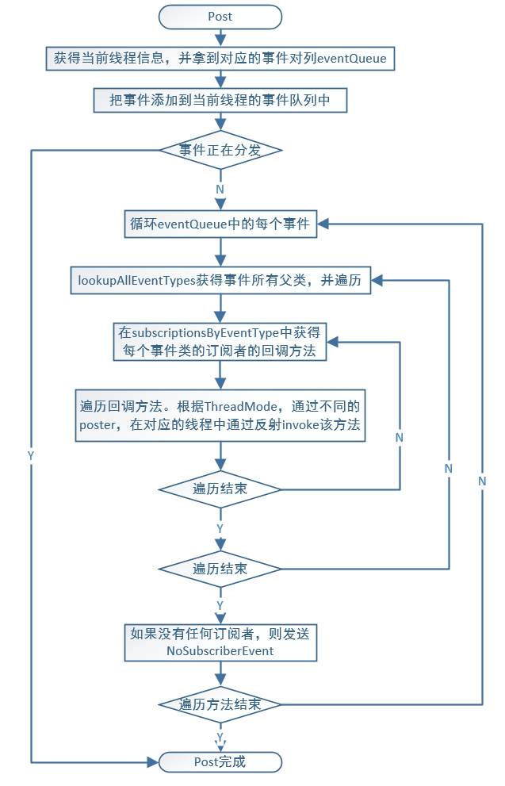

4、订阅者取消注册

```
public synchronized void unregister(Object subscriber) {
    List<Class<?>> subscribedTypes = typesBySubscriber.get(subscriber);
    if (subscribedTypes != null) {
        for (Class<?> eventType : subscribedTypes) {
            unsubscribeByEventType(subscriber, eventType);
        }
        typesBySubscriber.remove(subscriber);
    } else {
        logger.log(Level.WARNING, "Subscriber to unregister was not registered before: " + subscriber.getClass());
    }
}
```

typesBySubscriber我们在订阅者注册的过程中讲到过这个属性，他根据订阅者找到EventType，然后根据EventType和订阅者来得到订阅事件来对订阅者进行解绑。


三、核心架构与利弊

1、核心架构


从EventBus作者提供的图我们可以看到EventBus的核心架构，其实就是基于观察者模式来实现的

2、利与弊

EventBus好处比较明显，它能够解耦和，将业务和视图分离，代码实现比较容易。而且3.0后，我们可以通过apt预编译找到订阅者，避免了运行期间的反射处理解析，大大提高了效率。当然EventBus也会带来一些隐患和弊端，如果滥用的话会导致逻辑的分散并造成维护起来的困难。另外大量采用EventBus代码的可读性也会变差。

## 保活

一、7.0一下保活

进程保活的关键点有两个，一个是进程优先级的理解，优先级越高存活几率越大。二是弄清楚哪些场景会导致进程会kill，然后采取下面的策略对各种场景进行优化：

1. 提高进程的优先级
2. 在进程被kill之后能够唤醒

1、进程优先级

Android一般的进程优先级划分：

1. 前台进程 (Foreground process)
2. 可见进程 (Visible process)
3. 服务进程 (Service process)
4. 后台进程 (Background process)
5. 空进程 (Empty process)

这是一种粗略的划分，进程其实有一种具体的数值，称作oom_adj，注意：数值越大优先级越低：


* 红色部分是容易被回收的进程，属于android进程
* 绿色部分是较难被回收的进程，属于android进程
* 其他部分则不是android进程，也不会被系统回收，一般是ROM自带的app和服务才能拥有

2、进程被kill的场景

1.点击home键使app长时间停留在后台，内存不足被kill

处理这种情况前提是你的app至少运行了一个service，然后通过Service.startForeground() 设置为前台服务，可以将oom_adj的数值由4降低到1，大大提高存活率。

* 要注意的是android4.3之后Service.startForeground() 会强制弹出通知栏，解决办法是再启动一个service和推送共用一个通知栏，然后stop这个service使得通知栏消失。
* Android 7.1之后google修复这个bug，目前没有解决办法

下面的代码放到你的service的onStartCommand方法中：

```
//设置service为前台服务，提高优先级
if (Build.VERSION.SDK_INT < 18) {
    //Android4.3以下 ，此方法能有效隐藏Notification上的图标
    service.startForeground(GRAY_SERVICE_ID, new Notification());
} else if(Build.VERSION.SDK_INT>18 && Build.VERSION.SDK_INT<25){
    //Android4.3 - Android7.0，此方法能有效隐藏Notification上的图标
    Intent innerIntent = new Intent(service, GrayInnerService.class);
    service.startService(innerIntent);
    service.startForeground(GRAY_SERVICE_ID, new Notification());
}else{
    //Android7.1 google修复了此漏洞，暂无解决方法（现状：Android7.1以上app启动后通知栏会出现一条"正在运行"的通知消息）
    service.startForeground(GRAY_SERVICE_ID, new Notification());
}
```

2.在大多数国产手机下，进入锁屏状态一段时间，省电机制会kill后台进程

这种情况和上面不太一样，是很过国产手机rom自带的优化，当锁屏一段时间之后，即使手机内存够用为了省电，也会释放掉一部分内存。

策略：注册广播监听锁屏和解锁事件， 锁屏后启动一个1像素的透明Activity，这样直接把进程的oom_adj数值降低到0，0是android进程的最高优先级。 解锁后销毁这个透明Activity。这里我把这个Activity放到:remote进程也就是我那个后台服务进程，当然你也可以放到主进程，看你打算保活哪个进程。

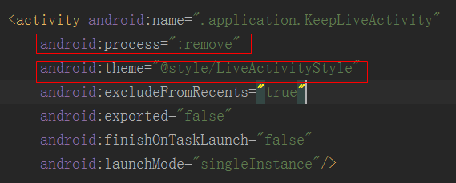

我们可以写一个KeepLiveManager来负责接收广播，维护这个Activity的创建和销毁，注意锁屏广播和解锁分别是：ACTION_SCREEN_OOF和ACTION_USER_PRESENT，并且只能通过动态注册来绑定，并且是绑定到你的后台service里面,onCreate绑定,onDestroy里面解绑

3.用户手动释放内存：包括手机自带清理工具，和第三方app（360，猎豹清理大师等）

理内存软件会把优先级低于 前台进程(oom_adj = 0)的所有进程放入清理列表，而当我们打开了清理软件就意味着其他app不可能处于前台。所以说理论上可以kill任何app。

因此这类场景唯一的处理办法就是加入手机rom 白名单，比如你打开小米，魅族的权限管理 -> 自启动管理可以看到 QQ，微信，天猫默认被勾选，这就是厂商合作。那我们普通app可以这么做：在app的设置界面加一个选项，提示用户自己去勾选自启动。

3、进程唤醒

分两种情况，一是主进程（含有Activity没有service），这种进程由于内存不足被kill之后，用户再次打开app系统会恢复到上次的Activity。另一种是service的后台进程被kill，可以通过service自有api来重启service：

```
@Override
public int onStartCommand(Intent intent, int flags, int startId) {
    // service被异常停止后，系统尝试重启service，不能保证100%重启成功
    return START_STICKY;    
}
```

但它不是100%保证重启成功，比如下面2种情况：

Service 第一次被异常杀死后会在5秒内重启，第二次被杀死会在10秒内重启，第三次会在20秒内重启，一旦在短时间内 Service 被杀死达到5次，则系统不再拉起。

进程被取得 Root 权限的管理工具或系统工具通过 forestop 停止掉，无法重启。

4、结论

1.和Android版本关系很大

对于Android6.0以及以下的大部分机型还是有效果的，但是Android7.0和Android8.0基本上所有机型全部阵亡，大部分后台进程在锁屏后无法存活超过20分钟。
这个可以从Android 6.0，7.0和8.0的新特性看出一些端倪，google对于内存/电量使用越来越严格。


2.和手机厂商关系比较大，测试结果显示，oppo/vivo这两家厂商进程保活最困难，小米和三星比较宽松。其他的机型居中

二、2018年Android的保活方案效果统计

1、常见保活方案

1. 监听广播：监听全局的静态广播，比如时间更新的广播、开机广播、解锁屏、网络状态、解锁加锁亮屏暗屏（3.1版本），高版本需要应用开机后运行一次才能监听这些系统广播，目前此方案失效。可以更换思路，做APP启动后的保活（监听广播启动保活的前台服务）
2. 定时器、JobScheduler：假如应用被系统杀死，那么定时器则失效，此方案失效。JobService在5.0,5.1,6.0作用很大，7.0时候有一定影响（可以在电源管理中给APP授权）
3. 双进程（NDK方式Fork子进程）、双Service守护：高版本已失效，5.0起系统回收策略改成进程组。双Service方案也改成了应用被杀，任何后台Service无法正常状态运行
4. 提高Service优先级：只能一定程度上缓解Service被立马回收

2、保活

1. AIDL方式单进程、双进程方式保活Service
2. 降低oom_adj的值：常驻通知栏（可通过启动另外一个服务关闭Notification，不对oom_adj值有影响）、使用”1像素“的Activity覆盖在getWindow()的view上、循环播放无声音频（黑科技，7.0下杀不掉）
3. 监听锁屏广播：使Activity始终保持前台
4. 使用自定义锁屏界面：覆盖了系统锁屏界面。
5. 通过android:process属性来为Service创建一个进程
6. 跳转到系统白名单界面让用户自己添加app进入白名单

3、复活

1. JobScheduler：原理类似定时器，5.0,5.1,6.0作用很大，7.0时候有一定影响（可以在电源管理中给APP授权）
2. 推送互相唤醒复活：极光、友盟、以及各大厂商的推送
3. 同派系APP广播互相唤醒：比如今日头条系、阿里系

4、方案实现效果统计

1.双进程守护方案（基于onStartCommand() return START_STICKY）

结论：除了华为此方案无效以及未更改底层的厂商不起作用外（START_STICKY字段就可以保持Service不被杀）。此方案可以与其他方案混合使用

2.监听锁屏广播打开1像素Activity（基于onStartCommand() return START_STICKY）

结论：此方案无效果

3.故意在后台播放无声的音乐（基于onStartCommand() return START_STICKY）

结论：成功对华为手机保活。小米8下也成功突破20分钟

4.使用JobScheduler唤醒Service（基于onStartCommand() return START_STICKY）

结论：只对5.0，5.1、6.0起作用

5.混合使用的效果，并且在通知栏弹出通知

结论：高版本情况下可以使用弹出通知栏、双进程、无声音乐提高后台服务的保活概率

## https原理

一、什么是HTTP协议？

HTTP协议全称Hyper Text Transfer Protocol，翻译过来就是超文本传输协议，位于TCP/IP四层模型当中的应用层。

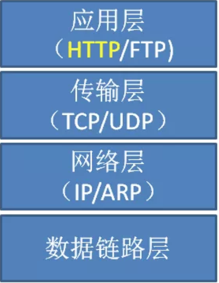

HTTP协议通过请求/响应的方式，在客户端和服务端之间进行通信。


这一切看起来很美好，但是HTTP协议有一个致命的缺点：不够安全。

HTTP协议的信息传输完全以明文方式，不做任何加密，相当于是在网络上“裸奔”。这样会导致什么问题呢？让我们打一个比方：

小灰是客户端，小灰的同事小红是服务端，有一天小灰试图给小红发送请求。


但是，由于传输信息是明文，这个信息有可能被某个中间人恶意截获甚至篡改。这种行为叫做中间人攻击。


如何进行加密呢？

小灰和小红可以事先约定一种对称加密方式，并且约定一个随机生成的密钥。后续的通信中，信息发送方都使用密钥对信息加密，而信息接收方通过同样的密钥对信息解密。


这样做是不是就绝对安全了呢？并不是。

虽然我们在后续的通信中对明文进行了加密，但是第一次约定加密方式和密钥的通信仍然是明文，如果第一次通信就已经被拦截了，那么密钥就会泄露给中间人，中间人仍然可以解密后续所有的通信内容。

这可怎么办呢？别担心，我们可以使用非对称加密，为密钥的传输做一层额外的保护。

非对称加密的一组秘钥对中，包含一个公钥和一个私钥。明文既可以用公钥加密，用私钥解密；也可以用私钥加密，用公钥解密。

在小灰和小红建立通信的时候，小红首先把自己的公钥Key1发给小灰：

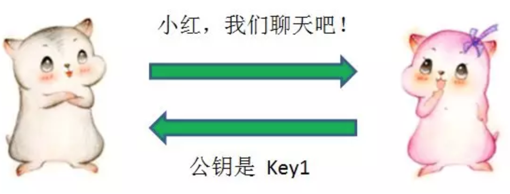

收到小红的公钥以后，小灰自己生成一个用于对称加密的密钥Key2，并且用刚才接收的公钥Key1对Key2进行加密（这里有点绕），发送给小红：


小红利用自己非对称加密的私钥，解开了公钥Key1的加密，获得了Key2的内容。从此以后，两人就可以利用Key2进行对称加密的通信了。


在通信过程中，即使中间人在一开始就截获了公钥Key1，由于不知道私钥是什么，也无从解密。

存在问题:中间人虽然不知道小红的私钥是什么，但是在截获了小红的公钥Key1之后，却可以偷天换日，自己另外生成一对公钥私钥，把自己的公钥Key3发送给小灰。

小灰不知道公钥被偷偷换过，以为Key3就是小红的公钥。于是按照先前的流程，用Key3加密了自己生成的对称加密密钥Key2，发送给小红。

这一次通信再次被中间人截获，中间人先用自己的私钥解开了Key3的加密，获得Key2，然后再用当初小红发来的Key1重新加密，再发给小红。


这样一来，两个人后续的通信尽管用Key2做了对称加密，但是中间人已经掌握了Key2，所以可以轻松进行解密。

这时候，我们有必要引入第三方，一个权威的证书颁发机构（CA）来解决。

到底什么是证书呢？证书包含如下信息：

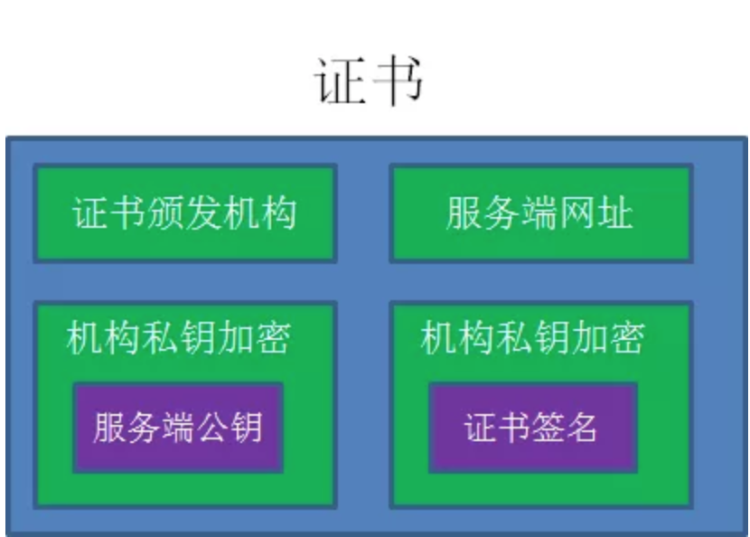

流程如下：

1. 作为服务端的小红，首先把自己的公钥发给证书颁发机构，向证书颁发机构申请证书。
2. 证书颁发机构自己也有一对公钥私钥。机构利用自己的私钥来加密Key1，并且通过服务端网址等信息生成一个证书签名，证书签名同样经过机构的私钥加密。证书制作完成后，机构把证书发送给了服务端小红。
3. 当小灰向小红请求通信的时候，小红不再直接返回自己的公钥，而是把自己申请的证书返回给小灰。
4. 小灰收到证书以后，要做的第一件事情是验证证书的真伪。需要说明的是，各大浏览器和操作系统已经维护了所有权威证书机构的名称和公钥。所以小灰只需要知道是哪个机构颁布的证书，就可以从本地找到对应的机构公钥，解密出证书签名。

接下来，小灰按照同样的签名规则，自己也生成一个证书签名，如果两个签名一致，说明证书是有效的。

验证成功后，小灰就可以放心地再次利用机构公钥，解密出服务端小红的公钥Key1。

5. 像之前一样，小灰生成自己的对称加密密钥Key2，并且用服务端公钥Key1加密Key2，发送给小红。
6. 最后，小红用自己的私钥解开加密，得到对称加密密钥Key2。于是两人开始用Key2进行对称加密的通信。

二、HTTPS实现原理

在学习HTTPS原理之前我们先了解一下两种加密方式： 对称加密和非对称加密。 对称加密即加密和解密使用同一个密钥，虽然对称加密破解难度很大，但由于对称加密需要在网络上传输密钥和密文，一旦被黑客截取很容就能被破解，因此对称加密并不是一个较好的选择。 

非对称加密即加密和解密使用不同的密钥，分别称为公钥和私钥。我们可以用公钥对数据进行加密，但必须要用私钥才能解密。在网络上只需要传送公钥，私钥保存在服务端用于解密公钥加密后的密文。但是非对称加密消耗的CPU资源非常大，效率很低，严重影响HTTPS的性能和速度。因此非对称加密也不是HTTPS的理想选择。

那么HTTPS采用了怎样的加密方式呢？其实为了提高安全性和效率HTTPS结合了对称和非对称两种加密方式。即客户端使用对称加密生成密钥（key）对传输数据进行加密，然后使用非对称加密的公钥再对key进行加密。因此网络上传输的数据是被key加密的密文和用公钥加密后的密文key，因此即使被黑客截取，由于没有私钥，无法获取到明文key，便无法获取到明文数据。所以HTTPS的加密方式是安全的。

接下来我们以TLS1.2为例来认识HTTPS的握手过程。

* 客户端发送 client_hello，包含一个随机数 random1。 
* 服务端回复 server_hello，包含一个随机数 random2，携带了证书公钥 P。 
* 客户端接收到 random2 之后就能够生成 premaster_secrect （对称加密的密钥）以及 master_secrect（用premaster_secret加密后的数据）。 
* 客户端使用证书公钥 P 将 premaster_secrect 加密后发送给服务器 (用公钥P对premaster_secret加密)。 
* 服务端使用私钥解密得到 premaster_secrect。又由于服务端之前就收到了随机数 1，所以服务端根据相同的生成算法，在相同的输入参数下，求出了相同的 master secrect。


三、数字证书

我们上面提到了HTTPS的工作原理，通过对称加密和非对称加密实现数据的安全传输。我们也知道非对称加密过程需要用到公钥进行加密。那么公钥从何而来？其实公钥就被包含在数字证书中。数字证书通常来说是由受信任的数字证书颁发机构CA，在验证服务器身份后颁发，证书中包含了一个密钥对（公钥和私钥）和所有者识别信息。数字证书被放到服务端，具有服务器身份验证和数据传输加密功能。

除了CA机构颁发的证书之外，还有非CA机构颁发的证书和自签名证书。

非CA机构即是不受信任的机构颁发的证书，理所当然这样的证书是不受信任的。
自签名证书，就是自己给自己颁发的证书。当然自签名证书也是不受信任的。
例如大(chou)名(ming)鼎(zhao)鼎(zhu)的12306网站使用的就是非CA机构颁发的证书（最近发现12306购票页面已经改为CA证书了），12306的证书是由SRCA颁发，SRCA中文名叫中铁数字证书认证中心，简称中铁CA。这是个铁道部自己搞的机构，相当于是自己给自己颁发证书。

说了这么多，我们来总结一下数字证书的两个作用：

> 分发公钥。每个数字证书都包含了注册者生成的公钥。在 TLS握手时会通过 certificate 消息传输给客户端。
> 身份授权。确保客户端访问的网站是经过 CA 验证的可信任的网站。（在自签名证书的情况下可以验证是否是我们自己的服务器）

## Binder应用层总结与分析

一、为何选择Binder

1、Linux现有的所有进程间IPC方式：

1. 管道：在创建时分配一个page大小的内存，缓存区大小比较有限；
2. 消息队列：信息复制两次，额外的CPU消耗；不合适频繁或信息量大的通信；
3. 共享内存：无须复制，共享缓冲区直接付附加到进程虚拟地址空间，速度快；但进程间的同步问题操作系统无法实现，必须各进程利用同步工具解决；
4. 套接字：作为更通用的接口，传输效率低，主要用于不通机器或跨网络的通信；
5. 信号量：常作为一种锁机制，防止某进程正在访问共享资源时，其他进程也访问该资源。因此，主要作为进程间以及同一进程内不同线程之间的同步手段。
6. 信号: 不适用于信息交换，更适用于进程中断控制，比如非法内存访问，杀死某个进程等；

2、Binder的好处

（1）从性能的角度 数据拷贝次数：Binder数据拷贝只需要一次，而管道、消息队列、Socket都需要2次，但共享内存方式一次内存拷贝都不需要；从性能角度看，Binder性能仅次于共享内存。

（2）从稳定性的角度Binder是基于C/S架构的，简单解释下C/S架构，是指客户端(Client)和服务端(Server)组成的架构，Client端有什么需求，直接发送给Server端去完成，架构清晰明朗，Server端与Client端相对独立，稳定性较好；而共享内存实现方式复杂，没有客户与服务端之别， 需要充分考虑到访问临界资源的并发同步问题，否则可能会出现死锁等问题；从这稳定性角度看，Binder架构优越于共享内存。仅仅从以上两点，各有优劣，还不足以支撑google去采用binder的IPC机制，那么更重要的原因是

（3）从安全的角度传统Linux IPC的接收方无法获得对方进程可靠的UID/PID，从而无法鉴别对方身份；而Android作为一个开放的开源体系，拥有非常多的开发平台，App来源甚广，因此手机的安全显得额外重要；对于普通用户，绝不希望从App商店下载偷窥隐射数据、后台造成手机耗电等等问题，传统Linux IPC无任何保护措施，完全由上层协议来确保。 Android为每个安装好的应用程序分配了自己的UID，故进程的UID是鉴别进程身份的重要标志，前面提到C/S架构，Android系统中对外只暴露Client端，Client端将任务发送给Server端，Server端会根据权限控制策略，判断UID/PID是否满足访问权限，目前权限控制很多时候是通过弹出权限询问对话框，让用户选择是否运行。Android 6.0，也称为Android M，在6.0之前的系统是在App第一次安装时，会将整个App所涉及的所有权限一次询问，只要留意看会发现很多App根本用不上通信录和短信，但在这一次性权限权限时会包含进去，让用户拒绝不得，因为拒绝后App无法正常使用，而一旦授权后，应用便可以胡作非为。针对这个问题，google在Android M做了调整，不再是安装时一并询问所有权限，而是在App运行过程中，需要哪个权限再弹框询问用户是否给相应的权限，对权限做了更细地控制，让用户有了更多的可控性，但同时也带来了另一个用户诟病的地方，那也就是权限询问的弹框的次数大幅度增多。对于Android M平台上，有些App开发者可能会写出让手机异常频繁弹框的App，企图直到用户授权为止，这对用户来说是不能忍的，用户最后吐槽的可不光是App，还有Android系统以及手机厂商，有些用户可能就跳果粉了，这还需要广大Android开发者以及手机厂商共同努力，共同打造安全与体验俱佳的Android手机。Android中权限控制策略有SELinux等多方面手段，下面列举从Binder的一个角度的权限控制：Android源码的Binder权限是如何控制？ -Gityuan的回答传统IPC只能由用户在数据包里填入UID/PID；另外，可靠的身份标记只有由IPC机制本身在内核中添加。其次传统IPC访问接入点是开放的，无法建立私有通道。从安全角度，Binder的安全性更高。说到这，可能有人要反驳，Android就算用了Binder架构，而现如今Android手机的各种流氓软件，不就是干着这种偷窥隐射，后台偷偷跑流量的事吗？没错，确实存在，但这不能说Binder的安全性不好，因为Android系统仍然是掌握主控权，可以控制这类App的流氓行为，只是对于该采用何种策略来控制，在这方面android的确存在很多有待进步的空间，这也是google以及各大手机厂商一直努力改善的地方之一。在Android 6.0，google对于app的权限问题作为较多的努力，大大收紧的应用权限；另外，在Google举办的Android Bootcamp 2016大会中，google也表示在Android 7.0 （也叫Android N）的权限隐私方面会进一步加强加固，比如SELinux，Memory safe language(还在research中)等等，在今年的5月18日至5月20日，google将推出Android N。 话题扯远了，继续说Binder。

（4）从语言层面的角度大家多知道Linux是基于C语言(面向过程的语言)，而Android是基于Java语言(面向对象的语句)，而对于Binder恰恰也符合面向对象的思想，将进程间通信转化为通过对某个Binder对象的引用调用该对象的方法，而其独特之处在于Binder对象是一个可以跨进程引用的对象，它的实体位于一个进程中，而它的引用却遍布于系统的各个进程之中。可以从一个进程传给其它进程，让大家都能访问同一Server，就像将一个对象或引用赋值给另一个引用一样。Binder模糊了进程边界，淡化了进程间通信过程，整个系统仿佛运行于同一个面向对象的程序之中。从语言层面，Binder更适合基于面向对象语言的Android系统，对于Linux系统可能会有点“水土不服”。另外，Binder是为Android这类系统而生，而并非Linux社区没有想到Binder IPC机制的存在，对于Linux社区的广大开发人员，我还是表示深深佩服，让世界有了如此精湛而美妙的开源系统。也并非Linux现有的IPC机制不够好，相反地，经过这么多优秀工程师的不断打磨，依然非常优秀，每种Linux的IPC机制都有存在的价值，同时在Android系统中也依然采用了大量Linux现有的IPC机制，根据每类IPC的原理特性，因时制宜，不同场景特性往往会采用其下最适宜的。比如在Android OS中的Zygote进程的IPC采用的是Socket（套接字）机制，Android中的Kill Process采用的signal（信号）机制等等。而Binder更多则用在system_server进程与上层App层的IPC交互。

(5) 从公司战略的角度总所周知，Linux内核是开源的系统，所开放源代码许可协议GPL保护，该协议具有“病毒式感染”的能力，怎么理解这句话呢？受GPL保护的Linux Kernel是运行在内核空间，对于上层的任何类库、服务、应用等运行在用户空间，一旦进行SysCall（系统调用），调用到底层Kernel，那么也必须遵循GPL协议。 而Android 之父 Andy Rubin对于GPL显然是不能接受的，为此，Google巧妙地将GPL协议控制在内核空间，将用户空间的协议采用Apache-2.0协议（允许基于Android的开发商不向社区反馈源码），同时在GPL协议与Apache-2.0之间的Lib库中采用BSD证授权方法，有效隔断了GPL的传染性，仍有较大争议，但至少目前缓解Android，让GPL止步于内核空间，这是Google在GPL Linux下 开源与商业化共存的一个成功典范。

二、Binder总体架构

在Android系统中，这个运行在内核空间的，负责各个用户进程通过Binder通信的内核模块叫做Binder驱动，Binder驱动虽然默默无闻，却是通信的核心。尽管名叫‘驱动’，实际上和硬件设备没有任何关系，只是实现方式和设备驱动程序是一样的。

> 面向对象思想的引入将进程间通信转化为通过对某个Binder对象的引用调用该对象的方法，而其独特之处在于Binder对象是一个可以跨进程引用的对象，它的实体位于一个进程中，而它的引用却遍布于系统的各个进程之中。最诱人的是，这个引用和java里引用一样既可以是强类型，也可以是弱类型，而且可以从一个进程传给其它进程，让大家都能访问同一Server，就象将一个对象或引用赋值给另一个引用一样。Binder模糊了进程边界，淡化了进程间通信过程，整个系统仿佛运行于同一个面向对象的程序之中。形形色色的Binder对象以及星罗棋布的引用仿佛粘接各个应用程序的胶水，这也是Binder在英文里的原意。

首先我们要理解我们说的Binder分为Binder对象和Binder驱动，即Binder驱动就是主要的内核模块，而这个Binder对象是通讯的载体，可以自由的通过Binder驱动自由穿梭任意进程。所以客户端或者服务器就可以把数据放入Binder对象里，然后进行调用和通讯。类似于胞吞胞吐吧。

Binder框架定义了四个角色：Server，Client，ServiceManager（以后简称SMgr）以及Binder驱动。其中Server，Client，SMgr运行于用户空间，驱动运行于内核空间。这四个角色的关系和互联网类似：Server是服务器，Client是客户终端，SMgr是域名服务器（DNS），驱动是路由器。


> 和DNS类似，SMgr的作用是将字符形式的Binder名字转化成Client中对该Binder的引用，使得Client能够通过Binder名字获得对Server中Binder实体的引用。注册了名字的Binder叫实名Binder，就象每个网站除了有IP地址外还有自己的网址。Server创建了Binder实体，为其取一个字符形式，可读易记的名字，将这个Binder连同名字以数据包的形式通过Binder驱动发送给SMgr，通知SMgr注册一个名叫张三的Binder，它位于某个Server中。驱动为这个穿过进程边界的Binder创建位于内核中的实体节点以及SMgr对实体的引用，将名字及新建的引用打包传递给SMgr。SMgr收数据包后，从中取出名字和引用填入一张查找表中。Server向SMgr注册了Binder引用及其名字后，Client就可以通过名字获得该Binder的引用了。

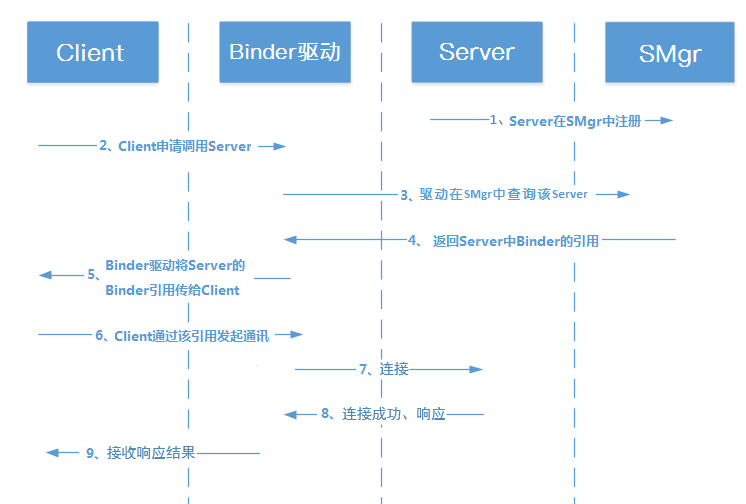

三、Binder原理

Binder通信采用C/S架构，从组件视角来说，包含Client、Server、ServiceManager以及binder驱动，其中ServiceManager用于管理系统中的各种服务。架构图如下所示：


> 可以看出无论是注册服务和获取服务的过程都需要ServiceManager，需要注意的是此处的Service Manager是指Native层的ServiceManager（C++），并非指framework层的ServiceManager(Java)。ServiceManager是整个Binder通信机制的大管家，是Android进程间通信机制Binder的守护进程，要掌握Binder机制，首先需要了解系统是如何首次启动Service Manager。当Service Manager启动之后，Client端和Server端通信时都需要先获取Service Manager接口，才能开始通信服务。

> 图中Client/Server/ServiceManage之间的相互通信都是基于Binder机制。既然基于Binder机制通信，那么同样也是C/S架构，则图中的3大步骤都有相应的Client端与Server端。

> 注册服务(addService)：Server进程要先注册Service到ServiceManager。该过程：Server是客户端，ServiceManager是服务端。
获取服务(getService)：Client进程使用某个Service前，须先向ServiceManager中获取相应的Service。该过程：Client是客户端，ServiceManager是服务端。
使用服务：Client根据得到的Service信息建立与Service所在的Server进程通信的通路，然后就可以直接与Service交互。该过程：client是客户端，server是服务端。
图中的Client,Server,Service Manager之间交互都是虚线表示，是由于它们彼此之间不是直接交互的，而是都通过与Binder驱动进行交互的，从而实现IPC通信方式。其中Binder驱动位于内核空间，Client,Server,Service Manager位于用户空间。Binder驱动和Service Manager可以看做是Android平台的基础架构，而Client和Server是Android的应用层，开发人员只需自定义实现client、Server端，借助Android的基本平台架构便可以直接进行IPC通信。

四、Binder通信模型

看到这里想必对Binder的一个整体构架有了大致的了解，另外通过一个栗子来描述一下整体过程。

> 回想一下日常生活中我们通信的过程：假设A和B要进行通信，通信的媒介是打电话（A是Client，B是Server）；A要给B打电话，必须知道B的号码，这个号码怎么获取呢？通信录.

> 先查阅通信录，拿到B的号码；才能进行通信；否则，怎么知道应该拨什么号码？回想一下古老的电话机，如果A要给B打电话，必须先连接通话中心，说明给我接通B的电话；这时候通话中心帮他呼叫B；连接建立，就完成了通信。

> 另外，光有电话和通信录是不可能完成通信的，没有基站支持；信息根本无法传达。

> 我们看到，一次电话通信的过程除了通信的双方还有两个隐藏角色：通信录和基站。Binder通信机制也是一样：两个运行在用户空间的进程要完成通信，必须借助内核的帮助，这个运行在内核里面的程序叫做Binder驱动，它的功能类似于基站；通信录呢，就是一个叫做ServiceManager的东西（简称SMgr）


整个通信步骤如下：

1. SM建立(建立通信录)；首先有一个进程向驱动提出申请为SM；驱动同意之后，SM进程负责管理Service（注意这里是Service而不是Server，因为如果通信过程反过来的话，那么原来的客户端Client也会成为服务端Server）不过这时候通信录还是空的，一个号码都没有。
2. 各个Server向SM注册(完善通信录)；每个Server端进程启动之后，向SM报告，我是zhangsan, 要找我请返回0x1234(这个地址没有实际意义，类比)；其他Server进程依次如此；这样SM就建立了一张表，对应着各个Server的名字和地址；就好比B与A见面了，说存个我的号码吧，以后找我拨打10086；
3. Client想要与Server通信，首先询问SM；请告诉我如何联系zhangsan，SM收到后给他一个号码0x1234；Client收到之后，开心滴用这个号码拨通了Server的电话，于是就开始通信了。

> Server进程里面的Binder对象指的是Binder本地对象，Client里面的对象指的是Binder代理对象；在Binder对象进行跨进程传递的时候，Binder驱动会自动完成这两种类型的转换；因此Binder驱动必然保存了每一个跨越进程的Binder对象的相关信息；在驱动中，Binder本地对象的代表是一个叫做binder_node的数据结构，Binder代理对象是用binder_ref代表的；有的地方把Binder本地对象直接称作Binder实体，把Binder代理对象直接称作Binder引用（句柄）

1、ServiceManager 与实名Binder

> SMgr是一个进程，Server是另一个进程，Server向SMgr注册Binder必然会涉及进程间通信。当前实现的是进程间通信却又要用到进程间通信，这就好象蛋可以孵出鸡前提却是要找只鸡来孵蛋。Binder的实现比较巧妙：预先创造一只鸡来孵蛋：SMgr和其它进程同样采用Binder通信，SMgr是Server端，有自己的Binder对象（实体），其它进程都是Client，需要通过这个Binder的引用来实现Binder的注册，查询和获取。SMgr提供的Binder比较特殊，它没有名字也不需要注册，当一个进程使用BINDER_SET_CONTEXT_MGR命令将自己注册成SMgr时Binder驱动会自动为它创建Binder实体（这就是那只预先造好的鸡）。其次这个Binder的引用在所有Client中都固定为0而无须通过其它手段获得。也就是说，一个Server若要向SMgr注册自己Binder就必需通过0这个引用号和SMgr的Binder通信。类比网络通信，0号引用就好比域名服务器的地址，你必须预先手工或动态配置好。要注意这里说的Client是相对SMgr而言的，一个应用程序可能是个提供服务的Server，但对SMgr来说它仍然是个Client。


* 首先，Server在自己的进程中向Binder驱动申请创建一个Server的Binder的实体。
* Binder驱动为这个Server创建位于内核中的Binder实体节点以及Binder的引用。(在Binder驱动中创建一块内存)
* 然后Server通过0这个引用号和SMgr的Binder通信将名字和新建的引用打包传递给SM（实体没有传给SM），通知SM注册一个名叫XXX的Server。
* SM收到数据包后，从中取出Server名字和引用，填入一张查找表中。

Server初始化的时候，SMgr做了一下操作：

* 为binder分配128k的内存
* 通知binder驱动，使自身成为binder驱动的“DNS”
* 维护一个监听Server的死循环，并且维护持有所有Server句柄的svclist
* 添加Server的时候，进行权限，内存（充足）进行判断，如果没有添加过则将Server添加至svclist。

2、Client 获得实名Binder的引用

Server向SMgr注册了Binder引用及其名字后，Client就可以通过名字获得该Binder的引用了。Client也利用保留的0号引用向SMgr请求访问某个Binder：我申请获得名字叫张三的Binder的引用。SMgr收到这个连接请求，从请求数据包里获得Binder的名字，在查找表里找到该名字对应的条目，从条目中取出Binder的引用，将该引用作为回复发送给发起请求的Client。从面向对象的角度，这个Binder对象现在有了两个引用：一个位于SMgr中，一个位于发起请求的Client中。如果接下来有更多的Client请求该Binder，系统中就会有更多的引用指向该Binder，就象java里一个对象存在多个引用一样。而且类似的这些指向Binder的引用是强类型，从而确保只要有引用Binder实体就不会被释放掉。通过以上过程可以看出，SMgr象个火车票代售点，收集了所有火车的车票，可以通过它购买到乘坐各趟火车的票-得到某个Binder的引用。

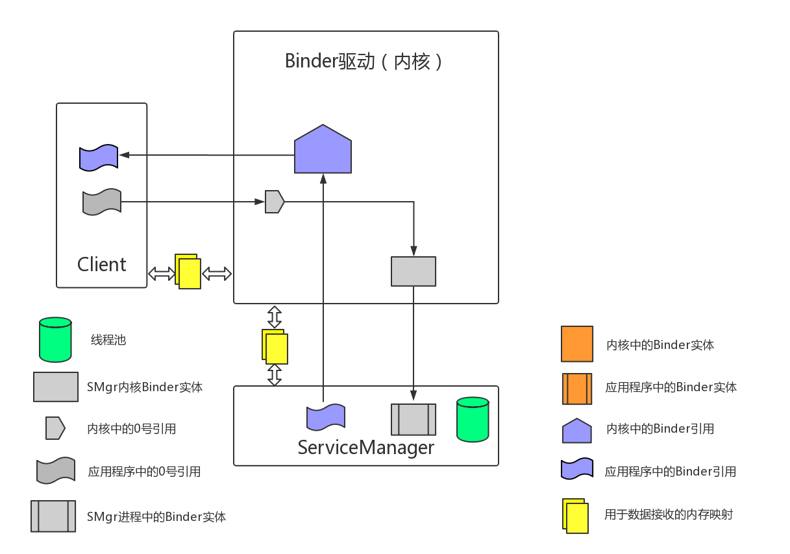

3、Client 与 Server通讯

Client向SM发送申请服务Server的请求，那么SM就可以在查找表中找到该Service的Binder引用，并把Binder引用(BpBinder)返回给Client，此时Client便可以通过这个引用向Server（间接）发起调用，Binder引用将参数包装然后交给驱动并获取Server的调用结果。


4、Binder的线程管理

每个Binder的Server进程会创建很多线程来处理Binder请求，可以简单的理解为创建了一个Binder的线程池吧（虽然实际上并不完全是这样简单的线程管理方式），而真正管理这些线程并不是由这个Server端来管理的，而是由Binder驱动进行管理的。

一个进程的Binder线程数默认最大是16，超过的请求会被阻塞等待空闲的Binder线程。理解这一点的话，你做进程间通信时处理并发问题就会有一个底，比如使用ContentProvider时（又一个使用Binder机制的组件），你就很清楚它的CRUD（创建、检索、更新和删除）方法只能同时有16个线程在跑。(应用与ContentProvider为不同进程时)

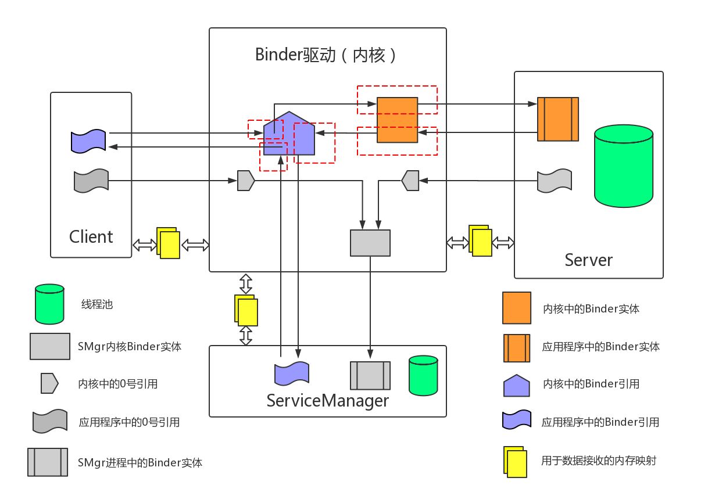


## Jvm、Dalvik和Art的区别

1、JVM Java虚拟机

JVM(Java Virtual Machine)是一种软件实现，执行像物理程序的机器。JVM并是不专为Java所实现运行的，只要其他编程语言的编译器能生成Java字节码，那这个语言也能实现在JVM上运行。因此，JVM通过执行Java bytecode可以使java代码在不改变的情况下在各种硬件之上。

2、Dalvik 虚拟机

DVM是Google专门为Android平台开发的虚拟机，它运行在Android运行时库中。Dalvik虚拟机是基于apache的java虚拟机，并被改进以适应低内存，低处理器速度的移动设备环境。Dalvik虚拟机依赖于Linux内核，实现进程隔离与线程调试管理，安全和异常管理，垃圾回收等重要功能。

3、DVM与JVM的区别

DVM之所以不是一个JVM ，主要原因是DVM并没有遵循JVM规范来实现。DVM与JVM主要有以下区别。

* 基于的架构不同

JVM基于栈则意味着需要去栈中读写数据，所需的指令会更多，这样会导致速度慢，对于性能有限的移动设备，显然不是很适合。
DVM是基于寄存器的，它没有基于栈的虚拟机在拷贝数据而使用的大量的出入栈指令，同时指令更紧凑更简洁。但是由于显示指定了操作数，所以基于寄存器的指令会比基于栈的指令要大，但是由于指令数量的减少，总的代码数不会增加多少。

* 执行的字节码不同

在Java SE程序中，Java类会被编译成一个或多个.class文件，打包成jar文件，而后JVM会通过相应的.class文件和jar文件获取相应的字节码。执行顺序为： .java文件 -> .class文件 -> .jar文件
而DVM会用dx工具将所有的.class文件转换为一个.dex文件，然后DVM会从该.dex文件读取指令和数据。执行顺序为：.java文件 –>.class文件-> .dex文件


.jar文件里面包含多个.class文件，每个.class文件里面包含了该类的常量池、类信息、属性等等。当JVM加载该.jar文件的时候，会加载里面的所有的.class文件，JVM的这种加载方式很慢，对于内存有限的移动设备并不合适。
而在.apk文件中只包含了一个.dex文件，这个.dex文件里面将所有的.class里面所包含的信息全部整合在一起了，这样再加载就提高了速度。.class文件存在很多的冗余信息，dex工具会去除冗余信息，并把所有的.class文件整合到.dex文件中，减少了I/O操作，提高了类的查找速度。

* DVM允许在有限的内存中同时运行多个进程

DVM经过优化，允许在有限的内存中同时运行多个进程。在Android中的每一个应用都运行在一个DVM实例中，每一个DVM实例都运行在一个独立的进程空间。独立的进程可以防止在虚拟机崩溃的时候所有程序都被关闭。

4、ART虚拟机

ART(Android Runtime)是Android 4.4发布的，用来替换Dalvik虚拟，Android 4.4默认采用的还是DVM，系统会提供一个选项来开启ART。在Android 5.0时，默认采用ART，DVM从此退出历史舞台。

* ART与DVM的区别

ART 的机制与 Dalvik 不同。在Dalvik下，应用每次运行的时候，字节码都需要通过即时编译器（just in time ，JIT）转换为机器码，这会拖慢应用的运行效率，而在ART 环境中，应用在第一次安装的时候，字节码就会预先编译成机器码，使其成为真正的本地应用。这个过程叫做预编译（AOT,Ahead-Of-Time）。这样的话，应用的启动(首次)和执行都会变得更加快速。

Dalvik与Art的区别：

* Dalvik每次都要编译再运行，Art只会首次启动编译
* Art占用空间比Dalvik大（原生代码占用的存储空间更大），就是用“空间换时间”
* Art减少编译，减少了CPU使用频率，使用明显改善电池续航
* Art应用启动更快、运行更快、体验更流畅、触感反馈更及时

ART、Dalvik、AOT、JIT四个名称的关系：

* JIT代表运行时编译策略，也可以理解成一种运行时编译器，是为了加快Dalvik虚拟机解释dex速度提出的一种技术方案，来缓存频繁使用的本地机器码
* ART和Dalvik都算是一种Android运行时环境，或者叫做虚拟机，用来解释dex类型文件。但是ART是安装时解释，Dalvik是运行时解释
* AOT可以理解为一种编译策略，即运行前编译，ART虚拟机的主要特征就是AOT

## App打包原理

一、apk解压后的目录

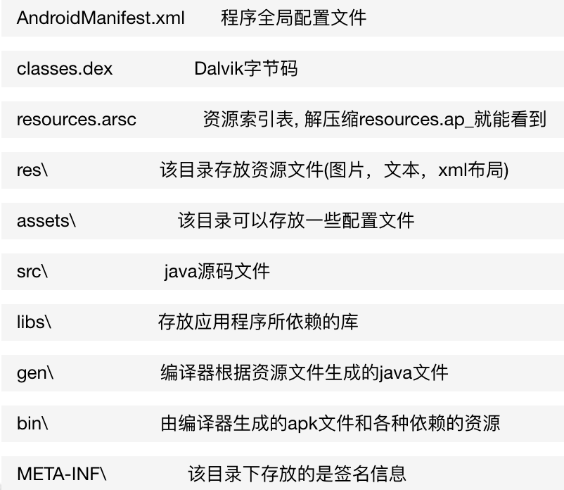

二、构建步骤：

1. AAPT（Android Asset Packaging Tool）工具，Android资源打包工具。会打包资源文件（res文件夹下的文件），并生成R.java和resources.arsc文件。
2. AIDL工具会将所有的.aidl文件编译成.java文件。
3. JAVAC工具将R.java、AIDL接口生成的java文件、应用代码java文件编译成.class文件。
4. dx脚本将很多.class文件转换打包成一个.dex文件。
5. apkbuilder脚本将资源文件和.dex文件生成未签名的.apk文件。
6. jarsigner对apk进行签名。

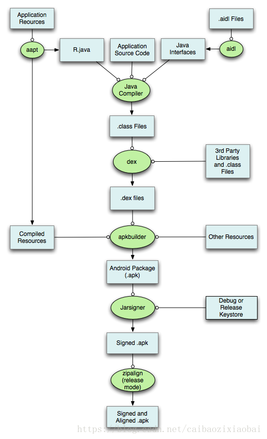

