## 内存泄漏优化

### 内存泄漏

一些对象有着有限的生命周期，当这些对象所要做的事情完成了，我们希望它们会被垃圾回收器回收掉。但是如果有一系列对这个对象的引用存在，那么在我们期待这个对象生命周期结束时被垃圾回收器回收的时候，它是不会被回收的。它还会占用内存，这就造成了内存泄露。持续累加，内存很快被耗尽。

比如：当Activity的onDestroy()方法被调用后，Activity以及它涉及到的View和相关的Bitmap都应该被回收掉。但是，如果有一个后台线程持有这个Activity的引用，那么该Activity所占用的内存就不能被回收，这最终将会导致内存耗尽引发OOM而让应用crash掉。

### 内存泄漏造成什么影响

它是造成应用程序OOM的主要原因之一。由于android系统为每个应用程序分配的内存有限，当一个应用中产生的内存泄漏比较多时，就难免会导致应用所需要的内存超过这个系统分配的内存限额

### 内存泄漏产生原因

1、错误使用单例造成的内存泄漏

在平时开发中单例设计模式是我们经常使用的一种设计模式，而在开发中单例经常需要持有Context对象，如果持有的Context对象生命周期比单例生命周期更短时，或导致Context无法被释放回收，则有可能造成内存泄漏，错误写法如下：

```
public class LoginManager {
    private static LoginManager mInstance;
    private Context mContext;

    private LoginManager(Context context) {
        this.mContext = context;          
        //修改代码：this.mContext = context.getApplicationContext();
    }

    public static LoginManager getInstance(Context context) {
        if (mInstance == null) {
            synchronized (LoginManager.class) {
                if (mInstance == null) {
                    mInstance = new LoginManager(context);
                }
            }
        }
        return mInstance;
    }

    public void dealData() {}
}
```

解决办法：

要保证Context和AppLication的生命周期一样，修改后代码如下：

```
this.mContext = context.getApplicationContext();
```

1. 如果此时传入的是 Application 的 Context，因为 Application 的生命周期就是整个应用的生命周期，所以这将没有任何问题。
2. 如果此时传入的是 Activity 的 Context，当这个 Context 所对应的 Activity 退出时，由于该 Context 的引用被单例对象所持有，其生命周期等于整个应用程序的生命周期，所以当前 Activity 退出时它的内存并不会被回收，这就造成泄漏了。

2、Handler使用不当造成内存泄漏

handler是工作线程与UI线程之间通讯的桥梁，只是现在大量开源框架对其进行了封装，我们这里模拟一种常见使用方式来模拟内存泄漏情形。

解决Handler内存泄露主要2点

* 有延时消息，要在Activity销毁的时候移除Messages
* 匿名内部类导致的泄露改为匿名静态内部类，并且对上下文或者Activity使用弱引用。

1.问题代码

```
public class MainActivity extends AppCompatActivity {
    private Handler mHandler = new Handler();
    private TextView mTextView;
    @Override
    protected void onCreate(Bundle savedInstanceState) {
        super.onCreate(savedInstanceState);
        setContentView(R.layout.activity_main);
        mTextView = (TextView) findViewById(R.id.text);        //模拟内存泄露
        mHandler.postDelayed(new Runnable() {
            @Override
            public void run() {
                mTextView.setText("yangchong");
            }
        }, 2000);
    }
}
```

2.造成内存泄漏原因分析

上述代码通过内部类的方式创建mHandler对象,此时mHandler会隐式地持有一个外部类对象引用这里就是MainActivity，当执行postDelayed方法时，该方法会将你的Handler装入一个Message，并把这条Message推到MessageQueue中，MessageQueue是在一个Looper线程中不断轮询处理消息，那么当这个Activity退出时消息队列中还有未处理的消息或者正在处理消息，而消息队列中的Message持有mHandler实例的引用，mHandler又持有Activity的引用，所以导致该Activity的内存资源无法及时回收，引发内存泄漏。

3.解决方案

* 第一种解决办法

 * 要想避免Handler引起内存泄漏问题，需要我们在Activity关闭退出的时候的移除消息队列中所有消息和所有的Runnable。
 * 上述代码只需在onDestroy()函数中调用mHandler.removeCallbacksAndMessages(null);就行了。

```
@Override
protected void onDestroy() {
    super.onDestroy();
    if(handler!=null){
        handler.removeCallbacksAndMessages(null);
        handler = null;
    }
}
```

* 第二种解决方案

使用弱引用解决handler内存泄漏问题

```
//自定义handler
public static class HandlerHolder extends Handler {
    WeakReference<OnReceiveMessageListener> mListenerWeakReference;
    /**
     * @param listener 收到消息回调接口
     */
    HandlerHolder(OnReceiveMessageListener listener) {
        mListenerWeakReference = new WeakReference<>(listener);
    }

    @Override
    public void handleMessage(Message msg) {
        if (mListenerWeakReference!=null && mListenerWeakReference.get()!=null){
            mListenerWeakReference.get().handlerMessage(msg);
        }
    }
}

//创建handler对象
private HandlerHolder handler = new HandlerHolder(new OnReceiveMessageListener() {
    @Override
    public void handlerMessage(Message msg) {
        switch (msg.what){
            case 1:
                TextView textView1 = (TextView) msg.obj;
                showBottomInAnimation(textView1);
                break;
            case 2:
                TextView textView2 = (TextView) msg.obj;
                showBottomOutAnimation(textView2);
                break;
        }
    }
});

//发送消息
Message message = new Message();
message.what = 1;
message.obj = textView;
handler.sendMessageDelayed(message,time);

即推荐使用静态内部类 + WeakReference 这种方式。每次使用前注意判空。
```

3、Thread未关闭造成内容泄漏

当在开启一个子线程用于执行一个耗时操作后，此时如果改变配置（例如横竖屏切换）导致了Activity重新创建，一般来说旧Activity就将交给GC进行回收。但如果创建的线程被声明为非静态内部类或者匿名类，那么线程会保持有旧Activity的隐式引用。当线程的run()方法还没有执行结束时，线程是不会被销毁的，因此导致所引用的旧的Activity也不会被销毁，并且与该Activity相关的所有资源文件也不会被回收，因此造成严重的内存泄露。

因此总结来看， 线程产生内存泄露的主要原因有两点：

1. 线程生命周期的不可控。Activity中的Thread和AsyncTask并不会因为Activity销毁而销毁，Thread会一直等到run()执行结束才会停止，AsyncTask的doInBackground()方法同理
2. 非静态的内部类和匿名类会隐式地持有一个外部类的引用

例如如下代码，在onCreate()方法中启动一个线程，并用一个静态变量threadIndex标记当前创建的是第几个线程
```
public class ThreadActivity extends AppCompatActivity {

    private final String TAG = "ThreadActivity";

    private static int threadIndex;

    @Override
    protected void onCreate(Bundle savedInstanceState) {
        super.onCreate(savedInstanceState);
        setContentView(R.layout.activity_thread);
        threadIndex++;
        new Thread(new Runnable() {
            @Override
            public void run() {
                int j = threadIndex;
                while (true) {
                    Log.e(TAG, "Hi--" + j);
                    try {
                        Thread.sleep(2000);
                    } catch (InterruptedException e) {
                        e.printStackTrace();
                    }
                }
            }
        }).start();
    }

}
```

即使创建了新的Activity，旧的Activity中建立的线程依然还在执行，从而导致无法释放Activity占用的内存，从而造成严重的内存泄漏。想要避免因为 Thread 造成内存泄漏，可以在 Activity 退出后主动停止 Thread

解决方案：

1.可以为 Thread 设置一个布尔变量 threadSwitch 来控制线程的启动与停止

```
public class ThreadActivity extends AppCompatActivity {

    private final String TAG = "ThreadActivity";

    private int threadIndex;

    private boolean threadSwitch = true;

    @Override
    protected void onCreate(Bundle savedInstanceState) {
        super.onCreate(savedInstanceState);
        setContentView(R.layout.activity_thread);
        threadIndex++;
        new Thread(new Runnable() {
            @Override
            public void run() {
                int j = threadIndex;
                while (threadSwitch) {
                    Log.e(TAG, "Hi--" + j);
                    try {
                        Thread.sleep(2000);
                    } catch (InterruptedException e) {
                        e.printStackTrace();
                    }
                }
            }
        }).start();
    }

    @Override
    protected void onDestroy() {
        super.onDestroy();
        threadSwitch = false;
    }

}
```

2.如果想保持Thread继续运行，可以按以下步骤来：

1. 将线程改为静态内部类，切断Activity 对于Thread的强引用
2. 在线程内部采用弱引用保存Context引用，切断Thread对于Activity 的强引用

```
public class ThreadActivity extends AppCompatActivity {

    private static final String TAG = "ThreadActivity";

    private static int threadIndex;

    @Override
    protected void onCreate(Bundle savedInstanceState) {
        super.onCreate(savedInstanceState);
        setContentView(R.layout.activity_thread);
        threadIndex++;
        new MyThread(this).start();
    }

    private static class MyThread extends Thread {

        private WeakReference<ThreadActivity> activityWeakReference;

        MyThread(ThreadActivity threadActivity) {
            activityWeakReference = new WeakReference<>(threadActivity);
        }

        @Override
        public void run() {
            if (activityWeakReference == null) {
                return;
            }
            if (activityWeakReference.get() != null) {
                int i = threadIndex;
                while (true) {
                    Log.e(TAG, "Hi--" + i);
                    try {
                        Thread.sleep(2000);
                    } catch (InterruptedException e) {
                        e.printStackTrace();
                    }
                }
            }
        }
    }
}
```

4、错误使用静态变量导致引用后无法销毁

在平时开发中，有时候我们创建了一个工具类。比如分享工具类，十分方便多处调用，因此使用静态方法是十分方便的。但是创建的对象，建议不要全局化，全局化的变量必须加上static。这样会引起内存泄漏！

1.解决办法

静态方法中，创建对象或变量，不要全局化，全局化后的变量或者对象会导致内存泄漏；

```
非静态内部类，静态实例化
public class MyActivity extends AppCompatActivity {
    //静态成员变量
    public static InnerClass innerClass = null;

    @Override
    protected void onCreate(Bundle savedInstanceState) {
        super.onCreate(savedInstanceState);
        setContentView(R.layout.activity_my);
        innerClass = new InnerClass();
    }

    class InnerClass {
        public void doSomeThing() {}
    }
}
这里内部类InnerClass隐式的持有外部类MyActivity的引用，而在MyActivity的onCreate方法中调用了。
这样innerClass就会在MyActivity创建的时候是有了他的引用，而innerClass是静态类型的不会被垃圾回收，
MyActivity在执行onDestory方法的时候由于被innerClass持有了引用而无法被回收，所以这样MyActivity就总是被innerClass持有而无法回收造成内存泄露。

静态变量引用不当会导致内存泄漏
在下面这段代码中对Activity的Context和TextView设置为静态对象，从而产生内存泄漏。
public class MainActivity extends AppCompatActivity {

    private static Context context;
    private static TextView textView;

    @Override
    protected void onCreate(Bundle savedInstanceState) {
        super.onCreate(savedInstanceState);
        setContentView(R.layout.activity_main);
        context = this;
        textView = new TextView(this);
    }
}
```

5、AsyncTask造成的内存泄漏

早时期的时候处理耗时操作多数都是采用Thread+Handler的方式，后来逐步被AsyncTask取代，直到现在采用RxJava的方式来处理异步。这里以AsyncTask为例，可能大部分人都会这样处理一个耗时操作然后通知UI更新结果：

public class MainActivity extends AppCompatActivity {

    private AsyncTask<Void, Void, Integer> asyncTask;
    private TextView mTextView;

    @Override
    protected void onCreate(Bundle savedInstanceState) {
        super.onCreate(savedInstanceState);
        setContentView(R.layout.activity_main);
        mTextView = (TextView) findViewById(R.id.text);
        testAsyncTask();
        finish();
    }

    private void testAsyncTask() {
        asyncTask = new AsyncTask<Void, Void, Integer>() {
            @Override
            protected Integer doInBackground(Void... params) {
                int i = 0;
                //模拟耗时操作
                while (!isCancelled()) {
                    i++;
                    if (i > 1000000000) {
                        break;
                    }
                    Log.e("LeakCanary", "asyncTask---->" + i);
                }
                return i;
            }

            @Override
            protected void onPostExecute(Integer integer) {
                super.onPostExecute(integer);
                mTextView.setText(String.valueOf(integer));
            }
        };
        asyncTask.execute();
    }
}

1.内存泄漏原因分析
在处理一个比较耗时的操作时，可能还没处理结束MainActivity就执行了退出操作，但是此时AsyncTask依然持有对MainActivity的引用就会导致MainActivity无法释放回收引发内存泄漏

2.解决办法
在使用AsyncTask时，在Activity销毁时候也应该取消相应的任务AsyncTask.cancel()方法，避免任务在后台执行浪费资源，进而避免内存泄漏的发生

```
rivate void destroyAsyncTask() {
    if (asyncTask != null && !asyncTask.isCancelled()) {
        asyncTask.cancel(true);
    }
    asyncTask = null;
}

@Override
protected void onDestroy() {
    super.onDestroy();
    destroyAsyncTask();
}
```

6、非静态内部类创建静态实例造成内存泄漏

有的时候我们可能会在启动频繁的Activity中，为了避免重复创建相同的数据资源，可能会出现这种写法

```
private static TestResource mResource = null;
@Override
protected void onCreate(Bundle savedInstanceState) {
    super.onCreate(savedInstanceState);
    setContentView(R.layout.activity_main);
    if(mResource == null){
        mResource = new TestResource();
    }
}

class TestResource {
     //里面代码引用上下文，Activity.this会导致内存泄漏
}
```

1.解决办法
将该内部类设为静态内部类或将该内部类抽取出来封装成一个单例，如果需要使用Context，请按照上面推荐的使用Application 的 Context。

2.分析问题
这样就在Activity内部创建了一个非静态内部类的单例，每次启动Activity时都会使用该单例的数据，这样虽然避免了资源的重复创建，不过这种写法却会造成内存泄漏，因为非静态内部类默认会持有外部类的引用，而该非静态内部类又创建了一个静态的实例，该实例的生命周期和应用的一样长，这就导致了该静态实例一直会持有该Activity的引用，导致Activity的内存资源不能正常回收。

7、不需要用的监听未移除会发生内存泄露

1.解决办法
使用完后，一定要移除这个监听

8、资源未关闭造成的内存泄漏

BroadcastReceiver，ContentObserver，FileObserver，Cursor，Callback等在 Activity onDestroy 或者某类生命周期结束之后一定要 unregister 或者 close 掉，否则这个 Activity 类会被 system 强引用，不会被内存回收。值得注意的是，关闭的语句必须在finally中进行关闭，否则有可能因为异常未关闭资源，致使activity泄漏。

9、静态集合使用不当导致的内存泄漏

有时候我们需要把一些对象加入到集合容器（例如ArrayList）中，当不再需要当中某些对象时，如果不把该对象的引用从集合中清理掉，也会使得GC无法回收该对象。如果集合是static类型的话，那内存泄漏情况就会更为严重。因此，当不再需要某对象时，需要主动将之从集合中移除。

10、动画资源未释放导致内存泄漏

在属性动画中有一类无限循环动画，如果在Activity中播放这类动画并且没有在onDestroy中去停止动画，那么这个动画将会一直播放下去，这时候Activity会被View所持有，从而导致Activity无法被释放。解决此类问题则是需要早Activity中onDestroy去去调用objectAnimator.cancel()来停止动画。

### 内存泄漏检测工具

#### Memory Profiler

##### 简介
Memory Profiler是Android Profiler中的一个组件，Android Profiler是Android Studio3.0以后用来替换之前Android Monitor的观察工具，主要用来观察内存，网络，cpu温度。它能够让识别出来内存泄漏和内存抖动，导致应用卡顿，anr和crash. 它可以展示一个内存使用的真实图表，从而知道当时内存使用情况，还能强制内存回收，和跟踪内存分配。

##### 使用

1. 点击工具栏中的Profile按钮将待分析的App安装到设备上，也可以直接安装，在AS底部选择Android Profiler按钮
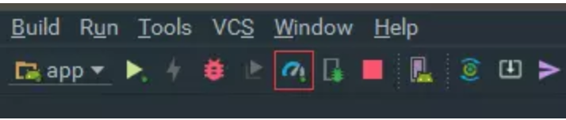

2. 进入Profiler
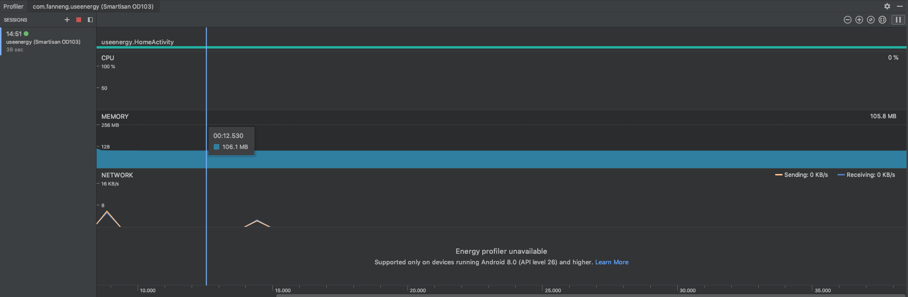

3. 点击MEMORY进入内存详情，在这里可以实时查看内存的占用情况
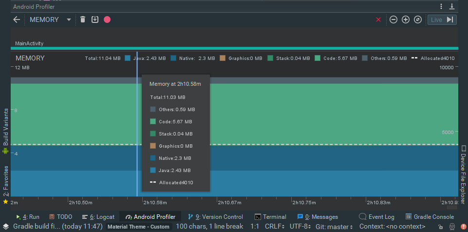

4. Memory Profiler主面板介绍
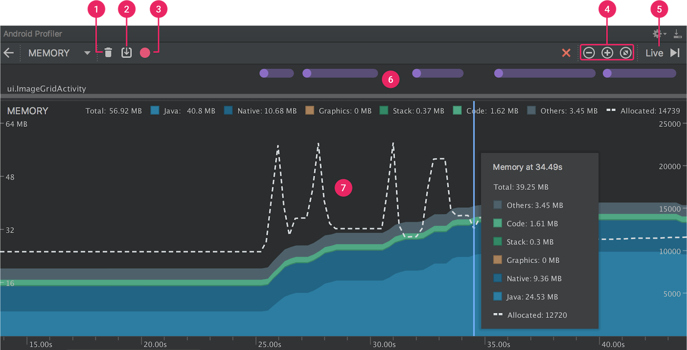

1: 强制内存回收按钮  
2: Dump the Java heap  
3: 开始／停止记录内存分配情况  
4: 缩小／放大时间线  
5: 实时播放内存分配情况（这个按钮点下试试便清楚了）  
6: 发生一些事件的记录(如Activity的跳转，事件的输入，屏幕的旋转)  
7: 内存使用时间线  

包含多少内存被使用（左边的y轴），还有顶上的颜色标记内存的类型，右边的y轴表明分配对象的个数,另外出现垃圾回收事件会有一个小图标。  

##### 关于顶部的几种内存类型介绍：  

* Java : java代码分配的内存  
* Native:c/c++代码分配的内存(有时候其实并没有使用到c/c++代码,但还是会有Native的内存分配，因为Android Framework会去通过java代码访问一些需要使用Native的资源，如图像资源Bitmap)  
* Graphics:图像缓存等，包括GL surfaces, GL textures等   
* Stack:栈内存（包括java和c/c++）  
* Code:代码的内存分配（例如代码，资源，libs等等）  
* Other:这个是连系统都不知道是什么类型的内存，放在这里  
* Allocated: jave分配的对象个数 (在Android7.1和以下的设备，这个计数是在设备连接后开始，所以并不是app启动时候的计数。Android8.0或更高，在系统里面内置的Profiler工具，所以无论什么时候连接，都是app启动时候的计数)  

##### 为什么要去观察应用内存的使用情况  

Memory Profiler是用来解决内存分配中产生抖动，导致应用卡顿，anr和crash问题. 在Android系统内存管理上，它是提供一套内存回收机制去回收无用的对象，其实就是Dalvik虚拟机的垃圾回收器，当垃圾回收器启动回收机制的时候，其实会对应用的运行产生一点影响，但是这种影响来说一般微乎其微，察觉不到。但是如果你的内存分配比垃圾回收快很多，这种情况可能导致垃圾回收器回收内存不及时，从而导致应用出现卡顿的现象.(这其实就是内存抖动所产生的影响). 另外一个问题就是内存泄漏，内存的持续泄漏可能导致内存溢出，从而app运行出现outofmem异常。

Memory Profiler通过以下方面防治上面出现的问题：

* 观察不必要的内存分配。（这种内存分配导致效率降低） 
* Dump the Java heap 去观察指定时间对象的在内存中的分配情况，若干次Dump能够帮助你发现内存泄漏
* 测试极端的用户交互情况下的内存分配（比如说狂点某个请求按钮），看看内存使用情况如何，是否出现内存抖动.

##### 观察对象分配

8.0以上的设备，不需要点击Memory Profiler主面板中的按钮3，就可以观察某一段时间的内存分配情况，如果是7.1或以下是需要点击按钮3开始和停止。

* Android8.0观察一段时间的内存分配情况  
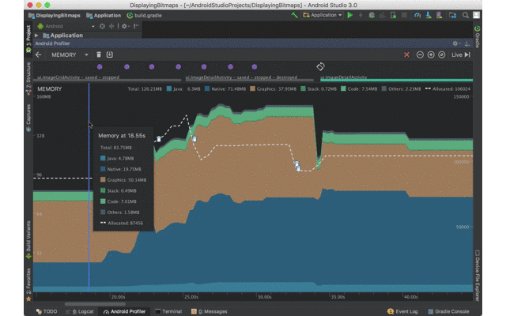

* Android7.1或以下观察一段时间的内存分配情况  
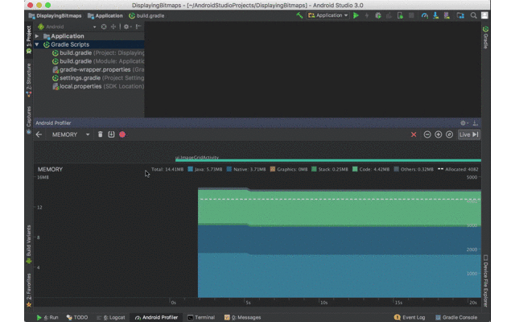  

当分析结束后会弹出如下面板:  
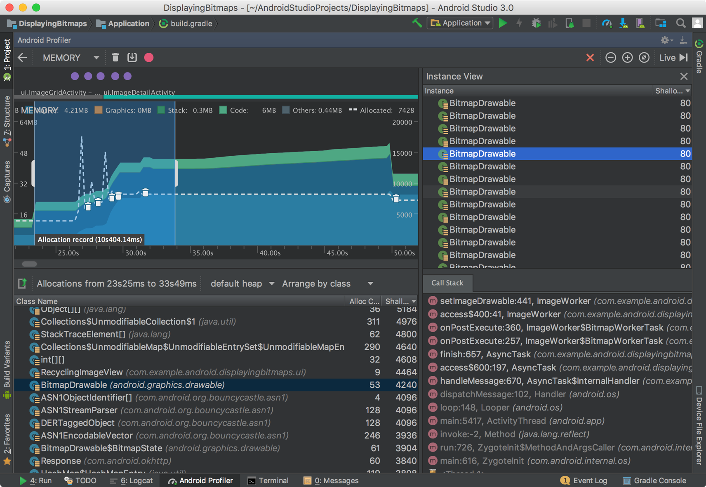

查看对象分配情况   

1. 在Class Name列看一下有没有异常分配的对象，个数很多，占用内存比较大。点击头部Class Name进行一个按字母排序操作，点击Class Name面板下面的类名可以看到Instance View面板详细的对象信息。
2. 点击Instance View面板中的对象，可以看到调用栈信息和调用的线程。
3. 在Call Stack中点击可以跳转到实际的代码。
以上是捕获一段时间的内存分配情况，如果想捕获一瞬间的内存分配需要用到heap dump。

##### 捕获一个heap dump

捕获一个heap dump观察某一个时间点的对象分配情况，注意之前介绍是一个时间段，而这里是时间点。它有助于帮助我们分析内存泄漏，比如当我应用使用一段时候后，捕获了一个heap dump，这个heap dump里面发现了并不应该存在的对象分配情况，这说明是存在内存泄漏的。通过一个heap dump你可以看到以下内容：  

1. 你的app分配了什么样的对象类型，每个类型分配了多少个数和大小。
2. 使用了多少内存。
3. 每个对象在代码中的使用位置。
4. 对象分配的调用栈情况。

捕获一个heap dump在工具栏中点击之前面板介绍中的按钮2，稍等一会儿便能够看到类似于之前记录内存分配后的面板弹出。


从该面板可以获得如下信息：

* Class Name : 这个很好理解，就是类名
* Allocations : 对象个数
* Native Size : c/c++层内存大小(bytes)
* Shallow Size : java层内存大小(bytes)
* Retained Size : 这个是这个类中所引用到的对象的总大小 * 该类对象的个数

当点击app heap下拉列表会出现3个选项

* Default heap: 这个我也不太明白是什么意思
* App heap: app中的堆分配
* Image heap: 图像的堆分配
* Zygote heap: 这个按照官方的解释是来自安卓系统fork进程的地方产生的写数据备份

当点击Arrange by class下拉列表会出现3个选项

* Arrange by class:根据类名进行分组
* Arrange by package:根据包名进行分组
* Arrange by callstack:根据调用栈进行分配

当我们点击其中一个类的时候会弹出一个新的Instance View面板,如下图：

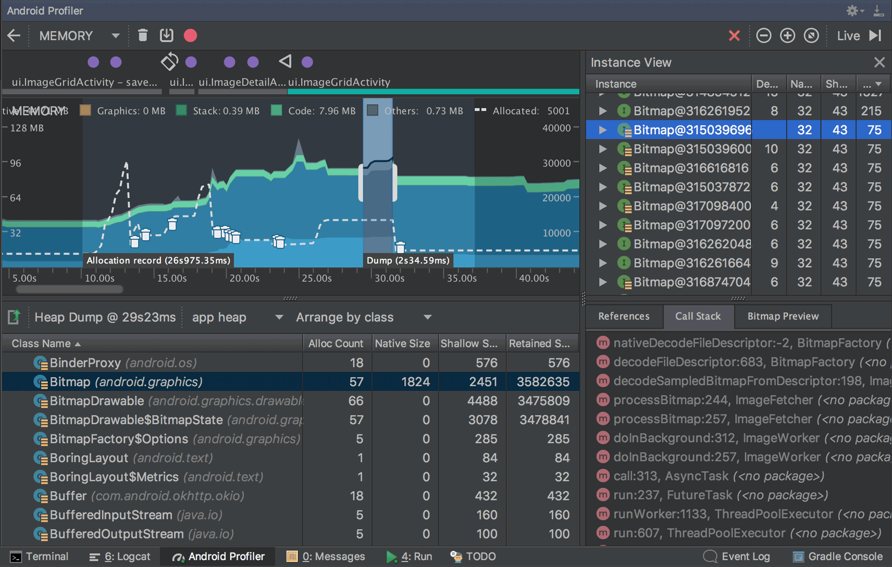

每列中包括以下：

* Depth: GC root到达该实例的最短跳数
* Native Size: c/c++层中内存的大小(bytes)
* Shallow Size:java层内存大小(bytes)
* Retained Size:这个类中所引用到的对象的总大小(bytes)
另外，heap dump是看不到调用栈信息的.也就是上图中的Call Stack面板。

分析你的heap,按照一下步骤:

1. 浏览Class Name列表,看看有没有大量对象存在，并且这些对象你认为是不应该存在的，可能存在内存泄漏的情况. 点击类名可以看到详细的对象信息.
2. 在这个Instance View面板中，点击一个实例References面板就会显示出来，里面都是使用该Instance的Reference，点击剪头可以看到引用它的所有区域。点击鼠标右键可以选择go to instance去看到引用该引用的引用，或者jump to source去看调用的源代码。

一般出现内存泄漏的原因有:

1. 长期引用到Activity,Context,View,Drawable的对象。
2. 非静态的内部类，例如Runnable它可以引用到Activity的实例
3. 一些长期缓存对象

##### 举例

查找内存泄漏方式：

1. 启动应用，看一下当前内存使用了多少，使用应用一段时间后, 退回到应用首页，看看当前内存又是多少。进行一次heap dump, 看看结果，分析一下有没有可疑的对象分配（比如说大量重复的Activity，同一个类型对象比较多，对象内存占用较大）。
2. 发现可疑点后，通过分析结果，可以找到相应代码，找到代码当然也能找到使用代码的场景，例如是Activity泄漏，反复进行画面的跳转，然后强制gc回收，看看内存是否存在只增不减的情况。
3. 使用allocation跟踪一段时间内存分配情况，拿出来做分析。

例子：

1. 首先启动一个疑似存在内存泄漏app,然后使用了一段时间，进行了一次heap dump, 结果如下：
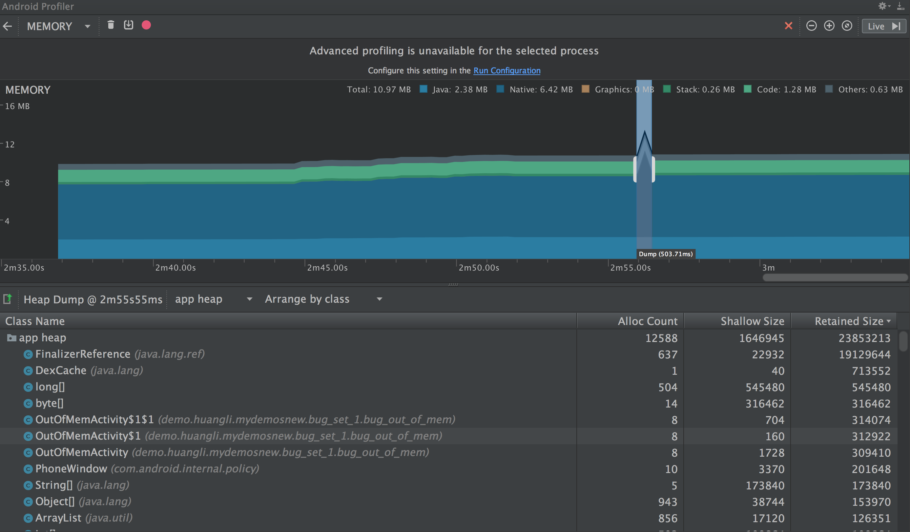

2. 发现了一个可疑的类OutOfMemActivity, 它存在多个实例，实际上在已知该app业务逻辑中是不应该会有这么多OutOfMemActivity实例的，于是我变点开它的Instance View。  
可疑点如红色剪头所指，因为外部类实例引用到Activity都是不正常的操作，这里Broadcast的实例引用到了Activity。
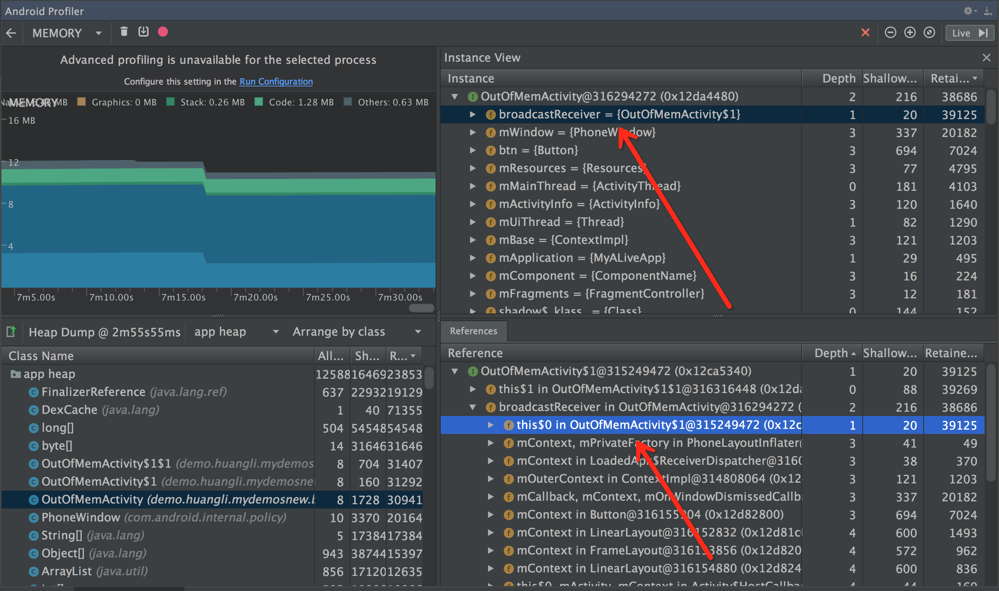

3. 点击跳转到源码，发现是内部类引用到外部类实例(Activity)的情况导致了内存泄漏。
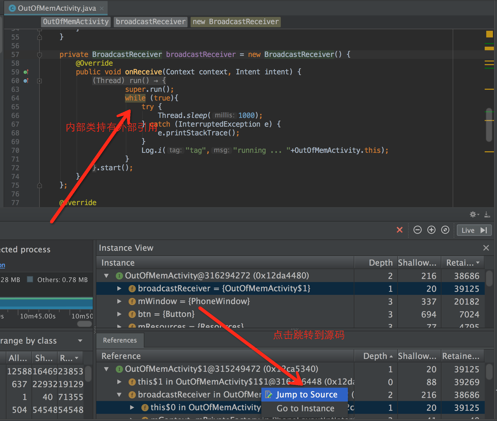

4. 修改导致内存泄漏的代码。

#### Leakcanary

##### 使用

```java
在app build.gradle 中加入引用：  
debugImplementation 'com.squareup.leakcanary:leakcanary-android:1.6.3'
releaseImplementation 'com.squareup.leakcanary:leakcanary-android-no-op:1.6.3'
debugImplementation 'com.squareup.leakcanary:leakcanary-support-fragment:1.6.3'
```
在Application中

```java
private RefWatcher refWatcher;
private void initLeak() {
    refWatcher = setupLeakCanary();
}

private RefWatcher setupLeakCanary() {
	if (LeakCanary.isInAnalyzerProcess(this)) {
	  return RefWatcher.DISABLED;
	}
	return LeakCanary.install(this);
}

public static RefWatcher getRefWatcher(Context context) {
    BaseApplication leakApplication = (BaseApplication) context.getApplicationContext();
    return leakApplication.refWatcher;
}
```
在AndroidManifest.xml中

```java
<uses-permission android:name="android.permission.WRITE_EXTERNAL_STORAGE" />
<uses-permission android:name="android.permission.MOUNT_UNMOUNT_FILESYSTEMS" />
```
在Acitivity的onCreate方法中

```java
BaseApplication.getRefWatcher(this).watch(this);
```
在Fragment的onDestroy方法中

```java
BaseApplication.getRefWatcher(this).watch(this);
```
当检测到某个Activity或者Frgment有内存泄露，LeakCanary 就会给出提示。

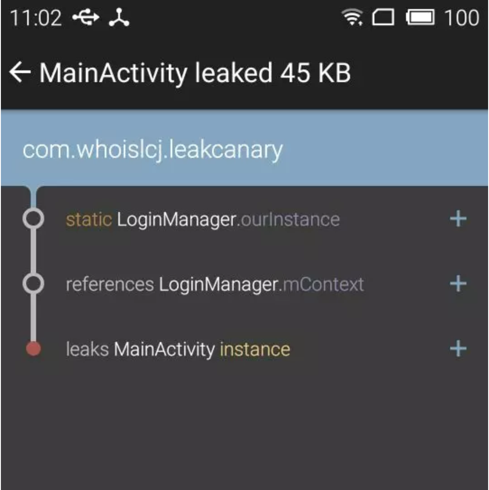

##### 原理介绍  

1. application启动时，通过application实例监听Activity和fragment生命周期。
2. 在 onDestroy 的时候，主线程空闲时，创建相应的 Refrence 和 RefrenceQueue，并启动后台进程去检测。
3. 一段时间之后，从 RefrenceQueue 读取，若读取不到相应 activity/fragment 的 Refrence，有可能发生泄露了，这个时候，再触发gc，一段时间之后，再去读取，若在从 RefrenceQueue 还是读取不到相应 activity 的 refrence，可以断定是发生内存泄露了。
4. 使用android.os.Debug包获取.hprof数据。
5. 发生内存泄露之后，dump，分析 hprof 文件，找到泄露路径（使用 haha 库分析），发送到通知栏  

##### 优缺点：

LeakCanary对于内存泄漏的检测非常有效，但也并不是所有的内存泄漏都能检测出来。

* 无法检测出Service中的内存泄漏问题。   
* 如果最底层的MainActivity一直未走onDestroy生命周期(它在Activity栈的最底层)，无法检测出它的调用栈的内存泄漏。  
所以说LeakCanary针对Activity/Fragment的内存泄漏检测非常好用，但是对于以上检测不到的情况，还得配合Android Monitor + MAT 来分析。

## 网络优化

1、图片网络优化

* 比如我之前看到豆瓣接口，提供一种加载图片方式特别好。接口返回图片的数据有三种，一种是高清大图，一种是正常图片，一种是缩略小图。当用户处于wifi下给控件设置高清大图，当4g或者3g模式下加载正常图片，当弱网条件下加载缩略图【也称与加载图】。
* 简单来说根据用户的当前的网络质量来判断下载什么质量的图片（电商用的比较多）。

2、获取网络数据优化

移动端获取网络数据优化的几个点

* 连接复用：节省连接建立时间，如开启 keep-alive。
 * 对于Android来说默认情况下HttpURLConnection和HttpClient都开启了keep-alive。只是2.2之前HttpURLConnection存在影响连接池的Bug，具体可见：Android HttpURLConnection及HttpClient选择 * 请求合并：即将多个请求合并为一个进行请求，比较常见的就是网页中的CSS Image Sprites。如果某个页面内请求过多，也可以考虑做一定的请求合并。
* 减少请求数据的大小：对于post请求，body可以做gzip压缩的，header也可以做数据压缩(不过只支持http)
* 返回数据的body也可以做gzip压缩，body数据体积可以缩小到原来的30%左右。（也可以考虑压缩返回的json数据的key数据的体积，尤其是针对返回数据格式变化不大的情况，支付宝聊天返回的数据用到了）

3、网络请求异常拦截优化

在获取数据的流程中，访问接口和解析数据时都有可能会出错，我们可以通过拦截器在这两层拦截错误。

1. 在访问接口时，我们不用设置拦截器，因为一旦出现错误，Retrofit会自动抛出异常。比如，常见请求异常404，500，503等等。
2. 在解析数据时，我们设置一个拦截器，判断Result里面的code是否为成功，如果不成功，则要根据与服务器约定好的错误码来抛出对应的异常。比如，token失效，禁用同账号登陆多台设备，缺少参数，参数传递异常等等。
3. 除此以外，为了我们要尽量避免在View层对错误进行判断，处理，我们必须还要设置一个拦截器，拦截onError事件，然后使用ExceptionUtils，让其根据错误类型来分别处理。

## 布局优化

1、常见布局优化方法

布局优化的核心就是尽量减少布局文件的层级，常见的方式有：

* 多嵌套情况下可使用RelativeLayout减少嵌套。
* 布局层级相同的情况下使用LinearLayout，它比RelativeLayout更高效。
* 使用标签重用布局、标签减少层级、标签懒加载。
* 当有多个组件有相似的属性时，可以使用styles，复用样式定义；
* 通过定义drawable来替代图片资源的使用，降低内存消耗；

2、其他一些小建议

* 减少太多重叠的背景(overdraw)
 * 这个问题其实最容易解决，建议就是检查你在布局和代码中设置的背景，有些背景是隐藏在底下的，它永远不可能显示出来，这种没必要的背景一定要移除，因为它很可能会严重影响到app的性能。如果采用的是selector的背景，将normal状态的color设置为”@android:color/transparent”,也同样可以解决问题。
* 避免复杂的Layout层级
 * 这里的建议比较多一些，首先推荐使用Android提供的布局工具Hierarchy Viewer来检查和优化布局。第一个建议是：如果嵌套的线性布局加深了布局层次，可以使用相对布局来取代。第二个建议是：用标签来合并布局。第三个建议是：用标签来重用布局，抽取通用的布局可以让布局的逻辑更清晰明了。记住，这些建议的最终目的都是使得你的Layout在Hierarchy Viewer里变得宽而浅，而不是窄而深。
 
总结：可以考虑多使用merge和include，ViewStub。尽量使布局浅平，根布局尽量少使用RelactivityLayout,因为RelactivityLayout每次需要测量2次

## 代码优化

1、lint去除无效资源和代码

* 如何检测哪些图片未被使用
点击菜单栏 Analyze -> Run Inspection by Name -> unused resources -> Moudule ‘app’ -> OK，这样会搜出来哪些未被使用到未使用到xml和图片

* 如何检测哪些无效代码
使用Android Studio的Lint，步骤：点击菜单栏 Analyze -> Run Inspection by Name -> unused declaration -> Moudule ‘app’ -> OK

2、代码规范优化

* 避免创建不必要的对象 不必要的对象应该避免创建：
 * 如果有需要拼接的字符串，那么可以优先考虑使用StringBuffer或者StringBuilder来进行拼接，而不是加号连接符，因为使用加号连接符会创建多余的对象，拼接的字符串越长，加号连接符的性能越低。
 * 当一个方法的返回值是String的时候，通常需要去判断一下这个String的作用是什么，如果明确知道调用方会将返回的String再进行拼接操作的话，可以考虑返回一个StringBuffer对象来代替，因为这样可以将一个对象的引用进行返回，而返回String的话就是创建了一个短生命周期的临时对象。
 * 尽可能地少创建临时对象，越少的对象意味着越少的GC操作。
 * onDraw方法里面不要执行对象的创建
* 静态优于抽象
 * 如果你并不需要访问一个对系那个中的某些字段，只是想调用它的某些方法来去完成一项通用的功能，那么可以将这个方法设置成静态方法，调用速度提升15%-20%，同时也不用为了调用这个方法去专门创建对象了，也不用担心调用这个方法后是否会改变对象的状态(静态方法无法访问非静态字段)。
* 对常量使用static final修饰符
 * static int intVal = 42; static String strVal = "Hello, world!";
 * 编译器会为上面的代码生成一个初始方法，称为方法，该方法会在定义类第一次被使用的时候调用。这个方法会将42的值赋值到intVal当中，从字符串常量表中提取一个引用赋值到strVal上。当赋值完成后，我们就可以通过字段搜寻的方式去访问具体的值了。
 * final进行优化:
 * static final int intVal = 42; static final String strVal = "Hello, world!";
这样，定义类就不需要方法了，因为所有的常量都会在dex文件的初始化器当中进行初始化。当我们调用intVal时可以直接指向42的值，而调用strVal会用一种相对轻量级的字符串常量方式，而不是字段搜寻的方式。
 * 这种优化方式只对基本数据类型以及String类型的常量有效，对于其他数据类型的常量是无效的。
* 在没有特殊原因的情况下，尽量使用基本数据类型来代替封装数据类型，int比Integer要更加有效，其它数据类型也是一样。
 * 基本数据类型的数组也要优于对象数据类型的数组。另外两个平行的数组要比一个封装好的对象数组更加高效，举个例子，Foo[]和Bar[]这样的数组，使用起来要比Custom(Foo,Bar)[]这样的一个数组高效的多。

## App线程优化

1、创建Thread弊端

直接创建Thread实现runnable方法的弊端

* 大量的线程的创建和销毁很容易导致GC频繁的执行，从而发生内存抖动现象，而发生了内存抖动，对于移动端来说，最大的影响就是造成界面卡顿
* 线程的创建和销毁都需要时间，当有大量的线程创建和销毁时，那么这些时间的消耗则比较明显，将导致性能上的缺失

2、为何要用线程池

重用线程池中的线程，避免频繁地创建和销毁线程带来的性能消耗；有效控制线程的最大并发数量，防止线程过大导致抢占资源造成系统阻塞；可以对线程进行一定地管理。

使用线程池管理的经典例子
RxJava，RxAndroid，底层对线程池的封装管理特别值得参考 

## 启动优化

#### 应用的启动方式

1、冷启动

冷启动指的是应用程序从头开始：系统的进程没有，直到此开始，创建了应用程序的进程。 在应用程序自设备启动以来第一次启动或系统杀死应用程序等情况下会发生冷启动。 这种类型的启动在最小化启动时间方面是最大的挑战，因为系统和应用程序比其他启动状态具有更多的工作。

2、热启动

与冷启动相比，热启动应用程序要简单得多，开销更低。在热启动，系统会把你活动放到前台，如果所有应用程序的活动仍驻留在内存中，那么应用程序可以避免重复对象初始化，UI的布局和渲染。
热启动显示与冷启动场景相同的屏幕行为：系统进程显示空白屏幕，直到应用程序完成呈现活动。

3、温启动

用户退出您的应用，但随后重新启动。该过程可能已继续运行，但应用程序必须通过调用onCreate（）从头开始重新创建活动。系统从内存中驱逐您的应用程序，然后用户重新启动它。进程和Activity需要重新启动，但任务可以从保存的实例状态包传递到onCreate（）中。

#### 为什么出现白屏

冷启动白屏持续时间可能会很长，这可是个槽糕的体验，它的启动速度是由于以下引起的：

1. Application的onCreate流程，对于大型的APP来说，通常会在这里做大量的通用组件的初始化操作；
建议：很多第三方SDK都放在Application初始化，我们可以放到用到的地方才进行初始化操作。
2. Activity的onCreate流程，特别是UI的布局与渲染操作，如果布局过于复杂很可能导致严重的启动性能问题；
建议：Activity仅初始化那些立即需要的对象，xml布局减少冗余或嵌套布局。

优化APP启动速度意义重大，启动时间过长，可能会使用户直接卸载APP。

#### App的启动流程

我们可以了解一下官方文档《App startup time》对App启动的描述。应用启动分为冷启动、热启动、温启动。而冷启动是应用程序从零开始，里面涉及到更复杂的知识。我们这次主要是对应用的冷启动进行分析和优化。应用在冷启动的时候，需要执行下面三个任务:

* 加载和启动应用程序；
* App启动之后立即展示出一个空白的启动窗口；
* 创建App程序的进程；

在这三个任务执行后，系统创建了应用进程，那么应用进程会执行下一步：

* 创建App对象；
* 启动主线程(main thread).；
* 创建启动页的Activity；
* 填充加载布局Views；
* 布置屏幕；
* 进行初始绘制；

当应用进程完成初始绘制之后，系统进程用启动页的Activity来替换当前显示的背景窗口Background Window，这个时刻用户就可以使用App了。下图显示为系统和应用程序的工作流程。

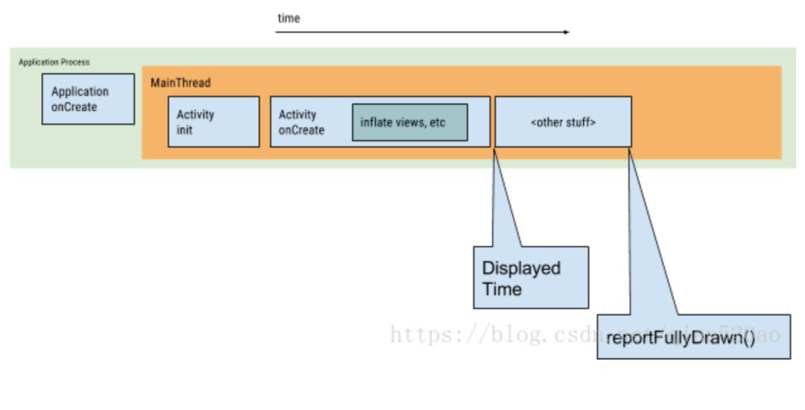

#### 应用的启动时间统计

```
adb shell am start -W [PackageName]/[PackageName.MainActivity]
adb shell am start -S -W 包名/启动类的全限定名 ， -S 表示重启当前应用
```

执行成功后将返回三个测量到的时间：

```
C:\Android\Demo>adb shell am start -S -W com.example.moneyqian.demo/com.example.moneyqian.demo.MainActivity
Stopping: com.example.moneyqian.demo
Starting: Intent { act=android.intent.action.MAIN cat=[android.intent.category.LAUNCHER] cmp=com.example.moneyqian.demo/.MainActivity }
Status: ok
Activity: com.example.moneyqian.demo/.MainActivity
ThisTime: 2247
TotalTime: 2247
WaitTime: 2278
Complete
```

这里面涉及到三个时间，ThisTime、TotalTime 和 WaitTime。

* WaitTime 是应用进程的创建过程 + TotalTime。
* ThisTime 是最后一个 Activity 的启动耗时(例如从 LaunchActivity - >MainActivity「adb命令输入的Activity」 , 只统计 MainActivity 的启动耗时)
* TotalTime 是指调用过程中第一个 Activity 的启动时间到最后一个 Activity 的 startActivityAndWait 结束。如果过程中只有一个 Activity ，则 TotalTime 等于 ThisTime。

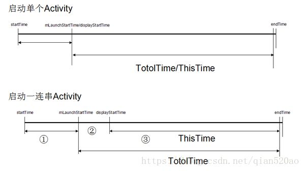

在第①个时间段内，AMS 创建 ActivityRecord 记录块和选择合理的 Task、将当前Resume 的 Activity 进行 pause.

在第②个时间段内，启动进程、调用无界面 Activity 的 onCreate() 等、 pause/finish 无界面的 Activity.

在第③个时间段内，调用有界面 Activity 的 onCreate、onResume.

总结:

* 如果只关心某个应用自身启动耗时，参考TotalTime；如果关心系统启动应用耗时，参考WaitTime；如果关心应用有界面Activity启动耗时，参考ThisTime。
* 如果需要统计从点击桌面图标到 Activity 启动完毕，可以用WaitTime作为标准，但是系统的启动时间优化不了，所以优化冷启动我们只要在意 ThisTime 即可。

#### 启动主题优化

冷启动阶段 : 

1. 加载并启动应用程序。 
2. 启动后立即显示应用程序空白的启动窗口。 
3. 创建应用程序进程。

所谓的主题优化，就是应用程序在冷启动的时候(1~2阶段)，设置启动窗口的主题。

因为现在 App 应用启动都会先进入一个闪屏页(LaunchActivity) 来展示应用信息。

1.默认情况

如果我们对App没有做处理(设置了默认主题)，并且在 Application 初始化了其它第三方的服务(假设需要加载2000ms)，那么冷启动过程就会如下 ：系统默认会在启动应用程序的时候启动空白窗口 ，直到App 应用程序的入口 Activity 创建成功，视图绘制完毕。( 大概是onWindowFocusChanged方法回调的时候 )

2.透明主题优化

为了解决启动窗口白屏问题，许多开发者使用透明主题来解决这个问题，但是治标不治本。

虽然解决了上面这个问题，但是仍然有些不足。

```
<!-- Base application theme. -->
<style name="AppTheme" parent="Theme.AppCompat.Light.DarkActionBar">
    <item name="android:windowFullscreen">true</item>
    <item name="android:windowIsTranslucent">true</item>
</style>
```

3.设置闪屏图片主题

为了更顺滑无缝衔接我们的闪屏页，可以在启动 Activity 的 Theme中设置闪屏页图片，这样启动窗口的图片就会是闪屏页图片，而不是白屏。

```
<!-- Base application theme. -->
<style name="AppTheme" parent="Theme.AppCompat.Light.DarkActionBar">
    <item name="android:windowBackground">@mipmap/launch</item>   //闪屏页图片
    <item name="android:windowFullscreen">true</item>
    <item name="android:windowContentOverlay">@null</item>
</style>
```

这样设置的话，就会在冷启动的时候，展示闪屏页的图片，等App进程初始化加载入口 Activity (也是闪屏页) 就可以无缝衔接。

其实这种方式并没有真正的加速应用进程的启动速度，而只是通过用户视觉效果带来的优化体验。

#### Application 优化

Application 作 应用程序的整个初始化配置入口，时常担负着它不应该有的负担。有很多第三方组件（包括App应用本身）都在 Application 中抢占先机，完成初始化操作。但是在 Application 中完成繁重的初始化操作和复杂的逻辑就会影响到应用的启动性能。通常，有机会优化这些工作以实现性能改进，这些常见问题包括：

* 复杂繁琐的布局初始化
* 阻塞主线程 UI 绘制的操作，如 I/O 读写或者是网络访问.
* Bitmap 大图片或者 VectorDrawable加载
* 其它占用主线程的操作

我们可以根据这些组件的轻重缓急之分，对初始化做一下分类 ：

* 必要的组件一定要在主线程中立即初始化(入口 Activity 可能立即会用到)
* 组件一定要在主线程中初始化，但是可以延迟初始化。
* 组件可以在子线程中初始化。

放在子线程的组件初始化建议延迟初始化 ，这样就可以了解是否会对项目造成影响！

所以对于上面的分析，我们可以在项目中 Application 的加载组件进行如下优化 ：

将Bugly，x5内核初始化，SP的读写，友盟等组件放到子线程中初始化。（子线程初始化不能影响到组件的使用）

```
new Thread(new Runnable() {
    @Override
    public void run() {
        //设置线程的优先级，不与主线程抢资源
        Process.setThreadPriority(Process.THREAD_PRIORITY_BACKGROUND);
        //子线程初始化第三方组件
        Thread.sleep(5000);//建议延迟初始化，可以发现是否影响其它功能，或者是崩溃！
    }
}).start();
```

将需要在主线程中初始化但是可以不用立即完成的动作延迟加载（原本是想在入口 Activity 中进行此项操作，不过组件的初始化放在 Application 中统一管理为妙.）

```
handler.postDelayed(new Runnable() {
    @Override
    public void run() {
        //延迟初始化组件
    }
}, 3000);
```

最后还剩下那些为数不多的组件在主线程初始化动作，例如埋点，点击流，数据库初始化等，不过这些消耗的时间可以在其它地方相抵。

#### 闪屏页业务优化

需求背景 ： 应用App通常会设置一个固定的闪屏页展示时间，例如2000ms，所以我们可以根据用户手机的运行速度，对展示时间做出调整，但是总时间仍然为 2000ms。

闪屏页政展示总时间 = 组件初始化时间 + 剩余展示时间。

也就是2000ms的总时间，组件初始化了800ms，那么就再展示1200ms即可。

冷启动的过程中系统会初始化应用程序进程，创建Application等任务，这时候会展示一个 启动窗口 Starting Window，上面分析了过，如果没有优化主题的话，那么就是白屏。 

分析源码后，我们可以知道 Application 初始化后会调用 attachBaseContext() 方法，再调用 Application 的 onCreate()，再到入口 Activity的创建和执行 onCreate() 方法。所以我们就可以在 Application 中记录启动时间。

```
//Application

@Override
protected void attachBaseContext(Context base) {
    super.attachBaseContext(base);
    SPUtil.putLong("application_attach_time", 
        System.currentTimeMillis());//记录Application初始化时间
}
``` 

有了启动时间，我们得知道入口的 Acitivty 显示给用户的时间（View绘制完毕），在（ View的工作流程）中了解到，在onWindowFocusChanged()的回调时机中表示可以获取用户的触摸时间和View的流程绘制完毕，所以我们可以在这个方法里记录显示时间。

```
//入口Activity

@Override
public void onWindowFocusChanged(boolean hasFocus) {
    super.onWindowFocusChanged(hasFocus);

      long appAttachTime = SPUtil.getLong("application_attach_time");
      long diffTime = System.currentTimeMillis() - appAttachTime;//从application到入口Acitity的时间

     //所以闪屏页展示的时间为 2000ms - diffTime.
}
```

所以我们就可以动态的设置应用闪屏的显示时间，尽量让每一部手机展示的时间一致，这样就不会让手机配置较低的用户感觉漫长难熬的闪屏页时间（例如初始化了2000ms，又要展示2000ms的闪屏页时间.），优化用户体验。

#### 广告页优化


闪屏页过后就要展示金主爸爸们的广告页了。

因为项目中广告页图片有可能是大图，APng动态图片，所以需要将这些图片下载到本地文件，下载完成后再显示，这个过程往往会遇到以下两个问题 ：

广告页的下载，由于这个是一个异步过程，所以往往不知道加载到页面的合适时机。

广告页的保存，因为保存是 I/O 流操作，很有可能被用户中断，下次拿到破损的图片。

因为不清楚用户的网络环境，有些用户下载广告页可能需要一段时间，这时候又不可能无限的等候。所以针对这个问题我们可以开启 IntentService 用来下载广告页图片。

在入口 Acitivity 中开启 IntentService 来下载广告页。 或者是其它异步下载操作。

在广告页图片 文件流完全写入后记录图片大小，或者记录一个标识。

在下次的广告页加载中可以判断是否已经下载好了广告页图片以及图片是否完整，否则删除并且再次下载图片。

另外因为在闪屏页中仍然有剩余展示时间，所以在这个时间段里如果用户已经下载好了图片并且图片完整，就可以显示广告页。否则进入主 Activity ， 因为 IntentService 仍然在后台继续默默的下载并保存图片~


## apk瘦身

#### 方案介绍

支付宝关于包大小优化，支付宝一直在这个方向上努力，因此我们引入了很多方案，比如 “proguard 代码混淆”，“图片从 png 到 tinypng 到 webp”，“引入 7zip 压缩方案”等。本方案是有别于上面这些常规的方案，是通过直接删 dex 中的无用信息，达到支付宝包大小瞬间减小 2.1M 的目的，并且不影响整个的运行逻辑和性能，甚至还能降低一点运行内存。

1、引言：

在讲详细方案前得稍微说说整个 Java 系的调试逻辑。JVM 运行时加载的是 .class 文件，Android 为了使包大小更紧凑，并且运行更高效发明了 dalvik 和 art 虚拟机，两种虚拟机运行的都是 .dex 文件(当然 art 虚拟机还可以同时运行 oat 文件，不在本文章讨论范围)。所以 dex 文件里面信息的内容和 class 文件包含的信息是完全一致的，不同的是 dex 文件对 class 中的信息做了去重，一个 dex 包含了很多的 class 文件，并且在结构上有比较大的差异，class 是流式的结构，dex 是分区结构，各个区块间通过 offset 索引。后面就只提 dex 的结构，不再提 class 的结构。dex 的结构可以用下面这张图表示：

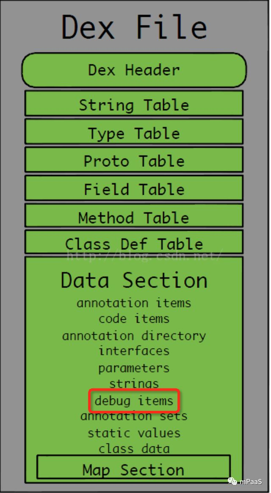

dex 文件的结构其实非常清晰，分几个大块，header 区，索引区，data 区，map 区。本优化方案优化删除的就是 data 区中的 debugItems 区域。

* debugItem 干吗用？

首先得知道 debugItem 里面存了什么？里面主要包含两种信息：

1. 函数的参数变量和所有的局部变量
2. 所有的指令集行号和源文件行号的对应关系有什么用呢？

第一点很明显，既然叫 debugItem，那么肯定就是 debug 的时候用。我们平时在用 IDE 进行断点和单步调试的时候都会用到这个区域。

第二点作用那就是上报 crash 或者主动获取调用堆栈的时候用。因为虚拟机真正执行的时候是执行的指令集，上报堆栈会上报 crash 的对应源文件行号，此时正是通过这个 debugItem 来获取对应的行号，可以用下面的截图比较直观的了解：

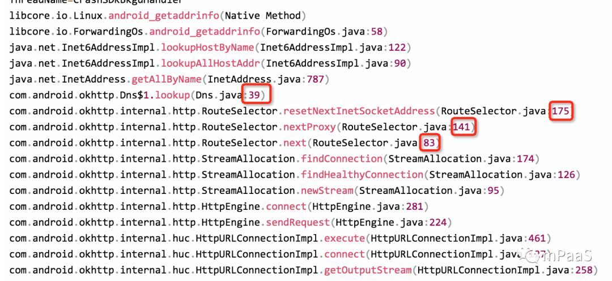

上图是一个比较常见的 crash 信息，红框中的行号便是通过查找这个 debugItem 来获取的。

* debugItem 有多大？

在支付宝的场景下，debug 包有 4-5M，release 包有 3.5M 左右，占 dex 文件大小的比例在 5.5% 左右，和 google 官方的数据是一致的。如果能把这部分直接去掉，是不是很诱人！

* debugItem 能直接去掉吗？

显然不能，如果去掉了，那所有上报的 crash 信息就会没有行号，所有的行号都会变成 -1，会被喷的找不到北。其实在 proguard 的时候就是有配置可以去掉或保留这个行号信息，-keep SourceFile, LineNumberTable 就是这个作用，为了方便定位问题，基本所有的开发都保留了这个配置。所以，方案的核心思路就是去掉 debugItem，同时又能让 crash 上报的时候能拿到正确的行号。至于 IDE 调试，这个比较好解决，我们只要处理 release 包就行了，debug 包不处理。

#### 方案一

核心思路也比较简单，就是行号查找离线化，让本来存放在 App 中的行号对应关系提前抽离出来存放在服务端，crash 上报的时候通过提前抽离的行号表进行行号反解，解决 crash 信息上报无行号，无法定位的问题。思路虽然简单，实现的时候还是有点复杂，推动上线也比较曲折，方案经过几次调整，大概的方案可以用下面一张图来抽象：

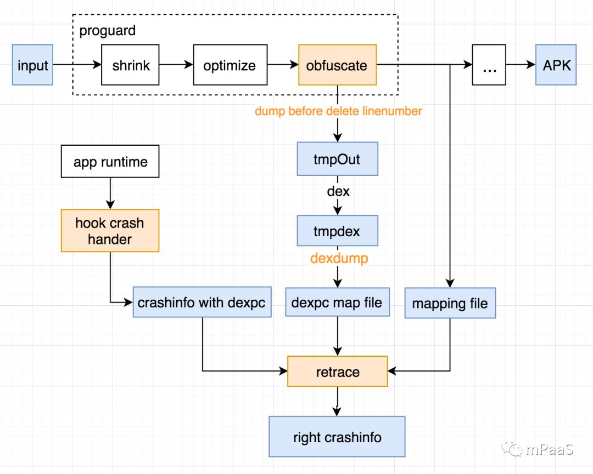

如上图，核心点有四个：

1. 修改 proguard：利用 proguard 来删除 debugItem （去掉 -keep lineNumberTable)，在删除行号表之前 dump 出一个临时的 dex。
2. 修改 dexdump：把临时的 dex 中的行号表关系 dump 成一个 dexpcmapping 文件(指令集行号和源文件行号映射关系)，并存至服务端。
3. hook app runtime 的 crash handler，把 crash 时的指令集行号上报到反解平台。
4. 反解平台通过上报指令集行号和提前准备好 dexpcmapping 文件反解出正确的行号。

上面这套方案大概花了两个多星期，撸出了整个 demo，其它几个改造点都不是很难，难点还是在指令集行号的上报。我们知道所有的 crash 最终都是会有一个 throwable 对象，里面保存了整个堆栈信息，经过反复的阅读源码和尝试，发现我要的指令集行号其实也在这个对象里面。可以用下面一幅简单的图示意：

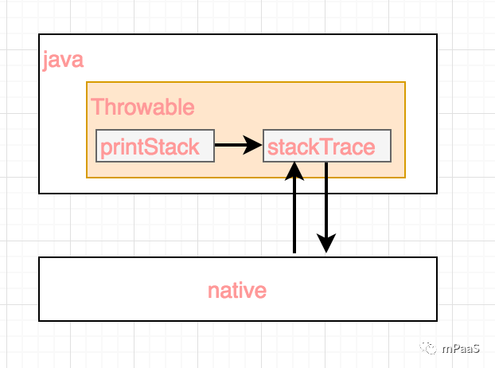

在打印 crash 堆栈信息前，每个 throwable 都会调用art虚拟机提供的一个 jni 方法，返回一个内部的对象叫 stackTrace 保存在 Throwable 对象中，这个 stackTrace 对象里面保存的便是整个方法的调用栈，当然也包括指令集行号，后续获取实际的堆栈信息时会再调用一个 art 的 jni 方法，把这个 stackTrace 方法丢过去，底层通过这个 stackTrace 对象中的指令集行号反解出正式的源文件行号。好了，其实很简单，反射获取下这个 Throwable 中的 stackTrace 对象，拿到指令集行号，然后，上报。这里要注意的一个点，比较恶心，每个虚拟机的实现都不一样，首先内部对象的名字，有些叫 stackTrace，有些叫 backstrace，然后这个内部对象的类型也非常有，有些是 int 数组，有些是 long 数组，有些是对象数组，但是都会有这个指令集行号，需要针对不同的虚拟机版本使用不同的方法去解析这个对象，大概要兼容4种虚拟机，4.x, 5.x, 6.x, 7.x，7.x 虚拟机之后的就统一了。

#### 方案二

上面这套方案其实挺完美的，没有什么兼容性问题，删除是直接利用 proguard，获取指令集行号直接在 java 层获取，不需要各种 hook，如果只需要处理 crash 的上报，方案一足够了，但是在支付宝有很多场景是远远不够的。比如：

* 性能，CPU，内存异常时调用栈。
* native crash 时的 Java 调用栈。

上面这些 case 都会涉及到堆栈信息，方案一中通过反射调用 throwable 中的 stackTrace 内部对象根本搞不定，需要换种方法。最开始的思路是尝试 hook art 虚拟机，每天翻源码，看看可以 hook 的点，最后还是放弃了，一个是担心兼容性问题，另一个是 hook 的点太多，比较慌。最后换了一种思路，尝试直接修改 dex 文件，保留一小块 debugItem，让系统查找行号的时候指令集行号和源文件行号保持一致，这样就什么都不用做，任何监控上报的行号都直接变成了指令集行号，只需修改 dex 文件。可以用下面的示意图表示：

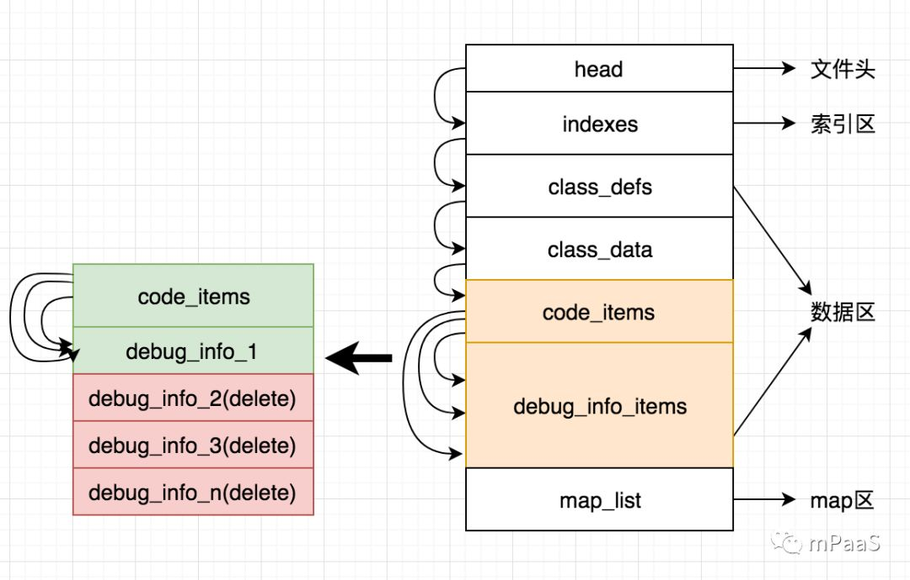

如上图：本来每一个方法都会有一个 debugInfoItem，每一个 debuginfoItem 里面都有一个指令集行号和源文件行号的映射关系，我做的修改其实非常简单，就是把多余的 debugInfoItem 全部删掉了，只留了一个 debugInfoItem，所有的方法都指向同一个 debugInfoItem，并且这个 debugInfoItem 中的指令集行号和源文件行号保持一致，这样不管用什么方式来查行号，拿到的都是指令集行号。其中也踩过很多坑，其实光留一个 debugInfoItem 是不够的，要兼容所有虚拟机的查找方式，需要对 debugInfoItem 进行分区，并且 debugInfoItem 表不能太大，遇到过一个坑就是 androidO 上进行 dex2oat 优化的时候，会频繁的遍历这个 debugInfoItem，导致 AOT 编译比较慢，最后都通过 debugInfoItem 分区解决了。这个方案比较彻底，不用改 proguard，也不用 hook native。不过如果只需要处理 crash 的行号问题，那还是首推方案一，这个方案改动有点大，前期也是每天研究 dex 的文件结构，抠每一个细节，有比较大的把握时才敢改。

#### 小结

目前该方案已经在支付宝正式上线，前面经过好几轮的外灰验证，还是比较稳定的。支付宝整体包大小减少了 2.1M 左右，真实的 dex 大小减少 3.5M 左右。

