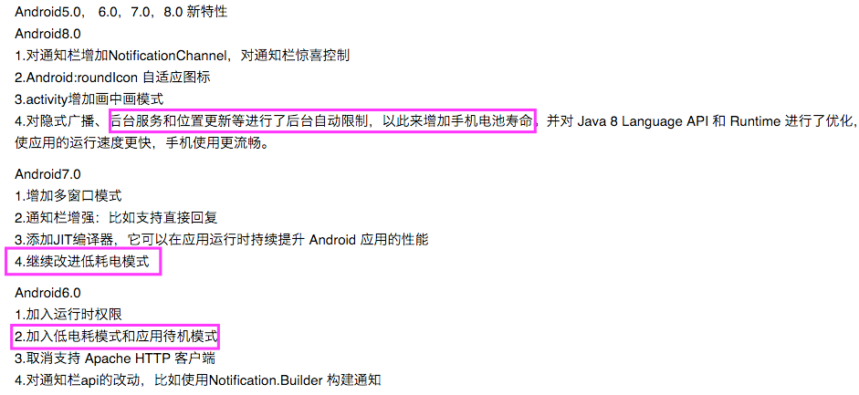

## 保活

一、7.0一下保活

进程保活的关键点有两个，一个是进程优先级的理解，优先级越高存活几率越大。二是弄清楚哪些场景会导致进程会kill，然后采取下面的策略对各种场景进行优化：

1. 提高进程的优先级
2. 在进程被kill之后能够唤醒

1、进程优先级

Android一般的进程优先级划分：

1. 前台进程 (Foreground process)
2. 可见进程 (Visible process)
3. 服务进程 (Service process)
4. 后台进程 (Background process)
5. 空进程 (Empty process)

这是一种粗略的划分，进程其实有一种具体的数值，称作oom_adj，注意：数值越大优先级越低：


* 红色部分是容易被回收的进程，属于android进程
* 绿色部分是较难被回收的进程，属于android进程
* 其他部分则不是android进程，也不会被系统回收，一般是ROM自带的app和服务才能拥有

2、进程被kill的场景

1.点击home键使app长时间停留在后台，内存不足被kill

处理这种情况前提是你的app至少运行了一个service，然后通过Service.startForeground() 设置为前台服务，可以将oom_adj的数值由4降低到1，大大提高存活率。

* 要注意的是android4.3之后Service.startForeground() 会强制弹出通知栏，解决办法是再启动一个service和推送共用一个通知栏，然后stop这个service使得通知栏消失。
* Android 7.1之后google修复这个bug，目前没有解决办法

下面的代码放到你的service的onStartCommand方法中：

```
//设置service为前台服务，提高优先级
if (Build.VERSION.SDK_INT < 18) {
    //Android4.3以下 ，此方法能有效隐藏Notification上的图标
    service.startForeground(GRAY_SERVICE_ID, new Notification());
} else if(Build.VERSION.SDK_INT>18 && Build.VERSION.SDK_INT<25){
    //Android4.3 - Android7.0，此方法能有效隐藏Notification上的图标
    Intent innerIntent = new Intent(service, GrayInnerService.class);
    service.startService(innerIntent);
    service.startForeground(GRAY_SERVICE_ID, new Notification());
}else{
    //Android7.1 google修复了此漏洞，暂无解决方法（现状：Android7.1以上app启动后通知栏会出现一条"正在运行"的通知消息）
    service.startForeground(GRAY_SERVICE_ID, new Notification());
}
```

2.在大多数国产手机下，进入锁屏状态一段时间，省电机制会kill后台进程

这种情况和上面不太一样，是很过国产手机rom自带的优化，当锁屏一段时间之后，即使手机内存够用为了省电，也会释放掉一部分内存。

策略：注册广播监听锁屏和解锁事件， 锁屏后启动一个1像素的透明Activity，这样直接把进程的oom_adj数值降低到0，0是android进程的最高优先级。 解锁后销毁这个透明Activity。这里我把这个Activity放到:remote进程也就是我那个后台服务进程，当然你也可以放到主进程，看你打算保活哪个进程。


我们可以写一个KeepLiveManager来负责接收广播，维护这个Activity的创建和销毁，注意锁屏广播和解锁分别是：ACTION_SCREEN_OOF和ACTION_USER_PRESENT，并且只能通过动态注册来绑定，并且是绑定到你的后台service里面,onCreate绑定,onDestroy里面解绑

3.用户手动释放内存：包括手机自带清理工具，和第三方app（360，猎豹清理大师等）

理内存软件会把优先级低于 前台进程(oom_adj = 0)的所有进程放入清理列表，而当我们打开了清理软件就意味着其他app不可能处于前台。所以说理论上可以kill任何app。

因此这类场景唯一的处理办法就是加入手机rom 白名单，比如你打开小米，魅族的权限管理 -> 自启动管理可以看到 QQ，微信，天猫默认被勾选，这就是厂商合作。那我们普通app可以这么做：在app的设置界面加一个选项，提示用户自己去勾选自启动。

3、进程唤醒

分两种情况，一是主进程（含有Activity没有service），这种进程由于内存不足被kill之后，用户再次打开app系统会恢复到上次的Activity。另一种是service的后台进程被kill，可以通过service自有api来重启service：

```
@Override
public int onStartCommand(Intent intent, int flags, int startId) {
    // service被异常停止后，系统尝试重启service，不能保证100%重启成功
    return START_STICKY;    
}
```

但它不是100%保证重启成功，比如下面2种情况：

Service 第一次被异常杀死后会在5秒内重启，第二次被杀死会在10秒内重启，第三次会在20秒内重启，一旦在短时间内 Service 被杀死达到5次，则系统不再拉起。

进程被取得 Root 权限的管理工具或系统工具通过 forestop 停止掉，无法重启。

4、结论

1.和Android版本关系很大

对于Android6.0以及以下的大部分机型还是有效果的，但是Android7.0和Android8.0基本上所有机型全部阵亡，大部分后台进程在锁屏后无法存活超过20分钟。
这个可以从Android 6.0，7.0和8.0的新特性看出一些端倪，google对于内存/电量使用越来越严格。



2.和手机厂商关系比较大，测试结果显示，oppo/vivo这两家厂商进程保活最困难，小米和三星比较宽松。其他的机型居中

二、2018年Android的保活方案效果统计

1、常见保活方案

1. 监听广播：监听全局的静态广播，比如时间更新的广播、开机广播、解锁屏、网络状态、解锁加锁亮屏暗屏（3.1版本），高版本需要应用开机后运行一次才能监听这些系统广播，目前此方案失效。可以更换思路，做APP启动后的保活（监听广播启动保活的前台服务）
2. 定时器、JobScheduler：假如应用被系统杀死，那么定时器则失效，此方案失效。JobService在5.0,5.1,6.0作用很大，7.0时候有一定影响（可以在电源管理中给APP授权）
3. 双进程（NDK方式Fork子进程）、双Service守护：高版本已失效，5.0起系统回收策略改成进程组。双Service方案也改成了应用被杀，任何后台Service无法正常状态运行
4. 提高Service优先级：只能一定程度上缓解Service被立马回收

2、保活

1. AIDL方式单进程、双进程方式保活Service
2. 降低oom_adj的值：常驻通知栏（可通过启动另外一个服务关闭Notification，不对oom_adj值有影响）、使用”1像素“的Activity覆盖在getWindow()的view上、循环播放无声音频（黑科技，7.0下杀不掉）
3. 监听锁屏广播：使Activity始终保持前台
4. 使用自定义锁屏界面：覆盖了系统锁屏界面。
5. 通过android:process属性来为Service创建一个进程
6. 跳转到系统白名单界面让用户自己添加app进入白名单

3、复活

1. JobScheduler：原理类似定时器，5.0,5.1,6.0作用很大，7.0时候有一定影响（可以在电源管理中给APP授权）
2. 推送互相唤醒复活：极光、友盟、以及各大厂商的推送
3. 同派系APP广播互相唤醒：比如今日头条系、阿里系

4、方案实现效果统计

1.双进程守护方案（基于onStartCommand() return START_STICKY）

结论：除了华为此方案无效以及未更改底层的厂商不起作用外（START_STICKY字段就可以保持Service不被杀）。此方案可以与其他方案混合使用

2.监听锁屏广播打开1像素Activity（基于onStartCommand() return START_STICKY）

结论：此方案无效果

3.故意在后台播放无声的音乐（基于onStartCommand() return START_STICKY）

结论：成功对华为手机保活。小米8下也成功突破20分钟

4.使用JobScheduler唤醒Service（基于onStartCommand() return START_STICKY）

结论：只对5.0，5.1、6.0起作用

5.混合使用的效果，并且在通知栏弹出通知

结论：高版本情况下可以使用弹出通知栏、双进程、无声音乐提高后台服务的保活概率