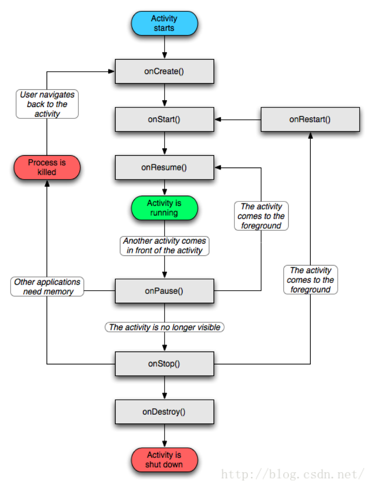

## Activity生命周期

一、Activity 的形态

1.Active/Running: 
Activity处于活动状态，此时Activity处于栈顶，是可见状态，可与用户进行交互。 

2.Paused： 
当Activity失去焦点时，或被一个新的非全屏的Activity，或被一个透明的Activity放置在栈顶时，Activity就转化为Paused状态。但我们需要明白，此时Activity只是失去了与用户交互的能力，其所有的状态信息及其成员变量都还存在，只有在系统内存紧张的情况下，才有可能被系统回收掉。 

3.Stopped： 
当一个Activity被另一个Activity完全覆盖时，被覆盖的Activity就会进入Stopped状态，此时它不再可见，但是跟Paused状态一样保持着其所有状态信息及其成员变量。 

4.Killed： 
当Activity被系统回收掉时，Activity就处于Killed状态。 

Activity会在以上四种形态中相互切换，至于如何切换，这因用户的操作不同而异。了解了Activity的4种形态后，我们就来聊聊Activity的生命周期。

二、生命周期



* onCreate : 该方法是在Activity被创建时回调，它是生命周期第一个调用的方法，我们在创建Activity时一般都需要重写该方法，然后在该方法中做一些初始化的操作，如通过setContentView设置界面布局的资源，初始化所需要的组件信息等。

* onStart : 此方法被回调时表示Activity正在启动，此时Activity已处于可见状态，只是还没有在前台显示，因此无法与用户进行交互。可以简单理解为Activity已显示而我们无法看见摆了。 

* onResume : 当此方法回调时，则说明Activity已在前台可见，可与用户交互了（处于前面所说的Active/Running形态），onResume方法与onStart的相同点是两者都表示Activity可见，只不过onStart回调时Activity还是后台无法与用户交互，而onResume则已显示在前台，可与用户交互。当然从流程图，我们也可以看出当Activity停止后（onPause方法和onStop方法被调用），重新回到前台时也会调用onResume方法，因此我们也可以在onResume方法中初始化一些资源，比如重新初始化在onPause或者onStop方法中释放的资源。 

* onPause : 此方法被回调时则表示Activity正在停止（Paused形态），一般情况下onStop方法会紧接着被回调。但通过流程图我们还可以看到一种情况是onPause方法执行后直接执行了onResume方法，这属于比较极端的现象了，这可能是用户操作使当前Activity退居后台后又迅速地再回到到当前的Activity，此时onResume方法就会被回调。当然，在onPause方法中我们可以做一些数据存储或者动画停止或者资源回收的操作，但是不能太耗时，因为这可能会影响到新的Activity的显示——onPause方法执行完成后，新Activity的onResume方法才会被执行。 

* onStop : 一般在onPause方法执行完成直接执行，表示Activity即将停止或者完全被覆盖（Stopped形态），此时Activity不可见，仅在后台运行。同样地，在onStop方法可以做一些资源释放的操作（不能太耗时）。 

* onRestart :表示Activity正在重新启动，当Activity由不可见变为可见状态时，该方法被回调。这种情况一般是用户打开了一个新的Activity时，当前的Activity就会被暂停（onPause和onStop被执行了），接着又回到当前Activity页面时，onRestart方法就会被回调。 

* onDestroy :此时Activity正在被销毁，也是生命周期最后一个执行的方法，一般我们可以在此方法中做一些回收工作和最终的资源释放。

#### 生命周期验证

场景1：启动一个Activity --> 点击Home键回到主屏


点击Home键回到主界面(Activity不可见)–>onPause()–>onStop()

场景2：点击Home键 --> 回到原Activity


当我们再次回到原Activity时–>onRestart()–>onStart()–>onResume()

场景3：Activity的基础上打新的Activity时


在原Activity的基础上开启新的Activity，原Activity生命周期执行方法顺序为–>onPause()–>onStop(),但是这里有点要注意的是如果新的Activity使用了透明主题，那么当前Activity不会回调onStop方法。同时我们发现新Activity（SecondActivity）生命周期方法是在原Activity的onPause方法执行完成后才可以被回调，这也就是前面我们为什么说在onPause方法不能操作耗时任务的原因了。

#### Activity异常生命周期

异常的生命周期是指Activity被系统回收或者当前设备的Configuration发生变化（一般指横竖屏切换）从而导致Activity被销毁重建。异常的生命周期主要分以下两种情况：

1. 相关的系统配置发生改变导致Activity被杀死并重新创建（一般指横竖屏切换）
2. 内存不足导致低优先级的Activity被杀死

1、相关的系统配置发生改变导致Activity被杀死并重新创建（一般指横竖屏切换）

```
public class MainActivity extends AppCompatActivity {
    Button bt;
    /**
     * Activity创建时被调用
     * @param savedInstanceState
     */
    @Override
    protected void onCreate(Bundle savedInstanceState) {
        super.onCreate(savedInstanceState);
		 setContentView(R.layout.activity_main);
        LogUtils.e("onCreate is invoke!!!");
        bt= (Button) findViewById(R.id.bt);
        bt.setOnClickListener(new View.OnClickListener() {
            @Override
            public void onClick(View v) {
                Intent i = new Intent(MainActivity.this,SecondActivity.class);
                startActivity(i);
            }
        });
    }

    @Override
    protected void onSaveInstanceState(Bundle outState) {
        super.onSaveInstanceState(outState);
        LogUtils.e("onSaveInstanceState is invoke!!!");
    }

    @Override
    protected void onRestoreInstanceState(Bundle savedInstanceState) {
        super.onRestoreInstanceState(savedInstanceState);
        LogUtils.e("onRestoreInstanceState is invoke!!!");
    }

    /**
     * Activity从后台重新回到前台时被调用
     */
    @Override
    protected void onRestart() {
		 LogUtils.e("onRestart is invoke!!!");
    }

    /**
     *Activity创建或者从后台重新回到前台时被调用
     */
    @Override
    protected void onStart() {
        super.onStart();
        LogUtils.e("onStart is invoke!!!");
    }


    /**
     *Activity创建或者从被覆盖、后台重新回到前台时被调用
     */
    @Override
    protected void onResume() {
        super.onResume();
        LogUtils.e("onResume is invoke!!!");
    }

    /**
     *  Activity被覆盖到下面或者锁屏时被调用
      */
    @Override
    protected void onPause() {
        super.onPause();
		 LogUtils.e("onPause is invoke!!!");
    }

    /**
     *退出当前Activity或者跳转到新Activity时被调用
     */
    @Override
    protected void onStop() {
        super.onStop();
        LogUtils.e("onStop is invoke!!!");
    }

    /**
     *退出当前Activity时被调用,调用之后Activity就结束了
     */
    @Override
    protected void onDestroy() {
        super.onDestroy();
        LogUtils.e("onDestroy is invoke!!!");
    }
}
```

我们重写了onSaveInstanceState方法和onRestoreInstanceState方法，这两个方法后面我们会详细介绍，这里先看看运行结果：


从Log中我们可以看出当我们正常启动Activity时，onCreate，onStart，onResume方法都会依次被回调，而如果我们此时把竖屏的Activity人为的调整为横屏，我们可以发现onPause，onSaveInstanceState，onStop，onDestroy，onCreate，onStart，onRestoreInstanceState，onResume依次被调用，单从调用的方法我们就可以知道，Activity先被销毁后再重新创建，其异常生命周期如下：


现在异常生命周期的流程我们大概也就都明白，但是onSaveInstanceState和onRestoreInstanceState方法是干什么用的呢？实际上这两个方法是系统自动调用的，当系统配置发生变化后，Activity会被销毁，也就是onPause，onStop，onDestroy会被依次调用，同时因为Activity是在异常情况下销毁的，Android系统会自动调用onSaveInstanceState方法来保存当前Activity的状态信息，因此我们可以在onSaveInstanceState方法中存储一些数据以便Activity重建之后可以恢复这些数据，当然这个方法的调用时机必须在onStop方法之前，也就是Activity停止之前。至跟onPause方法的调用时机可以随意。而通过前面的Log信息我们也可以知道当Activity被重新创建之后，系统还会去调用onRestoreInstanceState方法，并把Activity销毁时通过onSaveInstanceState方法保存的Bundle对象作为参数同时传递给onRestoreInstanceState和onCreate方法，因此我们可以通过onRestoreInstanceState和onCreate方法来判断Activity是否被重新创建，倘若被重建了，我们就可以对之前的数据进行恢复。从Log信息，我们可以看出onRestoreInstanceState方法的调用时机是在onStart之后的。这里有点需要特别注意，onSaveInstanceState和onRestoreInstanceState只有在Activity异常终止时才会被调用的，正常情况是不会调用这两个方法的。 

到这里大家可能还有一个疑问，onRestoreInstanceState和onCreate方法都可以进行数据恢复，那到底用哪个啊?其实两者都可以，两者的区别在于，onRestoreInstanceState方法一旦被系统回调，其参数Bundle一定不为空，无需额外的判断，而onCreate的Bundle却不一定有值，因为如果Activity是正常启动的话，Bundle参数是不会有值的，因此我们需要额外的判断条件，当然虽说两者都可以数据恢复，但更倾向于onRestoreInstanceState方法。 

最后还有点我们要知道的是，在onSaveInstanceState方法和onRestoreInstanceState方法中，android系统会自动帮我们恢复一定的数据，如当前Activity的视图结构，文本框的数据，ListView的滚动位置等，这些View相关的状态系统都会帮我们恢复，这是因为每个View也有onSaveInstanceState方法和onRestoreInstanceState方法

2、内存不足导致低优先级的Activity被杀死

内存不足导致低优先级的Activity被杀死，然后重建，其实也不用聊了，其数据的存储过程和恢复过程跟上面的情况基本没差。我们还是继续聊聊Activity被杀死的情况吧，当系统内存不足的时候，系统就会按照一定的优先级去杀死目标Acitivity的进程来回收内存，并且此时Activity的onSaveInstanceState方法会被调用来存储数据，并在后续Activity恢复时调用onRestoreInstanceState方法来恢复数据，所以为了Activity所在进程尽量不被杀死，我们应该尽量让其保持高的优先级。

3、解决Activity销毁重建问题

通过上面的分析我们知道当系统配置发生变化后，Activity会被重建，那有没有办法使其不重建呢？方法自然是有的，那就是我们可以给Activity指定configChange属性，当我们不想Activity在屏幕旋转后导致销毁重建时，可以设置configChange=“orientation”；当SDK版本大于13时，我们还需额外添加一个“screenSize”的值，对于这两个值含义如下： 

* orientation：屏幕方向发生变化，配置该参数可以解决横竖屏切换时，Activity重建问题（API<13） 
* screenSize：当设备旋转时，屏幕尺寸发生变化，API>13后必须配置该参数才可以保证横竖切换不会导致Activity重建。 

说白了就是设置了这两个参数后，当横竖屏切换时，Activity不会再重建并且也不会调用之前相关的方法，取而代之的是回调onConfigurationChanged方法。

## Activity启动模式

一、Activity的四种启动模式

1.standard

默认启动模式，栈内多实例，每次启动都会新建Activity实例压于当前栈顶。

2.singleTop

栈顶复用模式，栈内多实例，启动Activity时若栈顶已有该Activity实例，会直接调用onNewIntent()方法复用该栈顶实例，其它场景和standard表现一致，此模式下需要指定android:launchMode=“singleleTop”。

3.singleTask

栈内复用模式，栈内单实例，此模式下需要指定android:launchMode=“singleleTask”，启动Activity时：

* 若栈内无该Activity类实例，新建实例并压入栈顶；
* 若栈内已有该Activity类实例（假设为A），栈内位于A上部的Activity逐个pop，调用onDestroy()生命周期（除去相邻的Activity实例，假设为B），B的生命周期如下：
B onPause() - A onNewIntent() - A onRestart() - A onStart() - A onResume() - B onStop() - B onDestroy()

 * 未配置taskAffinity属性时：以上操作均在当前栈操作。
 * 配置了taskAffinity属性时：检测当前栈是否与taskAffinity属性相符，若相符则在当前栈操作；若不相符则新建栈，再新建Activity实例压于栈顶。

4.singleInstance

单实例模式，全局单实例，即全局只有一个栈中有该实例，且该栈中有且只有一个该实例。此模式下需要指定android:launchMode=“singleleInstance”，当启动Activity时，

若栈中无该实例，则新建栈，新建Activity并压入栈顶；
若已有栈中有该实例，则调用onNewIntent()复用该实例。

二、使用场景

1.standard 一般场景均适用

2.singleTop 此模式下栈顶只存在单个该实例，有如下场景可用（适用于非主架构Activity）：

1. 防止Activity多次启动，比如多次点击启动按钮导致启动多个相同Activity（如登录跳转）；
2. 业务流程要更新数据，Activity需要自己跳转到自己，回调onNewIntent()刷新数据；
3. Activity需要启动service执行耗时操作或进行某类事件监听，过程中用户点击home键切换了应用，当service响应时需要回到Activity，此时可用singleTop复用已有实例；
4. 通知栏内有若干个通知，点击通知需要跳转到新Activity，此时可用singleTop，避免每次点击都创建新实例造成资源浪费；

3.singleTask 此模式下栈内只有单个该实例，且不会多次创建，适用于主架构Activity（常驻型），如应用主页（home页）；

4.singleInstance 此模式下全局栈内只有单个该实例，且该栈有且仅有一个实例，此类Activity适用于共享型Activity，如Activity作为公共组件被多个三方app访问。

上面的场景仅仅适用于Activity启动Activity，并且采用的都是默认Intent，没有额外添加任何Flag，否则表现就可能跟上面的完全不一致，尤其要注意的是FLAG_ACTIVITY_NEW_TASK的使用，后面从源码中看，依靠FLAG_ACTIVITY_NEW_TASK其实可以分为两派。

三、Intent.FLAG_ACTIVITY_NEW_TASK分析

从源码来看，Intent.FLAG_ACTIVITY_NEW_TASK是启动模式中最关键的一个Flag，依据该Flag启动模式可以分成两类，设置了该属性的与未设置该属性的，对于非Activity启动的Activity（比如Service或者通知中启动的Activity）需要显示的设置Intent.FLAG_ACTIVITY_NEW_TASK，而singleTask及singleInstance在AMS中被预处理后，隐形的设置了Intent.FLAG_ACTIVITY_NEW_TASK，而启动模式是standard及singletTop的Activity不会被设置Intent.FLAG_ACTIVITY_NEW_TASK，除非通过显示的intent setFlag进行设置。

FLAG_ACTIVITY_NEW_TASK这个属性更多的关注点是在Task，可以认为没有设置FLAG_ACTIVITY_NEW_TASK的情况下，taskAffinity可以不考虑，大多数情况下，需要将Activity引入到自己taskAffinity的Task中，Intent.FLAG_ACTIVITY_NEW_TASK的初衷是在Activity目标taskAffinity的Task中启动，非Activity启动Activity都必须添加Intent.FLAG_ACTIVITY_NEW_TASK才行，以Service启动的Activity为例：

```
Intent intent = new Intent(BackGroundService.this, A.class);
intent.setFlags(Intent.FLAG_ACTIVITY_NEW_TASK);
startActivity(intent);  
```

这种情况很有意思，如果目标Activity实例或者Task不存在，则一定会新建Activity，并将目标Task移动到前台，但是如果Activity存在，却并不一定复用，也不一定可见。这里假定A是standard的Activity，如果已经有一个A实例，并且所在的堆栈的taskAffinity跟A的taskAffinity一致，这个时候要看这个task的根Activity是不是A，如果是A，还要看A的intent是不是跟当前的启动的intent相等，如果都满足，只要将task可见即可。否则，就需要新建A，并根据A的task栈的存在情况而选择直接入栈还是新建栈。但是，如果Intent想要的启动的Activity的目标堆栈存在，那就将整个堆栈往前迁移，如果位于顶部的Task栈正好是目标Activity的Task栈，那就不做任何处理，连onNewIntent都不会回调，怎么判断目标的Activity的Task栈同找到的栈一致呢？如果找不到目标Task自然会启动Task，如果目标task栈根Activit的intent同新将要启动的Activit相同，就不启动新Activity，否则启动Activity。


1、Intent.FLAG_ACTIVITY_CLEAR_TASK：必须配合FLAG_ACTIVITY_NEW_TASK使用

这个属性必须同FLAG_ACTIVITY_NEW_TASK配合使用，如果设置了FLAG_ACTIVITY_NEW_TASK|Intent.FLAG_ACTIVITY_CLEAR_TASK，如果目标task已经存在，将清空已存在的目标Task，否则，新建一个Task栈，之后，新建一个Activity作为根Activity。Intent.FLAG_ACTIVITY_CLEAR_TASK的优先级最高，基本可以无视所有的配置，包括启动模式及Intent Flag，哪怕是singleInstance也会被finish，并重建。


2、Intent.FLAG_ACTIVITY_CLEAR_TOP

如果没有使用FLAG_ACTIVITY_NEW_TASK，目标是当前Task栈，根据不同的组合会产生不同的效果，如果单独使用Intent.FLAG_ACTIVITY_CLEAR_TOP，并且没有设置特殊的launchmode，那么，Google官方的示例是：如果ABCD Task中的D采用Intent.FLAG_ACTIVITY_CLEAR_TOP唤起B，这个时候首先会将CD出栈，但是至于B是否会重建，要视情况而定，如果没有设置FLAG_ACTIVITY_SINGLE_TOP，则会将B finish掉，之后创建新的入栈。如果同一个栈中原来有


如果没有则新建，不会去另一个栈中寻找。


如果同时设置了FLAG_ACTIVITY_SINGLE_TOP，在当前栈已有的情况下就不会重建，而是直接回调B的onNewIntent(),


如果同时使用了FLAG_ACTIVITY_NEW_TASK ，这个时候，目标是Activity自己所属的Task栈，如果在自己的Task中能找到一个Activity实例，则将其上面的及自身清理掉，之后重建。


如果同时在加上FLAG_ACTIVITY_SINGLE_TOP，会更特殊一些，如果topActivity不是目标Activity，就会去目标Task中去找，并唤起


如果topActivity是目标Activity，就直接回调topActivity的onNewIntent，无论topActivity是不是在目标Task中


3、Intent.FLAG_ACTIVITY_SINGLE_TOP

Intent.FLAG_ACTIVITY_SINGLE_TOP多用来做辅助作用，跟launchmode中的singleTop作用一样，在Task栈顶有的话，就不新建，栈顶没有的话，就新建，这里的Task可能是目标栈，也可能是当前Task栈，配合FLAG_ACTIVITY_NEW_TASK及FLAG_ACTIVITY_CLEAR_TOP都会有很有意思的效果。

4、Intent.FLAG_ACTIVITY_NO_HISTORY

使用该模式来启动Activity，当该Activity启动其他Activity后，该Activity就被销毁了，不会保留在任务栈中。如A-B,B中以这种模式启动C，C再启动D，则任务栈只有ABD。

5、Intent.FLAG_ACTIVITY_EXCLUDE_FROM_RECENTS

使用该标识位启动的Activity不添加到最近应用列表，也即我们从最近应用里面查看不到我们启动的这个Activity。与属性android:excludeFromRecents=”true”效果相同。当用户正处于此Activity并按home键回到桌面或通过任务列表切换到其他应用后，用户再唤出最近任务列表时便看不到此Activity。

四、源码分析

为什么非Activity启动Activity要强制规定使用参数FLAG_ACTIVITY_NEW_TASK
从源码上说，ContextImpl在前期做了检查，如果没添加Intent.FLAG_ACTIVITY_NEW_TASK就抛出异常，

```
@Override
public void startActivity(Intent intent, Bundle options) {
    warnIfCallingFromSystemProcess();
    if ((intent.getFlags()&Intent.FLAG_ACTIVITY_NEW_TASK) == 0) {
        throw new AndroidRuntimeException(
                "Calling startActivity() from outside of an Activity "
                + " context requires the FLAG_ACTIVITY_NEW_TASK flag."
                + " Is this really what you want?");
    }
    ...
}
```

为什么要这么呢？其实直观很好理解，如果不是在Activity中启动的，那就可以看做不是用户主动的行为，也就说这个界面可能出现在任何APP之上，如果不用Intent.FLAG_ACTIVITY_NEW_TASK将其限制在自己的Task中，那用户可能会认为该Activity是当前可见APP的页面，这是不合理的。举个例子：我们在听音乐，这个时候如果邮件Service突然要打开一个Activity，如果不用Intent.FLAG_ACTIVITY_NEW_TASK做限制，那用户可能认为这个Activity是属于音乐APP的，因为用户点击返回的时候，可能会回到音乐，而不是邮件（如果邮件之前就有界面）。

## 一般Activity的启动流程

1、ActivityThread中的main方法中

```
public static void main(String[] args) {
    ...

    Looper.prepareMainLooper();

    ...
    ActivityThread thread = new ActivityThread();//1
    thread.attach(false, startSeq);//2

    if (sMainThreadHandler == null) {
        sMainThreadHandler = thread.getHandler();
    }

    ...
    Looper.loop();
}
```

函数首先初始化一个Looper对象，用于消息之间的通信，注释1和注释2出，初始化一个ActivityThread对象，调用thread.attach(false)方法，我们进入这个方法中查看：

```
private void attach(boolean system, long startSeq) {
        ...
        final IActivityManager mgr = ActivityManager.getService();//1
        try {
            mgr.attachApplication(mAppThread, startSeq);//2
        } catch (RemoteException ex) {
            throw ex.rethrowFromSystemServer();
        }
        ...
        try {
            mInstrumentation = new Instrumentation();//3
            mInstrumentation.basicInit(this);
            ContextImpl context = ContextImpl.createAppContext(
                    this, getSystemContext().mPackageInfo);//4
            mInitialApplication = context.mPackageInfo.makeApplication(true, null);//5
            mInitialApplication.onCreate();
        } 
    }
    ...
}
```

注释1：初始化了一个ActivityManager对象，不过看名称就知道它是一个远程的ActivityManager对象，用来管理我们的Activity,
注释2：将我们的Applicatin对象与ActivityThread对象相关联。
注释3：初始化了一个在整个activity生命中期中处于比较重要地位的一个Instrumentation对象，它负责创建初始化Activity，Application等等，
注释4：初始化上下文ContextImpl（context是抽象类，只能初始化其实现类）
注释5：创建了Application对象(其实它的创建挺简单，就是利用反射机制,Class 对象，下文的Activity也是这样创建的，自己可以跟踪源代码查看)最后就是监听了系统的Configuration变化，并对不同的配置做出不同的消息响应。

继承了Hanlder的类H ，它主要是进行系统之间的消息通信，并联系着Activity各个生命周期函数。看看里面处理消息的handleMessage方法：

```
public void handleMessage(Message msg) {
    switch (msg.what) {
    case LAUNCH_ACTIVITY:
    ...
    handleLaunchActivity(r, null, "LAUNCH_ACTIVITY");//1
    ...
    break;
    }
```

在handlerMessage方法中分别对了Activity不同生命周期做了相应的处理：在注释1中handleLaunchActivity(r,null)处理了Activity创建执行的方法，我们跟踪进入这个方法

```
...
Activity a = performLaunchActivity(r, customIntent);//1

if (a != null) {//2
    r.createdConfig = new Configuration(mConfiguration);
    reportSizeConfigurations(r);
    Bundle oldState = r.state;
    handleResumeActivity(r.token, false, r.isForward,
            !r.activity.mFinished && !r.startsNotResumed, r.lastProcessedSeq, reason);
...            
```

注释1：调用了ActivityThread的performLaunchActivity方法创建了一个Activity对象，
注释2：判断了如果Activity对象不为null，就去调用performResumeActivity方法，看见方法名就应该猜测得出是回调Activity的onResume方法，


我们还是进入performLaunchActivity中看看他是如何执行的，下面是performLaunchActivity的具体代码实现:

```
Activity activity = null;
try {//1
    java.lang.ClassLoader cl = appContext.getClassLoader();
    activity = mInstrumentation.newActivity(
            cl, component.getClassName(), r.intent);
    StrictMode.incrementExpectedActivityCount(activity.getClass());
    r.intent.setExtrasClassLoader(cl);
    r.intent.prepareToEnterProcess();
    if (r.state != null) {
        r.state.setClassLoader(cl);
    }
}

...

if (activity != null) {//2
    CharSequence title = r.activityInfo.loadLabel(appContext.getPackageManager());
    Configuration config = new Configuration(mCompatConfiguration);
    if (r.overrideConfig != null) {
        config.updateFrom(r.overrideConfig);
    }
    if (DEBUG_CONFIGURATION) Slog.v(TAG, "Launching activity "
            + r.activityInfo.name + " with config " + config);
    Window window = null;
    if (r.mPendingRemoveWindow != null && r.mPreserveWindow) {
        window = r.mPendingRemoveWindow;
        r.mPendingRemoveWindow = null;
        r.mPendingRemoveWindowManager = null;
    }
    appContext.setOuterContext(activity);
    activity.attach(appContext, this, getInstrumentation(), r.token,
            r.ident, app, r.intent, r.activityInfo, title, r.parent,
            r.embeddedID, r.lastNonConfigurationInstances, config,
            r.referrer, r.voiceInteractor, window, r.configCallback);

    if (customIntent != null) {
        activity.mIntent = customIntent;
    }
    r.lastNonConfigurationInstances = null;
    checkAndBlockForNetworkAccess();
    activity.mStartedActivity = false;
    int theme = r.activityInfo.getThemeResource();
    if (theme != 0) {
        activity.setTheme(theme);
    }

    activity.mCalled = false;
    if (r.isPersistable()) {
        mInstrumentation.callActivityOnCreate(activity, r.state, r.persistentState);//3
    } else {
        mInstrumentation.callActivityOnCreate(activity, r.state);
    }
```

注释1：就是利用java的反射机制创建我们具体的Activity对象，和前面所说的Application对象的创建类似，这个Activity就是我们函数需要返回的具体的Activity对象，至此时刻我么的Activity对象已近产生。
注释2--注释3：就是初始化了上下文对象，并且调用了Activity的attach方法将Activiy与Application，Instrumentation，contextImpl关联起来
注释3：mInstrumentation.callActivityOnCreate(activity,r.state)

```
// android/app/Instrumentation.java
public void callActivityOnCreate(Activity activity, Bundle icicle, PersistableBundle persistentState) {
    prePerformCreate(activity);
    activity.performCreate(icicle, persistentState);//1
    postPerformCreate(activity);
}
```

注释1：调用了Activity本身的performCreate(icicle)，并传入了Bundle对象，再跟进performCreate方法中，

```
// android/app/Activity.java
final void performCreate(Bundle icicle) {
    performCreate(icicle, null);
}

final void performCreate(Bundle icicle, PersistableBundle persistentState) {
    mCanEnterPictureInPicture = true;
    restoreHasCurrentPermissionRequest(icicle);
    if (persistentState != null) {
        onCreate(icicle, persistentState);
    } else {
        onCreate(icicle);
    }
    ...
}
```

## Service

#### Service 是否在 main thread 中执行, service 里面是否能执行耗时的操作?

默认情况,如果没有显示的指 servic 所运行的进程, Service 和 activity 是运行在当前 app 所在进程的 main thread(UI 主线程)里面。 service 里面不能执行耗时的操作(网络请求,拷贝数据库,大文件 ) 特殊情况 ,可以在清单文件配置 service 执行所在的进程 ,让 service 在另外的进程中执行

```
<service android:name="com.baidu.location.f" 
	android:enabled="true" 
	android:process=":remote" >
</service>
```

#### 概述

一、简介

服务是Android中实现程序后台运行的解决方案，他非常适合是去执行那些不需要和用户交互而且还要长期运行的任务。服务的运行不依赖于任何用户界面，即使程序被切换到后台，或者用户打开了另一个应用程序，服务仍然能够保持独立运行。不过需要注意的是，服务并不是运行在一个独立的进程当中，而是依赖于创建服务时所在的应用程序进程。当某个应用程序被杀掉时，所有依赖该进程的服务也会停止运行。

二、作用

它用于处理一些不干扰用户使用的后台操作。如下载，网络获取。播放音乐，他可以通过Intent来开启，同时也可以绑定到宿主对象（调用者例如ACTIVITY上）来使用。

三、分类

* 本地服务：

该服务依附在主进程上而不是独立的进程，这样在一定程度上节约了资源，另外本地服务因为是在同一进程因此不需要IPC，也不需要AIDL。相应bindService会方便很多，当主进程被Kill后，服务便会终止。一般使用在音乐播放器播放等不需要常驻的服务。指的是服务和启动服务的activity在同一个进程中。

* 远程服务：

该服务是独立的进程，对应进程名格式为所在包名加上你指定的android:process字符串。一般定义方式 android:process=":service" 由于是独立的进程，因此在Activity所在进程被Kill的时候，该服务依然在运行，不受其他进程影响，有利于为多个进程提供服务具有较高的灵活性。由于是独立的进程，会占用一定资源，并且使用AIDL进行IPC比较麻烦。一般用于系统的Service，这种Service是常驻的。指的是服务和启动服务的activity不在同一个进程中。

注意（启动本地服务用的是显式启动； 远程服务的启动要用到隐式启动）

四、service在清单文件中的声明


#### 生命周期


注意：本地服务中，onStart已经被onStartCommand方法取代

一、启动流程

1、context.startService() 启动流程（后台处理工作）

context.startService()  -> onCreate()  -> onStartCommand()  -> Service running  -> context.stopService()  -> onDestroy()  -> Service stop 

所以调用startService的生命周期大致为：

onCreate（只在创建的时候调用一次直到被摧毁） --> onStartCommand (服务开启后，可多次调用) --> onDestroy

服务中的onStartCommand方法会返回一个唯一的整数标识符来识别启动请求，启动请求可以是```START_STICKY、START_STICKY_COMPATIBILITY、START_NOT_STICKY、START_REDELIVER_INTENT等，标志位可以是START_FLAG_REDELIVERY、START_FLAG_RETRY```。

通过startService启动后，service会一直无限期运行下去，只有外部调用了stopService()或stopSelf()方法时，该Service才会停止运行并销毁。

从图中我们可以看出，onCreate方法只在创建时候被调用了一次，这说明：Service被启动时只调用一次onCreate()方法，如果服务已经被启动，在次启动的Service组件将直接调用onStartCommand()方法，通过这样的生命周期，可以根据自身需求将指定操作分配进onCreate()方法或onStartCommand()方法中。

1. 要创建一个这样的Service，你需要让该类继承Service类，然后重写以下方法：

* onCreate()

1.如果service没被创建过，调用startService()后会执行onCreate()回调；
2.如果service已处于运行中，调用startService()不会执行onCreate()方法。
也就是说，onCreate()只会在第一次创建service时候调用，多次执行startService()不会重复调用onCreate()，此方法适合完成一些初始化工作。

* onStartCommand()

如果多次执行了Context的startService()方法，那么Service的onStartCommand()方法也会相应的多次调用。onStartCommand()方法很重要，我们在该方法中根据传入的Intent参数进行实际的操作，比如会在此处创建一个线程用于下载数据或播放音乐等。

* onBind()

Service中的onBind()方法是抽象方法，Service类本身就是抽象类，所以onBind()方法是必须重写的，即使我们用不到。

* onDestory()

在销毁的时候会执行Service该方法。

这几个方法都是回调方法，且在主线程中执行，由android操作系统在合适的时机调用。

2、context.bindService()启动流程（在本地同一进程内与Activity交互）

context.bindService()  -> onCreate()  -> onBind()  -> Service running  -> onUnbind()  -> onDestroy()  -> Service stop

bindService的生命周期简化为为：onCreate --> onBind --> onUnbind --> onDestory。

bindService启动服务特点：

1. bindService启动的服务和调用者之间是典型的client-server模式。调用者是client，service则是server端。service只有一个，但绑定到service上面的client可以有一个或很多个。这里所提到的client指的是组件，比如某个Activity。
2. client可以通过IBinder接口获取Service实例，从而实现在client端直接调用Service中的方法以实现灵活交互，这在通过startService方法启动中是无法实现的。
3. bindService启动服务的生命周期与其绑定的client息息相关。当client销毁时，client会自动与Service解除绑定。当然，client也可以明确调用Context的unbindService()方法与Service解除绑定。当没有任何client与Service绑定时，Service会自行销毁。

注：绑定服务的Android组建在摧毁前应解除绑定，否则会造成内存泄漏。

#### Service与UI之间的通信方式
1. 使用直接启动的startService实现信息传递

流程：UI  ——>Service
操作：使用Intent进行数据传递，通过服务中的onStartCommand方法进行接受（和Activity间传递方式一样）

2. 使用绑定启动的bindservice实现信息传递

流程：UI  ——>Service

3. 使用Broadcast（广播）进行信息的双向传递

流程：UI  <——>Service
操作：注册绑定广播接受器，之后通过广播来进行2者间通信

注意：在服务退出的时候记得unregisterReceiver(receiver);注销广播接收器

#### Service和Thread的区别

* 两者概念的迥异

 * Thread 是程序执行的最小单元，它是分配CPU的基本单位，android系统中UI线程也是线程的一种，当然Thread还可以用于执行一些耗时异步的操作。
 * Service是Android的一种机制，服务是运行在主线程上的，它是由系统进程托管。它与其他组件之间的通信类似于client和server，是一种轻量级的IPC通信，这种通信的载体是binder，它是在linux层交换信息的一种IPC，而所谓的Service后台任务只不过是指没有UI的组件罢了。

* 两者的执行任务迥异

 * 在android系统中，线程一般指的是工作线程(即后台线程)，而主线程是一种特殊的工作线程，它负责将事件分派给相应的用户界面小工具，如绘图事件及事件响应，因此为了保证应用 UI 的响应能力主线程上不可执行耗时操作。如果执行的操作不能很快完成，则应确保它们在单独的工作线程执行。
 * Service 则是android系统中的组件，一般情况下它运行于主线程中，因此在Service中是不可以执行耗时操作的，否则系统会报ANR异常，之所以称Service为后台服务，大部分原因是它本身没有UI，用户无法感知(当然也可以利用某些手段让用户知道)，但如果需要让Service执行耗时任务，可在Service中开启单独线程去执行。

* 两者使用场景

 * 当要执行耗时的网络或者数据库查询以及其他阻塞UI线程或密集使用CPU的任务时，都应该使用工作线程(Thread)，这样才能保证UI线程不被占用而影响用户体验。
 * 在应用程序中，如果需要长时间的在后台运行，而且不需要交互的情况下，使用服务。比如播放音乐，通过Service+Notification方式在后台执行同时在通知栏显示着。

* 两者的真正关系

 * 两者没有半毛钱关系。

## BroadcastReceiver

1、定义：
广播是一种广泛运用的在应用程序之间传输信息的机制，主要用来监听系统或者应用发出的广播信息，然后根据广播信息作为相应的逻辑处理，也可以用来传输少量、频率低的数据。
BroadcastReceiver 自身并不实现图形用户界面，但是当它收到某个通知后， BroadcastReceiver 可以通过启动 Service 、启动 Activity 或是 NotificationMananger 提醒用户。

2、注意事项：
当系统或应用发出广播时，将会扫描系统中的所有广播接收者，通过action匹配将广播发送给相应的接收者，接收者收到广播后将会产生一个广播接收者的实例，执行其中的onReceiver()这个方法；特别需要注意的是这个实例的生命周期只有10秒，如果10秒内没执行结束onReceiver()，系统将会报错。　 
在onReceiver()执行完毕之后，该实例将会被销毁，所以不要在onReceiver()中执行耗时操作，也不要在里面创建子线程处理业务（因为可能子线程没处理完，接收者就被回收了，那么子线程也会跟着被回收掉）；正确的处理方法就是通过in调用activity或者service处理业务。

3、静态注册和动态注册的区别：
 
1. 动态注册广播不是常驻型广播，也就是说广播跟随Activity的生命周期。注意在Activity结束前，移除广播接收器。 静态注册是常驻型，也就是说当应用程序关闭后，如果有信息广播来，程序也会被系统调用自动运行。
2. 当广播为有序广播时：优先级高的先接收（不分静态和动态）。同优先级的广播接收器，动态优先于静态
3. 同优先级的同类广播接收器，静态：先扫描的优先于后扫描的，动态：先注册的优先于后注册的。
4. 当广播为默认广播时：无视优先级，动态广播接收器优先于静态广播接收器。同优先级的同类广播接收器，静态：先扫描的优先于后扫描的，动态：先注册的优先于后册的。

4、使用地方：
在我们的项目中经常使用广播接收者接收系统通知，比如开机启动、sd 挂载、低电量、外播电话、锁屏等。 如果我们做的是播放器，那么监听到用户锁屏后我们应该将我们的播放之暂停等。

## ContentProvider

1、ContentProvider和sql的区别：

ContentProvider 屏蔽了数据存储的细节,内部实现对用户完全透明,用户只需要关心操作数据的 uri 就可以了， ContentProvider 可以实现不同 app 之间共享。
Sql 也有增删改查的方法，但是 sql 只能查询本应用下的数据库。而 ContentProvider 还可以去增删改查本 地文件. xml 文件的读取等。

#### 概述

ContentProvider的作用是为不同的应用之间数据共享，提供统一的接口，我们知道安卓系统中应用内部的数据是对外隔离的，要想让其它应用能使用自己的数据（例如通讯录）这个时候就用到了ContentProvider。

#### ContentProvider如何共享数据

ContentProvider通过uri来标识其它应用要访问的数据，通过ContentResolver的增、删、改、查方法实现对共享数据的操作。还可以通过注册ContentObserver来监听数据是否发生了变化来对应的刷新页面。

#### ContentProvider讲解

ContentProvider是一个抽象类，如果我们需要开发自己的内容提供者我们就需要继承这个类并复写其方法，需要实现的主要方法如下：

```
// 在创建ContentProvider时使用
public boolean onCreate()

// 用于查询指定uri的数据返回一个Cursor
public Cursor query()

// 用于向指定uri的ContentProvider中添加数据
public Uri insert()

// 用于删除指定uri的数据
public int delete()

// 用户更新指定uri的数据
public int update()

//用于返回指定的Uri中的数据MIME类型
public String getType()
```

数据访问的方法insert，delete和update可能被多个线程同时调用，此时必须是线程安全的

#### uri讲解

其它应用可以通过ContentResolver来访问ContentProvider提供的数据，而ContentResolver通过uri来定位自己要访问的数据，所以我们要先了解uri。```URI（Universal Resource Identifier）```统一资源定位符，如果您使用过安卓的隐式启动就会发现，在隐式启动的过程中我们也是通过uri来定位我们需要打开的Activity并且可以在uri中传递参数。URI的格式如下：

```
[scheme:][//host:port][path][?query]
```

单单看这个可能我们并不知道是什么意思，下面来举个栗子就一目了然了

```
URI:http://www.baidu.com:8080/wenku/jiatiao.html?id=123456&name=jack
```

* scheme：根据格式我们很容易看出来scheme为http
* host：www.baidu.com
* port：就是主机名后面path前面的部分为8080
* path：在port后面？的前面为wenku/jiatiao.html
* query:?之后的都是query部分为 id=123456$name=jack

uri的各个部分在安卓中都是可以通过代码获取的，下面我们就以上面这个uri为例来说下获取各个部分的方法：

* getScheme() :获取Uri中的scheme字符串部分，在这里是http
* getHost():获取Authority中的Host字符串，即 www.baidu.com
* getPost():获取Authority中的Port字符串，即 8080
* getPath():获取Uri中path部分，即 wenku/jiatiao.html
* getQuery():获取Uri中的query部分，即 id=15&name=du

#### ContentResolver类

1、作用
统一管理不同 ContentProvider间的操作

> 即通过 URI 即可操作 不同的ContentProvider 中的数据
> 外部进程通过 ContentResolver类 从而与ContentProvider类进行交互

2、为什么要使用通过ContentResolver类从而与ContentProvider类进行交互，而不直接访问ContentProvider类？

* 一般来说，一款应用要使用多个ContentProvider，若需要了解每个ContentProvider的不同实现从而再完成数据交互，操作成本高 & 难度大
* 所以再ContentProvider类上加多了一个 ContentResolver类对所有的ContentProvider进行统一管理。

3、ContentResolver 类提供了与ContentProvider类相同名字 & 作用的4个方法

```
/ 外部进程向 ContentProvider 中添加数据
public Uri insert(Uri uri, ContentValues values)　 

// 外部进程 删除 ContentProvider 中的数据
public int delete(Uri uri, String selection, String[] selectionArgs)

// 外部进程更新 ContentProvider 中的数据
public int update(Uri uri, ContentValues values, String selection, String[] selectionArgs)　 

// 外部应用 获取 ContentProvider 中的数据
public Cursor query(Uri uri, String[] projection, String selection, String[] selectionArgs, String sortOrder)
```


