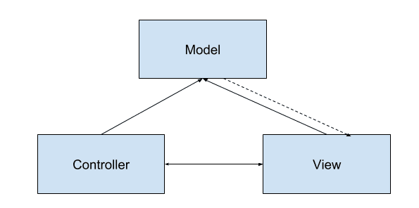
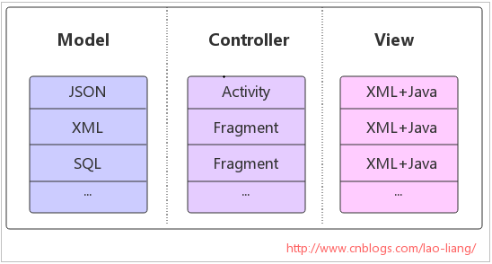
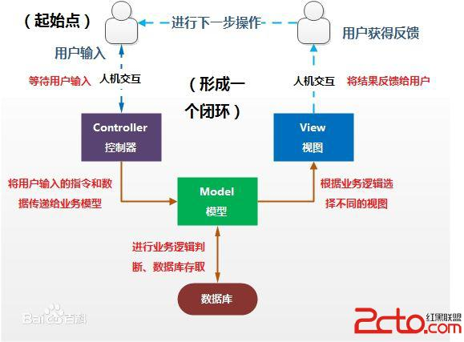
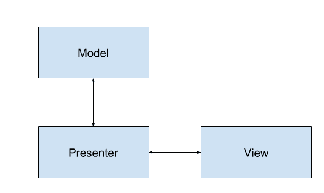
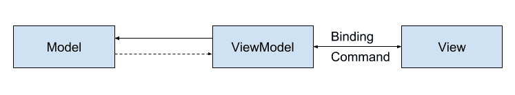
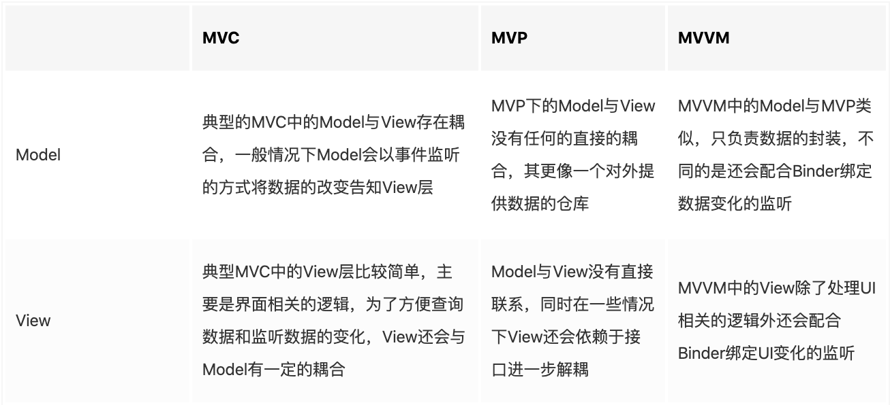
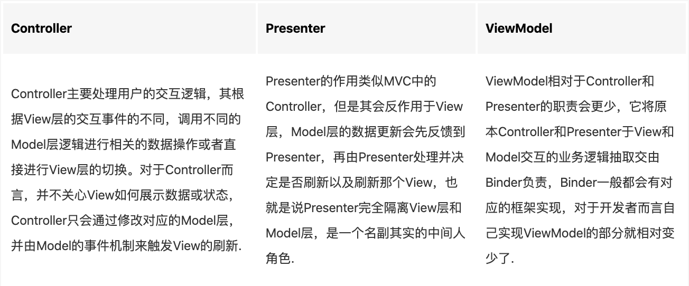

## Jvm、Dalvik和Art的区别

1、JVM Java虚拟机

JVM(Java Virtual Machine)是一种软件实现，执行像物理程序的机器。JVM并是不专为Java所实现运行的，只要其他编程语言的编译器能生成Java字节码，那这个语言也能实现在JVM上运行。因此，JVM通过执行Java bytecode可以使java代码在不改变的情况下在各种硬件之上。

2、Dalvik 虚拟机

DVM是Google专门为Android平台开发的虚拟机，它运行在Android运行时库中。Dalvik虚拟机是基于apache的java虚拟机，并被改进以适应低内存，低处理器速度的移动设备环境。Dalvik虚拟机依赖于Linux内核，实现进程隔离与线程调试管理，安全和异常管理，垃圾回收等重要功能。

3、DVM与JVM的区别

DVM之所以不是一个JVM ，主要原因是DVM并没有遵循JVM规范来实现。DVM与JVM主要有以下区别。

* 基于的架构不同

JVM基于栈则意味着需要去栈中读写数据，所需的指令会更多，这样会导致速度慢，对于性能有限的移动设备，显然不是很适合。
DVM是基于寄存器的，它没有基于栈的虚拟机在拷贝数据而使用的大量的出入栈指令，同时指令更紧凑更简洁。但是由于显示指定了操作数，所以基于寄存器的指令会比基于栈的指令要大，但是由于指令数量的减少，总的代码数不会增加多少。

* 执行的字节码不同

在Java SE程序中，Java类会被编译成一个或多个.class文件，打包成jar文件，而后JVM会通过相应的.class文件和jar文件获取相应的字节码。执行顺序为： .java文件 -> .class文件 -> .jar文件
而DVM会用dx工具将所有的.class文件转换为一个.dex文件，然后DVM会从该.dex文件读取指令和数据。执行顺序为：.java文件 –>.class文件-> .dex文件

.jar文件里面包含多个.class文件，每个.class文件里面包含了该类的常量池、类信息、属性等等。当JVM加载该.jar文件的时候，会加载里面的所有的.class文件，JVM的这种加载方式很慢，对于内存有限的移动设备并不合适。
而在.apk文件中只包含了一个.dex文件，这个.dex文件里面将所有的.class里面所包含的信息全部整合在一起了，这样再加载就提高了速度。.class文件存在很多的冗余信息，dex工具会去除冗余信息，并把所有的.class文件整合到.dex文件中，减少了I/O操作，提高了类的查找速度。

* DVM允许在有限的内存中同时运行多个进程

DVM经过优化，允许在有限的内存中同时运行多个进程。在Android中的每一个应用都运行在一个DVM实例中，每一个DVM实例都运行在一个独立的进程空间。独立的进程可以防止在虚拟机崩溃的时候所有程序都被关闭。

4、ART虚拟机

ART(Android Runtime)是Android 4.4发布的，用来替换Dalvik虚拟，Android 4.4默认采用的还是DVM，系统会提供一个选项来开启ART。在Android 5.0时，默认采用ART，DVM从此退出历史舞台。

* ART与DVM的区别

ART 的机制与 Dalvik 不同。在Dalvik下，应用每次运行的时候，字节码都需要通过即时编译器（just in time ，JIT）转换为机器码，这会拖慢应用的运行效率，而在ART 环境中，应用在第一次安装的时候，字节码就会预先编译成机器码，使其成为真正的本地应用。这个过程叫做预编译（AOT,Ahead-Of-Time）。这样的话，应用的启动(首次)和执行都会变得更加快速。

Dalvik与Art的区别：

* Dalvik每次都要编译再运行，Art只会首次启动编译
* Art占用空间比Dalvik大（原生代码占用的存储空间更大），就是用“空间换时间”
* Art减少编译，减少了CPU使用频率，使用明显改善电池续航
* Art应用启动更快、运行更快、体验更流畅、触感反馈更及时

ART、Dalvik、AOT、JIT四个名称的关系：

* JIT代表运行时编译策略，也可以理解成一种运行时编译器，是为了加快Dalvik虚拟机解释dex速度提出的一种技术方案，来缓存频繁使用的本地机器码
* ART和Dalvik都算是一种Android运行时环境，或者叫做虚拟机，用来解释dex类型文件。但是ART是安装时解释，Dalvik是运行时解释
* AOT可以理解为一种编译策略，即运行前编译，ART虚拟机的主要特征就是AOT

## App打包原理

一、apk解压后的目录

二、构建步骤：

1. AAPT（Android Asset Packaging Tool）工具，Android资源打包工具。会打包资源文件（res文件夹下的文件），并生成R.java和resources.arsc文件。
2. AIDL工具会将所有的.aidl文件编译成.java文件。
3. JAVAC工具将R.java、AIDL接口生成的java文件、应用代码java文件编译成.class文件。
4. dx脚本将很多.class文件转换打包成一个.dex文件。
5. apkbuilder脚本将资源文件和.dex文件生成未签名的.apk文件。
6. jarsigner对apk进行签名。

## Android中的MVC MVP MVVM框架模式

###  MVC 框架模式

MVC结构如下图：

**模型层（Model）：**程序需要操作的数据或信息（系统中的业务逻辑部分），比如数据的存储、网络请求等，同时Model与View也存在一定的耦合，通过某种事件机制（如观察者模式）通知View状态改变或更新；Model还会接收来自Controller的事件，Model也会允许View 查询相关数据以显示自身状态.

**视图层（View）：**直接面向于最终用户的视图层，并提供给用户操作界面，是Model的具体表现形式，是程序的外壳。该层只负责展示数据，主要是由各种UI组件组成，同时响应用户的交互行为并触发Controller的逻辑，View还会通过在Model中注册事件监听Model的改变以此来刷新自身并展示给用户（如监听Model中的Bitmap图像，当Bitmap加载或清除时，对应的View显示不同的图像）.

**控制器层（Controller）：**Controller由View根据用户行为触发，并响应来自View的交互，然后根据View的事件逻辑修改对应的Model，Controller并不关心View如何展示数据或状态，而是通过修改Model并由Model的事件机制来触发View的刷新.

下图展示了MVC程序框架在Android应用程序中的使用，以及各个层次使用哪些组件担当：

使用MVC的目的就是将M和V的实现代码分离，从而使同一个程序可以使用不同的表现形式，而Controller存在的目的则是确保M改变，V应该同步更新。

Android应用程序中，MVC框架是如何实现的？都充当什么角色？

1. View接受用户的交互请求；
2. View将请求转交给Controller；
3. Controller（用户做的动作比如：update数据，删除指定名字的学生等等）操作Model进行数据更新（根据用户指示，执行底层的数据动作等等）；
4. 数据更新之后，Model通知View数据变化；
5. View显示更新之后的数据；

M层适合做一些业务逻辑处理，比如数据库存取操作、网络操作、复杂的算法等耗时操作；

V层显示数据部分，XML布局可以视为是V层，显示Model层的数据结果；

C层适合使用Activity担当，Android中Activity用于处理用户交互问题（发起业务请求），读取用户输入（等待业务处理结果），响应用户点击等等事件。

#### MVC 的优缺点及适用场景

优点：

1. 耦合性低，MVC本质是分层解耦，将表现层与表现逻辑很好的分离，减少模块代码之间的相互影响.
2. 可扩展性好。由于耦合性低，添加需求，扩展代码就可以减少修改之前的代码，降低bug的出现率.
3. 模块职责划分明确。主要划分层M,V,C三个模块，利于代码的维护.

缺点：

1. View层和Model层是相互可知的，这意味着两层之间存在耦合；
2. 在Android开发中，xml作为View层，控制能力实在太弱了，只能把代码写在Activity中，造成了Activity既是Controller层，又是view层这样一个窘境，而且Activity并不是一个标准的MVC模式中的Controller，它的首要职责是加载应用的布局和初始化用户界面，并接受和处理来自用户的操作请求，进而作出响应。随着应用内界面及其逻辑的复杂度不断提升，Activity类的职责不断增加，以致变得庞大而臃肿。

适用场景：适用于功能较少、业务逻辑简单、界面不复杂的小型项目。

### MVP 框架模式

MVP全称Model View Presenter，它是MVC的一个演化版本，常用MVP结构如下图：

**数据的存取（Model）：**Model角色主要是提供数据的存取功能，Presenter需要通过Model层存取、获取数据，Model就像一个数据仓库，更直白说Model是封装了数据DAO、网络获取数据的角色，或者是两种数据获取方式的集合。

**用户界面（View）：**View通常指Activity、Fragment或者某个View控件，它含有一个Presenter成员变量。通常View需要实现一个逻辑接口，将View上的操作转交给Presenter进行实现，最后，Presenter将调用View逻辑接口将结果返回给View元素。

**交互中间人（Presenter）：**Presenter主要作为View和Model的桥梁，它从Model层检索数据后，返回给View，使得View和Model之间没有耦合，也将业务逻辑从View层上抽离出来。
MVP并没有一个标准的模式，它有很多的实现方式，但无论如何，我们只要保证：通过Presenter将View和Model解耦合、降低类型复杂度、各个模块可以独立测试、独立变化，这就是正确的方向；

个人觉得MVP模式最重要的实现方式是：分离显示层和逻辑层，使它们通过接口进行通信,降低耦合；理想的MVP模式可以实现一份逻辑代码搭配不同的显示界面，因为它们之间不依赖具体实现，而是依赖于抽象。

Android应用程序中，MVP框架是如何实现的？都充当什么角色？

1. View接受用户的交互请求；
2. View通过Presenter暴露接口将请求转交给Presenter来进行处理；
3. Presenter 通过Model暴露接口对Model进行操作和更新；
4. Model改变后，可以将改变的信息发送至Presenter；
5. Presenter通过View暴露接口对View进行视图更新；

M层提供数据上的存取，比如数据库存取操作、网络操作、复杂的算法等操作；

V层负责显示数据部分，显示Model层的数据结果，Activity、Fragment或者某个View控件可以视为是V层；

P层更多的是作为V层和M层的桥梁，主要负责相关的业务逻辑。

MVP还有很多演化版本和分支版本，它不存在标准和固定的模式，只要是符合上面提到的实现方式，它就是合理的。

#### MVP的优缺点及适用场景

为什么说MVP是MVC的演化版本，因为MVP很好的解决了MVC的一些弊端。

优点：

1. 通过P层的转接能避免业务逻辑被塞进View中，有效的降低View的复杂性；
2. View层和Model层完全解耦，他们之间互不干扰，带来了良好的可拓展性、可测试性，保证了系统的灵活性和整洁性；
3. Activity、Fragment等仅仅为View层，不会再出现MVC那种Activity、Fragment即做View层又做Controller层的窘境，View层及Model层大大提高复用性；
4. 我们可以将一个Presenter用于多个视图，而不需要改变Presenter的逻辑。这个也是我上面提到的理想的MVP模式；
5. 由于各层分工明确，极便于单元测试；

缺点：

1. MVP是以UI为驱动的模型，更新UI时需要保证能获取到控件的引用，同时更新UI时也要考虑当前是否是UI线程；
2. 复杂的业务同时也可能会导致P层太大，代码臃肿的问题依然不能解决；
3. MVP通过接口进行交互的，接口粒度不好设计和控制。粒度太小，就会存在大量接口；粒度太大，解耦效果不好；
4. MVP数据都是被动地通过UI控件做展示，但是由于数据的时变性，我们更希望数据能转被动为主动，使数据能更有活性，由数据来驱动UI；

适用场景：适用于界面复杂、复用性高、功能中等、业务逻辑中等或是简单的项目。实际上MVP的思想很适合用于复杂的界面上，我们完全可以在项目中某一部分上使用MVP的思想去灵活实现

#### Android中MVP实现需要注意的点

综上所述，MVP有很多的优点，但在Android中Activity、Fragment作为View层时，它不仅仅只是View那么简单，它还存在自身的生命周期；以下是我总结的几个需要注意的点，非常欢迎补充：

1. 更新UI时要考虑当前执行的线程是否是UI线程，也要考虑Activity的生命周期，做好Activity已被摧毁的处理；
2. P层需要执行耗时操作，而P层持有Activity、Fragment的强引用，在耗时操作结束前Activity、Fragment已被摧毁了，但由于P层一直持有Activity、Fragment对象，导致Activity、Fragment无法被回收引起内存泄露；这里建议使用弱引用和Activity、Fragment的声明周期来处理；

### MVVM 框架模式

MVVM全称Model View ViewModel，你可以把MVVM看做是MVP的一个改进版本，常用的MVVM结构如下图：

**Model：**Model主要是封装数据存储或操作的一些逻辑，还会提供一系列的实体类用于UI绑定，ViewModel 则会在修改这些数据后将数据改变告诉View层并使UI更新。

**View：**View用于处理界面的逻辑且不参与业务逻辑相关的操作，只负责显示由ViewModel提供的数据，View层不做任何业务逻辑、不涉及操作数据、不处理数据，UI和数据严格的分开,对应于Activity和XML。

**ViewModel：**ViewModel层做的事情刚好和View层相反，ViewModel只做和业务逻辑和业务数据相关的事，不做任何和UI相关的事情，ViewModel层不会持有任何控件的引用，更不会在ViewModel中通过UI控件的引用去做更新UI的事情。ViewModel就是专注于业务的逻辑处理，做的事情也都只是对数据的操作（这些数据绑定在相应的控件上会自动去更改UI）。

MVVM的目标和思想与MVP类似，利用数据绑定(Data Binding)、依赖属性(Dependency Property)、命令(Command)、路由事件(Routed Event)等新特性，打造了一个更加灵活高效的架构，
在常规的开发模式中，数据变化需要更新UI的时候，需要先获取UI控件的引用，然后再更新UI，获取用户的输入和操作也需要通过UI控件的引用，但在MVVM中，这些都是通过数据驱动来自动完成的，数据变化后会自动更新UI，UI的改变也能自动反馈到数据层，数据成为主导因素。这样MVVM层在业务逻辑处理中只要关心数据，不需要直接和UI打交道，在业务处理过程中简单方便很多。

MVVM模式中，数据是独立于UI的，数据和业务逻辑处于一个独立的ViewModel中，ViewModel只需要关注数据和业务逻辑，不需要和UI或者控件打交道。UI想怎么显示数据都由UI自己决定，ViewModel不涉及任何和UI相关的事，也不持有UI控件的引用。即便是控件改变了（比如：TextView换成EditText），ViewModel也几乎不需要更改任何代码。它非常完美的解耦了View层和ViewModel，解决了上面我们所说的MVP的痛点。

#### MVVM的优缺点及适用场景

优点：

1. 低耦合，数据和业务逻辑处于一个独立的ViewModel中，ViewModel只需要关注数据和业务逻辑，不需要和View层打交道。
2. 可重用性，你可以把一些视图逻辑放在一个ViewModel里面，让很多view重用这段视图逻辑。
3. 可分开独立开发，MVVM的分工是非常明显的，由于View和ViewModel之间是松散耦合的：一个是处理业务和数据、一个是专门的UI处理。所以，完全可以由两个人分工来做，一个做UI（XML和Activity）一个写ViewModel，效率更高。
4. 由于各层分工明确，极便于单元测试；
5. 相对于MVP而言，MVVM不需要我们手动的处理大量的View和Model相关操作，也非常完美的解耦了View层和ViewModel；

缺点：

1. 数据绑定使得 Bug 很难被调试，你看到界面异常了，有可能是你 View 的代码有 Bug，也可能是 Model 的代码有问题。数据绑定使得一个位置的 Bug 被快速传递到别的位置，要定位原始出问题的地方就变得不那么容易了。
2. 对于过大的项目，数据绑定需要花费更多的内存，而对与过于简单的界面，使用MVVM无异是杀鸡用牛刀，某种意义上来说，我认为就是数据绑定使得 MVVM 变得复杂和难用了。

适用场景：我自身没有在实际项目中应用过MVVM，这里不好定义使用场景，但MVVM是不适用于简单的界面和极度复杂的界面，在界面简单的情况下，MVVM反而将我们的逻辑复杂化了，而界面元素过多，相对应的ViewModel的构建和维护成本就会变的很高，不利于项目的发展。

###  MVC MVP MVVM的异同

在实际的情况下，我们很难去界定MVC、MVP和MVVM，他们三者有着一些相似的特性，从本质上来讲他们的目的都是分层解耦，结构上也都是分为3部分，其中都有View层和Model层，但是其职责又有一定的不同：

注：这里的Binder不是Android的Binder机制，这里是指负责View和Model之间的数据逻辑操作的处理；

从上面的架构结构图，我们可以看到，MVC、MVP和MVVM三者中Model和View在演化的过程中遵循这么一个理念：耦合 -> 解耦 -> 实用，在MVC中View和Model还存在一定的耦合，而在MVP中则彻底抛开这个耦合并依赖于接口进一步解耦，到了MVVM，MVP该做的都做的差不多了，唯一不好的就是很多时候View和Model之间有大量重复的数据交互操作，MVVM则提出将这些操作进一步提取由框架来承担。
除了Model和View外，MVC、MVP和MVVM都将业务逻辑的处理单独放置在Controller、Presenter和ViewModel中，虽然名称不同但它们的本质都是一样的，只是在具体的业务处理以及职责划分上会有一定的差异：

从MVC到MVP再到MVVM，我们可以看到整个框架模式的演进，因为MVC的不足到MVP的出现，对MVP的缺陷弥补到MVVM的诞生，三者是一个循序渐进的过程，在以后必定会有更多更好的框架模式的出现。

