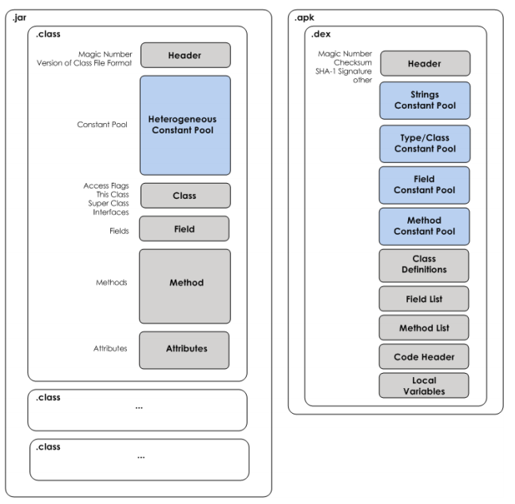

## Jvm、Dalvik和Art的区别

1、JVM Java虚拟机

JVM(Java Virtual Machine)是一种软件实现，执行像物理程序的机器。JVM并是不专为Java所实现运行的，只要其他编程语言的编译器能生成Java字节码，那这个语言也能实现在JVM上运行。因此，JVM通过执行Java bytecode可以使java代码在不改变的情况下在各种硬件之上。

2、Dalvik 虚拟机

DVM是Google专门为Android平台开发的虚拟机，它运行在Android运行时库中。Dalvik虚拟机是基于apache的java虚拟机，并被改进以适应低内存，低处理器速度的移动设备环境。Dalvik虚拟机依赖于Linux内核，实现进程隔离与线程调试管理，安全和异常管理，垃圾回收等重要功能。

3、DVM与JVM的区别

DVM之所以不是一个JVM ，主要原因是DVM并没有遵循JVM规范来实现。DVM与JVM主要有以下区别。

* 基于的架构不同

JVM基于栈则意味着需要去栈中读写数据，所需的指令会更多，这样会导致速度慢，对于性能有限的移动设备，显然不是很适合。
DVM是基于寄存器的，它没有基于栈的虚拟机在拷贝数据而使用的大量的出入栈指令，同时指令更紧凑更简洁。但是由于显示指定了操作数，所以基于寄存器的指令会比基于栈的指令要大，但是由于指令数量的减少，总的代码数不会增加多少。

* 执行的字节码不同

在Java SE程序中，Java类会被编译成一个或多个.class文件，打包成jar文件，而后JVM会通过相应的.class文件和jar文件获取相应的字节码。执行顺序为： .java文件 -> .class文件 -> .jar文件
而DVM会用dx工具将所有的.class文件转换为一个.dex文件，然后DVM会从该.dex文件读取指令和数据。执行顺序为：.java文件 –>.class文件-> .dex文件

.jar文件里面包含多个.class文件，每个.class文件里面包含了该类的常量池、类信息、属性等等。当JVM加载该.jar文件的时候，会加载里面的所有的.class文件，JVM的这种加载方式很慢，对于内存有限的移动设备并不合适。
而在.apk文件中只包含了一个.dex文件，这个.dex文件里面将所有的.class里面所包含的信息全部整合在一起了，这样再加载就提高了速度。.class文件存在很多的冗余信息，dex工具会去除冗余信息，并把所有的.class文件整合到.dex文件中，减少了I/O操作，提高了类的查找速度。

* DVM允许在有限的内存中同时运行多个进程

DVM经过优化，允许在有限的内存中同时运行多个进程。在Android中的每一个应用都运行在一个DVM实例中，每一个DVM实例都运行在一个独立的进程空间。独立的进程可以防止在虚拟机崩溃的时候所有程序都被关闭。

4、ART虚拟机

ART(Android Runtime)是Android 4.4发布的，用来替换Dalvik虚拟，Android 4.4默认采用的还是DVM，系统会提供一个选项来开启ART。在Android 5.0时，默认采用ART，DVM从此退出历史舞台。

* ART与DVM的区别

ART 的机制与 Dalvik 不同。在Dalvik下，应用每次运行的时候，字节码都需要通过即时编译器（just in time ，JIT）转换为机器码，这会拖慢应用的运行效率，而在ART 环境中，应用在第一次安装的时候，字节码就会预先编译成机器码，使其成为真正的本地应用。这个过程叫做预编译（AOT,Ahead-Of-Time）。这样的话，应用的启动(首次)和执行都会变得更加快速。

Dalvik与Art的区别：

* Dalvik每次都要编译再运行，Art只会首次启动编译
* Art占用空间比Dalvik大（原生代码占用的存储空间更大），就是用“空间换时间”
* Art减少编译，减少了CPU使用频率，使用明显改善电池续航
* Art应用启动更快、运行更快、体验更流畅、触感反馈更及时

ART、Dalvik、AOT、JIT四个名称的关系：

* JIT代表运行时编译策略，也可以理解成一种运行时编译器，是为了加快Dalvik虚拟机解释dex速度提出的一种技术方案，来缓存频繁使用的本地机器码
* ART和Dalvik都算是一种Android运行时环境，或者叫做虚拟机，用来解释dex类型文件。但是ART是安装时解释，Dalvik是运行时解释
* AOT可以理解为一种编译策略，即运行前编译，ART虚拟机的主要特征就是AOT

## App打包原理

一、apk解压后的目录

二、构建步骤：

1. AAPT（Android Asset Packaging Tool）工具，Android资源打包工具。会打包资源文件（res文件夹下的文件），并生成R.java和resources.arsc文件。
2. AIDL工具会将所有的.aidl文件编译成.java文件。
3. JAVAC工具将R.java、AIDL接口生成的java文件、应用代码java文件编译成.class文件。
4. dx脚本将很多.class文件转换打包成一个.dex文件。
5. apkbuilder脚本将资源文件和.dex文件生成未签名的.apk文件。
6. jarsigner对apk进行签名。

