## OkHttp3源码分析

一、概要

1、OKHttp优点
支持SPDY HTTP2.0；如果服务器和客户端都支持这两种它会用同一个socket来处理同一个服务器的所有请求提高http连接效率
如果服务器不支持SPDY 则通过连接池来减少请求延时
无缝的支持GZIP来减少数据流量
缓存响应数据减少重复的网络请求
请求失败时自动重试主机的其他ip，自动重定向
多路复用机制

2.OKHttp使用到的设计模式
单例模式：实例化OKHttpClient就要用到，因为每个OKHttpClient对象都有自己的连接池和线程池等资源，如果每次使用都去实例化一个新的对象，显然内存是吃不消的
外观模式：OKHttpClient里面包含了很多类对象，其实就是将很多功能模块都封装到OKHttpClient中，由它单独对外提供API；这样就隐藏了系统的复杂性
构建者模式：在实例化OKHttpClient和Request的时候，因为有太多的属性需要设置，而且开发者的需求组合千变万化，就需要通过Build一步一步构建需要的对象
工厂方法模式：Call接口提供了内部接口Factory，用于将对象的创建延迟到该工厂类的子类中进行，从而实现动态的配置；该模式可以使得对象的创建不会对客户端暴露创建逻辑，通过使用一个共同的接口来指向新创建的对象
享元模式：在Dispatcher的线程池中，所用到了享元模式，一个不限容量的线程池 ， 线程空闲时存活时间为 60 秒。线程池实现了对象复用，降低线程创建开销，从设计模式上来讲，使用了享元模式。（享元模式：尝试重用现有的同类对象，如果未找到匹配的对象，则创建新对象，主要用于减少创建对象的数量，以减少内存占用和提高性能）
责任链模式：很明显，在okhttp中的拦截器模块，执行过程用到。OkHttp3 的拦截器链中， 内置了5个默认的拦截器，分别用于重试、请求对象转换、缓存、链接、网络读写（责任链模式：为请求创建了一个接收者对象的链。这种模式给予请求的类型，对请求的发送者和接收者进行解耦。这种类型的设计模式属于行为型模式。在这种模式中，通常每个接收者都包含对另一个接收者的引用。如果一个对象不能处理该请求，那么它会把相同的请求传给下一个接收者，依此类推）
策略模式：CacheInterceptor 实现了数据的选择策略， 来自网络还是来自本地？ 这个场景也是比较契合策略模式场景， CacheInterceptor 需要一个策略提供者提供它一个策略， CacheInterceptor 根据这个策略去选择走网络数据还是本地缓存（策略模式：一个类的行为或其算法可以在运行时更改。这种类型的设计模式属于行为型模式。策略模式中，我们创建表示各种策略的对象和一个行为随着策略对象改变而改变的 context 对象。策略对象改变 context 对象的执行算法）

3.使用流程

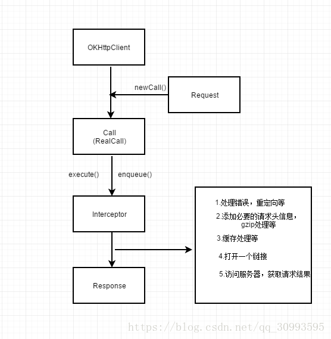

二、流程分析

1、OKHTTP请求流程

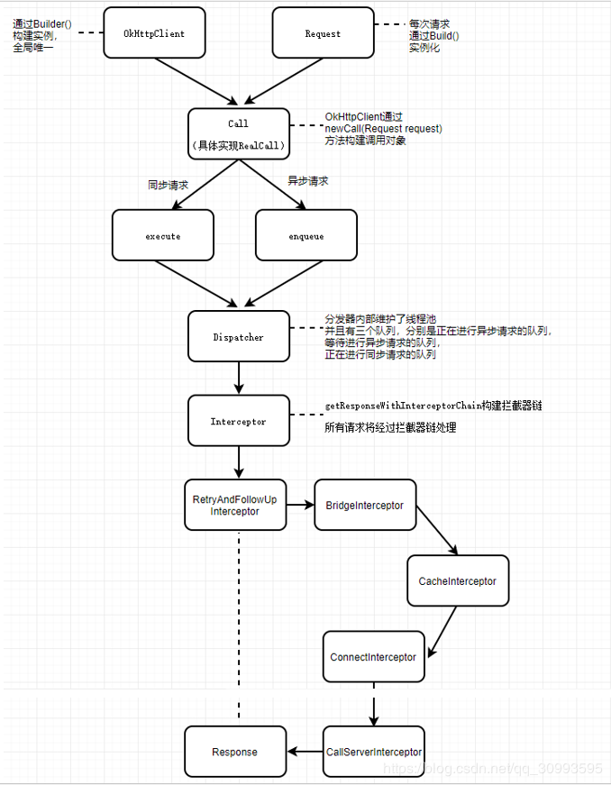

2、核心类

1. OkHttpClient：整个框架的客户端类，OkHttpClient强烈建议全局单例使用，因为每一个OkHttpClient都有自己单独的连接池和线程池，复用连接池和线程池能够减少延迟、节省内存
2. ConnectionPool：管理HTTP和HTTP / 2连接的重用，以减少网络延迟。 相同Address的HTTP请求可以共享Connection。 此类实现了哪些连接保持打开以供将来使用的策略
3. Request：封装请求报文信息的对象，比如请求url，请求方法，超时时间，还有各种请求头
4. Call：一个Call表示一个为执行而准备的请求，一个接口
5. RealCall：Call的实现类，它是连接Request和Response的桥梁
6. Response：请求响应的封装对象
7. Dispatcher：分发器类，维护同步请求和异步请求的状态，内部维护了一个线程池，用于执行网络请求的线程；同时还维护了三个请求队列，一个是正在进行异步请求的队列（包含了已取消但未完成的请求），一个是处于等待执行的异步请求队列，最后一个是正在进行同步请求的队列（包含了已取消但未完成的请求）
8. Interceptor：拦截器类，可以观察修改我们的请求和响应，是一个接口，有五个实现类，它们形成一个拦截器链，依次对我们的请求响应做处理
9. RetryAndFollowUpInterceptor：Interceptor实现类之一，是网络请求失败时进行重连及服务器返回当前请求需要进行重定向的拦截器
10. BridgeInterceptor：桥接连接器，主要是进行请求前的一些操作，将我们的请求设置成服务器能识别的请求，比如设置一系列头部信息，比如设置请求内容长度，编码，gzip压缩，cookie等
11. CacheInterceptor：缓存拦截器，这个就很明显了，作用是缓存请求和响应，比如同一个请求之前发生过，这次就不需要重新构建了，直接从缓存取；响应同理
12. ConnectInterceptor：连接拦截器，为当前请求找到一个合适的连接，比如如果从连接处中可以找到能复用的连接，就不要再创建新的连接了
13. CallServerInterceptor：连接服务器拦截器，负责向服务器发送真正的请求，接受服务器的响应

3、使用方法切入点

1. 同步请求方法：Call.execute，在当前线程执行请求，会阻塞当前线程
2. 异步请求方法：Call.enqueue，新开一个线程执行请求，不会阻塞当前线程

4、同步和异步请求代码

使用步骤基本分为如下几步：

* 第一步：实例化OKHttpClient对象
* 第二步：实例化网络请求对象Request
* 第三步：实例化一个准备执行的请求的对象
* 第四步：执行请求方法

1.同步请求

```
OkHttpClient okHttpClient = new OkHttpClient.Builder()
        .connectTimeout(3000, TimeUnit.SECONDS)
        .readTimeout(3000, TimeUnit.SECONDS)
        .build();

public String syncRequest(String url) {
    String result = null;
    Request request = new Request.Builder().url(url).build();
    Call call = okHttpClient.newCall(request);
    Response response = null;
    try {
        response = call.execute();
        if (response.isSuccessful()) {
            result = response.body().string();
        }
    } catch (IOException e) {
        e.printStackTrace();
    }
    return result;
}
```

2.异步请求

```
public void asyncRequest(String url) {
    Request request = new Request.Builder().url(url).build();
    Call call = okHttpClient.newCall(request);
    call.enqueue(new Callback() {
        @Override
        public void onFailure(Call call, IOException e) {
            //请求失败了，这里是在子线程回调，不能在这里直接更新UI
        }

        @Override
        public void onResponse(Call call, Response response) throws IOException {
            //获取请求结果，这里是在子线程回调
            String result = response.body().string();
        }
    });
}
```

5、同步和异步请求源码分析

1.OKHttpClient实例化

通过它的静态内部类Builder构建OKHttpClient，也就是使用常见的建造者模式，代码如下

```
public Builder() {
  //实例化分发器
  dispatcher = new Dispatcher();
  //设置支持的网络协议，默认支持HTTP/2和http/1.1
  protocols = DEFAULT_PROTOCOLS;
  //设置支持的连接，默认是使用SNI和ALPN等扩展的现代TLS连接和未加密、未认证的http连接
  connectionSpecs = DEFAULT_CONNECTION_SPECS;
  //Call状态监听器
  eventListenerFactory = EventListener.factory(EventListener.NONE);
  //使用默认的代理选择器
  proxySelector = ProxySelector.getDefault();
  if (proxySelector == null) {
    proxySelector = new NullProxySelector();
  }
  //默认没有cookie
  cookieJar = CookieJar.NO_COOKIES;
  //创建socket工厂类
  socketFactory = SocketFactory.getDefault();
  //下面四个是安全相关的配置
  hostnameVerifier = OkHostnameVerifier.INSTANCE;
  certificatePinner = CertificatePinner.DEFAULT;
  proxyAuthenticator = Authenticator.NONE;
  authenticator = Authenticator.NONE;
  //实例化连接池 使用连接池技术减少请求的延迟(如果SPDY是可用的话)
  connectionPool = new ConnectionPool();
  //域名解析系统
  dns = Dns.SYSTEM;
  followSslRedirects = true;
  followRedirects = true;
  retryOnConnectionFailure = true;
  callTimeout = 0;
  connectTimeout = 10_000;
  readTimeout = 10_000;
  writeTimeout = 10_000;
  //为了保持长连接，我们必须间隔一段时间发送一个ping指令进行保活
  pingInterval = 0;
}
```

这里有两个很重要的操作

* 一个就是实例化Dispatcher，由这个对象对OKHttp中的所有网络请求任务进行调度，我们发送的同步或异步请求都会由它进行管理；它里面维护了三个队列，上面有说到，后面在分析这个类的时候会详细介绍其操作
* 还有一个就是实例化了连接池ConnectionPool，我们常说OKHttp有多路复用机制和减少网络延迟功能就是由这个类去实现；我们将客户端与服务端之间的连接抽象为一个connection（接口），其实现类是RealConnection，为了管理所有connection，就产生了ConnectionPool这个类；当一些connection共享相同的地址，这时候就可以复用connection；同时还实现了某些connection保持连接状态，以备后续复用（不过是在一定时间限制内，不是永远保持打开的）

2.Request实例化

虽然Request构建如下方所示

```
Request request = new Request.Builder().url(url).build();
```

但是整个代码实现流程是

* 先通过Request构建内部Builder对象，在构建它的过程，默认指定请求方法为get，然后又构建了一个请求头Headers的Builder对象

```
public Builder() {
  this.method = "GET";
  this.headers = new Headers.Builder();
}
```

* Headers类的Builder对象没有构造方法，只不过内部定义了一个List数组，用来存放头部信息

```
public static final class Builder {
    final List<String> namesAndValues = new ArrayList<>(20);
}    
```

* 然后通过Request的Builder对象设置url，再调用build方法，该方法实例化了Request对象并返回

```
public Request build() {
  if (url == null) throw new IllegalStateException("url == null");
  return new Request(this);
}
```

* 在实例化Request的时候，Request的构造方法里又调用了内部Builder对象内部的Headers.Builder对象的build方法，这个方法实例化了Headers对象，Headers对象的构造方法将List数组转换成了String数组

```
  Request(Builder builder) {
    this.url = builder.url;
    this.method = builder.method;
    this.headers = builder.headers.build();
    this.body = builder.body;
    this.tag = builder.tag != null ? builder.tag : this;
  }

public Headers build() {
  return new Headers(this);
}

Headers(Builder builder) {
this.namesAndValues = builder.namesAndValues.toArray(new String[builder.namesAndValues.size()]);
}
```

3.Call实例化

Call在OKHttp中是一个接口，它抽象了用户对网络请求的一些操作，比如执行请求(enqueue方法和execute方法)，取消请求(cancel方法)等，真正实现是RealCall这个类

它的实例化是由OkHttpClient对象的newCall方法去完成的

```
/**
 * 准备在将来某个时间点执行Request
 */
@Override public Call newCall(Request request) {
	return RealCall.newRealCall(this, request, false /* for web socket */);
}
```

这里RealCall的构造方法第一个参数是OkHttpClient对象，第二个参数是Request对象，第三个参数是跟WebSocket请求有关，这个后续在讲到这点的时候再说；至于在RealCall里真正做了哪些事需要到构造方法看看

```
private RealCall(OkHttpClient client, Request originalRequest, boolean forWebSocket) {
    this.client = client;
    this.originalRequest = originalRequest;
    this.forWebSocket = forWebSocket;
    this.retryAndFollowUpInterceptor = new RetryAndFollowUpInterceptor(client, forWebSocket);
    this.timeout = new AsyncTimeout() {
      @Override protected void timedOut() {
        cancel();
      }
    };
    this.timeout.timeout(client.callTimeoutMillis(), MILLISECONDS);
  }

  static RealCall newRealCall(OkHttpClient client, Request originalRequest, boolean forWebSocket) {
    // Safely publish the Call instance to the EventListener.
    RealCall call = new RealCall(client, originalRequest, forWebSocket);
    call.eventListener = client.eventListenerFactory().create(call);//Call状态监听器
    return call;
 }
```

* 首先RealCall内部会持有OkHttpClient和Request这两个对象的引用
* 实例化了RetryAndFollowUpInterceptor对象，这是一个拦截器，上面说到，它是一个请求重试和重定向的拦截器，后续在讲到拦截器的时候具体分析它
* 最后持有一个Call状态监听器的引用

总结：不管是同步请求还是异步请求，在执行请求前都要做这三个操作，也就是实例化OKHttp客户端对象OkHttpClient，包含请求信息的Request对象，一个准备执行请求的对象Call；接下来就要分道扬镳了

4.执行同步请求execute

```
// okhttp3/RealCall.java

@Override public Response execute() throws IOException {
    //第一步
    synchronized (this) {
      if (executed) throw new IllegalStateException("Already Executed");
      executed = true;
    }
    //第二步
    captureCallStackTrace();
    timeout.enter();
    eventListener.callStart(this);
    try {
      //第三步 
      client.dispatcher().executed(this);
      //第四步
      Response result = getResponseWithInterceptorChain();
      if (result == null) throw new IOException("Canceled");
      return result;
    } catch (IOException e) {
      e = timeoutExit(e);
      eventListener.callFailed(this, e);
      throw e;
    } finally {
      //第五步
      client.dispatcher().finished(this);
    }
 }
```

* 第一步：出现一个同步代码块，对当前对象加锁，通过一个标志位executed判断该对象的execute方法是否已经执行过，如果执行过就抛出异常；这也就是同一个Call只能执行一次的原因
* 第二步：这个是用来捕获okhttp的请求堆栈信息不是重点
* 第三步：调用Dispatcher的executed方法，将请求放入分发器，这是非常重要的一步
* 第四步：通过拦截器连获取返回结果Response
* 第五步：调用dispatcher的finished方法，回收同步请求

来看下第三步源码：

```
synchronized void executed(RealCall call) {
    runningSyncCalls.add(call);
 }
```

可以看到这里的逻辑很简单，只是将请求添加到了runningSyncCalls中，它是一个队列，看看它的定义

```
private final Deque<RealCall> runningSyncCalls = new ArrayDeque<>();
```

这个队列会保存正在进行的同步请求（包含了已取消但未完成的请求）

接下来我们就要想了，executed方法只是将请求存到了队列当中，那什么时候去执行这个请求呢？上面说到过拦截器和拦截器链的概念，那么我们就回到上面的第四步去看看它的真面目

```
Response getResponseWithInterceptorChain() throws IOException {
    // Build a full stack of interceptors.
    List<Interceptor> interceptors = new ArrayList<>();
    interceptors.addAll(client.interceptors());
    interceptors.add(retryAndFollowUpInterceptor);
    interceptors.add(new BridgeInterceptor(client.cookieJar()));
    interceptors.add(new CacheInterceptor(client.internalCache()));
    interceptors.add(new ConnectInterceptor(client));
    if (!forWebSocket) {
      interceptors.addAll(client.networkInterceptors());
    }
    interceptors.add(new CallServerInterceptor(forWebSocket));

    Interceptor.Chain chain = new RealInterceptorChain(interceptors, null, null, null, 0,
        originalRequest, this, eventListener, client.connectTimeoutMillis(),
        client.readTimeoutMillis(), client.writeTimeoutMillis());

    return chain.proceed(originalRequest);
 }
```

我们通过Call.execute()方法进行同步请求获取最终的返回结果就是通过这个方法实现的，看看内部逻辑：

* 实例化一个List，用来存放Interceptor对象
* addAll(client.interceptors())这一步用来添加用户自定义的拦截器
* 依次添加OKHttp内部的五个拦截器
* 创建了一个RealInterceptorChain对象，它构建了一个拦截器链，通过proceed方法将这些拦截器一一执行

具体逻辑来看它的内部实现

```
public RealInterceptorChain(List<Interceptor> interceptors, StreamAllocation streamAllocation,
      HttpCodec httpCodec, RealConnection connection, int index, Request request, Call call,
      EventListener eventListener, int connectTimeout, int readTimeout, int writeTimeout) {
    this.interceptors = interceptors;
    this.connection = connection;
    this.streamAllocation = streamAllocation;
    this.httpCodec = httpCodec;
    this.index = index;
    this.request = request;
    // Call相关的设置
    this.call = call;
    this.eventListener = eventListener;
    this.connectTimeout = connectTimeout;
    this.readTimeout = readTimeout;
    this.writeTimeout = writeTimeout;
}
```

* interceptors 存放了众多拦截器
* 其中第二，第三，第四个参数都是null
* index默认传的是0，其实是interceptors数组的索引，在proceed方法获取数组中的拦截器用的
* request就是包含请求信息的对象

RealInterceptorChain.proceed

```
@Override public Response proceed(Request request) throws IOException {
    return proceed(request, streamAllocation, httpCodec, connection);
  }

  public Response proceed(Request request, StreamAllocation streamAllocation, HttpCodec httpCodec,
      RealConnection connection) throws IOException {
    if (index >= interceptors.size()) throw new AssertionError();

    calls++;

    ...

    // Call the next interceptor in the chain.
    RealInterceptorChain next = new RealInterceptorChain(interceptors, streamAllocation, httpCodec,
        connection, index + 1, request, call, eventListener, connectTimeout, readTimeout,
        writeTimeout);
    Interceptor interceptor = interceptors.get(index);
    Response response = interceptor.intercept(next);
    ...
    return response;
   }
```

* 如果索引index大于interceptors的大小，就抛出异常；然后将calls加一
* 接下来的几个关于httpCodec的if判断暂时不用管

我们重点看中间的几行代码：
又实例化了一个RealInterceptorChain对象，然后根据index从interceptors列表中取出下一个拦截器，最后调用该拦截器的intercept方法，并将拦截器链对象传递进去，最终获取结果返回

这里我们要看到一个很重要的点就是在实例化新的RealInterceptorChain时候，传入的参数是index+1；这样当第一个拦截器执行自己的intercept方法，做相关的逻辑，如果能获取结果就返回，不再继续执行接下来的拦截器；如果需要通过下一个拦截器获取结果，那就通过传入的参数RealInterceptorChain调用proceed方法，这样在这个方法里根据递增的索引index就能不断的从interceptors列表中取出下一个拦截器，执行每个拦截器自己的逻辑获取结果，直到所有拦截器执行完毕；这就是OKHttp拦截器链的由来，也是它的精妙所在

至于每个拦截器具体逻辑，在后续文章给出

接下来看看第五步

dispatcher.finished

```
void finished(RealCall call) {
    finished(runningSyncCalls, call);
}
```

当同步请求执行到这里说明这个请求已经完成了，需要进行收尾工作

```
private <T> void finished(Deque<T> calls, T call) {
    Runnable idleCallback;
    synchronized (this) {
      if (!calls.remove(call)) throw new AssertionError("Call wasn't in-flight!");
      idleCallback = this.idleCallback;
    }

    boolean isRunning = promoteAndExecute();

    if (!isRunning && idleCallback != null) {
      idleCallback.run();
    }
}

private boolean promoteAndExecute() {
    assert (!Thread.holdsLock(this));

    List<AsyncCall> executableCalls = new ArrayList<>();
    boolean isRunning;
    synchronized (this) {
      for (Iterator<AsyncCall> i = readyAsyncCalls.iterator(); i.hasNext(); ) {
        AsyncCall asyncCall = i.next();

        if (runningAsyncCalls.size() >= maxRequests) break; // Max capacity.
        if (runningCallsForHost(asyncCall) >= maxRequestsPerHost) continue; // Host max capacity.

        i.remove();
        executableCalls.add(asyncCall);
        runningAsyncCalls.add(asyncCall);
      }
      isRunning = runningCallsCount() > 0;
    }

    for (int i = 0, size = executableCalls.size(); i < size; i++) {
      AsyncCall asyncCall = executableCalls.get(i);
      asyncCall.executeOn(executorService());
    }

    return isRunning;
  }
  
  public synchronized int runningCallsCount() {
    return runningAsyncCalls.size() + runningSyncCalls.size();
  }
```

第一个参数是正在进行同步请求的队列，第二个参数是Call对象
这里也有一个同步代码块，因为队列是线程不安全的实现；首先将这个Call对象从队列中移出，不能移出就抛出异常；
然后给idleCallback赋值
最后判断isRunning，判断runningCallsCount 是否>0，这说明整个dispatcher分发器内部没有维护正在进行的请求了，同时idleCallback不为null，那就执行它的run方法（每当dispatcher内部没有正在执行的请求时进行的回调）
可以看出来，在进行同步请求的时候dispatcher分发器做的事很简单，就是添加请求到队列，从队列移除请求，那异步请求的时候是如何呢？

5.执行异步请求enqueue

```
@Override public void enqueue(Callback responseCallback) {
    synchronized (this) {
      if (executed) throw new IllegalStateException("Already Executed");
      executed = true;
    }
    captureCallStackTrace();
    eventListener.callStart(this);
    client.dispatcher().enqueue(new AsyncCall(responseCallback));
}
```

* 方法接收一个Callback参数，它是用来进行请求结束回调的
* 有一个同步代码块，判断该请求是否已经执行过；可以看出来，同一个Call对象，不管是调用execute方法还是enqueue方法，都只能调用一次
获取堆栈信息
* 调用dispatcher的enqueue方法

这里跟同步请求不同，它构建了一个新的Call，即AsyncCall对象，是RealCall内部类，继承NamedRunnable

```
public abstract class NamedRunnable implements Runnable {
  protected final String name;

  public NamedRunnable(String format, Object... args) {
    this.name = Util.format(format, args);
  }

  @Override public final void run() {
    String oldName = Thread.currentThread().getName();
    Thread.currentThread().setName(name);
    try {
      execute();
    } finally {
      Thread.currentThread().setName(oldName);
    }
  }

  protected abstract void execute();
}
```

内部逻辑比较简单，设置了线程名，然后调用execute方法，也就是说AsyncCall具体逻辑将在execute方法执行

dispatcher.enqueue

我们来看看分发器是如何处理异步请求的

```
void enqueue(AsyncCall call) {
    synchronized (this) {
      readyAsyncCalls.add(call);
    }
    promoteAndExecute();
}

private boolean promoteAndExecute() {
    assert (!Thread.holdsLock(this));

    List<AsyncCall> executableCalls = new ArrayList<>();
    boolean isRunning;
    synchronized (this) {
      // 循环readyAsyncCalls，取出AsyncCall
      for (Iterator<AsyncCall> i = readyAsyncCalls.iterator(); i.hasNext(); ) {
        AsyncCall asyncCall = i.next();
        // 判断正在进行异步请求队列长度是否小于64，且单个Host正在执行的请求数小于5； 
        if (runningAsyncCalls.size() >= maxRequests) break; // Max capacity.
        if (runningCallsForHost(asyncCall) >= maxRequestsPerHost) continue; // Host max capacity.
        // 移除当前队列
        i.remove();
        // 将请求添加到runningAsyncCalls队列和执行队列executableCalls
        executableCalls.add(asyncCall);
        runningAsyncCalls.add(asyncCall);
      }
      isRunning = runningCallsCount() > 0;
    }

    for (int i = 0, size = executableCalls.size(); i < size; i++) {
      AsyncCall asyncCall = executableCalls.get(i);
      // 使用内部线程池执行该请求
      asyncCall.executeOn(executorService());
    }

    return isRunning;
}
```

* 将请求添加到readyAsyncCalls队列
* 循环readyAsyncCalls，取出AsyncCall
* 判断正在进行异步请求队列长度是否小于64，且单个Host正在执行的请求数小于5； 
* 将请求移除当前队列
* 将请求添加到runningAsyncCalls队列和执行队列executableCalls
* 使用内部线程池执行该请求

看看线程池的构造

```
  public synchronized ExecutorService executorService() {
    if (executorService == null) {
      executorService = new ThreadPoolExecutor(0, Integer.MAX_VALUE, 60, TimeUnit.SECONDS,
          new SynchronousQueue<Runnable>(), Util.threadFactory("OkHttp Dispatcher", false));
    }
    return executorService;
  }
```

通过构造方法可以看出该线程池没有核心线程，且最大线程数是Integer.MAX_VALUE，基本上是无限大了，保活时间是60s，也就是说工作线程如果空闲时间超过60s，将被回收。没有设置最大线程数，那是不是对手机性能消耗是不是特别大；其实不会，因为OKHttp对正在进行的异步请求数有限制，最大是64个

既然要被执行，那就看看AsyncCall 的执行逻辑

AsyncCall

```
final class AsyncCall extends NamedRunnable {
    private final Callback responseCallback;

    AsyncCall(Callback responseCallback) {
      super("OkHttp %s", redactedUrl());
      this.responseCallback = responseCallback;
    }

    String host() {
      return originalRequest.url().host();
    }

    Request request() {
      return originalRequest;
    }

    RealCall get() {
      return RealCall.this;
    }

    /**
     * Attempt to enqueue this async call on {@code executorService}. This will attempt to clean up
     * if the executor has been shut down by reporting the call as failed.
     */
    void executeOn(ExecutorService executorService) {
      assert (!Thread.holdsLock(client.dispatcher()));
      boolean success = false;
      try {
        executorService.execute(this);
        success = true;
      } catch (RejectedExecutionException e) {
        InterruptedIOException ioException = new InterruptedIOException("executor rejected");
        ioException.initCause(e);
        eventListener.callFailed(RealCall.this, ioException);
        responseCallback.onFailure(RealCall.this, ioException);
      } finally {
        if (!success) {
          client.dispatcher().finished(this); // This call is no longer running!
        }
      }
    }

    @Override protected void execute() {
      boolean signalledCallback = false;
      timeout.enter();
      try {
        Response response = getResponseWithInterceptorChain();
        if (retryAndFollowUpInterceptor.isCanceled()) {
          signalledCallback = true;
          responseCallback.onFailure(RealCall.this, new IOException("Canceled"));
        } else {
          signalledCallback = true;
          responseCallback.onResponse(RealCall.this, response);
        }
      } catch (IOException e) {
        e = timeoutExit(e);
        if (signalledCallback) {
          // Do not signal the callback twice!
          Platform.get().log(INFO, "Callback failure for " + toLoggableString(), e);
        } else {
          eventListener.callFailed(RealCall.this, e);
          responseCallback.onFailure(RealCall.this, e);
        }
      } finally {
        client.dispatcher().finished(this);
      }
    }
 }
```

在execute方法中也有调用getResponseWithInterceptorChain这个方法，跟同步请求差不多，同时会将请求结果通过Callback返回回去，一定要注意，回调是在子线程执行的，不要直接在这里进行更新UI的操作

最后要注意client.dispatcher().finished(this)这一句，同步请求时也调用了它，我们去看看有什么不同

```
void finished(AsyncCall call) {
    finished(runningAsyncCalls, call);
}
```

其余代码在同步请求时已经讲过

在进行异步请求的时候，dispatcher分发类通过内部的两个队列和一个线程池对请求进行管理，保存传递进来的请求，执行传递进来的请求，移除执行完的请求


三、Dispatcher分发器源码解析

1、概述：

1.Dispatcher到底是什么，干啥用的

> 在OKHttp中Dispatcher就是用来保存并管理用户产生的同步请求（RealCall）和异步请求（AsyncCall），并负责执行AsyncCall

2.OKHttp是如何实现同步以及异步请求的？

> 是靠Dispatcher将我们发送的请求进行管理
> 在同步请求时，将请求添加到runningSyncCalls中（正在执行的同步请求队列）；在请求结束时从队列移除该请求
> 在异步请求时，将封装成AsyncCall的异步请求线程根据条件添加到readyAsyncCalls队列（等待执行的异步请求队列）然后循环readyAsyncCalls队列（等待执行的异步请求队列）添加到runningAsyncCalls队列（正在执行的异步请求队列），然后执行AsyncCall；在请求结束时，从队列移除，并调整两个队列的元素

2、Dispatcher特点

1.数据结构

在Dispatcher中维护了三个队列，队列类型是ArrayDeque，这是一个双端队列，即可以从队列头部和尾部进行数据操作，能够实现FIFO原则，即先进去的可以先执行，不过不是线程安全的实现，多线程环境中需要加锁；

* 第一个队列是runningSyncCalls，是一个正在执行的同步请求队列，所有我们添加的同步请求都会被添加到这里面，包括已被取消但没执行完的请求，队列泛型是RealCall对象
* 第二个队列是runningAsyncCalls，是一个正在执行的异步请求队列，所有我们添加的异步请求都会被添加到这里，包括已被取消但没执行完的请求，队列泛型是AsyncCall对象，实现了Runnable接口
* 第三个队列是readyAsyncCalls，是一个等待执行的异步请求队列，什么意思呢？因为OKHttp允许同时执行的异步请求数量必须在64个以内，且单个host同时执行的最大请求数量在5个以内，所以当我们添加的异步请求数超过它，该请求就会被添加到该队列，等runningAsyncCalls队列有空闲位置后添加到里面

对于单个host同时执行的最大请求数量：这里说明下，host在这里指的是hostname，即主机名（代表一个主机，每个主机都有一个唯一标识，即ip地址，但是每个主机的主机名并不一定是唯一的），你可以理解为同时往同一个服务器上发送的请求数量不能超过5个；不过OKHttp是通过URL的主机名判断的，所以对同一个ip地址的并发请求仍然可能会超过5个，因为多个主机名可能共享同一个ip地址或者路由（相同的HTTP代理）

有的人可能说了，用这些队列有什么用呢？好处在哪呢？

要知道通过这些队列，OKHttp可以轻松的实现并发请求，更方便的维护请求数以及后续对这些请求的操作（比如取消请求），大大提高网络请求效率；同时可以更好的管理请求数，防止同时运行的线程过多，导致OOM，同时限制了同一hostname下的请求数，防止一个应用占用的网络资源过多，优化用户体验

2.线程池

OKHttp在其内部维护了一个线程池，用于执行异步请求AsyncCall，其构造如下

```
public synchronized ExecutorService executorService() {
    if (executorService == null) {
      executorService = new ThreadPoolExecutor(0, Integer.MAX_VALUE, 60, TimeUnit.SECONDS,
          new SynchronousQueue<Runnable>(), Util.threadFactory("OkHttp Dispatcher", false));
    }
    return executorService;
}
```

我们需要关注的就是ThreadPoolExecutor前三个参数

* 第一个是0，说明该线程池没有核心线程，所有线程都是工作线程，即所有线程超过一定空闲时间会被回收
* 第二个参数是Integer.MAX_VALUE，即最大线程数，虽然设置值这么大，但是无须担心性能消耗过大问题，因为有队列去维护请求数
* 第三个参数是60，即工作线程空闲60s后就会被回收

3.请求管理

```
private int maxRequests = 64;
private int maxRequestsPerHost = 5;
```

在类里定义了这两个变量，其含义是默认支持的最大并发请求数量是64个，单个host并发请求的最大数量是5个；这两个值是可以通过后续设置进行更改的，并且这个要求只针对异步请求，对于同步请求数量不做限制

当异步请求进入Dispatcher中，如果满足上面两个数量要求，该请求会被添加到runningAsyncCalls中，然后执行它；如果不满足就将其添加到readyAsyncCalls中；当一个异步请求结束时，会遍历readyAsyncCalls队列，再进行条件判断，符合条件就将请求从该队列移到runningAsyncCalls队列中并执行它

不管是同步请求还是异步请求最终执行完后都会从队列中移除

除了添加和移除，OKHttp还支持用户取消添加过的请求，可以全部取消，即将队列清空；也可以取消某一个请求

3、源码

```
public final class Dispatcher {
  
  //最大并发请求数
  private int maxRequests = 64;
  //单个主机最大并发请求数
  private int maxRequestsPerHost = 5;
  private @Nullable Runnable idleCallback;

  /** 执行AsyncCall的线程池 */
  private @Nullable ExecutorService executorService;

  /** 等待执行的异步请求队列. */
  private final Deque<AsyncCall> readyAsyncCalls = new ArrayDeque<>();

  /** 正在执行的异步请求队列，包含已取消但为执行完的请求 */
  private final Deque<AsyncCall> runningAsyncCalls = new ArrayDeque<>();

  /** 正在执行的同步请求队列，包含已取消但为执行完的请求 */
  private final Deque<RealCall> runningSyncCalls = new ArrayDeque<>();

  //构造方法 接收一个线程池
  public Dispatcher(ExecutorService executorService) {
    this.executorService = executorService;
  }

  public Dispatcher() {
  }
  
  //构建一个线程池
  public synchronized ExecutorService executorService() {
    if (executorService == null) {
      executorService = new ThreadPoolExecutor(0, Integer.MAX_VALUE, 60, TimeUnit.SECONDS,
          new SynchronousQueue<Runnable>(), Util.threadFactory("OkHttp Dispatcher", false));
    }
    return executorService;
  }

  /**
   * 设置并发执行的最大请求数
   */
  public void setMaxRequests(int maxRequests) {
    if (maxRequests < 1) {
      throw new IllegalArgumentException("max < 1: " + maxRequests);
    }
    synchronized (this) {
      this.maxRequests = maxRequests;
    }
    promoteAndExecute();
  }

  /**
   * 获取并发执行的最大请求数
   */
  public synchronized int getMaxRequests() {
    return maxRequests;
  }

  /**
   * 设置每个主机同时执行的最大请求数
   */
  public void setMaxRequestsPerHost(int maxRequestsPerHost) {
    if (maxRequestsPerHost < 1) {
      throw new IllegalArgumentException("max < 1: " + maxRequestsPerHost);
    }
    synchronized (this) {
      this.maxRequestsPerHost = maxRequestsPerHost;
    }
    promoteAndExecute();
  }

  public synchronized int getMaxRequestsPerHost() {
    return maxRequestsPerHost;
  }

  /**
   * 当分发器处于空闲状态下，即没有正在运行的请求，设置回调
   */
  public synchronized void setIdleCallback(@Nullable Runnable idleCallback) {
    this.idleCallback = idleCallback;
  }
  
  /**
   * 执行异步请求
   * 当正在执行的异步请求数量小于64且单个host正在执行的请求数量小于5的时候，就执行该请求，并添加到队列
   * 否则添加到等待队列中
   */
  void enqueue(AsyncCall call) {
    synchronized (this) {
      readyAsyncCalls.add(call);
    }
    promoteAndExecute();
  }

  /**
   * 取消所有请求
   */
  public synchronized void cancelAll() {
    for (AsyncCall call : readyAsyncCalls) {
      call.get().cancel();
    }

    for (AsyncCall call : runningAsyncCalls) {
      call.get().cancel();
    }

    for (RealCall call : runningSyncCalls) {
      call.cancel();
    }
  }
  
  /**
   * 调整请求队列，将等待队列中的请求放入正在请求的队列
   */
  private boolean promoteAndExecute() {
    assert (!Thread.holdsLock(this));

    List<AsyncCall> executableCalls = new ArrayList<>();
    boolean isRunning;
    synchronized (this) {
      for (Iterator<AsyncCall> i = readyAsyncCalls.iterator(); i.hasNext(); ) {
        AsyncCall asyncCall = i.next();

        if (runningAsyncCalls.size() >= maxRequests) break; // Max capacity.
        if (runningCallsForHost(asyncCall) >= maxRequestsPerHost) continue; // Host max capacity.

        i.remove();
        executableCalls.add(asyncCall);
        runningAsyncCalls.add(asyncCall);
      }
      isRunning = runningCallsCount() > 0;
    }

    for (int i = 0, size = executableCalls.size(); i < size; i++) {
      AsyncCall asyncCall = executableCalls.get(i);
      asyncCall.executeOn(executorService());
    }

    return isRunning;
  }

  /** 返回单个host的请求数 */
  private int runningCallsForHost(AsyncCall call) {
    int result = 0;
    for (AsyncCall c : runningAsyncCalls) {
      if (c.get().forWebSocket) continue;
      if (c.host().equals(call.host())) result++;
    }
    return result;
  }

  /** 执行同步请求，只是将其添加到队列中 */
  synchronized void executed(RealCall call) {
    runningSyncCalls.add(call);
  }

  /** 异步请求执行完成调用. */
  void finished(AsyncCall call) {
    finished(runningAsyncCalls, call);
  }

  /** 同步请求执行完成调用. */
  void finished(RealCall call) {
    finished(runningSyncCalls, call);
  }

  private <T> void finished(Deque<T> calls, T call) {
    Runnable idleCallback;
    synchronized (this) {
      //从队列中移除
      if (!calls.remove(call)) throw new AssertionError("Call wasn't in-flight!");
      idleCallback = this.idleCallback;
    }

    boolean isRunning = promoteAndExecute();

    if (!isRunning && idleCallback != null) {
      idleCallback.run();
    }
  }

  /** 返回当前正在等待执行的异步请求的快照. */
  public synchronized List<Call> queuedCalls() {
    List<Call> result = new ArrayList<>();
    for (AsyncCall asyncCall : readyAsyncCalls) {
      result.add(asyncCall.get());
    }
    return Collections.unmodifiableList(result);
  }

   /** 返回当前正在执行的异步请求的快照. */
  public synchronized List<Call> runningCalls() {
    List<Call> result = new ArrayList<>();
    result.addAll(runningSyncCalls);
    for (AsyncCall asyncCall : runningAsyncCalls) {
      result.add(asyncCall.get());
    }
    return Collections.unmodifiableList(result);
  }
  
  //返回等待执行的异步请求数量
  public synchronized int queuedCallsCount() {
    return readyAsyncCalls.size();
  }
  
  //计算正在执行的请求数量
  public synchronized int runningCallsCount() {
    return runningAsyncCalls.size() + runningSyncCalls.size();
  }
}
```

可以说Dispatcher的源码比较简单，它的作用就是负责对用户的请求进行管理，保存，备份，重点在于使用线程池执行异步请求，对于同步请求基本不做多少处理

四、调用对象RealCall源码解析

1、Call

当我们封装好Request后需要执行这个请求，但是OKHttp并不是直接执行Request，而是将Request又封装了一层为Call对象，方便开发者对请求进行处理；一个Call对象代表一个已准备好执行的请求（Request），Call可以取消，同时一个Call对象代表了一个request/response 对（Stream），因此一个Call无法被执行两次

2、RealCall

Call只是一个接口，真正的实现类是RealCall，当我们执行同步请求时会调用它的execute方法，执行异步请求会调用enqueue方法，至于它内部是如何处理这些操作的，我们来通过源码进行分析

1.实例化RealCall

首先是通过OkHttpClient的newCall方法获取一个Call对象

```
Call call = httpClient.newCall(request);
```

```
@Override 
public Call newCall(Request request) {
	return RealCall.newRealCall(this, request, false /* for web socket */);
}
```
这里只是调用了静态方法newRealCall，进入newRealCall

```
private RealCall(OkHttpClient client, Request originalRequest, boolean forWebSocket) {
    this.client = client;
    this.originalRequest = originalRequest;
    this.forWebSocket = forWebSocket;
    this.retryAndFollowUpInterceptor = new RetryAndFollowUpInterceptor(client, forWebSocket);
    this.timeout = new AsyncTimeout() {
      @Override protected void timedOut() {
        cancel();
      }
    };
    this.timeout.timeout(client.callTimeoutMillis(), MILLISECONDS);
  }

  static RealCall newRealCall(OkHttpClient client, Request originalRequest, boolean forWebSocket) {
    // Safely publish the Call instance to the EventListener.
    RealCall call = new RealCall(client, originalRequest, forWebSocket);
    call.eventListener = client.eventListenerFactory().create(call);
    return call;
  }
```

这里可以看出RealCall对象会持有OkHttpClient对象，Request对象的引用，并且还实例化了拦截器链中的第一个拦截器RetryAndFollowUpInterceptor，也就是重试和重定向拦截器

重试这里好理解，请求失败了重新请求；那重定向什么意思呢？说到重定向一般会拿它跟请求转发进行比较

```
请求转发：
request.getRequestDispatcher().forward();

重定向：
response.sendRedirect();

例如：

请求转发：
request.getRequestDispatcher("/okhttp.jsp").forward(request,response);

重定向：
response.sendRedirect(request.getContextPath + "/okhttp.jsp")

```

* 转发过程：客户端首先发送一个请求到服务器，服务器匹配Servlet，并执行。当这个Servlet执行完后，它要调用getRequestDispacther()方法，把请求转发给指定的okhttp.jsp，整个流程都是在服务端完成的，而且是在同一个请求里面完成的，因此Servlet和jsp共享同一个request，在Servlet里面放的所有东西，在okhttp.jsp中都能取出来。因此，okhttp.jsp能把结果getAttribute()出来，getAttribute()出来后执行完把结果返回给客户端，整个过程只有一个请求，一个响应。
* 重定向过程：客户端发送一个请求到服务器端，服务器匹配Servlet，这都和请求转发一样。Servlet处理完之后调用了sendRedirect()这个方法，这个方法是response的方法。所以，当这个Servlet处理完后，即response.sendRedirect()方法执行完立即向客户端返回响应，响应行告诉客户端你必须再重新发送一个请求，去访问okhttp.jsp；紧接着客户端收到这个请求后，立刻发出一个新的请求，去请求okhttp.jsp，在这两个请求互不干扰、相互独立，在前面request里面setAttribute()的任何东西，在后面的request里面都获得不了。因此，在sendRedirect()里面是两个请求，两个响应。

Forward是在服务器端的跳转，就是客户端发一个请求给服务器，服务器直接将请求相关参数的信息原封不动的传递到该服务器的其他jsp或Servlet去处理。而sendRedirect()是客户端的跳转，服务器会返回客户端一个响应报头和新的URL地址，原来的参数信息如果服务器没有特殊处理就不存在了，浏览器会访问新的URL所指向的Servlet或jsp，这可能不是原来服务器上的webService了

总结：

* 转发是在服务器端完成的，重定向是在客户端发生的
* 转发的速度快，重定向速度慢
* 转发是同一次请求，重定向是两次请求
* 转发时浏览器地址栏没有变化，重定向时地址栏有变化
* 转发必须是在同一台服务器下完成，重定向可以在不同的服务器下完成

3、同步请求

同步请求会走到内部的execute方法

```
// okhttp3/RealCall.java

@Override public Response execute() throws IOException {
    //第一步
    synchronized (this) {
      if (executed) throw new IllegalStateException("Already Executed");
      executed = true;
    }
    //第二步
    captureCallStackTrace();
    timeout.enter();
    eventListener.callStart(this);
    try {
      //第三步 
      client.dispatcher().executed(this);
      //第四步
      Response result = getResponseWithInterceptorChain();
      if (result == null) throw new IOException("Canceled");
      return result;
    } catch (IOException e) {
      e = timeoutExit(e);
      eventListener.callFailed(this, e);
      throw e;
    } finally {
      //第五步
      client.dispatcher().finished(this);
    }
 }
```

* 第一步：出现一个同步代码块，对当前对象加锁，通过一个标志位executed判断该对象的execute方法是否已经执行过，如果执行过就抛出异常；这也就是同一个Call只能执行一次的原因
* 第二步：这个是用来捕获okhttp的请求堆栈信息不是重点
* 第三步：调用Dispatcher的executed方法，将请求放入分发器，这是非常重要的一步
* 第四步：通过拦截器连获取返回结果Response
* 第五步：调用dispatcher的finished方法，回收同步请求

第三步和第五步都在分发器内部处理，我们看下第四步

```
Response getResponseWithInterceptorChain() throws IOException {
    // Build a full stack of interceptors.
    List<Interceptor> interceptors = new ArrayList<>();
    interceptors.addAll(client.interceptors());
    interceptors.add(retryAndFollowUpInterceptor);
    interceptors.add(new BridgeInterceptor(client.cookieJar()));
    interceptors.add(new CacheInterceptor(client.internalCache()));
    interceptors.add(new ConnectInterceptor(client));
    if (!forWebSocket) {
      interceptors.addAll(client.networkInterceptors());
    }
    interceptors.add(new CallServerInterceptor(forWebSocket));

    Interceptor.Chain chain = new RealInterceptorChain(interceptors, null, null, null, 0,
        originalRequest, this, eventListener, client.connectTimeoutMillis(),
        client.readTimeoutMillis(), client.writeTimeoutMillis());

    return chain.proceed(originalRequest);
 }
```

我们通过Call.execute()方法进行同步请求获取最终的返回结果就是通过这个方法实现的，看看内部逻辑：

* 实例化一个List，用来存放Interceptor对象
* addAll(client.interceptors())这一步用来添加用户自定义的拦截器
* 依次添加OKHttp内部的五个拦截器
* 创建了一个RealInterceptorChain对象，它构建了一个拦截器链，通过proceed方法将这些拦截器一一执行

4、异步请求

异步请求会走到内部的enqueue方法

```
@Override public void enqueue(Callback responseCallback) {
    synchronized (this) {
      if (executed) throw new IllegalStateException("Already Executed");
      executed = true;
    }
    captureCallStackTrace();
    eventListener.callStart(this);
    client.dispatcher().enqueue(new AsyncCall(responseCallback));
  }
```

首先也是加同步，判断这个Call是否执行过；然后实例化了一个AsyncCall，最后调用分发器的enqueue方法

我们看下AsyncCall是什么

```
final class AsyncCall extends NamedRunnable {
    private final Callback responseCallback;

    AsyncCall(Callback responseCallback) {
      super("OkHttp %s", redactedUrl());
      this.responseCallback = responseCallback;
    }

    String host() {
      return originalRequest.url().host();
    }

    Request request() {
      return originalRequest;
    }

    RealCall get() {
      return RealCall.this;
    }

    /**
     * Attempt to enqueue this async call on {@code executorService}. This will attempt to clean up
     * if the executor has been shut down by reporting the call as failed.
     */
    void executeOn(ExecutorService executorService) {
      assert (!Thread.holdsLock(client.dispatcher()));
      boolean success = false;
      try {
        executorService.execute(this);
        success = true;
      } catch (RejectedExecutionException e) {
        InterruptedIOException ioException = new InterruptedIOException("executor rejected");
        ioException.initCause(e);
        eventListener.callFailed(RealCall.this, ioException);
        responseCallback.onFailure(RealCall.this, ioException);
      } finally {
        if (!success) {
          client.dispatcher().finished(this); // This call is no longer running!
        }
      }
    }

    @Override protected void execute() {
      boolean signalledCallback = false;
      timeout.enter();
      try {
        Response response = getResponseWithInterceptorChain();
        if (retryAndFollowUpInterceptor.isCanceled()) {
          signalledCallback = true;
          responseCallback.onFailure(RealCall.this, new IOException("Canceled"));
        } else {
          signalledCallback = true;
          responseCallback.onResponse(RealCall.this, response);
        }
      } catch (IOException e) {
        e = timeoutExit(e);
        if (signalledCallback) {
          // Do not signal the callback twice!
          Platform.get().log(INFO, "Callback failure for " + toLoggableString(), e);
        } else {
          eventListener.callFailed(RealCall.this, e);
          responseCallback.onFailure(RealCall.this, e);
        }
      } finally {
        client.dispatcher().finished(this);
      }
    }
  }
```

首先它是RealCall的内部类，我们都知道异步请求是在子线程执行的，但是到这里我们还没有看出来子线程的影子，那我们就需要看下RealCall的父类了

NamedRunnable实现了Runnable接口，从这里可以看出AsyncCall确实是在子线程执行网络请求

```
public abstract class NamedRunnable implements Runnable {
  protected final String name;

  public NamedRunnable(String format, Object... args) {
    this.name = Util.format(format, args);
  }

  @Override public final void run() {
    String oldName = Thread.currentThread().getName();
    Thread.currentThread().setName(name);
    try {
      execute();
    } finally {
      Thread.currentThread().setName(oldName);
    }
  }

  protected abstract void execute();
}
```

NamedRunnable并没有做过多的处理，但它提供了一个抽象方法execute，也就是让子类在这个方法中去执行耗时操作

回头看AsyncCall的execute方法，也有调用getResponseWithInterceptorChain这个方法，跟同步请求差不多，同时会将请求结果通过Callback返回回去，一定要注意，回调是在子线程执行的，不要直接在这里进行更新UI的操作

5、源码

```
/**
 * 一个Call封装一对Request和Response，能且仅能被执行一次。并且Call可以被取消。
 */
final class RealCall implements Call {
  //OKHttp客户端
  final OkHttpClient client;
  //重试和重定向拦截器
  final RetryAndFollowUpInterceptor retryAndFollowUpInterceptor;
  final AsyncTimeout timeout;

  //RealCall状态监听器
  private @Nullable EventListener eventListener;

  //请求对象
  final Request originalRequest;
  final boolean forWebSocket;

  // RealCall是否执行过
  private boolean executed;

  private RealCall(OkHttpClient client, Request originalRequest, boolean forWebSocket) {
    this.client = client;
    this.originalRequest = originalRequest;
    this.forWebSocket = forWebSocket;
    this.retryAndFollowUpInterceptor = new RetryAndFollowUpInterceptor(client, forWebSocket);
    this.timeout = new AsyncTimeout() {
      @Override protected void timedOut() {
        cancel();
      }
    };
    this.timeout.timeout(client.callTimeoutMillis(), MILLISECONDS);
  }

  static RealCall newRealCall(OkHttpClient client, Request originalRequest, boolean forWebSocket) {
    // Safely publish the Call instance to the EventListener.
    RealCall call = new RealCall(client, originalRequest, forWebSocket);
    call.eventListener = client.eventListenerFactory().create(call);
    return call;
  }

  /** 返回初始化此Call的原始请求 */
  @Override public Request request() {
    return originalRequest;
  }

  /** 进行同步请求
  * 立即发出请求，一直阻塞当前线程，直到返回结果或者报错
  * 可以使用Response.body获取结果
  * 为了复用连接，需要调用Response.close关闭响应体
  */
  @Override public Response execute() throws IOException {
    synchronized (this) {
      //同一个RealCall，只能执行一次
      if (executed) throw new IllegalStateException("Already Executed");
      executed = true;
    }
    //打印堆栈信息
    captureCallStackTrace();
    timeout.enter();
    eventListener.callStart(this);
    try {
      //加入分发器中的正在执行的同步请求队列
      client.dispatcher().executed(this);
      //获取请求结果
      Response result = getResponseWithInterceptorChain();
      if (result == null) throw new IOException("Canceled");
      return result;
    } catch (IOException e) {
      e = timeoutExit(e);
      eventListener.callFailed(this, e);
      throw e;
    } finally {
    //通知分发器请求完成，从队列移除
      client.dispatcher().finished(this);
    }
  }

  @Nullable IOException timeoutExit(@Nullable IOException cause) {
    if (!timeout.exit()) return cause;

    InterruptedIOException e = new InterruptedIOException("timeout");
    if (cause != null) {
      e.initCause(cause);
    }
    return e;
  }

  private void captureCallStackTrace() {
    Object callStackTrace = Platform.get().getStackTraceForCloseable("response.body().close()");
    retryAndFollowUpInterceptor.setCallStackTrace(callStackTrace);
  }
  
  /**
  * 进行异步请求
  * 至于何时执行这个请求由分发器决定
  * 通常是立即执行，除非当前有任务在执行或不符合限制条件
  * 如果不能立即执行，会被保存到等待执行的异步请求队列
  * 请求结束后，会通过回调接口将结果返回
  */
  @Override public void enqueue(Callback responseCallback) {
    synchronized (this) {
      if (executed) throw new IllegalStateException("Already Executed");
      executed = true;
    }
    captureCallStackTrace();
    eventListener.callStart(this);
    //实例化一个线程AsyncCall交给分发器，由分发器中的线程池执行这个线程
    client.dispatcher().enqueue(new AsyncCall(responseCallback));
  }
  
  //取消这个RealCall 如果请求已经有返回了，那么就不能被取消了
  @Override public void cancel() {
    retryAndFollowUpInterceptor.cancel();
  }

  @Override public Timeout timeout() {
    return timeout;
  }

  //判断是否执行过
  @Override public synchronized boolean isExecuted() {
    return executed;
  }
  
  //判断是否取消了
  @Override public boolean isCanceled() {
    return retryAndFollowUpInterceptor.isCanceled();
  }
  
  //复制一个相同的RealCall
  @SuppressWarnings("CloneDoesntCallSuperClone") // We are a final type & this saves clearing state.
  @Override public RealCall clone() {
    return RealCall.newRealCall(client, originalRequest, forWebSocket);
  }

  //StreamAllocation协调Connections，Streams，Calls三者之间的关系
  StreamAllocation streamAllocation() {
    return retryAndFollowUpInterceptor.streamAllocation();
  }

  //异步请求线程
  final class AsyncCall extends NamedRunnable {
    private final Callback responseCallback;

    AsyncCall(Callback responseCallback) {
      super("OkHttp %s", redactedUrl());
      this.responseCallback = responseCallback;
    }
    
    //主机名
    String host() {
      return originalRequest.url().host();
    }

    Request request() {
      return originalRequest;
    }

    RealCall get() {
      return RealCall.this;
    }

    /**
     * Attempt to enqueue this async call on {@code executorService}. This will attempt to clean up
     * if the executor has been shut down by reporting the call as failed.
     */
    void executeOn(ExecutorService executorService) {
      assert (!Thread.holdsLock(client.dispatcher()));
      boolean success = false;
      try {
        executorService.execute(this);
        success = true;
      } catch (RejectedExecutionException e) {
        InterruptedIOException ioException = new InterruptedIOException("executor rejected");
        ioException.initCause(e);
        eventListener.callFailed(RealCall.this, ioException);
        responseCallback.onFailure(RealCall.this, ioException);
      } finally {
        if (!success) {
          client.dispatcher().finished(this); // This call is no longer running!
        }
      }
    }
    
    //当分发器的线程池执行该对象时，该方法被调用
    @Override protected void execute() {
      //保证onFailure只被回调一次
      boolean signalledCallback = false;
      timeout.enter();
      try {
        //通过拦截器获取返回结果
        Response response = getResponseWithInterceptorChain();
        if (retryAndFollowUpInterceptor.isCanceled()) {
          signalledCallback = true;
          //如果请求被取消，回调onFailure
          responseCallback.onFailure(RealCall.this, new IOException("Canceled"));
        } else {
          signalledCallback = true;
          // 正常情况，调用onResponse
          responseCallback.onResponse(RealCall.this, response);
        }
      } catch (IOException e) {
        // 如果上面回调过，这里就不再进行回调，保证onFailure只会被调用一次
        e = timeoutExit(e);
        if (signalledCallback) {
          // Do not signal the callback twice!
          Platform.get().log(INFO, "Callback failure for " + toLoggableString(), e);
        } else {
          eventListener.callFailed(RealCall.this, e);
          responseCallback.onFailure(RealCall.this, e);
        }
      } finally {
        //通知分发器请求结束，从队列中移除该请求
        client.dispatcher().finished(this);
      }
    }
  }

  /**
   * Returns a string that describes this call. Doesn't include a full URL as that might contain
   * sensitive information.
   */
  String toLoggableString() {
    return (isCanceled() ? "canceled " : "")
        + (forWebSocket ? "web socket" : "call")
        + " to " + redactedUrl();
  }
  
  //返回包含此URL的字符串，无用户名，密码，查询信息 
  String redactedUrl() {
    return originalRequest.url().redact();
  }
  
  //依次执行拦截器链中的拦截器获取结果
  Response getResponseWithInterceptorChain() throws IOException {
    // Build a full stack of interceptors.
    List<Interceptor> interceptors = new ArrayList<>();
    //添加自定义拦截器
    interceptors.addAll(client.interceptors());
    //添加重试和重定向拦截器
    interceptors.add(retryAndFollowUpInterceptor);
    //添加桥接拦截器
    interceptors.add(new BridgeInterceptor(client.cookieJar()));
    //添加缓存拦截器
    interceptors.add(new CacheInterceptor(client.internalCache()));
    //添加链接拦截器
    interceptors.add(new ConnectInterceptor(client));
    if (!forWebSocket) {
       //添加网络拦截器
      interceptors.addAll(client.networkInterceptors());
    }
    //添加连接服务器拦截器，主要负责将我们的Http请求写进网络的IO流中
    interceptors.add(new CallServerInterceptor(forWebSocket));
    //构建拦截器链依次执行每一个拦截器
    Interceptor.Chain chain = new RealInterceptorChain(interceptors, null, null, null, 0,
        originalRequest, this, eventListener, client.connectTimeoutMillis(),
        client.readTimeoutMillis(), client.writeTimeoutMillis());

    return chain.proceed(originalRequest);
  }
}
```

五、拦截器链RealInterceptorChain源码解析

1、Interceptor

何为拦截器呢？

其实听这个名字我们也大概直到拦截器的意思，在OKHttp中，我们发出的HTTP请求并不是直接就连接到服务器然后获取结果，而是由OKHttp中的拦截器截获我们发出的请求，它可以观察，修改并可能使请求中断，然后返回结果，通常情况下，拦截器会对request或者response的头部headers进行添加，删除，转换操作

总而言之，拦截器是OKHttp提供的一种强大机制，它可以实现网络监听，请求以及响应重写，失败重连等功能

在OKHttp中，Interceptor是一个接口，定义了一个方法，以实现拦截功能

```
Response intercept(Chain chain) throws IOException;
```
其中入参是其内部定义的一个接口，具体实现类是RealInterceptorChain

```
interface Chain {
    Request request();

    Response proceed(Request request) throws IOException;

    @Nullable Connection connection();

    Call call();

    int connectTimeoutMillis();

    Chain withConnectTimeout(int timeout, TimeUnit unit);

    int readTimeoutMillis();

    Chain withReadTimeout(int timeout, TimeUnit unit);

    int writeTimeoutMillis();

    Chain withWriteTimeout(int timeout, TimeUnit unit);
  }
```

其中proceed方法很重要，参数是我们的请求对象；当拦截器链开始工作时，取出第一个拦截器，并实例化一个新的拦截器链，传入参数并执行它们的intercept方法；如果拦截器需要下一个拦截器获取响应，那就通过参数拿到拦截器链再次执行proceed方法，这里取出第二个拦截器，继续调用该拦截器的intercept方法；并依次类推，直到获取响应

2、RealInterceptorChain

前面的文章里讲到同步异步请求的时候，最终都会走到RealCall中的getResponseWithInterceptorChain方法

```
 //依次执行拦截器链中的拦截器获取结果
  Response getResponseWithInterceptorChain() throws IOException {
    // Build a full stack of interceptors.
    List<Interceptor> interceptors = new ArrayList<>();
    //添加自定义拦截器
    interceptors.addAll(client.interceptors());
    //添加重试和重定向拦截器
    interceptors.add(retryAndFollowUpInterceptor);
    //添加桥接拦截器
    interceptors.add(new BridgeInterceptor(client.cookieJar()));
    //添加缓存拦截器
    interceptors.add(new CacheInterceptor(client.internalCache()));
    //添加链接拦截器
    interceptors.add(new ConnectInterceptor(client));
    if (!forWebSocket) {
       //添加网络拦截器
      interceptors.addAll(client.networkInterceptors());
    }
    //添加连接服务器拦截器，主要负责将我们的Http请求写进网络的IO流中
    interceptors.add(new CallServerInterceptor(forWebSocket));
    //构建拦截器链依次执行每一个拦截器
    Interceptor.Chain chain = new RealInterceptorChain(interceptors, null, null, null, 0,
        originalRequest, this, eventListener, client.connectTimeoutMillis(),
        client.readTimeoutMillis(), client.writeTimeoutMillis());

    return chain.proceed(originalRequest);
  }
``` 

在实例化RealInterceptorChain之前，需要实例化很多有着具体功能的拦截器，它们分为三类，如图

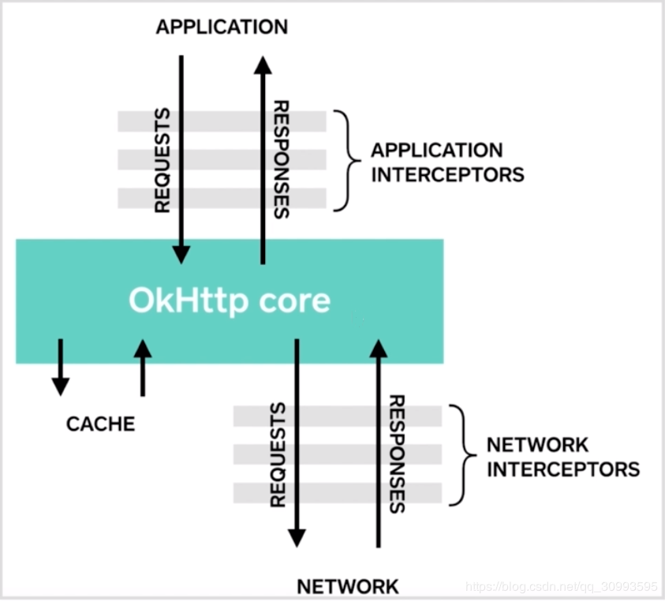 

* 绿色块上方是APPLication Interceptor，也就是应用程序拦截器，即开发者自己自定义的拦截器，代码中的client.interceptors()获取的就是这类拦截器
* 绿色块下方是NetWork Interceptor，也就是网络拦截器，用来观察单个网络请求和响应，只能调用一次proceed方法
* 绿色块代表的就是OKHttp提供的拦截器，共有5个，也是我们需要关注的重点

3、5个拦截器

* RetryAndFollowUpInterceptor：Interceptor实现类之一，是网络请求失败时进行重连及服务器返回当前请求需要进行重定向的拦截器
* BridgeInterceptor：桥接连接器，主要是进行请求前的一些操作，将我们的请求设置成服务器能识别的请求，比如设置一系列头部信息，比如设置请求内容长度，编码，gzip压缩，cookie等
* CacheInterceptor：缓存拦截器，作用是缓存请求和响应，比如同一个请求之前发生过，这次就不需要重新构建了，直接从缓存取；响应同理
* ConnectInterceptor：连接拦截器，为当前请求找到一个合适的连接，比如如果从连接处中可以找到能复用的连接，就不要再创建新的连接了
* CallServerInterceptor：连接服务器拦截器，负责向服务器发送真正的请求，接受服务器的响应

再次回到getResponseWithInterceptorChain方法，当拦截器列表组装完成，就会实例化拦截器对象RealInterceptorChain

```
Interceptor.Chain chain = new RealInterceptorChain(interceptors, null, null, null, 0,
        originalRequest, this, eventListener, client.connectTimeoutMillis(),
        client.readTimeoutMillis(), client.writeTimeoutMillis());
```

接收了11个有效参数，然后调用该对象的proceed方法，拦截器之所以可以依次调用，并最终再从后往前返回Response，都依赖于该方法，在解析该方法前，我们看下它的构造方法

```
//拦截器列表，装载了所有拦截器
private final List<Interceptor> interceptors;
//下面三个很重要，后续单独出文章解析
private final StreamAllocation streamAllocation;
private final HttpCodec httpCodec;
private final RealConnection connection;
//拦截器列表索引
private final int index;
//封装请求信息的对象
private final Request request;
private final Call call;
private final EventListener eventListener;
private final int connectTimeout;
private final int readTimeout;
private final int writeTimeout;
//proceed方法执行次数
private int calls;

public RealInterceptorChain(List<Interceptor> interceptors, StreamAllocation streamAllocation,
      HttpCodec httpCodec, RealConnection connection, int index, Request request, Call call,
      EventListener eventListener, int connectTimeout, int readTimeout, int writeTimeout) {
 this.interceptors = interceptors;
 this.connection = connection;
 this.streamAllocation = streamAllocation;
 this.httpCodec = httpCodec;
 this.index = index;
 this.request = request;
 this.call = call;
 this.eventListener = eventListener;
 this.connectTimeout = connectTimeout;
 this.readTimeout = readTimeout;
 this.writeTimeout = writeTimeout;
}
```

4、RealInterceptorChain.proceed

```
@Override public Response proceed(Request request) throws IOException {
    return proceed(request, streamAllocation, httpCodec, connection);
  }

  /**
  * 依次取出拦截器链表中的每个拦截器去获取Response
  */
  public Response proceed(Request request, StreamAllocation streamAllocation, HttpCodec httpCodec,
      RealConnection connection) throws IOException {
      
    //如果索引值大于等于拦截器列表大小，就抛出异常，因为后续会出现数组越界的异常
    if (index >= interceptors.size()) throw new AssertionError();
    
    // 记录本方法调用次数
    calls++;

    // 如果已经为该Request创建了stream，就不再继续创建了
    if (this.httpCodec != null && !this.connection.supportsUrl(request.url())) {
      throw new IllegalStateException("network interceptor " + interceptors.get(index - 1)
          + " must retain the same host and port");
    }

    // 如果已经为该Request创建了stream，那该方法只能调用一次
    if (this.httpCodec != null && calls > 1) {
      throw new IllegalStateException("network interceptor " + interceptors.get(index - 1)
          + " must call proceed() exactly once");
    }

    // 创建新的拦截器链对象，并将index索引+1
    RealInterceptorChain next = new RealInterceptorChain(interceptors, streamAllocation, httpCodec,
        connection, index + 1, request, call, eventListener, connectTimeout, readTimeout,
        writeTimeout);
    //获取拦截器    
    Interceptor interceptor = interceptors.get(index);
    //执行拦截器的intercept方法获取结果，并将新的拦截器链对象传入
    Response response = interceptor.intercept(next);

    // 确保该方法只能调用一次
    if (httpCodec != null && index + 1 < interceptors.size() && next.calls != 1) {
      throw new IllegalStateException("network interceptor " + interceptor
          + " must call proceed() exactly once");
    }

    // Confirm that the intercepted response isn't null.
    if (response == null) {
      throw new NullPointerException("interceptor " + interceptor + " returned null");
    }

    if (response.body() == null) {
      throw new IllegalStateException(
          "interceptor " + interceptor + " returned a response with no body");
    }

    return response;
  }
```

拦截器链的proceed方法并不复杂，其核心逻辑就是三行代码

* 实例化拦截器链RealInterceptorChain ，但是要注意到其中一个参数index是+1了，不像RealCall中是0；因为只有这样做，下一个拦截器执行拦截器链的proceed方法时，才能根据索引取出下一个拦截器，不至于总是把自己取出来；这样就形成了拦截器链的概念
* 根据index取出拦截器，因为index每次都+1，所以就能根据拦截器列表添加的顺序取出拦截器，依次取出RetryAndFollowUpInterceptor，BridgeInterceptor，CacheInterceptor，ConnectInterceptor，CallServerInterceptor（开发者未添加拦截器的情况下）
* 执行拦截器的intercept方法，并把实例化的RealInterceptorChain传入，这样每个拦截器在intercept方法又能调用RealInterceptorChain的proceed方法，这样循环

5、总结
这也就是拦截器链的执行逻辑了，到这里我们也可以简单理解OKHttp中的一个网络请求其实就是5个拦截器依次执行自己的intercept方法的过程

* 组装我们的请求对象Request
* 调用下一个拦截器，获取Response，以此形成拦截器链
* 对Response进行处理，返回给上一个拦截器

## Android LruCache源码分析

1、概要

LRU (Least Recently Used) 即最近最少使用算法。在Android开发中，LruCache是基于LRU算法实现的。当缓存空间使用完的情况下，最久没被使用的对象会被清除出缓存。

LruCache常用的场景是做图片内存缓存，电商类APP经常会用到图片，当我们对图片资源做了内存缓存，不仅可以增强用户体验，而且可以减少图片网络请求，减少用户流量耗费。

LruCache是一个内存层面的缓存，如果想要进行本地磁盘缓存，推荐使用DiskLruCache，虽然没包含在官方API中，但是官方推荐我们使用。

2、使用方法

LruCache的使用方法如下：

```
public class BitmapLruCache extends LruCache<String, Bitmap> {
    /**
     * 设置缓存大小，建议当前应用可用最大内存的八分之一 即(int) (Runtime.getRuntime().maxMemory() / 1024 / 8)
     */
    public BitmapLruCache(int maxSize) {
        super(maxSize);
    }

    /**
     * 计算当前节点的内存大小 这个方法需要重写 不然返回1
     */
    @Override
    protected int sizeOf(String key, Bitmap value) {
        return value.getByteCount() / 1024;
    }

    /**
     * 当节点移除时该方法会回调，可根据需求来决定是否重写该方法
     */
    @Override
    protected void entryRemoved(boolean evicted, String key, Bitmap oldValue, Bitmap newValue) {
        super.entryRemoved(evicted, key, oldValue, newValue);
    }
}
```

往缓存中放一张图片：

```
mLruCache.put(name, bitmap);
```

获取一张图片：

```
mLruCache.get(name);
```

删除一张图片：

```
mLruCache.remove(name);
```

3、源码分析

1.LruCache构造方法

```
public LruCache(int maxSize) {
    if (maxSize <= 0) {
        throw new IllegalArgumentException("maxSize <= 0");
    }
    this.maxSize = maxSize;
   //我们发现实现用的是LinkedHashMap   注意最后的true 表示LinkedHashMap 中accessOrder设置为true
    this.map = new LinkedHashMap<K, V>(0, 0.75f, true);
}
```

2.put方法

```
public final V put(K key, V value) {
    //不允许key 和 value 为 null
    if (key == null || value == null) {
        throw new NullPointerException("key == null || value == null");
    }

    V previous;
    //多线程安全
    synchronized (this) {
        putCount++;
        //size 表示当期使用的缓存大小  safeSizeOf 会掉用sizeOf方法 用于计算当前节点的大小
        size += safeSizeOf(key, value);
        // 将新节点放入LinkedHashMap 如果有返回值，表示map集合中存在旧值
        previous = map.put(key, value);
        //存在旧值 在移除旧值后 更新缓存大小
        if (previous != null) {
            size -= safeSizeOf(key, previous);
        }
    }
    //有旧值移除 回调entryRemoved
    if (previous != null) {
        entryRemoved(false, key, previous, value);
    }
    //整理每个节点 主要判断当前size是否超过maxSize 
    trimToSize(maxSize);
    return previous;
}

private void trimToSize(int maxSize) {
    while (true) {
        K key;
        V value;
        synchronized (this) {
                if (size < 0 || (map.isEmpty() && size != 0)) {
                    throw new IllegalStateException(getClass().getName()
                            + ".sizeOf() is reporting inconsistent results!");
                }

                if (size <= maxSize) {
                    break;
                }
                // 获取链表头部，这个就是最近最少使用的数据
                Map.Entry<K, V> toEvict = map.eldest();
                if (toEvict == null) {
                    break;
                }

                key = toEvict.getKey();
                value = toEvict.getValue();
                map.remove(key);
                size -= safeSizeOf(key, value);
                evictionCount++;
            }

        entryRemoved(true, key, value, null);
    }
}
```

我们看下safeSizeOf 和 entryRemoved方法

```
private int safeSizeOf(K key, V value) {
    int result = sizeOf(key, value);
    if (result < 0) {
        throw new IllegalStateException("Negative size: " + key + "=" + value);
    }
    return result;
}

protected int sizeOf(K key, V value) {
    return 1;
}

//entryRemoved的默认实现
protected void entryRemoved(boolean evicted, K key, V oldValue, V newValue) {}
```

3.get方法

```
public final V get(K key) {
    //key不能为 null 
    if (key == null) {
        throw new NullPointerException("key == null");
    }

    V mapValue;
    synchronized (this) {
        //调用LinkedHashMap 的get方法
        //get()方法会实现将访问的元素更新到队列尾部的功能
        mapValue = map.get(key);
        if (mapValue != null) {
            hitCount++;
            //返回mapValue
            return mapValue;
        }
        missCount++;
    }

    //缓存没有情况下走创建流程
    V createdValue = create(key);
    if (createdValue == null) {
        return null;
    }

    synchronized (this) {
        createCount++;
        mapValue = map.put(key, createdValue);

        if (mapValue != null) {
            // There was a conflict so undo that last put
            map.put(key, mapValue);
        } else {
            size += safeSizeOf(key, createdValue);
        }
    }

    if (mapValue != null) {
        entryRemoved(false, key, createdValue, mapValue);
        return mapValue;
    } else {
        trimToSize(maxSize);
        return createdValue;
    }
}

protected V create(K key) {//创建方法默认空实现 可根据需求决定是否重写该方法
    return null;
}
```

4.remove方法

```
public final V remove(K key) {
    if (key == null) {
        throw new NullPointerException("key == null");
    }

    V previous;
    synchronized (this) {
        //获得移除的节点
        previous = map.remove(key);
        if (previous != null) {
            //当节点不为空 更新缓存大小
            size -= safeSizeOf(key, previous);
        }
    }

    if (previous != null) {
        //当节点移除时回调entryRemoved方法
        entryRemoved(false, key, previous, null);
    }

    return previous;
}
```

通过上述几个方法代码，我们知道LruCache如何控制及更新缓存的大小的，主要是在线程同步块里对size字段进行更新,然后根据size字段和maxSize字段的大小关系来修剪节点。但如何做到最近最少使用呢？ 没错，LinkedHashMap 帮我们做到最近最少使用的排序。

让我们看下LinkedHashMap 如何实现的，在此过程我们不分析HashMap的实现，只关心LinkedHashMap 的一些实现，HashMap的实现有机会给大家分享。

```
//继承了HashMap 说明LinkedHashMap 的查找效率依然是O(1)
public class LinkedHashMap<K,V>
    extends HashMap<K,V>
    implements Map<K,V>{
 //重新定义了节点 用于实现链表
 private transient LinkedHashMapEntry<K,V> header;

 private static class LinkedHashMapEntry<K,V> extends HashMapEntry<K,V> {
        LinkedHashMapEntry<K,V> before, after;
        ...
 }
    ...
}
```

LinkedHashMap类并没有重写put方法，当我们调用put方法时，调用的依然是HashMap的put方法。我们看下HashMap的put方法：

```
public V put(K key, V value) {
    return putVal(hash(key), key, value, false, true);
}

final V putVal(int hash, K key, V value, boolean onlyIfAbsent,
               boolean evict) {
    Node<K,V>[] tab; Node<K,V> p; int n, i;
    if ((tab = table) == null || (n = tab.length) == 0)
        n = (tab = resize()).length;
    if ((p = tab[i = (n - 1) & hash]) == null)
        tab[i] = newNode(hash, key, value, null);
    else {
        Node<K,V> e; K k;
        if (p.hash == hash &&
            ((k = p.key) == key || (key != null && key.equals(k))))
            e = p;
        else if (p instanceof TreeNode)
            e = ((TreeNode<K,V>)p).putTreeVal(this, tab, hash, key, value);
        else {
            for (int binCount = 0; ; ++binCount) {
                if ((e = p.next) == null) {
                    p.next = newNode(hash, key, value, null);
                    if (binCount >= TREEIFY_THRESHOLD - 1) // -1 for 1st
                        treeifyBin(tab, hash);
                    break;
                }
                if (e.hash == hash &&
                    ((k = e.key) == key || (key != null && key.equals(k))))
                    break;
                p = e;
            }
        }
        if (e != null) { // existing mapping for key
            V oldValue = e.value;
            if (!onlyIfAbsent || oldValue == null)
                e.value = value;
            afterNodeAccess(e);
            //存在旧值 就把旧值移除掉 并返回旧值  由此可知 当我们更换缓存中已存在的值时，并不会影响它在链表中位置
            return oldValue;
        }
    }
    ++modCount;
    if (++size > threshold)
        resize();
    //LinkedHashMap 重写了该方法    
    afterNodeInsertion(evict);
    return null;
}
//LinkedHashMap中实现 
//将节点放在链表的末尾
void afterNodeAccess(Node<K,V> e) { // move node to last
    LinkedHashMapEntry<K,V> last;
    if (accessOrder && (last = tail) != e) {
        LinkedHashMapEntry<K,V> p =
            (LinkedHashMapEntry<K,V>)e, b = p.before, a = p.after;
        p.after = null;
        if (b == null)
            head = a;
        else
            b.after = a;
        if (a != null)
            a.before = b;
        else
            last = b;
        if (last == null)
            head = p;
        else {
            p.before = last;
            last.after = p;
        }
        tail = p;
        ++modCount;
    }
}
```

具体参考LinkedHashMap源码

读完源码我们可以总结出：

由此可见LruCache中维护了一个集合LinkedHashMap，该LinkedHashMap是以访问顺序排序的。当调用put()方法时，就会在结合中添加元素，并调用trimToSize()判断缓存是否已满，如果满了就用LinkedHashMap的迭代器删除队尾元素，即最近最少访问的元素。当调用get()方法访问缓存对象时，就会调用LinkedHashMap的get()方法获得对应集合元素，同时会更新该元素到队头。

## Retrofit 原理

一、概要

Retrofit是square公司的开源力作，和同属square公司开源的OkHttp，一个负责网络调度，一个负责网络执行，为Android开发者提供了即方便又高效的网络访问框架。

1. 准确来说，Retrofit 是一个 RESTful 的 HTTP 网络请求框架的封装。
2. 原因：网络请求的工作本质上是 OkHttp 完成，而 Retrofit 仅负责网络请求接口的封装

二、使用

1.定义接口

Retrofit要求定义一个网络请求的接口，接口函数里要定义url路径、请求参数、返回类型。

```
public interface INetApiService {
    @GET("/demobiz/api.php")
    Call<Person> getBizInfo(@Query("id") String id);
}
```

在这个接口定义中，用注解@GET("/demobiz/api.php")声明了url路径，用注解@Query("id") 声明了请求参数。
最重要的是，用Call<Person>声明了返回值是一个Retrofit的Call对象，并且声明了这个对象处理的数据类型为Person，Person是我们自定义的数据模型。

2.依次获得Retrofit对象、接口实例对象、网络工作对象

首先，需要新建一个retrofit对象。
然后，根据上一步的接口，实现一个retrofit加工过的接口对象。
最后，调用接口函数，得到一个可以执行网络访问的网络工作对象。

```
//新建一个Retrofit对象
Retrofit retrofit=new Retrofit.Builder()
.baseUrl(Config.DOMAIN)//要访问的网络地址域名，如http://www.zhihu.com
.addConverterFactory(GsonConverterFactory.create())
.build();
...

//用retrofit加工出对应的接口实例对象
INetApiService netApiService= retrofit.create(INetApiService.class);
//可以继续加工出其他接口实例对象
IOtherService otherService= retrofit.create(IOtherService.class);
···

//调用接口函数，获得网络工作对象
Call<Person> callWorker= netApiService.getBizInfo("id001");
```

这个复杂的过程下来，最终得到的callWorker对象，才可以执行网络访问。

3.访问网络数据
用上一步获取的worker对象，执行网络请求

```
callWorker.enqueue(new Callback<Person>() {
            @Override
            public void onResponse(Call<Person> call, Response<Person> response) {...}
            @Override
            public void onFailure(Call<Person> call, Throwable t) {...}
        });

```

在回调函数里，取得我们需要的BizEntity数据对象。网络访问结束。

三、角色与作用

我们从上面的应用场景可以看出，Retrofit并不做网络请求，只是生成一个能做网络请求的对象。
Retrofit的作用是按照接口去定制Call网络工作对象

Retrofit一方面从底层统一用OkHttp去做网络处理；另一方面在外层灵活提供能直接融入业务逻辑的Call网络访问对象。

具体来说，Retrofit只负责生产对象，生产能做网络请求的工作对象，他有点像一个工厂，只提供产品，工厂本身不处理网络请求，产品才能处理网络请求。
Retrofit在网络请求中的作用大概可以这样理解：

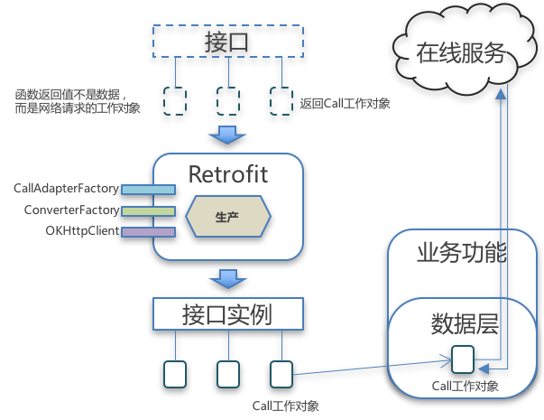

我们看到，从一开始，Retrofit要提供的就是个Call工作对象。
换句话说，对于给Retrofit提供的那个接口

```
public interface INetApiService {
    @GET("/demobiz/api.php")
    Call<Person> getBizInfo(@Query("id") String id);
}
```

这个接口并不是传统意义上的网络请求接口，这个接口不是用来获取数据的接口，而是用来生产对象的接口，这个接口相当于一个工厂，接口中每个函数的返回值不是网络数据，而是一个能进行网络请求的工作对象，我们要先调用函数获得工作对象，再用这个工作对象去请求网络数据。

所以Retrofit的实用价值意义在于，他能根据你的接口定义，灵活地生成对应的网络工作对象，然后你再择机去调用这个对象访问网络。

四、功能扩展

1、OkHttpClient

Retrofit使用OkHttpClient来实现网络请求，这个OkHttpClient虽然不能替换为其他的网络执行框架比如Volley，但是Retrofit允许我们使用自己扩展OkHttpClient，一般最常扩展的就是Interceptor拦截器了

```
OkHttpClient mClient = new OkHttpClient.Builder()
                .addInterceptor(new Interceptor() {
                    @Override
                    public Response intercept(Chain chain) throws IOException {
                        Request.Builder builder = chain.request().newBuilder();
                        builder.addHeader("Accept-Charset","UTF-8");
                        builder.addHeader("Accept","application/json");
                        builder.addHeader("Content-type", "application/json");
                        Request request = builder.build();
                        return chain.proceed(request);
                    }
                }).build();

Retrofit retrofit = new Retrofit.Builder()
                .baseUrl(Config.DOMAIN)
                .addConverterFactory(GsonConverterFactory.create())
                .client(mClient)
                .build();
```

2、addConverterFactory

扩展的是对返回的数据类型的自动转换，把一种数据对象转换为另一种数据对象。
在上述场景中，GsonConverterFactory可以把Http访问得到的json字符串转换为Java数据对象Person，这个Person是在INetApiService接口中要求的的。
这种转换我们自己也经常做，很好理解。
如果现有的扩展包不能满足需要，可以继承Retrofit的接口。retrofit2.Converter<F,T>，自己实现Converter和ConverterFactory。
在创建Retrofit对象时，可以插入我们自定义的ConverterFactory。

```
//retrofit对象
Retrofit retrofit=new Retrofit.Builder()
.baseUrl(Config.DOMAIN)
.addConverterFactory(GsonConverterFactory.create())
.addConverterFactory(YourConverterFactory.create())//添加自定义Converter
.build();
```

3、addCallAdapterFactory

扩展的是对网络工作对象callWorker的自动转换，把Retrofit中执行网络请求的Call对象，转换为接口中定义的Call对象。
这个转换不太好理解，我们可以对照下图来理解：

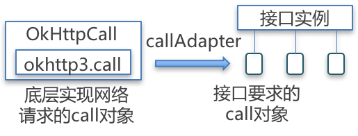

Retrofit本身用一个OkHttpCall的类负责处理网络请求，而我们在接口中定义需要定义很多种Call，例如Call<Person>，或者Flowable<Person>等，接口里的Call和Retrofit里的OkHttpCall并不一致，所以我们需要用一个CallAdapter去做一个适配转换。
（Retrofit底层虽然使用了OkHttpClient去处理网络请求，但她并没有使用okhttp3.call这个Call接口，而是自己又建了一个retrofit2.Call接口，OkHttpCall继承的是retrofit2.Call，与okhttp3.call只是引用关系。
这样的设计符合依赖倒置原则，可以尽可能的与OkHttpClient解耦。）

这其实是Retrofit非常核心，也非常好用的一个设计，如果我们在接口中要求的函数返回值是个RxJava的Flowable对象

```
public interface INetApiService {
    @GET("/demobiz/api.php")
    Flowable<Person> getBizInfo(@Query("id") String id);
}
```

那么我们只需要为Retrofit添加对应的扩展

```
//retrofit对象
Retrofit retrofit=new Retrofit.Builder()
.baseUrl(Config.DOMAIN)
.addConverterFactory(GsonConverterFactory.create())
.addCallAdapterFactory(RxJava2CallAdapterFactory.create())
.build();
```

就能得到Flowable类型的callWorker对象

```
//用retrofit加工出对应的接口实例对象
INetApiService netApiService= retrofit.create(INetApiService.class);
···
//调用接口函数，获得网络工作对象
Flowable<Person> callWorker= netApiService.getBizInfo("id001");
```

在这里，callAdapter做的事情就是把retrofit2.Call对象适配转换为Flowable<T>对象。
同样，如果现有的扩展包不能满足需要，可以继承Retrofit的接口retrofit2.CallAdapter<R,T>，自己实现CallAdapter和CallAdapterFactory。

五、Retrofit实现原理

Retrofit使用的，就是动态代理，方法注解、建造者和适配器等成熟的技术或模式

1、Retrofit实现原理——从动态代理开始

从前面的使用场景可知，retrofit会生成一个接口实例。

```
//用retrofit加工出对应的接口实例对象
INetApiService netApiService= retrofit.create(INetApiService.class);
```

到Retrofit源码里看create函数，是一个动态代理。

```
public <T> T create(final Class<T> service) {
    ...
    return (T) Proxy.newProxyInstance(service.getClassLoader(), new Class<?>[] { service },
        new InvocationHandler() {
          private final Platform platform = Platform.get();
          private final Object[] emptyArgs = new Object[0];

          @Override public Object invoke(Object proxy, Method method, @Nullable Object[] args)
              throws Throwable {
            // If the method is a method from Object then defer to normal invocation.
            if (method.getDeclaringClass() == Object.class) {
              return method.invoke(this, args);
            }
            if (platform.isDefaultMethod(method)) {
              return platform.invokeDefaultMethod(method, service, proxy, args);
            }
            return loadServiceMethod(method).invoke(args != null ? args : emptyArgs);
          }
        });
  }
```

要理解动态代理，最好要看到动态生成的代理类。

由于动态代理是在运行时动态生成的代理类，用常规的反编译方法无法查看，一般要使用Java提供的sun.misc.ProxyGenerator.generateProxyClass(String proxyName,class[] interfaces)函数生成代理类，函数会返回byte[]字节码，然后对字节码反编译得到Java代码。
有一个小问题是，AndroidStudio并不提供sun.misc这个包，我们需要用IntelliJ或者Eclipse建立一个Java工程，在Java环境里调用这个函数。

拿到的代理类，大概是这样的：

```
public final class INetApiService extends Proxy implements INetApiService {
  ...//一些Object自带方法
  private static Method m3;//接口定义的方法
  static {
    try {
      //Object自带方法的初始化
      m0,m1,m2 = ...
      //接口中定义的方法
      m3 = Class.forName("com.demo.net$INetApiService")//反射接口类
          .getMethod("getBizInfo",//反射函数
              new Class[] { Class.forName("java.lang.String") });//反射参数
      //接口中定义的其他方法
      ...
    } 
    ...
  }
//返回接口实例对象
public INetApiService (InvocationHandler invocationHandler){
  super(invocationHandler);
}
//
public final Call getBizInfo(String str){
  ...
  try{//用Handler去调用
    return (Call)this.h.invoke(this, m3, new Object[]{str});
  }
}

}
```

我们可以看到，代理类生成的是一个INetApiService接口的实例对象，该对象的getBizInfo函数返回的是接口中定义的Call网络工作对象，这也体现了Retrofit的核心价值，生成接口定义的Call网络工作对象。

那么，这个Call网络工作对象是如何生成的呢，上面动态代理生成的代码是这样的：

```
return (Call)this.h.invoke(this, m3, new Object[]{str});
```

也就是说，这个Call网络工作对象是在InvocationHandler中实现的，也就是在Retrofit.create函数中，由InvocationHandler实现的。

这样我们就明白了，Retrofit使用动态代理，其实是为了开发者在写代码时方便调用，而真正负责生产Call网络工作对象的，还是Retrofit.create函数中定义的这个InvocationHandler，这个InvocationHandler的代码我们再贴一遍：

ServiceMethod能让我们准确解析到INetApiService中定义的函数，为最后的适配转换提供转换目标

2、Retrofit实现原理——适配转换Call对象

我们在初始化Retrofit对象时，好像不添加CallAdapterFactory也能实现适配转换。

```
//retrofit对象
Retrofit retrofit=new Retrofit.Builder()
.baseUrl(Config.DOMAIN)
.addConverterFactory(GsonConverterFactory.create())
//可以不添加CallAdapterFactory
.build()
```

这是怎么回事呢，我们知道Retrofit使用了建造者模式，建造者模式的特定就是实现了建造和使用的分离，所以建造者模式的建造函数里，一般会有很复杂的对象创建和初始化过程，所以我们要看一下Retrofit的build函数。

```
public Retrofit build() {
  if (baseUrl == null) {
    throw new IllegalStateException("Base URL required.");
  }

  okhttp3.Call.Factory callFactory = this.callFactory;
  if (callFactory == null) {
    callFactory = new OkHttpClient();
  }

  Executor callbackExecutor = this.callbackExecutor;
  if (callbackExecutor == null) {
    callbackExecutor = platform.defaultCallbackExecutor();
  }

  //根据当前运行平台，设置默认的callAdapterFactory
  List<CallAdapter.Factory> callAdapterFactories = new ArrayList<>(this.callAdapterFactories);
  callAdapterFactories.addAll(platform.defaultCallAdapterFactories(callbackExecutor));

  // Make a defensive copy of the converters.
  List<Converter.Factory> converterFactories = new ArrayList<>(
      1 + this.converterFactories.size() + platform.defaultConverterFactoriesSize());

  // Add the built-in converter factory first. This prevents overriding its behavior but also
  // ensures correct behavior when using converters that consume all types.
  converterFactories.add(new BuiltInConverters());
  converterFactories.addAll(this.converterFactories);
  converterFactories.addAll(platform.defaultConverterFactories());

  return new Retrofit(callFactory, baseUrl, unmodifiableList(converterFactories),
      unmodifiableList(callAdapterFactories), callbackExecutor, validateEagerly);
}
```

这段代码里，我们看到Retrofit使用OkHttpClient处理网络请求，并且会添加默认的callAdapterFactory，这个platform是一个简单工厂，能根据当前系统平台去生成对应的callAdapterFactory

```
private static Platform findPlatform() {
    try {
      Class.forName("android.os.Build");
      if (Build.VERSION.SDK_INT != 0) {
        return new Android();//根据当前系统平台返回相应的对象
      }
    } catch (ClassNotFoundException ignored) {
    }
    try {
      Class.forName("java.util.Optional");
      return new Java8();
    } catch (ClassNotFoundException ignored) {
    }
    return new Platform();
  }
  
static class Android extends Platform {
    ...
    @Override CallAdapter.Factory defaultCallAdapterFactory(@Nullable Executor callbackExecutor) {
      if (callbackExecutor == null) throw new AssertionError();
      ExecutorCallAdapterFactory executorFactory = new ExecutorCallAdapterFactory(callbackExecutor);
      return Build.VERSION.SDK_INT >= 24
        ? asList(CompletableFutureCallAdapterFactory.INSTANCE, executorFactory)
        : singletonList(executorFactory);
    }
    ...
  }  
```

这个Platform是Retrofit在Builder的构造函数里初始化的。

所以，在Retrofit.build()函数中，我们为Retrofit默认添加的callAdapterFactory，是在Platform中为Android系统设定的ExecutorCallAdapterFactory。
我们看ExecutorCallAdapterFactory的代码，这是一个工厂类，可以返回CallAdapter对象：

```
@Override
  public CallAdapter<?, ?> get(Type returnType, Annotation[] annotations, Retrofit retrofit) {
    ...
    return new CallAdapter<Object, Call<?>>() {
      ...
      // 转换后              转换前，也就是OkHttpCall
      @Override public Call<Object> adapt(Call<Object> call) {
        return new ExecutorCallbackCall<>(callbackExecutor, call);
      }
    };
  }
```

在adapt函数中，适配器会把Retrofit中用来访问网络的OkHttpCall，转换为一个ExecutorCallbackCall(继承了INetApiService接口里要求返回的网络工作对象retrofit2.Call)，
这个例子里面，由于OkHttpCall和ExecutorCallbackCall都实现了retrofit2.Call接口，结果出现了从Call<Object>转换为Call<Object>的情况，这可能不容易理解，我们换个RxJava2CallAdapterFactory来看看

```
//RxJava2CallAdapterFactory中
  @Override
  public CallAdapter<?, ?> get(Type returnType, Annotation[] annotations, Retrofit retrofit) {
    ...
    return new RxJava2CallAdapter(responseType, scheduler, isAsync, isResult, isBody, isFlowable,
        isSingle, isMaybe, false);
}
  //RxJava2CallAdapter中
  //               转换后        转换前，也就是OkHttpCall
  @Override public Object adapt(Call<R> call) {
   ...
   Observable<?> observable;
   ...
   return observable;
  }
```

这个CallAdapter的转换就比较明显了，把retrofit2.Call对象通过适配器转换为了一个实为Observable<?>的Object对象。

至此，我们可以理解Retrofit根据接口定义动态生产Call网络请求工作对象的原理了，其实就是通过适配器把retrofit2.Call对象转换为目标对象。

至于适配器转换过程中，如何实现的对象转换，就可以根据需求来自由实现了，比如利用静态代理等，如有必要，我们可以自行开发扩展，Retrofit框架并不限制我们对于适配器的实现方式

3、Retrofit实现原理——函数解析、网络请求和数据转换

在前面分析中，我们知道了Retrofit的整体工作流程，就是Retrofit用动态代理生成Call网络请求对象，在这个过程中，用适配器把Retrofit底层的retrofit2.Call对象转换为INetApiService中定义的Call网络请求对象（如Flowable）。

问题是，Retrofit具体是如何知道了INetApiService中定义的Call网络请求对象，如何实现网络请求，以及如何执行的数据转换呢？

具体过程如下；
首先，根据INetApiService中定义的函数，解析函数，得到函数的具体定义，并生成对应的ServiceMethod。
然后，根据这个ServiceMethod，实现一个OkHttpCall的Call对象，负责在Retrofit底层实现网络访问。
其中，在网络访问返回了网络数据时，根据ServiceMethod实现数据转换。
最后，利用上一小节中匹配的适配器，把OkHttpCall对象转换为INetApiService要求的Call网络请求对象。

1.函数解析

在接口函数里，用注解描述了输入参数，用Java对象定义了返回值类型，所以对输入参数和返回值，ServiceMethod采取了不同的方式去处理。

* 输入参数

输入参数是用来描述url的，它的处理相对简单，ServiceMethod会根据反射得到的Method，取得Annotation注解信息，这些注解是Retrofit自己预定义好的（retrofit2.http.*），ServiceMethod根据预先的定义，直接判断注解所属的逻辑分支，在有网络请求时分情况进行处理，就能得到目标url，http请求头等数据。

* 返回值

返回值是需要用CallAdapter去适配的，所以核心在于生成对应的CallAdapter。
在Retrofit生成Call网络工作对象时，它通过动态代理获取到了接口函数的Method定义，从这个Method中可以获取函数定义的返回对象类型，由于这个转换是需要CallAdapterFactory生产CallAdapter对象去实现，而Retrofit事先并不知道要使用哪个Factory，所以她是遍历所有的CallAdapterFactory，根据目标函数的返回值类型，让每个Factory都去尝试生产一个CallAdapter，哪个成功就用哪个。

2.网络请求

OkHttpCall继承的retrofit2.Call接口是为了依赖倒置解耦的，真正的网络请求是由OkHttpCall内部引用的okhttp3.call处理的，这个okhttp3.call是借道ServiceMethod获取的Retrofit中的callFactory，也就是Retrofit中的OkHttpClient。

整个引用链条是这样的：

OkHttpCall--okhttp3.call
-->
ServiceMethod--callFactory
-->
Retrofit.build()--callFactory//(如未扩展赋值)new OkHttpClient();
-->
Retrofit.Builder().client(mClient)//(可能有扩展赋值)扩展过的OkHttpClient

最终的网络请求是由OkHttpCall调用OkHttpClient发出的，调用和回调等过程，也就是在OkHttpCall中处理的。

网络请求的生成过程中，为了使用接口函数中定义的参数，OkHttpCall会调用ServiceMethod来生成Request请求对象，再交给OkHttpCall去处理。

3.数据转换

因为回调是在OkHttpCall中处理的，所以对回调数据的转换也在OkHttpCall中触发，为了符合接口函数中定义的返回数据类型，OkHttpCall会调用ServiceMethod来转换Response返回数据对象。

OkHttpCall对返回的网络数据，会调用一个parseResponse函数，函数中执行的是：

```
Response<T> parseResponse(okhttp3.Response rawResponse) throws IOException {
...
ExceptionCatchingResponseBody catchingBody = new ExceptionCatchingResponseBody(rawBody);
    try {
      T body = responseConverter.convert(catchingBody);
      return Response.success(body, rawResponse);
    }
    ...
}    
```  
  
这个函数可以把原始的okhttp3. ResponseBody数据转换为INetApiService接口中要求的数据类型（如BizEntity类型）。
从代码可以看出，实现数据转换的核心对象其实是responseConverter，这个Converter实际上要依次经过Retrofit的建造和ServiceMethod的建造后，才能确定下来的。

* Retrofit建造时添加数据转换工厂

Retrofit里有converterFactries列表，这是在我们初始化Retrofit实例时添加的

```
//retrofit对象
Retrofit retrofit=new Retrofit.Builder()
.baseUrl(Config.DOMAIN)
.addConverterFactory(GsonConverterFactory.create())
.addConverterFactory(YourConverterFactory.create())//添加自定义Converter
.build();
```

* ServiceMethod建造时设定数据转换器

ServiceMethod在建造时，就已经确定了对应的是INetApiService中的哪个函数，所以需要明确设定自己的Converter<R,T>转换对象

```
ServiceMethod<?> loadServiceMethod(Method method) {
    ServiceMethod<?> result = serviceMethodCache.get(method);
    if (result != null) return result;

    synchronized (serviceMethodCache) {
      result = serviceMethodCache.get(method);
      if (result == null) {
        result = ServiceMethod.parseAnnotations(this, method);
        serviceMethodCache.put(method, result);
      }
    }
    return result;
  }
  
static <ResponseT, ReturnT> HttpServiceMethod<ResponseT, ReturnT> parseAnnotations(
      Retrofit retrofit, Method method, RequestFactory requestFactory) {
    CallAdapter<ResponseT, ReturnT> callAdapter = createCallAdapter(retrofit, method);
    Type responseType = callAdapter.responseType();
    
    ...

    Converter<ResponseBody, ResponseT> responseConverter =
        createResponseConverter(retrofit, method, responseType);

    okhttp3.Call.Factory callFactory = retrofit.callFactory;
    return new HttpServiceMethod<>(requestFactory, callFactory, callAdapter, responseConverter);
  } 
  
private static <ResponseT> Converter<ResponseBody, ResponseT> createResponseConverter(
      Retrofit retrofit, Method method, Type responseType) {
    Annotation[] annotations = method.getAnnotations();
    try {
      return retrofit.responseBodyConverter(responseType, annotations);
    } 
    ...
  } 

public <T> Converter<ResponseBody, T> responseBodyConverter(Type type, Annotation[] annotations) {
    return nextResponseBodyConverter(null, type, annotations);
  }    
```

Retrofit会在自己的转换器工厂列表中遍历每个ConverterFactory，尝试根据ServiceMethod所对应的目标数据类型，找到Converter数据转换类

```
 public <T> Converter<ResponseBody, T> nextResponseBodyConverter(
      @Nullable Converter.Factory skipPast, Type type, Annotation[] annotations) {
     
     ...
    int start = converterFactories.indexOf(skipPast) + 1;
    for (int i = start, count = converterFactories.size(); i < count; i++) {
      Converter<ResponseBody, ?> converter =
          converterFactories.get(i).responseBodyConverter(type, annotations, this);
      if (converter != null) {
        //noinspection unchecked
        return (Converter<ResponseBody, T>) converter;
      }
    }

   ...
  }
```
以Gson转换为例，GsonConverterFactory会通过getAdapter来尝试匹配目标数据类型：

```
public <T> TypeAdapter<T> getAdapter(TypeToken<T> type) {...}
```

如果可以匹配，那么前面调用serviceMethod. parseResponse函数时，会调用

```
Response<T> parseResponse(okhttp3.Response rawResponse) throws IOException {
...
ExceptionCatchingResponseBody catchingBody = new ExceptionCatchingResponseBody(rawBody);
    try {
      T body = responseConverter.convert(catchingBody);
      return Response.success(body, rawResponse);
    }
    ...
}    
``` 

在调用这段代码时，其实就是调用了Gson中最终执行数据转换的代码：

```
//  retrofit2/converter/gson/GsonResponseBodyConverter.class
@Override public T convert(ResponseBody value) throws IOException {
    JsonReader jsonReader = gson.newJsonReader(value.charStream());
    try {
      T result = adapter.read(jsonReader);
      if (jsonReader.peek() != JsonToken.END_DOCUMENT) {
        throw new JsonIOException("JSON document was not fully consumed.");
      }
      return result;
    } finally {
      value.close();
    }
  }
```

总结来说，Retrofit在类的单一职责方面分隔的很好，OkHttpCall类只负责网络交互，凡是需要知道函数定义的，都交给ServiceMethod类去处理，而ServiceMethod类对使用者不公开，因为Retrofit是个外观模式，而所有需要扩展的都在Retrofit的建造者中实现，他们的分工大概是这样的：

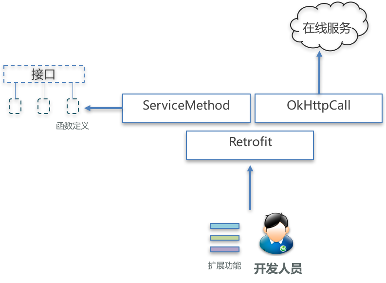

三个类的分工

这三个类分工合作，共同实现了函数解析、网络访问和数据转换，并保留了良好的可扩展性。

4、Retrofit实现原理——整体结构与分工实现

至此，Retrofit的实现细节就已经基本清楚了，他用动态代理去定制接口定义的Call网络工作对象，用适配器去把底层的Call对象转换为目标Call对象，用函数解析/OkHttpClient/数据转换等实现对Call对象的适配转换，并能处理真正的网络请求。
这里面涉及的整体结构和角色分工，大概可以这样表示：

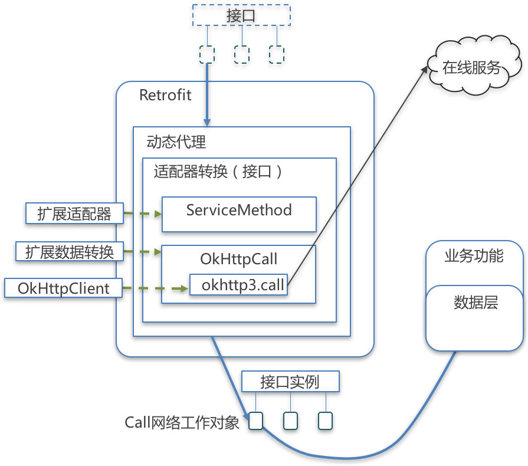

其中，扩展适配器、扩展数据转换和扩展OkHttpClient，虽然都是通过Retrofit实现扩展，但真正的使用者是Retrofit内部的ServiceMethod、OkHttpCall和okhttp3.call等类或对象。

六、反推Retrofit的设计过程

如果我们不直接正面分析Retrofit的结构设计和技术细节，而是先从Retrofit的功能和作用入手，倒过来推测Retrofit的目标，进而分析其架构和搭建细节，Retrofit为什么会设计成这样就很好理解了。

Retrofit的功能是按照接口定义，自动定制Call网络工作对象，所以Retrofit的目标应该就是避免为网络访问开发大量的配套代码。

为了实现这一目标，Retrofit需要分析哪些是易变的，哪些是不变的，然后分别处理。

由于Retrofit提供网络访问的工作对象，又是服务于具体业务，所以可以分网络访问和具体业务两部分来分析。

1、网络访问的不变性

对于网络访问来说，不变的是一定有一个实现网络访问的对象，Retrofit选用了自家的OkHttpClient，不过为了把Retrofit和OkHttp两个项目解耦合，Retrofit根据依赖倒置原则，定义了Retrofit自己的Call即retrofit2.call，并定义了操作网络请求的OkHttpCall。

2、网络访问的易变性

对于网络访问来说，易变的是网络访问的url、请求方式（get/post等）、Http请求的Header设置与安全设置等，以及返回的数据类型。

针对易变的url和请求方式，Retrofit使用了方法注解的方式，可读性良好，扩展性优异，但这需要实现对接口函数中注解的解析，这样就有了ServiceMethod。
针对Http请求的各种设置，其实Retrofit没做什么，因为Retrofit使用的OkHttp有拦截器机制，可以应付这种变化。
针对返回的数据类型，由于目标数据类型与业务有关，是不确定的，Retrofit无法提供一个万能的转换类，所以Retrofit提供了扩展接口，允许开发者自己定义ConverterFactory和Converter，去实现潜在的数据类型转换。

3、具体业务的不变性

对于具体业务来说，不变的是一定要有一个Call网络工作对象，所以Retrofit可以有一个生产对象的机制（像工厂一样）

具体业务的易变性

对于具体业务来说，易变的就是这个Call网络工作对象的类型，不仅有CallBacl回调、可能还有Flowable工作流、或者其他潜在的对象类型。

针对这种Call对象的易变性，Retrofit也是无法提供一个万能的实现类，所以也是提供了扩展解耦，允许开发者自己定义CallAdapterFactory和CallAdapter，去实现潜在的Call类型转换。

因为这种Call对象的生产需要有大量的配套代码，为了简化代码，Retrofit使用动态代理来生产这个对象。

最后，因为需要处理的方法和对象太多太复杂，需要使用建造者模式来把建造过程和使用过程分离开。

这样倒着走一遍之后，我们再看Retrofit的设计和实现原理，就会觉得水到渠成，对于Retrofit精妙的设计更会有一种切身体会。

七、借鉴与启示

1.万物皆对象

网络访问后，回调数据是个对象；网络访问本身也是个对象。

2.依赖倒置

哪怕是使用自家的OkHttp，哪怕底层调用的始终是OkHttpClient，也需要依赖一个抽象的retrofit2.Call接口，依赖于抽象，而不是依赖于具体。

3.单一职责

类的职责需要维持单一，流程需要但是超出自己职责的功能，去调用相关的类实现，比如OkHttpClient和ServiceMethod的各自职责与调用关系。

4.迪米特法则

内部实现再复杂，对于外部调用者也只展示他需要的那些功能，例如Retrofit。

5.自动>人工

动态代理的使用，可以用自动生成的模板代码，减轻人工编写配套代码的工作量，成本更低，风险更低。

6.利用工厂类开放扩展

对于流程确定，但方法不能确定的，利用工厂类，对调用者开放扩展能力。

7.利用多个工厂类组成扩展列表

如果1个工厂类不能实现兼得，何不设置一个工厂类列表，在多个工厂类中，看哪个工厂类能解决问题。

8.利用建造者模式把建造和使用分离

这样使用者不需要关系复杂的建造过程，例如Retrofit和ServiceMethod。

9.利用外观模式减少对复杂子系统的操作
虽然有复杂的子系统协同工作，调用者只需要调用最外层的Retrofit即可。

10.其他

开放封闭、接口隔离、里式替换、静态代理等设计原则或设计模式都有体现也都很熟悉了，就不再啰嗦。

## Glide 缓存策略

一、图片框架glide、picasso、fresco比较：

1、glide和picasso比较：

* 基础：

Glide 加载图片的方式和 Picasso 如出一辙。虽然两者看起来一样，但 Glide 更易用，因为 Glide 的 with 方法不光接受 Context,还接受 Activity 和 Fragment,Context 会自动的从他们获取，同时将 Activity/Fragment 作为 with()参数的好处是：图片加载会和 Activity/Fragment 的生命周期保持一致，比如 Paused 状态在暂停加载，在 Resumed 的时候又自动重新加载。

* 图像和内存：

同样将 1920×1080 像素的图片加载到 500×500 的 ImageView 中，Glide 加载的图片质量要差于Picasso，这是因为 Glide 默认的 Bitmap 格式是 RGB-565 ，比 ARGB-8888 格式的内存开销要小一半。想要提高 Glide 的图片效果，可以创建一个新的 GlideModule 将 Bitmap 格式转换到 ARGB-8888。同时在 AndroidManifest.xml 中将 GlideModule 定义为 meta-data。修改了 Bitmap 格式后，Glide 将花费两倍于上次的内存，但是仍远远小于 Picasso 的内存开销，原因在于 Picasso 是加载了全尺寸的图片到内存，然后让 GPU 来实时重绘大小。而 Glide 加载的大小和 ImageView 的大小是一致的，当然，Picasso 也是可以指定加载图片大小的，但是问题在于你需要主动计算 ImageView 的大小，或者说你的 ImageView 大小是具体的值（而不是 wrap_content ）在加载图片这个问题上 Glide 完胜 Picasso，因为 Glide 可以自动计算出任意情况下的 ImageView 大小。

* Image质量的细节

将 ImageView 还原到真实大小时，Glide 加载的图片没有 Picasso 那么平滑。

* 磁盘缓存：

Picasso 和 Glide 在磁盘缓存策略上有很大的不同。Picasso 缓存的是全尺寸的，而 Glide 缓存的是跟 ImageView 尺寸相同的。我们可以将 ImageView 调整成不同大小，但不管大小如何 Picasso 只缓存一个全尺寸的。Glide 则不同，它会为每种大小的 ImageView 缓存 一次。尽管一张图片已经缓存了一次，但是假如你要在另外一个地方再次以不同尺寸显示，需要重新下载，调整成新尺寸的大小，然后将这个尺寸的也缓存起来。具体说来就是：假如在第一个页面有一个 200×200 的 ImageView，在第二个页面有一个 100×100 的 ImageView，这两个 ImageView 本来是要显示同一张图片，却需要下载两次。不过，你可以通过代码改变这种行为，让Glide既缓存全尺寸又缓存其他尺寸，这样就使得下次在任何 ImageView 中加载图片的时候，全尺寸的图片将从缓存中取出，重新调整大小，然后缓存。Glide 的这种方式优点是加载显示非常快。而 Picasso 的方式则因为需要在显示之前重新调整大小而导致一些延迟。不过 Glide 比 Picasso 需要更大的空间来缓存。

总结：
Glide 可以做到和 Picasso 几乎一样多的事，代码也几乎一样。但 Glide 可以加载 GIF 动态图，而 Picasso 不能，但是 Glide 动画会消费太多的内存，因此谨慎使用。除了 gif 动画之外，Glide 还可以将任何的本地视频解码成一张静态图片。还有一个特性是你可以配置图片显示的动画，而 Picasso 只有一种动画：fading in，最后一个是可以使用 thumbnail()产生一个你所加载图片的 thumbnail。其实还有一些特性，不过不是非常重要，比如将图像转换成字节数组等。

2、Fresco

* 内存管理：

Fresco 的最大亮点在于它的内存管理。解压后的图片,即 Android 中的 Bitmap ，占用大量的内存，在 Android 5.0以下系统中，这会显著地引发界面卡顿。而使用 Fresco 将很好地解决这个问题，Fresco 会将图片放到一个特别的内存区域，当图片不再显示的时候，占用的内存会自动被释放，这会使得 APP 更流畅，减少因图片内存占用而引发的 OOM。当 APP 包含的图片较多时，这个效果尤其明显。

* 图像：

Fresco 支持图像的渐进式呈现，渐进式的图片格式先呈现大致的图片轮廓，然后随着图片下载的继续，逐渐呈现清晰的图片，这在低网速情况下浏览图片十分有帮助，可以带来更好地用户体验。另外，Fresco 支持加载 gif 图，支持 WebP 格式。

3、总结：
Picasso 所能实现的功能 Glide 都能做到，只是所需设置不同。两者的区别是 Picasso 比 Glide 体积小很多且图像质量比 Glide 高，但Glide 的速度比 Picasso 更快，Glide 的长处是处理大型的图片流，如 gif、video，如果要制作视频类应用，Glide 当为首选。
Fresco 可以说是综合了之前图片加载库的优点，其在5.0以下的内存优化非常好，但它的不足是体积太大，按体积进行比较：Fresco>Glide>Picasso，所以 Fresco 在图片较多的应用中更能凸显其价值，如果应用没有太多图片需求，不推荐使用 Fresco。

二、Glide缓存功能介绍

关于缓存的获取、数据加载相关的逻辑在 [Engine#load](https://github.com/0xZhangKe/Glide-note/blob/master/library/src/main/java/com/bumptech/glide/load/engine/Engine.java#L151) 方法中。

先来看看缓存流程，流程如下图：

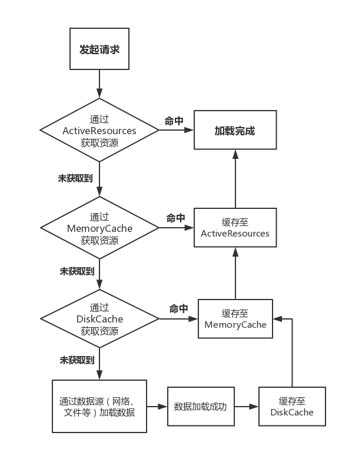

1、缓存机制简介

1.缓存的图片资源

Glide 需要缓存的 图片资源分为两类：

* 原始图片（Source） ：即图片源的图片初始大小 & 分辨率
* 转换后的图片(Result) ：经过 尺寸缩放 和 大小压缩等处理后的图片 ，当使用 Glide加载图片时，Glide默认根据 View视图对图片进行压缩 & 转换，而不显示原始图（这也是Glide加载速度高于Picasso的原因）

2.缓存机制设计

* 并不是三级缓存，因为从网络加载不属于缓存
* 缓存读取顺序：内存缓存 –> 磁盘缓存 –> 网络
 * 内存缓存默认开启
 * Glide中，内存缓存 & 磁盘缓存相互不影响，独立配置
* 二级缓存的作用不同： 
 * 内存缓存：防止应用重复将图片数据读取到内存当中 ，只缓存转换过后的图片
 * 硬盘缓存：防止应用重复从网络或其他地方重复下载和读取数据，可缓存原始图片 & 缓存转换过后的图片，用户自行设置

Glide的缓存机制使得Glide具备非常好的图片缓存效果，从而使得具备较高的图片加载效率。

> 如，在 RecyclerView 上下滑动，而RecyclerView中只要是Glide加载过的图片，都可以直接从内存中读取 & 展示，从而不需要重复从网络或硬盘上读取，提高图片加载效率。

2、Glide 的缓存功能分为：内存缓存 & 磁盘缓存

1.内存缓存

* 作用：防止应用重复将图片数据读取到内存当中,只缓存转换过后的图片，而并非原始图片
 
* 具体使用 

默认情况下，Glide自动开启内存缓存

```
// 默认开启内存缓存，用户不需要作任何设置
Glide.with(this)
     .load(url)
     .into(imageView);

// 可通过 API 禁用 内存缓存功能
Glide.with(this)
     .load(url)
     .skipMemoryCache(true) // 禁用 内存缓存
     .into(imageView);
```

* 实现原理 

Glide的内存缓存实现是基于：LruCache 算法（Least Recently Used） & 弱引用机制 
  
1. LruCache算法原理：将 最近使用的对象用强引用的方式存储在LinkedHashMap中 ；当缓存满时 ，将最近最少使用的对象从内存中移除 
2. 弱引用：弱引用的对象具备更短生命周期，因为 **当JVM进行垃圾回收时，一旦发现弱引用对象，都会进行回收（无论内存充足否）

2.磁盘缓存

* 作用：防止应用重复从网络或其他地方重复下载和读取数据，可缓存原始图片 & 缓存转换过后的图片，用户自行设置
* 具体使用

```
Glide.with(this)
     .load(url)
     .diskCacheStrategy(DiskCacheStrategy.NONE)
     .into(imageView);

// 缓存参数说明
// DiskCacheStrategy.NONE：不缓存任何图片，即禁用磁盘缓存
// DiskCacheStrategy.ALL ：缓存原始图片 & 转换后的图片
// DiskCacheStrategy.SOURCE：只缓存原始图片（原来的全分辨率的图像，即不缓存转换后的图片）
// DiskCacheStrategy.RESULT：（默认）只缓存转换后的图片（即最终的图像：降低分辨率后 / 或者转换后 ，不缓存原始图片
```

* 实现原理 

使用Glide 自定义的DiskLruCache算法 
  
1. 该算法基于 Lru 算法中的DiskLruCache算法，具体应用在磁盘缓存的需求场景中 
2. 该算法被封装到Glide自定义的工具类中（该工具类基于Android 提供的DiskLruCache工具类

3、Glide 缓存流程解析

* Glide整个缓存流程从加载图片请求开始，其中过程有本文最关注的内存缓存的读取 & 写入、磁盘缓存的读取 & 写入
* 具体如下

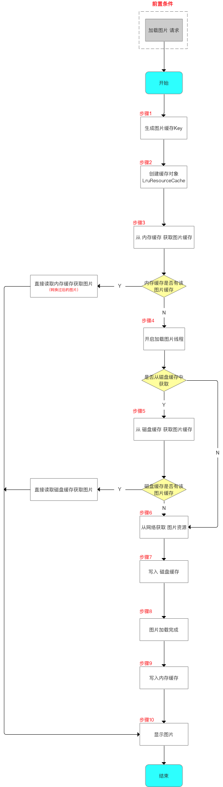

4、缓存流程源码分析

步骤1：从内存缓存读取图片资源

* Glide 实现内存 & 磁盘缓存 是根据图片的缓存Key 进行唯一标识，即根据图片的缓存Key去缓存区找对应的缓存图片
* 生成缓存 Key 的代码发生在Engine类的 load()中

```
// Engine.java
public synchronized <R> LoadStatus load(...) {

  long startTime = VERBOSE_IS_LOGGABLE ? LogTime.getLogTime() : 0;
  
  // 首先根据目标资源的相关参数得到对应的 key 值
  EngineKey key = keyFactory.buildKey(model, signature, width, height, transformations,
      resourceClass, transcodeClass, options);
      
  //（1）先从 ActiveResources 里面去获取
  EngineResource<?> active = loadFromActiveResources(key, isMemoryCacheable);
  if (active != null) {
    cb.onResourceReady(active, DataSource.MEMORY_CACHE);
    if (VERBOSE_IS_LOGGABLE) {
      logWithTimeAndKey("Loaded resource from active resources", startTime, key);
    }
    return null;
  }
  
  // （2）如果没有，则从内存缓存中去获取
  EngineResource<?> cached = loadFromCache(key, isMemoryCacheable);
  if (cached != null) {
    cb.onResourceReady(cached, DataSource.MEMORY_CACHE);
    if (VERBOSE_IS_LOGGABLE) {
      logWithTimeAndKey("Loaded resource from cache", startTime, key);
    }
    return null;
  }
  
  // 在两个方法都没有获取到缓存的情况下，才会继续向下执行，从而开启线程来加载图片
  ...
}  
```

loadFromActiveResources()

```
private EngineResource<?> loadFromActiveResources(Key key, boolean isMemoryCacheable) {
  // 先判断是否禁用内存缓存
  if (!isMemoryCacheable) {
    return null;
  }
  // 从 activeResources 中去获取资源
  EngineResource<?> active = activeResources.get(key);
  if (active != null) {
    // 标记资源被引用数量 +1
    active.acquire();
  }
  return active;
}
```

activeResources 为 ActiveResources 对象，其内部有一个 HashMap<Key, ResourceWeakReference>，即持有着 key 值对应的资源对象的弱引用。

activeResources 的目的是为了 缓存正在使用中的图片，从而可以保护这些图片不会被 LruCache 算法回收掉。

loadFromCache()

```
private EngineResource<?> loadFromCache(Key key, boolean isMemoryCacheable) {
  if (!isMemoryCacheable) {
    return null;
  }
  // 从 LruCache 对应的内存缓存中去获取
  EngineResource<?> cached = getEngineResourceFromCache(key);
  if (cached != null) {
    cached.acquire();
    // 将取出的资源添加到 activeResources 中
    activeResources.activate(key, cached);
  }
  return cached;
}

private EngineResource<?> getEngineResourceFromCache(Key key) {
  Resource<?> cached = cache.remove(key);
  final EngineResource<?> result;
  if (cached == null) {
    result = null;
  } else if (cached instanceof EngineResource) {
    // Save an object allocation if we've cached an EngineResource (the typical case).
    result = (EngineResource<?>) cached;
  } else {
    result = new EngineResource<>(cached, true /*isMemoryCacheable*/, true /*isRecyclable*/);
  }
  return result;
}
```

loadFromCache() 则是从前面说的默认为 LruResourceCache 中去获取目标资源。如果目标资源存在，则如 LruResourceCache 中取出，并加入到前面说的 activeResources 中。

从内存缓存中读取资源的逻辑大概就是这些。概括一下来说，就是如果能从内存缓存当中读取到要加载的图片，那么就直接进行回调，如果读取不到的话，才会开启线程执行后面的图片加载逻辑。

补充，根据郭神的说的，对于内存缓存，使用到 ActiveResources 和 LruResourceCache，目的是为了保护正在被使用的图片不会被 LruCache 算法回收掉。

步骤2：将图片资源缓存到内存

Engine 类实现了 EngineJobListener 接口，当资源加载完成后，就回调 Engine#onEngineJobComplete() 方法。

```
// Engine.java
public synchronized void onEngineJobComplete(
    EngineJob<?> engineJob, Key key, EngineResource<?> resource) {
  // A null resource indicates that the load failed, usually due to an exception.
  if (resource != null) {
    // 为 EngineResource 资源对象设置 ResourceListener 监听，即 Engine 对象自身，
    // 因为Engine 实现了 ResourceListener 接口。
    resource.setResourceListener(key, this);//7
    // 如果资源允许被缓存，则将其添加到 activeResources 中
    if (resource.isCacheable()) {
      activeResources.activate(key, resource);
    }
  }
  jobs.removeIfCurrent(key, engineJob);
}
```

这里注意的是，加载好的资源并不是直接被缓存到 LruResourceCache 中的，而是先被缓存到 activeResources 中。

而缓存到 LruResourceCache 中，则与注释7设置 ResourceListener 有关。之前有说过 EngineResource#acquire() 方法，该方法中就使用 EngineResource 对象的成员变量 acquired 来记录图片资源被引用的次数，调用 acquire() 方法会让变量加 1，而调用 release() 方法则会使变量减 1。

也就是说，当 acquired 变量大于0的时候，说明图片正在使用中，也就应该放到 activeResources 弱引用缓存当中。而经过 release() 之后，如果 acquired 变量等于 0 了，说明图片已经不是正在被使用状态 了。

```
void release() {
  synchronized (listener) {
    synchronized (this) {
      if (acquired <= 0) {
        throw new IllegalStateException("Cannot release a recycled or not yet acquired resource");
      }
      // 当 acquired 为 0 的时候就会回调设置的 ResourceListener 接口的 onResourceReleased() 方法
      if (--acquired == 0) {
        listener.onResourceReleased(key, this);
      }
    }
  }
}
```

前面说 Engine 也实现了 ResourceListener 接口，

```
// Engine.java
public synchronized void onResourceReleased(Key cacheKey, EngineResource<?> resource) {
  activeResources.deactivate(cacheKey);
  if (resource.isCacheable()) {
    cache.put(cacheKey, resource);
  } else {
    resourceRecycler.recycle(resource);
  }
}
```

在 onResourceReleased() 方法中，就会将已经不是正在被使用的图片资源从 activeResources 中移除，然后根据缓存状态，将其转移至 LruResourceCache 中，或者回收释放。

步骤3:磁盘缓存

Glide 默认在磁盘中缓存的图片并不是原始的图片，而是经过一系列操作（如压缩、转换为目标高宽）转换来的（Resource）。当然也可以设置缓存原始图片（Source）。（因而两种图片对应的 key 值也是不同的）

磁盘缓存实现类由 InternalCacheDiskCacheFactory 创建，最终会通过缓存路径及缓存文件夹最大值创建一个 DiskLruCacheWrapper 对象。

DiskLruCacheWrapper 顾名思义是一个包装类，包装的是 DiskLruCache。且实现了 DiskCache 接口，该接口定义了磁盘缓存的操作。

另外，内部还持有 SafeKeyGenerator 对象，该对象可以根据 Key 对象得到对应的字符串 key 值，而字符串 key 就是用于索引磁盘中缓存的图片资源的。

以及，在向磁盘写入文件时（put 方法）会使用重入锁来同步代码，也就是 DiskCacheWriteLocker 类，其中主要是对 ReentrantLock 的包装。

## EventBus

一、概述

1、EventBus的三要素

* Event：事件，可以是任意类型的对象。
* Subscriber：事件订阅者，在EventBus3.0之前消息处理的方法只能限定于onEvent、onEventMainThread、onEventBackgroundThread和onEventAsync，他们分别代表四种线程模型。而在EventBus3.0之后，事件处理的方法可以随便取名，但是需要添加一个注解@Subscribe，并且要指定线程模型（默认为POSTING）。
* Publisher：事件发布者，可以在任意线程任意位置发送事件，直接调用EventBus的post(Object)方法。可以自己实例化EventBus对象，但一般使用EventBus.getDefault()就好了，根据post函数参数的类型，会自动调用订阅相应类型事件的函数。

2、EventBus的四种ThreadMode（线程模型）

EventBus3.0有以下四种ThreadMode：

* POSTING（默认）：如果使用事件处理函数指定了线程模型为POSTING，那么该事件在哪个线程发布出来的，事件处理函数就会在这个线程中运行，也就是说发布事件和接收事件在同一个线程。在线程模型为POSTING的事件处理函数中尽量避免执行耗时操作，因为它会阻塞事件的传递，甚至有可能会引起ANR。
* MAIN:事件的处理会在UI线程中执行。事件处理时间不能太长，长了会ANR的。
* BACKGROUND：如果事件是在UI线程中发布出来的，那么该事件处理函数就会在新的线程中运行，如果事件本来就是子线程中发布出来的，那么该事件处理函数直接在发布事件的线程中执行。在此事件处理函数中禁止进行UI更新操作。
* ASYNC：无论事件在哪个线程发布，该事件处理函数都会在新建的子线程中执行，同样，此事件处理函数中禁止进行UI更新操作。

二、源码解析

1、构造函数

```
public static EventBus getDefault() {
    if (defaultInstance == null) {
        synchronized (EventBus.class) {
            if (defaultInstance == null) {
                defaultInstance = new EventBus();
            }
        }
    }
    return defaultInstance;
}
```

使用DCL双重检索单例模式创建

```
public EventBus() {
    this(DEFAULT_BUILDER);
}
```

DEFAULT_BUILDER是默认的EventBusBuilder，用来构造EventBus：

```
private static final EventBusBuilder DEFAULT_BUILDER = new EventBusBuilder();
```

this调用了EventBus另一个构造函数：

```
EventBus(EventBusBuilder builder) {
    logger = builder.getLogger();
    subscriptionsByEventType = new HashMap<>();
    typesBySubscriber = new HashMap<>();
    stickyEvents = new ConcurrentHashMap<>();
    mainThreadSupport = builder.getMainThreadSupport();
    mainThreadPoster = mainThreadSupport != null ? mainThreadSupport.createPoster(this) : null;
    backgroundPoster = new BackgroundPoster(this);
    asyncPoster = new AsyncPoster(this);
    indexCount = builder.subscriberInfoIndexes != null ? builder.subscriberInfoIndexes.size() : 0;
    subscriberMethodFinder = new SubscriberMethodFinder(builder.subscriberInfoIndexes,
            builder.strictMethodVerification, builder.ignoreGeneratedIndex);
    logSubscriberExceptions = builder.logSubscriberExceptions;
    logNoSubscriberMessages = builder.logNoSubscriberMessages;
    sendSubscriberExceptionEvent = builder.sendSubscriberExceptionEvent;
    sendNoSubscriberEvent = builder.sendNoSubscriberEvent;
    throwSubscriberException = builder.throwSubscriberException;
    eventInheritance = builder.eventInheritance;
    executorService = builder.executorService;
}
```

2、订阅者注册

```
public void register(Object subscriber) {
    Class<?> subscriberClass = subscriber.getClass();
    // 用 subscriberMethodFinder 提供的方法，找到在 subscriber 这个类里面订阅的内容。
    List<SubscriberMethod> subscriberMethods = subscriberMethodFinder.findSubscriberMethods(subscriberClass);
    synchronized (this) {
        for (SubscriberMethod subscriberMethod : subscriberMethods) {
            subscribe(subscriber, subscriberMethod);
        }
    }
}
```

1.查找订阅方法

findSubscriberMethods找出一个SubscriberMethod的集合，也就是传进来的订阅者所有的订阅的方法，接下来遍历订阅者的订阅方法来完成订阅者的订阅操作。对于SubscriberMethod（订阅方法）类中，主要就是用保存订阅方法的Method对象、线程模式、事件类型、优先级、是否是粘性事件等属性。下面就来看一下findSubscriberMethods方法：

```
List<SubscriberMethod> findSubscriberMethods(Class<?> subscriberClass) {
    //从缓存中获取SubscriberMethod集合 
    List<SubscriberMethod> subscriberMethods = METHOD_CACHE.get(subscriberClass);
    if (subscriberMethods != null) {
        return subscriberMethods;
    }
    //ignoreGeneratedIndex属性表示是否忽略注解器生成的MyEventBusIndex
    if (ignoreGeneratedIndex) {
        //通过反射获取subscriberMethods
        subscriberMethods = findUsingReflection(subscriberClass);
    } else {
        subscriberMethods = findUsingInfo(subscriberClass);
    }
    //在获得subscriberMethods以后，如果订阅者中不存在@Subscribe注解并且为public的订阅方法，则会抛出异常。
    if (subscriberMethods.isEmpty()) {
        throw new EventBusException("Subscriber " + subscriberClass
                + " and its super classes have no public methods with the @Subscribe annotation");
    } else {
        METHOD_CACHE.put(subscriberClass, subscriberMethods);
        return subscriberMethods;
    }
}
```

1. 从缓存中查找，如果找到了就立马返回。
2. 如果缓存中没有的话，则根据 ignoreGeneratedIndex 选择如何查找订阅方法，ignoreGeneratedIndex属性表示是否忽略注解器生成的MyEventBusIndex
3. 找到订阅方法后，放入缓存，以免下次继续查找。

ignoreGeneratedIndex 默认就是false，可以通过EventBusBuilder来设置它的值。我们在项目中经常通过EventBus单例模式来获取默认的EventBus对象，也就是ignoreGeneratedIndex为false的情况，这种情况调用了findUsingInfo方法：

```
private List<SubscriberMethod> findUsingInfo(Class<?> subscriberClass) {
    FindState findState = prepareFindState();
    findState.initForSubscriber(subscriberClass);
    while (findState.clazz != null) {
        //获取订阅者信息，没有配置MyEventBusIndex返回null
        findState.subscriberInfo = getSubscriberInfo(findState);
        if (findState.subscriberInfo != null) {
            SubscriberMethod[] array = findState.subscriberInfo.getSubscriberMethods();
            for (SubscriberMethod subscriberMethod : array) {
                if (findState.checkAdd(subscriberMethod.method, subscriberMethod.eventType)) {
                    findState.subscriberMethods.add(subscriberMethod);
                }
            }
        } else {
            //通过反射来查找订阅方法
            findUsingReflectionInSingleClass(findState);
        }
        findState.moveToSuperclass();
    }
    return getMethodsAndRelease(findState);
}
```

通过getSubscriberInfo方法来获取订阅者信息。
在我们开始查找订阅方法的时候并没有忽略注解器为我们生成的索引MyEventBusIndex，如果我们通过EventBusBuilder配置了MyEventBusIndex，便会获取到subscriberInfo，调用subscriberInfo的getSubscriberMethods方法便可以得到订阅方法相关的信息，这个时候就不在需要通过注解进行获取订阅方法。如果没有配置MyEventBusIndex，便会执行findUsingReflectionInSingleClass方法，将订阅方法保存到findState中。最后再通过getMethodsAndRelease方法对findState做回收处理并反回订阅方法的List集合。

看一下findUsingReflectionInSingleClass的执行过程：

```
private void findUsingReflectionInSingleClass(FindState findState) {
    Method[] methods;
    try {
        // This is faster than getMethods, especially when subscribers are fat classes like Activities
        methods = findState.clazz.getDeclaredMethods();
    } catch (Throwable th) {
        // Workaround for java.lang.NoClassDefFoundError, see https://github.com/greenrobot/EventBus/issues/149
        methods = findState.clazz.getMethods();
        findState.skipSuperClasses = true;
    }
    for (Method method : methods) {
        int modifiers = method.getModifiers();
        if ((modifiers & Modifier.PUBLIC) != 0 && (modifiers & MODIFIERS_IGNORE) == 0) {
            Class<?>[] parameterTypes = method.getParameterTypes();
            if (parameterTypes.length == 1) {
                Subscribe subscribeAnnotation = method.getAnnotation(Subscribe.class);
                if (subscribeAnnotation != null) {
                    Class<?> eventType = parameterTypes[0];
                    if (findState.checkAdd(method, eventType)) {
                        ThreadMode threadMode = subscribeAnnotation.threadMode();
                        findState.subscriberMethods.add(new SubscriberMethod(method, eventType, threadMode,
                                subscribeAnnotation.priority(), subscribeAnnotation.sticky()));
                    }
                }
            } else if (strictMethodVerification && method.isAnnotationPresent(Subscribe.class)) {
                String methodName = method.getDeclaringClass().getName() + "." + method.getName();
                throw new EventBusException("@Subscribe method " + methodName +
                        "must have exactly 1 parameter but has " + parameterTypes.length);
            }
        } else if (strictMethodVerification && method.isAnnotationPresent(Subscribe.class)) {
            String methodName = method.getDeclaringClass().getName() + "." + method.getName();
            throw new EventBusException(methodName +
                    " is a illegal @Subscribe method: must be public, non-static, and non-abstract");
        }
    }
}
```

在这里主要是使用了Java的反射和对注解的解析。首先通过反射来获取订阅者中所有的方法。并根据方法的类型，参数和注解来找到订阅方法。找到订阅方法后将订阅方法相关信息保存到FindState当中。

2.订阅者的注册过程

```
private void subscribe(Object subscriber, SubscriberMethod subscriberMethod) {
    Class<?> eventType = subscriberMethod.eventType;
    //根据订阅者和订阅方法构造一个订阅事件
    Subscription newSubscription = new Subscription(subscriber, subscriberMethod);
    //获取当前订阅事件中Subscription的List集合
    CopyOnWriteArrayList<Subscription> subscriptions = subscriptionsByEventType.get(eventType);
    //该事件对应的Subscription的List集合不存在，则重新创建并保存在subscriptionsByEventType中
    if (subscriptions == null) {
        subscriptions = new CopyOnWriteArrayList<>();
        subscriptionsByEventType.put(eventType, subscriptions);
    } else {
        //订阅者已经注册则抛出EventBusException
        if (subscriptions.contains(newSubscription)) {
            throw new EventBusException("Subscriber " + subscriber.getClass() + " already registered to event "
                    + eventType);
        }
    }
    //遍历订阅事件，找到比subscriptions中订阅事件小的位置，然后插进去
    int size = subscriptions.size();
    for (int i = 0; i <= size; i++) {
        if (i == size || subscriberMethod.priority > subscriptions.get(i).subscriberMethod.priority) {
            subscriptions.add(i, newSubscription);
            break;
        }
    }
     //通过订阅者获取该订阅者所订阅事件的集合
    List<Class<?>> subscribedEvents = typesBySubscriber.get(subscriber);
    if (subscribedEvents == null) {
        subscribedEvents = new ArrayList<>();
        typesBySubscriber.put(subscriber, subscribedEvents);
    }
    //将当前的订阅事件添加到subscribedEvents中
    subscribedEvents.add(eventType);

    if (subscriberMethod.sticky) {
        if (eventInheritance) {
            //粘性事件的处理
            Set<Map.Entry<Class<?>, Object>> entries = stickyEvents.entrySet();
            for (Map.Entry<Class<?>, Object> entry : entries) {
                Class<?> candidateEventType = entry.getKey();
                if (eventType.isAssignableFrom(candidateEventType)) {
                    Object stickyEvent = entry.getValue();
                    checkPostStickyEventToSubscription(newSubscription, stickyEvent);
                }
            }
        } else {
            Object stickyEvent = stickyEvents.get(eventType);
            checkPostStickyEventToSubscription(newSubscription, stickyEvent);
        }
    }
}
```

订阅的代码主要就做了两件事

* 第一件事是将我们的订阅方法和订阅者封装到subscriptionsByEventType和typesBySubscriber中，subscriptionsByEventType是我们投递订阅事件的时候，就是根据我们的EventType找到我们的订阅事件，从而去分发事件，处理事件的；typesBySubscriber在调用unregister(this)的时候，根据订阅者找到EventType，又根据EventType找到订阅事件，从而对订阅者进行解绑。
* 第二件事，如果是粘性事件的话，就立马投递、执行。

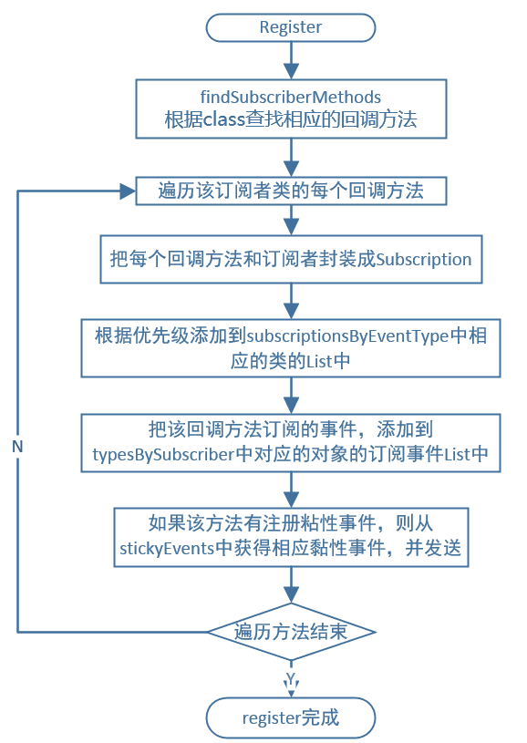

3、事件的发送

```
public void post(Object event) {
    //PostingThreadState保存着事件队列和线程状态信息
    PostingThreadState postingState = currentPostingThreadState.get();
    List<Object> eventQueue = postingState.eventQueue;
    /获取事件队列，并将当前事插入到事件队列中
    eventQueue.add(event);

    if (!postingState.isPosting) {
        postingState.isMainThread = isMainThread();
        postingState.isPosting = true;
        if (postingState.canceled) {
            throw new EventBusException("Internal error. Abort state was not reset");
        }
        try {
            //处理队列中的所有事件
            while (!eventQueue.isEmpty()) {
                postSingleEvent(eventQueue.remove(0), postingState);
            }
        } finally {
            postingState.isPosting = false;
            postingState.isMainThread = false;
        }
    }
}
```

* 从PostingThreadState对象中取出事件队列
* 将当前的事件插入到事件队列当中
* 将队列中的事件依次交由postSingleEvent方法进行处理，并移除该事件。

```
private void postSingleEvent(Object event, PostingThreadState postingState) throws Error {
    Class<?> eventClass = event.getClass();
    boolean subscriptionFound = false;
    //eventInheritance表示是否向上查找事件的父类,默认为true
    if (eventInheritance) {
        List<Class<?>> eventTypes = lookupAllEventTypes(eventClass);
        int countTypes = eventTypes.size();
        for (int h = 0; h < countTypes; h++) {
            Class<?> clazz = eventTypes.get(h);
            subscriptionFound |= postSingleEventForEventType(event, postingState, clazz);
        }
    } else {
        subscriptionFound = postSingleEventForEventType(event, postingState, eventClass);
    }
    //找不到该事件时的异常处理
    if (!subscriptionFound) {
        if (logNoSubscriberMessages) {
            logger.log(Level.FINE, "No subscribers registered for event " + eventClass);
        }
        if (sendNoSubscriberEvent && eventClass != NoSubscriberEvent.class &&
                eventClass != SubscriberExceptionEvent.class) {
            post(new NoSubscriberEvent(this, event));
        }
    }
}
```

eventInheritance表示是否向上查找事件的父类,它的默认值为true，可以通过在EventBusBuilder中来进行配置。当eventInheritance为true时，则通过lookupAllEventTypes找到所有的父类事件并存在List中，然后通过postSingleEventForEventType方法对事件逐一处理

```
private boolean postSingleEventForEventType(Object event, PostingThreadState postingState, Class<?> eventClass) {
    CopyOnWriteArrayList<Subscription> subscriptions;
    //取出该事件对应的Subscription集合
    synchronized (this) {
        subscriptions = subscriptionsByEventType.get(eventClass);
    }
    if (subscriptions != null && !subscriptions.isEmpty()) {
       //将该事件的event和对应的Subscription中的信息（包扩订阅者类和订阅方法）传递给postingState
        for (Subscription subscription : subscriptions) {
            postingState.event = event;
            postingState.subscription = subscription;
            boolean aborted = false;
            try {
                //对事件进行处理
                postToSubscription(subscription, event, postingState.isMainThread);
                aborted = postingState.canceled;
            } finally {
                postingState.event = null;
                postingState.subscription = null;
                postingState.canceled = false;
            }
            if (aborted) {
                break;
            }
        }
        return true;
    }
    return false;
}
```

同步取出该事件对应的Subscription集合并遍历该集合将事件event和对应Subscription传递给postingState并调用postToSubscription方法对事件进行处理

```
private void postToSubscription(Subscription subscription, Object event, boolean isMainThread) {
    switch (subscription.subscriberMethod.threadMode) {
        case POSTING:
            invokeSubscriber(subscription, event);
            break;
        case MAIN:
            if (isMainThread) {
                invokeSubscriber(subscription, event);
            } else {
                mainThreadPoster.enqueue(subscription, event);
            }
            break;
        case MAIN_ORDERED:
            if (mainThreadPoster != null) {
                mainThreadPoster.enqueue(subscription, event);
            } else {
                // temporary: technically not correct as poster not decoupled from subscriber
                invokeSubscriber(subscription, event);
            }
            break;
        case BACKGROUND:
            if (isMainThread) {
                backgroundPoster.enqueue(subscription, event);
            } else {
                invokeSubscriber(subscription, event);
            }
            break;
        case ASYNC:
            asyncPoster.enqueue(subscription, event);
            break;
        default:
            throw new IllegalStateException("Unknown thread mode: " + subscription.subscriberMethod.threadMode);
    }
}
```

取出订阅方法的线程模式，之后根据线程模式来分别处理。举个例子，如果线程模式是MAIN，提交事件的线程是主线程的话则通过反射，直接运行订阅的方法，如果不是主线程，我们需要mainThreadPoster将我们的订阅事件入队列，mainThreadPoster是HandlerPoster类型的继承自Handler，通过Handler将订阅方法切换到主线程执行。

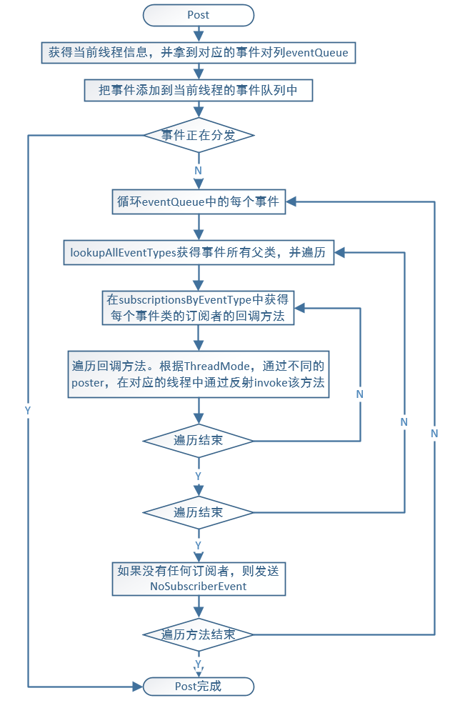

4、订阅者取消注册

```
public synchronized void unregister(Object subscriber) {
    List<Class<?>> subscribedTypes = typesBySubscriber.get(subscriber);
    if (subscribedTypes != null) {
        for (Class<?> eventType : subscribedTypes) {
            unsubscribeByEventType(subscriber, eventType);
        }
        typesBySubscriber.remove(subscriber);
    } else {
        logger.log(Level.WARNING, "Subscriber to unregister was not registered before: " + subscriber.getClass());
    }
}
```

typesBySubscriber我们在订阅者注册的过程中讲到过这个属性，他根据订阅者找到EventType，然后根据EventType和订阅者来得到订阅事件来对订阅者进行解绑。

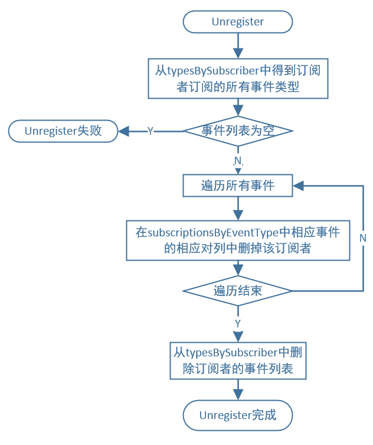

三、核心架构与利弊

1、核心架构

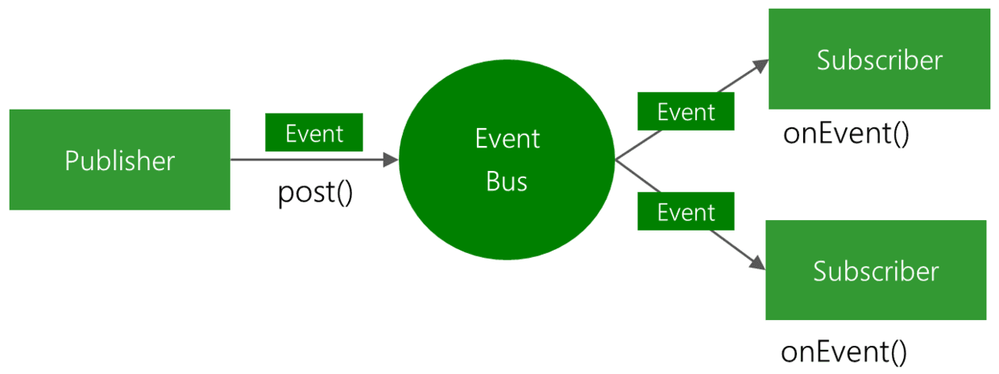

从EventBus作者提供的图我们可以看到EventBus的核心架构，其实就是基于观察者模式来实现的

2、利与弊

EventBus好处比较明显，它能够解耦和，将业务和视图分离，代码实现比较容易。而且3.0后，我们可以通过apt预编译找到订阅者，避免了运行期间的反射处理解析，大大提高了效率。当然EventBus也会带来一些隐患和弊端，如果滥用的话会导致逻辑的分散并造成维护起来的困难。另外大量采用EventBus代码的可读性也会变差。

## LeakCanary

### 原理概览

1. application启动时，通过application实例监听Activity和fragment生命周期。
2. 在 onDestroy 的时候，主线程空闲时，创建相应的 Refrence 和 RefrenceQueue，并启动后台进程去检测。
3. 一段时间之后，从 RefrenceQueue 读取，若读取不到相应 activity/fragment 的 Refrence，有可能发生泄露了，这个时候，再触发gc，一段时间之后，再去读取，若在从 RefrenceQueue 还是读取不到相应 activity 的 refrence，可以断定是发生内存泄露了。
4. 使用android.os.Debug包获取.hprof数据。
5. 发生内存泄露之后，dump，分析 hprof 文件，找到泄露路径（使用 haha 库分析），发送到通知栏

### 原理分析

LeakCanary#Install

```
public static @NonNull RefWatcher install(@NonNull Application application) {
return refWatcher(application)// 创建AndroidRefWatcherBuilder对象
	    .listenerServiceClass(DisplayLeakService.class)// 配置监听分析结果的服务
	    .excludedRefs(AndroidExcludedRefs.createAppDefaults().build())// 配置排除的系统泄露
	    .buildAndInstall();// 创建一个Refwatcher并监听Activity的引用
}
```

* listenerServiceClass() 方法绑定了一个后台服务 DisplayLeakService，这个服务主要用来分析内存泄漏结果并发送通知。你可以继承并重写这个类来进行一些自定义操作，比如上传分析结果等。
* excludedRefs() 方法定义了一些对于开发者可以忽略的路径，意思就是即使这里发生了内存泄漏，LeakCanary 也不会弹出通知。这大多是系统 Bug 导致的，无需用户进行处理。

AndroidRefWatcherBuilder#buildAndInstall

buildAndInstall 所做的工作，调用 build 构建 refWatcher，判断 refWatcher 是否 DISABLED，若不是 DISABLED 状态，调用 install 方法，并将 refWatcher 返回回去

```
public @NonNull RefWatcher buildAndInstall() {
	...
	// 创建RefWatcher对象
	RefWatcher refWatcher = build();
	
	if (refWatcher != DISABLED) {
	  if (enableDisplayLeakActivity) {
	    LeakCanaryInternals.setEnabledAsync(context, DisplayLeakActivity.class, true);
	  }
	  if (watchActivities) {
	    // 监听Activity的引用
	    ActivityRefWatcher.install(context, refWatcher);
	  }
	  if (watchFragments) {
	    // 监听Fragment的引用
	    FragmentRefWatcher.Helper.install(context, refWatcher);
	  }
	}
	LeakCanaryInternals.installedRefWatcher = refWatcher;
	return refWatcher;
}
```

ActivityRefWatcher

```
public final class ActivityRefWatcher {

    public static void install(@NonNull Context context, @NonNull RefWatcher refWatcher) {
        Application application = (Application) context.getApplicationContext();
        ActivityRefWatcher activityRefWatcher = new ActivityRefWatcher(application, refWatcher);

        application.registerActivityLifecycleCallbacks(activityRefWatcher.lifecycleCallbacks);
    }

    private final Application.ActivityLifecycleCallbacks lifecycleCallbacks = new ActivityLifecycleCallbacksAdapter() {

        @Override
        public void onActivityDestroyed(Activity activity) {
            // 在Activity执行完onDestroyed方法时，调用RefWatcher的watch来监控该Activity是否泄露
            refWatcher.watch(activity);
        }
    };
    ...
}
```

install 来说，主要做以下事情

* 创建 ActivityRefWatcher,并调用 Application#application.registerActivityLifecycleCallbacks 监听 activity 的生命周期
* 在 activity 被销毁的时候，会回调 lifecycleCallbacks 的 onActivityDestroyed 方法，这时候会调用 onActivityDestroyed 去分析，而 onActivityDestroyed 方法又会回调 refWatcher.watch(activity)

RefWatcher#watch

```
// 线程控制器，在 onDestroy() 之后并且主线程空闲时执行内存泄漏检测
private final WatchExecutor watchExecutor;
// 判断是否处于调试模式，调试模式中不会进行内存泄漏检测，因为在调试过程中可能会保留上一个引用从而导致错误信息上报。
private final DebuggerControl debuggerControl;
// 用于主动触发GC操作
private final GcTrigger gcTrigger;
// 堆信息转储者，dump 内存泄漏处的 heap 信息到 hprof 文件
private final HeapDumper heapDumper;
...
// 保存每个被检测对象所对应的唯一key
private final Set<String> retainedKeys;
// 引用队列，和WeakReference配合使用，当弱引用所引用的对象被GC回收，该弱引用就会被加入到这个队列
private final ReferenceQueue<Object> queue;

public void watch(Object watchedReference, String referenceName) {
    if (this == DISABLED) {
      return;
    }
    checkNotNull(watchedReference, "watchedReference");
    checkNotNull(referenceName, "referenceName");
    final long watchStartNanoTime = System.nanoTime();
    // 为被检测对象生成唯一的key值，并保存到retainedKeys
    String key = UUID.randomUUID().toString();
    retainedKeys.add(key);
    // 创建被检测对象的弱引用，并传入该对象的key
    final KeyedWeakReference reference = new KeyedWeakReference(watchedReference, key, referenceName, queue);
    // 异步检测这个对象是否被回收
    ensureGoneAsync(watchStartNanoTime, reference);
  }
```

KeyedWeakReference

KeyedWeakReference 继承于 WeakReference，并定义了 key，name 字段

```
final class KeyedWeakReference extends WeakReference<Object> {
  public final String key;
  public final String name;

  KeyedWeakReference(Object referent, String key, String name,
      ReferenceQueue<Object> referenceQueue) {
    super(checkNotNull(referent, "referent"), checkNotNull(referenceQueue, "referenceQueue"));
    this.key = checkNotNull(key, "key");
    this.name = checkNotNull(name, "name");
  }
}
```

* key 对应的 key 值名称
* referenceQueue 引用队列，当结合 Refrence 使用的时候，垃圾回收器回收的时候，会把相应的对象加入到 refrenceQueue 中。

弱引用和引用队列 ReferenceQueue 联合使用时，如果弱引用持有的对象被垃圾回收，Java 虚拟机就会把这个弱引用加入到与之关联的引用队列中。即 KeyedWeakReference 持有的 Activity 对象如果被垃圾回收，该对象就会加入到引用队列 queue 中。

RefWatcher#watch

```
private void ensureGoneAsync(final long watchStartNanoTime, final KeyedWeakReference reference) {
    watchExecutor.execute(new Retryable() {
      @Override public Retryable.Result run() {
        return ensureGone(reference, watchStartNanoTime);
      }
    });
}

Retryable.Result ensureGone(final KeyedWeakReference reference, final long watchStartNanoTime) {
    long gcStartNanoTime = System.nanoTime();
    long watchDurationMs = NANOSECONDS.toMillis(gcStartNanoTime - watchStartNanoTime);
    
    // 移除对象已经被回收的弱引用
    removeWeaklyReachableReferences();

    // 调试模式检测不准确
    if (debuggerControl.isDebuggerAttached()) {
      return RETRY;
    }
    // 判断 reference，即 activity 是否内回收了，若被回收了，直接返回
    if (gone(reference)) {
      return DONE;
    }
    // 调用 gc 方法进行垃圾回收
    gcTrigger.runGc();
    // 移除对象已经被回收的弱引用
    removeWeaklyReachableReferences();
    // activity 还没有被回收，证明发生内存泄露
    if (!gone(reference)) {
      long startDumpHeap = System.nanoTime();
      long gcDurationMs = NANOSECONDS.toMillis(startDumpHeap - gcStartNanoTime);
      // dump出heap的内存快照
      File heapDumpFile = heapDumper.dumpHeap();
      if (heapDumpFile == RETRY_LATER) {
        // Could not dump the heap.
        return RETRY;
      }
      long heapDumpDurationMs = NANOSECONDS.toMillis(System.nanoTime() - startDumpHeap);
      // 构建HeapDump对象
      HeapDump heapDump = heapDumpBuilder.heapDumpFile(heapDumpFile).referenceKey(reference.key)
          .referenceName(reference.name)
          .watchDurationMs(watchDurationMs)
          .gcDurationMs(gcDurationMs)
          .heapDumpDurationMs(heapDumpDurationMs)
          .build();
      // 分析 hprof 文件
      heapdumpListener.analyze(heapDump);
    }
    return DONE;
  }

  private boolean gone(KeyedWeakReference reference) {
    return !retainedKeys.contains(reference.key);
  }

  private void removeWeaklyReachableReferences() {
    // 当弱引用所引用的对象被回收，就会把该引用放到queue中，所以可以通过queue来判断对象是否被回收
    // 遍历 queue ，并从 retainedKeys set 集合中移除
    KeyedWeakReference ref;
    while ((ref = (KeyedWeakReference) queue.poll()) != null) {
      retainedKeys.remove(ref.key);
    }
 }
```

ensureGoneAsync 方法，整理一下它的流程

* Activity onDestroy 5s 之后，检测 activity 的弱引用 refrence 有没有被回收，若被回收，证明没有发生内存泄露，若没有被回收，继续下面流程
* 调用 gcTrigger.runGc() 触发垃圾回收机器进行回收
* 再次检测 activity 的弱引用 refrence 有没有被回收，若被回收，证明没有发生内存泄露，若没有被回收，则认为发生内存泄露
* dump heap，生成 hprof。
* 分析 hprof 文件，找到泄露路径，发送到通知栏

AndroidHeapDumper#dumpHeap

```
public final class AndroidHeapDumper implements HeapDumper {

    @Override @Nullable
    public File dumpHeap() {
        File heapDumpFile = leakDirectoryProvider.newHeapDumpFile();

        if (heapDumpFile == RETRY_LATER) {
            return RETRY_LATER;
        }

        // ...

        try {
            // 生成.hprof文件
            Debug.dumpHprofData(heapDumpFile.getAbsolutePath());
            cancelToast(toast);
            notificationManager.cancel(notificationId);
            return heapDumpFile;
        } catch (Exception e) {
            CanaryLog.d(e, "Could not dump heap");
            // Abort heap dump
            return RETRY_LATER;
        }
    }

    // ...
}
```

ServiceHeapDumpListener#analyze

```
@Override public void analyze(@NonNull HeapDump heapDump) {
    checkNotNull(heapDump, "heapDump");
    HeapAnalyzerService.runAnalysis(context, heapDump, listenerServiceClass);
 }
```

HeapAnalyzerService#runAnalysis

```
public final class HeapAnalyzerService extends ForegroundService implements AnalyzerProgressListener {
    // ...

    public static void runAnalysis(Context context, HeapDump heapDump,  Class<? extends AbstractAnalysisResultService> listenerServiceClass) {
        setEnabledBlocking(context, HeapAnalyzerService.class, true);
        setEnabledBlocking(context, listenerServiceClass, true);
        Intent intent = new Intent(context, HeapAnalyzerService.class);
        intent.putExtra(LISTENER_CLASS_EXTRA, listenerServiceClass.getName());
        intent.putExtra(HEAPDUMP_EXTRA, heapDump);
        ContextCompat.startForegroundService(context, intent);
    }

    @Override 
    protected void onHandleIntentInForeground(@Nullable Intent intent) {
        if (intent == null) {
            CanaryLog.d("HeapAnalyzerService received a null intent, ignoring.");
            return;
        }
        String listenerClassName = intent.getStringExtra(LISTENER_CLASS_EXTRA);
        HeapDump heapDump = (HeapDump) intent.getSerializableExtra(HEAPDUMP_EXTRA);

        HeapAnalyzer heapAnalyzer = new HeapAnalyzer(heapDump.excludedRefs, this, heapDump.reachabilityInspectorClasses);

        // 分析内存泄露的地方
        AnalysisResult result = heapAnalyzer.checkForLeak(heapDump.heapDumpFile, heapDump.referenceKey, heapDump.computeRetainedHeapSize);
        // 发送内存泄露检测结果的通知
        AbstractAnalysisResultService.sendResultToListener(this, listenerClassName, heapDump, result);
    }
}
```

HeapAnalyzer#checkForLeak

```
public final class HeapAnalyzer {
    // ...

    public @NonNull AnalysisResult checkForLeak(@NonNull File heapDumpFile, @NonNull String referenceKey, boolean computeRetainedSize) {
        long analysisStartNanoTime = System.nanoTime();

        if (!heapDumpFile.exists()) {
            Exception exception = new IllegalArgumentException("File does not exist: " + heapDumpFile);
            return failure(exception, since(analysisStartNanoTime));
        }

        try {
            listener.onProgressUpdate(READING_HEAP_DUMP_FILE);
            // 使用haha库解析.hprof文件
            HprofBuffer buffer = new MemoryMappedFileBuffer(heapDumpFile);
            HprofParser parser = new HprofParser(buffer);
            listener.onProgressUpdate(PARSING_HEAP_DUMP);
               // 解析.hprof文件生成对应的快照对象
            Snapshot snapshot = parser.parse();
            listener.onProgressUpdate(DEDUPLICATING_GC_ROOTS);
            // 删除gcRoots中重复的根对象RootObj
            deduplicateGcRoots(snapshot);
            listener.onProgressUpdate(FINDING_LEAKING_REF);
            // 检查对象是否泄露
            Instance leakingRef = findLeakingReference(referenceKey, snapshot);

            // leakingRef为空表示对象没有泄露
            if (leakingRef == null) {
                String className = leakingRef.getClassObj().getClassName();
                return noLeak(className, since(analysisStartNanoTime));
            }
            // 查找引用链
            return findLeakTrace(analysisStartNanoTime, snapshot, leakingRef, computeRetainedSize);
        } catch (Throwable e) {
            return failure(e, since(analysisStartNanoTime));
        }
    }
}
```

HeapAnalyzer#findLeakingReference

```
public final class HeapAnalyzer {
    // ...

    private Instance findLeakingReference(String key, Snapshot snapshot) {
        ClassObj refClass = snapshot.findClass(KeyedWeakReference.class.getName());
        if (refClass == null) {
            throw new IllegalStateException(
                    "Could not find the " + KeyedWeakReference.class.getName() + " class in the heap dump.");
        }
        List<String> keysFound = new ArrayList<>();
        for (Instance instance : refClass.getInstancesList()) {
            List<ClassInstance.FieldValue> values = classInstanceValues(instance);
            Object keyFieldValue = fieldValue(values, "key");
            if (keyFieldValue == null) {
                keysFound.add(null);
                continue;
            }
            String keyCandidate = asString(keyFieldValue);
            if (keyCandidate.equals(key)) {
                return fieldValue(values, "referent");
            }
            keysFound.add(keyCandidate);
        }
        throw new IllegalStateException("Could not find weak reference with key " + key + " in " + keysFound);
    }
}
```

HeapAnalyzer#findLeakTrace

```
public final class HeapAnalyzer {
    // ...

    private AnalysisResult findLeakTrace(long analysisStartNanoTime, Snapshot snapshot, Instance leakingRef, boolean computeRetainedSize) {

        listener.onProgressUpdate(FINDING_SHORTEST_PATH);
        // 查找到GC Roots的最短引用路径
        ShortestPathFinder pathFinder = new ShortestPathFinder(excludedRefs);
        ShortestPathFinder.Result result = pathFinder.findPath(snapshot, leakingRef);

        String className = leakingRef.getClassObj().getClassName();

        // False alarm, no strong reference path to GC Roots.
        if (result.leakingNode == null) {
            return noLeak(className, since(analysisStartNanoTime));
        }

        listener.onProgressUpdate(BUILDING_LEAK_TRACE);
        // 构建泄露的引用链
        LeakTrace leakTrace = buildLeakTrace(result.leakingNode);

        long retainedSize;
        if (computeRetainedSize) {

            listener.onProgressUpdate(COMPUTING_DOMINATORS);
            // 计算内存泄露的大小
            snapshot.computeDominators();

            Instance leakingInstance = result.leakingNode.instance;

            retainedSize = leakingInstance.getTotalRetainedSize();

            // TODO: check O sources and see what happened to android.graphics.Bitmap.mBuffer
            if (SDK_INT <= N_MR1) {
                listener.onProgressUpdate(COMPUTING_BITMAP_SIZE);
                retainedSize += computeIgnoredBitmapRetainedSize(snapshot, leakingInstance);
            }
        } else {
            retainedSize = AnalysisResult.RETAINED_HEAP_SKIPPED;
        }

        return leakDetected(result.excludingKnownLeaks, className, leakTrace, retainedSize, since(analysisStartNanoTime));
    }

}
```

DisplayLeakService

展示分析结果

```
public class DisplayLeakService extends AbstractAnalysisResultService {
    // ...

    @Override
    protected final void onHeapAnalyzed(@NonNull AnalyzedHeap analyzedHeap) {
        HeapDump heapDump = analyzedHeap.heapDump;
        AnalysisResult result = analyzedHeap.result;

        String leakInfo = leakInfo(this, heapDump, result, true);
        CanaryLog.d("%s", leakInfo);

        heapDump = renameHeapdump(heapDump);
        boolean resultSaved = saveResult(heapDump, result);

        String contentTitle;
        if (resultSaved) {
            PendingIntent pendingIntent = DisplayLeakActivity.createPendingIntent(this, heapDump.referenceKey);
            if (result.failure != null) {
                contentTitle = getString(R.string.leak_canary_analysis_failed);
            } else {
                String className = classSimpleName(result.className);
                // ...
            }
            String contentText = getString(R.string.leak_canary_notification_message);
            showNotification(pendingIntent, contentTitle, contentText);
        } else {
            onAnalysisResultFailure(getString(R.string.leak_canary_could_not_save_text));
        }

        afterDefaultHandling(heapDump, result, leakInfo);
    }

    @Override 
    protected final void onAnalysisResultFailure(String failureMessage) {
        super.onAnalysisResultFailure(failureMessage);
        String failureTitle = getString(R.string.leak_canary_result_failure_title);
        showNotification(null, failureTitle, failureMessage);
    }
}
```

总结：

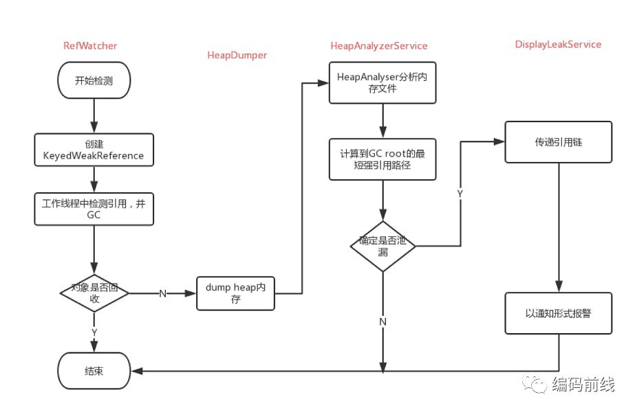

## 

