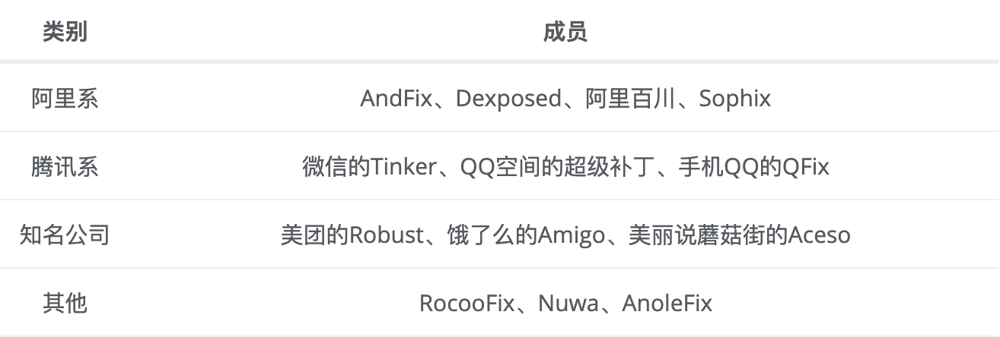
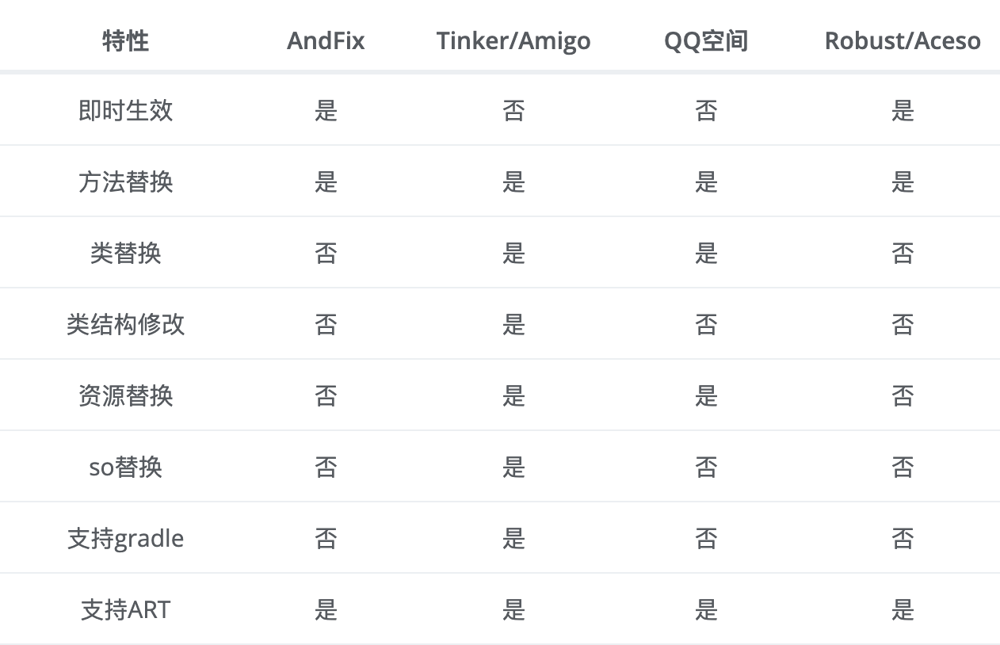
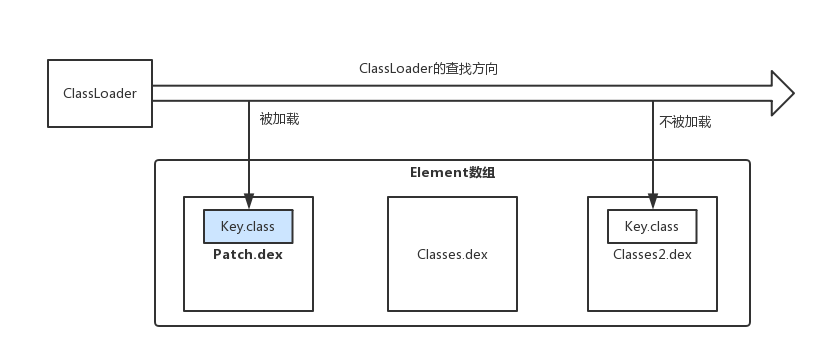

## 热修复框架对比

#### 热修复的产生概述

在开发中我们会遇到如下的情况：

1. 刚发布的版本出现了严重的bug，这就需要去解决bug、测试并打渠道包在各个应用市场上重新发布，这会耗费大量的人力物力，代价会比较大。
2. 已经改正了此前发布版本的bug，如果下一个版本是一个大版本，那么两个版本的间隔时间会很长，这样要等到下个大版本发布再修复bug，这样此前版本的bug会长期的影响用户。
3. 版本升级率不高，并且需要很长时间来完成版本覆盖，此前版本的bug就会一直影响不升级版本的用户。
4. 有一个小而重要的功能，需要短时间内完成版本覆盖，比如节日活动。

为了解决上面的问题，热修复框架就产生了。对于Bug的处理，开发人员不要过于依赖热修复框架，在开发的过程中还是要按照标准的流程做好自测、配合测试人员完成测试流程。

#### 热修复框架的对比



虽然热修复框架很多，但热修复框架的核心技术主要有三类，分别是代码修复、资源修复和动态链接库修复，其中每个核心技术又有很多不同的技术方案，每个技术方案又有不同的实现，另外这些热修复框架仍在不断的更新迭代中，可见热修复框架的技术实现是繁多可变的。作为开发需需要了解这些技术方案的基本原理，这样就可以以不变应万变。

部分热修复框架的对比如下表所示。



我们可以根据上表和具体业务来选择合适的热修复框架，当然上表的信息很难做到完全准确，因为部分的热修复框架还在不断更新迭代。
从表中也可以发现Tinker和Amigo拥有的特性最多，是不是就选它们呢？也不尽然，拥有的特性多也意味着框架的代码量庞大，我们需要根据业务来选择最合适的，假设我们只是要用到方法替换，那么使用Tinker和Amigo显然是大材小用了。另外如果项目需要即时生效，那么使用Tinker和Amigo是无法满足需求的。对于即时生效，AndFix、Robust和Aceso都满足这一点，这是因为AndFix的代码修复采用了底层替换方案，而Robust和Aceso的代码修复借鉴了Instant Run原理。

#### 代码修复

代码修复主要有三个方案，分别是底层替换方案、类加载方案和Instant Run方案。

##### 类加载方案

类加载方案基于Dex分包方案，什么是Dex分包方案呢？这个得先从65536限制和LinearAlloc限制说起。

**65536限制**

随着应用功能越来越复杂，代码量不断地增大，引入的库也越来越多，可能会在编译时提示如下异常：

```
com.android.dex.DexIndexOverflowException: method ID not in [0, 0xffff]: 65536
```

这说明应用中引用的方法数超过了最大数65536个。产生这一问题的原因就是系统的65536限制，65536限制的主要原因是DVM Bytecode的限制，DVM指令集的方法调用指令invoke-kind索引为16bits，最多能引用 65535个方法。

**LinearAlloc限制**

在安装时可能会提示```INSTALL_FAILED_DEXOPT```。产生的原因就是LinearAlloc限制，DVM中的LinearAlloc是一个固定的缓存区，当方法数过多超出了缓存区的大小时会报错。

为了解决65536限制和LinearAlloc限制，从而产生了Dex分包方案。Dex分包方案主要做的是在打包时将应用代码分成多个Dex，将应用启动时必须用到的类和这些类的直接引用类放到主Dex中，其他代码放到次Dex中。当应用启动时先加载主Dex，等到应用启动后再动态的加载次Dex，从而缓解了主Dex的65536限制和LinearAlloc限制。

Dex分包方案主要有两种，分别是Google官方方案、Dex自动拆包和动态加载方案。我们接着来学习类加载方案。

ClassLoader的加载过程，其中一个环节就是调用DexPathList的findClass的方法，如下所示。

```
// libcore/dalvik/src/main/java/dalvik/system/DexPathList.java
public Class<?> findClass(String name, List<Throwable> suppressed) {
   for (Element element : dexElements) {//1
       Class<?> clazz = element.findClass(name, definingContext, suppressed);//2
       if (clazz != null) {
           return clazz;
       }
   }
   if (dexElementsSuppressedExceptions != null) {
       suppressed.addAll(Arrays.asList(dexElementsSuppressedExceptions));
   }
   return null;
}
```

Element内部封装了DexFile，DexFile用于加载dex文件，因此每个dex文件对应一个Element。
多个Element组成了有序的Element数组dexElements。当要查找类时，会在注释1处遍历Element数组dexElements（相当于遍历dex文件数组），注释2处调用Element的findClass方法，其方法内部会调用DexFile的loadClassBinaryName方法查找类。如果在Element中（dex文件）找到了该类就返回，如果没有找到就接着在下一个Element中进行查找。
根据上面的查找流程，我们将有bug的类Key.class进行修改，再将Key.class打包成包含dex的补丁包Patch.jar，放在Element数组dexElements的第一个元素，这样会首先找到Patch.dex中的Key.class去替换之前存在bug的Key.class，排在数组后面的dex文件中的存在bug的Key.class根据ClassLoader的双亲委托模式就不会被加载，这就是类加载方案，如下图所示。



类加载方案需要重启App后让ClassLoader重新加载新的类，为什么需要重启呢？这是因为类是无法被卸载的，因此要想重新加载新的类就需要重启App，因此采用类加载方案的热修复框架是不能即时生效的。
虽然很多热修复框架采用了类加载方案，但具体的实现细节和步骤还是有一些区别的，比如QQ空间的超级补丁和Nuwa是按照上面说得将补丁包放在Element数组的第一个元素得到优先加载。微信Tinker将新旧apk做了diff，得到patch.dex，然后将patch.dex与手机中apk的classes.dex做合并，生成新的classes.dex，然后在运行时通过反射将classes.dex放在Element数组的第一个元素。饿了么的Amigo则是将补丁包中每个dex 对应的Element取出来，之后组成新的Element数组，在运行时通过反射用新的Element数组替换掉现有的Element 数组。

采用类加载方案的主要是以腾讯系为主，包括微信的Tinker、QQ空间的超级补丁、手机QQ的QFix、饿了么的Amigo和Nuwa等等。

##### 底层替换方案

一、概述

1、底层热替换原理

* Android的java运行环境,在4.4以下用的是dalvik虚拟机,4.4以上是art虚拟机.
* 在各种Android热修复方案中,Andfix即时生效.Andfix采用的方法是,在已经加载了的类中直接在native层替换掉所有方法,是在原来的类的基础上进行修改的.
* 以art,Android6.0为例,每一个Java方法在art中都对应着一个ArtMethod对象,ArtMethod记录了这个Java方法的所有信息,包括所属类,访问权限,代码执行地址等.
* Andfix会将一个旧Java方法对应的ArtMethod实例中的所有字段值替换为新方法的值,这样所有执行到旧方法的地方,都会取得新方法的执行入口,所属class,方法索引,所属dex.像调用旧方法一样执行了新方法的逻辑.


2、底层热替换兼容性根源

* 市面上几乎所有的native替换替换,都是写死了ArtMethod结构体
* 写死的ArtMethod结构和Android开源版本中完全一致,但各个厂家可以对ArtMethod进行修改,那么在修改过的设备上,市面上的native替换方案(将方案中写死了的ArtMethod关联的新方法的属性赋值到设备中的ArtMethod实例)就会出现问题,因为两个ArtMethod中相同字段的索引不同


3、突破底层热替换兼容问题

* native层面替换,实质是替换ArtMethod实例的所有字段.
* 只要把ArtMethod作为整体进行替换,即可解决兼容问题.
* ArtMethod实例之间,是紧密线形排列的,所以一个ArtMethod的大小,就是其相邻的两个方法对应的ArtMethod实例的起始地址的差值.

4、包括Sophix在内的底层替换方案,都只能支持方法的替换,不支持补丁类中增减方法和字段

* 补丁类中增减方法,会导致这个类及整个dex方法数的变化,方法数的变化伴随方法索引的变化,这样在调用方法时无法正常的所引导正确的方法.
* 补丁类中增减字段,也会导致所有字段的索引发生变化.


二、分析

与类加载方案不同的是，底层替换方案不会再次加载新类，而是直接在Native层修改原有类，由于是在原有类进行修改限制会比较多，不能够增减原有类的方法和字段，如果我们增加了方法数，那么方法索引数也会增加，这样访问方法时会无法通过索引找到正确的方法，同样的字段也是类似的情况。
底层替换方案和反射的原理有些关联，就拿方法替换来说，方法反射我们可以调用java.lang.Class.getDeclaredMethod，假设我们要反射Key的show方法，会调用如下所示。

```
Key.class.getDeclaredMethod("show").invoke(Key.class.newInstance());
```

Android 8.0的invoke方法，如下所示。

```
// libcore/ojluni/src/main/java/java/lang/reflect/Method.java
@FastNative
public native Object invoke(Object obj, Object... args)
        throws IllegalAccessException, IllegalArgumentException, InvocationTargetException;
```

nvoke方法是个native方法，对应Jni层的代码为：

```
art/runtime/native/java_lang_reflect_Method.cc

static jobject Method_invoke(JNIEnv* env, jobject javaMethod, jobject javaReceiver,jobject javaArgs) {
  ScopedFastNativeObjectAccess soa(env);
  return InvokeMethod(soa, javaMethod, javaReceiver, javaArgs);
```

Method_invoke函数中又调用了InvokeMethod函数：

```
// art/runtime/reflection.cc
jobject InvokeMethod(const ScopedObjectAccessAlreadyRunnable& soa, jobject javaMethod,
                     jobject javaReceiver, jobject javaArgs, size_t num_frames) {

...
  ObjPtr<mirror::Executable> executable = soa.Decode<mirror::Executable>(javaMethod);
  const bool accessible = executable->IsAccessible();
  ArtMethod* m = executable->GetArtMethod();//1
...
}
```

注释1处获取传入的javaMethod（Key的show方法）在ART虚拟机中对应的一个ArtMethod指针，ArtMethod结构体中包含了Java方法的所有信息，包括执行入口、访问权限、所属类和代码执行地址等等，ArtMethod结构如下所示。

```
// art/runtime/art_method.h
class ArtMethod FINAL {
...
 protected:
  GcRoot<mirror::Class> declaring_class_;
  std::atomic<std::uint32_t> access_flags_;
  uint32_t dex_code_item_offset_;
  uint32_t dex_method_index_;
  uint16_t method_index_;
  uint16_t hotness_count_;
 struct PtrSizedFields {
    ArtMethod** dex_cache_resolved_methods_;//1
    void* data_;
    void* entry_point_from_quick_compiled_code_;//2
  } ptr_sized_fields_;
}
```

ArtMethod结构中比较重要的字段是注释1处的```dex_cache_resolved_methods```和注释2处的```entry_point_from_quick_compiledcode```，它们是方法的执行入口，当我们调用某一个方法时（比如Key的show方法），就会取得show方法的执行入口，通过执行入口就可以跳过去执行show方法。
替换ArtMethod结构体中的字段或者替换整个ArtMethod结构体，这就是底层替换方案。
AndFix采用的是替换ArtMethod结构体中的字段，这样会有兼容问题，因为厂商可能会修改ArtMethod结构体，导致方法替换失败。Sophix采用的是替换整个ArtMethod结构体，这样不会存在兼容问题。
底层替换方案直接替换了方法，可以立即生效不需要重启。采用底层替换方案主要是阿里系为主，包括AndFix、Dexposed、阿里百川、Sophix。

##### Instant Run方案

除了资源修复，代码修复同样也可以借鉴Instant Run的原理， 可以说Instant Run的出现推动了热修复框架的发展。
Instant Run在第一次构建apk时，使用ASM在每一个方法中注入了类似如下的代码：

```
IncrementalChange localIncrementalChange = $change;//1
	if (localIncrementalChange != null) {//2
		localIncrementalChange.access$dispatch("onCreate.(Landroid/os/Bundle;)V", new Object[] { this,paramBundle });
		return;
	}
```

其中注释1处是一个成员变量localIncrementalChange ，它的值为```$change```，```$change```实现了IncrementalChange这个抽象接口。当我们点击InstantRun时，如果方法没有变化则```$change```为null，就调用return，不做任何处理。如果方法有变化，就生成替换类，这里我们假设MainActivity的onCreate方法做了修改，就会生成替换类```MainActivity$override```，这个类实现了IncrementalChange接口，同时也会生成一个AppPatchesLoaderImpl类，这个类的getPatchedClasses方法会返回被修改的类的列表（里面包含了MainActivity），根据列表会将```MainActivity```的```$change```设置为```MainActivity$override```，因此满足了注释2的条件，会执行```MainActivity$override```的```access$dispatch```方法，```access$dispatch```方法中会根据参数```”onCreate.(Landroid/os/Bundle;)V”```执行```MainActivity$override```的onCreate方法，从而实现了onCreate方法的修改。
借鉴Instant Run的原理的热修复框架有Robust和Aceso。