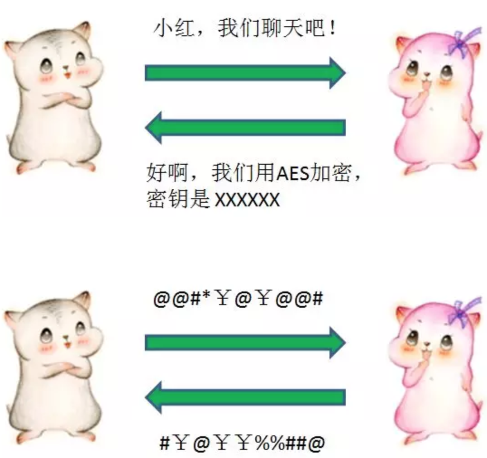
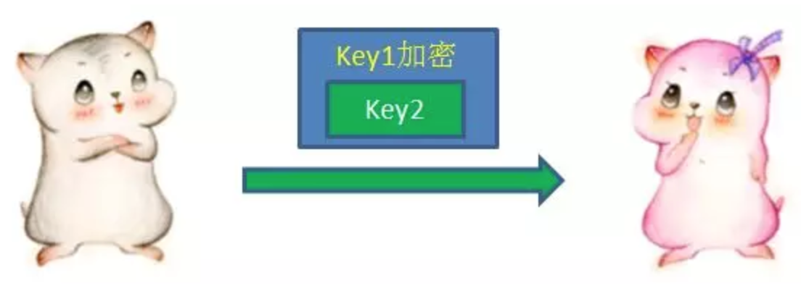
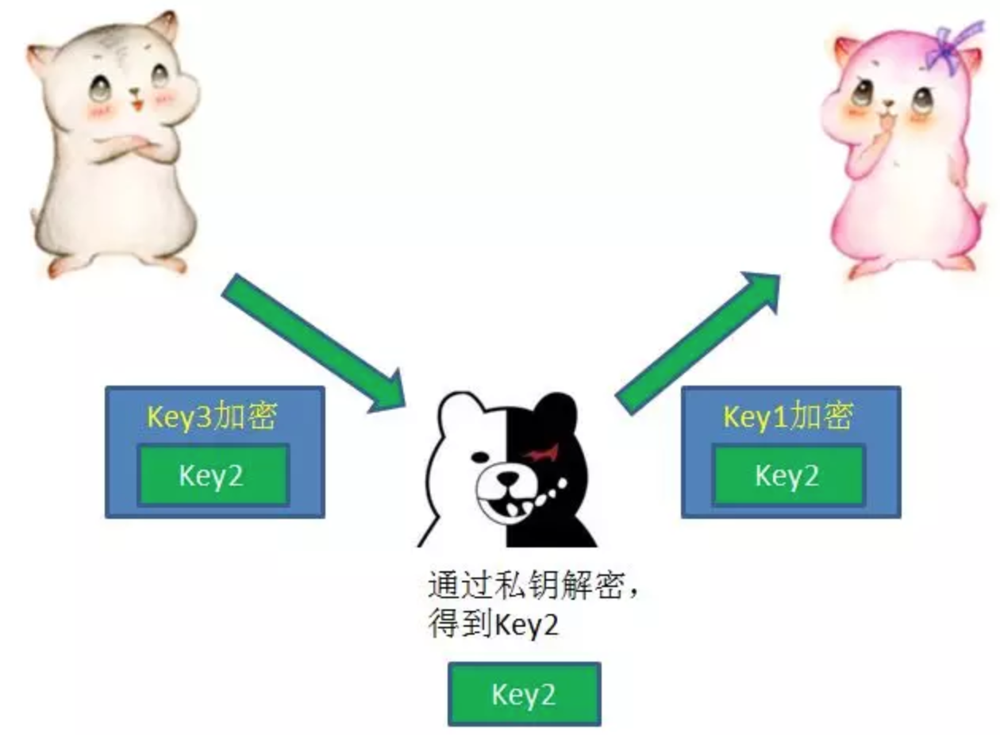
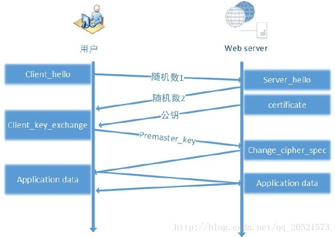

## https原理

一、什么是HTTP协议？

HTTP协议全称Hyper Text Transfer Protocol，翻译过来就是超文本传输协议，位于TCP/IP四层模型当中的应用层。


HTTP协议通过请求/响应的方式，在客户端和服务端之间进行通信。


这一切看起来很美好，但是HTTP协议有一个致命的缺点：不够安全。

HTTP协议的信息传输完全以明文方式，不做任何加密，相当于是在网络上“裸奔”。这样会导致什么问题呢？让我们打一个比方：

小灰是客户端，小灰的同事小红是服务端，有一天小灰试图给小红发送请求。


但是，由于传输信息是明文，这个信息有可能被某个中间人恶意截获甚至篡改。这种行为叫做中间人攻击。


如何进行加密呢？

小灰和小红可以事先约定一种对称加密方式，并且约定一个随机生成的密钥。后续的通信中，信息发送方都使用密钥对信息加密，而信息接收方通过同样的密钥对信息解密。



这样做是不是就绝对安全了呢？并不是。

虽然我们在后续的通信中对明文进行了加密，但是第一次约定加密方式和密钥的通信仍然是明文，如果第一次通信就已经被拦截了，那么密钥就会泄露给中间人，中间人仍然可以解密后续所有的通信内容。

这可怎么办呢？别担心，我们可以使用非对称加密，为密钥的传输做一层额外的保护。

非对称加密的一组秘钥对中，包含一个公钥和一个私钥。明文既可以用公钥加密，用私钥解密；也可以用私钥加密，用公钥解密。

在小灰和小红建立通信的时候，小红首先把自己的公钥Key1发给小灰：


收到小红的公钥以后，小灰自己生成一个用于对称加密的密钥Key2，并且用刚才接收的公钥Key1对Key2进行加密（这里有点绕），发送给小红：



小红利用自己非对称加密的私钥，解开了公钥Key1的加密，获得了Key2的内容。从此以后，两人就可以利用Key2进行对称加密的通信了。


在通信过程中，即使中间人在一开始就截获了公钥Key1，由于不知道私钥是什么，也无从解密。

存在问题:中间人虽然不知道小红的私钥是什么，但是在截获了小红的公钥Key1之后，却可以偷天换日，自己另外生成一对公钥私钥，把自己的公钥Key3发送给小灰。

小灰不知道公钥被偷偷换过，以为Key3就是小红的公钥。于是按照先前的流程，用Key3加密了自己生成的对称加密密钥Key2，发送给小红。

这一次通信再次被中间人截获，中间人先用自己的私钥解开了Key3的加密，获得Key2，然后再用当初小红发来的Key1重新加密，再发给小红。



这样一来，两个人后续的通信尽管用Key2做了对称加密，但是中间人已经掌握了Key2，所以可以轻松进行解密。

这时候，我们有必要引入第三方，一个权威的证书颁发机构（CA）来解决。

到底什么是证书呢？证书包含如下信息：


流程如下：

1. 作为服务端的小红，首先把自己的公钥发给证书颁发机构，向证书颁发机构申请证书。
2. 证书颁发机构自己也有一对公钥私钥。机构利用自己的私钥来加密Key1，并且通过服务端网址等信息生成一个证书签名，证书签名同样经过机构的私钥加密。证书制作完成后，机构把证书发送给了服务端小红。
3. 当小灰向小红请求通信的时候，小红不再直接返回自己的公钥，而是把自己申请的证书返回给小灰。
4. 小灰收到证书以后，要做的第一件事情是验证证书的真伪。需要说明的是，各大浏览器和操作系统已经维护了所有权威证书机构的名称和公钥。所以小灰只需要知道是哪个机构颁布的证书，就可以从本地找到对应的机构公钥，解密出证书签名。

接下来，小灰按照同样的签名规则，自己也生成一个证书签名，如果两个签名一致，说明证书是有效的。

验证成功后，小灰就可以放心地再次利用机构公钥，解密出服务端小红的公钥Key1。

5. 像之前一样，小灰生成自己的对称加密密钥Key2，并且用服务端公钥Key1加密Key2，发送给小红。
6. 最后，小红用自己的私钥解开加密，得到对称加密密钥Key2。于是两人开始用Key2进行对称加密的通信。

二、HTTPS实现原理

在学习HTTPS原理之前我们先了解一下两种加密方式： 对称加密和非对称加密。 对称加密即加密和解密使用同一个密钥，虽然对称加密破解难度很大，但由于对称加密需要在网络上传输密钥和密文，一旦被黑客截取很容就能被破解，因此对称加密并不是一个较好的选择。 

非对称加密即加密和解密使用不同的密钥，分别称为公钥和私钥。我们可以用公钥对数据进行加密，但必须要用私钥才能解密。在网络上只需要传送公钥，私钥保存在服务端用于解密公钥加密后的密文。但是非对称加密消耗的CPU资源非常大，效率很低，严重影响HTTPS的性能和速度。因此非对称加密也不是HTTPS的理想选择。

那么HTTPS采用了怎样的加密方式呢？其实为了提高安全性和效率HTTPS结合了对称和非对称两种加密方式。即客户端使用对称加密生成密钥（key）对传输数据进行加密，然后使用非对称加密的公钥再对key进行加密。因此网络上传输的数据是被key加密的密文和用公钥加密后的密文key，因此即使被黑客截取，由于没有私钥，无法获取到明文key，便无法获取到明文数据。所以HTTPS的加密方式是安全的。

接下来我们以TLS1.2为例来认识HTTPS的握手过程。

* 客户端发送 client_hello，包含一个随机数 random1。 
* 服务端回复 server_hello，包含一个随机数 random2，携带了证书公钥 P。 
* 客户端接收到 random2 之后就能够生成 ```premaster_secrect``` （对称加密的密钥）以及 ```master_secrect```（用```premaster_secret```加密后的数据）。 
* 客户端使用证书公钥 P 将 ```premaster_secrect``` 加密后发送给服务器 (用公钥P对```premaster_secret```加密)。 
* 服务端使用私钥解密得到 ```premaster_secrect```。又由于服务端之前就收到了随机数 1，所以服务端根据相同的生成算法，在相同的输入参数下，求出了相同的 ```master secrect```。



三、数字证书

我们上面提到了HTTPS的工作原理，通过对称加密和非对称加密实现数据的安全传输。我们也知道非对称加密过程需要用到公钥进行加密。那么公钥从何而来？其实公钥就被包含在数字证书中。数字证书通常来说是由受信任的数字证书颁发机构CA，在验证服务器身份后颁发，证书中包含了一个密钥对（公钥和私钥）和所有者识别信息。数字证书被放到服务端，具有服务器身份验证和数据传输加密功能。

除了CA机构颁发的证书之外，还有非CA机构颁发的证书和自签名证书。

非CA机构即是不受信任的机构颁发的证书，理所当然这样的证书是不受信任的。
自签名证书，就是自己给自己颁发的证书。当然自签名证书也是不受信任的。
例如大(chou)名(ming)鼎(zhao)鼎(zhu)的12306网站使用的就是非CA机构颁发的证书（最近发现12306购票页面已经改为CA证书了），12306的证书是由SRCA颁发，SRCA中文名叫中铁数字证书认证中心，简称中铁CA。这是个铁道部自己搞的机构，相当于是自己给自己颁发证书。

说了这么多，我们来总结一下数字证书的两个作用：

> 分发公钥。每个数字证书都包含了注册者生成的公钥。在 TLS握手时会通过 certificate 消息传输给客户端。
> 身份授权。确保客户端访问的网站是经过 CA 验证的可信任的网站。（在自签名证书的情况下可以验证是否是我们自己的服务器）