## java中==和equals和hashCode的区别
java中的数据类型，可分为两类：   
1.基本数据类型，也称原始数据类型。  
  byte,short,char,int,long,float,double,boolean 他们之间的比较，应用双等号（==）,比较的是他们的值。   
2.复合数据类型(类)   
  当他们用（==）进行比较的时候，比较的是他们在内存中的存放地址，所以，除非是同一个new出来的对象，他们的比较后的结果为true，否则比较后结果为false。 JAVA当中所有的类都是继承于Object这个基类的，在Object中的基类中定义了一个equals的方法，这个方法的初始行为是比较对象的内存地址，但在一些类库当中这个方法被覆盖掉了，如String,Integer,Date在这些类当中equals有其自身的实现，而不再是比较类在堆内存中的存放地址了。  
  对于复合数据类型之间进行equals比较，在没有覆写equals方法的情况下，他们之间的比较还是基于他们在内存中的存放位置的地址值的，因为Object的equals方法也是用双等号（==）进行比较的，所以比较后的结果跟双等号（==）的结果相同。  
#### ==
== 比较的是变量(栈)内存中存放的对象的(堆)内存地址，用来判断两个对象的地址是否相同，即是否是指相同一个对象。比较的是真正意义上的指针操作。

1. 比较的是操作符两端的操作数是否是同一个对象。
2. 两边的操作数必须是同一类型的（可以是父子类之间）才能编译通过。
3. 比较的是地址，如果是具体的阿拉伯数字的比较，值相等则为true，如：int a=10 与 long b=10L 与 double c=10.0都是相同的（为true），因为他们都指向地址为10的堆。

#### equals：
1. Object类中默认的实现方式是  :   return this == obj  。那就是说，只有this 和 obj引用同一个对象，才会返回true。
而我们往往需要用equals来判断 2个对象是否等价，而非验证他们的唯一性。这样我们在实现自己的类时，就要重写equals.
按照约定，equals要满足以下规则。
* 自反性:  x.equals(x) 一定是true
* 非空性:  x.equals(null) 一定是false
* 对称性:  x.equals(y)  和  y.equals(x)结果一致
* 传递性:  a 和 b equals , b 和 c  equals，那么 a 和 c也一定equals。
* 一致性:  在某个运行时期间，2个对象的状态的改变不会不影响equals的决策结果，那么，在这个运行时期间，无论调用多少次equals，都返回相同的结果。  
2. equals用来比较的是两个对象的内容是否相等，由于所有的类都是继承自java.lang.Object类的，所以适用于所有对象，如果没有对该方法进行覆盖的话，调用的仍然是

Object类中的方法，而Object中的equals方法返回的却是==的判断。

　　String s="abce"是一种非常特殊的形式,和new 有本质的区别。它是java中唯一不需要new 就可以产生对象的途径。以String s="abce";形式赋值在java中叫直接量,它是在常量池中而不是象new一样放在压缩堆中。这种形式的字符串，在JVM内部发生字符串拘留，即当声明这样的一个字符串后，JVM会在常量池中先查找有有没有一个值为"abcd"的对象,如果有,就会把它赋给当前引用.即原来那个引用和现在这个引用指点向了同一对象,如果没有,则在常量池中新创建一个"abcd",下一次如果有String s1 = "abcd";又会将s1指向"abcd"这个对象,即以这形式声明的字符串,只要值相等,任何多个引用都指向同一对象.  
　　而String s = new String("abcd");和其它任何对象一样.每调用一次就产生一个对象，只要它们调用。  
　　也可以这么理解: String str = "hello"; 先在内存中找是不是有"hello"这个对象,如果有，就让str指向那个"hello".如果内存里没有"hello"，就创建一个新的对象保存"hello". String str=new String ("hello") 就是不管内存里是不是已经有"hello"这个对象，都新建一个对象保存"hello"。  

```java
public class TestString {
 public static void main(String[] args) {
	String s1 = "Monday";
	String s2 = "Monday";
	
	if (s1 == s2){
		System.out.println("s1 == s2");}
	else{
		System.out.println("s1 != s2");}
   }
}
```
编译并运行程序，输出：s1 == s2说明：s1 与 s2 引用同一个 String 对象 -- "Monday"!  
再稍微改动一下程序，会有更奇怪的发现：

```java
public class TestString {
	public static void main(String[] args) {
	String s1 = "Monday";
	String s2 = new String("Monday");
	
	if (s1 == s2){
		System.out.println("s1 == s2");
	}else{
		System.out.println("s1 != s2");
	}
	
	if (s1.equals(s2)) {
		System.out.println("s1 equals s2");
	}else{
		System.out.println("s1 not equals s2");}
	}
}
```
程序输出：  
s1 != s2  
s1 equals s2  
说明：s1 s2分别引用了两个"Monday"String对象  

#### 字符串缓冲池
程序在运行的时候会创建一个字符串缓冲池当使用 s2 = "Monday" 这样的表达是创建字符串的时候，程序首先会在这个String缓冲池中寻找相同值的对象，在第一个程序中，s1先被放到了池中，所以在s2被创建的时候，程序找到了具有相同值的 s1
将s2引用s1所引用的对象"Monday"
第二段程序中，使用了 new 操作符，他明白的告诉程序："我要一个新的！不要旧的！"于是一个新的"Monday"Sting对象被创建在内存中。他们的值相同，但是位置不同。  
再次更改程序： 

```java 
public class TestString {
	public static void main(String[] args) {
	String s1 = "Monday";
	String s2 = new String("Monday");
	s2 = s2.intern();
	
	if (s1 == s2){
		System.out.println("s1 == s2");
	}else{
		System.out.println("s1 != s2");
	}
	
	if (s1.equals(s2)) {
		System.out.println("s1 equals s2");}
	else{
		System.out.println("s1 not equals s2");}
	}
}
```
加入：s2 = s2.intern();  
程序输出：  
s1 == s2  
s1 equals s2  
原 来，（java.lang.String的intern()方法"abc".intern()方法的返回值还是字符串"abc"，表面上看起来好像这个方法没什么用处。但实际上，它做了个小动作：检查字符串池里是否存在"abc"这么一个字符串，如果存在，就返回池里的字符串；如果不存在，该方法会 把"abc"添加到字符串池中，然后再返回它的引用。
#### hashCode：
这个方法返回对象的散列码，返回值是int类型的散列码（将该对象的内部地址转换成一个整数返回）。HashCode的存在主要是为了查找的快捷性，HashCode是用来在散列存储结构中确定对象的存储地址的。例如hashMap就是利用hashcode来计算存入哪一个entry的。  
hashCode方法，一致的约定是：

* 两个对象的hashcode相同，对象不一定是一个对象（equals（Object obj）不一定返回true）。
* 两个对象的hashcode不同，他们一定不equals（equals（Object obj）一定返回false）。
* 如果两个对象的equals相同，，Java运行时环境会认为他们的hashcode一定相等。
* 如果两个对象的equals不同，，hashCode（）不一定返回不同的int数。
* 对于equals和hashcode，如果重写了equals方法，那么也尽量重写hashcode方法。
* 同一对象在执行期间若已经存储在集合中，则不能修改影响hashCode值的相关信息，否则会导致内存泄露问题。

hashCode作用：
Java中的集合（Collection）有两类，一类是List，再有一类是Set。前者集合内的元素是有序的，元素可以重复；后者元素无序，但元素不可重复。  
那么这里就有一个比较严重的问题了：要想保证元素不重复，可两个元素是否重复应该依据什么来判断呢？  
这就是Object.equals方法了。但是，如果每增加一个元素就检查一次，那么当元素很多时，后添加到集合中的元素比较的次数就非常多了。也就是说，如果集合中现在已经有1000个元素，那么第1001个元素加入集合时，它就要调用1000次equals方法。这显然会大大降低效率。     
于是，Java采用了哈希表的原理。    
这样一来，当集合要添加新的元素时，先调用这个元素的hashCode方法，就一下子能定位到它应该放置的物理位置上。   
如果这个位置上没有元素，它就可以直接存储在这个位置上，不用再进行任何比较了；  
如果这个位置上已经有元素了，就调用它的equals方法与新元素进行比较，相同的话就不存，不相同就散列其它的地址。所以这里存在一个冲突解决的问题。这样一来实际调用equals方法的次数就大大降低了，几乎只需要一两次。

在集合操作的时候有如下规则：  
将对象放入到集合中时，首先判断要放入对象的hashcode值与集合中的任意一个元素的hashcode值是否相等，如果不相等直接将该对象放入集合中。如果hashcode值相等，然后再通过equals方法判断要放入对象与集合中的任意一个对象是否相等，如果equals判断不相等，直接将该元素放入到集合中，否则不放入。  
回过来说get的时候，HashMap也先调key.hashCode()算出数组下标，然后看equals如果是true就是找到了，所以就涉及了equals。  
《Effective Java》书中有两条是关于equals和hashCode的：  

覆盖equals时需要遵守的通用约定： 
   
覆盖equals方法看起来似乎很简单，但是如果覆盖不当会导致错误，并且后果相当严重。《Effective Java》一书中提到"最容易避免这类问题的办法就是不覆盖equals方法"

一、不需要覆盖equals的情景
1、类的每个实例本质上都是唯一的
>对于代表活动实体而不是值(value)的类来说确实如此，比如Thread

2、不关心类是否提供了“逻辑相等”的测试功能
>书本上的例子是java.util.Random覆盖equals，以检查两个Random实例是否产生相同的随机数序列，但是设计者并不认为客户需要或者期望这样的功能。在这种情况下，从Object继承得到的equals实现已经足够了

3、父类已经覆盖了equals，从父类继承过来的行为对于子类也是合适的
>例如大多数的Set实现都是从AbstractSet继承equals实现

4、类是私有的或者是包级私有的，可以确定它的equals方法永远不会被调用。在这种情况下，无疑是应该覆盖equals方法的，以防它被以外调用
>这种情况下，只是对equals的一种废弃，并没有新加什么功能

```
@override
public boolean equals(Object obj){
    throw new AssertionError();
}
```	

二、、需要覆盖equals的情景
在覆盖equals方法的时候，你必须要遵守它的通用约定(自反性、对称性、传递性、一致性、非空性)。
如果类具有自己特有的“逻辑相等”概念(不同于对象等同的概念)，而且父类还没有覆盖equals以实现期望行为，这时就需要覆盖equals方法。覆盖equals方法的时候，必须遵守以下通用约定
结合以上要求，得出了以下实现高质量equals方法的诀窍： 
 
1. 使用==符号检查“参数是否为这个对象的引用”。如果是，则返回true。这只不过是一种性能优化，如果比较操作有可能很昂贵，就值得这么做。  
2. 使用instanceof操作符检查“参数是否为正确的类型”。如果不是，则返回false。一般来说，所谓“正确的类型”是指equals方法所在的那个类。  
3. 把参数转换成正确的类型。因为转换之前进行过instanceof测试，所以确保会成功。  
4. 对于该类中的每个“关键”域，检查参数中的域是否与该对象中对应的域相匹配。如果这些测试全部成功，则返回true;否则返回false。  
5. 当编写完成了equals方法之后，检查“对称性”、“传递性”、“一致性”。   


覆盖equals时总要覆盖hashCode    
一个很常见的错误根源在于没有覆盖hashCode方法。在每个覆盖了equals方法的类中，也必须覆盖hashCode方法。如果不这样做的话，就会违反Object.hashCode的通用约定，从而导致该类无法结合所有基于散列的集合一起正常运作，这样的集合包括HashMap、HashSet和Hashtable。  在应用程序的执行期间，只要对象的equals方法的比较操作所用到的信息没有被修改，那么对这同一个对象调用多次，hashCode方法都必须始终如一地返回同一个整数。在同一个应用程序的多次执行过程中，每次执行所返回的整数可以不一致。 如果两个对象根据equals()方法比较是相等的，那么调用这两个对象中任意一个对象的hashCode方法都必须产生同样的整数结果。 如果两个对象根据equals()方法比较是不相等的，那么调用这两个对象中任意一个对象的hashCode方法，则不一定要产生相同的整数结果。但是程序员应该知道，给不相等的对象产生截然不同的整数结果，有可能提高散列表的性能。

String中hashCode为减少hash碰撞采用奇素数31  
之所以选择31，是因为它是个奇素数。如果乘数是偶数，并且乘法溢出的话，信息就会丢失，因为与2相乘等价于移位运算。使用素数的好处并不是很明显，但是习惯上都使用素数来计算散列结果。31有个很好的特性，就是用移位和减法来代替乘法，可以得到更好的性能：31*i==(i<<5)-i。现在的VM可以自动完成这种优化。  
关于奇数，在计算机中，一个数乘偶数表现为该数字左移n位，余位补0，因此可能造成信息丢失。比方说，一个二进制数字X4就可能导致两位数字丢失。1010 0110 -> 10011000  
而奇数则没有这个问题，因为任何一个奇数都可以转换为2的n次方+1，表现在计算机中则是左移n位再加上自己。  
所以我们同样可以选择31进制作为hashCode的一种计算方式。  
[hashCode与equals的作用与区别及使用注意细节](https://blog.csdn.net/lijiecao0226/article/details/24609559)  
面试：[你有没有重写过hashCode与equals方法](http://www.cnblogs.com/JavaArchitect/p/10474448.html)
## int、char、long各占多少字节数
|类型      |字节数       |   位数   | 取值范围 |
| :------ |------:     | :------: |:------:|
| Byte    | 1          | 8        | -2的7次方到2的7次方-1|
| Short   | 2          | 16       |-2的15次方到2的15次方-1|
| Int     | 4          | 32       |-2的31次方到2的31次方-1|
| Long    | 8          | 64       |-2的63次方到2的63次方-1|
| Float   | 4          | 32       |3.402823e+38 ~ 1.401298e-45|
| Double  | 8          | 64       |1.797693e+308~ 4.9000000e-324|
| char    | 2          | 16       |                             |
| boolean | 1(前7位是0) | 1        |0/1|

1. 整型
其中byte、short、int、long都是表示整数的，只不过他们的取值范围不一样 
byte的取值范围为-128~127，占用1个字节（-2的7次方到2的7次方-1） 
short的取值范围为-32768~32767，占用2个字节（-2的15次方到2的15次方-1） 
int的取值范围为（-2147483648~2147483647），占用4个字节（-2的31次方到2的31次方-1） 
long的取值范围为（-9223372036854774808~9223372036854774807），占用8个字节（-2的63次方到2的63次方-1）。
可以看到byte和short的取值范围比较小，而long的取值范围太大，占用的空间多，基本上int可以满足我们的日常的计算了，而且int也是使用的最多的整型类型了。   
在通常情况下，如果JAVA中出现了一个整数数字比如35，那么这个数字就是int型的，如果我们希望它是byte型的，可以在数据后加上大写的 B：35B，表示它是byte型的，同样的35S表示short型，35L表示long型的，表示int我们可以什么都不用加，但是如果要表示long型的，就一定要在数据后面加“L”。
2. 浮点型
float和double是表示浮点型的数据类型，他们之间的区别在于他们的精确度不同 
float 3.402823e+38 ~ 1.401298e-45（e+38表示是乘以10的38次方，同样，e-45表示乘以10的负45次方）占用4个字节 
double 1.797693e+308~ 4.9000000e-324 占用8个字节 
double型比float型存储范围更大，精度更高，所以通常的浮点型的数据在不声明的情况下都是double型的，如果要表示一个数据是float型的，可以在数据后面加上“F”。 
浮点型的数据是不能完全精确的，所以有的时候在计算的时候可能会在小数点最后几位出现浮动，这是正常的。

java中的int的取值范围如何计算  
jdk中定义int占4个字节 ===> 32位(后面全部的计算都是以此为根据的)32位就是jvm仅仅给分配32个格子的空间，用以存放数据。  
而计算机中用0和1存放数据。那么，32个格子中放满0或1的方法就有2的32次方种。所以，这32个格子中。或者说32位的空间能标识10进制的数字：

1. 最小:  


2. 最大：


第一种推算法：将二进制最大的数字（32个1）转换成10进制，即 1×2^0+1×2^1+1×2^2+...+1×2^31=2×2^32-1=4294967295；  
另外一种推算法：既然有2的32次方种算法，那么依照10进制最大的数就是2的32次方-1。即4294967296。  
不过，这样的计算的是无符号。即正数。可是java中int有正负之分。所以32个格子中占用一个格子标识正负。所以仅仅能用31个格子来标识数值：  
  
其中，x为0、1来标识正负。  
最大数字：因为第一个表示符号位，那么最大值就为：1×2^0+1×2^1+1×2^2+...+1×2^30=2×2^31-1=2147483647； 
最小数字：因为第一个表示符号位，那么最小数字表示为：10000000000000000000000000000000，由于为负数则先取反码（当前值取反）11111111111111111111111111111111,再取补码(反码加1)10000000000000000000000000000000，那么最小值就为：-1×2^31+0×2^31+...+0×2^0=-2^31=-2147483648；
即最后int能标识的最大/最小数字是：-2147483648~~+ 2147483647，即，-2^31~~2^31-1。

在Java中整型、实型、字符型被视为简单数据类型，这些类型由低级到高级分别为：  
(byte，short，char)--int--long--float--double  
注意，整数比浮点数低级。低级到高级可以自动转换。而高级到低级需要用代码强制转换，不强转会编译错误。  
## int与integer的区别
#### 区别：
1. Integer是int的包装类，int则是java的一种基本数据类型 
2. Integer变量必须实例化后才能使用，而int变量不需要 
3. Integer实际是对象的引用，当new一个Integer时，实际上是生成一个指针指向此对象；而int则是直接存储数据值 
4. Integer的默认值是null，int的默认值是0

#### 自动拆装箱：
#### #基本数据类型
基本类型，或者叫做内置类型，是Java中不同于类(Class)的特殊类型。它们是我们编程中使用最频繁的类型。  
Java是一种强类型语言，第一次申明变量必须说明数据类型，第一次变量赋值称为变量的初始化。  
Java基本类型共有八种，基本类型可以分为三类：
>字符类型char  
>布尔类型boolean  
>数值类型byte、short、int、long、float、double  

数值类型又可以分为整数类型byte、short、int、long和浮点数类型float、double。  
Java中的数值类型不存在无符号的，它们的取值范围是固定的，不会随着机器硬件环境或者操作系统的改变而改变。  
实际上，Java中还存在另外一种基本类型void，它也有对应的包装类 java.lang.Void，不过我们无法直接对它们进行操作。
###### 基本数据类型有什么好处
在Java语言中，new一个对象是存储在堆里的，我们通过栈中的引用来使用这些对象；所以，对象本身来说是比较消耗资源的。  
对于经常用到的类型，如int等，如果我们每次使用这种变量的时候都需要new一个Java对象的话，就会比较笨重。所以，和C++一样，Java提供了基本数据类型，这种数据的变量不需要使用new创建，他们不会在堆上创建，而是直接在栈内存中存储，因此会更加高效。
##### 包装类型
Java语言是一个面向对象的语言，但是Java中的基本数据类型却是不面向对象的，这在实际使用时存在很多的不便，为了解决这个不足，在设计类时为每个基本数据类型设计了一个对应的类进行代表，这样八个和基本数据类型对应的类统称为包装类(Wrapper Class)。  
包装类均位于java.lang包，包装类和基本数据类型的对应关系如下表所示： 
 
|基本数据类型|包装类     |
|:------:  |:------:  |
|byte      |Byte      |
|boolean   |Boolean   |
|short     |Short     |
|char      |Character |
|int       |Integer   |
|float     |Float     |
|double    |Double    |
在这八个类名中，除了Integer和Character类以后，其它六个类的类名和基本数据类型一致，只是类名的第一个字母大写即可。
####### 为什么需要包装类
很多人会有疑问，既然Java中为了提高效率，提供了八种基本数据类型，为什么还要提供包装类呢？  
这个问题，其实前面已经有了答案，因为Java是一种面向对象语言，很多地方都需要使用对象而不是基本数据类型。比如，在集合类中，我们是无法将int 、double等类型放进去的。因为集合的容器要求元素是Object类型。  
为了让基本类型也具有对象的特征，就出现了包装类型，它相当于将基本类型“包装起来”，使得它具有了对象的性质，并且为其添加了属性和方法，丰富了基本类型的操作。
#####拆箱与装箱
那么，有了基本数据类型和包装类，肯定有些时候要在他们之间进行转换。比如把一个基本数据类型的int转换成一个包装类型的Integer对象。  
我们认为包装类是对基本类型的包装，所以，把基本数据类型转换成包装类的过程就是打包装，英文对应于boxing，中文翻译为装箱。  
反之，把包装类转换成基本数据类型的过程就是拆包装，英文对应于unboxing，中文翻译为拆箱。  
在Java SE5之前，要进行装箱，可以通过以下代码：

```java
Integer i = new Integer(10);
```
##### 自动拆箱与自动装箱
在Java SE5以后，为了减少开发人员的工作，Java提供了自动拆箱与自动装箱功能。  
自动装箱: 就是将基本数据类型自动转换成对应的包装类。  
自动拆箱：就是将包装类自动转换成对应的基本数据类型。  

```java
Integer i =10;  //自动装箱
int b= i;     //自动拆箱
```
<font color=red > Integer i=10</font> 可以替代 <font color=red >Integer i = new Integer(10)</font>，这就是因为Java帮我们提供了自动装箱的功能，不需要开发者手动去new一个Integer对象。
##### 自动拆箱与自动装箱的实现原理
源代码：

```java
public static  void main(String[]args){
    Integer integer=1; //装箱
    int i=integer; //拆箱
}
```
反编译后得到的字节码：

```java
public static void main(String[] paramArrayOfString) {
    Integer localInteger = Integer.valueOf(1);
    int i = localInteger.intValue();
}
```
从上面反编译后的代码可以看出，int的自动装箱都是通过<font color = red>Integer.valueOf()</font>方法来实现的，Integer的自动拆箱都是通过<font color=red >integer.intValue</font>来实现的。  
通过对八大基本类型的反编译可以发现：
>自动装箱都是通过包装类的<font color=red>valueOf()</font>方法来实现的.自动拆箱都是通过包装类对象的<font color= red>xxxValue()</font>来实现的。

##### 哪些地方会自动拆装箱
###### 场景一、将基本数据类型放入集合类
我们知道，Java中的集合类只能接收对象类型，但是下面代码却不报错

```java
List<Integer> li = new ArrayList<>();
for (int i = 1; i < 50; i ++){
    li.add(i);
}
```
反编译上面代码

```java
List<Integer> li = new ArrayList<>();
for (int i = 1; i < 50; i += 2){
    li.add(Integer.valueOf(i));
}
```
以上，我们可以得出结论，当我们把基本数据类型放入集合类中的时候，会进行自动装箱。
###### 场景二、包装类型和基本类型的大小比较
对Integer对象与基本类型进行大小比较的时候，实际上比较的是什么内容

```java
Integer a=1;
System.out.println(a==1?"等于":"不等于");
Boolean bool=false;
System.out.println(bool?"真":"假");
```
反编译上面代码

```java
Integer a=1;
System.out.println(a.intValue()==1?"等于":"不等于");
Boolean bool=false;
System.out.println(bool.booleanValue?"真":"假");
```
可以看到，包装类与基本数据类型进行比较运算，是先将包装类进行拆箱成基本数据类型，然后进行比较的。
###### 场景三、包装类型的运算
我们对Integer对象进行四则运算的时候，是如何进行的呢？看以下代码：

```java
Integer i = 10;
Integer j = 20;
System.out.println(i+j);
```
反编译后代码如下：

```java
Integer i = Integer.valueOf(10);
Integer j = Integer.valueOf(20);
System.out.println(i.intValue() + j.intValue());
```
我们发现，两个包装类型之间的运算，会被自动拆箱成基本类型进行。
###### 场景四、三目运算符的使用
这是很多人不知道的一个场景，作者也是一次线上的血淋淋的Bug发生后才了解到的一种案例。看一个简单的三目运算符的代码：

```java
boolean flag = true;
Integer i = 0;
int j = 1;
int k = flag ? i : j;
```
很多人不知道，其实在int k = flag ? i : j;这一行，会发生自动拆箱。反编译后代码如下：

```java
boolean flag = true;
Integer i = Integer.valueOf(0);
int j = 1;
int k = flag ? i.intValue() : j;
System.out.println(k);
```
这其实是三目运算符的语法规范。当第二，第三位操作数分别为基本类型和对象时，其中的对象就会拆箱为基本类型进行操作。  
因为例子中，flag ? i : j;片段中，第二段的i是一个包装类型的对象，而第三段的j是一个基本类型，所以会对包装类进行自动拆箱。如果这个时候i的值为null，那么久会发生NPE。[自动拆箱导致空指针异常](http://www.hollischuang.com/archives/435)
###### 场景五、函数参数与返回值
这个比较容易理解，直接上代码了：

```java
//自动拆箱
public int getNum1(Integer num) {
 return num;
}
//自动装箱
public Integer getNum2(int num) {
 return num;
}
```
##### 自动拆箱与缓存
Java SE的自动拆装箱还提供了一个和缓存有关的功能,首先看如下代码：

```java
public static void main(String[] args) {

    Integer integer = new Integer(3);
    Integer integer0 = new Integer(3);

    Integer integer1 = 3;
    Integer integer2 = 3;

    if (integer == integer0) System.out.println("integer == integer0");
    else System.out.println("integer != integer0");

    if (integer1 == integer2) System.out.println("integer1 == integer2");
    else System.out.println("integer1 != integer2");

    Integer integer3 = 300;
    Integer integer4 = 300;

    if (integer3 == integer4) System.out.println("integer3 == integer4");
    else System.out.println("integer3 != integer4");
  }
```
我们普遍认为上面的三个判断的结果都是false。虽然比较的值是相等的，但是由于比较的是对象，而对象的引用不一样，所以会认为三个if判断都是false的。在Java中，==比较的是对象应用，而equals比较的是值。所以，在这个例子中，不同的对象有不同的引用，所以在进行比较的时候都将返回false。奇怪的是，这里三个类似的if条件判断返回不同的布尔值。

上面这段代码真正的输出结果：

```java
integer != integer0
integer1 == integer2
integer3 != integer4
```
原因就和Integer中的缓存机制有关。在Java 5中，在Integer的操作上引入了一个新功能来节省内存和提高性能。整型对象通过使用相同的对象引用实现了缓存和重用。
>适用于整数值区间-128 至 +127。  
>只适用于自动装箱。使用构造函数创建对象不适用。

具体实现参考[Java中整型的缓存机制](http://www.hollischuang.com/archives/1174)  
我们只需要知道，当需要进行自动装箱时，如果数字在-128至127之间时，会直接使用缓存中的对象，而不是重新创建一个对象。  
其中的javadoc详细的说明了缓存支持-128到127之间的自动装箱过程。最大值127可以通过-XX:AutoBoxCacheMax=size修改。  
实际上这个功能在Java 5中引入的时候,范围是固定的-128 至 +127。后来在Java 6中，可以通过java.lang.Integer.IntegerCache.high设置最大值。  
这使我们可以根据应用程序的实际情况灵活地调整来提高性能。到底是什么原因选择这个-128到127范围呢？因为这个范围的数字是最被广泛使用的。 在程序中，第一次使用Integer的时候也需要一定的额外时间来初始化这个缓存。
##### 自动拆装箱带来的问题
1. 包装对象的数值比较，不能简单的使用==，虽然-128到127之间的数字可以，但是这个范围之外还是需要使用equals比较。
2. 有些场景会进行自动拆装箱，同时也说过，由于自动拆箱，如果包装类对象为null，那么自动拆箱时就有可能抛出NPE。
3. 如果一个for循环中有大量拆装箱操作，会浪费很多资源。

## string 转换成 integer的方式及原理
内部源码

1. Integer.parseInt（String str）方法

```java
public static int parseInt(String s) throws NumberFormatException {
        return parseInt(s,10);
}
```

2. Integer.parseInt（String s, int radix）方法

```java
public static int parseInt(String s, int radix)
                throws NumberFormatException
    {
        /*
         * WARNING: This method may be invoked early during VM initialization
         * before IntegerCache is initialized. Care must be taken to not use
         * the valueOf method.
         */
         // 下面三个判断好理解，其中表示进制的 radix 要在（2~36）范围内
        //判断字符是否为null
        if (s == null) {
            throw new NumberFormatException("s == null");
        }
        //基数是否小于最小进制
        if (radix < Character.MIN_RADIX) {
            throw new NumberFormatException("radix " + radix +
                                            " less than Character.MIN_RADIX");
        }
        //基数是否大于最大进制
        if (radix > Character.MAX_RADIX) {
            throw new NumberFormatException("radix " + radix +
                                            " greater than Character.MAX_RADIX");
        }

		 // 表示结果， 在下面的计算中会一直是个负数， 
		 // 假如说 我们的字符串是一个正数  "7" ， 
		 // 那么在返回这个值之前result保存的是 -7，
		 // 这个可能是为了保持正数和负数在下面计算的一致性
        int result = 0;
        //是否时负数
        boolean negative = false;
        //char字符下标和s长度
        int i = 0, len = s.length();
        //限制  
        //Integer.MAX_VALUE   2147483647
        //Integer.MIN_VALUE   -2147483648
        
        //limit 默认初始化为 最大正整数的  负数 ，假如字符串表示的是正数，
	     //那么result(在返回之前一直是负数形式)就必须和这个最大正数的负数来比较，判断是否溢出
        int limit = -Integer.MAX_VALUE;
        int multmin;
        int digit;
        //判断字符长度是否大于0，否则抛出异常
        if (len > 0) {
            // 首先是对第一个位置判断，是否含有正负号
            char firstChar = s.charAt(0);
            //根据ascii码表看出加号(43)和负号(45)对应的
            //十进制数小于‘0’(48)的
            if (firstChar < '0') { // Possible leading "+" or "-"
                //是负号
                if (firstChar == '-') {
                    //负号属性设置为true
                    negative = true;
                    // 这里，在负号的情况下，判断溢出的值就变成了 整数的 最小负数了。
                    limit = Integer.MIN_VALUE;
                }
                //不是负号也不是加号则抛出异常
                else if (firstChar != '+')
                    throw NumberFormatException.forInputString(s);
                //如果有符号（加号或者减号）且字符串长度为1，则抛出异常
                if (len == 1) // Cannot have lone "+" or "-"
                    throw NumberFormatException.forInputString(s);
                i++;
            }
            multmin = limit / radix;
            
            // 这个是用来判断当前的 result 在接受下一个字符串位置的数字后会不会溢出。
		     //	原理很简单，为了方便，拿正数来说
		     //	（multmin result 在计算中都是负数），假如是10
		     // 进制,假设最大的10进制数是 21，那么multmin = 21/10 = 2, 
		     //	如果我此时的 result 是 3 ，下一个字符c来了，result即将变成
	 	     // result = result * 10 + c;那么这个值是肯定大于 21 ，即溢出了，
	        //	这个溢出的值在 int里面是保存不了的，不可能先计算出
		    // result（此时的result已经不是溢出的那个值了） 后再去与最大值比较。
		    // 所以要通过先比较  result < multmin   （说明result * radix 后还比 limit 小）

            
            while (i < len) {
                // Accumulating negatively avoids surprises near MAX_VALUE
                //返回指定基数中字符表示的数值。（此处是十进制数值）
                digit = Character.digit(s.charAt(i++),radix);
                //小于0，则为非radix进制数
                if (digit < 0) {
                    throw NumberFormatException.forInputString(s);
                }
                //这里是为了保证下面计算不会超出最大值
                // 这里就是上说的判断溢出，由于result统一用负值来计算，所以用了 小于 号
		         // 从正数的角度看就是   reslut > mulmin  下一步reslut * radix 肯定是 溢出了
                if (result < multmin) {
                    throw NumberFormatException.forInputString(s);
                }
                result *= radix;
                // 这里也是判断溢出， 由于是负值来判断，相当于 （-result + digit）> - limit
		         // 但是不能用这种形式，如果这样去比较，那么得出的值是肯定判断不出溢出的。
		         // 所以用    result < limit + digit    很巧妙
                if (result < limit + digit) {
                    throw NumberFormatException.forInputString(s);
                }
                result -= digit;
            }
        } else {
            throw NumberFormatException.forInputString(s);
        }
        //根据上面得到的是否负数，返回相应的值
        return negative ? result : -result;
    }
```

```java
public static int digit(int codePoint, int radix) {
		//进制必须再最大和最小基数之间（2~36）
        if (radix < MIN_RADIX || radix > MAX_RADIX) {
            return -1;
        }
        
        ASCII范围（0~127）
        if (codePoint < 128) {
            // Optimized for ASCII
            int result = -1;
            //字符在0-9字符之间
            if ('0' <= codePoint && codePoint <= '9') {
                result = codePoint - '0';
            } else if ('a' <= codePoint && codePoint <= 'z') {//字符在a-z之间
                result = 10 + (codePoint - 'a');
            } else if ('A' <= codePoint && codePoint <= 'Z') {//字符在A-Z之间
                result = 10 + (codePoint - 'A');
            }
            //通过判断result和进制大小，输出对应值
            //通过我们parseInt对应的基数值为10，
            //所以，只能在第一个判断（字符在0-9字符之间）
            //中得到result值 否则后续程序会抛出异常
            return result < radix ? result : -1;
        }
        return digitImpl(codePoint, radix);
    }
```
<font color=red >__*总结：*__</font>  

* parseInt(String s)--内部调用parseInt(s,10)（默认为10进制）==将字符串的值转化成10进制int值
* 正常判断null，进制范围，length等
* 通过ascii码，判断第一个字符是否是符号位
* 循环遍历确定每个字符的十进制值
* 通过*= 和-= 进行计算拼接
* 判断是否为负值 返回结果。


## 探探对java多态的理解
#### 面向对象编程有三大特性：封装、继承、多态。
#### #封装
封装从字面上来理解就是包装的意思，专业点就是信息隐藏，是指利用抽象数据类型将数据和基于数据的操作封装在一起，使其构成一个不可分割的独立实体，数据被保护在抽象数据类型的内部，尽可能地隐藏内部的细节，只保留一些对外接口使之与外部发生联系。系统的其他对象只能通过包裹在数据外面的已经授权的操作来与这个封装的对象进行交流和交互。也就是说用户是无需知道对象内部的细节（当然也无从知道），但可以通过该对象对外的提供的接口来访问该对象。  
对于封装而言，一个对象它所封装的是自己的属性和方法，所以它是不需要依赖其他对象就可以完成自己的操作。  
使用封装有4大好处：  

* 良好的封装能够减少耦合。
* 类内部的结构可以自由修改。
* 可以对成员进行更精确的控制。
* 隐藏信息，实现细节。  
eg:

```java
public class Husband {
    
    /*
     * 对属性的封装
     * 一个人的姓名、性别、年龄、妻子都是这个人的私有属性
     */
    private String name ;
    private String sex ;
    private int age ;
    private Wife wife;
    
    /*
     * setter()、getter()是该对象对外开发的接口
     */
    public String getName() {
        return name;
    }

    public void setName(String name) {
        this.name = name;
    }

    public String getSex() {
        return sex;
    }

    public void setSex(String sex) {
        this.sex = sex;
    }

    public int getAge() {
        return age;
    }

    public void setAge(int age) {
        this.age = age;
    }

    public void setWife(Wife wife) {
        this.wife = wife;
    }
}


public class Wife {
    private String name;
    private int age;
    private String sex;
    private Husband husband;

    public String getName() {
        return name;
    }

    public void setName(String name) {
        this.name = name;
    }

    public String getSex() {
        return sex;
    }

    public void setSex(String sex) {
        this.sex = sex;
    }

    public void setAge(int age) {
        this.age = age;
    }

    public void setHusband(Husband husband) {
        this.husband = husband;
    }

    public Husband getHusband() {
        return husband;
    }
    
}
```
从上面两个实例我们可以看出Husband里面wife引用是没有getter()的，同时wife的age也是没有getter()方法的。  
所以封装把一个对象的属性私有化，同时提供一些可以被外界访问的属性的方法，如果不想被外界方法，我们大可不必提供方法给外界访问。但是如果一个类没有提供给外界访问的方法，那么这个类也没有什么意义了。比如我们将一个房子看做是一个对象，里面的漂亮的装饰，如沙发、电视剧、空调、茶桌等等都是该房子的私有属性，但是如果我们没有那些墙遮挡，是不是别人就会一览无余呢？没有一点儿隐私！就是存在那个遮挡的墙，我们既能够有自己的隐私而且我们可以随意的更改里面的摆设而不会影响到其他的。但是如果没有门窗，一个包裹的严严实实的黑盒子，又有什么存在的意义呢？所以通过门窗别人也能够看到里面的风景。所以说门窗就是房子对象留给外界访问的接口。  
通过这个我们还不能真正体会封装的好处。现在我们从程序的角度来分析封装带来的好处。如果我们不使用封装，那么该对象就没有setter()和getter()，那么Husband类应该这样写：  

```java 
public class Husband {
    public String name ;
    public String sex ;
    public int age ;
    public Wife wife;
}
```
我们应该这样来使用它：

```java
Husband husband = new Husband();
        husband.age = 30;
        husband.name = "张三";
        husband.sex = "男";    //貌似有点儿多余
```
但是那天如果我们需要修改Husband，例如将age修改为String类型的呢？你只有一处使用了这个类还好，如果你有几十个甚至上百个这样地方，你是不是要改到崩溃。如果使用了封装，我们完全可以不需要做任何修改，只需要稍微改变下Husband类的setAge()方法即可。
到了这里我们确实可以看出，封装确实可以使我们容易地修改类的内部实现，而无需修改使用了该类的客户代码。
我们在看这个好处：可以对成员变量进行更精确的控制。  
还是那个Husband，一般来说我们在引用这个对象的时候是不容易出错的，但是有时你迷糊了，写成了这样：
  
```java
Husband husband = new Husband();
husband.age = 300;
```
也许你是因为粗心写成了，你发现了还好，如果没有发现那就麻烦大了，逼近谁见过300岁的老妖怪啊！但是使用封装我们就可以避免这个问题，我们对age的访问入口做一些控制(setter)如：

```java
public void setAge(int age) {
        if(age > 120){
            System.out.println("ERROR：error age input....");    //提示錯誤信息
        }else{
            this.age = age;
        }
        
    }
```
##### 继承
在《Java编程思想》中有这样一句话：复用代码是Java众多引人注目的功能之一。但要想成为极具革命性的语言，仅仅能够复制代码并对加以改变是不够的，它还必须能够做更多的事情。在这句话中最引人注目的是"复用代码",尽可能的复用代码使我们程序员一直在追求的，现在我来介绍一种复用代码的方式，也是java三大特性之一---继承。
###### 概念
<font color=blue> 继承是使用已存在的类的定义作为基础建立新类的技术，新类的定义可以增加新的数据或新的功能，也可以用父类的功能，但不能选择性地继承父类。</font>通过使用继承我们能够非常方便地复用以前的代码，能够大大的提高开发的效率。  
继承所描述的是"is-a"的关系，如果有两个对象A和B，若可以描述为“A是B”，则可以表示A继承B，其中B是被继承者称之为父类或者超类，A是继承者称之为子类或者派生类。  
实际上继承者是被继承者的特殊化，它除了拥有被继承者的特性外，还拥有自己独有得特性。例如猫有抓老鼠、爬树等其他动物没有的特性。同时在继承关系中，继承者完全可以替换被继承者，反之则不可以，例如我们可以说猫是动物，但不能说动物是猫就是这个道理，其实对于这个我们将其称之为"向上转型"。
<font color=blue>继承定义了类如何相互关联，共享特性。</font>对于若干个相同或者相似的类，我们可以抽象出他们共有的行为或者属相并将其定义成一个父类或者超类，然后用这些类继承该父类，他们不仅可以拥有父类的属性、方法还可以定义自己独有的属性或者方法。  
同时在使用继承时需要记住三句话：

1. 子类拥有父类非private的属性和方法。
2. 子类可以拥有自己属性和方法，即子类可以对父类进行扩展。
3. 子类可以用自己的方式实现父类的方法。  
  
<font color=red size=5 >**_总结：_**</font>使用继承确实有许多的优点，除了将所有子类的共同属性放入父类，实现代码共享，避免重复外，还可以使得修改扩展继承而来的实现比较简单。  
###### 构造器
构造器而言，它只能够被调用，而不能被继承。调用父类的构造方法我们使用super()即可。  
对于子类而已,其构造器的正确初始化是非常重要的,而且当且仅当只有一个方法可以保证这点：在构造器中调用父类构造器来完成初始化，而父类构造器具有执行父类初始化所需要的所有知识和能力。

```java
public class Person {
    protected String name;
    protected int age;
    protected String sex;
    
    Person(){
        System.out.println("Person Constrctor...");
    }
}

public class Husband extends Person{
    private Wife wife;

    Husband(){
        System.out.println("Husband Constructor...");
    }
    
    public static void main(String[] args) {
        Husband husband  = new Husband();
    }
}

Output:
Person Constrctor...
Husband Constructor...
```
通过这个示例可以看出，构建过程是从父类“向外”扩散的，也就是从父类开始向子类一级一级地完成构建。而且我们并没有显示的引用父类的构造器，这就是java的聪明之处：编译器会默认给子类调用父类的构造器。  
但是，这个默认调用父类的构造器是有前提的：父类有默认构造器。如果父类没有默认构造器，我们就要必须显示的使用super()来调用父类构造器，否则编译器会报错：无法找到符合父类形式的构造器。

```java
public class Person {
    protected String name;
    protected int age;
    protected String sex;
    
    Person(String name){
        System.out.println("Person Constrctor-----" + name);
    }
}

public class Husband extends Person{
    private Wife wife;

    Husband(){
        super("chenssy");
        System.out.println("Husband Constructor...");
    }
    
    public static void main(String[] args) {
        Husband husband  = new Husband();
    }
}

Output:
Person Constrctor-----chenssy
Husband Constructor...
```
<font color=red size=5>**_总结：_**</font>对于继承，子类会默认调用父类的构造器，但是如果没有默认的父类构造器，子类必须要显示的指定父类的构造器，而且必须是在子类构造器中做的第一件事(第一行代码)。
###### protected
尽管可以使用protected访问修饰符来限制父类属性和方法的访问权限，但是最好的方式还是<font color=blue>将属性保持为private(我们应当一致保留更改底层实现)，通过protected方法来控制类的继承者的访问权限。</font>
###### 向上转型
在上面的继承中我们谈到继承是is-a的相互关系，猫继承与动物，所以我们可以说猫是动物，或者说猫是动物的一种。这样将猫看做动物就是向上转型。如下：

```java
public class Person {
    public void display(){
        System.out.println("Play Person...");
    }
    
    static void display(Person person){
        person.display();
    }
}

public class Husband extends Person{
    public static void main(String[] args) {
        Husband husband = new Husband();
        Person.display(husband);      //向上转型
    }
}
```
在这我们通过Person.display(husband)。这句话可以看出husband是person类型。  
将子类转换成父类，在继承关系上面是向上移动的，所以一般称之为向上转型。由于向上转型是从一个叫专用类型向较通用类型转换，所以它总是安全的，唯一发生变化的可能就是属性和方法的丢失。这就是为什么编译器在"未曾明确表示转型"或者"未曾指定特殊标记"的情况下，仍然允许向上转型的原因。
###### <font color=red>谨慎继承</font>
继承存在如下缺陷：

* 父类变，子类就变。
* 继承破坏了封装。
* 继承是一种强制耦合关系。  

《Java编程思想》中提供了解决办法：问一问自己是否需要从子类向父类进行向上转型。如果必须向上转型，则继承是必要的，但是如果不需要，则应当好好考虑自己是否需要继承。
##### 多态
1. 封装隐藏了类的内部实现机制，可以在不影响使用的情况下改变类的内部结构，同时也保护了数据。对外界而已它的内部细节是隐藏的，暴露给外界的只是它的访问方法。
2. 继承是为了重用父类代码。两个类若存在IS-A的关系就可以使用继承，同时继承也为实现多态做了铺垫。
3. 所谓多态就是指程序中定义的引用变量所指向的具体类型和通过该引用变量发出的方法调用在编程时并不确定，而是在程序运行期间才确定，即一个引用变量倒底会指向哪个类的实例对象，该引用变量发出的方法调用到底是哪个类中实现的方法，必须在由程序运行期间才能决定。因为在程序运行时才确定具体的类，所以不用修改源程序代码，就可以让引用变量绑定到各种不同的类实现上，从而导致该引用调用的具体方法随之改变，即不修改程序代码就可以改变程序运行时所绑定的具体代码，让程序可以选择多个运行状态，这就是多态性。 
 
eg:  
比如你是一个酒神，对酒情有独钟。某日回家发现桌上有几个杯子里面都装了白酒，从外面看我们是不可能知道这是些什么酒，只有喝了之后才能够猜出来是何种酒。你一喝，这是剑南春、再喝这是五粮液、再喝这是酒鬼酒….在这里我们可以描述成如下：  
酒 a = 剑南春  
酒 b = 五粮液  
酒 c = 酒鬼酒  
...   
这里所表现的的就是多态。剑南春、五粮液、酒鬼酒都是酒的子类，我们只是通过酒这一个父类就能够引用不同的子类，这就是多态——我们只有在运行的时候才会知道引用变量所指向的具体实例对象。  
要理解多态我们就必须要明白什么是"向上转型"。在继承中简单介绍了向上转型，这里就在啰嗦下：在上面的喝酒例子中，酒（Win）是父类，剑南春（JNC）、五粮液（WLY）、酒鬼酒（JGJ）是子类。我们定义如下代码：  
JNC a = new  JNC();  
对于这个代码我们非常容易理解无非就是实例化了一个剑南春的对象嘛！但是这样呢？    
Wine a = new JNC();  
在这里我们这样理解，这里定义了一个Wine 类型的a，它指向JNC对象实例。由于JNC是继承与Wine，所以JNC可以自动向上转型为Wine，所以a是可以指向JNC实例对象的。这样做存在一个非常大的好处，在继承中我们知道子类是父类的扩展，它可以提供比父类更加强大的功能，如果我们定义了一个指向子类的父类引用类型，那么它除了能够引用父类的共性外，还可以使用子类强大的功能。  
但是向上转型存在一些缺憾，那就是它必定会导致一些方法和属性的丢失，而导致我们不能够获取它们。所以<font color=blue>父类类型的引用可以调用父类中定义的所有属性和方法，对于只存在与子类中的方法和属性它就望尘莫及了。</font>

```java
public class Wine {
    public void fun1(){
        System.out.println("Wine 的Fun.....");
        fun2();
    }
    
    public void fun2(){
        System.out.println("Wine 的Fun2...");
    }
}

public class JNC extends Wine{
    /**
     * @desc 子类重载父类方法
     *        父类中不存在该方法，向上转型后，父类是不能引用该方法的
     * @param a
     * @return void
     */
    public void fun1(String a){
        System.out.println("JNC 的 Fun1...");
        fun2();
    }
    
    /**
     * 子类重写父类方法
     * 指向子类的父类引用调用fun2时，必定是调用该方法
     */
    @Override
    public void fun2(){
        System.out.println("JNC 的Fun2...");
    }
}

public class Test {
    public static void main(String[] args) {
        Wine a = new JNC();
        a.fun1();
    }
}
-------------------------------------------------
Output:
Wine 的Fun.....
JNC 的Fun2...
```
分析：在这个程序中子类JNC重载了父类Wine的方法fun1()，重写fun2()，而且重载后的fun1(String a)与 fun1()不是同一个方法，由于父类中没有该方法，向上转型后会丢失该方法，所以执行JNC的Wine类型引用是不能引用fun1(String a)方法。而子类JNC重写了fun2() ，那么指向JNC的Wine引用会调用JNC中fun2()方法。  
<font color=red size=5>**_总结：_**</font>指向子类的父类引用由于向上转型了，它只能访问父类中拥有的方法和属性，而对于子类中存在而父类中不存在的方法，该引用是不能使用的，即使是重载该方法。若子类重写了父类中的某些方法，在调用该些方法的时候，必定是使用子类中定义的这些方法（动态连接、动态调用）。  
对于面向对象而已，多态分为编译时多态和运行时多态。其中编辑时多态是静态的，主要是指方法的重载，它是根据参数列表的不同来区分不同的函数，通过编辑之后会变成两个不同的函数，在运行时谈不上多态。而运行时多态是动态的，它是通过动态绑定来实现的，也就是我们所说的多态性。
###### 多态实现

1. 实现条件  
继承在为多态的实现做了准备。子类Child继承父类Father，我们可以编写一个指向子类的父类类型引用，该引用既可以处理父类Father对象，也可以处理子类Child对象，当相同的消息发送给子类或者父类对象时，该对象就会根据自己所属的引用而执行不同的行为，这就是多态。即多态性就是相同的消息使得不同的类做出不同的响应。  
<font color=blue>Java实现多态有三个必要条件：继承、重写、向上转型。</font>

* 继承：在多态中必须存在有继承关系的子类和父类。
* 重写：子类对父类中某些方法进行重新定义，在调用这些方法时就会调用子类的方法。
* 向上转型：在多态中需要将子类的引用赋给父类对象，只有这样该引用才能够具备技能调用父类的方法和子类的方法。    
只有满足了上述三个条件，我们才能够在同一个继承结构中使用统一的逻辑实现代码处理不同的对象，从而达到执行不同的行为。
    
对于Java而言，它多态的实现机制遵循一个原则：<font color=blue>当超类对象引用变量引用子类对象时，<font color=red>是被引用对象的类型而不是引用变量的类型决定了调用谁的成员方法，</font>但是这个被调用的方法必须是在超类中定义过的，也就是说被子类覆盖的方法。</font>

2. 实现形式
在Java中有两种形式可以实现多态。继承和接口。

* 基于继承的实现机制主要表现在父类和继承该父类的一个或多个子类对某些方法的重写，多个子类对同一方法的重写可以表现出不同的行为。

```java
public class Wine {
    private String name;
    
    public String getName() {
        return name;
    }

    public void setName(String name) {
        this.name = name;
    }

    public Wine(){
    }
    
    public String drink(){
        return "喝的是 " + getName();
    }
    
    /**
     * 重写toString()
     */
    @Override
    public String toString(){
        return null;
    }
}

public class JNC extends Wine{
    public JNC(){
        setName("JNC");
    }
    
    /**
     * 重写父类方法，实现多态
     */
    @Override
    public String drink(){
        return "喝的是 " + getName();
    }
    
    /**
     * 重写toString()
     */
    @Override
    public String toString(){
        return "Wine : " + getName();
    }
}

public class JGJ extends Wine{
    public JGJ(){
        setName("JGJ");
    }
    
    /**
     * 重写父类方法，实现多态
     */
    @Override
    public String drink(){
        return "喝的是 " + getName();
    }
    
    /**
     * 重写toString()
     */
    @Override
    public String toString(){
        return "Wine : " + getName();
    }
}

public class Test {
    public static void main(String[] args) {
        //定义父类数组
        Wine[] wines = new Wine[2];
        //定义两个子类
        JNC jnc = new JNC();
        JGJ jgj = new JGJ();
        
        //父类引用子类对象
        wines[0] = jnc;
        wines[1] = jgj;
        
        for(int i = 0 ; i < 2 ; i++){
            System.out.println(wines[i].toString() + "--" + wines[i].drink());
        }
        System.out.println("-------------------------------");

    }
}
OUTPUT:
Wine : JNC--喝的是 JNC
Wine : JGJ--喝的是 JGJ
-------------------------------
```
在上面的代码中JNC、JGJ继承Wine，并且重写了drink()、toString()方法，程序运行结果是调用子类中方法，输出JNC、JGJ的名称，这就是多态的表现。不同的对象可以执行相同的行为，但是他们都需要通过自己的实现方式来执行，这就要得益于向上转型了。  
我们都知道所有的类都继承自超类Object，toString()方法也是Object中方法，当我们这样写时：

```java
Object o = new JGJ();
System.out.println(o.toString());

输出结果：Wine : JGJ
```
Object、Wine、JGJ三者继承链关系是：JGJ—>Wine—>Object。所以我们可以这样说：<font color=blue>当子类重写父类的方法被调用时，只有对象继承链中的最末端的方法才会被调用。</font>但是注意如果这样写：

```java
Object o = new Wine();
System.out.println(o.toString());

输出结果：null
```
输出的结果是null，因为JGJ并不存在于该对象继承链中。  
<font color=red size=5>**_总结：_**</font>对于引用子类的父类类型，在处理该引用时，它适用于继承该父类的所有子类，子类对象的不同，对方法的实现也就不同，执行相同动作产生的行为也就不同。
如果父类是抽象类，那么子类必须要实现父类中所有的抽象方法，这样该父类所有的子类一定存在统一的对外接口，但其内部的具体实现可以各异。这样我们就可以使用顶层类提供的统一接口来处理该层次的方法。

* 基于接口实现的多态

继承是通过重写父类的同一方法的几个不同子类来体现的，那么就可就是通过实现接口并覆盖接口中同一方法的几不同的类来实现。  
在接口的多态中，指向接口的引用必须是指定这实现了该接口的一个类的实例程序，在运行时，根据对象引用的实际类型来执行对应的方法。  
继承都是单继承，只能为一组相关的类提供一致的服务接口。但是接口可以是多继承多实现，它能够利用一组相关或者不相关的接口进行组合与扩充，能够对外提供一致的服务接口。所以它相对于继承来说有更好的灵活性。
###### 经典实例

```java
public class A {
    public String show(D obj) {
      return ("A and D");
    }

    public String show(A obj) {
      return ("A and A");
    }
  }

  public class B extends A {
    public String show(B obj) {
      return ("B and B");
    }

    @Override
    public String show(A obj) {
      return ("B and A");
    }
  }

  public class C extends B {}

  public class D extends B {}

  @Test
  public void test() {
    A a1 = new A();//A
    A a2 = new B();//B
    B b = new B();//B
    C c = new C();//C
    D d = new D();//D
    //c>b>a
    //d>b>a
    System.out.println("1--" + a1.show(b));
    System.out.println("2--" + a1.show(c));
    System.out.println("3--" + a1.show(d));
    System.out.println("4--" + a2.show(b));
    System.out.println("5--" + a2.show(c));
    System.out.println("6--" + a2.show(d));
    System.out.println("7--" + b.show(b));
    System.out.println("8--" + b.show(c));
    System.out.println("9--" + b.show(d));
  }
  
输出结果：
	1--A and A
	2--A and A
	3--A and D
	4--B and A
	5--B and A
	6--A and D
	7--B and B
	8--B and B
	9--A and D
```
分析：  
对于4来说为什么输出不是“B and B”呢？    
首先我们先看一句话：当超类对象引用变量引用子类对象时，被引用对象的类型而不是引用变量的类型决定了调用谁的成员方法，但是这个被调用的方法必须是在超类中定义过的，也就是说被子类覆盖的方法。这句话对多态进行了一个概括。<font color=blue>其实在继承链中对象方法的调用存在一个优先级：this.show(O)、super.show(O)、this.show((super)O)、super.show((super)O)。</font>
从上面的程序中我们可以看出A、B、C、D存在如下关系。  
  
首先我们分析5，a2.show(c)，a2是A类型的引用变量，所以this就代表了A，a2.show(c),它在A类中找发现没有找到，于是到A的超类中找(super)，由于A没有超类（Object除外），所以跳到第三级，也就是this.show((super)O)，C的超类有B、A，所以(super)O为B、A，this同样是A，这里在A中找到了show(A obj)，同时由于a2是B类的一个引用且B类重写了show(A obj)，因此最终会调用子类B类的show(A obj)方法，结果也就是B and A。    
方法已经找到了但是我们这里还是存在一点疑问，我们还是来看这句话：当超类对象引用变量引用子类对象时，被引用对象的类型而不是引用变量的类型决定了调用谁的成员方法，但是这个被调用的方法必须是在超类中定义过的，也就是说被子类覆盖的方法。这我们用一个例子来说明这句话所代表的含义：a2.show(b)；  
这里a2是引用变量，为A类型，它引用的是B对象，因此按照上面那句话的意思是说有B来决定调用谁的方法,所以a2.show(b)应该要调用B中的show(B obj)，产生的结果应该是“B and B”，但是为什么会与前面的运行结果产生差异呢？这里我们忽略了后面那句话“但是这儿被调用的方法必须是在超类中定义过的”，那么show(B obj)在A类中存在吗？根本就不存在！所以这句话在这里不适用？那么难道是这句话错误了？非也！其实这句话还隐含这这句话：它仍然要按照继承链中调用方法的优先级来确认。所以它才会在A类中找到show(A obj)，同时由于B重写了该方法所以才会调用B类中的方法，否则就会调用A类中的方法。  
<font size=5 color=red>**_总结：_**</font>多态机制遵循的原则概括为：当超类对象引用变量引用子类对象时，被引用对象的类型而不是引用变量的类型决定了调用谁的成员方法，但是这个被调用的方法必须是在超类中定义过的，也就是说被子类覆盖的方法，但是它仍然要根据继承链中方法调用的优先级来确认方法，该优先级为：this.show(O)、super.show(O)、this.show((super)O)、super.show((super)O)。
## String、StringBuffer、StringBuilder区别
#### String
不可变类，属性value为不可变数组，即String初始化构造器没有初始容量为16的概念，你定义多少，String中字符数组的长度就是多少，不存在字符数组扩容一说。看下源码：


```java
public final class String
    implements java.io.Serializable, Comparable<String>, CharSequence {
    /** The value is used for character storage. */
    private final char value[];

    /** Cache the hash code for the string */
    private int hash; // Default to 0

    /** use serialVersionUID from JDK 1.0.2 for interoperability */
    private static final long serialVersionUID = -6849794470754667710L;

    /**
     * Class String is special cased within the Serialization Stream Protocol.
     *
     * A String instance is written into an ObjectOutputStream according to
     * <a href="{@docRoot}/../platform/serialization/spec/output.html">
     * Object Serialization Specification, Section 6.2, "Stream Elements"</a>
     */
    private static final ObjectStreamField[] serialPersistentFields =
        new ObjectStreamField[0];

    /**
     * Initializes a newly created {@code String} object so that it represents
     * an empty character sequence.  Note that use of this constructor is
     * unnecessary since Strings are immutable.
     */
    public String() {
        this.value = "".value;
    }

    /**
     * Initializes a newly created {@code String} object so that it represents
     * the same sequence of characters as the argument; in other words, the
     * newly created string is a copy of the argument string. Unless an
     * explicit copy of {@code original} is needed, use of this constructor is
     * unnecessary since Strings are immutable.
     *
     * @param  original
     *         A {@code String}
     */
    public String(String original) {
        this.value = original.value;
        this.hash = original.hash;
    }
```
final修饰的String 类，以及final修饰的char[] value,表示String类不可被继承，且value只能被初始化一次。这里的value变量其实就是存储了String字符串中的所有字符。  
既然String，不可变。再看下它的截取方法subString（）实现

```java
public String substring(int beginIndex) {
    if (beginIndex < 0) {
        throw new StringIndexOutOfBoundsException(beginIndex);
    }
    int subLen = value.length - beginIndex;
    if (subLen < 0) {
        throw new StringIndexOutOfBoundsException(subLen);
    }
    return (beginIndex == 0) ? this : new String(value, beginIndex, subLen);
}
```
这里可以看到，在substring方法中，如果传入的参数为0，就返回自身原对象，否则就是重新创建一个新的对象。

```java
public String(char value[], int offset, int count) {
    if (offset < 0) {
        throw new StringIndexOutOfBoundsException(offset);
    }
    if (count <= 0) {
        if (count < 0) {
            throw new StringIndexOutOfBoundsException(count);
        }
        if (offset <= value.length) {
            this.value = "".value;
            return;
        }
    }
    // Note: offset or count might be near -1>>>1.
    if (offset > value.length - count) {
        throw new StringIndexOutOfBoundsException(offset + count);
    }
    this.value = Arrays.copyOfRange(value, offset, offset+count);
}


public static char[] copyOfRange(char[] original, int from, int to) {
    int newLength = to - from;
    if (newLength < 0)
        throw new IllegalArgumentException(from + " > " + to);
    char[] copy = new char[newLength];
    System.arraycopy(original, from, copy, 0,
                     Math.min(original.length - from, newLength));
    return copy;
}
```
类似的我们可以看到，String类的concat方法，replace方法，都是内部重新生成一个String对象的。  
这也就是为什么我们如果采用String对象频繁的进行拼接，截取，替换操作效率很低下的原因。
#### StringBuilder
内部可变数组，存在初始化StringBuilder对象中字符数组容量为16，存在扩容。
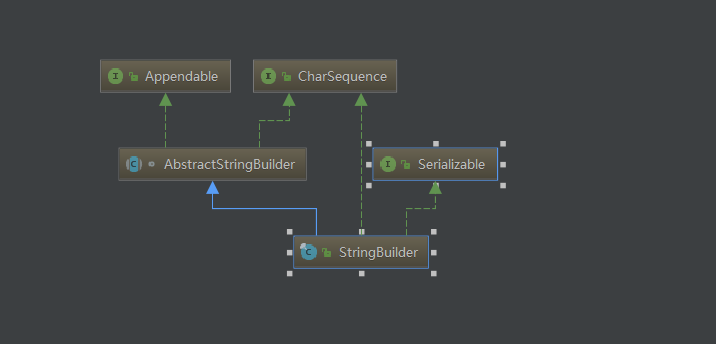
StringBuilder类继承AbstractStringBuilder抽象类，其中StringBuilder的大部分方法都是直接调用的父类的实现。
###### 构造方法
1. 空参数的构造方法

```java
/**
 * Constructs a string builder with no characters in it and an
 * initial capacity of 16 characters.
 */
public StringBuilder() {
    super(16);
}


AbstractStringBuilder(int capacity) {
    value = new char[capacity];
}
```
调用父类构造方法，字符数组的的大小为默认16  

2. 自定义初始容量-构造函数

```java
/**
 * Constructs a string builder with no characters in it and an
 * initial capacity specified by the {@code capacity} argument.
 *
 * @param      capacity  the initial capacity.
 * @throws     NegativeArraySizeException  if the {@code capacity}
 *               argument is less than {@code 0}.
 */
public StringBuilder(int capacity) {
    super(capacity);
}
```
自定义初始char[]的容量

3. 以字符串String 作为参数的构造

```java
/**
     * Constructs a string builder initialized to the contents of the
     * specified string. The initial capacity of the string builder is
     * {@code 16} plus the length of the string argument.
     *
     * @param   str   the initial contents of the buffer.
     */
public StringBuilder(String str) {
    super(str.length() + 16);
    append(str);
}
```
以默认长度16的基础上，增加字符串str的长度，作为StringBuilder实例的初始数组容量，，并将str字符串 append到StringBuilder的数组中。

```java
@Override
public StringBuilder append(String str) {
    super.append(str);
    return this;
}
```
具体看下父类AbstractStringBuilder的append方法

```java
/**
 * Appends the specified string to this character sequence.
 * <p>
 * The characters of the {@code String} argument are appended, in
 * order, increasing the length of this sequence by the length of the
 * argument. If {@code str} is {@code null}, then the four
 * characters {@code "null"} are appended.
 * <p>
 * Let <i>n</i> be the length of this character sequence just prior to
 * execution of the {@code append} method. Then the character at
 * index <i>k</i> in the new character sequence is equal to the character
 * at index <i>k</i> in the old character sequence, if <i>k</i> is less
 * than <i>n</i>; otherwise, it is equal to the character at index
 * <i>k-n</i> in the argument {@code str}.
 *
 * @param   str   a string.
 * @return  a reference to this object.
 */
public AbstractStringBuilder append(String str) {
    if (str == null)
        return appendNull();
    int len = str.length();
    ensureCapacityInternal(count + len);
    str.getChars(0, len, value, count);
    count += len;
    return this;
}
```

* 首先判断append的参数是否为null，如果为null的话，这里也是可以append进去的

```java
private AbstractStringBuilder appendNull() {
    int c = count;
    ensureCapacityInternal(c + 4);
    final char[] value = this.value;
    value[c++] = 'n';
    value[c++] = 'u';
    value[c++] = 'l';
    value[c++] = 'l';
    count = c;
    return this;
}
```
其中ensureCapacityInternal方法是确保这次append 的时候StringBuilder的内部数组容量是满足的扩容的，即这次要append的null字符长度为4，加上之前内部数组中已有的字符位数cout之后作为参数执行。

```java
/**
 * For positive values of {@code minimumCapacity}, this method
 * behaves like {@code ensureCapacity}, however it is never
 * synchronized.
 * If {@code minimumCapacity} is non positive due to numeric
 * overflow, this method throws {@code OutOfMemoryError}.
 */
private void ensureCapacityInternal(int minimumCapacity) {
    // overflow-conscious code
    if (minimumCapacity - value.length > 0) {
        value = Arrays.copyOf(value,
                newCapacity(minimumCapacity));
    }
}


private int newCapacity(int minCapacity) {
    // overflow-conscious code
    int newCapacity = (value.length << 1) + 2;
    if (newCapacity - minCapacity < 0) {
        newCapacity = minCapacity;
    }
    return (newCapacity <= 0 || MAX_ARRAY_SIZE - newCapacity < 0)
        ? hugeCapacity(minCapacity)
        : newCapacity;
}

private int hugeCapacity(int minCapacity) {
    if (Integer.MAX_VALUE - minCapacity < 0) { // overflow
        throw new OutOfMemoryError();
    }
    return (minCapacity > MAX_ARRAY_SIZE)
        ? minCapacity : MAX_ARRAY_SIZE;
}
```
* 如果不为null的话，就获取这次需要append的str的字符长度。紧接着执行是否需要扩容的方法  
append方法的关键：String的 getChars方法（从str的0位开始，到str的长度，当前StringBuilder对象的字符数组，当前数组已有的字符长度）

```java
public void getChars(int srcBegin, int srcEnd, char dst[], int dstBegin) {
    if (srcBegin < 0) {
        throw new StringIndexOutOfBoundsException(srcBegin);
    }
    if (srcEnd > value.length) {
        throw new StringIndexOutOfBoundsException(srcEnd);
    }
    if (srcBegin > srcEnd) {
        throw new StringIndexOutOfBoundsException(srcEnd - srcBegin);
    }
    System.arraycopy(value, srcBegin, dst, dstBegin, srcEnd - srcBegin);
}

public static native void arraycopy(Object src,  int srcPos, Object dest, int destPos,int length);
```

其实是调用了System的arraycopy方法 参数如下:  
 
* value 为str的内部不可变字符数组，   
* srcBegin 为从str 字符串数组的0下标开始，    
* srcEnd 为str字符串数组的长度，    
* dst 为StringBuilder对象的内部可变字符数组，    
* dstBegin 则为StringBuilder对象中已有的字符长度（char[] 已有的元素长度）

即整个StringBuilder的append方法，本质上是调用System的native方法，直接将String 类型的str字符串中的字符数组，拷贝到了StringBuilder的字符数组中


###### toString()
```java
@Override
public String toString() {
    // Create a copy, don't share the array
    return new String(value, 0, count);
}
```
这里的toString方法直接new 一个String对象，将StringBuilder对象的value进行一个拷贝，重新生成一个对象，不共享之前StringBuilder的char[]。  
以上就是StringBuilder的拼接字符串的原理分析，可以发现没有像String一样去重新new 对象，所以在频繁的拼接字符上，StringBuilder的效率远远高于String类。

#### StringBuffer
线程安全的高效字符串操作类，看下源码：

###### 构造方法

类似于StringBuilder  
append方法：

```java
@Override
public synchronized StringBuffer append(String str) {
    toStringCache = null;
    super.append(str);
    return this;
}
```
可以看到这里就是在append方法上加了同步锁，来实现多线程下的线程安全。其他的和StringBuilder一致。  
这里比StringBuilder多了一个参数

```java
/**
 * A cache of the last value returned by toString. Cleared
 * whenever the StringBuffer is modified.
 */
private transient char[] toStringCache;
```
这里的作用简单介绍一下，就是去缓存toString的值  
可以看下StringBuffer的toString方法

```java
@Override
public synchronized String toString() {
    if (toStringCache == null) {
        toStringCache = Arrays.copyOfRange(value, 0, count);
    }
    return new String(toStringCache, true);
}

```
这里的作用就是如果StringBuffer对象此时存在toStringCache，在多次调用其toString方法时，其new出来的String对象是会共享同一个char[] 内存的，达到共享的目的。但是StringBuffer只要做了修改，其toStringCache属性值都会置null处理。这也是StringBuffer和StringBuilder的一个区别点。  
<font color=red size=5>**_总结：_**</font>  

1. String 类不可变，内部维护的char[] 数组长度不可变，为final修饰，String类也是final修饰，不存在扩容。字符串拼接，截取，都会生成一个新的对象。频繁操作字符串效率低下，因为每次都会生成新的对象。    StringBuilder 类内部维护可变长度char[] ， 初始化数组容量为16，存在扩容， 其append拼接字符串方法内部调用System的native方法，进行数组的拷贝，不会重新生成新的
2. StringBuilder对象。非线程安全的字符串操作类， 其每次调用 toString方法而重新生成的String对象，不会共享StringBuilder对象内部的char[]，会进行一次char[]的copy操作。    
3. StringBuffer 类内部维护可变长度char[]， 基本上与StringBuilder一致，但其为线程安全的字符串操作类，大部分方法都采用了Synchronized关键字修改，以此来实现在多线程下的操作字符串的安全性。其toString方法而重新生成的String对象，会共享StringBuffer对象中的toStringCache属性（char[]），但是每次的StringBuffer对象修改，都会置null该属性值。

## String为什么要设计成不可变的？
####不可变
不是在原内存地址上修改数据，而是重新指向一个新对象，新地址

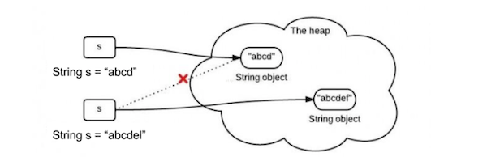

源码：

```java
public final class String
    implements java.io.Serializable, Comparable<String>, CharSequence {
    
    /** The value is used for character storage. */
    private final char value[];

    /** Cache the hash code for the string */
    private int hash; // Default to 0

}
```

* 首先，String类是用final关键字修饰，这说明String不可继承。
* 其次，String类的主力成员字段value是个char[]数组，而且是用final修饰的。final修饰的字段创建以后就不可改变。

虽然value是不可变的，也只是value这个引用地址不可变。挡不住Array数组是可变的事实。

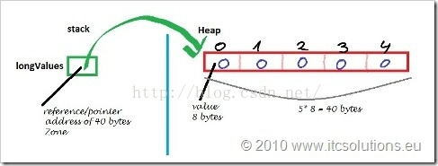

也就是说Array变量只是stack上的一个引用，数据的本体结构在heap堆。String类里的value用final修饰，只是说stack里的这个叫value的引用地址不可变。没有说堆里array本身数据不可变。看这个这个例子，

```java
final int[] value={1,2,3}
 
int[] another={4,5,6};
 
value = another;//编译器报错，final不可变

```
value用final修饰，编译器不允许我把value指向堆区另一个地址。但如果直接对数组元素动手，分分钟搞定。

```java
final int[] value={1,2,3};
 
value[2]=100;//这时候数组里已经是{1,2,100}
```

所以String是不可变，在所有String的方法里很小心地没有去动Array里的元素，没有暴露内部成员字段。private final char value[]这一句里，private的私有访问权限的作用都比final大。而且设计师还很小心地反整个String设计成final禁止继承，避免被其他人继承后破坏。

#### 好处

1. 字符串常量池的需要

字符串常量池(String pool, String intern pool, String保留池) 是Java堆内存中一个特殊的存储区域, 当创建一个String对象时,假如此字符串值已经存在于常量池中,则不会创建一个新的对象,而是引用已经存在的对象。

如下面的代码所示,将会在堆内存中只创建一个实际String对象.

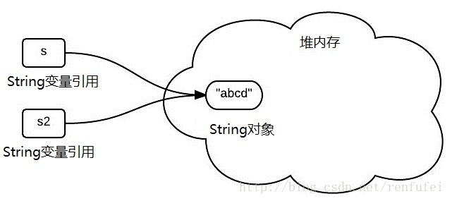

假若字符串对象允许改变,那么将会导致各种逻辑错误,比如改变一个对象会影响到另一个独立对象. 严格来说，这种常量池的思想,是一种优化手段.

请思考: 假若代码如下所示，s1和s2还会指向同一个实际的String对象吗?

```java
String s1= "ab" + "cd";
String s2= "abc" + "d";
```

他们都会指向常量池中的同一个对象. 或者,你可以用 jd-gui 之类的工具查看一下编译后的class文件.

每当我们创建字符串常量时，JVM会首先检查字符串常量池，如果该字符串已经存在常量池中，那么就直接返回常量池中的实例引用。如果字符串不存在常量池中，就会实例化该字符串并且将其放到常量池中。由于String字符串的不可变性我们可以十分肯定常量池中一定不存在两个相同的字符

intern方法使用：一个初始为空的字符串池，它由类String独自维护。当调用 intern方法时，如果池已经包含一个等于此String对象的字符串（用equals(oject)方法确定），则返回池中的字符串。否则，将此String对象添加到池中，并返回此String对象的引用。

>Java虚拟机有一个字符串池，保存着几乎所有的字符串对象。字符串表达式总是指向字符串池中的一个对象。使用new操作创建的字符串对象不指向字符串池中的对象
>intern()方法的原理：如果池中已经有相同的 字符串。有则直接返回池中的字符串，否则先将字符串添加到池中，再返回。这步操作相当于手动向常量池里扔东西

<font color=red>静态常量池：即*.class文件中的常量池，class文件中的常量池不仅仅包含字符串(数字)字面量，还包含类、方法的信息，占用class文件绝大部分空间。</font>  
<font color=red>运行时常量池：则是jvm虚拟机在完成类装载操作后，将class文件中的常量池载入到内存中，并保存在方法区中，我们常说的常量池，就是指方法区中的运行时常量池。</font>  

2. 安全性

String被许多的Java类(库)用来当做参数,例如 网络连接地址URL,文件路径path,还有反射机制所需要的String参数等, 假若String不是固定不变的,将会引起各种安全隐患。  
譬如，数据库的用户名、密码都是以字符串的形式传入来获得数据库的连接，或者在socket编程中，主机名和端口都是以字符串的形式传入。因为字符串是不可变的，所以它的值是不可改变的，否则黑客们可以钻到空子，改变字符串指向的对象的值，造成安全漏洞。  

3. 允许String对象缓存HashCode

Java中String对象的哈希码被频繁地使用, 比如在hashMap 等容器中。  
字符串不变性保证了hash码的唯一性,因此可以放心地进行缓存.这也是一种性能优化手段,意味着不必每次都去计算新的哈希码. 


## 什么是内部类？内部类的作用
#### 分类
* 普通内部类
* 静态内部类
* 匿名内部类
* 局部内部类

#### 普通内部类
这个是最常见的内部类之一了，其定义也很简单，在一个类里面作为类的一个字段直接定义就可以了，例：

```java
public class InnerClassTest {

    public class InnerClassA {
        
    }
}
```

在这里 InnerClassA 类为 InnerClassTest 类的普通内部类，在这种定义方式下，普通内部类对象依赖外部类对象而存在，即在创建一个普通内部类对象时首先需要创建其外部类对象，我们在创建上面代码中的 InnerClassA 对象时先要创建 InnerClassTest 对象，例：

```java
public class InnerClassTest {

    public int outField1 = 1;
    protected int outField2 = 2;
    int outField3 = 3;
    private int outField4 = 4;

    public InnerClassTest() {
        // 在外部类对象内部，直接通过 new InnerClass(); 创建内部类对象
        InnerClassA innerObj = new InnerClassA();
        System.out.println("创建 " + this.getClass().getSimpleName() + " 对象");
        System.out.println("其内部类的 field1 字段的值为: " + innerObj.field1);
        System.out.println("其内部类的 field2 字段的值为: " + innerObj.field2);
        System.out.println("其内部类的 field3 字段的值为: " + innerObj.field3);
        System.out.println("其内部类的 field4 字段的值为: " + innerObj.field4);
    }

    public class InnerClassA {
        public int field1 = 5;
        protected int field2 = 6;
        int field3 = 7;
        private int field4 = 8;
//        static int field5 = 5; // 编译错误！普通内部类中不能定义 static 属性

        public InnerClassA() {
            System.out.println("创建 " + this.getClass().getSimpleName() + " 对象");
            System.out.println("其外部类的 outField1 字段的值为: " + outField1);
            System.out.println("其外部类的 outField2 字段的值为: " + outField2);
            System.out.println("其外部类的 outField3 字段的值为: " + outField3);
            System.out.println("其外部类的 outField4 字段的值为: " + outField4);
        }
    }

    public static void main(String[] args) {
        InnerClassTest outerObj = new InnerClassTest();
        // 不在外部类内部，使用：外部类对象. new 内部类构造器(); 的方式创建内部类对象
//        InnerClassA innerObj = outerObj.new InnerClassA();
    }
}

```
这里的内部类就像外部类声明的一个属性字段一样，因此其的对象时依附于外部类对象而存在的，我们来看一下结果：


我们注意到，内部类对象可以访问外部类对象中所有访问权限的字段，同时，外部类对象也可以通过内部类的对象引用来访问内部类中定义的所有访问权限的字段，后面我们将从源码里面分析具体的原因。
#### 静态内部类
我们知道，一个类的静态成员独立于这个类的任何一个对象存在，只要在具有访问权限的地方，我们就可以通过 类名.静态成员名 的形式来访问这个静态成员，同样的，静态内部类也是作为一个外部类的静态成员而存在，创建一个类的静态内部类对象不需要依赖其外部类对象。例：

```java
public class InnerClassTest {
	public int outField1 = 1;
    
	public InnerClassTest() {
		System.out.println("创建 " + this.getClass().getSimpleName() + " 对象");
        // 创建静态内部类对象
        StaticClass innerObj = new StaticClass();
        System.out.println("其内部类的 field1 字段的值为: " + innerObj.field1);
        System.out.println("其内部类的 field2 字段的值为: " + innerObj.field2);
        System.out.println("其内部类的 field3 字段的值为: " + innerObj.field3);
        System.out.println("其内部类的 field4 字段的值为: " + innerObj.field4);
    }
	
    static class StaticClass {

        public int field1 = 1;
        protected int field2 = 2;
        int field3 = 3;
        private int field4 = 4;
        // 静态内部类中可以定义 static 属性
        static int field5 = 5;

        public StaticClass() {
            System.out.println("创建 " + StaticClass.class.getSimpleName() + " 对象");
//            System.out.println("其外部类的 field1 字段的值为: " + outField1); // 编译错误！！
        }
    }

    public static void main(String[] args) {
	    // 无需依赖外部类对象，直接创建内部类对象
//        InnerClassTest.StaticClass staticClassObj = new InnerClassTest.StaticClass();
		InnerClassTest outerObj = new InnerClassTest();
    }
}

```
结果：


可以看到，静态内部类就像外部类的一个静态成员一样，创建其对象无需依赖外部类对象（访问一个类的静态成员也无需依赖这个类的对象，因为它是独立于所有类的对象的）。但是于此同时，静态内部类中也无法访问外部类的非静态成员，因为外部类的非静态成员是属于每一个外部类对象的，而本身静态内部类就是独立外部类对象存在的，所以静态内部类不能访问外部类的非静态成员，而外部类依然可以访问静态内部类对象的所有访问权限的成员，这一点和普通内部类无异。
#### 匿名内部类
匿名内部类有多种形式，其中最常见的一种形式莫过于在方法参数中新建一个接口对象 / 类对象，并且实现这个接口声明 / 类中原有的方法了：

```java
public class InnerClassTest {

    public int field1 = 1;
    protected int field2 = 2;
    int field3 = 3;
    private int field4 = 4;

    public InnerClassTest() {
        System.out.println("创建 " + this.getClass().getSimpleName() + " 对象");
    }
    // 自定义接口
	interface OnClickListener {
        void onClick(Object obj);
    }

    private void anonymousClassTest() {
        // 在这个过程中会新建一个匿名内部类对象，
        // 这个匿名内部类实现了 OnClickListener 接口并重写 onClick 方法
        OnClickListener clickListener = new OnClickListener() {
	        // 可以在内部类中定义属性，但是只能在当前内部类中使用，
	        // 无法在外部类中使用，因为外部类无法获取当前匿名内部类的类名，
	        // 也就无法创建匿名内部类的对象
	        int field = 1;
	        
            @Override
            public void onClick(Object obj) {
                System.out.println("对象 " + obj + " 被点击");
                System.out.println("其外部类的 field1 字段的值为: " + field1);
                System.out.println("其外部类的 field2 字段的值为: " + field2);
                System.out.println("其外部类的 field3 字段的值为: " + field3);
                System.out.println("其外部类的 field4 字段的值为: " + field4);
            }
        };
        // new Object() 过程会新建一个匿名内部类，继承于 Object 类，
        // 并重写了 toString() 方法
        clickListener.onClick(new Object() {
            @Override
            public String toString() {
                return "obj1";
            }
        });
    }

    public static void main(String[] args) {
        InnerClassTest outObj = new InnerClassTest();
        outObj.anonymousClassTest();
    }
}

```
结果：


上面的代码中展示了常见的两种使用匿名内部类的情况：

1. 直接 new 一个接口，并实现这个接口声明的方法，在这个过程其实会创建一个匿名内部类实现这个接口，并重写接口声明的方法，然后再创建一个这个匿名内部类的对象并赋值给前面的 OnClickListener 类型的引用。
2. new 一个已经存在的类 / 抽象类，并且选择性的实现这个类中的一个或者多个非 final 的方法，这个过程会创建一个匿名内部类对象继承对应的类 / 抽象类，并且重写对应的方法。

同样的，在匿名内部类中可以使用外部类的属性，但是外部类却不能使用匿名内部类中定义的属性，因为是匿名内部类，因此在外部类中无法获取这个类的类名，也就无法得到属性信息。

#### 局部内部类
局部内部类使用的比较少，其声明在一个方法体 / 一段代码块的内部，而且不在定义类的定义域之内便无法使用，其提供的功能使用匿名内部类都可以实现，而本身匿名内部类可以写得比它更简洁，因此局部内部类用的比较少。来看一个局部内部类的小例子：

```java
public class InnerClassTest {

    public int field1 = 1;
    protected int field2 = 2;
    int field3 = 3;
    private int field4 = 4;

    public InnerClassTest() {
        System.out.println("创建 " + this.getClass().getSimpleName() + " 对象");
    }
    
    private void localInnerClassTest() {
	    // 局部内部类 A，只能在当前方法中使用
        class A {
	        // static int field = 1; // 编译错误！局部内部类中不能定义 static 字段
            public A() {
	            System.out.println("创建 " + A.class.getSimpleName() + " 对象");
                System.out.println("其外部类的 field1 字段的值为: " + field1);
                System.out.println("其外部类的 field2 字段的值为: " + field2);
                System.out.println("其外部类的 field3 字段的值为: " + field3);
                System.out.println("其外部类的 field4 字段的值为: " + field4);
            }
        }
        A a = new A();
        if (true) {
	        // 局部内部类 B，只能在当前代码块中使用
            class B {
                public B() {
	                System.out.println("创建 " + B.class.getSimpleName() + " 对象");
                    System.out.println("其外部类的 field1 字段的值为: " + field1);
                    System.out.println("其外部类的 field2 字段的值为: " + field2);
                    System.out.println("其外部类的 field3 字段的值为: " + field3);
                    System.out.println("其外部类的 field4 字段的值为: " + field4);
                }
            }
            B b = new B();
        }
//        B b1 = new B(); // 编译错误！不在类 B 的定义域内，找不到类 B，
    }

    public static void main(String[] args) {
        InnerClassTest outObj = new InnerClassTest();
        outObj.localInnerClassTest();
    }
}
```
同样的，在局部内部类里面可以访问外部类对象的所有访问权限的字段，而外部类却不能访问局部内部类中定义的字段，因为局部内部类的定义只在其特定的方法体 / 代码块中有效，一旦出了这个定义域，那么其定义就失效了，就像代码注释中描述的那样，即外部类不能获取局部内部类的对象，因而无法访问局部内部类的字段。最后看看运行结果：


#### 内部类的嵌套
内部类的嵌套，即为内部类中再定义内部类，这个问题从内部类的分类角度去考虑比较合适：  

* 普通内部类：在这里我们可以把它看成一个外部类的普通成员方法，在其内部可以定义普通内部类（嵌套的普通内部类），但是无法定义 static 修饰的内部类，就像你无法在成员方法中定义 static 类型的变量一样，当然也可以定义匿名内部类和局部内部类；
* 静态内部类：因为这个类独立于外部类对象而存在，我们完全可以将其拿出来，去掉修饰它的 static 关键字，他就是一个完整的类，因此在静态内部类内部可以定义普通内部类，也可以定义静态内部类，同时也可以定义 static 成员；
* 匿名内部类：和普通内部类一样，定义的普通内部类只能在这个匿名内部类中使用，定义的局部内部类只能在对应定义域内使用；
* 局部内部类：和匿名内部类一样，但是嵌套定义的内部类只能在对应定义域内使用。

#### 深入理解内部类
不知道小伙伴们对上面的代码有没有产生疑惑：非静态内部类可以访问外部类所有访问权限修饰的字段（即包括了 private 权限的），同时，外部类也可以访问内部类的所有访问权限修饰的字段。而我们知道，private 权限的字段只能被当前类本身访问。然而在上面我们确实在代码中直接访问了对应外部类 / 内部类的 private 权限的字段，要解除这个疑惑，只能从编译出来的类下手了，为了简便，这里采用下面的代码进行测试：

```java
public class InnerClassTest {
	
	int field1 = 1;
	private int field2 = 2;
	
	public InnerClassTest() {
		InnerClassA inner = new InnerClassA();
		int v = inner.x2;
	}
	
    public class InnerClassA {
		int x1 = field1;
		private int x2 = field2;
    }
}

```
通过反编译获得如下字节码：


我们注意到字节码中多了一个默认修饰权限并且名为 access$100 的静态方法，其接受一个 InnerClassTest 类型的参数，即其接受一个外部类对象作为参数，方法内部用三条指令取到参数对象的 field2 字段的值并返回。由此，我们现在大概能猜到内部类对象是怎么取到外部类的 private 权限的字段了：就是通过这个外部类提供的静态方法。  
类似的，我们注意到 24 行字节码指令 invokestatic ，这里代表执行了一个静态方法，而后面的注释也写的很清楚，调用的是 InnerClassTest$InnerClassA.access$000 方法，即调用了内部类中名为 access$000 的静态方法，根据我们上面的外部类字节码规律，我们也能猜到这个方法就是内部类编译过程中编译器自动生成的，那么我们赶紧来看一下 InnerClassTest$InnerClassA 类的字节码吧：


果然，我们在这里发现了名为 access$000 的静态方法，并且这个静态方法接受一个 InnerClassTest$InnerClassA 类型的参数，方法的作用也很简单：返回参数代表的内部类对象的 x2 字段值。
我们还注意到编译器给内部类提供了一个接受 InnerClassTest 类型对象（即外部类对象）的构造方法，内部类本身还定义了一个名为 this$0 的 InnerClassTest 类型的引用，这个引用在构造方法中指向了参数所对应的外部类对象。
最后，我们在 25 行字节码指令发现：内部类的构造方法通过 invokestatic 指令执行外部类的 access$100 静态方法（在 InnerClassTest 的字节码中已经介绍了）得到外部类对象的 field2 字段的值，并且在后面赋值给 x2 字段。这样的话内部类就成功的通过外部类提供的静态方法得到了对应外部类对象的 field2 。

上面我们只是对普通内部类进行了分析，但其实匿名内部类和局部内部类的原理和普通内部类是类似的，只是在访问上有些不同：外部类无法访问匿名内部类和局部内部类对象的字段，因为外部类根本就不知道匿名内部类 / 局部内部类的类型信息（匿名内部类的类名被隐匿，局部内部类只能在定义域内使用）。但是匿名内部类和局部内部类却可以访问外部类的私有成员，原理也是通过外部类提供的静态方法来得到对应外部类对象的私有成员的值。而对于静态内部类来说，因为其实独立于外部类对象而存在，因此编译器不会为静态内部类对象提供外部类对象的引用，因为静态内部类对象的创建根本不需要外部类对象支持。但是外部类对象还是可以访问静态内部类对象的私有成员，因为外部类可以知道静态内部类的类型信息，即可以得到静态内部类的对象，那么就可以通过静态内部类提供的静态方法来获得对应的私有成员值。来看一个简单的代码证明：

```java
public class InnerClassTest {
	
	int field1 = 1;
	private int field2 = 2;
	
	public InnerClassTest() {
		InnerClassA inner = new InnerClassA();
		int v = inner.x2;
	}
	
	// 这里改成了静态内部类，因而不能访问外部类的非静态成员
    public static class InnerClassA {
		private int x2 = 0;
    }
}
```
同样的编译步骤，得到了两个 .class 文件，这里看一下内部类的 .class 文件反编译的字节码 InnerClassTest$InnerClassA：


仔细看一下，确实没有找到指向外部类对象的引用，编译器只为这个静态内部类提供了一个无参构造方法。  
而且因为外部类对象需要访问当前类的私有成员，编译器给这个静态内部类生成了一个名为 access$000 的静态方法，作用已不用我多说了。如果我们不看类名，这个类完全可以作为一个普通的外部类来看，这正是静态内部类和其余的内部类的区别所在：静态内部类对象不依赖其外部类对象存在，而其余的内部类对象必须依赖其外部类对象而存在。  
OK，到这里问题都得到了解释：<font color=red>在非静态内部类访问外部类私有成员 / 外部类访问内部类私有成员 的时候，对应的外部类 / 外部类会生成一个静态方法，用来返回对应私有成员的值，而对应外部类对象 / 内部类对象通过调用其内部类 / 外部类提供的静态方法来获取对应的私有成员的值。</font> 

## ## 内部类和多重继承
我们已经知道，Java 中的类不允许多重继承，也就是说 Java 中的类只能有一个直接父类，而 Java 本身提供了内部类的机制，这是否可以在一定程度上弥补 Java 不允许多重继承的缺陷呢？我们这样来思考这个问题：假设我们有三个基类分别为 A、B、C，我们希望有一个类 D 达成这样的功能：通过这个 D 类的对象，可以同时产生 A 、B 、C 类的对象，通过刚刚的内部类的介绍，我们也应该想到了怎么完成这个需求了，创建一个类 D.java：

```java
class A {}

class B {}

class C {}

public class D extends A {
	
	// 内部类，继承 B 类
	class InnerClassB extends B {
	}
	
	// 内部类，继承 C 类
	class InnerClassC extends C {
	}

	// 生成一个 B 类对象
	public B makeB() {
		return new InnerClassB();
	}

	// 生成一个 C 类对象
	public C makeC() {
		return new InnerClassC();
	}
	
	public static void testA(A a) {
	    // ...
	}
	
	public static void testB(B b) {
	    // ...
	}
	
	public static void testC(C c) {
	    // ...
	}

	public static void main(String[] args) {
		D d = new D();
		testA(d);
		testB(d.makeB());
		testC(d.makeC());
	}
}

```
程序正确运行。而且因为普通内部类可以访问外部类的所有成员并且外部类也可以访问普通内部类的所有成员，因此这种方式在某种程度上可以说是 Java 多重继承的一种实现机制。但是这种方法也是有一定代价的，首先这种结构在一定程度上破坏了类结构，一般来说，建议一个 .java 文件只包含一个类，除非两个类之间有非常明确的依赖关系（比如说某种汽车和其专用型号的轮子），或者说一个类本来就是为了辅助另一个类而存在的（比如HashMap 类和其内部用于遍历其元素的 HashIterator 类），那么这个时候使用内部类会有较好代码结构和实现效果。而在其他情况，将类分开写会有较好的代码可读性和代码维护性。

#### 内部类和内存泄露
我们在上面已经知道了，创建非静态内部类的对象时，新建的非静态内部类对象会持有对外部类对象的引用，这个我们在上面的源码反编译中已经介绍过了，正是因为非静态内部类对象会持有外部类对象的引用，因此如果说这个非静态内部类对象因为某些原因无法被回收，就会导致这个外部类对象也无法被回收，这个听起来是有道理的，因为我们在上文也已经介绍了：非静态内部类对象依赖于外部类对象而存在，所以内部类对象没被回收，其外部类对象自然也不能被回收。但是可能存在这种情况：非静态内部类对象在某个时刻已经不在被使用，或者说这个内部类对象可以在不影响程序正确运行的情况下被回收，而因为我们对这个内部类的使用不当而使得其无法被 JVM 回收，同时会导致其外部类对象无法被回收，即为发生内存泄露。那么这个 “使用不当” 具体指的是哪个方面呢？看一个简单的例子，新建一个 MemoryLeakTest 的类：

```java
public class MemoryLeakTest {

    // 抽象类，模拟一些组件的基类
    abstract static class Component {

        final void create() {
            onCreate();
        }

        final void destroy() {
            onDestroy();
        }

        // 子类实现，模拟组件创建的过程
        abstract void onCreate();

        // 子类实现，模拟组件摧毁的过程
        abstract void onDestroy();

    }

    // 具体某个组件
    static class MyComponent extends Component {
	    // 组件中窗口的单击事件监听器
        static OnClickListener clickListener;
        // 模拟组件中的窗口
        MyWindow myWindow;

        @Override
        void onCreate() {
            // 执行组件内一些资源初始化的代码
            clickListener = new OnClickListener() {
                @Override
                public void onClick(Object obj) {
                    System.out.println("对象 " + obj + " 被单击");
                }
            };
            // 新建我的窗口对象，并设置其单击事件监听器
            myWindow = new MyWindow();
            myWindow.setClickListener(clickListener);
        }

        @Override
        void onDestroy() {
            // 执行组件内一些资源回收的代码
            myWindow.removeClickListener();
        }
    }

    // 我的窗口类，模拟一个可视化控件
    static class MyWindow {
        OnClickListener clickListener;

        // 设置当前控件的单击事件监听器
        void setClickListener(OnClickListener clickListener) {
            this.clickListener = clickListener;
        }

        // 移除当前控件的单击事件监听器
        void removeClickListener() {
            this.clickListener = null;
        }

    }

    // 对象的单击事件的监听接口
    public interface OnClickListener {
        void onClick(Object obj);
    }

    public static void main(String[] args) {
        MyComponent myComponent = new MyComponent();
        myComponent.create();
        myComponent.destroy();
        // myComponent 引用置为 null，排除它的干扰
        myComponent = null;
        // 调用 JVM 的垃圾回收动作，回收无用对象
        System.gc();

        System.out.println("");
    }
}
```

我们在代码中添加一些断点，然后采用 debug 模式查看：


程序执行到 72 行代码，此时 72 行代码还未执行，因此 myComponent 引用和其对象还未创建，继续执行：


这里成功创建了一个 MyComponent 对象，但是其 create 方法还未执行，所以 myWindow 字段为 null，这里可能有小伙伴会问了，myComponent 对象的 clickListener 字段呢？怎么不见了？其实这和我们在代码中定义 clickListener 字段的形式有关，我们定义的是 static OnClickListener clickListener; ，因此 clickListener 是一个静态字段，<font color=red>其在类加载的完成的时候储存在 JVM 中内存区域的 方法区 中，而创建的 Java 对象储存在 JVM 的堆内存中，</font>两者不在同一块内存区域。关于这些细节，想深入了解的小伙伴建议阅读《深入理解JVM虚拟机》。好了，我们继续执行代码：


myComponent.create 方法执行完成之后创建了 OnClickListener 内部类对象，并且为 myWindow 对象设置 OnCLickListener 单击事件监听。我们继续：


myComponent.destroy 方法执行完成之后，myWindow.removeClickListener 方法也执行完成，此时 myWindow 对象中的 clickListener 字段为 null。我们继续：


代码执行到了 80 行，在此之前，所有的代码和解释都没有什么难度，跟着运行图走，一切都那么顺利成章，其实这张图的运行结果也很好理解，只不过图中的文字需要思考一下：myComponent 引用指向的对象真的被回收了吗？要解答这个问题，我们需要借助 Java 中提供的内存分析工具 jvisualvm (以前它还不叫这个名字…），它一般在你安装 JDK 的目录下的 bin 子目录下：


我们运行这个程序：


在程序左边可以找到我们当前正在执行的 Java 进程，双击进入：


单击 tab 中的 监视 选项卡，可以看到当前正在执行的 Java 进程的一些资源占用信息，当然我们现在的主要目的是分析内存，那么们单击右上角的 堆 Dump ：


在这个界面，单击 类 选项卡，会出现当前 Java 进程中用到的所有的类，我们已经知道我们要查找的类的对象只创建了一个，因此我们根据右上角的 实例数 来进行排除：我们成功的找到了我们创建的对象！而这样也意味着当我们在上面代码中调用 JVM 的垃圾回收动作没有回收这三个对象，这其实就是一个真真切切的内存泄露！因为我们将 main 方法中的 myComponent 引用赋值为 null，就意味着我们已经不再使用这个组件和里面的一些子组件（MyWindow 对象），即这个组件和其内部的一些组件应该被回收。但是调用 JVM 的垃圾回收却并没有将其对应的对象回收。造成这个问题的原因在哪呢？
其实就在于我们刚刚在 MyComponent 类中定义的 clickListener 字段，我们在代码中将其定义成了 static 类型的，同时这个字段又指向了一个匿名内部类对象（在 create 方法中 创建了一个 OnClickListener 接口对象，即通过一个匿名内部类实现这个接口并创建其对象），根据 JVM 寻找和标记无用对象的规则（可达性分析算法），其会将 clickListener 字段作为一个 “root” ，并通过它来寻找还有用的对象，在这个例子中，clickListener 字段指向一个匿名内部类对象，这个匿名内部类对象有一个外部类对象（MyComponent 类型的对象）的引用，而外部类对象中又有一个 MyWindow 类型的对象引用。因此 JVM 会将这三个对象都视为有用的对象不会回收。用图来解释吧：

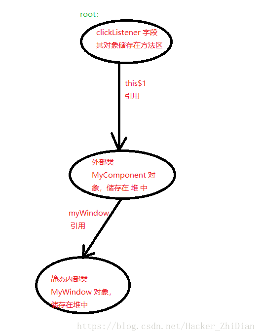

Ok，通过这个过程，相信你已经理解了造成此次内存泄露的原因了，那么我们该如何解决呢？对于当前这个例子，我们只需要改一些代码：

1. 把 MyComponent 类中的 clickListener 字段前面的 static 修饰符去掉就可以了（static OnClickListener clickListener; -> OnClickListener clickListener;），这样的话 clickListener 指向的对象，就作为 MyComponent 类的对象的一部分了，在 MyComponent 对象被回收时里面的子组件也会被回收。同时它们之间也只是互相引用（MyComponent 外部类对象中有一个指向 OnClickListener 内部类对象的引用，OnClickListener 内部类对象有一个指向 MyComponent 外部类对象的引用），根据 JVM 的 “可达性分析” 算法，在两个对象都不再被外部使用时，JVM 的垃圾回收机制是可以标记并回收这两个对象的。
虽然不强制要求你在 MyComponent 类中的 onDestroy 方法中将其 clickListener 引用赋值为 null，但是我还是建议你这样做，因为这样更能确保你的程序的安全性（减少发生内存泄露的机率，毕竟匿名内部类对象会持有外部类对象的引用），在某个组件被销毁时将其内部的一些子组件进行合理的处理是一个很好的习惯。
2. 你也可以自定义一个静态内部类或者是另外自定义一个类文件，并实现 OnClickListener 接口，之后通过这个类创建对象，这样就可以避免通过非静态内部类的形式创建 OnClickListener 对象增加内存泄露的可能性。

#### 避免内存泄漏
那么我们在日常开发中怎么合理的使用内部类来避免产生内存泄露呢？这里给出一点我个人的理解：

1. 能用静态内部类就尽量使用静态内部类，从上文中我们也知道了，静态内部类的对象创建不依赖外部类对象，即静态内部对象不会持有外部类对象的引用，自然不会因为静态内部类对象而导致内存泄露，所以如果你的内部类中不需要访问外部类中的一些非 static 成员，那么请把这个内部类改造成静态内部类；
2. 对于一些自定义类的对象，慎用 static 关键字修饰（除非这个类的对象的声明周期确实应该很长），我们已经知道，JVM 在进行垃圾回收时会将 static 关键字修饰的一些静态字段作为 “root” 来进行存活对象的查找，所以程序中 static 修饰的对象越多，对应的 “root” 也就越多，每一次 JVM 能回收的对象就越少。
当然这并不是建议你不使用 static 关键字，只是在使用这个关键字之前可以考虑一下这个对象使用 static 关键字修饰对程序的执行确实更有利吗？
3. 为某些组件（大型）提供一个当这个大型组件需要被回收的时候用于合理处理其中的一些小组件的方法（例如上面代码中 MyComponent 的 onDestroy 方法），在这个方法中，确保正确的处理一些需要处理的对象（将某些引用置为 null、释放一些其他（CPU…）资源）。

## 静态内部类的设计意图
将一个类设计成内部类，我觉得有两方面因素：

1. 在一个类内部，需要操作某种属性，而这个属性需要涉及的面又很广，我们可以考虑，将这些属性设计为内部类。
2. 好比你设计类 B 的目的只是为了给类 A 使用，那么，我们就可将其设定为内部类，没有必要将类 B 设置成单独的 Java 文件，防止与其他类产生依赖关系。

为什么又将内部类设计为静态内部类：

1. 静态内部类，只不过是想借你的外壳用一下。本身来说，我和你没有什么“强依赖”上的关系。没有你，我也可以创建实例。那么，在设计内部类的时候我们就可以做出权衡：如果我内部类与你外部类关系不紧密，耦合程度不高，不需要访问外部类的所有属性或方法，那么我就设计成静态内部类。而且，由于静态内部类与外部类并不会保存相互之间的引用，因此在一定程度上，还会节省那么一点内存资源。
2. 静态内部类就是个独立的类。之所以要弄这么个东西，只是起到一个注释的效果，而且这个注释可静态检查。比如有A，B两个类，B有点特殊，虽然可以独立存在，但只被A使用。这时候怎么办？如果把B并入A里，复杂度提高，搞得A违反单一职责。如果B独立，又可能被其他类（比如同一个包下的C）依赖，不符合设计的本意。所以不如将其变成A.B，等于添加个注释，告诉其他类别使用B了，它只跟A玩。非静态的才是真正的内部类，对其外部类有个引用。

作用：

1. 首先，用内部类是因为内部类与所在外部类有一定的关系，往往只有该外部类调用此内部类。所以没有必要专门用一个Java文件存放这个类。
2. 静态都是用来修饰类的内部成员的。比如静态方法，静态成员变量，静态常量。它唯一的作用就是随着类的加载（而不是随着对象的产生）而产生，以致可以用类名+静态成员名直接获得。
这样静态内部类就可以理解了，因为这个类没有必要单独存放一个文件，它一般来说只被所在外部类使用。并且它可以直接被用 外部类名+内部类名 获得。

## 抽象类和接口区别
abstract class和interface是Java语言中对于抽象类定义进行支持的两种机制，正是由于这两种机制的存在，才赋予了Java强大的面向对象能力。 abstract class和interface之间在对于抽象类定义的支持方面具有很大的相似性，甚至可以相互替换，因此很多开发者在进行抽象类定义时对于 abstract class和interface的选择显得比较随意。  
其实，两者之间还是有很大的区别的，对于它们的选择甚至反映出对于问题领域本质的理解、对于设计意图的理解是否正确、合理。 

#### 理解抽象类
abstract class和interface在Java语言中都是用来进行抽象类（本文中的抽象类并非从abstract class翻译而来，它表示的是一个抽象体，而abstract class为Java语言中用于定义抽象类的一种方法，请读者注意区分）定义的，那么什么是抽象类，使用抽象类能为我们带来什么好处呢？  
在面向对象的概念中，我们知道所有的对象都是通过类来描绘的，但是反过来却不是 这样。并不是所有的类都是用来描绘对象的，如果一个类中没有包含足够的信息来描绘一个具体的对象，这样的类就是抽象类。抽象类往往用来表征我们在对问题空间进行分析、设计中得出的抽象概念，是对一系列看上去不同，但是本质上相同的具体概念的抽象。  
比如：如果我们进行一个图形编辑软件的开发，就会发现问题空间存在着圆、三角形 这样一些具体概念，它们是不同的，但是它们又都属于形状这样一个概念，形状这个概念在问题领域是不存在的，它就是一个抽象概念。正是因为抽象的概念在问题空间没有对应的具体概念，所以用以表征抽象概念的抽象类是不能够实例化的。    
在面向对象领域，抽象类主要用来进行类型隐藏。我们可以构造出一个固定的一组行 为的抽象描述，但是这组行为却能够有任意个可能的具体实现方式。这个抽象描述就是抽象类，而这一组任意个可能的具体实现则表现为所有可能的派生类。模块可 以操作一个抽象体。由于模块依赖于一个固定的抽象体，因此它可以是不允许修改的；同时，通过从这个抽象体派生，也可扩展此模块的行为功能。熟悉OCP的读 者一定知道，为了能够实现面向对象设计的一个最核心的原则OCP(Open-Closed Principle)，抽象类是其中的关键所在。
## ## 从语法定义层面看abstract class和interface
在语法层面，Java语言对于abstract class和interface给出了不同的定义方式，下面以定义一个名为Demo的抽象类为例来说明这种不同。使用abstract class的方式定义Demo抽象类的方式如下：

```java
abstract class Demo ｛    
  
abstract void method1();    
  
abstract void method2();    
  
…    
  
｝  
```
```java
interface Demo {    
  
void method1();    
  
void method2();    
  
…    
  
}
```

<font color=red>在abstract class方式中，可以有自己的数据成员，也可以有非abstarct的成员方法，而在interface方式的实现中，只能够有静态的 不能被修改的数据成员（也就是必须是static final的，不过在interface中一般不定义数据成员），所有的成员方法都是abstract的(但是在JDK1.8以后，interface中也可以有也可以有非abstarct的成员方法)。从某种意义上说，interface是一种特殊形式的abstract class。</font>  
从编程的角度来看，abstract class和interface都可以用来实现"design by contract"的思想。但是在具体的使用上面还是有一些区别的。  
首先，abstract class在Java语言中表示的是一种继承关系，一个类只能使用一次继承关系。但是，一个类却可以实现多个interface。也许，这是Java语言的设计者在考虑Java对于多重继承的支持方面的一种折中考虑吧。
其次，在abstract class的定义中，我们可以赋予方法的默认行为。但是在interface的定义中，方法却不能拥有默认行为，为了绕过这个限制，必须使用委托，但是这会 增加一些复杂性，有时会造成很大的麻烦。(jdk1.8之前)  
在抽象类中不能定义默认行为还存在另一个比较严重的问题，那就是可能会造成维护上的 麻烦。因为如果后来想修改类的界面（一般通过abstract class或者interface来表示）以适应新的情况（比如，添加新的方法或者给已用的方法中添加新的参数）时，就会非常的麻烦，可能要花费很多的时 间（对于派生类很多的情况，尤为如此）。但是如果界面是通过abstract class来实现的，那么可能就只需要修改定义在abstract class中的默认行为就可以了。（jdk1.8之前）  
同样，如果不能在抽象类中定义默认行为，就会导致同样的方法实现出现在该抽象类 的每一个派生类中，违反了"one rule，one place"原则，造成代码重复，同样不利于以后的维护。因此，在abstract class和interface间进行选择时要非常的小心。  
## ## 从设计理念层面看abstract class和interface
上面主要从语法定义和编程的角度论述了abstract class和interface的区别，这些层面的区别是比较低层次的、非本质的。本文将从另一个层面：abstract class和interface所反映出的设计理念，来分析一下二者的区别。作者认为，从这个层面进行分析才能理解二者概念的本质所在。  
abstarct class在Java语言中体现了一种继承关系，要想使得继承关系合理，父类和派生类之间必须存在"is a"关系，即父类和派生类在概念本质上应该是相同的。对于interface 来说则不然，并不要求interface的实现者和interface定义在概念本质上是一致的，仅仅是实现了interface定义的契约而已。为了使述便于理解，下面将通过一个简单的实例进行说明。  
考虑这样一个例子，假设在我们的问题空间中有一个关于Door的抽象概念，该Door具有执行两个动作open和close，此时我们可以通过abstract class或者interface来定义一个表示该抽象概念的类型，定义方式分别如下所示：

```java
abstract class Door {    
  
abstract void open();    
  
abstract void close()；    
  
}  
```

```java
interface Door {    
  
void open();    
  
void close();    
  
} 
```
其他具体的Door类型可以extends使用abstract class方式定义的Door或者implements使用interface方式定义的Door。看起来好像使用abstract class和interface没有大的区别。  
如果现在要求Door还要具有报警的功能。我们该如何设计针对该例子的类结构呢（在 本例中，主要是为了展示abstract class和interface反映在设计理念上的区别，其他方面无关的问题都做了简化或者忽略）下面将罗列出可能的解决方案，并从设计理念层面对这些不 同的方案进行分析。 

###### 解决方案一：  

简单的在Door的定义中增加一个alarm方法，如下：

```java
abstract class Door {    
  
abstract void open();    
  
abstract void close()； 

abstract void alarm()；    
}  
```

```java
interface Door {    
  
void open();    
  
void close();  

void alarm();      
  
} 
```
那么具有报警功能的AlarmDoor的定义方式如下：

```java
class AlarmDoor extends Door {    
  
void open() { … }    
  
void close() { … }    
  
void alarm() { … }    
  
}  
```

```java
class AlarmDoor implements Door ｛    
  
void open() { … }    
  
void close() { … }    
  
void alarm() { … }    
  
｝
```

这种方法违反了面向对象设计中的一个核心原则ISP（Interface Segregation Priciple），在Door的定义中把Door概念本身固有的行为方法和另外一个概念"报警器"的行为方法混在了一起。这样引起的一个问题是那些仅仅 依赖于Door这个概念的模块会因为"报警器"这个概念的改变（比如：修改alarm方法的参数）而改变，反之依然。  

###### 解决方案二：
既然open、close和alarm属于两个不同的概念，根据ISP原则应该把它 们分别定义在代表这两个概念的抽象类中。定义方式有：这两个概念都使用abstract class方式定义；两个概念都使用interface方式定义；一个概念使用abstract class方式定义，另一个概念使用interface方式定义。  
显然，由于Java语言不支持多重继承，所以两个概念都使用abstract class方式定义是不可行的。后面两种方式都是可行的，但是对于它们的选择却反映出对于问题空间中的概念本质的理解、对于设计意图的反映是否正确、合理。我们一一来分析、说明。    
如果两个概念都使用interface方式来定义，那么就反映出两个问题： 
 
1. 我们可能没有理解清楚问题领域，AlarmDoor在概念本质上到底是Door还是报警器？
2. 如果我们对于问题空间的理解没有问题，比如：我们通过对于问题空间的分析发现 AlarmDoor在概念本质上和Door是一致的，那么我们在实现时就没有能够正确的揭示我们的设计意图，因为在这两个概念的定义上（均使用 interface方式定义）反映不出上述含义。  
如果我们对于问题领域的理解是：AlarmDoor在概念本质上是Door，同 时它有具有报警的功能。我们该如何来设计、实现来明确的反映出我们的意思呢？前面已经说过，abstract class在Java语言中表示一种继承关系，而继承关系在本质上是"is a"关系。所以对于Door这个概念，我们应该使用abstarct class方式来定义。另外，AlarmDoor又具有报警功能，说明它又能够完成报警概念中定义的行为，所以报警概念可以通过interface方式定 义。如下所示：

```java
abstract class Door {    
  
abstract void open();    
  
abstract void close()；    
  
}  
```

```java
nterface Alarm {    
  
void alarm();    
  
} 
```

```java
class AlarmDoor extends Door implements Alarm {    
  
void open() { … }    
  
void close() { … }    
  
void alarm() { … }    
  
}   
```

这种实现方式基本上能够明确的反映出我们对于问题空间的理解，正确的揭示我们的设计意图。其实abstract class表示的是"is a"关系，interface表示的是"like a"关系，大家在选择时可以作为一个依据，当然这是建立在对问题领域的理解上的，比如：如果我们认为AlarmDoor在概念本质上是报警器，同时又具有 Door的功能，那么上述的定义方式就要反过来了。  
abstract class和interface是Java语言中的两种定义抽象类的方式，它们之间有很大的相似性。但是对于它们的选择却又往往反映出对于问题空间中的概念本质的理解、对于设计意图的反映是否正确、合理，因为它们表现了概念间的不同的关系（虽然都能够实现需求的功能）。这其实也是语言的一种的惯用法。  
<font color=red size=5>**_总结:_**</font>

1. 抽象类和接口都不能直接实例化，如果要实例化，抽象类变量必须指向实现所有抽象方法的子类对象，接口变量必须指向实现所有接口方法的类对象。
2. 抽象类要被子类继承，接口要被类实现。
3. 接口只能做方法申明（jdk1.8之后，接口中可以做方法申明，也可以做方法实现），抽象类中可以做方法申明，也可以做方法实现
4. 接口里定义的变量只能是公共的静态的常量，抽象类中的变量是普通变量。
5. 抽象类里的抽象方法必须全部被子类所实现，如果子类不能全部实现父类抽象方法，那么该子类只能是抽象类。同样，一个实现接口的时候，如不能全部实现接口方法，那么该类也只能为抽象类。
6. 抽象方法只能申明，不能实现。abstract void abc();不能写成abstract void abc(){}。
7. 抽象类里可以没有抽象方法
8. 如果一个类里有抽象方法，那么这个类只能是抽象类
9. 抽象方法要被实现，所以不能是静态的，也不能是私有的。
10. 接口可继承接口，并可多继承接口，但类只能单根继承。

<font color=red>抽象类是对一种事物的抽象，即对类抽象，而接口是对行为的抽象。抽象类是对整个类整体进行抽象，包括属性、行为，但是接口却是对类局部（行为）进行抽象。</font>  
特别是对于公用的实现代码，抽象类有它的优点。抽象类能够保证实现的层次关系，避免代码重复。然而，即使在使用抽 象类的场合，也不要忽视通过接口定义行为模型的原则。从实践的角度来看，如果依赖于抽象类来定义行为，往往导致过于复杂的继承关系，而通过接口定义行为能 够更有效地分离行为与实现，为代码的维护和修改带来方便。

#### JDK1.8接口变化
Java 8的接口上的default method最初的设计目的是让已经存在的接口可以演化——添加新方法而不需要原本已经存在的实现该接口的类做任何改变（甚至不需要重新编译）就可以使用该新版本的接口。以Java的 java.util.List 接口为例，它在Java SE 7的时候还没有sort()方法，而到Java SE 8的时候添加了这个方法。那么如果我以前在Java SE 7的时候写了个类 MyList 实现了 List<T> 接口，我当时是不需要实现这个 sort() 方法的；当我升级到JDK8的时候，突然发现接口上多了个方法，于是 MyList 类就也得实现这个方法并且重新编译才可以继续使用了，对不对？所以就有了default method。上述 List.sort() 方法在Java SE 8里就是一个default method，它在接口上提供了默认实现，于是 MyList 即便不提供sort()的实现，也会自动从接口上继承到默认的实现，于是MyList不必重新编译也可以继续在Java SE 8使用。确实，从Java SE 8的设计主题来看，default method是为了配合JDK标准库的函数式风格而设计的。通过default method，很多JDK里原有的接口都添加了新的可以接收FunctionalInterface参数的方法，使它们更便于以函数式风格使用。Java 8的接口，即便有了default method，还暂时无法完全替代抽象类。它不能拥有状态，只能提供公有虚方法的默认实现。Java 9的接口已经可以有非公有的静态方法了。未来的Java版本的接口可能会有更强的功能，或许能更大程度地替代原本需要使用抽象类的场景。

## 抽象类与接口的应用场景
#### interface应用场合
1. 类与类之间需要特定的接口进行协调，而不在乎其如何实现。
2. 作为能够实现特定功能的标识存在，也可以是什么接口方法都没有的纯粹标识。如序列化接口：Serializable
3. 需要将一组类视为单一的类，而调用者只通过接口来与这组类发生联系。
4. 需要实现特定的多项功能，而这些功能之间可能完全没有任何联系。

#### abstract class应用在什么场合
1. 定义了一组接口，但又不想强迫每个实现类都必须实现所有的接口。可以用abstract class定义一组方法体，甚至可以是空方法体，然后由子类选择自己所感兴趣的方法来覆盖。
2. 某些场合下，只靠纯粹的接口不能满足类与类之间的协调，还必需类中表示状态的属性来区别不同的关系。
规范了一组相互协调的方法，其中一些方法是共同的，与状态无关的，可以共享的，无需子类分别实现；而另一些方法却需要各个子类根据自己特定的状态来实现特定的功能。

## is-a，has-a，like-a
#### is-a

is-a，顾名思义，是一个，代表继承关系。   
如果A is-a B，那么B就是A的父类。   
一个类完全包含另一个类的所有属性及行为。   
例如PC机是计算机，工作站也是计算机，PC机和工作站是两种不同类型的计算机，但都继承了计算机的共同特性。因此在用Java语言实现时，应该将PC机和工作站定义成两种类，均继承计算机类。 
## ## has-a是什么
has-a，顾名思义，有一个，代表从属关系。   
如果A has a B，那么B就是A的组成部分。   
同一种类的对象，通过它们的属性的不同值来区别。   
例如一台PC机的操作系统是Windows，另一台PC机的操作系统是Linux。操作系统是PC机的一个成员变量，根据这一成员变量的不同值，可以区分不同的PC机对象。
#### like-a是什么
like-a，顾名思义，像一个，代表组合关系。 
如果A like a B，那么B就是A的接口。 
新类型有老类型的接口，但还包含其他函数，所以不能说它们完全相同。 
例如一台手机可以说是一个微型计算机，但是手机的通讯功能显然不是计算机具备的行为，所以手机继承了计算机的特性，同时需要实现通讯功能，而通讯功能需要作为单独接口，而不是计算机的行为

#### is-a，has-a，like-a如何应用
如果你确定两件对象之间是is-a的关系，那么此时你应该使用继承；比如菱形、圆形和方形都是形状的一种，那么他们都应该从形状类继承。   
如果你确定两件对象之间是has-a的关系，那么此时你应该使用聚合；比如电脑是由显示器、CPU、硬盘等组成的，那么你应该把显示器、CPU、硬盘这些类聚合成电脑类。   
如果你确定两件对象之间是like-a的关系，那么此时你应该使用组合；比如空调继承于制冷机，但它同时有加热功能，那么你应该把让空调继承制冷机类，并实现加热接口。  

## 泛型中extends和super的区别
#### java泛型

1. Java1.5 引入了泛型，同时为了兼容旧代码，保留了Raw类型。

* Raw类型：  

> 举个例子，```List<Object> ```为泛型，对应的，List为Raw类型。两者有些细微的区别。  

在没有泛型的年代，多态是一个很好的泛化机制。无论什么对象都可以用 Object 来持有，丢进列表里。不过存在一些安全问题，我们来看一个简
单例子：

```java
/**
 * 输出最大的学号
 * @param studentNoList 学号列表
 */
public static void printMaxStudentNo(List studentNoList){
    int maxOrderNo = 0;
    for(Object orderNo: studentNoList)
        if(maxOrderNo < (int)orderNo)
            maxOrderNo = (int)orderNo;
    System.out.println(maxOrderNo);
}

public static void main(String[] args) {
    printMaxStudentNo(Arrays.asList(999, 34, 354));	        // 输出 999
    printMaxStudentNo(Arrays.asList("999", "34", "354"));	// ClassCastException
}
```

我们很快意识到，studentNoList中学号的类型不明确，如果调用方不小心，以为学号是 String 类型，传入 String 的列表，有可能招致 Crash。关键点在于，我们无法保证studentNoList.get()返回的一定是数字。  
引入泛型的其中一个目的是解决这样的类型安全问题。于是，我们得到了类型安全的版本：

```java
public static void printMaxStudentNo(List<Integer> studentNoList){...}

public static void main(String[] args) {
    printMaxStudentNo(Arrays.asList(999, 34, 354));	        // 输出 999
    printMaxStudentNo(Arrays.asList("999", "34", "354"));	// 编译错误
}
```

* 类型擦除  

提到这个概念，有经验的 Java 程序员总能举出一些例子。例如：

```java
System.out.println(new ArrayList<Integer>().getClass() == new ArrayList<String>().getClass());  // true
```

看一下反编译以后的样子，很好理解，泛型在编译以后擦除到了Raw 类型：

```java
System.out.println(new ArrayList().getClass() == new ArrayList().getClass());
```

通过反编译代码既然已经类型擦除了为什么 ```printMaxStudentNo(List<String>)```，与参数类型```List<Integer> ```不匹配导致编译错误，既然```List<String>```与```List<Integer>```类型相同，为何又会类型不匹配呢？如何理解如下代码无法通过编译（它与类型擦除矛盾吗？）：

```java
ArrayList<Integer> list = new ArrayList<String>();
```

* 类型擦除干净了吗

我们知道，对于泛型 ```List<T> ```，我们不能```new T()```、```new T[]```、```List<T>.class```、```instanceof List<T>```。也就是说，由于擦除，我们失去了获取形参T实际类型的能力。  
那么对于泛型```List<String>```，我们能否拿到实参String的类型呢？答案是肯定的：  
[知乎：Java为什么要添加运行时获取泛型的方法](https://www.zhihu.com/question/36645143/answer/68650398)

```java
// 先转成参数化类型 ParameterizedType
ParameterizedType paramType = (ParameterizedType) new ArrayList<String>(){}.getClass().getGenericSuperclass();
System.out.println(paramType.getActualTypeArguments()[0]);  // 拿到实参，输出 java.lang.String
```

短短两行，我们成功输出了```ArrayList<String>```中的String。  
是的，泛型实参类型的信息还在，保留在某些角落里。这也正是Gson中TypeToken所使用的技术。另外，我们心爱的Retrofit也用到了同样的技术。
> PS:
> 注意到代码中是匿名类```new ArrayList<String>(){}```，而非```new ArrayList<String>()``。其中的区别可以结合TypeToken细细体会，不展开讲。

#### 通配符与变型(variance)
##### 变形

变型这个概念在 Java 中提及很少，几次在《Effective Java》中邂逅它，难免还是不理解。直到后来，在某个更完善的泛型体系中找到了解释，它便是 Scala。  
名词解释：总结自 《Scala编程》  
不变 (invariance)、协变 (covariance)、逆变 (contravariance)  
以 ``` C<T> ```为例，给定两个类型 Child 和 Parent，满足``` Child extends Parent ```，则``` C<Child> ```与 ``` C<Parent> ```之间存在三种关系：

1. 如果``` C<Child> extends C<Parent> ```，那么 C 是协变的;
2. 如果``` C<Parent> extends C<Child> ```，那么 C 是逆变的;
3. 如果``` C<Child> ```与``` C<Parent> ```毫无关系，那么 C 是不变的。  

它们统称为变型(variance)。  
简而言之，变型描述了实参具有继承关系时，对于整体类型之间关系的影响。
Java 中的泛型是不变的，也可以说是阉割版的。后面我们会看到，kotlin 所谓的泛型新特性——声明点变型，不过是借鉴了 Scala 的成功经验。好在 kotlin 的泛型是完整的，用起来会更加舒服。  
## ## 泛型与不变
>所谓不变，即``` ArrayList<Object> list = new ArrayList<String>(); ```不合法。  
>泛型之所以设计成不变，是为了类型安全。

具体一点的例子，则有：

```java
List<String> strList = new ArrayList<>(Arrays.asList("haha"));
List<Object> objList = strList;	                    // 1. 企图用 List<Object> 持有它，然后加入数字
objList.add(999);
String lastItem = strList.get(strList.size()-1);    // 2. 获取列表最后一个字符串
```
假设泛型支持协变，即 1 处的赋值合法，则在 2 处会得到一个 ClassCastException。而设计成不变可以在编译时禁止 1 处的赋值，从而提前解决掉问题。这和 kotlin 中引入空安全是一个道理。
>PS:
>值得一提的是，数组被设计成协变的。即上述代码用数组来写，会在 2 处会得到一个 ArrayStoreException。  
>故有，《Effective Java》第25条：列表优先于数组。  
>更多讨论参见 [知乎：java中，数组为什么要设计为协变？](https://www.zhihu.com/question/21394322)

#### 上/下界通配符与协/逆变
<font color=red>不变保证了安全，却降低了灵活性。某些场景下，我们需要协变和逆变，相应的也会有一些限制。</font>

```java
class Parent{}  
class Child extends Parent{}  
List<? extends Parent> list = new ArrayList<Child>();  // List<父类>引用List<子类>, 可近似理解为协变 (上界通配符)  
List<? super Child> list = new ArrayList<Parent>();  // List<子类>引用List<父类>, 可近似理解为逆变 (下界通配符)  
```
它们有啥用呢？设想这样一个场景，先别看源码，考虑实现一个Collections.copy(dest, src)，即列表的拷贝。

```java
// 版本1，只支持 List<Object> 的 copy，局限性大
public static void copy(List<Object> dest, List<Object> src){...}

// 版本2，dest 和 src 的实参必须为相同类型，局限性大
public static <T> void copy(List<T> dest, List<T> src){...}

// 版本3，jdk实现。dest实参 可以是 src实参 的父类
public static <T> void copy(List<? super T> dest, List<? extends T> src) {
    for(int i=0; i<src.size() && i<dest.size(); i++) 
        dest.set(i, src.get(i));
}
```
通过协变，src可以持有任何T的子类型的List；相应的，通过逆变，dest可以持有任何T的父类型的List。于是，api 设计上变的更为灵活。
## ## 通配符的限制
考虑到协变带来了objList.add(999)的问题，最终不幸得到了ClassCastException。  
具体一点，假设我们用协变改写一下例子（使得 1 处能成功赋值）：

```java
List<String> strList = new ArrayList<>(Arrays.asList("haha"));
List<? extends Object> objList = strList;     // 1. 企图用 List<? extends Object> 持有它，然后加入数字
objList.add(999);
String lastItem = strList.get(strList.size()-1);    // 2. 获取列表最后一个字符串
```
那么，Java 的设计者们如何应对这种情况呢？答案是，编译器直接禁止了objList.add(999)。

一般的，对通配符有如下限制：

1. 对于协变? extends T，只能get()，即作为生产者(Producer)。
2. 对于逆变? super T，只能set()，即作为消费者(Consumer)。
3. 俗称PECS: Producer-extends，Consumer-super。

<font color=red size=5>**_总结:_**</font>

1. 泛型提供了编译时的类型安全，在运行时擦除到Raw类型
2. 擦除并非完全擦除掉泛型信息，某些情况下，可以用反射拿到实参的类型（如 TypeToken）。
3. 泛型列表是不变的，所以优于泛型数组。
4. Java 提供通配符来模拟协变和逆变，有 PECS 口诀。熟记它，看懂 Observable 中的各种 super、extends 不在话下。

#### Java 泛型 <? super T> 中 super 怎么理解？与 extends 有何不同
1. <? extend T>：是指上界通配符
由于指定了B为所有元素的“根”，你任何时候都可以安全的用B来使用容器里的元素，但是插入有问题，由于供奉B为祖先的子树有很多，不同子树并不兼容，由于实参可能来自于任何一颗子树，所以你的插入很可能破坏函数实参，所以，对这种写法的形参，禁止做插入操作，只做读取。

```java
public class GenericsAndCovariance {
    public static void main(String[] args) {
        // Wildcards allow covariance:
        List<? extends Fruit> flist = new ArrayList<Apple>();
        // Compile Error: can’t add any type of object:
        // flist.add(new Apple());
        // flist.add(new Fruit());
        // flist.add(new Object());
        flist.add(null); // Legal but uninteresting
        // We know that it returns at least Fruit:
        Fruit f = flist.get(0);
    }
}
```
上面的例子中， flist 的类型是 List<? extends Fruit>，我们可以把它读作：一个类型的 List， 这个类型可以是继承了 Fruit的某种类型。注意，这并不是说这个 List 可以持有 Fruit 的任意类型。通配符代表了一种特定的类型，它表示 “某种特定的类型，但是 flist 没有指定”。这样不太好理解，具体针对这个例子解释就是，flist 引用可以指向某个类型的 List，只要这个类型继承自 Fruit，可以是 Fruit 或者 Apple，比如例子中的 new ArrayList<Apple>，但是为了向上转型给 flist，flist 并不关心这个具体类型是什么。    
如上所述，通配符 List<? extends Fruit> 表示某种特定类型 ( Fruit 或者其子类 ) 的 List，但是并不关心这个实际的类型到底是什么，反正是 Fruit 的子类型，Fruit 是它的上边界。那么对这样的一个 List 我们能做什么呢？其实如果我们不知道这个 List 到底持有什么类型，怎么可能安全的添加一个对象呢？在上面的代码中，向 flist 中添加任何对象，无论是 Apple 还是 Orange 甚至是 Fruit 对象，编译器都不允许，唯一可以添加的是 null。所以如果做了泛型的向上转型 (List<? extends Fruit> flist = new ArrayList<Apple>())，那么我们也就失去了向这个 List 添加任何对象的能力，即使是 Object 也不行。    
另一方面，如果调用某个返回 Fruit 的方法，这是安全的。因为我们知道，在这个 List 中，不管它实际的类型到底是什么，但肯定能转型为 Fruit，所以编译器允许返回 Fruit。  
了解了通配符的作用和限制后，好像任何接受参数的方法我们都不能调用了。其实倒也不是，看下面的例子：

```java
public class CompilerIntelligence {
    public static void main(String[] args) {
        List<? extends Fruit> flist =
        Arrays.asList(new Apple());
        Apple a = (Apple)flist.get(0); // No warning
        flist.contains(new Apple()); // Argument is ‘Object’
        flist.indexOf(new Apple()); // Argument is ‘Object’
        
        //flist.add(new Apple());   无法编译

    }
}
```
在上面的例子中，flist 的类型是 List<? extends Fruit>，泛型参数使用了受限制的通配符，所以我们失去了向其中加入任何类型对象的例子，最后一行代码无法编译。  
但是 flist 却可以调用 contains 和 indexOf 方法，它们都接受了一个 Apple 对象做参数。如果查看 ArrayList 的源代码，可以发现 add() 接受一个泛型类型作为参数，但是 contains 和 indexOf 接受一个 Object 类型的参数，下面是它们的方法签名：  

```java
public boolean add(E e)
public boolean contains(Object o)
public int indexOf(Object o)
```
所以如果我们指定泛型参数为 <? extends Fruit> 时，add() 方法的参数变为 ? extends Fruit，编译器无法判断这个参数接受的到底是 Fruit 的哪种类型，所以它不会接受任何类型。  
然而，contains 和 indexOf 的类型是 Object，并没有涉及到通配符，所以编译器允许调用这两个方法。这意味着一切取决于泛型类的编写者来决定那些调用是 “安全” 的，并且用 Object 作为这些安全方法的参数。如果某些方法不允许类型参数是通配符时的调用，这些方法的参数应该用类型参数，比如 add(E e)。  
2. <? super T>：是指下界通配符 不影响往里存，但往外取只能放在Object对象里
对于这个泛型，?代表容器里的元素类型，由于只规定了元素必须是B的超类，导致元素没有明确统一的“根”（除了Object这个必然的根），所以这个泛型你无法使用它，除了把元素强制转成Object。所以，对把参数写成这样形态的函数，只能对这个泛型做插入操作，而无法读.

```java
public class SuperTypeWildcards {
    static void writeTo(List<? super Apple> apples) {
        apples.add(new Apple());
        apples.add(new Jonathan());
        // apples.add(new Fruit()); // Error
    }
}
```
writeTo 方法的参数 apples 的类型是 List<? super Apple>，它表示某种类型的 List，这个类型是 Apple 的基类型。也就是说，我们不知道实际类型是什么，但是这个类型肯定是 Apple 的父类型。因此，我们可以知道向这个 List 添加一个 Apple 或者其子类型的对象是安全的，这些对象都可以向上转型为 Apple。但是我们不知道加入 Fruit 对象是否安全，因为那样会使得这个 List 添加跟 Apple 无关的类型。

## 进程和线程的区别
#### 任务调度

线程是什么？要理解这个概念，须要先了解一下操作系统的一些相关概念。大部分操作系统(如Windows、Linux)的任务调度是采用时间片轮转的抢占式调度方式，也就是说一个任务执行一小段时间后强制暂停去执行下一个任务，每个任务轮流执行。任务执行的一小段时间叫做时间片，任务正在执行时的状态叫运行状态，任务执行一段时间后强制暂停去执行下一个任务，被暂停的任务就处于就绪状态等待下一个属于它的时间片的到来。这样每个任务都能得到执行，由于CPU的执行效率非常高，时间片非常短，在各个任务之间快速地切换，给人的感觉就是多个任务在“同时进行”，这也就是我们所说的并发(别觉得并发有多高深，它的实现很复杂，但它的概念很简单，就是一句话：多个任务同时执行)。多任务运行过程的示意图如下：


<center>图：操作系统中的任务调度</center>

#### 进程

我们都知道计算机的核心是CPU，它承担了所有的计算任务；而操作系统是计算机的管理者，它负责任务的调度、资源的分配和管理，统领整个计算机硬件；应用程序侧是具有某种功能的程序，程序是运行于操作系统之上的。  
进程是一个具有一定独立功能的程序在一个数据集上的一次动态执行的过程，是操作系统进行资源分配和调度的一个独立单位，是应用程序运行的载体。进程是一种抽象的概念，从来没有统一的标准定义。进程一般由程序、数据集合和进程控制块三部分组成。程序用于描述进程要完成的功能，是控制进程执行的指令集；数据集合是程序在执行时所需要的数据和工作区；程序控制块(Program Control Block，简称PCB)，包含进程的描述信息和控制信息，是进程存在的唯一标志。  
进程具有的特征：

* 动态性：进程是程序的一次执行过程，是临时的，有生命期的，是动态产生，动态消亡的；
* 并发性：任何进程都可以同其他进程一起并发执行；
* 独立性：进程是系统进行资源分配和调度的一个独立单位；
* 结构性：进程由程序、数据和进程控制块三部分组成。

#### 线程

在早期的操作系统中并没有线程的概念，进程是能拥有资源和独立运行的最小单位，也是程序执行的最小单位。任务调度采用的是时间片轮转的抢占式调度方式，而进程是任务调度的最小单位，每个进程有各自独立的一块内存，使得各个进程之间内存地址相互隔离。  
后来，随着计算机的发展，对CPU的要求越来越高，进程之间的切换开销较大，已经无法满足越来越复杂的程序的要求了。于是就发明了线程，线程是程序执行中一个单一的顺序控制流程，是程序执行流的最小单元，是处理器调度和分派的基本单位。一个进程可以有一个或多个线程，各个线程之间共享程序的内存空间(也就是所在进程的内存空间)。一个标准的线程由线程ID、当前指令指针(PC)、寄存器和堆栈组成。而进程由内存空间(代码、数据、进程空间、打开的文件)和一个或多个线程组成。

#### 进程与线程的区别
前面讲了进程与线程，但可能你还觉得迷糊，感觉他们很类似。的确，进程与线程有着千丝万缕的关系，下面就让我们一起来理一理：

1. 线程是程序执行的最小单位，而进程是操作系统分配资源的最小单位；
2. 一个进程由一个或多个线程组成，线程是一个进程中代码的不同执行路线；
3. 进程之间相互独立，但同一进程下的各个线程之间共享程序的内存空间(包括代码段、数据集、堆等)及一些进程级的资源(如打开文件和信号)，某进程内的线程在其它进程不可见；
4. 调度和切换：线程上下文切换比进程上下文切换要快得多。  

线程与进程关系的示意图：

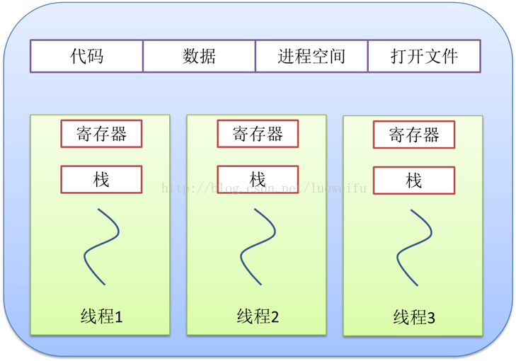

<center>图：进程与线程的资源共享关系</center>


<center>图：单线程与多线程的关系</center>

总之，线程和进程都是一种抽象的概念，线程是一种比进程更小的抽象，线程和进程都可用于实现并发。

在早期的操作系统中并没有线程的概念，进程是能拥有资源和独立运行的最小单位，也是程序执行的最小单位。它相当于一个进程里只有一个线程，进程本身就是线程。所以线程有时被称为轻量级进程(Lightweight Process，LWP）。


<center>图：早期的操作系统只有进程，没有线程</center>

后来，随着计算机的发展，对多个任务之间上下文切换的效率要求越来越高，就抽象出一个更小的概念——线程，一般一个进程会有多个(也可是一个)线程。


<center>图：线程的出现，使得一个进程可以有多个线程</center>

#### 多线程与多核
上面提到的时间片轮转的调度方式说一个任务执行一小段时间后强制暂停去执行下一个任务，每个任务轮流执行。很多操作系统的书都说“同一时间点只有一个任务在执行”。那有人可能就要问双核处理器呢？难道两个核不是同时运行吗？  
其实“同一时间点只有一个任务在执行”这句话是不准确的，至少它是不全面的。那多核处理器的情况下，线程是怎样执行呢？这就需要了解内核线程。  
多核(心)处理器是指在一个处理器上集成多个运算核心从而提高计算能力，也就是有多个真正并行计算的处理核心，每一个处理核心对应一个内核线程。内核线程（Kernel Thread， KLT）就是直接由操作系统内核支持的线程，这种线程由内核来完成线程切换，内核通过操作调度器对线程进行调度，并负责将线程的任务映射到各个处理器上。一般一个处理核心对应一个内核线程，比如单核处理器对应一个内核线程，双核处理器对应两个内核线程，四核处理器对应四个内核线程。  
现在的电脑一般是双核四线程、四核八线程，是采用超线程技术将一个物理处理核心模拟成两个逻辑处理核心，对应两个内核线程，所以在操作系统中看到的CPU数量是实际物理CPU数量的两倍，如你的电脑是双核四线程，打开“任务管理器\性能”可以看到4个CPU的监视器，四核八线程可以看到8个CPU的监视器。 


<center>图：双核四线程在Windows8下查看的结果</center>

超线程技术就是利用特殊的硬件指令，把一个物理芯片模拟成两个逻辑处理核心，让单个处理器都能使用线程级并行计算，进而兼容多线程操作系统和软件，减少了CPU的闲置时间，提高的CPU的运行效率。这种超线程技术(如双核四线程)由处理器硬件的决定，同时也需要操作系统的支持才能在计算机中表现出来。  
程序一般不会直接去使用内核线程，而是去使用内核线程的一种高级接口——轻量级进程（Light Weight Process，LWP），轻量级进程就是我们通常意义上所讲的线程(我们在这称它为用户线程)，由于每个轻量级进程都由一个内核线程支持，因此只有先支持内核线程，才能有轻量级进程。用户线程与内核线程的对应关系有三种模型：一对一模型、多对一模型、多对多模型，在这以4个内核线程、3个用户线程为例对三种模型进行说明。

1. 一对一模型
对于一对一模型来说，一个用户线程就唯一地对应一个内核线程(反过来不一定成立，一个内核线程不一定有对应的用户线程)。这样，如果CPU没有采用超线程技术(如四核四线程的计算机)，一个用户线程就唯一地映射到一个物理CPU的线程，线程之间的并发是真正的并发。一对一模型使用户线程具有与内核线程一样的优点，一个线程因某种原因阻塞时其他线程的执行不受影响；此处，一对一模型也可以让多线程程序在多处理器的系统上有更好的表现。  
但一对一模型也有两个缺点：1.许多操作系统限制了内核线程的数量，因此一对一模型会使用户线程的数量受到限制；2.许多操作系统内核线程调度时，上下文切换的开销较大，导致用户线程的执行效率下降。


<center>图：一对一模型</center>
2. 多对一模型
多对一模型将多个用户线程映射到一个内核线程上，线程之间的切换由用户态的代码来进行，因此相对一对一模型，多对一模型的线程切换速度要快许多；此外，多对一模型对用户线程的数量几乎无限制。但多对一模型也有两个缺点：1.如果其中一个用户线程阻塞，那么其它所有线程都将无法执行，因为此时内核线程也随之阻塞了；2.在多处理器系统上，处理器数量的增加对多对一模型的线程性能不会有明显的增加，因为所有的用户线程都映射到一个处理器上了。


<center>图：多对一模型</center>
3. 多对多模型
多对多模型结合了一对一模型和多对一模型的优点，将多个用户线程映射到多个内核线程上。多对多模型的优点有：

* 一个用户线程的阻塞不会导致所有线程的阻塞，因为此时还有别的内核线程被调度来执行；
* 多对多模型对用户线程的数量没有限制；
* 在多处理器的操作系统中，多对多模型的线程也能得到一定的性能提升，但提升的幅度不如一对一模型的高。  
在现在流行的操作系统中，大都采用多对多的模型。  


<center>图：多对多模型</center>

#### 查看进程与线程

一个应用程序可能是多线程的，也可能是多进程的，如何查看呢？在Windows下我们只须打开任务管理器就能查看一个应用程序的进程和线程数。按“Ctrl+Alt+Del”或右键快捷工具栏打开任务管理器。  
查看进程数和线程数：  


<center>图：查看线程数和进程数</center>

在“进程”选项卡下，我们可以看到一个应用程序包含的线程数。如果一个应用程序有多个进程，我们能看到每一个进程，如在上图中，Google的chrome浏览器就有多个进程。同时，如果打开了一个应用程序的多个实例也会有多个进程，如上图中我打开了两个cmd窗口，就有两个cmd进程。如果看不到线程数这一列，可以在点击“查看\选择列”菜单，增加监听的列。

查看CPU和内存的使用率：  
在性能选项卡中，我们可以查看CPU和内存的使用率，根据CPU使用记录的监视器的个数还能看出逻辑处理核心的个数，如我的双核四线程的计算机就有四个监视器。  


<center>图：查看CPU和内存的使用率</center>

#### 线程的生命周期

当线程的数量小于处理器的数量时，线程的并发是真正的并发，不同的线程运行在不同的处理器上。但当线程的数量大于处理器的数量时，线程的并发会受到一些阻碍，此时并不是真正的并发，因为此时至少有一个处理器会运行多个线程。  
在单个处理器运行多个线程时，并发是一种模拟出来的状态。操作系统采用时间片轮转的方式轮流执行每一个线程。现在，几乎所有的现代操作系统采用的都是时间片轮转的抢占式调度方式，如我们熟悉的Unix、Linux、Windows及Mac OS X等流行的操作系统。   
我们知道线程是程序执行的最小单位，也是任务执行的最小单位。在早期只有进程的操作系统中，进程有五种状态，创建、就绪、运行、阻塞(等待)、退出。早期的进程相当于现在的只有单个线程的进程，那么现在的多线程也有五种状态，现在的多线程的生命周期与早期进程的生命周期类似。  
我们知道线程是程序执行的最小单位，也是任务执行的最小单位。在早期只有进程的操作系统中，进程有五种状态，创建、就绪、运行、阻塞(等待)、退出。早期的进程相当于现在的只有单个线程的进程，那么现在的多线程也有五种状态，现在的多线程的生命周期与早期进程的生命周期类似。


<center>图：早期进程的生命周期</center>

进程在运行过程有三种状态：就绪、运行、阻塞，创建和退出状态描述的是进程的创建过程和退出过程。

* 创建：进程正在创建，还不能运行。操作系统在创建进程时要进行的工作包括分配和建立进程控制块表项、建立资源表格并分配资源、加载程序并建立地址空间；
* 就绪：时间片已用完，此线程被强制暂停，等待下一个属于他的时间片到来；
* 运行：此线程正在执行，正在占用时间片；
* 阻塞：也叫等待状态，等待某一事件(如IO或另一个线程)执行完；
* 退出：进程已结束，所以也称结束状态，释放操作系统分配的资源。

<center>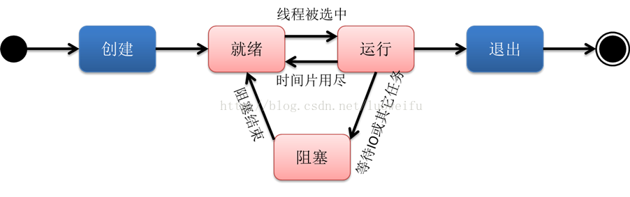</center>
<center>图：线程的生命周期</center>
创建：一个新的线程被创建，等待该线程被调用执行；

* 就绪：时间片已用完，此线程被强制暂停，等待下一个属于他的时间片到来；
* 运行：此线程正在执行，正在占用时间片；
* 阻塞：也叫等待状态，等待某一事件(如IO或另一个线程)执行完；
* 退出：一个线程完成任务或者其他终止条件发生，该线程终止进入退出状态，退出状态释放该线程所分配的资源。

#### Linus对进程和线程区别的解释

On Mon, 5 Aug 1996, Peter P. Eiserloh wrote:
> We need to keep a clear the concept of threads. Too many people seem to confuse a thread with a process. The following discussion  does not reflect the current state of linux, but rather is an  attempt to stay at a high level discussion.  
> NO!  
> There is NO reason to think that "threads" and "processes" are separateentities. That's how it's traditionally done, but I personally think it's amajor mistake to think that way. The only reason to think that way ishistorical baggage.   
> Both threads and processes are really just one thing: a "context ofexecution". Trying to artificially distinguish different cases is justself-limiting.   
> A "context of execution", hereby called COE, is just the conglomerate of all the state of that COE. That state includes things like CPU state (registers etc), MMU state (page mappings), permission state (uid, gid) and various "communication states" (open files, signal handlers etc).  
> Traditionally, the difference between a "thread" and a "process" has beenmainly that a threads has CPU state (+ possibly some other minimal state),while all the other context comes from the process. However, that's just_one_ way of dividing up the total state of the COE, and there is nothingthat says that it's the right way to do it. Limiting yourself to that kind ofimage is just plain stupid.   
> The way Linux thinks about this (and the way I want things to work) is that there _is_ no such thing as a "process" or a "thread". There is only thetotality of the COE (called "task" by Linux). Different COE's can share partsof their context with each other, and one _subset_ of that sharing is thetraditional "thread"/"process" setup, but that should really be seen as ONLYa subset (it's an important subset, but that importance comes not fromdesign, but from standards: we obviusly want to run standards-conformingthreads programs on top of Linux too).   
> In short: do NOT design around the thread/process way of thinking. The kernel should be designed around the COE way of thinking, and then the pthreads _library_ can export the limited pthreads interface to users who want to use that way of looking at COE's.  
> Just as an example of what becomes possible when you think COE as opposed to thread/process:  
> - You can do a external "cd" program, something that is traditionallyimpossible in UNIX and/or process/thread (silly example, but the idea is that you can have these kinds of "modules" that aren't limited to the traditional UNIX/threads setup). Do a:  
> clone(CLONE_VM|CLONE_FS);  
> child: execve("external-cd");
> /* the "execve()" will disassociate the VM, so the only reason we used CLONE_VM was to make the act of cloning faster */  
> - You can do "vfork()" naturally (it meeds minimal kernel support, but that support fits the CUA way of thinking perfectly):  
> clone(CLONE_VM);  
> child: continue to run, eventually execve()  
> mother: wait for execve  
> - you can do external "IO deamons":  
> clone(CLONE_FILES);  
> child: open file descriptors etc  
> mother: use the fd's the child opened and vv.  
> All of the above work because you aren't tied to the thread/process way ofthinking. Think of a web server for example, where the CGI scripts are doneas "threads of execution". You can't do that with traditional threads,because traditional threads always have to share the whole address space, soyou'd have to link in everything you ever wanted to do in the web serveritself (a "thread" can't run another executable).   
> Thinking of this as a "context of execution" problem instead, your tasks cannow chose to execute external programs (= separate the address space from theparent) etc if they want to, or they can for example share everything withthe parent _except_ for the file descriptors (so that the sub-"threads" canopen lots of files without the parent needing to worry about them: they closeautomatically when the sub-"thread" exits, and it doesn't use up fd's in theparent). Think of a threaded "inetd", for example. You want low overhead fork+exec, sowith the Linux way you can instead of using a "fork()" you write amulti-threaded inetd where each thread is created with just CLONE_VM (shareaddress space, but don't share file descriptors etc). Then the child canexecve if it was a external service (rlogind, for example), or maybe it wasone of the internal inetd services (echo, timeofday) in which case it justdoes it's thing and exits.  
>  You can't do that with "thread"/"process".

#### Android中的进程和线程

Android 系统在启动时首先会启动 Linux 基础系统，然后引导加载 Linux kernel 并启动初始化进程（Init）,如图。 
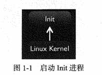
接着，启动 Linux 守护进程（daemons）。这个过程需要启动以下内容。 

* 启动USB守护进程（usbd）来管理USB连接。 
* 启动Android Debug Bridge 守护进程（adbd）来管理ADB连接。 
* 启动Debug 守护进程（debuggerd）来管理调试进程的请求（包括内存转换等）。 
* 启动无限接口守护进程（rild）来管理无线通信。

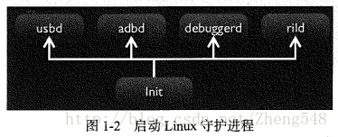

在启动 Linux 守护进程的同时还需要启动 Zygote(/ˈzaɪɡoʊt/) 进程。他主要包括以下需要启动和注册的内容。 

* 初始化一个Dalvik虚拟机实例。 
* 装载 Socket 请求所需的类和监听。 
* 创建虚拟机实例来管理应用程序的进程。

再接着，需要初始化 runtime 进程，这个过程需要处理的操作：

* 初始化服务管理器
* 注册服务管理器，以它作为默认 Binder 服务的 Context 管理器。

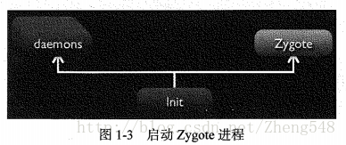

再接着，需要初始化 runtime 进程，这个过程需要处理的操作：

* 初始化服务管理器
* 注册服务管理器，以它作为默认 Binder 服务的 Context 管理器

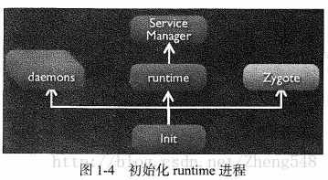

runtime 进程初始化之后， runtime 进程将发送一个请求到 Zygote ，开始启动系统服务，这时 Zygote 将为系统服务进程建立一个虚拟机实例，并启动系统服务，如图


紧接者，系统服务将启动原生系统服务，主要包括 Surface Flinger 和 Audio Flinger。这些本地系统服务将注册到服务管理器 （Service Manager） 作为 IPC 服务的目标。


系统服务将启动 Android 管理服务， Android 管理服务将都被注册到服务管理器上。


最后，当系统加载完所有的服务之后会处于等待状态，等待程序运行。但是，每一个程序都将启动一个单独的进程。如图。系统启动一个 Home 进程 和一个 Contracts 进程。

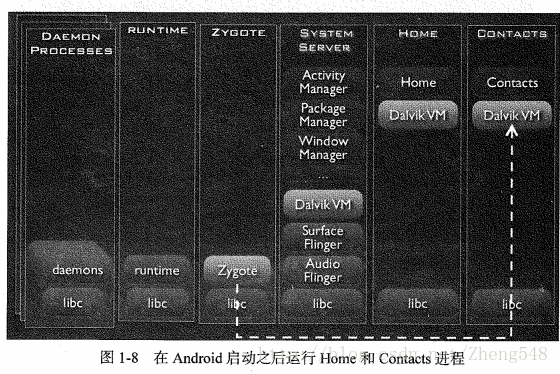

在Android系统中，每一个App都是一个Linux用户。一般情况下，每个App都是运行在一个进程的一个线程中，这个线程习惯称为主线程（Main Thread）.   
Zygote是一个虚拟机进程，同时也是一个虚拟机实例的孵化器，每当系统要求执行一个 Android应用程序，Zygote就会FORK出一个子进程来执行该应用程序。   
这样做的好处显而易见：Zygote进程是在系统启动时产生的，它会完成虚拟机的初始化，库的加载，预置类库的加载和初始化等等操作，而在系统需要一个新的虚拟机实例时，Zygote通过复制自身，最快速的提供个系统。 
另外，对于一些只读的系统库，所有虚拟机实例都和Zygote共享一块内存区域，大大节省了内存开销。

#### Android 进程模型
Linux通过调用start_kernel函数来启动内核，当内核启动模块启动完成后，将启动用户空间的第一个进程——Init进程，下图为Android系统的进程模型图：


从上图可以看出，Linux内核在启动过程中，创建一个名为Kthreadd的内核进程，PID=2，用于创建内核空间的其他进程；同时创建第一个用户空间Init进程，该进程PID = 1，用于启动一些本地进程，比如Zygote进程，而Zygote进程也是一个专门用于孵化Java进程的本地进程，上图清晰地描述了整个Android系统的进程模型

#### Zygote进程孵化新进程
下面来对Zygote进程孵化新进程的过程做进一步了解：

* Zygote进程调用fork()函数创建出Zygote’ 子进程
* 子进程Zygote’ 共享父进程Zygote的代码区与连接信息

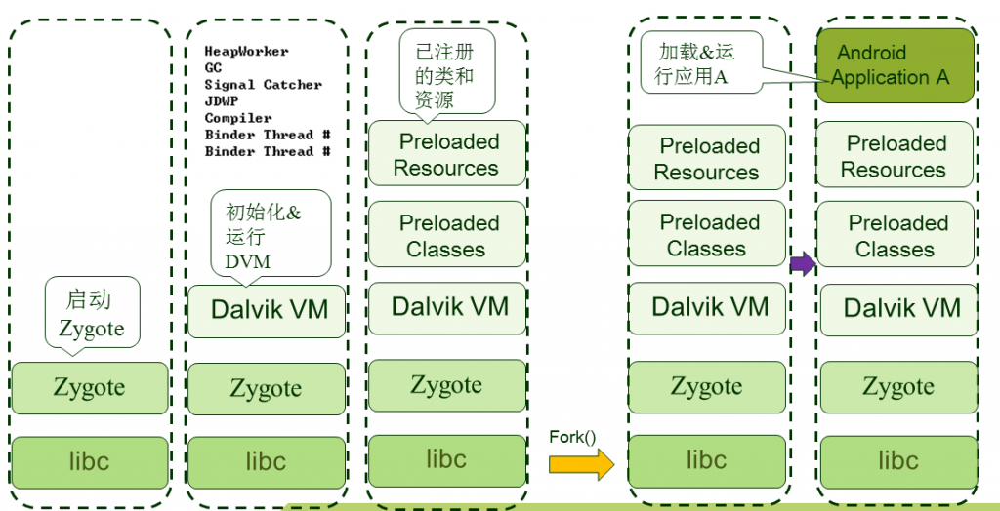

Fork()橙色箭头左边是Zygote进程，右边是创建出的Zygote‘子进程；然后Zygote’ 子进程将执行流程交给应用程序A，Android程序开始运行。  
新生成的应用程序A会使用已有Zygote父进程的库与资源的连接信息，所以运行速度很快。    
另外，对于上图，Zygote启动后，初始并运行DVM，而后将需要的类与资源加载到内存中。随后调用fork()创建出Zygote’ 子进程，接着子进程动态加载并运行应用程序A。  
运行的应用程序A会使用Zygote已经初始化并启动运行的DVM代码，通过使用已加载至内存中的类与资源来加快运行速度。

#### java的进程和线程（个人理解）

一个java程序的创建，就是一个进程，对应一个jvm虚拟机，一个java进程有一整套jvm内存模型（包括堆和栈---资源分配）。  
而java的栈，是在这个java进程的基础上进行资源的再分配（分配栈空间，java的线程是没有堆空间的---运行中比不可少的资源）。  
想创建java多进程，最简单的方式是多运行几个class文件，在windows的任务管理器上就会看到多个javaw.exe，这就是多个java进程，每个java进程对应一个jvm虚拟机（进程），进程间互不干扰，绝不会因为一个进程的崩溃而影响令一个进程（进程创建还有一种ProcessBuilder的方式，没用过，个人觉得这个比java的桌面程序还冷门，不想学它，然并卵）。  
想创建java线程，方式有很多种，暂不介绍了。  
创建java线程之后的内存模型，接上个jvm学习：  
首先有一点，一个java进程至少要有一个java线程才能创建并且运行。以普通的java文件为例，当运行main函数时，其实首先是创建一个java进程，就是先创建一个jvm虚拟机进程。这是在所有操作之前的。  
然后，开始执行正常的jvm加载和创建线程的流程.  
多线程的情况下，比如现在jvm执行的栈帧是下面这个test方法：

```java
public void test(){
        Test t = new Test();
        Thread t1 = MyThread();
        t1.start();
}
```

首先，像执行过程3）一样，这个栈帜先查看Test类是否被加载过，如果没有加载过，进行Test类的加载和初始化。如果加载过，就在堆上创建一个Test的对象。然后执行到Thread t1 = MyThread();的时候，首先像普通的类一样，先加载并初始化这个线程类，然后在堆上创建线程类的一个实例。然后，执行t1.start（）的时候，会新建一个栈，然后将t1对象的run函数入栈。也就是说，一个线程对应一个栈，栈只有出栈和入栈的操作，栈的操作单位是栈帧，栈帧对应的是方法，包含方法的局部变量和方法需要的部分成员变量和其他变量。  
深入jvm上解释，java内存模型中，线程操作的都是工作内存，对主内存中的数据，会在工作内存中有一份拷贝。线程只能在自己的工作内存中对变量进行操作，不能直接操作主内存的数据。如下图：  
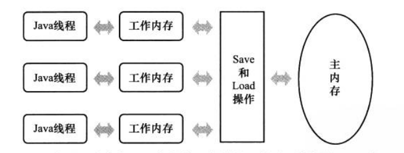
综上，个人画了一个简单的图解，如果有什么错误的地方希望指出：  
首先，图解针对的是这样一段代码：  

```java
public Test{
public static void main(String[] args){
        Myth m = new Myth();                //-----------------------------1
        m.start();                                   //-----------------------------2
        test();                                       //------------------------------3
}
private static void test(){}


static class MyTh extedns Thread{
      public void run(){}
}

}
```

首先，在执行java Test之后，jvm先进行一个环境的初始化，如下图：  很纯净的jvm环境，还没有执行任何个人线程，一个单纯的java进程（有java的内置线程，如加载java.lang包等，不过这个我们不关心，我们只看自己的类） 

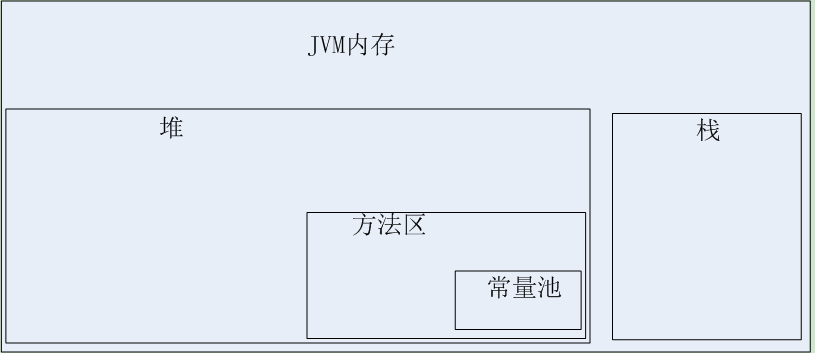

其次，在执行main函数之前，jvm会首先加载main函数所在的类（即Test类，然后将Test类的相关信息放入到方法区中）

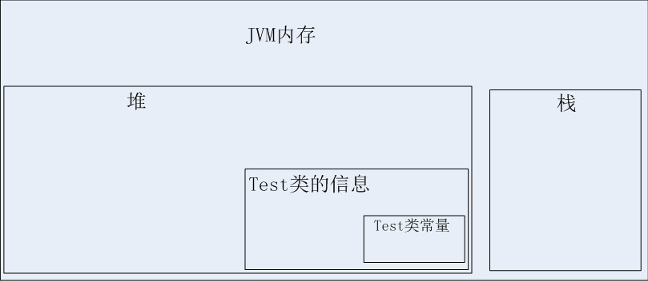

然后，开始执行main函数。执行main函数首先会在虚拟机栈上新建一个线程栈（姑且叫它主线程栈），（每个线程对应一个栈），然后在栈上分配main函数需要的局部变量，和将main函数需要的成员变量和其他变量拷贝到main方法的栈帧中，将main方法的栈帧压入主线程栈。  
这时候由于主线程栈中只有main方法栈帜这么一个栈帧，当然只能执行main方法了。


Main方法执行到1的时候，需要创建MyTh线程类的实例对象。由于是第一次访问MyTh类，所以首先要有个类加载过程，即将MyTh类信息加载进方法区，然后在堆中创建MyTh的实例对象m。

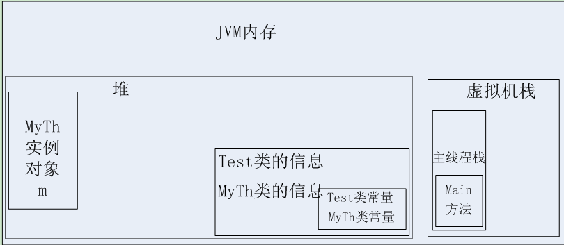

下面开始执行2和3了。。 执行2：

① 首先会在虚拟机栈中创建一个新的线程m的栈（暂叫m栈）
② 然后会创建一个run方法栈帧，将m对象中的run方法需要的变量放入到run方法栈帧中，并且将run方法中需要用到的成员变量（从堆中的m实例对象拷贝）和其他对象（从方法区拷贝）拷贝到run方法栈帧中，将run方法栈帧压入线程m栈中。线程m栈此时只有一个栈帧，执行当前栈顶的栈帧。

执行3：  

类似2中的②，创建一个test方法栈帧，初始化方法栈帧中的局部变量和拷贝其他变量，然后将test方法压入栈，执行主线程栈中的栈顶栈帧。  
上面的执行2和执行3中，其实是部分串行的，就是说2语句肯定更是先执行，但是2语句执行之后，3语句马上开始执行，不用等2执行完（个人认为是在2执行完①操作之后3就开始执行）

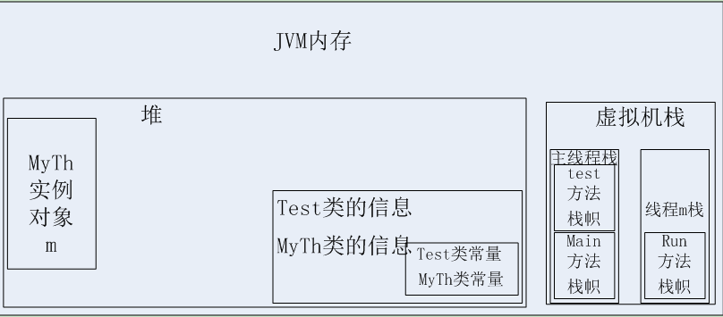

在线程栈中，执行完栈顶栈帜之后，将执行完的栈帜出栈操作。出栈之前，将栈中拷贝到的非局部变量，写入主内存中（原来拷贝的地方），这个拷贝回主存的操作其实在对栈中元素（非局部变量）进行操作的时候一直在执行（拷贝回主存），并且会根据主存中数据更新工作内存的相应数据，但是jvm模型不保证对工作内存中数据的更改能马上回馈给主存（所以有了volatile关键字），所以当多个栈对主存中同一元素进行操作的时候，容易发生多线程安全问题。

## final，finally，finalize的区别
#### final

在java中，final可以用来修饰类，方法和变量（成员变量或局部变量）。下面将对其详细介绍。

###### 修饰类

当用final修饰类的时，表明该类不能被其他类所继承。当我们需要让一个类永远不被继承，此时就可以用final修饰，但要注意：<font color=red>final类中所有的成员方法都会隐式的定义为final方法。</font>

###### 修饰方法

使用final方法的原因主要有两个：

1. 把方法锁定，以防止继承类对其进行更改。
2.  效率，在早期的java版本中，会将final方法转为内嵌调用。但若方法过于庞大，可能在性能上不会有多大提升。因此在最近版本中，不需要final方法进行这些优化了。 
 
final方法意味着“最后的、最终的”含义，即此方法不能被重写。
  
###### 修饰变量

<font color=red>final成员变量表示常量，只能被赋值一次，赋值后其值不再改变。类似于C++中的const。</font>  
当final修饰一个基本数据类型时，表示该基本数据类型的值一旦在初始化后便不能发生变化；如果final修饰一个引用类型时，则在对其初始化之后便不能再让其指向其他对象了，但该引用所指向的对象的内容是可以发生变化的。本质上是一回事，因为引用的值是一个地址，final要求值，即地址的值不发生变化。  
final修饰一个成员变量（属性），必须要显示初始化。这里有两种初始化方式，一种是在变量声明的时候初始化；第二种方法是在声明变量的时候不赋初值，但是要在这个变量所在的类的所有的构造函数中对这个变量赋初值。  
当函数的参数类型声明为final时，说明该参数是只读型的。即你可以读取使用该参数，但是无法改变该参数的值。

```java
@Test
  public void test() {
    final String str1= "mp5a5";
    System.out.println(str1);
    //str1="wang"; //Error 
  }
```

在java中，String被设计成final类，那为什么平时使用时，String的值可以被改变呢？  
字符串常量池是java堆内存中一个特殊的存储区域，当我们建立一个String对象时，假设常量池不存在该字符串，则创建一个，若存在则直接引用已经存在的字符串。当我们对String对象值改变的时候，例如 String a="A"; a="B" 。a是String对象的一个引用（我们这里所说的String对象其实是指字符串常量），当a=“B”执行时，并不是原本String对象("A")发生改变，而是创建一个新的对象("B")，令a引用它。

#### finally
finally作为异常处理的一部分，它只能用在try/catch语句中，并且附带一个语句块，表示这段语句最终一定会被执行（不管有没有抛出异常），经常被用在需要释放资源的情况下。<font color=red>（×）（这句话其实存在一定的问题）</font>  
很多人都认为finally语句块一定会执行，但真的是这样么？答案是否定的，例如下面这个例子：

```java
@Test
  public void test() {
    System.out.println("run of getInt() value:" + getInt());
  }

  private int getInt() {
    int i = 1;
    System.out.println("try catch block");
    i = i / 0;
    try {
      System.out.println("try block");
      return i;
    } finally {
      System.out.println("finally block");
    }
  }
```

输出结果： 

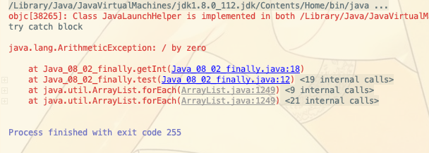

为什么在以上情况下都没有执行finally语句呢，说明什么问题？  
只有与finally对应的try语句块得到执行的情况下，finally语句块才会执行。以上两种情况在执行try语句块之前已经返回或抛出异常，所以try对应的finally语句并没有执行。  
但是，在某些情况下，即使try语句执行了，finally语句也不一定执行。例如以下情况：  

```java
@Test
  public void test() {
    System.out.println("run of getInt() value:" + getInt());
  }

  private int getInt() {
    int i = 1;
    System.out.println("try catch block");
    try {
      System.out.println("try block");
      System.exit(0);
      return i;
    } finally {
      System.out.println("finally block");
    }
  }
```

输出结果：

```java
try catch block
try block
```

finally 语句块还是没有执行，为什么呢？因为我们在 try 语句块中执行了 System.exit (0) 语句，终止了 Java 虚拟机的运行。那有人说了，在一般的 Java 应用中基本上是不会调用这个 System.exit(0) 方法的。OK ！没有问题，我们不调用 System.exit(0) 这个方法，那么 finally 语句块就一定会执行吗？
答案还是否定的。当一个线程在执行 try 语句块或者 catch 语句块时被打断（interrupted）或者被终止（killed），与其相对应的 finally 语句块可能不会执行。还有更极端的情况，就是在线程运行 try 语句块或者 catch 语句块时，突然死机或者断电，finally 语句块肯定不会执行了。可能有人认为死机、断电这些理由有些强词夺理，没有关系，我们只是为了说明这个问题。

<font size=4 color=red>易错点</font>  
<font color=red>在try-catch-finally语句中执行return语句。</font>我们看如下代码：

```java
@Test
  public void test() {
    System.out.println("run of getInt() value:" + getInt("0"));
  }

  private int getInt(String str) {
    try {
      return str.charAt(0) - '0';
    } catch (NullPointerException e) {
      return 1;
    } catch (StringIndexOutOfBoundsException e) {
      return 2;
    } catch (Exception e) {
      return 3;
    } finally {
      return 4;
    }
  }
```
输出语句：

```java
run of getInt() value:4
```

首先finally语句在改代码中一定会执行，从运行结果来看，每次return的结果都是4（即finally语句），仿佛其他return语句被屏蔽掉了。  
事实也确实如此，因为finally用法特殊，所以会撤销之前的return语句，继续执行最后的finally块中的代码。

###### finalize

finalize()是在java.lang.Object里定义的，也就是说每一个对象都有这么个方法。这个方法在gc启动，该对象被回收的时候被调用。其实gc可以回收大部分的对象（凡是new出来的对象，gc都能搞定，一般情况下我们又不会用new以外的方式去创建对象），所以一般是不需要程序员去实现finalize的。   
特殊情况下，需要程序员实现finalize，当对象被回收的时候释放一些资源，比如：一个socket链接，在对象初始化时创建，整个生命周期内有效，那么就需要实现finalize，关闭这个链接。但是也正是因为如此，JVM要对它进行额外处理。finalize也就成为了CG回收的阻碍者，也就会导致这个对象经过多个垃圾收集周期才能被回收。   
使用finalize还需要注意一个事，调用super.finalize();  
一个对象的finalize()方法只会被调用一次，而且finalize()被调用不意味着gc会立即回收该对象，所以有可能调用finalize()后，该对象又不需要被回收了，然后到了真正要被回收的时候，因为前面调用过一次，所以不会调用finalize()，产生问题。 所以，推荐不要使用finalize()方法，它跟析构函数不一样。甚至在Java9中，明确将Object.finalize()标记为deprecated！ 

## 序列化的方式
#### 序列化
序列化 (Serialization)是将对象的状态信息转换为可以存储或传输的形式的过程。由于存在于内存中的对象都是暂时的，无法长期驻存，为了把对象的状态保持下来，这时需要把对象写入到磁盘或者其他介质中，这个过程就叫做序列化。例如javabean转成json的过程。(本质：将对象转变成一串由二进制字节组成的数组)

#### 反序列化

反序列化恰恰是序列化的反向操作，也就是说，把已存在在磁盘或者其他介质中的对象，反序列化（读取）到内存中，以便后续操作，而这个过程就叫做反序列化。。例如json或者xml转成javabean的过程。
## ## Java对象的序列化与反序列化
在Java中，我们可以通过多种方式来创建对象，并且只要对象没有被回收我们都可以复用该对象。但是，我们创建出来的这些Java对象都是存在于JVM的堆内存中的。只有JVM处于运行状态的时候，这些对象才可能存在。一旦JVM停止运行，这些对象的状态也就随之而丢失了。  
但是在真实的应用场景中，我们需要将这些对象持久化下来，并且能够在需要的时候把对象重新读取出来。Java的对象序列化可以帮助我们实现该功能。  
<font color=red>对象序列化机制（object serialization）是Java语言内建的一种对象持久化方式，通过对象序列化，可以把对象的状态保存为字节数组，并且可以在有需要的时候将这个字节数组通过反序列化的方式再转换成对象。对象序列化可以很容易的在JVM中的活动对象和字节数组（流）之间进行转换。</font>  
在Java中，对象的序列化与反序列化被广泛应用到RMI(远程方法调用)及网络传输中。

1. 相关接口及类

Java为了方便开发人员将Java对象进行序列化及反序列化提供了一套方便的API来支持。其中包括以下接口和类：

```java
java.io.Serializable
java.io.Externalizable
ObjectOutput
ObjectInput
ObjectOutputStream
ObjectInputStream
```

2. Serializable

类通过实现 java.io.Serializable 接口以启用其序列化功能。未实现此接口的类将无法使其任何状态序列化或反序列化。可序列化类的所有子类型本身都是可序列化的。序列化接口没有方法或字段，仅用于标识可序列化的语义。  
当试图对一个对象进行序列化的时候，如果遇到不支持 Serializable 接口的对象。在此情况下，将抛出 NotSerializableException。  
<font color=red>虽然Serializable接口中并没有定义任何属性和方法，但是如果一个类想要具备序列化能力也比必须要实现它。其实，主要是因为序列化在真正的执行过程中会使用instanceof判断一个类是否实现类Serializable，如果未实现则直接抛出异常。</font>
如果要序列化的类有父类，要想同时将在父类中定义过的变量持久化下来，那么父类也应该集成java.io.Serializable接口。  
下面是一个实现了java.io.Serializable接口的类

```java
public class User implements Serializable {
  private String name;
  private int age;

  public String getName() {
    return name;
  }

  public void setName(String name) {
    this.name = name;
  }

  public int getAge() {
    return age;
  }

  public void setAge(int age) {
    this.age = age;
  }

  @Override
  public String toString() {
    return "User{" + "name='" + name + '\'' + ", age=" + age + '}';
  }
}
```

通过下面的代码进行序列化及反序列化

```java
public static void main(String[] args) {
    User user = new User();
    user.setName("mp5a5");
    user.setAge(28);
    System.out.println(user);

    // Write Obj to File
    try {
      FileOutputStream fileOutputStream = new FileOutputStream("tempFile");
      ObjectOutputStream objectOutputStream = new ObjectOutputStream(fileOutputStream);
      objectOutputStream.writeObject(user);
    } catch (IOException e) {
      e.printStackTrace();
    }

    // Read Obj from File
    File file = new File("tempFile");
    try {
      FileInputStream fileInputStream = new FileInputStream(file);
      ObjectInputStream objectInputStream = new ObjectInputStream(fileInputStream);
      User newUser = (User) objectInputStream.readObject();
      System.out.println(newUser);
    } catch (IOException | ClassNotFoundException e) {
      e.printStackTrace();
    }
}

//OutPut:
User{name='mp5a5', age=28}
User{name='mp5a5', age=28}
```

<font color=red>如果你观察够细微的话，你可能会发现，我在上面的测试代码中使用了IO流，但是我并没有显示的关闭他。这其实是Java 7中的新特性try-with-resources。这其实是Java中的一个语法糖，背后原理其实是编译器帮我们做了关闭IO流的工作。</font>  
上面的代码中，我们将代码中定义出来的User对象通过序列化的方式保存到文件中，然后再从文件中将他反序列化成Java对象。结果是我们的对象的属性均被持久化了下来。

3. Externalizable接口

除了Serializable 之外，java中还提供了另一个序列化接口Externalizable  
为了了解Externalizable接口和Serializable接口的区别，先来看代码，我们把上面的代码改成使用Externalizable的形式。

```java
public class User1 implements Externalizable {
  private String name;
  private int age;

  public String getName() {
    return name;
  }

  public void setName(String name) {
    this.name = name;
  }

  public int getAge() {
    return age;
  }

  public void setAge(int age) {
    this.age = age;
  }

  @Override
  public String toString() {
    return "User{" + "name='" + name + '\'' + ", age=" + age + '}';
  }

  @Override
  public void writeExternal(ObjectOutput out) throws IOException {

  }

  @Override
  public void readExternal(ObjectInput in) throws IOException, ClassNotFoundException {

  }
}
```

```java
public static void main(String[] args) {
    User1 user = new User1();
    user.setName("mp5a5");
    user.setAge(28);
    System.out.println(user);

    // Write Obj to File
    try {
      FileOutputStream fileOutputStream = new FileOutputStream("tempFile");
      ObjectOutputStream objectOutputStream = new ObjectOutputStream(fileOutputStream);
      objectOutputStream.writeObject(user);
    } catch (IOException e) {
      e.printStackTrace();
    }

    // Read Obj from File
    File file = new File("tempFile");
    try {
      FileInputStream fileInputStream = new FileInputStream(file);
      ObjectInputStream objectInputStream = new ObjectInputStream(fileInputStream);
      User1 newUser = (User1) objectInputStream.readObject();
      System.out.println(newUser);
    } catch (IOException | ClassNotFoundException e) {
      e.printStackTrace();
    }
  }
  
  //OutPut:
User{name='mp5a5', age=28}
User{name='null', age=28}
```

通过上面的实例的输出结果可以发现，对User1类进行序列化及反序列化之后得到的对象的所有属性的值都变成了默认值。也就是说，之前的那个对象的状态并没有被持久化下来。这就是Externalizable接口和Serializable接口的区别：  
<font color=red>Externalizable继承了Serializable，该接口中定义了两个抽象方法：writeExternal()与readExternal()。当使用Externalizable接口来进行序列化与反序列化的时候需要开发人员重写writeExternal()与readExternal()方法。</font>  
由于上面的代码中，并没有在这两个方法中定义序列化实现细节，所以输出的内容为空。还有一点值得注意：<font color=red>在使用Externalizable进行序列化的时候，在读取对象时，会调用被序列化类的无参构造器去创建一个新的对象，然后再将被保存对象的字段的值分别填充到新对象中。所以，实现Externalizable接口的类必须要提供一个public的无参的构造器。</font>    
如果实现了Externalizable接口的类中没有无参数的构造函数，在运行时会抛出异常：java.io.InvalidClassException。如果一个Java类没有定义任何构造函数，编译器会帮我们自动添加一个无参的构造方法，可是，如果我们在类中定义了一个有参数的构造方法了，编译器便不会再帮我们创建无参构造方法，这点需要注意。  
按照要求修改之后代码如下：

```java
public class User1 implements Externalizable {
  private String name;
  private int age;

  public String getName() {
    return name;
  }

  public void setName(String name) {
    this.name = name;
  }

  public int getAge() {
    return age;
  }

  public void setAge(int age) {
    this.age = age;
  }

  @Override
  public String toString() {
    return "User{" + "name='" + name + '\'' + ", age=" + age + '}';
  }

  @Override
  public void writeExternal(ObjectOutput out) throws IOException {
    out.writeObject(name);
    out.writeObject(age);
  }

  @Override
  public void readExternal(ObjectInput in) throws IOException, ClassNotFoundException {
    name = (String) in.readObject();
    age = (int) in.readObject();
  }
}

//OutPut:
User{name='mp5a5', age=28}
User{name='mp5a5', age=28}
```

这次，就可以把之前的对象状态持久化下来了

4. ObjectOutput和ObjectInput 接口

上面的writeExternal方法和readExternal方法分别接收ObjectOutput和ObjectInput类型参数。这两个类作用如下。  
ObjectInput 扩展自 DataInput 接口以包含对象的读操作。   
<font color=red>DataInput 接口用于从二进制流中读取字节，并根据所有 Java 基本类型数据进行重构。同时还提供根据 UTF-8 修改版格式的数据重构 String 的工具。  
对于此接口中的所有数据读取例程来说，如果在读取所需字节数之前已经到达文件末尾 (end of file)，则将抛出 EOFException（IOException 的一种）。如果因为到达文件末尾以外的其他原因无法读取字节，则将抛出 IOException 而不是 EOFException。尤其是，在输入流已关闭的情况下，将抛出 IOException。</font>  
ObjectOutput 扩展 DataOutput 接口以包含对象的写入操作。  
<font color=red>DataOutput 接口用于将数据从任意 Java 基本类型转换为一系列字节，并将这些字节写入二进制流。同时还提供了一个将 String 转换成 UTF-8 修改版格式并写入所得到的系列字节的工具。  
对于此接口中写入字节的所有方法，如果由于某种原因无法写入某个字节，则抛出 IOException。</font>  

5. ObjectOutputStream、ObjectInputStream类

通过前面的代码片段中我们也能知道，我们一般使用ObjectOutputStream的writeObject方法把一个对象进行持久化。再使用ObjectInputStream的readObject从持久化存储中把对象读取出来。

6. transient 关键字
transient 关键字的作用是控制变量的序列化，在变量声明前加上该关键字，可以阻止该变量被序列化到文件中，在被反序列化后，transient 变量的值被设为初始值，如 int 型的是 0，对象型的是 null。

7. serialVersionUID

>serialVersionUID适用于Java的序列化机制。简单来说，虚拟机是否允许反序列化，不仅取决于类路径和功能代码是否一致，一个非常重要的一点是两个类的序列化 ID 是否一致,Java的序列化机制是通过判断类的serialVersionUID来验证版本一致性的。在进行反序列化时，JVM会把传来的字节流中的serialVersionUID与本地相应实体类的serialVersionUID进行比较，如果相同就认为是一致的，可以进行反序列化，否则就会出现序列化版本不一致的异常，即是InvalidCastException。  
>序列化 ID 提供了两种生成策略，一个是固定的 1L，一个是根据类名、接口名、成员方法及属性等来生成一个64位的哈希字段,随机生成一个不重复的 long 类型数据（实际上是使用 JDK 工具生成），在这里有一个建议，如果没有特殊需求，就是用默认的 1L 就可以，这样可以确保代码一致时反序列化成功。那么随机生成的序列化 ID 有什么作用呢，有些时候，通过改变序列化 ID 可以用来限制某些用户的使用。

当实现java.io.Serializable接口的类没有显式地定义一个serialVersionUID变量时候，Java序列化机制会根据编译的Class自动生成一个serialVersionUID作序列化版本比较用，这种情况下，如果Class文件(类名，方法明等)没有发生变化(增加空格，换行，增加注释等等)，就算再编译多次，serialVersionUID也不会变化的。  
如果我们不希望通过编译来强制划分软件版本，即实现序列化接口的实体能够兼容先前版本，就需要显式地定义一个名为serialVersionUID，类型为long的变量，不修改这个变量值的序列化实体都可以相互进行序列化和反序列化。  
下面用代码说明一下serialVersionUID在应用中常见的几种情况。  
序列化实体类：  

```java
public class Person implements Serializable {
  private static final long serialVersionUID = 1234567890L;
  private int id;
  private String name;

  public Person(int id, String name) {
    this.id = id;
    this.name = name;
  }

  public String toString() {
    return "Person: " + id + " " + name;
  }
}
```

1. 情况一：假设Person类序列化之后，从A端传输到B端，然后在B端进行反序列化。在序列化Person和反序列化Person的时候，A端和B端都需要存在一个相同的类。如果两处的serialVersionUID不一致，会产生什么错误呢?  

【答案】可以利用上面的代码做个试验来验证：
先执行测试类SerialTest，生成序列化文件，代表A端序列化后的文件，然后修改serialVersion值，再执行测试类DeserialTest，代表B端使用不同serialVersion的类去反序列化，结果报错:


2.  情况二：假设两处serialVersionUID一致，如果A端增加一个字段，然后序列化，而B端不变，然后反序列化，会是什么情况呢?

【答案】新增 public int age; 执行SerialTest，生成序列化文件，代表A端。删除 public int age，反序列化，代表B端，最后的结果为：执行序列化，反序列化正常，但是A端增加的字段丢失(被B端忽略)。

3. 情况三：假设两处serialVersionUID一致，如果B端减少一个字段，A端不变，会是什么情况呢?

【答案】序列化，反序列化正常，B端字段少于A端，A端多的字段值丢失(被B端忽略)。

4. 情况四：假设两处serialVersionUID一致，如果B端增加一个字段，A端不变，会是什么情况呢?

【答案】序列化，反序列化正常，B端新增加的int字段被赋予了默认值0。
最后通过下面的图片，总结一下上面的几种情况。


<font size =5 color=red>__*总结：*__</font>  
Java序列化的方式：

* 序列化方式一： 实现Serializable接口(隐式序列化)
* 序列化方式二：实现Externalizable接口。(显式序列化)
* 实现Serializable接口+添加writeObject()和readObject()方法。(显+隐序列化)
系统的默认序列化过程是可以改变的，通过实现如下4个方法，即可以控制系统的默认序列化和反序列过程：

```java
public class User implements Serializable {

    private static final long serialVersionUID = -4083503801443301445L;

    private int id;

    private String name;

    public int getId() {
        return id;
    }

    public void setId(int id) {
        this.id = id;
    }

    public String getName() {
        return name;
    }

    public void setName(String name) {
        this.name = name;
    }

    /**
     * 序列化时,
     * 首先系统会先调用writeReplace方法,在这个阶段,
     * 可以进行自己操作,将需要进行序列化的对象换成我们指定的对象.
     * 一般很少重写该方法
     */
    private Object writeReplace() throws ObjectStreamException {
        System.out.println("writeReplace invoked");
        return this;
    }
    /**
     *接着系统将调用writeObject方法,
     * 来将对象中的属性一个个进行序列化,
     * 我们可以在这个方法中控制住哪些属性需要序列化.
     * 这里只序列化name属性
     */
    private void writeObject(java.io.ObjectOutputStream out) throws IOException {
        System.out.println("writeObject invoked");
        out.writeObject(this.name == null ? "默认值" : this.name);
    }

    /**
     * 反序列化时,系统会调用readObject方法,将我们刚刚在writeObject方法序列化好的属性,
     * 反序列化回来.然后通过readResolve方法,我们也可以指定系统返回给我们特定的对象
     * 可以不是writeReplace序列化时的对象,可以指定其他对象.
     */
    private void readObject(java.io.ObjectInputStream in) throws IOException,
            ClassNotFoundException {
        System.out.println("readObject invoked");
        this.name = (String) in.readObject();
        System.out.println("got name:" + name);
    }


    /**
     * 通过readResolve方法,我们也可以指定系统返回给我们特定的对象
     * 可以不是writeReplace序列化时的对象,可以指定其他对象.
     * 一般很少重写该方法
     */
    private Object readResolve() throws ObjectStreamException {
        System.out.println("readResolve invoked");
        return this;
    }
}
```

#### Android专有序列化方式
Parcelable接口来实现序列化操作，Parcelable的性能比Serializable好，在内存开销方面较小，所以在内存间数据传输时推荐使用Parcelable，如通过Intent在activity间传输数据，而Parcelable的缺点就使用起来比较麻烦，下面给出一个Parcelable接口的实现案例:

```java
public class User implements Parcelable {

    public int id;
    public String name;
    public User friend;

    public User() {
    }

    public User(int id, String name, User friend) {
        this.id = id;
        this.name = name;
        this.friend = friend;
    }

	/**
     * 从序列化后的对象中创建原始对象
     */
    protected User(Parcel source) {
        name = source.readString();
        id = source.readInt();
        friend = source.readParcelable(Thread.currentThread().getContextClassLoader());
    }

    /**
     * 当前对象的内容描述,一般返回0即可
     */
    @Override
    public int describeContents() {
        return 0;
    }

    /**
     * 将当前对象写入序列化结构中
     */
    @Override
    public void writeToParcel(Parcel dest, int flags) {
        dest.writeInt(this.id);
        dest.writeString(this.name);
        dest.writeParcelable(this.friend, flags);
    }

    /**
     * public static final一个都不能少，内部对象CREATOR的名称也不能改变，必须全部大写。
     * 重写接口中的两个方法：
     * createFromParcel(Parcel in) 实现从Parcel容器中读取传递数据值,封装成Parcelable对象返回逻辑层，
     * newArray(int size) 创建一个类型为T，长度为size的数组，供外部类反序列化本类数组使用。
     */

    public static final Parcelable.Creator<User> CREATOR = new Creator<User>() {

        /**
         * 从序列化后的对象中创建原始对象
         */
        @Override
        public User createFromParcel(Parcel source) {
            return new User(source);
        }

        /**
         * 创建指定长度的原始对象数组
         */
        @Override
        public User[] newArray(int size) {
            return new User[size];
        }
    };


}
```
从代码可知，在序列化的过程中需要实现的功能有序列化和反序列以及内容描述。其中writeToParcel方法实现序列化功能，其内部是通过Parcel的一系列write方法来完成的，接着通过CREATOR内部对象来实现反序列化，其内部通过createFromParcel方法来创建序列化对象并通过newArray方法创建数组，最终利用Parcel的一系列read方法完成反序列化，最后由describeContents完成内容描述功能，该方法一般返回0，仅当对象中存在文件描述符时返回1。同时由于User是另一个序列化对象，因此在反序列化方法中需要传递当前线程的上下文类加载器，否则会报无法找到类的错误。  
简单用一句话概括来说就是通过writeToParcel将我们的对象映射成Parcel对象，再通过createFromParcel将Parcel对象映射成我们的对象。也可以将Parcel看成是一个类似Serliazable的读写流，通过writeToParcel把对象写到流里面，在通过createFromParcel从流里读取对象，这个过程需要我们自己来实现并且写的顺序和读的顺序必须一致。

## Serializable 和Parcelable 的区别
1. 平台区别
>Serializable是属于 Java 自带的，表示一个对象可以转换成可存储或者可传输的状态，序列化后的对象可以在网络上进行传输，也可以存储到本地。  
>Parcelable 是属于 Android 专用。不过不同于Serializable，Parcelable实现的原理是将一个完整的对象进行分解。而分解后的每一部分都是Intent所支持的数据类型。

2. 编写区别
>Serializable代码量少，写起来方便
>Parcelable代码多一些，略复杂

3. 选择原则
>如果是仅仅在内存中使用，比如activity、service之间进行对象的传递，强烈推荐使用Parcelable，因为Parcelable比Serializable性能高很多。因为Serializable在序列化的时候会产生大量的临时变量， 从而引起频繁的GC。
>如果是持久化操作，推荐Serializable，虽然Serializable效率比较低，但是还是要选择它，因为在外界有变化的情况下，Parcelable不能很好的保存数据的持续性。

4. 设计初衷
>Serializable的设计初衷是为了序列化对象到本地文件、数据库、网络流、RMI以便数据传输，当然这种传输可以是程序内的也可以是两个程序间的。
>而Android的Parcelable的设计初衷是由于Serializable效率过低，消耗大，而android中数据传递主要是在内存环境中（内存属于android中的稀有资源），因此Parcelable的出现为了满足数据在内存中低开销而且高效地传递问题。

5. 本质区别
>Serializable的本质是使用了反射，序列化的过程比较慢，这种机制在序列化的时候会创建很多临时的对象，比引起频繁的GC、
>Parcelable方式的本质是将一个完整的对象进行分解，而分解后的每一部分都是Intent所支持的类型，这样就实现了传递对象的功能了。

## 静态属性和静态方法是否可以被继承？是否可以被重写？以及原因？
<font color=red>java中静态属性和静态方法可以被继承，但是没有被重写(overwrite)而是被隐藏.</font>  
原因：

1. 静态方法和属性是属于类的，调用的时候直接通过类名.方法名完成对，不需要继承机制及可以调用。如果子类里面定义了静态方法和属性，那么这时候父类的静态方法或属性称之为"隐藏"。如果你想要调用父类的静态方法和属性，直接通过父类名.方法或变量名完成，至于是否继承一说，子类是有继承静态方法和属性，但是跟实例方法和属性不太一样，存在"隐藏"的这种情况。
2. 多态之所以能够实现依赖于继承、接口和重写、重载（继承和重写最为关键）。有了继承和重写就可以实现父类的引用指向不同子类的对象。重写的功能是："重写"后子类的优先级要高于父类的优先级，但是“隐藏”是没有这个优先级之分的。
3. 静态属性、静态方法和非静态的属性都可以被继承和隐藏而不能被重写，因此不能实现多态，不能实现父类的引用可以指向不同子类的对象。非静态方法可以被继承和重写，因此可以实现多态。
4. 静态属性和静态方法只是可以继承没有表现出多态性。根据《java编程思想》中的描述这是因为静态方法和静态属性没有采用动态绑定。具体表现就是，将子类实例向上转型则会调用到基类中的静态方法和属性，不转型就调用子类自身的静态方法和属性。编译器不推荐通过实例去调用静态方法和属性，因为这种调用方式容易造成混淆。


## 闭包和局部内部类的区别
#### 局部内部类

```java
public class OuterClass {

  interface Print {
    void print();
  }

  public class InnerClass {

    public void test(final String name) {
    
    	//局部累不累
      Print print =
          new Print() {
            @Override
            public void print() {
              System.out.println(name);
            }
          };

      print.print();
    }

    public void test1(final String str) {
		
		//匿名内部类
      new OuterClass() {

        public void print() {
          System.out.println(str);
        }
      }.print();
    }
  }

  public void main() {
    InnerClass innerClass = new InnerClass();
    innerClass.test("w");
    innerClass.test1("p");
  }
}
```

通过反编译可以得到：

局部内部类

```java
class OuterClass$InnerClass$1 implements OuterClass.Print{

  OuterClass$InnerClass$1(OuterClass.InnerClass paramInnerClass, String paramString) {}
  
  public void print(){
    System.out.println(this.val$name);
  }
  
}
```

匿名内部类

```java
class OuterClass$InnerClass$2 extends OuterClass{

  OuterClass$InnerClass$2(OuterClass.InnerClass paramInnerClass, String paramString) {}
  
  public void print(){
    System.out.println(this.val$str);
  }
}
```

看源码两个内部类各编译出了一个独立的class文件，也就是说InnerClass $1 InnerClass$2的生命周期是对象级别的，而变量name、str是方法级别的，方法运行完了变量就销毁了，而局部内部类对象InnerClass $1和InnerClass$2还可能一直存在(只能没有人再引用该对象时,它才会被GC回收),它不会随着方法运行结束就马上死亡。这时可能会出现了一种"荒唐"的结果:局部内部类对象inner_object要访问一个已不存在的局部变量name、str!  
也有人说：当方法调用完了，内部类也不可能再被访问到了，照理内部类对象也应该成为了垃圾。  
别忘了Java还有反射，而且在多线程的情况下完全有可能主线程的方法运行结束，而内部类还在运行,例如：

```java
public void execute() {
  final int s = 10;
       class InnerClass {
          public void execute() {
              new Thread() {
              @Override
               public void run() {
                 try {
                        Thread.currentThread().sleep(2000);
                        System.out.println(s);
                 } catch (final InterruptedException e) {
                       e.printStackTrace();
                  }
               }
             }.start();
           }
         }
        new InnerClass().execute();
        System.out.println("主方法已经over");
    } 
```
为什么把变量定义为final就能避免上述问题？  
看stackoverflow上的一个讨论:  
[stackoverflow](http://stackoverflow.com/questions/3910324/why-java-inner-classes-require-final-outer-instance-variables)  
stackoverflow里最高票的答案说到，当主方法结束时，局部变量会被cleaned up 而内部类可能还在运行。当局部变量声明为final时，当使用已被cleaned up的局部变量时会把局部变量替换成常量：
也就是说当变量是final时,编译器会将final局部变量"复制"一份,复制品直接作为局部内部中的数据成员.这样，当局部内部类访问局部变量时,其实真正访问的是这个局部变量的"复制品"。因此:当运行栈中的真正的局部变量死亡时,局部内部类对象仍可以访问局部变量(其实访问的是"复制品")。而且，由于被final修饰的变量赋值后不能再修改，所以就保证了复制品与原始变量的一致。给人的感觉:好像是局部变量的"生命期"延长了。这就是java的闭包。

##### 闭包
所谓闭包，即是函数中包含函数，这里的函数我们可以包含(Lambda表达式，匿名函数，局部函数，对象表达式)。(Ruby之父松本行弘在《代码的未来》一书中解释的最好：<font color=red>闭包就是把函数以及变量包起来，使得变量的生存周期延长。闭包跟面向对象是一棵树上的两条枝，实现的功能是等价的。</font>)

#### Java中闭包带来的问题
在Java的经典著作《Effective Java》、《Java Concurrency in Practice》里，都提到：匿名函数里的变量引用，也叫做变量引用泄露，会导致线程安全问题，因此在Java8之前，如果在匿名类内部引用函数局部变量，必须将其声明为final，即不可变对象。(Python和Javascript从一开始就是为单线程而生的语言，一般也不会考虑这样的问题，所以它的外部变量是可以任意修改的)。  
而java8的lambda 表达式之所以不用写final，是因为Java8这里加了一个语法糖：在lambda表达式以及匿名类内部，如果引用某局部变量，则直接将其视为final。本质并没有改变。


