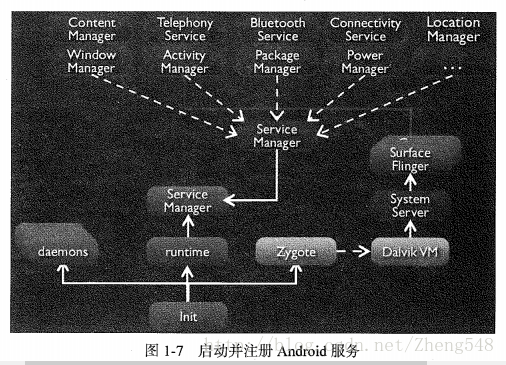
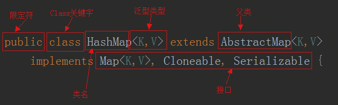

## java中==和equals和hashCode的区别

一、概要

1、```==```:
   
1. 基本数据类型，也称原始数据类型：byte,short,char,int,long,float,double,boolean 他们之间的比较，应用双等号```（==）```,比较的是他们的值。   
2. 复合数据类型(类):  当他们用```（==）```进行比较的时候，比较的是他们在内存中的存放地址，所以，除非是同一个new出来的对象，他们的比较后的结果为true，否则比较后结果为false。 

2、equals

1. JAVA当中所有的类都是继承于Object这个基类的，在Object中的基类中定义了一个equals的方法，这个方法的初始行为是比较对象的内存地址，但在一些类库当中这个方法被覆盖掉了，如String,Integer,Date在这些类当中equals有其自身的实现，而不再是比较类在堆内存中的存放地址了。  
2. 对于复合数据类型之间进行equals比较，在没有覆写equals方法的情况下，他们之间的比较还是基于他们在内存中的存放位置的地址值的，因为Object的equals方法也是用双等号```（==）```进行比较的，所以比较后的结果跟双等号```（==）```的结果相同。
    
二、==

== 比较的是变量(栈)内存中存放的对象的(堆)内存地址，用来判断两个对象的地址是否相同，即是否是指相同一个对象。比较的是真正意义上的指针操作。

1. 比较的是操作符两端的操作数是否是同一个对象。
2. 两边的操作数必须是同一类型的（可以是父子类之间）才能编译通过。
3. 比较的是地址，如果是具体的阿拉伯数字的比较，值相等则为true，

如：int a=10 与 long b=10L 与 double c=10.0都是相同的（为true），因为他们值相等。

三、equals

1.Object类中默认的实现方式是:```return this == obj```。就是说，只有this 和 obj引用同一个对象，才会返回true。而我们往往需要用equals来判断2个对象是否等价，而非验证他们的唯一性。这样我们在实现自己的类时，就要重写equals.

按照约定，equals要满足以下规则。

* 自反性:  x.equals(x) 一定是true
* 非空性:  x.equals(null) 一定是false
* 对称性:  x.equals(y)  和  y.equals(x)结果一致
* 传递性:  a 和 b equals , b 和 c  equals，那么 a 和 c也一定equals。
* 一致性:  在某个运行时期间，2个对象的状态的改变不会不影响equals的决策结果，那么，在这个运行时期间，无论调用多少次equals，都返回相同的结果。 
 
2.equals用来比较的是两个对象的内容是否相等，由于所有的类都是继承自java.lang.Object类的，所以适用于所有对象，如果没有对该方法进行覆盖的话，调用的仍然是Object类中的方法，而Object中的equals方法返回的却是==的判断。

3.==和equals对String字符串的比较

* String str和 new String(str)的区别

String s="abce"是一种非常特殊的形式,和new 有本质的区别。它是java中唯一不需要new 就可以产生对象的途径。以String s="abce";形式赋值在java中叫直接量,它是在常量池中而不是象new一样放在堆中。这种形式的字符串，在JVM内部发生字符串拘留，即当声明这样的一个字符串后，JVM会在常量池中先查找有有没有一个值为"abcd"的对象,如果有,就会把它赋给当前引用.即原来那个引用和现在这个引用指点向了同一对象,如果没有,则在常量池中新创建一个"abcd",下一次如果有String s1 = "abcd";又会将s1指向"abcd"这个对象,即以这形式声明的字符串,只要值相等,任何多个引用都指向同一对象. 
 
String s = new String("abcd");和其它任何对象一样.每调用一次就产生一个对象。  

也可以这么理解: String str = "hello"; 先在内存中找是不是有"hello"这个对象,如果有，就让str指向那个"hello".如果内存里没有"hello"，就创建一个新的对象保存"hello". 

String str = new String ("hello") 就是不管内存里是不是已经有"hello"这个对象，都新建一个对象保存"hello"。  

```java
public class TestString {
 public static void main(String[] args) {
	String s1 = "Monday";
	String s2 = "Monday";
	
	if (s1 == s2){
		System.out.println("s1 == s2");}
	else{
		System.out.println("s1 != s2");}
   }
}
```

编译并运行程序，输出：s1 == s2说明：s1 与 s2 引用同一个 String 对象 -- "Monday"!  
再稍微改动一下程序，会有更奇怪的发现：

```java
public class TestString {
	public static void main(String[] args) {
	String s1 = "Monday";
	String s2 = new String("Monday");
	
	if (s1 == s2){
		System.out.println("s1 == s2");
	}else{
		System.out.println("s1 != s2");
	}
	
	if (s1.equals(s2)) {
		System.out.println("s1 equals s2");
	}else{
		System.out.println("s1 not equals s2");}
	}
}
```

程序输出：  
s1 != s2  
s1 equals s2  
说明：s1 s2分别引用了两个"Monday"String对象  

* 字符串缓冲池

程序在运行的时候会创建一个字符串缓冲池当使用 s2 = "Monday" 这样的表达是创建字符串的时候，程序首先会在这个String缓冲池中寻找相同值的对象，在第一个程序中，s1先被放到了池中，所以在s2被创建的时候，程序找到了具有相同值的 s1
将s2引用s1所引用的对象"Monday"
第二段程序中，使用了 new 操作符，他明白的告诉程序："我要一个新的！不要旧的！"于是一个新的"Monday"Sting对象被创建在内存中。他们的值相同，但是位置不同。  
再次更改程序： 

```java 
public class TestString {
	public static void main(String[] args) {
	String s1 = "Monday";
	String s2 = new String("Monday");
	s2 = s2.intern();
	
	if (s1 == s2){
		System.out.println("s1 == s2");
	}else{
		System.out.println("s1 != s2");
	}
	
	if (s1.equals(s2)) {
		System.out.println("s1 equals s2");}
	else{
		System.out.println("s1 not equals s2");}
	}
}
```

加入：s2 = s2.intern();  
程序输出：  
s1 == s2  
s1 equals s2  
原 来，（java.lang.String的intern()方法"abc".intern()方法的返回值还是字符串"abc"，表面上看起来好像这个方法没什么用处。但实际上，它做了个小动作：检查字符串池里是否存在"abc"这么一个字符串，如果存在，就返回池里的字符串；如果不存在，该方法会 把"abc"添加到字符串池中，然后再返回它的引用。

三、hashCode

1.这个方法返回对象的散列码，返回值是int类型的散列码（将该对象的内部地址转换成一个整数返回）。HashCode的存在主要是为了查找的快捷性，HashCode是用来在散列存储结构中确定对象的存储地址的。例如hashMap就是利用hashcode来计算存入哪一个entry的。 
 
2.hashCode方法，一致的约定是：

* 两个对象的hashcode相同，对象不一定是一个对象（equals（Object obj）不一定返回true）。
* 两个对象的hashcode不同，他们一定不equals（equals（Object obj）一定返回false）。
* 如果两个对象的equals相同，，Java运行时环境会认为他们的hashcode一定相等。
* 如果两个对象的equals不同，，hashCode（）不一定返回不同的int数。
* 对于equals和hashcode，如果重写了equals方法，那么也尽量重写hashcode方法。
* 同一对象在执行期间若已经存储在集合中，则不能修改影响hashCode值的相关信息，否则会导致内存泄露问题。

3.hashCode作用：

Java中的集合（Collection）有两类，一类是List，再有一类是Set。前者集合内的元素是有序的，元素可以重复；后者元素无序，但元素不可重复。  

那么这里就有一个比较严重的问题了：要想保证元素不重复，可两个元素是否重复应该依据什么来判断呢？  
这就是Object.equals方法了。但是，如果每增加一个元素就检查一次，那么当元素很多时，后添加到集合中的元素比较的次数就非常多了。也就是说，如果集合中现在已经有1000个元素，那么第1001个元素加入集合时，它就要调用1000次equals方法。这显然会大大降低效率。 
    
于是，Java采用了哈希表的原理。这样一来，当集合要添加新的元素时，先调用这个元素的hashCode方法，就一下子能定位到它应该放置的物理位置上。   

如果这个位置上没有元素，它就可以直接存储在这个位置上，不用再进行任何比较了；  

如果这个位置上已经有元素了，就调用它的equals方法与新元素进行比较，相同的话就不存，不相同就散列其它的地址。

所以这里存在一个冲突解决的问题。这样一来实际调用equals方法的次数就大大降低了，几乎只需要一两次。

1)在集合操作的时候有如下规则： 
 
将对象放入到集合中时，首先判断要放入对象的hashcode值与集合中的任意一个元素的hashcode值是否相等，如果不相等直接将该对象放入集合中。如果hashcode值相等，然后再通过equals方法判断要放入对象与集合中的任意一个对象是否相等，如果equals判断不相等，直接将该元素放入到集合中，否则不放入。  

回过来说get的时候，HashMap也先调key.hashCode()算出数组下标，然后看equals如果是true就是找到了，所以就涉及了equals。
  
2)《Effective Java》书中有两条是关于equals和hashCode的：  

覆盖equals时需要遵守的通用约定： 
   
覆盖equals方法看起来似乎很简单，但是如果覆盖不当会导致错误，并且后果相当严重。《Effective Java》一书中提到"最容易避免这类问题的办法就是不覆盖equals方法"

不需要覆盖equals的情景

* 类的每个实例本质上都是唯一的

>对于代表活动实体而不是值(value)的类来说确实如此，比如Thread

* 不关心类是否提供了“逻辑相等”的测试功能

>书本上的例子是java.util.Random覆盖equals，以检查两个Random实例是否产生相同的随机数序列，但是设计者并不认为客户需要或者期望这样的功能。在这种情况下，从Object继承得到的equals实现已经足够了

* 父类已经覆盖了equals，从父类继承过来的行为对于子类也是合适的

>例如大多数的Set实现都是从AbstractSet继承equals实现

* 类是私有的或者是包级私有的，可以确定它的equals方法永远不会被调用。在这种情况下，无疑是应该覆盖equals方法的，以防它被以外调用

>这种情况下，只是对equals的一种废弃，并没有新加什么功能

```
@override
public boolean equals(Object obj){
    throw new AssertionError();
}
```	

需要覆盖equals的情景

在覆盖equals方法的时候，你必须要遵守它的通用约定(自反性、对称性、传递性、一致性、非空性)。

如果类具有自己特有的“逻辑相等”概念(不同于对象等同的概念)，而且父类还没有覆盖equals以实现期望行为，这时就需要覆盖equals方法。覆盖equals方法的时候，必须遵守以下通用约定
结合以上要求，得出了以下实现高质量equals方法的诀窍： 
 
1. 使用==符号检查“参数是否为这个对象的引用”。如果是，则返回true。这只不过是一种性能优化，如果比较操作有可能很昂贵，就值得这么做。  
2. 使用instanceof操作符检查“参数是否为正确的类型”。如果不是，则返回false。一般来说，所谓“正确的类型”是指equals方法所在的那个类。  
3. 把参数转换成正确的类型。因为转换之前进行过instanceof测试，所以确保会成功。  
4. 对于该类中的每个“关键”域，检查参数中的域是否与该对象中对应的域相匹配。如果这些测试全部成功，则返回true;否则返回false。  
5. 当编写完成了equals方法之后，检查“对称性”、“传递性”、“一致性”。   


覆盖equals时总要覆盖hashCode  

Object.java对hashCode()方法的说明：  

1. 在java应用执行期间，只要对象的equals方法的比较操作所用到的信息没有被修改，那么对这同一对象调用多次hashCode方法都必须始终如一地同一个整数。在同一个应用程序的多次执行过程中，每次执行该方法返回的整数可以不一致。
2. 如果两个对象根据equals(Object)方法比较是相等的，那么调用这两个对象中任意一个对象的hashCode方法都必须产生同样的整数结果。
3. 如果两个对象根据equals(Object)方法比较是不相等的，那么调用这两个对象中任意一个对象的hashCode方法没必要产生不同的整数结果。但是程序猿应该知道，给不同的对象产生截然不同的整数结果，有可能提高散列表（hash table）的性能。

因此，覆盖equals时总是要覆盖hashCode是一种通用的约定，而不是必须的，如果和基于散列的集合（HashMap、HashSet、HashTable）一起工作时，特别是将该对象作为key值的时候，一定要覆盖hashCode，否则会出现错误。那么既然是一种规范，那么作为程序猿的我们就有必要必须执行，以免出现问题。

#### 自动拆装箱：

一、基本数据类型有什么好处

在Java语言中，new一个对象是存储在堆里的，我们通过栈中的引用来使用这些对象；所以，对象本身来说是比较消耗资源的。  
对于经常用到的类型，如int等，如果我们每次使用这种变量的时候都需要new一个Java对象的话，就会比较笨重。所以，和C++一样，Java提供了基本数据类型，这种数据的变量不需要使用new创建，他们不会在堆上创建，而是直接在栈内存中存储，因此会更加高效。

二、包装类型

Java语言是一个面向对象的语言，但是Java中的基本数据类型却是不面向对象的，这在实际使用时存在很多的不便，为了解决这个不足，在设计类时为每个基本数据类型设计了一个对应的类进行代表，这样八个和基本数据类型对应的类统称为包装类(Wrapper Class)。  
包装类均位于java.lang包，包装类和基本数据类型的对应关系如下表所示： 
 
|基本数据类型|包装类     |
|:------:  |:------:  |
|byte      |Byte      |
|boolean   |Boolean   |
|short     |Short     |
|char      |Character |
|int       |Integer   |
|float     |Float     |
|double    |Double    |
在这八个类名中，除了Integer和Character类以后，其它六个类的类名和基本数据类型一致，只是类名的第一个字母大写即可。

三、为什么需要包装类

很多人会有疑问，既然Java中为了提高效率，提供了八种基本数据类型，为什么还要提供包装类呢？  
这个问题，其实前面已经有了答案，因为Java是一种面向对象语言，很多地方都需要使用对象而不是基本数据类型。比如，在集合类中，我们是无法将int 、double等类型放进去的。因为集合的容器要求元素是Object类型。  
为了让基本类型也具有对象的特征，就出现了包装类型，它相当于将基本类型“包装起来”，使得它具有了对象的性质，并且为其添加了属性和方法，丰富了基本类型的操作。

四、自动拆箱与自动装箱

在Java SE5以后，为了减少开发人员的工作，Java提供了自动拆箱与自动装箱功能。  
自动装箱: 就是将基本数据类型自动转换成对应的包装类。  
自动拆箱：就是将包装类自动转换成对应的基本数据类型。  

```java
Integer i =10;  //自动装箱
int b= i;     //自动拆箱
```
<font color=red > Integer i=10</font> 可以替代 <font color=red >Integer i = new Integer(10)</font>，这就是因为Java帮我们提供了自动装箱的功能，不需要开发者手动去new一个Integer对象。

五、自动拆箱与自动装箱的实现原理

源代码：

```java
public static  void main(String[]args){
    Integer integer=1; //装箱
    int i=integer; //拆箱
}
```

反编译后得到的字节码：

```java
public static void main(String[] paramArrayOfString) {
    Integer localInteger = Integer.valueOf(1);
    int i = localInteger.intValue();
}
```

* int的自动装箱都是通过Integer.valueOf()方法来实现的

```
public static Integer valueOf(int i) {
    if (i >= IntegerCache.low && i <= IntegerCache.high)
        return IntegerCache.cache[i + (-IntegerCache.low)];
    return new Integer(i);
}
```

Integer的自动拆箱都是通过integer.intValue  

```
public int intValue() {
    return value;
}
```

六、哪些地方会自动拆装箱

场景1.将基本数据类型放入集合类

我们知道，Java中的集合类只能接收对象类型，但是下面代码却不报错

```java
List<Integer> li = new ArrayList<>();
for (int i = 1; i < 50; i ++){
    li.add(i);
}
```
反编译上面代码

```java
List<Integer> li = new ArrayList<>();
for (int i = 1; i < 50; i += 2){
    li.add(Integer.valueOf(i));
}
```

以上，我们可以得出结论，当我们把基本数据类型放入集合类中的时候，会进行自动装箱。

场景2.包装类型和基本类型的大小比较

对Integer对象与基本类型进行大小比较的时候，实际上比较的是什么内容

```java
Integer a=1;
System.out.println(a==1?"等于":"不等于");
Boolean bool=false;
System.out.println(bool?"真":"假");
```
反编译上面代码

```java
Integer a=1;
System.out.println(a.intValue()==1?"等于":"不等于");
Boolean bool=false;
System.out.println(bool.booleanValue?"真":"假");
```
可以看到，包装类与基本数据类型进行比较运算，是先将包装类进行拆箱成基本数据类型，然后进行比较的。

场景3.包装类型的四则运算

我们对Integer对象进行四则运算的时候，是如何进行的呢？看以下代码：

```java
Integer i = 10;
Integer j = 20;
System.out.println(i+j);
```
反编译后代码如下：

```java
Integer i = Integer.valueOf(10);
Integer j = Integer.valueOf(20);
System.out.println(i.intValue() + j.intValue());
```
我们发现，两个包装类型之间的运算，会被自动拆箱成基本类型进行。

场景4.三目运算符的使用

```java
boolean flag = true;
Integer i = 0;
int j = 1;
int k = flag ? i : j;
```

很多人不知道，其实在int k = flag ? i : j;这一行，会发生自动拆箱。反编译后代码如下：

```java
boolean flag = true;
Integer i = Integer.valueOf(0);
int j = 1;
int k = flag ? i.intValue() : j;
System.out.println(k);
```

这其实是三目运算符的语法规范。当第二，第三位操作数分别为基本类型和对象时，其中的对象就会拆箱为基本类型进行操作。  

场景5.函数参数与返回值

这个比较容易理解，直接上代码了：

```java
//自动拆箱
public int getNum1(Integer num) {
 return num;
}
//自动装箱
public Integer getNum2(int num) {
 return num;
}
```

七、自动拆箱与缓存

Java SE的自动拆装箱还提供了一个和缓存有关的功能,首先看如下代码：

```java
public static void main(String[] args) {

    Integer integer = new Integer(3);
    Integer integer0 = new Integer(3);

    Integer integer1 = 3;
    Integer integer2 = 3;

    if (integer == integer0) System.out.println("integer == integer0");
    else System.out.println("integer != integer0");

    if (integer1 == integer2) System.out.println("integer1 == integer2");
    else System.out.println("integer1 != integer2");

    Integer integer3 = 300;
    Integer integer4 = 300;

    if (integer3 == integer4) System.out.println("integer3 == integer4");
    else System.out.println("integer3 != integer4");
  }
```

我们普遍认为上面的三个判断的结果都是false。虽然比较的值是相等的，但是由于比较的是对象，而对象的引用不一样，所以会认为三个if判断都是false的。在Java中，==比较的是对象应用，而equals比较的是值。所以，在这个例子中，不同的对象有不同的引用，所以在进行比较的时候都将返回false。奇怪的是，这里三个类似的if条件判断返回不同的布尔值。

上面这段代码真正的输出结果：

```java
integer != integer0
integer1 == integer2
integer3 != integer4
```

原因就和Integer中的缓存机制有关。在Java 5中，在Integer的操作上引入了一个新功能来节省内存和提高性能。整型对象通过使用相同的对象引用实现了缓存和重用。
>适用于整数值区间-128 至 +127。  
>只适用于自动装箱。使用构造函数创建对象不适用。

具体实现参考[Java中整型的缓存机制](http://www.hollischuang.com/archives/1174)  
我们只需要知道，当需要进行自动装箱时，如果数字在-128至127之间时，会直接使用缓存中的对象，而不是重新创建一个对象。  
其中的javadoc详细的说明了缓存支持-128到127之间的自动装箱过程。最大值127可以通过-XX:AutoBoxCacheMax=size修改。  
实际上这个功能在Java 5中引入的时候,范围是固定的-128 至 +127。后来在Java 6中，可以通过java.lang.Integer.IntegerCache.high设置最大值。  
这使我们可以根据应用程序的实际情况灵活地调整来提高性能。到底是什么原因选择这个-128到127范围呢？因为这个范围的数字是最被广泛使用的。 在程序中，第一次使用Integer的时候也需要一定的额外时间来初始化这个缓存。

八、自动拆装箱带来的问题

1. 包装对象的数值比较，不能简单的使用==，虽然-128到127之间的数字可以，但是这个范围之外还是需要使用equals比较。
2. 有些场景会进行自动拆装箱，同时也说过，由于自动拆箱，如果包装类对象为null，那么自动拆箱时就有可能抛出NPE。
3. 如果一个for循环中有大量拆装箱操作，会浪费很多资源。

## string 转换成 integer的方式及原理

内部源码

1. Integer.parseInt（String str）方法

```java
public static int parseInt(String s) throws NumberFormatException {
        return parseInt(s,10);
}
```

2. Integer.parseInt（String s, int radix）方法

```java
public static int parseInt(String s, int radix) throws NumberFormatException {
        
        // 下面三个判断好理解，其中表示进制的 radix 要在（2~36）范围内
        //判断字符是否为null
        if (s == null) {
            throw new NumberFormatException("s == null");
        }
        //基数是否小于最小进制
        if (radix < Character.MIN_RADIX) {
            throw new NumberFormatException("radix " + radix + " less than Character.MIN_RADIX");
        }
        //基数是否大于最大进制
        if (radix > Character.MAX_RADIX) {
            throw new NumberFormatException("radix " + radix +" greater than Character.MAX_RADIX");
        }

		 // 表示结果，在下面的计算中会一直是个负数， 
		 // 假如说 我们的字符串是一个正数  "7" ， 
		 // 那么在返回这个值之前result保存的是 -7，
		 // 这个可能是为了保持正数和负数在下面计算的一致性
        int result = 0;
        //是否时负数
        boolean negative = false;
        //char字符下标和s长度
        int i = 0, len = s.length();
        //限制  
        //Integer.MAX_VALUE   2147483647
        //Integer.MIN_VALUE   -2147483648
        
        //limit 默认初始化为最大正整数的 负数 ，假如字符串表示的是正数，
	     //那么result(在返回之前一直是负数形式)就必须和这个最大正数的负数来比较，判断是否溢出
        int limit = -Integer.MAX_VALUE;
        int multmin;
        int digit;
        //判断字符长度是否大于0，否则抛出异常
        if (len > 0) {
            // 首先是对第一个位置判断，是否含有正负号
            char firstChar = s.charAt(0);
            //根据ascii码表看出加号(43)和负号(45)对应的
            //十进制数小于‘0’(48)的
            if (firstChar < '0') { // Possible leading "+" or "-"
                //是负号
                if (firstChar == '-') {
                    //负号属性设置为true
                    negative = true;
                    // 这里，在负号的情况下，判断溢出的值就变成了整数的最小负数了。
                    limit = Integer.MIN_VALUE;
                }
                //不是负号也不是加号则抛出异常
                else if (firstChar != '+')
                    throw NumberFormatException.forInputString(s);
                //如果有符号（加号或者减号）且字符串长度为1，则抛出异常
                if (len == 1) // Cannot have lone "+" or "-"
                    throw NumberFormatException.forInputString(s);
                i++;
            }
            multmin = limit / radix;
            
            // 这个是用来判断当前的 result 在接受下一个字符串位置的数字后会不会溢出。
		     //	原理很简单，为了方便，拿正数来说
		     //	（multmin result 在计算中都是负数），假如是10
		     // 进制,假设最大的10进制数是 21，那么multmin = 21/10 = 2, 
		     //	如果我此时的 result 是 3 ，下一个字符c来了，result即将变成
	 	     // result = result * 10 + c;那么这个值是肯定大于 21 ，即溢出了，
	        //	这个溢出的值在 int里面是保存不了的，不可能先计算出
		    // result（此时的result已经不是溢出的那个值了） 后再去与最大值比较。
		    // 所以要通过先比较  result < multmin   （说明result * radix 后还比 limit 小）

            
            while (i < len) {
                // Accumulating negatively avoids surprises near MAX_VALUE
                //返回指定基数中字符表示的数值。（此处是十进制数值）
                digit = Character.digit(s.charAt(i++),radix);
                //小于0，则为非radix进制数
                if (digit < 0) {
                    throw NumberFormatException.forInputString(s);
                }
                //这里是为了保证下面计算不会超出最大值
                // 这里就是上说的判断溢出，由于result统一用负值来计算，所以用了小于号
		         // 从正数的角度看就是   reslut > mulmin  下一步reslut * radix 肯定是溢出了
                if (result < multmin) {
                    throw NumberFormatException.forInputString(s);
                }
                result *= radix;
                // 这里也是判断溢出， 由于是负值来判断，相当于 （-result + digit）> - limit
		         // 但是不能用这种形式，如果这样去比较，那么得出的值是肯定判断不出溢出的。
		         // 所以用    result < limit + digit    很巧妙
                if (result < limit + digit) {
                    throw NumberFormatException.forInputString(s);
                }
                result -= digit;
            }
        } else {
            throw NumberFormatException.forInputString(s);
        }
        //根据上面得到的是否负数，返回相应的值
        return negative ? result : -result;
    }
```

```java

public static int digit(int codePoint, int radix) {
		//进制必须再最大和最小基数之间（2~36）
        if (radix < MIN_RADIX || radix > MAX_RADIX) {
            return -1;
        }
        
        ASCII范围（0~127）
        if (codePoint < 128) {
            // Optimized for ASCII
            int result = -1;
            //字符在0-9字符之间
            if ('0' <= codePoint && codePoint <= '9') {
                result = codePoint - '0';
            } else if ('a' <= codePoint && codePoint <= 'z') {//字符在a-z之间
                result = 10 + (codePoint - 'a');
            } else if ('A' <= codePoint && codePoint <= 'Z') {//字符在A-Z之间
                result = 10 + (codePoint - 'A');
            }
            //通过判断result和进制大小，输出对应值
            //通过我们parseInt对应的基数值为10，
            //所以，只能在第一个判断（字符在0-9字符之间）
            //中得到result值 否则后续程序会抛出异常
            return result < radix ? result : -1;
        }
        return digitImpl(codePoint, radix);
    }
```

总结：

* parseInt(String s)--内部调用parseInt(s,10)（默认为10进制）==将字符串的值转化成10进制int值
* 正常判断null，进制范围，length等
* 通过ascii码，判断第一个字符是否是符号位
* 循环遍历确定每个字符的十进制值
* 通过*= 和-= 进行计算拼接
* 判断是否为负值 返回结果。

## String、StringBuffer、StringBuilder区别

一、String

不可变类，属性value为不可变数组，即String初始化构造器没有初始容量为16的概念，你定义多少，String中字符数组的长度就是多少，不存在字符数组扩容一说。看下源码：


```java
public final class String implements java.io.Serializable, Comparable<String>, CharSequence {
    
    private final char value[];

    private int hash; // Default to 0

    public String() {
        this.value = "".value;
    }
    
    public String(String original) {
        this.value = original.value;
        this.hash = original.hash;
    }
    ...
```

final修饰的String 类，以及final修饰的char[] value,表示String类不可被继承，且value只能被初始化一次。这里的value变量其实就是存储了String字符串中的所有字符。  
既然String，不可变。再看下它的截取方法subString（）实现

```java
public String substring(int beginIndex) {
    ...
    int subLen = value.length - beginIndex;
    ...
    return (beginIndex == 0) ? this : new String(value, beginIndex, subLen);
}
```

这里可以看到，在substring方法中，如果传入的参数为0，就返回自身原对象，否则就是重新创建一个新的对象。

```java
public String(char value[], int offset, int count) {
    ...
    if (count <= 0) {
        ...
        if (offset <= value.length) {
            this.value = "".value;
            return;
        }
    }
    
    if (offset > value.length - count) {
        throw new StringIndexOutOfBoundsException(offset + count);
    }
    this.value = Arrays.copyOfRange(value, offset, offset+count);
}


public static char[] copyOfRange(char[] original, int from, int to) {
    int newLength = to - from;
    if (newLength < 0)
        throw new IllegalArgumentException(from + " > " + to);
    char[] copy = new char[newLength];
    System.arraycopy(original, from, copy, 0,
                     Math.min(original.length - from, newLength));
    return copy;
}
```

类似的我们可以看到，String类的concat方法，replace方法，都是内部重新生成一个String对象的。  
这也就是为什么我们如果采用String对象频繁的进行拼接，截取，替换操作效率很低下的原因。

二、StringBuilder

内部可变数组，存在初始化StringBuilder对象中字符数组容量为16，存在扩容。


StringBuilder类继承AbstractStringBuilder抽象类，其中StringBuilder的大部分方法都是直接调用的父类的实现。

1、构造方法

1.空参数的构造方法

```java
public StringBuilder() {
    super(16);
}


AbstractStringBuilder(int capacity) {
    value = new char[capacity];
}
```

调用父类构造方法，字符数组的的大小为默认16  

2.自定义初始容量-构造函数

```java
public StringBuilder(int capacity) {
    super(capacity);
}
```

自定义初始char[]的容量

3.以字符串String 作为参数的构造

```java
public StringBuilder(String str) {
    super(str.length() + 16);
    append(str);
}
```

以默认长度16的基础上，增加字符串str的长度，作为StringBuilder实例的初始数组容量，，并将str字符串 append到StringBuilder的数组中。

```java
@Override
public StringBuilder append(String str) {
    super.append(str);
    return this;
}
```

具体看下父类AbstractStringBuilder的append方法

```java
public AbstractStringBuilder append(String str) {
    if (str == null)
        return appendNull();
    int len = str.length();
    ensureCapacityInternal(count + len);
    str.getChars(0, len, value, count);
    count += len;
    return this;
}
```

* 首先判断append的参数是否为null，如果为null的话，这里也是可以append进去的

```java
private AbstractStringBuilder appendNull() {
    int c = count;
    ensureCapacityInternal(c + 4);
    final char[] value = this.value;
    value[c++] = 'n';
    value[c++] = 'u';
    value[c++] = 'l';
    value[c++] = 'l';
    count = c;
    return this;
}
```

其中ensureCapacityInternal方法是确保这次append 的时候StringBuilder的内部数组容量是满足的扩容的，即这次要append的null字符长度为4，加上之前内部数组中已有的字符位数cout之后作为参数执行。

* 如果不为null的话，就获取这次需要append的str的字符长度。紧接着执行是否需要扩容的方法  
append方法的关键：String的 getChars方法（从str的0位开始，到str的长度，当前StringBuilder对象的字符数组，当前数组已有的字符长度）

```java
public void getChars(int srcBegin, int srcEnd, char dst[], int dstBegin) {
    ...
    System.arraycopy(value, srcBegin, dst, dstBegin, srcEnd - srcBegin);
}

public static native void arraycopy(Object src,  int srcPos, Object dest, int destPos,int length);
```

其实是调用了System的arraycopy方法 参数如下:  
 
* value 为str的内部不可变字符数组，   
* srcBegin 为从str 字符串数组的0下标开始，    
* srcEnd 为str字符串数组的长度，    
* dst 为StringBuilder对象的内部可变字符数组，    
* dstBegin 则为StringBuilder对象中已有的字符长度（char[] 已有的元素长度）

即整个StringBuilder的append方法，本质上是调用System的native方法，直接将String 类型的str字符串中的字符数组，拷贝到了StringBuilder的字符数组中


2、toString()

```java
@Override
public String toString() {
    return new String(value, 0, count);
}
```

这里的toString方法直接new 一个String对象，将StringBuilder对象的value进行一个拷贝，重新生成一个对象，不共享之前StringBuilder的char[]。  
以上就是StringBuilder的拼接字符串的原理分析，可以发现没有像String一样去重新new 对象，所以在频繁的拼接字符上，StringBuilder的效率远远高于String类。

三、StringBuffer

线程安全的高效字符串操作类，看下源码：


1、构造方法


类似于StringBuilder  

append方法：

```java
@Override
public synchronized StringBuffer append(String str) {
    toStringCache = null;
    super.append(str);
    return this;
}
```

可以看到这里就是在append方法上加了同步锁，来实现多线程下的线程安全。其他的和StringBuilder一致。  

这里比StringBuilder多了一个参数

```java
private transient char[] toStringCache;
```

这里的作用简单介绍一下，就是去缓存toString的值  
可以看下StringBuffer的toString方法

```java
@Override
public synchronized String toString() {
    if (toStringCache == null) {
        toStringCache = Arrays.copyOfRange(value, 0, count);
    }
    return new String(toStringCache, true);
}

```

这里的作用就是如果StringBuffer对象此时存在toStringCache，在多次调用其toString方法时，其new出来的String对象是会共享同一个char[] 内存的，达到共享的目的。但是StringBuffer只要做了修改，其toStringCache属性值都会置null处理。这也是StringBuffer和StringBuilder的一个区别点。  

总结：

1. String 类不可变，内部维护的char[] 数组长度不可变，为final修饰，String类也是final修饰，不存在扩容。字符串拼接，截取，都会生成一个新的对象。频繁操作字符串效率低下，因为每次都会生成新的对象。    StringBuilder 类内部维护可变长度char[] ， 初始化数组容量为16，存在扩容， 其append拼接字符串方法内部调用System的native方法，进行数组的拷贝，不会重新生成新的
2. StringBuilder对象。非线程安全的字符串操作类， 其每次调用 toString方法而重新生成的String对象，不会共享StringBuilder对象内部的char[]，会进行一次char[]的copy操作。    
3. StringBuffer 类内部维护可变长度char[]， 基本上与StringBuilder一致，但其为线程安全的字符串操作类，大部分方法都采用了Synchronized关键字修改，以此来实现在多线程下的操作字符串的安全性。其toString方法而重新生成的String对象，会共享StringBuffer对象中的toStringCache属性（char[]），但是每次的StringBuffer对象修改，都会置null该属性值。

## String为什么要设计成不可变的？

一、不可变

不是在原内存地址上修改数据，而是重新指向一个新对象，新地址


源码：

```java
public final class String
    implements java.io.Serializable, Comparable<String>, CharSequence {
    
    /** The value is used for character storage. */
    private final char value[];

    /** Cache the hash code for the string */
    private int hash; // Default to 0

}
```

* 首先，String类是用final关键字修饰，这说明String不可继承。
* 其次，String类的主力成员字段value是个char[]数组，而且是用final修饰的。final修饰的字段创建以后就不可改变。

虽然value是不可变的，也只是value这个引用地址不可变。挡不住Array数组是可变的事实。


也就是说Array变量只是stack上的一个引用，数据的本体结构在heap堆。String类里的value用final修饰，只是说stack里的这个叫value的引用地址不可变。没有说堆里array本身数据不可变。看这个这个例子，

```java
final int[] value={1,2,3}
 
int[] another={4,5,6};
 
value = another;//编译器报错，final不可变

```

value用final修饰，编译器不允许我把value指向堆区另一个地址。但如果直接对数组元素动手，分分钟搞定。

```java
final int[] value={1,2,3};
 
value[2]=100;//这时候数组里已经是{1,2,100}
```

所以String是不可变，在所有String的方法里很小心地没有去动Array里的元素，没有暴露内部成员字段。private final char value[]这一句里，private的私有访问权限的作用都比final大。而且设计师还很小心地反整个String设计成final禁止继承，避免被其他人继承后破坏。

二、好处

1.字符串常量池的需要

字符串常量池(String pool, String intern pool, String保留池) 是Java堆内存中一个特殊的存储区域, 当创建一个String对象时,假如此字符串值已经存在于常量池中,则不会创建一个新的对象,而是引用已经存在的对象。

如下面的代码所示,将会在堆内存中只创建一个实际String对象.


假若字符串对象允许改变,那么将会导致各种逻辑错误,比如改变一个对象会影响到另一个独立对象. 严格来说，这种常量池的思想,是一种优化手段.

请思考: 假若代码如下所示，s1和s2还会指向同一个实际的String对象吗?

```java
String s1= "ab" + "cd";
String s2= "abc" + "d";
```

他们都会指向常量池中的同一个对象. 或者,你可以用 jd-gui 之类的工具查看一下编译后的class文件.

每当我们创建字符串常量时，JVM会首先检查字符串常量池，如果该字符串已经存在常量池中，那么就直接返回常量池中的实例引用。如果字符串不存在常量池中，就会实例化该字符串并且将其放到常量池中。由于String字符串的不可变性我们可以十分肯定常量池中一定不存在两个相同的字符

intern方法使用：一个初始为空的字符串池，它由类String独自维护。当调用 intern方法时，如果池已经包含一个等于此String对象的字符串（用equals(oject)方法确定），则返回池中的字符串。否则，将此String对象添加到池中，并返回此String对象的引用。

>Java虚拟机有一个字符串池，保存着几乎所有的字符串对象。字符串表达式总是指向字符串池中的一个对象。使用new操作创建的字符串对象不指向字符串池中的对象
>intern()方法的原理：如果池中已经有相同的字符串。有则直接返回池中的字符串，否则先将字符串添加到池中，再返回。这步操作相当于手动向常量池里扔东西

静态常量池：即*.class文件中的常量池，class文件中的常量池不仅仅包含字符串(数字)字面量，还包含类、方法的信息，占用class文件绝大部分空间。
运行时常量池：则是jvm虚拟机在完成类装载操作后，将class文件中的常量池载入到内存中，并保存在方法区中，我们常说的常量池，就是指方法区中的运行时常量池。

2.安全性

String被许多的Java类(库)用来当做参数,例如 网络连接地址URL,文件路径path,还有反射机制所需要的String参数等, 假若String不是固定不变的,将会引起各种安全隐患。  
譬如，数据库的用户名、密码都是以字符串的形式传入来获得数据库的连接，或者在socket编程中，主机名和端口都是以字符串的形式传入。因为字符串是不可变的，所以它的值是不可改变的，否则黑客们可以钻到空子，改变字符串指向的对象的值，造成安全漏洞。  

3.允许String对象缓存HashCode

Java中String对象的哈希码被频繁地使用, 比如在hashMap 等容器中。  
字符串不变性保证了hash码的唯一性,因此可以放心地进行缓存.这也是一种性能优化手段,意味着不必每次都去计算新的哈希码. 

## 抽象类和接口区别

abstract class和interface是Java语言中对于抽象类定义进行支持的两种机制，正是由于这两种机制的存在，才赋予了Java强大的面向对象能力。 abstract class和interface之间在对于抽象类定义的支持方面具有很大的相似性，甚至可以相互替换，因此很多开发者在进行抽象类定义时对于 abstract class和interface的选择显得比较随意。  
其实，两者之间还是有很大的区别的，对于它们的选择甚至反映出对于问题领域本质的理解、对于设计意图的理解是否正确、合理。 

一、理解抽象类

abstract class和interface在Java语言中都是用来进行抽象类定义的，那么什么是抽象类，使用抽象类能为我们带来什么好处呢？  

在面向对象的概念中，我们知道所有的对象都是通过类来描绘的，但是反过来却不是 这样。并不是所有的类都是用来描绘对象的，如果一个类中没有包含足够的信息来描绘一个具体的对象，这样的类就是抽象类。抽象类往往用来表征我们在对问题空间进行分析、设计中得出的抽象概念，是对一系列看上去不同，但是本质上相同的具体概念的抽象。  

比如：如果我们进行一个图形编辑软件的开发，就会发现问题空间存在着圆、三角形 这样一些具体概念，它们是不同的，但是它们又都属于形状这样一个概念，形状这个概念在问题领域是不存在的，它就是一个抽象概念。正是因为抽象的概念在问题空间没有对应的具体概念，所以用以表征抽象概念的抽象类是不能够实例化的。  
  
在面向对象领域，抽象类主要用来进行类型隐藏。我们可以构造出一个固定的一组行为的抽象描述，但是这组行为却能够有任意个可能的具体实现方式。这个抽象描述就是抽象类，而这一组任意个可能的具体实现则表现为所有可能的派生类。模块可以操作一个抽象体。由于模块依赖于一个固定的抽象体，因此它可以是不允许修改的；同时，通过从这个抽象体派生，也可扩展此模块的行为功能。熟悉OCP的读者一定知道，为了能够实现面向对象设计的一个最核心的原则OCP(Open-Closed Principle)，抽象类是其中的关键所在。

二、区别

1.从语法定义层面看abstract class和interface

在语法层面，Java语言对于abstract class和interface给出了不同的定义方式，下面以定义一个名为Demo的抽象类为例来说明这种不同。使用abstract class的方式定义Demo抽象类的方式如下：

```java
abstract class Demo ｛    
  
abstract void method1();    
  
abstract void method2();    
  
…    
  
｝  
```

```java
interface Demo {    
  
void method1();    
  
void method2();    
  
…    
  
}
```

* 在abstract class方式中，可以有自己的数据成员，也可以有非abstarct的成员方法，

* 在interface方式的实现中，只能够有静态的不能被修改的数据成员（也就是必须是static final的，不过在interface中一般不定义数据成员），所有的成员方法都是abstract的(但是在JDK1.8以后，interface中也可以有也可以有非abstarct的成员方法)。从某种意义上说，interface是一种特殊形式的abstract class。

2.从编程的角度来看abstract class和interface
  
* abstract class在Java语言中表示的是一种继承关系，一个类只能使用一次继承关系。但是一个类却可以实现多个interface。也许，这是Java语言的设计者在考虑Java对于多重继承的支持方面的一种折中考虑吧。
* 在abstract class的定义中，我们可以赋予方法的默认行为。但是在interface的定义中，方法却不能拥有默认行为，为了绕过这个限制，必须使用委托，但是这会增加一些复杂性，有时会造成很大的麻烦。(jdk1.8之前)  

在抽象类中不能定义默认行为还存在另一个比较严重的问题，那就是可能会造成维护上的麻烦。因为如果后来想修改类的界面以适应新的情况（比如，添加新的方法或者给已用的方法中添加新的参数）时，就会非常的麻烦，可能要花费很多的时间（对于派生类很多的情况，尤为如此）。但是如果界面是通过abstract class来实现的，那么可能就只需要修改定义在abstract class中的默认行为就可以了。（jdk1.8之前）  

同样，如果不能在抽象类中定义默认行为，就会导致同样的方法实现出现在该抽象类 的每一个派生类中，违反了"one rule，one place"原则，造成代码重复，同样不利于以后的维护。因此，在abstract class和interface间进行选择时要非常的小心。 
 
3.从设计理念层面看abstract class和interface
  
abstarct class在Java语言中体现了一种继承关系，要想使得继承关系合理，父类和派生类之间必须存在"is a"关系，即父类和派生类在概念本质上应该是相同的。对于interface 来说则不然，并不要求interface的实现者和interface定义在概念本质上是一致的，仅仅是实现了interface定义的契约而已。为了使述便于理解，下面将通过一个简单的实例进行说明。  

考虑这样一个例子，假设在我们的问题空间中有一个关于Door的抽象概念，该Door具有执行两个动作open和close，此时我们可以通过abstract class或者interface来定义一个表示该抽象概念的类型，定义方式分别如下所示：

```java
abstract class Door {    
  
abstract void open();    
  
abstract void close()；    
  
}  
```

```java
interface Door {    
  
void open();    
  
void close();    
  
} 
```

其他具体的Door类型可以extends使用abstract class方式定义的Door或者implements使用interface方式定义的Door。看起来好像使用abstract class和interface没有大的区别。  
如果现在要求Door还要具有报警的功能。我们该如何设计针对该例子的类结构呢？下面将罗列出可能的解决方案，并从设计理念层面对这些不同的方案进行分析。 

###### 解决方案一：  

简单的在Door的定义中增加一个alarm方法，如下：

```java
abstract class Door {    
  
abstract void open();    
  
abstract void close()； 

abstract void alarm()；    
}  
```

```java
interface Door {    
  
void open();    
  
void close();  

void alarm();      
  
} 
```

那么具有报警功能的AlarmDoor的定义方式如下：

```java
class AlarmDoor extends Door {    
  
void open() { … }    
  
void close() { … }    
  
void alarm() { … }    
  
}  
```

```java
class AlarmDoor implements Door ｛    
  
void open() { … }    
  
void close() { … }    
  
void alarm() { … }    
  
｝
```

这种方法违反了面向对象设计中的一个核心原则ISP（Interface Segregation Priciple），在Door的定义中把Door概念本身固有的行为方法和另外一个概念"报警器"的行为方法混在了一起。这样引起的一个问题是那些仅仅依赖于Door这个概念的模块会因为"报警器"这个概念的改变（比如：修改alarm方法的参数）而改变，反之依然。  

###### 解决方案二：

既然open、close和alarm属于两个不同的概念，根据ISP原则应该把们分别定义在代表这两个概念的抽象类中。

定义方式有：

* 这两个概念都使用abstract class方式定义；
* 两个概念都使用interface方式定义；
* 一个概念使用abstract class方式定义，另一个概念使用interface方式定义。  

显然，由于Java语言不支持多重继承，所以两个概念都使用abstract class方式定义是不可行的。后面两种方式都是可行的，但是对于它们的选择却反映出对于问题空间中的概念本质的理解、对于设计意图的反映是否正确、合理。我们一一来分析、说明。   
 
如果两个概念都使用interface方式来定义，那么就反映出两个问题： 
 
1. 我们可能没有理解清楚问题领域，AlarmDoor在概念本质上到底是Door还是报警器？
2. 如果我们对于问题空间的理解没有问题，比如：我们通过对于问题空间的分析发现 AlarmDoor在概念本质上和Door是一致的，那么我们在实现时就没有能够正确的揭示我们的设计意图，因为在这两个概念的定义上（均使用 interface方式定义）反映不出上述含义。  

如果我们对于问题领域的理解是：AlarmDoor在概念本质上是Door，同时它有具有报警的功能。我们该如何来设计、实现来明确的反映出我们的意思呢？前面已经说过，abstract class在Java语言中表示一种继承关系，而继承关系在本质上是"is a"关系。所以对于Door这个概念，我们应该使用abstarct class方式来定义。另外，AlarmDoor又具有报警功能，说明它又能够完成报警概念中定义的行为，所以报警概念可以通过interface方式定 义。如下所示：

```java
abstract class Door {    
  
abstract void open();    
  
abstract void close()；    
  
}  
```

```java
interface Alarm {    
  
void alarm();    
  
} 
```

```java
class AlarmDoor extends Door implements Alarm {    
  
void open() { … }    
  
void close() { … }    
  
void alarm() { … }    
  
}   
```

这种实现方式基本上能够明确的反映出我们对于问题空间的理解，正确的揭示我们的设计意图。其实abstract class表示的是"is a"关系，interface表示的是"like a"关系，大家在选择时可以作为一个依据，当然这是建立在对问题领域的理解上的，比如：如果我们认为AlarmDoor在概念本质上是报警器，同时又具有Door的功能，那么上述的定义方式就要反过来了。  
abstract class和interface是Java语言中的两种定义抽象类的方式，它们之间有很大的相似性。但是对于它们的选择却又往往反映出对于问题空间中的概念本质的理解、对于设计意图的反映是否正确、合理，因为它们表现了概念间的不同的关系（虽然都能够实现需求的功能）。这其实也是语言的一种的惯用法。
  
总结:

1. 抽象类和接口都不能直接实例化，如果要实例化，抽象类变量必须指向实现所有抽象方法的子类对象，接口变量必须指向实现所有接口方法的类对象。
2. 抽象类要被子类继承，接口要被类实现。
3. 接口只能做方法申明（jdk1.8之后，接口中可以做方法申明，也可以做方法实现），抽象类中可以做方法申明，也可以做方法实现
4. 接口里定义的变量只能是公共的静态的常量，抽象类中的变量是普通变量。
5. 抽象类里的抽象方法必须全部被子类所实现，如果子类不能全部实现父类抽象方法，那么该子类只能是抽象类。同样，一个实现接口的时候，如不能全部实现接口方法，那么该类也只能为抽象类。
6. 抽象方法只能申明，不能实现。abstract void abc();不能写成abstract void abc(){}。
7. 抽象类里可以没有抽象方法
8. 如果一个类里有抽象方法，那么这个类只能是抽象类
9. 抽象方法要被实现，所以不能是静态的，也不能是私有的。
10. 接口可继承接口，并可多继承接口，但类只能单根继承。

抽象类是对一种事物的抽象，即对类抽象，而接口是对行为的抽象。抽象类是对整个类整体进行抽象，包括属性、行为，但是接口却是对类局部（行为）进行抽象。

特别是对于公用的实现代码，抽象类有它的优点。抽象类能够保证实现的层次关系，避免代码重复。然而，即使在使用抽象类的场合，也不要忽视通过接口定义行为模型的原则。从实践的角度来看，如果依赖于抽象类来定义行为，往往导致过于复杂的继承关系，而通过接口定义行为能够更有效地分离行为与实现，为代码的维护和修改带来方便。

#### JDK1.8接口变化

Java 8的接口上的default method最初的设计目的是让已经存在的接口可以演化——添加新方法而不需要原本已经存在的实现该接口的类做任何改变（甚至不需要重新编译）就可以使用该新版本的接口。

以Java的 java.util.List 接口为例，它在Java SE 7的时候还没有sort()方法，而到Java SE 8的时候添加了这个方法。那么如果我以前在Java SE 7的时候写了个类 MyList 实现了 List<T> 接口，我当时是不需要实现这个 sort() 方法的；当我升级到JDK8的时候，突然发现接口上多了个方法，于是 MyList 类就也得实现这个方法并且重新编译才可以继续使用了，对不对？所以就有了default method。上述 List.sort() 方法在Java SE 8里就是一个default method，它在接口上提供了默认实现，于是 MyList 即便不提供sort()的实现，也会自动从接口上继承到默认的实现，于是MyList不必重新编译也可以继续在Java SE 8使用。

从Java SE 8的设计主题来看，default method是为了配合JDK标准库的函数式风格而设计的。通过default method，很多JDK里原有的接口都添加了新的可以接收FunctionalInterface参数的方法，使它们更便于以函数式风格使用。Java 8的接口，即便有了default method，还暂时无法完全替代抽象类。它不能拥有状态，只能提供公有虚方法的默认实现。Java 9的接口已经可以有非公有的静态方法了。未来的Java版本的接口可能会有更强的功能，或许能更大程度地替代原本需要使用抽象类的场景。

四、抽象类与接口的应用场景

#### interface应用场合

1. 类与类之间需要特定的接口进行协调，而不在乎其如何实现。
2. 作为能够实现特定功能的标识存在，也可以是什么接口方法都没有的纯粹标识。如序列化接口：Serializable
3. 需要将一组类视为单一的类，而调用者只通过接口来与这组类发生联系。
4. 需要实现特定的多项功能，而这些功能之间可能完全没有任何联系。

#### abstract class应用在什么场合

1. 定义了一组接口，但又不想强迫每个实现类都必须实现所有的接口。可以用abstract class定义一组方法体，甚至可以是空方法体，然后由子类选择自己所感兴趣的方法来覆盖。
2. 某些场合下，只靠纯粹的接口不能满足类与类之间的协调，还必需类中表示状态的属性来区别不同的关系。

规范了一组相互协调的方法，其中一些方法是共同的，与状态无关的，可以共享的，无需子类分别实现；而另一些方法却需要各个子类根据自己特定的状态来实现特定的功能。

## java泛型

1. Java1.5 引入了泛型，同时为了兼容旧代码，保留了Raw类型。

* Raw类型：  

> 举个例子，```List<Object> ```为泛型，对应的，List为Raw类型。两者有些细微的区别。  

在没有泛型的年代，多态是一个很好的泛化机制。无论什么对象都可以用 Object 来持有，丢进列表里。不过存在一些安全问题，我们来看一个简单例子：

```java
/**
 * 输出最大的学号
 * @param studentNoList 学号列表
 */
public static void printMaxStudentNo(List studentNoList){
    int maxOrderNo = 0;
    for(Object orderNo: studentNoList)
        if(maxOrderNo < (int)orderNo)
            maxOrderNo = (int)orderNo;
    System.out.println(maxOrderNo);
}

public static void main(String[] args) {
    // 输出 999
    printMaxStudentNo(Arrays.asList(999, 34, 354));	 // ClassCastException
    printMaxStudentNo(Arrays.asList("999", "34", "354"));	
}
```

我们很快意识到，studentNoList中学号的类型不明确，如果调用方不小心，以为学号是 String 类型，传入 String 的列表，有可能招致 Crash。关键点在于，我们无法保证studentNoList.get()返回的一定是数字。  

引入泛型的其中一个目的是解决这样的类型安全问题。于是，我们得到了类型安全的版本：

```java
public static void printMaxStudentNo(List<Integer> studentNoList){...}

public static void main(String[] args) {
    // 输出 999
    printMaxStudentNo(Arrays.asList(999, 34, 354));	 // 编译错误       
    printMaxStudentNo(Arrays.asList("999", "34", "354"));	
}
```

* 类型擦除  

提到这个概念，有经验的 Java 程序员总能举出一些例子。例如：

```java
System.out.println(new ArrayList<Integer>().getClass() == new ArrayList<String>().getClass());  // true
```

看一下反编译以后的样子，很好理解，泛型在编译以后擦除到了Raw 类型：

```java
System.out.println(new ArrayList().getClass() == new ArrayList().getClass());
```

通过反编译代码既然已经类型擦除了为什么 ```printMaxStudentNo(List<String>)```，与参数类型```List<Integer> ```不匹配导致编译错误，既然```List<String>```与```List<Integer>```类型相同，为何又会类型不匹配呢？如何理解如下代码无法通过编译（它与类型擦除矛盾吗？）：

```java
ArrayList<Integer> list = new ArrayList<String>();
```

* 类型擦除干净了吗

我们知道，对于泛型 ```List<T> ```，我们不能```new T()```、```new T[]```、```List<T>.class```、```instanceof List<T>```。也就是说，由于擦除，我们失去了获取形参T实际类型的能力。  

那么对于泛型```List<String>```，我们能否拿到实参String的类型呢？答案是肯定的：  
[知乎：Java为什么要添加运行时获取泛型的方法](https://www.zhihu.com/question/36645143/answer/68650398)

```java
// 先转成参数化类型 ParameterizedType
ParameterizedType paramType = (ParameterizedType) new ArrayList<String>(){}.getClass().getGenericSuperclass();
System.out.println(paramType.getActualTypeArguments()[0]);  // 拿到实参，输出 java.lang.String
```

短短两行，我们成功输出了```ArrayList<String>```中的String。  

是的，泛型实参类型的信息还在，保留在某些角落里。这也正是Gson中TypeToken所使用的技术。另外，我们心爱的Retrofit也用到了同样的技术。
> PS:
> 注意到代码中是匿名类```new ArrayList<String>(){}```，而非```new ArrayList<String>()``。其中的区别可以结合TypeToken细细体会，不展开讲。

#### 通配符与变型(variance)

##### 变形

变型这个概念在 Java 中提及很少，几次在《Effective Java》中邂逅它，难免还是不理解。直到后来，在某个更完善的泛型体系中找到了解释，它便是 Scala。  
名词解释：总结自 《Scala编程》  

不变 (invariance)、协变 (covariance)、逆变 (contravariance)  

以 ``` C<T> ```为例，给定两个类型 Child 和 Parent，满足``` Child extends Parent ```，则``` C<Child> ```与 ``` C<Parent> ```之间存在三种关系：

1. 如果``` C<Child> extends C<Parent> ```，那么 C 是协变的;
2. 如果``` C<Parent> extends C<Child> ```，那么 C 是逆变的;
3. 如果``` C<Child> ```与``` C<Parent> ```毫无关系，那么 C 是不变的。  

它们统称为变型(variance)。  
简而言之，变型描述了实参具有继承关系时，对于整体类型之间关系的影响。
Java 中的泛型是不变的，也可以说是阉割版的。后面我们会看到，kotlin 所谓的泛型新特性——声明点变型，不过是借鉴了 Scala 的成功经验。好在 kotlin 的泛型是完整的，用起来会更加舒服。  

#### 泛型与不变

>所谓不变，即``` ArrayList<Object> list = new ArrayList<String>(); ```不合法。  
>泛型之所以设计成不变，是为了类型安全。

具体一点的例子，则有：

```java
List<String> strList = new ArrayList<>(Arrays.asList("haha"));
List<Object> objList = strList;	                    // 1. 企图用 List<Object> 持有它，然后加入数字
objList.add(999);
String lastItem = strList.get(strList.size()-1);    // 2. 获取列表最后一个字符串
```

假设泛型支持协变，即 1 处的赋值合法，则在 2 处会得到一个 ClassCastException。而设计成不变可以在编译时禁止 1 处的赋值，从而提前解决掉问题。这和 kotlin 中引入空安全是一个道理。
>PS:
>值得一提的是，数组被设计成协变的。即上述代码用数组来写，会在 2 处会得到一个 ArrayStoreException。  
>故有，《Effective Java》第25条：列表优先于数组。  
>更多讨论参见 [知乎：java中，数组为什么要设计为协变？](https://www.zhihu.com/question/21394322)

#### 上/下界通配符与协/逆变

不变保证了安全，却降低了灵活性。某些场景下，我们需要协变和逆变，相应的也会有一些限制。

```java
class Parent{}  
class Child extends Parent{}  
List<? extends Parent> list = new ArrayList<Child>();  // List<父类>引用List<子类>, 可近似理解为协变 (上界通配符)  
List<? super Child> list = new ArrayList<Parent>();  // List<子类>引用List<父类>, 可近似理解为逆变 (下界通配符)  
```

它们有啥用呢？设想这样一个场景，先别看源码，考虑实现一个Collections.copy(dest, src)，即列表的拷贝。

```java
// 版本1，只支持 List<Object> 的 copy，局限性大
public static void copy(List<Object> dest, List<Object> src){...}

// 版本2，dest 和 src 的实参必须为相同类型，局限性大
public static <T> void copy(List<T> dest, List<T> src){...}

// 版本3，jdk实现。dest实参 可以是 src实参 的父类
public static <T> void copy(List<? super T> dest, List<? extends T> src) {
    for(int i=0; i<src.size() && i<dest.size(); i++) 
        dest.set(i, src.get(i));
}
```

通过协变，src可以持有任何T的子类型的List；相应的，通过逆变，dest可以持有任何T的父类型的List。于是，api 设计上变的更为灵活。

#### 通配符的限制

考虑到协变带来了objList.add(999)的问题，最终不幸得到了ClassCastException。  
具体一点，假设我们用协变改写一下例子（使得 1 处能成功赋值）：

```java
List<String> strList = new ArrayList<>(Arrays.asList("haha"));
List<? extends Object> objList = strList;     // 1. 企图用 List<? extends Object> 持有它，然后加入数字
objList.add(999);
String lastItem = strList.get(strList.size()-1);    // 2. 获取列表最后一个字符串
```

那么，Java 的设计者们如何应对这种情况呢？答案是，编译器直接禁止了objList.add(999)。

一般的，对通配符有如下限制：

1. 对于协变? extends T，只能get()，即作为生产者(Producer)。
2. 对于逆变? super T，只能set()，即作为消费者(Consumer)。
3. 俗称PECS: Producer-extends，Consumer-super。

<font color=red size=5>**_总结:_**</font>

1. 泛型提供了编译时的类型安全，在运行时擦除到Raw类型
2. 擦除并非完全擦除掉泛型信息，某些情况下，可以用反射拿到实参的类型（如 TypeToken）。
3. 泛型列表是不变的，所以优于泛型数组。
4. Java 提供通配符来模拟协变和逆变，有 PECS 口诀。熟记它，看懂 Observable 中的各种 super、extends 不在话下。

#### Java 泛型 <? super T> 中 super 怎么理解？与 extends 有何不同

1. <? extend T>：是指上界通配符

由于指定了T为所有元素的“根”，你任何时候都可以安全的用T来使用容器里的元素，但是插入有问题，由于供奉T为祖先的子树有很多，不同子树并不兼容，由于实参可能来自于任何一颗子树，所以你的插入很可能破坏函数实参，所以，对这种写法的形参，禁止做插入操作，只做读取。

```java
public class GenericsAndCovariance {
    public static void main(String[] args) {
        // Wildcards allow covariance:
        List<? extends Fruit> flist = new ArrayList<Apple>();
        // flist.add(new Apple());
        // flist.add(new Fruit());
        // flist.add(new Object());
        flist.add(null); // Legal but uninteresting
        // We know that it returns at least Fruit:
        Fruit f = flist.get(0);
    }
}
```

上面的例子中， flist 的类型是 List<? extends Fruit>，我们可以把它读作：一个类型的 List， 这个类型可以是继承了 Fruit的某种类型。注意，这并不是说这个 List 可以持有 Fruit 的任意类型。通配符代表了一种特定的类型，它表示 “某种特定的类型，但是 flist 没有指定”。这样不太好理解，具体针对这个例子解释就是，flist 引用可以指向某个类型的 List，只要这个类型继承自 Fruit，可以是 Fruit 或者 Apple，比如例子中的 new ArrayList<Apple>，但是为了向上转型给 flist，flist 并不关心这个具体类型是什么。  
  
如上所述，通配符 List<? extends Fruit> 表示某种特定类型 ( Fruit 或者其子类 ) 的 List，但是并不关心这个实际的类型到底是什么，反正是 Fruit 的子类型，Fruit 是它的上边界。那么对这样的一个 List 我们能做什么呢？其实如果我们不知道这个 List 到底持有什么类型，怎么可能安全的添加一个对象呢？在上面的代码中，向 flist 中添加任何对象，无论是 Apple 还是 Orange 甚至是 Fruit 对象，编译器都不允许，唯一可以添加的是 null。所以如果做了泛型的向上转型 (List<? extends Fruit> flist = new ArrayList<Apple>())，那么我们也就失去了向这个 List 添加任何对象的能力，即使是 Object 也不行。 
   
另一方面，如果调用某个返回 Fruit 的方法，这是安全的。因为我们知道，在这个 List 中，不管它实际的类型到底是什么，但肯定能转型为 Fruit，所以编译器允许返回 Fruit。  
了解了通配符的作用和限制后，好像任何接受参数的方法我们都不能调用了。其实倒也不是，看下面的例子：

```java
public class CompilerIntelligence {
    public static void main(String[] args) {
        List<? extends Fruit> flist =
        Arrays.asList(new Apple());
        Apple a = (Apple)flist.get(0); // No warning
        flist.contains(new Apple()); // Argument is ‘Object’
        flist.indexOf(new Apple()); // Argument is ‘Object’
        
        //flist.add(new Apple());   无法编译

    }
}
```

在上面的例子中，flist 的类型是 List<? extends Fruit>，泛型参数使用了受限制的通配符，所以我们失去了向其中加入任何类型对象的例子，最后一行代码无法编译。  
但是 flist 却可以调用 contains 和 indexOf 方法，它们都接受了一个 Apple 对象做参数。如果查看 ArrayList 的源代码，可以发现 add() 接受一个泛型类型作为参数，但是 contains 和 indexOf 接受一个 Object 类型的参数，下面是它们的方法签名：  

```java
public boolean add(E e)
public boolean contains(Object o)
public int indexOf(Object o)
```

所以如果我们指定泛型参数为 <? extends Fruit> 时，add() 方法的参数变为 ? extends Fruit，编译器无法判断这个参数接受的到底是 Fruit 的哪种类型，所以它不会接受任何类型。  
然而，contains 和 indexOf 的类型是 Object，并没有涉及到通配符，所以编译器允许调用这两个方法。这意味着一切取决于泛型类的编写者来决定那些调用是 “安全” 的，并且用 Object 作为这些安全方法的参数。如果某些方法不允许类型参数是通配符时的调用，这些方法的参数应该用类型参数，比如 add(E e)。
  
2. <? super T>：是指下界通配符 不影响往里存，但往外取只能放在Object对象里

对于这个泛型，?代表容器里的元素类型，由于只规定了元素必须是T的超类，导致元素没有明确统一的“根”（除了Object这个必然的根），所以这个泛型你无法使用它，除了把元素强制转成Object。所以，对把参数写成这样形态的函数，只能对这个泛型做插入操作，而无法读.

```java
public class SuperTypeWildcards {
    static void writeTo(List<? super Apple> apples) {
        apples.add(new Apple());
        apples.add(new Jonathan());
        // apples.add(new Fruit()); // Error
    }
}
```

writeTo 方法的参数 apples 的类型是 List<? super Apple>，它表示某种类型的 List，这个类型是 Apple 的基类型。也就是说，我们不知道实际类型是什么，但是这个类型肯定是 Apple 的父类型。因此，我们可以知道向这个 List 添加一个 Apple 或者其子类型的对象是安全的，这些对象都可以向上转型为 Apple。但是我们不知道加入 Fruit 对象是否安全，因为那样会使得这个 List 添加跟 Apple 无关的类型。

## 进程和线程的区别

#### 任务调度

线程是什么？要理解这个概念，须要先了解一下操作系统的一些相关概念。大部分操作系统(如Windows、Linux)的任务调度是采用时间片轮转的抢占式调度方式，也就是说一个任务执行一小段时间后强制暂停去执行下一个任务，每个任务轮流执行。任务执行的一小段时间叫做时间片，任务正在执行时的状态叫运行状态，任务执行一段时间后强制暂停去执行下一个任务，被暂停的任务就处于就绪状态等待下一个属于它的时间片的到来。这样每个任务都能得到执行，由于CPU的执行效率非常高，时间片非常短，在各个任务之间快速地切换，给人的感觉就是多个任务在“同时进行”，这也就是我们所说的并发(别觉得并发有多高深，它的实现很复杂，但它的概念很简单，就是一句话：多个任务同时执行)。多任务运行过程的示意图如下：


<center>图：操作系统中的任务调度</center>

#### 进程

我们都知道计算机的核心是CPU，它承担了所有的计算任务；而操作系统是计算机的管理者，它负责任务的调度、资源的分配和管理，统领整个计算机硬件；应用程序侧是具有某种功能的程序，程序是运行于操作系统之上的。  
进程是一个具有一定独立功能的程序在一个数据集上的一次动态执行的过程，是操作系统进行资源分配和调度的一个独立单位，是应用程序运行的载体。进程是一种抽象的概念，从来没有统一的标准定义。进程一般由程序、数据集合和进程控制块三部分组成。程序用于描述进程要完成的功能，是控制进程执行的指令集；数据集合是程序在执行时所需要的数据和工作区；程序控制块(Program Control Block，简称PCB)，包含进程的描述信息和控制信息，是进程存在的唯一标志。  

进程具有的特征：

* 动态性：进程是程序的一次执行过程，是临时的，有生命期的，是动态产生，动态消亡的；
* 并发性：任何进程都可以同其他进程一起并发执行；
* 独立性：进程是系统进行资源分配和调度的一个独立单位；
* 结构性：进程由程序、数据和进程控制块三部分组成。

#### 线程

在早期的操作系统中并没有线程的概念，进程是能拥有资源和独立运行的最小单位，也是程序执行的最小单位。任务调度采用的是时间片轮转的抢占式调度方式，而进程是任务调度的最小单位，每个进程有各自独立的一块内存，使得各个进程之间内存地址相互隔离。  

后来，随着计算机的发展，对CPU的要求越来越高，进程之间的切换开销较大，已经无法满足越来越复杂的程序的要求了。于是就发明了线程，线程是程序执行中一个单一的顺序控制流程，是程序执行流的最小单元，是处理器调度和分派的基本单位。一个进程可以有一个或多个线程，各个线程之间共享程序的内存空间(也就是所在进程的内存空间)。一个标准的线程由线程ID、当前指令指针(PC)、寄存器和堆栈组成。而进程由内存空间(代码、数据、进程空间、打开的文件)和一个或多个线程组成。

#### 进程与线程的区别

前面讲了进程与线程，但可能你还觉得迷糊，感觉他们很类似。的确，进程与线程有着千丝万缕的关系，下面就让我们一起来理一理：

1. 线程是程序执行的最小单位，而进程是操作系统分配资源的最小单位；
2. 一个进程由一个或多个线程组成，线程是一个进程中代码的不同执行路线；
3. 进程之间相互独立，但同一进程下的各个线程之间共享程序的内存空间(包括代码段、数据集、堆等)及一些进程级的资源(如打开文件和信号)，某进程内的线程在其它进程不可见；
4. 调度和切换：线程上下文切换比进程上下文切换要快得多。  

线程与进程关系的示意图：


<center>图：进程与线程的资源共享关系</center>


<center>图：单线程与多线程的关系</center>

总之，线程和进程都是一种抽象的概念，线程是一种比进程更小的抽象，线程和进程都可用于实现并发。

在早期的操作系统中并没有线程的概念，进程是能拥有资源和独立运行的最小单位，也是程序执行的最小单位。它相当于一个进程里只有一个线程，进程本身就是线程。所以线程有时被称为轻量级进程(Lightweight Process，LWP）。


<center>图：早期的操作系统只有进程，没有线程</center>

后来，随着计算机的发展，对多个任务之间上下文切换的效率要求越来越高，就抽象出一个更小的概念——线程，一般一个进程会有多个(也可是一个)线程。


<center>图：线程的出现，使得一个进程可以有多个线程</center>

#### 多线程与多核

上面提到的时间片轮转的调度方式说一个任务执行一小段时间后强制暂停去执行下一个任务，每个任务轮流执行。很多操作系统的书都说“同一时间点只有一个任务在执行”。那有人可能就要问双核处理器呢？难道两个核不是同时运行吗？  
其实“同一时间点只有一个任务在执行”这句话是不准确的，至少它是不全面的。那多核处理器的情况下，线程是怎样执行呢？这就需要了解内核线程。  
多核(心)处理器是指在一个处理器上集成多个运算核心从而提高计算能力，也就是有多个真正并行计算的处理核心，每一个处理核心对应一个内核线程。内核线程（Kernel Thread， KLT）就是直接由操作系统内核支持的线程，这种线程由内核来完成线程切换，内核通过操作调度器对线程进行调度，并负责将线程的任务映射到各个处理器上。一般一个处理核心对应一个内核线程，比如单核处理器对应一个内核线程，双核处理器对应两个内核线程，四核处理器对应四个内核线程。  
现在的电脑一般是双核四线程、四核八线程，是采用超线程技术将一个物理处理核心模拟成两个逻辑处理核心，对应两个内核线程，所以在操作系统中看到的CPU数量是实际物理CPU数量的两倍，如你的电脑是双核四线程，打开“任务管理器\性能”可以看到4个CPU的监视器，四核八线程可以看到8个CPU的监视器。 


<center>图：双核四线程在Windows8下查看的结果</center>

超线程技术就是利用特殊的硬件指令，把一个物理芯片模拟成两个逻辑处理核心，让单个处理器都能使用线程级并行计算，进而兼容多线程操作系统和软件，减少了CPU的闲置时间，提高的CPU的运行效率。这种超线程技术(如双核四线程)由处理器硬件的决定，同时也需要操作系统的支持才能在计算机中表现出来。  
程序一般不会直接去使用内核线程，而是去使用内核线程的一种高级接口——轻量级进程（Light Weight Process，LWP），轻量级进程就是我们通常意义上所讲的线程(我们在这称它为用户线程)，由于每个轻量级进程都由一个内核线程支持，因此只有先支持内核线程，才能有轻量级进程。用户线程与内核线程的对应关系有三种模型：一对一模型、多对一模型、多对多模型，在这以4个内核线程、3个用户线程为例对三种模型进行说明。

1. 一对一模型
对于一对一模型来说，一个用户线程就唯一地对应一个内核线程(反过来不一定成立，一个内核线程不一定有对应的用户线程)。这样，如果CPU没有采用超线程技术(如四核四线程的计算机)，一个用户线程就唯一地映射到一个物理CPU的线程，线程之间的并发是真正的并发。一对一模型使用户线程具有与内核线程一样的优点，一个线程因某种原因阻塞时其他线程的执行不受影响；此处，一对一模型也可以让多线程程序在多处理器的系统上有更好的表现。  
但一对一模型也有两个缺点：1.许多操作系统限制了内核线程的数量，因此一对一模型会使用户线程的数量受到限制；2.许多操作系统内核线程调度时，上下文切换的开销较大，导致用户线程的执行效率下降。


<center>图：一对一模型</center>

2. 多对一模型
多对一模型将多个用户线程映射到一个内核线程上，线程之间的切换由用户态的代码来进行，因此相对一对一模型，多对一模型的线程切换速度要快许多；此外，多对一模型对用户线程的数量几乎无限制。但多对一模型也有两个缺点：1.如果其中一个用户线程阻塞，那么其它所有线程都将无法执行，因为此时内核线程也随之阻塞了；2.在多处理器系统上，处理器数量的增加对多对一模型的线程性能不会有明显的增加，因为所有的用户线程都映射到一个处理器上了。


<center>图：多对一模型</center>

3. 多对多模型
多对多模型结合了一对一模型和多对一模型的优点，将多个用户线程映射到多个内核线程上。多对多模型的优点有：

* 一个用户线程的阻塞不会导致所有线程的阻塞，因为此时还有别的内核线程被调度来执行；
* 多对多模型对用户线程的数量没有限制；
* 在多处理器的操作系统中，多对多模型的线程也能得到一定的性能提升，但提升的幅度不如一对一模型的高。  
在现在流行的操作系统中，大都采用多对多的模型。  


<center>图：多对多模型</center>

#### 线程的生命周期

当线程的数量小于处理器的数量时，线程的并发是真正的并发，不同的线程运行在不同的处理器上。但当线程的数量大于处理器的数量时，线程的并发会受到一些阻碍，此时并不是真正的并发，因为此时至少有一个处理器会运行多个线程。  

在单个处理器运行多个线程时，并发是一种模拟出来的状态。操作系统采用时间片轮转的方式轮流执行每一个线程。现在，几乎所有的现代操作系统采用的都是时间片轮转的抢占式调度方式，如我们熟悉的Unix、Linux、Windows及Mac OS X等流行的操作系统。   

我们知道线程是程序执行的最小单位，也是任务执行的最小单位。在早期只有进程的操作系统中，进程有五种状态，创建、就绪、运行、阻塞(等待)、退出。早期的进程相当于现在的只有单个线程的进程，那么现在的多线程也有五种状态，现在的多线程的生命周期与早期进程的生命周期类似。  

我们知道线程是程序执行的最小单位，也是任务执行的最小单位。在早期只有进程的操作系统中，进程有五种状态，创建、就绪、运行、阻塞(等待)、退出。早期的进程相当于现在的只有单个线程的进程，那么现在的多线程也有五种状态，现在的多线程的生命周期与早期进程的生命周期类似。


<center>图：早期进程的生命周期</center>

进程在运行过程有三种状态：就绪、运行、阻塞，创建和退出状态描述的是进程的创建过程和退出过程。

* 创建：进程正在创建，还不能运行。操作系统在创建进程时要进行的工作包括分配和建立进程控制块表项、建立资源表格并分配资源、加载程序并建立地址空间；
* 就绪：时间片已用完，此线程被强制暂停，等待下一个属于他的时间片到来；
* 运行：此线程正在执行，正在占用时间片；
* 阻塞：也叫等待状态，等待某一事件(如IO或另一个线程)执行完；
* 退出：进程已结束，所以也称结束状态，释放操作系统分配的资源。

<center></center>
<center>图：线程的生命周期</center>

创建：一个新的线程被创建，等待该线程被调用执行；

* 就绪：时间片已用完，此线程被强制暂停，等待下一个属于他的时间片到来；
* 运行：此线程正在执行，正在占用时间片；
* 阻塞：也叫等待状态，等待某一事件(如IO或另一个线程)执行完；
* 退出：一个线程完成任务或者其他终止条件发生，该线程终止进入退出状态，退出状态释放该线程所分配的资源。

#### Android中的进程和线程

Android 系统在启动时首先会启动 Linux 基础系统，然后引导加载 Linux kernel 并启动初始化进程（Init）,如图。 


接着，启动 Linux 守护进程（daemons）。这个过程需要启动以下内容。 

* 启动USB守护进程（usbd）来管理USB连接。 
* 启动Android Debug Bridge 守护进程（adbd）来管理ADB连接。 
* 启动Debug 守护进程（debuggerd）来管理调试进程的请求（包括内存转换等）。 
* 启动无限接口守护进程（rild）来管理无线通信。


在启动 Linux 守护进程的同时还需要启动 Zygote(/ˈzaɪɡoʊt/) 进程。他主要包括以下需要启动和注册的内容。 

* 初始化一个Dalvik虚拟机实例。 
* 装载 Socket 请求所需的类和监听。 
* 创建虚拟机实例来管理应用程序的进程。

再接着，需要初始化 runtime 进程，这个过程需要处理的操作：

* 初始化服务管理器
* 注册服务管理器，以它作为默认 Binder 服务的 Context 管理器。


再接着，需要初始化 runtime 进程，这个过程需要处理的操作：

* 初始化服务管理器
* 注册服务管理器，以它作为默认 Binder 服务的 Context 管理器


runtime 进程初始化之后， runtime 进程将发送一个请求到 Zygote ，开始启动系统服务，这时 Zygote 将为系统服务进程建立一个虚拟机实例，并启动系统服务，如图


紧接者，系统服务将启动原生系统服务，主要包括 Surface Flinger 和 Audio Flinger。这些本地系统服务将注册到服务管理器 （Service Manager） 作为 IPC 服务的目标。


系统服务将启动 Android 管理服务， Android 管理服务将都被注册到服务管理器上。



最后，当系统加载完所有的服务之后会处于等待状态，等待程序运行。但是，每一个程序都将启动一个单独的进程。如图。系统启动一个 Home 进程 和一个 Contracts 进程。


在Android系统中，每一个App都是一个Linux用户。一般情况下，每个App都是运行在一个进程的一个线程中，这个线程习惯称为主线程（Main Thread）.   
Zygote是一个虚拟机进程，同时也是一个虚拟机实例的孵化器，每当系统要求执行一个 Android应用程序，Zygote就会FORK出一个子进程来执行该应用程序。   
这样做的好处显而易见：Zygote进程是在系统启动时产生的，它会完成虚拟机的初始化，库的加载，预置类库的加载和初始化等等操作，而在系统需要一个新的虚拟机实例时，Zygote通过复制自身，最快速的提供个系统。 
另外，对于一些只读的系统库，所有虚拟机实例都和Zygote共享一块内存区域，大大节省了内存开销。

#### Android 进程模型

Linux通过调用start_kernel函数来启动内核，当内核启动模块启动完成后，将启动用户空间的第一个进程——Init进程，下图为Android系统的进程模型图：


从上图可以看出，Linux内核在启动过程中，创建一个名为Kthreadd的内核进程，PID=2，用于创建内核空间的其他进程；同时创建第一个用户空间Init进程，该进程PID = 1，用于启动一些本地进程，比如Zygote进程，而Zygote进程也是一个专门用于孵化Java进程的本地进程，上图清晰地描述了整个Android系统的进程模型

#### Zygote进程孵化新进程

下面来对Zygote进程孵化新进程的过程做进一步了解：

* Zygote进程调用fork()函数创建出Zygote’ 子进程
* 子进程Zygote’ 共享父进程Zygote的代码区与连接信息


Fork()橙色箭头左边是Zygote进程，右边是创建出的Zygote‘子进程；然后Zygote’ 子进程将执行流程交给应用程序A，Android程序开始运行。  
新生成的应用程序A会使用已有Zygote父进程的库与资源的连接信息，所以运行速度很快。    
另外，对于上图，Zygote启动后，初始并运行DVM，而后将需要的类与资源加载到内存中。随后调用fork()创建出Zygote’ 子进程，接着子进程动态加载并运行应用程序A。  
运行的应用程序A会使用Zygote已经初始化并启动运行的DVM代码，通过使用已加载至内存中的类与资源来加快运行速度。

#### java的进程和线程

一个java程序的创建，就是一个进程，对应一个jvm虚拟机，一个java进程有一整套jvm内存模型（包括堆和栈---资源分配）。 
 
而java的栈，是在这个java进程的基础上进行资源的再分配（分配栈空间，java的线程是没有堆空间的---运行中比不可少的资源）。  

想创建java多进程，最简单的方式是多运行几个class文件，在windows的任务管理器上就会看到多个javaw.exe，这就是多个java进程，每个java进程对应一个jvm虚拟机（进程），进程间互不干扰，绝不会因为一个进程的崩溃而影响令一个进程（进程创建还有一种ProcessBuilder的方式，没用过，个人觉得这个比java的桌面程序还冷门，不想学它，然并卵）。  
想创建java线程，方式有很多种，暂不介绍了。 
 
创建java线程之后的内存模型，接上个jvm学习：  

首先有一点，一个java进程至少要有一个java线程才能创建并且运行。以普通的java文件为例，当运行main函数时，其实首先是创建一个java进程，就是先创建一个jvm虚拟机进程。这是在所有操作之前的。  

然后，开始执行正常的jvm加载和创建线程的流程.  

多线程的情况下，比如现在jvm执行的栈帧是下面这个test方法：

```java
public void test(){
        Test t = new Test();
        Thread t1 = MyThread();
        t1.start();
}
```

首先，像执行过程3）一样，这个栈帜先查看Test类是否被加载过，如果没有加载过，进行Test类的加载和初始化。如果加载过，就在堆上创建一个Test的对象。然后执行到Thread t1 = MyThread();的时候，首先像普通的类一样，先加载并初始化这个线程类，然后在堆上创建线程类的一个实例。然后，执行t1.start（）的时候，会新建一个栈，然后将t1对象的run函数入栈。也就是说，一个线程对应一个栈，栈只有出栈和入栈的操作，栈的操作单位是栈帧，栈帧对应的是方法，包含方法的局部变量和方法需要的部分成员变量和其他变量。  
深入jvm上解释，java内存模型中，线程操作的都是工作内存，对主内存中的数据，会在工作内存中有一份拷贝。线程只能在自己的工作内存中对变量进行操作，不能直接操作主内存的数据。如下图：  


综上，个人画了一个简单的图解，如果有什么错误的地方希望指出：  
首先，图解针对的是这样一段代码：  

```java
public Test{
public static void main(String[] args){
        Myth m = new Myth();                //-----------------------------1
        m.start();                                   //-----------------------------2
        test();                                       //------------------------------3
}
private static void test(){}


static class MyTh extedns Thread{
      public void run(){}
}

}
```

首先，在执行java Test之后，jvm先进行一个环境的初始化，如下图：  很纯净的jvm环境，还没有执行任何个人线程，一个单纯的java进程（有java的内置线程，如加载java.lang包等，不过这个我们不关心，我们只看自己的类） 


其次，在执行main函数之前，jvm会首先加载main函数所在的类（即Test类，然后将Test类的相关信息放入到方法区中）


然后，开始执行main函数。执行main函数首先会在虚拟机栈上新建一个线程栈（姑且叫它主线程栈），（每个线程对应一个栈），然后在栈上分配main函数需要的局部变量，和将main函数需要的成员变量和其他变量拷贝到main方法的栈帧中，将main方法的栈帧压入主线程栈。  
这时候由于主线程栈中只有main方法栈帜这么一个栈帧，当然只能执行main方法了。


Main方法执行到1的时候，需要创建MyTh线程类的实例对象。由于是第一次访问MyTh类，所以首先要有个类加载过程，即将MyTh类信息加载进方法区，然后在堆中创建MyTh的实例对象m。


下面开始执行2和3了。。 执行2：

① 首先会在虚拟机栈中创建一个新的线程m的栈（暂叫m栈）
② 然后会创建一个run方法栈帧，将m对象中的run方法需要的变量放入到run方法栈帧中，并且将run方法中需要用到的成员变量（从堆中的m实例对象拷贝）和其他对象（从方法区拷贝）拷贝到run方法栈帧中，将run方法栈帧压入线程m栈中。线程m栈此时只有一个栈帧，执行当前栈顶的栈帧。

执行3：  

类似2中的②，创建一个test方法栈帧，初始化方法栈帧中的局部变量和拷贝其他变量，然后将test方法压入栈，执行主线程栈中的栈顶栈帧。  
上面的执行2和执行3中，其实是部分串行的，就是说2语句肯定更是先执行，但是2语句执行之后，3语句马上开始执行，不用等2执行完（个人认为是在2执行完①操作之后3就开始执行）


在线程栈中，执行完栈顶栈帜之后，将执行完的栈帜出栈操作。出栈之前，将栈中拷贝到的非局部变量，写入主内存中（原来拷贝的地方），这个拷贝回主存的操作其实在对栈中元素（非局部变量）进行操作的时候一直在执行（拷贝回主存），并且会根据主存中数据更新工作内存的相应数据，但是jvm模型不保证对工作内存中数据的更改能马上回馈给主存（所以有了volatile关键字），所以当多个栈对主存中同一元素进行操作的时候，容易发生多线程安全问题。

## final，finally，finalize的区别

#### final

在java中，final可以用来修饰类，方法和变量（成员变量或局部变量）。下面将对其详细介绍。

###### 修饰类

当用final修饰类的时，表明该类不能被其他类所继承。当我们需要让一个类永远不被继承，此时就可以用final修饰，但要注意：<font color=red>final类中所有的成员方法都会隐式的定义为final方法。</font>

###### 修饰方法

使用final方法的原因主要有两个：

1. 把方法锁定，以防止继承类对其进行更改。
2. 效率，在早期的java版本中，会将final方法转为内嵌调用。但若方法过于庞大，可能在性能上不会有多大提升。因此在最近版本中，不需要final方法进行这些优化了。 
 
final方法意味着“最后的、最终的”含义，即此方法不能被重写。
  
###### 修饰变量

final成员变量表示常量，只能被赋值一次，赋值后其值不再改变。类似于C++中的const。

当final修饰一个基本数据类型时，表示该基本数据类型的值一旦在初始化后便不能发生变化；如果final修饰一个引用类型时，则在对其初始化之后便不能再让其指向其他对象了，但该引用所指向的对象的内容是可以发生变化的。本质上是一回事，因为引用的值是一个地址，final要求值，即地址的值不发生变化。  
final修饰一个成员变量（属性），必须要显示初始化。这里有两种初始化方式，一种是在变量声明的时候初始化；第二种方法是在声明变量的时候不赋初值，但是要在这个变量所在的类的所有的构造函数中对这个变量赋初值。  

当函数的参数类型声明为final时，说明该参数是只读型的。即你可以读取使用该参数，但是无法改变该参数的值。

```java
@Test
  public void test() {
    final String str1= "mp5a5";
    System.out.println(str1);
    //str1="wang"; //Error 
  }
```

在java中，String被设计成final类，那为什么平时使用时，String的值可以被改变呢？  
字符串常量池是java堆内存中一个特殊的存储区域，当我们建立一个String对象时，假设常量池不存在该字符串，则创建一个，若存在则直接引用已经存在的字符串。当我们对String对象值改变的时候，例如 String a="A"; a="B" 。a是String对象的一个引用（我们这里所说的String对象其实是指字符串常量），当a=“B”执行时，并不是原本String对象("A")发生改变，而是创建一个新的对象("B")，令a引用它。

#### finally

finally作为异常处理的一部分，它只能用在try/catch语句中，并且附带一个语句块，表示这段语句最终一定会被执行（不管有没有抛出异常），经常被用在需要释放资源的情况下。<font color=red>（×）（这句话其实存在一定的问题）</font>  
很多人都认为finally语句块一定会执行，但真的是这样么？答案是否定的，例如下面这个例子：

```java
@Test
  public void test() {
    System.out.println("run of getInt() value:" + getInt());
  }

  private int getInt() {
    int i = 1;
    System.out.println("try catch block");
    i = i / 0;
    try {
      System.out.println("try block");
      return i;
    } finally {
      System.out.println("finally block");
    }
  }
```

输出结果： 


为什么在以上情况下都没有执行finally语句呢，说明什么问题？  
只有与finally对应的try语句块得到执行的情况下，finally语句块才会执行。以上两种情况在执行try语句块之前已经返回或抛出异常，所以try对应的finally语句并没有执行。  
但是，在某些情况下，即使try语句执行了，finally语句也不一定执行。例如以下情况：  

```java
@Test
  public void test() {
    System.out.println("run of getInt() value:" + getInt());
  }

  private int getInt() {
    int i = 1;
    System.out.println("try catch block");
    try {
      System.out.println("try block");
      System.exit(0);
      return i;
    } finally {
      System.out.println("finally block");
    }
  }
```

输出结果：

```java
try catch block
try block
```

finally 语句块还是没有执行，为什么呢？因为我们在 try 语句块中执行了 System.exit (0) 语句，终止了 Java 虚拟机的运行。那有人说了，在一般的 Java 应用中基本上是不会调用这个 System.exit(0) 方法的。OK ！没有问题，我们不调用 System.exit(0) 这个方法，那么 finally 语句块就一定会执行吗？
答案还是否定的。当一个线程在执行 try 语句块或者 catch 语句块时被打断（interrupted）或者被终止（killed），与其相对应的 finally 语句块可能不会执行。还有更极端的情况，就是在线程运行 try 语句块或者 catch 语句块时，突然死机或者断电，finally 语句块肯定不会执行了。可能有人认为死机、断电这些理由有些强词夺理，没有关系，我们只是为了说明这个问题。

<font size=4 color=red>易错点</font>  
<font color=red>在try-catch-finally语句中执行return语句。</font>我们看如下代码：

```java
@Test
  public void test() {
    System.out.println("run of getInt() value:" + getInt("0"));
  }

  private int getInt(String str) {
    try {
      return str.charAt(0) - '0';
    } catch (NullPointerException e) {
      return 1;
    } catch (StringIndexOutOfBoundsException e) {
      return 2;
    } catch (Exception e) {
      return 3;
    } finally {
      return 4;
    }
  }
```

输出语句：

```java
run of getInt() value:4
```

首先finally语句在改代码中一定会执行，从运行结果来看，每次return的结果都是4（即finally语句），仿佛其他return语句被屏蔽掉了。  
事实也确实如此，因为finally用法特殊，所以会撤销之前的return语句，继续执行最后的finally块中的代码。

###### finalize

finalize()是在java.lang.Object里定义的，也就是说每一个对象都有这么个方法。这个方法在gc启动，该对象被回收的时候被调用。其实gc可以回收大部分的对象（凡是new出来的对象，gc都能搞定，一般情况下我们又不会用new以外的方式去创建对象），所以一般是不需要程序员去实现finalize的。   
特殊情况下，需要程序员实现finalize，当对象被回收的时候释放一些资源，比如：一个socket链接，在对象初始化时创建，整个生命周期内有效，那么就需要实现finalize，关闭这个链接。但是也正是因为如此，JVM要对它进行额外处理。finalize也就成为了CG回收的阻碍者，也就会导致这个对象经过多个垃圾收集周期才能被回收。   
使用finalize还需要注意一个事，调用super.finalize();  
一个对象的finalize()方法只会被调用一次，而且finalize()被调用不意味着gc会立即回收该对象，所以有可能调用finalize()后，该对象又不需要被回收了，然后到了真正要被回收的时候，因为前面调用过一次，所以不会调用finalize()，产生问题。 所以，推荐不要使用finalize()方法，它跟析构函数不一样。甚至在Java9中，明确将Object.finalize()标记为deprecated！ 

## 说说你对Java反射的理解

#### 反射机制

JAVA反射机制是在运行状态中，对于任意一个类，都能够知道这个类的所有属性和方法；对于任意一个对象，都能够调用它的任意一个方法和属性；这种动态获取的信息以及动态调用对象的方法的功能称为java语言的反射机制。 
 
简而言之，你可以在运行状态中通过反射机制做到：

* 对于任意一个类，都能够知道这个类的所有属性和方法；
* 对于任意一个对象，都能够调用它的任意一个方法和属性;

#### 优点

灵活性高。因为反射属于动态编译，即只有到运行时才动态创建 &获取对象实例。
>编译方式说明：

>静态编译：在编译时确定类型 & 绑定对象。如常见的使用new关键字创建对象  
>动态编译：运行时确定类型 & 绑定对象。动态编译体现了Java的灵活性、多态特性 & 降低类之间的藕合性

#### 缺点

* 执行效率低

因为反射的操作 主要通过JVM执行，所以时间成本会高于直接执行相同操作
>因为接口的通用性，Java的invoke方法是传object和object[]数组的。基本类型参数需要装箱和拆箱，产生大量额外的对象和内存开销，频繁触发GC。  
>编译器难以对动态调用的代码提前做优化，比如方法内联。  
>反射需要按名检索类和方法，有一定的时间开销。
  
* 安全限制

使用反射技术要求程序必须在一个没有安全限制的环境中运行。如果一个程序必须在有安全限制的环境中运行，如Applet，那么这就是个问题了。

* 内部曝光

由于反射允许代码执行一些在正常情况下不被允许的操作（比如访问私有的属性和方法），所以使用反射可能会导致意料之外的副作用－－代码有功能上的错误，降低可移植性。反射代码破坏了抽象性，因此当平台发生改变的时候，代码的行为就有可能也随着变化。

#### 应用场景

* 动态获取 类文件结构信息（如变量、方法等） & 调用对象的方法
* 常用的需求场景有：动态代理、工厂模式优化、Java JDBC数据库操作等

##### Class

对于每一种类，Java虚拟机都会初始化出一个Class类型的实例，每当我们编写并且编译一个新创建的类就会产生一个对应Class对象，并且这个Class对象会被保存在同名.class文件里。当我们new一个新对象或者引用静态成员变量时，Java虚拟机(JVM)中的类加载器系统会将对应Class对象加载到JVM中，然后JVM再根据这个类型信息相关的Class对象创建我们需要实例对象或者提供静态变量的引用值。  
比如创建编译一个Shapes类，那么，JVM就会创建一个Shapes对应Class类的Class实例，该Class实例保存了Shapes类相关的类型信息，包括属性，方法，构造方法等等，通过这个Class实例可以在运行时访问Shapes对象的属性和方法等。另外通过Class类还可以创建出一个新的Shapes对象。这就是反射能够实现的原因，可以说Class是反射操作的基础。
需要特别注意的是，每个class（注意class是小写，代表普通类）类，无论创建多少个实例对象，在JVM中都对应同一个Class对象。

>在Java程序运行时，Java虚拟机为所有类型维护一个java.lang.Class对象  
>该Class对象存放着所有关于该对象的运行时信息  
>泛型形式为Class<T>  
>每种类型的Class对象只有1个 = 地址只有1个

```java
// 对于2个String类型对象，它们的Class对象相同
Class c1 = "Carson".getClass();
Class c2 =  Class.forName("java.lang.String");
// 用==运算符实现两个类对象地址的比较
System.out.println(c1 ==c2);
// 输出结果：true
```

##### 获取Class

* Object.getClass()

通过对象实例获取对应Class对象

```java
//Returns the Class for String
Class c = "foo".getClass();

enum E { A, B }
//Returns the Class corresponding to the enumeration type E.
Class c = A.getClass();

byte[] bytes = new byte[1024];
//Returns the Class corresponding to an array with component type byte.
Class c = bytes.getClass();

Set<String> s = new HashSet<String>();
//Returns the Class corresponding to java.util.HashSet.
Class c = s.getClass();
```

然而对于基本类型无法使用这种方法

```java
boolean b;
Class c = b.getClass();   // compile-time error
```

* The .class Syntax

通过类的类型获取Class对象,基本类型同样可以使用这种方法

```java
//The `.class` syntax returns the Class corresponding to the type `boolean`.
Class c = boolean.class;  

//Returns the Class for String
Class c = String.class;
```

* Class.forName()和ClassLoader

通过类的全限定名获取Class对象， 基本类型无法使用此方法

```java
Class c = Class.forName("java.lang.String");
```

对于数组比较特殊

```java
Class cDoubleArray = Class.forName("[D");    //相当于double[].class

Class cStringArray = Class.forName("[[Ljava.lang.String;");   //相当于String[][].class
```

* * TYPE Field for Primitive Type Wrappers

基本类型和void 类型的包装类可以使用TYPE字段获取

```java
Class c = Double.TYPE;   //等价于 double.class.

Class c = Void.TYPE;
```

* Methods that Return Classes

另外还有一些反射方法可以获取Class对象，但前提是你已经获取了一个Class对象。
有点拗口，比如说你已经获取了一个类的Class对象，就可以通过反射方法获取这个类的父类的Class对象。
Class.getSuperclass()  
获得给定类的父类Class  

```java
// javax.swing.JButton的父类是javax.swing.AbstractButton
Class c = javax.swing.JButton.class.getSuperclass();
```

```java
类似方法还有：
Class.getClasses()
Class.getDeclaredClasses()
Class.getDeclaringClass()
Class.getEnclosingClass()
java.lang.reflect.Field.getDeclaringClass()
java.lang.reflect.Method.getDeclaringClass()
java.lang.reflect.Constructor.getDeclaringClass()
```

###### Class.forName 和 ClassLoader 的区别

在java中Class.forName()和ClassLoader都可以对类进行加载。ClassLoader就是遵循双亲委派模型最终调用启动类加载器的类加载器，实现的功能是“通过一个类的全限定名来获取描述此类的二进制字节流”，获取到二进制流后放到JVM中。Class.forName()方法实际上也是调用的CLassLoader来实现的。

Class.forName(String className)；这个方法的源码是 

```java
@CallerSensitive
    public static Class<?> forName(String className) throws ClassNotFoundException {
        Class<?> caller = Reflection.getCallerClass();
        return forName0(className, true, ClassLoader.getClassLoader(caller), caller);
    }
```

最后调用的方法是forName0这个方法，在这个forName0方法中的第二个参数被默认设置为了true，这个参数代表是否对加载的类进行初始化，设置为true时会类进行初始化，代表会执行类中的静态代码块，以及对静态变量的赋值等操作。  

也可以调用Class.forName(String name, boolean initialize,ClassLoader loader)方法来手动选择在加载类的时候是否要对类进行初始化。Class.forName(String name, boolean initialize,ClassLoader loader)的源码如下：

```java
    @CallerSensitive
    public static Class<?> forName(String name, boolean initialize,
                                   ClassLoader loader)
        throws ClassNotFoundException
    {
        Class<?> caller = null;
        SecurityManager sm = System.getSecurityManager();
        if (sm != null) {
            // Reflective call to get caller class is only needed if a security manager
            // is present.  Avoid the overhead of making this call otherwise.
            caller = Reflection.getCallerClass();
            if (sun.misc.VM.isSystemDomainLoader(loader)) {
                ClassLoader ccl = ClassLoader.getClassLoader(caller);
                if (!sun.misc.VM.isSystemDomainLoader(ccl)) {
                    sm.checkPermission(
                        SecurityConstants.GET_CLASSLOADER_PERMISSION);
                }
            }
        }
        return forName0(name, initialize, loader, caller);
    }
```

其中对参数initialize的描述是：if {@code true} the class will be initialized.意思就是说：如果参数为true，则加载的类将会被初始化。  
eg:  
一个含有静态代码块、静态变量、赋值给静态变量的静态方法的类


根据运行结果得出Class.forName加载类是将类进了初始化，而ClassLoader的loadClass并没有对类进行初始化，只是把类加载到了虚拟机中。

###### 通过Class获取类修饰符和类型

类的声明一般如下表示



以HashMap为例，通过一个Demo来说明如何获取这些信息

```java
public class TestReflection {
    private static final String TAG = "Reflection";
    public void testReflection() {
        Class<?> c = HashMap.class;
        //获取类名
        Log.d(TAG, "Class : " + c.getCanonicalName());
        //获取类限定符
        Log.d(TAG, "Modifiers : " + Modifier.toString(c.getModifiers()));
        //获取类泛型信息
        TypeVariable[] tv = c.getTypeParameters();
        if (tv.length != 0) {
            StringBuilder parameter = new StringBuilder("Parameters : ");
            for (TypeVariable t : tv) {
                parameter.append(t.getName());
                parameter.append(" ");
            }
            Log.d(TAG, parameter.toString());
        } else {
            Log.d(TAG, "  -- No Type Parameters --");
        }
        //获取类实现的所有接口
        Type[] intfs = c.getGenericInterfaces();
        if (intfs.length != 0) {
            StringBuilder interfaces = new StringBuilder("Implemented Interfaces : ");
            for (Type intf : intfs){
                interfaces.append(intf.toString());
                interfaces.append(" ");
            }
            Log.d(TAG, interfaces.toString());
        } else {
            Log.d(TAG, "  -- No Implemented Interfaces --");
        }
        //获取类继承数上的所有父类
        List<Class> l = new ArrayList<>();
        printAncestor(c, l);
        if (l.size() != 0) {
            StringBuilder inheritance = new StringBuilder("Inheritance Path : ");
            for (Class<?> cl : l){
                inheritance.append(cl.getCanonicalName());
                inheritance.append(" ");
            }
            Log.d(TAG, inheritance.toString());
        } else {
            Log.d(TAG, "  -- No Super Classes --%n%n");
        }
        //获取类的注解(只能获取到 RUNTIME 类型的注解)
        Annotation[] ann = c.getAnnotations();
        if (ann.length != 0) {
            StringBuilder annotation = new StringBuilder("Annotations : ");
            for (Annotation a : ann){
                annotation.append(a.toString());
                annotation.append(" ");
            }
            Log.d(TAG, annotation.toString());
        } else {
            Log.d(TAG, "  -- No Annotations --%n%n");
        }
    }
    private static void printAncestor(Class<?> c, List<Class> l) {
        Class<?> ancestor = c.getSuperclass();
        if (ancestor != null) {
            l.add(ancestor);
            printAncestor(ancestor, l);
        }
    }
} 
```

输出结果：

```java
.Reflection: Class : java.util.HashMap

.Reflection: Modifiers : public

.Reflection: Parameters : K  V  

.Reflection: Implemented Interfaces : java.util.Map<K, V>  interface java.lang.Cloneable  interface java.io.Serializable  

.Reflection: Inheritance Path : java.util.AbstractMap  java.lang.Object 
 
.Reflection:   -- No Annotations --
```

#### Member

对于Member接口可能会有人不清楚是干什么的，但如果提到实现它的三个实现类，估计用过反射的人都能知道。我们知道类成员主要包括构造函数，变量和方法，Java中的操作基本都和这三者相关，而Member的这三个实现类就分别对应他们。

```java
java.lang.reflect.Field ：对应类变量
java.lang.reflect.Method ：对应类方法
java.lang.reflect.Constructor ：对应类构造函数
```

反射就是通过这三个类才能在运行时改变对象状态。

1 Field  

通过Field你可以访问给定对象的类变量，包括获取变量的类型、修饰符、注解、变量名、变量的值或者重新设置变量值，即使变量是private的。

* 获取Field

Class提供了4种方法获得给定类的Field。  

 * 获取指定的变量（只要是声明的变量都能获得，包括private）:getDeclaredField(String name)       
 * 获取指定的变量（只能获得public的）:getField(String name)                
 * 获取所有声明的变量（包括private）:getDeclaredFields()   
 * 获取所有的public变量:getFields()  

获取变量类型、修饰符、注解

```java
public class Cat {
    public static final String TAG = Cat.class.getSimpleName();
    private String name;
    @Deprecated
    public int age;
    
    public Cat(String name, int age){
        this.name = name;
        this.age = age;
    }

    public String getName(){
        return name;
    }

    public void eat(String food){
        Log.d(TAG, "eat food " + food);
    }

    public void eat(String... foods){
        StringBuilder s = new StringBuilder();
        for(String food : foods){
            s.append(food);
            s.append(" ");
        }
        Log.d(TAG, "eat food " + s.toString());
    }

    public void sleep(){
        Log.d(TAG, "sleep");
    }

    @Override
    public String toString() {
        return "name = " + name + " age = " + age;
    }
}
```

```java
public void testField(){
        Class c = Cat.class;
        Field[] fields = c.getDeclaredFields();
        for(Field f : fields){
            StringBuilder builder = new StringBuilder();
            //获取名称
            builder.append("filed name = ");
            builder.append(f.getName());
            //获取类型
            builder.append(" type = ");
            builder.append(f.getType());
            //获取修饰符
            builder.append(" modifiers = ");
            builder.append(Modifier.toString(f.getModifiers()));
            //获取注解
            Annotation[] ann = f.getAnnotations();
            if (ann.length != 0) {
                builder.append(" annotations = ");
                for (Annotation a : ann){
                    builder.append(a.toString());
                    builder.append(" ");
                }
            } else {
                builder.append("  -- No Annotations --");
            }
            Log.d(TAG, builder.toString());
        }
    }
```

输入结果

```java
filed name = age type = int modifiers = public annotations = @java.lang.Deprecated() 
filed name = name type = class java.lang.String modifiers = private  -- No Annotations --
filed name = TAG type = class java.lang.String modifiers = public static final  -- No Annotations --
```

* 获取、设置变量值

给定一个对象和它的成员变量名称，就能通过反射获取和改变该变量的值。  
什么都不说了，没有什么是不能通过一个例子解决的， Easy~  
仍然是上面的测试类，通过反射获取并改变Cat的name和age.  

```java
public void testField(){
        Cat cat = new Cat("Tom", 2);
        Class c = cat.getClass();
        try {
            //注意获取private变量时，需要用getDeclaredField
            Field fieldName = c.getDeclaredField("name");
            Field fieldAge = c.getField("age");
            //反射获取名字, 年龄
            String name = (String) fieldName.get(cat);
            int age = fieldAge.getInt(cat);
            Log.d(TAG, "before set, Cat name = " + name + " age = " + age);
            //反射重新set名字和年龄
            fieldName.set(cat, "Timmy");
            fieldAge.setInt(cat, 3);
            Log.d(TAG, "after set, Cat " + cat.toString());
        } catch (NoSuchFieldException e) {
            e.printStackTrace();
        } catch (IllegalAccessException e) {
            e.printStackTrace();
        }
    }
```

报错

```java
System.err: java.lang.IllegalAccessException: Class java.lang.Class<com.example.ming.testnestscrollview.TestReflection> cannot access private  field java.lang.String com.example.ming.testnestscrollview.Cat.name of class java.lang.Class<com.example.ming.testnestscrollview.Cat>
System.err:     at java.lang.reflect.Field.get(Native Method)
System.err:     at com.example.ming.testnestscrollview.TestReflection.testField(TestReflection.java:22)
System.err:     at com.example.ming.testnestscrollview.MainActivity.onCreate(MainActivity.java:17)
```

观察一下异常信息java.lang.IllegalAccessException，说我们没有权限操作变量name；回到Cat类中查看一下name变量。

```java
private String name;
```

原来name变量是private，Java运行时会进行访问权限检查，private类型的变量无法进行直接访问，刚刚进行的反射操作并没有打破这种封装，所以我们依然没有权限对private属性进行直接访问。  
难道就没有办法打破这种限制吗？必须有！强大的反射早已暗中为我们准备好了一切。  
反射包里为我们提供了一个强大的类  
java.lang.reflect.AccessibleObject  
AccessibleObject为我们提供了一个方法 setAccessible(boolean flag)，该方法的作用就是可以取消 Java 语言访问权限检查。所以任何继承AccessibleObject的类的对象都可以使用该方法取消 Java 语言访问权限检查。（final类型变量也可以通过这种办法访问）  

```
public final class Field extends AccessibleObject implements Member
```

Field正是AccessibleObject的子类，那么简单了，只要在访问私有变量前调用  filed.setAccessible(true)就可以了  

```java
...
fieldName.setAccessible(true);
//反射获取名字, 年龄
String name = (String) fieldName.get(cat);
...
```

打印结果

```java
TestReflection: before set, Cat name = Tom age = 2
TestReflection: after set, Cat name = Timmy age = 3
```

注意Method和Constructor也都是继承AccessibleObject，所以如果遇到私有方法和私有构造函数无法访问，记得处理方法一样。

2 Method

* 获取Method

Class依然提供了4种方法获取Method:

根据方法名获得指定的方法， 参数name为方法名，参数parameterTypes为方法的参数类型，如   getDeclaredMethod(“eat”, String.class)    
getDeclaredMethod(String name, Class<?>... parameterTypes)  

根据方法名获取指定的public方法，其它同上  
getMethod(String name, Class<?>... parameterTypes)  

获取所有声明的方法  
getDeclaredMethods()  

获取所有的public方法  
getMethods()  


>注意：获取带参数方法时，如果参数类型错误会报NoSuchMethodException，对于参数是泛型的情况，泛型须当成Object处理（Object.class）

* 获取方法返回类型

getReturnType() 获取目标方法返回类型对应的Class对象  
getGenericReturnType() 获取目标方法返回类型对应的Type对象  

这两个方法有啥区别呢？  

这两个方法有啥区别呢？

1. getReturnType()返回类型为Class，getGenericReturnType()返回类型为Type; Class实现Type。 
 
2.返回值为普通简单类型如Object, int, String等，getGenericReturnType()返回值和 getReturnType()一样
例如 public String function1()  
那么各自返回值为：  
getReturnType() : class java.lang.String  
getGenericReturnType() : class java.lang.String  

3.返回值为泛型    
例如public T function2()    
那么各自返回值为：  
getReturnType() : class java.lang.Object  
getGenericReturnType() : T  

4.返回值为参数化类型  
例如public Class<String> function3()  
那么各自返回值为：  
getReturnType() : class java.lang.Class  
getGenericReturnType() : java.lang.Class<java.lang.String>  
其实反射中所有形如getGenericXXX()的方法规则都与上面所述类似。  

* 获取方法参数类型
getParameterTypes() 获取目标方法各参数类型对应的Class对象  
getGenericParameterTypes() 获取目标方法各参数类型对应的Type对象  
返回值为数组，它俩区别同上 “方法返回类型的区别” 。  

* 获取方法声明抛出的异常的类型

getExceptionTypes() 获取目标方法抛出的异常类型对应的Class对象  
getGenericExceptionTypes() 获取目标方法抛出的异常类型对应的Type对象  
返回值为数组，区别同上  

* 获取方法参数名称

.class文件中默认不存储方法参数名称，如果想要获取方法参数名称，需要在编译的时候加上-parameters参数。(构造方法的参数获取方法同样)

```java
//这里的m可以是普通方法Method，也可以是构造方法Constructor
//获取方法所有参数
Parameter[] params = m.getParameters();
for (int i = 0; i < params.length; i++) {
    Parameter p = params[i];
    p.getType();   //获取参数类型
    p.getName();  //获取参数名称，如果编译时未加上`-parameters`，返回的名称形如`argX`, X为参数在方法声明中的位置，从0开始
    p.getModifiers(); //获取参数修饰符
    p.isNamePresent();  //.class文件中是否保存参数名称, 编译时加上`-parameters`返回true,反之flase
}
```

* 获取方法修饰符
方法与Filed等类似

```java
method.getModifiers();
```

1. method.isVarArgs() //判断方法参数是否是可变参数
public Constructor<T> getConstructor(Class<?>... parameterTypes)  //返回true
public Constructor<T> getConstructor(Class<?> [] parameterTypes)  //返回flase
2. method.isSynthetic() //判断是否是复合方法，个人理解复合方法是编译期间编译器生成的方法，并不是源代码中有的方法
3. method.isBridge() //判断是否是桥接方法，桥接方法是 JDK 1.5 引入泛型后，为了使Java的泛型方法生成的字节码和 1.5 版本前的字节码相兼容，由编译器自动生成的方法。[可以参考](https://www.cnblogs.com/zsg88/p/7588929.html)

* 通过反射调用方法
反射通过Method的invoke()方法来调用目标方法。第一个参数为需要调用的目标类对象，如果方法为static的，则该参数为null。后面的参数都为目标方法的参数值，顺序与目标方法声明中的参数顺序一致。

```java
public native Object invoke(Object obj, Object... args)
            throws IllegalAccessException, IllegalArgumentException, InvocationTargetException
```

还是以上面测试类Cat为例

```java
Class<?> c = Cat.class;
 try {
     //构造Cat实例
     Constructor constructor = c.getConstructor(String.class, int.class);
     Object cat = constructor.newInstance( "Jack", 3);
     //调用无参方法
     Method sleep = c.getDeclaredMethod("sleep");
     sleep.invoke(cat);
     //调用定项参数方法
     Method eat = c.getDeclaredMethod("eat", String.class);
     eat.invoke(cat, "grass");
     //调用不定项参数方法
     //不定项参数可以当成数组来处理
     Class[] argTypes = new Class[] { String[].class };
     Method varargsEat = c.getDeclaredMethod("eat", argTypes);
     String[] foods = new String[]{
          "grass", "meat"
     };
     varargsEat.invoke(cat, (Object)foods);
  } catch (InstantiationException | IllegalAccessException | NoSuchMethodException | InvocationTargetException e) {
     e.printStackTrace();
 }
```

3 Constructor

* 获取构造方法
和Method一样，Class也为Constructor提供了4种方法获取  
getDeclaredConstructor(Class<?>... parameterTypes)  
获取指定构造函数，参数parameterTypes为构造方法的参数类型  
getConstructor(Class<?>... parameterTypes)  
获取指定public构造函数，参数parameterTypes为构造方法的参数类型  
getDeclaredConstructors()  
获取所有声明的构造方法  
getConstructors()  
获取所有的public构造方法  

>构造方法的名称、限定符、参数、声明的异常等获取方法都与Method类似，请参照Method

* 创建对象
通过反射有两种方法可以创建对象：  
java.lang.reflect.Constructor.newInstance()  
Class.newInstance()  
一般来讲，我们优先使用第一种方法；那么这两种方法有何异同呢？  

1. Class.newInstance()仅可用来调用无参的构造方法；Constructor.newInstance()可以调用任意参数的构造方法。
2. Class.newInstance()会将构造方法中抛出的异常不作处理原样抛出;Constructor.newInstance()会将构造方法中抛出的异常都包装成InvocationTargetException抛出。
3. Class.newInstance()需要拥有构造方法的访问权限;Constructor.newInstance()可以通过setAccessible(true)方法绕过访问权限访问private构造方法。

#### 数组和枚举

数组和枚举也是对象，但是在反射中，对数组和枚举的创建、访问和普通对象有那么一丢丢的不同，所以Java反射为数组和枚举提供了一些特定的API接口。

###### 数组

* 数组类型
数组类型：数组本质是一个对象，所以它也有自己的类型。  
例如对于int[] intArray，数组类型为class [I。数组类型中的[个数代表数组的维度，例如[代表一维数组，[[代表二维数组；[后面的字母代表数组元素类型，I代表int，一般为类型的首字母大写(long类型例外，为J)。

```java
class [B    //byte类型一维数组
class [S    //short类型一维数组
class [I    //int类型一维数组
class [C    //char类型一维数组
class [J    //long类型一维数组，J代表long类型，因为L被引用对象类型占用了
class [F    //float类型一维数组
class [D    //double类型一维数组
class [Lcom.dada.Season    //引用类型一维数组
class [[Ljava.lang.String  //引用类型二维数组
```
```java
//获取一个变量的类型
Class<?> c = field.getType();
//判断该变量是否为数组
if (c.isArray()) {
   //获取数组的元素类型
   c.getComponentType()
}
```

* 创建和初始化数组  
Java反射为我们提供了java.lang.reflect.Array类用来创建和初始化数组。

```java
//创建数组， 参数componentType为数组元素的类型，后面不定项参数的个数代表数组的维度，参数值为数组长度
Array.newInstance(Class<?> componentType, int... dimensions)

//设置数组值，array为数组对象，index为数组的下标，value为需要设置的值
Array.set(Object array, int index, int value)

//获取数组的值，array为数组对象，index为数组的下标
Array.get(Object array, int index)
```

例子,用反射创建 int[] array = new int[]{1, 2}

```java
Object array = Array.newInstance(int.class, 2);
Array.setInt(array , 0, 1);
Array.setInt(array , 1, 2);
```

>注意：反射支持对数据自动加宽，但不允许数据narrowing(变窄?真难翻译)。意思是对于上述set方法，你可以在int类型数组中 set short类型数据，但不可以set long类型数据，否则会报IllegalArgumentException。

* 多维数组

Java反射没有提供能够直接访问多维数组元素的API，但你可以把多维数组当成数组的数组处理。

```java
Object matrix = Array.newInstance(int.class, 2, 2);
Object row0 = Array.get(matrix, 0);
Object row1 = Array.get(matrix, 1);

Array.setInt(row0, 0, 1);
Array.setInt(row0, 1, 2);
Array.setInt(row1, 0, 3);
Array.setInt(row1, 1, 4);
```

#### 枚举

枚举隐式继承自java.lang.Enum，Enum继承自Object，所以枚举本质也是一个类，也可以有成员变量，构造方法，方法等；对于普通类所能使用的反射方法，枚举都能使用；另外java反射额外提供了几个方法为枚举服务。  
Class.isEnum()  
Indicates whether this class represents an enum type  
Class.getEnumConstants()    
Retrieves the list of enum constants defined by the enum in the order they're declared  
java.lang.reflect.Field.isEnumConstant()  
Indicates whether this field represents an element of an enumerated type

##说说你对Java注解的理解

#### 注解

用一个词就可以描述注解，那就是元数据，即一种描述数据的数据。所以，可以说注解就是源代码的元数据。


上面的代码中，我重写了toString()方法并使用了@Override注解。但是，即使我不使用@Override注解标记代码，程序也能够正常执行。那么，该注解表示什么？这么写有什么好处吗？事实上，@Override告诉编译器这个方法是一个重写方法(描述方法的元数据)，如果父类中不存在该方法，编译器便会报错，提示该方法没有重写父类中的方法。如果我不小心拼写错误，例如将toString()写成了toStrring(){double r}，而且我也没有使用@Override注解，那程序依然能编译运行。但运行结果会和我期望的大不相同。现在我们了解了什么是注解，并且使用注解有助于阅读程序。   
<font color=red >Annotation是一种应用于类、方法、参数、变量、构造器及包声明中的特殊修饰符。它是一种由JSR-175标准选择用来描述元数据的一种工具。</font>

#### 为什么要引入注解？

使用Annotation之前(甚至在使用之后)，XML被广泛的应用于描述元数据。不知何时开始一些应用开发人员和架构师发现XML的维护越来越糟糕了。他们希望使用一些和代码紧耦合的东西，而不是像XML那样和代码是松耦合的(在某些情况下甚至是完全分离的)代码描述。如果你在Google中搜索“XML vs. annotations”，会看到许多关于这个问题的辩论。最有趣的是XML配置其实就是为了分离代码和配置而引入的。上述两种观点可能会让你很疑惑，两者观点似乎构成了一种循环，但各有利弊。下面我们通过一个例子来理解这两者的区别。  
假如你想为应用设置很多的常量或参数，这种情况下，XML是一个很好的选择，因为它不会同特定的代码相连。如果你想把某个方法声明为服务，那么使用Annotation会更好一些，因为这种情况下需要注解和方法紧密耦合起来，开发人员也必须认识到这点。  
另一个很重要的因素是Annotation定义了一种标准的描述元数据的方式。在这之前，开发人员通常使用他们自己的方式定义元数据。例如，使用标记interfaces，注释，transient关键字等等。每个程序员按照自己的方式定义元数据，而不像Annotation这种标准的方式。  
目前，许多框架将XML和Annotation两种方式结合使用，平衡两者之间的利弊。
  
#### Annotation是如何工作

Annotations仅仅是元数据，和业务逻辑无关。理解起来有点困难，但就是这样。如果Annotations不包含业务逻辑，那么必须有人来实现这些逻辑。元数据的用户来做这个事情。Annotations仅仅提供它定义的属性(类/方法/包/域)的信息。Annotations的用户(同样是一些代码)来读取这些信息并实现必要的逻辑。  
当我们使用Java的标注Annotations(例如@Override)时，JVM就是一个用户，它在字节码层面工作。到这里，应用开发人员还不能控制也不能使用自定义的注解。因此，我们讲解一下如何编写自定义的Annotations。  
我们来逐个讲述编写自定义Annotations的要点。上面的例子中，你看到一些注解应用在注解上。  

J2SE5.0版本在 java.lang.annotation提供了四种元注解，专门注解其他的注解：
  
* @Documented –指明拥有这个注解的元素可以被javadoc此类的工具文档化。这种类型应该用于注解那些影响客户使用带注释的元素声明的类型。如果一种声明使用Documented进行注解，这种类型的注解被作为被标注的程序成员的公共API。
* @Retention –指明了该注解被保留的时间长短
* @Target –指明该类型的注解可以注解的程序元素的范围。
* @Inherited – 指明该注解类型被自动继承。如果用户在当前类中查询这个元注解类型并且当前类的声明中不包含这个元注解类型，那么也将自动查询当前类的父类是否存在Inherited元注解，这个动作将被重复执行直到这个标注类型被找到，或者是查询到顶层的父类。

> @Documented–一个简单的Annotations标记注解，表示是否将注解信息添加在java文档中。

>@Retention– 定义该注解的生命周期。

* RetentionPolicy.SOURCE – 在编译阶段丢弃。这些注解在编译结束之后就不再有任何意义，所以它们不会写入字节码。@Override, @SuppressWarnings都属于这类注解。
* RetentionPolicy.CLASS – 在类加载的时候丢弃。在字节码文件的处理中有用。注解默认使用这种方式。
* RetentionPolicy.RUNTIME– 始终不会丢弃，运行期也保留该注解，因此可以使用反射机制读取该注解的信息。我们自定义的注解通常使用这种方式。

>@Target – 表示该注解用于什么地方。如果不明确指出，该注解可以放在任何地方。以下是一些可用的参数。需要说明的是：属性的注解是兼容的，如果你想给7个属性都添加注解，仅仅排除一个属性，那么你需要在定义target包含所有的属性。

* ElementType.TYPE:用于描述类、接口或enum声明
* ElementType.FIELD:用于描述实例变量
* ElementType.METHOD
* ElementType.PARAMETER
* ElementType.CONSTRUCTOR
* ElementType.LOCAL_VARIABLE
* ElementType.ANNOTATION_TYPE 另一个注释
* ElementType.PACKAGE 用于记录java文件的package信息

>@Inherited – 定义该注释和子类的关系

#### 注解的一些特性

* 注解方法不能带有参数；
* 注解方法返回值类型限定为：基本类型、String、Enums、Annotation或者是这些类型的数组；
* 注解方法可以有默认值；
* 注解本身能够包含元注解，元注解被用来注解其它注解。

#### 内建注解

Java提供了三种内建注解。

1. @Override——当我们想要复写父类中的方法时，我们需要使用该注解去告知编译器我们想要复写这个方法。这样一来当父类中的方法移除或者发生更改时编译器将提示错误信息。
2. @Deprecated——当我们希望编译器知道某一方法不建议使用时，我们应该使用这个注解。Java在javadoc 中推荐使用该注解，我们应该提供为什么该方法不推荐使用以及替代的方法。
3. @SuppressWarnings——这个仅仅是告诉编译器忽略特定的警告信息，例如在泛型中使用原生数据类型。它的保留策略是SOURCE（译者注：在源文件中有效）并且被编译器丢弃。

而Android内建注解就比较多了，@Keep、@NonNull、@Nullable、@StringRes等等等等，非常之多，他们都在谷歌提供的support-annotations这个库里。

## 说说你对依赖注入的理解

所谓依赖，举个例子说明，一个类Person，另一个类Car，如果Person的某个方法比如说drive，需要引用Car，则称Person类依赖于Car类，延伸到对象，这种依赖关系依然成立，比如说Person类的对象boy依赖于Car类的对象toyota。再讲讲这个drive方法的实现，假定代码如下：

```java
Public Person{
...
public void drive(){
  Car toyota=new Car("TOYOTA");
  toyota.挂档;
  toyota.踩油门;
  toyota.打方向;
}
}
```

这其中的依赖关系，就导致了对象boy需要负责对象toyota的创建，甚至是整个生命周期的管理，而这样显然会带来耦合度高，不易维护等缺点，比如说要让这个男孩驾驶一辆Audi，则还需要修改类Person的代码。  
因此在java的设计理论中就提出了一条非常著名的原则，依赖倒置原则（Dependence Inversion），其核心思想就是要将这种具体类之间的依赖，尽量转换成抽象依赖，也就是说类Person应该依赖于抽象类ICar，而不是具体的类 Car，这里java就大力推荐了抽象和接口的使用。    
这个依赖倒置原则在设计模式也体现得非常多，比如说工厂模式和构建模式，个人认为控制反转IoC，其实也可以认为是实现这个原则的一种设计模式。控制反转，其中的控制这个词一直不太理解是什么意思，不过控制反转的另外一种说法也就是依赖注入（dependence injection），个人觉得更易于理解。还是以上文的boy与toyota为例，其核心就是要将boy依赖的对象toyota注入到boy中去，而无需boy自己去引用toyota，这个注入的过程，通常是由一个控制程序来完成的，无需对象去关心，举例如下：

```java
Public Person{
private ICar car;
public Person(ICar onecar){
  car=onecar;
}
public void drive(){
  car.挂档;
  car.踩油门;
  car.打方向;
}
}
```

这个时候，进行注入并且调用的过程，就很简单了，如下：

```java
Toyota toyota=new Toyota();
Person boy=new Person(toyota);
boy.drive();
```
注：这里我们假定，Toyota类是ICar接口类的一个具体实现。  
这个例子就演示一个最简单的注入方式的例子，也就是构造子方式注入，通过将依赖对象注入到对象的构造子中来实现。另外还有一种常用的注入方式，就是属性方式注入，意思就是通过将依赖对象注入到对象的属性中来实现，还是以boy和toyota的例子说明，如下：

```java
Public Person{
private ICar car;
public Person(){
}
public void drive(){
  car.挂档;
  car.踩油门;
  car.打方向;
}
public ICar getCar(){
  return this.car;
}
public void setCar(ICar onecar){
  car=onecar;
}
}
```

这个时候，进行注入并且调用的过程，就变成如下所示：

```java
Toyota toyota=new Toyota();
Person boy=new Person();
boy.setCar(toyota);
boy.drive();
```
