## 开启线程的三种方式？

### 实现Runnable接口

```
static class MyRunnable implements Runnable {

    private String name;

    public MyRunnable(String name) {
      this.name = name;
    }

    @Override
    public void run() {
      for (int i = 0; i < 10; i++) {
        System.out.println(name + "运行，i = " + i);
      }
    }
  }

  public static void main(String[] args) {
    MyRunnable runnable1 = new MyRunnable("线程A");
    MyRunnable runnable2 = new MyRunnable("线程B");

    Thread t1 = new Thread(runnable1);
    Thread t2 = new Thread(runnable2);
    t1.start();
    t2.start();
  }
```

结果：

```
线程A运行，i = 0
线程B运行，i = 0
线程A运行，i = 1
线程B运行，i = 1
线程A运行，i = 2
线程A运行，i = 3
线程A运行，i = 4
线程B运行，i = 2
线程A运行，i = 5
线程A运行，i = 6
线程B运行，i = 3
线程B运行，i = 4
线程A运行，i = 7
线程B运行，i = 5
线程B运行，i = 6
线程B运行，i = 7
线程B运行，i = 8
线程A运行，i = 8
线程B运行，i = 9
线程A运行，i = 9
```

### 继承Thread类

```
private static class MyThread extends Thread {
    private String name;

    public MyThread(String name) {
      this.name = name;
    }

    @Override
    public void run() {
      for (int i = 0; i < 10; i++) {
        System.out.println(name + "运行，i = " + i);
      }
    }
  }

  public static void main(String[] args) {
      MyThread t1 = new MyThread("线程A");
      MyThread t2 = new MyThread("线程B");
      t1.start();
      t2.start();
  }
```

结果：

```
线程A运行，i = 0
线程B运行，i = 0
线程A运行，i = 1
线程B运行，i = 1
线程B运行，i = 2
线程B运行，i = 3
线程A运行，i = 2
线程B运行，i = 4
线程A运行，i = 3
线程A运行，i = 4
线程A运行，i = 5
线程A运行，i = 6
线程A运行，i = 7
线程A运行，i = 8
线程A运行，i = 9
线程B运行，i = 5
线程B运行，i = 6
线程B运行，i = 7
线程B运行，i = 8
线程B运行，i = 9
```

### 实现Callable接口

```
private static class MyCallable implements Callable {

    private String name;

    public MyCallable(String name) {
      this.name = name;
    }

    @Override
    public Object call() throws Exception {
      for (int i = 0; i < 10; i++) {
        System.out.println(name + "运行，i = " + i);
      }
      return null;
    }
  }

  public static void main(String[] args) {
    Callable c1 = new MyCallable("线程A");
    Callable c2 = new MyCallable("线程B");
    FutureTask f1 = new FutureTask(c1);
    Thread t1 = new Thread(f1);
    t1.start();
    FutureTask f2 = new FutureTask(c2);
    Thread t2 = new Thread(f2);
    t2.start();
  }
```

结果：

```
线程A运行，i = 0
线程A运行，i = 1
线程A运行，i = 2
线程A运行，i = 3
线程A运行，i = 4
线程A运行，i = 5
线程A运行，i = 6
线程B运行，i = 0
线程B运行，i = 1
线程B运行，i = 2
线程B运行，i = 3
线程B运行，i = 4
线程B运行，i = 5
线程B运行，i = 6
线程B运行，i = 7
线程B运行，i = 8
线程A运行，i = 7
线程A运行，i = 8
线程A运行，i = 9
线程B运行，i = 9
```

1 源码浅析：

* Runnable接口和FutureTask类的关系

```
public class FutureTask<V> implements RunnableFuture<V> {}


public interface RunnableFuture<V> extends Runnable, Future<V> {
    void run();
}
```

FutureTask类是Runnable接口的继承接口的实现类

* FutureTask的有参构造

```
public FutureTask(Callable<V> callable) {
    if (callable == null)
        throw new NullPointerException();
    this.callable = callable;
    this.state = NEW;
}
```

把一个callable对象传给了FutureTask对象

* run方法

当Thread执行start()方法时，就是执行FutureTask的run()方法然后调用call方法

```
public void run() {
    if (state != NEW ||
        !UNSAFE.compareAndSwapObject(this, runnerOffset,
                                     null, Thread.currentThread()))
        return;
    try {
        Callable<V> c = callable;
        if (c != null && state == NEW) {
            V result;
            boolean ran;
            try {
                result = c.call();
                ran = true;
            } catch (Throwable ex) {
                result = null;
                ran = false;
                setException(ex);
            }
            if (ran)
                set(result);
        }
    } finally {
        runner = null;
        int s = state;
        if (s >= INTERRUPTING)
            handlePossibleCancellationInterrupt(s);
    }
}
```

### Thread类与Runnable接口区别

1、类定义

```
public class Thread extends Object implements Runnable
```

从Thread类的定义可以清楚的发现，Thread类也是Runnable接口的子类，但在Thread类中并没有完全实现Runnable接口中的run()方法，下面是Thread类的部分定义。

```
Private Runnable target；

public Thread(Runnable target,String name){
	init(null,target,name,0);
}

private void init(ThreadGroup g,Runnable target,String name,long stackSize){
	...
	this.target=target;
  }
  
public void run(){
	if(target!=null){
	target.run();
  }
}
```

从定义中可以发现，在Thread类中的run（）方法调用的是Runnable接口中的run()方法，也就是说此方法是由Runnable子类完成的，所以如果要通过继承Thread类实现多线程，则必须覆写run()。

实际上Thread类和Runnable接口之间在使用上也是有区别的，如果一个类继承Thread类，则不适合于多个线程共享资源，而实现了Runnable接口，就可以方便的实现资源的共享。

* 继承Thread类不能资源共享

```
class MyThread extends Thread{
	private int ticket=5;
	public void run(){
		for(int i=0;i<100;i++){
			if(ticket>0){
			System.out.println(Thread.currentThread().getName()+"卖票：ticket"+ticket--);
			}
		}
	}
}
 
public class ThreadDemo{
	public static void main(String args[]){
		MyThread mt1=new MyThread();
		MyThread mt2=new MyThread();
		MyThread mt3=new MyThread();
		mt1.start();
		mt2.start();
		mt3.start();
	}
}
```

结果：

```
Thread-1卖票：ticket5
Thread-1卖票：ticket4
Thread-1卖票：ticket3
Thread-1卖票：ticket2
Thread-1卖票：ticket1
Thread-2卖票：ticket5
Thread-0卖票：ticket5
Thread-2卖票：ticket4
Thread-2卖票：ticket3
Thread-2卖票：ticket2
Thread-2卖票：ticket1
Thread-0卖票：ticket4
Thread-0卖票：ticket3
Thread-0卖票：ticket2
Thread-0卖票：ticket1
```

以上程序通过继承Thread类实现了多线程，程序中启动了3个线程，但是3个线程却各自卖出了5张票，而不是一共卖出5张票达到资源共享的目的。

* 实现Runnable接口可以实现资源共享

```
private static class MyThread implements Runnable {
    private int ticket = 10;

    @Override
    public void run() {
      for (int i = 0; i < 100; i++) {
        if (ticket > 0) {
          System.out.println(Thread.currentThread().getName() + "买票：ticket=" + ticket--);
        }
      }
    }
  }

  public static void main(String[] args) {

    MyThread thread = new MyThread();

    Thread t1 = new Thread(thread, "t1");
    t1.start();
    Thread t2 = new Thread(thread, "t2");
    t2.start();
    Thread t3 = new Thread(thread, "t3");
    t3.start();
  }
```

结果：

```
t1买票：ticket=10
t2买票：ticket=9
t3买票：ticket=8
t2买票：ticket=6
t1买票：ticket=7
t2买票：ticket=4
t3买票：ticket=5
t3买票：ticket=1
t2买票：ticket=2
t1买票：ticket=3
```

从程序的运行结果可以清楚的发现，虽然以上程序启动了3个线程，3个线程一共才卖出10票，即ticket的属性被所有的线程对象共享。

实现Runnable接口相对于继承Thread类来说，有如下优势：

(1)适合相同程序的多个线程去处理同一资源的情况。

(2)可以避免由于Java的单继承特性带来的局限。

(3)增强了程序的健壮性，代码能够被多个线程共享，代码与数据是独立的。

### 线程的强制运行

在线程操作中，可以使用join()方法让一个线程强制运行，线程强制运行期间，其他线程无法运行，必须等待此线程完成之后才可以继续执行。

### 线程的休眠

在程序中允许一个线程进行暂时的休眠，直接使用Thread.sleep()即可实现休眠。

一、sleep()和wait()区别

1. sleep方法是Thread类的静态方法,wait()是Object超类的成员方法
2. sleep()方法导致了程序暂停执行到指定的时间，让出cpu给其他线程，但是他的监控状态依然保持者，当指定的时间到了又会自动恢复运行状态。在调用sleep()方法的过程中，线程不会释放对象锁。
3. wait()方法的时候，线程会放弃对象锁，进入对象的等待池（wait pool），只有调用对象的notify()方法（或notifyAll()方法）时才能唤醒等待池中的线程进入等锁池（lockpool），如果线程重新获得对象的锁就可以进入就绪状态
4. sleep方法可以在任何地方使用,wait方法只能在同步方法和同步代码块中使用

java线程生命周期图谱如下所示:

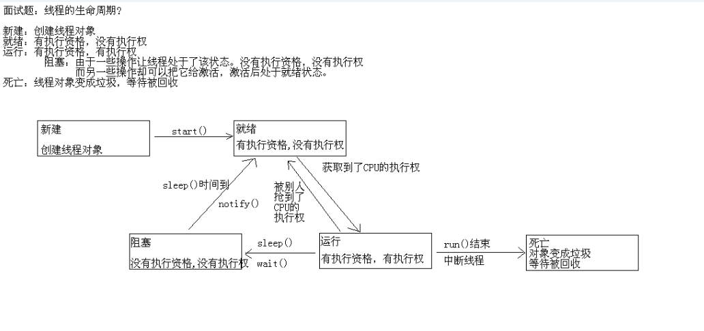

sleep方法是单线程的,没有释放锁,而wait方法释放锁,所以sleep时间到和wait等到notify之后享受的待遇一样,都是回到就绪状态,等待系统分配cpu

使用场景

sleep 一般用于当前线程休眠，或者轮循暂停操作，wait 则多用于多线程之间的通信。

#### 中断线程

1、使用退出标识，使得线程正常退出，即当run方法完成后线程终止。

2、使用Java中API自带的stop()方法，来终止线程

> stop()方法是一个被废弃的方法。为什么stop()方法被废弃而不被使用呢？原因是stop()方法太过于暴力，会强行把执行一半的线程终止。可能使一些清理性的工作得不到完成。还可能对锁定的内容进行解锁，容易造成数据不同步的问题。

3、使用interrupt方法中断线程

线程通过检查自身是否被中断来进行响应，线程通过方法isInterrupted()来进行判断是否被中断，也可以调用静态方法Thread.interrupted()对当前线程的中断标识位进行复位。如果该线程已经处于终结状态，即使该线程被中断过，在调用该线程对象的isInterrupted()时依旧会返回false。

从Java的API中可以看到，许多声明抛出InterruptedException的方法（例如Thread.sleep(longmillis)方法，当线程在sleep()休眠时，如果被中断，这个异常就会产生）。这些方法在抛出InterruptedException之前，Java虚拟机会先将该线程的中断标识位清除，然后抛出InterruptedException，此时调用isInterrupted()方法将会返回false。

### 守护线程/服务线程/后台线程

java中线程分为两种类型：用户线程和守护线程。

* 通过Thread.setDaemon(false)设置为用户线程；
* 通过Thread.setDaemon(true)设置为守护线程。 
* 如果不设置，默认为用户线程。

定义：守护线程--也称“服务线程”，在没有用户线程可服务时会自动离开。优先级：守护线程的优先级比较低，用于为系统中的其它对象和线程提供服务。

设置：通过setDaemon(true)来设置线程为“守护线程”；将一个用户线程设置为守护线程的方式是在 线程对象创建 之前 用线程对象的setDaemon方法。

eg: 垃圾回收线程就是一个经典的守护线程，当我们的程序中不再有任何运行的Thread,程序就不会再产生垃圾，垃圾回收器也就无事可做，所以当垃圾回收线程是JVM上仅剩的线程时，垃圾回收线程会自动离开。它始终在低级别的状态中运行，用于实时监控和管理系统中的可回收资源。

生命周期：守护进程（Daemon）是运行在后台的一种特殊进程。它独立于控制终端并且周期性地执行某种任务或等待处理某些发生的事件。也就是说守护线程不依赖于终端，但是依赖于系统，与系统“同生共死”。那Java的守护线程是什么样子的呢。当JVM中所有的线程都是守护线程的时候，JVM就可以退出了；如果还有一个或以上的非守护线程则JVM不会退出。

总结：

* 守护线程在没有用户线程可服务时自动离开
* 在Java中比较特殊的线程是被称为守护（Daemon）线程的低级别线程。这个线程具有最低的优先级，用于为系统中的其它对象和线程提供服务。
* 将一个用户线程设置为守护线程的方式是在线程对象创建之前调用线程对象的setDaemon方法。
* 典型的守护线程例子是JVM中的系统资源自动回收线程，当我们的程序中不再有任何运行中的Thread，程序就不会再产生垃圾，垃圾回收器也就无事可做，所以当垃圾回收线程是Java虚拟机上仅剩的线程时，Java虚拟机会自动离开。它始终在低级别的状态中运行，用于实时监控和管理系统中的可回收资源。
* 守护进程（Daemon）是运行在后台的一种特殊进程。它独立于控制终端并且周期性地执行某种任务或等待处理某些发生的事件。也就是说守护线程不依赖于终端，但是依赖于系统，与系统“同生共死”。那Java的守护线程是什么样子的呢。当JVM中所有的线程都是守护线程的时候，JVM就可以退出了；如果还有一个或以上的非守护线程则JVM不会退出。

用户线程和守护线程的区别： 
1. 主线程结束后用户线程还会继续运行,JVM存活； 
2.主线程结束后守护线程和JVM的状态如果没有用户线程，都是守护线程，那么JVM结束（随之而来的是所有的一切烟消云散，包括所有的守护线程）；

### 线程的优先级

> 在Java的线程操作中，所有的线程在运行前都会保持在就绪状态，那么此时，哪个线程的优先级高，哪个线程就有可能会先被执行。但是需要注意并非优先级越高就一定会先执行，哪个线程先执行将由CPU的调度决定。

### 线程的礼让

> 在线程操作中，也可以使用yield()方法将一个线程的操作暂时让给其他线程执行

sleep()方法和yield()方法有区别

1. sleep()方法给其他线程运行机会时不考虑线程的优先级，因此会给低优先级的线程以运行的机会；yield()方法只会给相同优先级或更高优先级的线程以运行的机会,但是它并不能保证在当前线程调用yield()之后，其它具有相同优先级的线程就一定能获得执行权；也有可能是当前线程又进入到“运行状态”继续运行;
2. 线程执行sleep()方法后转入阻塞（blocked）状态，而执行yield()方法后转入就绪（ready）状态;
3. sleep()方法声明抛出InterruptedException，而yield()方法没有声明任何异常; 
4. sleep()方法比yield()方法（跟操作系统CPU调度相关）具有更好的可移植性.


## Java中的锁分类

###  分类

1. 公平锁/非公平锁
2. 可重入锁
3. 独占锁/共享锁
4. 互斥锁/读写锁
5. 乐观锁/悲观锁
6. 分段锁
7. 偏向锁/轻量级锁/重量级锁
8. 自旋锁

###  公平锁/非公平锁

1. 公平锁是指多个线程按照申请锁的顺序来获取锁。
2. 非公平锁是指多个线程获取锁的顺序并不是按照申请锁的顺序，有可能后申请的线程比先申请的线程优先获取锁。有可能，会造成优先级反转或者饥饿现象。
3. 对于Java ReentrantLock而言，通过构造函数指定该锁是否是公平锁，默认是非公平锁。非公平锁的优点在于吞吐量比公平锁大。
4. 对于Synchronized而言，也是一种非公平锁。由于其并不像ReentrantLock是通过AQS的来实现线程调度，所以并没有任何办法使其变成公平锁。

### 可重入锁

* 可重入锁又名递归锁，是指在同一个线程在外层方法获取锁的时候，在进入内层方法会自动获取锁。说的有点抽象，下面会有一个代码的示例。
* 对于Java ReentrantLock而言, 他的名字就可以看出是一个可重入锁，其名字是Re entrant Lock重新进入锁。
* 对于Synchronized而言,也是一个可重入锁。可重入锁的一个好处是可一定程度避免死锁。

```
synchronized void setA() throws Exception{
    Thread.sleep(1000);
    setB();
}

synchronized void setB() throws Exception{
    Thread.sleep(1000);

```

上面的代码就是一个可重入锁的一个特点，如果不是可重入锁的话，setB可能不会被当前线程执行，可能造成死锁。

### 排他锁(又称为写锁、独占锁，是一种基本的锁类型)/共享锁

1. 排他锁是指该锁一次只能被一个线程所持有。
2. 共享锁是指该锁可被多个线程所持有。
3. 对于Java ReentrantLock而言，其是排他锁。但是对于Lock的另一个实现类ReadWriteLock，其读锁是共享锁，其写锁是排他锁。
4. 读锁的共享锁可保证并发读是非常高效的，读写，写读 ，写写的过程是互斥的。
5. 排他锁与共享锁也是通过AQS来实现的，通过实现不同的方法，来实现独占或者共享。
6. 对于Synchronized而言，当然是排他锁。

### 互斥锁/读写锁

1. 上面讲的独享锁/共享锁就是一种广义的说法，互斥锁/读写锁就是具体的实现。
2. 互斥锁在Java中的具体实现就是ReentrantLock
3. 读写锁在Java中的具体实现就是ReadWriteLock

### 乐观锁/悲观锁

1. 乐观锁与悲观锁不是指具体的什么类型的锁，而是指看待并发同步的角度。
2. 悲观锁认为对于同一个数据的并发操作，一定是会发生修改的，哪怕没有修改，也会认为修改。因此对于同一个数据的并发操作，悲观锁采取加锁的形式。悲观的认为，不加锁的并发操作一定会出问题。
3. 乐观锁则认为对于同一个数据的并发操作，是不会发生修改的。在更新数据的时候，会采用尝试更新，不断重新的方式更新数据。乐观的认为，不加锁的并发操作是没有事情的。

从上面的描述我们可以看出，悲观锁适合写操作非常多的场景，乐观锁适合读操作非常多的场景，不加锁会带来大量的性能提升。
悲观锁在Java中的使用，就是利用各种锁。
乐观锁在Java中的使用，是无锁编程，常常采用的是CAS算法，典型的例子就是原子类，通过CAS自旋实现原子操作的更新。

### 分段锁

分段锁其实是一种锁的设计，并不是具体的一种锁，对于ConcurrentHashMap而言，其并发的实现就是通过分段锁的形式来实现高效的并发操作。
我们以ConcurrentHashMap来说一下分段锁的含义以及设计思想，ConcurrentHashMap中的分段锁称为Segment，它即类似于HashMap（JDK7与JDK8中HashMap的实现）的结构，即内部拥有一个Entry数组，数组中的每个元素又是一个链表；同时又是一个ReentrantLock（Segment继承了ReentrantLock)。
当需要put元素的时候，并不是对整个hashmap进行加锁，而是先通过hashcode来知道他要放在那一个分段中，然后对这个分段进行加锁，所以当多线程put的时候，只要不是放在一个分段中，就实现了真正的并行的插入。
但是，在统计size的时候，可就是获取hashmap全局信息的时候，就需要获取所有的分段锁才能统计。
分段锁的设计目的是细化锁的粒度，当操作不需要更新整个数组的时候，就仅仅针对数组中的一项进行加锁操作。

### 偏向锁/轻量级锁/重量级锁

这三种锁是指锁的状态，并且是针对Synchronized。在Java 5通过引入锁升级的机制来实现高效Synchronized。这三种锁的状态是通过对象监视器在对象头中的字段来表明的。

1. 偏向锁是指一段同步代码一直被一个线程所访问，那么该线程会自动获取锁。降低获取锁的代价。
2. 轻量级锁是指当锁是偏向锁的时候，被另一个线程所访问，偏向锁就会升级为轻量级锁，其他线程会通过自旋的形式尝试获取锁，不会阻塞，提高性能。
3. 重量级锁是指当锁为轻量级锁的时候，另一个线程虽然是自旋，但自旋不会一直持续下去，当自旋一定次数的时候，还没有获取到锁，就会进入阻塞，该锁膨胀为重量级锁。重量级锁会让其他申请的线程进入阻塞，性能降低。

重量级锁：我们知道，我们要进入一个同步、线程安全的方法时，是需要先获得这个方法的锁的，退出这个方法时，则会释放锁。如果获取不到这个锁的话，意味着有别的线程在执行这个方法，这时我们就会马上进入阻塞的状态，等待那个持有锁的线程释放锁，然后再把我们从阻塞的状态唤醒，我们再去获取这个方法的锁。
这种获取不到锁就马上进入阻塞状态的锁，我们称之为重量级锁。

轻量级锁：重量级、自旋锁和自适应自旋锁，他们都有一个特点，就是进入一个方法的时候，就会加上锁，退出一个方法的时候，也就释放对应的锁。
之所以要加锁，是因为他们害怕自己在这个方法执行的时候，被别人偷偷进来了，所以只能加锁，防止其他线程进来。这就相当于，每次离开自己的房间，都要锁上门，人回来了再把锁解开。
这实在是太麻烦了，如果根本就没有线程来和他们竞争锁，那他们不是白白上锁了？要知道，加锁这个过程是需要操作系统来帮忙的，是很消耗时间的。为了解决这种动不动就加锁带来的开销，轻量级锁出现了。
轻量级锁认为，当你在方法里面执行的时候，其实是很少刚好有人也来执行这个方法的，所以，当我们进入一个方法的时候根本就不用加锁，我们只需要做一个标记就可以了，也就是说，我们可以用一个变量来记录此时该方法是否有人在执行。也就是说，如果这个方法没人在执行，当我们进入这个方法的时候，采用CAS机制，把这个方法的状态标记为已经有人在执行，退出这个方法时，在把这个状态改为了没有人在执行了。
显然，比起加锁操作，这个采用CAS来改变状态的操作，花销就小多了。
然而可能会说，没人来竞争的这种想法，那是你说的而已，那如果万一有人来竞争说呢？也就是说，当一个线程来执行一个方法的时候，方法里面已经有人在执行了。
如果真的遇到了竞争，我们就会认为轻量级锁已经不适合了，我们就会把轻量级锁升级为重量级锁了。
所以轻量级锁适合用在那种，很少出现多个线程竞争一个锁的情况，也就是说，适合那种多个线程总是错开时间来获取锁的情况。

偏向锁：偏向锁认为，其实对于一个方法，是很少有两个线程来执行的，搞来搞去，其实也就一个线程在执行这个方法而已，相当于单线程的情况，居然是单线程，那就没必要加锁了。
不过毕竟实际情况的多线程，单线程只是自己认为的而已了，所以呢，偏向锁进入一个方法的时候是这样处理的：如果这个方法没有人进来过，那么一个线程首次进入这个方法的时候，会采用CAS机制，把这个方法标记为有人在执行了，和轻量级锁加锁有点类似，并且也会把该线程的 ID 也记录进去，相当于记录了哪个线程在执行。
然后，但这个线程退出这个方法的时候，它不会改变这个方法的状态，而是直接退出来，懒的去改，因为它认为除了自己这个线程之外，其他线程并不会来执行这个方法。
然后当这个线程想要再次进入这个方法的时候，会判断一下这个方法的状态，如果这个方法已经被标记为有人在执行了，并且线程的ID是自己，那么它就直接进入这个方法执行，啥也不用做。
毕竟实际情况还是多线程，所以万一有其他线程来进入这个方法呢？如果真的出现这种情况，其他线程一看这个方法的ID不是自己，这个时候说明，至少有两个线程要来执行这个方法论，这意味着偏向锁已经不适用了，这个时候就会从偏向锁升级为轻量级锁。
所以呢，偏向锁适用于那种，始终只有一个线程在执行一个方法的情况哦。

### 自旋锁

在Java中，自旋锁是指尝试获取锁的线程不会立即阻塞，而是采用循环的方式去尝试获取锁，这样的好处是减少线程上下文切换的消耗，缺点是循环会消耗CPU。

我们知道，线程从运行态进入阻塞态这个过程，是非常耗时的，因为不仅需要保存线程此时的执行状态，上下文等数据，还涉及到用户态到内核态的转换。当然，把线程从阻塞态唤醒也是一样，也是非常消耗时间的。

重量级锁中，我们说线程拿不到锁，就会马上进入阻塞状态，然而现实是，它虽然这一刻拿不到锁，可能在下 0.0001 秒，就有其他线程把这个锁释放了。如果它慢0.0001秒来拿这个锁的话，可能就可以顺利拿到了，不需要经历阻塞/唤醒这个花时间的过程了。

然而重量级锁就是这么坑，它就是不肯等待一下，一拿不到就是要马上进入阻塞状态。为了解决这个问题，我们引入了另外一种愿意等待一段时间的锁 --- 自旋锁。

自旋锁就是，如果此时拿不到锁，它不马上进入阻塞状态，而是等待一段时间，看看这段时间有没其他人把这锁给释放了。怎么等呢？这个就类似于线程在那里做空循环，如果循环一定的次数还拿不到锁，那么它才会进入阻塞的状态。

至于是循环等待几次，这个是可以人为指定一个数字的。

```
public class SpinLock {

  private AtomicReference<Thread> sign = new AtomicReference<>();

  public void lock() {
    Thread current = Thread.currentThread();
    while (!sign.compareAndSet(null, current)) ;
  }

  public void unLock() {
    Thread current = Thread.currentThread();
    sign.compareAndSet(current, null);
  }
}
```

使用了CAS原子操作，lock函数将owner设置为当前线程，并且预测原来的值为空。unlock函数将owner设置为null，并且预测值为当前线程。

当有第二个线程调用lock操作时由于owner值不为空，导致循环一直被执行，直至第一个线程调用unlock函数将owner设置为null，第二个线程才能进入临界区。

由于自旋锁只是将当前线程不停地执行循环体，不进行线程状态的改变，所以响应速度更快。但当线程数不停增加时，性能下降明显，因为每个线程都需要执行，占用CPU时间。如果线程竞争不激烈，并且保持锁的时间段。适合使用自旋锁。

注：该例子为非公平锁，获得锁的先后顺序，不会按照进入lock的先后顺序进行。

### 自适应自旋锁

上面我们说的自旋锁，每个线程循环等待的次数都是一样的，例如我设置为 100次的话，那么线程在空循环 100 次之后还没拿到锁，就会进入阻塞状态了。

而自适应自旋锁就牛逼了，它不需要我们人为指定循环几次，它自己本身会进行判断要循环几次，而且每个线程可能循环的次数也是不一样的。而之所以这样做，主要是我们觉得，如果一个线程在不久前拿到过这个锁，或者它之前经常拿到过这个锁，那么我们认为它再次拿到锁的几率非常大，所以循环的次数会多一些。

而如果有些线程从来就没有拿到过这个锁，或者说，平时很少拿到，那么我们认为，它再次拿到的概率是比较小的，所以我们就让它循环的次数少一些。因为你在那里做空循环是很消耗 CPU 的。

所以这种能够根据线程最近获得锁的状态来调整循环次数的自旋锁，我们称之为自适应自旋锁。

### 深入理解 Java 锁与线程阻塞

> 相信大家对线程锁和线程阻塞都很了解，无非就是 synchronized, wait/notify 等, 但是你有仔细想过 Java 虚拟机是如何实现锁和阻塞的呢？

为保障多线程下处理共享数据的安全性，Java 语言给我们提供了线程锁，保证同一时刻只有一个线程能处理共享数据。当一个锁被某个线程持有的时候，另一个线程尝试去获取这个锁将产生线程阻塞，直到持有锁的线程释放了该锁。

除了抢占锁的时候会出现线程阻塞，另外还有一些方法也会产生线程阻塞，比如： Object.wait(), Thread.sleep(), ArrayBlockingQueue.put() 等等，他们都有一个共同特点：不消耗 CPU 时间片。另外值得指出的是 Object.wait() 会释放持有的锁，而 Thread.sleep() 不会。 当然 while(true){ } 也能产生阻塞线程的效果，自旋锁就是使用循环，配合 CAS (compareAndSet) 实现的。

线程锁，目前有两种方法，准确来说是三种，synchronized 方法，synchronized 区块，ReentrantLock。先说 synchronized，代码如下：

```
public class Lock {

  public static synchronized void print() {
    System.out.println("method synchronized");
  }

  public static void print2() {
    synchronized (Lock.class) {
      System.out.println("synchronized");
    }
  }

  public static void main(String[] args) {
    Lock.print();
    Lock.print2();
  }
}
```

编译后通过如下命令查看其字节码

```
javap -c -v Lock.class
```

其中节选方法一（Lock.print）的字节码如下：

```
public static synchronized void print();
    descriptor: ()V
    flags: ACC_PUBLIC, ACC_STATIC, ACC_SYNCHRONIZED
    Code:
    stack=2, locals=0, args_size=0
    0: getstatic     #2                  // Field java/lang/System.out:Ljava/io/PrintStream;
    3: ldc           #3                  // String method synchronized
    5: invokevirtual #4                  // Method java/io/PrintStream.println:(Ljava/lang/String;)V
    8: return	
```

可以看到方法表的访问标志位 (flags) 中多了个 ACC_SYNCHRONIZED，然后看字节码指令区域 (Code) ，和普通方法没任何差别, 猜测 Java 虚拟机通过检查方法表中是否存在标志位 ACC_SYNCHRONIZED 来决定是否需要获取锁。

然后看第二个使用 synchronized 区块的方法（Lock.print2）字节码：

```
public static void print2();
    descriptor: ()V
    flags: ACC_PUBLIC, ACC_STATIC
    Code:
    stack=2, locals=2, args_size=0
    0: ldc           #5                  // 将锁对象 Lock.class 入栈
    2: dup  // 复制一份，此时栈中有两个 Lock.class 
    3: astore_0  // 出栈一个 Lock.class 对象保存到局部变量表 Slot 1 中
    4: monitorenter  // 以栈顶元素 Lock.class 作为锁，开始同步
    5: getstatic     #2                 // 5-10 调用 System.out.println("synchronized");
    8: ldc           #6                 // String synchronized
    10: invokevirtual #4                // Method java/io/PrintStream.println:(Ljava/lang/String;)V
    13: aload_0  // 将局部变量表 Slot 1 中的数据入栈，即 Lock.class
    14: monitorexit  // 使用栈顶数据退出同步
    15: goto          23  // 方法结束，跳转到 23 返回
    18: astore_1  // 从这里开始是异常路径，将异常信息保存至局部变量表 Slot 2 中，查看异常表
    19: aload_0  // 将局部变量表 Slot 1 中的 Lock.class 入栈
    20: monitorexit  // 使用栈顶数据退出同步
    21: aload_1  // 将局部变量表 Slot 2 中的异常信息入栈
    22: athrow  // 把异常对象重新抛出给方法的调用者
    23: return  // 方法正常返回
    Exception table: // 异常表
    from    to  target type
     5    15    18   any // 5-15 出现任何(any)异常跳转到 18 
    18    21    18   any // 18-21 出现任何(any)异常跳转到 18 
```

synchronized 区块的字节码相比较 synchronized 方法复杂了许多。每一行字节码的含义我都作了详细注释，可以看到此时是通过字节码指令 monitorenter，monitorexit 来进入和退出同步的。特别值得注意的是，我们并没有写 try.catch 捕获异常，但是字节码指令中存在异常处理的代码，其实为了保证在方法异常完成时 monitorenter 和 monitorexit 指令依然可以正确配对执行，编译器会自动产生一个异常处理器，这个异常处理器声明可处理所有的异常，它的目的就是用来执行 monitorexit 指令。这个机制确保在 synchronized 区块中产生任何异常都可以正常退出同步，释放锁资源。

不管是检查标志位中的 ACC_SYNCHRONIZED，还是字节码指令 monitorenter，monitorexit，锁机制的实现最终肯定存在于 JVM 中，后面我们会再提到这点。

接下来继续看 ReentrantLock 的实现，本文只是简单的介绍一下 lock 和 unLock 方法。

```
// ReentrantLock.java
public void lock() {
    this.sync.lock();
}
// ReentrantLock.NonfairSync.class
final void lock() {
    // 使用 cas 设置 state，如果设置成功表示当前无其他线程竞争锁，优先获取锁资源
    if (this.compareAndSetState(0, 1)) {
        // 保存当前线程用于后续重入锁的判断
        this.setExclusiveOwnerThread(Thread.currentThread());
    } else {
        this.acquire(1);
    }
}
// AbstractQueuedSynchronizer.java
 public final void acquire(int arg) {
    if (!tryAcquire(arg) && acquireQueued(addWaiter(Node.EXCLUSIVE), arg))
        selfInterrupt(); // 如果阻塞被中断，重新设置中断通知调用者
}
// 判断是否是重入
protected final boolean tryAcquire(int var1) {
    return this.nonfairTryAcquire(var1);
}
// 处理等待队列
final boolean acquireQueued(final Node node, int arg) {
    boolean failed = true;
    try {
        boolean interrupted = false;
        for (;;) {
            final Node p = node.predecessor();
            if (p == head && tryAcquire(arg)) {
                setHead(node);
                p.next = null; // help GC
                failed = false;
                return interrupted;
            }
            if (shouldParkAfterFailedAcquire(p, node) &&
                parkAndCheckInterrupt())
                interrupted = true;
        }
    } finally {
        if (failed)
            cancelAcquire(node);
    }
}
private final boolean parkAndCheckInterrupt() {
    LockSupport.park(this); // 阻塞线程
    return Thread.interrupted();
}
```

对于锁竞争的情况，最终会调用 LockSupport.park(this) 阻塞当前线程，同样的 ReentrantLock.unlock 方法会调用 LockSupport.unpark(thread) 来恢复阻塞的线程。继续看 LockSupport 的实现：

```
public static void unpark(Thread thread) {
    if (thread != null) {
        UNSAFE.unpark(thread);
    }
}
public static void park(Object obj) {
    Thread thread = Thread.currentThread();
    setBlocker(thread, obj);
    UNSAFE.park(false, 0L);
    setBlocker(thread, (Object)null);
}
```

LockSupport 内部调用了 UnSafe 类的 park 和 unpark, 是 native 代码，该类由虚拟机实现，以 Hotspot 虚拟机为例，查看 park 方法：

```
// unsafe.cpp
UNSAFE_ENTRY(void, Unsafe_Park(JNIEnv *env, jobject unsafe, jboolean isAbsolute, jlong time))
  UnsafeWrapper("Unsafe_Park");
#ifndef USDT2
  HS_DTRACE_PROBE3(hotspot, thread__park__begin, thread->parker(), (int) isAbsolute, time);
#else /* USDT2 */
   HOTSPOT_THREAD_PARK_BEGIN(
                             (uintptr_t) thread->parker(), (int) isAbsolute, time);
#endif /* USDT2 */
  JavaThreadParkedState jtps(thread, time != 0);
  thread->parker()->park(isAbsolute != 0, time);
#ifndef USDT2
  HS_DTRACE_PROBE1(hotspot, thread__park__end, thread->parker());
#else /* USDT2 */
  HOTSPOT_THREAD_PARK_END(
                          (uintptr_t) thread->parker());
#endif /* USDT2 */
UNSAFE_END
```

调用了: thread->parker()->park(isAbsolute != 0, time); 我们可以猜测是这句代码阻塞了当前线程。HotSpot 虚拟机里的 Thread 类对应着一个 OS 的 Thread, JavaThread 类继承于 Thread, JavaThread 实例对应着一个 Java 层的 Thread.
简而言之，Java 层的 Thread 对应着一个 OS 的 Thread。使用如下代码创建线程

```
//linux_os.cpp
pthread_t tid;
int ret = pthread_create(&tid, &attr, (void* (*)(void*)) thread_native_entry, thread);
```

回到 Thread 类中的 Park，我们查看 HotSpot 的 thread.hpp, 找到了如下三个 Park:

```
public:
  ParkEvent * _ParkEvent ;    // for synchronized()
  ParkEvent * _SleepEvent ;   // for Thread.sleep
// JSR166 per-thread parker
private:
  Parker*    _parker;
```

从注释上可以看出分别是用于 synchronized 的阻塞，Thread.sleep 的阻塞还有用于 UnSafe 的线程阻塞，继续查看 park.hpp 节选：

```
// A word of caution: The JVM uses 2 very similar constructs:
// 1. ParkEvent are used for Java-level "monitor" synchronization.
// 2. Parkers are used by JSR166-JUC park-unpark.
class Parker : public os::PlatformParker {
// 略
}
class ParkEvent : public os::PlatformEvent {
// 略
}
```

注释上更近一步解释了两种 Parker 的区别，他们的实现非常相似，那为什么会存在两个呢？网络上有解释说是只是没重构而已。下面只看 Parker 的实现，发现 park.cpp 中并没有实现 park 方法，猜测应该是父类中实现了，因为这是和系统相关的操作，以 Linux 系统为例，查看 linux_os.cpp 找到了 park 的实现，截取了主要部分：

```
void Parker::park(bool isAbsolute, jlong time) {
  // 省略了前置判断

  // 获取锁
  if (Thread::is_interrupted(thread, false) || pthread_mutex_trylock(_mutex) != 0) {
    return;
  }
  if (time == 0) {
    _cur_index = REL_INDEX; // arbitrary choice when not timed
    // 调用 pthread_cond_wait 阻塞线程
    status = pthread_cond_wait (&_cond[_cur_index], _mutex) ;
  } else {
    _cur_index = isAbsolute ? ABS_INDEX : REL_INDEX;
    status = os::Linux::safe_cond_timedwait (&_cond[_cur_index], _mutex, &absTime) ;
    if (status != 0 && WorkAroundNPTLTimedWaitHang) {
      pthread_cond_destroy (&_cond[_cur_index]) ;
      pthread_cond_init    (&_cond[_cur_index], isAbsolute ? NULL : os::Linux::condAttr());
    }
  }
  _cur_index = -1;
  // 已从 block 中恢复，释放锁
  _counter = 0 ;
  status = pthread_mutex_unlock(_mutex) ;
  // 略
}
```

总共分三步走，先获取锁，再调用 pthread_cond_wait 阻塞线程，最后阻塞恢复了之后释放锁，是不是和我们使用 Object.wait 十分类似，事实上 Object.wait 底层也是这种方式实现的。为了更清楚的了解底层的实现，写了一段 c 代码看一下线程的创建和锁的使用：

```
int counter = 0;
// 互斥锁对象
pthread_mutex_t mutex = PTHREAD_MUTEX_INITIALIZER;
void* add() {
  for(int i = 0;i < 2;++i) {
    // 获取锁
    pthread_mutex_lock( &mutex );
    ++counter;
    sleep(1);
    // 释放锁
    pthread_mutex_unlock( &mutex );
    printf("counter = %d\n", counter);
  }
  pthread_exit(NULL);
}
int main() {
  pthread_t thread_1, thread_2;
  // 创建线程
  pthread_create(&thread_1, NULL, add, NULL);
  pthread_create(&thread_2, NULL, add, NULL);
  pthread_join(thread_1, NULL);
  pthread_join(thread_2, NULL);
  return 0;
}
```

使用 pthread_create 创建线程，使用 pthread_mutex_lock 获取锁，使用 pthread_mutex_unlock 释放锁。那既然 pthread_mutex_lock 和 pthread_mutex_unlock 就能实现锁了，那为什么锁实现的时候还要使用 pthread_cond_wait 来阻塞线程呢？回过头看 PlatformParker ：

```
//os_linux.hpp
class PlatformParker {
 pthread_mutex_t _mutex[1];
 //一个是给park用, 另一个是给parkUntil用
 pthread_cond_t  _cond[2]; // one for relative times and one for abs.
 //略...
};
```

每个 JavaThread 实例都有自己的 mutex，在上述自己写的例子中是多个线程竞争同一个 mutex，阻塞线程队列管理的逻辑直接由 mutex 实现，而此处的 mutex 线程私有，不存在直接竞争关系，事实上，JVM 为了提升平台通用性(?)，只提供了线程阻塞和恢复操作，阻塞线程队列的管理工作交给了 Java 层，也就是前面提到的 AQS。对于 Java 层来说 JVM 只需要提供 「阻塞」 和 「唤醒」 的操作即可。
在 Java 中讲解 Object.wait, Object.notify 的时候通常会用生产者-消费者作为例子，这里我也简单的写了一个 c 的例子，让大家了解底层线程阻塞的原理：

```
#define TRUE 1
#define FALSE 0
#define BUFFER_SIZE 10
pthread_cond_t msg_cond = PTHREAD_COND_INITIALIZER;
pthread_mutex_t mutex = PTHREAD_MUTEX_INITIALIZER;
char* msgBuffer[BUFFER_SIZE] = {0};
int bufferIndex = -1;
int counter = 0;
void* readMsg() {
    while (TRUE) {
        // 获取锁
        pthread_mutex_lock( &mutex );
        if (bufferIndex < 0) {
            printf("wait for message\n");
            // 消息队列如果为空则阻塞等待
            pthread_cond_wait( &msg_cond, &mutex);
        }
        for(; bufferIndex >= 0; --bufferIndex){
            char* msg = msgBuffer[bufferIndex];
            msgBuffer[bufferIndex] = 0;
            printf("read message = %s, %d\n", msg, counter++);
            // 通知生产者线程
            pthread_cond_signal(&msg_cond);
        }
        sleep(1);
        // 释放锁
        pthread_mutex_unlock( &mutex );
    }
    return 0;
}
void* writeMsg() {
    // 获取锁
    pthread_mutex_lock( &mutex );
    if (bufferIndex < BUFFER_SIZE - 1) {
        char* msg = "haha!";
        msgBuffer[++bufferIndex] = msg;
        // 通知消费者线程
        pthread_cond_signal(&msg_cond); // notify();
        // pthread_cond_broadcast(&msg_cond); // notifyAll();
    } else {
        printf("message buffer is full!\n");
        // 缓冲队列已满阻塞等待
        pthread_cond_wait( &msg_cond, &mutex);
    }
    // 释放锁
    pthread_mutex_unlock( &mutex );
    return 0;
}
int main(int argc, char const *argv[]) {
    pthread_t thread_r;
    // 创建后台消费者线程
    pthread_create(&thread_r, NULL, readMsg, NULL);

    for(int i = 0; i < 50; i++){
        printf("send message %d \n", i);
        // 生产消息
        writeMsg();
    }
    pthread_join(thread_r, NULL);
    return 0;
}
```

其中消费者线程是一个循环，在循环中先获取锁，然后判断队列是否为空，如果为空则调用 pthread_cond_wait 阻塞线程，这个阻塞操作会自动释放持有的锁并出让 cpu 时间片，恢复的时候自动获取锁，消费完队列之后会调用 pthread_cond_signal 通知生产者线程，另外还有一个通知所有线程恢复的 pthread_cond_broadcast，与 notifyAll 类似。

最后再简单谈一下阻塞中断，Java 层 Thread 中有个 interrupt 方法，它的作用是在线程收到阻塞的时候抛出一个中断信号，这样线程就会退出阻塞状态，但是并不是我们遇到的所有阻塞都会中断，要看是否会响应中断信号，Object.wait, Thread.join，Thread.sleep，ReentrantLock.lockInterruptibly 这些会抛出受检异常 InterruptedException 的都会被中断。synchronized，ReentrantLock.lock 的锁竞争阻塞是不会被中断的，interrupt 并不会强制终止线程，而是会将线程设置成 interrupted 状态，我们可以通过判断 isInterrupted 或 interrupted 来获取中断状态，区别在于后者会重置中断状态为 false。看一下底层线程中断的代码：

```
// os_linux.cpp
void os::interrupt(Thread* thread) {
  OSThread* osthread = thread->osthread();
  if (!osthread->interrupted()) {
    osthread->set_interrupted(true);
    OrderAccess::fence();
    ParkEvent * const slp = thread->_SleepEvent ;
    if (slp != NULL) slp->unpark() ;
  }
  // For JSR166. Unpark even if interrupt status already was set
  if (thread->is_Java_thread())
    ((JavaThread*)thread)->parker()->unpark();
  ParkEvent * ev = thread->_ParkEvent ;
  if (ev != NULL) ev->unpark() ;
}
```

可以看到，线程中断也是由 unpark 实现的, 即恢复了阻塞的线程。并且对之前提到的三个 Parker (_ParkEvent，_SleepEvent，_parker) 都进行了 unpark。

### AQS原理

AQS的全称为（AbstractQueuedSynchronizer），这个类也是在java.util.concurrent.locks下面。这个类似乎很不容易看懂，因为它仅仅是提供了一系列公共的方法，让子类来调用。那么要理解意思，就得从子类下手，反过来看才容易看懂。如下图所示：

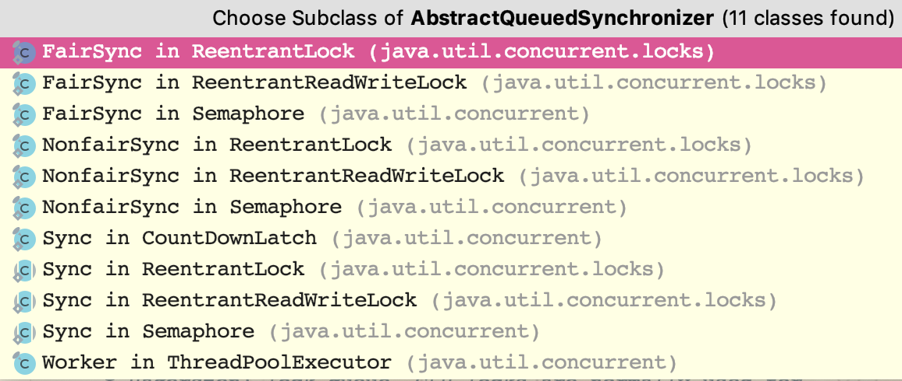

1 ReentrantLock

构造方法

```
public ReentrantLock() {
    sync = new NonfairSync();
}
    
public ReentrantLock(boolean fair) {
    sync = fair ? new FairSync() : new NonfairSync();
}
```

很显然，对象中有一个属性叫sync，有两种不同的实现类，默认是“NonfairSync”来实现，而另一个“FairSync”它们都是排它锁的内部类，不论用那一个都能实现排它锁，只是内部可能有点原理上的区别。先以“NonfairSync”类为例，它的lock()方法是如何实现的呢？

```
final void lock() {
    if (compareAndSetState(0, 1))
        setExclusiveOwnerThread(Thread.currentThread());
    else
        acquire(1);
}

//AbstractOwnableSynchronizer.java
protected final void setExclusiveOwnerThread(Thread thread) {
    exclusiveOwnerThread = thread;
}

//AbstractQueuedSynchronizer.java
public final void acquire(int arg) {
    if (!tryAcquire(arg) &&
        acquireQueued(addWaiter(Node.EXCLUSIVE), arg))
        selfInterrupt();
}
```

lock()方法先通过CAS尝试将状态从0修改为1。若直接修改成功，前提条件自然是锁的状态为0，则直接将线程的OWNER修改为当前线程，这是一种理想情况，如果并发粒度设置适当也是一种乐观情况。
若上一个动作未成功，则会间接调用了acquire(1)来继续操作，这个acquire(int)方法就是在AbstractQueuedSynchronizer当中了。这个方法表面上看起来简单，但真实情况比较难以看懂，因为第一次看这段代码可能不知道它要做什么！
首先看tryAcquire(arg)这里的调用（当然传入的参数是1），在默认的“NonfairSync”实现类中，会这样来实现

```
//ReentrantLock.java -> NonfairSync
protected final boolean tryAcquire(int acquires) {
    return nonfairTryAcquire(acquires);
}

//ReentrantLock.java -> Sync
final boolean nonfairTryAcquire(int acquires) {
    final Thread current = Thread.currentThread();
    int c = getState();
    if (c == 0) {
        if (compareAndSetState(0, acquires)) {
            setExclusiveOwnerThread(current);
            return true;
        }
    }
    else if (current == getExclusiveOwnerThread()) {
        int nextc = c + acquires;
        if (nextc < 0) // overflow
            throw new Error("Maximum lock count exceeded");
        setState(nextc);
        return true;
    }
    return false;
}
```

* 首先获取这个锁的状态，如果状态为0，则尝试设置状态为传入的参数（这里就是1），若设置成功就代表自己获取到了锁，返回true了。状态为0设置1的动作在外部就有做过一次，内部再一次做只是提升概率，而且这样的操作相对锁来讲不占开销。
* 如果状态不是0，则判定当前线程是否为排它锁的Owner，如果是Owner则尝试将状态增加acquires（也就是增加1），如果这个状态值越界，则会抛出异常提示，若没有越界，将状态设置进去后返回true（实现了类似于偏向的功能，可重入，但是无需进一步征用）。
* 如果状态不是0，且自身不是owner，则返回false。

tryAcquire()的调用判定中是通过if(!tryAcquire())作为第1个条件的，如果返回true，则判定就不会成立了，自然后面的acquireQueued动作就不会再执行了，如果发生这样的情况是最理想的。
无论多么乐观，征用是必然存在的，如果征用存在则owner自然不会是自己，tryAcquire()方法会返回false，接着就会再调用方法：acquireQueued(addWaiter(Node.EXCLUSIVE), arg)做相关的操作。
这个方法的调用的代码更不好懂，需要从里往外看，这里的Node.EXCLUSIVE是节点的类型，看名称应该清楚是排它类型的意思。接着调用addWaiter()来增加一个排它锁类型的节点，这个addWaiter()的代码是这样写的：

```
private Node addWaiter(Node mode) {
    Node node = new Node(Thread.currentThread(), mode);
    // Try the fast path of enq; backup to full enq on failure
    Node pred = tail;
    if (pred != null) {
        node.prev = pred;
        if (compareAndSetTail(pred, node)) {
            pred.next = node;
            return node;
        }
    }
    enq(node);
    return node;
}
```

这里创建了一个Node的对象，将当前线程和传入的Node.EXCLUSIVE传入，也就是说Node节点理论上包含了这两项信息。代码中的tail是AQS的一个属性，刚开始的时候肯定是为null，也就是不会进入第一层if判定的区域，而直接会进入enq(node)的代码，那么直接来看看enq(node)的代码。

看到了tail就应该猜到了AQS是链表吧，没错，而且它还应该有一个head引用来指向链表的头节点，AQS在初始化的时候head、tail都是null，在运行时来回移动。此时，我们最少至少知道AQS是一个基于状态（state）的链表管理方式。

```
private Node enq(final Node node) {
    for (;;) {
        Node t = tail;
        if (t == null) { // Must initialize
            if (compareAndSetHead(new Node()))
                tail = head;
        } else {
            node.prev = t;
            if (compareAndSetTail(t, node)) {
                t.next = node;
                return t;
            }
        }
    }
}
```

首先这个是一个死循环，而且本身没有锁，因此可以有多个线程进来，假如某个线程进入方法，此时head、tail都是null，自然会进入if(t == null)所在的代码区域，这部分代码会创建一个Node出来名字叫h，这个Node没有像开始那样给予类型和线程，很明显是一个空的Node对象，而传入的Node对象首先被它的next引用所指向，此时传入的node和某一个线程创建的h对象如下图所示。


刚才我们理想的认为只有一个线程会出现这种情况，如果有多个线程并发进入这个if判定区域，可能就会同时存在多个这样的数据结构，在各自形成数据结构后，多个线程都会去做compareAndSetHead(h)的动作，也就是尝试将这个临时h节点设置为head，显然并发时只有一个线程会成功，因此成功的那个线程会执行tail = node的操作，整个AQS的链表就成为：

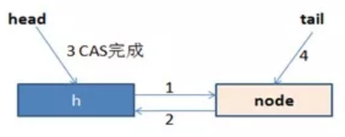

有一个线程会成功修改head和tail的值，其它的线程会继续循环，再次循环就不会进入if (t == null)的逻辑了，而会进入else语句的逻辑中。
在else语句所在的逻辑中，第一步是node.prev = t，这个t就是tail的临时值，也就是首先让尝试写入的node节点的prev指针指向原来的结束节点，然后尝试通过CAS替换掉AQS中的tail的内容为当前线程的Node，无论有多少个线程并发到这里，依然只会有一个能成功，成功者执行t.next = node，也就是让原先的tail节点的next引用指向现在的node，现在的node已经成为了最新的结束节点，不成功者则会继续循环。


插入多个节点的时候，就以此类推了哦，总之节点都是在链表尾部写入的，而且是线程安全的。
知道了AQS大致的写入是一种双向链表的插入操作，但插入链表节点对锁有何用途呢，我们还得退回到前面的代码中addWaiter方法最终返回了要写入的node节点， 再回退到所在的代码中需要将这个返回的node节点作为acquireQueued方法入口参数，并传入另一个参数（依然是1），看看它里面到底做了些什么？

```
final boolean acquireQueued(final Node node, int arg) {
    boolean failed = true;
    try {
        boolean interrupted = false;
        for (;;) {
            final Node p = node.predecessor();
            if (p == head && tryAcquire(arg)) {
                setHead(node);
                p.next = null; // help GC
                failed = false;
                return interrupted;
            }
            if (shouldParkAfterFailedAcquire(p, node) &&
                parkAndCheckInterrupt())
                interrupted = true;
        }
    } finally {
        if (failed)
            cancelAcquire(node);
    }
}

private void setHead(Node node) {
    head = node;
    node.thread = null;
    node.prev = null;
}
```

这里也是一个死循环，除非进入if(p == head && tryAcquire(arg))这个判定条件，而p为node.predcessor()得到，这个方法返回node节点的前一个节点，也就是说只有当前一个节点是head的时候，进一步尝试通过tryAcquire(arg)来征用才有机会成功。tryAcquire(arg)这个方法我们前面介绍过，成立的条件为：锁的状态为0，且通过CAS尝试设置状态成功或线程的持有者本身是当前线程才会返回true，我们现在来详细拆分这部分代码。

* 如果这个条件成功后，发生的几个动作包含：

（1） 首先调用setHead(Node)的操作，这个操作内部会将传入的node节点作为AQS的head所指向的节点。线程属性设置为空（因为现在已经获取到锁，不再需要记录下这个节点所对应的线程了），再将这个节点的perv引用赋值为null。
（2） 进一步将的前一个节点的next引用赋值为null。
在进行了这样的修改后，队列的结构就变成了以下这种情况了，通过这样的方式，就可以让执行完的节点释放掉内存区域，而不是无限制增长队列，也就真正形成FIFO了：

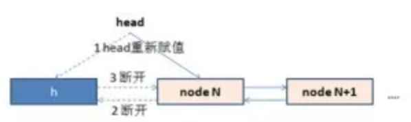

* 如果这个判定条件失败

会首先判定：“shouldParkAfterFailedAcquire(p , node)”，这个方法内部会判定前一个节点的状态是否为：“Node.SIGNAL”，若是则返回true，若不是都会返回false，不过会再做一些操作：判定节点的状态是否大于0，若大于0则认为被“CANCELLED”掉了（我们没有说明几个状态的值，不过大于0的只可能被CANCELLED的状态），因此会从前一个节点开始逐步循环找到一个没有被“CANCELLED”节点，然后与这个节点的next、prev的引用相互指向；如果前一个节点的状态不是大于0的，则通过CAS尝试将状态修改为“Node.SIGNAL”，自然的如果下一轮循环的时候会返回值应该会返回true。
如果这个方法返回了true，则会执行：“parkAndCheckInterrupt()”方法，它是通过LockSupport.park(this)将当前线程挂起到WATING状态，它需要等待一个中断、unpark方法来唤醒它，通过这样一种FIFO的机制的等待，来实现了Lock的操作。
相应的，可以自己看看FairSync实现类的lock方法，其实区别不大，有些细节上的区别可能会决定某些特定场景的需求，你也可以自己按照这样的思路去实现一个自定义的锁。
接下来简单看看unlock()解除锁的方式，如果获取到了锁不释放，那自然就成了死锁，所以必须要释放，来看看它内部是如何释放的。同样从排它锁（ReentrantLock）中的unlock()方法开始，请先看下面的代码

```
public void unlock() {
    sync.release(1);
}

public final boolean release(int arg) {
    if (tryRelease(arg)) {
        Node h = head;
        if (h != null && h.waitStatus != 0)
            unparkSuccessor(h);
        return true;
    }
    return false;
}
```

通过tryRelease(int)方法进行了某种判定，若它成立则会将head传入到unparkSuccessor(Node)方法中并返回true，否则返回false。首先来看看tryRelease(int)方法，如下所示：

```
protected final boolean tryRelease(int releases) {
    int c = getState() - releases;
    if (Thread.currentThread() != getExclusiveOwnerThread())
        throw new IllegalMonitorStateException();
    boolean free = false;
    if (c == 0) {
        free = true;
        setExclusiveOwnerThread(null);
    }
    setState(c);
    return free;
}
```

这个动作可以认为就是一个设置锁状态的操作，而且是将状态减掉传入的参数值（参数是1），如果结果状态为0，就将排它锁的Owner设置为null，以使得其它的线程有机会进行执行。
在排它锁中，加锁的时候状态会增加1（当然可以自己修改这个值），在解锁的时候减掉1，同一个锁，在可以重入后，可能会被叠加为2、3、4这些值，只有unlock()的次数与lock()的次数对应才会将Owner线程设置为空，而且也只有这种情况下才会返回true。
这一点大家写代码要注意了哦，如果是在循环体中lock()或故意使用两次以上的lock(),而最终只有一次unlock()，最终可能无法释放锁。

在方法unparkSuccessor(Node)中，就意味着真正要释放锁了，它传入的是head节点（head节点是已经执行完的节点，在后面阐述这个方法的body的时候都叫head节点），内部首先会发生的动作是获取head节点的next节点，如果获取到的节点不为空，则直接通过：“LockSupport.unpark()”方法来释放对应的被挂起的线程，这样一来将会有一个节点唤醒后继续进入循环进一步尝试tryAcquire()方法来获取锁，但是也未必能完全获取到哦，因为此时也可能有一些外部的请求正好与之征用，而且还奇迹般的成功了，那这个线程的运气就有点悲剧了，不过通常乐观认为不会每一次都那么悲剧。

```
private void unparkSuccessor(Node node) {

    int ws = node.waitStatus;
    if (ws < 0)
        compareAndSetWaitStatus(node, ws, 0);

    Node s = node.next;
    if (s == null || s.waitStatus > 0) {
        s = null;
        for (Node t = tail; t != null && t != node; t = t.prev)
            if (t.waitStatus <= 0)
                s = t;
    }
    if (s != null)
        LockSupport.unpark(s.thread);
}
```

再看看共享锁，从前面的排它锁可以看得出来是用一个状态来标志锁的，而共享锁也不例外，但是Java不希望去定义两个状态，所以它与排它锁的第一个区别就是在锁的状态上，它用int来标志锁的状态，int有4个字节，它用高16位标志读锁（共享锁），低16位标志写锁（排它锁），高16位每次增加1相当于增加65536（通过1 << 16得到），自然的在这种读写锁中，读锁和写锁的个数都不能超过65535个（条件是每次增加1的，如果递增是跳跃的将会更少）。在计算读锁数量的时候将状态左移16位，而计算排它锁会与65535“按位求与”操作，如下所示。

```
static final int SHARED_SHIFT   = 16;
static final int SHARED_UNIT    = (1 << SHARED_SHIFT);
static final int MAX_COUNT      = (1 << SHARED_SHIFT) - 1;
static final int EXCLUSIVE_MASK = (1 << SHARED_SHIFT) - 1;

static int sharedCount(int c)    { return c >>> SHARED_SHIFT; }

static int exclusiveCount(int c) { return c & EXCLUSIVE_MASK; }
```

写锁的功能与“ReentrantLock”基本一致，区别在于它会在tryAcquire操作的时候，判定状态的时候会更加复杂一些（因此有些时候它的性能未必好）。

读锁也会写入队列，Node的类型被改为：“Node.SHARED”这种类型，lock()时候调用的是AQS的acquireShared(int)方法，进一步调用tryAcquireShared()操作里面只需要检测是否有排它锁，如果没有则可以尝试通过CAS修改锁的状态，如果没有修改成功，则会自旋这个动作（可能会有很多线程在这自旋开销CPU）。如果这个自旋的过程中检测到排它锁竞争成功，那么tryAcquireShared()会返回-1，从而会走如排它锁的Node类似的流程，可能也会被park住，等待排它锁相应的线程最终调用unpark()动作来唤醒。
这就是Java提供的这种读写锁，不过这并不是共享锁的诠释，在共享锁里面也有多种机制 ，或许这种读写锁只是其中一种而已。在这种锁下面，读和写的操作本身是互斥的，但是读可以多个一起发生。这样的锁理论上是非常适合应用在“读多写少”的环境下（当然我们所讲的读多写少是读的比例远远大于写，而不是多一点点），理论上讲这样锁征用的粒度会大大降低，同时系统的瓶颈会减少，效率得到总体提升。
在本节中我们除了学习到AQS的内在，还应看到Java通过一个AQS队列解决了许多问题，这个是Java层面的队列模型，其实我们也可以利用许多队列模型来解决自己的问题，甚至于可以改写模型模型来满足自己的需求。

关于Lock及AQS的一些补充：

1. Lock的操作不仅仅局限于lock()/unlock()，因为这样线程可能进入WAITING状态，这个时候如果没有unpark()就没法唤醒它，可能会一直“睡”下去，可以尝试用tryLock()、tryLock(long , TimeUnit)来做一些尝试加锁或超时来满足某些特定场景的需要。例如有些时候发现尝试加锁无法加上，先释放已经成功对其它对象添加的锁，过一小会再来尝试，这样在某些场合下可以避免“死锁”哦。
2. lockInterruptibly() 它允许抛出InterruptException异常，也就是当外部发起了中断操作，程序内部有可能会抛出这种异常，但是并不是绝对会抛出异常的，大家仔细看看代码便清楚了。
3. newCondition()操作，是返回一个Condition的对象，Condition只是一个接口，它要求实现await()、awaitUninterruptibly()、awaitNanos(long)、await(long , TimeUnit)、awaitUntil(Date)、signal()、signalAll()方法，AbstractQueuedSynchronizer中有一个内部类叫做ConditionObject实现了这个接口，它也是一个类似于队列的实现，具体可以参考源码。大多数情况下可以直接使用，当然觉得自己比较牛逼的话也可以参考源码自己来实现。
4. 在AQS的Node中有每个Node自己的状态（waitStatus），我们这里归纳一下，分别包含:
SIGNAL 从前面的代码状态转换可以看得出是前面有线程在运行，需要前面线程结束后，调用unpark()方法才能激活自己，值为：-1
CANCELLED 当AQS发起取消或fullyRelease()时，会是这个状态。值为1，也是几个状态中唯一一个大于0的状态，所以前面判定状态大于0就基本等价于是CANCELLED的意思。
CONDITION 线程基于Condition对象发生了等待，进入了相应的队列，自然也需要Condition对象来激活，值为-2。
PROPAGATE 读写锁中，当读锁最开始没有获取到操作权限，得到后会发起一个doReleaseShared()动作，内部也是一个循环，当判定后续的节点状态为0时，尝试通过CAS自旋方式将状态修改为这个状态，表示节点可以运行。
状态0 初始化状态，也代表正在尝试去获取临界资源的线程所对应的Node的状态。


排它锁（独占锁）/共享式锁获取

独占式：有且只有一个线程能获取到锁，如：ReentrantLock；

共享式：可以多个线程同时获取到锁，如：CountDownLatch；

独占式

* 每个节点自旋观察自己的前一节点是不是Header节点，如果是，就去尝试获取锁。

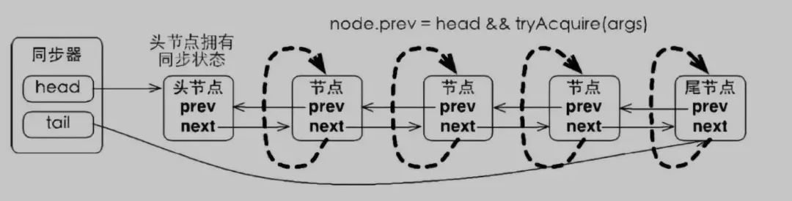

* 独占式锁获取流程：

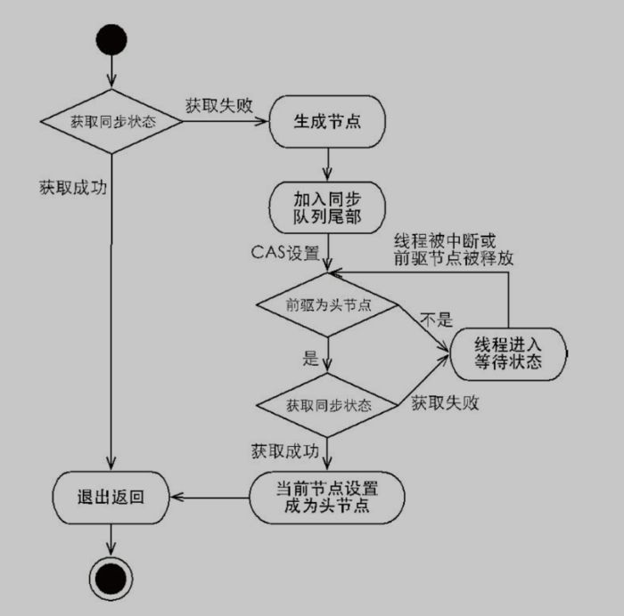

共享式：

* 共享式与独占式的区别：

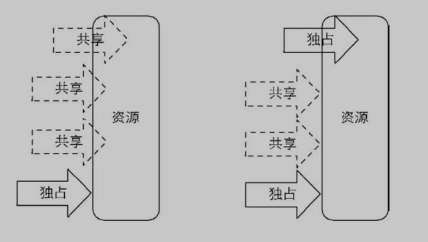

* 共享锁获取流程：

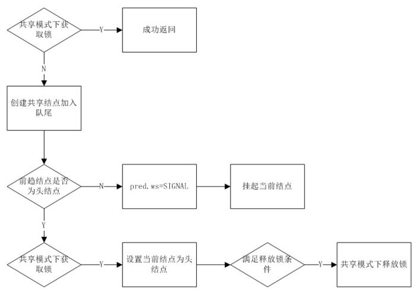

### Synchronized底层实现

1 简介

Java中提供了两种实现同步的基础语义：synchronized方法和synchronized块， 我们来看个demo：

```
public class SyncTest {
    public void syncBlock(){
        synchronized (this){
            System.out.println("hello block");
        }
    }
    public synchronized void syncMethod(){
        System.out.println("hello method");
    }
}
```

当SyncTest.java被编译成class文件的时候，synchronized关键字和synchronized方法的字节码略有不同，我们可以用javap -v 命令查看class文件对应的JVM字节码信息，部分信息如下：

```
{
  public void syncBlock();
    descriptor: ()V
    flags: ACC_PUBLIC
    Code:
      stack=2, locals=3, args_size=1
         0: aload_0
         1: dup
         2: astore_1
         3: monitorenter				 	  // monitorenter指令进入同步块
         4: getstatic     #2                  // Field java/lang/System.out:Ljava/io/PrintStream;
         7: ldc           #3                  // String hello block
         9: invokevirtual #4                  // Method java/io/PrintStream.println:(Ljava/lang/String;)V
        12: aload_1
        13: monitorexit						  // monitorexit指令退出同步块
        14: goto          22
        17: astore_2
        18: aload_1
        19: monitorexit						  // monitorexit指令退出同步块
        20: aload_2
        21: athrow
        22: return
      Exception table:
         from    to  target type
             4    14    17   any
            17    20    17   any
 

  public synchronized void syncMethod();
    descriptor: ()V
    flags: ACC_PUBLIC, ACC_SYNCHRONIZED      //添加了ACC_SYNCHRONIZED标记
    Code:
      stack=2, locals=1, args_size=1
         0: getstatic     #2                  // Field java/lang/System.out:Ljava/io/PrintStream;
         3: ldc           #5                  // String hello method
         5: invokevirtual #4                  // Method java/io/PrintStream.println:(Ljava/lang/String;)V
         8: return
 
}
```

从上面的中文注释处可以看到，对于synchronized关键字而言，javac在编译时，会生成对应的monitorenter和monitorexit指令分别对应synchronized同步块的进入和退出，有两个monitorexit指令的原因是：为了保证抛异常的情况下也能释放锁，所以javac为同步代码块添加了一个隐式的try-finally，在finally中会调用monitorexit命令释放锁。而对于synchronized方法而言，javac为其生成了一个ACC_SYNCHRONIZED关键字，在JVM进行方法调用时，发现调用的方法被ACC_SYNCHRONIZED修饰，则会先尝试获得锁。

在JVM底层，对于这两种synchronized语义的实现大致相同，在后文中会选择一种进行详细分析。

2 锁的几种形式

传统的锁（也就是下文要说的重量级锁）依赖于系统的同步函数，在linux上使用mutex互斥锁，最底层实现依赖于futex，关于futex可以参考：[futex](https://github.com/farmerjohngit/myblog/issues/8). 这些同步函数都涉及到用户态和内核态的切换、进程的上下文切换，成本较高。对于加了synchronized关键字但运行时并没有多线程竞争，或两个线程接近于交替执行的情况，使用传统锁机制无疑效率是会比较低的。

在JDK 1.6之前,synchronized只有传统的锁机制，因此给开发者留下了synchronized关键字相比于其他同步机制性能不好的印象。

在JDK 1.6引入了两种新型锁机制：偏向锁和轻量级锁，它们的引入是为了解决在没有多线程竞争或基本没有竞争的场景下因使用传统锁机制带来的性能开销问题。

在看这几种锁机制的实现前，我们先来了解下对象头，它是实现多种锁机制的基础。

3 对象头

因为在Java中任意对象都可以用作锁，因此必定要有一个映射关系，存储该对象以及其对应的锁信息（比如当前哪个线程持有锁，哪些线程在等待）。一种很直观的方法是，用一个全局map，来存储这个映射关系，但这样会有一些问题：需要对map做线程安全保障，不同的synchronized之间会相互影响，性能差；另外当同步对象较多时，该map可能会占用比较多的内存。

所以最好的办法是将这个映射关系存储在对象头中，因为对象头本身也有一些hashcode、GC相关的数据，所以如果能将锁信息与这些信息共存在对象头中就好了。

在JVM中，对象在内存中除了本身的数据外还会有个对象头，对于普通对象而言，其对象头中有两类信息：mark word和类型指针。另外对于数组而言还会有一份记录数组长度的数据。

类型指针是指向该对象所属类对象的指针，mark word用于存储对象的HashCode、GC分代年龄、锁状态等信息。在32位系统上mark word长度为32bit，64位系统上长度为64bit。为了能在有限的空间里存储下更多的数据，其存储格式是不固定的，在32位系统上各状态的格式如下：

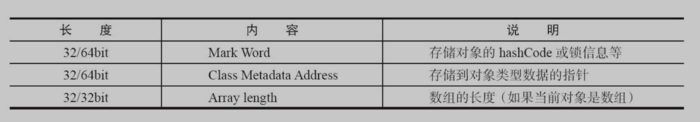

锁存放的位置:锁标记存放在Java对象头的Mark Word中


可以看到锁信息也是存在于对象的mark word中的。当对象状态为偏向锁（biasable）时，mark word存储的是偏向的线程ID；当状态为轻量级锁（lightweight locked）时，mark word存储的是指向线程栈中Lock Record的指针；当状态为重量级锁（inflated）时，为指向堆中的monitor对象的指针。

4 重量级锁

重量级锁是我们常说的传统意义上的锁，其利用操作系统底层的同步机制去实现Java中的线程同步。

重量级锁的状态下，对象的mark word为指向一个堆中monitor对象的指针。

一个monitor对象包括这么几个关键字段：cxq（下图中的ContentionList），EntryList ，WaitSet，owner。

其中cxq ，EntryList ，WaitSet都是由ObjectWaiter的链表结构，owner指向持有锁的线程。

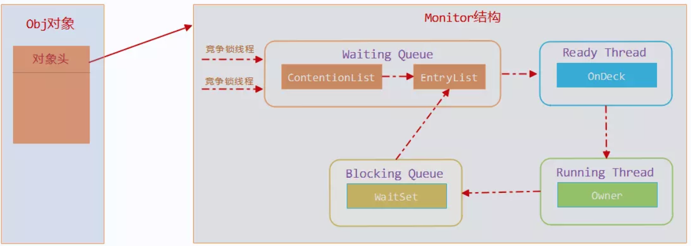

当一个线程尝试获得锁时，如果该锁已经被占用，则会将该线程封装成一个ObjectWaiter对象插入到cxq的队列尾部，然后暂停当前线程。当持有锁的线程释放锁前，会将cxq中的所有元素移动到EntryList中去，并唤醒EntryList的队首线程。

如果一个线程在同步块中调用了Object#wait方法，会将该线程对应的ObjectWaiter从EntryList移除并加入到WaitSet中，然后释放锁。当wait的线程被notify之后，会将对应的ObjectWaiter从WaitSet移动到EntryList中。

以上只是对重量级锁流程的一个简述，其中涉及到的很多细节，比如ObjectMonitor对象从哪来？释放锁时是将cxq中的元素移动到EntryList的尾部还是头部？notfiy时，是将ObjectWaiter移动到EntryList的尾部还是头部？

5 轻量级锁

JVM的开发者发现在很多情况下，在Java程序运行时，同步块中的代码都是不存在竞争的，不同的线程交替的执行同步块中的代码。这种情况下，用重量级锁是没必要的。因此JVM引入了轻量级锁的概念。

线程在执行同步块之前，JVM会先在当前的线程的栈帧中创建一个Lock Record，其包括一个用于存储对象头中的 mark word（官方称之为Displaced Mark Word）以及一个指向对象的指针。下图右边的部分就是一个Lock Record。


* 加锁过程

1. 在线程栈中创建一个Lock Record，将其obj（即上图的Object reference）字段指向锁对象。
2. 直接通过CAS指令将Lock Record的地址存储在对象头的mark word中，如果对象处于无锁状态则修改成功，代表该线程获得了轻量级锁。如果失败，进入到步骤3。
3. 如果是当前线程已经持有该锁了，代表这是一次锁重入。设置Lock Record第一部分（Displaced Mark Word）为null，起到了一个重入计数器的作用。然后结束。
4. 走到这一步说明发生了竞争，需要膨胀为重量级锁。

* 解锁过程

1. 遍历线程栈,找到所有obj字段等于当前锁对象的Lock Record。
2. 如果Lock Record的Displaced Mark Word为null，代表这是一次重入，将obj设置为null后continue。
3. 如果Lock Record的Displaced Mark Word不为null，则利用CAS指令将对象头的mark word恢复成为Displaced Mark Word。如果成功，则continue，否则膨胀为重量级锁。

6 偏向锁

Java是支持多线程的语言，因此在很多二方包、基础库中为了保证代码在多线程的情况下也能正常运行，也就是我们常说的线程安全，都会加入如synchronized这样的同步语义。但是在应用在实际运行时，很可能只有一个线程会调用相关同步方法。比如下面这个demo：

```
public class SyncDemo1 {

    public static void main(String[] args) {
        SyncDemo1 syncDemo1 = new SyncDemo1();
        for (int i = 0; i < 100; i++) {
            syncDemo1.addString("test:" + i);
        }
    }

    private List<String> list = new ArrayList<>();

    public synchronized void addString(String s) {
        list.add(s);
    }

}
```

在这个demo中为了保证对list操纵时线程安全，对addString方法加了synchronized的修饰，但实际使用时却只有一个线程调用到该方法，对于轻量级锁而言，每次调用addString时，加锁解锁都有一个CAS操作；对于重量级锁而言，加锁也会有一个或多个CAS操作（这里的’一个‘、’多个‘数量词只是针对该demo，并不适用于所有场景）。

在JDK1.6中为了提高一个对象在一段很长的时间内都只被一个线程用作锁对象场景下的性能，引入了偏向锁，在第一次获得锁时，会有一个CAS操作，之后该线程再获取锁，只会执行几个简单的命令，而不是开销相对较大的CAS命令。我们来看看偏向锁是如何做的。

* 对象创建

当JVM启用了偏向锁模式（1.6以上默认开启），当新创建一个对象的时候，如果该对象所属的class没有关闭偏向锁模式（默认所有class的偏向模式都是是开启的），那新创建对象的mark word将是可偏向状态，此时mark word中的thread id（参见上文偏向状态下的mark word格式）为0，表示未偏向任何线程，也叫做匿名偏向(anonymously biased)。

* 加锁过程

case 1：当该对象第一次被线程获得锁的时候，发现是匿名偏向状态，则会用CAS指令，将mark word中的thread id由0改成当前线程Id。如果成功，则代表获得了偏向锁，继续执行同步块中的代码。否则，将偏向锁撤销，升级为轻量级锁。

case 2：当被偏向的线程再次进入同步块时，发现锁对象偏向的就是当前线程，在通过一些额外的检查后（细节见后面的文章），会往当前线程的栈中添加一条Displaced Mark Word为空的Lock Record中，然后继续执行同步块的代码，因为操纵的是线程私有的栈，因此不需要用到CAS指令；由此可见偏向锁模式下，当被偏向的线程再次尝试获得锁时，仅仅进行几个简单的操作就可以了，在这种情况下，synchronized关键字带来的性能开销基本可以忽略。

case 3.当其他线程进入同步块时，发现已经有偏向的线程了，则会进入到撤销偏向锁的逻辑里，一般来说，会在safepoint中去查看偏向的线程是否还存活，如果存活且还在同步块中则将锁升级为轻量级锁，原偏向的线程继续拥有锁，当前线程则走入到锁升级的逻辑里；如果偏向的线程已经不存活或者不在同步块中，则将对象头的mark word改为无锁状态（unlocked），之后再升级为轻量级锁。

由此可见，偏向锁升级的时机为：当锁已经发生偏向后，只要有另一个线程尝试获得偏向锁，则该偏向锁就会升级成轻量级锁。当然这个说法不绝对，因为还有批量重偏向这一机制。

* 解锁过程

当有其他线程尝试获得锁时，是根据遍历偏向线程的lock record来确定该线程是否还在执行同步块中的代码。因此偏向锁的解锁很简单，仅仅将栈中的最近一条lock record的obj字段设置为null。需要注意的是，偏向锁的解锁步骤中并不会修改对象头中的thread id。

下图展示了锁状态的转换流程：

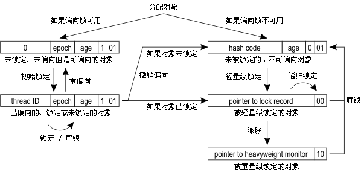

另外，偏向锁默认不是立即就启动的，在程序启动后，通常有几秒的延迟，可以通过命令 ```-XX:BiasedLockingStartupDelay=0```来关闭延迟。

* 批量重偏向与撤销

从上文偏向锁的加锁解锁过程中可以看出，当只有一个线程反复进入同步块时，偏向锁带来的性能开销基本可以忽略，但是当有其他线程尝试获得锁时，就需要等到safe point时将偏向锁撤销为无锁状态或升级为轻量级/重量级锁。safe point这个词我们在GC中经常会提到，其代表了一个状态，在该状态下所有线程都是暂停的（大概这么个意思），详细可以看这篇[文章](https://blog.csdn.net/ITer_ZC/article/details/41892567)。总之，偏向锁的撤销是有一定成本的，如果说运行时的场景本身存在多线程竞争的，那偏向锁的存在不仅不能提高性能，而且会导致性能下降。因此，JVM中增加了一种批量重偏向/撤销的机制。

存在如下两种情况：（见官方[论文](https://www.oracle.com/technetwork/java/biasedlocking-oopsla2006-wp-149958.pdf)第4小节）:

1. 一个线程创建了大量对象并执行了初始的同步操作，之后在另一个线程中将这些对象作为锁进行之后的操作。这种case下，会导致大量的偏向锁撤销操作。

2. 存在明显多线程竞争的场景下使用偏向锁是不合适的，例如生产者/消费者队列。

批量重偏向（bulk rebias）机制是为了解决第一种场景。批量撤销（bulk revoke）则是为了解决第二种场景。

其做法是：以class为单位，为每个class维护一个偏向锁撤销计数器，每一次该class的对象发生偏向撤销操作时，该计数器+1，当这个值达到重偏向阈值（默认20）时，JVM就认为该class的偏向锁有问题，因此会进行批量重偏向。每个class对象会有一个对应的epoch字段，每个处于偏向锁状态对象的mark word中也有该字段，其初始值为创建该对象时，class中的epoch的值。每次发生批量重偏向时，就将该值+1，同时遍历JVM中所有线程的栈，找到该class所有正处于加锁状态的偏向锁，将其epoch字段改为新值。下次获得锁时，发现当前对象的epoch值和class的epoch不相等，那就算当前已经偏向了其他线程，也不会执行撤销操作，而是直接通过CAS操作将其mark word的Thread Id 改成当前线程Id。

当达到重偏向阈值后，假设该class计数器继续增长，当其达到批量撤销的阈值后（默认40），JVM就认为该class的使用场景存在多线程竞争，会标记该class为不可偏向，之后，对于该class的锁，直接走轻量级锁的逻辑。

<front color = red size =10>总结：Java中的synchronized有偏向锁、轻量级锁、重量级锁三种形式，分别对应了锁只被一个线程持有、不同线程交替持有锁、多线程竞争锁三种情况。当条件不满足时，锁会按偏向锁->轻量级锁->重量级锁 的顺序升级。JVM种的锁也是能降级的，只不过条件很苛刻，不在我们讨论范围之内。</front>


#### Synchronized和ReentrantLock的区别

原理弄清楚了，顺便总结了几点Synchronized和ReentrantLock的区别：

1. Synchronized是JVM层次的锁实现，ReentrantLock是JDK层次的锁实现；
2. Synchronized的锁状态是无法在代码中直接判断的，但是ReentrantLock可以通过ReentrantLock#isLocked判断；
3. Synchronized是非公平锁，ReentrantLock是可以是公平也可以是非公平的；
4. Synchronized是不可以被中断的，而ReentrantLock#lockInterruptibly方法是可以被中断的；
5. 在发生异常时Synchronized会自动释放锁（由javac编译时自动实现），而ReentrantLock需要开发者在finally块中显示释放锁；
6. ReentrantLock获取锁的形式有多种：如立即返回是否成功的tryLock(),以及等待指定时长的获取，更加灵活；
7. Synchronized在特定的情况下对于已经在等待的线程是后来的线程先获得锁（上文有说），而ReentrantLock对于已经在等待的线程一定是先来的线程先获得锁；

<front color= red size=10>总结:</front>总的来说Synchronized的重量级锁和ReentrantLock的实现上还是有很多相似的，包括其数据结构、挂起线程方式等等。在日常使用中，如无特殊要求用Synchronized就够了。你深入了解这两者其中一个的实现，了解另外一个或其他锁机制都比较容易，这也是我们常说的技术上的相通性。

4 Synchronized和Lock区别 

| 类别 | Synchronized | Lock | 
| :-: | :-: | :-: |
| 存在层次 | Java关键在，在jvm层面上 | 是一个接口 | 
| 锁的释放 | 1、已获取锁的线程执行完同步代码，释放锁 2、线程执行发生异常，jvm会让线程释放锁|在finally中必须释放锁，不然容易造成死锁 | 
| 锁的获取 | 假设A线程获得锁，B线程等待。如果A线程阻塞，B线程一直等待 |分情况而定，Lock有多个获取方式，大致就是可以尝试获得锁，线程可以不用一直等待 | 
| 锁的状态 | 无法判断| 可以判断 | 
| 锁的类型 | 可冲入，不可中断，非公平 | 可冲入，可中断，可公平 | 
| 性能 | 少量同步| 大量同步 | 

## run()和start()方法区别

eg:

```
 public class RTDifferThread {
  public static void main(String[] args) {
    TaskThread runner = new TaskThread();
    runner.run();
    Thread thTask1 = new Thread(runner);
    thTask1.run();
    Thread thTask2 = new Thread(runner);
    thTask2.start();
    Thread thTaskBG1 = new TaskBGThread();
    thTaskBG1.start();
    Thread thTaskBG2 = new TaskBGThread();
    thTaskBG2.start();
  }
}

class TaskBGThread extends Thread {
  private int i = 1;

  @Override
  public void run() {
    System.out.println("TaskBG：" + i);
    i++;
  }
}

class TaskThread implements Runnable {
  private int i = 1;

  @Override
  public void run() {
    System.out.println("Task：" + i);
    i++;
  }
}
```

结果：

```
Task：1
Task：2
Task：3
TaskBG：1
TaskBG：1
```

1 start()方法:启动一个线程，调用该Runnable对象的run()方法，不能多次启动一个线程。
start()方法来启动线程，真正实现了多线程运行，这时无需等待run方法体代码执行完毕而直接继续执行下面的代码。通过调用Thread类的start()方法来启动一个线程， 这时此线程是处于就绪状态， 并没有运行。
2 run()方法:在本线程内调用该Runnable对象的run()方法，可以重复多次调用。通过此Thread类调用方法run()来完成其运行操作的， 这里方法run()称为线程体， 它包含了要执行的这个线程的内容， run方法运行结束， 此线程终止， 而CPU再运行其它线程。
run()方法当作普通方法的方式调用，程序还是要顺序执行，还是要等待run方法体执行完毕后才可继续执行下面的代码；如果直接用run方法， 这只是调用一个方法而已， 程序中依然只有主线程--这一个线程， 其程序执行路径还是只有一条， 这样就没有达到写线程的目的。


提醒一下大家：main方法其实也是一个线程。在java中所以的线程都是同时启动的，至于什么时候，哪个先执行，完全看谁先得到CPU的资源。

在java中，每次程序运行至少启动2个线程。一个是main线程，一个是垃圾收集线程。因为每当使用java命令执行一个类的时候，实际上都会启动一个JVM，每一个JVM实际就是在操作系统中启动了一个进程。

在java程序中，只要前台有一个线程在运行，整个java程序进程不会消失，所以此时可以设置一个后台线程，这样即使java进程消失了，此后台线程依然能够继续运行。

### 如何限制方法访问的并发数

1 通过Semaphore

```
private static Semaphore semaphore = new Semaphore(100);
 
public static Integer methodA() {
    if(!semaphore.tryAcquire()) {
        return null;
    }
 
    try {
    // TODO 方法中的业务逻辑
    } finally {
        semaphore.release();
    }
```

2 通过线程池

```
private final static ExecutorService pool = new ThreadPoolExecutor(100, 100, 1, TimeUnit.MINUTES, new SynchronousQueue<>());
 
public static Integer methodAWrapper() {
    try {
        Future<Integer> future = pool.submit(() -> methodA());
        return future.get();
    } catch (Exception e) {
      return null;
    }
}
 
public static Integer methodA() {
    // TODO 方法中的业务逻辑
}
```

3 通过计数器

A 方案

```
private static AtomicInteger counter = new AtomicInteger(0);
 
public static Integer methodA() {
 
    int value = counter.incrementAndGet();
    if(value > 100) {
        return null;
    }
 
    try {
        // TODO 方法中的业务逻辑
    } finally {
        counter.decrementAndGet();
    }
}
```

AtomicInteger 

```
public final int incrementAndGet() {
    return unsafe.getAndAddInt(this, valueOffset, 1) + 1;
}

public final int getAndIncrement() {
    return unsafe.getAndAddInt(this, valueOffset, 1);
}

public final int getAndAddInt(Object var1, long var2, int var4) {
    int var5;
    do {
        var5 = this.getIntVolatile(var1, var2);
    } while(!this.compareAndSwapInt(var1, var2, var5, var5 + var4));

    return var5;
}
```

this.compareAndSwapInt(var1, var2, var5, var5 + var4)

> ```public final native boolean compareAndSwapInt(this, valueOffset, expect, update) ```
方法有四个参数，其中第一个参数为需要改变的对象，第二个参数为偏移量， 第三个参数为期待的值，第四个参数为更新后的值。整个方法的作用即为若调用该方法时，value的值与expect这个值相等，那么则将value修改为update这个值，并返回一个true，如果调用该方法时，value的值与expect这个值不相等，那么不做任何操作，并返回一个false。

getAndAddInt 方法此处有个do while循环，可以保证如果调用compareAndSwapInt这个方法返回为false时，能再次尝试进行修改value的值，直到修改成功，并返回修改前value的值。

```
AtomicInteger first = new AtomicInteger(5);
int a = first.getAndIncrement();//先返回再加1，相当于i++
System.out.println("a value:"+a);
System.out.println("first value:"+first);
 
AtomicInteger second = new AtomicInteger(5);
int b = second.incrementAndGet();//先加1再返回，相当于++i
System.out.println("b value:"+b);
```

结果：

```
a value: 5
first value: 6
b value: 6
seconde value: 6
```

B方案

```
private static AtomicInteger counter = new AtomicInteger(0);
 
public static Integer methodA() {
 
    int value = counter.get();
    if(value > 100) {
        return null;
    }
    
    counter.incrementAndGet();
 
    try {
        // TODO 方法中的业务逻辑
    } finally {
        counter.decrementAndGet();
    }
}
```

对于方案A，在极端高并发的情况下，每个调用methodA的请求，都会对计数器进行+1，即使我们在finally对计数器进行了-1，也阻止value的值继续上涨，导致远大于100，得到的结果是所有请求没机会执行业务逻辑，即“饿死”现象。

对于方案B，由于是活的执行业务逻辑的许可后再进行的+1操作，很显然在高并发情况下会导致执行业务逻辑的线程数超过100。

4 阻塞线程

```
private static BlockingQueue<Integer> reqQueue = new ArrayBlockingQueue<>(100);
 
public static Integer methodA() {
 
    if(!reqQueue.offer()) {
        return null;
    }
 
    try {
        // TODO 方法中的业务逻辑
    } finally {
        reqQueue.poll();
    }
}
```

## 谈谈wait/notify关键字的理解

* wait( )，notify( )，notifyAll( )都不属于Thread类，而是属于Object基础类，也就是每个对象都有wait( )，notify( )，notifyAll( ) 的功能，因为每个对象都有锁，锁是每个对象的基础，当然操作锁的方法也是最基础了。
* 当需要调用以上的方法的时候，一定要对竞争资源进行加锁，如果不加锁的话，则会报 IllegalMonitorStateException 异常
* 当想要调用wait( )进行线程等待时，必须要取得这个锁对象的控制权（对象监视器），一般是放到synchronized(obj)代码中。
* 在while循环里而不是if语句下使用wait，这样，会在线程暂停恢复后都检查wait的条件，并在条件实际上并未改变的情况下处理唤醒通知
* 调用obj.wait( )释放了obj的锁，否则其他线程也无法获得obj的锁，也就无法在synchronized(obj){ obj.notify() } 代码段内唤醒A。
* notify( )方法只会通知等待队列中的第一个相关线程（不会通知优先级比较高的线程）
* notifyAll( )通知所有等待该竞争资源的线程（也不会按照线程的优先级来执行）
* 假设有三个线程执行了obj.wait( )，那么obj.notifyAll( )则能全部唤醒tread1，thread2，thread3，但是要继续执行obj.wait（）的下一条语句，必须获得obj锁，因此，tread1，thread2，thread3只有一个有机会获得锁继续执行，例如tread1，其余的需要等待thread1释放obj锁之后才能继续执行。
* 当调用obj.notify/notifyAll后，调用线程依旧持有obj锁，因此，thread1，thread2，thread3虽被唤醒，但是仍无法获得obj锁。直到调用线程退出synchronized块，释放obj锁后，thread1，thread2，thread3中的一个才有机会获得锁继续执行。

## 什么导致线程阻塞？

阻塞状态的线程的特点是：该线程放弃CPU的使用，暂停运行，只有等到导致阻塞的原因消除之后才恢复运行。或者是被其他的线程中断，该线程也会退出阻塞状态，同时抛出InterruptedException

1）线程执行了Thread.sleep(intmillsecond);方法，当前线程放弃CPU，睡眠一段时间，然后再恢复执行

2）线程执行一段同步代码，但是尚且无法获得相关的同步锁，只能进入阻塞状态，等到获取了同步锁，才能回复执行。

3）线程执行了一个对象的wait()方法，直接进入阻塞状态，等待其他线程执行notify()或者notifyAll()方法。

4）线程执行某些IO操作，因为等待相关的资源而进入了阻塞状态。比如说监听system.in，但是尚且没有收到键盘的输入，则进入阻塞状态。

## 讲一下java中的同步的方法

1 synchronized方法或者代码块

2 重入锁ReentrantLock配合Condition

3 wait/notifyAll方式，跟ReentrantLock/Condition方式的原理是一样的

4 ThreadLocal 是一种把变量放到线程本地的方式来实现线程同步的

5 Semaphore 信号量

6 并发包下的工具类

* CountDownLatch(底层使用AQS实现)

CountDownLatch是一个计数器，它的构造方法中需要设置一个数值，用来设定计数的次数。每次调用countDown()方法之后，这个计数器都会减去1，CountDownLatch会一直阻塞着调用await()方法的线程，直到计数器的值变为0。

## 如何保证线程安全？

* 线程安全：

线程安全就是多线程访问时，采用了加锁机制，当一个线程访问该类的某个数据时，进行保护，其他线程不能进行访问直到该线程读取完，其他线程才可使用。不会出现数据不一致或者数据污染。 线程不安全就是不提供数据访问保护，有可能出现多个线程先后更改数据造成所得到的数据是脏数据。

* 如何保证呢：

1、使用线程安全的类，例如juc包下提供的；
2、使用synchronized同步代码块，或者用Lock锁等；
3、多线程并发情况下，线程共享的变量改为方法局部级变量；

## 两个进程同时要求写或者读，能不能实现？如何防止进程的同步？

1 读者—写者问题（Readers-Writers problem）也是一个经典的并发程序设计问题，是经常出现的一种同步问题。计算机系统中的数据（文件、记录）常被多个进程共享，但其中某些进程可能只要求读数据（称为读者Reader）；另一些进程则要求修改数据（称为写者Writer）。就共享数据而言，Reader和Writer是两组并发进程共享一组数据区，通常要求满足：

 1) 写-写互斥，即不能有两个写者同时进行写操作。

 2) 读-写互斥，即不能同时有一个线程在读，而另一个线程在写。

 3) 读-读允许，即可以有一个或多个读者在读。 

读者优先的附加限制:如果一个读者申请进行读操作时已有另一个读者正在进行读操作，则该读者可直接开始读操作。 

写者优先的附加限制:如果一个读者申请进行读操作时已有另一写者在等待访问共享资源，则该读者必须等到没有写者处于等待状态后才能开始读操作。 

运行结果显示要求:要求在每个线程创建、发出读写操作申请、开始读写操作和结束读写操作时分别显示一行提示信息，以确定所有处理都遵守相应的读写操作限制。

2 可以进行同时读写，但为了保证数据的正确，必须要针对进程访问的共享临界区进行处理；两个进程不能同时进入临界区，否则会导致数据错乱。常见的处理方式有：信号量、管程、会合、分布式系统

1、信号量

信号量是一个计数器，它只支持2种操作：P操作（进入临界区）和V操作（退出临界区）。假设有信号量SV，则对它的P、V操作含义如下：

* P(SV)，如果SV的值大于0，意味着可以进入临界区，就将它减1；如果SV的值为0，意味着别的进程正在访问临界区，则挂起当前进程的执行；
* V(SV)，当前进程退出临界区时，如果有其他进程因为等待SV而挂起，则唤醒之；如果没有，则将SV加1，之后再退出临界区。

2、管程

* 提出原因：信号量机制不足，程序编写困难、易出错
* 方案：在程序设计语言中引入一种高级维护机制
* 定义：是一个特殊的模块；有一个名字；由关于共享资源的数据结构及在其上操作上的一组过程组成。进程只能通过调用管程中的过程间接访问管程中的数据结构

  1）互斥：管程是互斥进入的 为了保证数据结构的数据完整性管程的互斥由编译器负责保证的，是一种语言机制
  2）同步：设置条件变量及等待唤醒操作以解决同步问题，可以让一个进程或者线程在条件变量上等待（先释放管程的管理权），也可以通过发送信号将等待在条件变量上的进程线程唤醒
  
## 谈谈对Synchronized关键字，类锁，方法锁

synchronized 

1. 在修饰代码块的时候需要一个reference对象作为锁的对象. 
2. 在修饰方法的时候默认是当前对象作为锁的对象. 
3. 在修饰类时候默认是当前类的Class对象作为锁的对象.


1 方法锁（synchronized修饰方法时）

通过在方法声明中加入synchronized关键字来声明synchronized方法。

synchronized 方法锁控制对类成员变量的访问：

* 每个类实例对应一把锁
* 每个synchronized方法都必须获得调用该方法的类实例的”锁“方能执行，否则所属线程阻塞。

方法一旦执行，就会独占该锁，一直到从该方法返回时才将锁释放，此后被阻塞的线程方能获得该锁，从而重新进入可执行状态。

这种机制确保了同一时刻对于每一个类的实例，其所有声明为synchronized的成员函数中至多只有一个处于可执行状态，从而有效避免了类成员变量的访问冲突。

2 对象锁（synchronized修饰方法或代码块）

当一个对象中有synchronized method 或synchronized block 的时候，调用此对象的同步方法或进入其同步区域时，就必须先获得对象锁。

如果此对象的对象锁已被其他调用者占用，则需要等待此锁被释放。（方法锁也是对象锁）

java的所有对象都含有一个互斥锁，这个锁由jvm自动获取和释放。

线程进入synchronized 方法的时候获取该对象的锁，当然如果已经有线程获取了这个对象的锁，那么当前线程会等待；

synchronized方法正常返回或者抛异常而终止，jvm会自动释放对象锁。这里也体现了用synchronized来加锁的一个好处，即 ：

方法抛异常的时候，锁仍然可以由jvm来自动释放

```
public class Test { 

// 对象锁：形式1(方法锁) 
public synchronized void Method1() { 
}

// 对象锁：形式2（代码块形式）
public void Method2(){
    synchronized (this){
    }
}
    
```

3 类锁(synchronized 修饰静态的方法或代码块)

由于一个class不论被实例化多少次，其中的静态方法和静态变量在内存中都只有一份。所以，一旦一个静态的方法被申明为synchronized。此类所有的实例化对象在调用此方法，共用同一把锁，我们称之为类锁。 　

对象锁是用来控制实例方法之间的同步，类锁是用来控制静态方法（或静态变量互斥体）之间的同步。　

类锁只是一个概念上的东西，并不是真实存在的，它只是用来帮助我们理解锁定实例方法和静态方法的区别的。　 
java类可能会有很多个对象，但是只有1个Class对象，也就是说类的不同实例之间共享该类的Class对象。Class对象其实也仅仅是1个java对象，只不过有点特殊而已。由于每个java对象都有1个互斥锁，而类的静态方法是需要Class对象。所以所谓的类锁，不过是Class对象的锁而已。获取类的Class对象有好几种，最简单的就是［类名.class］的方式。

```
// 类锁：形式1  
public static synchronized void Method1() { 
}

// 类锁：形式2
public void Method２(){
    synchronized (Test.class){
    }
}    
```

4 总结：

1、一个类的对象锁和另一个类的对象锁是没有关联的，当一个线程获得A类的对象锁时，它同时也可以获得B类的对象锁。

2、一个类中带对象锁的方法和不带锁的方法，可以异步执行，不干扰，不需要等待。

3、一个类中，如果set（）方法加了对象锁，get()方法不加对象锁，容易发生数据脏读。可以用类锁或者set、get都加对象锁，解决。

4、同一个类中，多个锁方法相互调用，线程安全。锁重入，获取锁的对象调用加锁的方法时，会自动获取对象锁，不需要等待。

5、父子类中，锁方法相互调用，线程安全。锁重入，在继承关系中适用。

6、锁方法发生异常时，会自动释放锁。程序继续执行，如果没有响应的处理，会发生业务逻辑的漏洞或者混乱。多见批处理、消息队列等。

7、类中的object成员变量加锁，为任意对象锁。

8、String常量值加锁，容易发生死锁。

9、change锁情况的发生，如果你在一个对象锁方法中，对这个锁对象的引用做了修改，则表示释放了锁对象。如重新new object（），赋值给这个锁对象。但是锁对象的属性或值发生改变，并不发生锁的释放。

## 对象锁和类锁是否会互相影响？

类锁和对象锁不是同1个东西，一个是类的Class对象的锁，一个是类的实例的锁。也就是说：1个线程访问静态synchronized的时候，允许另一个线程访问对象的实例synchronized方法。反过来也是成立的，因为他们需要的锁是不同的。


## 同一个类里面两个synchronized方法，两个线程同时访问的问题

Java中同一个类中不同的synchronized方法是否可以并发执行 ?

答案是: 不可以!!!

> 多个线程访问同一个类的synchronized方法时, 都是串行执行的 ! 就算有多个cpu也不例外 ! synchronized方法使用了类java的内置锁, 即锁住的是方法所属对象本身. 同一个锁某个时刻只能被一个执行线程所获取, 因此其他线程都得等待锁的释放. 因此就算你有多余的cpu可以执行, 但是你没有锁, 所以你还是不能进入synchronized方法执行, CPU因此而空闲. 如果某个线程长期持有一个竞争激烈的锁, 那么将导致其他线程都因等待所的释放而被挂起, 从而导致CPU无法得到利用, 系统吞吐量低下. 因此要尽量避免某个线程对锁的长期占有

```
public class SyncMethodTest {

  public static void main(String[] args) {
    SyncMethod method = new SyncMethod();

    for (int i = 0; i < 10; i++) {
      new Thread(method::syncMethod1).start();
      new Thread(method::syncMethod2).start();
    }
  }
}

class SyncMethod {

  public synchronized void syncMethod1() {
    System.out.println(Thread.currentThread().getName() + "-->" + "syncMethod1 获得🔐");
    try {
      TimeUnit.SECONDS.sleep(20);
    } catch (InterruptedException e) {
      e.printStackTrace();
    }
    System.out.println("1分钟后，syncMethod1 释放🔐");
  }

  public synchronized void syncMethod2() {
    System.out.println(Thread.currentThread().getName() + "-->" + "syncMethod2 获得🔐");
    try {
      TimeUnit.SECONDS.sleep(20);
    } catch (InterruptedException e) {
      e.printStackTrace();
    }
    System.out.println("1分钟后，syncMethod2 释放🔐");
  }
}
```

结果:

```
Thread-0-->syncMethod1 获得🔐
1分钟后，syncMethod1 释放🔐
Thread-19-->syncMethod2 获得🔐
1分钟后，syncMethod2 释放🔐
Thread-18-->syncMethod1 获得🔐
1分钟后，syncMethod1 释放🔐
Thread-17-->syncMethod2 获得🔐
.
.
.
```

## volatile的原理

摘要：在 Java 并发编程中，要想使并发程序能够正确地执行，必须要保证三条原则，即：原子性、可见性和有序性。只要有一条原则没有被保证，就有可能会导致程序运行不正确。volatile关键字 被用来保证可见性，即保证共享变量的内存可见性以解决缓存一致性问题。一旦一个共享变量被 volatile关键字修饰，那么就具备了两层语义：内存可见性和禁止进行指令重排序。在多线程环境下，volatile关键字 主要用于及时感知共享变量的修改，并使得其他线程可以立即得到变量的最新值，例如，用于修饰状态标记量和 Double-Check (双重检查)中。

volatile关键字虽然从字面上理解起来比较简单，但是要用好不是一件容易的事情。由于 volatile关键字 是与内存模型紧密相关，因此在讲述 volatile关键字 之前，我们有必要先去了解与内存模型相关的概念和知识，然后回头再分析 volatile关键字的实现原理，最后在给出volatile关键字的使用场景。

一、内存模型的相关概念

计算机在执行程序时，每条指令都是在CPU中执行的，而执行指令过程中，势必涉及到数据的读取和写入。<font color = blue>由于程序运行过程中的临时数据是存放在主存（物理内存）当中的，这时就存在一个问题：由于 CPU 执行速度很快，而从内存读取数据和向内存写入数据的过程跟 CPU 执行指令的速度比起来要慢的多，因此如果任何时候对数据的操作都要通过和内存的交互来进行，会大大降低指令执行的速度</font>。因此，在 CPU 里面就有了<font color= red>高速缓存（寄存器）</font>。

也就是说，<font color= red>在程序运行过程中，会将运算需要的数据从主存复制一份到 CPU 的高速缓存当中，那么， CPU 进行计算时就可以直接从它的高速缓存读取数据和向其中写入数据，当运算结束之后，再将高速缓存中的数据刷新到主存当中</font>。举个简单的例子，比如下面的这段代码：

```
i = i + 1;
```

当线程执行这个语句时，会先从主存当中读取 i 的值，然后复制一份到高速缓存当中，然后CPU执行指令对 i 进行加1操作，然后将数据写入高速缓存，最后将高速缓存中 i 最新的值刷新到主存当中。

这个代码在单线程中运行是没有任何问题的，但是在多线程中运行就会有问题了。<font color= blue>在多核 CPU 中，每个线程可能运行于不同的 CPU 中，因此每个线程运行时有自己的高速缓存（对单核CPU来说，其实也会出现这种问题，只不过是以线程调度的形式来分别执行的）</font>。本文我们以多核CPU为例。

比如，同时有两个线程执行这段代码，假如初始时 i 的值为 0，那么我们希望两个线程执行完之后 i 的值变为 2。但是事实会是这样吗？

可能存在下面一种情况：初始时，两个线程分别读取 i 的值存入各自所在的 CPU 的高速缓存当中，然后线程1 进行加 1 操作，然后把 i 的最新值 1 写入到内存。此时线程 2 的高速缓存当中 i 的值还是 0，进行加 1 操作之后，i 的值为 1，然后线程 2 把 i 的值写入内存。

最终结果 i 的值是 1，而不是 2 。这就是著名的 <font color= green >缓存一致性问题</font> 。通常称这种被多个线程访问的变量为<font color= green >共享变量</font> 。

也就是说，<font color= red >如果一个变量在多个 CPU 中都存在缓存（一般在多线程编程时才会出现），那么就可能存在<font color= green >缓存不一致</font>的问题</font> 。

为了解决缓存不一致性问题，在硬件层面上通常来说有以下两种解决方法：

* 通过在 <font color= green >总线加LOCK#锁</font>的方式 <font color= red >（在软件层面，效果等价于使用 synchronized 关键字）</font>；

* 通过 <font color= green >缓存一致性协议 </font><font color= red >（在软件层面，效果等价于使用 volatile 关键字）</font>。

在早期的 CPU 当中，是通过在总线上加 LOCK# 锁的形式来解决缓存不一致的问题。因为 <font color= blue >CPU 和其他部件进行通信都是通过总线来进行的，如果对总线加 LOCK# 锁的话，也就是说阻塞了其他 CPU 对其他部件访问（如内存），从而使得只能有一个CPU能使用这个变量的内存。</font>比如上面例子中， 如果一个线程在执行 i = i + 1，如果在执行这段代码的过程中，在总线上发出了 LCOK# 锁的信号，那么只有等待这段代码完全执行完毕之后，其他 CPU 才能从变量 i 所在的内存读取变量，然后进行相应的操作，这样就解决了缓存不一致的问题。但是上面的方式会有一个问题，<font color= red >由于在锁住总线期间，其他 CPU 无法访问内存，导致效率低下。</font>

所以，就出现了<font color= green >缓存一致性协议</font> ，其中最出名的就是 Intel 的 MESI 协议。MESI 协议保证了每个缓存中使用的共享变量的副本是一致的。它核心的思想是： <font color= red >当 CPU 写数据时，如果发现操作的变量是共享变量，即在其他 CPU 中也存在该变量的副本，会发出信号通知其他 CPU 将该变量的缓存行置为无效状态。因此，当其他 CPU 需要读取这个变量时，发现自己缓存中缓存该变量的缓存行是无效的，那么它就会从内存重新读取。</font>


二、并发编程中的三个概念

在并发编程中，我们通常会遇到以下三个问题： 原子性问题 ， 可见性问题 和 有序性问题 。我们先看具体看一下这三个概念：

1、原子性

原子性：即一个操作或者多个操作要么全部执行并且执行的过程不会被任何因素打断，要么就都不执行。

一个很经典的例子就是银行账户转账问题：

比如从账户A向账户B转1000元，那么必然包括2个操作：从账户A减去1000元，往账户B加上1000元。

试想一下，如果这两个操作不具备原子性，会造成什么样的后果。假如从账户 A 减去 1000 元之后，操作突然中止。然后又从 B 取出了 500 元，取出 500 元之后，再执行 往账户 B 加上 1000 元 的操作。这样就会导致账户A虽然减去了 1000 元，但是账户 B 没有收到这个转过来的 1000 元。所以，这两个操作必须要具备原子性才能保证不出现一些意外的问题。

同样地，反映到并发编程中会出现什么结果呢？

举个最简单的例子，大家想一下，假如为一个32位的变量赋值过程不具备原子性的话，会发生什么后果？

```
i = 9;
```

假若一个线程执行到这个语句时，我们暂且假设为一个32位的变量赋值包括两个过程：为低16位赋值，为高16位赋值。那么就可能发生一种情况：当将低16位数值写入之后，突然被中断，而此时又有一个线程去读取 i 的值，那么读取到的就是错误的数据，导致数据不一致性问题。

2、可见性

可见性:是指当多个线程访问同一个共享变量时，一个线程修改了这个变量的值，其他线程能够立即看得到修改的值。

举个简单的例子，看下面这段代码：

```
/线程1执行的代码
int i = 0;
i = 10;


//线程2执行的代码
j = i;
```

假若执行 线程1 的是 CPU1，执行 线程2 的是 CPU2。由上面的分析可知，当 线程1 执行 i = 10 这句时，会先把 i 的初始值加载到 CPU1 的高速缓存中，然后赋值为10，那么在 CPU1 的高速缓存当中 i 的值变为 10 了，却没有立即写入到主存当中。此时，线程2 执行 j = i，它会先去主存读取 i 的值并加载到 CPU2 的缓存当中，注意此时内存当中 i 的值还是 0，那么就会使得 j 的值为 0，而不是 10。

3、有序性

有序性:即程序执行的顺序按照代码的先后顺序执行。

举个简单的例子，看下面这段代码：

```
int i = 0;              
boolean flag = false;
i = 1;                //语句1  
flag = true;          //语句2
```

上面代码定义了一个 int型 变量，定义了一个 boolean型 变量，然后分别对两个变量进行赋值操作。从代码顺序上看，语句1 是在 语句2 前面的，那么 JVM 在真正执行这段代码的时候会保证 语句1 一定会在 语句2 前面执行吗？不一定，为什么呢？这里可能会发生<front color=green>指令重排序（Instruction Reorder）。</front>

什么是指令重排序，一般来说，<front color=red>处理器为了提高程序运行效率，可能会对输入代码进行优化，它不保证程序中各个语句的执行先后顺序同代码中的顺序一致，但是它会保证程序最终执行结果和代码顺序执行的结果是一致的（单线程情形下）。</front>

比如上面的代码中，语句1 和 语句2 谁先执行对最终的程序结果并没有影响，那么就有可能在执行过程中， 语句2 先执行而 语句1 后执行。但是要注意，虽然处理器会对指令进行重排序，但是它会保证程序最终结果会和代码顺序执行结果相同，那么它靠什么保证的呢？再看下面一个例子：

```
int a = 10;    //语句1
int r = 2;    //语句2
a = a + 3;    //语句3
r = a*a;     //语句4
```

这段代码有4个语句，那么可能的一个执行顺序是：


那么可不可能是这个执行顺序呢： 语句2　->　语句1　->　语句4　->　语句3

答案是不可能，因为处理器在进行重排序时会考虑指令之间的<font color=green>数据依赖性</font>，如果一个指令 Instruction 2 必须用到 Instruction 1 的结果，那么处理器会保证 Instruction 1 会在 Instruction 2 之前执行。

虽然<font color=red>重排序不会影响单个线程内程序执行的结果</font>，但是多线程呢？下面，看一个例子：

```
//线程1:
context = loadContext();   //语句1
inited = true;             //语句2


//线程2:
while(!inited ){
  sleep()
}
doSomethingwithconfig(context);
```

上面代码中，由于 语句1 和 语句2 没有数据依赖性，因此可能会被重排序。假如发生了重排序，在 线程1 执行过程中先执行 语句2，而此时 线程2 会以为初始化工作已经完成，那么就会跳出 while循环 ，去执行 doSomethingwithconfig(context) 方法，而此时 context 并没有被初始化，就会导致程序出错。

从上面可以看出，<font color=red>指令重排序不会影响单个线程的执行，但是会影响到线程并发执行的正确性。也就是说，要想使并发程序正确地执行，必须要保证原子性、可见性以及有序性。只要有一个没有被保证，就有可能会导致程序运行不正确。</font>

#### volatile和synchronized对比

关键字volatile 与内存模型紧密相关，是线程同步的轻量级实现，其性能要比 synchronized关键字 好。在作用对象和作用范围上， volatile 用于修饰变量，而 synchronized关键字 用于修饰方法和代码块，而且 synchronized 语义范围不但包括 volatile拥有的可见性，还包括volatile 所不具有的原子性，但不包括 volatile 拥有的有序性，即允许指令重排序。因此，在多线程环境下，volatile关键字 主要用于及时感知共享变量的修改，并保证其他线程可以及时得到变量的最新值。可用以下文氏图表示 synchronized 和 volatile语义范围：  


## 什么是线程池，如何使用?

多线程技术主要解决处理器单元内多个线程执行的问题，它可以显著减少处理器单元的闲置时间，增加处理器单元的吞吐能力。

假设一个服务器完成一项任务所需时间为：T1 创建线程时间，T2 在线程中执行任务的时间，T3 销毁线程时间。

如果：T1 + T3 远大于 T2，则可以采用线程池，以提高服务器性能。

一个线程池包括以下四个基本组成部分：

1、线程池管理器（ThreadPool）：用于创建并管理线程池，包括创建线程池，销毁线程池，添加新任务；

2、工作线程（PoolWorker）：线程池中线程，在没有任务时处于等待状态，可以循环的执行任务；

3、任务接口（Task）：每个任务必须实现的接口，以供工作线程调度任务的执行，它主要规定了任务的入口，任务执行完后的收尾工作，任务的执行状态等；

4、任务队列（taskQueue）：用于存放没有处理的任务。提供一种缓冲机制。

线程池技术正是关注如何缩短或调整T1,T3时间的技术，从而提高服务器程序性能的。它把T1，T3分别安排在服务器程序的启动和结束的时间段或者一些空闲的时间段，这样在服务器程序处理客户请求时，不会有T1，T3的开销了。

为什么要用线程池?

* 降低系统资源消耗（减少了创建和销毁线程的次数，每个工作线程都可以被重复利用，可执行多个任务）。
* 提高线程可控性（可以根据系统的承受能力，调整线程池中工作线线程的数目）。

一、分类

线程池分为6种，分别是FixedThreadPool、SingleThreadExecutor、CachedThreadPool、SingleThreadScheduledExecutor、ScheduledThreadPool、WorkStealingPool。其中前3个线程池属于ThreadPoolExecutor类型，后2个线程池属于ScheduledThreadPoolExecutor类型，最后一个线程池属于ForkJoinPool类型。

二、创建

1、构造方法

```
// (JDK8新增)会根据所需的并发数来动态创建和关闭线程。能够合理的使用CPU进行对任务进行并发操作，所以适合使用在很耗时的任务
public static ExecutorService newWorkStealingPool() {
    return new ForkJoinPool
        (Runtime.getRuntime().availableProcessors(),
         ForkJoinPool.defaultForkJoinWorkerThreadFactory,
         null, true);
}

//创建一个定长线程池，可控制线程最大并发数，超出的线程会在队列中等待
public static ExecutorService newFixedThreadPool(int nThreads) {
    return new ThreadPoolExecutor(nThreads, nThreads,
                                  0L, TimeUnit.MILLISECONDS,
                                  new LinkedBlockingQueue<Runnable>());
}

//创建一个单线程的线程池
public static ExecutorService newSingleThreadExecutor() {
    return new FinalizableDelegatedExecutorService
        (new ThreadPoolExecutor(1, 1,
                                0L, TimeUnit.MILLISECONDS,
                                new LinkedBlockingQueue<Runnable>()));
}

//创建一个可缓存的线程池,可灵活回收空闲线程，若无可回收，则新建线程
public static ExecutorService newCachedThreadPool() {
    return new ThreadPoolExecutor(0, Integer.MAX_VALUE,
                                  60L, TimeUnit.SECONDS,
                                  new SynchronousQueue<Runnable>());
}

//创建只有一个工作线程的线程池，它能按时间来执行任务
public static ScheduledExecutorService newSingleThreadScheduledExecutor() {
    return new DelegatedScheduledExecutorService
        (new ScheduledThreadPoolExecutor(1));
}

//创建一个定长线程池，支持定时及周期性任务执行
public static ScheduledExecutorService newScheduledThreadPool(int corePoolSize) {
    return new ScheduledThreadPoolExecutor(corePoolSize);
}

```

2、分析

1. newSingleThreadExecutor
创建一个单线程的线程池。这个线程池只有一个线程在工作，也就是相当于单线程串行执行所有任务。如果这个唯一的线程因为异常结束，那么会有一个新的线程来替代它。此线程池保证所有任务的执行顺序按照任务的提交顺序执行。

2. newFixedThreadPool
创建固定大小的线程池。每次提交一个任务就创建一个线程，直到线程达到线程池的最大大小。线程池的大小一旦达到最大值就会保持不变，如果某个线程因为执行异常而结束，那么线程池会补充一个新线程。

3. newCachedThreadPool（推荐使用）
创建一个可缓存的线程池。如果线程池的大小超过了处理任务所需要的线程，
那么就会回收部分空闲（60秒不执行任务）的线程，当任务数增加时，此线程池又可以智能的添加新线程来处理任务。此线程池不会对线程池大小做限制，线程池大小完全依赖于操作系统（或者说JVM）能够创建的最大线程大小。

4. newScheduledThreadPool
创建一个大小无限的线程池。此线程池支持定时以及周期性执行任务的需求。

5. newWorkStealingPool
(JDK8新增)会根据所需的并发数来动态创建和关闭线程。能够合理的使用CPU进行对任务进行并发操作，所以适合使用在很耗时的任务

3、总结
Executors类生成ExecutorService实例的静态方法

|Executors类的静态方法 | 创建的ExecutorService线程池的类型 | 
| :-- | :-- |
| newWorkStealingPool | 会根据所需的并发数来动态创建和关闭线程 |
| newCachedThreadPool | 在有任务时才创建线程，空闲线程被保留60s|
| newFixedThreadPool(int nThreads)| 线程池中包含固定数目的线程，空闲线程一直被保留 |
| newSingleThreadExecutor | 线程池中只有一个工作线程，它依次执行每个任务 |
|newScheduledThreadPool(int corePoolSize) | 线程池按时间计划来执行任务，允许用户设定计划任务执行时间。 corePoolSize 设定线程池中线程的最小数目。当任务较多，线程池可能会创建更多的任务线程来执行任务|
| newSingleThreadScheduledExecutor | 线程池只有一个工作线程，它能按时间来执行任务|

4、举例
Java SE 5的java.util.concurrent包中的执行器（Executor）将为你管理Thread对象，从而简化了并发编程。Executor在客户端和任务执行之间提供了一个间接层；与客户端直接执行任务不同，这个中介对象将执行任务。Executor允许你管理异步任务的执行，而无须显式的管理线程的生命周期。Executor在Java中启动任务的优选方法。

```
public class CachedThreadPool {
  public static void main(String[] args) {
    ExecutorService executorService = Executors.newCachedThreadPool();
    for (int i = 0; i < 5; i++) executorService.execute(new MyRunnable());
    executorService.shutdown();
  }
}

class MyRunnable implements Runnable {

  private int a = 5;

  @Override
  public void run() {
    synchronized (this) {
      for (int i = 0; i < 10; i++) {
        if (this.a > 0) {
          System.out.println(Thread.currentThread().getName() + " a的值:" + this.a--);
        }
      }
    }
  }
}
```

结果：

```
pool-1-thread-1 a的值:5
pool-1-thread-1 a的值:4
pool-1-thread-1 a的值:3
pool-1-thread-1 a的值:2
pool-1-thread-1 a的值:1
pool-1-thread-3 a的值:5
pool-1-thread-3 a的值:4
pool-1-thread-3 a的值:3
pool-1-thread-3 a的值:2
pool-1-thread-3 a的值:1
pool-1-thread-2 a的值:5
pool-1-thread-2 a的值:4
pool-1-thread-2 a的值:3
pool-1-thread-2 a的值:2
pool-1-thread-2 a的值:1
pool-1-thread-5 a的值:5
pool-1-thread-5 a的值:4
pool-1-thread-5 a的值:3
pool-1-thread-5 a的值:2
pool-1-thread-5 a的值:1
pool-1-thread-4 a的值:5
pool-1-thread-4 a的值:4
pool-1-thread-4 a的值:3
pool-1-thread-4 a的值:2
pool-1-thread-4 a的值:1
```

发现用Executor来管理时，Runnable中的“资源不再共享”

在JDK帮助文档中，有如此一段话：

“强烈建议程序员使用较为方便的Executors工厂方法Executors.newCachedThreadPool()（无界线程池，可以进行自动线程回收）、Executors.newFixedThreadPool(int)（固定大小线程池）Executors.newSingleThreadExecutor()（单个后台线程）它们均为大多数使用场景预定义了设置。”

三、源码分析

1、Java里面线程池的顶级接口是Executor，但是严格意义上讲Executor并不是一个线程池，而只是一个执行线程的工具。真正的线程池接口是ExecutorService。下面来看看它们之间的UML图：

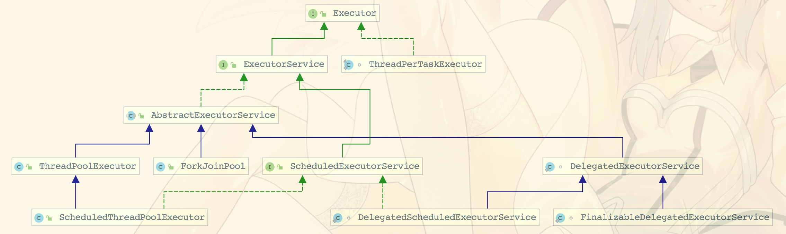

2、比较重要的几个类：

| 分类 | 作用 | 
| :-- | :-- |
| ExecutorService	 | 会根据所需的并发数来动态创建和关闭线程 |
| ScheduledExecutorService	 | 能和Timer/TimerTask类似，解决那些需要任务重复执行的问题 |
| ThreadPoolExecutor	| 继承AbstractExecutorService，线程池的核心实现 |
| ScheduledThreadPoolExecutor	 | 继承ThreadPoolExecutor的ScheduledExecutorService接口实现，周期性任务调度的类实现 |

3、ThreadPoolExecutor源码分析

1 属性字段

```
/**
* ctl是对线程池的运行状态和线程池中有效线程的数量进行控制的一个字段， 它包含两部分的信息: 线程
* 池的运行状态 (runState) 和线程池内有效线程的数量 (workerCount)，这里可以看到，使用
* 了Integer类型来保存，高3位保存runState，低29位保存workerCount。COUNT_BITS 就是
* 29，CAPACITY就是1左移29位减1（29个1），这个常量表示workerCount的上限值，大约是5亿
*/
private final AtomicInteger ctl = new AtomicInteger(ctlOf(RUNNING, 0));
// 高3位表示线程状态
private static final int COUNT_BITS = Integer.SIZE - 3;
// 底29位表示workerCount容量
private static final int CAPACITY   = (1 << COUNT_BITS) - 1;

// 能接收任务且能处理阻塞队列中的任务
private static final int RUNNING    = -1 << COUNT_BITS;
// 不能接收任务，但可以处理队列中的任务
private static final int SHUTDOWN   =  0 << COUNT_BITS;
// 不接收任务，不处理队列任务
private static final int STOP       =  1 << COUNT_BITS;
// 所有任务都终止
private static final int TIDYING    =  2 << COUNT_BITS;
// 什么都不做
private static final int TERMINATED =  3 << COUNT_BITS;
// 获取运行状态
private static int runStateOf(int c)     { return c & ~CAPACITY; }
// 获取活动线程数
private static int workerCountOf(int c)  { return c & CAPACITY; }
// 获取运行状态和活动线程数的值
private static int ctlOf(int rs, int wc) { return rs | wc; }

// 任务队列，我们的任务会添加到该队列里面，线程将从该队列获取任务来执行
private final BlockingQueue<Runnable> workQueue;
//任务的执行值集合，来消费workQueue里面的任务
private final HashSet<Worker> workers = new HashSet<Worker>(); 
//线程工厂  
private volatile ThreadFactory threadFactory;
//拒绝策略，默认会抛出异异常，还要其他几种拒绝策略如下：
private volatile RejectedExecutionHandler handler;

1、CallerRunsPolicy：在调用者线程里面运行该任务
2、DiscardPolicy：丢弃任务
3、DiscardOldestPolicy：丢弃workQueue的头部任务

//最下保活work数量  
private volatile int corePoolSize;
//work上限 
private volatile int maximumPoolSize;
```

值的注意的是状态值越大线程越不活跃。

线程池状态的转换模型：

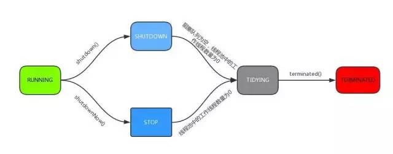

2 构造方法

```
public ThreadPoolExecutor(int corePoolSize,
                          int maximumPoolSize,
                          long keepAliveTime,
                          TimeUnit unit,
                          BlockingQueue<Runnable> workQueue,
                          ThreadFactory threadFactory,
                          RejectedExecutionHandler handler) {
    if (corePoolSize < 0 ||
        maximumPoolSize <= 0 ||
        maximumPoolSize < corePoolSize ||
        keepAliveTime < 0)
        throw new IllegalArgumentException();
    if (workQueue == null || threadFactory == null || handler == null)
        throw new NullPointerException();
    this.corePoolSize = corePoolSize;
    this.maximumPoolSize = maximumPoolSize;
    this.workQueue = workQueue;
    this.keepAliveTime = unit.toNanos(keepAliveTime);
    this.threadFactory = threadFactory;
    this.handler = handler;
}
```

1. corePoolSize
核心线程的数量。当提交一个任务到线程池时，线程池会创建一个核心线程来执行任务，即使其他空闲的核心线程能够执行新任务也会创建新的核心线程，而等到需要执行的任务数大于线程池核心线程的数量时就不再创建，这里也可以理解为当核心线程的数量等于线程池允许的核心线程最大数量的时候，如果有新任务来，就不会创建新的核心线程。
如果你想要提前创建并启动所有的核心线程，可以调用线程池的prestartAllCoreThreads()方法。

2. maximumPoolSize
线程池允许创建的最大线程数。如果队列满了，并且已创建的线程数小于最大线程数，则线程池会再创建新的线程执行任务。所以只有队列满了的时候，这个参数才有意义。因此当你使用了无界任务队列的时候，这个参数就没有效果了。

3. keepAliveTime
线程活动保持时间，即当线程池的工作线程空闲后，保持存活的时间。所以，如果任务很多，并且每个任务执行的时间比较短，可以调大时间，提高线程的利用率，不然线程刚执行完一个任务，还没来得及处理下一个任务，线程就被终止，而需要线程的时候又再次创建，刚创建完不久执行任务后，没多少时间又终止，会导致资源浪费。
注意：这里指的是核心线程池以外的线程。还可以设置allowCoreThreadTimeout = true这样就会让核心线程池中的线程有了存活的时间。

4. TimeUnit
线程活动保持时间的单位：可选的单位有天（DAYS）、小时（HOURS）、分钟（MINUTES）、毫秒（MILLISECONDS）、微秒（MICROSECONDS，千分之一毫秒）和纳秒（NANOSECONDS，千分之一微秒）。

5. workQueue
任务队列：维护着等待执行的Runnable对象。当所有的核心线程都在干活时，新添加的任务会被添加到这个队列中等待处理，如果队列满了，则新建非核心线程执行任务。

一般来说，workQueue有以下四种队列类型：

* SynchronousQueue：（同步队列）这个队列接收到任务的时候，会直接提交给线程处理，而不保留它（名字定义为 同步队列）。但有一种情况，假设所有线程都在工作怎么办？这种情况下，SynchronousQueue就会新建一个线程来处理这个任务。所以为了保证不出现（线程数达到了maximumPoolSize而不能新建线程）的错误，使用这个类型队列的时候，maximumPoolSize一般指定成Integer.MAX_VALUE，即无限大，去规避这个使用风险。
* LinkedBlockingQueue（链表阻塞队列）：这个队列接收到任务的时候，如果当前线程数小于核心线程数，则新建线程(核心线程)处理任务；如果当前线程数等于核心线程数，则进入队列等待。由于这个队列没有最大值限制，即所有超过核心线程数的任务都将被添加到队列中，这也就导致了maximumPoolSize的设定失效，因为总线程数永远不会超过corePoolSize
* ArrayBlockingQueue（数组阻塞队列）：可以限定队列的长度（既然是数组，那么就限定了大小），接收到任务的时候，如果没有达到corePoolSize的值，则新建线程(核心线程)执行任务，如果达到了，则入队等候，如果队列已满，则新建线程(非核心线程)执行任务，又如果总线程数到了maximumPoolSize，并且队列也满了，则发生错误
* DelayQueue（延迟队列）：队列内元素必须实现Delayed接口，这就意味着你传进去的任务必须先实现Delayed接口。这个队列接收到任务时，首先先入队，只有达到了指定的延时时间，才会执行任务

6. threadFactory
创建线程的工厂：可以通过线程工厂给每个创建出来的线程设置更加有意义的名字。

7. RejectedExecutionHandler
拒绝执行程序，可以理解为饱和策略：当队列和线程池都满了，说明线程池处于饱和状态，那么必须采取一种策略处理提交的新任务。这个策略默认情况下是AbortPolicy，表示无法处理新任务时抛出异常。在JDK1.5中 

* Java线程池框架提供了以下4种策略。
  * AbortPolicy：直接抛出异常RejectedExecutionException。
  * CallerRunsPolicy：只用调用者所在线程来运行任务，即由调用 execute方法的线程执行该任务。
  * DiscardOldestPolicy：丢弃队列里最近的一个任务，并执行当前任务。
  * DiscardPolicy：不处理，丢弃掉，即丢弃且不抛出异常。

3 execute方法

```
public void execute(Runnable command) {
    if (command == null)
        throw new NullPointerException();
    // ctl记录着runStore和workerCount    
    int c = ctl.get();
    // workerCountOf方法取出低29位的值，表示当前活动的线程数
    // 拿出线程数和核心线程作比较
    if (workerCountOf(c) < corePoolSize) {
        // 如果活动线程数<核心线程数，添加到
        // addWorker第二个参数表示限制添加线程的数量是根据corePoolSize来判断还是maxnumPoolSize
        if (addWorker(command, true))
            // 如果成功返回
            return;
        // 如果失败重新获取runState和workerCount    
        c = ctl.get();
    }
    // 如果当前线程池是运行状态，且任务成功添加到了队列
    if (isRunning(c) && workQueue.offer(command)) {
        // 重新获取runState和workerCount 
        int recheck = ctl.get();
        // 如果不是运行状态，且任务从队列中删除
        if (! isRunning(recheck) && remove(command))
            reject(command);
        else if (workerCountOf(recheck) == 0)
            // 第一个为null，表示线程池中创建一个线程但不启动
            // 第二个参数为false，将线程池中有限线程数量的上限设置为maxnumPoolSize 
            addWorker(null, false);
    }
    // 
    // 第二个参数为false，将线程池中有限线程数量的上限设置为maxnumPoolSize 
    else if (!addWorker(command, false))
        // 如果失败则拒绝该任务
        reject(command);
}
```

总结：

1. 当workerCount < corePoolSize，创建线程执行任务。
2. 当workerCount >= corePoolSize&&阻塞队列workQueue未满，把新的任务放入阻塞队列。
3. 当workQueue已满，并且workerCount >= corePoolSize，并且workerCount < maximumPoolSize，创建线程执行任务。
4. 当workQueue已满，workerCount >= maximumPoolSize，采取拒绝策略,默认拒绝策略是直接抛异常。

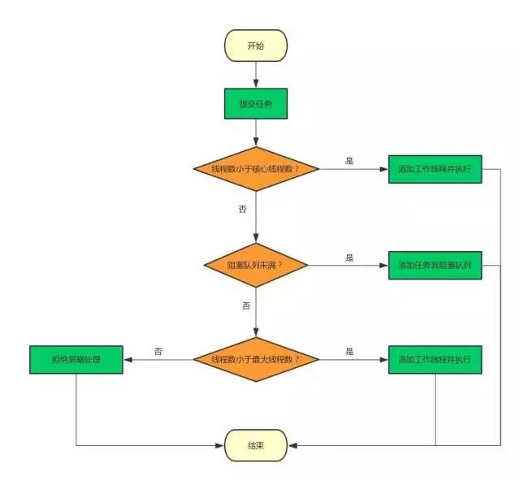

通过上面的execute方法可以看到，最主要的逻辑还是在addWorker方法中实现的，那我们就看下这个方法：

4 addWorker方法

> 主要工作是在线程池中创建一个新的线程并执行

参数定义：

firstTask: the task the new thread should run first (or null if none). (指定新增线程执行的第一个任务或者不执行任务)

core: if true use corePoolSize as bound, else maximumPoolSize.(core如果为true则使用corePoolSize绑定，否则为maximumPoolSize。 （此处使用布尔指示符而不是值，以确保在检查其他状态后读取新值）。)

```
private boolean addWorker(Runnable firstTask, boolean core) {
    retry:
    for (;;) {
        int c = ctl.get();
        // 获取运行状态
        int rs = runStateOf(c);

        // 如果状态值 >= SHUTDOWN(不接新任务&不处理任务队列)
        // 并且如果!(状态值 == SHUTDOWN&& firstTask为空&&阻塞队列不为空)
        if (rs >= SHUTDOWN &&
            ! (rs == SHUTDOWN &&
               firstTask == null &&
               ! workQueue.isEmpty()))
            // 返回false   
            return false;

        for (;;) {
            // 获取线程数
            int wc = workerCountOf(c);
            // 如果 wc >= 容量 || core为true表示根据corePoolSize来比较，否则为maximumPoolSize
            if (wc >= CAPACITY ||
                wc >= (core ? corePoolSize : maximumPoolSize))
                return false;
            // 增加workerCount（原子操作）    
            if (compareAndIncrementWorkerCount(c))
                // 如果增加成功，则跳出
                break retry;
            // wc 增加失败，则再次获取runState        
            c = ctl.get();  // Re-read ctl
            // 如果当前的运行状态不等于rs，说明状态已经改变，返回重新执行
            if (runStateOf(c) != rs)
                continue retry;
            // else CAS failed due to workerCount change; retry inner loop
        }
    }

    boolean workerStarted = false;
    boolean workerAdded = false;
    Worker w = null;
    try {
        // 根据firstTask来创建worker对象
        w = new Worker(firstTask);
        // 根据Worker创建一个线程
        final Thread t = w.thread;
        if (t != null) {
            // new 一个锁
            final ReentrantLock mainLock = this.mainLock;
            // 加锁
            mainLock.lock();
            try {
                // Recheck while holding lock.
                // Back out on ThreadFactory failure or if
                // shut down before lock acquired.
                // 获取runState
                int rs = runStateOf(ctl.get());
                // 如果rs < SHUTDOWN（处于运行），或者
                // (rs == SHUTDOWN && firstTask == null))
                if (rs < SHUTDOWN ||
                    (rs == SHUTDOWN && firstTask == null)) {
                    // 如果t活着就抛异常
                    if (t.isAlive()) 
                        throw new IllegalThreadStateException();
                    // 否则加入Worker（HashSet） 
                    // workers包含池中的所有工作线程，仅在mainLock时访问   
                    workers.add(w);
                    // 获取工作线程数量
                    int s = workers.size();
                    // largestPoolSize记录着线程池中出现过的最大线程数量
                    // 如果s比largestPoolSize大，则将s赋值给largestPoolSize
                    if (s > largestPoolSize)
                        largestPoolSize = s;
                    // worker的添加工作状态设置为true    
                    workerAdded = true;
                }
            } finally {
                mainLock.unlock();
            }
            // 如果worker的添加工作完成
            if (workerAdded) {
                // 启动线程
                t.start();
                // 修改线程启动状态
                workerStarted = true;
            }
        }
    } finally {
        if (! workerStarted)
            addWorkerFailed(w);
    }
    // 返回线程启动状态
    return workerStarted;
}
```

为什么需要持有mainLock？

因为workers是HashSet类型的，不能保证线程安全。

那w = new Worker(firstTask);如何理解呢

```
private final class Workerextends AbstractQueuedSynchronizer implements Runnable{}
```

线程池中的每一个线程被封装成一个Worker对象，ThreadPool维护的其实就是一组Worker对象。Worker类继承了AQS，并实现了Runnable接口，注意其中的firstTask和thread属性：firstTask用它来保存传入的任务；thread是在调用构造方法时通过ThreadFactory来创建的线程，是用来处理任务的线程。

在调用构造方法时，需要把任务传入，这里通过getThreadFactory().newThread(this);来新建一个线程，newThread方法传入的参数是this，因为Worker本身继承了Runnable接口，也就是一个线程，所以一个Worker对象在启动的时候会调用Worker类中的run方法。

Worker继承了AQS，使用AQS来实现独占锁的功能。为什么不使用ReentrantLock来实现呢？可以看到tryAcquire方法，它是不允许重入的，而ReentrantLock是允许重入的：

1. lock方法一旦获取了独占锁，表示当前线程正在执行任务中；
2. 如果正在执行任务，则不应该中断线程；
3. 如果该线程现在不是独占锁的状态，也就是空闲的状态，说明它没有在处理任务，这时可以对该线程进行中断；
4. 线程池在执行shutdown方法或tryTerminate方法时会调用interruptIdleWorkers方法来中断空闲的线程，interruptIdleWorkers方法会使用tryLock方法来判断线程池中的线程是否是空闲状态；
5. 之所以设置为不可重入，是因为我们不希望任务在调用像setCorePoolSize这样的线程池控制方法时重新获取锁。如果使用ReentrantLock，它是可重入的，这样如果在任务中调用了如setCorePoolSize这类线程池控制的方法，会中断正在运行的线程。
所以，Worker继承自AQS，用于判断线程是否空闲以及是否可以被中断

此外，在构造方法中执行了setState(-1);，把state变量设置为-1，为什么这么做呢？是因为AQS中默认的state是0，如果刚创建了一个Worker对象，还没有执行任务时，这时就不应该被中断，看一下tryAquire方法：

```
protected boolean tryAcquire(int unused) {
    if (compareAndSetState(0, 1)) {
        setExclusiveOwnerThread(Thread.currentThread());
        return true;
    }
    return false;
}
```

tryAcquire方法是根据state是否是0来判断的，所以，setState(-1);将state设置为-1是为了禁止在执行任务前对线程进行中断。

正因为如此，在runWorker方法中会先调用Worker对象的unlock方法将state设置为0.

```
public void run() {
    runWorker(this);
}
```

run方法又调用了runWorker方法：

```
final void runWorker(Worker w) {
    // 获取当前线程
    Thread wt = Thread.currentThread();
    // 获取当前任务
    Runnable task = w.firstTask;
    // 将Worker.firstTask置空
    w.firstTask = null;
    // 释放锁
    w.unlock(); // allow interrupts
    boolean completedAbruptly = true;
    try {
        // 如果task或者getTask()不为空
        while (task != null || (task = getTask()) != null) {
            w.lock();
            // If pool is stopping, ensure thread is interrupted;
            // if not, ensure thread is not interrupted.  This
            // requires a recheck in second case to deal with
            // shutdownNow race while clearing interrupt
            // 如果线程池状态 >= stop 或者（线程状态中断且线程池状态 >= stop）且当前线程
            // 没有中断，其实就是保证两点：
            // 1 如果线程池正在停止，那么要保证当前线程是中断状态；
            // 2 如果不是的话，则要保证当前线程不是中断状态
            if ((runStateAtLeast(ctl.get(), STOP) ||
                 (Thread.interrupted() &&
                  runStateAtLeast(ctl.get(), STOP))) &&
                !wt.isInterrupted())
                // 中断当前线程
                wt.interrupt();
            try {
                // 空方法
                beforeExecute(wt, task);
                Throwable thrown = null;
                try {
                    // 执行run方法（runnable对象）
                    task.run();
                } catch (RuntimeException x) {
                    thrown = x; throw x;
                } catch (Error x) {
                    thrown = x; throw x;
                } catch (Throwable x) {
                    thrown = x; throw new Error(x);
                } finally {
                    afterExecute(task, thrown);
                }
            } finally {
                // 执行完后，将task置空，完成任务++，释放锁
                task = null;
                w.completedTasks++;
                w.unlock();
            }
        }
        completedAbruptly = false;
    } finally {
        // 退出工作
        processWorkerExit(w, completedAbruptly);
    }
}
```

总结一下runWorker方法的执行过程：

1. while循环中，不断地通过getTask()方法从workerQueue中获取任务
2. 如果线程池正在停止，则中断线程。否则调用3.
3. 调用task.run()执行任务；
4. 如果task为null则跳出循环，执行processWorkerExit()方法，销毁线程workers.remove(w);

这个流程图非常经典：

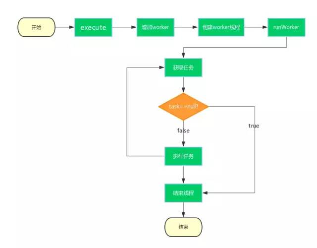

Worker为什么不使用ReentrantLock来实现呢？

tryAcquire方法它是不允许重入的，而ReentrantLock是允许重入的。对于线程来说，如果线程正在执行是不允许其它锁重入进来的。

线程只需要两个状态，一个是独占锁，表明正在执行任务；一个是不加锁，表明是空闲状态。

在runWorker方法中，为什么要在执行任务的时候对每个工作线程都加锁呢？

shutdown方法与getTask方法存在竞态条件.(这里不做深入，建议自己深入研究，对它比较熟悉的面试官一般会问)

4 shutdown方法

```
public void shutdown() {
    final ReentrantLock mainLock = this.mainLock;
    mainLock.lock();
    try {
        // 安全策略判断
        checkShutdownAccess();
        / 切换状态为SHUTDOWN
        advanceRunState(SHUTDOWN);
        // 中断空闲线程
        interruptIdleWorkers();
        onShutdown(); // hook for ScheduledThreadPoolExecutor
    } finally {
        mainLock.unlock();
    }
    // 尝试结束线程池
    tryTerminate();
}
```

这里思考一个问题：在runWorker方法中，执行任务时对Worker对象w进行了lock操作，为什么要在执行任务的时候对每个工作线程都加锁呢？

下面仔细分析一下：

* 在getTask方法中，如果这时线程池的状态是SHUTDOWN并且workQueue为空，那么就应该返回null来结束这个工作线程，而使线程池进入SHUTDOWN状态需要调用shutdown方法；
* shutdown方法会调用interruptIdleWorkers来中断空闲的线程，interruptIdleWorkers持有mainLock，会遍历workers来逐个判断工作线程是否空闲。但getTask方法中没有mainLock；
在getTask中，如果判断当前线程池状态是RUNNING，并且阻塞队列为空，那么会调用workQueue.take()进行阻塞；
* 如果在判断当前线程池状态是RUNNING后，这时调用了shutdown方法把状态改为了SHUTDOWN，这时如果不进行中断，那么当前的工作线程在调用了workQueue.take()后会一直阻塞而不会被销毁，因为在SHUTDOWN状态下不允许再有新的任务添加到workQueue中，这样一来线程池永远都关闭不了了；
* 由上可知，shutdown方法与getTask方法（从队列中获取任务时）存在竞态条件；
* 解决这一问题就需要用到线程的中断，也就是为什么要用interruptIdleWorkers方法。在调用workQueue.take()时，如果发现当前线程在执行之前或者执行期间是中断状态，则会抛出InterruptedException，解除阻塞的状态；
* 但是要中断工作线程，还要判断工作线程是否是空闲的，如果工作线程正在处理任务，就不应该发生中断；
* 所以Worker继承自AQS，在工作线程处理任务时会进行lock，interruptIdleWorkers在进行中断时会使用tryLock来判断该工作线程是否正在处理任务，如果tryLock返回true，说明该工作线程当前未执行任务，这时才可以被中断。	

5 Android OkHttp内置线程池源码分析

* 常用写法

```
public void test() {
    OkHttpClient httpClient = new OkHttpClient();
    Request request = new Request.Builder().url("").build();
    httpClient.newCall(request).enqueue(new Callback() {
        @Override
        public void onFailure(Call call, IOException e) {
            
        }

        @Override
        public void onResponse(Call call, Response response) throws IOException {

        }
    });
}
```

配置好请求体，url之后，我们会使用 OkHttpClient这个对象首先去调用 newCall,进入newCall

```
@Override 
public Call newCall(Request request) {
   return RealCall.newRealCall(this, request, false /* for web socket */);
}
```

这个方法返回了一个RealCall，翻译过来就是 （真正的请求），点进去看下RealCall

```
static RealCall newRealCall(OkHttpClient client, Request originalRequest, boolean forWebSocket) {
    // Safely publish the Call instance to the EventListener.
    RealCall call = new RealCall(client, originalRequest, forWebSocket);
    call.eventListener = client.eventListenerFactory().create(call);
    return call;
  }
```

所以，本质上来讲 OkHttpClient.newCall(request).enqueue()， 其实就是调用 RealCall 类里面的 enqueue 方法。

```
@Override 
public void enqueue(Callback responseCallback) {
    synchronized (this) {
      if (executed) throw new IllegalStateException("Already Executed");
      executed = true;
    }
    captureCallStackTrace();
    eventListener.callStart(this);
    client.dispatcher().enqueue(new AsyncCall(responseCallback));
}
```

这个方法最终调用的是 client.dispatcher().enqueue，这个方法内部引用了AsyncCall这个对象，那这AsyncCall又是什么？

```
final class AsyncCall extends NamedRunnable {
```

点击AsyncCall后发现，原来，AsyncCall 是 RealCall 的一个内部类,NamedRunnable 这个类又是什么？点进 NamedRunnable后发现，这个类的本质其实就是一个 Runnable

```
public abstract class NamedRunnable implements Runnable {
  protected final String name;

  public NamedRunnable(String format, Object... args) {
    this.name = Util.format(format, args);
  }

  @Override public final void run() {
    String oldName = Thread.currentThread().getName();
    Thread.currentThread().setName(name);
    try {
      execute();
    } finally {
      Thread.currentThread().setName(oldName);
    }
  }

  protected abstract void execute();
}	
```

我们再回到client.dispatcher().enqueue这个方法，点击 enqueue ，进入到了Dispatcher 这个类里面的enqueue方法（Dispatcher 翻译过来就是：调度员、分配器）

```
void enqueue(AsyncCall call) {
	synchronized (this) {
	  readyAsyncCalls.add(call);
	}
	promoteAndExecute();
}
```

```
private boolean promoteAndExecute() {
assert (!Thread.holdsLock(this));

List<AsyncCall> executableCalls = new ArrayList<>();
boolean isRunning;
synchronized (this) {
  for (Iterator<AsyncCall> i = readyAsyncCalls.iterator(); i.hasNext(); ) {
    AsyncCall asyncCall = i.next();

    if (runningAsyncCalls.size() >= maxRequests) break; // Max capacity.
    if (runningCallsForHost(asyncCall) >= maxRequestsPerHost) continue; // Host max capacity.

    i.remove();
    executableCalls.add(asyncCall);
    runningAsyncCalls.add(asyncCall);
  }
  isRunning = runningCallsCount() > 0;
}

for (int i = 0, size = executableCalls.size(); i < size; i++) {
  AsyncCall asyncCall = executableCalls.get(i);
  asyncCall.executeOn(executorService());
}

return isRunning;
}
```

这个方法的主要功能是:

1. 遍历 readyAsyncCalls，把任务取出来；
2. 把取出来的任务加入 到runningAsyncCalls；
3. 把任务放入线程池。

即：把任务添加到线程池是在Dispatcher这里进行的。(这个类内部不仅创建了线程池，也将任务添加了进来)

总体来说，当请求任务数大于 maxRequests 并且相同 host 最大请求数大于 maxRequestsPerHost，就会把请求任务放在 readyAsyncCalls 队列里；当线程池里执行任务的 runnable 执行完任务在最后会检查 readyAsyncCalls 里有没有任务，如果有任务并且是同一个 host 就放入到线程池中执行。因此通过这个方法不断地从 readyAsyncCalls 队列里取出任务，对线程池里的线程进行复用。

```
public synchronized ExecutorService executorService() {
if (executorService == null) {
  executorService = new ThreadPoolExecutor(0, Integer.MAX_VALUE, 60, TimeUnit.SECONDS,
      new SynchronousQueue<Runnable>(), Util.threadFactory("OkHttp Dispatcher", false));
}
return executorService;
}
```

Okhttp在这里帮我们创建了一个线程池。那么这个线程池是怎么处理的？通过源码得知，构造参数里面有一个SynchronousQueue （同步），这个在上面的构造参数里面也分析过，这个队列接收到任务的时候，会直接提交给线程处理，而且也提到使用这个队列的话，maximumPoolSize一般指定成Integer.MAX_VALUE，即无限大去规避使用风险，在这里，OkHttp的源码也使用到了无限大。

我们知道，okhttp发起请求的步骤真正的执行是在RealCall这个类里面，里面的enqueue方法调用了

```
client.dispatcher().enqueue(new AsyncCall(responseCallback)) ;
```

看回去 Dispatcher这个类里面的enqueue方法：

会调用```readyAsyncCalls.add(call);```

```
// 正在准备中的异步请求队列
private final Deque<AsyncCall> readyAsyncCalls = new ArrayDeque<>();
//运行中的异步请求
private final Deque<AsyncCall> runningAsyncCalls = new ArrayDeque<>();
// 同步请求
private final Deque<RealCall> runningSyncCalls = new ArrayDeque<>();
```	

什么时候去取这里的任务来执行呢？

为了解决这个问题，我们需要在回到AsyncCall这个类一探究竟，

```
@Override protected void execute() {
  boolean signalledCallback = false;
  timeout.enter();
  try {
    Response response = getResponseWithInterceptorChain();
    if (retryAndFollowUpInterceptor.isCanceled()) {
      signalledCallback = true;
      responseCallback.onFailure(RealCall.this, new IOException("Canceled"));
    } else {
      signalledCallback = true;
      responseCallback.onResponse(RealCall.this, response);
    }
  } catch (IOException e) {
    e = timeoutExit(e);
    if (signalledCallback) {
      // Do not signal the callback twice!
      Platform.get().log(INFO, "Callback failure for " + toLoggableString(), e);
    } else {
      eventListener.callFailed(RealCall.this, e);
      responseCallback.onFailure(RealCall.this, e);
    }
  } finally {
    client.dispatcher().finished(this);
  }
}
```

esponseCallback.onFailure （）实际上就是失败的回调

responseCallback.onResponse （）实际上就是成功的回调，将蓝色矩形的Response对象回调出去。

getResponseWithInterceptorChain（）这个方法具体是做什么的？继续点进源码看看

```
Response getResponseWithInterceptorChain() throws IOException {
    // Build a full stack of interceptors.
    List<Interceptor> interceptors = new ArrayList<>();
    interceptors.addAll(client.interceptors());
    interceptors.add(retryAndFollowUpInterceptor);
    interceptors.add(new BridgeInterceptor(client.cookieJar()));
    interceptors.add(new CacheInterceptor(client.internalCache()));
    interceptors.add(new ConnectInterceptor(client));
    if (!forWebSocket) {
      interceptors.addAll(client.networkInterceptors());
    }
    interceptors.add(new CallServerInterceptor(forWebSocket));

    Interceptor.Chain chain = new RealInterceptorChain(interceptors, null, null, null, 0,
        originalRequest, this, eventListener, client.connectTimeoutMillis(),
        client.readTimeoutMillis(), client.writeTimeoutMillis());

    return chain.proceed(originalRequest);
  }
```

这个方法就是遍历外部定义的拦截器 然后添加OkHttp内部的拦截器去发起真正的请求。拦截器的本质就是拦截请求体，拦截响应体，在拦截的过程中添加信息和修改信息，比如添加请求头等等。

可以看到，这个方法最终返回了一个Response对象。

通过接口回调将Response结果，告知调用者，response的body，就是我们请求成功之后获取的响应体。

execute中的```client.dispatcher().finished(this);```最终调用的是

```
private <T> void finished(Deque<T> calls, T call) {
    Runnable idleCallback;
    synchronized (this) {
      if (!calls.remove(call)) throw new AssertionError("Call wasn't in-flight!");
      idleCallback = this.idleCallback;
    }

    boolean isRunning = promoteAndExecute();

    if (!isRunning && idleCallback != null) {
      idleCallback.run();
    }
  }
```