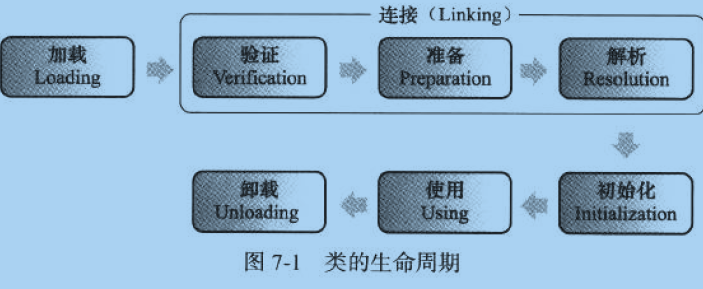

<center>Java高级知识</center>
=

##哪些情况下的对象会被垃圾回收机制处理掉？

##讲一下常见编码方式？
####编码
编码是从一种形式或格式转换为另一种形式的过程也称为计算机编程语言的代码简称编码。
####常见编码方式

1. ASCII 码 

共有 128 个，用一个字节的低 7 位表示，0~31 是控制字符如换行回车删除等；32~126 是打印字符，可以通过键盘输入并且能够显示出来。 

2. ISO-8859-1 

128 个字符显然是不够用的，于是 ISO 组织在 ASCII 码基础上又制定了一些列标准用来扩展 ASCII 编码，它们是 ISO-8859-1~ISO-8859-15，其中 ISO-8859-1 涵盖了大多数西欧语言字符，所有应用的最广泛。ISO-8859-1 仍然是单字节编码，它总共能表示 256 个字符。 

3. GB2312 
它的全称是《信息交换用汉字编码字符集 基本集》，它是双字节编码，总的编码范围是 A1-F7，其中从 A1-A9 是符号区，总共包含 682 个符号，从 B0-F7 是汉字区，包含 6763 个汉字。

4. GBK 

全称叫《汉字内码扩展规范》，是国家技术监督局为 windows95 所制定的新的汉字内码规范，它的出现是为了扩展 GB2312，加入更多的汉字，它的编码范围是 8140~FEFE（去掉 XX7F）总共有 23940 个码位，它能表示 21003 个汉字，它的编码是和 GB2312 兼容的，也就是说用 GB2312 编码的汉字可以用 GBK 来解码，并且不会有乱码。

5. GB18030 

全称是《信息交换用汉字编码字符集》，是我国的强制标准，它可能是单字节、双字节或者四字节编码，它的编码与 GB2312 编码兼容，这个虽然是国家标准，但是实际应用系统中使用的并不广泛。 

6. UTF-16 

说到 UTF 必须要提到 Unicode（Universal Code 统一码），ISO 试图想创建一个全新的超语言字典，世界上所有的语言都可以通过这本字典来相互翻译。可想而知这个字典是多么的复杂，关于 Unicode 的详细规范可以参考相应文档。Unicode 是 Java 和 XML 的基础，下面详细介绍 Unicode 在计算机中的存储形式。   
UTF-16 具体定义了 Unicode 字符在计算机中存取方法。UTF-16 用两个字节来表示 Unicode 转化格式，这个是定长的表示方法，不论什么字符都可以用两个字节表示，两个字节是 16 个 bit，所以叫 UTF-16。UTF-16 表示字符非常方便，每两个字节表示一个字符，这个在字符串操作时就大大简化了操作，这也是 Java 以 UTF-16 作为内存的字符存储格式的一个很重要的原因。 

7. UTF-8 

UTF-16 统一采用两个字节表示一个字符，虽然在表示上非常简单方便，但是也有其缺点，有很大一部分字符用一个字节就可以表示的现在要两个字节表示，存储空间放大了一倍，在现在的网络带宽还非常有限的今天，这样会增大网络传输的流量，而且也没必要。而 UTF-8 采用了一种变长技术，每个编码区域有不同的字码长度。不同类型的字符可以是由 1~6 个字节组成。
UTF-8 有以下编码规则：   

* 如果一个字节，最高位（第 8 位）为 0，表示这是一个 ASCII 字符（00 - 7F）。可见，所有 ASCII 编码已经是 UTF-8 了。   
* 对于n字节的符号（n>1），第一个字节的前n位都设为1，第n+1位设为0，后面字节的前两位一律设为10。剩下的没有提及的二进制位，全部为这个符号的unicode码。
 
下表总结了编码规则，字母x表示可用编码的位。 
 
```java
Unicode符号范围 | UTF-8编码方式
(十六进制) | （二进制）
--------------------+---------------------------------------------
0000 0000-0000 007F | 0xxxxxxx
0000 0080-0000 07FF | 110xxxxx 10xxxxxx
0000 0800-0000 FFFF | 1110xxxx 10xxxxxx 10xxxxxx
0001 0000-0010 FFFF | 11110xxx 10xxxxxx 10xxxxxx 10xxxxxx
```

跟据上表，解读UTF-8编码非常简单。如果一个字节的第一位是0，则这个字节单独就是一个字符；如果第一位是1，则连续有多少个1，就表示当前字符占用多少个字节。

下面，还是以汉字"严"为例，演示如何实现UTF-8编码。  
已知"严"的unicode是4E25（100111000100101），根据上表，可以发现4E25处在第三行的范围内（0000 0800-0000 FFFF），因此"严"的UTF-8编码需要三个字节，即格式是"1110xxxx 10xxxxxx 10xxxxxx"。然后，从"严"的最后一个二进制位开始，依次从后向前填入格式中的x，多出的位补0。这样就得到了，"严"的UTF-8编码是"11100100 10111000 10100101"，转换成十六进制就是E4B8A5。  
##utf-8编码中的中文占几个字节；int型几个字节？
* 占2个字节的：带有附加符号的拉丁文、希腊文、西里尔字母、亚美尼亚语、希伯来文、阿拉伯文、叙利亚文及它拿字母则需要二个字节编码  
* 占3个字节的：基本等同于GBK，含21000多个汉字  
* 占4个字节的：中日韩超大字符集里面的汉字，有5万多个  
* 一个utf8数字占1个字节  
* 一个utf8英文字母占1个字节  
* 少数是汉字每个占用3个字节，多数占用4个字节。  

## 静态代理和动态代理的区别，什么场景使用？
#### 代理模式

Java中的代理设计模式(Proxy),也叫做委托模式，提供了对目标对象另外的访问方式;即通过代理对象访问目标对象.这样做的好处是:可以在目标对象实现的基础上,增强额外的功能操作,即扩展目标对象的功能.  
代理设计模式在现实生活中无处不在，举个例子:  
朋友圈中卖面膜的同学,她们从厂家拿货，然后在朋友圈中宣传，然后卖给熟人。


按理说，顾客可以直接从厂家购买产品，但是现实生活中，很少有这样的销售模式。一般都是厂家委托给代理商进行销售，顾客跟代理商打交道，而不直接与产品实际生产者进行关联。所以，<font color = red>代理就有一种中间人的味道。</font>  
再举个例子，大家都买过房吧，一般情况下是由中介带着你去，而这个中介也是类似代理人的作用，你也要明白，真正的买房人是你，你负责出钱，中介只是负责传达你的要求而已，当然啦，一些额外的功能就是需要出点钱给中介，毕竟人家那么辛苦，坑点茶水费还是要的，大家都懂，后来想起了这个代理模式，也就理解了，哈哈,大家会发现，设计模式都是源于生活，在生活中处处都有设计模式的影子,我觉得<font color = red>学习设计模式一定要理解，理解，理解，重要的事情说三遍。</font>

代理模式是面向对象编程中比较常见的设计模式。


需要注意的有下面几点：

1. 用户只关心接口功能，而不在乎谁提供了功能。上图中接口是 Subject。
2. 接口真正实现者是上图的 RealSubject，但是它不与用户直接接触，而是通过代理。
3. 代理就是上图中的 Proxy，由于它实现了 Subject 接口，所以它能够直接与用户接触。
4. 用户调用 Proxy 的时候，Proxy 内部调用了 RealSubject。所以，Proxy 是中介者，它可以增强 RealSubject 操作。


#### 代理模式的分类
##### 静态代理

静态代理，指的是在编译的时候就已经存在了，需要定义接口或者父类,被代理对象与代理对象一起实现相同的接口或者是继承相同父类。
eg:  
我们平常去电影院看电影的时候，在电影开始的阶段是不是经常会放广告呢？电影是电影公司委托给影院进行播放的，但是影院可以在播放电影的时候，产生一些自己的经济收益，比如卖爆米花、可乐等，然后在影片开始结束时播放一些广告。  
现在用代码来进行模拟:  
首先得有一个接口，通用的接口是代理模式实现的基础。这个接口我们命名为 Movie，代表电影播放的能力。

```java
public interface Movie {
	void play(String name);
}
``` 
然后，我们要有一个真正的实现这个 Movie 接口的类，和一个只是实现接口的代理类。

```java
public class RealMovie implements Movie {

	@Override
	public void play(String name) {
		 System.out.println("您正在观看电影: " + name);
	}

}
```
这个表示真正的影片。它实现了 Movie 接口，play() 方法调用时，影片就开始播放。那么 Proxy 代理呢？

```java
public class Cinema implements Movie {
	
	RealMovie movie;
	
	public Cinema(RealMovie movie) {
		this.movie = movie;
	}


	@Override
	public void play(String name) {
		
		guanggao(true);
		
		movie.play(name);
		
		guanggao(false);
	}
	
	public void guanggao(boolean isStart){
		if ( isStart ) {
			System.out.println("电影马上开始了，爆米花、可乐、口香糖9.8折，快来买啊！");
		} else {
			System.out.println("电影马上结束了，爆米花、可乐、口香糖9.8折，买回家吃吧！");
		}
	}

}
```
通过测试：

```java
public static void main(String[] args) {
		
		RealMovie realmovie = new RealMovie();
		
		Cinema movie = new Cinema(realmovie);
		
		movie.play("《肖申克的救赎》");

	}
```
运行结果：

```java
电影马上开始了，爆米花、可乐、口香糖9.8折，快来买啊！
您正在观看电影： 《肖申克的救赎》
电影马上结束了，爆米花、可乐、口香糖9.8折，买回家吃吧！
```

##### 动态代理

顾名思义是动态的，Java中的动态一般指的是在运行时的状态，是相对编译时的静态来区分，就是在运行时生成一个代理对象帮我们干活。  
还是以买房为例子，如果静态代理是我们在还没有买房的时候(就是编译的时候)预先找好的中介，那么动态代理就是在买房过程中找的，注意:买房过程中说明是在买房这件事情的过程中，就是代码在运行的时候才找的一个中介。  
Java中的动态代理要求必须实现一个接口，InvocationHandler，动态代理也必须有一个真实的对象，不管是什么代理，只是帮忙传达指令，最终还是必须有原来的对象去干活的。  
eg:假设有一个大商场，商场有很多的柜台，有一个柜台卖茅台酒。我们进行代码的模拟。  

```java
public interface SellWine {	
	 void mainJiu();
}
```
SellWine 是一个接口，你可以理解它为卖酒的许可证。

```java
public class MaotaiJiu implements SellWine {
	@Override
	public void mainJiu() {
		System.out.println("我卖得是茅台酒。");
	}
}
```

然后创建一个类 MaotaiJiu,对的，就是茅台酒的意思。
我们还需要一个柜台代理类来卖酒：

```java
public class GuitaiA implements InvocationHandler {
	
	private Object pingpai;
	
	
	public GuitaiA(Object pingpai) {
		this.pingpai = pingpai;
	}


	@Override
	public Object invoke(Object proxy, Method method, Object[] args)
			throws Throwable {
		System.out.println("销售开始  柜台是： "+this.getClass().getSimpleName());
		method.invoke(pingpai, args);
		System.out.println("销售结束");
		return null;
	}

}
```

然后，我们就可以卖酒了。

```java
public class Test {

	public static void main(String[] args) {
		
		MaotaiJiu maotaijiu = new MaotaiJiu();
		
		InvocationHandler guiTai = new GuitaiA(maotaijiu);

		SellWine dynamicProxy = (SellWine) Proxy.newProxyInstance(MaotaiJiu.class.getClassLoader(),
				MaotaiJiu.class.getInterfaces(), guiTai);
	
		dynamicProxy.mainJiu();
			
	}

}
```
结果：

```java
销售开始 代理是： Shop
我卖得是茅台酒。
销售结束
```

#### 源码

```java
public static Object newProxyInstance(ClassLoader loader, 
                                          Class<?>[] interfaces, 
                                          InvocationHandler h) 
        throws IllegalArgumentException 
    { 
        Objects.requireNonNull(h); 

        final Class<?>[] intfs = interfaces.clone(); 
        final SecurityManager sm = System.getSecurityManager(); 
        if (sm != null) { 
            checkProxyAccess(Reflection.getCallerClass(), loader, intfs); 
        } 

        /* 
         * Look up or generate the designated proxy class. 
         */ 
        Class<?> cl = getProxyClass0(loader, intfs); 

        /* 
         * Invoke its constructor with the designated invocation handler. 
         */ 
        try { 


            final Constructor<?> cons = cl.getConstructor(constructorParams); 
            final InvocationHandler ih = h; 
            if (!Modifier.isPublic(cl.getModifiers())) { 
                AccessController.doPrivileged(new PrivilegedAction<Void>() { 
                    public Void run() { 
                        cons.setAccessible(true); 
                        return null; 
                    } 
                }); 
            } 
            return cons.newInstance(new Object[]{h}); 
        } 
        ...省略了一些非关键代码 
    }
```

可以看到，是通过反射构造函数来创建子类的，而构造函数里面的参数constructorParams正是接口类型

```java
/** parameter types of a proxy class constructor */
private static final Class<?>[] constructorParams = { InvocationHandler.class };
```

newProxyInstance 的确创建了一个实例，它是通过 cl 这个 Class 文件的构造方法反射生成。cl 由 getProxyClass0() 方法获取。

```java
private static Class<?> getProxyClass0(ClassLoader loader,
                                           Class<?>... interfaces) {
        if (interfaces.length > 65535) {
            throw new IllegalArgumentException("interface limit exceeded");
        }

        // If the proxy class defined by the given loader implementing
        // the given interfaces exists, this will simply return the cached copy;
        // otherwise, it will create the proxy class via the ProxyClassFactory
        return proxyClassCache.get(loader, interfaces);
    }
```
直接通过缓存获取，如果获取不到，注释说会通过 ProxyClassFactory 生成。

```java
private static final class ProxyClassFactory
        implements BiFunction<ClassLoader, Class<?>[], Class<?>>
    {
        // prefix for all proxy class names
        private static final String proxyClassNamePrefix = "$Proxy";

        // next number to use for generation of unique proxy class names
        private static final AtomicLong nextUniqueNumber = new AtomicLong();

        @Override
        public Class<?> apply(ClassLoader loader, Class<?>[] interfaces) {

            Map<Class<?>, Boolean> interfaceSet = new IdentityHashMap<>(interfaces.length);
            for (Class<?> intf : interfaces) {
                /*
                 * Verify that the class loader resolves the name of this
                 * interface to the same Class object.
                 */
                Class<?> interfaceClass = null;
                try {
                    interfaceClass = Class.forName(intf.getName(), false, loader);
                } catch (ClassNotFoundException e) {
                }
                if (interfaceClass != intf) {
                    throw new IllegalArgumentException(
                        intf + " is not visible from class loader");
                }
                /*
                 * Verify that the Class object actually represents an
                 * interface.
                 */
                if (!interfaceClass.isInterface()) {
                    throw new IllegalArgumentException(
                        interfaceClass.getName() + " is not an interface");
                }
                /*
                 * Verify that this interface is not a duplicate.
                 */
                if (interfaceSet.put(interfaceClass, Boolean.TRUE) != null) {
                    throw new IllegalArgumentException(
                        "repeated interface: " + interfaceClass.getName());
                }
            }

            String proxyPkg = null;     // package to define proxy class in
            int accessFlags = Modifier.PUBLIC | Modifier.FINAL;

            /*
             * Record the package of a non-public proxy interface so that the
             * proxy class will be defined in the same package.  Verify that
             * all non-public proxy interfaces are in the same package.
             */
            for (Class<?> intf : interfaces) {
                int flags = intf.getModifiers();
                if (!Modifier.isPublic(flags)) {
                    accessFlags = Modifier.FINAL;
                    String name = intf.getName();
                    int n = name.lastIndexOf('.');
                    String pkg = ((n == -1) ? "" : name.substring(0, n + 1));
                    if (proxyPkg == null) {
                        proxyPkg = pkg;
                    } else if (!pkg.equals(proxyPkg)) {
                        throw new IllegalArgumentException(
                            "non-public interfaces from different packages");
                    }
                }
            }

            if (proxyPkg == null) {
                // if no non-public proxy interfaces, use com.sun.proxy package
                proxyPkg = ReflectUtil.PROXY_PACKAGE + ".";
            }

            /*
             * Choose a name for the proxy class to generate.
             */
            long num = nextUniqueNumber.getAndIncrement();
            String proxyName = proxyPkg + proxyClassNamePrefix + num;

            /*
             * Generate the specified proxy class.
             */
            byte[] proxyClassFile = ProxyGenerator.generateProxyClass(
                proxyName, interfaces, accessFlags);
            try {
                return defineClass0(loader, proxyName,
                                    proxyClassFile, 0, proxyClassFile.length);
            } catch (ClassFormatError e) {
                /*
                 * A ClassFormatError here means that (barring bugs in the
                 * proxy class generation code) there was some other
                 * invalid aspect of the arguments supplied to the proxy
                 * class creation (such as virtual machine limitations
                 * exceeded).
                 */
                throw new IllegalArgumentException(e.toString());
            }
        }
    }
```

这个类的注释说，通过指定的 ClassLoader 和 接口数组 用工厂方法生成 proxy class。 然后这个 proxy class 的名字是：

```java
// Proxy class 的前缀是 “$Proxy”，
private static final String proxyClassNamePrefix = "$Proxy";

long num = nextUniqueNumber.getAndIncrement();

String proxyName = proxyPkg + proxyClassNamePrefix + num;

```

所以，动态生成的代理类名称是包名+$Proxy+id序号。

生成的过程，如何生成字节码的:

```java
public static byte[] generateProxyClass(final String var0, Class<?>[] var1, int var2) {
        ProxyGenerator var3 = new ProxyGenerator(var0, var1, var2);
        // 这里是关键 
        final byte[] var4 = var3.generateClassFile();
        if (saveGeneratedFiles) {
            AccessController.doPrivileged(new PrivilegedAction<Void>() {
                public Void run() {
                    try {
                        int var1 = var0.lastIndexOf(46);
                        Path var2;
                        if (var1 > 0) {
                            Path var3 = Paths.get(var0.substring(0, var1).replace('.', File.separatorChar));
                            Files.createDirectories(var3);
                            var2 = var3.resolve(var0.substring(var1 + 1, var0.length()) + ".class");
                        } else {
                            var2 = Paths.get(var0 + ".class");
                        }
							//这个是重点，写在本地磁盘上 
                        Files.write(var2, var4, new OpenOption[0]);
                        return null;
                    } catch (IOException var4x) {
                        throw new InternalError("I/O exception saving generated file: " + var4x);
                    }
                }
            });
        }
		// 返回代理类的字节码   
        return var4;
    }
```

```java
//generateClassFile方法比较多，都是一些字节码的编写 
private byte[] generateClassFile() {
    this.addProxyMethod(hashCodeMethod, Object.class);
    this.addProxyMethod(equalsMethod, Object.class);
    this.addProxyMethod(toStringMethod, Object.class);
    Class[] var1 = this.interfaces;
    int var2 = var1.length;

    int var3;
    Class var4;
    for(var3 = 0; var3 < var2; ++var3) {
      var4 = var1[var3];
      Method[] var5 = var4.getMethods();
      int var6 = var5.length;

      for(int var7 = 0; var7 < var6; ++var7) {
        Method var8 = var5[var7];
        this.addProxyMethod(var8, var4);
      }
    }

    Iterator var11 = this.proxyMethods.values().iterator();

    List var12;
    while(var11.hasNext()) {
      var12 = (List)var11.next();
      checkReturnTypes(var12);
    }

    Iterator var15;
    try {
      this.methods.add(this.generateConstructor());
      var11 = this.proxyMethods.values().iterator();

      while(var11.hasNext()) {
        var12 = (List)var11.next();
        var15 = var12.iterator();

        while(var15.hasNext()) {
          ProxyGenerator.ProxyMethod var16 = (ProxyGenerator.ProxyMethod)var15.next();
          this.fields.add(new ProxyGenerator.FieldInfo(var16.methodFieldName, "Ljava/lang/reflect/Method;", 10));
          this.methods.add(var16.generateMethod());
        }
      }

      this.methods.add(this.generateStaticInitializer());
    } catch (IOException var10) {
      throw new InternalError("unexpected I/O Exception", var10);
    }

    if (this.methods.size() > 65535) {
      throw new IllegalArgumentException("method limit exceeded");
    } else if (this.fields.size() > 65535) {
      throw new IllegalArgumentException("field limit exceeded");
    } else {
      this.cp.getClass(dotToSlash(this.className));
      this.cp.getClass("java/lang/reflect/Proxy");
      var1 = this.interfaces;
      var2 = var1.length;

      for(var3 = 0; var3 < var2; ++var3) {
        var4 = var1[var3];
        this.cp.getClass(dotToSlash(var4.getName()));
      }

      this.cp.setReadOnly();
      ByteArrayOutputStream var13 = new ByteArrayOutputStream();
      DataOutputStream var14 = new DataOutputStream(var13);

      try {
        var14.writeInt(-889275714);
        var14.writeShort(0);
        var14.writeShort(49);
        this.cp.write(var14);
        var14.writeShort(this.accessFlags);
        var14.writeShort(this.cp.getClass(dotToSlash(this.className)));
        var14.writeShort(this.cp.getClass("java/lang/reflect/Proxy"));
        var14.writeShort(this.interfaces.length);
        Class[] var17 = this.interfaces;
        int var18 = var17.length;

        for(int var19 = 0; var19 < var18; ++var19) {
          Class var22 = var17[var19];
          var14.writeShort(this.cp.getClass(dotToSlash(var22.getName())));
        }

        var14.writeShort(this.fields.size());
        var15 = this.fields.iterator();

        while(var15.hasNext()) {
          ProxyGenerator.FieldInfo var20 = (ProxyGenerator.FieldInfo)var15.next();
          var20.write(var14);
        }

        var14.writeShort(this.methods.size());
        var15 = this.methods.iterator();

        while(var15.hasNext()) {
          ProxyGenerator.MethodInfo var21 = (ProxyGenerator.MethodInfo)var15.next();
          var21.write(var14);
        }

        var14.writeShort(0);
        return var13.toByteArray();
      } catch (IOException var9) {
        throw new InternalError("unexpected I/O Exception", var9);
      }
    }
  }
```
很明显了，最终是写在本地磁盘上来

动态代理就一句话:<font color =red >系统帮我们生成了字节码文件保存在本地并生成一个InvocationHandler的代理子类，然后通过我们传进去的真实对象的引用，再帮忙调用各种接口方法，最终所有的方法都走

```java
public Object invoke(Object proxy, Method method, Object[] args) 
        throws Throwable
``` 
</font>

下面用一张图让大家记住动态代理涉及到的角色：


* 红框中 $Proxy0就是通过 Proxy 动态生成的。
* $Proxy0实现了要代理的接口。
* $Proxy0通过调用 InvocationHandler来执行任务。

#### 代理的作用

主要作用，还是<font color=red>在不修改被代理对象的源码上，进行功能的增强。</font>  
这在 AOP 面向切面编程领域经常见。
> 在软件业，AOP为Aspect Oriented Programming的缩写，意为：面向切面编程，通过预编译方式和运行期动态代理实现程序功能的统一维护的一种技术。AOP是OOP的延续，是软件开发中的一个热点，也是Spring框架中的一个重要内容，是函数式编程的一种衍生范型。利用AOP可以对业务逻辑的各个部分进行隔离，从而使得业务逻辑各部分之间的耦合度降低，提高程序的可重用性，同时提高了开发的效率。  
> 主要功能  
>日志记录，性能统计，安全控制，事务处理，异常处理等等。


<font color=red size =5>__*总结：*__</font>

1. 代理分为静态代理和动态代理两种。
2. 静态代理，代理类需要自己编写代码写成。
3. 动态代理，代理类通过 Proxy.newInstance() 方法生成。
4. 不管是静态代理还是动态代理，代理与被代理者都要实现两样接口，它们的实质是面向接口编程。
5. 静态代理和动态代理的区别是在于要不要开发者自己定义 Proxy 类。
6. 动态代理通过 Proxy 动态生成 proxy class，但是它也指定了一个 InvocationHandler 的实现类。
7. 代理模式本质上的目的是为了增强现有代码的功能。

##### 代理模式在Android中的应用

除了上面提到的静态代理和动态代理，还有一种代理称为远程代理的，这个在Android比较广泛应用，特别是在IPC过程或者Binder机制中不可或缺，这种交互一般发生在不同的进程之间，所以一般称为远程代理模式。  
我们前面说了，Java中代理模式一般三种，其中动态代理用的比较多，比较灵活，而且有时候由于接口是隐藏的，也不好用静态代理，因此大多数时候都是用动态代理比较多，远程代理一般在不同进程之间使用，这里先简单介绍一下远程代理，比如我们熟悉的Activity的启动过程，其实就隐藏了远程代理的使用，由于APP本地进程和AMS(ActivityManagerService)进程分别属于不同的进程，因此在APP进程内，所有的AMS的实例其实都是经过Binder驱动处理的代理而已，大家要明白，真正的实例只有一个的，就是在AMS进程以内，其他进程之外的都不过是经过Binder处理的代理傀儡而已，还是先拿出这个启动图看看:


可以看到APP进程和AMS进程之间可以相互调用，其实就是靠各自的远程代理对象进行调用的，而不可能之间调用(进程隔离的存在) 就是APP本地进程有AMS的远端代理ActivityManagerProxy，有了这个代理，就可以调用AMS的方法了，而AMS也一样，有了ActivityThread的代理对象ApplicationThreadProxy，也可以调用APP本地进程的方法了，大家要明白，这些代理对象都是一个傀儡而已，只是Binder驱动处理之后的真实对象的引用，跟买房中介一样的性质，实际上所有Binder机制中的所谓的获取到的"远程对象"，都不过是远程真实对象的代理对象，只不过这个过程是驱动处理，对我们透明而已，有兴趣的同学可以去看看Native的源码，相信体会的更深.下面我们利用动态代理来有意义的事情。  
现在大家的项目中估计都有引入了好多个第三方的库吧，大部分是远程依赖的，有些引用库会乱发通知的，但是这些代码因为对我们不可见，为了方便对通知的统一管理，我们有必要对系统中的所有通知进行统一的控制，我们知道，通知是用NotificationManager来管理的，实际上这个不过是服务端对象在客户端对象的一个代理对象的包装， 也就是说最终的管理还是在远端进程里面，客户端的作用只是包装一下参数，通过Binder机制发到服务端进行处理而已，我们先看一下NotificationManager代码:

```java
private static INotificationManager sService;  
/** @hide */  
static public INotificationManager getService()  {  
    if (sService != null) {  
        return sService;  
    }  
    IBinder b = ServiceManager.getService("notification");  
    sService = INotificationManager.Stub.asInterface(b);  
    return sService;  
}
```
这是Binder机制的内容，首先ServiceManager通过 getService方法获取了一个原生的裸的IBinder对象，然后通过AIDL机制的asInterface方法转换成了本地的代理对象，而我们在通知中的所有的操作都是有这个sService发起的，当然了，sService也是什么事情都干不了，只是跑腿，包装参数发送给真正的远程服务对象去做真正的事情，顺便提一下，Android系统中的绝大多数服务都在以这样形式而存在的，只有少数的比如AMS,PMS是以单列形式存在，因为AMS,PMS比较常用，按照常规的套路，先反射出sService字段，然后我们利用动态代理生成一个伪造的sService对象替换掉，代替我们的工作，这样所有的方法调用都会走动态代理的方法，这个我们前面已经说过了

```java
public Object invoke(Object proxy, Method method, Object[] args) 
        throws Throwable
``` 

这样的话，我们就可以通过选择某些方法来做些自己想要的事情，比如判断参数，然后选择屏蔽之类，好了，我们写一波代码先:

```java
public static void hookNotificationManager(Context context) {
        NotificationManager notificationManager = (NotificationManager) context.getSystemService(Context.NOTIFICATION_SERVICE);
        try {

            @SuppressLint("PrivateApi") Method method = notificationManager.getClass().getDeclaredMethod("getService");
            method.setAccessible(true);
            //获取代理对象
            Object sService = method.invoke(notificationManager);
            @SuppressLint("PrivateApi") Class<?> iNotificationManagerClazz = Class.forName("android.app.INotificationManager");
            Object proxy = Proxy.newProxyInstance(context.getClass().getClassLoader(), new Class[]{iNotificationManagerClazz}, new NotifictionProxy(sService));
            //获取原来的对象
            Field mServiceField = notificationManager.getClass().getDeclaredField("sService");
            mServiceField.setAccessible(true);
            mServiceField.set(notificationManager, proxy);
            //替换
            Log.e("-->", "Hook NoticeManager成功");

        } catch (Exception e) {
            e.printStackTrace();
        }

}

public class NotifictionProxy implements InvocationHandler { 
    private Object mObject; 

    public NotifictionProxy(Object mObject) { 
        this.mObject = mObject; 
    } 

    @Override 
    public Object invoke(Object proxy, Method method, Object[] args) throws Throwable { 
        Log.d("[app]", "方法为:" + method.getName()); 
        /** 
         * 做一些业务上的判断 
         * 这里以发送通知为准,发送通知最终的调用了enqueueNotificationWithTag 
         */ 
        if (method.getName().equals("enqueueNotificationWithTag")) { 
            //具体的逻辑 
            for (int i = 0; i < args.length; i++) { 
                if (args[i]!=null){ 
                    Log.d("[app]", "参数为:" + args[i].toString()); 
                } 
            } 
            //做些其他事情，然后替换参数之类 
            return method.invoke(mObject, args); 
        } 
        return null; 
  
```
输出结果：

```java
2019-05-15 16:33:19.622 29928-29928/? E/-->: Hook NoticeManager成功
2019-05-15 16:33:19.629 29928-29928/? E/-->: 方法为:enqueueNotificationWithTag
2019-05-15 16:33:19.629 29928-29928/? E/-->: 参数为:com.mp5a5.www.salary
2019-05-15 16:33:19.629 29928-29928/? E/-->: 参数为:com.mp5a5.www.salary
2019-05-15 16:33:19.629 29928-29928/? E/-->: 参数为:1557909199
2019-05-15 16:33:19.630 29928-29928/? E/-->: 参数为:Notification(pri=2 contentView=null vibrate=default sound=default defaults=0x3 flags=0x10 color=0x00000000 vis=PRIVATE)
2019-05-15 16:33:19.630 29928-29928/? E/-->: 参数为:[I@ea4bbc9
2019-05-15 16:33:19.630 29928-29928/? E/-->: 参数为:0
```
看到结果了吧，已经成功检测到被Hook的方法了，而具体如何执行就看具体的业务了。至此Java中的常用Hook手段:反射和动态代理就到此为止了，但实际上他们还有很多地方值得去使用，研究，只是限于篇幅，不在一一说明，以后如果有涉及到这方面的会再次提起的，大家有空可以研究源码，还是那句话，源码就是最好的学习资料。

##Java 的异常体系

<font color=red>除非你能解决（或必须要处理）这个异常，否则不要捕获它，如果打算记录错误消息，那么别忘了把它再抛出去。</font>  
<font color=red>异常既代表一种错误，又可以代表一个消息 。</font>

#### 为什么会有异常

这个问题其实不难理解，如果一切都按我们设计好的进行，那么一般（不一般的情况是我们设计的就是有缺陷的）是不会出现异常的，比如说一个除法操作：

```java
public int div(int x,int y){
  return x/y;
}
```
当然我们设计的是除数不能为0，我们也在方法名上添加了注释，输出不能为0，如果用户按照我们的要求使用这个方法，当然不会有异常产生。可是很多时候，用户不一定阅读我们的注释，或者说，输入的数据不是用户主动指定的，而是程序计算的中间结果，这个时候就会导致除数为0的情况出现。  
现在异常情况出现了，程序应该怎么办呢，直接挂掉肯定是不行的，但是程序确实不能自己处理这种突发情况，所以得想办法把这种情况告诉用户，让用户自己来决定，也就是说程序需要把遇到的这种异常情况包装一下发送出去，由用户来决定如何处理。
异常表示着一种信息。  

#### 异常的分类

异常是指由于各种不期而至的情况，导致程序中断运行的一种指令流,如：文件找不到、非法参数、网络超时等。为了保证正序正常运行，在设计程序时必须考虑到各种异常情况，并正确的对异常进行处理。异常也是一种对象，java当中定义了许多异常类，并且定义了基类java.lang.Throwable作为所有异常的超类。Java语言设计者将异常划分为两类：Error和Exception，其体系结构大致如下图所示：


Throwable：有两个重要的子类：Exception（异常）和Error（错误），两者都包含了大量的异常处理类。

1.Error/错误

是程序中无法处理的错误，表示运行应用程序中出现了严重的错误。此类错误一般表示代码运行时JVM出现问题。通常有Virtual MachineError（虚拟机运行错误）、NoClassDefFoundError（类定义错误）等。比如说当jvm耗完可用内存时，将出现OutOfMemoryError。此类错误发生时，JVM将终止线程。  
这些错误是不可查的，非代码性错误。因此，当此类错误发生时，应用不应该去处理此类错误。
  
2.Exception/异常

程序本身可以捕获并且可以处理的异常。  
Exception这种异常又分为两类：运行时异常和编译异常。

* 运行时异常(不受检异常)

RuntimeException类极其子类表示JVM在运行期间可能出现的错误。比如说试图使用空值对象的引用（NullPointerException）、数组下标越界（ArrayIndexOutBoundException）。此类异常属于不可查异常，一般是由程序逻辑错误引起的，在程序中可以选择捕获处理，也可以不处理。

* 编译异常(受检异常)  

Exception中除RuntimeException极其子类之外的异常。如果程序中出现此类异常，比如说IOException，必须对该异常进行处理，否则编译不通过。在程序中，通常不会自定义该类异常，而是直接使用系统提供的异常类。

#### 可查异常与不可查异常

java的所有异常可以分为可查异常（checked exception）和不可查异常（unchecked exception）。

1.可查异常（checked exception）

编译器要求必须处理的异常。正确的程序在运行过程中，经常容易出现的、符合预期的异常情况。一旦发生此类异常，就必须采用某种方式进行处理。除RuntimeException及其子类外，其他的Exception异常都属于可查异常。编译器会检查此类异常，也就是说当编译器检查到应用中的某处可能会此类异常时，将会提示你处理本异常——要么使用try-catch捕获，要么使用throws语句抛出，否则编译不通过。

2.不可查异常（unchecked exception）

编译器不会进行检查并且不要求必须处理的异常，也就说当程序中出现此类异常时，即使我们没有try-catch捕获它，也没有使用throws抛出该异常，编译也会正常通过。该类异常包括运行时异常（RuntimeException极其子类）和错误（Error）。

#### 异常处理流程

在java应用中，异常的处理机制分为抛出异常和捕获异常。

1.抛出异常：当一个方法出现错误而引发异常时，该方法会将该异常类型以及异常出现时的程序状态信息封装为异常对象，并交给本应用。运行时，该应用将寻找处理异常的代码并执行。任何代码都可以通过throw关键词抛出异常，比如java源代码抛出异常、自己编写的代码抛出异常等。

2.捕获异常：一旦方法抛出异常，系统自动根据该异常对象寻找合适异常处理器（Exception Handler）来处理该异常。所谓合适类型的异常处理器指的是异常对象类型和异常处理器类型一致。

对于不同的异常，java采用不同的异常处理方式：

1. 运行异常将由系统自动抛出，应用本身可以选择处理或者忽略该异常。
2. 对于方法中产生的Error，该异常一旦发生JVM将自行处理该异常，因此java允许应用不抛出此类异常。
3. 对于所有的可查异常，必须进行捕获或者抛出该方法之外交给上层处理。也就是当一个方法存在异常时，要么使用try-catch捕获，要么使用该方法使用throws将该异常抛调用该方法的上层调用者。

###### 捕获异常

1.try-catch语句

监控区(try区域)一旦发生异常，则会根据当前运行时的信息创建异常对象，并将该异常对象抛出监控区，同时系统根据该异常对象依次匹配catch子句，若匹配成功（抛出的异常对象的类型和catch子句的异常类的类型或者是该异常类的子类的类型一致），则运行其中catch代码块中的异常处理代码，一旦处理结束，那就意味着整个try-catch结束。含有多个catch子句，一旦其中一个catch子句与抛出的异常对象类型一致时，其他catch子句将不再有匹配异常对象的机会。

2.try-catch-finally

* 代码执行顺序

try没有捕获异常时，try代码块中的语句依次被执行，跳过catch。如果存在finally则执行finally代码块，否则执行后续代码。

try捕获到异常时，如果没有与之匹配的catch子句，则该异常交给JVM处理。如果存在finally，则其中的代码仍然被执行，但是finally之后的代码不会被执行。

try捕获到异常时，如果存在与之匹配的catch，则跳到该catch代码块执行处理。如果存在finally则执行finally代码块，执行完finally代码块之后继续执行后续代码；否则直接执行后续代码。另外注意，try代码块出现异常之后的代码不会被执行。（见下图：）


<font color=red>总结：</font>  
try代码块：用于捕获异常。其后可以接零个或者多个catch块。如果没有catch块，后必须跟finally块，来完成资源释放等操作，另外建议不要在finally中使用return，不用尝试通过catch来控制代码流程。  
catch代码块：用于捕获异常，并在其中处理异常。  
finally代码块：无论是否捕获异常，finally代码总会被执行。如果try代码块或者catch代码块中有return语句时，finally代码块将在方法返回前被执行。注意以下几种情况，finally代码块不会被执行：
  
1. 在前边的代码中使用System.exit()退出应用。
2. 程序所在的线程死亡或者cpu关闭
3. 如果在finally代码块中的操作又产生异常，则该finally代码块不能完全执行结束，同时该异常会覆盖前边抛出的异常。

###### 抛出异常

1. throws抛出异常

如果一个方法可能抛出异常，但是没有能力处理该异常或者需要通过该异常向上层汇报处理结果，可以在方法声明时使用throws来抛出异常。这就相当于计算机硬件发生损坏，但是计算机本身无法处理，就将该异常交给维修人员来处理。

```java
public methodName throws Exception1,Exception2….(params){}
```

2. throw抛出异常

在方法内，用throw来抛出一个Throwable类型的异常。一旦遇到到throw语句，后面的代码将不被执行。然后，便是进行异常处理——包含该异常的try-catch最终处理，也可以向上层抛出。注意我们只能抛出Throwable类和其子类的对象。  
比如我们可以抛出：throw new Exception();
也有时候我们也需要在catch中抛出异常,这也是允许的，比如说：  

```java
Try{

//可能会发生异常的代码

}catch(Exceptione){

      throw newException(e);


```

###### 异常关系链

在实际开发过程中经常在捕获一个异常之后抛出另外一个异常，并且我们希望在新的异常对象中保存原始异常对象的信息，实际上就是异常传递，即把底层的异常对象传给上层，一级一级，逐层抛出。当程序捕获了一个底层的异常，而在catch处理异常的时候选择将该异常抛给上层…这样异常的原因就会逐层传递，形成一个由低到高的异常链。但是异常链在实际应用中一般不建议使用，同时异常链每次都需要就将原始的异常对象封装为新的异常对象，消耗大量资源。现在（jdk 1.4之后）所有的Throwable的子类构造中都可以接受一个cause对象，这个cause也就是原始的异常对象。

```java
/*

 *高层异常

 */

class HighLevelException extends Exception{

   public HighLevelException(Throwable cause) {

      super(cause);

   }

}

/*

 *中层异常

 */

class MiddleLevelException extends Exception{

   public MiddleLevelException(Throwable cause) {

      super(cause);

   }

}

/*

 *底层异常

 */

class LowLevelException extends Exception{

}


publicclass TestException {

   public void highLevelAccess()throws HighLevelException{

      try {

          middleLevelAccess();

      }catch (Exception e) {

          throw new HighLevelException(e);

      }

   }

   

   public void middleLevelAccess()throws MiddleLevelException{

      try {

          lowLevelAccess();

      }catch (Exception e) {

          throw new MiddleLevelException(e);

      }

   }

 

   publicvoid lowLevelAccess()throws LowLevelException {

      throw new LowLevelException();

   }

 

   public static void main(String[] args) {

      /*

       * lowlevelAccess()将异常对象抛给middleLevelAccess()，而

       * middleLevelAccess()又将异常对象抛给highLevelAccess(),

       *也就是底层的异常对象一层层传递给高层。最终在在高层可以获得底层的异常对象。

       */

      try {

          new TestException().highLevelAccess();

      }catch (HighLevelException e) {

          e.printStackTrace();

          System.out.println(e.getCause());

      }

   }

}
```

######异常转译
异常转译就是将一种类型的异常转成另一种类型的异常，然后再抛出异常。之所以要进行转译，是为了更准确的描述异常。就我个人而言，我更喜欢称之为异常类型转换。在实际应用中，为了构建自己的日志系统，经常需要把系统的一些异常信息描述成我们想要的异常信息，就可以使用异常转译。异常转译针对所有Throwable类的子类而言，其子类型都可以相互转换。  
通常而言，更为合理的转换方式是：  
1、 Error——>Exception  
2、 Error——>RuntimeException  
3、 Exception——>RuntimeException,  
##谈谈你对解析与分派的认识。
###解析
####基本概念
JVM在执行一个方法的时候，它是如何找到这个方法的？  
找一个方法，就需要知道所谓的地址。这个地址，从不同的层次看，对它的称呼也不同。<font color=red>从编译器javac的角度看，我称之为符号引用；从jvm虚拟机角度看，称之为直接引用。或者说从class字节码角度看，将这个地址称之为符号引用；当将class字节码加载到内存(方法区)中后，称之为直接引用。</font>
####从符号引用如何变成直接引用的？
1. 符号引用

符号引用属于编译原理方面的概念，包括了下面三类常量：

* 类和接口的全限定名
* 字段的名称和描述符
* 方法的名称和描述符

eg:  

```java
public class SymbolicTest {
    private int m;
    public void test(){}
}
```

源代码经过javac编译后生成的class文件，这个class文件当然也是按规定的格式组织的，即class文件格式。


如上图，蓝色阴影区域（红色方框）区域中标出了：SymbolicTest.java 这个类的全限定名：!Lorg/hapjin/dynamic/SymbolicTest，而这就是一个符号引用。这样就明白了符号引用是怎么来的了。

*  为什么需要符号引用？

符号引用其实是从字节码角度来标识类、方法、字段。字节码只有加载到内存中才能运行，加载到内存中，就是内存寻址了。

> 在class文件中不会保存各个方法、字段的最终内存布局信息，因此这些字段、方法的符号引用不经过运行期转换的话无法得到真正的内存入口地址，也就无直接被虚拟机使用。

2. 直接引用
JAVA虚拟机运行时数据区 分为很多部分：


其中有一个叫做方法区，它用于存储已被虚拟机加载的类信息、常量、静态变量……比如说，类的接口的全限定名、方法的名称和描述符 这些都是类信息。因此，是被加载到方法区存储。  
前面已经提到，类的接口的全限定名、方法的名称和描述符 都是符号引用，当被加载到内存的方法区之后，就变成了直接引用（这样说，有点绝对，因为 有些方法需要等到jvm执行字节码的时候，或者叫程序运行的时候 才能知道要调用哪个方法）

>Class 文件的常量池中存有大量的符号引用，字节码中的方法调用指令就以常量池中指向方法的符号引用作为参数。这些符号引用一部分会在类加载阶段或者第一次使用的时候就转化为直接引用，这种转化称为静态解析。另一部分将在每次运行期间转化为直接引用，称为动态连接(动态分派)。栈帧是用于支持虚拟机进行方法调用和方法执行的数据结构，它是虚拟机运行时数据区：虚拟机栈（不同于堆、方法区）中的内容，栈帧存储了方法的局部变量表、操作数栈、动态连接、和方法返回地址等信息。这里所说的动态连接，就是：一个指向运行时常量池中该栈帧所属方法的引用，虚拟机就是根据这个信息知道要调用哪个具体的方法。

直接引用有两种方式来定位对象，句柄和直接指针。看下面的图加深下理解：


虚拟机栈里面 reference 可以理解成直接引用，换句话说，直接引用 存储 在虚拟机栈中（并不是说，其它地方就不能存储直接引用了，因为我也不知道其他地方能不能存储直接引用，比如 static 类型的对象的直接引用）。  
从这里也可以映证一点：在内存分配与回收过程中，判断对象是否可达的可达性分析算法中：可作为GC roots 的对象有：虚拟机栈中引用的对象。  


对符号引用和直接引用有了一定认识之后，最后来看看：符号引用是如何变成直接引用的？先来看张图：



类从被载到虚拟机内存，到卸载出内存为止，整个生命周期如上图。那有些符号引用转化成直接引用，是不是也发生在上面某个阶段呢？  
其实就是根据 在哪个阶段符号引用转化成直接引用，将方法调用分成：解析调用与分派调用。

>在类加载的解析阶段，会将一部分符号引用转化为直接引用，这种解析能成立的前提是：方法在程序真正运行之前就有一个可确定的调用版本，并且这个方法的调用版本在运行期是不可改变的。    
>换句话说，调用目标在程序代码写好、编译器进行编译时就必须确定下来，这类方法的调用称为解析  
>只要能被 invokestatic 和 invokespecial 指令调用的方法，都可以在解析阶段中确定唯一的调用版本，符合这个条件的方法有：静态方法、私有方法、实例构造器、父类方法 4类。

jvm中关于方法调用的指令有invokestatic,invokespecial,invokevirtual,invokeinterface以及invokedynamic五种。   
其中invokestatic与invokespecial指令在解析完成（编译完成）后就能确定所要调用的方法。

| 指令 | 产生情况 |
|:-:|:-:|
| invokestataic   | 调用静态方法 |
| invokespecial   | 调用父类方法（super.），实例构造器以及调用私有方法 |
| invokevirtual   | 调用实例方法 |
| invokeinterface | 调用接口方法 |
| invokedynamic   | 基本不使用，除了lambda |

下面来看下，这四类方法 调用的字节码指令和符号引用是啥？

```java
public class StaticResolution {
    public static void sayHello() {
    System.out.println("hello world");
    }

    private void sayBye() {
    System.out.println("bye");
    }

    public static void main(String[] args) {
    StaticResolution.sayHello();//静态方法调用

    StaticResolution sr = new StaticResolution();
    sr.sayBye();//私有方法调用
    }
}
```
使用```javap -v StaticResolution```对class文件反编译，查看main方法的内容如下：


* 序号0是静态方法的调用

这个静态方法的描述符是```sayHello:()V```，由于静态方法是与类相关的，不能在一个类里面再定义一个与描述符sayHello:()V一样的方法，不然编译期就会提示“重名的方法”错误。（虽然可以通过修改字节码的方式，在同一个class字节码文件里面可存在2个方法描述符相同的方法，但是在类加载的验证阶段，就会验证失败，具体可参考[从虚拟机指令执行的角度分析JAVA中多态的实现原理](http://www.cnblogs.com/hapjin/p/9248525.html)中提到的方法描述符与特征签名的区别）
>虽然可以通过修改字节码的方式，在同一个class字节码文件里面可存在2个方法描述符相同的方法”表明：class 字节码的描述能力是强于Java语言的，这也验证了为什么可以将其他类型的语言（比如 动态类型）转换成字节码，从而运行在JVM上。只要class字节码能有效地支持这种 动态类型 即可。
所以，虚拟机在执行 invokestatic 这条字节码指令的时候，能够根据```sayHello:()V```方法描述符(符号引用) 来唯一确定调用的方法就是
```java
public static void sayHello() {
System.out.println("hello world");
}
```

* 序号7 是实例方法的调用(默认构造函数的调用)
* 序列12 是私有方法的调用  
同理，由于私有方法不能被子类继承，因此在同一个类里面也不能再定义一个与描述符sayBye:()V一样的方法。

因此，上面四类方法的调用称为解析调用，对于这四类方法，它们的符号引用在解析阶段就转成了直接引用。另外其实可以看出，<font color=red>解析调用的方法接收者是唯一确定的。</font>  
<font color=red size=5>__*总结*__：</font>在java语言中，重载的方法(overload)，由于方法的描述符是唯一的。因此.java文件编译成.class字节码后，生成的方法符号引用也是唯一的，那么Code属性表里面方法调用指令就能确定具体调用哪个方法，因而是解析调用。
###分派
用重载(overload)和覆盖/重写(override)来解释分派调用，可参考[从虚拟机指令执行的角度分析JAVA中多态的实现原理](http://www.cnblogs.com/hapjin/p/9248525.html) 
####分类
静态分派和动态分派。其中，重载属于静态分派、方法覆盖属于动态分派。  
在分派中，涉及到一个概念：叫实际类型和静态类型。比如下面的语句：

```java
 Human man = new Man();
 Human woman = new Woman();
```
等式左边叫静态类型，等式右边是实际类型。比如 man 这个引用，它的静态类型是Human，实际类型是Man；woman这个引用，静态类型是Human，实际类型是Woman。  参考[从虚拟机指令执行的角度分析JAVA中多态的实现原理](http://www.cnblogs.com/hapjin/p/9248525.html) 中图一和图二

```java
public class StaticDispatch {
    static abstract class Human {}

    static class Man extends Human{}
    static class Woman extends Human{}

    public void sayHello(Human guy) {
    System.out.println("hello, guy");
    }
    public void sayHello(Man guy) {
    System.out.println("hello, gentleman");
    }
    public void sayHello(Woman guy) {
    System.out.println("hello, lady");
    }

    public static void main(String[] args) {
    Human man = new Man();
    Human woman = new Woman();

    StaticDispatch sr = new StaticDispatch();
    sr.sayHello(man);//hello, guy
    sr.sayHello(woman);//hello, guy
    }
}
```


```java
public class DynamicDispatch {
    static abstract class Human{
    protected abstract void sayHello();
    }

    static class Man extends Human{
    @Override
    protected void sayHello() {
        System.out.println("man say hello");
    }
    }

    static class Woman extends Human{
    @Override
    protected void sayHello() {
        System.out.println("woman say hello");
    }
    }

    public static void main(String[] args) {
    Human man = new Man();
    Human woman = new Woman();
    man.sayHello();//man say hello
    woman.sayHello();//woman say hello
    }
}
```


中看出：sayHello方法的调用都是由invokevirtual指令执行的。我想，这也是解析与分派的一个区别吧 ，就是<font color=blue>分派调用是由invokevirtual指令来执行。</font>

1. 静态分派
静态分派方法的调用（方法重载）如下：

```java
sr.sayHello(man);//hello, guy
sr.sayHello(woman);//hello, guy
```
man引用和woman引用的静态类型都是Human，因此方法重载是根据引用的<font color=blue>静态类型</font>来选择相应的方法执行的，也就是说：上面两条语句中的```sayHello(Human )```方法的参数类型都是Human，结果就是选择了参数类型为 Human 的 sayHello方法执行。  

再来解释一下是如何确实选择哪一个sayHello方法执行的？main方法中有一行语句：```StaticDispatch sr = new StaticDispatch();```，因此 main方法的栈帧中，局部变量表中存储局部变量是sr，由于栈帧中还包含了动态连接信息，动态连接信息是：指向运行时常量池中该栈帧所属方法的引用。对于这行语句```sr.sayHello(man);```执行的时候，就会去字符串常量池中寻找sayHello方法的<font color=red>方法描述符</font>。sayHello方法有一个名称为man的参数，这个名为man的参数是由这条语句定义的```Human man = new Man();```，可以看出：名为man的参数声明的类型是Human，并且可从class字节码文件中看出方法描述符的内容是```sayHello:(Lorg/hapjin/dynamic/StaticDispatch$Human;)V```，因此，就能根据方法描述符唯一确定调用的方法是```public void sayHello(Human guy)```。

```java
Human man = new Man();// man 是"语句类型的引用"
        
public void sayHello(Human human){}//human 是sayHello方法的参数，称之为"参数类型的引用"
```
2. 动态分派  
动态分派方法调用（方法覆盖）的代码如下：

```java
Human man = new Man();
    Human woman = new Woman();
    man.sayHello();//man say hello
    woman.sayHello();//woman say hello
```
由上面可知：变量man引用的动态类型是Man，变量woman引用的动态类型是Woman，方法的执行是根据引用的 实际类型来选择相应的方法执行的。结果就是分别选择了 Man类的sayHello方法和Woman类的sayHello方法执行。

####虚拟机动态分派的实现
由于动态分派是非常频繁的操作，实际实现中不可能真正如此实现。Java虚拟机是通过“稳定优化”的手段——在方法区中建立一个虚方法表（Virtual Method Table），通过使用方法表的索引来代替元数据查找以提高性能。虚方法表中存放着各个方法的实际入口地址（由于Java虚拟机自己建立并维护的方法表，所以没有必要使用符号引用，那不是跟自己过不去嘛），如果子类没有覆盖父类的方法，那么子类的虚方法表里面的地址入口与父类是一致的；如果重写父类的方法，那么子类的方法表的地址将会替换为子类实现版本的地址。  
方法表是在类加载的连接阶段（验证、准备、解析）进行初始化，准备了子类的初始化值后，虚拟机会把该类的虚方法表也进行初始化。

####invokevirtual指令的解析过程
* 找到操作数栈顶的第一个元素所指向的对象的实际类型，记作C
* 如果在类型C中找到与常量中的描述符和简单名称都相符的方法，则进行访问权限校验，如果通过则返回这个方法的直接引用，查找过程结束；如果不通过，则返回java.lang.IllegalAccessError异常。
* 否则，按照继承关系从下往上依次对C的各个父类进行第2步的搜索和验证过程。
* 如果始终没有找到合适的方法，则抛出java.lang.AbstractMethodError异常。


##修改对象A的equals方法的签名，那么使用HashMap存放这个对象实例的时候，会调用哪个equals方法？
会调用对象对象的equals方法。

* 在java应用程序执行期间，如果在equals方法比较中所用的信息没有被修改，那么在同一个对象上多次调用hashCode方法时必须一致地返回相同的整数。如果多次执行同一个应用时，不要求该整数必须相同。
* 如果两个对象通过调用equals方法是相等的，那么这两个对象调用hashCode方法必须返回相同的整数。
* 如果两个对象通过调用equals方法是不相等的，不要求这两个对象调用hashCode方法必须返回不同的整数。但是程序员应该意识到对不同的对象产生不同的hash值可以提供哈希表的性能。

我们知道在Object类中，hashCode方法是通过Object对象的地址计算出来的，因为Object对象只与自身相等，所以同一个对象的地址总是相等的，计算取得的哈希码也必然相等，对于不同的对象，由于地址不同，所获取的哈希码自然也不会相等。如果一个类重写了equals方法，但没有重写hashCode方法，将会直接违法了第2条规定，这样的话，如果我们通过映射表(Map接口)操作相关对象时，就无法达到我们预期想要的效果。


##说说你对Java反射的理解
####反射机制
JAVA反射机制是在运行状态中，对于任意一个类，都能够知道这个类的所有属性和方法；对于任意一个对象，都能够调用它的任意一个方法和属性；这种动态获取的信息以及动态调用对象的方法的功能称为java语言的反射机制。  
简而言之，你可以在运行状态中通过反射机制做到：

* 对于任意一个类，都能够知道这个类的所有属性和方法；
* 对于任意一个对象，都能够调用它的任意一个方法和属性;

####优点
灵活性高。因为反射属于动态编译，即只有到运行时才动态创建 &获取对象实例。
>编译方式说明：

>静态编译：在编译时确定类型 & 绑定对象。如常见的使用new关键字创建对象  
>动态编译：运行时确定类型 & 绑定对象。动态编译体现了Java的灵活性、多态特性 & 降低类之间的藕合性

####缺点

* 执行效率低

因为反射的操作 主要通过JVM执行，所以时间成本会高于直接执行相同操作
>因为接口的通用性，Java的invoke方法是传object和object[]数组的。基本类型参数需要装箱和拆箱，产生大量额外的对象和内存开销，频繁触发GC。  
>编译器难以对动态调用的代码提前做优化，比如方法内联。  
>反射需要按名检索类和方法，有一定的时间开销。
  
* 安全限制

使用反射技术要求程序必须在一个没有安全限制的环境中运行。如果一个程序必须在有安全限制的环境中运行，如Applet，那么这就是个问题了。

* 内部曝光

由于反射允许代码执行一些在正常情况下不被允许的操作（比如访问私有的属性和方法），所以使用反射可能会导致意料之外的副作用－－代码有功能上的错误，降低可移植性。反射代码破坏了抽象性，因此当平台发生改变的时候，代码的行为就有可能也随着变化。

####应用场景
* 动态获取 类文件结构信息（如变量、方法等） & 调用对象的方法
* 常用的需求场景有：动态代理、工厂模式优化、Java JDBC数据库操作等

#####Class
对于每一种类，Java虚拟机都会初始化出一个Class类型的实例，每当我们编写并且编译一个新创建的类就会产生一个对应Class对象，并且这个Class对象会被保存在同名.class文件里。当我们new一个新对象或者引用静态成员变量时，Java虚拟机(JVM)中的类加载器系统会将对应Class对象加载到JVM中，然后JVM再根据这个类型信息相关的Class对象创建我们需要实例对象或者提供静态变量的引用值。  
比如创建编译一个Shapes类，那么，JVM就会创建一个Shapes对应Class类的Class实例，该Class实例保存了Shapes类相关的类型信息，包括属性，方法，构造方法等等，通过这个Class实例可以在运行时访问Shapes对象的属性和方法等。另外通过Class类还可以创建出一个新的Shapes对象。这就是反射能够实现的原因，可以说Class是反射操作的基础。
需要特别注意的是，每个class（注意class是小写，代表普通类）类，无论创建多少个实例对象，在JVM中都对应同一个Class对象。

>在Java程序运行时，Java虚拟机为所有类型维护一个java.lang.Class对象  
>该Class对象存放着所有关于该对象的运行时信息  
>泛型形式为Class<T>  
>每种类型的Class对象只有1个 = 地址只有1个

```java
// 对于2个String类型对象，它们的Class对象相同
Class c1 = "Carson".getClass();
Class c2 =  Class.forName("java.lang.String");
// 用==运算符实现两个类对象地址的比较
System.out.println(c1 ==c2);
// 输出结果：true
```
#####获取Class
* Object.getClass()
通过对象实例获取对应Class对象

```java
//Returns the Class for String
Class c = "foo".getClass();

enum E { A, B }
//Returns the Class corresponding to the enumeration type E.
Class c = A.getClass();

byte[] bytes = new byte[1024];
//Returns the Class corresponding to an array with component type byte.
Class c = bytes.getClass();

Set<String> s = new HashSet<String>();
//Returns the Class corresponding to java.util.HashSet.
Class c = s.getClass();
```
然而对于基本类型无法使用这种方法

```java
boolean b;
Class c = b.getClass();   // compile-time error
```
* The .class Syntax

通过类的类型获取Class对象,基本类型同样可以使用这种方法

```java
//The `.class` syntax returns the Class corresponding to the type `boolean`.
Class c = boolean.class;  

//Returns the Class for String
Class c = String.class;
```
* Class.forName()和ClassLoader

通过类的全限定名获取Class对象， 基本类型无法使用此方法

```java
Class c = Class.forName("java.lang.String");
```
对于数组比较特殊

```java
Class cDoubleArray = Class.forName("[D");    //相当于double[].class

Class cStringArray = Class.forName("[[Ljava.lang.String;");   //相当于String[][].class
```
* * TYPE Field for Primitive Type Wrappers

基本类型和void 类型的包装类可以使用TYPE字段获取

```java
Class c = Double.TYPE;   //等价于 double.class.

Class c = Void.TYPE;
```
* Methods that Return Classes

另外还有一些反射方法可以获取Class对象，但前提是你已经获取了一个Class对象。
有点拗口，比如说你已经获取了一个类的Class对象，就可以通过反射方法获取这个类的父类的Class对象。
Class.getSuperclass()  
获得给定类的父类Class  

```java
// javax.swing.JButton的父类是javax.swing.AbstractButton
Class c = javax.swing.JButton.class.getSuperclass();
```

```java
类似方法还有：
Class.getClasses()
Class.getDeclaredClasses()
Class.getDeclaringClass()
Class.getEnclosingClass()
java.lang.reflect.Field.getDeclaringClass()
java.lang.reflect.Method.getDeclaringClass()
java.lang.reflect.Constructor.getDeclaringClass()
```

######Class.forName 和 ClassLoader 的区别
在java中Class.forName()和ClassLoader都可以对类进行加载。ClassLoader就是遵循双亲委派模型最终调用启动类加载器的类加载器，实现的功能是“通过一个类的全限定名来获取描述此类的二进制字节流”，获取到二进制流后放到JVM中。Class.forName()方法实际上也是调用的CLassLoader来实现的。

Class.forName(String className)；这个方法的源码是 

```java
@CallerSensitive
    public static Class<?> forName(String className) throws ClassNotFoundException {
        Class<?> caller = Reflection.getCallerClass();
        return forName0(className, true, ClassLoader.getClassLoader(caller), caller);
    }
```
最后调用的方法是forName0这个方法，在这个forName0方法中的第二个参数被默认设置为了true，这个参数代表是否对加载的类进行初始化，设置为true时会类进行初始化，代表会执行类中的静态代码块，以及对静态变量的赋值等操作。  
也可以调用Class.forName(String name, boolean initialize,ClassLoader loader)方法来手动选择在加载类的时候是否要对类进行初始化。Class.forName(String name, boolean initialize,ClassLoader loader)的源码如下：

```java
/**
     * Returns the {@code Class} object associated with the class or
     * interface with the given string name, using the given class loader.
     * Given the fully qualified name for a class or interface (in the same
     * format returned by {@code getName}) this method attempts to
     * locate, load, and link the class or interface.  The specified class
     * loader is used to load the class or interface.  If the parameter
     * {@code loader} is null, the class is loaded through the bootstrap
     * class loader.  The class is initialized only if the
     * {@code initialize} parameter is {@code true} and if it has
     * not been initialized earlier.
     *
     * <p> If {@code name} denotes a primitive type or void, an attempt
     * will be made to locate a user-defined class in the unnamed package whose
     * name is {@code name}. Therefore, this method cannot be used to
     * obtain any of the {@code Class} objects representing primitive
     * types or void.
     *
     * <p> If {@code name} denotes an array class, the component type of
     * the array class is loaded but not initialized.
     *
     * <p> For example, in an instance method the expression:
     *
     * <blockquote>
     *  {@code Class.forName("Foo")}
     * </blockquote>
     *
     * is equivalent to:
     *
     * <blockquote>
     *  {@code Class.forName("Foo", true, this.getClass().getClassLoader())}
     * </blockquote>
     *
     * Note that this method throws errors related to loading, linking or
     * initializing as specified in Sections 12.2, 12.3 and 12.4 of <em>The
     * Java Language Specification</em>.
     * Note that this method does not check whether the requested class
     * is accessible to its caller.
     *
     * <p> If the {@code loader} is {@code null}, and a security
     * manager is present, and the caller's class loader is not null, then this
     * method calls the security manager's {@code checkPermission} method
     * with a {@code RuntimePermission("getClassLoader")} permission to
     * ensure it's ok to access the bootstrap class loader.
     *
     * @param name       fully qualified name of the desired class
     * @param initialize if {@code true} the class will be initialized.
     *                   See Section 12.4 of <em>The Java Language Specification</em>.
     * @param loader     class loader from which the class must be loaded
     * @return           class object representing the desired class
     *
     * @exception LinkageError if the linkage fails
     * @exception ExceptionInInitializerError if the initialization provoked
     *            by this method fails
     * @exception ClassNotFoundException if the class cannot be located by
     *            the specified class loader
     *
     * @see       java.lang.Class#forName(String)
     * @see       java.lang.ClassLoader
     * @since     1.2
     */
    @CallerSensitive
    public static Class<?> forName(String name, boolean initialize,
                                   ClassLoader loader)
        throws ClassNotFoundException
    {
        Class<?> caller = null;
        SecurityManager sm = System.getSecurityManager();
        if (sm != null) {
            // Reflective call to get caller class is only needed if a security manager
            // is present.  Avoid the overhead of making this call otherwise.
            caller = Reflection.getCallerClass();
            if (sun.misc.VM.isSystemDomainLoader(loader)) {
                ClassLoader ccl = ClassLoader.getClassLoader(caller);
                if (!sun.misc.VM.isSystemDomainLoader(ccl)) {
                    sm.checkPermission(
                        SecurityConstants.GET_CLASSLOADER_PERMISSION);
                }
            }
        }
        return forName0(name, initialize, loader, caller);
    }
```
其中对参数initialize的描述是：if {@code true} the class will be initialized.意思就是说：如果参数为true，则加载的类将会被初始化。  
eg:  
一个含有静态代码块、静态变量、赋值给静态变量的静态方法的类

根据运行结果得出Class.forName加载类是将类进了初始化，而ClassLoader的loadClass并没有对类进行初始化，只是把类加载到了虚拟机中。
######通过Class获取类修饰符和类型
类的声明一般如下表示

以HashMap为例，通过一个Demo来说明如何获取这些信息

```java
public class TestReflection {
    private static final String TAG = "Reflection";
    public void testReflection() {
        Class<?> c = HashMap.class;
        //获取类名
        Log.d(TAG, "Class : " + c.getCanonicalName());
        //获取类限定符
        Log.d(TAG, "Modifiers : " + Modifier.toString(c.getModifiers()));
        //获取类泛型信息
        TypeVariable[] tv = c.getTypeParameters();
        if (tv.length != 0) {
            StringBuilder parameter = new StringBuilder("Parameters : ");
            for (TypeVariable t : tv) {
                parameter.append(t.getName());
                parameter.append(" ");
            }
            Log.d(TAG, parameter.toString());
        } else {
            Log.d(TAG, "  -- No Type Parameters --");
        }
        //获取类实现的所有接口
        Type[] intfs = c.getGenericInterfaces();
        if (intfs.length != 0) {
            StringBuilder interfaces = new StringBuilder("Implemented Interfaces : ");
            for (Type intf : intfs){
                interfaces.append(intf.toString());
                interfaces.append(" ");
            }
            Log.d(TAG, interfaces.toString());
        } else {
            Log.d(TAG, "  -- No Implemented Interfaces --");
        }
        //获取类继承数上的所有父类
        List<Class> l = new ArrayList<>();
        printAncestor(c, l);
        if (l.size() != 0) {
            StringBuilder inheritance = new StringBuilder("Inheritance Path : ");
            for (Class<?> cl : l){
                inheritance.append(cl.getCanonicalName());
                inheritance.append(" ");
            }
            Log.d(TAG, inheritance.toString());
        } else {
            Log.d(TAG, "  -- No Super Classes --%n%n");
        }
        //获取类的注解(只能获取到 RUNTIME 类型的注解)
        Annotation[] ann = c.getAnnotations();
        if (ann.length != 0) {
            StringBuilder annotation = new StringBuilder("Annotations : ");
            for (Annotation a : ann){
                annotation.append(a.toString());
                annotation.append(" ");
            }
            Log.d(TAG, annotation.toString());
        } else {
            Log.d(TAG, "  -- No Annotations --%n%n");
        }
    }
    private static void printAncestor(Class<?> c, List<Class> l) {
        Class<?> ancestor = c.getSuperclass();
        if (ancestor != null) {
            l.add(ancestor);
            printAncestor(ancestor, l);
        }
    }
} 
```
输出结果：

```java
.Reflection: Class : java.util.HashMap

.Reflection: Modifiers : public

.Reflection: Parameters : K  V  

.Reflection: Implemented Interfaces : java.util.Map<K, V>  interface java.lang.Cloneable  interface java.io.Serializable  

.Reflection: Inheritance Path : java.util.AbstractMap  java.lang.Object 
 
.Reflection:   -- No Annotations --
```
####Member
对于Member接口可能会有人不清楚是干什么的，但如果提到实现它的三个实现类，估计用过反射的人都能知道。我们知道类成员主要包括构造函数，变量和方法，Java中的操作基本都和这三者相关，而Member的这三个实现类就分别对应他们。

```java
java.lang.reflect.Field ：对应类变量
java.lang.reflect.Method ：对应类方法
java.lang.reflect.Constructor ：对应类构造函数
```
反射就是通过这三个类才能在运行时改变对象状态。

1 Field  
通过Field你可以访问给定对象的类变量，包括获取变量的类型、修饰符、注解、变量名、变量的值或者重新设置变量值，即使变量是private的。

* 获取Field

Class提供了4种方法获得给定类的Field。  
getDeclaredField(String name)       
获取指定的变量（只要是声明的变量都能获得，包括private）  
getField(String name)        
获取指定的变量（只能获得public的）  
getDeclaredFields()                
获取所有声明的变量（包括private）  
getFields()  
获取所有的public变量  

* 获取变量类型、修饰符、注解

```java
public class Cat {
    public static final String TAG = Cat.class.getSimpleName();
    private String name;
    @Deprecated
    public int age;
    
    public Cat(String name, int age){
        this.name = name;
        this.age = age;
    }

    public String getName(){
        return name;
    }

    public void eat(String food){
        Log.d(TAG, "eat food " + food);
    }

    public void eat(String... foods){
        StringBuilder s = new StringBuilder();
        for(String food : foods){
            s.append(food);
            s.append(" ");
        }
        Log.d(TAG, "eat food " + s.toString());
    }

    public void sleep(){
        Log.d(TAG, "sleep");
    }

    @Override
    public String toString() {
        return "name = " + name + " age = " + age;
    }
}
```

```java
public void testField(){
        Class c = Cat.class;
        Field[] fields = c.getDeclaredFields();
        for(Field f : fields){
            StringBuilder builder = new StringBuilder();
            //获取名称
            builder.append("filed name = ");
            builder.append(f.getName());
            //获取类型
            builder.append(" type = ");
            builder.append(f.getType());
            //获取修饰符
            builder.append(" modifiers = ");
            builder.append(Modifier.toString(f.getModifiers()));
            //获取注解
            Annotation[] ann = f.getAnnotations();
            if (ann.length != 0) {
                builder.append(" annotations = ");
                for (Annotation a : ann){
                    builder.append(a.toString());
                    builder.append(" ");
                }
            } else {
                builder.append("  -- No Annotations --");
            }
            Log.d(TAG, builder.toString());
        }
    }
```
输入结果

```java
filed name = age type = int modifiers = public annotations = @java.lang.Deprecated() 
filed name = name type = class java.lang.String modifiers = private  -- No Annotations --
filed name = TAG type = class java.lang.String modifiers = public static final  -- No Annotations --
```

* 获取、设置变量值

给定一个对象和它的成员变量名称，就能通过反射获取和改变该变量的值。  
什么都不说了，没有什么是不能通过一个例子解决的， Easy~  
仍然是上面的测试类，通过反射获取并改变Cat的name和age.  

```java
public void testField(){
        Cat cat = new Cat("Tom", 2);
        Class c = cat.getClass();
        try {
            //注意获取private变量时，需要用getDeclaredField
            Field fieldName = c.getDeclaredField("name");
            Field fieldAge = c.getField("age");
            //反射获取名字, 年龄
            String name = (String) fieldName.get(cat);
            int age = fieldAge.getInt(cat);
            Log.d(TAG, "before set, Cat name = " + name + " age = " + age);
            //反射重新set名字和年龄
            fieldName.set(cat, "Timmy");
            fieldAge.setInt(cat, 3);
            Log.d(TAG, "after set, Cat " + cat.toString());
        } catch (NoSuchFieldException e) {
            e.printStackTrace();
        } catch (IllegalAccessException e) {
            e.printStackTrace();
        }
    }
```
报错

```java
System.err: java.lang.IllegalAccessException: Class java.lang.Class<com.example.ming.testnestscrollview.TestReflection> cannot access private  field java.lang.String com.example.ming.testnestscrollview.Cat.name of class java.lang.Class<com.example.ming.testnestscrollview.Cat>
System.err:     at java.lang.reflect.Field.get(Native Method)
System.err:     at com.example.ming.testnestscrollview.TestReflection.testField(TestReflection.java:22)
System.err:     at com.example.ming.testnestscrollview.MainActivity.onCreate(MainActivity.java:17)
```
观察一下异常信息java.lang.IllegalAccessException，说我们没有权限操作变量name；回到Cat类中查看一下name变量。

```java
private String name;
```

原来name变量是private，Java运行时会进行访问权限检查，private类型的变量无法进行直接访问，刚刚进行的反射操作并没有打破这种封装，所以我们依然没有权限对private属性进行直接访问。  
难道就没有办法打破这种限制吗？必须有！强大的反射早已暗中为我们准备好了一切。  
反射包里为我们提供了一个强大的类  
java.lang.reflect.AccessibleObject  
AccessibleObject为我们提供了一个方法 setAccessible(boolean flag)，该方法的作用就是可以取消 Java 语言访问权限检查。所以任何继承AccessibleObject的类的对象都可以使用该方法取消 Java 语言访问权限检查。（final类型变量也可以通过这种办法访问）  

```java
public final class Field extends AccessibleObject implements Member
```
Field正是AccessibleObject的子类，那么简单了，只要在访问私有变量前调用  filed.setAccessible(true)就可以了  

```java
...
fieldName.setAccessible(true);
//反射获取名字, 年龄
String name = (String) fieldName.get(cat);
...
```
打印结果

```java
TestReflection: before set, Cat name = Tom age = 2
TestReflection: after set, Cat name = Timmy age = 3
```
注意Method和Constructor也都是继承AccessibleObject，所以如果遇到私有方法和私有构造函数无法访问，记得处理方法一样。

2 Method

* 获取Method
Class依然提供了4种方法获取Method:  
getDeclaredMethod(String name, Class<?>... parameterTypes)  
根据方法名获得指定的方法， 参数name为方法名，参数parameterTypes为方法的参数类型，如   getDeclaredMethod(“eat”, String.class)  
getMethod(String name, Class<?>... parameterTypes)  
根据方法名获取指定的public方法，其它同上  
getDeclaredMethods()  
获取所有声明的方法  
getMethods()  
获取所有的public方法  

>注意：获取带参数方法时，如果参数类型错误会报NoSuchMethodException，对于参数是泛型的情况，泛型须当成Object处理（Object.class）

* 获取方法返回类型
getReturnType() 获取目标方法返回类型对应的Class对象  
getGenericReturnType() 获取目标方法返回类型对应的Type对象  
这两个方法有啥区别呢？  
getReturnType()   获取目标方法返回类型对应的Class对象
getGenericReturnType()  获取目标方法返回类型对应的Type对象
这两个方法有啥区别呢？

1. getReturnType()返回类型为Class，getGenericReturnType()返回类型为Type; Class实现Type。  
2. 返回值为普通简单类型如Object, int, String等，getGenericReturnType()返回值和  getReturnType()一样
例如 public String function1()  
那么各自返回值为：  
getReturnType() : class java.lang.String  
getGenericReturnType() : class java.lang.String  
3. 返回值为泛型    
例如public T function2()    
那么各自返回值为：  
getReturnType() : class java.lang.Object  
getGenericReturnType() : T  
4. 返回值为参数化类型  
例如public Class<String> function3()  
那么各自返回值为：  
getReturnType() : class java.lang.Class  
getGenericReturnType() : java.lang.Class<java.lang.String>  
其实反射中所有形如getGenericXXX()的方法规则都与上面所述类似。  

* 获取方法参数类型
getParameterTypes() 获取目标方法各参数类型对应的Class对象  
getGenericParameterTypes() 获取目标方法各参数类型对应的Type对象  
返回值为数组，它俩区别同上 “方法返回类型的区别” 。  

* 获取方法声明抛出的异常的类型

getExceptionTypes() 获取目标方法抛出的异常类型对应的Class对象  
getGenericExceptionTypes() 获取目标方法抛出的异常类型对应的Type对象  
返回值为数组，区别同上  

* 获取方法参数名称

.class文件中默认不存储方法参数名称，如果想要获取方法参数名称，需要在编译的时候加上-parameters参数。(构造方法的参数获取方法同样)

```java
//这里的m可以是普通方法Method，也可以是构造方法Constructor
//获取方法所有参数
Parameter[] params = m.getParameters();
for (int i = 0; i < params.length; i++) {
    Parameter p = params[i];
    p.getType();   //获取参数类型
    p.getName();  //获取参数名称，如果编译时未加上`-parameters`，返回的名称形如`argX`, X为参数在方法声明中的位置，从0开始
    p.getModifiers(); //获取参数修饰符
    p.isNamePresent();  //.class文件中是否保存参数名称, 编译时加上`-parameters`返回true,反之flase
}
```

* 获取方法修饰符
方法与Filed等类似

```java
method.getModifiers();
```

1. method.isVarArgs() //判断方法参数是否是可变参数
public Constructor<T> getConstructor(Class<?>... parameterTypes)  //返回true
public Constructor<T> getConstructor(Class<?> [] parameterTypes)  //返回flase
2. method.isSynthetic() //判断是否是复合方法，个人理解复合方法是编译期间编译器生成的方法，并不是源代码中有的方法
3. method.isBridge() //判断是否是桥接方法，桥接方法是 JDK 1.5 引入泛型后，为了使Java的泛型方法生成的字节码和 1.5 版本前的字节码相兼容，由编译器自动生成的方法。[可以参考](https://www.cnblogs.com/zsg88/p/7588929.html)

* 通过反射调用方法
反射通过Method的invoke()方法来调用目标方法。第一个参数为需要调用的目标类对象，如果方法为static的，则该参数为null。后面的参数都为目标方法的参数值，顺序与目标方法声明中的参数顺序一致。

```java
public native Object invoke(Object obj, Object... args)
            throws IllegalAccessException, IllegalArgumentException, InvocationTargetException
```

还是以上面测试类Cat为例

```java
Class<?> c = Cat.class;
 try {
     //构造Cat实例
     Constructor constructor = c.getConstructor(String.class, int.class);
     Object cat = constructor.newInstance( "Jack", 3);
     //调用无参方法
     Method sleep = c.getDeclaredMethod("sleep");
     sleep.invoke(cat);
     //调用定项参数方法
     Method eat = c.getDeclaredMethod("eat", String.class);
     eat.invoke(cat, "grass");
     //调用不定项参数方法
     //不定项参数可以当成数组来处理
     Class[] argTypes = new Class[] { String[].class };
     Method varargsEat = c.getDeclaredMethod("eat", argTypes);
     String[] foods = new String[]{
          "grass", "meat"
     };
     varargsEat.invoke(cat, (Object)foods);
  } catch (InstantiationException | IllegalAccessException | NoSuchMethodException | InvocationTargetException e) {
     e.printStackTrace();
 }
```

3 Constructor

* 获取构造方法
和Method一样，Class也为Constructor提供了4种方法获取  
getDeclaredConstructor(Class<?>... parameterTypes)  
获取指定构造函数，参数parameterTypes为构造方法的参数类型  
getConstructor(Class<?>... parameterTypes)  
获取指定public构造函数，参数parameterTypes为构造方法的参数类型  
getDeclaredConstructors()  
获取所有声明的构造方法  
getConstructors()  
获取所有的public构造方法  

>构造方法的名称、限定符、参数、声明的异常等获取方法都与Method类似，请参照Method

* 创建对象
通过反射有两种方法可以创建对象：  
java.lang.reflect.Constructor.newInstance()  
Class.newInstance()  
一般来讲，我们优先使用第一种方法；那么这两种方法有何异同呢？  

1. Class.newInstance()仅可用来调用无参的构造方法；Constructor.newInstance()可以调用任意参数的构造方法。
2. Class.newInstance()会将构造方法中抛出的异常不作处理原样抛出;Constructor.newInstance()会将构造方法中抛出的异常都包装成InvocationTargetException抛出。
3. Class.newInstance()需要拥有构造方法的访问权限;Constructor.newInstance()可以通过setAccessible(true)方法绕过访问权限访问private构造方法。

####数组和枚举
数组和枚举也是对象，但是在反射中，对数组和枚举的创建、访问和普通对象有那么一丢丢的不同，所以Java反射为数组和枚举提供了一些特定的API接口。
######数组
* 数组类型
数组类型：数组本质是一个对象，所以它也有自己的类型。  
例如对于int[] intArray，数组类型为class [I。数组类型中的[个数代表数组的维度，例如[代表一维数组，[[代表二维数组；[后面的字母代表数组元素类型，I代表int，一般为类型的首字母大写(long类型例外，为J)。

```java
class [B    //byte类型一维数组
class [S    //short类型一维数组
class [I    //int类型一维数组
class [C    //char类型一维数组
class [J    //long类型一维数组，J代表long类型，因为L被引用对象类型占用了
class [F    //float类型一维数组
class [D    //double类型一维数组
class [Lcom.dada.Season    //引用类型一维数组
class [[Ljava.lang.String  //引用类型二维数组
```
```java
//获取一个变量的类型
Class<?> c = field.getType();
//判断该变量是否为数组
if (c.isArray()) {
   //获取数组的元素类型
   c.getComponentType()
}
```

* 创建和初始化数组  
Java反射为我们提供了java.lang.reflect.Array类用来创建和初始化数组。

```java
//创建数组， 参数componentType为数组元素的类型，后面不定项参数的个数代表数组的维度，参数值为数组长度
Array.newInstance(Class<?> componentType, int... dimensions)

//设置数组值，array为数组对象，index为数组的下标，value为需要设置的值
Array.set(Object array, int index, int value)

//获取数组的值，array为数组对象，index为数组的下标
Array.get(Object array, int index)
```

例子,用反射创建 int[] array = new int[]{1, 2}

```java
Object array = Array.newInstance(int.class, 2);
Array.setInt(array , 0, 1);
Array.setInt(array , 1, 2);
```
>注意：反射支持对数据自动加宽，但不允许数据narrowing(变窄?真难翻译)。意思是对于上述set方法，你可以在int类型数组中 set short类型数据，但不可以set long类型数据，否则会报IllegalArgumentException。

* 多维数组

Java反射没有提供能够直接访问多维数组元素的API，但你可以把多维数组当成数组的数组处理。

```java
Object matrix = Array.newInstance(int.class, 2, 2);
Object row0 = Array.get(matrix, 0);
Object row1 = Array.get(matrix, 1);

Array.setInt(row0, 0, 1);
Array.setInt(row0, 1, 2);
Array.setInt(row1, 0, 3);
Array.setInt(row1, 1, 4);
```
####枚举
枚举隐式继承自java.lang.Enum，Enum继承自Object，所以枚举本质也是一个类，也可以有成员变量，构造方法，方法等；对于普通类所能使用的反射方法，枚举都能使用；另外java反射额外提供了几个方法为枚举服务。  
Class.isEnum()  
Indicates whether this class represents an enum type  
Class.getEnumConstants()    
Retrieves the list of enum constants defined by the enum in the order they're declared  
java.lang.reflect.Field.isEnumConstant()  
Indicates whether this field represents an element of an enumerated type
##说说你对Java注解的理解
####注解
用一个词就可以描述注解，那就是元数据，即一种描述数据的数据。所以，可以说注解就是源代码的元数据。


上面的代码中，我重写了toString()方法并使用了@Override注解。但是，即使我不使用@Override注解标记代码，程序也能够正常执行。那么，该注解表示什么？这么写有什么好处吗？事实上，@Override告诉编译器这个方法是一个重写方法(描述方法的元数据)，如果父类中不存在该方法，编译器便会报错，提示该方法没有重写父类中的方法。如果我不小心拼写错误，例如将toString()写成了toStrring(){double r}，而且我也没有使用@Override注解，那程序依然能编译运行。但运行结果会和我期望的大不相同。现在我们了解了什么是注解，并且使用注解有助于阅读程序。   
<font color=red >Annotation是一种应用于类、方法、参数、变量、构造器及包声明中的特殊修饰符。它是一种由JSR-175标准选择用来描述元数据的一种工具。</font>
####为什么要引入注解？
使用Annotation之前(甚至在使用之后)，XML被广泛的应用于描述元数据。不知何时开始一些应用开发人员和架构师发现XML的维护越来越糟糕了。他们希望使用一些和代码紧耦合的东西，而不是像XML那样和代码是松耦合的(在某些情况下甚至是完全分离的)代码描述。如果你在Google中搜索“XML vs. annotations”，会看到许多关于这个问题的辩论。最有趣的是XML配置其实就是为了分离代码和配置而引入的。上述两种观点可能会让你很疑惑，两者观点似乎构成了一种循环，但各有利弊。下面我们通过一个例子来理解这两者的区别。  
假如你想为应用设置很多的常量或参数，这种情况下，XML是一个很好的选择，因为它不会同特定的代码相连。如果你想把某个方法声明为服务，那么使用Annotation会更好一些，因为这种情况下需要注解和方法紧密耦合起来，开发人员也必须认识到这点。  
另一个很重要的因素是Annotation定义了一种标准的描述元数据的方式。在这之前，开发人员通常使用他们自己的方式定义元数据。例如，使用标记interfaces，注释，transient关键字等等。每个程序员按照自己的方式定义元数据，而不像Annotation这种标准的方式。  
目前，许多框架将XML和Annotation两种方式结合使用，平衡两者之间的利弊。  
####Annotation是如何工作
Annotations仅仅是元数据，和业务逻辑无关。理解起来有点困难，但就是这样。如果Annotations不包含业务逻辑，那么必须有人来实现这些逻辑。元数据的用户来做这个事情。Annotations仅仅提供它定义的属性(类/方法/包/域)的信息。Annotations的用户(同样是一些代码)来读取这些信息并实现必要的逻辑。  
当我们使用Java的标注Annotations(例如@Override)时，JVM就是一个用户，它在字节码层面工作。到这里，应用开发人员还不能控制也不能使用自定义的注解。因此，我们讲解一下如何编写自定义的Annotations。  
我们来逐个讲述编写自定义Annotations的要点。上面的例子中，你看到一些注解应用在注解上。  
J2SE5.0版本在 java.lang.annotation提供了四种元注解，专门注解其他的注解：
  
* @Documented –指明拥有这个注解的元素可以被javadoc此类的工具文档化。这种类型应该用于注解那些影响客户使用带注释的元素声明的类型。如果一种声明使用Documented进行注解，这种类型的注解被作为被标注的程序成员的公共API。
* @Retention –指明了该注解被保留的时间长短
* @Target –指明该类型的注解可以注解的程序元素的范围。
* @Inherited – 指明该注解类型被自动继承。如果用户在当前类中查询这个元注解类型并且当前类的声明中不包含这个元注解类型，那么也将自动查询当前类的父类是否存在Inherited元注解，这个动作将被重复执行直到这个标注类型被找到，或者是查询到顶层的父类。

> @Documented–一个简单的Annotations标记注解，表示是否将注解信息添加在java文档中。

>@Retention– 定义该注解的生命周期。

* RetentionPolicy.SOURCE – 在编译阶段丢弃。这些注解在编译结束之后就不再有任何意义，所以它们不会写入字节码。@Override, @SuppressWarnings都属于这类注解。
* RetentionPolicy.CLASS – 在类加载的时候丢弃。在字节码文件的处理中有用。注解默认使用这种方式。
* RetentionPolicy.RUNTIME– 始终不会丢弃，运行期也保留该注解，因此可以使用反射机制读取该注解的信息。我们自定义的注解通常使用这种方式。

>@Target – 表示该注解用于什么地方。如果不明确指出，该注解可以放在任何地方。以下是一些可用的参数。需要说明的是：属性的注解是兼容的，如果你想给7个属性都添加注解，仅仅排除一个属性，那么你需要在定义target包含所有的属性。

* ElementType.TYPE:用于描述类、接口或enum声明
* ElementType.FIELD:用于描述实例变量
* ElementType.METHOD
* ElementType.PARAMETER
* ElementType.CONSTRUCTOR
* ElementType.LOCAL_VARIABLE
* ElementType.ANNOTATION_TYPE 另一个注释
* ElementType.PACKAGE 用于记录java文件的package信息

>@Inherited – 定义该注释和子类的关系

####注解的一些特性
* 注解方法不能带有参数；
* 注解方法返回值类型限定为：基本类型、String、Enums、Annotation或者是这些类型的数组；
* 注解方法可以有默认值；
* 注解本身能够包含元注解，元注解被用来注解其它注解。

####内建注解
Java提供了三种内建注解。

1. @Override——当我们想要复写父类中的方法时，我们需要使用该注解去告知编译器我们想要复写这个方法。这样一来当父类中的方法移除或者发生更改时编译器将提示错误信息。
2. @Deprecated——当我们希望编译器知道某一方法不建议使用时，我们应该使用这个注解。Java在javadoc 中推荐使用该注解，我们应该提供为什么该方法不推荐使用以及替代的方法。
3. @SuppressWarnings——这个仅仅是告诉编译器忽略特定的警告信息，例如在泛型中使用原生数据类型。它的保留策略是SOURCE（译者注：在源文件中有效）并且被编译器丢弃。

而Android内建注解就比较多了，@Keep、@NonNull、@Nullable、@StringRes等等等等，非常之多，他们都在谷歌提供的support-annotations这个库里。

##说说你对依赖注入的理解
所谓依赖，举个例子说明，一个类Person，另一个类Car，如果Person的某个方法比如说drive，需要引用Car，则称Person类依赖于Car类，延伸到对象，这种依赖关系依然成立，比如说Person类的对象boy依赖于Car类的对象toyota。再讲讲这个drive方法的实现，假定代码如下：

```java
Public Person{
...
public void drive(){
  Car toyota=new Car("TOYOTA");
  toyota.挂档;
  toyota.踩油门;
  toyota.打方向;
}
}
```
这其中的依赖关系，就导致了对象boy需要负责对象toyota的创建，甚至是整个生命周期的管理，而这样显然会带来耦合度高，不易维护等缺点，比如说要让这个男孩驾驶一辆Audi，则还需要修改类Person的代码。  
因此在java的设计理论中就提出了一条非常著名的原则，依赖倒置原则（Dependence Inversion），其核心思想就是要将这种具体类之间的依赖，尽量转换成抽象依赖，也就是说类Person应该依赖于抽象类ICar，而不是具体的类 Car，这里java就大力推荐了抽象和接口的使用。    
这个依赖倒置原则在设计模式也体现得非常多，比如说工厂模式和构建模式，个人认为控制反转IoC，其实也可以认为是实现这个原则的一种设计模式。控制反转，其中的控制这个词一直不太理解是什么意思，不过控制反转的另外一种说法也就是依赖注入（dependence injection），个人觉得更易于理解。还是以上文的boy与toyota为例，其核心就是要将boy依赖的对象toyota注入到boy中去，而无需boy自己去引用toyota，这个注入的过程，通常是由一个控制程序来完成的，无需对象去关心，举例如下：

```java
Public Person{
private ICar car;
public Person(ICar onecar){
  car=onecar;
}
public void drive(){
  car.挂档;
  car.踩油门;
  car.打方向;
}
}
```
这个时候，进行注入并且调用的过程，就很简单了，如下：

```java
Toyota toyota=new Toyota();
Person boy=new Person(toyota);
boy.drive();
```
注：这里我们假定，Toyota类是ICar接口类的一个具体实现。  
这个例子就演示一个最简单的注入方式的例子，也就是构造子方式注入，通过将依赖对象注入到对象的构造子中来实现。另外还有一种常用的注入方式，就是属性方式注入，意思就是通过将依赖对象注入到对象的属性中来实现，还是以boy和toyota的例子说明，如下：

```java
Public Person{
private ICar car;
public Person(){
}
public void drive(){
  car.挂档;
  car.踩油门;
  car.打方向;
}
public ICar getCar(){
  return this.car;
}
public void setCar(ICar onecar){
  car=onecar;
}
}
```
这个时候，进行注入并且调用的过程，就变成如下所示：

```java
Toyota toyota=new Toyota();
Person boy=new Person();
boy.setCar(toyota);
boy.drive();
```


