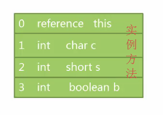
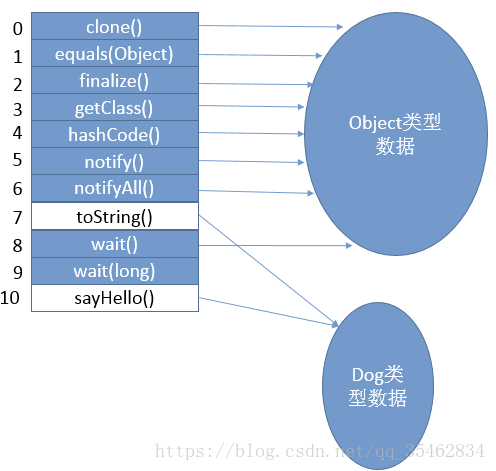

## JVM内存结构 VS Java内存模型 VS Java对象模型

Java作为一种面向对象的，跨平台语言，其对象、内存等一直是比较难的知识点。而且很多概念的名称看起来又那么相似，很多人会傻傻分不清楚。比如本文我们要讨论的JVM内存结构、Java内存模型和Java对象模型，这就是三个截然不同的概念，但是很多人容易弄混。

可以这样说，很多高级开发甚至都搞不不清楚JVM内存结构、Java内存模型和Java对象模型这三者的概念及其间的区别。甚至我见过有些面试官自己也搞的不是太清楚。不信的话，你去网上搜索Java内存模型，还会有很多文章的内容其实介绍的是JVM内存结构。

首先，这三个概念是完全不同的三个概念。本文主要对这三个概念加以区分以及简单介绍。其中每一个知识点都可以单独写一篇文章。

### JVM内存结构

我们都知道，Java代码是要运行在虚拟机上的，而虚拟机在执行Java程序的过程中会把所管理的内存划分为若干个不同的数据区域，这些区域都有各自的用途。

其中有些区域随着虚拟机进程的启动而存在，而有些区域则依赖用户线程的启动和结束而建立和销毁。在《Java虚拟机规范（Java SE 8）》中描述了JVM运行时内存区域结构如下：


各个区域的功能不是本文重点，就不在这里详细介绍了。这里简单提几个需要特别注意的点：

1、以上是Java虚拟机规范，不同的虚拟机实现会各有不同，但是一般会遵守规范。

2、规范中定义的方法区，只是一种概念上的区域，并说明了其应该具有什么功能。但是并没有规定这个区域到底应该处于何处。所以，对于不同的虚拟机实现来说，是有一定的自由度的。

3、不同版本的方法区所处位置不同，上图中划分的是逻辑区域，并不是绝对意义上的物理区域。因为某些版本的JDK中方法区其实是在堆中实现的。

4、运行时常量池用于存放编译期生成的各种字面量和符号应用。但是，Java语言并不要求常量只有在编译期才能产生。比如在运行期，String.intern也会把新的常量放入池中。

5、除了以上介绍的JVM运行时内存外，还有一块内存区域可供使用，那就是直接内存。Java虚拟机规范并没有定义这块内存区域，所以他并不由JVM管理，是利用本地方法库直接在堆外申请的内存区域。

6、堆和栈的数据划分也不是绝对的，如HotSpot的JIT会针对对象分配做相应的优化。

如上，做个总结，JVM内存结构，由Java虚拟机规范定义。描述的是Java程序执行过程中，由JVM管理的不同数据区域。各个区域有其特定的功能。

### Java内存模型

一、概要

Java内存模型看上去和Java内存结构（JVM内存结构）差不多，很多人会误以为两者是一回事儿，这也就导致面试过程中经常答非所问。

在前面的关于JVM的内存结构的图中，我们可以看到，其中Java堆和方法区的区域是多个线程共享的数据区域。也就是说，多个线程可能可以操作保存在堆或者方法区中的同一个数据。这也就是我们常说的“Java的线程间通过共享内存进行通信”。

Java内存模型是根据英文Java Memory Model（JMM）翻译过来的。其实JMM并不像JVM内存结构一样是真实存在的。他只是一个抽象的概念。JSR-133: Java Memory Model and Thread Specification 中描述了，JMM是和多线程相关的，他描述了一组规则或规范，这个规范定义了一个线程对共享变量的写入时对另一个线程是可见的。

那么，简单总结下，Java的多线程之间是通过共享内存进行通信的，而由于采用共享内存进行通信，在通信过程中会存在一系列如可见性、原子性、顺序性等问题，而JMM就是围绕着多线程通信以及与其相关的一系列特性而建立的模型。JMM定义了一些语法集，这些语法集映射到Java语言中就是volatile、synchronized等关键字。

在JMM中，我们把多个线程间通信的共享内存称之为主内存，而在并发编程中多个线程都维护了一个自己的本地内存（这是个抽象概念），其中保存的数据是主内存中的数据拷贝。而JMM主要是控制本地内存和主内存之间的数据交互的。


在Java中，JMM是一个非常重要的概念，正是由于有了JMM，Java的并发编程才能避免很多问题。这里就不对Java内存模型做更加详细的介绍了，想了解更多的朋友可以参考《Java并发编程的艺术》。

二、为什么要有内存模型

在介绍Java内存模型之前，先来看一下到底什么是计算机内存模型，然后再来看Java内存模型在计算机内存模型的基础上做了哪些事情。要说计算机的内存模型，就要说一下一段古老的历史，看一下为什么要有内存模型。

内存模型，英文名Memory Model，他是一个很老的老古董了。他是与计算机硬件有关的一个概念。那么我先给你介绍下他和硬件到底有啥关系。

1、CPU和缓存一致性

我们应该都知道，计算机在执行程序的时候，每条指令都是在CPU中执行的，而执行的时候，又免不了要和数据打交道。而计算机上面的数据，是存放在主存当中的，也就是计算机的物理内存啦。

刚开始，还相安无事的，但是随着CPU技术的发展，CPU的执行速度越来越快。而由于内存的技术并没有太大的变化，所以从内存中读取和写入数据的过程和CPU的执行速度比起来差距就会越来越大,这就导致CPU每次操作内存都要耗费很多等待时间。

> 这就像一家创业公司，刚开始，创始人和员工之间工作关系其乐融融，但是随着创始人的能力和野心越来越大，逐渐和员工之间出现了差距，普通员工原来越跟不上CEO的脚步。老板的每一个命令，传到到基层员工之后，由于基层员工的理解能力、执行能力的欠缺，就会耗费很多时间。这也就无形中拖慢了整家公司的工作效率。

可是，不能因为内存的读写速度慢，就不发展CPU技术了吧，总不能让内存成为计算机处理的瓶颈吧。

所以，人们想出来了一个好的办法，就是在CPU和内存之间增加高速缓存。缓存的概念大家都知道，就是保存一份数据拷贝。他的特点是速度快，内存小，并且昂贵。

那么，程序的执行过程就变成了：

当程序在运行过程中，会将运算需要的数据从主存复制一份到CPU的高速缓存当中，那么CPU进行计算时就可以直接从它的高速缓存读取数据和向其中写入数据，当运算结束之后，再将高速缓存中的数据刷新到主存当中。

> 之后，这家公司开始设立中层管理人员，管理人员直接归CEO领导，领导有什么指示，直接告诉管理人员，然后就可以去做自己的事情了。管理人员负责去协调底层员工的工作。因为管理人员是了解手下的人员以及自己负责的事情的。所以，大多数时候，公司的各种决策，通知等，CEO只要和管理人员之间沟通就够了。

而随着CPU能力的不断提升，一层缓存就慢慢的无法满足要求了，就逐渐的衍生出多级缓存。

按照数据读取顺序和与CPU结合的紧密程度，CPU缓存可以分为一级缓存（L1），二级缓存（L2），部分高端CPU还具有三级缓存（L3），每一级缓存中所储存的全部数据都是下一级缓存的一部分。

这三种缓存的技术难度和制造成本是相对递减的，所以其容量也是相对递增的。

那么，在有了多级缓存之后，程序的执行就变成了：

当CPU要读取一个数据时，首先从一级缓存中查找，如果没有找到再从二级缓存中查找，如果还是没有就从三级缓存或内存中查找

> 随着公司越来越大，老板要管的事情越来越多，公司的管理部门开始改革，开始出现高层，中层，底层等管理者。一级一级之间逐层管理。

单核CPU只含有一套L1，L2，L3缓存；

如果CPU含有多个核心，即多核CPU，则每个核心都含有一套L1（甚至和L2）缓存，而共享L3（或者和L2）缓存。

> 公司也分很多种，有些公司只有一个大Boss，他一个人说了算。但是有些公司有比如联席总经理、合伙人等机制。

> 单核CPU就像一家公司只有一个老板，所有命令都来自于他，那么就只需要一套管理班底就够了。

> 多核CPU就像一家公司是由多个合伙人共同创办的，那么，就需要给每个合伙人都设立一套供自己直接领导的高层管理人员，多个合伙人共享使用的是公司的底层员工。

> 还有的公司，不断壮大，开始差分出各个子公司。各个子公司就是多个CPU了，互相之前没有共用的资源。互不影响。

下图为一个单CPU双核的缓存结构。


随着计算机能力不断提升，开始支持多线程。那么问题就来了。我们分别来分析下单线程、多线程在单核CPU、多核CPU中的影响。

单线程。cpu核心的缓存只被一个线程访问。缓存独占，不会出现访问冲突等问题。

单核CPU，多线程。进程中的多个线程会同时访问进程中的共享数据，CPU将某块内存加载到缓存后，不同线程在访问相同的物理地址的时候，都会映射到相同的缓存位置，这样即使发生线程的切换，缓存仍然不会失效。但由于任何时刻只能有一个线程在执行，因此不会出现缓存访问冲突。

多核CPU，多线程。每个核都至少有一个L1 缓存。多个线程访问进程中的某个共享内存，且这多个线程分别在不同的核心上执行，则每个核心都会在各自的caehe中保留一份共享内存的缓冲。由于多核是可以并行的，可能会出现多个线程同时写各自的缓存的情况，而各自的cache之间的数据就有可能不同。

在CPU和主存之间增加缓存，在多线程场景下就可能存在缓存一致性问题，也就是说，在多核CPU中，每个核的自己的缓存中，关于同一个数据的缓存内容可能不一致。

> 如果这家公司的命令都是串行下发的话，那么就没有任何问题。

> 如果这家公司的命令都是并行下发的话，并且这些命令都是由同一个CEO下发的，这种机制是也没有什么问题。因为他的命令执行者只有一套管理体系。

> 如果这家公司的命令都是并行下发的话，并且这些命令是由多个合伙人下发的，这就有问题了。因为每个合伙人只会把命令下达给自己直属的管理人员，而多个管理人员管理的底层员工可能是公用的。

> 比如，合伙人1要辞退员工a，合伙人2要给员工a升职，升职后的话他再被辞退需要多个合伙人开会决议。两个合伙人分别把命令下发给了自己的管理人员。合伙人1命令下达后，管理人员a在辞退了员工后，他就知道这个员工被开除了。而合伙人2的管理人员2这时候在没得到消息之前，还认为员工a是在职的，他就欣然的接收了合伙人给他的升职a的命令


2、处理器优化和指令重排

上面提到在在CPU和主存之间增加缓存，在多线程场景下会存在缓存一致性问题。除了这种情况，还有一种硬件问题也比较重要。那就是为了使处理器内部的运算单元能够尽量的被充分利用，处理器可能会对输入代码进行乱序执行处理。这就是处理器优化。

除了现在很多流行的处理器会对代码进行优化乱序处理，很多编程语言的编译器也会有类似的优化，比如Java虚拟机的即时编译器（JIT）也会做指令重排。

可想而知，如果任由处理器优化和编译器对指令重排的话，就可能导致各种各样的问题。

> 关于员工组织调整的情况，如果允许人事部在接到多个命令后进行随意拆分乱序执行或者重排的话，那么对于这个员工以及这家公司的影响是非常大的。

三、并发编程的问题

前面说的和硬件有关的概念你可能听得有点蒙，还不知道他到底和软件有啥关系。但是关于并发编程的问题你应该有所了解，比如原子性问题，可见性问题和有序性问题。

其实，原子性问题，可见性问题和有序性问题。是人们抽象定义出来的。而这个抽象的底层问题就是前面提到的缓存一致性问题、处理器优化问题和指令重排问题等。

这里简单回顾下这三个问题，并不准备深入展开，可以自行学习。我们说，并发编程，为了保证数据的安全，需要满足以下三个特性：

原子性是指在一个操作中就是cpu不可以在中途暂停然后再调度，既不被中断操作，要不执行完成，要不就不执行。

可见性是指当多个线程访问同一个变量时，一个线程修改了这个变量的值，其他线程能够立即看得到修改的值。

有序性即程序执行的顺序按照代码的先后顺序执行。

有没有发现，缓存一致性问题其实就是可见性问题。而处理器优化是可以导致原子性问题的。指令重排即会导致有序性问题。所以，后文将不再提起硬件层面的那些概念，而是直接使用大家熟悉的原子性、可见性和有序性。

四、什么是内存模型

前面提到的，缓存一致性问题、处理器器优化的指令重排问题是硬件的不断升级导致的。那么，有没有什么机制可以很好的解决上面的这些问题呢？

最简单直接的做法就是废除处理器和处理器的优化技术、废除CPU缓存，让CPU直接和主存交互。但是，这么做虽然可以保证多线程下的并发问题。但是，这就有点因噎废食了。

所以，为了保证并发编程中可以满足原子性、可见性及有序性。有一个重要的概念，那就是——内存模型。

为了保证共享内存的正确性（可见性、有序性、原子性），内存模型定义了共享内存系统中多线程程序读写操作行为的规范。通过这些规则来规范对内存的读写操作，从而保证指令执行的正确性。它与处理器有关、与缓存有关、与并发有关、与编译器也有关。他解决了CPU多级缓存、处理器优化、指令重排等导致的内存访问问题，保证了并发场景下的一致性、原子性和有序性。

内存模型解决并发问题主要采用两种方式：限制处理器优化和使用内存屏障。（自我百度学习，后续学习）

五、什么是Java内存模型

前面介绍过了计算机内存模型，这是解决多线程场景下并发问题的一个重要规范。那么具体的实现是如何的呢，不同的编程语言，在实现上可能有所不同。

我们知道，Java程序是需要运行在Java虚拟机上面的，Java内存模型（Java Memory Model ,JMM）就是一种符合内存模型规范的，屏蔽了各种硬件和操作系统的访问差异的，保证了Java程序在各种平台下对内存的访问都能保证效果一致的机制及规范。

提到Java内存模型，一般指的是JDK 5 开始使用的新的内存模型，主要由JSR-133: JavaTM Memory Model and Thread Specification 描述。感兴趣的可以参看下这份[PDF文档](http://www.cs.umd.edu/~pugh/java/memoryModel/jsr133.pdf). 

Java内存模型规定了所有的变量都存储在主内存中，每条线程还有自己的工作内存，线程的工作内存中保存了该线程中是用到的变量的主内存副本拷贝，线程对变量的所有操作都必须在工作内存中进行，而不能直接读写主内存。不同的线程之间也无法直接访问对方工作内存中的变量，线程间变量的传递均需要自己的工作内存和主存之间进行数据同步进行。

而JMM就作用于工作内存和主存之间数据同步过程。他规定了如何做数据同步以及什么时候做数据同步。


这里面提到的主内存和工作内存，读者可以简单的类比成计算机内存模型中的主存和缓存的概念。特别需要注意的是，主内存和工作内存与JVM内存结构中的Java堆、栈、方法区等并不是同一个层次的内存划分，无法直接类比。《深入理解Java虚拟机》中认为，如果一定要勉强对应起来的话，从变量、主内存、工作内存的定义来看，主内存主要对应于Java堆中的对象实例数据部分。工作内存则对应于虚拟机栈中的部分区域。

<font color = red size = 10>总结：</font>JMM是一种规范，目的是解决由于多线程通过共享内存进行通信时，存在的本地内存数据不一致、编译器会对代码指令重排序、处理器会对代码乱序执行等带来的问题。目的是保证并发编程场景中的原子性、可见性和有序性。

六、Java内存模型的实现

了解Java多线程的都知道，在Java中提供了一系列和并发处理相关的关键字，比如volatile、synchronized、final、concurren包等。其实这些就是Java内存模型封装了底层的实现后提供给程序员使用的一些关键字。

在开发多线程的代码的时候，我们可以直接使用synchronized等关键字来控制并发，从来就不需要关心底层的编译器优化、缓存一致性等问题。所以，Java内存模型，除了定义了一套规范，还提供了一系列原语，封装了底层实现后，供开发者直接使用。

我们前面提到，并发编程要解决原子性、有序性和一致性的问题，我们就再来看下，在Java中，分别使用什么方式来保证。

1、原子性

在Java中，为了保证原子性，提供了两个高级的字节码指令monitorenter和monitorexit。在synchronized原理文章中，介绍过，这两个字节码，在Java中对应的关键字就是synchronized。

因此，在Java中可以使用synchronized来保证方法和代码块内的操作是原子性的。

2、可见性

Java内存模型是通过在变量修改后将新值同步回主内存，在变量读取前从主内存刷新变量值的这种依赖主内存作为传递媒介的方式来实现的。

Java中的volatile关键字提供了一个功能，那就是被其修饰的变量在被修改后可以立即同步到主内存，被其修饰的变量在每次是用之前都从主内存刷新。因此，可以使用volatile来保证多线程操作时变量的可见性。

除了volatile，Java中的synchronized和final两个关键字也可以实现可见性。只不过实现方式不同，这里不再展开了。

3、有序性

在Java中，可以使用synchronized和volatile来保证多线程之间操作的有序性。实现方式有所区别：

volatile关键字会禁止指令重排。synchronized关键字保证同一时刻只允许一条线程操作。

这里简单的介绍完了Java并发编程中解决原子性、可见性以及有序性可以使用的关键字。可能发现了，好像synchronized关键字是万能的，他可以同时满足以上三种特性，这其实也是很多人滥用synchronized的原因。

但是synchronized是比较影响性能的，虽然编译器提供了很多锁优化技术，但是也不建议过度使用。

### Java对象模型

Java是一种面向对象的语言，而Java对象在JVM中的存储也是有一定的结构的。而这个关于Java对象自身的存储模型称之为Java对象模型。

HotSpot虚拟机中，设计了一个OOP-Klass Model。OOP（Ordinary Object Pointer）指的是普通对象指针，而Klass用来描述对象实例的具体类型。

每一个Java类，在被JVM加载的时候，JVM会给这个类创建一个instanceKlass，保存在方法区，用来在JVM层表示该Java类。当我们在Java代码中，使用new创建一个对象的时候，JVM会创建一个instanceOopDesc对象，这个对象中包含了对象头以及实例数据。


这就是一个简单的Java对象的OOP-Klass模型，即Java对象模型。

### 总结

我们再来区分下JVM内存结构、 Java内存模型 以及 Java对象模型 三个概念。

* JVM内存结构，和Java虚拟机的运行时区域有关。
* Java内存模型，和Java的并发编程有关。
* Java对象模型，和Java对象在虚拟机中的表现形式有关。

关于这三部分内容，本文并未分别展开，因为涉及到的知识点实在太多，如果读者感兴趣，可以自行学习。后面也会发文介绍这些内容，敬请期待。

## jvm

一、概要

jvm体系总体分四大块：

1. 类的加载机制
2. jvm内存结构
3. GC算法 垃圾回收
4. GC分析 命令调优


二、基本概念

1、什么是JVM

JVM是Java程序运行的平台，它就像一台虚拟出来的计算机一样，负责执行Java编译好的字节码文件。JVM具有非常严格的实现规范，大多数操作系统都可以安装JVM，为Java语言的跨平台性起到了关键的作用。

JVM（Java虚拟机）是一个想象中的机器，在实际的计算机上通过软件模拟来实现。Java虚拟机有自己想象的硬件，堆栈，寄存器等，还具有相应的指令系统。

2、JVM的启动流程 


3、JVM的基本结构


1 pc寄存器

* PC(Program Couneter)寄存器是每个线程私有的，Java虚拟机会为每个线程创建PC寄存器，在任意时刻，一个Java线程总是在执行一个方法，这个方法称为当前方法，如果当前方法不是本地方法，PC寄存器总会执行当前正在被执行的指令，如果是本地方法，则PC寄存器值为Underfined，寄存器存放当前执行环境指针、程序计数器、操作栈指针、计算的变量指针等信息。

2 方法区

* 保存装载的信息、常量信息、常量池信息、方法信息，通常和永久区(Perm)关联在一起。

3 Java堆

* Java堆是和Java应用程序关系最密切的内存空间，所有线程共享Java堆，并且Java堆完全是自动化管理，通过垃圾收集机制，垃圾对象会自动清理，不需自己去释放。
* 根据垃圾回收机制的不同，Java堆有可能拥有不同的结构，最为常见的就是将整个Java堆分为新生代和老年代。其中新生代存放新生的对象或者年龄不大的对象，老年代则存放老年对象。绝大多数情况下，对象首先分配在eden区，在新生代回收后，如果对象还存活，则进入s0或s1区，之后每经过一次新生代回收，如果对象存活则它的年龄就加1，对象达到一定的年龄后，则进入老年代。


4 Java栈

1. Java栈是由一系列帧组成（因此Java栈也叫做帧栈），每一次方法调用创建一个帧，并压栈。
2. Java栈是一块线程私有的空间，一个栈，一般由三部分组成:局部变量表、操作数据栈和帧数据区。

* 局部变量表：包含函数的参数及局部变量。局部变量表有很多槽位，每个槽位最多可以容纳32位的数据类型，所以int占用一个槽位，float占用2个槽位，对象是一个引用，占用一个槽位。
实例方法和静态方法有一点不同，局部变量表的第一个槽位占用的是this，代表当前对象的引用。 
 
 ```
public class StackDemo {
  // 静态方法
  public static int runStatic(int i, long l, float f, Object o, byte b) {
    return 0;
  }

  // 实例方法
  public int runInstance(char c, short s, boolean b) {
    return 0;
  }
}
```




* 操作数栈：主要保存计算过程的中间结果，同时作为计算过程中的变量临时的存储空间。 

下图是一个两数相加的操作数栈的过程： 
   


* 帧数据区：除了局部变量表和操作数据栈以外，栈还需要一些数据来支持常量池的解析，这里帧数据区保存着访问常量池的指针，方便程序访问常量池，另外当函数返回或出现异常时虚拟机必须有一个异常处理表，方便发送异常的时候找到异常的代码，因此异常处理表也是帧数据区的一部分。
   
5 直接内存

JavaNio库允许Java程序使用直接内存，从而提高性能，通常直接内存速度会优于Java堆。读写频繁的场合可能会考虑使用。

6 栈、堆、方法区交互 


4、JVM生命周期

1. 启动：启动一个Java程序时，一个JVM实例就产生了，任何一个拥有```public static void main(String[] args)```函数的class都可以作为JVM实例运行的起点。
2. 运行：main()作为该程序初始线程的起点，任何其他线程均由该线程启动。
3. 消亡：当程序中的所有非守护线程都终止时，JVM才退出；若安全管理器允许，程序也可以使用Runtime类或者System.exit()来退出。        

一个运行中的Java虚拟机有着一个清晰的任务：执行Java程序。程序开始执行时他才运行，程序结束时他就停止。你在同一台机器上运行三个程序，就会有三个运行中的Java虚拟机。 Java虚拟机总是开始于一个main()方法，这个方法必须是公有、返回void、直接受一个字符串数组。在程序执行时，你必须给Java虚拟机指明这个包括main()方法的类名。main()方法是程序的起点，他被执行的线程初始化为程序的初始线程。程序中其他的线程都由他来启动。
Java中的线程分为两种：守护线程 （daemon）和普通线程（non-daemon）。守护线程是Java虚拟机自己使用的线程，比如负责垃圾收集的线程就是一个守护线程。当然，你也可以把自己的程序设置为守护线程。包含main()方法的初始线程不是守护线程。
只要Java虚拟机中还有普通的线程在执行，Java虚拟机就不会停止。如果有足够的权限，你可以调用exit()方法终止程序。

5、 JVM体系结构

JVM体系结构

1. 类装载器（ClassLoader）（用来装载.class文件）
2. 执行引擎（执行字节码，或者执行本地方法）
3. 运行时数据区（方法区、堆、java栈、PC寄存器、本地方法栈）

### 类加载机制

Java虚拟机把描述类的数据从Class文件加载到内存，并对数据进行校验、转换解析和初始化，最终形成可以被虚拟机直接使用的Java类型，这就是虚拟机的加载机制。

类从被加载到虚拟机内存中开始，到卸载出内存为止，它的整个生命周期包括了：加载（Loading）、验证（Verification）、准备（Preparation）、解析（Resolution）、初始化（Initialization）、使用（using）、和卸载（Unloading）七个阶段。其中验证、准备和解析三个部分统称为连接（Linking），这七个阶段的发生顺序如下图所示：  


1. 加载：查找和导入Class文件；
2. 链接：把类的二进制数据合并到JRE中；
 * 验证：检查载入Class文件数据的正确性；
 * 准备：给类的静态变量分配存储空间；
 * 解析：将符号引用转成直接引用；
3. 初始化：对类的静态变量，静态代码块执行初始化操作

1、加载

类的装载指的是将类的.class文件中的二进制数据读入到内存中，将其放在运行时数据区的方法区内，然后在堆区创建一个java.lang.Class对象，用来封装类在方法区内的数据结构。类的加载的最终产品是位于堆区中的Class对象，Class对象封装了类在方法区内的数据结构，并且向Java程序员提供了访问方法区内的数据结构的接口。 


加载.class文件的方式有:

1. 从本地系统中直接加载

2. 通过网络下载.class文件

3. 从zip，jar等归档文件中加载.class文件

4. 从专有数据库中提取.class文件

5. 将Java源文件动态编译为.class文件

在了解了什么是类的加载后，回头来再看jvm进行类加载阶段都做了什么。虚拟机需要完成以下三件事情：

1. 通过一个类的全限定名称来获取定义此类的二进制字节流。 

2. 将这个字节流所代表的静态存储结构转化为方法区的运行时数据结构。 

3. 在java堆中生成一个代表这个类的java.lang.Class对象，作为方法区这些数据的访问入口。 

相对于类加载过程的其他阶段，加载阶段是开发期相对来说可控性比较强，该阶段既可以使用系统提供的类加载器完成，也可以由用户自定义的类加载器来完成，开发人员可以通过定义自己的类加载器去控制字节流的获取方式。 

加载阶段完成后，虚拟机外部的二进制字节流就按照虚拟机所需的格式存储在方法区之中，而且在Java堆中也创建一个java.lang.Class类的对象，这样便可以通过该对象访问方法区中的这些数据。

2、验证

验证的目的是为了确保Class文件中的字节流包含的信息符合当前虚拟机的要求，而且不会危害虚拟机自身的安全。不同的虚拟机对类验证的实现可能会有所不同，但大致都会完成以下四个阶段的验证：文件格式的验证、元数据的验证、字节码验证和符号引用验证。

1. 文件格式的验证：验证字节流是否符合Class文件格式的规范，并且能被当前版本的虚拟机处理，该验证的主要目的是保证输入的字节流能正确地解析并存储于方法区之内。经过该阶段的验证后，字节流才会进入内存的方法区中进行存储，后面的三个验证都是基于方法区的存储结构进行的。 
2. 元数据验证：对类的元数据信息进行语义校验（其实就是对类中的各数据类型进行语法校验），保证不存在不符合Java语法规范的元数据信息。 
3. 字节码验证：该阶段验证的主要工作是进行数据流和控制流分析，对类的方法体进行校验分析，以保证被校验的类的方法在运行时不会做出危害虚拟机安全的行为。 
4. 符号引用验证：这是最后一个阶段的验证，它发生在虚拟机将符号引用转化为直接引用的时候（解析阶段中发生该转化），主要是对类自身以外的信息（常量池中的各种符号引用）进行匹配性的校验。

3、准备

准备阶段是正式为类变量分配内存并设置类变量初始值的阶段，这些内存都将在方法区中进行分配。 

1. 这时候进行内存分配的仅包括类变量（static），而不包括实例变量，实例变量会在对象实例化时随着对象一块分配在Java堆中。 
2. 这里所设置的初始值通常情况下是数据类型默认的零值（如0、0L、null、false等），而不是被在Java代码中被显式地赋予的值。

准备阶段是正式为类变量分配内存并设置类变量的初始值阶段，即在方法区中分配这些变量所使用的内存空间。注意这里所说的初始值概念，比如一个类变量定义为：

```
public static int v = 8080;
```

实际上变量v在准备阶段过后的初始值为0而不是8080，将v赋值为8080的putstatic指令是程序被编译后，存放于类构造器<client>方法之中，这里我们后面会解释。
但是注意如果声明为：

```
public static final int v = 8080;
```

final 在编译阶段会为v生成ConstantValue属性，在准备阶段虚拟机会根据ConstantValue属性将v赋值为8080。

4、解析

解析阶段是指虚拟机将常量池中的符号引用替换为直接引用的过程。符号引用就是class文件中的：

* CONSTANT_Class_info
* CONSTANT_Field_info
* CONSTANT_Method_info
等类型的常量。

下面我们解释一下符号引用和直接引用的概念：

* 符号引用与虚拟机实现的布局无关，引用的目标并不一定要已经加载到内存中。各种虚拟机实现的内存布局可以各不相同，但是它们能接受的符号引用必须是一致的，因为符号引用的字面量形式明确定义在Java虚拟机规范的Class文件格式中。
* 直接引用可以是指向目标的指针，相对偏移量或是一个能间接定位到目标的句柄。如果有了直接引用，那引用的目标必定已经在内存中存在。

1. 类或接口的解析：判断所要转化成的直接引用是对数组类型，还是普通的对象类型的引用，从而进行不同的解析。 
2. 字段解析：对字段进行解析时，会先在本类中查找是否包含有简单名称和字段描述符都与目标相匹配的字段，如果有，则查找结束；如果没有，则会按照继承关系从上往下递归搜索该类所实现的各个接口和它们的父接口，还没有，则按照继承关系从上往下递归搜索其父类，直至查找结束。 
3. 类方法解析：对类方法的解析与对字段解析的搜索步骤差不多，只是多了判断该方法所处的是类还是接口的步骤，而且对类方法的匹配搜索，是先搜索父类，再搜索接口。 
4. 接口方法解析：与类方法解析步骤类似，只是接口不会有父类，因此，只递归向上搜索父接口就行了。 

5、初始化

JVM初始化步骤

1. 假如这个类还没有被加载和连接，则程序先加载并连接该类
2. 假如该类的直接父类还没有被初始化，则先初始化其直接父类
3. 假如类中有初始化语句，则系统依次执行这些初始化语句

初始化阶段是类加载最后一个阶段，前面的类加载阶段之后，除了在加载阶段可以自定义类加载器以外，其它操作都由JVM主导。到了初始阶段，才开始真正执行类中定义的Java程序代码。

初始化阶段是执行类构造器<client>方法的过程。<client>方法是由编译器自动收集类中的类变量的赋值操作和静态语句块中的语句合并而成的。

```
class A(){

    public static int width = 100;

    static{

        System.out.println("初始化A类静态区");

        width = 300;

    }

}
```

最终会把两个静态变量和静态区按照顺序进行合并最终在方法区内width的值为300

虚拟机会保证<client>方法执行之前，父类的<client>方法已经执行完毕。p.s: 如果一个类中没有对静态变量赋值也没有静态语句块，那么编译器可以不为这个类生成<client>()方法。

```
// 先进行初始化父类的静态数据 再初始化子类静态数据
public class Demo01 {

  public static void main(String[] args) {
    System.out.println("Demo01的main方法");

    A a = new A();

    System.out.println(a.width);
  }
}

class A extends A_father {

  public static int width = 100;

  static {
    System.out.println("初始化A类静态区");

    width = 300;
  }
}

class A_father {

  static {
    System.out.println("初始化A_father类静态区");
  }
}
```

运行结果： 


```
// 先进行初始化父类的静态数据 再初始化子类静态数据
public class Demo01 {

  static {
    System.out.println("初始化Demo01");
  }

  public static void main(String[] args) {
    System.out.println("Demo01的main方法");

    A a = new A();

    System.out.println(a.width);
  }
}

class A extends A_father {

  public static int width = 100;

  static {
    System.out.println("初始化A类静态区");

    width = 300;
  }
}

class A_father {

  static {
    System.out.println("初始化A_father类静态区");
  }
}
```


```
// 静态属性只进行第一次初加载第二次直接进行调用
public class Demo01 {

  static {
    System.out.println("初始化Demo01");
  }

  public static void main(String[] args) {

    System.out.println("Demo01的main方法");

    A a = new A();

    System.out.println(a.width);

    A a1 = new A();
  }
}

class A extends A_father {

  public static int width = 100;

  static {
    System.out.println("初始化A类静态区");

    width = 300;
  }

  public A() {
    System.out.println("创建A类对象");
  }
}

class A_father {

  static {
    System.out.println("初始化A_father类静态区");
  }
}
```


类的主动引用（一定会发生类的初始化）：

下面的六种主动引用:

(1) 创建类的实例，也就是new的方式

(2) 访问某个类或接口的静态变量，或者对该静态变量赋值

(3) 调用类的静态方法

(4) 反射（如Class.forName(“com.shengsiyuan.Test”)）

(5) 初始化某个类的子类，则其父类也会被初始化

(6) Java虚拟机启动时被标明为启动类的类（Java Test），直接使用java.exe命令来运行某个主类

注意以下几种情况不会执行类初始化：

* 通过子类引用父类的静态字段，只会触发父类的初始化，而不会触发子类的初始化。
* 调取final修饰的静态成员或者静态方法
* 定义对象数组，不会触发该类的初始化。 A[] as = new A[10];
* 常量在编译期间会存入调用类的常量池中，本质上并没有直接引用定义常量的类，不会触发定义常量所在的类。
* 通过类名获取Class对象，不会触发类的初始化。
* 通过Class.forName加载指定类时，如果指定参数initialize为false时，也不会触发类初始化，其实这个参数是告诉虚拟机，是否要对类进行初始化。
* 通过ClassLoader默认的loadClass方法，也不会触发初始化动作。

6、结束生命周期

在以下情况的时候，Java虚拟机会结束生命周期 

1. 执行了System.exit()方法 
2. 程序正常执行结束 
3. 程序在执行过程中遇到了异常或错误而异常终止 
4. 由于操作系统出现错误而导致Java虚拟机进程终止


7、类加载器

虚拟机设计团队把加载动作放到JVM外部实现，以便让应用程序决定如何获取所需的类，JVM提供了3种类加载器：

* 启动类加载器(Bootstrap ClassLoader)：负责加载 JAVA_HOME\lib 目录中的，或通过-Xbootclasspath参数指定路径中的，且被虚拟机认可（按文件名识别，如rt.jar）的类。
* 扩展类加载器(Extension ClassLoader)：负责加载 JAVA_HOME\lib\ext 目录中的，或通过java.ext.dirs系统变量指定路径中的类库。
* 应用程序类加载器(Application ClassLoader)：负责加载用户路径（classpath）上的类库。

JVM通过双亲委派模型进行类的加载，当然我们也可以通过继承java.lang.ClassLoader实现自定义的类加载器。


8、双亲委派模型

Java虚拟机先从最核心的API开始查找，防止不可信的类扮演被信任的类。

* 启动类加载器 Bootstrap ClassLoader：加载<JAVA_HOME>\lib目录下核心库
* 扩展类加载器 Extension ClassLoader：加载<JAVA_HOME>\lib\ext目录下扩展包
* 应用程序类加载器 Application ClassLoader：加载用户路径(classpath)上指定的类库

1 双亲委派模型

双亲委派模型要求除顶层启动类加载器外其余类加载器都应该有自己的父类加载器；类加载器之间通过复用关系来复用父加载器的代码。

2 双亲委派模型工作顺序：

1. 当Application ClassLoader 收到一个类加载请求时，他首先不会自己去尝试加载这个类，而是将这个请求委派给父类加载器Extension ClassLoader去完成。  
2. 当Extension ClassLoader收到一个类加载请求时，他首先也不会自己去尝试加载这个类，而是将请求委派给父类加载器Bootstrap ClassLoader去完成。  
3. 如果Bootstrap ClassLoader加载失败(在<JAVA_HOME>\lib中未找到所需类)，就会让Extension ClassLoader尝试加载。  
4. 如果Extension ClassLoader也加载失败，就会使用Application ClassLoader加载。  
5. 如果Application ClassLoader也加载失败，就会使用自定义加载器去尝试加载。  
6. 如果均加载失败，就会抛出ClassNotFoundException异常。 

双亲委派模型的优点：Java类伴随其类加载器具备了带有优先级的层次关系，确保了在各种加载环境的加载顺序。保证了运行的安全性，防止不可信类扮演可信任的类。

注意：双亲委派模型是Java设计者推荐给开发者的类加载器的实现方式，并不是强制规定的。大多数的类加载器都遵循这个模型，但是JDK中也有较大规模破坏双亲模型的情况，例如线程上下文类加载器（Thread Context ClassLoader）的出现。

我们直接看一下jdk中的ClassLoader的源码实现：

```
protected Class<?> loadClass(String name, boolean resolve) throws ClassNotFoundException{
    synchronized (getClassLoadingLock(name)) {
        // First, check if the class has already been loaded
        Class<?> c = findLoadedClass(name);
        if (c == null) {
            long t0 = System.nanoTime();
            try {
                if (parent != null) {
                    c = parent.loadClass(name, false);
                } else {
                    c = findBootstrapClassOrNull(name);
                }
            } catch (ClassNotFoundException e) {
                // ClassNotFoundException thrown if class not found
                // from the non-null parent class loader
            }

            if (c == null) {
                // If still not found, then invoke findClass in order
                // to find the class.
                long t1 = System.nanoTime();
                c = findClass(name);

                // this is the defining class loader; record the stats
                sun.misc.PerfCounter.getParentDelegationTime().addTime(t1 - t0);
                sun.misc.PerfCounter.getFindClassTime().addElapsedTimeFrom(t1);
                sun.misc.PerfCounter.getFindClasses().increment();
            }
        }
        if (resolve) {
            resolveClass(c);
        }
        return c;
    }
}
```

* 首先通过Class c = findLoadedClass(name);判断一个类是否已经被加载过。
* 如果没有被加载过执行if (c == null)中的程序，遵循双亲委派的模型，首先会通过递归从父加载器开始找，直到父类加载器是Bootstrap ClassLoader为止。
* 最后根据resolve的值，判断这个class是否需要解析。

而上面的findClass()的实现如下，直接抛出一个异常，并且方法是protected，很明显这是留给我们开发者自己去实现的。

```
protected Class<?> findClass(String name) throws ClassNotFoundException {
    throw new ClassNotFoundException(name);
}
```

9、执行引擎

“虚拟机”的概念是相对于“物理机”而言的，这两种“机器”都有执行代码的能力。物理机的执行引擎是直接建立在硬件处理器、物理寄存器、指令集和操作系统层面的；而“虚拟机”的执行引擎是自己实现的，因此可以自定义指令集和执行引擎的结构体系，而且可以执行那些不能被硬件直接支持的指令。

在不同的“虚拟机”实现里面，执行引擎在执行JAVA代码的时候有两种方式：解析实行（通过解释器执行）和编译执行（通过即时编译器编译成本地代码执行）。

1 栈帧

在虚拟机中与执行方法最相关的是栈帧，程序的执行对应着栈帧的入栈和出栈，所以栈帧对于执行引擎而言，是很重要的基础。栈帧的基本结构之前已经有所介绍，这里只是再简单的过一遍。

栈帧主要包括了局部变量表、操作数栈、动态连接、方法返回地址等信息。

在编译程序代码的时候，栈帧中需要多大的局部变量表，多深的操作数栈都已经完全确定了，并且写入到方法表的Code属性中，因此一个栈帧需要多大的内存，不会受到程序运行期变量数据的影响。

一个线程的方法调用链可能会很长，很多方法会同时处于执行状态。对于执行引擎来说，在当前活动的线程中，只有位于栈顶的栈帧才是有效的，成为当前栈帧，与这个栈帧相关联的方法成为当前方法。

1)局部变量表

用于存放方法参数和方法内部的局部变量。局部变量表的大小在方法的Code属性中就已经定义好了，为max_locals的值，局部变量表的单位为slot，32位以内的类型只占用一个slot（包括returnAddress类型），64位的类型占用两个slot。注意，对于实例方法而言，索引为0的slot存放的是this引用，之后再依次存放方法参数，定义的局部变量；slot可以被重用，当局部变量已经超出了作用域时，在作用域外在定义局部变量时，可以重用之前的slot空间。同时，局部变量没有赋值是不能够使用的，这和类变量和实例变量是有不同的，如下面代码：

```
public void test() {

    int i;

    System.out.println(i);

}
```

这样的代码是错误的，没有赋值不能够使用。

2)操作数栈

执行方法时，存放操作数的栈，也叫操作栈，栈的深度在方法的Code属性中已经定义好了，为max_stack的值，32位以内的类型占用一个栈单位，64为的类型占用两个栈单位。操作数栈可以与其他栈的局部变量表共享区域，这样可以共用一部分数据。

3)动态连接

动态连接是为了支持在运行期间将符号引用转化为直接引用的操作。每一个方法对应一个栈帧，而每一个栈帧，都包含指向对应方法的引用，这个引用就是为了支持动态连接，如invokedynamic指令。动态连接与静态解析对应，静态解析是在类加载（解析阶段）或者第一次使用时将符号引用转化为直接引用，动态连接则是每一次运行的时候都需要进行转化(invokedynamic指令)。

4)方法返回地址

正常方法返回，返回地址为调用该方法的指令的下一条指令的地址；异常返回，返回地址由异常表确定。方法返回时，需要恢复上层方法的局部变量表、操作数栈、将返回值压入调用者栈帧的操作数栈、设置PC值。


2 方法调用

在分析了栈帧后，我们接着分析方法调用，方法调用会导致栈帧入栈，而方法调用会确定调用哪一个方法，还不会涉及到具体的方法体执行。

1)解析

在程序执行前就已经确定了方法调用的版本，即编译期就确定了调用方法版本，这个版本在运行时是不可变的。静态方法、私有方法、final方法在编译时就可以确定具体的调用版本，静态方法直接与类型相关、私有方法在外部不可访问、final不可被继承，也可唯一确定,这些方法称为非虚方法，其他方法称为虚方法。在类加载的解析阶段就可以进行解析，如下方法调用在编译期就可以确定方法调用的版本。

```
class Father {

    public static void print(String str) {

        System.out.println("father " + str);

    }

    

    private void show(String str) {

        System.out.println("father " + str);

    }

}

 

class Son extends Father {

}

 

public class Test {

    public static void main(String[] args) {

        Son.print("coder");

        //Father fa = new Father();

        //fa.show("cooooder");

    }

}
```

运行结果：

```
fatcher coder
```

说明：Son.print实际上调用的是Father的print方法，print方法与Father类型是相关的，而show方法时私有的方法，在Main中无法调用，只能在Father的内部调用，也是确定的。

invokestatic(调用静态方法)、invokespecial(调用实例构造器<init>方法、私有方法、父类方法)都是在编译期就可以确定版本的。

2)分派

分派调用与多态密切相关，分为静态分派、动态分派、单分派、多分派。

* 静态分派

与静态分派相关的就是方法的重载，重载时根据参数的静态类型引用类型而非实际类型决定调用哪个版本。

```
/** 重载方法在编译器就可以进行确定，不需要等到运行期间 */
public class StaticDispatch {

  static class Human {}

  static class Women extends Human {}

  static class Men extends Human {}

  public void sayHello(Human human) {
    System.out.println("say human");
  }

  public void sayHello(Women women) {
    System.out.println("say women");
  }

  public void sayHello(Men men) {
    System.out.println("say men");
  }

  public static void main(String[] args) {

    StaticDispatch ds = new StaticDispatch();

    Human women = new Women();

    Human men = new Men();

    ds.sayHello(women);

    ds.sayHello(men);
  }
}
```

运行结果：

```
say human
say human
```

说明：由于静态类型（引用类型）为Human，在编译期就可以确定方法的调用版本是以Human参数的方法，和实际类型无关。

* 动态分派

与动态分派相关的就是方法的重写，在子类中我们会重写父类的方法，而在调用的时候根据实际类型来决定适合的调用版本。

```
public class DynamicDispatch {

  abstract static class Human {
    public abstract void sayHello();
  }

  static class Women extends Human {

    @Override
    public void sayHello() {
      System.out.println("say women");
    }
  }

  static class Men extends Human {

    @Override
    public void sayHello() {
      System.out.println("say men");
    }
  }

  public static void main(String[] args) {
    Human women = new Women();

    Human men = new Men();

    women.sayHello();

    men.sayHello();
  }
}
```

运行结果：

```
say women
say men
```

说明：此时根据实际类型选择合适的方法调用，分别调用了women和men的sayHello()方法。

* 单分派与多分派

方法的接收者(方法的所有者)与方法的参数统称为方法的宗量，根据分派基于多少种宗量，可以将分派划分为单分派和多分派。

单分派根据一个宗量确定调用方法的版本；多分派根据多个宗量确定调用方法的版本。　　

```
public class Dispatch {

  static class QQ {};

  static class _360 {};

  public static class Father {

    public void hardChoice(QQ arg) {
      System.out.println("father choose qq");
    }

    public void hardChoice(_360 arg) {
      System.out.println("father choose 360");
    }
  }

  public static class Son extends Father {
    public void hardChoice(QQ arg) {
      System.out.println("son choose qq");
    }

    public void hardChoice(_360 arg) {
      System.out.println("son choose 360");
    }
  }

  public static void main(String[] args) {
    Father father = new Father();
    Father son = new Son();
    father.hardChoice(new _360());
    son.hardChoice(new QQ());
  }
}
```

运行结果:

```
father choose 360
son choose qq
```

说明：静态分派过程如下，在编译期阶段，会根据静态类型与参数类型确定调用版本，产生两条分别指向```Father.hardChoice(QQ)```和```Father.hardChoice(_360)```的指令，可以知道，在编译期，是由多个宗量确定调用版本，是静态多分派。动态分派过程如下，在运行期，在执行hardChoice(QQ)或者hardChoice(_360)时，已经确定了参数必须为QQ、_360，方法签名确定，静态类型和实际类型此时都不会对方法本身产生任何影响，而虚拟机会根据实际类型来确定调用版本，只根据一个宗量进行确定，因此，在运行时，是动态单分派。

1 动态分派的实现

在面向对象的编程中，会很频繁的使用到动态分派，如何实现动态分派呢？虚拟机采用在类的方法区建立一个虚方法表(非虚方法不会出现在表中)来实现。上面程序的虚方法表如下图所示。


说明：从Object类继承的方法都会指向Object类型数据中各方法的实际入口地址。类自身的方法会指向类的数据类型中方法的实际入口地址。父类的没有被重写的方法在虚方法表中的索引与子类方法表中的索引相同，这样，当类型变化时，只需要改变方法表就行，索引还是相同。方法表一般在类加载的连接阶段进行初始化，准备了类变量的初始值后，方法表也初始化完毕。

下面我们再通过一个例子更加深入了解方法表。

下面几个类的继承关系如下:


```
public interface Friendly {
  void sayHello();

  void sayGoodbye();
}
```

```
public class Cat implements Friendly {

  public void eat() {
    System.out.println("Chomp, chomp, chomp");
  }

  @Override
  public void sayHello() {
    System.out.println("Rub, rub, rub");
  }

  @Override
  public void sayGoodbye() {
    System.out.println("Samper");
  }

  @Override
  protected void finalize() throws Throwable {
    System.out.println("Meow");
  }
}	
```

```
public class Dog {

  private int wagCount = ((int) (Math.random() * 5.0)) + 1;

  public void sayHello() {
    System.out.println("Wag");
    for (int i = 0; i < wagCount; i++) System.out.println(", wag");
  }

  public String toString() {
    return "Woof";
  }
}
```

```
public class CockerSpaniel extends Dog implements Friendly {

  private int woofCount = ((int) (Math.random() * 4.0)) + 1;

  private int wimperCount = ((int) (Math.random() * 3.0)) + 1;

  @Override
  public void sayHello() {
    super.sayHello();
    System.out.println("Woof");
    for (int i = 0; i < woofCount; i++) {
      System.out.println(", woof");
    }
  }

  @Override
  public void sayGoodbye() {
    System.out.println("Wimper");
    for (int i = 0; i < wimperCount; i++) {
      System.out.println(", wimper");
    }
  }
}
```

对象映像如下图所示 


说明：忽略了Object的实例变量。来自超类的实例变量出现在子类实例变量之前，可以看到，Dog的实例变量wagCount的索引为1，与CockerSpaniel的索引相同，之后按照变量出现的顺序依次存放。

Dog虚方法表



说明：强调，非虚方法不会出现在此表中，没有重写的Object的方法指向Object类型数据中的方法的实际入口地址。 

CockerSpaniel方法表


说明：可以看到被覆盖的sayHello方法指向了CockerSpaniel类型数据，sayHello方法的索引在Dog与CockerSpaniel中是相同的。

Cat方法表 


说明：由CockerSpaniel和Cat的方法表我们可以知道，sayHello方法与sayGoodbye方法在两者的方法表中的索引是不相同的，CockerSpaniel与Cat两个类之间没有关系，所以接口的方法的索引可以不相同。

示例：

```
public class Tester {
  public static void main(String[] args) {

    Dog dog = new CockerSpaniel();

    dog.sayHello();

    Friendly fr = (Friendly) dog;

    fr.sayGoodbye();

    fr = new Cat();

    fr.sayGoodbye();
  }
}
```

结果：

```
Wag
, wag
, wag
, wag
Woof
, woof
, woof
, woof
, woof
Wimper
, wimper
, wimper
, wimper
Samper
```

说明：fr首先指向CockerDaniel，然后调用了方法sayGoodbye，方法的索引为11。然后fr又指向了Cat，调用了方法sayGoodbye，方法索引为12，索引值不同，不能仅仅切换方法表，还要重新搜索（Cat的）方法表。虚拟机从接口引用调用一个方法时，它必须搜索类的方法表来找到合适的方法，并不能像之前那样根据父类方法的索引直接可以确定子类方法的索引（因为父类的方法与子类的方法的索引相同），而是需要扫描整个方法表才能确定。这种调用接口引用的实例方法比类引用调用实例方法慢得多。

### JVM内存结构

一、运行时数据区


1、程序计数器

* 作用：记录当前线程所执行的字节码的行号。字节码解释器工作时就是通过改变这个计数器的值来选取下一条需要执行的字节码指令
* 意义：JVM的多线程是通过线程轮流切换并分配CPU时间方式来实现的，因此，为了线程切换后能恢复到正确的指定位置，每条线程丢都需要一个独立的程序计数器
* 存储内容：若线程正执行的是一个Java方法时，程序计数器中记录的是正在执行的线程的虚拟机字节码指令的地址，若线程正执行的是一个本地方法时，程序计数器中的值为空
* 可能发生的异常：程序计数器是唯一一个Java虚拟机规范中没有规定任何OutOfMemoryError情况的区域

2、Java虚拟机栈

* 作用：描述Java方法执行的内存模型，每个方法执行的时候都会创建一个栈帧，栈帧里面存储了局部变量表、操作数栈、动态链接、方法出口等信息
* 意义：方法从开始执行到执行结束，就对应着一个栈帧在Java虚拟机栈中入栈到出栈的过程
* 存储内容：局部变量表（编译期间可知的各种基本数据类型、引用类型和指向一条字节码指令的returnAddress类型）、操作数栈、动态链接、方法出口等信息，值得注意的是：局部变量表所需的内存空间在编译期间完成分配。在方法运行的阶段是不会改变局部变量表的大小的
* 可能发生的异常：StackOverflowError异常：如果线程请求的栈深度大于虚拟机所允许的深度，将抛出该异常，OutOfMemoryError异常：如果虚拟机栈可以动态扩展（当前大部分的Java虚拟机都可以动态扩展，只不过虚拟机规范中也允许固定长度的虚拟机栈）如果扩展时无法申请到足够的内存，就会抛出该异常

3、本地方法栈

* 作用：为JVM所调用到的Native即本地方法服务 ps：Sun HotSpot虚拟机 直接把本地方法栈和虚拟机栈合二为一
* 可能发生的异常：同虚拟机栈，存在StackOverflowError异常和OutOfMemoryError异常

4、堆

* 作用：分配所有的对象实例以及数组，但随着即时编译（JIT）器的发展与逃逸分析技术逐渐成熟，栈上分配、标量替换优化技术使得对象都在对上分配变得不那么绝对
* 意义：Java堆是Java虚拟机所管理的内存中最大的一块，被所有线程共享，在JVM启动时创建。Java堆是垃圾收集器管理的主要区域，Java堆可以细分为：新生代（Young Generation）、老年代（Old Generation）、永久代（Permanent Generation）；新生代再细致一点可以分为Eden空间、From Survivor空间、To Survivor空间。如果配置-XX:+/-UseTLAB，每个线程在Java堆中预先分配一小块内存，称为本地线程分配缓冲（Thread Local Allocation Buffer, TLAB）
* 存储内容： 存放对象实例及数组（创建数组时，创建动作由字节码指令newarray触发，虚拟机自动生成一个为java.lang.Object的子类的类，这个类中实现了数组中应有的属性和方法，可以直接访问的为public类型的length属性和clone()方法），几乎所有的对象实例都在这里进行分配。堆可以处于物理上不连续的内存空间，只要逻辑上是连续的就可以
* 可能发生的异常：如果堆中没有内存完成实例分配，并且堆也无法再拓展（堆可以是固定大小的，拓展可通过-Xms和-Xmx参数控制）时，将会抛出OutOfMemoryError异常

5、方法区

* 作用：用于存储运行时常量池、已被虚拟机加载的类信息、常量、静态变量、即时编译器编译后的代码等数据
* 意义：对运行时常量池、常量、静态变量等数据做出了规定
* 存储内容：运行时常量池（具有动态性）、已被虚拟机加载的类信息、常量、静态变量、即时编译器编译后的代码等数据
* 可能发生的异常：当方法区无法满足内存分配需求的时候抛出OutOfMemoryError异常

1. 运行时常量池

运行时常量池是方法区的一部分。Class文件中除了有类的版本、字段、方法、接口等描述信息外，还有一项信息是常量池，用于存放编译期间生成的各种字面量和符号引用，这部分内容将在类加载后进入方法区的运行时常量池存放

* jdk6、jdk7、jdk8对于方法区的设计不同

 * 运行时常量池在JDK1.6及之前版本的JVM中是方法区的一部分，而在HotSpot虚拟机中方法区放在了”永久代”。所以运行时常量池也是在永久代的
 * 但是JDK1.7及之后版本的JVM已经将运行时常量池从方法区中移了出来，在Java 堆（Heap）中开辟了一块区域存放运行时常量池
 * 而在JDK1.8中，已经彻底没有了永久代，将方法区直接放在一个与堆不相连的本地内存区域，这个区域被叫做元空间

 

 
 
 
 
 
 
二、JVM内存模型

1 JVM 虚拟机架构


2 JVM内存区域

JVM会将Java进程所管理的内存划分为若干不同的数据区域. 这些区域有各自的用途、创建/销毁时间:


对象和类的数据存储在3个不同的内存区域：堆（heap space）、方法区（method area）、本地区（native area）。

堆内存存放对象以及数组的数据，方法区存放类的信息（包括类名、方法、字段）、静态变量、编译器编译后的代码，本地区包含线程栈、本地方法栈等存放线程

### GC算法 垃圾回收

一 内存分配策略

对象内存主要分配在新生代Eden区, 如果启用了本地线程分配缓冲, 则优先在TLAB上分配, 少数情况能会直接分配在老年代, 或被拆分成标量类型在栈上分配(JIT优化). 分配的规则并不是百分百固定, 细节主要取决于垃圾收集器组合, 以及VM内存相关的参数.

1 对象分配

优先在Eden区分配

在[JVM内存模型](https://blog.csdn.net/zjf280441589/article/details/53437703)一文中, 我们大致了解了VM年轻代堆内存可以划分为一块Eden区和两块Survivor区. 在大多数情况下, 对象在新生代Eden区中分配, 当Eden区没有足够空间分配时, VM发起一次Minor GC, 将Eden区和其中一块Survivor区内尚存活的对象放入另一块Survivor区域, 如果在Minor GC期间发现新生代存活对象无法放入空闲的Survivor区, 则会通过空间分配担保机制使对象提前进入老年代(空间分配担保见下).

大对象直接进入老年代

Serial和ParNew两款收集器提供了-XX:PretenureSizeThreshold的参数, 令大于该值的大对象直接在老年代分配, 这样做的目的是避免在Eden区和Survivor区之间产生大量的内存复制(大对象一般指 需要大量连续内存的Java对象, 如很长的字符串和数组), 因此大对象容易导致还有不少空闲内存就提前触发GC以获取足够的连续空间.

2 对象晋升

1、年龄阈值

VM为每个对象定义了一个对象年龄(Age)计数器, 对象在Eden出生如果经第一次Minor GC后仍然存活, 且能被Survivor容纳的话, 将被移动到Survivor空间中, 并将年龄设为1. 以后对象在Survivor区中每熬过一次Minor GC年龄就+1. 当增加到一定程度(-XX:MaxTenuringThreshold, 默认15), 将会晋升到老年代.

2、提前晋升: 动态年龄判定

然而VM并不总是要求对象的年龄必须达到MaxTenuringThreshold才能晋升老年代: 如果在Survivor空间中相同年龄所有对象大小的总和大于Survivor空间的一半, 年龄大于或等于该年龄的对象就可以直接进入老年代, 而无须等到晋升年龄.

二、何时回收-对象生死判定	

在进行对象回收前需要判定那些对象内存是需要回收的?

JVM的内存结构包括五大区域：程序计数器、虚拟机栈、本地方法栈、堆区、方法区。其中程序计数器、虚拟机栈、本地方法栈3个区域随线程而生、随线程而灭，因此这几个区域的内存分配和回收都具备确定性，就不需要过多考虑回收的问题，因为方法结束或者线程结束时，内存自然就跟随着回收了。而Java堆区和方法区则不一样，这部分内存的分配和回收是动态的，正是垃圾收集器所需关注的部分。

1 判断对象是否存活的算法

1、引用计数算法

* 算法分析

引用计数是垃圾收集器中的早期策略。在这种方法中，堆中每个对象实例都有一个引用计数。当一个对象被创建时，就将该对象实例分配给一个变量，该变量计数设置为1。当任何其它变量被赋值为这个对象的引用时，计数加1（a = b,则b引用的对象实例的计数器+1），但当一个对象实例的某个引用超过了生命周期或者被设置为一个新值时，对象实例的引用计数器减1。任何引用计数器为0的对象实例可以被当作垃圾收集。当一个对象实例被垃圾收集时，它引用的任何对象实例的引用计数器减1。

* 优缺点

 * 优点：引用计数收集器可以很快的执行，交织在程序运行中。对程序需要不被长时间打断的实时环境比较有利。
 * 缺点：无法检测出循环引用。如父对象有一个对子对象的引用，子对象反过来引用父对象。这样，他们的引用计数永远不可能为0。
 
```
  public class ReferenceFindTest {

    public static void main(String[] args) {

        MyObject object1 = new MyObject();

        MyObject object2 = new MyObject();

          

        object1.object = object2;

        object2.object = object1;

          

        object1 = null;

        object2 = null;

    }

}
```

这段代码是用来验证引用计数算法不能检测出循环引用。最后面两句将object1和object2赋值为null，也就是说object1和object2指向的对象已经不可能再被访问，但是由于它们互相引用对方，导致它们的引用计数器都不为0，那么垃圾收集器就永远不会回收它们。

2、可达性分析算法

在主流商用语言(如Java、C#)的主流实现中, 都是通过可达性分析算法来判定对象是否存活的: 通过一系列的称为 GC Roots 的对象作为起点, 然后向下搜索; 搜索所走过的路径称为引用链/Reference Chain, 当一个对象到 GC Roots 没有任何引用链相连时, 即该对象不可达, 也就说明此对象是不可用的

* 在Java, 可作为GC Roots的对象包括: 

 * 方法区: 类静态属性引用的对象;
 * 方法区: 常量引用的对象;
 * 虚拟机栈(本地变量表)中引用的对象.
 * 本地方法栈JNI(Native方法)中引用的对象。

* Java中的引用

1、强引用

在程序代码中普遍存在的，类似 Object obj = new Object() 这类引用，只要强引用还存在，垃圾收集器永远不会回收掉被引用的对象。

2、软引用
 
用来描述一些还有用但并非必须的对象。对于软引用关联着的对象，在系统将要发生内存溢出异常之前，将会把这些对象列进回收范围之中进行第二次回收。如果这次回收后还没有足够的内存，才会抛出内存溢出异常。

3、弱引用

也是用来描述非必需对象的，但是它的强度比软引用更弱一些，被弱引用关联的对象只能生存到下一次垃圾收集发生之前。当垃圾收集器工作时，无论当前内存是否足够，都会回收掉只被弱引用关联的对象。

4、虚引用

也叫幽灵引用或幻影引用（名字真会取，很魔幻的样子），是最弱的一种引用关系。一个对象是否有虚引用的存在，完全不会对其生存时间构成影响，也无法通过虚引用来取得一个对象实例。它的作用是能在这个对象被收集器回收时收到一个系统通知。

3 对象死亡（被回收）前的最后一次挣扎

即使在可达性分析算法中不可达的对象，也并非是“非死不可”，这时候它们暂时处于“缓刑”阶段，要真正宣告一个对象死亡，至少要经历两次标记过程。

第一次标记：如果对象在进行可达性分析后发现没有与GC Roots相连接的引用链，那它将会被第一次标记；

第二次标记：第一次标记后接着会进行一次筛选，筛选的条件是此对象是否有必要执行finalize()方法。在finalize()方法中没有重新与引用链建立关联关系的，将被进行第二次标记。

第二次标记成功的对象将真的会被回收，如果对象在finalize()方法中重新与引用链建立了关联关系，那么将会逃离本次回收，继续存活。

注: 即使在可达性分析算法中不可达的对象, VM也并不是马上对其回收, 因为要真正宣告一个对象死亡, 至少要经历两次标记过程: 第一次是在可达性分析后发现没有与GC Roots相连接的引用链, 第二次是GC对在F-Queue执行队列中的对象进行的小规模标记(对象需要覆盖finalize()方法且没被调用过).

三、GC原理- 垃圾收集算法

1 分代收集算法 VS 分区收集算法

1、分代收集

当前主流VM垃圾收集都采用”分代收集”(Generational Collection)算法, 这种算法会根据对象存活周期的不同将内存划分为几块, 如JVM中的 新生代、老年代、永久代. 这样就可以根据各年代特点分别采用最适当的GC算法:

* 在新生代: 每次垃圾收集都能发现大批对象已死, 只有少量存活. 因此选用复制算法, 只需要付出少量存活对象的复制成本就可以完成收集.
* 在老年代: 因为对象存活率高、没有额外空间对它进行分配担保, 就必须采用“标记—清理”或“标记—整理”算法来进行回收, 不必进行内存复制, 且直接腾出空闲内存.

2、分区收集
上面介绍的分代收集算法是将对象的生命周期按长短划分为两个部分, 而分区算法则将整个堆空间划分为连续的不同小区间, 每个小区间独立使用, 独立回收. 这样做的好处是可以控制一次回收多少个小区间.
在相同条件下, 堆空间越大, 一次GC耗时就越长, 从而产生的停顿也越长. 为了更好地控制GC产生的停顿时间, 将一块大的内存区域分割为多个小块, 根据目标停顿时间, 每次合理地回收若干个小区间(而不是整个堆), 从而减少一次GC所产生的停顿.

2 分代收集

1、新生代-复制算法

该算法的核心是将可用内存按容量划分为大小相等的两块, 每次只用其中一块, 当这一块的内存用完, 就将还存活的对象复制到另外一块上面, 然后把已使用过的内存空间一次清理掉. 


这使得每次只对其中一块内存进行回收, 分配也就不用考虑内存碎片等复杂情况, 实现简单且运行高效.


现代商用VM的新生代均采用复制算法, 但由于新生代中的98%的对象都是生存周期极短的, 因此并不需完全按照1∶1的比例划分新生代空间, 而是将新生代划分为一块较大的Eden区和两块较小的Survivor区(HotSpot默认Eden和Survivor的大小比例为8∶1), 每次只用Eden和其中一块Survivor. 当发生MinorGC时, 将Eden和Survivor中还存活着的对象一次性地拷贝到另外一块Survivor上, 最后清理掉Eden和刚才用过的Survivor的空间. 当Survivor空间不够用(不足以保存尚存活的对象)时, 需要依赖老年代进行空间分配担保机制, 这部分内存直接进入老年代.

补充: 空间分配担保

在执行Minor GC前, VM会首先检查老年代是否有足够的空间存放新生代尚存活对象, 由于新生代使用复制收集算法, 为了提升内存利用率, 只使用了其中一个Survivor作为轮换备份, 因此当出现大量对象在Minor GC后仍然存活的情况时, 就需要老年代进行分配担保, 让Survivor无法容纳的对象直接进入老年代, 但前提是老年代需要有足够的空间容纳这些存活对象. 但存活对象的大小在实际完成GC前是无法明确知道的, 因此Minor GC前, VM会先首先检查老年代连续空间是否大于新生代对象总大小或历次晋升的平均大小, 如果条件成立, 则进行Minor GC, 否则进行Full GC(让老年代腾出更多空间).
然而取历次晋升的对象的平均大小也是有一定风险的, 如果某次Minor GC存活后的对象突增,远远高于平均值的话,依然可能导致担保失败(Handle Promotion Failure, 老年代也无法存放这些对象了), 此时就只好在失败后重新发起一次Full GC(让老年代腾出更多空间).

2、老年代-标记清除算法

该算法分为“标记”和“清除”两个阶段: 首先标记出所有需要回收的对象(可达性分析), 在标记完成后统一清理掉所有被标记的对象.


该算法会有以下两个问题:

1. 效率问题: 标记和清除过程的效率都不高;
2. 空间问题: 标记清除后会产生大量不连续的内存碎片, 空间碎片太多可能会导致在运行过程中需要分配较大对象时无法找到足够的连续内存而不得不提前触发另一次垃圾收集.

3、老年代-标记整理算法

标记清除算法会产生内存碎片问题, 而复制算法需要有额外的内存担保空间, 于是针对老年代的特点, 又有了标记整理算法. 标记整理算法的标记过程与标记清除算法相同, 但后续步骤不再对可回收对象直接清理, 而是让所有存活的对象都向一端移动,然后清理掉端边界以外的内存. 

4、 永久代-方法区回收

在方法区进行垃圾回收一般”性价比”较低, 因为在方法区主要回收两部分内容: 废弃常量和无用的类. 回收废弃常量与回收其他年代中的对象类似, 但要判断一个类是否无用则条件相当苛刻:

1. 该类所有的实例都已经被回收, Java堆中不存在该类的任何实例;
2. 该类对应的Class对象没有在任何地方被引用(也就是在任何地方都无法通过反射访问该类的方法);
3. 加载该类的ClassLoader已经被回收.

但即使满足以上条件也未必一定会回收, Hotspot VM还提供了-Xnoclassgc参数控制(关闭CLASS的垃圾回收功能). 因此在大量使用动态代理、CGLib等字节码框架的应用中一定要关闭该选项, 开启VM的类卸载功能, 以保证方法区不会溢出.

3 分代收集算法

分代收集算法是目前大部分JVM的垃圾收集器采用的算法。它的核心思想是根据对象存活的生命周期将内存划分为若干个不同的区域。一般情况下将堆区划分为老年代（Tenured Generation）和新生代（Young Generation），在堆区之外还有一个代就是永久代（Permanet Generation）。老年代的特点是每次垃圾收集时只有少量对象需要被回收，而新生代的特点是每次垃圾回收时都有大量的对象需要被回收，那么就可以根据不同代的特点采取最适合的收集算法。


3.1 年轻代（Young Generation）的回收算法

* 所有新生成的对象首先都是放在年轻代的。年轻代的目标就是尽可能快速的收集掉那些生命周期短的对象。
* 新生代内存按照8:1:1的比例分为一个eden区和两个survivor(survivor0,survivor1)区。一个Eden区，两个 Survivor区(一般而言)。大部分对象在Eden区中生成。回收时先将eden区存活对象复制到一个survivor0区，然后清空eden区，当这个survivor0区也存放满了时，则将eden区和survivor0区存活对象复制到另一个survivor1区，然后清空eden和这个survivor0区，此时survivor0区是空的，然后将survivor0区和survivor1区交换，即保持survivor1区为空， 如此往复。
* 当survivor1区不足以存放 eden和survivor0的存活对象时，就将存活对象直接存放到老年代。若是老年代也满了就会触发一次Full GC，也就是新生代、老年代都进行回收。
* 新生代发生的GC也叫做Minor GC，MinorGC发生频率比较高(不一定等Eden区满了才触发)。

3.2 老年代（Old Generation）的回收算法

* 在年轻代中经历了N次垃圾回收后仍然存活的对象，就会被放到年老代中。因此，可以认为年老代中存放的都是一些生命周期较长的对象。
* 内存比新生代也大很多(大概比例是1:2)，当老年代内存满时触发Major GC即Full GC，Full GC发生频率比较低，老年代对象存活时间比较长，存活率标记高。

四、GC实现- 垃圾收集器 


1 新生代

1.1 Serial收集器

Serial收集器是Hotspot运行在Client模式下的默认新生代收集器, 它的特点是只用一个CPU/一条收集线程去完成GC工作, 且在进行垃圾收集时必须暂停其他所有的工作线程(“Stop The World” -后面简称STW).


虽然是单线程收集, 但它却简单而高效, 在VM管理内存不大的情况下(收集几十M~一两百M的新生代), 停顿时间完全可以控制在几十毫秒~一百多毫秒内.

1.2 ParNew收集器

ParNew收集器其实是前面Serial的多线程版本, 除使用多条线程进行GC外, 包括Serial可用的所有控制参数、收集算法、STW、对象分配规则、回收策略等都与Serial完全一样(也是VM启用CMS收集器-XX: +UseConcMarkSweepGC的默认新生代收集器).


由于存在线程切换的开销, ParNew在单CPU的环境中比不上Serial, 且在通过超线程技术实现的两个CPU的环境中也不能100%保证能超越Serial. 但随着可用的CPU数量的增加, 收集效率肯定也会大大增加(ParNew收集线程数与CPU的数量相同, 因此在CPU数量过大的环境中, 可用-XX:ParallelGCThreads参数控制GC线程数).

1.3 Parallel Scavenge收集器

与ParNew类似, Parallel Scavenge也是使用复制算法, 也是并行多线程收集器. 但与其他收集器关注尽可能缩短垃圾收集时间不同, Parallel Scavenge更关注系统吞吐量:

系统吞吐量=运行用户代码时间(运行用户代码时间+垃圾收集时间)

停顿时间越短就越适用于用户交互的程序-良好的响应速度能提升用户的体验;而高吞吐量则适用于后台运算而不需要太多交互的任务-可以最高效率地利用CPU时间,尽快地完成程序的运算任务. Parallel Scavenge提供了如下参数设置系统吞吐量:

| Parallel Scavenge参数 | 描述 |
| :-- | :-- |
| MaxGCPauseMillis | (毫秒数) 收集器将尽力保证内存回收花费的时间不超过设定值, 但如果太小将会导致GC的频率增加 |
| GCTimeRatio | (整数:0 < GCTimeRatio < 100) 是垃圾收集时间占总时间的比率 | 
| -XX:+UseAdaptiveSizePolicy| 启用GC自适应的调节策略: 不再需要手工指定-Xmn、-XX:SurvivorRatio、-XX:PretenureSizeThreshold等细节参数, VM会根据当前系统的运行情况收集性能监控信息, 动态调整这些参数以提供最合适的停顿时间或最大的吞吐量 | 

2 老年代

2.1 Serial Old收集器

Serial Old是Serial收集器的老年代版本, 同样是单线程收集器,使用“标记-整理”算法:


Serial Old应用场景如下:

* JDK 1.5之前与Parallel Scavenge收集器搭配使用;
* 作为CMS收集器的后备预案, 在并发收集发生Concurrent Mode Failure时启用(见下:CMS收集器).

2.2 Parallel Old收集器

Parallel Old是Parallel Scavenge收老年代版本, 使用多线程和“标记－整理”算法, 吞吐量优先, 主要与Parallel Scavenge配合在注重吞吐量及CPU资源敏感系统内使用:


2.3 CMS收集器

CMS(Concurrent Mark Sweep)收集器是一款具有划时代意义的收集器, 一款真正意义上的并发收集器, 虽然现在已经有了理论意义上表现更好的G1收集器, 但现在主流互联网企业线上选用的仍是CMS(如Taobao、微店).
CMS是一种以获取最短回收停顿时间为目标的收集器(CMS又称多并发低暂停的收集器), 基于”标记-清除”算法实现, 整个GC过程分为以下4个步骤:

**1. 初始标记(CMS initial mark)**
2. 并发标记(CMS concurrent mark: GC Roots Tracing过程)
**3. 重新标记(CMS remark)**
4. 并发清除(CMS concurrent sweep: 已死象将会就地释放, 注意: 此处没有压缩)

其中两个加粗的步骤(初始标记、重新标记)仍需STW. 但初始标记仅只标记一下GC Roots能直接关联到的对象, 速度很快; 而重新标记则是为了修正并发标记期间因用户程序继续运行而导致标记产生变动的那一部分对象的标记记录, 虽然一般比初始标记阶段稍长, 但要远小于并发标记时间.


(由于整个GC过程耗时最长的并发标记和并发清除阶段的GC线程可与用户线程一起工作, 所以总体上CMS的GC过程是与用户线程一起并发地执行的.

由于CMS收集器将整个GC过程进行了更细粒度的划分, 因此可以实现并发收集、低停顿的优势, 但它也并非十分完美, 其存在缺点及解决策略如下:

* CMS默认启动的回收线程数=(CPU数目+3)4
当CPU数>4时, GC线程最多占用不超过25%的CPU资源, 但是当CPU数<=4时, GC线程可能就会过多的占用用户CPU资源, 从而导致应用程序变慢, 总吞吐量降低.

* 无法处理浮动垃圾, 可能出现Promotion Failure、Concurrent Mode Failure而导致另一次Full GC的产生: 浮动垃圾是指在CMS并发清理阶段用户线程运行而产生的新垃圾. 由于在GC阶段用户线程还需运行, 因此还需要预留足够的内存空间给用户线程使用, 导致CMS不能像其他收集器那样等到老年代几乎填满了再进行收集. 因此CMS提供了-XX:CMSInitiatingOccupancyFraction参数来设置GC的触发百分比(以及-XX:+UseCMSInitiatingOccupancyOnly来启用该触发百分比), 当老年代的使用空间超过该比例后CMS就会被触发(JDK 1.6之后默认92%). 但当CMS运行期间预留的内存无法满足程序需要, 就会出现上述Promotion Failure等失败, 这时VM将启动后备预案: 临时启用Serial Old收集器来重新执行Full GC(CMS通常配合大内存使用, 一旦大内存转入串行的Serial GC, 那停顿的时间就是大家都不愿看到的了).
* 最后, 由于CMS采用”标记-清除”算法实现, 可能会产生大量内存碎片. 内存碎片过多可能会导致无法分配大对象而提前触发Full GC. 因此CMS提供了-XX:+UseCMSCompactAtFullCollection开关参数, 用于在Full GC后再执行一个碎片整理过程. 但内存整理是无法并发的, 内存碎片问题虽然没有了, 但停顿时间也因此变长了, 因此CMS还提供了另外一个参数-XX:CMSFullGCsBeforeCompaction用于设置在执行N次不进行内存整理的Full GC后, 跟着来一次带整理的(默认为0: 每次进入Full GC时都进行碎片整理).

3 分区收集- G1收集器

G1(Garbage-First)是一款面向服务端应用的收集器, 主要目标用于配备多颗CPU的服务器治理大内存.
- G1 is planned as the long term replacement for the Concurrent Mark-Sweep Collector (CMS).
- -XX:+UseG1GC 启用G1收集器.

与其他基于分代的收集器不同, G1将整个Java堆划分为多个大小相等的独立区域(Region), 虽然还保留有新生代和老年代的概念, 但新生代和老年代不再是物理隔离的了, 它们都是一部分Region(不需要连续)的集合.

每块区域既有可能属于O区、也有可能是Y区, 因此不需要一次就对整个老年代/新生代回收. 而是当线程并发寻找可回收的对象时, 有些区块包含可回收的对象要比其他区块多很多. 虽然在清理这些区块时G1仍然需要暂停应用线程, 但可以用相对较少的时间优先回收垃圾较多的Region(这也是G1命名的来源). 这种方式保证了G1可以在有限的时间内获取尽可能高的收集效率.

3.1 新生代收集

G1的新生代收集跟ParNew类似: 存活的对象被转移到一个/多个Survivor Regions. 如果存活时间达到阀值, 这部分对象就会被提升到老年代.

G1的新生代收集特点如下:

* 一整块堆内存被分为多个Regions.
* 存活对象被拷贝到新的Survivor区或老年代.
* 年轻代内存由一组不连续的heap区组成, 这种方法使得可以动态调整各代区域尺寸.
* Young GCs会有STW事件, 进行时所有应用程序线程都会被暂停.
* 多线程并发GC.

3.2 老年代收集

G1老年代GC会执行以下阶段:

注: 一下有些阶段也是年轻代垃圾收集的一部分.

|index| Phase | Description |
|:--|:--|:--|
|(1)|初始标记 (Initial Mark: Stop the World Event)|在G1中, 该操作附着一次年轻代GC, 以标记Survivor中有可能引用到老年代对象的Regions.|
|(2)|扫描根区域 (Root Region Scanning: 与应用程序并发执行)|扫描Survivor中能够引用到老年代的references. 但必须在Minor GC触发前执行完.|
|(3)|并发标记 (Concurrent Marking : 与应用程序并发执行)|在整个堆中查找存活对象, 但该阶段可能会被Minor GC中断.|
|(4)|重新标记 (Remark : Stop the World Event)|完成堆内存中存活对象的标记. 使用snapshot-at-the-beginning(SATB, 起始快照)算法, 比CMS所用算法要快得多(空Region直接被移除并回收, 并计算所有区域的活跃度).|
|(5)|清理 (Cleanup : Stop the World Event and Concurrent)|见下 5-1、2、3|
||5-1 (Stop the world)|在含有存活对象和完全空闲的区域上进行统计|
||5-2 (Stop the world)|擦除Remembered Sets.|
||5-3 (Concurrent)|重置空regions并将他们返还给空闲列表(free list)|
|(*)|Copying/Cleanup (Stop the World Event)|选择”活跃度”最低的区域(这些区域可以最快的完成回收). 拷贝/转移存活的对象到新的尚未使用的regions. 该阶段会被记录在gc-log内(只发生年轻代[GC pause (young)], 与老年代一起执行则被记录为[GC Pause (mixed)].|

细步骤可参考[Oracle官方文档-The G1 Garbage Collector Step by Step.](https://www.csdn.net/link?target_url=http%3A%2F%2Fwww.oracle.com%2Fwebfolder%2Ftechnetwork%2Ftutorials%2Fobe%2Fjava%2FG1GettingStarted%2Findex.html%23t5&id=81940222&token=c97b56aa4c0d56c2a9a776ba3ce93b95)

G1老年代GC特点如下:

* 并发标记阶段(index 3)
 * 在与应用程序并发执行的过程中会计算活跃度信息.
 * 这些活跃度信息标识出那些regions最适合在STW期间回收(which regions will be best to reclaim during an evacuation pause).
 * 不像CMS有清理阶段.
* 再次标记阶段(index 4)
 * 使用Snapshot-at-the-Beginning(SATB)算法比CMS快得多.
 * 空region直接被回收.
* 拷贝/清理阶段(Copying/Cleanup Phase)
 * 年轻代与老年代同时回收.
 * 老年代内存回收会基于他的活跃度信息.

补充: 关于Remembered Set 

G1收集器中, Region之间的对象引用以及其他收集器中的新生代和老年代之间的对象引用都是使用Remembered Set来避免扫描全堆. G1中每个Region都有一个与之对应的Remembered Set, VM发现程序对Reference类型数据进行写操作时, 会产生一个Write Barrier暂时中断写操作, 检查Reference引用的对象是否处于不同的Region中(在分代例子中就是检查是否老年代中的对象引用了新生代的对象), 如果是, 便通过CardTable把相关引用信息记录到被引用对象所属的Region的Remembered Set中. 当内存回收时, 在GC根节点的枚举范围加入Remembered Set即可保证不对全局堆扫描也不会有遗漏.

五、年轻代 年老代 垃圾回收对比

1 Java的内存分布

在JVM中，内存是按照分代进行组织的。


其中，堆内存分为年轻代和年老代，非堆内存主要是Permanent区域，主要用于存储一些类的元数据，常量池等信息。而年轻代又分为两种，一种是Eden区域，另外一种是两个大小对等的Survivor区域。之所以将Java内存按照分代进行组织，主要是基于这样一个“弱假设” - 大多数对象都在年轻时候死亡。同时，将内存按照分代进行组织，使得我们可以在不同的分代上使用不同的垃圾回收算法，使得整个内存的垃圾回收更加有效。

2 年轻代的垃圾回收

在年轻代上采用的垃圾回收算法是“Mark-Copy”算法，并不同于我们前面所了解的任何一种基本垃圾回收算法，但是Mark算法是一样的，基于根对象找到所有的可达对象，具体可看Mark-Sweep算法中的Mark步骤. 而对于Copy算法，它仅仅是简单的将符合一定年龄的对象从一个分代拷贝到另一个分代。具体的回收过程如下


首先，新对象的内存分配都是先在Eden区域中进行的，当Eden区域的空间不足于分配新对象时，就会触发年轻代上的垃圾回收（发生在Eden和Survivor内存区域上），我们称之为"minor garbage collection".同时，每个对象都有一个“年龄”，这个年龄实际上指的就是该对象经历过的minor gc的次数。如图1所示，当对象刚分配到Eden区域时，对象的年龄为“0”，当minor gc被触发后，所有存活的对象（仍然可达对象）会被拷贝到其中一个Survivor区域，同时年龄增长为“1”。并清除整个Eden内存区域中的非可达对象。

当第二次minor gc被触发时（如图2所示），JVM会通过Mark算法找出所有在Eden内存区域和Survivor1内存区域存活的对象，并将他们拷贝到新的Survivor2内存区域(这也就是为什么需要两个大小一样的Survivor区域的原因)，同时对象的年龄加1. 最后，清除所有在Eden内存区域和Survivor1内存区域的非可达对象。

当对象的年龄足够大（这个年龄可以通过JVM参数进行指定，这里假定是2），当minor gc再次发生时，它会从Survivor内存区域中升级到年老代中，如图3所示。

其实，即使对象的年龄不够大，但是Survivor内存区域中没有足够的空间来容纳从Eden升级过来的对象时，也会有部分对象直接升级到Tenured内存区域中。

3 年老代的垃圾回收

当minor gc发生时，又有对象从Survivor区域升级到Tenured区域，但是Tenured区域已经没有空间容纳新的对象了，那么这个时候就会触发年老代上的垃圾回收，我们称之为"major garbage collection".

而在年老代上选择的垃圾回收算法则取决于JVM上采用的是什么垃圾回收器。通过的垃圾回收器有两种：Parallel Scavenge(PS) 和Concurrent Mark Sweep(CMS)。这两种垃圾回收器的不同更多的是体现在年老代的垃圾回收过程中，年轻代的垃圾回收过程在这两种垃圾回收器中基本上是一致的。

就像其名字所表示的那样，Parallel Scavenge垃圾回收器在执行垃圾回收时使用了多线程来一起进行垃圾回收，这样可以提高垃圾回收的效率。而Concurrent Mark Sweep垃圾回收器在进行垃圾回收时，应用程序可以同时运行。

3.1 Parallel Scavenge

PS垃圾回收器在年老代上采用的垃圾回收算法可以看作是标记-清除算法和标记-压缩算法的结合体。

首先，PS垃圾回收器先是会在年老代上使用标记-清除算法来回收掉非可达对象所占有的空间，但是我们知道，标记清除算法的一个缺陷就是它会引起内存碎片问题。继而有可能会引发连续的major gc。假设当前存在的内存碎片有10M，但最大的内存碎片只能容纳2M的对象，这个时候如果有一个3M的对象从Survivor区域升级到Tenured区域，那Tenured区域也没有办法存放这个3M的对象。结果就是不断的触发major gc，直到Out of Memory。所以，PS垃圾回收器在清除非可达对象后，还会进行一次compact，来消除内存碎片。


3.2 Concurrent Mark Sweep

CMS垃圾收集器相比于PS垃圾收集器，它成功的减少了垃圾收集时暂停应用程序的时间，因为CMS在进行垃圾收集时，应用程序是可以并行运行的。下面让我们来看看它是怎么做到的。

从它的名字可以看出，CMS垃圾收集器在年老代上采用的垃圾回收算法是标记-清除算法。但是，它跟标准的标记-清除算法略有不同。它主要分为四个阶段：

* Initial Mark阶段 - 这个阶段是Stop-The-World的，它会暂停应用程序的运行，但是在这里阶段，它不会标记出在Tenured区域中所有的可达对象。它只会从根对象开始出发，标记到根对象的第一层孩子节点即停止。然后恢复应用程序的运行。所以，这个暂停应用程序的时间是很短的。
* Concurrent Mark阶段 - 在这个阶段中，CMS垃圾回收器以Initial Mark阶段标记的节点为根对象，重新开始标记Tenured区域中的可达对象。当然，在这个阶段中是不需要暂停应用程序的。这也是它称为"Concurrent Mark"的原因。这同时也造成了一个问题，那就是由于CMS垃圾回收器和应用程序同时运行，Concurrent Mark阶段它并不保证在Tenured区域的可达对象都被标记了 - 应用程序一直在分配新对象。
* Remark阶段 - 由于Concurrent Mark阶段它并不保证在Tenured区域的可达对象都被标记了，所以我们需要再次暂停应用程序，确保所有的可达对象都被标记。为了加快速度，这里也采用了多线程来同时标记可达对象。
* Concurrent Sweep阶段 - 最后，恢复应用程序的执行，同时CMS执行sweep，来清除所有非可达对象所占用的内存空间。

从下图可以看到PS和CMS垃圾收集器的区别：


黑色箭头代表应用程序的运行，绿色箭头代表CMS垃圾收集器的运行。一根线条表示单线程，多个线条表示多线程。

所以，相比于PS垃圾收集器，CMS垃圾收集器成功的减少了应用程序暂时的时间。

3.3 Garbage First(G1)垃圾收集器

但是很不幸的是，CMS垃圾收集器虽然减少了暂停应用程序的运行时间，但是由于它没有Compact阶段，它还是存在着内存碎片问题。于是，为了去除内存碎片问题，同时又保留CMS垃圾收集器低暂停时间的优点，JAVA7发布了一个新的垃圾收集器 - G1垃圾收集器。它会在未来逐步替换掉CMS垃圾收集器。

G1垃圾收集器和CMS垃圾收集器有几点不同。首先，最大的不同是内存的组织方式变了。Eden，Survivor和Tenured等内存区域不再是连续的了，而是变成了一个个大小一样的region - 每个region从1M到32M不等。


一个region有可能属于Eden，Survivor或者Tenured内存区域。图中的E表示该region属于Eden内存区域，S表示属于Survivor内存区域，T表示属于Tenured内存区域。图中空白的表示未使用的内存空间。G1垃圾收集器还增加了一种新的内存区域，叫做Humongous内存区域，如图中的H块。这种内存区域主要用于存储大对象-即大小超过一个region大小的50%的对象。

在G1垃圾收集器中，年轻代的垃圾回收过程跟PS垃圾收集器和CMS垃圾收集器差不多，新对象的分配还是在Eden region中，当所有Eden region的大小超过某个值时，触发minor gc，回收Eden region和Survivor region上的非可达对象，同时升级存活的可达对象到对应的Survivor region和Tenured region上。对象从Survivor region升级到Tenured region依然是取决于对象的年龄。


对于年老代上的垃圾收集，G1垃圾收集器也分为4个阶段，基本跟CMS垃圾收集器一样，但略有不同：

* Initial Mark阶段- 同CMS垃圾收集器的Initial Mark阶段一样，G1也需要暂停应用程序的执行，它会标记从根对象出发，在根对象的第一层孩子节点中标记所有可达的对象。但是G1的垃圾收集器的Initial Mark阶段是跟minor gc一同发生的。也就是说，在G1中，你不用像在CMS那样，单独暂停应用程序的执行来运行Initial Mark阶段，而是在G1触发minor gc的时候一并将年老代上的Initial Mark给做了。
* Concurrent Mark阶段- 在这个阶段G1做的事情跟CMS一样。但G1同时还多做了一件事情，那就是，如果在Concurrent Mark阶段中，发现哪些Tenured region中对象的存活率很小或者基本没有对象存活，那么G1就会在这个阶段将其回收掉，而不用等到后面的clean up阶段。这也是Garbage First名字的由来。同时，在该阶段，G1会计算每个 region的对象存活率，方便后面的clean up阶段使用 。
* Remark阶段- 在这个阶段G1做的事情跟CMS一样, 但是采用的算法不同，G1采用一种叫做SATB(snapshot-at-the-begining)的算法能够在Remark阶段更快的标记可达对象。
* Clean up/Copy阶段-在G1中，没有CMS中对应的Sweep阶段。相反 它有一个Clean up/Copy阶段，在这个阶段中,G1会挑选出那些对象存活率低的region进行回收，这个阶段也是和minor gc一同发生的,如下图所示：


从上可以看到，由于Initial Mark阶段和Clean up/Copy阶段都是跟minor gc同时发生的，相比于CMS，G1暂停应用程序的时间更少，从而提高了垃圾回收的效率。
 
4 Hotspot JVM

Hotspot JVM实现包括了Serial GC, Parallel GC, CMS, G1 GC 4套算法组合。下面来讲一讲这些算法组合分别包括了哪些算法。

1. Serial GC算法：Serial Young GC ＋ Serial Old GC （实际上它是全局范围的Full GC），适用于小程序或低配置计算机系统；
2. Parallel GC算法：（并行的）Parallel Young GC ＋ PS MarkSweep GC / （并行的）Parallel Old GC（全局范围的Full GC），选PS MarkSweep GC 还是 Parallel Old GC 由参数UseParallelOldGC来控制，适用于对吞吐量敏感的应用；
3. CMS算法：（并行的）ParNew（Young）GC + （并发的）CMS（Old）GC （piggyback on ParNew的结果／老生代存活下来的object只做记录，不做compaction）＋ Full GC for CMS算法（应对核心的CMS GC某些时候的不赶趟，开销很大），适用于对延时敏感的应用；
4. G1 GC：（并行的）Young GC ＋（并行的）mixed GC（新生代，再加上部分老生代）＋ Full GC for G1 GC算法（应对G1 GC算法某些时候的不赶趟，开销很大）。G1 GC中开销较大的object marking算法部分是跟applicaiton一起并发的，其开始到结束时间上甚至可以跨越好几次Young GC。适用于延时和吞吐量都有要求的应用，调教相对前述3中GC算法组合为烦。

上述组合描述已特别指出并行（parallel）还是并发（concurrent）。Hotspot JVM语境下，这两个概念是严格区分的。并行是指STW（stop-the-world）状态下的GC算法或部分算法的多线程运行；并发是指非STW状态下GC算法或部分算法跟applicaiton一起分享多个线程来运行。

六、VM常用参数整理

| 参数|描述|
|:--:|:--:|
|-Xms|最小堆大小|
|-Xmx|最大堆大小|
|-Xmn|新生代大小|
|-XX:PermSize|永久代大小|
|-XX:MaxPermSize|永久代最大大小|
|-XX:+PrintGC|输出GC日志|
|-verbose:gc|-|
|-XX:+PrintGCDetails|输出GC的详细日志|
|-XX:+PrintGCTimeStamps|输出GC时间戳(以基准时间的形式)|
|-XX:+PrintHeapAtGC|在进行GC的前后打印出堆的信息|
|-Xloggc:/path/gc.log|日志文件的输出路径|
|-XX:+PrintGCApplicationStoppedTime|打印由GC产生的停顿时间|

### GC分析 命令调优

一、调优方式

1 新对象预留新生代

由于fullGC(老年代)的成本远比minorGC（新生代和老年代）的成本大，所以给应用分配一个合理的新生代空间，尽量将对象分配到新生代减小fullGC的频率

2 大对象进入老年代

将大对象直接分配到老年代，保持新生代对象的结构的完整性，以提高GC效率， 以通过-XX:PretenureSizeThreshold设置进入老年代的阀值

3 稳定与震荡的堆大小

稳定的对大小是对垃圾回收有利的，方法将-Xms和-Xmx的大小一致

4 吞吐量优先

尽可能减少系统执行垃圾回收的总时间，故采用并行垃圾回收器-XX:+UseParallelGC或使用-XX:+UseParallelOldGC

5 降低停顿

使用CMS回收器,同时减少fullGC的次数

二、调优工具

1、jps

Jps是参照Unix系统的取名规则命名的，而他的功能和ps的功能类似，可以列举正在运行的饿虚拟机进程并显示虚拟机执行的主类以及这些进程的唯一ID（ＬＶＭＩＤ，对应本机来说和PID相同），他的用法如下：

* Jps [option] [hostid]
* jps -q 只输出LVMID
* jps -m 输出JVM启动时传给主类的方法
* jps -l 输出主类的全名，如果是Jar则输出jar的路径
* jps -v 输出JVM的启动参数

2、jstat  

jstat主要用于监控虚拟机的各种运行状态信息，如类的装载、内存、垃圾回收、JIT编译器等，在没有GUI的服务器上，这款工具是首选的一款监控工具。其用法如下：

* jstat [option vmid [interval [s|ms] [vount] ] ]
* jstat 监控内容 线程好 刷新时间间隔 次数
* jstat –gc 20445 1 20 :监视Java堆，包含eden、2个survivor区、old区和永久带区域的容量、已用空间、GC时间合计等信息
* jstat –gcutil 20445 1 20:监视内容与-gc相同，但输出主要关注已使用空间占总空间的百分比
* jstat –class 20445 1 20:监视类的装载、卸载数量以及类的装载总空间和耗费时间等
* .......-gccapcity......:监视内容与-gc相同，但输出主要关注Java区域用到的最大和最小空间
* .......-gccause........:与-gcutil输出信息相同，额外输出导致上次GC产生的原因
* .......-gcnew..........:监控新生代的GC情况
* .......-gcnewcapacity..:与-gcnew监控信息相同，输出主要关注使用到的最大和最小空间
* .......-gcold..........:监控老生代的GC情况
* .......-gcoldcapacity..:与-gcold监控信息相同，输出主要关注使用到的最大和最小空间.......-gcpermcapacity.:输出永久带用到的最大和最小空间
* .......-compiler.......:输出JIT编译器编译过的方法、耗时信息
* .......-printcompilation:输出已经被JIT编译的方法

3、jinfo

jinfo的作用是实时查看虚拟机的各项参数信息jps –v可以查看虚拟机在启动时被显式指定的参数信息，但是如果你想知道默认的一些参数信息呢？除了去查询对应的资料以外，jinfo就显得很重要了。jinfo的用法如下：

* Jinfo [option] pid

四、jmapmap用于生成堆快照（heapdump）。当然我们有很多方法可以取到对应的dump信息，如我们通过JVM启动时加入启动参数 –XX:HeapDumpOnOutOfMemoryError参数，可以让JVM在出现内存溢出错误的时候自动生成dump文件，亦可以通过-XX:HeapDumpOnCtrlBreak参数，在运行时使用ctrl+break按键生成dump文件，当然我们也可以使用kill -3 pid的方式去恐吓JVM生成dump文件。Jmap的作用不仅仅是为了获取dump文件，还可以用于查询finalize执行队列、Java堆和永久带的详细信息，如空间使用率、垃圾回收器等。其运行格式如下：Jmap [option] vmip监控堆栈信息主要用来定位问题的原因，生成堆栈快照.......-dump......:生成对应的dump信息，用法为-dump:[live,]format=b,file={fileName}.......-finalizerinfo......:显示在F-Queue中等待的Finalizer方法的对象（只在linux下生效）.......-heap......：显示堆的详细信息、垃圾回收器信息、参数配置、分代详情等.......-histo......：显示堆栈中的对象的统计信息，包含类、实例数量和合计容量.......-permstat......：以ClassLoder为统计口径显示永久带的内存状态.......-F......：虚拟机对-dump无响应时可使用这个选项强制生成dump快照例子：jmap -dump:format=b,file=yhj.dump 20445(五)、jstackJstack用于JVM当前时刻的线程快照，又称threaddump文件，它是JVM当前每一条线程正在执行的堆栈信息的集合。生成线程快照的主要目的是为了定位线程出现长时间停顿的原因，如线程死锁、死循环、请求外部时长过长导致线程停顿的原因。通过jstack我们就可以知道哪些进程在后台做些什么？在等待什么资源等！其运行格式如下：Jstack [option] vmid-F 当正常输出的请求不响应时强制输出线程堆栈-l 除堆栈信息外，显示关于锁的附加信息-m 显示native方法的堆栈信息(六)、jconsole在JDK的bin目录下,监控内存,thread,堆栈等(七)、jprofile类似于jconsole,比jconsole监控信息更全面，内存，线程，包,cup 类，堆栈，等等 


