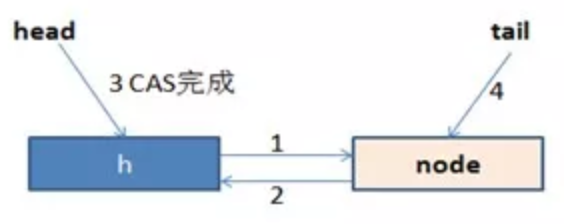
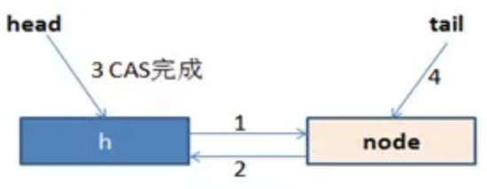
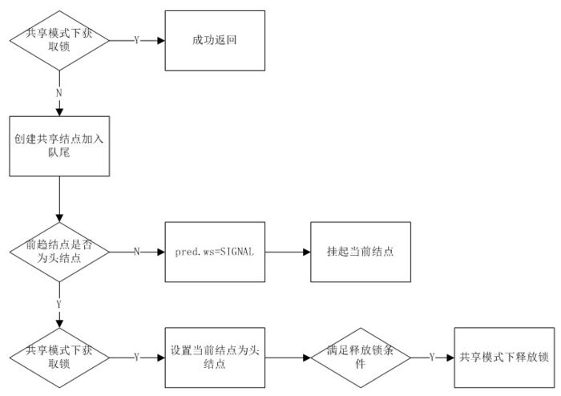
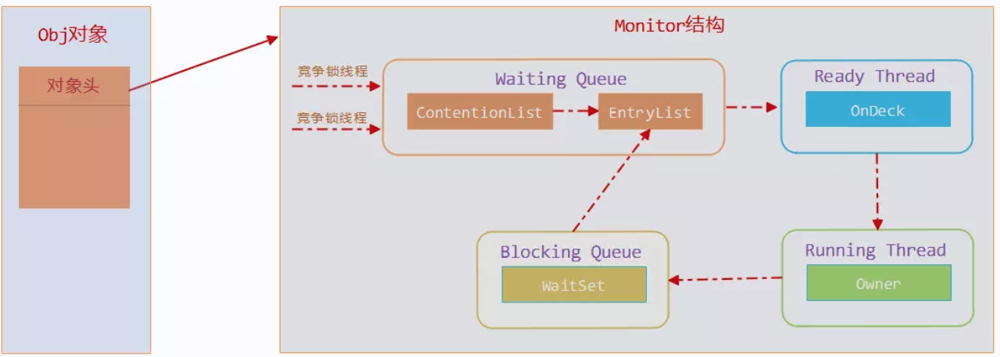
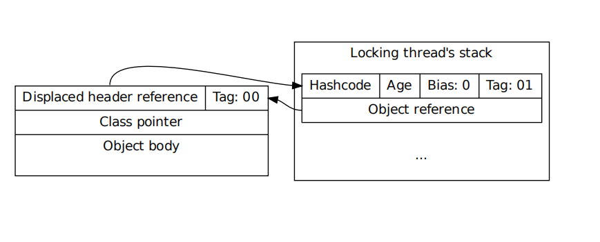
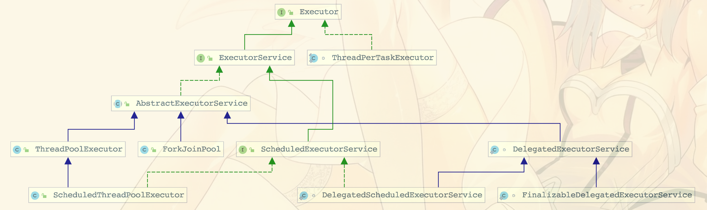
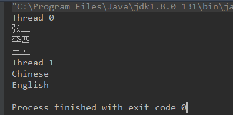
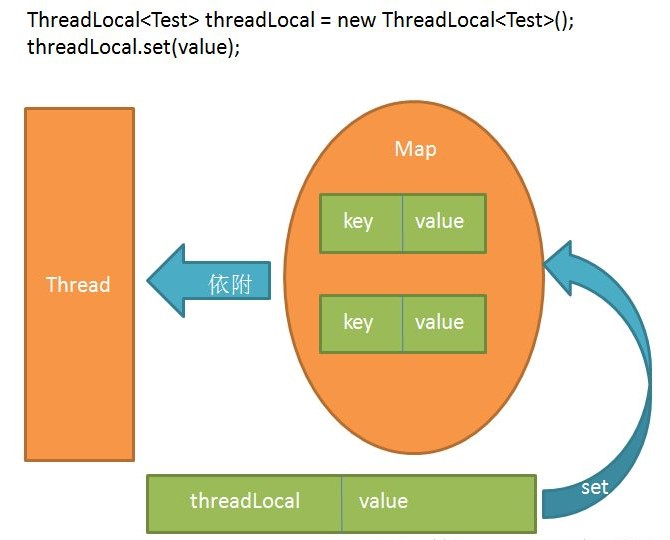

## 线程和进程的区别？

1 线程和进程

进程是程序的一次动态执行过程，它需要经历从代码加载，代码执行到执行完毕的一个完整的过程，这个过程也是进程本身从产生，发展到最终消亡的过程。多进程操作系统能同时达运行多个进程（程序），由于CPU具备分时机制，所以每个进程都能循环获得自己的CPU时间片。由于CPU执行速度非常快，使得所有程序好像是在同时运行一样。

多线程是实现并发机制的一种有效手段。进程和线程一样，都是实现并发的一个基本单位。线程是比进程更小的执行单位，线程是进程的基础之上进行进一步的划分。所谓多线程是指一个进程在执行过程中可以产生多个更小的程序单元，这些更小的单元称为线程，这些线程可以同时存在，同时运行，一个进程可能包含多个同时执行的线程。进程与线程的区别如图所示：


## 开启线程的三种方式？

### 实现Runnable接口

```
static class MyThread implements Runnable {

    private String name;

    public MyThread(String name) {
      this.name = name;
    }

    @Override
    public void run() {
      for (int i = 0; i < 10; i++) {
        System.out.println(name + "运行，i = " + i);
      }
    }
  }

  public static void main(String[] args) {
    MyThread thread1 = new MyThread("线程A");
    MyThread thread2 = new MyThread("线程B");

    Thread t1 = new Thread(thread1);
    Thread t2 = new Thread(thread2);
    t1.start();
    t2.start();
  }
```

结果：

```
线程A运行，i = 0
线程B运行，i = 0
线程A运行，i = 1
线程B运行，i = 1
线程A运行，i = 2
线程A运行，i = 3
线程A运行，i = 4
线程B运行，i = 2
线程A运行，i = 5
线程A运行，i = 6
线程B运行，i = 3
线程B运行，i = 4
线程A运行，i = 7
线程B运行，i = 5
线程B运行，i = 6
线程B运行，i = 7
线程B运行，i = 8
线程A运行，i = 8
线程B运行，i = 9
线程A运行，i = 9
```

### 继承Thread类

```
private static class MyThread extends Thread {
    private String name;

    public MyThread(String name) {
      this.name = name;
    }

    @Override
    public void run() {
      for (int i = 0; i < 10; i++) {
        System.out.println(name + "运行，i = " + i);
      }
    }
  }

  public static void main(String[] args) {
      MyThread t1 = new MyThread("线程A");
      MyThread t2 = new MyThread("线程B");
      t1.start();
      t2.start();
  }
```

结果：

```
线程A运行，i = 0
线程B运行，i = 0
线程A运行，i = 1
线程B运行，i = 1
线程B运行，i = 2
线程B运行，i = 3
线程A运行，i = 2
线程B运行，i = 4
线程A运行，i = 3
线程A运行，i = 4
线程A运行，i = 5
线程A运行，i = 6
线程A运行，i = 7
线程A运行，i = 8
线程A运行，i = 9
线程B运行，i = 5
线程B运行，i = 6
线程B运行，i = 7
线程B运行，i = 8
线程B运行，i = 9
```

### 实现Callable接口

```
private static class MyThread implements Callable {

    private String name;

    public MyThread(String name) {
      this.name = name;
    }

    @Override
    public Object call() throws Exception {
      for (int i = 0; i < 10; i++) {
        System.out.println(name + "运行，i = " + i);
      }
      return null;
    }
  }

  public static void main(String[] args) {
    Callable c1 = new MyThread("线程A");
    Callable c2 = new MyThread("线程B");
    FutureTask f1 = new FutureTask(c1);
    Thread t1 = new Thread(f1);
    t1.start();
    FutureTask f2 = new FutureTask(c2);
    Thread t2 = new Thread(f2);
    t2.start();
  }
```

结果：

```
线程A运行，i = 0
线程A运行，i = 1
线程A运行，i = 2
线程A运行，i = 3
线程A运行，i = 4
线程A运行，i = 5
线程A运行，i = 6
线程B运行，i = 0
线程B运行，i = 1
线程B运行，i = 2
线程B运行，i = 3
线程B运行，i = 4
线程B运行，i = 5
线程B运行，i = 6
线程B运行，i = 7
线程B运行，i = 8
线程A运行，i = 7
线程A运行，i = 8
线程A运行，i = 9
线程B运行，i = 9
```

1 源码浅析：

* Runnable接口和FutureTask类的关系

```
public class FutureTask<V> implements RunnableFuture<V> {}


public interface RunnableFuture<V> extends Runnable, Future<V> {
    void run();
}
```

FutureTask类是Runnable接口的继承接口的实现类

* FutureTask的有参构造

```
public FutureTask(Callable<V> callable) {
    if (callable == null)
        throw new NullPointerException();
    this.callable = callable;
    this.state = NEW;
}
```

把一个callable对象传给了FutureTask对象

* run方法

当Thread执行start()方法时，就是执行FutureTask的run()方法然后调用call方法

```
public void run() {
    if (state != NEW ||
        !UNSAFE.compareAndSwapObject(this, runnerOffset,
                                     null, Thread.currentThread()))
        return;
    try {
        Callable<V> c = callable;
        if (c != null && state == NEW) {
            V result;
            boolean ran;
            try {
                result = c.call();
                ran = true;
            } catch (Throwable ex) {
                result = null;
                ran = false;
                setException(ex);
            }
            if (ran)
                set(result);
        }
    } finally {
        // runner must be non-null until state is settled to
        // prevent concurrent calls to run()
        runner = null;
        // state must be re-read after nulling runner to prevent
        // leaked interrupts
        int s = state;
        if (s >= INTERRUPTING)
            handlePossibleCancellationInterrupt(s);
    }
}
```

### Thread类与Runnable接口

1 

```
public class Thread extends Object implements Runnable
```

从Thread类的定义可以清楚的发现，Thread类也是Runnable接口的子类，但在Thread类中并没有完全实现Runnable接口中的run()方法，下面是Thread类的部分定义。

```
Private Runnable target；
public Thread(Runnable target,String name){
init(null,target,name,0);
}
private void init(ThreadGroup g,Runnable target,String name,long stackSize){
...
this.target=target;
  }
public void run(){
if(target!=null){
target.run();
  }
}
```

从定义中可以发现，在Thread类中的run（）方法调用的是Runnable接口中的run()方法，也就是说此方法是由Runnable子类完成的，所以如果要通过继承Thread类实现多线程，则必须覆写run()。

实际上Thread类和Runnable接口之间在使用上也是有区别的，如果一个类继承Thread类，则不适合于多个线程共享资源，而实现了Runnable接口，就可以方便的实现资源的共享。

* 继承Thread类不能资源共享

```
class MyThread extends Thread{
	private int ticket=5;
	public void run(){
		for(int i=0;i<100;i++){
			if(ticket>0){
			System.out.println(Thread.currentThread().getName()+"卖票：ticket"+ticket--);
			}
		}
	}
}
 
public class ThreadDemo{
	public static void main(String args[]){
		MyThread mt1=new MyThread();
		MyThread mt2=new MyThread();
		MyThread mt3=new MyThread();
		mt1.start();
		mt2.start();
		mt3.start();
	}
}
```

结果：

```
Thread-1卖票：ticket5
Thread-1卖票：ticket4
Thread-1卖票：ticket3
Thread-1卖票：ticket2
Thread-1卖票：ticket1
Thread-2卖票：ticket5
Thread-0卖票：ticket5
Thread-2卖票：ticket4
Thread-2卖票：ticket3
Thread-2卖票：ticket2
Thread-2卖票：ticket1
Thread-0卖票：ticket4
Thread-0卖票：ticket3
Thread-0卖票：ticket2
Thread-0卖票：ticket1
```

以上程序通过继承Thread类实现了多线程，程序中启动了3个线程，但是3个线程却各自卖出了5张票，而不是一共卖出5张票达到资源共享的目的。

* 实现Runnable接口可以实现资源共享

```
private static class MyThread implements Runnable {
    private int ticket = 10;

    @Override
    public void run() {
      for (int i = 0; i < 100; i++) {
        if (ticket > 0) {
          System.out.println(Thread.currentThread().getName() + "买票：ticket=" + ticket--);
        }
      }
    }
  }

  public static void main(String[] args) {

    MyThread thread = new MyThread();

    Thread t1 = new Thread(thread, "t1");
    t1.start();
    Thread t2 = new Thread(thread, "t2");
    t2.start();
    Thread t3 = new Thread(thread, "t3");
    t3.start();
  }
```

结果：

```
t1买票：ticket=10
t2买票：ticket=9
t3买票：ticket=8
t2买票：ticket=6
t1买票：ticket=7
t2买票：ticket=4
t3买票：ticket=5
t3买票：ticket=1
t2买票：ticket=2
t1买票：ticket=3
```

从程序的运行结果可以清楚的发现，虽然以上程序启动了3个线程，3个线程一共才卖出10票，即ticket的属性被所有的线程对象共享。

实现Runnable接口相对于继承Thread类来说，有如下优势：

(1)适合相同程序的多个线程去处理同一资源的情况。

(2)可以避免由于Java的单继承特性带来的局限。

(3)增强了程序的健壮性，代码能够被多个线程共享，代码与数据是独立的。


### 线程的状态

> 要想实现多线程，必须在主线程中创建新的线程对象。任何线程一般具有5种状态，即创建，就绪，运行，阻塞，终止。下面分别介绍一下这几种状态：

* 创建状态 

在程序中用构造方法创建了一个线程对象后，新的线程对象便处于新建状态，此时它已经有了相应的内存空间和其他资源，但还处于不可运行状态。新建一个线程对象可采用Thread类的构造方法来实现，例如“Thread thread=new Thread()”。

* 就绪状态 

新建线程对象后，调用该线程的start()方法就可以启动线程。当线程启动时，线程进入就绪状态。此时，线程将进入线程队列排队，等待CPU服务，这表明它已经具备了运行条件。

* 运行状态 

当就绪状态被调用并获得处理器资源时，线程就进入了运行状态。此时，自动调用该线程对象的run()方法。run()方法定义该线程的操作和功能。

* 阻塞状态 

一个正在执行的线程在某些特殊情况下，如被人为挂起或需要执行耗时的输入/输出操作，会让CPU暂时中止自己的执行，进入阻塞状态。在可执行状态下，如果调用sleep(),suspend(),wait()等方法，线程都将进入阻塞状态，发生阻塞时线程不能进入排队队列，只有当引起阻塞的原因被消除后，线程才可以转入就绪状态。

* 死亡状态 

线程调用stop()方法时或run()方法执行结束后，即处于死亡状态。处于死亡状态的线程不具有继续运行的能力

Java程序每次运行至少启动几个线程？

> 至少启动两个线程，每当使用Java命令执行一个类时，实际上都会启动一个JVM，每一个JVM实际上就是在操作系统中启动一个线程，Java本身具备了垃圾的收集机制。所以在Java运行时至少会启动两个线程，一个是main线程，另外一个是垃圾收集线程。


### 线程的强制运行

> 在线程操作中，可以使用join()方法让一个线程强制运行，线程强制运行期间，其他线程无法运行，必须等待此线程完成之后才可以继续执行。

```
public class MyThread implements Runnable {

    @Override
    public void run() {
      for (int i = 0; i < 20; i++) {
        System.out.println(Thread.currentThread().getName() + "运行，i = " + i);
      }
    }
  }

  @Test
  public void test() {
    MyThread thread = new MyThread();
    Thread t = new Thread(thread, "线程");
    t.start();

    for (int i = 0; i < 20; i++) {
      if (i > 5) {
        try {
          t.join(); // 线程强制运行
        } catch (InterruptedException e) {
        }
      }
      System.out.println("Main线程运行 --> " + i);
    }
  }
```

结果：

```
Main线程运行 --> 0
Main线程运行 --> 1
Main线程运行 --> 2
线程运行，i = 0
线程运行，i = 1
线程运行，i = 2
线程运行，i = 3
线程运行，i = 4
Main线程运行 --> 3
Main线程运行 --> 4
Main线程运行 --> 5
线程运行，i = 5
线程运行，i = 6
线程运行，i = 7
线程运行，i = 8
线程运行，i = 9
线程运行，i = 10
线程运行，i = 11
线程运行，i = 12
线程运行，i = 13
线程运行，i = 14
线程运行，i = 15
线程运行，i = 16
线程运行，i = 17
线程运行，i = 18
线程运行，i = 19
Main线程运行 --> 6
Main线程运行 --> 7
Main线程运行 --> 8
Main线程运行 --> 9
Main线程运行 --> 10
Main线程运行 --> 11
Main线程运行 --> 12
Main线程运行 --> 13
Main线程运行 --> 14
Main线程运行 --> 15
Main线程运行 --> 16
Main线程运行 --> 17
Main线程运行 --> 18
Main线程运行 --> 19
```

### 线程的休眠

> 在程序中允许一个线程进行暂时的休眠，直接使用Thread.sleep()即可实现休眠。

```
static class MyThread implements Runnable { // 实现Runnable接口
    public void run() { // 覆写run()方法
      for (int i = 0; i < 20; i++) {
        try {
          Thread.sleep(500); // 线程休眠
        } catch (InterruptedException e) {
        }
        System.out.println(Thread.currentThread().getName() + "运行，i = " + i); // 取得当前线程的名字
      }
    }
  };

  public static void main(String args[]) {
    MyThread mt = new MyThread(); // 实例化Runnable子类对象
    Thread t = new Thread(mt, "线程"); // 实例化Thread对象
    t.start(); // 启动线程
  }
```

结果：(一定要亲自运行来感受线程睡眠)

```
线程运行，i = 0
线程运行，i = 1
线程运行，i = 2
线程运行，i = 3
线程运行，i = 4
线程运行，i = 5
线程运行，i = 6
线程运行，i = 7
线程运行，i = 8
线程运行，i = 9
线程运行，i = 10
线程运行，i = 11
线程运行，i = 12
线程运行，i = 13
线程运行，i = 14
线程运行，i = 15
线程运行，i = 16
线程运行，i = 17
线程运行，i = 18
线程运行，i = 19
```

1. sleep()和wait()区别

* sleep方法是Thread类的静态方法,wait()是Object超类的成员方法
* sleep()方法导致了程序暂停执行到指定的时间，让出cpu给其他线程，但是他的监控状态依然保持者，当指定的时间到了又会自动恢复运行状态。在调用sleep()方法的过程中，线程不会释放对象锁。
* wait()方法的时候，线程会放弃对象锁，进入对象的等待池（wait pool），只有调用对象的notify()方法（或notifyAll()方法）时才能唤醒等待池中的线程进入等锁池（lockpool），如果线程重新获得对象的锁就可以进入就绪状态
* sleep方法可以在任何地方使用,wait方法只能在同步方法和同步代码块中使用

java线程生命周期图谱如下所示:


sleep方法是单线程的,没有释放锁,而wait方法释放锁,所以sleep时间到和wait等到notify之后享受的待遇一样,都是回到就绪状态,等待系统分配cpu

使用场景

sleep 一般用于当前线程休眠，或者轮循暂停操作，wait 则多用于多线程之间的通信。

#### 中断线程

1 使用退出标识，使得线程正常退出，即当run方法完成后线程终止。

```
public void run() {
    while(flag){
        //do something
    }
}
```
利用标识符flag判定线程是否继续执行。

```
public User user = new User();

  // 改变user变量的线程
  public class ChangeObjectThread extends Thread {

    // 用于停止线程
    private boolean stopMe = true;

    public void stopMe() {
      stopMe = false;
    }

    @Override
    public void run() {

      while (stopMe) {
        synchronized (ThreadFlagUnSafe.class) {
          int v = (int) (System.currentTimeMillis() / 1000);
          user.setId(v);
          // to do sth
          try {
            Thread.sleep(100);
          } catch (InterruptedException e) {
            e.printStackTrace();
          }
          user.setName(String.valueOf(v));
        }
        // 让出CPU，给其他线程执行
        Thread.yield();
      }

    }
  }

  public class ReadObjectThread extends Thread {
    @Override
    public void run() {
      while (true) {
        synchronized (ThreadFlagUnSafe.class) {
          System.out.println(user.toString());
          // 让出CPU，给其他线程执行
          Thread.yield();
        }
      }
    }
  }

  @Test
  public void test() throws InterruptedException {
    new ReadObjectThread().start();

    while (true) {
      ChangeObjectThread thread = new ChangeObjectThread();
      thread.start();
      Thread.sleep(150);
      // 使用stop()方法，强制停止线程
      thread.stopMe();
    }
  }
```

结果：

```
User{id=0, name='0'}
User{id=0, name='0'}
User{id=1566291131, name='1566291131'}
User{id=1566291131, name='1566291131'}
User{id=1566291131, name='1566291131'}
User{id=1566291131, name='1566291131'}
User{id=1566291132, name='1566291132'}
...
```


2 使用Java中API自带的stop()方法，来终止线程

stop()方法是一个被废弃的方法。为什么stop()方法被废弃而不被使用呢？原因是stop()方法太过于暴力，会强行把执行一半的线程终止。可能使一些清理性的工作得不到完成。还可能对锁定的内容进行解锁，容易造成数据不同步的问题。

```
public User user = new User();

  // 改变user变量的线程
  public class ChangeObjectThread extends Thread {

    @Override
    public void run() {

      while (true) {
        synchronized (ThreadStopUnSafe.class) {
          int v = (int) (System.currentTimeMillis() / 1000);
          user.setId(v);
          // to do sth
          try {
            Thread.sleep(100);
          } catch (InterruptedException e) {
            e.printStackTrace();
          }
          user.setName(String.valueOf(v));
        }
        // 让出CPU，给其他线程执行
        Thread.yield();
      }
    }
  }

  // 读取user变量的线程
  public class ReadObjectThread extends Thread {
    @Override
    public void run() {
      while (true) {
        synchronized (ThreadStopUnSafe.class) {
          if (user.getId() != Integer.parseInt(user.getName())) {
            System.out.println(user.toString());
          }
          // 让出CPU，给其他线程执行
          Thread.yield();
        }
      }
    }
  }

  @Test
  public void test() throws InterruptedException {
    new ReadObjectThread().start();
    while (true) {
      Thread thread = new ChangeObjectThread();
      thread.start();
      Thread.sleep(150);
      // 使用stop()方法，强制停止线程
      thread.stop();
    }
  }
```

结果：

```
User{id=1566290239, name='1566290238'}
User{id=1566290241, name='1566290240'}
...
```

代码中因为使用了stop()强行停止线程，造成了数据的不同步。

3 使用interrupt方法中断线程

线程通过检查自身是否被中断来进行响应，线程通过方法isInterrupted()来进行判断是否被中断，也可以调用静态方法Thread.interrupted()对当前线程的中断标识位进行复位。如果该线程已经处于终结状态，即使该线程被中断过，在调用该线程对象的isInterrupted()时依旧会返回false。

从Java的API中可以看到，许多声明抛出InterruptedException的方法（例如Thread.sleep(longmillis)方法，当线程在sleep()休眠时，如果被中断，这个异常就会产生）。这些方法在抛出InterruptedException之前，Java虚拟机会先将该线程的中断标识位清除，然后抛出InterruptedException，此时调用isInterrupted()方法将会返回false。

```
static class SleepRunner implements Runnable {
    @Override
    public void run() {
      while (true) {
        try {
          TimeUnit.SECONDS.sleep(10);
        } catch (InterruptedException e) {
          // e.printStackTrace();
        }
      }
    }
  }

  static class BusyRunner implements Runnable {
    @Override
    public void run() {
      while (true) {}
    }
  }

  public static void main(String[] args) throws InterruptedException {
    // sleepThread不停的尝试睡眠
    Thread sleepThread = new Thread(new SleepRunner(), "SleepThread");
    sleepThread.setDaemon(true);
    // busyThread不停的运行
    Thread busyThread = new Thread(new BusyRunner(), "BusyThread");
    busyThread.setDaemon(true);
    sleepThread.start();
    busyThread.start();
    // 休眠5秒，让sleepThread和busyThread充分运行
    TimeUnit.SECONDS.sleep(5);
    sleepThread.interrupt();
    busyThread.interrupt();
    System.out.println("SleepThread interrupted is " + sleepThread.isInterrupted());
    System.out.println("BusyThread interrupted is " + busyThread.isInterrupted());
    // 防止sleepThread和busyThread立刻退出
    TimeUnit.SECONDS.sleep(2);
  }
```

结果：

```
SleepThread interrupted is false
BusyThread interrupted is true
```

从结果可以看出，抛出InterruptedException的线程SleepThread，其中断标识位被清除了，而一直忙碌运作的线程BusyThread，中断标识位没有被清除。

this.interrupted():测试当前线程是否已经中断（静态方法）。如果连续调用该方法，则第二次调用将返回false。在api文档中说明interrupted()方法具有清除状态的功能。执行后具有将状态标识清除为false的功能。

this.isInterrupted():测试线程是否已经中断，但是不能清除状态标识。

使用中断来终止线程

```
public static void main(String[] args) {
    Thread thread =
        new Thread(
            () -> {
              while (true) {
                // 使用中断机制，来终止线程
                if (Thread.currentThread().isInterrupted()) {
                  System.out.println("Interrupted ...");
                  break;
                }
                try {
                  Thread.sleep(3000);
                } catch (InterruptedException e) {
                  System.out.println("Interrupted When Sleep ...");
                  // Thread.sleep()方法由于中断抛出异常。
                  // Java虚拟机会先将该线程的中断标识位清除，然后抛出InterruptedException，
                  // 因为在发生InterruptedException异常的时候，会清除中断标记
                  // 如果不加处理，那么下一次循环开始的时候，就无法捕获这个异常。
                  // 故在异常处理中，再次设置中断标记位
                  Thread.currentThread().interrupt();
                }
              }
            });
    thread.start();
    try {
      System.out.println(System.currentTimeMillis() / 1000);
      Thread.sleep(2000);
      System.out.println(System.currentTimeMillis() / 1000);
    } catch (InterruptedException e) {
      e.printStackTrace();
    }
    thread.interrupt();
  }
```

结果：

```
1566293185
1566293187
Interrupted When Sleep ...
Interrupted ...
```

### 守护线程/服务线程/后台线程

java中线程分为两种类型：用户线程和守护线程。

* 通过Thread.setDaemon(false)设置为用户线程；
* 通过Thread.setDaemon(true)设置为守护线程。 
* 如果不设置，默认为用户线程。

定义：守护线程--也称“服务线程”，在没有用户线程可服务时会自动离开。优先级：守护线程的优先级比较低，用于为系统中的其它对象和线程提供服务。

设置：通过setDaemon(true)来设置线程为“守护线程”；将一个用户线程设置为守护线程的方式是在 线程对象创建 之前 用线程对象的setDaemon方法。

eg: 垃圾回收线程就是一个经典的守护线程，当我们的程序中不再有任何运行的Thread,程序就不会再产生垃圾，垃圾回收器也就无事可做，所以当垃圾回收线程是JVM上仅剩的线程时，垃圾回收线程会自动离开。它始终在低级别的状态中运行，用于实时监控和管理系统中的可回收资源。

生命周期：守护进程（Daemon）是运行在后台的一种特殊进程。它独立于控制终端并且周期性地执行某种任务或等待处理某些发生的事件。也就是说守护线程不依赖于终端，但是依赖于系统，与系统“同生共死”。那Java的守护线程是什么样子的呢。当JVM中所有的线程都是守护线程的时候，JVM就可以退出了；如果还有一个或以上的非守护线程则JVM不会退出。

```
thread = new Thread(this);

thread.setDaemon(true);

thread.start();
```

当java虚拟机中没有非守护线程在运行的时候，java虚拟机会关闭。当所有常规线程运行完毕以后，守护线程不管运行到哪里，虚拟机都会退出运行。所以你的守护线程最好不要写一些会影响程序的业务逻辑。否则无法预料程序到底 会出现什么问题。

总结：

* 守护线程在没有用户线程可服务时自动离开
* 在Java中比较特殊的线程是被称为守护（Daemon）线程的低级别线程。这个线程具有最低的优先级，用于为系统中的其它对象和线程提供服务。
* 将一个用户线程设置为守护线程的方式是在线程对象创建之前调用线程对象的setDaemon方法。
* 典型的守护线程例子是JVM中的系统资源自动回收线程，当我们的程序中不再有任何运行中的Thread，程序就不会再产生垃圾，垃圾回收器也就无事可做，所以当垃圾回收线程是Java虚拟机上仅剩的线程时，Java虚拟机会自动离开。它始终在低级别的状态中运行，用于实时监控和管理系统中的可回收资源。
* 守护进程（Daemon）是运行在后台的一种特殊进程。它独立于控制终端并且周期性地执行某种任务或等待处理某些发生的事件。也就是说守护线程不依赖于终端，但是依赖于系统，与系统“同生共死”。那Java的守护线程是什么样子的呢。当JVM中所有的线程都是守护线程的时候，JVM就可以退出了；如果还有一个或以上的非守护线程则JVM不会退出。

用户线程和守护线程的区别： 
1. 主线程结束后用户线程还会继续运行,JVM存活； 
2.主线程结束后守护线程和JVM的状态如果没有用户线程，都是守护线程，那么JVM结束（随之而来的是所有的一切烟消云散，包括所有的守护线程）；

### 线程的优先级

> 在Java的线程操作中，所有的线程在运行前都会保持在就绪状态，那么此时，哪个线程的优先级高，哪个线程就有可能会先被执行。

```
public static class MyThread implements Runnable {

    @Override
    public void run() {

      for (int i = 0; i < 5; i++) {
        try {
          Thread.sleep(500); // 线程休眠
        } catch (InterruptedException e) {
        }
        System.out.println(Thread.currentThread().getName() + "运行，i = " + i); // 取得当前线程的名字
      }
    }
  }

  public static void main(String[] args) {
      
    Thread t1 = new Thread(new MyThread(), "线程A"); // 实例化线程对象
    Thread t2 = new Thread(new MyThread(), "线程B"); // 实例化线程对象
    Thread t3 = new Thread(new MyThread(), "线程C"); // 实例化线程对象
    t1.setPriority(Thread.MIN_PRIORITY); // 优先级最低
    t2.setPriority(Thread.MAX_PRIORITY); // 优先级最高
    t3.setPriority(Thread.NORM_PRIORITY); // 优先级最中等
    t1.start(); // 启动线程
    t2.start(); // 启动线程
    t3.start(); // 启动线程
  }
```

结果：

```
线程B运行，i = 0
线程C运行，i = 0
线程A运行，i = 0
线程A运行，i = 1
线程C运行，i = 1
线程B运行，i = 1
线程C运行，i = 2
线程B运行，i = 2
线程A运行，i = 2
线程B运行，i = 3
线程A运行，i = 3
线程C运行，i = 3
线程B运行，i = 4
线程C运行，i = 4
线程A运行，i = 4
```

> 从程序的运行结果中可以观察到，线程将根据其优先级的大小来决定哪个线程会先运行，但是需要注意并非优先级越高就一定会先执行，哪个线程先执行将由CPU的调度决定。

### 线程的礼让

> 在线程操作中，也可以使用yield()方法将一个线程的操作暂时让给其他线程执行

```
static class MyThread implements Runnable {

    @Override
    public void run() {
      for (int i = 0; i < 5; i++) {
        try {
          Thread.sleep(500);
        } catch (Exception e) {
        }
        System.out.println(Thread.currentThread().getName() + "运行，i = " + i); // 取得当前线程的名字
        if (i == 2) {
          System.out.print("线程礼让：");
          Thread.currentThread().yield(); // 线程礼让
        }
      }
    }
  }

  public static void main(String[] args) {
    MyThread my = new MyThread(); // 实例化MyThread对象
    Thread t1 = new Thread(my, "线程A");
    Thread t2 = new Thread(my, "线程B");
    t1.start();
    t2.start();
  }
```

结果：

```
线程B运行，i = 0
线程A运行，i = 0
线程A运行，i = 1
线程B运行，i = 1
线程A运行，i = 2
线程礼让：线程B运行，i = 2
线程礼让：线程B运行，i = 3
线程A运行，i = 3
线程B运行，i = 4
线程A运行，i = 4
```

```
线程A运行，i = 0
线程B运行，i = 0
线程A运行，i = 1
线程B运行，i = 1
线程A运行，i = 2
线程B运行，i = 2
线程礼让：线程礼让：线程A运行，i = 3
线程B运行，i = 3
线程A运行，i = 4
线程B运行，i = 4
```

sleep()方法和yield()方法有区别

1. sleep()方法给其他线程运行机会时不考虑线程的优先级，因此会给低优先级的线程以运行的机会；yield()方法只会给相同优先级或更高优先级的线程以运行的机会,但是它并不能保证在当前线程调用yield()之后，其它具有相同优先级的线程就一定能获得执行权；也有可能是当前线程又进入到“运行状态”继续运行;
2. 线程执行sleep()方法后转入阻塞（blocked）状态，而执行yield()方法后转入就绪（ready）状态;
3. sleep()方法声明抛出InterruptedException，而yield()方法没有声明任何异常; 
4. sleep()方法比yield()方法（跟操作系统CPU调度相关）具有更好的可移植性.

### 同步与死锁

> 一个多线程的程序如果是通过Runnable接口实现的，则意味着类中的属性被多个线程共享，那么这样就会造成一种问题，如果这多个线程要操作同一个资源时就有可能出现资源同步问题。

解决方法：

* 同步代码块

```
synchronized(同步对象)｛
 需要同步的代码
｝
```

* 同步方法

```
synchronized 方法返回值 方法名称（参数列表）｛

｝
```

死锁

> 同步可以保证资源共享操作的正确性，但是过多同步也会产生问题。例如，现在张三想要李四的画，李四想要张三的书，张三对李四说“把你的画给我，我就给你书”，李四也对张三说“把你的书给我，我就给你画”两个人互相等对方先行动，就这么干等没有结果，这实际上就是死锁的概念。

> 所谓死锁，就是两个线程都在等待对方先完成，造成程序的停滞，一般程序的死锁都是在程序运行时出现的。

## Java中的锁分类

###  分类

1. 公平锁/非公平锁
2. 可重入锁
3. 独占锁/共享锁
4. 互斥锁/读写锁
5. 乐观锁/悲观锁
6. 分段锁
7. 偏向锁/轻量级锁/重量级锁
8. 自旋锁

###  公平锁/非公平锁

1. 公平锁是指多个线程按照申请锁的顺序来获取锁。
2. 非公平锁是指多个线程获取锁的顺序并不是按照申请锁的顺序，有可能后申请的线程比先申请的线程优先获取锁。有可能，会造成优先级反转或者饥饿现象。
3. 对于Java ReentrantLock而言，通过构造函数指定该锁是否是公平锁，默认是非公平锁。非公平锁的优点在于吞吐量比公平锁大。
4. 对于Synchronized而言，也是一种非公平锁。由于其并不像ReentrantLock是通过AQS的来实现线程调度，所以并没有任何办法使其变成公平锁。

### 可重入锁

* 可重入锁又名递归锁，是指在同一个线程在外层方法获取锁的时候，在进入内层方法会自动获取锁。说的有点抽象，下面会有一个代码的示例。
* 对于Java ReentrantLock而言, 他的名字就可以看出是一个可重入锁，其名字是Re entrant Lock重新进入锁。
* 对于Synchronized而言,也是一个可重入锁。可重入锁的一个好处是可一定程度避免死锁。

```
synchronized void setA() throws Exception{
    Thread.sleep(1000);
    setB();
}

synchronized void setB() throws Exception{
    Thread.sleep(1000);

```

上面的代码就是一个可重入锁的一个特点，如果不是可重入锁的话，setB可能不会被当前线程执行，可能造成死锁。

### 排他锁(又称为写锁、独占锁，是一种基本的锁类型)/共享锁

1. 排他锁是指该锁一次只能被一个线程所持有。
2. 共享锁是指该锁可被多个线程所持有。
3. 对于Java ReentrantLock而言，其是排他锁。但是对于Lock的另一个实现类ReadWriteLock，其读锁是共享锁，其写锁是排他锁。
4. 读锁的共享锁可保证并发读是非常高效的，读写，写读 ，写写的过程是互斥的。
5. 排他锁与共享锁也是通过AQS来实现的，通过实现不同的方法，来实现独占或者共享。
6. 对于Synchronized而言，当然是排他锁。

### 互斥锁/读写锁

1. 上面讲的独享锁/共享锁就是一种广义的说法，互斥锁/读写锁就是具体的实现。
2. 互斥锁在Java中的具体实现就是ReentrantLock
3. 读写锁在Java中的具体实现就是ReadWriteLock

### 乐观锁/悲观锁

1. 乐观锁与悲观锁不是指具体的什么类型的锁，而是指看待并发同步的角度。
2. 悲观锁认为对于同一个数据的并发操作，一定是会发生修改的，哪怕没有修改，也会认为修改。因此对于同一个数据的并发操作，悲观锁采取加锁的形式。悲观的认为，不加锁的并发操作一定会出问题。
3. 乐观锁则认为对于同一个数据的并发操作，是不会发生修改的。在更新数据的时候，会采用尝试更新，不断重新的方式更新数据。乐观的认为，不加锁的并发操作是没有事情的。

从上面的描述我们可以看出，悲观锁适合写操作非常多的场景，乐观锁适合读操作非常多的场景，不加锁会带来大量的性能提升。
悲观锁在Java中的使用，就是利用各种锁。
乐观锁在Java中的使用，是无锁编程，常常采用的是CAS算法，典型的例子就是原子类，通过CAS自旋实现原子操作的更新。

### 分段锁

分段锁其实是一种锁的设计，并不是具体的一种锁，对于ConcurrentHashMap而言，其并发的实现就是通过分段锁的形式来实现高效的并发操作。
我们以ConcurrentHashMap来说一下分段锁的含义以及设计思想，ConcurrentHashMap中的分段锁称为Segment，它即类似于HashMap（JDK7与JDK8中HashMap的实现）的结构，即内部拥有一个Entry数组，数组中的每个元素又是一个链表；同时又是一个ReentrantLock（Segment继承了ReentrantLock)。
当需要put元素的时候，并不是对整个hashmap进行加锁，而是先通过hashcode来知道他要放在那一个分段中，然后对这个分段进行加锁，所以当多线程put的时候，只要不是放在一个分段中，就实现了真正的并行的插入。
但是，在统计size的时候，可就是获取hashmap全局信息的时候，就需要获取所有的分段锁才能统计。
分段锁的设计目的是细化锁的粒度，当操作不需要更新整个数组的时候，就仅仅针对数组中的一项进行加锁操作。

### 偏向锁/轻量级锁/重量级锁

这三种锁是指锁的状态，并且是针对Synchronized。在Java 5通过引入锁升级的机制来实现高效Synchronized。这三种锁的状态是通过对象监视器在对象头中的字段来表明的。

1. 偏向锁是指一段同步代码一直被一个线程所访问，那么该线程会自动获取锁。降低获取锁的代价。
2. 轻量级锁是指当锁是偏向锁的时候，被另一个线程所访问，偏向锁就会升级为轻量级锁，其他线程会通过自旋的形式尝试获取锁，不会阻塞，提高性能。
3. 重量级锁是指当锁为轻量级锁的时候，另一个线程虽然是自旋，但自旋不会一直持续下去，当自旋一定次数的时候，还没有获取到锁，就会进入阻塞，该锁膨胀为重量级锁。重量级锁会让其他申请的线程进入阻塞，性能降低。

重量级锁：我们知道，我们要进入一个同步、线程安全的方法时，是需要先获得这个方法的锁的，退出这个方法时，则会释放锁。如果获取不到这个锁的话，意味着有别的线程在执行这个方法，这时我们就会马上进入阻塞的状态，等待那个持有锁的线程释放锁，然后再把我们从阻塞的状态唤醒，我们再去获取这个方法的锁。
这种获取不到锁就马上进入阻塞状态的锁，我们称之为重量级锁。

轻量级锁：重量级、自旋锁和自适应自旋锁，他们都有一个特点，就是进入一个方法的时候，就会加上锁，退出一个方法的时候，也就释放对应的锁。
之所以要加锁，是因为他们害怕自己在这个方法执行的时候，被别人偷偷进来了，所以只能加锁，防止其他线程进来。这就相当于，每次离开自己的房间，都要锁上门，人回来了再把锁解开。
这实在是太麻烦了，如果根本就没有线程来和他们竞争锁，那他们不是白白上锁了？要知道，加锁这个过程是需要操作系统来帮忙的，是很消耗时间的。为了解决这种动不动就加锁带来的开销，轻量级锁出现了。
轻量级锁认为，当你在方法里面执行的时候，其实是很少刚好有人也来执行这个方法的，所以，当我们进入一个方法的时候根本就不用加锁，我们只需要做一个标记就可以了，也就是说，我们可以用一个变量来记录此时该方法是否有人在执行。也就是说，如果这个方法没人在执行，当我们进入这个方法的时候，采用CAS机制，把这个方法的状态标记为已经有人在执行，退出这个方法时，在把这个状态改为了没有人在执行了。
显然，比起加锁操作，这个采用CAS来改变状态的操作，花销就小多了。
然而可能会说，没人来竞争的这种想法，那是你说的而已，那如果万一有人来竞争说呢？也就是说，当一个线程来执行一个方法的时候，方法里面已经有人在执行了。
如果真的遇到了竞争，我们就会认为轻量级锁已经不适合了，我们就会把轻量级锁升级为重量级锁了。
所以轻量级锁适合用在那种，很少出现多个线程竞争一个锁的情况，也就是说，适合那种多个线程总是错开时间来获取锁的情况。

偏向锁：偏向锁认为，其实对于一个方法，是很少有两个线程来执行的，搞来搞去，其实也就一个线程在执行这个方法而已，相当于单线程的情况，居然是单线程，那就没必要加锁了。
不过毕竟实际情况的多线程，单线程只是自己认为的而已了，所以呢，偏向锁进入一个方法的时候是这样处理的：如果这个方法没有人进来过，那么一个线程首次进入这个方法的时候，会采用CAS机制，把这个方法标记为有人在执行了，和轻量级锁加锁有点类似，并且也会把该线程的 ID 也记录进去，相当于记录了哪个线程在执行。
然后，但这个线程退出这个方法的时候，它不会改变这个方法的状态，而是直接退出来，懒的去改，因为它认为除了自己这个线程之外，其他线程并不会来执行这个方法。
然后当这个线程想要再次进入这个方法的时候，会判断一下这个方法的状态，如果这个方法已经被标记为有人在执行了，并且线程的ID是自己，那么它就直接进入这个方法执行，啥也不用做。
毕竟实际情况还是多线程，所以万一有其他线程来进入这个方法呢？如果真的出现这种情况，其他线程一看这个方法的ID不是自己，这个时候说明，至少有两个线程要来执行这个方法论，这意味着偏向锁已经不适用了，这个时候就会从偏向锁升级为轻量级锁。
所以呢，偏向锁适用于那种，始终只有一个线程在执行一个方法的情况哦。

### 自旋锁

在Java中，自旋锁是指尝试获取锁的线程不会立即阻塞，而是采用循环的方式去尝试获取锁，这样的好处是减少线程上下文切换的消耗，缺点是循环会消耗CPU。

我们知道，线程从运行态进入阻塞态这个过程，是非常耗时的，因为不仅需要保存线程此时的执行状态，上下文等数据，还涉及到用户态到内核态的转换。当然，把线程从阻塞态唤醒也是一样，也是非常消耗时间的。

重量级锁中，我们说线程拿不到锁，就会马上进入阻塞状态，然而现实是，它虽然这一刻拿不到锁，可能在下 0.0001 秒，就有其他线程把这个锁释放了。如果它慢0.0001秒来拿这个锁的话，可能就可以顺利拿到了，不需要经历阻塞/唤醒这个花时间的过程了。

然而重量级锁就是这么坑，它就是不肯等待一下，一拿不到就是要马上进入阻塞状态。为了解决这个问题，我们引入了另外一种愿意等待一段时间的锁 --- 自旋锁。

自旋锁就是，如果此时拿不到锁，它不马上进入阻塞状态，而是等待一段时间，看看这段时间有没其他人把这锁给释放了。怎么等呢？这个就类似于线程在那里做空循环，如果循环一定的次数还拿不到锁，那么它才会进入阻塞的状态。

至于是循环等待几次，这个是可以人为指定一个数字的。

```
public class SpinLock {

  private AtomicReference<Thread> sign = new AtomicReference<>();

  public void lock() {
    Thread current = Thread.currentThread();
    while (!sign.compareAndSet(null, current)) ;
  }

  public void unLock() {
    Thread current = Thread.currentThread();
    sign.compareAndSet(current, null);
  }
}
```

使用了CAS原子操作，lock函数将owner设置为当前线程，并且预测原来的值为空。unlock函数将owner设置为null，并且预测值为当前线程。

当有第二个线程调用lock操作时由于owner值不为空，导致循环一直被执行，直至第一个线程调用unlock函数将owner设置为null，第二个线程才能进入临界区。

由于自旋锁只是将当前线程不停地执行循环体，不进行线程状态的改变，所以响应速度更快。但当线程数不停增加时，性能下降明显，因为每个线程都需要执行，占用CPU时间。如果线程竞争不激烈，并且保持锁的时间段。适合使用自旋锁。

注：该例子为非公平锁，获得锁的先后顺序，不会按照进入lock的先后顺序进行。

### 自适应自旋锁

上面我们说的自旋锁，每个线程循环等待的次数都是一样的，例如我设置为 100次的话，那么线程在空循环 100 次之后还没拿到锁，就会进入阻塞状态了。

而自适应自旋锁就牛逼了，它不需要我们人为指定循环几次，它自己本身会进行判断要循环几次，而且每个线程可能循环的次数也是不一样的。而之所以这样做，主要是我们觉得，如果一个线程在不久前拿到过这个锁，或者它之前经常拿到过这个锁，那么我们认为它再次拿到锁的几率非常大，所以循环的次数会多一些。

而如果有些线程从来就没有拿到过这个锁，或者说，平时很少拿到，那么我们认为，它再次拿到的概率是比较小的，所以我们就让它循环的次数少一些。因为你在那里做空循环是很消耗 CPU 的。

所以这种能够根据线程最近获得锁的状态来调整循环次数的自旋锁，我们称之为自适应自旋锁。

### 深入理解 Java 锁与线程阻塞

> 相信大家对线程锁和线程阻塞都很了解，无非就是 synchronized, wait/notify 等, 但是你有仔细想过 Java 虚拟机是如何实现锁和阻塞的呢？

为保障多线程下处理共享数据的安全性，Java 语言给我们提供了线程锁，保证同一时刻只有一个线程能处理共享数据。当一个锁被某个线程持有的时候，另一个线程尝试去获取这个锁将产生线程阻塞，直到持有锁的线程释放了该锁。

除了抢占锁的时候会出现线程阻塞，另外还有一些方法也会产生线程阻塞，比如： Object.wait(), Thread.sleep(), ArrayBlockingQueue.put() 等等，他们都有一个共同特点：不消耗 CPU 时间片。另外值得指出的是 Object.wait() 会释放持有的锁，而 Thread.sleep() 不会。 当然 while(true){ } 也能产生阻塞线程的效果，自旋锁就是使用循环，配合 CAS (compareAndSet) 实现的。

线程锁，目前有两种方法，准确来说是三种，synchronized 方法，synchronized 区块，ReentrantLock。先说 synchronized，代码如下：

```
public class Lock {

  public static synchronized void print() {
    System.out.println("method synchronized");
  }

  public static void print2() {
    synchronized (Lock.class) {
      System.out.println("synchronized");
    }
  }

  public static void main(String[] args) {
    Lock.print();
    Lock.print2();
  }
}
```

编译后通过如下命令查看其字节码

```
javap -c -v Lock.class
```

其中节选方法一（Lock.print）的字节码如下：

```
public static synchronized void print();
    descriptor: ()V
    flags: ACC_PUBLIC, ACC_STATIC, ACC_SYNCHRONIZED
    Code:
    stack=2, locals=0, args_size=0
    0: getstatic     #2                  // Field java/lang/System.out:Ljava/io/PrintStream;
    3: ldc           #3                  // String method synchronized
    5: invokevirtual #4                  // Method java/io/PrintStream.println:(Ljava/lang/String;)V
    8: return	
```

可以看到方法表的访问标志位 (flags) 中多了个 ACC_SYNCHRONIZED，然后看字节码指令区域 (Code) ，和普通方法没任何差别, 猜测 Java 虚拟机通过检查方法表中是否存在标志位 ACC_SYNCHRONIZED 来决定是否需要获取锁。

然后看第二个使用 synchronized 区块的方法（Lock.print2）字节码：

```
public static void print2();
    descriptor: ()V
    flags: ACC_PUBLIC, ACC_STATIC
    Code:
    stack=2, locals=2, args_size=0
    0: ldc           #5                  // 将锁对象 Lock.class 入栈
    2: dup  // 复制一份，此时栈中有两个 Lock.class 
    3: astore_0  // 出栈一个 Lock.class 对象保存到局部变量表 Slot 1 中
    4: monitorenter  // 以栈顶元素 Lock.class 作为锁，开始同步
    5: getstatic     #2                 // 5-10 调用 System.out.println("synchronized");
    8: ldc           #6                 // String synchronized
    10: invokevirtual #4                // Method java/io/PrintStream.println:(Ljava/lang/String;)V
    13: aload_0  // 将局部变量表 Slot 1 中的数据入栈，即 Lock.class
    14: monitorexit  // 使用栈顶数据退出同步
    15: goto          23  // 方法结束，跳转到 23 返回
    18: astore_1  // 从这里开始是异常路径，将异常信息保存至局部变量表 Slot 2 中，查看异常表
    19: aload_0  // 将局部变量表 Slot 1 中的 Lock.class 入栈
    20: monitorexit  // 使用栈顶数据退出同步
    21: aload_1  // 将局部变量表 Slot 2 中的异常信息入栈
    22: athrow  // 把异常对象重新抛出给方法的调用者
    23: return  // 方法正常返回
    Exception table: // 异常表
    from    to  target type
     5    15    18   any // 5-15 出现任何(any)异常跳转到 18 
    18    21    18   any // 18-21 出现任何(any)异常跳转到 18 
```

synchronized 区块的字节码相比较 synchronized 方法复杂了许多。每一行字节码的含义我都作了详细注释，可以看到此时是通过字节码指令 monitorenter，monitorexit 来进入和退出同步的。特别值得注意的是，我们并没有写 try.catch 捕获异常，但是字节码指令中存在异常处理的代码，其实为了保证在方法异常完成时 monitorenter 和 monitorexit 指令依然可以正确配对执行，编译器会自动产生一个异常处理器，这个异常处理器声明可处理所有的异常，它的目的就是用来执行 monitorexit 指令。这个机制确保在 synchronized 区块中产生任何异常都可以正常退出同步，释放锁资源。

不管是检查标志位中的 ACC_SYNCHRONIZED，还是字节码指令 monitorenter，monitorexit，锁机制的实现最终肯定存在于 JVM 中，后面我们会再提到这点。

接下来继续看 ReentrantLock 的实现，本文只是简单的介绍一下 lock 和 unLock 方法。

```
// ReentrantLock.java
public void lock() {
    this.sync.lock();
}
// ReentrantLock.NonfairSync.class
final void lock() {
    // 使用 cas 设置 state，如果设置成功表示当前无其他线程竞争锁，优先获取锁资源
    if (this.compareAndSetState(0, 1)) {
        // 保存当前线程用于后续重入锁的判断
        this.setExclusiveOwnerThread(Thread.currentThread());
    } else {
        this.acquire(1);
    }
}
// AbstractQueuedSynchronizer.java
 public final void acquire(int arg) {
    if (!tryAcquire(arg) && acquireQueued(addWaiter(Node.EXCLUSIVE), arg))
        selfInterrupt(); // 如果阻塞被中断，重新设置中断通知调用者
}
// 判断是否是重入
protected final boolean tryAcquire(int var1) {
    return this.nonfairTryAcquire(var1);
}
// 处理等待队列
final boolean acquireQueued(final Node node, int arg) {
    boolean failed = true;
    try {
        boolean interrupted = false;
        for (;;) {
            final Node p = node.predecessor();
            if (p == head && tryAcquire(arg)) {
                setHead(node);
                p.next = null; // help GC
                failed = false;
                return interrupted;
            }
            if (shouldParkAfterFailedAcquire(p, node) &&
                parkAndCheckInterrupt())
                interrupted = true;
        }
    } finally {
        if (failed)
            cancelAcquire(node);
    }
}
private final boolean parkAndCheckInterrupt() {
    LockSupport.park(this); // 阻塞线程
    return Thread.interrupted();
}
```

对于锁竞争的情况，最终会调用 LockSupport.park(this) 阻塞当前线程，同样的 ReentrantLock.unlock 方法会调用 LockSupport.unpark(thread) 来恢复阻塞的线程。继续看 LockSupport 的实现：

```
public static void unpark(Thread thread) {
    if (thread != null) {
        UNSAFE.unpark(thread);
    }
}
public static void park(Object obj) {
    Thread thread = Thread.currentThread();
    setBlocker(thread, obj);
    UNSAFE.park(false, 0L);
    setBlocker(thread, (Object)null);
}
```

LockSupport 内部调用了 UnSafe 类的 park 和 unpark, 是 native 代码，该类由虚拟机实现，以 Hotspot 虚拟机为例，查看 park 方法：

```
// unsafe.cpp
UNSAFE_ENTRY(void, Unsafe_Park(JNIEnv *env, jobject unsafe, jboolean isAbsolute, jlong time))
  UnsafeWrapper("Unsafe_Park");
#ifndef USDT2
  HS_DTRACE_PROBE3(hotspot, thread__park__begin, thread->parker(), (int) isAbsolute, time);
#else /* USDT2 */
   HOTSPOT_THREAD_PARK_BEGIN(
                             (uintptr_t) thread->parker(), (int) isAbsolute, time);
#endif /* USDT2 */
  JavaThreadParkedState jtps(thread, time != 0);
  thread->parker()->park(isAbsolute != 0, time);
#ifndef USDT2
  HS_DTRACE_PROBE1(hotspot, thread__park__end, thread->parker());
#else /* USDT2 */
  HOTSPOT_THREAD_PARK_END(
                          (uintptr_t) thread->parker());
#endif /* USDT2 */
UNSAFE_END
```

调用了: thread->parker()->park(isAbsolute != 0, time); 我们可以猜测是这句代码阻塞了当前线程。HotSpot 虚拟机里的 Thread 类对应着一个 OS 的 Thread, JavaThread 类继承于 Thread, JavaThread 实例对应着一个 Java 层的 Thread.
简而言之，Java 层的 Thread 对应着一个 OS 的 Thread。使用如下代码创建线程

```
//linux_os.cpp
pthread_t tid;
int ret = pthread_create(&tid, &attr, (void* (*)(void*)) thread_native_entry, thread);
```

回到 Thread 类中的 Park，我们查看 HotSpot 的 thread.hpp, 找到了如下三个 Park:

```
public:
  ParkEvent * _ParkEvent ;    // for synchronized()
  ParkEvent * _SleepEvent ;   // for Thread.sleep
// JSR166 per-thread parker
private:
  Parker*    _parker;
```

从注释上可以看出分别是用于 synchronized 的阻塞，Thread.sleep 的阻塞还有用于 UnSafe 的线程阻塞，继续查看 park.hpp 节选：

```
// A word of caution: The JVM uses 2 very similar constructs:
// 1. ParkEvent are used for Java-level "monitor" synchronization.
// 2. Parkers are used by JSR166-JUC park-unpark.
class Parker : public os::PlatformParker {
// 略
}
class ParkEvent : public os::PlatformEvent {
// 略
}
```

注释上更近一步解释了两种 Parker 的区别，他们的实现非常相似，那为什么会存在两个呢？网络上有解释说是只是没重构而已。下面只看 Parker 的实现，发现 park.cpp 中并没有实现 park 方法，猜测应该是父类中实现了，因为这是和系统相关的操作，以 Linux 系统为例，查看 linux_os.cpp 找到了 park 的实现，截取了主要部分：

```
void Parker::park(bool isAbsolute, jlong time) {
  // 省略了前置判断

  // 获取锁
  if (Thread::is_interrupted(thread, false) || pthread_mutex_trylock(_mutex) != 0) {
    return;
  }
  if (time == 0) {
    _cur_index = REL_INDEX; // arbitrary choice when not timed
    // 调用 pthread_cond_wait 阻塞线程
    status = pthread_cond_wait (&_cond[_cur_index], _mutex) ;
  } else {
    _cur_index = isAbsolute ? ABS_INDEX : REL_INDEX;
    status = os::Linux::safe_cond_timedwait (&_cond[_cur_index], _mutex, &absTime) ;
    if (status != 0 && WorkAroundNPTLTimedWaitHang) {
      pthread_cond_destroy (&_cond[_cur_index]) ;
      pthread_cond_init    (&_cond[_cur_index], isAbsolute ? NULL : os::Linux::condAttr());
    }
  }
  _cur_index = -1;
  // 已从 block 中恢复，释放锁
  _counter = 0 ;
  status = pthread_mutex_unlock(_mutex) ;
  // 略
}
```

总共分三步走，先获取锁，再调用 pthread_cond_wait 阻塞线程，最后阻塞恢复了之后释放锁，是不是和我们使用 Object.wait 十分类似，事实上 Object.wait 底层也是这种方式实现的。为了更清楚的了解底层的实现，写了一段 c 代码看一下线程的创建和锁的使用：

```
int counter = 0;
// 互斥锁对象
pthread_mutex_t mutex = PTHREAD_MUTEX_INITIALIZER;
void* add() {
  for(int i = 0;i < 2;++i) {
    // 获取锁
    pthread_mutex_lock( &mutex );
    ++counter;
    sleep(1);
    // 释放锁
    pthread_mutex_unlock( &mutex );
    printf("counter = %d\n", counter);
  }
  pthread_exit(NULL);
}
int main() {
  pthread_t thread_1, thread_2;
  // 创建线程
  pthread_create(&thread_1, NULL, add, NULL);
  pthread_create(&thread_2, NULL, add, NULL);
  pthread_join(thread_1, NULL);
  pthread_join(thread_2, NULL);
  return 0;
}
```

使用 pthread_create 创建线程，使用 pthread_mutex_lock 获取锁，使用 pthread_mutex_unlock 释放锁。那既然 pthread_mutex_lock 和 pthread_mutex_unlock 就能实现锁了，那为什么锁实现的时候还要使用 pthread_cond_wait 来阻塞线程呢？回过头看 PlatformParker ：

```
//os_linux.hpp
class PlatformParker {
 pthread_mutex_t _mutex[1];
 //一个是给park用, 另一个是给parkUntil用
 pthread_cond_t  _cond[2]; // one for relative times and one for abs.
 //略...
};
```

每个 JavaThread 实例都有自己的 mutex，在上述自己写的例子中是多个线程竞争同一个 mutex，阻塞线程队列管理的逻辑直接由 mutex 实现，而此处的 mutex 线程私有，不存在直接竞争关系，事实上，JVM 为了提升平台通用性(?)，只提供了线程阻塞和恢复操作，阻塞线程队列的管理工作交给了 Java 层，也就是前面提到的 AQS。对于 Java 层来说 JVM 只需要提供 「阻塞」 和 「唤醒」 的操作即可。
在 Java 中讲解 Object.wait, Object.notify 的时候通常会用生产者-消费者作为例子，这里我也简单的写了一个 c 的例子，让大家了解底层线程阻塞的原理：

```
#define TRUE 1
#define FALSE 0
#define BUFFER_SIZE 10
pthread_cond_t msg_cond = PTHREAD_COND_INITIALIZER;
pthread_mutex_t mutex = PTHREAD_MUTEX_INITIALIZER;
char* msgBuffer[BUFFER_SIZE] = {0};
int bufferIndex = -1;
int counter = 0;
void* readMsg() {
    while (TRUE) {
        // 获取锁
        pthread_mutex_lock( &mutex );
        if (bufferIndex < 0) {
            printf("wait for message\n");
            // 消息队列如果为空则阻塞等待
            pthread_cond_wait( &msg_cond, &mutex);
        }
        for(; bufferIndex >= 0; --bufferIndex){
            char* msg = msgBuffer[bufferIndex];
            msgBuffer[bufferIndex] = 0;
            printf("read message = %s, %d\n", msg, counter++);
            // 通知生产者线程
            pthread_cond_signal(&msg_cond);
        }
        sleep(1);
        // 释放锁
        pthread_mutex_unlock( &mutex );
    }
    return 0;
}
void* writeMsg() {
    // 获取锁
    pthread_mutex_lock( &mutex );
    if (bufferIndex < BUFFER_SIZE - 1) {
        char* msg = "haha!";
        msgBuffer[++bufferIndex] = msg;
        // 通知消费者线程
        pthread_cond_signal(&msg_cond); // notify();
        // pthread_cond_broadcast(&msg_cond); // notifyAll();
    } else {
        printf("message buffer is full!\n");
        // 缓冲队列已满阻塞等待
        pthread_cond_wait( &msg_cond, &mutex);
    }
    // 释放锁
    pthread_mutex_unlock( &mutex );
    return 0;
}
int main(int argc, char const *argv[]) {
    pthread_t thread_r;
    // 创建后台消费者线程
    pthread_create(&thread_r, NULL, readMsg, NULL);

    for(int i = 0; i < 50; i++){
        printf("send message %d \n", i);
        // 生产消息
        writeMsg();
    }
    pthread_join(thread_r, NULL);
    return 0;
}
```

其中消费者线程是一个循环，在循环中先获取锁，然后判断队列是否为空，如果为空则调用 pthread_cond_wait 阻塞线程，这个阻塞操作会自动释放持有的锁并出让 cpu 时间片，恢复的时候自动获取锁，消费完队列之后会调用 pthread_cond_signal 通知生产者线程，另外还有一个通知所有线程恢复的 pthread_cond_broadcast，与 notifyAll 类似。

最后再简单谈一下阻塞中断，Java 层 Thread 中有个 interrupt 方法，它的作用是在线程收到阻塞的时候抛出一个中断信号，这样线程就会退出阻塞状态，但是并不是我们遇到的所有阻塞都会中断，要看是否会响应中断信号，Object.wait, Thread.join，Thread.sleep，ReentrantLock.lockInterruptibly 这些会抛出受检异常 InterruptedException 的都会被中断。synchronized，ReentrantLock.lock 的锁竞争阻塞是不会被中断的，interrupt 并不会强制终止线程，而是会将线程设置成 interrupted 状态，我们可以通过判断 isInterrupted 或 interrupted 来获取中断状态，区别在于后者会重置中断状态为 false。看一下底层线程中断的代码：

```
// os_linux.cpp
void os::interrupt(Thread* thread) {
  OSThread* osthread = thread->osthread();
  if (!osthread->interrupted()) {
    osthread->set_interrupted(true);
    OrderAccess::fence();
    ParkEvent * const slp = thread->_SleepEvent ;
    if (slp != NULL) slp->unpark() ;
  }
  // For JSR166. Unpark even if interrupt status already was set
  if (thread->is_Java_thread())
    ((JavaThread*)thread)->parker()->unpark();
  ParkEvent * ev = thread->_ParkEvent ;
  if (ev != NULL) ev->unpark() ;
}
```

可以看到，线程中断也是由 unpark 实现的, 即恢复了阻塞的线程。并且对之前提到的三个 Parker (_ParkEvent，_SleepEvent，_parker) 都进行了 unpark。

### AQS原理

AQS的全称为（AbstractQueuedSynchronizer），这个类也是在java.util.concurrent.locks下面。这个类似乎很不容易看懂，因为它仅仅是提供了一系列公共的方法，让子类来调用。那么要理解意思，就得从子类下手，反过来看才容易看懂。如下图所示：


1 ReentrantLock

构造方法

```
public ReentrantLock() {
    sync = new NonfairSync();
}
    
public ReentrantLock(boolean fair) {
    sync = fair ? new FairSync() : new NonfairSync();
}
```

很显然，对象中有一个属性叫sync，有两种不同的实现类，默认是“NonfairSync”来实现，而另一个“FairSync”它们都是排它锁的内部类，不论用那一个都能实现排它锁，只是内部可能有点原理上的区别。先以“NonfairSync”类为例，它的lock()方法是如何实现的呢？

```
final void lock() {
    if (compareAndSetState(0, 1))
        setExclusiveOwnerThread(Thread.currentThread());
    else
        acquire(1);
}

//AbstractOwnableSynchronizer.java
protected final void setExclusiveOwnerThread(Thread thread) {
    exclusiveOwnerThread = thread;
}

//AbstractQueuedSynchronizer.java
public final void acquire(int arg) {
    if (!tryAcquire(arg) &&
        acquireQueued(addWaiter(Node.EXCLUSIVE), arg))
        selfInterrupt();
}
```

lock()方法先通过CAS尝试将状态从0修改为1。若直接修改成功，前提条件自然是锁的状态为0，则直接将线程的OWNER修改为当前线程，这是一种理想情况，如果并发粒度设置适当也是一种乐观情况。
若上一个动作未成功，则会间接调用了acquire(1)来继续操作，这个acquire(int)方法就是在AbstractQueuedSynchronizer当中了。这个方法表面上看起来简单，但真实情况比较难以看懂，因为第一次看这段代码可能不知道它要做什么！
首先看tryAcquire(arg)这里的调用（当然传入的参数是1），在默认的“NonfairSync”实现类中，会这样来实现

```
//ReentrantLock.java -> NonfairSync
protected final boolean tryAcquire(int acquires) {
    return nonfairTryAcquire(acquires);
}

//ReentrantLock.java -> Sync
final boolean nonfairTryAcquire(int acquires) {
    final Thread current = Thread.currentThread();
    int c = getState();
    if (c == 0) {
        if (compareAndSetState(0, acquires)) {
            setExclusiveOwnerThread(current);
            return true;
        }
    }
    else if (current == getExclusiveOwnerThread()) {
        int nextc = c + acquires;
        if (nextc < 0) // overflow
            throw new Error("Maximum lock count exceeded");
        setState(nextc);
        return true;
    }
    return false;
}
```

* 首先获取这个锁的状态，如果状态为0，则尝试设置状态为传入的参数（这里就是1），若设置成功就代表自己获取到了锁，返回true了。状态为0设置1的动作在外部就有做过一次，内部再一次做只是提升概率，而且这样的操作相对锁来讲不占开销。
* 如果状态不是0，则判定当前线程是否为排它锁的Owner，如果是Owner则尝试将状态增加acquires（也就是增加1），如果这个状态值越界，则会抛出异常提示，若没有越界，将状态设置进去后返回true（实现了类似于偏向的功能，可重入，但是无需进一步征用）。
* 如果状态不是0，且自身不是owner，则返回false。

tryAcquire()的调用判定中是通过if(!tryAcquire())作为第1个条件的，如果返回true，则判定就不会成立了，自然后面的acquireQueued动作就不会再执行了，如果发生这样的情况是最理想的。
无论多么乐观，征用是必然存在的，如果征用存在则owner自然不会是自己，tryAcquire()方法会返回false，接着就会再调用方法：acquireQueued(addWaiter(Node.EXCLUSIVE), arg)做相关的操作。
这个方法的调用的代码更不好懂，需要从里往外看，这里的Node.EXCLUSIVE是节点的类型，看名称应该清楚是排它类型的意思。接着调用addWaiter()来增加一个排它锁类型的节点，这个addWaiter()的代码是这样写的：

```
private Node addWaiter(Node mode) {
    Node node = new Node(Thread.currentThread(), mode);
    // Try the fast path of enq; backup to full enq on failure
    Node pred = tail;
    if (pred != null) {
        node.prev = pred;
        if (compareAndSetTail(pred, node)) {
            pred.next = node;
            return node;
        }
    }
    enq(node);
    return node;
}
```

这里创建了一个Node的对象，将当前线程和传入的Node.EXCLUSIVE传入，也就是说Node节点理论上包含了这两项信息。代码中的tail是AQS的一个属性，刚开始的时候肯定是为null，也就是不会进入第一层if判定的区域，而直接会进入enq(node)的代码，那么直接来看看enq(node)的代码。

看到了tail就应该猜到了AQS是链表吧，没错，而且它还应该有一个head引用来指向链表的头节点，AQS在初始化的时候head、tail都是null，在运行时来回移动。此时，我们最少至少知道AQS是一个基于状态（state）的链表管理方式。

```
private Node enq(final Node node) {
    for (;;) {
        Node t = tail;
        if (t == null) { // Must initialize
            if (compareAndSetHead(new Node()))
                tail = head;
        } else {
            node.prev = t;
            if (compareAndSetTail(t, node)) {
                t.next = node;
                return t;
            }
        }
    }
}
```

首先这个是一个死循环，而且本身没有锁，因此可以有多个线程进来，假如某个线程进入方法，此时head、tail都是null，自然会进入if(t == null)所在的代码区域，这部分代码会创建一个Node出来名字叫h，这个Node没有像开始那样给予类型和线程，很明显是一个空的Node对象，而传入的Node对象首先被它的next引用所指向，此时传入的node和某一个线程创建的h对象如下图所示。


刚才我们理想的认为只有一个线程会出现这种情况，如果有多个线程并发进入这个if判定区域，可能就会同时存在多个这样的数据结构，在各自形成数据结构后，多个线程都会去做compareAndSetHead(h)的动作，也就是尝试将这个临时h节点设置为head，显然并发时只有一个线程会成功，因此成功的那个线程会执行tail = node的操作，整个AQS的链表就成为：



有一个线程会成功修改head和tail的值，其它的线程会继续循环，再次循环就不会进入if (t == null)的逻辑了，而会进入else语句的逻辑中。
在else语句所在的逻辑中，第一步是node.prev = t，这个t就是tail的临时值，也就是首先让尝试写入的node节点的prev指针指向原来的结束节点，然后尝试通过CAS替换掉AQS中的tail的内容为当前线程的Node，无论有多少个线程并发到这里，依然只会有一个能成功，成功者执行t.next = node，也就是让原先的tail节点的next引用指向现在的node，现在的node已经成为了最新的结束节点，不成功者则会继续循环。



插入多个节点的时候，就以此类推了哦，总之节点都是在链表尾部写入的，而且是线程安全的。
知道了AQS大致的写入是一种双向链表的插入操作，但插入链表节点对锁有何用途呢，我们还得退回到前面的代码中addWaiter方法最终返回了要写入的node节点， 再回退到所在的代码中需要将这个返回的node节点作为acquireQueued方法入口参数，并传入另一个参数（依然是1），看看它里面到底做了些什么？

```
final boolean acquireQueued(final Node node, int arg) {
    boolean failed = true;
    try {
        boolean interrupted = false;
        for (;;) {
            final Node p = node.predecessor();
            if (p == head && tryAcquire(arg)) {
                setHead(node);
                p.next = null; // help GC
                failed = false;
                return interrupted;
            }
            if (shouldParkAfterFailedAcquire(p, node) &&
                parkAndCheckInterrupt())
                interrupted = true;
        }
    } finally {
        if (failed)
            cancelAcquire(node);
    }
}

private void setHead(Node node) {
    head = node;
    node.thread = null;
    node.prev = null;
}
```

这里也是一个死循环，除非进入if(p == head && tryAcquire(arg))这个判定条件，而p为node.predcessor()得到，这个方法返回node节点的前一个节点，也就是说只有当前一个节点是head的时候，进一步尝试通过tryAcquire(arg)来征用才有机会成功。tryAcquire(arg)这个方法我们前面介绍过，成立的条件为：锁的状态为0，且通过CAS尝试设置状态成功或线程的持有者本身是当前线程才会返回true，我们现在来详细拆分这部分代码。

* 如果这个条件成功后，发生的几个动作包含：

（1） 首先调用setHead(Node)的操作，这个操作内部会将传入的node节点作为AQS的head所指向的节点。线程属性设置为空（因为现在已经获取到锁，不再需要记录下这个节点所对应的线程了），再将这个节点的perv引用赋值为null。
（2） 进一步将的前一个节点的next引用赋值为null。
在进行了这样的修改后，队列的结构就变成了以下这种情况了，通过这样的方式，就可以让执行完的节点释放掉内存区域，而不是无限制增长队列，也就真正形成FIFO了：


* 如果这个判定条件失败

会首先判定：“shouldParkAfterFailedAcquire(p , node)”，这个方法内部会判定前一个节点的状态是否为：“Node.SIGNAL”，若是则返回true，若不是都会返回false，不过会再做一些操作：判定节点的状态是否大于0，若大于0则认为被“CANCELLED”掉了（我们没有说明几个状态的值，不过大于0的只可能被CANCELLED的状态），因此会从前一个节点开始逐步循环找到一个没有被“CANCELLED”节点，然后与这个节点的next、prev的引用相互指向；如果前一个节点的状态不是大于0的，则通过CAS尝试将状态修改为“Node.SIGNAL”，自然的如果下一轮循环的时候会返回值应该会返回true。
如果这个方法返回了true，则会执行：“parkAndCheckInterrupt()”方法，它是通过LockSupport.park(this)将当前线程挂起到WATING状态，它需要等待一个中断、unpark方法来唤醒它，通过这样一种FIFO的机制的等待，来实现了Lock的操作。
相应的，可以自己看看FairSync实现类的lock方法，其实区别不大，有些细节上的区别可能会决定某些特定场景的需求，你也可以自己按照这样的思路去实现一个自定义的锁。
接下来简单看看unlock()解除锁的方式，如果获取到了锁不释放，那自然就成了死锁，所以必须要释放，来看看它内部是如何释放的。同样从排它锁（ReentrantLock）中的unlock()方法开始，请先看下面的代码

```
public void unlock() {
    sync.release(1);
}

public final boolean release(int arg) {
    if (tryRelease(arg)) {
        Node h = head;
        if (h != null && h.waitStatus != 0)
            unparkSuccessor(h);
        return true;
    }
    return false;
}
```

通过tryRelease(int)方法进行了某种判定，若它成立则会将head传入到unparkSuccessor(Node)方法中并返回true，否则返回false。首先来看看tryRelease(int)方法，如下所示：

```
protected final boolean tryRelease(int releases) {
    int c = getState() - releases;
    if (Thread.currentThread() != getExclusiveOwnerThread())
        throw new IllegalMonitorStateException();
    boolean free = false;
    if (c == 0) {
        free = true;
        setExclusiveOwnerThread(null);
    }
    setState(c);
    return free;
}
```

这个动作可以认为就是一个设置锁状态的操作，而且是将状态减掉传入的参数值（参数是1），如果结果状态为0，就将排它锁的Owner设置为null，以使得其它的线程有机会进行执行。
在排它锁中，加锁的时候状态会增加1（当然可以自己修改这个值），在解锁的时候减掉1，同一个锁，在可以重入后，可能会被叠加为2、3、4这些值，只有unlock()的次数与lock()的次数对应才会将Owner线程设置为空，而且也只有这种情况下才会返回true。
这一点大家写代码要注意了哦，如果是在循环体中lock()或故意使用两次以上的lock(),而最终只有一次unlock()，最终可能无法释放锁。

在方法unparkSuccessor(Node)中，就意味着真正要释放锁了，它传入的是head节点（head节点是已经执行完的节点，在后面阐述这个方法的body的时候都叫head节点），内部首先会发生的动作是获取head节点的next节点，如果获取到的节点不为空，则直接通过：“LockSupport.unpark()”方法来释放对应的被挂起的线程，这样一来将会有一个节点唤醒后继续进入循环进一步尝试tryAcquire()方法来获取锁，但是也未必能完全获取到哦，因为此时也可能有一些外部的请求正好与之征用，而且还奇迹般的成功了，那这个线程的运气就有点悲剧了，不过通常乐观认为不会每一次都那么悲剧。

```
private void unparkSuccessor(Node node) {

    int ws = node.waitStatus;
    if (ws < 0)
        compareAndSetWaitStatus(node, ws, 0);

    Node s = node.next;
    if (s == null || s.waitStatus > 0) {
        s = null;
        for (Node t = tail; t != null && t != node; t = t.prev)
            if (t.waitStatus <= 0)
                s = t;
    }
    if (s != null)
        LockSupport.unpark(s.thread);
}
```

再看看共享锁，从前面的排它锁可以看得出来是用一个状态来标志锁的，而共享锁也不例外，但是Java不希望去定义两个状态，所以它与排它锁的第一个区别就是在锁的状态上，它用int来标志锁的状态，int有4个字节，它用高16位标志读锁（共享锁），低16位标志写锁（排它锁），高16位每次增加1相当于增加65536（通过1 << 16得到），自然的在这种读写锁中，读锁和写锁的个数都不能超过65535个（条件是每次增加1的，如果递增是跳跃的将会更少）。在计算读锁数量的时候将状态左移16位，而计算排它锁会与65535“按位求与”操作，如下所示。

```
static final int SHARED_SHIFT   = 16;
static final int SHARED_UNIT    = (1 << SHARED_SHIFT);
static final int MAX_COUNT      = (1 << SHARED_SHIFT) - 1;
static final int EXCLUSIVE_MASK = (1 << SHARED_SHIFT) - 1;

static int sharedCount(int c)    { return c >>> SHARED_SHIFT; }

static int exclusiveCount(int c) { return c & EXCLUSIVE_MASK; }
```

写锁的功能与“ReentrantLock”基本一致，区别在于它会在tryAcquire操作的时候，判定状态的时候会更加复杂一些（因此有些时候它的性能未必好）。

读锁也会写入队列，Node的类型被改为：“Node.SHARED”这种类型，lock()时候调用的是AQS的acquireShared(int)方法，进一步调用tryAcquireShared()操作里面只需要检测是否有排它锁，如果没有则可以尝试通过CAS修改锁的状态，如果没有修改成功，则会自旋这个动作（可能会有很多线程在这自旋开销CPU）。如果这个自旋的过程中检测到排它锁竞争成功，那么tryAcquireShared()会返回-1，从而会走如排它锁的Node类似的流程，可能也会被park住，等待排它锁相应的线程最终调用unpark()动作来唤醒。
这就是Java提供的这种读写锁，不过这并不是共享锁的诠释，在共享锁里面也有多种机制 ，或许这种读写锁只是其中一种而已。在这种锁下面，读和写的操作本身是互斥的，但是读可以多个一起发生。这样的锁理论上是非常适合应用在“读多写少”的环境下（当然我们所讲的读多写少是读的比例远远大于写，而不是多一点点），理论上讲这样锁征用的粒度会大大降低，同时系统的瓶颈会减少，效率得到总体提升。
在本节中我们除了学习到AQS的内在，还应看到Java通过一个AQS队列解决了许多问题，这个是Java层面的队列模型，其实我们也可以利用许多队列模型来解决自己的问题，甚至于可以改写模型模型来满足自己的需求。

关于Lock及AQS的一些补充：

1. Lock的操作不仅仅局限于lock()/unlock()，因为这样线程可能进入WAITING状态，这个时候如果没有unpark()就没法唤醒它，可能会一直“睡”下去，可以尝试用tryLock()、tryLock(long , TimeUnit)来做一些尝试加锁或超时来满足某些特定场景的需要。例如有些时候发现尝试加锁无法加上，先释放已经成功对其它对象添加的锁，过一小会再来尝试，这样在某些场合下可以避免“死锁”哦。
2. lockInterruptibly() 它允许抛出InterruptException异常，也就是当外部发起了中断操作，程序内部有可能会抛出这种异常，但是并不是绝对会抛出异常的，大家仔细看看代码便清楚了。
3. newCondition()操作，是返回一个Condition的对象，Condition只是一个接口，它要求实现await()、awaitUninterruptibly()、awaitNanos(long)、await(long , TimeUnit)、awaitUntil(Date)、signal()、signalAll()方法，AbstractQueuedSynchronizer中有一个内部类叫做ConditionObject实现了这个接口，它也是一个类似于队列的实现，具体可以参考源码。大多数情况下可以直接使用，当然觉得自己比较牛逼的话也可以参考源码自己来实现。
4. 在AQS的Node中有每个Node自己的状态（waitStatus），我们这里归纳一下，分别包含:
SIGNAL 从前面的代码状态转换可以看得出是前面有线程在运行，需要前面线程结束后，调用unpark()方法才能激活自己，值为：-1
CANCELLED 当AQS发起取消或fullyRelease()时，会是这个状态。值为1，也是几个状态中唯一一个大于0的状态，所以前面判定状态大于0就基本等价于是CANCELLED的意思。
CONDITION 线程基于Condition对象发生了等待，进入了相应的队列，自然也需要Condition对象来激活，值为-2。
PROPAGATE 读写锁中，当读锁最开始没有获取到操作权限，得到后会发起一个doReleaseShared()动作，内部也是一个循环，当判定后续的节点状态为0时，尝试通过CAS自旋方式将状态修改为这个状态，表示节点可以运行。
状态0 初始化状态，也代表正在尝试去获取临界资源的线程所对应的Node的状态。


排它锁（独占锁）/共享式锁获取

独占式：有且只有一个线程能获取到锁，如：ReentrantLock；

共享式：可以多个线程同时获取到锁，如：CountDownLatch；

独占式

* 每个节点自旋观察自己的前一节点是不是Header节点，如果是，就去尝试获取锁。


* 独占式锁获取流程：


共享式：

* 共享式与独占式的区别：


* 共享锁获取流程：



### Synchronized底层实现

1 简介

Java中提供了两种实现同步的基础语义：synchronized方法和synchronized块， 我们来看个demo：

```
public class SyncTest {
    public void syncBlock(){
        synchronized (this){
            System.out.println("hello block");
        }
    }
    public synchronized void syncMethod(){
        System.out.println("hello method");
    }
}
```

当SyncTest.java被编译成class文件的时候，synchronized关键字和synchronized方法的字节码略有不同，我们可以用javap -v 命令查看class文件对应的JVM字节码信息，部分信息如下：

```
{
  public void syncBlock();
    descriptor: ()V
    flags: ACC_PUBLIC
    Code:
      stack=2, locals=3, args_size=1
         0: aload_0
         1: dup
         2: astore_1
         3: monitorenter				 	  // monitorenter指令进入同步块
         4: getstatic     #2                  // Field java/lang/System.out:Ljava/io/PrintStream;
         7: ldc           #3                  // String hello block
         9: invokevirtual #4                  // Method java/io/PrintStream.println:(Ljava/lang/String;)V
        12: aload_1
        13: monitorexit						  // monitorexit指令退出同步块
        14: goto          22
        17: astore_2
        18: aload_1
        19: monitorexit						  // monitorexit指令退出同步块
        20: aload_2
        21: athrow
        22: return
      Exception table:
         from    to  target type
             4    14    17   any
            17    20    17   any
 

  public synchronized void syncMethod();
    descriptor: ()V
    flags: ACC_PUBLIC, ACC_SYNCHRONIZED      //添加了ACC_SYNCHRONIZED标记
    Code:
      stack=2, locals=1, args_size=1
         0: getstatic     #2                  // Field java/lang/System.out:Ljava/io/PrintStream;
         3: ldc           #5                  // String hello method
         5: invokevirtual #4                  // Method java/io/PrintStream.println:(Ljava/lang/String;)V
         8: return
 
}
```

从上面的中文注释处可以看到，对于synchronized关键字而言，javac在编译时，会生成对应的monitorenter和monitorexit指令分别对应synchronized同步块的进入和退出，有两个monitorexit指令的原因是：为了保证抛异常的情况下也能释放锁，所以javac为同步代码块添加了一个隐式的try-finally，在finally中会调用monitorexit命令释放锁。而对于synchronized方法而言，javac为其生成了一个ACC_SYNCHRONIZED关键字，在JVM进行方法调用时，发现调用的方法被ACC_SYNCHRONIZED修饰，则会先尝试获得锁。

在JVM底层，对于这两种synchronized语义的实现大致相同，在后文中会选择一种进行详细分析。

2 锁的几种形式

传统的锁（也就是下文要说的重量级锁）依赖于系统的同步函数，在linux上使用mutex互斥锁，最底层实现依赖于futex，关于futex可以参考：[futex](https://github.com/farmerjohngit/myblog/issues/8). 这些同步函数都涉及到用户态和内核态的切换、进程的上下文切换，成本较高。对于加了synchronized关键字但运行时并没有多线程竞争，或两个线程接近于交替执行的情况，使用传统锁机制无疑效率是会比较低的。

在JDK 1.6之前,synchronized只有传统的锁机制，因此给开发者留下了synchronized关键字相比于其他同步机制性能不好的印象。

在JDK 1.6引入了两种新型锁机制：偏向锁和轻量级锁，它们的引入是为了解决在没有多线程竞争或基本没有竞争的场景下因使用传统锁机制带来的性能开销问题。

在看这几种锁机制的实现前，我们先来了解下对象头，它是实现多种锁机制的基础。

3 对象头

因为在Java中任意对象都可以用作锁，因此必定要有一个映射关系，存储该对象以及其对应的锁信息（比如当前哪个线程持有锁，哪些线程在等待）。一种很直观的方法是，用一个全局map，来存储这个映射关系，但这样会有一些问题：需要对map做线程安全保障，不同的synchronized之间会相互影响，性能差；另外当同步对象较多时，该map可能会占用比较多的内存。

所以最好的办法是将这个映射关系存储在对象头中，因为对象头本身也有一些hashcode、GC相关的数据，所以如果能将锁信息与这些信息共存在对象头中就好了。

在JVM中，对象在内存中除了本身的数据外还会有个对象头，对于普通对象而言，其对象头中有两类信息：mark word和类型指针。另外对于数组而言还会有一份记录数组长度的数据。

类型指针是指向该对象所属类对象的指针，mark word用于存储对象的HashCode、GC分代年龄、锁状态等信息。在32位系统上mark word长度为32bit，64位系统上长度为64bit。为了能在有限的空间里存储下更多的数据，其存储格式是不固定的，在32位系统上各状态的格式如下：


锁存放的位置:锁标记存放在Java对象头的Mark Word中


可以看到锁信息也是存在于对象的mark word中的。当对象状态为偏向锁（biasable）时，mark word存储的是偏向的线程ID；当状态为轻量级锁（lightweight locked）时，mark word存储的是指向线程栈中Lock Record的指针；当状态为重量级锁（inflated）时，为指向堆中的monitor对象的指针。

4 重量级锁

重量级锁是我们常说的传统意义上的锁，其利用操作系统底层的同步机制去实现Java中的线程同步。

重量级锁的状态下，对象的mark word为指向一个堆中monitor对象的指针。

一个monitor对象包括这么几个关键字段：cxq（下图中的ContentionList），EntryList ，WaitSet，owner。

其中cxq ，EntryList ，WaitSet都是由ObjectWaiter的链表结构，owner指向持有锁的线程。



当一个线程尝试获得锁时，如果该锁已经被占用，则会将该线程封装成一个ObjectWaiter对象插入到cxq的队列尾部，然后暂停当前线程。当持有锁的线程释放锁前，会将cxq中的所有元素移动到EntryList中去，并唤醒EntryList的队首线程。

如果一个线程在同步块中调用了Object#wait方法，会将该线程对应的ObjectWaiter从EntryList移除并加入到WaitSet中，然后释放锁。当wait的线程被notify之后，会将对应的ObjectWaiter从WaitSet移动到EntryList中。

以上只是对重量级锁流程的一个简述，其中涉及到的很多细节，比如ObjectMonitor对象从哪来？释放锁时是将cxq中的元素移动到EntryList的尾部还是头部？notfiy时，是将ObjectWaiter移动到EntryList的尾部还是头部？

5 轻量级锁

JVM的开发者发现在很多情况下，在Java程序运行时，同步块中的代码都是不存在竞争的，不同的线程交替的执行同步块中的代码。这种情况下，用重量级锁是没必要的。因此JVM引入了轻量级锁的概念。

线程在执行同步块之前，JVM会先在当前的线程的栈帧中创建一个Lock Record，其包括一个用于存储对象头中的 mark word（官方称之为Displaced Mark Word）以及一个指向对象的指针。下图右边的部分就是一个Lock Record。



* 加锁过程

1. 在线程栈中创建一个Lock Record，将其obj（即上图的Object reference）字段指向锁对象。
2. 直接通过CAS指令将Lock Record的地址存储在对象头的mark word中，如果对象处于无锁状态则修改成功，代表该线程获得了轻量级锁。如果失败，进入到步骤3。
3. 如果是当前线程已经持有该锁了，代表这是一次锁重入。设置Lock Record第一部分（Displaced Mark Word）为null，起到了一个重入计数器的作用。然后结束。
4. 走到这一步说明发生了竞争，需要膨胀为重量级锁。

* 解锁过程

1. 遍历线程栈,找到所有obj字段等于当前锁对象的Lock Record。
2. 如果Lock Record的Displaced Mark Word为null，代表这是一次重入，将obj设置为null后continue。
3. 如果Lock Record的Displaced Mark Word不为null，则利用CAS指令将对象头的mark word恢复成为Displaced Mark Word。如果成功，则continue，否则膨胀为重量级锁。

6 偏向锁

Java是支持多线程的语言，因此在很多二方包、基础库中为了保证代码在多线程的情况下也能正常运行，也就是我们常说的线程安全，都会加入如synchronized这样的同步语义。但是在应用在实际运行时，很可能只有一个线程会调用相关同步方法。比如下面这个demo：

```
public class SyncDemo1 {

    public static void main(String[] args) {
        SyncDemo1 syncDemo1 = new SyncDemo1();
        for (int i = 0; i < 100; i++) {
            syncDemo1.addString("test:" + i);
        }
    }

    private List<String> list = new ArrayList<>();

    public synchronized void addString(String s) {
        list.add(s);
    }

}
```

在这个demo中为了保证对list操纵时线程安全，对addString方法加了synchronized的修饰，但实际使用时却只有一个线程调用到该方法，对于轻量级锁而言，每次调用addString时，加锁解锁都有一个CAS操作；对于重量级锁而言，加锁也会有一个或多个CAS操作（这里的’一个‘、’多个‘数量词只是针对该demo，并不适用于所有场景）。

在JDK1.6中为了提高一个对象在一段很长的时间内都只被一个线程用作锁对象场景下的性能，引入了偏向锁，在第一次获得锁时，会有一个CAS操作，之后该线程再获取锁，只会执行几个简单的命令，而不是开销相对较大的CAS命令。我们来看看偏向锁是如何做的。

* 对象创建

当JVM启用了偏向锁模式（1.6以上默认开启），当新创建一个对象的时候，如果该对象所属的class没有关闭偏向锁模式（默认所有class的偏向模式都是是开启的），那新创建对象的mark word将是可偏向状态，此时mark word中的thread id（参见上文偏向状态下的mark word格式）为0，表示未偏向任何线程，也叫做匿名偏向(anonymously biased)。

* 加锁过程

case 1：当该对象第一次被线程获得锁的时候，发现是匿名偏向状态，则会用CAS指令，将mark word中的thread id由0改成当前线程Id。如果成功，则代表获得了偏向锁，继续执行同步块中的代码。否则，将偏向锁撤销，升级为轻量级锁。

case 2：当被偏向的线程再次进入同步块时，发现锁对象偏向的就是当前线程，在通过一些额外的检查后（细节见后面的文章），会往当前线程的栈中添加一条Displaced Mark Word为空的Lock Record中，然后继续执行同步块的代码，因为操纵的是线程私有的栈，因此不需要用到CAS指令；由此可见偏向锁模式下，当被偏向的线程再次尝试获得锁时，仅仅进行几个简单的操作就可以了，在这种情况下，synchronized关键字带来的性能开销基本可以忽略。

case 3.当其他线程进入同步块时，发现已经有偏向的线程了，则会进入到撤销偏向锁的逻辑里，一般来说，会在safepoint中去查看偏向的线程是否还存活，如果存活且还在同步块中则将锁升级为轻量级锁，原偏向的线程继续拥有锁，当前线程则走入到锁升级的逻辑里；如果偏向的线程已经不存活或者不在同步块中，则将对象头的mark word改为无锁状态（unlocked），之后再升级为轻量级锁。

由此可见，偏向锁升级的时机为：当锁已经发生偏向后，只要有另一个线程尝试获得偏向锁，则该偏向锁就会升级成轻量级锁。当然这个说法不绝对，因为还有批量重偏向这一机制。

* 解锁过程

当有其他线程尝试获得锁时，是根据遍历偏向线程的lock record来确定该线程是否还在执行同步块中的代码。因此偏向锁的解锁很简单，仅仅将栈中的最近一条lock record的obj字段设置为null。需要注意的是，偏向锁的解锁步骤中并不会修改对象头中的thread id。

下图展示了锁状态的转换流程：


另外，偏向锁默认不是立即就启动的，在程序启动后，通常有几秒的延迟，可以通过命令 ```-XX:BiasedLockingStartupDelay=0```来关闭延迟。

* 批量重偏向与撤销

从上文偏向锁的加锁解锁过程中可以看出，当只有一个线程反复进入同步块时，偏向锁带来的性能开销基本可以忽略，但是当有其他线程尝试获得锁时，就需要等到safe point时将偏向锁撤销为无锁状态或升级为轻量级/重量级锁。safe point这个词我们在GC中经常会提到，其代表了一个状态，在该状态下所有线程都是暂停的（大概这么个意思），详细可以看这篇[文章](https://blog.csdn.net/ITer_ZC/article/details/41892567)。总之，偏向锁的撤销是有一定成本的，如果说运行时的场景本身存在多线程竞争的，那偏向锁的存在不仅不能提高性能，而且会导致性能下降。因此，JVM中增加了一种批量重偏向/撤销的机制。

存在如下两种情况：（见官方[论文](https://www.oracle.com/technetwork/java/biasedlocking-oopsla2006-wp-149958.pdf)第4小节）:

1. 一个线程创建了大量对象并执行了初始的同步操作，之后在另一个线程中将这些对象作为锁进行之后的操作。这种case下，会导致大量的偏向锁撤销操作。

2. 存在明显多线程竞争的场景下使用偏向锁是不合适的，例如生产者/消费者队列。

批量重偏向（bulk rebias）机制是为了解决第一种场景。批量撤销（bulk revoke）则是为了解决第二种场景。

其做法是：以class为单位，为每个class维护一个偏向锁撤销计数器，每一次该class的对象发生偏向撤销操作时，该计数器+1，当这个值达到重偏向阈值（默认20）时，JVM就认为该class的偏向锁有问题，因此会进行批量重偏向。每个class对象会有一个对应的epoch字段，每个处于偏向锁状态对象的mark word中也有该字段，其初始值为创建该对象时，class中的epoch的值。每次发生批量重偏向时，就将该值+1，同时遍历JVM中所有线程的栈，找到该class所有正处于加锁状态的偏向锁，将其epoch字段改为新值。下次获得锁时，发现当前对象的epoch值和class的epoch不相等，那就算当前已经偏向了其他线程，也不会执行撤销操作，而是直接通过CAS操作将其mark word的Thread Id 改成当前线程Id。

当达到重偏向阈值后，假设该class计数器继续增长，当其达到批量撤销的阈值后（默认40），JVM就认为该class的使用场景存在多线程竞争，会标记该class为不可偏向，之后，对于该class的锁，直接走轻量级锁的逻辑。

<front color = red size =10>总结：Java中的synchronized有偏向锁、轻量级锁、重量级锁三种形式，分别对应了锁只被一个线程持有、不同线程交替持有锁、多线程竞争锁三种情况。当条件不满足时，锁会按偏向锁->轻量级锁->重量级锁 的顺序升级。JVM种的锁也是能降级的，只不过条件很苛刻，不在我们讨论范围之内。</front>

#### Synchronized底层实现--偏向锁

1 偏向锁入口

synchronized分为synchronized代码块和synchronized方法，其底层获取锁的逻辑都是一样的，本文讲解的是synchronized代码块的实现。上篇文章也说过，synchronized代码块是由monitorenter和monitorexit两个指令实现的。

关于HotSpot虚拟机中获取锁的入口，网上很多文章要么给出的方法入口为[interpreterRuntime.cpp#monitorenter](http://hg.openjdk.java.net/jdk8u/jdk8u/hotspot/file/9ce27f0a4683/src/share/vm/interpreter/interpreterRuntime.cpp#l608)，要么给出的入口为[bytecodeInterpreter.cpp#1816](http://hg.openjdk.java.net/jdk8u/jdk8u/hotspot/file/9ce27f0a4683/src/share/vm/interpreter/bytecodeInterpreter.cpp#l1816)。包括占小狼的这篇[文章](https://www.jianshu.com/p/c5058b6fe8e5)关于锁入口的位置说法也是有问题的（当然文章还是很好的，在我刚开始研究synchronized的时候）。


要找锁的入口，肯定是要在源码中找到对monitorenter指令解析的地方。在HotSpot的中有两处地方对monitorenter指令进行解析：一个是在[bytecodeInterpreter.cpp#1816](http://hg.openjdk.java.net/jdk8u/jdk8u/hotspot/file/9ce27f0a4683/src/share/vm/interpreter/bytecodeInterpreter.cpp#l1816) ，另一个是在[templateTable_x86_64.cpp#3667](http://hg.openjdk.java.net/jdk8u/jdk8u/hotspot/file/9ce27f0a4683/src/cpu/x86/vm/templateTable_x86_64.cpp#l3667)。

前者是JVM中的字节码解释器(bytecodeInterpreter)，用C++实现了每条JVM指令（如monitorenter、invokevirtual等），其优点是实现相对简单且容易理解，缺点是执行慢。后者是模板解释器(templateInterpreter)，其对每个指令都写了一段对应的汇编代码，启动时将每个指令与对应汇编代码入口绑定，可以说是效率做到了极致。模板解释器的实现可以看这篇[文章](https://zhuanlan.zhihu.com/p/33886967)。

在HotSpot中，只用到了模板解释器，字节码解释器根本就没用到，R大的[读书笔记](https://book.douban.com/annotation/31407691/)中说的很清楚了，大家可以看看，这里不再赘述。

所以montorenter的解析入口在模板解释器中，其代码位于[templateTable_x86_64.cpp#3667](http://hg.openjdk.java.net/jdk8u/jdk8u/hotspot/file/9ce27f0a4683/src/cpu/x86/vm/templateTable_x86_64.cpp#l3667)。通过调用路径：```templateTable_x86_64#monitorenter->interp_masm_x86_64#lock_object```进入到偏向锁入口```macroAssembler_x86#biased_locking_enter```，在这里大家可以看到会生成对应的汇编代码。需要注意的是，不是说每次解析monitorenter指令都会调用biased_locking_enter,而是只会在JVM启动的时候调用该方法生成汇编代码，之后对指令的解析是通过直接执行汇编代码。

其实bytecodeInterpreter的逻辑和templateInterpreter的逻辑是大同小异的，因为templateInterpreter中都是汇编代码，比较晦涩，所以看bytecodeInterpreter的实现会便于理解一点。但这里有个坑，在jdk8u之前，bytecodeInterpreter并没有实现偏向锁的逻辑。我之前看的JDK8-87ee5ee27509这个版本就没有实现偏向锁的逻辑，导致我看了很久都没看懂。在这个commit中对bytecodeInterpreter加入了偏向锁的支持，我大致了看了下和templateInterpreter对比除了栈结构不同外，其他逻辑大致相同，所以下文就按bytecodeInterpreter中的代码对偏向锁逻辑进行讲解。templateInterpreter的汇编代码讲解可以看这篇[文章](https://zhuanlan.zhihu.com/p/34662715)，其实汇编源码中都有英文注释，了解了汇编几个基本指令的作用再结合注释理解起来也不是很难。

2 偏向锁获取流程

下面开始偏向锁获取流程分析，代码在[bytecodeInterpreter.cpp#1816](http://hg.openjdk.java.net/jdk8u/jdk8u/hotspot/file/9ce27f0a4683/src/share/vm/interpreter/bytecodeInterpreter.cpp#l1816)。注意本文代码都有所删减。

```
CASE(_monitorenter): {
  // lockee 就是锁对象
  oop lockee = STACK_OBJECT(-1);
  // derefing's lockee ought to provoke implicit null check
  CHECK_NULL(lockee);
  // code 1：找到一个空闲的Lock Record
  BasicObjectLock* limit = istate->monitor_base();
  BasicObjectLock* most_recent = (BasicObjectLock*) istate->stack_base();
  BasicObjectLock* entry = NULL;
  while (most_recent != limit ) {
    if (most_recent->obj() == NULL) entry = most_recent;
    else if (most_recent->obj() == lockee) break;
    most_recent++;
  }
  //entry不为null，代表还有空闲的Lock Record
  if (entry != NULL) {
    // code 2：将Lock Record的obj指针指向锁对象
    entry->set_obj(lockee);
    int success = false;
    uintptr_t epoch_mask_in_place = (uintptr_t)markOopDesc::epoch_mask_in_place;
	// markoop即对象头的mark word
    markOop mark = lockee->mark();
    intptr_t hash = (intptr_t) markOopDesc::no_hash;
    // code 3：如果锁对象的mark word的状态是偏向模式
    if (mark->has_bias_pattern()) {
      uintptr_t thread_ident;
      uintptr_t anticipated_bias_locking_value;
      thread_ident = (uintptr_t)istate->thread();
     // code 4：这里有几步操作，下文分析
      anticipated_bias_locking_value =
        (((uintptr_t)lockee->klass()->prototype_header() | thread_ident) ^ (uintptr_t)mark) &
        ~((uintptr_t) markOopDesc::age_mask_in_place);
	 // code 5：如果偏向的线程是自己且epoch等于class的epoch
      if  (anticipated_bias_locking_value == 0) {
        // already biased towards this thread, nothing to do
        if (PrintBiasedLockingStatistics) {
          (* BiasedLocking::biased_lock_entry_count_addr())++;
        }
        success = true;
      }
       // code 6：如果偏向模式关闭，则尝试撤销偏向锁
      else if ((anticipated_bias_locking_value & markOopDesc::biased_lock_mask_in_place) != 0) {
        markOop header = lockee->klass()->prototype_header();
        if (hash != markOopDesc::no_hash) {
          header = header->copy_set_hash(hash);
        }
        // 利用CAS操作将mark word替换为class中的mark word
        if (Atomic::cmpxchg_ptr(header, lockee->mark_addr(), mark) == mark) {
          if (PrintBiasedLockingStatistics)
            (*BiasedLocking::revoked_lock_entry_count_addr())++;
        }
      }
         // code 7：如果epoch不等于class中的epoch，则尝试重偏向
      else if ((anticipated_bias_locking_value & epoch_mask_in_place) !=0) {
        // 构造一个偏向当前线程的mark word
        markOop new_header = (markOop) ( (intptr_t) lockee->klass()->prototype_header() | thread_ident);
        if (hash != markOopDesc::no_hash) {
          new_header = new_header->copy_set_hash(hash);
        }
        // CAS替换对象头的mark word  
        if (Atomic::cmpxchg_ptr((void*)new_header, lockee->mark_addr(), mark) == mark) {
          if (PrintBiasedLockingStatistics)
            (* BiasedLocking::rebiased_lock_entry_count_addr())++;
        }
        else {
          // 重偏向失败，代表存在多线程竞争，则调用monitorenter方法进行锁升级
          CALL_VM(InterpreterRuntime::monitorenter(THREAD, entry), handle_exception);
        }
        success = true;
      }
      else {
         // 走到这里说明当前要么偏向别的线程，要么是匿名偏向（即没有偏向任何线程）
       	// code 8：下面构建一个匿名偏向的mark word，尝试用CAS指令替换掉锁对象的mark word
        markOop header = (markOop) ((uintptr_t) mark & ((uintptr_t)markOopDesc::biased_lock_mask_in_place |(uintptr_t)markOopDesc::age_mask_in_place |epoch_mask_in_place));
        if (hash != markOopDesc::no_hash) {
          header = header->copy_set_hash(hash);
        }
        markOop new_header = (markOop) ((uintptr_t) header | thread_ident);
        // debugging hint
        DEBUG_ONLY(entry->lock()->set_displaced_header((markOop) (uintptr_t) 0xdeaddead);)
        if (Atomic::cmpxchg_ptr((void*)new_header, lockee->mark_addr(), header) == header) {
           // CAS修改成功
          if (PrintBiasedLockingStatistics)
            (* BiasedLocking::anonymously_biased_lock_entry_count_addr())++;
        }
        else {
          // 如果修改失败说明存在多线程竞争，所以进入monitorenter方法
          CALL_VM(InterpreterRuntime::monitorenter(THREAD, entry), handle_exception);
        }
        success = true;
      }
    }

    // 如果偏向线程不是当前线程或没有开启偏向模式等原因都会导致success==false
    if (!success) {
      // 轻量级锁的逻辑
      //code 9: 构造一个无锁状态的Displaced Mark Word，并将Lock Record的lock指向它
      markOop displaced = lockee->mark()->set_unlocked();
      entry->lock()->set_displaced_header(displaced);
      //如果指定了-XX:+UseHeavyMonitors，则call_vm=true，代表禁用偏向锁和轻量级锁
      bool call_vm = UseHeavyMonitors;
      // 利用CAS将对象头的mark word替换为指向Lock Record的指针
      if (call_vm || Atomic::cmpxchg_ptr(entry, lockee->mark_addr(), displaced) != displaced) {
        // 判断是不是锁重入
        if (!call_vm && THREAD->is_lock_owned((address) displaced->clear_lock_bits())) {		//code 10: 如果是锁重入，则直接将Displaced Mark Word设置为null
          entry->lock()->set_displaced_header(NULL);
        } else {
          CALL_VM(InterpreterRuntime::monitorenter(THREAD, entry), handle_exception);
        }
      }
    }
    UPDATE_PC_AND_TOS_AND_CONTINUE(1, -1);
  } else {
    // lock record不够，重新执行
    istate->set_msg(more_monitors);
    UPDATE_PC_AND_RETURN(0); // Re-execute
  }
}
```

再回顾下对象头中mark word的格式：


JVM中的每个类也有一个类似mark word的prototype_header，用来标记该class的epoch和偏向开关等信息。上面的代码中```lockee->klass()->prototype_header()```即获取class的prototype_header。

code 1，从当前线程的栈中找到一个空闲的Lock Record（即代码中的BasicObjectLock，下文都用Lock Record代指），判断Lock Record是否空闲的依据是其obj字段 是否为null。注意这里是按内存地址从低往高找到最后一个可用的Lock Record，换而言之，就是找到内存地址最高的可用Lock Record。

code 2，获取到Lock Record后，首先要做的就是为其obj字段赋值。

code 3，判断锁对象的mark word是否是偏向模式，即低3位是否为101。

code 4，这里有几步位运算的操作 ```anticipated_bias_locking_value = (((uintptr_t)lockee->klass()->prototype_header() | thread_ident) ^ (uintptr_t)mark) & ​ ~((uintptr_t) markOopDesc::age_mask_in_place)```; 这个位运算可以分为3个部分。

第一部分((uintptr_t)lockee->klass()->prototype_header() | thread_ident) 将当前线程id和类的prototype_header相或，这样得到的值为（当前线程id + prototype_header中的（epoch + 分代年龄 + 偏向锁标志 + 锁标志位）），注意prototype_header的分代年龄那4个字节为0

第二部分 ^ (uintptr_t)mark 将上面计算得到的结果与锁对象的markOop进行异或，相等的位全部被置为0，只剩下不相等的位。

第三部分 & ~((uintptr_t) markOopDesc::age_mask_in_place) markOopDesc::age_mask_in_place为...0001111000,取反后，变成了...1110000111,除了分代年龄那4位，其他位全为1；将取反后的结果再与上面的结果相与，将上面异或得到的结果中分代年龄给忽略掉。

code 5，anticipated_bias_locking_value==0代表偏向的线程是当前线程且mark word的epoch等于class的epoch，这种情况下什么都不用做。

code 6，(anticipated_bias_locking_value & markOopDesc::biased_lock_mask_in_place) != 0代表class的prototype_header或对象的mark word中偏向模式是关闭的，又因为能走到这已经通过了mark->has_bias_pattern()判断，即对象的mark word中偏向模式是开启的，那也就是说class的prototype_header不是偏向模式。

然后利用CAS指令Atomic::cmpxchg_ptr(header, lockee->mark_addr(), mark) == mark撤销偏向锁，我们知道CAS会有几个参数，1是预期的原值，2是预期修改后的值 ，3是要修改的对象，与之对应，cmpxchg_ptr方法第一个参数是预期修改后的值，第2个参数是修改的对象，第3个参数是预期原值，方法返回实际原值，如果等于预期原值则说明修改成功。

code 7，如果epoch已过期，则需要重偏向，利用CAS指令将锁对象的mark word替换为一个偏向当前线程且epoch为类的epoch的新的mark word。

code 8，CAS将偏向线程改为当前线程，如果当前是匿名偏向则能修改成功，否则进入锁升级的逻辑。

code 9，这一步已经是轻量级锁的逻辑了。从上图的mark word的格式可以看到，轻量级锁中mark word存的是指向Lock Record的指针。这里构造一个无锁状态的mark word，然后存储到Lock Record。设置mark word是无锁状态的原因是：轻量级锁解锁时是将对象头的mark word设置为Lock Record中的Displaced Mark Word，所以创建时设置为无锁状态，解锁时直接用CAS替换就好了。

code 10， 如果是锁重入，则将Lock Record的Displaced Mark Word设置为null，起到一个锁重入计数的作用。

以上是偏向锁加锁的流程（包括部分轻量级锁的加锁流程），如果当前锁已偏向其他线程||epoch值过期||偏向模式关闭||获取偏向锁的过程中存在并发冲突，都会进入到InterpreterRuntime::monitorenter方法， 在该方法中会对偏向锁撤销和升级。

3 偏向锁的撤销

这里说的撤销是指在获取偏向锁的过程因为不满足条件导致要将锁对象改为非偏向锁状态；释放是指退出同步块时的过程，释放锁的逻辑会在下一小节阐述。请读者注意本文中撤销与释放的区别。

如果获取偏向锁失败会进入到[InterpreterRuntime::monitorente](http://hg.openjdk.java.net/jdk8u/jdk8u/hotspot/file/9ce27f0a4683/src/share/vm/interpreter/interpreterRuntime.cpp#l608)方法

```
IRT_ENTRY_NO_ASYNC(void, InterpreterRuntime::monitorenter(JavaThread* thread, BasicObjectLock* elem))
  ...
  Handle h_obj(thread, elem->obj());
  assert(Universe::heap()->is_in_reserved_or_null(h_obj()),
         "must be NULL or an object");
  if (UseBiasedLocking) {
    // Retry fast entry if bias is revoked to avoid unnecessary inflation
    ObjectSynchronizer::fast_enter(h_obj, elem->lock(), true, CHECK);
  } else {
    ObjectSynchronizer::slow_enter(h_obj, elem->lock(), CHECK);
  }
  ...
IRT_END
```

可以看到如果开启了JVM偏向锁，那会进入到```ObjectSynchronizer::fast_enter```方法中。

```
void ObjectSynchronizer::fast_enter(Handle obj, BasicLock* lock, bool attempt_rebias, TRAPS) {
 if (UseBiasedLocking) {
    if (!SafepointSynchronize::is_at_safepoint()) {
      BiasedLocking::Condition cond = BiasedLocking::revoke_and_rebias(obj, attempt_rebias, THREAD);
      if (cond == BiasedLocking::BIAS_REVOKED_AND_REBIASED) {
        return;
      }
    } else {
      assert(!attempt_rebias, "can not rebias toward VM thread");
      BiasedLocking::revoke_at_safepoint(obj);
    }
    assert(!obj->mark()->has_bias_pattern(), "biases should be revoked by now");
 }

 slow_enter (obj, lock, THREAD) ;
}
```

如果是正常的Java线程，会走上面的逻辑进入到BiasedLocking::revoke_and_rebias方法，如果是VM线程则会走到下面的BiasedLocking::revoke_at_safepoint。我们主要看BiasedLocking::revoke_and_rebias方法。这个方法的主要作用像它的方法名：撤销或者重偏向，第一个参数封装了锁对象和当前线程，第二个参数代表是否允许重偏向，这里是true。

```
BiasedLocking::Condition BiasedLocking::revoke_and_rebias(Handle obj, bool attempt_rebias, TRAPS) {
  assert(!SafepointSynchronize::is_at_safepoint(), "must not be called while at safepoint");
    
  markOop mark = obj->mark();
  if (mark->is_biased_anonymously() && !attempt_rebias) {
     //如果是匿名偏向且attempt_rebias==false会走到这里，如锁对象的hashcode方法被调用会出现这种情况，需要撤销偏向锁。
    markOop biased_value       = mark;
    markOop unbiased_prototype = markOopDesc::prototype()->set_age(mark->age());
    markOop res_mark = (markOop) Atomic::cmpxchg_ptr(unbiased_prototype, obj->mark_addr(), mark);
    if (res_mark == biased_value) {
      return BIAS_REVOKED;
    }
  } else if (mark->has_bias_pattern()) {
    // 锁对象开启了偏向模式会走到这里
    Klass* k = obj->klass();
    markOop prototype_header = k->prototype_header();
    //code 1： 如果对应class关闭了偏向模式
    if (!prototype_header->has_bias_pattern()) {
      markOop biased_value       = mark;
      markOop res_mark = (markOop) Atomic::cmpxchg_ptr(prototype_header, obj->mark_addr(), mark);
      assert(!(*(obj->mark_addr()))->has_bias_pattern(), "even if we raced, should still be revoked");
      return BIAS_REVOKED;
    //code2： 如果epoch过期
    } else if (prototype_header->bias_epoch() != mark->bias_epoch()) {
      if (attempt_rebias) {
        assert(THREAD->is_Java_thread(), "");
        markOop biased_value       = mark;
        markOop rebiased_prototype = markOopDesc::encode((JavaThread*) THREAD, mark->age(), prototype_header->bias_epoch());
        markOop res_mark = (markOop) Atomic::cmpxchg_ptr(rebiased_prototype, obj->mark_addr(), mark);
        if (res_mark == biased_value) {
          return BIAS_REVOKED_AND_REBIASED;
        }
      } else {
        markOop biased_value       = mark;
        markOop unbiased_prototype = markOopDesc::prototype()->set_age(mark->age());
        markOop res_mark = (markOop) Atomic::cmpxchg_ptr(unbiased_prototype, obj->mark_addr(), mark);
        if (res_mark == biased_value) {
          return BIAS_REVOKED;
        }
      }
    }
  }
  //code 3：批量重偏向与批量撤销的逻辑
  HeuristicsResult heuristics = update_heuristics(obj(), attempt_rebias);
  if (heuristics == HR_NOT_BIASED) {
    return NOT_BIASED;
  } else if (heuristics == HR_SINGLE_REVOKE) {
    //code 4：撤销单个线程
    Klass *k = obj->klass();
    markOop prototype_header = k->prototype_header();
    if (mark->biased_locker() == THREAD &&
        prototype_header->bias_epoch() == mark->bias_epoch()) {
      // 走到这里说明需要撤销的是偏向当前线程的锁，当调用Object#hashcode方法时会走到这一步
      // 因为只要遍历当前线程的栈就好了，所以不需要等到safepoint再撤销。
      ResourceMark rm;
      if (TraceBiasedLocking) {
        tty->print_cr("Revoking bias by walking my own stack:");
      }
      BiasedLocking::Condition cond = revoke_bias(obj(), false, false, (JavaThread*) THREAD);
      ((JavaThread*) THREAD)->set_cached_monitor_info(NULL);
      assert(cond == BIAS_REVOKED, "why not?");
      return cond;
    } else {
      // 下面代码最终会在VM线程中的safepoint调用revoke_bias方法
      VM_RevokeBias revoke(&obj, (JavaThread*) THREAD);
      VMThread::execute(&revoke);
      return revoke.status_code();
    }
  }
	
  assert((heuristics == HR_BULK_REVOKE) ||
         (heuristics == HR_BULK_REBIAS), "?");
   //code5：批量撤销、批量重偏向的逻辑
  VM_BulkRevokeBias bulk_revoke(&obj, (JavaThread*) THREAD,
                                (heuristics == HR_BULK_REBIAS),
                                attempt_rebias);
  VMThread::execute(&bulk_revoke);
  return bulk_revoke.status_code();
}
```

会走到该方法的逻辑有很多，我们只分析最常见的情况：假设锁已经偏向线程A，这时B线程尝试获得锁。

上面的code 1，code 2 B线程都不会走到，最终会走到code 4处，如果要撤销的锁偏向的是当前线程则直接调用revoke_bias撤销偏向锁，否则会将该操作push到VM Thread中等到safepoint的时候再执行。

关于VM Thread这里介绍下：在JVM中有个专门的VM Thread，该线程会源源不断的从VMOperationQueue中取出请求，比如GC请求。对于需要safepoint的操作（VM_Operationevaluate_at_safepoint返回true）必须要等到所有的Java线程进入到safepoint才开始执行。 关于safepoint可以参考下这篇[文章](https://blog.csdn.net/ITer_ZC/article/details/41892567)。

接下来我们着重分析下revoke_bias方法。第一个参数为锁对象，第2、3个参数为都为false

```
static BiasedLocking::Condition revoke_bias(oop obj, bool allow_rebias, bool is_bulk, JavaThread* requesting_thread) {
  markOop mark = obj->mark();
  // 如果没有开启偏向模式，则直接返回NOT_BIASED
  if (!mark->has_bias_pattern()) {
    ...
    return BiasedLocking::NOT_BIASED;
  }

  uint age = mark->age();
  // 构建两个mark word，一个是匿名偏向模式（101），一个是无锁模式（001）
  markOop   biased_prototype = markOopDesc::biased_locking_prototype()->set_age(age);
  markOop unbiased_prototype = markOopDesc::prototype()->set_age(age);

  ...

  JavaThread* biased_thread = mark->biased_locker();
  if (biased_thread == NULL) {
     // 匿名偏向。当调用锁对象的hashcode()方法可能会导致走到这个逻辑
     // 如果不允许重偏向，则将对象的mark word设置为无锁模式
    if (!allow_rebias) {
      obj->set_mark(unbiased_prototype);
    }
    ...
    return BiasedLocking::BIAS_REVOKED;
  }

  // code 1：判断偏向线程是否还存活
  bool thread_is_alive = false;
  // 如果当前线程就是偏向线程 
  if (requesting_thread == biased_thread) {
    thread_is_alive = true;
  } else {
     // 遍历当前jvm的所有线程，如果能找到，则说明偏向的线程还存活
    for (JavaThread* cur_thread = Threads::first(); cur_thread != NULL; cur_thread = cur_thread->next()) {
      if (cur_thread == biased_thread) {
        thread_is_alive = true;
        break;
      }
    }
  }
  // 如果偏向的线程已经不存活了
  if (!thread_is_alive) {
    // 允许重偏向则将对象mark word设置为匿名偏向状态，否则设置为无锁状态
    if (allow_rebias) {
      obj->set_mark(biased_prototype);
    } else {
      obj->set_mark(unbiased_prototype);
    }
    ...
    return BiasedLocking::BIAS_REVOKED;
  }

  // 线程还存活则遍历线程栈中所有的Lock Record
  GrowableArray<MonitorInfo*>* cached_monitor_info = get_or_compute_monitor_info(biased_thread);
  BasicLock* highest_lock = NULL;
  for (int i = 0; i < cached_monitor_info->length(); i++) {
    MonitorInfo* mon_info = cached_monitor_info->at(i);
    // 如果能找到对应的Lock Record说明偏向的线程还在执行同步代码块中的代码
    if (mon_info->owner() == obj) {
      ...
      // 需要升级为轻量级锁，直接修改偏向线程栈中的Lock Record。为了处理锁重入的case，在这里将Lock Record的Displaced Mark Word设置为null，第一个Lock Record会在下面的代码中再处理
      markOop mark = markOopDesc::encode((BasicLock*) NULL);
      highest_lock = mon_info->lock();
      highest_lock->set_displaced_header(mark);
    } else {
      ...
    }
  }
  if (highest_lock != NULL) {
    // 修改第一个Lock Record为无锁状态，然后将obj的mark word设置为指向该Lock Record的指针
    highest_lock->set_displaced_header(unbiased_prototype);
    obj->release_set_mark(markOopDesc::encode(highest_lock));
    ...
  } else {
    // 走到这里说明偏向线程已经不在同步块中了
    ...
    if (allow_rebias) {
       //设置为匿名偏向状态
      obj->set_mark(biased_prototype);
    } else {
      // 将mark word设置为无锁状态
      obj->set_mark(unbiased_prototype);
    }
  }

  return BiasedLocking::BIAS_REVOKED;
}
```

需要注意下，当调用锁对象的Object#hash或System.identityHashCode()方法会导致该对象的偏向锁或轻量级锁升级。这是因为在Java中一个对象的hashcode是在调用这两个方法时才生成的，如果是无锁状态则存放在mark word中，如果是重量级锁则存放在对应的monitor中，而偏向锁是没有地方能存放该信息的，所以必须升级。具体可以看这篇文章的hashcode()方法对偏向锁的影响小节（注意：该文中对于偏向锁的加锁描述有些错误），另外我也向该[文章](https://www.aimoon.site/blog/2018/05/21/biased-locking/)作者请教过一些问题，他很热心的回答了我，在此感谢一下！

言归正传，revoke_bias方法逻辑：

查看偏向的线程是否存活，如果已经不存活了，则直接撤销偏向锁。JVM维护了一个集合存放所有存活的线程，通过遍历该集合判断某个线程是否存活。
偏向的线程是否还在同步块中，如果不在了，则撤销偏向锁。我们回顾一下偏向锁的加锁流程：每次进入同步块（即执行monitorenter）的时候都会以从高往低的顺序在栈中找到第一个可用的Lock Record，将其obj字段指向锁对象。每次解锁（即执行monitorexit）的时候都会将最低的一个相关Lock Record移除掉。所以可以通过遍历线程栈中的Lock Record来判断线程是否还在同步块中。
将偏向线程所有相关Lock Record的Displaced Mark Word设置为null，然后将最高位的Lock Record的Displaced Mark Word 设置为无锁状态，最高位的Lock Record也就是第一次获得锁时的Lock Record（这里的第一次是指重入获取锁时的第一次），然后将对象头指向最高位的Lock Record，这里不需要用CAS指令，因为是在safepoint。 执行完后，就升级成了轻量级锁。原偏向线程的所有Lock Record都已经变成轻量级锁的状态。这里如果看不明白，请回顾上篇文章的轻量级锁加锁过程。

4 偏向锁的释放

偏向锁的释放入口在[bytecodeInterpreter.cpp#1923](http://hg.openjdk.java.net/jdk8u/jdk8u/hotspot/file/9ce27f0a4683/src/share/vm/interpreter/bytecodeInterpreter.cpp#l1923)

```
CASE(_monitorexit): {
  oop lockee = STACK_OBJECT(-1);
  CHECK_NULL(lockee);
  // derefing's lockee ought to provoke implicit null check
  // find our monitor slot
  BasicObjectLock* limit = istate->monitor_base();
  BasicObjectLock* most_recent = (BasicObjectLock*) istate->stack_base();
  // 从低往高遍历栈的Lock Record
  while (most_recent != limit ) {
    // 如果Lock Record关联的是该锁对象
    if ((most_recent)->obj() == lockee) {
      BasicLock* lock = most_recent->lock();
      markOop header = lock->displaced_header();
      // 释放Lock Record
      most_recent->set_obj(NULL);
      // 如果是偏向模式，仅仅释放Lock Record就好了。否则要走轻量级锁or重量级锁的释放流程
      if (!lockee->mark()->has_bias_pattern()) {
        bool call_vm = UseHeavyMonitors;
        // header!=NULL说明不是重入，则需要将Displaced Mark Word CAS到对象头的Mark Word
        if (header != NULL || call_vm) {
          if (call_vm || Atomic::cmpxchg_ptr(header, lockee->mark_addr(), lock) != lock) {
            // CAS失败或者是重量级锁则会走到这里，先将obj还原，然后调用monitorexit方法
            most_recent->set_obj(lockee);
            CALL_VM(InterpreterRuntime::monitorexit(THREAD, most_recent), handle_exception);
          }
        }
      }
      //执行下一条命令
      UPDATE_PC_AND_TOS_AND_CONTINUE(1, -1);
    }
    //处理下一条Lock Record
    most_recent++;
  }
  // Need to throw illegal monitor state exception
  CALL_VM(InterpreterRuntime::throw_illegal_monitor_state_exception(THREAD), handle_exception);
  ShouldNotReachHere();
}
```

上面的代码结合注释理解起来应该不难，偏向锁的释放很简单，只要将对应Lock Record释放就好了，而轻量级锁则需要将Displaced Mark Word替换到对象头的mark word中。如果CAS失败或者是重量级锁则进入到InterpreterRuntime::monitorexit方法中。该方法会在轻量级与重量级锁的文章中讲解

5 批量重偏向和批量撤销

批量重偏向和批量撤销的背景可以看上篇文章，相关实现在BiasedLocking::revoke_and_rebias中：

```
BiasedLocking::Condition BiasedLocking::revoke_and_rebias(Handle obj, bool attempt_rebias, TRAPS) {
  ...
  //code 1：重偏向的逻辑
  HeuristicsResult heuristics = update_heuristics(obj(), attempt_rebias);
  // 非重偏向的逻辑
  ...
      
  assert((heuristics == HR_BULK_REVOKE) ||
         (heuristics == HR_BULK_REBIAS), "?");	
   //code 2：批量撤销、批量重偏向的逻辑
  VM_BulkRevokeBias bulk_revoke(&obj, (JavaThread*) THREAD,
                                (heuristics == HR_BULK_REBIAS),
                                attempt_rebias);
  VMThread::execute(&bulk_revoke);
  return bulk_revoke.status_code();
}
```

在每次撤销偏向锁的时候都通过update_heuristics方法记录下来，以类为单位，当某个类的对象撤销偏向次数达到一定阈值的时候JVM就认为该类不适合偏向模式或者需要重新偏向另一个对象，update_heuristics就会返回HR_BULK_REVOKE或HR_BULK_REBIAS。进行批量撤销或批量重偏向。

先看update_heuristics方法。

```
static HeuristicsResult update_heuristics(oop o, bool allow_rebias) {
  markOop mark = o->mark();
  //如果不是偏向模式直接返回
  if (!mark->has_bias_pattern()) {
    return HR_NOT_BIASED;
  }
 
  // 锁对象的类
  Klass* k = o->klass();
  // 当前时间
  jlong cur_time = os::javaTimeMillis();
  // 该类上一次批量撤销的时间
  jlong last_bulk_revocation_time = k->last_biased_lock_bulk_revocation_time();
  // 该类偏向锁撤销的次数
  int revocation_count = k->biased_lock_revocation_count();
  // BiasedLockingBulkRebiasThreshold是重偏向阈值（默认20），BiasedLockingBulkRevokeThreshold是批量撤销阈值（默认40），BiasedLockingDecayTime是开启一次新的批量重偏向距离上次批量重偏向的后的延迟时间，默认25000。也就是开启批量重偏向后，经过了一段较长的时间（>=BiasedLockingDecayTime），撤销计数器才超过阈值，那我们会重置计数器。
  if ((revocation_count >= BiasedLockingBulkRebiasThreshold) &&
      (revocation_count <  BiasedLockingBulkRevokeThreshold) &&
      (last_bulk_revocation_time != 0) &&
      (cur_time - last_bulk_revocation_time >= BiasedLockingDecayTime)) {
    // This is the first revocation we've seen in a while of an
    // object of this type since the last time we performed a bulk
    // rebiasing operation. The application is allocating objects in
    // bulk which are biased toward a thread and then handing them
    // off to another thread. We can cope with this allocation
    // pattern via the bulk rebiasing mechanism so we reset the
    // klass's revocation count rather than allow it to increase
    // monotonically. If we see the need to perform another bulk
    // rebias operation later, we will, and if subsequently we see
    // many more revocation operations in a short period of time we
    // will completely disable biasing for this type.
    k->set_biased_lock_revocation_count(0);
    revocation_count = 0;
  }

  // 自增撤销计数器
  if (revocation_count <= BiasedLockingBulkRevokeThreshold) {
    revocation_count = k->atomic_incr_biased_lock_revocation_count();
  }
  // 如果达到批量撤销阈值则返回HR_BULK_REVOKE
  if (revocation_count == BiasedLockingBulkRevokeThreshold) {
    return HR_BULK_REVOKE;
  }
  // 如果达到批量重偏向阈值则返回HR_BULK_REBIAS
  if (revocation_count == BiasedLockingBulkRebiasThreshold) {
    return HR_BULK_REBIAS;
  }
  // 没有达到阈值则撤销单个对象的锁
  return HR_SINGLE_REVOKE;
}
```

当达到阈值的时候就会通过VM 线程在safepoint调用bulk_revoke_or_rebias_at_safepoint, 参数bulk_rebias如果是true代表是批量重偏向否则为批量撤销。attempt_rebias_of_object代表对操作的锁对象o是否运行重偏向，这里是true。

```
static BiasedLocking::Condition bulk_revoke_or_rebias_at_safepoint(oop o,
                                                                   bool bulk_rebias,
                                                                   bool attempt_rebias_of_object,
                                                                   JavaThread* requesting_thread) {
  ...
  jlong cur_time = os::javaTimeMillis();
  o->klass()->set_last_biased_lock_bulk_revocation_time(cur_time);


  Klass* k_o = o->klass();
  Klass* klass = k_o;

  if (bulk_rebias) {
    // 批量重偏向的逻辑
    if (klass->prototype_header()->has_bias_pattern()) {
      // 自增前类中的的epoch
      int prev_epoch = klass->prototype_header()->bias_epoch();
      // code 1：类中的epoch自增
      klass->set_prototype_header(klass->prototype_header()->incr_bias_epoch());
      int cur_epoch = klass->prototype_header()->bias_epoch();

      // code 2：遍历所有线程的栈，更新类型为该klass的所有锁实例的epoch
      for (JavaThread* thr = Threads::first(); thr != NULL; thr = thr->next()) {
        GrowableArray<MonitorInfo*>* cached_monitor_info = get_or_compute_monitor_info(thr);
        for (int i = 0; i < cached_monitor_info->length(); i++) {
          MonitorInfo* mon_info = cached_monitor_info->at(i);
          oop owner = mon_info->owner();
          markOop mark = owner->mark();
          if ((owner->klass() == k_o) && mark->has_bias_pattern()) {
            // We might have encountered this object already in the case of recursive locking
            assert(mark->bias_epoch() == prev_epoch || mark->bias_epoch() == cur_epoch, "error in bias epoch adjustment");
            owner->set_mark(mark->set_bias_epoch(cur_epoch));
          }
        }
      }
    }

    // 接下来对当前锁对象进行重偏向
    revoke_bias(o, attempt_rebias_of_object && klass->prototype_header()->has_bias_pattern(), true, requesting_thread);
  } else {
    ...

    // code 3：批量撤销的逻辑，将类中的偏向标记关闭，markOopDesc::prototype()返回的是一个关闭偏向模式的prototype
    klass->set_prototype_header(markOopDesc::prototype());

    // code 4：遍历所有线程的栈，撤销该类所有锁的偏向
    for (JavaThread* thr = Threads::first(); thr != NULL; thr = thr->next()) {
      GrowableArray<MonitorInfo*>* cached_monitor_info = get_or_compute_monitor_info(thr);
      for (int i = 0; i < cached_monitor_info->length(); i++) {
        MonitorInfo* mon_info = cached_monitor_info->at(i);
        oop owner = mon_info->owner();
        markOop mark = owner->mark();
        if ((owner->klass() == k_o) && mark->has_bias_pattern()) {
          revoke_bias(owner, false, true, requesting_thread);
        }
      }
    }

    // 撤销当前锁对象的偏向模式
    revoke_bias(o, false, true, requesting_thread);
  }

  ...
  
  BiasedLocking::Condition status_code = BiasedLocking::BIAS_REVOKED;

  if (attempt_rebias_of_object &&
      o->mark()->has_bias_pattern() &&
      klass->prototype_header()->has_bias_pattern()) {
    // 构造一个偏向请求线程的mark word
    markOop new_mark = markOopDesc::encode(requesting_thread, o->mark()->age(),
                                           klass->prototype_header()->bias_epoch());
    // 更新当前锁对象的mark word
    o->set_mark(new_mark);
    status_code = BiasedLocking::BIAS_REVOKED_AND_REBIASED;
    ...
  }

  ...

  return status_code;
}
```

该方法分为两个逻辑：批量重偏向和批量撤销。

先看批量重偏向，分为两步：

code 1 将类中的撤销计数器自增1，之后当该类已存在的实例获得锁时，就会尝试重偏向，相关逻辑在偏向锁获取流程小节中。

code 2 处理当前正在被使用的锁对象，通过遍历所有存活线程的栈，找到所有正在使用的偏向锁对象，然后更新它们的epoch值。也就是说不会重偏向正在使用的锁，否则会破坏锁的线程安全性。

批量撤销逻辑如下：

code 3将类的偏向标记关闭，之后当该类已存在的实例获得锁时，就会升级为轻量级锁；该类新分配的对象的mark word则是无锁模式。

code 4处理当前正在被使用的锁对象，通过遍历所有存活线程的栈，找到所有正在使用的偏向锁对象，然后撤销偏向锁。

#### Synchronized底层实现--轻量级锁

1 轻量级锁获取流程
下面开始轻量级锁获取流程分析，代码在[bytecodeInterpreter.cpp#1816](http://hg.openjdk.java.net/jdk8u/jdk8u/hotspot/file/9ce27f0a4683/src/share/vm/interpreter/bytecodeInterpreter.cpp#l1816)。

```
CASE(_monitorenter): {
  oop lockee = STACK_OBJECT(-1);
  ...
  if (entry != NULL) {
   ...
   // 上面省略的代码中如果CAS操作失败也会调用到InterpreterRuntime::monitorenter

    // traditional lightweight locking
    if (!success) {
      // 构建一个无锁状态的Displaced Mark Word
      markOop displaced = lockee->mark()->set_unlocked();
      // 设置到Lock Record中去
      entry->lock()->set_displaced_header(displaced);
      bool call_vm = UseHeavyMonitors;
      if (call_vm || Atomic::cmpxchg_ptr(entry, lockee->mark_addr(), displaced) != displaced) {
        // 如果CAS替换不成功，代表锁对象不是无锁状态，这时候判断下是不是锁重入
        // Is it simple recursive case?
        if (!call_vm && THREAD->is_lock_owned((address) displaced->clear_lock_bits())) {
          entry->lock()->set_displaced_header(NULL);
        } else {
          // CAS操作失败则调用monitorenter
          CALL_VM(InterpreterRuntime::monitorenter(THREAD, entry), handle_exception);
        }
      }
    }
    UPDATE_PC_AND_TOS_AND_CONTINUE(1, -1);
  } else {
    istate->set_msg(more_monitors);
    UPDATE_PC_AND_RETURN(0); // Re-execute
  }
}
```

如果锁对象不是偏向模式或已经偏向其他线程，则success为false。这时候会构建一个无锁状态的mark word设置到Lock Record中去，我们称Lock Record中存储对象mark word的字段叫Displaced Mark Word。

如果当前锁的状态不是无锁状态，则CAS失败。如果这是一次锁重入，那直接将Lock Record的 Displaced Mark Word设置为null。

我们看个demo，在该demo中重复3次获得锁，

```
synchronized(obj){
    synchronized(obj){
    	synchronized(obj){
    	}
    }
}

```

假设锁的状态是轻量级锁，下图反应了mark word和线程栈中Lock Record的状态，可以看到右边线程栈中包含3个指向当前锁对象的Lock Record。其中栈中最高位的Lock Record为第一次获取锁时分配的。其Displaced Mark word的值为锁对象的加锁前的mark word，之后的锁重入会在线程栈中分配一个Displaced Mark word为null的Lock Record。


为什么JVM选择在线程栈中添加Displaced Mark word为null的Lock Record来表示重入计数呢？首先锁重入次数是一定要记录下来的，因为每次解锁都需要对应一次加锁，解锁次数等于加锁次数时，该锁才真正的被释放，也就是在解锁时需要用到说锁重入次数的。一个简单的方案是将锁重入次数记录在对象头的mark word中，但mark word的大小是有限的，已经存放不下该信息了。另一个方案是只创建一个Lock Record并在其中记录重入次数，Hotspot没有这样做的原因我猜是考虑到效率有影响：每次重入获得锁都需要遍历该线程的栈找到对应的Lock Record，然后修改它的值。

所以最终Hotspot选择每次获得锁都添加一个Lock Record来表示锁的重入。

接下来看看InterpreterRuntime::monitorenter方法

```
IRT_ENTRY_NO_ASYNC(void, InterpreterRuntime::monitorenter(JavaThread* thread, BasicObjectLock* elem))
  ...
  Handle h_obj(thread, elem->obj());
  assert(Universe::heap()->is_in_reserved_or_null(h_obj()),
         "must be NULL or an object");
  if (UseBiasedLocking) {
    // Retry fast entry if bias is revoked to avoid unnecessary inflation
    ObjectSynchronizer::fast_enter(h_obj, elem->lock(), true, CHECK);
  } else {
    ObjectSynchronizer::slow_enter(h_obj, elem->lock(), CHECK);
  }
  ...
IRT_END
fast_enter的流程在偏向锁一文已经分析过，如果当前是偏向模式且偏向的线程还在使用锁，那会将锁的mark word改为轻量级锁的状态，同时会将偏向的线程栈中的Lock Record修改为轻量级锁对应的形式。代码位置在biasedLocking.cpp#212。

 // 线程还存活则遍历线程栈中所有的Lock Record
  GrowableArray<MonitorInfo*>* cached_monitor_info = get_or_compute_monitor_info(biased_thread);
  BasicLock* highest_lock = NULL;
  for (int i = 0; i < cached_monitor_info->length(); i++) {
    MonitorInfo* mon_info = cached_monitor_info->at(i);
    // 如果能找到对应的Lock Record说明偏向的线程还在执行同步代码块中的代码
    if (mon_info->owner() == obj) {
      ...
      // 需要升级为轻量级锁，直接修改偏向线程栈中的Lock Record。为了处理锁重入的case，在这里将Lock Record的Displaced Mark Word设置为null，第一个Lock Record会在下面的代码中再处理
      markOop mark = markOopDesc::encode((BasicLock*) NULL);
      highest_lock = mon_info->lock();
      highest_lock->set_displaced_header(mark);
    } else {
      ...
    }
  }
  if (highest_lock != NULL) {
    // 修改第一个Lock Record为无锁状态，然后将obj的mark word设置为指向该Lock Record的指针
    highest_lock->set_displaced_header(unbiased_prototype);
    obj->release_set_mark(markOopDesc::encode(highest_lock));
    ...
  } else {
    ...
  }
```  
  
我们看slow_enter的流程。

```
void ObjectSynchronizer::slow_enter(Handle obj, BasicLock* lock, TRAPS) {
  markOop mark = obj->mark();
  assert(!mark->has_bias_pattern(), "should not see bias pattern here");
  // 如果是无锁状态
  if (mark->is_neutral()) {
    //设置Displaced Mark Word并替换对象头的mark word
    lock->set_displaced_header(mark);
    if (mark == (markOop) Atomic::cmpxchg_ptr(lock, obj()->mark_addr(), mark)) {
      TEVENT (slow_enter: release stacklock) ;
      return ;
    }
  } else
  if (mark->has_locker() && THREAD->is_lock_owned((address)mark->locker())) {
    assert(lock != mark->locker(), "must not re-lock the same lock");
    assert(lock != (BasicLock*)obj->mark(), "don't relock with same BasicLock");
    // 如果是重入，则设置Displaced Mark Word为null
    lock->set_displaced_header(NULL);
    return;
  }

  ...
  // 走到这一步说明已经是存在多个线程竞争锁了 需要膨胀为重量级锁
  lock->set_displaced_header(markOopDesc::unused_mark());
  ObjectSynchronizer::inflate(THREAD, obj())->enter(THREAD);
}
```

2 轻量级锁释放流程

```
CASE(_monitorexit): {
  oop lockee = STACK_OBJECT(-1);
  CHECK_NULL(lockee);
  // derefing's lockee ought to provoke implicit null check
  // find our monitor slot
  BasicObjectLock* limit = istate->monitor_base();
  BasicObjectLock* most_recent = (BasicObjectLock*) istate->stack_base();
  // 从低往高遍历栈的Lock Record
  while (most_recent != limit ) {
    // 如果Lock Record关联的是该锁对象
    if ((most_recent)->obj() == lockee) {
      BasicLock* lock = most_recent->lock();
      markOop header = lock->displaced_header();
      // 释放Lock Record
      most_recent->set_obj(NULL);
      // 如果是偏向模式，仅仅释放Lock Record就好了。否则要走轻量级锁or重量级锁的释放流程
      if (!lockee->mark()->has_bias_pattern()) {
        bool call_vm = UseHeavyMonitors;
        // header!=NULL说明不是重入，则需要将Displaced Mark Word CAS到对象头的Mark Word
        if (header != NULL || call_vm) {
          if (call_vm || Atomic::cmpxchg_ptr(header, lockee->mark_addr(), lock) != lock) {
            // CAS失败或者是重量级锁则会走到这里，先将obj还原，然后调用monitorexit方法
            most_recent->set_obj(lockee);
            CALL_VM(InterpreterRuntime::monitorexit(THREAD, most_recent), handle_exception);
          }
        }
      }
      //执行下一条命令
      UPDATE_PC_AND_TOS_AND_CONTINUE(1, -1);
    }
    //处理下一条Lock Record
    most_recent++;
  }
  // Need to throw illegal monitor state exception
  CALL_VM(InterpreterRuntime::throw_illegal_monitor_state_exception(THREAD), handle_exception);
  ShouldNotReachHere();
}
```

轻量级锁释放时需要将Displaced Mark Word替换到对象头的mark word中。如果CAS失败或者是重量级锁则进入到InterpreterRuntime::monitorexit方法中。

```
//%note monitor_1
IRT_ENTRY_NO_ASYNC(void, InterpreterRuntime::monitorexit(JavaThread* thread, BasicObjectLock* elem))
 
  Handle h_obj(thread, elem->obj());
  ...
  ObjectSynchronizer::slow_exit(h_obj(), elem->lock(), thread);
  // Free entry. This must be done here, since a pending exception might be installed on
  //释放Lock Record
  elem->set_obj(NULL);
  ...
IRT_END
monitorexit调用完slow_exit方法后,就释放Lock Record。

void ObjectSynchronizer::slow_exit(oop object, BasicLock* lock, TRAPS) {
  fast_exit (object, lock, THREAD) ;
}
void ObjectSynchronizer::fast_exit(oop object, BasicLock* lock, TRAPS) {
  ...
  markOop dhw = lock->displaced_header();
  markOop mark ;
  if (dhw == NULL) {
     // 重入锁，什么也不做
   	 ...
     return ;
  }

  mark = object->mark() ;

  // 如果是mark word==Displaced Mark Word即轻量级锁，CAS替换对象头的mark word
  if (mark == (markOop) lock) {
     assert (dhw->is_neutral(), "invariant") ;
     if ((markOop) Atomic::cmpxchg_ptr (dhw, object->mark_addr(), mark) == mark) {
        TEVENT (fast_exit: release stacklock) ;
        return;
     }
  }
  //走到这里说明是重量级锁或者解锁时发生了竞争，膨胀后调用重量级锁的exit方法。
  ObjectSynchronizer::inflate(THREAD, object)->exit (true, THREAD) ;
}
```

该方法中先判断是不是轻量级锁，如果是轻量级锁则将替换mark word，否则膨胀为重量级锁并调用exit方法，相关逻辑将在重量级锁的文章中讲解。

#### Synchronized底层实现--重量级锁

1 重量级的膨胀和加锁流程

当出现多个线程同时竞争锁时，会进入到synchronizer.cpp#slow_enter方法

```
void ObjectSynchronizer::slow_enter(Handle obj, BasicLock* lock, TRAPS) {
  markOop mark = obj->mark();
  assert(!mark->has_bias_pattern(), "should not see bias pattern here");
  // 如果是无锁状态
  if (mark->is_neutral()) {
    lock->set_displaced_header(mark);
    if (mark == (markOop) Atomic::cmpxchg_ptr(lock, obj()->mark_addr(), mark)) {
      TEVENT (slow_enter: release stacklock) ;
      return ;
    }
    // Fall through to inflate() ...
  } else
  // 如果是轻量级锁重入
  if (mark->has_locker() && THREAD->is_lock_owned((address)mark->locker())) {
    assert(lock != mark->locker(), "must not re-lock the same lock");
    assert(lock != (BasicLock*)obj->mark(), "don't relock with same BasicLock");
    lock->set_displaced_header(NULL);
    return;
  }

 ...


  // 这时候需要膨胀为重量级锁，膨胀前，设置Displaced Mark Word为一个特殊值，代表该锁正在用一个重量级锁的monitor
  lock->set_displaced_header(markOopDesc::unused_mark());
  //先调用inflate膨胀为重量级锁，该方法返回一个ObjectMonitor对象，然后调用其enter方法
  ObjectSynchronizer::inflate(THREAD, obj())->enter(THREAD);
}
```

在inflate中完成膨胀过程。

```
ObjectMonitor * ATTR ObjectSynchronizer::inflate (Thread * Self, oop object) {
  ...

  for (;;) {
      const markOop mark = object->mark() ;
      assert (!mark->has_bias_pattern(), "invariant") ;
    
      // mark是以下状态中的一种：
      // *  Inflated（重量级锁状态）     - 直接返回
      // *  Stack-locked（轻量级锁状态） - 膨胀
      // *  INFLATING（膨胀中）    - 忙等待直到膨胀完成
      // *  Neutral（无锁状态）      - 膨胀
      // *  BIASED（偏向锁）       - 非法状态，在这里不会出现

      // CASE: inflated
      if (mark->has_monitor()) {
          // 已经是重量级锁状态了，直接返回
          ObjectMonitor * inf = mark->monitor() ;
          ...
          return inf ;
      }

      // CASE: inflation in progress
      if (mark == markOopDesc::INFLATING()) {
         // 正在膨胀中，说明另一个线程正在进行锁膨胀，continue重试
         TEVENT (Inflate: spin while INFLATING) ;
         // 在该方法中会进行spin/yield/park等操作完成自旋动作 
         ReadStableMark(object) ;
         continue ;
      }
 
      if (mark->has_locker()) {
          // 当前轻量级锁状态，先分配一个ObjectMonitor对象，并初始化值
          ObjectMonitor * m = omAlloc (Self) ;
          
          m->Recycle();
          m->_Responsible  = NULL ;
          m->OwnerIsThread = 0 ;
          m->_recursions   = 0 ;
          m->_SpinDuration = ObjectMonitor::Knob_SpinLimit ;   // Consider: maintain by type/class
		  // 将锁对象的mark word设置为INFLATING (0)状态 
          markOop cmp = (markOop) Atomic::cmpxchg_ptr (markOopDesc::INFLATING(), object->mark_addr(), mark) ;
          if (cmp != mark) {
             omRelease (Self, m, true) ;
             continue ;       // Interference -- just retry
          }

          // 栈中的displaced mark word
          markOop dmw = mark->displaced_mark_helper() ;
          assert (dmw->is_neutral(), "invariant") ;

          // 设置monitor的字段
          m->set_header(dmw) ;
          // owner为Lock Record
          m->set_owner(mark->locker());
          m->set_object(object);
          ...
          // 将锁对象头设置为重量级锁状态
          object->release_set_mark(markOopDesc::encode(m));

         ...
          return m ;
      }

      // CASE: neutral
  	 
      // 分配以及初始化ObjectMonitor对象
      ObjectMonitor * m = omAlloc (Self) ;
      // prepare m for installation - set monitor to initial state
      m->Recycle();
      m->set_header(mark);
      // owner为NULL
      m->set_owner(NULL);
      m->set_object(object);
      m->OwnerIsThread = 1 ;
      m->_recursions   = 0 ;
      m->_Responsible  = NULL ;
      m->_SpinDuration = ObjectMonitor::Knob_SpinLimit ;       // consider: keep metastats by type/class
	  // 用CAS替换对象头的mark word为重量级锁状态
      if (Atomic::cmpxchg_ptr (markOopDesc::encode(m), object->mark_addr(), mark) != mark) {
          // 不成功说明有另外一个线程在执行inflate，释放monitor对象
          m->set_object (NULL) ;
          m->set_owner  (NULL) ;
          m->OwnerIsThread = 0 ;
          m->Recycle() ;
          omRelease (Self, m, true) ;
          m = NULL ;
          continue ;
          // interference - the markword changed - just retry.
          // The state-transitions are one-way, so there's no chance of
          // live-lock -- "Inflated" is an absorbing state.
      }

      ...
      return m ;
  }
}
```

inflate中是一个for循环，主要是为了处理多线程同时调用inflate的情况。然后会根据锁对象的状态进行不同的处理：

1. 已经是重量级状态，说明膨胀已经完成，直接返回

2. 如果是轻量级锁则需要进行膨胀操作

3. 如果是膨胀中状态，则进行忙等待

4. 如果是无锁状态则需要进行膨胀操作

其中轻量级锁和无锁状态需要进行膨胀操作，轻量级锁膨胀流程如下：

1. 调用omAlloc分配一个ObjectMonitor对象(以下简称monitor)，在omAlloc方法中会先从线程私有的monitor集合omFreeList中分配对象，如果omFreeList中已经没有monitor对象，则从JVM全局的gFreeList中分配一批monitor到omFreeList中。

2. 初始化monitor对象

3. 将状态设置为膨胀中（INFLATING）状态

4.设置monitor的header字段为displaced mark word，owner字段为Lock Record，obj字段为锁对象

5. 设置锁对象头的mark word为重量级锁状态，指向第一步分配的monitor对象

无锁状态下的膨胀流程如下：

1. 调用omAlloc分配一个ObjectMonitor对象(以下简称monitor)

2. 初始化monitor对象

3. 设置monitor的header字段为 mark word，owner字段为null，obj字段为锁对象

4. 设置锁对象头的mark word为重量级锁状态，指向第一步分配的monitor对象

至于为什么轻量级锁需要一个膨胀中（INFLATING）状态，代码中的注释是：

```
// Why do we CAS a 0 into the mark-word instead of just CASing the
// mark-word from the stack-locked value directly to the new inflated state?
// Consider what happens when a thread unlocks a stack-locked object.
// It attempts to use CAS to swing the displaced header value from the
// on-stack basiclock back into the object header.  Recall also that the
// header value (hashcode, etc) can reside in (a) the object header, or
// (b) a displaced header associated with the stack-lock, or (c) a displaced
// header in an objectMonitor.  The inflate() routine must copy the header
// value from the basiclock on the owner's stack to the objectMonitor, all
// the while preserving the hashCode stability invariants.  If the owner
// decides to release the lock while the value is 0, the unlock will fail
// and control will eventually pass from slow_exit() to inflate.  The owner
// will then spin, waiting for the 0 value to disappear.   Put another way,
// the 0 causes the owner to stall if the owner happens to try to
// drop the lock (restoring the header from the basiclock to the object)
// while inflation is in-progress.  This protocol avoids races that might
// would otherwise permit hashCode values to change or "flicker" for an object.
// Critically, while object->mark is 0 mark->displaced_mark_helper() is stable.
// 0 serves as a "BUSY" inflate-in-progress indicator.
```

膨胀完成之后，会调用enter方法获得锁

```
void ATTR ObjectMonitor::enter(TRAPS) {
   
  Thread * const Self = THREAD ;
  void * cur ;
  // owner为null代表无锁状态，如果能CAS设置成功，则当前线程直接获得锁
  cur = Atomic::cmpxchg_ptr (Self, &_owner, NULL) ;
  if (cur == NULL) {
     ...
     return ;
  }
  // 如果是重入的情况
  if (cur == Self) {
     // TODO-FIXME: check for integer overflow!  BUGID 6557169.
     _recursions ++ ;
     return ;
  }
  // 当前线程是之前持有轻量级锁的线程。由轻量级锁膨胀且第一次调用enter方法，那cur是指向Lock Record的指针
  if (Self->is_lock_owned ((address)cur)) {
    assert (_recursions == 0, "internal state error");
    // 重入计数重置为1
    _recursions = 1 ;
    // 设置owner字段为当前线程（之前owner是指向Lock Record的指针）
    _owner = Self ;
    OwnerIsThread = 1 ;
    return ;
  }

  ...

  // 在调用系统的同步操作之前，先尝试自旋获得锁
  if (Knob_SpinEarly && TrySpin (Self) > 0) {
     ...
     //自旋的过程中获得了锁，则直接返回
     Self->_Stalled = 0 ;
     return ;
  }

  ...

  { 
    ...

    for (;;) {
      jt->set_suspend_equivalent();
      // 在该方法中调用系统同步操作
      EnterI (THREAD) ;
      ...
    }
    Self->set_current_pending_monitor(NULL);
    
  }

  ...

}
```

1. 如果当前是无锁状态、锁重入、当前线程是之前持有轻量级锁的线程则进行简单操作后返回。
2. 先自旋尝试获得锁，这样做的目的是为了减少执行操作系统同步操作带来的开销
3. 调用EnterI方法获得锁或阻塞

EnterI方法比较长，在看之前，我们先阐述下其大致原理：

一个ObjectMonitor对象包括这么几个关键字段：cxq（下图中的ContentionList），EntryList ，WaitSet，owner。

其中cxq ，EntryList ，WaitSet都是由ObjectWaiter的链表结构，owner指向持有锁的线程。


当一个线程尝试获得锁时，如果该锁已经被占用，则会将该线程封装成一个ObjectWaiter对象插入到cxq的队列的队首，然后调用park函数挂起当前线程。在linux系统上，park函数底层调用的是gclib库的pthread_cond_wait，JDK的ReentrantLock底层也是用该方法挂起线程的。更多细节可以看我之前的两篇文章：关于同步的一点思考-下，[linux内核级同步机制--futex](https://github.com/farmerjohngit/myblog/issues/8)

当线程释放锁时，会从cxq或EntryList中挑选一个线程唤醒，被选中的线程叫做Heir presumptive即假定继承人（应该是这样翻译），就是图中的Ready Thread，假定继承人被唤醒后会尝试获得锁，但synchronized是非公平的，所以假定继承人不一定能获得锁（这也是它叫"假定"继承人的原因）。

如果线程获得锁后调用Object#wait方法，则会将线程加入到WaitSet中，当被Object#notify唤醒后，会将线程从WaitSet移动到cxq或EntryList中去。需要注意的是，当调用一个锁对象的wait或notify方法时，如当前锁的状态是偏向锁或轻量级锁则会先膨胀成重量级锁。

synchronized的monitor锁机制和JDK的ReentrantLock与Condition是很相似的，ReentrantLock也有一个存放等待获取锁线程的链表，Condition也有一个类似WaitSet的集合用来存放调用了await的线程。如果你之前对ReentrantLock有深入了解，那理解起monitor应该是很简单。

回到代码上，开始分析EnterI方法：

```
void ATTR ObjectMonitor::EnterI (TRAPS) {
    Thread * Self = THREAD ;
    ...
    // 尝试获得锁
    if (TryLock (Self) > 0) {
        ...
        return ;
    }

    DeferredInitialize () ;
 
	// 自旋
    if (TrySpin (Self) > 0) {
        ...
        return ;
    }
    
    ...
	
    // 将线程封装成node节点中
    ObjectWaiter node(Self) ;
    Self->_ParkEvent->reset() ;
    node._prev   = (ObjectWaiter *) 0xBAD ;
    node.TState  = ObjectWaiter::TS_CXQ ;

    // 将node节点插入到_cxq队列的头部，cxq是一个单向链表
    ObjectWaiter * nxt ;
    for (;;) {
        node._next = nxt = _cxq ;
        if (Atomic::cmpxchg_ptr (&node, &_cxq, nxt) == nxt) break ;

        // CAS失败的话 再尝试获得锁，这样可以降低插入到_cxq队列的频率
        if (TryLock (Self) > 0) {
            ...
            return ;
        }
    }

	// SyncFlags默认为0，如果没有其他等待的线程，则将_Responsible设置为自己
    if ((SyncFlags & 16) == 0 && nxt == NULL && _EntryList == NULL) {
        Atomic::cmpxchg_ptr (Self, &_Responsible, NULL) ;
    }


    TEVENT (Inflated enter - Contention) ;
    int nWakeups = 0 ;
    int RecheckInterval = 1 ;

    for (;;) {

        if (TryLock (Self) > 0) break ;
        assert (_owner != Self, "invariant") ;

        ...

        // park self
        if (_Responsible == Self || (SyncFlags & 1)) {
            // 当前线程是_Responsible时，调用的是带时间参数的park
            TEVENT (Inflated enter - park TIMED) ;
            Self->_ParkEvent->park ((jlong) RecheckInterval) ;
            // Increase the RecheckInterval, but clamp the value.
            RecheckInterval *= 8 ;
            if (RecheckInterval > 1000) RecheckInterval = 1000 ;
        } else {
            //否则直接调用park挂起当前线程
            TEVENT (Inflated enter - park UNTIMED) ;
            Self->_ParkEvent->park() ;
        }

        if (TryLock(Self) > 0) break ;

        ...
        
        if ((Knob_SpinAfterFutile & 1) && TrySpin (Self) > 0) break ;

       	...
        // 在释放锁时，_succ会被设置为EntryList或_cxq中的一个线程
        if (_succ == Self) _succ = NULL ;

        // Invariant: after clearing _succ a thread *must* retry _owner before parking.
        OrderAccess::fence() ;
    }

   // 走到这里说明已经获得锁了

    assert (_owner == Self      , "invariant") ;
    assert (object() != NULL    , "invariant") ;
  
	// 将当前线程的node从cxq或EntryList中移除
    UnlinkAfterAcquire (Self, &node) ;
    if (_succ == Self) _succ = NULL ;
	if (_Responsible == Self) {
        _Responsible = NULL ;
        OrderAccess::fence();
    }
    ...
    return ;
}
```

主要步骤有3步：

1. 将当前线程插入到cxq队列的队首
2. 然后park当前线程
3. 当被唤醒后再尝试获得锁

这里需要特别说明的是_Responsible和_succ两个字段的作用：

当竞争发生时，选取一个线程作为_Responsible，_Responsible线程调用的是有时间限制的park方法，其目的是防止出现搁浅现象。

_succ线程是在线程释放锁是被设置，其含义是Heir presumptive，也就是我们上面说的假定继承人。

2 重量级锁的释放

重量级锁释放的代码在ObjectMonitor::exit：

```
void ATTR ObjectMonitor::exit(bool not_suspended, TRAPS) {
   Thread * Self = THREAD ;
   // 如果_owner不是当前线程
   if (THREAD != _owner) {
     // 当前线程是之前持有轻量级锁的线程。由轻量级锁膨胀后还没调用过enter方法，_owner会是指向Lock Record的指针。
     if (THREAD->is_lock_owned((address) _owner)) {
       assert (_recursions == 0, "invariant") ;
       _owner = THREAD ;
       _recursions = 0 ;
       OwnerIsThread = 1 ;
     } else {
       // 异常情况:当前不是持有锁的线程
       TEVENT (Exit - Throw IMSX) ;
       assert(false, "Non-balanced monitor enter/exit!");
       if (false) {
          THROW(vmSymbols::java_lang_IllegalMonitorStateException());
       }
       return;
     }
   }
   // 重入计数器还不为0，则计数器-1后返回
   if (_recursions != 0) {
     _recursions--;        // this is simple recursive enter
     TEVENT (Inflated exit - recursive) ;
     return ;
   }

   // _Responsible设置为null
   if ((SyncFlags & 4) == 0) {
      _Responsible = NULL ;
   }

   ...

   for (;;) {
      assert (THREAD == _owner, "invariant") ;

      // Knob_ExitPolicy默认为0
      if (Knob_ExitPolicy == 0) {
         // code 1：先释放锁，这时如果有其他线程进入同步块则能获得锁
         OrderAccess::release_store_ptr (&_owner, NULL) ;   // drop the lock
         OrderAccess::storeload() ;                         // See if we need to wake a successor
         // code 2：如果没有等待的线程或已经有假定继承人
         if ((intptr_t(_EntryList)|intptr_t(_cxq)) == 0 || _succ != NULL) {
            TEVENT (Inflated exit - simple egress) ;
            return ;
         }
         TEVENT (Inflated exit - complex egress) ;

         // code 3：要执行之后的操作需要重新获得锁，即设置_owner为当前线程
         if (Atomic::cmpxchg_ptr (THREAD, &_owner, NULL) != NULL) {
            return ;
         }
         TEVENT (Exit - Reacquired) ;
      } 
      ...

      ObjectWaiter * w = NULL ;
      // code 4：根据QMode的不同会有不同的唤醒策略，默认为0
      int QMode = Knob_QMode ;
	 
      if (QMode == 2 && _cxq != NULL) {
          // QMode == 2 : cxq中的线程有更高优先级，直接唤醒cxq的队首线程
          w = _cxq ;
          assert (w != NULL, "invariant") ;
          assert (w->TState == ObjectWaiter::TS_CXQ, "Invariant") ;
          ExitEpilog (Self, w) ;
          return ;
      }

      if (QMode == 3 && _cxq != NULL) {
          // 将cxq中的元素插入到EntryList的末尾
          w = _cxq ;
          for (;;) {
             assert (w != NULL, "Invariant") ;
             ObjectWaiter * u = (ObjectWaiter *) Atomic::cmpxchg_ptr (NULL, &_cxq, w) ;
             if (u == w) break ;
             w = u ;
          }
          assert (w != NULL              , "invariant") ;

          ObjectWaiter * q = NULL ;
          ObjectWaiter * p ;
          for (p = w ; p != NULL ; p = p->_next) {
              guarantee (p->TState == ObjectWaiter::TS_CXQ, "Invariant") ;
              p->TState = ObjectWaiter::TS_ENTER ;
              p->_prev = q ;
              q = p ;
          }

          // Append the RATs to the EntryList
          // TODO: organize EntryList as a CDLL so we can locate the tail in constant-time.
          ObjectWaiter * Tail ;
          for (Tail = _EntryList ; Tail != NULL && Tail->_next != NULL ; Tail = Tail->_next) ;
          if (Tail == NULL) {
              _EntryList = w ;
          } else {
              Tail->_next = w ;
              w->_prev = Tail ;
          }

          // Fall thru into code that tries to wake a successor from EntryList
      }

      if (QMode == 4 && _cxq != NULL) {
          // 将cxq插入到EntryList的队首
          w = _cxq ;
          for (;;) {
             assert (w != NULL, "Invariant") ;
             ObjectWaiter * u = (ObjectWaiter *) Atomic::cmpxchg_ptr (NULL, &_cxq, w) ;
             if (u == w) break ;
             w = u ;
          }
          assert (w != NULL              , "invariant") ;

          ObjectWaiter * q = NULL ;
          ObjectWaiter * p ;
          for (p = w ; p != NULL ; p = p->_next) {
              guarantee (p->TState == ObjectWaiter::TS_CXQ, "Invariant") ;
              p->TState = ObjectWaiter::TS_ENTER ;
              p->_prev = q ;
              q = p ;
          }

          // Prepend the RATs to the EntryList
          if (_EntryList != NULL) {
              q->_next = _EntryList ;
              _EntryList->_prev = q ;
          }
          _EntryList = w ;

          // Fall thru into code that tries to wake a successor from EntryList
      }

      w = _EntryList  ;
      if (w != NULL) {
          // 如果EntryList不为空，则直接唤醒EntryList的队首元素
          assert (w->TState == ObjectWaiter::TS_ENTER, "invariant") ;
          ExitEpilog (Self, w) ;
          return ;
      }

      // EntryList为null，则处理cxq中的元素
      w = _cxq ;
      if (w == NULL) continue ;

      // 因为之后要将cxq的元素移动到EntryList，所以这里将cxq字段设置为null
      for (;;) {
          assert (w != NULL, "Invariant") ;
          ObjectWaiter * u = (ObjectWaiter *) Atomic::cmpxchg_ptr (NULL, &_cxq, w) ;
          if (u == w) break ;
          w = u ;
      }
      TEVENT (Inflated exit - drain cxq into EntryList) ;

      assert (w != NULL              , "invariant") ;
      assert (_EntryList  == NULL    , "invariant") ;


      if (QMode == 1) {
         // QMode == 1 : 将cxq中的元素转移到EntryList，并反转顺序
         ObjectWaiter * s = NULL ;
         ObjectWaiter * t = w ;
         ObjectWaiter * u = NULL ;
         while (t != NULL) {
             guarantee (t->TState == ObjectWaiter::TS_CXQ, "invariant") ;
             t->TState = ObjectWaiter::TS_ENTER ;
             u = t->_next ;
             t->_prev = u ;
             t->_next = s ;
             s = t;
             t = u ;
         }
         _EntryList  = s ;
         assert (s != NULL, "invariant") ;
      } else {
         // QMode == 0 or QMode == 2‘
         // 将cxq中的元素转移到EntryList
         _EntryList = w ;
         ObjectWaiter * q = NULL ;
         ObjectWaiter * p ;
         for (p = w ; p != NULL ; p = p->_next) {
             guarantee (p->TState == ObjectWaiter::TS_CXQ, "Invariant") ;
             p->TState = ObjectWaiter::TS_ENTER ;
             p->_prev = q ;
             q = p ;
         }
      }


      // _succ不为null，说明已经有个继承人了，所以不需要当前线程去唤醒，减少上下文切换的比率
      if (_succ != NULL) continue;

      w = _EntryList  ;
      // 唤醒EntryList第一个元素
      if (w != NULL) {
          guarantee (w->TState == ObjectWaiter::TS_ENTER, "invariant") ;
          ExitEpilog (Self, w) ;
          return ;
      }
   }
}

```

在进行必要的锁重入判断以及自旋优化后，进入到主要逻辑：

code 1 设置owner为null，即释放锁，这个时刻其他的线程能获取到锁。这里是一个非公平锁的优化；

code 2 如果当前没有等待的线程则直接返回就好了，因为不需要唤醒其他线程。或者如果说succ不为null，代表当前已经有个"醒着的"继承人线程，那当前线程不需要唤醒任何线程；

code 3 当前线程重新获得锁，因为之后要操作cxq和EntryList队列以及唤醒线程；

code 4根据QMode的不同，会执行不同的唤醒策略；

根据QMode的不同，有不同的处理方式：

QMode = 2且cxq非空：取cxq队列队首的ObjectWaiter对象，调用ExitEpilog方法，该方法会唤醒ObjectWaiter对象的线程，然后立即返回，后面的代码不会执行了；
QMode = 3且cxq非空：把cxq队列插入到EntryList的尾部；
QMode = 4且cxq非空：把cxq队列插入到EntryList的头部；
QMode = 0：暂时什么都不做，继续往下看；
只有QMode=2的时候会提前返回，等于0、3、4的时候都会继续往下执行：

1.如果EntryList的首元素非空，就取出来调用ExitEpilog方法，该方法会唤醒ObjectWaiter对象的线程，然后立即返回；
2.如果EntryList的首元素为空，就将cxq的所有元素放入到EntryList中，然后再从EntryList中取出来队首元素执行ExitEpilog方法，然后立即返回；

以上对QMode的归纳参考了这篇文章。另外说下，关于如何编译JVM，可以看看该博主的这篇文章，该博主弄了一个docker镜像，傻瓜编译~

QMode默认为0，结合上面的流程我们可以看这么个demo：

```
public class SyncDemo {

    public static void main(String[] args) {

        SyncDemo syncDemo1 = new SyncDemo();
        syncDemo1.startThreadA();
        try {
            Thread.sleep(100);
        } catch (InterruptedException e) {
            e.printStackTrace();
        }
        syncDemo1.startThreadB();
        try {
            Thread.sleep(100);
        } catch (InterruptedException e) {
            e.printStackTrace();
        }
        syncDemo1.startThreadC();
       

    }

    final Object lock = new Object();


    public void startThreadA() {
        new Thread(() -> {
            synchronized (lock) {
                System.out.println("A get lock");
                try {
                    Thread.sleep(500);
                } catch (InterruptedException e) {
                    e.printStackTrace();
                }
                System.out.println("A release lock");
            }
        }, "thread-A").start();
    }

    public void startThreadB() {
        new Thread(() -> {
            synchronized (lock) {
                System.out.println("B get lock");
            }
        }, "thread-B").start();
    }

    public void startThreadC() {
        new Thread(() -> {
            synchronized (lock) {

                System.out.println("C get lock");
            }
        }, "thread-C").start();
    }


}
```

默认策略下，在A释放锁后一定是C线程先获得锁。因为在获取锁时，是将当前线程插入到cxq的头部，而释放锁时，默认策略是：如果EntryList为空，则将cxq中的元素按原有顺序插入到到EntryList，并唤醒第一个线程。也就是当EntryList为空时，是后来的线程先获取锁。这点JDK中的Lock机制是不一样的。

3 Synchronized和ReentrantLock的区别

原理弄清楚了，顺便总结了几点Synchronized和ReentrantLock的区别：

1. Synchronized是JVM层次的锁实现，ReentrantLock是JDK层次的锁实现；
2. Synchronized的锁状态是无法在代码中直接判断的，但是ReentrantLock可以通过ReentrantLock#isLocked判断；
3. Synchronized是非公平锁，ReentrantLock是可以是公平也可以是非公平的；
4. Synchronized是不可以被中断的，而ReentrantLock#lockInterruptibly方法是可以被中断的；
5. 在发生异常时Synchronized会自动释放锁（由javac编译时自动实现），而ReentrantLock需要开发者在finally块中显示释放锁；
6. ReentrantLock获取锁的形式有多种：如立即返回是否成功的tryLock(),以及等待指定时长的获取，更加灵活；
7. Synchronized在特定的情况下对于已经在等待的线程是后来的线程先获得锁（上文有说），而ReentrantLock对于已经在等待的线程一定是先来的线程先获得锁；

<front color= red size=10>总结:</front>总的来说Synchronized的重量级锁和ReentrantLock的实现上还是有很多相似的，包括其数据结构、挂起线程方式等等。在日常使用中，如无特殊要求用Synchronized就够了。你深入了解这两者其中一个的实现，了解另外一个或其他锁机制都比较容易，这也是我们常说的技术上的相通性。

4 Synchronized和Lock区别 

| 类别 | Synchronized | Lock | 
| :-: | :-: | :-: |
| 存在层次 | Java关键在，在jvm层面上 | 是一个接口 | 
| 锁的释放 | 1、已获取锁的线程执行完同步代码，释放锁 2、线程执行发生异常，jvm会让线程释放锁|在finally中必须释放锁，不然容易造成死锁 | 
| 锁的获取 | 假设A线程获得锁，B线程等待。如果A线程阻塞，B线程一直等待 |分情况而定，Lock有多个获取方式，大致就是可以尝试获得锁，线程可以不用一直等待 | 
| 锁的状态 | 无法判断| 可以判断 | 
| 锁的类型 | 可冲入，不可中断，非公平 | 可冲入，可中断，可公平 | 
| 性能 | 少量同步| 大量同步 | 

### Lock源码

```
public interface Lock {
    //获取锁，如果锁被暂用则一直等待
    void lock();
    //用该锁的获得方式，如果线程在获取锁的阶段进入了等待，那么可以中断此线程，先去做别的事  
    void lockInterruptibly() throws InterruptedException;
    //注意返回类型是boolean，如果获取锁的时候锁被占用就返回false，否则返回true
    boolean tryLock();
    //比起tryLock()就是给了一个时间期限，保证等待参数时间
    boolean tryLock(long time, TimeUnit unit) throws InterruptedException;
    //释放锁
    void unlock();
}
```

### 读写锁

1 概要

① ReadWriteLock同Lock一样也是一个接口，提供了readLock和writeLock两种锁的操作机制，一个是只读的锁，一个是写锁。

读锁可以在没有写锁的时候被多个线程同时持有，写锁是独占的(排他的)。 每次只能有一个写线程，但是可以有多个线程并发地读数据。

所有读写锁的实现必须确保写操作对读操作的内存影响。换句话说，一个获得了读锁的线程必须能看到前一个释放的写锁所更新的内容。

理论上，读写锁比互斥锁允许对于共享数据更大程度的并发。与互斥锁相比，读写锁是否能够提高性能取决于读写数据的频率、读取和写入操作的持续时间、以及读线程和写线程之间的竞争。

② 使用场景

假设你的程序中涉及到对一些共享资源的读和写操作，且写操作没有读操作那么频繁。

> 例如，最初填充有数据，然后很少修改的集合，同时频繁搜索（例如某种目录）是使用读写锁的理想候选项。

在没有写操作的时候，两个线程同时读一个资源没有任何问题，所以应该允许多个线程能在同时读取共享资源。但是如果有一个线程想去写这些共享资源，就不应该再有其它线程对该资源进行读或写。这就需要一个读/写锁来解决这个问题。

③ 互斥原则：

读-读能共存，
读-写不能共存，
写-写不能共存。

④ ReadWriteLock 接口源码示例

```
public interface ReadWriteLock {
    /**
     * Returns the lock used for reading.
     */
    Lock readLock();

    /**
     * Returns the lock used for writing.
     */
    Lock writeLock();
}
```

2 ReentrantReadWriteLock源码分析

ReentrantReadWriteLock是ReadWriteLock接口的实现类–可重入的读写锁。

① ReentrantReadWriteLock拥有的特性

1.1 获取顺序(公平和非公平)
ReentrantReadWriteLock不会为锁定访问强加读或者写偏向顺序，但是它确实是支持可选的公平策略。

* 非公平模式(默认)

构造为非公平策略（缺省值）时，读写锁的入口顺序未指定，这取决于可重入性约束。持续竞争的非公平锁可以无限期地延迟一个或多个读写器线程，但通常具有比公平锁更高的吞吐量。

* 公平模式

当构造为公平策略时，线程使用近似的到达顺序策略(队列策略)争夺输入。当释放当前持有的锁时，要么最长等待的单个写入线程将被分配写锁，或者如果有一组读取线程等待的时间比所有等待的写入线程都长，那么该组读线程组将被分配读锁。

如果写入锁被占有，或者存在等待写入线程，则试图获取公平读取锁（非可重入）的线程将阻塞。直到当前等待写入线程中最老的线程获取并释放写入锁之后，该线程才会获取读取锁。当然，如果等待的写入线程放弃等待，剩下一个或多个读取器线程作为队列中最长的等待器而没有写锁，那么这些读取器将被分配读锁。

试图获得公平写锁（非可重入）的线程将阻塞，除非读锁和写锁都是空闲的（这意味着没有等待的线程）。（请注意，非阻塞 ReadLock#tryLock()和{@link WriteLock#tryLock()方法不遵守此公平策略设置，并且如果可能的话将立即获取锁，而不管等待的线程）。

* 构造器源码如下：

```
//默认非公平模式
public ReentrantReadWriteLock() {
    this(false);
}

 //使用给定的策略创建ReentrantReadWriteLock，true--公平 false-nonfair
public ReentrantReadWriteLock(boolean fair) {
    sync = fair ? new FairSync() : new NonfairSync();
    readerLock = new ReadLock(this);
    writerLock = new WriteLock(this);
}
```

可以看到，默认的构造方法使用的是非公平模式，创建的Sync是NonfairSync对象，然后初始化读锁和写锁。一旦初始化后，ReadWriteLock接口中的两个方法就有返回值了，如下：

```
public ReentrantReadWriteLock.WriteLock writeLock() { return writerLock; }
public ReentrantReadWriteLock.ReadLock  readLock()  { return readerLock; }
```

1.2 可重入
这个锁允许读线程和写线程以ReentrantLock的语法重新获取读写锁。在写入线程保持的所有写入锁被释放之前，不允许不可重入的读线程。

另外，写锁(写线程)可以获取读锁，但是不允许读锁(读线程)获取写锁。在其他应用程序中，当对在读锁下执行读取的方法或回调期间保持写锁时，可重入性可能非常有用。

1.3锁降级
可重入特性还允许从写锁降级到读锁—通过获取写锁，然后获取读锁，然后释放写锁。但是，从读锁到写锁的升级是不可能的。

1.4锁获取的中断
在读锁和写锁的获取过程中支持中断 。

1.5支持Condition
Condition详解参考：Condition与Lock使用详解。

写锁提供了Condition实现，ReentrantLock.newCondition;读锁不支持Condition。

1.6监控
该类支持确定锁是否持有或争用的方法。这些方法是为了监视系统状态而设计的，而不是用于同步控制。

② 特性使用实例

2.1锁降级

```
class CachedData {
    Object data;
    //volatile修饰，保持内存可见性
    volatile boolean cacheValid;
    //可重入读写锁
    final ReentrantReadWriteLock rwl = new ReentrantReadWriteLock();
 
    void processCachedData() {
    	//首先获取读锁
      rwl.readLock().lock();
      //发现没有缓存数据则放弃读锁，获取写锁
      if (!cacheValid) {
        // Must release read lock before acquiring write lock
        rwl.readLock().unlock();
        rwl.writeLock().lock();
        try {
          // Recheck state because another thread might have
          // acquired write lock and changed state before we did.
          if (!cacheValid) {
            data = ...
            cacheValid = true;
          }
          // Downgrade by acquiring read lock before releasing write lock
          rwl.readLock().lock();
        } finally {
        	//进行锁降级
          rwl.writeLock().unlock();
           // Unlock write, still hold read
        }
      }
 
      try {
        use(data);
      } finally {
        rwl.readLock().unlock();
      }
    }
  }}

```

2.2集合使用场景
通常可以在集合使用场景中看到ReentrantReadWriteLock的身影。不过只有在集合比较大，读操作比写操作多，操作开销大于同步开销的时候才是值得的。

实例如下：

```
class RWDictionary {
	//集合对象
    private final Map<String, Data> m = new TreeMap<String, Data>();
    //读写锁
    private final ReentrantReadWriteLock rwl = new ReentrantReadWriteLock();
    //获取读锁
    private final Lock r = rwl.readLock();
    //获取写锁
    private final Lock w = rwl.writeLock();
 
    public Data get(String key) {
      r.lock();
      try { return m.get(key); }
      finally { r.unlock(); }
    }
    public String[] allKeys() {
      r.lock();
      try { return m.keySet().toArray(); }
      finally { r.unlock(); }
    }
    public Data put(String key, Data value) {
      w.lock();
      try { return m.put(key, value); }
      finally { w.unlock(); }
    }
    public void clear() {
      w.lock();
      try { m.clear(); }
      finally { w.unlock(); }
    }
 }}

```

3 Sync、FairSync和NonfairSync
再次回顾ReentrantReadWriteLock构造方法：

```
public ReentrantReadWriteLock(boolean fair) {
    sync = fair ? new FairSync() : new NonfairSync();
    readerLock = new ReadLock(this);
    writerLock = new WriteLock(this);
}
```    
    
从上面可以看到，构造方法决定了Sync是FairSync还是NonfairSync。Sync继承了AbstractQueuedSynchronizer，而Sync是一个抽象类，NonfairSync和FairSync继承了Sync，并重写了其中的抽象方法。参考AQS原理。

① Sync的两个抽象方法

Sync中提供了很多方法，但是有两个方法是抽象的，子类必须实现。

```
// 如果当前线程在试图获取读取锁时由于线程等待策略而应该阻塞，则返回true。
 abstract boolean readerShouldBlock();

//如果当前线程在试图获取写锁时由于线程等待策略而应该阻塞，则返回true。
 abstract boolean writerShouldBlock();
```
writerShouldBlock和readerShouldBlock方法都表示当有别的线程也在尝试获取锁时，是否应该阻塞。

② FairSync类：

```
 static final class FairSync extends Sync {
    private static final long serialVersionUID = -2274990926593161451L;
    final boolean writerShouldBlock() {
        return hasQueuedPredecessors();
    }
    final boolean readerShouldBlock() {
        return hasQueuedPredecessors();
    }
}
```

对于公平模式，hasQueuedPredecessors()方法表示前面是否有等待线程。一旦前面有等待线程，那么为了遵循公平，当前线程也就应该被挂起。

③ NonfairSync 类：

```
static final class NonfairSync extends Sync {
    private static final long serialVersionUID = -8159625535654395037L;
    final boolean writerShouldBlock() {
        return false; // writers can always barge
    }
    final boolean readerShouldBlock() {
        /* As a heuristic to avoid indefinite writer starvation,
         * block if the thread that momentarily appears to be head
         * of queue, if one exists, is a waiting writer.  This is
         * only a probabilistic effect since a new reader will not
         * block if there is a waiting writer behind other enabled
         * readers that have not yet drained from the queue.
         */
        return apparentlyFirstQueuedIsExclusive();
    }
}
```

从上面可以看到，非公平模式下，writerShouldBlock直接返回false，说明不需要阻塞，可以直接获取锁。

而readShouldBlock调用了apparentFirstQueuedIsExcluisve()方法。该方法在当前线程是写锁占用的线程时，返回true，否则返回false。即，如果当前有一个写线程正在写，那么该读线程应该阻塞。

继承AQS的类都需要使用state变量代表某种资源，ReentrantReadWriteLock中的state代表了读锁的数量和写锁的持有与否，整个结构如下：


可以看到state的高16位代表读锁的个数；低16位代表写锁的状态。

④ Sync的几个成员变量和静态内部类

```
abstract static class Sync extends AbstractQueuedSynchronizer {
        private static final long serialVersionUID = 6317671515068378041L;

        /*
         * Read vs write count extraction constants and functions.
         * Lock state is logically divided into two unsigned shorts:
         * The lower one representing the exclusive (writer) lock hold count,
         * and the upper the shared (reader) hold count.
         */
		
        static final int SHARED_SHIFT   = 16;//共享移位 16
        static final int SHARED_UNIT    = (1 << SHARED_SHIFT);//65536
        static final int MAX_COUNT      = (1 << SHARED_SHIFT) - 1;//65535
        static final int EXCLUSIVE_MASK = (1 << SHARED_SHIFT) - 1;//65535

        //返回shared保持的计数-无符号右移
        static int sharedCount(int c)    { return c >>> SHARED_SHIFT; }
        //返回exclusive 保持的计数
        static int exclusiveCount(int c) { return c & EXCLUSIVE_MASK; }

         //用于每线程读取保持计数的计数器。作为一个ThreadLocal，缓存在cachedHoldCounter
        static final class HoldCounter {
            int count = 0;
            // Use id, not reference, to avoid garbage retention
            final long tid = getThreadId(Thread.currentThread());
        }

        /**
         * ThreadLocal subclass. Easiest to explicitly define for sake
         * of deserialization mechanics.
         */
        static final class ThreadLocalHoldCounter
            extends ThreadLocal<HoldCounter> {
            public HoldCounter initialValue() {
                return new HoldCounter();
            }
        }
private transient ThreadLocalHoldCounter readHolds;
private transient HoldCounter cachedHoldCounter;
private transient Thread firstReader = null;
private transient int firstReaderHoldCount;

```

⑤ 核心方法tryReadLock

```
//为读取执行tryLock，在两种模式下"驳船"行为都可用。这实际上与tryAcquireShared相同，只是没有调用readerShouldBlock。
final boolean tryReadLock() {
    Thread current = Thread.currentThread();
    for (;;) {
        int c = getState();
        //如果有写锁占用，返回false
        if (exclusiveCount(c) != 0 &&
            getExclusiveOwnerThread() != current)
            return false;
        int r = sharedCount(c);
        //判断是否达到最大值
        if (r == MAX_COUNT)
            throw new Error("Maximum lock count exceeded");
            //CAS算法更新
        if (compareAndSetState(c, c + SHARED_UNIT)) {
            if (r == 0) {
                firstReader = current;
                firstReaderHoldCount = 1;
            } else if (firstReader == current) {
                firstReaderHoldCount++;
            } else {
                HoldCounter rh = cachedHoldCounter;
                if (rh == null || rh.tid != getThreadId(current))
                    cachedHoldCounter = rh = readHolds.get();
                else if (rh.count == 0)
                    readHolds.set(rh);
                rh.count++;
            }
            return true;
        }
    }
}
```

⑥ 核心方法tryWriteLock

```
//为写入执行tryLock，在两种模式下"驳船"行为都可用。这实际上与tryAcquire 相同，只是没有调用writerShouldBlock。
final boolean tryWriteLock() {
    Thread current = Thread.currentThread();
    int c = getState();
    if (c != 0) {
    //获取持有计数
        int w = exclusiveCount(c);
        // 0 表示没有获取到锁
        if (w == 0 || current != getExclusiveOwnerThread())
            return false;
            //已经达到最大值
        if (w == MAX_COUNT)
            throw new Error("Maximum lock count exceeded");
    }
    //CAS出了问题
    if (!compareAndSetState(c, c + 1))
        return false;
        //设置当前线程为拥有独占访问权的线程
    setExclusiveOwnerThread(current);//AQS的setExclusiveOwnerThread
    return true;
}

```

4 ReadLock

读锁源码实例如下：

```
 public static class ReadLock implements Lock, java.io.Serializable {
    private static final long serialVersionUID = -5992448646407690164L;
    private final Sync sync;

    protected ReadLock(ReentrantReadWriteLock lock) {
        sync = lock.sync;
    }

     //如果写锁没有被其他线程获取则获取读锁并立即返回。
    // 如果写入锁由另一个线程持有，则当前线程出于线程调度目的而禁用，并处于休眠状态，直到获取了读锁。
    public void lock() {
        sync.acquireShared(1);//共享模式 使用AQS的acquireShared方法
    }

//获取读锁除非当前线程被中断；
 //如果写锁没有被其他线程获取则获取读锁并立即返回。
 // 如果写入锁由另一个线程持有，则当前线程出于线程调度目的而禁用，并处于休眠状态，直到获取了读锁。 
 //如果读锁被当前线程获取，或者被别的线程中断了当前线程。在上述情况下，如果当前线程 在进入该方法时已经设置了中断状态或
 //者在获取读锁时被中断，则抛出InterruptedException并将当前线程的中断状态清除。
 //在该实现中，由于该方法是显式的中断点，因此相对于锁的正常或可重入获取，优先考虑对中断作出响应。
        public void lockInterruptibly() throws InterruptedException {
            sync.acquireSharedInterruptibly(1);//同样调用AQS的acquireSharedInterruptibly
        }

//在调用时写入锁不被另一个线程持有时才获取读锁，并立即返回true。
//即使将此锁设置为使用公平排序策略，如果锁可用，则调用{tryLock()}将立即获取读取锁，而不管其他线程当前是否正在等待读取锁。
//这种“驳船行为”在某些情况下是有用的，即使它破坏了公平性。
//如果希望遵守此锁的公平性设置，则使用{@link#tryLock(long，TimeUnit)tryLock(0，TimeUnit.SECONDS)}这几乎等效（它还检测中断）。
//如果写锁被其他线程获取，则立即返回false。
        public boolean tryLock() {
            return sync.tryReadLock();//Sync的tryReadLock方法
        }
        
//如果写入锁在给定的等待时间内没有被其他线程持有，并且当前线程没有被中断，则获取读取锁。
//如果写锁没有被其他线程持有则获取读锁并返回true。
//如果该锁已被设置为使用公平排序策略，那么如果任何其他线程正在等待该锁，则当前线程不会获取可用的读锁。
//这与tryLock方法形成对比。
//如果想要一个Timed的tryLock在一个公平锁上，你可以使用如下两种方式结合在一起：
         * if (lock.tryLock() ||
         *     lock.tryLock(timeout, unit)) {
         *   ...
         * }}
//如果写锁被其他线程持有则当前线程由于线程调度目的进入睡眠直到下面事情之一发生：
 * 读锁被当前线程获取；
 * 别的线程中断了当前线程
 * 指定的等待时间过去。
//如果获取了读锁则返回true。
 //如果当前线程 在进入该方法时已经设置了中断状态或者在获取读锁时被中断，则抛出InterruptedException并将当前线程的中断状态清除。
//如果指定等待时间过去则返回false。如果时间小于或等于零，则该方法根本不会等待。
//在该实现中，由于该方法是显式的中断点，因此优先考虑响应中断，而不是正常或可重入地获取锁及报告等待时间的流逝。
    public boolean tryLock(long timeout, TimeUnit unit)
            throws InterruptedException {
        return sync.tryAcquireSharedNanos(1, unit.toNanos(timeout));//AQS的tryAcquireSharedNanos
    }

     //试图释放锁，如果读取器的数量现在是零，那么写锁可以获取。
    public void unlock() {
        sync.releaseShared(1);//AQS的releaseShared
    }

     //ReadLocks不支持Condition ，会抛出UnsupportedOperationException
    public Condition newCondition() {
        throw new UnsupportedOperationException();
    }

}

```

5 WriteLock

WriteLock 源码实例如下：

```
public static class WriteLock implements Lock, java.io.Serializable {
    private static final long serialVersionUID = -4992448646407690164L;
    private final Sync sync;

    protected WriteLock(ReentrantReadWriteLock lock) {
        sync = lock.sync;
    }

//如果读锁和写锁均未被其他线程持有，则获取写锁并设置写锁计数为one。
//如果当前线程已经持有写锁，则保持计数递增1，并且方法立即返回。
//如果锁由另一个线程持有，则当前线程出于线程调度目的而禁用，并处于休眠状态，
//直到获取了写锁，此时将写锁保持计数设置为one。       
        public void lock() {
            sync.acquire(1);//这里使用AQS的acquire方法
        }
//获取写锁除非当前线程被中断。
//如果读锁和写锁均未被其他线程持有，则获取写锁并设置写锁计数为one。
//如果当前线程已经持有写锁，则保持计数递增1，并且方法立即返回。       
如果锁由另一个线程持有，则当前线程出于线程调度目的而禁用，并处于休眠状态，直到下面事情发生：
* 当前线程获取了写锁；
* 别的线程中断了当前线程
//如果当前线程在进入这个方法时已经设置了它的中断状态或者当获取写锁时被中断则抛出InterruptedException并清空中断状态
//在该实现中，由于该方法是显式的中断点，因此相对于锁的正常或可重入获取，优先考虑对中断作出响应。
        public void lockInterruptibly() throws InterruptedException {
            sync.acquireInterruptibly(1);//AQS的acquireInterruptibly
        }

//如果没有被其他线程在调用该方法时获取写锁，则当前线程获取写锁。
//如果没有读锁或者写锁被其他线程持有，则当前线程获取写锁并返回true且设置写锁持有计数为one。
//即使锁被设置了公平策略，调用tryLock()方法将会立即获取锁(如果锁可用)，不管当前是否有其他线程在等待写锁。
//这种“驳船行为”在某些情况下是有用的，即使它破坏了公平性。
//如果想保持锁的公平性，则尝试使用tryLock(long, TimeUnit) tryLock(0, TimeUnit.SECONDS) 二者是等效的。
//如果当前线程已经持有了锁，则将持有计数+1并返回true。
//如果锁被其他线程持有则立即返回false。
        public boolean tryLock( ) {
            return sync.tryWriteLock();//Sync的tryWriteLock
        }

//获取写锁，如果锁没有被其他线程持有在等待时间内并且当前线程没有被中断。
//如果没有读锁或者写锁被其他线程持有则获取写锁并且返回true，同时将写锁持有计数设置为one。
//如果锁被设置了公平策略，则可能获取不到可用的锁如果有其他的线程在等待这个写锁。
//这与tryLock()方法形成了对比。
//如果想要一个定时的tryLock可以使用如下方式结合：
         * if (lock.tryLock() ||
         *     lock.tryLock(timeout, unit)) {
         *   ...
         * }}</pre>
//如果当前线程已经持有锁，则将持久计数+1，然后返回true。
//如果锁被其他线程持有，则出于线程调度目的当前线程将会进入睡眠状态直到以下三件事情发生之一：
	* 当前线程获取写锁；
	* 别的线程中断了当前线程；
	* 指定等待时间过去。
//如果当前线程获取到写锁则返回true并将写锁持有计数设置为one。
//如果当前线程在进入该方法时设置了中断状态或者在尝试获取写锁时被中断，则会抛出InterruptedException并将中断状态清空。
//如果指定等待时间过去，则返回false。如果time小于或者等于0，方法不会再等待。
//在该实现中，由于该方法是显式的中断点，因此优先考虑响应中断，而不是正常或可重入地获取锁及报告等待时间的流逝 。
    public boolean tryLock(long timeout, TimeUnit unit)
            throws InterruptedException {
        return sync.tryAcquireNanos(1, unit.toNanos(timeout));//AQS的tryAcquireNanos
    }

     //试图释放锁。如果当前线程是锁的持有者，则将持有计数减一。如果持有计数为0，则释放锁。
     //如果当前线程不是锁的持有者，则抛出IllegalMonitorStateException。
    public void unlock() {
        sync.release(1);//AQS的release
    }
        
//返回Lock实例使用的Condition实例-写锁支持，读锁不支持Condition。
//Condition实例支持类似于Object监视器方法如wait/notify/notifyAll的监视器方法，如Condition.await(),signal(),signalAll().
//当调用Condition方法但是写锁没有被持有则抛出IllegalMonitorStateException。
//（读取锁独立于写入锁保存，因此不会被检查或受到影响。然而，在当前线程还获取了读锁时，
//调用条件等待方法本质上总是一个错误，因为其他可能解锁的线程将无法获取写锁。）
//当Condition#await()方法被调用时，写锁被释放，并且在它们返回之前，重新获取写锁，并且锁保持计数恢复到调用方法时的状态。
//当一个线程在等待的时候被中断，则抛出InterruptedException并且将该线程的中断状态清空。
//等待线程以FIFO顺序被唤醒。      
//对于从等待方法返回的线程，重新获取锁的顺序与最初获取锁的线程相同，在默认情况下，没有指定锁，
//但是对于公平锁，那些等待时间最长的线程更有利。
    public Condition newCondition() {
        return sync.newCondition();
    }

    public String toString() {
        Thread o = sync.getOwner();
        return super.toString() + ((o == null) ?
                                   "[Unlocked]" :
                                   "[Locked by thread " + o.getName() + "]");
    }

     //查询写锁是否被当前线程持有
    public boolean isHeldByCurrentThread() {
        return sync.isHeldExclusively();//Sync的isHeldExclusively
    }

     //查询当前线程对这个写锁的保持次数。线程对每个未与解锁操作匹配的锁操作都持有锁
    public int getHoldCount() {
        return sync.getWriteHoldCount();//Sync的getWriteHoldCount
    }
}

```

5 获取锁

* 读锁的获取

当需要使用读锁时，首先调用lock方法，如下：

```
public void lock() {
            sync.acquireShared(1);
        }
```

从代码可以看到，读锁使用的是AQS的共享模式，AQS的acquireShared方法如下：

```
 if (tryAcquireShared(arg) < 0)
            doAcquireShared(arg);
```

当tryAcquireShared()方法小于0时，那么会执行doAcquireShared方法将该线程加入到等待队列中。
Sync实现了tryAcquireShared方法，如下：

```
protected final int tryAcquireShared(int unused) {
    /*
     * Walkthrough:
     * 1. If write lock held by another thread, fail.
     * 2. Otherwise, this thread is eligible for
     *    lock wrt state, so ask if it should block
     *    because of queue policy. If not, try
     *    to grant by CASing state and updating count.
     *    Note that step does not check for reentrant
     *    acquires, which is postponed to full version
     *    to avoid having to check hold count in
     *    the more typical non-reentrant case.
     * 3. If step 2 fails either because thread
     *    apparently not eligible or CAS fails or count
     *    saturated, chain to version with full retry loop.
     */
    Thread current = Thread.currentThread();
    int c = getState();
    //如果当前有写线程并且本线程不是写线程，不符合重入，失败
    if (exclusiveCount(c) != 0 &&
        getExclusiveOwnerThread() != current)
        return -1;
    //得到读锁的个数
    int r = sharedCount(c);
    //如果读不应该阻塞并且读锁的个数小于最大值65535，并且可以成功更新状态值,成功
    if (!readerShouldBlock() &&
        r < MAX_COUNT &&
        compareAndSetState(c, c + SHARED_UNIT)) {
        //如果当前读锁为0
        if (r == 0) {
            //第一个读线程就是当前线程
            firstReader = current;
            firstReaderHoldCount = 1;
        }
        //如果当前线程重入了，记录firstReaderHoldCount
        else if (firstReader == current) {
            firstReaderHoldCount++;
        }
        //当前读线程和第一个读线程不同,记录每一个线程读的次数
        else {
            HoldCounter rh = cachedHoldCounter;
            if (rh == null || rh.tid != getThreadId(current))
                cachedHoldCounter = rh = readHolds.get();
            else if (rh.count == 0)
                readHolds.set(rh);
            rh.count++;
        }
        return 1;
    }
    //否则，循环尝试
    return fullTryAcquireShared(current);
}
```

从上面的代码以及注释可以看到，分为三步：

如果当前有写线程并且本线程不是写线程，那么失败，返回-1
否则，说明当前没有写线程或者本线程就是写线程（可重入）,接下来判断是否应该读线程阻塞并且读锁的个数是否小于最小值，并且CAS成功使读锁+1，成功，返回1。其余的操作主要是用于计数的
如果2中失败了，失败的原因有三，第一是应该读线程应该阻塞；第二是因为读锁达到了上线；第三是因为CAS失败，有其他线程在并发更新state，那么会调动fullTryAcquireShared方法。

```
final int fullTryAcquireShared(Thread current) {
   
    HoldCounter rh = null;
    for (;;) {
        int c = getState();
        //一旦有别的线程获得了写锁，返回-1，失败
        if (exclusiveCount(c) != 0) {
            if (getExclusiveOwnerThread() != current)
                return -1;
        } 
        //如果读线程需要阻塞
        else if (readerShouldBlock()) {
            // Make sure we're not acquiring read lock reentrantly
            if (firstReader == current) {
                // assert firstReaderHoldCount > 0;
            }
            //说明有别的读线程占有了锁
            else {
                if (rh == null) {
                    rh = cachedHoldCounter;
                    if (rh == null || rh.tid != getThreadId(current)) {
                        rh = readHolds.get();
                        if (rh.count == 0)
                            readHolds.remove();
                    }
                }
                if (rh.count == 0)
                    return -1;
            }
        }
        //如果读锁达到了最大值，抛出异常
        if (sharedCount(c) == MAX_COUNT)
            throw new Error("Maximum lock count exceeded");
        //如果成功更改状态，成功返回
        if (compareAndSetState(c, c + SHARED_UNIT)) {
            if (sharedCount(c) == 0) {
                firstReader = current;
                firstReaderHoldCount = 1;
            } else if (firstReader == current) {
                firstReaderHoldCount++;
            } else {
                if (rh == null)
                    rh = cachedHoldCounter;
                if (rh == null || rh.tid != getThreadId(current))
                    rh = readHolds.get();
                else if (rh.count == 0)
                    readHolds.set(rh);
                rh.count++;
                cachedHoldCounter = rh; // cache for release
            }
            return 1;
        }
    }
}
```

从上面可以看到fullTryAcquireShared与tryAcquireShared有很多类似的地方。
在上面可以看到多次调用了readerShouldBlock方法，对于公平锁，只要队列中有线程在等待，那么将会返回true，也就意味着读线程需要阻塞；对于非公平锁，如果当前有线程获取了写锁，则返回true。一旦不阻塞，那么读线程将会有机会获得读锁。

* 写锁的获取

写锁的lock方法如下

```
public void lock() {
    sync.acquire(1);
}
```

AQS的acquire方法如下：

```
public final void acquire(int arg) {
    if (!tryAcquire(arg) &&
        acquireQueued(addWaiter(Node.EXCLUSIVE), arg))
        selfInterrupt();
}
```

从上面可以看到，写锁使用的是AQS的独占模式。首先尝试获取锁，如果获取失败，那么将会把该线程加入到等待队列中。
Sync实现了tryAcquire方法用于尝试获取一把锁，如下

```
protected final boolean tryAcquire(int acquires) {
    /*
     * Walkthrough:
     * 1. If read count nonzero or write count nonzero
     *    and owner is a different thread, fail.
     * 2. If count would saturate, fail. (This can only
     *    happen if count is already nonzero.)
     * 3. Otherwise, this thread is eligible for lock if
     *    it is either a reentrant acquire or
     *    queue policy allows it. If so, update state
     *    and set owner.
     */
     //得到调用lock方法的当前线程
    Thread current = Thread.currentThread();
    int c = getState();
    //得到写锁的个数
    int w = exclusiveCount(c);
    //如果当前有写锁或者读锁
    if (c != 0) {
        // 如果写锁为0或者当前线程不是独占线程（不符合重入），返回false
        if (w == 0 || current != getExclusiveOwnerThread())
            return false;
        //如果写锁的个数超过了最大值，抛出异常
        if (w + exclusiveCount(acquires) > MAX_COUNT)
            throw new Error("Maximum lock count exceeded");
        // 写锁重入，返回true
        setState(c + acquires);
        return true;
    }
    //如果当前没有写锁或者读锁，如果写线程应该阻塞或者CAS失败，返回false
    if (writerShouldBlock() ||
        !compareAndSetState(c, c + acquires))
        return false;
    //否则将当前线程置为获得写锁的线程,返回true
    setExclusiveOwnerThread(current);
    return true;
}
```

从代码和注释可以看到，获取写锁时有三步：

1. 如果当前有写锁或者读锁。如果只有读锁，返回false，因为这时如果可以写，那么读线程得到的数据就有可能错误；如果有写锁，但是线程不同，即不符合写锁重入规则，返回false
2. 如果写锁的数量将会超过最大值65535，抛出异常；否则，写锁重入
3. 如果没有读锁或写锁的话，如果需要阻塞或者CAS失败，返回false；否则将当前线程置为获得写锁的线程

从上面可以看到调用了writerShouldBlock方法，FairSync的实现是如果等待队列中有等待线程，则返回false，说明公平模式下，只要队列中有线程在等待，那么后来的这个线程也是需要记入队列等待的；NonfairSync中的直接返回的直接是false，说明不需要阻塞。从上面的代码可以得出，当没有锁时，如果使用的非公平模式下的写锁的话，那么返回false，直接通过CAS就可以获得写锁。

总结
从上面分析可以得出结论：

如果当前没有写锁或读锁时，第一个获取锁的线程都会成功，无论该锁是写锁还是读锁。
如果当前已经有了读锁，那么这时获取写锁将失败，获取读锁有可能成功也有可能失败
如果当前已经有了写锁，那么这时获取读锁或写锁，如果线程相同（可重入），那么成功；否则失败

6 释放锁

获取锁要做的是更改AQS的状态值以及将需要等待的线程放入到队列中；释放锁要做的就是更改AQS的状态值以及唤醒队列中的等待线程来继续获取锁。

* 读锁的释放

ReadLock的unlock方法如下：

```
public void unlock() {
    sync.releaseShared(1);
}
```

调用了Sync的releaseShared方法，该方法在AQS中提供，如下：

```
public final boolean releaseShared(int arg) {
    if (tryReleaseShared(arg)) {
        doReleaseShared();
        return true;
    }
    return false;
}
```

调用tryReleaseShared方法尝试释放锁，如果释放成功，调用doReleaseShared尝试唤醒下一个节点。
AQS的子类需要实现tryReleaseShared方法，Sync中的实现如下：

```
protected final boolean tryReleaseShared(int unused) {
    //得到调用unlock的线程
    Thread current = Thread.currentThread();
    //如果是第一个获得读锁的线程
    if (firstReader == current) {
        // assert firstReaderHoldCount > 0;
        if (firstReaderHoldCount == 1)
            firstReader = null;
        else
            firstReaderHoldCount--;
    }
    //否则，是HoldCounter中计数-1
    else {
        HoldCounter rh = cachedHoldCounter;
        if (rh == null || rh.tid != getThreadId(current))
            rh = readHolds.get();
        int count = rh.count;
        if (count <= 1) {
            readHolds.remove();
            if (count <= 0)
                throw unmatchedUnlockException();
        }
        --rh.count;
    }
    //死循环
    for (;;) {
        int c = getState();
        //释放一把读锁
        int nextc = c - SHARED_UNIT;
        //如果CAS更新状态成功，返回读锁是否等于0；失败的话，则重试
        if (compareAndSetState(c, nextc))
            // Releasing the read lock has no effect on readers,
            // but it may allow waiting writers to proceed if
            // both read and write locks are now free.
            return nextc == 0;
    }
}
```

从上面可以看到，释放锁的第一步是更新firstReader或HoldCounter的计数，接下来进入死循环，尝试更新AQS的状态，一旦更新成功，则返回；否则，则重试。
释放读锁对读线程没有影响，但是可能会使等待的写线程解除挂起开始运行。所以，一旦没有锁了，就返回true，否则false；返回true后，那么则需要释放等待队列中的线程，这时读线程和写线程都有可能再获得锁。

* 写锁的释放

WriteLock的unlock方法如下：

```
public void unlock() {
    sync.release(1);
}
```

Sync的release方法使用的AQS中的，如下：

```
public final boolean release(int arg) {
    if (tryRelease(arg)) {
        Node h = head;
        if (h != null && h.waitStatus != 0)
            unparkSuccessor(h);
        return true;
    }
    return false;
}
```

调用tryRelease尝试释放锁，一旦释放成功了，那么如果等待队列中有线程再等待，那么调用unparkSuccessor将下一个线程解除挂起。
Sync需要实现tryRelease方法，如下：

```
 protected final boolean tryRelease(int releases) {
    //如果没有线程持有写锁，但是仍要释放，抛出异常
    if (!isHeldExclusively())
        throw new IllegalMonitorStateException();
    int nextc = getState() - releases;
    boolean free = exclusiveCount(nextc) == 0;
    //如果没有写锁了，那么将AQS的线程置为null
    if (free)
        setExclusiveOwnerThread(null);
    //更新状态
    setState(nextc);
    return free;
}
```

从上面可以看到，写锁的释放主要有三步：

如果当前没有线程持有写锁，但是还要释放写锁，抛出异常
得到解除一把写锁后的状态，如果没有写锁了，那么将AQS的线程置为null
不管第二步中是否需要将AQS的线程置为null，AQS的状态总是要更新的
从上面可以看到，返回true当且只当没有写锁的情况下，还有写锁则返回false。

从上面的分析可以得出：

* 如果当前是写锁被占有了，只有当写锁的数据降为0时才认为释放成功；否则失败。因为只要有写锁，那么除了占有写锁的那个线程，其他线程即不可以获得读锁，也不能获得写锁
* 如果当前是读锁被占有了，那么只有在写锁的个数为0时才认为释放成功。因为一旦有写锁，别的任何线程都不应该再获得读锁了，除了获得写锁的那个线程。

7 其他方法

* getOwner()

getOwner方法用于返回当前获得写锁的线程，如果没有线程占有写锁，那么返回null。实现如下：

```
protected Thread getOwner() {
    return sync.getOwner();
}
```   

可以看到直接调用了Sync的getOwner方法，下面是Sync的getOwner方法：

```
final Thread getOwner() {
    // Must read state before owner to ensure memory consistency
    return ((exclusiveCount(getState()) == 0) ?
            null :
            getExclusiveOwnerThread());
}
``` 

如果独占锁的个数为0，说明没有线程占有写锁，那么返回null；否则返回占有写锁的线程。

* getReadLockCount()

getReadLockCount()方法用于返回读锁的个数，实现如下：

```
public int getReadLockCount() {
    return sync.getReadLockCount();
}
```

Sync的实现如下：

```
final int getReadLockCount() {
    return sharedCount(getState());
}

static int sharedCount(int c)    { return c >>> SHARED_SHIFT; }
```

* getReadHoldCount()

getReadHoldCount()方法用于返回当前线程所持有的读锁的个数，如果当前线程没有持有读锁，则返回0。直接看Sync的实现即可：

```
final int getReadHoldCount() {
    //如果没有读锁，自然每个线程都是返回0
    if (getReadLockCount() == 0)
        return 0;
    
    //得到当前线程
    Thread current = Thread.currentThread();
    //如果当前线程是第一个读线程，返回firstReaderHoldCount参数
    if (firstReader == current)
        return firstReaderHoldCount;
    //如果当前线程不是第一个读线程，得到HoldCounter，返回其中的count
    HoldCounter rh = cachedHoldCounter;
    //如果缓存的HoldCounter不为null并且是当前线程的HoldCounter，直接返回count
    if (rh != null && rh.tid == getThreadId(current))
        return rh.count;
    
    //如果缓存的HoldCounter不是当前线程的HoldCounter，那么从ThreadLocal中得到本线程的HoldCounter，返回计数         
    int count = readHolds.get().count;
    //如果本线程持有的读锁为0，从ThreadLocal中移除
    if (count == 0) readHolds.remove();
    return count;
}
```

从上面的代码中，可以看到两个熟悉的变量，firstReader和HoldCounter类型。这两个变量在读锁的获取中接触过，前面没有细说，这里细说一下。HoldCounter类的实现如下：

```
static final class HoldCounter {
    int count = 0;
    // Use id, not reference, to avoid garbage retention
    final long tid = getThreadId(Thread.currentThread());
}
```

readHolds是ThreadLocalHoldCounter类，定义如下：

```
static final class ThreadLocalHoldCounter
    extends ThreadLocal<HoldCounter> {
    public HoldCounter initialValue() {
        return new HoldCounter();
    }
}
```

可以看到，readHolds存储了每一个线程的HoldCounter，而HoldCounter中的count变量就是用来记录线程获得的写锁的个数。所以可以得出结论：Sync维持总的读锁的个数，在state的高16位；由于读线程可以同时存在，所以每个线程还保存了获得的读锁的个数，这个是通过HoldCounter来保存的。
除此之外，对于第一个读线程有特殊的处理，Sync中有如下两个变量：

```
private transient Thread firstReader = null;
    private transient int firstReaderHoldCount;
```

firstReader表示第一个得到读锁的线程，firstReaderHoldCount表示这个线程获得的写锁。所以可以得出结论：第一个获取到读锁的信息保存在firstReader中；其余获取到读锁的线程的信息保存在HoldCounter中。
看完了HoldCounter和firstReader，再来看一下getReadLockCount的实现，主要有三步：

当前没有读锁，那么自然每一个线程获得的读锁都是0；
如果当前线程是第一个获取到读锁的线程，那么返回firstReadHoldCount；
如果当前线程不是第一个获取到读锁的线程，得到该线程的HoldCounter，然后返回其count字段。如果count字段为0，说明该线程没有占有读锁，那么从readHolds中移除。获取HoldCounter分为两步，第一步是与cachedHoldCounter比较，如果不是，则从readHolds中获取。

* getWriteLockCount()

getWriteLockCount()方法返回写锁的个数，Sync的实现如下：

```
final int getWriteHoldCount() {
    return isHeldExclusively() ? exclusiveCount(getState()) : 0;
}
```

可以看到如果没有线程持有写锁，那么返回0；否则返回AQS的state的低16位

当分析ReentranctReadWriteLock时，或者说分析内部使用AQS实现的工具类时，需要明白的就是AQS的state代表的是什么。ReentrantLockReadWriteLock中的state同时表示写锁和读锁的个数。为了实现这种功能，state的高16位表示读锁的个数，低16位表示写锁的个数。AQS有两种模式：共享模式和独占模式，读写锁的实现中，读锁使用共享模式；写锁使用独占模式；另外一点需要记住的即使，当有读锁时，写锁就不能获得；而当有写锁时，除了获得写锁的这个线程可以获得读锁外，其他线程不能获得读锁。

### 死锁

一、定义：多线程以及多进程改善了系统资源的利用率并提高了系统的处理能力。然而，并发执行也带来了新的问题——死锁。所谓死锁是指两个或两个以上的线程在执行过程中，因争夺资源而造成的一种互相等待的现象，若无外力作用，它们都将无法推进下去。

下面我们通过一些实例来说明死锁现象。

先看生活中的一个实例，两个人面对面过独木桥，甲和乙都已经在桥上走了一段距离，即占用了桥的资源，甲如果想通过独木桥的话，乙必须退出桥面让出桥的资源，让甲通过，但是乙不服，为什么让我先退出去，我还想先过去呢，于是就僵持不下，导致谁也过不了桥，这就是死锁。

在计算机系统中也存在类似的情况。例如，某计算机系统中只有一台打印机和一台输入 设备，进程P1正占用输入设备，同时又提出使用打印机的请求，但此时打印机正被进程P2 所占用，而P2在未释放打印机之前，又提出请求使用正被P1占用着的输入设备。这样两个进程相互无休止地等待下去，均无法继续执行，此时两个进程陷入死锁状态。

二、死锁产生的原因

1、系统资源的竞争

通常系统中拥有的不可剥夺资源，其数量不足以满足多个进程运行的需要，使得进程在运行过程中，会因争夺资源而陷入僵局，如磁带机、打印机等。只有对不可剥夺资源的竞争才可能产生死锁，对可剥夺资源的竞争是不会引起死锁的。

2、线程推进顺序非法

进程在运行过程中，请求和释放资源的顺序不当，也同样会导致死锁。例如，并发进程 P1、P2分别保持了资源R1、R2，而进程P1申请资源R2，进程P2申请资源R1时，两者都会因为所需资源被占用而阻塞。

Java中死锁最简单的情况是，一个线程T1持有锁L1并且申请获得锁L2，而另一个线程T2持有锁L2并且申请获得锁L1，因为默认的锁申请操作都是阻塞的，所以线程T1和T2永远被阻塞了。导致了死锁。这是最容易理解也是最简单的死锁的形式。但是实际环境中的死锁往往比这个复杂的多。可能会有多个线程形成了一个死锁的环路，比如：线程T1持有锁L1并且申请获得锁L2，而线程T2持有锁L2并且申请获得锁L3，而线程T3持有锁L3并且申请获得锁L1，这样导致了一个锁依赖的环路：T1依赖T2的锁L2，T2依赖T3的锁L3，而T3依赖T1的锁L1。从而导致了死锁。

从上面两个例子中，我们可以得出结论，产生死锁可能性的最根本原因是：线程在获得一个锁L1的情况下再去申请另外一个锁L2，也就是锁L1想要包含了锁L2，也就是说在获得了锁L1，并且没有释放锁L1的情况下，又去申请获得锁L2，这个是产生死锁的最根本原因。另一个原因是默认的锁申请操作是阻塞的。


3、死锁产生的必要条件

产生死锁必须同时满足以下四个条件，只要其中任一条件不成立，死锁就不会发生。

1. 互斥条件：进程要求对所分配的资源（如打印机）进行排他性控制，即在一段时间内某资源仅为一个进程所占有。此时若有其他进程请求该资源，则请求进程只能等待。
2. 不剥夺条件：进程所获得的资源在未使用完毕之前，不能被其他进程强行夺走，即只能由获得该资源的进程自己来释放（只能是主动释放)。
3. 请求和保持条件：进程已经保持了至少一个资源，但又提出了新的资源请求，而该资源已被其他进程占有，此时请求进程被阻塞，但对自己已获得的资源保持不放。
4. 循环等待条件：存在一种进程资源的循环等待链，链中每一个进程已获得的资源同时被链中下一个进程所请求。即存在一个处于等待状态的进程集合{Pl, P2, ..., pn}，其中Pi等 待的资源被P(i+1)占有（i=0, 1, ..., n-1)，Pn等待的资源被P0占有，如图所示。

直观上看，循环等待条件似乎和死锁的定义一样，其实不然。按死锁定义构成等待环所 要求的条件更严，它要求Pi等待的资源必须由P(i+1)来满足，而循环等待条件则无此限制。 例如，系统中有两台输出设备，P0占有一台，PK占有另一台，且K不属于集合{0, 1, ..., n}。

Pn等待一台输出设备，它可以从P0获得，也可能从PK获得。因此，虽然Pn、P0和其他 一些进程形成了循环等待圈，但PK不在圈内，若PK释放了输出设备，则可打破循环等待, 如图所示。因此循环等待只是死锁的必要条件。


资源分配图含圈而系统又不一定有死锁的原因是同类资源数大于1。但若系统中每类资源都只有一个资源，则资源分配图含圈就变成了系统出现死锁的充分必要条件。

下面再来通俗的解释一下死锁发生时的条件：

1. 互斥条件：一个资源每次只能被一个进程使用。独木桥每次只能通过一个人。
2. 请求与保持条件：一个进程因请求资源而阻塞时，对已获得的资源保持不放。乙不退出桥面，甲也不退出桥面。
3. 不剥夺条件: 进程已获得的资源，在未使用完之前，不能强行剥夺。甲不能强制乙退出桥面，乙也不能强制甲退出桥面。
4. 循环等待条件：若干进程之间形成一种头尾相接的循环等待资源关系。如果乙不退出桥面，甲不能通过，甲不退出桥面，乙不能通过。

三、死锁实例

eg1:

```
/**
 * 一个简单的死锁类
 * t1先运行，这个时候flag==true,先锁定obj1,然后睡眠1秒钟
 * 而t1在睡眠的时候，另一个线程t2启动，flag==false,先锁定obj2,然后也睡眠1秒钟
 * t1睡眠结束后需要锁定obj2才能继续执行，而此时obj2已被t2锁定
 * t2睡眠结束后需要锁定obj1才能继续执行，而此时obj1已被t1锁定
 * t1、t2相互等待，都需要得到对方锁定的资源才能继续执行，从而死锁。 
 */
public class DeadLock implements Runnable {

  private static final Object OBJ1 = new Object();
  private static final Object OBJ2 = new Object();
  private boolean flag;

  public DeadLock(boolean flag) {
    this.flag = flag;
  }

  @Override
  public void run() {
    System.out.println(Thread.currentThread().getName() + "运行");

    if (flag) {
      synchronized (OBJ1) {
        System.out.println(Thread.currentThread().getName() + "已经锁住obj1");
        try {
          Thread.sleep(1000);
        } catch (InterruptedException e) {
          e.printStackTrace();
        }

        synchronized (OBJ2) {
          // 执行不到这里
          System.out.println("1秒钟后，" + Thread.currentThread().getName() + "锁住obj2");
        }
      }
    } else {
      synchronized (OBJ2) {
        System.out.println(Thread.currentThread().getName() + "已经锁住obj2");
        try {
          Thread.sleep(1000);
        } catch (InterruptedException e) {
          e.printStackTrace();
        }
        synchronized (OBJ1) {
          // 执行不到这里
          System.out.println("1秒钟后，" + Thread.currentThread().getName() + "锁住obj1");
        }
      }
    }
  }
}

class Test {
  public static void main(String[] args) {
    Thread t1 = new Thread(new DeadLock(true), "线程1");
    Thread t2 = new Thread(new DeadLock(false), "线程2");

    t1.start();
    t2.start();
  }
}
```

结果：

```
线程1运行
线程2运行
线程1已经锁住obj1
线程2已经锁住obj2
```

线程1锁住了obj1（甲占有桥的一部分资源），线程2锁住了obj2（乙占有桥的一部分资源），线程1企图锁住obj2（甲让乙退出桥面，乙不从），进入阻塞，线程2企图锁住obj1（乙让甲退出桥面，甲不从），进入阻塞，死锁了。

从这个例子也可以反映出，死锁是因为多线程访问共享资源，由于访问的顺序不当所造成的，通常是一个线程锁定了一个资源A，而又想去锁定资源B；在另一个线程中，锁定了资源B，而又想去锁定资源A以完成自身的操作，两个线程都想得到对方的资源，而不愿释放自己的资源，造成两个线程都在等待，而无法执行的情况。

eg2:

```
public class SyncThread implements Runnable {

  private Object obj1;
  private Object obj2;

  public SyncThread(Object o1, Object o2) {
    this.obj1 = o1;
    this.obj2 = o2;
  }

  @Override
  public void run() {
    String name = Thread.currentThread().getName();
    synchronized (obj1) {
      System.out.println(name + " acquired lock on " + obj1);
      work();
      synchronized (obj2) {
        System.out.println("After, " + name + " acquired lock on " + obj2);
        work();
      }
      System.out.println(name + " released lock on " + obj2);
    }
    System.out.println(name + " released lock on " + obj1);
    System.out.println(name + " finished execution.");
  }

  private void work() {
    try {
      Thread.sleep(3000);
    } catch (InterruptedException e) {
      e.printStackTrace();
    }
  }
}

class SynTest {
  public static void main(String[] args) throws InterruptedException {
    Object obj1 = new Object();
    Object obj2 = new Object();
    Object obj3 = new Object();

    Thread t1 = new Thread(new SyncThread(obj1, obj2), "t1");
    Thread t2 = new Thread(new SyncThread(obj2, obj3), "t2");
    Thread t3 = new Thread(new SyncThread(obj3, obj1), "t3");

    t1.start();
    Thread.sleep(1000);
    t2.start();
    Thread.sleep(1000);
    t3.start();
  }
}
```

结果：

```
t1 acquired lock on java.lang.Object@7e6871bc
t2 acquired lock on java.lang.Object@3db1ba4b
t3 acquired lock on java.lang.Object@3ca815a8
```

在这个例子中，形成了一个锁依赖的环路。以t1为例，它先将第一个对象锁住，但是当它试着向第二个对象获取锁时，它就会进入等待状态，因为第二个对象已经被另一个线程锁住了。这样以此类推，t1依赖t2锁住的对象obj2，t2依赖t3锁住的对象obj3，而t3依赖t1锁住的对象obj1，从而导致了死锁。在线程引起死锁的过程中，就形成了一个依赖于资源的循环。

四、如何避免死锁

在有些情况下死锁是可以避免的。下面介绍三种用于避免死锁的技术：

* 加锁顺序（线程按照一定的顺序加锁）
* 加锁时限（线程尝试获取锁的时候加上一定的时限，超过时限则放弃对该锁的请求，并释放自己占有的锁）
* 死锁检测

1、加锁顺序

当多个线程需要相同的一些锁，但是按照不同的顺序加锁，死锁就很容易发生。如果能确保所有的线程都是按照相同的顺序获得锁，那么死锁就不会发生。看下面这个例子：

```
Thread 1:
  lock A 
  lock B

Thread 2:
   wait for A
   lock C (when A locked)

Thread 3:
   wait for A
   wait for B
   wait for C
```

如果一个线程（比如线程3）需要一些锁，那么它必须按照确定的顺序获取锁。它只有获得了从顺序上排在前面的锁之后，才能获取后面的锁。

例如，线程2和线程3只有在获取了锁A之后才能尝试获取锁C(获取锁A是获取锁C的必要条件)。因为线程1已经拥有了锁A，所以线程2和3需要一直等到锁A被释放。然后在它们尝试对B或C加锁之前，必须成功地对A加了锁。

按照顺序加锁是一种有效的死锁预防机制。但是，这种方式需要你事先知道所有可能会用到的锁(并对这些锁做适当的排序)，但总有些时候是无法预知的。

下面对例子1进行改造：

将 ```Thread t2 = new Thread(new DeadLock(false), "线程2");```
改为：```Thread t2 = new Thread(new DeadLock(true), "线程2");```

现在应该不会出现死锁了，因为线程1和线程2都是先对obj1加锁，然后再对obj2加锁，当t1启动后，锁住了obj1，而t2也启动后，只有当t1释放了obj1后t2才会执行，从而有效的避免了死锁。

运行结果：

```
线程1运行
线程2运行
线程1已经锁住obj1
1秒钟后，线程1锁住obj2
线程2已经锁住obj1
1秒钟后，线程2锁住obj2
```

例子2改造：

```
public class SynThread1 implements Runnable {

  private Object obj1;
  private Object obj2;

  public SynThread1(Object obj1, Object obj2) {
    this.obj1 = obj1;
    this.obj2 = obj2;
  }

  @Override
  public void run() {
    String name = Thread.currentThread().getName();
    synchronized (obj1) {
      System.out.println(name + " acquired lock on " + obj1);
      work();
    }
    System.out.println(name + " released lock on " + obj1);
    synchronized (obj2) {
      System.out.println("After, " + name + " acquired lock on " + obj2);
      work();
    }
    System.out.println(name + " released lock on " + obj2);
    System.out.println(name + " finished execution.");
  }

  private void work() {
    try {
      Thread.sleep(3000);
    } catch (InterruptedException e) {
      e.printStackTrace();
    }
  }
}

class STest {
  public static void main(String[] args) throws InterruptedException {
    Object obj1 = new Object();
    Object obj2 = new Object();
    Object obj3 = new Object();

    Thread t1 = new Thread(new SynThread1(obj1, obj2), "t1");
    Thread t2 = new Thread(new SynThread1(obj2, obj3), "t2");
    Thread t3 = new Thread(new SynThread1(obj3, obj1), "t3");
    t1.start();
    Thread.sleep(1000);
    t2.start();
    Thread.sleep(1000);
    t3.start();
  }
}
```

结果：

```
t1 acquired lock on java.lang.Object@1dd853e4
t2 acquired lock on java.lang.Object@18401f16
t3 acquired lock on java.lang.Object@22ddcd01
t1 released lock on java.lang.Object@1dd853e4
t2 released lock on java.lang.Object@18401f16
After, t1 acquired lock on java.lang.Object@18401f16
After, t2 acquired lock on java.lang.Object@22ddcd01
t3 released lock on java.lang.Object@22ddcd01
After, t3 acquired lock on java.lang.Object@1dd853e4
t1 released lock on java.lang.Object@18401f16
t1 finished execution.
t2 released lock on java.lang.Object@22ddcd01
t2 finished execution.
t3 released lock on java.lang.Object@1dd853e4
t3 finished execution.
```

从结果中看，没有出现死锁的局面。因为在run()方法中，不存在嵌套封锁。

避免嵌套封锁：这是死锁最主要的原因的，如果你已经有一个资源了就要避免封锁另一个资源。如果你运行时只有一个对象封锁，那是几乎不可能出现一个死锁局面的。

再举个生活中的例子，比如银行转账的场景下，我们必须同时获得两个账户上的锁，才能进行操作，两个锁的申请必须发生交叉。这时我们也可以打破死锁的那个闭环，在涉及到要同时申请两个锁的方法中，总是以相同的顺序来申请锁，比如总是先申请 id 大的账户上的锁 ，然后再申请 id 小的账户上的锁，这样就无法形成导致死锁的那个闭环。

```
public class Account {
    private int id;    // 主键
    private String name;
    private double balance;
    
    public void transfer(Account from, Account to, double money){
        if(from.getId() > to.getId()){
            synchronized(from){
                synchronized(to){
                    // transfer
                }
            }
        }else{
            synchronized(to){
                synchronized(from){
                    // transfer
                }
            }
        }
    }

    public int getId() {
        return id;
    }
}
```

这样的话，即使发生了两个账户比如 id=1的和id=100的两个账户相互转账，因为不管是哪个线程先获得了id=100上的锁，另外一个线程都不会去获得id=1上的锁(因为他没有获得id=100上的锁)，只能是哪个线程先获得id=100上的锁，哪个线程就先进行转账。这里除了使用id之外，如果没有类似id这样的属性可以比较，那么也可以使用对象的hashCode()的值来进行比较。

2、加锁时限

另外一个可以避免死锁的方法是在尝试获取锁的时候加一个超时时间，这也就意味着在尝试获取锁的过程中若超过了这个时限该线程则放弃对该锁请求。若一个线程没有在给定的时限内成功获得所有需要的锁，则会进行回退并释放所有已经获得的锁，然后等待一段随机的时间再重试。这段随机的等待时间让其它线程有机会尝试获取相同的这些锁，并且让该应用在没有获得锁的时候可以继续运行(加锁超时后可以先继续运行干点其它事情，再回头来重复之前加锁的逻辑)。

以下是一个例子，展示了两个线程以不同的顺序尝试获取相同的两个锁，在发生超时后回退并重试的场景：

```
Thread 1 locks A
Thread 2 locks B

Thread 1 attempts to lock B but is blocked
Thread 2 attempts to lock A but is blocked

Thread 1's lock attempt on B times out
Thread 1 backs up and releases A as well
Thread 1 waits randomly (e.g. 257 millis) before retrying.

Thread 2's lock attempt on A times out
Thread 2 backs up and releases B as well
Thread 2 waits randomly (e.g. 43 millis) before retrying.
```

在上面的例子中，线程2比线程1早200毫秒进行重试加锁，因此它可以先成功地获取到两个锁。这时，线程1尝试获取锁A并且处于等待状态。当线程2结束时，线程1也可以顺利的获得这两个锁（除非线程2或者其它线程在线程1成功获得两个锁之前又获得其中的一些锁）。

需要注意的是，由于存在锁的超时，所以我们不能认为这种场景就一定是出现了死锁。也可能是因为获得了锁的线程（导致其它线程超时）需要很长的时间去完成它的任务。此外，如果有非常多的线程同一时间去竞争同一批资源，就算有超时和回退机制，还是可能会导致这些线程重复地尝试但却始终得不到锁。如果只有两个线程，并且重试的超时时间设定为0到500毫秒之间，这种现象可能不会发生，但是如果是10个或20个线程情况就不同了。因为这些线程等待相等的重试时间的概率就高的多（或者非常接近以至于会出现问题）。(超时和重试机制是为了避免在同一时间出现的竞争，但是当线程很多时，其中两个或多个线程的超时时间一样或者接近的可能性就会很大，因此就算出现竞争而导致超时后，由于超时时间一样，它们又会同时开始重试，导致新一轮的竞争，带来了新的问题。)

这种机制存在一个问题，在Java中不能对synchronized同步块设置超时时间。你需要创建一个自定义锁，或使用Java5中java.util.concurrent包下的工具。

3、死锁检测

死锁检测是一个更好的死锁预防机制，它主要是针对那些不可能实现按序加锁并且锁超时也不可行的场景。

每当一个线程获得了锁，会在线程和锁相关的数据结构中（map、graph等等）将其记下。除此之外，每当有线程请求锁，也需要记录在这个数据结构中。当一个线程请求锁失败时，这个线程可以遍历锁的关系图看看是否有死锁发生。例如，线程A请求锁7，但是锁7这个时候被线程B持有，这时线程A就可以检查一下线程B是否已经请求了线程A当前所持有的锁。如果线程B确实有这样的请求，那么就是发生了死锁（线程A拥有锁1，请求锁7；线程B拥有锁7，请求锁1）。

当然，死锁一般要比两个线程互相持有对方的锁这种情况要复杂的多。线程A等待线程B，线程B等待线程C，线程C等待线程D，线程D又在等待线程A。线程A为了检测死锁，它需要递进地检测所有被B请求的锁。从线程B所请求的锁开始，线程A找到了线程C，然后又找到了线程D，发现线程D请求的锁被线程A自己持有着。这是它就知道发生了死锁。

下面是一幅关于四个线程（A,B,C和D）之间锁占有和请求的关系图。像这样的数据结构就可以被用来检测死锁。


那么当检测出死锁时，这些线程该做些什么呢？

一个可行的做法是释放所有锁，回退，并且等待一段随机的时间后重试。这个和简单的加锁超时类似，不一样的是只有死锁已经发生了才回退，而不会是因为加锁的请求超时了。虽然有回退和等待，但是如果有大量的线程竞争同一批锁，它们还是会重复地死锁（原因同超时类似，不能从根本上减轻竞争）。

一个更好的方案是给这些线程设置优先级，让一个（或几个）线程回退，剩下的线程就像没发生死锁一样继续保持着它们需要的锁。如果赋予这些线程的优先级是固定不变的，同一批线程总是会拥有更高的优先级。为避免这个问题，可以在死锁发生的时候设置随机的优先级。

总结：避免死锁的方式

1、让程序每次至多只能获得一个锁。当然，在多线程环境下，这种情况通常并不现实。

2、设计时考虑清楚锁的顺序，尽量减少嵌在的加锁交互数量。

3、既然死锁的产生是两个线程无限等待对方持有的锁，那么只要等待时间有个上限不就好了。当然synchronized不具备这个功能，但是我们可以使用Lock类中的tryLock方法去尝试获取锁，这个方法可以指定一个超时时限，在等待超过该时限之后便会返回一个失败信息。

我们可以使用ReentrantLock.tryLock()方法，在一个循环中，如果tryLock()返回失败，那么就释放以及获得的锁，并睡眠一小段时间。这样就打破了死锁的闭环。比如：线程T1持有锁L1并且申请获得锁L2，而线程T2持有锁L2并且申请获得锁L3，而线程T3持有锁L3并且申请获得锁L1。此时如果T3申请锁L1失败，那么T3释放锁L3，并进行睡眠，那么T2就可以获得L3了，然后T2执行完之后释放L2, L3，所以T1也可以获得L2了执行完然后释放锁L1, L2，然后T3睡眠醒来，也可以获得L1, L3了。打破了死锁的闭环。

## 为什么要有线程，而不是仅仅用进程？

1 进程是什么？

程序并不能单独运行，只有将程序装载到内存中，系统为它分配资源才能运行，而这种执行的程序就称之为进程。程序和进程的区别就在于：程序是指令的集合，它是进程运行的静态描述文本；进程是程序的一次执行活动，属于动态概念。

在多道编程中，我们允许多个程序同时加载到内存中，在操作系统的调度下，可以实现并发地执行。这是这样的设计，大大提高了CPU的利用率。进程的出现让每个用户感觉到自己独享CPU，因此，进程就是为了在CPU上实现多道编程而提出的。

2 有了进程为什么还要线程？

进程有很多优点，它提供了多道编程，让我们感觉我们每个人都拥有自己的CPU和其他资源，可以提高计算机的利用率。很多人就不理解了，既然进程这么优秀，为什么还要线程呢？其实，仔细观察就会发现进程还是有很多缺陷的，主要体现在两点上：

* 进程只能在一个时间干一件事，如果想同时干两件事或多件事，进程就无能为力了。
* 进程在执行的过程中如果阻塞，例如等待输入，整个进程就会挂起，即使进程中有些工作不依赖于输入的数据，也将无法执行。

如果这两个缺点理解比较困难的话，举个现实的例子也许你就清楚了：如果把我们上课的过程看成一个进程的话，那么我们要做的是耳朵听老师讲课，手上还要记笔记，脑子还要思考问题，这样才能高效的完成听课的任务。而如果只提供进程这个机制的话，上面这三件事将不能同时执行，同一时间只能做一件事，听的时候就不能记笔记，也不能用脑子思考，这是其一；如果老师在黑板上写演算过程，我们开始记笔记，而老师突然有一步推不下去了，阻塞住了，他在那边思考着，而我们呢，也不能干其他事，即使你想趁此时思考一下刚才没听懂的一个问题都不行，这是其二。

现在你应该明白了进程的缺陷了，而解决的办法很简单，我们完全可以让听、写、思三个独立的过程，并行起来，这样很明显可以提高听课的效率。而实际的操作系统中，也同样引入了这种类似的机制——线程。

3 线程的优点

因为要并发，我们发明了进程，又进一步发明了线程。只不过进程和线程的并发层次不同：进程属于在处理器这一层上提供的抽象；线程则属于在进程这个层次上再提供了一层并发的抽象。如果我们进入计算机体系结构里，就会发现，流水线提供的也是一种并发，不过是指令级的并发。这样，流水线、线程、进程就从低到高在三个层次上提供我们所迫切需要的并发！

除了提高进程的并发度，线程还有个好处，就是可以有效地利用多处理器和多核计算机。现在的处理器有个趋势就是朝着多核方向发展，在没有线程之前，多核并不能让一个进程的执行速度提高，原因还是上面所有的两点限制。但如果讲一个进程分解为若干个线程，则可以让不同的线程运行在不同的核上，从而提高了进程的执行速度。

例如：我们经常使用微软的Word进行文字排版，实际上就打开了多个线程。这些线程一个负责显示，一个接受键盘的输入，一个进行存盘等等。这些线程一起运行，让我们感觉到我们输入和屏幕显示同时发生，而不是输入一些字符，过一段时间才能看到显示出来。在我们不经意间，还进行了自动存盘操作。这就是线程给我们带来的方便之处。

4 进程与线程的区别

* 进程是具有一定独立功能的程序关于某个数据集合上的一次运行活动,进程是系统进行资源分配和调度的一个独立单位。
* 线程是进程的一个实体, 是CPU调度和分派的基本单位,它是比进程更小的能独立运行的基本单位.线程自己基本上不拥有系统资源,只拥有一点在运行中必不可少的资源(如程序计数器,一组寄存器和栈),但是它可与同属一个进程的其他的线程共享进程所拥有的全部资源。
* 一个线程可以创建和撤销另一个线程，同一个进程中的多个线程之间可以并发执行。

进程和线程的主要差别在于它们是不同的操作系统资源管理方式。进程有独立的地址空间，一个进程崩溃后，在保护模式下不会对其它进程产生影响，而线程只是一个进程中的不同执行路径。线程有自己的堆栈和局部变量，但线程之间没有单独的地址空间，一个线程死掉就等于整个进程死掉，所以多进程的程序要比多线程的程序 健壮，但在进程切换时，耗费资源较大，效率要差一些。但对于一些要求同时进行并且又要共享某些变量的并发操作，只能用线程，不能用进程。

## run()和start()方法区别

eg:

```
 public class RTDifferThread {
  public static void main(String[] args) {
    TaskThread runner = new TaskThread();
    runner.run();
    Thread thTask1 = new Thread(runner);
    thTask1.run();
    Thread thTask2 = new Thread(runner);
    thTask2.start();
    Thread thTaskBG1 = new TaskBGThread();
    thTaskBG1.start();
    Thread thTaskBG2 = new TaskBGThread();
    thTaskBG2.start();
  }
}

class TaskBGThread extends Thread {
  private int i = 1;

  @Override
  public void run() {
    System.out.println("TaskBG：" + i);
    i++;
  }
}

class TaskThread implements Runnable {
  private int i = 1;

  @Override
  public void run() {
    System.out.println("Task：" + i);
    i++;
  }
}
```

结果：

```
Task：1
Task：2
Task：3
TaskBG：1
TaskBG：1
```

1 start()方法:启动一个线程，调用该Runnable对象的run()方法，不能多次启动一个线程。
start()方法来启动线程，真正实现了多线程运行，这时无需等待run方法体代码执行完毕而直接继续执行下面的代码。通过调用Thread类的start()方法来启动一个线程， 这时此线程是处于就绪状态， 并没有运行。
2 run()方法:在本线程内调用该Runnable对象的run()方法，可以重复多次调用。通过此Thread类调用方法run()来完成其运行操作的， 这里方法run()称为线程体， 它包含了要执行的这个线程的内容， run方法运行结束， 此线程终止， 而CPU再运行其它线程。
run()方法当作普通方法的方式调用，程序还是要顺序执行，还是要等待run方法体执行完毕后才可继续执行下面的代码；如果直接用run方法， 这只是调用一个方法而已， 程序中依然只有主线程--这一个线程， 其程序执行路径还是只有一条， 这样就没有达到写线程的目的。


提醒一下大家：main方法其实也是一个线程。在java中所以的线程都是同时启动的，至于什么时候，哪个先执行，完全看谁先得到CPU的资源。

在java中，每次程序运行至少启动2个线程。一个是main线程，一个是垃圾收集线程。因为每当使用java命令执行一个类的时候，实际上都会启动一个JVM，每一个JVM实际就是在操作系统中启动了一个进程。

在java程序中，只要前台有一个线程在运行，整个java程序进程不会消失，所以此时可以设置一个后台线程，这样即使java进程消失了，此后台线程依然能够继续运行。

## 如何控制某个方法允许并发访问线程的个数？

### Semaphore

一、信号量Semaphore的介绍

Semaphore是一种在多线程环境下使用的设施，该设施负责协调各个线程，以保证它们能够正确、合理的使用公共资源的设施，也是操作系统中用于控制进程同步互斥的量。Semaphore是一种计数信号量，用于管理一组资源，内部是基于AQS的共享模式。它相当于给线程规定一个量从而控制允许活动的线程数。

我们以一个停车场运作为例来说明信号量的作用。假设停车场只有三个车位，一开始三个车位都是空的。这时如果同时来了三辆车，看门人允许其中它们进入进入，然后放下车拦。以后来的车必须在入口等待，直到停车场中有车辆离开。这时，如果有一辆车离开停车场，看门人得知后，打开车拦，放入一辆，如果又离开一辆，则又可以放入一辆，如此往复。

在这个停车场系统中，车位是公共资源，每辆车好比一个线程，看门人起的就是信号量的作用。信号量是一个非负整数，表示了当前公共资源的可用数目（在上面的例子中可以用空闲的停车位类比信号量），当一个线程要使用公共资源时（在上面的例子中可以用车辆类比线程），首先要查看信号量，如果信号量的值大于1，则将其减1，然后去占有公共资源。如果信号量的值为0，则线程会将自己阻塞，直到有其它线程释放公共资源。

在信号量上我们定义两种操作： acquire（获取） 和 release（释放）。当一个线程调用acquire操作时，它要么通过成功获取信号量（信号量减1），要么一直等下去，直到有线程释放信号量，或超时。release（释放）实际上会将信号量的值加1，然后唤醒等待的线程。

信号量主要用于两个目的，一个是用于多个共享资源的互斥使用，另一个用于并发线程数的控制。

二、源码分析

在Java的并发包中，Semaphore类表示信号量。Semaphore内部主要通过AQS（AbstractQueuedSynchronizer）实现线程的管理。Semaphore有两个构造函数，参数permits表示许可数，它最后传递给了AQS的state值。线程在运行时首先获取许可，如果成功，许可数就减1，线程运行，当线程运行结束就释放许可，许可数就加1。如果许可数为0，则获取失败，线程位于AQS的等待队列中，它会被其它释放许可的线程唤醒。在创建Semaphore对象的时候还可以指定它的公平性。一般常用非公平的信号量，非公平信号量是指在获取许可时先尝试获取许可，而不必关心是否已有需要获取许可的线程位于等待队列中，如果获取失败，才会入列。而公平的信号量在获取许可时首先要查看等待队列中是否已有线程，如果有则入列。

1 构造方法

```
// 创建具有给定的许可数和非公平的公平设置的 Semaphore
public Semaphore(int permits) {
    sync = new NonfairSync(permits);
}

// 创建具有给定的许可数和给定的公平设置的 Semaphore。   
public Semaphore(int permits, boolean fair) {
    sync = fair ? new FairSync(permits) : new NonfairSync(permits);
}
```

2 acquire源代码

```
// Semaphore.java
public void acquire() throws InterruptedException {
    sync.acquireSharedInterruptibly(1);
}

// AbstractQueuedSynchronizer.java
public final void acquireSharedInterruptibly(int arg)
        throws InterruptedException {
    //如果线程被中断了，抛出异常    
    if (Thread.interrupted())
        throw new InterruptedException();
    //获取许可失败，将线程加入到等待队列中    
    if (tryAcquireShared(arg) < 0)
        doAcquireSharedInterruptibly(arg);
}

// Semaphore.java --> NonfairSync
protected int tryAcquireShared(int acquires) {
    return nonfairTryAcquireShared(acquires);
}

// Semaphore.java --> Sync
final int nonfairTryAcquireShared(int acquires) {
    for (;;) {
        //获取剩余许可数量
        int available = getState();
        //计算给完这次许可数量后的个数
        int remaining = available - acquires;
        //如果许可不够或者可以将许可数量重置的话，返回
        if (remaining < 0 ||
            compareAndSetState(available, remaining))
            return remaining;
    }
}

// Semaphore.java --> FairSync
protected int tryAcquireShared(int acquires) {
    for (;;) {
        //如果前面有线程再等待，直接返回-1
        if (hasQueuedPredecessors())
            return -1;
        int available = getState();
        int remaining = available - acquires;
        if (remaining < 0 ||
            compareAndSetState(available, remaining))
            return remaining;
    }
}
```

可以看出，如果remaining <0 即获取许可后，许可数小于0，则获取失败，在doAcquireSharedInterruptibly方法中线程会将自身阻塞，然后入列。

3 release源代码

```
// Semaphore.java
public void release() {
    sync.releaseShared(1);
}

// AbstractQueuedSynchronizer.java    
public final boolean releaseShared(int arg) {
    //如果改变许可数量成功
    if (tryReleaseShared(arg)) {
        doReleaseShared();
        return true;
    }
    return false;
}

// Semaphore.java --> Sync
protected final boolean tryReleaseShared(int releases) {
    for (;;) {
         //获取当前许可数量
        int current = getState();
        //计算回收后的数量
        int next = current + releases;
        if (next < current) // overflow
            throw new Error("Maximum permit count exceeded");
        //CAS改变许可数量成功，返回true    
        if (compareAndSetState(current, next))
            return true;
    }
}
```

可以看出释放许可就是将AQS中state的值加1。然后通过doReleaseShared唤醒等待队列的第一个节点。可以看出Semaphore使用的是AQS的共享模式，等待队列中的第一个节点，如果第一个节点成功获取许可，又会唤醒下一个节点，以此类推。

### 如何限制方法访问的并发数

1 通过Semaphore

```
private static Semaphore semaphore = new Semaphore(100);
 
public static Integer methodA() {
    if(!semaphore.tryAcquire()) {
        return null;
    }
 
    try {
    // TODO 方法中的业务逻辑
    } finally {
        semaphore.release();
    }
```

2 通过线程池

```
private final static ExecutorService pool = new ThreadPoolExecutor(100, 100, 1, TimeUnit.MINUTES, new SynchronousQueue<>());
 
public static Integer methodAWrapper() {
    try {
        Future<Integer> future = pool.submit(() -> methodA());
        return future.get();
    } catch (Exception e) {
      return null;
    }
}
 
public static Integer methodA() {
    // TODO 方法中的业务逻辑
}
```

3 通过计数器

A 方案

```
private static AtomicInteger counter = new AtomicInteger(0);
 
public static Integer methodA() {
 
    int value = counter.incrementAndGet();
    if(value > 100) {
        return null;
    }
 
    try {
        // TODO 方法中的业务逻辑
    } finally {
        counter.decrementAndGet();
    }
}
```

AtomicInteger 

```
public final int incrementAndGet() {
    return unsafe.getAndAddInt(this, valueOffset, 1) + 1;
}

public final int getAndIncrement() {
    return unsafe.getAndAddInt(this, valueOffset, 1);
}

public final int getAndAddInt(Object var1, long var2, int var4) {
    int var5;
    do {
        var5 = this.getIntVolatile(var1, var2);
    } while(!this.compareAndSwapInt(var1, var2, var5, var5 + var4));

    return var5;
}
```

this.compareAndSwapInt(var1, var2, var5, var5 + var4)

> ```public final native boolean compareAndSwapInt(this, valueOffset, expect, update) ```
方法有四个参数，其中第一个参数为需要改变的对象，第二个参数为偏移量， 第三个参数为期待的值，第四个参数为更新后的值。整个方法的作用即为若调用该方法时，value的值与expect这个值相等，那么则将value修改为update这个值，并返回一个true，如果调用该方法时，value的值与expect这个值不相等，那么不做任何操作，并返回一个false。

getAndAddInt 方法此处有个do while循环，可以保证如果调用compareAndSwapInt这个方法返回为false时，能再次尝试进行修改value的值，直到修改成功，并返回修改前value的值。

```
AtomicInteger first = new AtomicInteger(5);
int a = first.getAndIncrement();//先返回再加1，相当于i++
System.out.println("a value:"+a);
System.out.println("first value:"+first);
 
AtomicInteger second = new AtomicInteger(5);
int b = second.incrementAndGet();//先加1再返回，相当于++i
System.out.println("b value:"+b);
```

结果：

```
a value: 5
first value: 6
b value: 6
seconde value: 6
```

B方案

```
private static AtomicInteger counter = new AtomicInteger(0);
 
public static Integer methodA() {
 
    int value = counter.get();
    if(value > 100) {
        return null;
    }
    
    counter.incrementAndGet();
 
    try {
        // TODO 方法中的业务逻辑
    } finally {
        counter.decrementAndGet();
    }
}
```

对于方案A，在极端高并发的情况下，每个调用methodA的请求，都会对计数器进行+1，即使我们在finally对计数器进行了-1，也阻止value的值继续上涨，导致远大于100，得到的结果是所有请求没机会执行业务逻辑，即“饿死”现象。

对于方案B，由于是活的执行业务逻辑的许可后再进行的+1操作，很显然在高并发情况下会导致执行业务逻辑的线程数超过100。

4 阻塞线程

```
private static BlockingQueue<Integer> reqQueue = new ArrayBlockingQueue<>(100);
 
public static Integer methodA() {
 
    if(!reqQueue.offer()) {
        return null;
    }
 
    try {
        // TODO 方法中的业务逻辑
    } finally {
        reqQueue.poll();
    }
}
```

## 谈谈wait/notify关键字的理解

* wait( )，notify( )，notifyAll( )都不属于Thread类，而是属于Object基础类，也就是每个对象都有wait( )，notify( )，notifyAll( ) 的功能，因为每个对象都有锁，锁是每个对象的基础，当然操作锁的方法也是最基础了。
* 当需要调用以上的方法的时候，一定要对竞争资源进行加锁，如果不加锁的话，则会报 IllegalMonitorStateException 异常
* 当想要调用wait( )进行线程等待时，必须要取得这个锁对象的控制权（对象监视器），一般是放到synchronized(obj)代码中。
* 在while循环里而不是if语句下使用wait，这样，会在线程暂停恢复后都检查wait的条件，并在条件实际上并未改变的情况下处理唤醒通知
* 调用obj.wait( )释放了obj的锁，否则其他线程也无法获得obj的锁，也就无法在synchronized(obj){ obj.notify() } 代码段内唤醒A。
* notify( )方法只会通知等待队列中的第一个相关线程（不会通知优先级比较高的线程）
* notifyAll( )通知所有等待该竞争资源的线程（也不会按照线程的优先级来执行）
* 假设有三个线程执行了obj.wait( )，那么obj.notifyAll( )则能全部唤醒tread1，thread2，thread3，但是要继续执行obj.wait（）的下一条语句，必须获得obj锁，因此，tread1，thread2，thread3只有一个有机会获得锁继续执行，例如tread1，其余的需要等待thread1释放obj锁之后才能继续执行。
* 当调用obj.notify/notifyAll后，调用线程依旧持有obj锁，因此，thread1，thread2，thread3虽被唤醒，但是仍无法获得obj锁。直到调用线程退出synchronized块，释放obj锁后，thread1，thread2，thread3中的一个才有机会获得锁继续执行。

## 什么导致线程阻塞？

阻塞状态的线程的特点是：该线程放弃CPU的使用，暂停运行，只有等到导致阻塞的原因消除之后才恢复运行。或者是被其他的线程中断，该线程也会退出阻塞状态，同时抛出InterruptedException

1）线程执行了Thread.sleep(intmillsecond);方法，当前线程放弃CPU，睡眠一段时间，然后再恢复执行

2）线程执行一段同步代码，但是尚且无法获得相关的同步锁，只能进入阻塞状态，等到获取了同步锁，才能回复执行。

3）线程执行了一个对象的wait()方法，直接进入阻塞状态，等待其他线程执行notify()或者notifyAll()方法。

4）线程执行某些IO操作，因为等待相关的资源而进入了阻塞状态。比如说监听system.in，但是尚且没有收到键盘的输入，则进入阻塞状态。

## 讲一下java中的同步的方法

1 synchronized方法或者代码块

2 重入锁ReentrantLock配合Condition

3 wait/notifyAll方式，跟ReentrantLock/Condition方式的原理是一样的

4 ThreadLocal 是一种把变量放到线程本地的方式来实现线程同步的

```
//SimpleDateFormat不是一个线程安全的类，可以使用ThreadLocal实现同步
public class ThreadLocalTest {

  private static ThreadLocal<SimpleDateFormat> dateFormatThreadLocal =
      ThreadLocal.withInitial(() -> new SimpleDateFormat("yyyy-MM-dd HH:mm:ss"));

  public static void main(String[] args) {

    new Thread(
            () -> {
              Date date = new Date();
              System.out.println(dateFormatThreadLocal.get().format(date));
            })
        .start();

    new Thread(
            () -> {
              Date date = new Date();
              System.out.println(dateFormatThreadLocal.get().format(date));
            })
        .start();
  }
}
```

5 Semaphore 信号量

6 并发包下的工具类

* CountDownLatch(底层使用AQS实现)

CountDownLatch是一个计数器，它的构造方法中需要设置一个数值，用来设定计数的次数。每次调用countDown()方法之后，这个计数器都会减去1，CountDownLatch会一直阻塞着调用await()方法的线程，直到计数器的值变为0。

```
public class CountDownLatchTest {
 
public static void main(String[] args) {
    CountDownLatch countDownLatch = new CountDownLatch(5);
    for(int i = 0; i < 5; i ++) {
        new Thread(new Runnable() {
            @Override
            public void run() {
                System.out.println(Thread.currentThread().getName() + " " + new Date() + " run");
                try {
                    Thread.sleep(5000l);
                } catch (InterruptedException e) {
                    e.printStackTrace();
                }
                countDownLatch.countDown();
            }
        }).start();
    }
    try {
        countDownLatch.await();
    } catch (InterruptedException e) {
        e.printStackTrace();
    }
    System.out.println("all thread over");
}
```

结果：

```
Thread-2 Wed Aug 28 12:02:55 CST 2019 run
Thread-4 Wed Aug 28 12:02:55 CST 2019 run
Thread-1 Wed Aug 28 12:02:55 CST 2019 run
Thread-0 Wed Aug 28 12:02:55 CST 2019 run
Thread-3 Wed Aug 28 12:02:55 CST 2019 run
all thread over
```

* CyclicBarrier(底层使用ReentrantLock/Condition实现)

CyclicBarrier阻塞调用的线程，直到条件满足时，阻塞的线程同时被打开。

调用await()方法的时候，这个线程就会被阻塞，当调用await()的线程数量到达屏障数的时候，主线程就会取消所有被阻塞线程的状态。

在CyclicBarrier的构造方法中，还可以设置一个barrierAction。

```
public class CyclicBarrierTest {
 
    public static void main(String[] args) {
        Random random = new Random();
        CyclicBarrier cyclicBarrier = new CyclicBarrier(5);
        for(int i = 0; i < 5; i ++) {
            new Thread(new Runnable() {
                @Override
                public void run() {
                    int secs = random.nextInt(5);
                    System.out.println(Thread.currentThread().getName() + " " + new Date() + " run, sleep " + secs + " secs");
                    try {
                        Thread.sleep(secs * 1000);
                        cyclicBarrier.await();
                    } catch (InterruptedException e) {
                        e.printStackTrace();
                    } catch (BrokenBarrierException e) {
                        e.printStackTrace();
                    }
                    System.out.println(Thread.currentThread().getName() + " " + new Date() + " runs over");
                }
            }).start();
        }
    }
 
}
```

相比CountDownLatch，CyclicBarrier是可以被循环使用的，而且遇到线程中断等情况时，还可以利用reset()方法，重置计数器，从这些方面来说，CyclicBarrier会比CountDownLatch更加灵活一些。

* AbstractQueuedSynchronizer

AQS是很多同步工具类的基础，比如ReentrentLock里的公平锁和非公平锁，Semaphore里的公平锁和非公平锁，CountDownLatch里的锁等他们的底层都是使用AbstractQueuedSynchronizer完成的。

基于AbstractQueuedSynchronizer自定义实现一个独占锁：

```
public class MySynchronizer extends AbstractQueuedSynchronizer {
 
    @Override
    protected boolean tryAcquire(int arg) {
        if(compareAndSetState(0, 1)) {
            setExclusiveOwnerThread(Thread.currentThread());
            return true;
        }
        return false;
    }
 
    @Override
    protected boolean tryRelease(int arg) {
        setState(0);
        setExclusiveOwnerThread(null);
        return true;
    }
 
    public void lock() {
        acquire(1);
    }
 
    public void unlock() {
        release(1);
    }
 
    public static void main(String[] args) {
        MySynchronizer mySynchronizer = new MySynchronizer();
        Thread thread1 = new Thread(new Runnable() {
            @Override
            public void run() {
                mySynchronizer.lock();
                try {
                    System.out.println(Thread.currentThread().getName() + " run");
                    System.out.println(Thread.currentThread().getName() + " will sleep 5 secs");
                    try {
                        Thread.sleep(5000l);
                        System.out.println(Thread.currentThread().getName() + " continue");
                    } catch (InterruptedException e) {
                        System.err.println(Thread.currentThread().getName() + " interrupted");
                        Thread.currentThread().interrupt();
                    }
                } finally {
                    mySynchronizer.unlock();
                }
            }
        });
        Thread thread2 = new Thread(new Runnable() {
            @Override
            public void run() {
                mySynchronizer.lock();
                try {
                    System.out.println(Thread.currentThread().getName() + " run");
                } finally {
                    mySynchronizer.unlock();
                }
            }
        });
        thread1.start();
        thread2.start();
    }
 
}
```

结果：

```
Thread-0 run
Thread-0 will sleep 5 secs
Thread-0 continue
Thread-1 run
Thread-1 will sleep 5 secs
Thread-1 continue
```

## 如何保证线程安全？

* 线程安全：

线程安全就是多线程访问时，采用了加锁机制，当一个线程访问该类的某个数据时，进行保护，其他线程不能进行访问直到该线程读取完，其他线程才可使用。不会出现数据不一致或者数据污染。 线程不安全就是不提供数据访问保护，有可能出现多个线程先后更改数据造成所得到的数据是脏数据。

* 如何保证呢：

1、使用线程安全的类，例如juc包下提供的；
2、使用synchronized同步代码块，或者用Lock锁等；
3、多线程并发情况下，线程共享的变量改为方法局部级变量；

## 两个进程同时要求写或者读，能不能实现？如何防止进程的同步？

1 读者—写者问题（Readers-Writers problem）也是一个经典的并发程序设计问题，是经常出现的一种同步问题。计算机系统中的数据（文件、记录）常被多个进程共享，但其中某些进程可能只要求读数据（称为读者Reader）；另一些进程则要求修改数据（称为写者Writer）。就共享数据而言，Reader和Writer是两组并发进程共享一组数据区，通常要求满足：

 1) 写-写互斥，即不能有两个写者同时进行写操作。

 2) 读-写互斥，即不能同时有一个线程在读，而另一个线程在写。

 3) 读-读允许，即可以有一个或多个读者在读。 

读者优先的附加限制:如果一个读者申请进行读操作时已有另一个读者正在进行读操作，则该读者可直接开始读操作。 

写者优先的附加限制:如果一个读者申请进行读操作时已有另一写者在等待访问共享资源，则该读者必须等到没有写者处于等待状态后才能开始读操作。 

运行结果显示要求:要求在每个线程创建、发出读写操作申请、开始读写操作和结束读写操作时分别显示一行提示信息，以确定所有处理都遵守相应的读写操作限制。

2 可以进行同时读写，但为了保证数据的正确，必须要针对进程访问的共享临界区进行处理；两个进程不能同时进入临界区，否则会导致数据错乱。常见的处理方式有：信号量、管程、会合、分布式系统

1、信号量

信号量是一个计数器，它只支持2种操作：P操作（进入临界区）和V操作（退出临界区）。假设有信号量SV，则对它的P、V操作含义如下：

* P(SV)，如果SV的值大于0，意味着可以进入临界区，就将它减1；如果SV的值为0，意味着别的进程正在访问临界区，则挂起当前进程的执行；
* V(SV)，当前进程退出临界区时，如果有其他进程因为等待SV而挂起，则唤醒之；如果没有，则将SV加1，之后再退出临界区。

2、管程

* 提出原因：信号量机制不足，程序编写困难、易出错
* 方案：在程序设计语言中引入一种高级维护机制
* 定义：是一个特殊的模块；有一个名字；由关于共享资源的数据结构及在其上操作上的一组过程组成。进程只能通过调用管程中的过程间接访问管程中的数据结构

  1）互斥：管程是互斥进入的 为了保证数据结构的数据完整性管程的互斥由编译器负责保证的，是一种语言机制
  2）同步：设置条件变量及等待唤醒操作以解决同步问题，可以让一个进程或者线程在条件变量上等待（先释放管程的管理权），也可以通过发送信号将等待在条件变量上的进程线程唤醒

## 线程间操作List

1、声明list的地方用Collections.synchronizedList（）包一层，表示可以同步访问；
2、使用synchronized（this）{}锁操作List逻辑代码块；
3、使用concurrent同步代码包中封装类；

## Java中对象的生命周期

1、创建阶段(Created)
检测类是否被加载没有加载的先加载→为新生对象分配内存→将分配到的内存空间都初始化为零值→对对象进行必要的设置→执行<init>方法把对象进行初始化
对象的加载大小是类加载中就已经确定好了的，类加载过程就相当复杂了，如下图：


2、应用阶段(In Use)
至少有一个强引用使用着

3、不可见阶段(Invisible)
程序的执行已经超出了该对象的作用域了
  
4、不可达阶段(Unreachable)
程序不再持有该对象的任何强引用，这种情况下，该对象仍可能被JVM等系统下的某些已装载的静态变量或线程或JNI等强引用持有着，这些特殊的强引用被称为”GC root”
  
5、收集阶段(Collected)
垃圾回收器发现该对象已经处于“不可达阶段”并且垃圾回收器已经对该对象的内存空间重新分配做好准备时，则对象进入了“收集阶段”。如果该对象已经重写了finalize()方法，则会去执行该方法的终端操作。
  
6、终结阶段(Finalized)
当对象执行完finalize()方法后仍然处于不可达状态时，则该对象进入终结阶段。在该阶段是等待垃圾回收器对该对象空间进行回收。
  
7、对象空间重分配阶段(De-allocated)
垃圾回收器对该对象的所占用的内存空间进行回收或者再分配了，则该对象彻底消失了，称之为“对象空间重新分配阶段”。

## 谈谈对Synchronized关键字，类锁，方法锁

synchronized 

1. 在修饰代码块的时候需要一个reference对象作为锁的对象. 
2. 在修饰方法的时候默认是当前对象作为锁的对象. 
3. 在修饰类时候默认是当前类的Class对象作为锁的对象.


1 方法锁（synchronized修饰方法时）

通过在方法声明中加入synchronized关键字来声明synchronized方法。

synchronized 方法锁控制对类成员变量的访问：

* 每个类实例对应一把锁
* 每个synchronized方法都必须获得调用该方法的类实例的”锁“方能执行，否则所属线程阻塞。

方法一旦执行，就会独占该锁，一直到从该方法返回时才将锁释放，此后被阻塞的线程方能获得该锁，从而重新进入可执行状态。

这种机制确保了同一时刻对于每一个类的实例，其所有声明为synchronized的成员函数中至多只有一个处于可执行状态，从而有效避免了类成员变量的访问冲突。

2 对象锁（synchronized修饰方法或代码块）

当一个对象中有synchronized method 或synchronized block 的时候，调用此对象的同步方法或进入其同步区域时，就必须先获得对象锁。

如果此对象的对象锁已被其他调用者占用，则需要等待此锁被释放。（方法锁也是对象锁）

java的所有对象都含有一个互斥锁，这个锁由jvm自动获取和释放。

线程进入synchronized 方法的时候获取该对象的锁，当然如果已经有线程获取了这个对象的锁，那么当前线程会等待；

synchronized方法正常返回或者抛异常而终止，jvm会自动释放对象锁。这里也体现了用synchronized来加锁的一个好处，即 ：

方法抛异常的时候，锁仍然可以由jvm来自动释放

```
public class Test { 

// 对象锁：形式1(方法锁) 
public synchronized void Method1() { 
}

// 对象锁：形式2（代码块形式）
public void Method2(){
    synchronized (this){
    }
}
    
```

3 类锁(synchronized 修饰静态的方法或代码块)

由于一个class不论被实例化多少次，其中的静态方法和静态变量在内存中都只有一份。所以，一旦一个静态的方法被申明为synchronized。此类所有的实例化对象在调用此方法，共用同一把锁，我们称之为类锁。 　

对象锁是用来控制实例方法之间的同步，类锁是用来控制静态方法（或静态变量互斥体）之间的同步。　

类锁只是一个概念上的东西，并不是真实存在的，它只是用来帮助我们理解锁定实例方法和静态方法的区别的。　 
java类可能会有很多个对象，但是只有1个Class对象，也就是说类的不同实例之间共享该类的Class对象。Class对象其实也仅仅是1个java对象，只不过有点特殊而已。由于每个java对象都有1个互斥锁，而类的静态方法是需要Class对象。所以所谓的类锁，不过是Class对象的锁而已。获取类的Class对象有好几种，最简单的就是［类名.class］的方式。

```
// 类锁：形式1  
public static synchronized void Method1() { 
}

// 类锁：形式2
public void Method２(){
    synchronized (Test.class){
    }
}    
```

4 总结：

1、一个类的对象锁和另一个类的对象锁是没有关联的，当一个线程获得A类的对象锁时，它同时也可以获得B类的对象锁。

2、一个类中带对象锁的方法和不带锁的方法，可以异步执行，不干扰，不需要等待。

3、一个类中，如果set（）方法加了对象锁，get()方法不加对象锁，容易发生数据脏读。可以用类锁或者set、get都加对象锁，解决。

4、同一个类中，多个锁方法相互调用，线程安全。锁重入，获取锁的对象调用加锁的方法时，会自动获取对象锁，不需要等待。

5、父子类中，锁方法相互调用，线程安全。锁重入，在继承关系中适用。

6、锁方法发生异常时，会自动释放锁。程序继续执行，如果没有响应的处理，会发生业务逻辑的漏洞或者混乱。多见批处理、消息队列等。

7、类中的object成员变量加锁，为任意对象锁。

8、String常量值加锁，容易发生死锁。

9、change锁情况的发生，如果你在一个对象锁方法中，对这个锁对象的引用做了修改，则表示释放了锁对象。如重新new object（），赋值给这个锁对象。但是锁对象的属性或值发生改变，并不发生锁的释放。

## 对象锁和类锁是否会互相影响？

类锁和对象锁不是同1个东西，一个是类的Class对象的锁，一个是类的实例的锁。也就是说：1个线程访问静态synchronized的时候，允许另一个线程访问对象的实例synchronized方法。反过来也是成立的，因为他们需要的锁是不同的。


## 同一个类里面两个synchronized方法，两个线程同时访问的问题

Java中同一个类中不同的synchronized方法是否可以并发执行 ?

答案是: 不可以!!!

> 多个线程访问同一个类的synchronized方法时, 都是串行执行的 ! 就算有多个cpu也不例外 ! synchronized方法使用了类java的内置锁, 即锁住的是方法所属对象本身. 同一个锁某个时刻只能被一个执行线程所获取, 因此其他线程都得等待锁的释放. 因此就算你有多余的cpu可以执行, 但是你没有锁, 所以你还是不能进入synchronized方法执行, CPU因此而空闲. 如果某个线程长期持有一个竞争激烈的锁, 那么将导致其他线程都因等待所的释放而被挂起, 从而导致CPU无法得到利用, 系统吞吐量低下. 因此要尽量避免某个线程对锁的长期占有

```
public class SyncMethodTest {

  public static void main(String[] args) {
    SyncMethod method = new SyncMethod();

    for (int i = 0; i < 10; i++) {
      new Thread(method::syncMethod1).start();
      new Thread(method::syncMethod2).start();
    }
  }
}

class SyncMethod {

  public synchronized void syncMethod1() {
    System.out.println(Thread.currentThread().getName() + "-->" + "syncMethod1 获得🔐");
    try {
      TimeUnit.SECONDS.sleep(20);
    } catch (InterruptedException e) {
      e.printStackTrace();
    }
    System.out.println("1分钟后，syncMethod1 释放🔐");
  }

  public synchronized void syncMethod2() {
    System.out.println(Thread.currentThread().getName() + "-->" + "syncMethod2 获得🔐");
    try {
      TimeUnit.SECONDS.sleep(20);
    } catch (InterruptedException e) {
      e.printStackTrace();
    }
    System.out.println("1分钟后，syncMethod2 释放🔐");
  }
}
```

结果:

```
Thread-0-->syncMethod1 获得🔐
1分钟后，syncMethod1 释放🔐
Thread-19-->syncMethod2 获得🔐
1分钟后，syncMethod2 释放🔐
Thread-18-->syncMethod1 获得🔐
1分钟后，syncMethod1 释放🔐
Thread-17-->syncMethod2 获得🔐
.
.
.
```

## volatile的原理

摘要：在 Java 并发编程中，要想使并发程序能够正确地执行，必须要保证三条原则，即：原子性、可见性和有序性。只要有一条原则没有被保证，就有可能会导致程序运行不正确。volatile关键字 被用来保证可见性，即保证共享变量的内存可见性以解决缓存一致性问题。一旦一个共享变量被 volatile关键字修饰，那么就具备了两层语义：内存可见性和禁止进行指令重排序。在多线程环境下，volatile关键字 主要用于及时感知共享变量的修改，并使得其他线程可以立即得到变量的最新值，例如，用于修饰状态标记量和 Double-Check (双重检查)中。

volatile关键字虽然从字面上理解起来比较简单，但是要用好不是一件容易的事情。由于 volatile关键字 是与内存模型紧密相关，因此在讲述 volatile关键字 之前，我们有必要先去了解与内存模型相关的概念和知识，然后回头再分析 volatile关键字的实现原理，最后在给出volatile关键字的使用场景。

一、内存模型的相关概念

计算机在执行程序时，每条指令都是在CPU中执行的，而执行指令过程中，势必涉及到数据的读取和写入。<font color = blue>由于程序运行过程中的临时数据是存放在主存（物理内存）当中的，这时就存在一个问题：由于 CPU 执行速度很快，而从内存读取数据和向内存写入数据的过程跟 CPU 执行指令的速度比起来要慢的多，因此如果任何时候对数据的操作都要通过和内存的交互来进行，会大大降低指令执行的速度</font>。因此，在 CPU 里面就有了<font color= red>高速缓存（寄存器）</font>。

也就是说，<font color= red>在程序运行过程中，会将运算需要的数据从主存复制一份到 CPU 的高速缓存当中，那么， CPU 进行计算时就可以直接从它的高速缓存读取数据和向其中写入数据，当运算结束之后，再将高速缓存中的数据刷新到主存当中</font>。举个简单的例子，比如下面的这段代码：

```
i = i + 1;
```

当线程执行这个语句时，会先从主存当中读取 i 的值，然后复制一份到高速缓存当中，然后CPU执行指令对 i 进行加1操作，然后将数据写入高速缓存，最后将高速缓存中 i 最新的值刷新到主存当中。

这个代码在单线程中运行是没有任何问题的，但是在多线程中运行就会有问题了。<font color= blue>在多核 CPU 中，每个线程可能运行于不同的 CPU 中，因此每个线程运行时有自己的高速缓存（对单核CPU来说，其实也会出现这种问题，只不过是以线程调度的形式来分别执行的）</font>。本文我们以多核CPU为例。

比如，同时有两个线程执行这段代码，假如初始时 i 的值为 0，那么我们希望两个线程执行完之后 i 的值变为 2。但是事实会是这样吗？

可能存在下面一种情况：初始时，两个线程分别读取 i 的值存入各自所在的 CPU 的高速缓存当中，然后线程1 进行加 1 操作，然后把 i 的最新值 1 写入到内存。此时线程 2 的高速缓存当中 i 的值还是 0，进行加 1 操作之后，i 的值为 1，然后线程 2 把 i 的值写入内存。

最终结果 i 的值是 1，而不是 2 。这就是著名的 <font color= green >缓存一致性问题</font> 。通常称这种被多个线程访问的变量为<font color= green >共享变量</font> 。

也就是说，<font color= red >如果一个变量在多个 CPU 中都存在缓存（一般在多线程编程时才会出现），那么就可能存在<font color= green >缓存不一致</font>的问题</font> 。

为了解决缓存不一致性问题，在硬件层面上通常来说有以下两种解决方法：

* 通过在 <font color= green >总线加LOCK#锁</font>的方式 <font color= red >（在软件层面，效果等价于使用 synchronized 关键字）</font>；

* 通过 <font color= green >缓存一致性协议 </font><font color= red >（在软件层面，效果等价于使用 volatile 关键字）</font>。

在早期的 CPU 当中，是通过在总线上加 LOCK# 锁的形式来解决缓存不一致的问题。因为 <font color= blue >CPU 和其他部件进行通信都是通过总线来进行的，如果对总线加 LOCK# 锁的话，也就是说阻塞了其他 CPU 对其他部件访问（如内存），从而使得只能有一个CPU能使用这个变量的内存。</font>比如上面例子中， 如果一个线程在执行 i = i + 1，如果在执行这段代码的过程中，在总线上发出了 LCOK# 锁的信号，那么只有等待这段代码完全执行完毕之后，其他 CPU 才能从变量 i 所在的内存读取变量，然后进行相应的操作，这样就解决了缓存不一致的问题。但是上面的方式会有一个问题，<font color= red >由于在锁住总线期间，其他 CPU 无法访问内存，导致效率低下。</font>

所以，就出现了<font color= green >缓存一致性协议</font> ，其中最出名的就是 Intel 的 MESI 协议。MESI 协议保证了每个缓存中使用的共享变量的副本是一致的。它核心的思想是： <font color= red >当 CPU 写数据时，如果发现操作的变量是共享变量，即在其他 CPU 中也存在该变量的副本，会发出信号通知其他 CPU 将该变量的缓存行置为无效状态。因此，当其他 CPU 需要读取这个变量时，发现自己缓存中缓存该变量的缓存行是无效的，那么它就会从内存重新读取。</font>


二、并发编程中的三个概念

在并发编程中，我们通常会遇到以下三个问题： 原子性问题 ， 可见性问题 和 有序性问题 。我们先看具体看一下这三个概念：

1、原子性

原子性：即一个操作或者多个操作要么全部执行并且执行的过程不会被任何因素打断，要么就都不执行。

一个很经典的例子就是银行账户转账问题：

比如从账户A向账户B转1000元，那么必然包括2个操作：从账户A减去1000元，往账户B加上1000元。

试想一下，如果这两个操作不具备原子性，会造成什么样的后果。假如从账户 A 减去 1000 元之后，操作突然中止。然后又从 B 取出了 500 元，取出 500 元之后，再执行 往账户 B 加上 1000 元 的操作。这样就会导致账户A虽然减去了 1000 元，但是账户 B 没有收到这个转过来的 1000 元。所以，这两个操作必须要具备原子性才能保证不出现一些意外的问题。

同样地，反映到并发编程中会出现什么结果呢？

举个最简单的例子，大家想一下，假如为一个32位的变量赋值过程不具备原子性的话，会发生什么后果？

```
i = 9;
```

假若一个线程执行到这个语句时，我们暂且假设为一个32位的变量赋值包括两个过程：为低16位赋值，为高16位赋值。那么就可能发生一种情况：当将低16位数值写入之后，突然被中断，而此时又有一个线程去读取 i 的值，那么读取到的就是错误的数据，导致数据不一致性问题。

2、可见性

可见性:是指当多个线程访问同一个共享变量时，一个线程修改了这个变量的值，其他线程能够立即看得到修改的值。

举个简单的例子，看下面这段代码：

```
/线程1执行的代码
int i = 0;
i = 10;


//线程2执行的代码
j = i;
```

假若执行 线程1 的是 CPU1，执行 线程2 的是 CPU2。由上面的分析可知，当 线程1 执行 i = 10 这句时，会先把 i 的初始值加载到 CPU1 的高速缓存中，然后赋值为10，那么在 CPU1 的高速缓存当中 i 的值变为 10 了，却没有立即写入到主存当中。此时，线程2 执行 j = i，它会先去主存读取 i 的值并加载到 CPU2 的缓存当中，注意此时内存当中 i 的值还是 0，那么就会使得 j 的值为 0，而不是 10。

3、有序性

有序性:即程序执行的顺序按照代码的先后顺序执行。

举个简单的例子，看下面这段代码：

```
int i = 0;              
boolean flag = false;
i = 1;                //语句1  
flag = true;          //语句2
```

上面代码定义了一个 int型 变量，定义了一个 boolean型 变量，然后分别对两个变量进行赋值操作。从代码顺序上看，语句1 是在 语句2 前面的，那么 JVM 在真正执行这段代码的时候会保证 语句1 一定会在 语句2 前面执行吗？不一定，为什么呢？这里可能会发生<front color=green>指令重排序（Instruction Reorder）。</front>

什么是指令重排序，一般来说，<front color=red>处理器为了提高程序运行效率，可能会对输入代码进行优化，它不保证程序中各个语句的执行先后顺序同代码中的顺序一致，但是它会保证程序最终执行结果和代码顺序执行的结果是一致的（单线程情形下）。</front>

比如上面的代码中，语句1 和 语句2 谁先执行对最终的程序结果并没有影响，那么就有可能在执行过程中， 语句2 先执行而 语句1 后执行。但是要注意，虽然处理器会对指令进行重排序，但是它会保证程序最终结果会和代码顺序执行结果相同，那么它靠什么保证的呢？再看下面一个例子：

```
int a = 10;    //语句1
int r = 2;    //语句2
a = a + 3;    //语句3
r = a*a;     //语句4
```

这段代码有4个语句，那么可能的一个执行顺序是：


那么可不可能是这个执行顺序呢： 语句2　->　语句1　->　语句4　->　语句3

答案是不可能，因为处理器在进行重排序时会考虑指令之间的<font color=green>数据依赖性</font>，如果一个指令 Instruction 2 必须用到 Instruction 1 的结果，那么处理器会保证 Instruction 1 会在 Instruction 2 之前执行。

虽然<font color=red>重排序不会影响单个线程内程序执行的结果</font>，但是多线程呢？下面，看一个例子：

```
//线程1:
context = loadContext();   //语句1
inited = true;             //语句2


//线程2:
while(!inited ){
  sleep()
}
doSomethingwithconfig(context);
```

上面代码中，由于 语句1 和 语句2 没有数据依赖性，因此可能会被重排序。假如发生了重排序，在 线程1 执行过程中先执行 语句2，而此时 线程2 会以为初始化工作已经完成，那么就会跳出 while循环 ，去执行 doSomethingwithconfig(context) 方法，而此时 context 并没有被初始化，就会导致程序出错。

从上面可以看出，<font color=red>指令重排序不会影响单个线程的执行，但是会影响到线程并发执行的正确性。也就是说，要想使并发程序正确地执行，必须要保证原子性、可见性以及有序性。只要有一个没有被保证，就有可能会导致程序运行不正确。</font>

三、Java内存模型

在前面谈到了一些关于内存模型以及并发编程中可能会出现的一些问题。下面我们来看一下 Java内存模型，研究一下 Java内存模型 为我们提供了哪些保证以及在 Java 中提供了哪些方法和机制来让我们在进行多线程编程时能够保证程序执行的正确性。

<font color=red>在 Java虚拟机规范中，试图定义一种 Java内存模型（Java Memory Model，JMM） 来屏蔽各个硬件平台和操作系统的内存访问差异，以实现让 Java 程序在各种平台下都能达到一致的内存访问效果。<font color=blue>那么，Java内存模型 规定了哪些东西呢，它定义了程序中变量的访问规则，往大一点说是定义了程序执行的次序。注意，为了获得较好的执行性能，Java内存模型并没有限制执行引擎使用处理器的寄存器或者高速缓存来提升指令执行速度，也没有限制编译器对指令进行重排序。也就是说，<font color=blue>在 Java内存模型 中，也会存在缓存一致性问题和指令重排序的问题。</font>

<font color=red>Java内存模型 规定所有的变量都是存在主存当中（类似于前面说的物理内存），每个线程都有自己的工作内存（类似于前面的高速缓存）。线程对变量的所有操作都必须在工作内存中进行，而不能直接对主存进行操作，并且每个线程不能访问其他线程的工作内存。</font>

举个简单的例子：在java中，执行下面这个语句：

```
i  = 10;
```

执行线程必须先在自己的工作线程中对 变量i 所在的缓存进行赋值操作，然后再写入主存当中，而不是直接将数值10写入主存当中。那么，Java语言本身对原子性、可见性以及有序性 提供了哪些保证呢？

1、原子性

<font color = blue>在 Java 中，对基本数据类型的变量的<font color = red>读取</font>和<font color = red>赋值</font>操作是原子性操作，即这些操作是不可被中断的 ： 要么执行，要么不执行。<font color = blue>

上面一句话虽然看起来简单，但是理解起来并不是那么容易。看下面一个例子，请分析以下哪些操作是原子性操作：

```
x = 10;         //语句1
y = x;         //语句2
x++;           //语句3
x = x + 1;     //语句4
```

乍一看，有些朋友可能会说上面的四个语句中的操作都是原子性操作。其实 只有 语句1 是原子性操作，其他三个语句都不是原子性操作。

语句1 是直接将数值 10 赋值给 x，也就是说线程执行这个语句的会直接将数值 10 写入到工作内存中；

语句2 实际上包含两个操作，它先要去读取 x 的值，再将 x 的值写入工作内存。虽然，读取 x 的值以及 将 x 的值写入工作内存这两个操作都是原子性操作，但是合起来就不是原子性操作了；

同样的，x++ 和 x = x+1 包括3个操作：读取 x 的值，进行加 1 操作，写入新的值。

所以，上面四个语句只有 语句1 的操作具备原子性。也就是说，<font color = red>只有简单的读取、赋值（而且必须是将数字赋值给某个变量，变量之间的相互赋值不是原子操作）才是原子操作。</font>

不过，这里有一点需要注意：<font color = red>在32位平台下，对64位数据的读取和赋值是需要通过两个操作来完成的，不能保证其原子性。但是好像在最新的JDK中，JVM 已经保证对64位数据的读取和赋值也是原子性操作了。</font>

从上面可以看出，<font color = blue>Java内存模型只保证了基本读取和赋值是原子性操作，如果要实现更大范围操作的原子性，可以通过 synchronized 和 Lock 来实现。</font>由于 synchronized 和 Lock 能够保证任一时刻只有一个线程执行该代码块，那么自然就不存在原子性问题了，从而保证了原子性。
 
2、可见性

对于可见性，Java 提供了 volatile关键字 来保证可见性。 

<font color = red>当一个共享变量被 volatile 修饰时，它会保证修改的值会立即被更新到主存，当有其他线程需要读取时，它会去内存中读取新值。</font>而普通的共享变量不能保证可见性，因为普通共享变量被修改之后，什么时候被写入主存是不确定的，当其他线程去读取时，此时内存中可能还是原来的旧值，因此无法保证可见性。

另外，通过 synchronized 和 Lock 也能够保证可见性，synchronized 和 Lock 能保证同一时刻只有一个线程获取锁然后执行同步代码，并且<font color = red>在释放锁之前会将对变量的修改刷新到主存当中</font>，因此可以保证可见性。

3、有序性

<font color = blue>在 Java内存模型中，允许编译器和处理器对指令进行重排序，但是重排序过程不会影响到单线程程序的执行，却会影响到多线程并发执行的正确性。</font>

<font color = blue>在 Java 中，可以通过 volatile 关键字来保证一定的“有序性”。</font>另外，<font color = red>我们千万不能想当然地认为，可以通过synchronized 和 Lock 来保证有序性，也就是说，不能由于 synchronized 和 Lock 可以让线程串行执行同步代码，就说它们可以保证指令不会发生重排序，这根本不是一个粒度的问题。</font>

另外，Java内存模型具备一些先天的“有序性”，即不需要通过任何手段就能够得到保证的有序性，这个通常也称为<font color = green>happens-before 原则</font>。如果两个操作的执行次序无法从happens-before原则推导出来，那么它们就不能保证它们的有序性，虚拟机可以随意地对它们进行重排序。

下面就来具体介绍下 happens-before原则（先行发生原则）：

* 程序次序规则：一个线程内，按照代码顺序，书写在前面的操作先行发生于书写在后面的操作；
* 锁定规则：一个unLock操作先行发生于后面对同一个锁额lock操作；
* volatile 变量规则：对一个变量的写操作先行发生于后面对这个变量的读操作；
* 传递规则：如果操作 A 先行发生于操作 B，而操作 B 又先行发生于操作 C，则可以得出操作 A 先行发生于操作 C ；
* 线程启动规则：Thread对象的start()方法先行发生于此线程的每个一个动作；
* 线程中断规则：对线程interrupt()方法的调用先行发生于被中断线程的代码检测到中断事件的发生；
* 线程终结规则：线程中所有的操作都先行发生于线程的终止检测，我们可以通过Thread.join()方法结束、Thread.isAlive()的返回值手段检测到线程已经终止执行；
* 对象终结规则：一个对象的初始化完成先行发生于他的finalize()方法的开始。

这八条原则摘自《深入理解Java虚拟机》。这八条规则中，前四条规则是比较重要的，后四条规则都是显而易见的。下面我们来解释一下前四条规则：

对于程序次序规则来说，我的理解就是一段程序代码的执行在单个线程中看起来是有序的。注意，虽然这条规则中提到“书写在前面的操作先行发生于书写在后面的操作”，这个应该是程序看起来执行的顺序是按照代码顺序执行的，因为虚拟机可能会对程序代码进行指令重排序。虽然进行重排序，但是最终执行的结果是与程序顺序执行的结果一致的，它只会对不存在数据依赖性的指令进行重排序。因此，在单个线程中，程序执行看起来是有序执行的，这一点要注意理解。事实上，<font clor=red>这个规则是用来保证程序在单线程中执行结果的正确性，但无法保证程序在多线程中执行的正确性。</font>

第二条规则也比较容易理解，也就是说无论在单线程中还是多线程中，同一个锁如果出于被锁定的状态，那么必须先对锁进行了释放操作，后面才能继续进行 lock 操作。

第三条规则是一条比较重要的规则，也是后文将要重点讲述的内容。直观地解释就是，如果一个线程先去写一个变量，然后一个线程去进行读取，那么写入操作肯定会先行发生于读操作。

第四条规则实际上就是体现 happens-before 原则具备传递性。

四、深入剖析 volatile 关键字

1、volatile关键字的两层语义

一旦一个共享变量（类的成员变量、类的静态成员变量）被 volatile 修饰后，那么就具备了两层语义：

1. 保证了不同线程对共享变量进行操作时的可见性，即一个线程修改了某个变量的值，这个新值对其他线程来说是 立即可见 的；
2. 禁止进行指令重排序。

先看一段代码，假如 线程1 先执行，线程2 后执行：

```
//线程1
boolean stop = false;
while(!stop){
    doSomething();
}


//线程2
stop = true;
```

这段代码是很典型的一段代码，很多人在中断线程时可能都会采用这种标记办法。但是事实上，这段代码会完全运行正确么？即一定会将线程中断么？不一定，也许在大多数时候，这个代码能够把线程中断，但是也有可能会导致无法中断线程（虽然这个可能性很小，但是只要一旦发生这种情况就会造成死循环了）。


下面解释一下这段代码为何有可能导致无法中断线程。在前面已经解释过，如上图所示，每个线程在运行过程中都有自己的工作内存，那么 线程1 在运行的时候，会将 stop 变量的值拷贝一份放在自己的工作内存当中。那么，当 线程2 更改了 stop变量 的值之后，可能会出现以下两种情形：

* 线程2 对变量的修改没有立即刷入到主存当中；
* 即使 线程2 对变量的修改立即反映到主存中，线程1 也可能由于没有立即知道 线程2 对stop变量的更新而一直循环下去。

这两种情形都会导致 线程1 处于死循环。但是，用 volatile关键字 修饰后就变得不一样了，如下图所示：

① 使用 volatile 关键字会强制将修改的值立即写入主存;

② 使用 volatile 关键字的话，当线程2进行修改时，会导致线程1的工作内存中缓存变量stop的缓存行无效（反映到硬件层的话，就是CPU的 L1 或者 L2 缓存中对应的缓存行无效）；

③ 由于线程1的工作内存中缓存变量stop的缓存行无效，所以，线程1再次读取变量stop的值时会去主存读取。

综上，在 线程2 修改 stop 值时（当然这里包括两个操作，修改 线程2 工作内存中的值，然后将修改后的值写入内存），会使得 线程1 的工作内存中缓存变量 stop 的缓存行无效，然后 线程1 读取时，会发现自己的缓存行无效从而去对应的主存读取最新的值 。简化一下，通过使用 volatile 关键字，如下图所示，线程会及时将变量的新值更新到主存中，并且保证其他线程能够立即读到该值。这样，线程1 读取到的就是最新的、正确的值。


下面通过两个例子更好地了解关键字 volatile 的作用。下面先看 示例1：

```
//资源类
class MyList {

    // 临界资源
    private  List list = new ArrayList();

    // 对临界资源的访问
    public void add() {
        list.add("rico");
    }

    public int size() {
        return list.size();
    }
}

// 线程B
class ThreadB extends Thread {

    private MyList list;

    public ThreadB(MyList list) {
        super();
        this.list = list;
    }

    @Override
    public void run() { // 任务 B
        try {
            while (true) {
                if (list.size() == 2) {
                    System.out.println("list中的元素个数为2了，线程b要退出了！");
                    throw new InterruptedException();
                }
            }
        } catch (InterruptedException e) {
            e.printStackTrace();
        }
    }
}

// 线程A
class ThreadA extends Thread {

    private MyList list;

    public ThreadA(MyList list) {
        super();
        this.list = list;
    }

    @Override
    public void run() { // 任务 A
        try {
            for (int i = 0; i < 3; i++) {
                list.add();
                System.out.println("添加了" + (i + 1) + "个元素");
                Thread.sleep(1000);
            }
        } catch (InterruptedException e) {
            e.printStackTrace();
        }
    }
}

// 测试
public class Test {

    public static void main(String[] args) {
        MyList service = new MyList();

        ThreadA a = new ThreadA(service);
        a.setName("A");
        a.start();

        ThreadB b = new ThreadB(service);
        b.setName("B");
        b.start();
    }
}
```

运行结果如下所示：


第一个运行结果是在没有使用volatile关键字的情况下产生的，第二个运行结果是在使用volatile关键字的情况下产生的。

“若将 类ThreadA 中的 run()方法中的 Thread.sleep(1000);去掉，上述两种运行结果都有可能出现。”事实上，之所以会出现这种情况，究其根本，是由线程获得CPU执行的不确定性引起的。也就是说，在使用volatile关键字修饰共享变量list的前提下，去掉代码Thread.sleep(1000);后，之所以也会出现第一种运行结果是因为存在这样一种情形：线程A 早已运行结束但线程B才刚刚开始执行或尚未开始执行，即串行执行的情形。总的来说，在类ThreadA 中的 run()方法中添加 Thread.sleep(1000);的原因就是 为了保证线程A、B 能交替执行，防止上述情形的出现。

示例2：

```
public class TestVolatile {

    public static void main(String[] args) {

        ThreadDemo td = new ThreadDemo();
        new Thread(td, "ThreadDemo").start();

        while (true) {
            // 加上下面三句代码的任意一句，程序都会正常结束：
            // System.out.println("!!");                              //...语句1
            // synchronized (TestVolite.class) {}                     //...语句2
            //TestVolite.test2();                                    //...语句3

            // 若只加上下面一句代码，程序都会死循环：
            // TestVolite.test1();                                  //...语句4

            if (td.flag) {
                System.out.println("线程 " + Thread.currentThread().getName()
                        + " 即将跳出while循环体... ");
                break;
            }
        }
    }

    public static void test1() {}

    public synchronized static void test2() {}
}

class ThreadDemo implements Runnable {

    public boolean flag = false;

    @Override
    public void run() {
        try {
            Thread.sleep(2000);
        } catch (InterruptedException e) {
        }
        flag = true;
        System.out.println("线程 " + Thread.currentThread().getName() + " 执行完毕： "
                + "置  flag= " + flag + " ...");
    }
}
```

上述程序运行结果如下图：


下面对该程序分以下 5 种情形进行修改并讨论，如下所示：

Case 1：只用 volatile 关键字修饰 类ThreadDemo 中的共享变量 flag
运行结果为：


Case 2：只取消对语句1的注释
运行结果为： 


Case 3：只取消对语句2的注释
运行结果为：


Case 4：只取消对语句3的注释
运行结果为：


Case 5：只取消对语句4的注释
运行结果为：


关于上面五种情形，情形1 和 情形5 很容易理解，此不赘述。

但是，对于上面的 第 2、3、4 三种情形，可能有很多朋友就不能理解了，特别是 第2种情形。其实，这三种情形都反映了一个问题：在我们不使用 volatile 关键字修饰共享变量去保证其可见性时，那么线程是不是始终一直从自己的工作内存中读取变量的值呢？ 什么情况下，线程工作内存中的变量值才会与主存中的同步并取得一致状态呢？

<font color=red>事实上，除了 volatile 可以保证内存可见性外，synchronized 也可以保证可见性，因为每次运行synchronized块 或者 synchronized方法都会导致线程工作内存与主存的同步，使得其他线程可以取得共享变量的最新值。也就是说，synchronized 语义范围不但包括 volatile 具有的可见性，也包括原子性，但不能禁止指令重排序，这是二者一个功能上的差异。</font>说到这里，朋友应该就理解了 情形3 和 情形4 了。但是，情形2 怎么也会导致类似于 情形3 和 情形4 的效果呢？ 因为 System.out.println() 方法里面包含 synchronized块， 我们看完它的源码就大彻大悟了，如下：

```
public void println(String x) {  
    synchronized (this) {         // synchronized 块
        print(x);  
        newLine();  
    }  
}  
```

2、volatile 保证原子性吗？

从上面知道， volatile 关键字保证了操作的可见性，但是 volatile 能保证对变量的操作是原子性吗？

下面看一个例子：

```
//线程类
class MyThread extends Thread {
    // volatile 共享静态变量，类成员
    public volatile static int count;

    private static void addCount() {
        for (int i = 0; i < 100; i++) {
            count++;
        }
        System.out.println("count=" + count);
    }

    @Override
    public void run() {
        addCount();
    }
}

//测试类
public class Run {
    public static void main(String[] args) {
        //创建 100个线程并启动
        MyThread[] mythreadArray = new MyThread[100];
        for (int i = 0; i < 100; i++) {
            mythreadArray[i] = new MyThread();
        }

        for (int i = 0; i < 100; i++) {
            mythreadArray[i].start();
        }
    }
}/* Output(循环): 
       ... ...
       count=9835
 *///:~
```

大家想一下这段程序的输出结果是多少？也许有些朋友认为是 10000。但是事实上运行它会发现每次运行结果都不一致，都是一个 小于 10000 的数字。可能有的朋友就会有疑问，不对啊，上面是对变量 count 进行自增操作，由于 volatile 保证了可见性，那么在每个线程中对 count 自增完之后，在其他线程中都能看到修改后的值啊，所以有 100个 线程分别进行了 100 次操作，那么最终 count 的值应该是 100*100=10000。

<font color=red>这里面就有一个误区了，volatile 关键字能保证可见性没有错，但是上面的程序错在没能保证原子性。>可见性只能保证每次读取的是最新的值，但是 volatile 没办法保证对变量的操作的原子性。</font>在前面已经提到过，自增操作是不具备原子性的，它包括<font color=blue>读取变量的原始值、进行加1操作 和 写入工作内存 三个原子操作。</font>那么就是说，这三个子操作可能会分割开执行，所以就有可能导致下面这种情况出现：

假如某个时刻 变量count 的值为 10，线程1 对变量进行自增操作，线程1 先读取了 变量count 的原始值，然后 线程1 被阻塞了；然后，线程2 对变量进行自增操作，线程2 也去读取 变量count 的原始值，由于 线程1 只是对 变量count 进行读取操作，而没有对变量进行修改操作，所以不会导致 线程2 的工作内存中缓存变量 count 的缓存行无效，所以 线程2 会直接去主存读取 count的值 ，发现 count 的值是 10，然后进行加 1 操作。注意，此时 线程2 只是执行了 count + 1 操作，还没将其值写到 线程2 的工作内存中去！此时线程2 被阻塞，线程1 进行加 1 操作时，注意操作数count仍然是 10！然后，线程2 把 11 写入工作内存并刷到主内存。虽然此时 线程1 能感受到 线程2 对count的修改，但由于线程1只剩下对count的写操作了，而不必对count进行读操作了，所以此时 线程2 对count的修改并不能影响到 线程1。于是，线程1 也将 11 写入工作内存并刷到主内存。也就是说，两个线程分别进行了一次自增操作后，count 只增加了 1。下图演示了这种情形：


进一步地，将上述代码修改成下面示例的样子以后，这个问题就迎刃而解：

```
//线程类
class MyThread extends Thread {
    // 既然使用 synchronized关键字 ，就没必要使用 volatile关键字了
    public static int count;

    //注意必须添加 static 关键字，这样synchronized 与 static 锁的就是 Mythread.class 对象了，
    //也就达到同步效果了
    private synchronized static void addCount() {
        for (int i = 0; i < 100; i++) {
            count++;
        }
        System.out.println("count=" + count);
    }

    @Override
    public void run() {
        addCount();
    }
}

//测试类
public class Run {
    public static void main(String[] args) {
        //创建 100个线程并启动
        MyThread[] mythreadArray = new MyThread[100];
        for (int i = 0; i < 100; i++) {
            mythreadArray[i] = new MyThread();
        }

        for (int i = 0; i < 100; i++) {
            mythreadArray[i].start();
        }
    }
}
```

五、使用 volatile 关键字的场景

synchronized 关键字是防止多个线程同时执行一段代码，那么就会很影响程序执行效率；而 volatile 关键字在某些情况下性能要优于 synchronized，但是要注意 volatile 关键字是无法替代 synchronized 关键字的，因为 volatile 关键字无法保证操作的原子性。通常来说，使用 volatile 必须具备以下两个条件：

1. 对变量的写操作不依赖于当前值；
2. 该变量没有包含在具有其他变量的不变式中。

实际上，这些条件表明，可以被写入 volatile 变量的这些有效值 独立于任何程序的状态，包括变量的当前状态。事实上，上面的两个条件就是保证对 该volatile变量 的操作是原子操作，这样才能保证使用 volatile关键字 的程序在并发时能够正确执行。

特别地，关键字 volatile 主要使用的场合是:

在多线程环境下及时感知共享变量的修改，并使得其他线程可以立即得到变量的最新值。

1、状态标记量

```
// 示例 1
volatile boolean flag = false;

while(!flag){
    doSomething();
}

public void setFlag() {
    flag = true;
}
```

```
// 示例 2
volatile boolean inited = false;


//线程1:
context = loadContext();  
inited = true;            


//线程2:
while(!inited ){
    sleep()
}
doSomethingwithconfig(context);
```

2、Double-Check (双重检查)

六、小结

关键字volatile 与内存模型紧密相关，是线程同步的轻量级实现，其性能要比 synchronized关键字 好。在作用对象和作用范围上， volatile 用于修饰变量，而 synchronized关键字 用于修饰方法和代码块，而且 synchronized 语义范围不但包括 volatile拥有的可见性，还包括volatile 所不具有的原子性，但不包括 volatile 拥有的有序性，即允许指令重排序。因此，在多线程环境下，volatile关键字 主要用于及时感知共享变量的修改，并保证其他线程可以及时得到变量的最新值。可用以下图表示 synchronized 和 volatile语义范围：


## 谈谈NIO的理解


一、概念

在说NIO之前，首先要清楚几个概念：

1. 同步/异步：通俗来说，同步或异步的主要区别点是，IO操作的主体是谁。

同步，我们的应用程序（代码）是直接参与IO操作，直到数据准备就绪；或者采用轮询的方式实时检查数据的状态，如果数据准备就绪就获取数据。

异步，是由操作系统进行所有的IO操作，我们程序不需要关心IO操作是怎么进行的，当操作系统完成IO操作之后，给我们的程序发送通知，我们直接拿走数据即可。

2. 阻塞/非阻塞：主要区别是在数据没有准备好时，此线程会不会一直处于等待状态，直到数据准备就绪。

阻塞，当某一线程进行IO操作，此线程会一直等待操作完成，而不能去做其他的事情。

非阻塞，线程不会一直等待着某一个IO操作完成，而是IO操作完成之后，直接去取数据。

NIO即New IO，这个库是在JDK1.4中才引入的。NIO和IO有相同的作用和目的，但实现方式不同，NIO主要用到的是块，所以NIO的效率要比IO高很多。在Java API中提供了两套NIO，一套是针对标准输入输出NIO，另一套就是网络编程NIO。

二、NIO和IO的主要区别

下表总结了Java IO和NIO之间的主要区别：


1、面向流与面向缓冲Buffer(缓冲区)

Java IO和NIO之间第一个最大的区别是，IO是面向流的，NIO是面向缓冲区的。

Java IO面向流意味着每次从流中读一个或多个字节，直至读取所有字节，它们没有被缓存在任何地方。此外，它不能前后移动流中的数据。如果需要前后移动从流中读取的数据，需要先将它缓存到一个缓冲区。

Java NIO面向缓冲区的缓冲导向方法略有不同。数据读取到一个它稍后处理的缓冲区，需要时可在缓冲区中前后移动。这就增加了处理过程中的灵活性。但是，还需要检查是否该缓冲区中包含所有您需要处理的数据。而且，需确保当更多的数据读入缓冲区时，不要覆盖缓冲区里尚未处理的数据。

2、阻塞与非阻塞IO
Java IO的各种流是阻塞的。这意味着，当一个线程调用read() 或 write()时，该线程被阻塞，直到有一些数据被读取，或数据完全写入。该线程在此期间不能再干任何事情了。

Java NIO的非阻塞模式，使一个线程从某通道发送请求读取数据，但是它仅能得到目前可用的数据，如果目前没有数据可用时，就什么都不会获取，而不是保持线程阻塞，所以直至数据变的可以读取之前，该线程可以继续做其他的事情。 非阻塞写也是如此。一个线程请求写入一些数据到某通道，但不需要等待它完全写入，这个线程同时可以去做别的事情。 线程通常将非阻塞IO的空闲时间用于在其它通道上执行IO操作，所以一个单独的线程现在可以管理多个输入和输出通道（channel）。

3、选择器（Selectors）
Java NIO的选择器允许一个单独的线程来监视多个输入通道，你可以注册多个通道使用一个选择器，然后使用一个单独的线程来“选择”通道：这些通道里已经有可以处理的输入，或者选择已准备写入的通道。这种选择机制，使得一个单独的线程很容易来管理多个通道。

三、NIO和IO如何影响应用程序的设计
无论您选择IO或NIO工具箱，可能会影响您应用程序设计的以下几个方面：

1.对NIO或IO类的API调用。
2.数据处理。
3.用来处理数据的线程数。

1、API调用
当然，使用NIO的API调用时看起来与使用IO时有所不同，但这并不意外，因为并不是仅从一个InputStream逐字节读取，而是数据必须先读入缓冲区再处理。

2、数据处理
使用纯粹的NIO设计相较IO设计，数据处理也受到影响。

在IO设计中，我们从InputStream或 Reader逐字节读取数据。假设你正在处理一基于行的文本数据流，例如：


该文本行的流可以这样处理：


请注意处理状态由程序执行多久决定。换句话说，一旦reader.readLine()方法返回，你就知道肯定文本行就已读完， readline()阻塞直到整行读完，这就是原因。你也知道此行包含名称；同样，第二个readline()调用返回的时候，你知道这行包含年龄等。 正如你可以看到，该处理程序仅在有新数据读入时运行，并知道每步的数据是什么。一旦正在运行的线程已处理过读入的某些数据，该线程不会再回退数据（大多如此）。下图也说明了这条原则：

而一个NIO的实现会有所不同，下面是一个简单的例子：


注意第二行，从通道读取字节到ByteBuffer。当这个方法调用返回时，你不知道你所需的所有数据是否在缓冲区内。你所知道的是，该缓冲区包含一些字节，这使得处理有点困难。假设第一次 read(buffer)调用后，读入缓冲区的数据只有半行，例如，“Name:An”，你能处理数据吗？显然不能，需要等待，直到整行数据读入缓存，在此之前，对数据的任何处理毫无意义。所以，你怎么知道是否该缓冲区包含足够的数据可以处理呢？好了，你不知道。发现的方法只能查看缓冲区中的数据。其结果是，在你知道所有数据都在缓冲区里之前，你必须检查几次缓冲区的数据。这不仅效率低下，而且可以使程序设计方案杂乱不堪。例如


bufferFull()方法必须跟踪有多少数据读入缓冲区，并返回真或假，这取决于缓冲区是否已满。换句话说，如果缓冲区准备好被处理，那么表示缓冲区满了。

bufferFull()方法扫描缓冲区，但必须保持在bufferFull（）方法被调用之前状态相同。如果没有，下一个读入缓冲区的数据可能无法读到正确的位置。这是不可能的，但却是需要注意的又一问题。

如果缓冲区已满，它可以被处理。如果它不满，并且在你的实际案例中有意义，你或许能处理其中的部分数据。但是许多情况下并非如此。

四、IO与NIO的选择

NIO可让您只使用一个（或几个）单线程管理多个通道（网络连接或文件），但付出的代价是解析数据可能会比从一个阻塞流中读取数据更复杂。

如果需要管理同时打开的成千上万个连接，这些连接每次只是发送少量的数据，例如聊天服务器，实现NIO的服务器可能是一个优势。同样，如果你需要维持许多打开的连接到其他计算机上，如P2P网络中，使用一个单独的线程来管理你所有出站连接，可能是一个优势。

* Java NIO: 单线程管理多个连接

如果你有少量的连接使用非常高的带宽，一次发送大量的数据，也许典型的IO服务器实现可能非常契合。

* Java IO: 一个典型的IO服务器设计- 一个连接通过一个线程处理.

另外IO流的几个面试题
1. Java IO 流中涉及到了哪些设计策略和设计模式
Java 的 IO 库提供了一种链接（Chaining）机制，可以将一个流处理器跟另一个流处理器首尾相接，以其中之一的输出作为另一个的输入而形成一个流管道链接，譬如常见的 new DataInputStream(new FileInputStream(file)) 就是把 FileInputStream 流当作 DataInputStream 流的管道链接。其次，对于 Java IO 流还涉及一种对称性的设计策略，其表现为输入输出对称性（如 InputStream 和 OutputStream 的字节输入输出操作，Reader 和 Writer 的字符输入输出操作）和字节字符的对称性（InputStream 和 Reader 的字节字符输入操作，OutputStream 和 Writer 的字节字符输出操作）。此外，对于 Java IO 流在整体设计上还涉及装饰者（Decorator）和适配器（Adapter）两种设计模式。

对于 IO 流涉及的装饰者设计模式例子如下：

```
//把InputStreamReader装饰成BufferedReader来成为具备缓冲能力的Reader。
BufferedReader bufferedReader = new BufferedReader(inputStreamReader);
```

对于 IO 流涉及的适配器设计模式例子如下：

```
//把FileInputStream文件字节流适配成InputStreamReader字符流来操作文件字符串。
FileInputStream fileInput = new FileInputStream(file);
InputStreamReader inputStreamReader = new InputStreamReader(fileInput);
```

而对于上面涉及的两种设计模式通俗总结如下。装饰者模式就是给一个对象增加一些新的功能，而且是动态的，要求装饰对象和被装饰对象实现同一个接口，装饰对象持有被装饰对象的实例（各种字符流间装饰，各种字节流间装饰）。适配器模式就是将某个类的接口转换成我们期望的另一个接口表示，目的是消除由于接口不匹配所造成的类的兼容性问题（字符流与字节流间互相适配）。


## 什么是线程池，如何使用?

多线程技术主要解决处理器单元内多个线程执行的问题，它可以显著减少处理器单元的闲置时间，增加处理器单元的吞吐能力。

假设一个服务器完成一项任务所需时间为：T1 创建线程时间，T2 在线程中执行任务的时间，T3 销毁线程时间。

如果：T1 + T3 远大于 T2，则可以采用线程池，以提高服务器性能。

一个线程池包括以下四个基本组成部分：

1、线程池管理器（ThreadPool）：用于创建并管理线程池，包括创建线程池，销毁线程池，添加新任务；

2、工作线程（PoolWorker）：线程池中线程，在没有任务时处于等待状态，可以循环的执行任务；

3、任务接口（Task）：每个任务必须实现的接口，以供工作线程调度任务的执行，它主要规定了任务的入口，任务执行完后的收尾工作，任务的执行状态等；

4、任务队列（taskQueue）：用于存放没有处理的任务。提供一种缓冲机制。

线程池技术正是关注如何缩短或调整T1,T3时间的技术，从而提高服务器程序性能的。它把T1，T3分别安排在服务器程序的启动和结束的时间段或者一些空闲的时间段，这样在服务器程序处理客户请求时，不会有T1，T3的开销了。

为什么要用线程池?

* 降低系统资源消耗（减少了创建和销毁线程的次数，每个工作线程都可以被重复利用，可执行多个任务）。
* 提高线程可控性（可以根据系统的承受能力，调整线程池中工作线线程的数目）。

一、分类

线程池分为6种，分别是FixedThreadPool、SingleThreadExecutor、CachedThreadPool、SingleThreadScheduledExecutor、ScheduledThreadPool、WorkStealingPool。其中前3个线程池属于ThreadPoolExecutor类型，后2个线程池属于ScheduledThreadPoolExecutor类型，最后一个线程池属于ForkJoinPool类型。

二、创建

1、构造方法

```
// (JDK8新增)会根据所需的并发数来动态创建和关闭线程。能够合理的使用CPU进行对任务进行并发操作，所以适合使用在很耗时的任务
public static ExecutorService newWorkStealingPool() {
    return new ForkJoinPool
        (Runtime.getRuntime().availableProcessors(),
         ForkJoinPool.defaultForkJoinWorkerThreadFactory,
         null, true);
}

//创建一个定长线程池，可控制线程最大并发数，超出的线程会在队列中等待
public static ExecutorService newFixedThreadPool(int nThreads) {
    return new ThreadPoolExecutor(nThreads, nThreads,
                                  0L, TimeUnit.MILLISECONDS,
                                  new LinkedBlockingQueue<Runnable>());
}

//创建一个单线程的线程池
public static ExecutorService newSingleThreadExecutor() {
    return new FinalizableDelegatedExecutorService
        (new ThreadPoolExecutor(1, 1,
                                0L, TimeUnit.MILLISECONDS,
                                new LinkedBlockingQueue<Runnable>()));
}

//创建一个可缓存的线程池,可灵活回收空闲线程，若无可回收，则新建线程
public static ExecutorService newCachedThreadPool() {
    return new ThreadPoolExecutor(0, Integer.MAX_VALUE,
                                  60L, TimeUnit.SECONDS,
                                  new SynchronousQueue<Runnable>());
}

//创建只有一个工作线程的线程池，它能按时间来执行任务
public static ScheduledExecutorService newSingleThreadScheduledExecutor() {
    return new DelegatedScheduledExecutorService
        (new ScheduledThreadPoolExecutor(1));
}

//创建一个定长线程池，支持定时及周期性任务执行
public static ScheduledExecutorService newScheduledThreadPool(int corePoolSize) {
    return new ScheduledThreadPoolExecutor(corePoolSize);
}

```

2、分析

1. newSingleThreadExecutor
创建一个单线程的线程池。这个线程池只有一个线程在工作，也就是相当于单线程串行执行所有任务。如果这个唯一的线程因为异常结束，那么会有一个新的线程来替代它。此线程池保证所有任务的执行顺序按照任务的提交顺序执行。

2. newFixedThreadPool
创建固定大小的线程池。每次提交一个任务就创建一个线程，直到线程达到线程池的最大大小。线程池的大小一旦达到最大值就会保持不变，如果某个线程因为执行异常而结束，那么线程池会补充一个新线程。

3. newCachedThreadPool（推荐使用）
创建一个可缓存的线程池。如果线程池的大小超过了处理任务所需要的线程，
那么就会回收部分空闲（60秒不执行任务）的线程，当任务数增加时，此线程池又可以智能的添加新线程来处理任务。此线程池不会对线程池大小做限制，线程池大小完全依赖于操作系统（或者说JVM）能够创建的最大线程大小。

4. newScheduledThreadPool
创建一个大小无限的线程池。此线程池支持定时以及周期性执行任务的需求。

5. newWorkStealingPool
(JDK8新增)会根据所需的并发数来动态创建和关闭线程。能够合理的使用CPU进行对任务进行并发操作，所以适合使用在很耗时的任务

3、总结
Executors类生成ExecutorService实例的静态方法

|Executors类的静态方法 | 创建的ExecutorService线程池的类型 | 
| :-- | :-- |
| newWorkStealingPool | 会根据所需的并发数来动态创建和关闭线程 |
| newCachedThreadPool | 在有任务时才创建线程，空闲线程被保留60s|
| newFixedThreadPool(int nThreads)| 线程池中包含固定数目的线程，空闲线程一直被保留 |
| newSingleThreadExecutor | 线程池中只有一个工作线程，它依次执行每个任务 |
|newScheduledThreadPool(int corePoolSize) | 线程池按时间计划来执行任务，允许用户设定计划任务执行时间。 corePoolSize 设定线程池中线程的最小数目。当任务较多，线程池可能会创建更多的任务线程来执行任务|
| newSingleThreadScheduledExecutor | 线程池只有一个工作线程，它能按时间来执行任务|

4、举例
Java SE 5的java.util.concurrent包中的执行器（Executor）将为你管理Thread对象，从而简化了并发编程。Executor在客户端和任务执行之间提供了一个间接层；与客户端直接执行任务不同，这个中介对象将执行任务。Executor允许你管理异步任务的执行，而无须显式的管理线程的生命周期。Executor在Java中启动任务的优选方法。

```
public class CachedThreadPool {
  public static void main(String[] args) {
    ExecutorService executorService = Executors.newCachedThreadPool();
    for (int i = 0; i < 5; i++) executorService.execute(new MyRunnable());
    executorService.shutdown();
  }
}

class MyRunnable implements Runnable {

  private int a = 5;

  @Override
  public void run() {
    synchronized (this) {
      for (int i = 0; i < 10; i++) {
        if (this.a > 0) {
          System.out.println(Thread.currentThread().getName() + " a的值:" + this.a--);
        }
      }
    }
  }
}
```

结果：

```
pool-1-thread-1 a的值:5
pool-1-thread-1 a的值:4
pool-1-thread-1 a的值:3
pool-1-thread-1 a的值:2
pool-1-thread-1 a的值:1
pool-1-thread-3 a的值:5
pool-1-thread-3 a的值:4
pool-1-thread-3 a的值:3
pool-1-thread-3 a的值:2
pool-1-thread-3 a的值:1
pool-1-thread-2 a的值:5
pool-1-thread-2 a的值:4
pool-1-thread-2 a的值:3
pool-1-thread-2 a的值:2
pool-1-thread-2 a的值:1
pool-1-thread-5 a的值:5
pool-1-thread-5 a的值:4
pool-1-thread-5 a的值:3
pool-1-thread-5 a的值:2
pool-1-thread-5 a的值:1
pool-1-thread-4 a的值:5
pool-1-thread-4 a的值:4
pool-1-thread-4 a的值:3
pool-1-thread-4 a的值:2
pool-1-thread-4 a的值:1
```

发现用Executor来管理时，Runnable中的“资源不再共享”

在JDK帮助文档中，有如此一段话：

“强烈建议程序员使用较为方便的Executors工厂方法Executors.newCachedThreadPool()（无界线程池，可以进行自动线程回收）、Executors.newFixedThreadPool(int)（固定大小线程池）Executors.newSingleThreadExecutor()（单个后台线程）它们均为大多数使用场景预定义了设置。”

三、源码分析

1、Java里面线程池的顶级接口是Executor，但是严格意义上讲Executor并不是一个线程池，而只是一个执行线程的工具。真正的线程池接口是ExecutorService。下面来看看它们之间的UML图：



2、比较重要的几个类：

| 分类 | 作用 | 
| :-- | :-- |
| ExecutorService	 | 会根据所需的并发数来动态创建和关闭线程 |
| ScheduledExecutorService	 | 能和Timer/TimerTask类似，解决那些需要任务重复执行的问题 |
| ThreadPoolExecutor	| 继承AbstractExecutorService，线程池的核心实现 |
| ScheduledThreadPoolExecutor	 | 继承ThreadPoolExecutor的ScheduledExecutorService接口实现，周期性任务调度的类实现 |

3、ThreadPoolExecutor源码分析

1 属性字段

```
/**
* ctl是对线程池的运行状态和线程池中有效线程的数量进行控制的一个字段， 它包含两部分的信息: 线程
* 池的运行状态 (runState) 和线程池内有效线程的数量 (workerCount)，这里可以看到，使用
* 了Integer类型来保存，高3位保存runState，低29位保存workerCount。COUNT_BITS 就是
* 29，CAPACITY就是1左移29位减1（29个1），这个常量表示workerCount的上限值，大约是5亿
*/
private final AtomicInteger ctl = new AtomicInteger(ctlOf(RUNNING, 0));
// 高3位表示线程状态
private static final int COUNT_BITS = Integer.SIZE - 3;
// 底29位表示workerCount容量
private static final int CAPACITY   = (1 << COUNT_BITS) - 1;

// 能接收任务且能处理阻塞队列中的任务
private static final int RUNNING    = -1 << COUNT_BITS;
// 不能接收任务，但可以处理队列中的任务
private static final int SHUTDOWN   =  0 << COUNT_BITS;
// 不接收任务，不处理队列任务
private static final int STOP       =  1 << COUNT_BITS;
// 所有任务都终止
private static final int TIDYING    =  2 << COUNT_BITS;
// 什么都不做
private static final int TERMINATED =  3 << COUNT_BITS;
// 获取运行状态
private static int runStateOf(int c)     { return c & ~CAPACITY; }
// 获取活动线程数
private static int workerCountOf(int c)  { return c & CAPACITY; }
// 获取运行状态和活动线程数的值
private static int ctlOf(int rs, int wc) { return rs | wc; }

// 任务队列，我们的任务会添加到该队列里面，线程将从该队列获取任务来执行
private final BlockingQueue<Runnable> workQueue;
//任务的执行值集合，来消费workQueue里面的任务
private final HashSet<Worker> workers = new HashSet<Worker>(); 
//线程工厂  
private volatile ThreadFactory threadFactory;
//拒绝策略，默认会抛出异异常，还要其他几种拒绝策略如下：
private volatile RejectedExecutionHandler handler;

1、CallerRunsPolicy：在调用者线程里面运行该任务
2、DiscardPolicy：丢弃任务
3、DiscardOldestPolicy：丢弃workQueue的头部任务

//最下保活work数量  
private volatile int corePoolSize;
//work上限 
private volatile int maximumPoolSize;
```

值的注意的是状态值越大线程越不活跃。

线程池状态的转换模型：


2 构造方法

```
public ThreadPoolExecutor(int corePoolSize,
                          int maximumPoolSize,
                          long keepAliveTime,
                          TimeUnit unit,
                          BlockingQueue<Runnable> workQueue,
                          ThreadFactory threadFactory,
                          RejectedExecutionHandler handler) {
    if (corePoolSize < 0 ||
        maximumPoolSize <= 0 ||
        maximumPoolSize < corePoolSize ||
        keepAliveTime < 0)
        throw new IllegalArgumentException();
    if (workQueue == null || threadFactory == null || handler == null)
        throw new NullPointerException();
    this.corePoolSize = corePoolSize;
    this.maximumPoolSize = maximumPoolSize;
    this.workQueue = workQueue;
    this.keepAliveTime = unit.toNanos(keepAliveTime);
    this.threadFactory = threadFactory;
    this.handler = handler;
}
```

1. corePoolSize
核心线程的数量。当提交一个任务到线程池时，线程池会创建一个核心线程来执行任务，即使其他空闲的核心线程能够执行新任务也会创建新的核心线程，而等到需要执行的任务数大于线程池核心线程的数量时就不再创建，这里也可以理解为当核心线程的数量等于线程池允许的核心线程最大数量的时候，如果有新任务来，就不会创建新的核心线程。
如果你想要提前创建并启动所有的核心线程，可以调用线程池的prestartAllCoreThreads()方法。

2. maximumPoolSize
线程池允许创建的最大线程数。如果队列满了，并且已创建的线程数小于最大线程数，则线程池会再创建新的线程执行任务。所以只有队列满了的时候，这个参数才有意义。因此当你使用了无界任务队列的时候，这个参数就没有效果了。

3. keepAliveTime
线程活动保持时间，即当线程池的工作线程空闲后，保持存活的时间。所以，如果任务很多，并且每个任务执行的时间比较短，可以调大时间，提高线程的利用率，不然线程刚执行完一个任务，还没来得及处理下一个任务，线程就被终止，而需要线程的时候又再次创建，刚创建完不久执行任务后，没多少时间又终止，会导致资源浪费。
注意：这里指的是核心线程池以外的线程。还可以设置allowCoreThreadTimeout = true这样就会让核心线程池中的线程有了存活的时间。

4. TimeUnit
线程活动保持时间的单位：可选的单位有天（DAYS）、小时（HOURS）、分钟（MINUTES）、毫秒（MILLISECONDS）、微秒（MICROSECONDS，千分之一毫秒）和纳秒（NANOSECONDS，千分之一微秒）。

5. workQueue
任务队列：维护着等待执行的Runnable对象。当所有的核心线程都在干活时，新添加的任务会被添加到这个队列中等待处理，如果队列满了，则新建非核心线程执行任务。

一般来说，workQueue有以下四种队列类型：

* SynchronousQueue：（同步队列）这个队列接收到任务的时候，会直接提交给线程处理，而不保留它（名字定义为 同步队列）。但有一种情况，假设所有线程都在工作怎么办？这种情况下，SynchronousQueue就会新建一个线程来处理这个任务。所以为了保证不出现（线程数达到了maximumPoolSize而不能新建线程）的错误，使用这个类型队列的时候，maximumPoolSize一般指定成Integer.MAX_VALUE，即无限大，去规避这个使用风险。
* LinkedBlockingQueue（链表阻塞队列）：这个队列接收到任务的时候，如果当前线程数小于核心线程数，则新建线程(核心线程)处理任务；如果当前线程数等于核心线程数，则进入队列等待。由于这个队列没有最大值限制，即所有超过核心线程数的任务都将被添加到队列中，这也就导致了maximumPoolSize的设定失效，因为总线程数永远不会超过corePoolSize
* ArrayBlockingQueue（数组阻塞队列）：可以限定队列的长度（既然是数组，那么就限定了大小），接收到任务的时候，如果没有达到corePoolSize的值，则新建线程(核心线程)执行任务，如果达到了，则入队等候，如果队列已满，则新建线程(非核心线程)执行任务，又如果总线程数到了maximumPoolSize，并且队列也满了，则发生错误
* DelayQueue（延迟队列）：队列内元素必须实现Delayed接口，这就意味着你传进去的任务必须先实现Delayed接口。这个队列接收到任务时，首先先入队，只有达到了指定的延时时间，才会执行任务

6. threadFactory
创建线程的工厂：可以通过线程工厂给每个创建出来的线程设置更加有意义的名字。

7. RejectedExecutionHandler
拒绝执行程序，可以理解为饱和策略：当队列和线程池都满了，说明线程池处于饱和状态，那么必须采取一种策略处理提交的新任务。这个策略默认情况下是AbortPolicy，表示无法处理新任务时抛出异常。在JDK1.5中 

* Java线程池框架提供了以下4种策略。
  * AbortPolicy：直接抛出异常RejectedExecutionException。
  * CallerRunsPolicy：只用调用者所在线程来运行任务，即由调用 execute方法的线程执行该任务。
  * DiscardOldestPolicy：丢弃队列里最近的一个任务，并执行当前任务。
  * DiscardPolicy：不处理，丢弃掉，即丢弃且不抛出异常。

3 execute方法

```
public void execute(Runnable command) {
    if (command == null)
        throw new NullPointerException();
    // ctl记录着runStore和workerCount    
    int c = ctl.get();
    // workerCountOf方法取出低29位的值，表示当前活动的线程数
    // 拿出线程数和核心线程作比较
    if (workerCountOf(c) < corePoolSize) {
        // 如果活动线程数<核心线程数，添加到
        // addWorker第二个参数表示限制添加线程的数量是根据corePoolSize来判断还是maxnumPoolSize
        if (addWorker(command, true))
            // 如果成功返回
            return;
        // 如果失败重新获取runState和workerCount    
        c = ctl.get();
    }
    // 如果当前线程池是运行状态，且任务成功添加到了队列
    if (isRunning(c) && workQueue.offer(command)) {
        // 重新获取runState和workerCount 
        int recheck = ctl.get();
        // 如果不是运行状态，且任务从队列中删除
        if (! isRunning(recheck) && remove(command))
            reject(command);
        else if (workerCountOf(recheck) == 0)
            // 第一个为null，表示线程池中创建一个线程但不启动
            // 第二个参数为false，将线程池中有限线程数量的上限设置为maxnumPoolSize 
            addWorker(null, false);
    }
    // 
    // 第二个参数为false，将线程池中有限线程数量的上限设置为maxnumPoolSize 
    else if (!addWorker(command, false))
        // 如果失败则拒绝该任务
        reject(command);
}
```

总结：

1. 当workerCount < corePoolSize，创建线程执行任务。
2. 当workerCount >= corePoolSize&&阻塞队列workQueue未满，把新的任务放入阻塞队列。
3. 当workQueue已满，并且workerCount >= corePoolSize，并且workerCount < maximumPoolSize，创建线程执行任务。
4. 当workQueue已满，workerCount >= maximumPoolSize，采取拒绝策略,默认拒绝策略是直接抛异常。


通过上面的execute方法可以看到，最主要的逻辑还是在addWorker方法中实现的，那我们就看下这个方法：

4 addWorker方法

> 主要工作是在线程池中创建一个新的线程并执行

参数定义：

firstTask: the task the new thread should run first (or null if none). (指定新增线程执行的第一个任务或者不执行任务)

core: if true use corePoolSize as bound, else maximumPoolSize.(core如果为true则使用corePoolSize绑定，否则为maximumPoolSize。 （此处使用布尔指示符而不是值，以确保在检查其他状态后读取新值）。)

```
private boolean addWorker(Runnable firstTask, boolean core) {
    retry:
    for (;;) {
        int c = ctl.get();
        // 获取运行状态
        int rs = runStateOf(c);

        // 如果状态值 >= SHUTDOWN(不接新任务&不处理任务队列)
        // 并且如果!(状态值 == SHUTDOWN&& firstTask为空&&阻塞队列不为空)
        if (rs >= SHUTDOWN &&
            ! (rs == SHUTDOWN &&
               firstTask == null &&
               ! workQueue.isEmpty()))
            // 返回false   
            return false;

        for (;;) {
            // 获取线程数
            int wc = workerCountOf(c);
            // 如果 wc >= 容量 || core为true表示根据corePoolSize来比较，否则为maximumPoolSize
            if (wc >= CAPACITY ||
                wc >= (core ? corePoolSize : maximumPoolSize))
                return false;
            // 增加workerCount（原子操作）    
            if (compareAndIncrementWorkerCount(c))
                // 如果增加成功，则跳出
                break retry;
            // wc 增加失败，则再次获取runState        
            c = ctl.get();  // Re-read ctl
            // 如果当前的运行状态不等于rs，说明状态已经改变，返回重新执行
            if (runStateOf(c) != rs)
                continue retry;
            // else CAS failed due to workerCount change; retry inner loop
        }
    }

    boolean workerStarted = false;
    boolean workerAdded = false;
    Worker w = null;
    try {
        // 根据firstTask来创建worker对象
        w = new Worker(firstTask);
        // 根据Worker创建一个线程
        final Thread t = w.thread;
        if (t != null) {
            // new 一个锁
            final ReentrantLock mainLock = this.mainLock;
            // 加锁
            mainLock.lock();
            try {
                // Recheck while holding lock.
                // Back out on ThreadFactory failure or if
                // shut down before lock acquired.
                // 获取runState
                int rs = runStateOf(ctl.get());
                // 如果rs < SHUTDOWN（处于运行），或者
                // (rs == SHUTDOWN && firstTask == null))
                if (rs < SHUTDOWN ||
                    (rs == SHUTDOWN && firstTask == null)) {
                    // 如果t活着就抛异常
                    if (t.isAlive()) 
                        throw new IllegalThreadStateException();
                    // 否则加入Worker（HashSet） 
                    // workers包含池中的所有工作线程，仅在mainLock时访问   
                    workers.add(w);
                    // 获取工作线程数量
                    int s = workers.size();
                    // largestPoolSize记录着线程池中出现过的最大线程数量
                    // 如果s比largestPoolSize大，则将s赋值给largestPoolSize
                    if (s > largestPoolSize)
                        largestPoolSize = s;
                    // worker的添加工作状态设置为true    
                    workerAdded = true;
                }
            } finally {
                mainLock.unlock();
            }
            // 如果worker的添加工作完成
            if (workerAdded) {
                // 启动线程
                t.start();
                // 修改线程启动状态
                workerStarted = true;
            }
        }
    } finally {
        if (! workerStarted)
            addWorkerFailed(w);
    }
    // 返回线程启动状态
    return workerStarted;
}
```

为什么需要持有mainLock？

因为workers是HashSet类型的，不能保证线程安全。

那w = new Worker(firstTask);如何理解呢

```
private final class Workerextends AbstractQueuedSynchronizer implements Runnable{}
```

线程池中的每一个线程被封装成一个Worker对象，ThreadPool维护的其实就是一组Worker对象。Worker类继承了AQS，并实现了Runnable接口，注意其中的firstTask和thread属性：firstTask用它来保存传入的任务；thread是在调用构造方法时通过ThreadFactory来创建的线程，是用来处理任务的线程。

在调用构造方法时，需要把任务传入，这里通过getThreadFactory().newThread(this);来新建一个线程，newThread方法传入的参数是this，因为Worker本身继承了Runnable接口，也就是一个线程，所以一个Worker对象在启动的时候会调用Worker类中的run方法。

Worker继承了AQS，使用AQS来实现独占锁的功能。为什么不使用ReentrantLock来实现呢？可以看到tryAcquire方法，它是不允许重入的，而ReentrantLock是允许重入的：

1. lock方法一旦获取了独占锁，表示当前线程正在执行任务中；
2. 如果正在执行任务，则不应该中断线程；
3. 如果该线程现在不是独占锁的状态，也就是空闲的状态，说明它没有在处理任务，这时可以对该线程进行中断；
4. 线程池在执行shutdown方法或tryTerminate方法时会调用interruptIdleWorkers方法来中断空闲的线程，interruptIdleWorkers方法会使用tryLock方法来判断线程池中的线程是否是空闲状态；
5. 之所以设置为不可重入，是因为我们不希望任务在调用像setCorePoolSize这样的线程池控制方法时重新获取锁。如果使用ReentrantLock，它是可重入的，这样如果在任务中调用了如setCorePoolSize这类线程池控制的方法，会中断正在运行的线程。
所以，Worker继承自AQS，用于判断线程是否空闲以及是否可以被中断

此外，在构造方法中执行了setState(-1);，把state变量设置为-1，为什么这么做呢？是因为AQS中默认的state是0，如果刚创建了一个Worker对象，还没有执行任务时，这时就不应该被中断，看一下tryAquire方法：

```
protected boolean tryAcquire(int unused) {
    if (compareAndSetState(0, 1)) {
        setExclusiveOwnerThread(Thread.currentThread());
        return true;
    }
    return false;
}
```

tryAcquire方法是根据state是否是0来判断的，所以，setState(-1);将state设置为-1是为了禁止在执行任务前对线程进行中断。

正因为如此，在runWorker方法中会先调用Worker对象的unlock方法将state设置为0.

```
public void run() {
    runWorker(this);
}
```

run方法又调用了runWorker方法：

```
final void runWorker(Worker w) {
    // 获取当前线程
    Thread wt = Thread.currentThread();
    // 获取当前任务
    Runnable task = w.firstTask;
    // 将Worker.firstTask置空
    w.firstTask = null;
    // 释放锁
    w.unlock(); // allow interrupts
    boolean completedAbruptly = true;
    try {
        // 如果task或者getTask()不为空
        while (task != null || (task = getTask()) != null) {
            w.lock();
            // If pool is stopping, ensure thread is interrupted;
            // if not, ensure thread is not interrupted.  This
            // requires a recheck in second case to deal with
            // shutdownNow race while clearing interrupt
            // 如果线程池状态 >= stop 或者（线程状态中断且线程池状态 >= stop）且当前线程
            // 没有中断，其实就是保证两点：
            // 1 如果线程池正在停止，那么要保证当前线程是中断状态；
            // 2 如果不是的话，则要保证当前线程不是中断状态
            if ((runStateAtLeast(ctl.get(), STOP) ||
                 (Thread.interrupted() &&
                  runStateAtLeast(ctl.get(), STOP))) &&
                !wt.isInterrupted())
                // 中断当前线程
                wt.interrupt();
            try {
                // 空方法
                beforeExecute(wt, task);
                Throwable thrown = null;
                try {
                    // 执行run方法（runnable对象）
                    task.run();
                } catch (RuntimeException x) {
                    thrown = x; throw x;
                } catch (Error x) {
                    thrown = x; throw x;
                } catch (Throwable x) {
                    thrown = x; throw new Error(x);
                } finally {
                    afterExecute(task, thrown);
                }
            } finally {
                // 执行完后，将task置空，完成任务++，释放锁
                task = null;
                w.completedTasks++;
                w.unlock();
            }
        }
        completedAbruptly = false;
    } finally {
        // 退出工作
        processWorkerExit(w, completedAbruptly);
    }
}
```

总结一下runWorker方法的执行过程：

1. while循环中，不断地通过getTask()方法从workerQueue中获取任务
2. 如果线程池正在停止，则中断线程。否则调用3.
3. 调用task.run()执行任务；
4. 如果task为null则跳出循环，执行processWorkerExit()方法，销毁线程workers.remove(w);

这个流程图非常经典：


Worker为什么不使用ReentrantLock来实现呢？

tryAcquire方法它是不允许重入的，而ReentrantLock是允许重入的。对于线程来说，如果线程正在执行是不允许其它锁重入进来的。

线程只需要两个状态，一个是独占锁，表明正在执行任务；一个是不加锁，表明是空闲状态。

在runWorker方法中，为什么要在执行任务的时候对每个工作线程都加锁呢？

shutdown方法与getTask方法存在竞态条件.(这里不做深入，建议自己深入研究，对它比较熟悉的面试官一般会问)

4 shutdown方法

```
public void shutdown() {
    final ReentrantLock mainLock = this.mainLock;
    mainLock.lock();
    try {
        // 安全策略判断
        checkShutdownAccess();
        / 切换状态为SHUTDOWN
        advanceRunState(SHUTDOWN);
        // 中断空闲线程
        interruptIdleWorkers();
        onShutdown(); // hook for ScheduledThreadPoolExecutor
    } finally {
        mainLock.unlock();
    }
    // 尝试结束线程池
    tryTerminate();
}
```

这里思考一个问题：在runWorker方法中，执行任务时对Worker对象w进行了lock操作，为什么要在执行任务的时候对每个工作线程都加锁呢？

下面仔细分析一下：

* 在getTask方法中，如果这时线程池的状态是SHUTDOWN并且workQueue为空，那么就应该返回null来结束这个工作线程，而使线程池进入SHUTDOWN状态需要调用shutdown方法；
* shutdown方法会调用interruptIdleWorkers来中断空闲的线程，interruptIdleWorkers持有mainLock，会遍历workers来逐个判断工作线程是否空闲。但getTask方法中没有mainLock；
在getTask中，如果判断当前线程池状态是RUNNING，并且阻塞队列为空，那么会调用workQueue.take()进行阻塞；
* 如果在判断当前线程池状态是RUNNING后，这时调用了shutdown方法把状态改为了SHUTDOWN，这时如果不进行中断，那么当前的工作线程在调用了workQueue.take()后会一直阻塞而不会被销毁，因为在SHUTDOWN状态下不允许再有新的任务添加到workQueue中，这样一来线程池永远都关闭不了了；
* 由上可知，shutdown方法与getTask方法（从队列中获取任务时）存在竞态条件；
* 解决这一问题就需要用到线程的中断，也就是为什么要用interruptIdleWorkers方法。在调用workQueue.take()时，如果发现当前线程在执行之前或者执行期间是中断状态，则会抛出InterruptedException，解除阻塞的状态；
* 但是要中断工作线程，还要判断工作线程是否是空闲的，如果工作线程正在处理任务，就不应该发生中断；
* 所以Worker继承自AQS，在工作线程处理任务时会进行lock，interruptIdleWorkers在进行中断时会使用tryLock来判断该工作线程是否正在处理任务，如果tryLock返回true，说明该工作线程当前未执行任务，这时才可以被中断。	

5 Android OkHttp内置线程池源码分析

* 常用写法

```
public void test() {
    OkHttpClient httpClient = new OkHttpClient();
    Request request = new Request.Builder().url("").build();
    httpClient.newCall(request).enqueue(new Callback() {
        @Override
        public void onFailure(Call call, IOException e) {
            
        }

        @Override
        public void onResponse(Call call, Response response) throws IOException {

        }
    });
}
```

配置好请求体，url之后，我们会使用 OkHttpClient这个对象首先去调用 newCall,进入newCall

```
@Override 
public Call newCall(Request request) {
   return RealCall.newRealCall(this, request, false /* for web socket */);
}
```

这个方法返回了一个RealCall，翻译过来就是 （真正的请求），点进去看下RealCall

```
static RealCall newRealCall(OkHttpClient client, Request originalRequest, boolean forWebSocket) {
    // Safely publish the Call instance to the EventListener.
    RealCall call = new RealCall(client, originalRequest, forWebSocket);
    call.eventListener = client.eventListenerFactory().create(call);
    return call;
  }
```

所以，本质上来讲 OkHttpClient.newCall(request).enqueue()， 其实就是调用 RealCall 类里面的 enqueue 方法。

```
@Override 
public void enqueue(Callback responseCallback) {
    synchronized (this) {
      if (executed) throw new IllegalStateException("Already Executed");
      executed = true;
    }
    captureCallStackTrace();
    eventListener.callStart(this);
    client.dispatcher().enqueue(new AsyncCall(responseCallback));
}
```

这个方法最终调用的是 client.dispatcher().enqueue，这个方法内部引用了AsyncCall这个对象，那这AsyncCall又是什么？

```
final class AsyncCall extends NamedRunnable {
```

点击AsyncCall后发现，原来，AsyncCall 是 RealCall 的一个内部类,NamedRunnable 这个类又是什么？点进 NamedRunnable后发现，这个类的本质其实就是一个 Runnable

```
public abstract class NamedRunnable implements Runnable {
  protected final String name;

  public NamedRunnable(String format, Object... args) {
    this.name = Util.format(format, args);
  }

  @Override public final void run() {
    String oldName = Thread.currentThread().getName();
    Thread.currentThread().setName(name);
    try {
      execute();
    } finally {
      Thread.currentThread().setName(oldName);
    }
  }

  protected abstract void execute();
}	
```

我们再回到client.dispatcher().enqueue这个方法，点击 enqueue ，进入到了Dispatcher 这个类里面的enqueue方法（Dispatcher 翻译过来就是：调度员、分配器）

```
void enqueue(AsyncCall call) {
	synchronized (this) {
	  readyAsyncCalls.add(call);
	}
	promoteAndExecute();
}
```

```
private boolean promoteAndExecute() {
assert (!Thread.holdsLock(this));

List<AsyncCall> executableCalls = new ArrayList<>();
boolean isRunning;
synchronized (this) {
  for (Iterator<AsyncCall> i = readyAsyncCalls.iterator(); i.hasNext(); ) {
    AsyncCall asyncCall = i.next();

    if (runningAsyncCalls.size() >= maxRequests) break; // Max capacity.
    if (runningCallsForHost(asyncCall) >= maxRequestsPerHost) continue; // Host max capacity.

    i.remove();
    executableCalls.add(asyncCall);
    runningAsyncCalls.add(asyncCall);
  }
  isRunning = runningCallsCount() > 0;
}

for (int i = 0, size = executableCalls.size(); i < size; i++) {
  AsyncCall asyncCall = executableCalls.get(i);
  asyncCall.executeOn(executorService());
}

return isRunning;
}
```

这个方法的主要功能是:

1. 遍历 readyAsyncCalls，把任务取出来；
2. 把取出来的任务加入 到runningAsyncCalls；
3. 把任务放入线程池。

即：把任务添加到线程池是在Dispatcher这里进行的。(这个类内部不仅创建了线程池，也将任务添加了进来)

总体来说，当请求任务数大于 maxRequests 并且相同 host 最大请求数大于 maxRequestsPerHost，就会把请求任务放在 readyAsyncCalls 队列里；当线程池里执行任务的 runnable 执行完任务在最后会检查 readyAsyncCalls 里有没有任务，如果有任务并且是同一个 host 就放入到线程池中执行。因此通过这个方法不断地从 readyAsyncCalls 队列里取出任务，对线程池里的线程进行复用。

```
public synchronized ExecutorService executorService() {
if (executorService == null) {
  executorService = new ThreadPoolExecutor(0, Integer.MAX_VALUE, 60, TimeUnit.SECONDS,
      new SynchronousQueue<Runnable>(), Util.threadFactory("OkHttp Dispatcher", false));
}
return executorService;
}
```

Okhttp在这里帮我们创建了一个线程池。那么这个线程池是怎么处理的？通过源码得知，构造参数里面有一个SynchronousQueue （同步），这个在上面的构造参数里面也分析过，这个队列接收到任务的时候，会直接提交给线程处理，而且也提到使用这个队列的话，maximumPoolSize一般指定成Integer.MAX_VALUE，即无限大去规避使用风险，在这里，OkHttp的源码也使用到了无限大。

我们知道，okhttp发起请求的步骤真正的执行是在RealCall这个类里面，里面的enqueue方法调用了

```
client.dispatcher().enqueue(new AsyncCall(responseCallback)) ;
```

看回去 Dispatcher这个类里面的enqueue方法：

会调用```readyAsyncCalls.add(call);```

```
// 正在准备中的异步请求队列
private final Deque<AsyncCall> readyAsyncCalls = new ArrayDeque<>();
//运行中的异步请求
private final Deque<AsyncCall> runningAsyncCalls = new ArrayDeque<>();
// 同步请求
private final Deque<RealCall> runningSyncCalls = new ArrayDeque<>();
```	

什么时候去取这里的任务来执行呢？

为了解决这个问题，我们需要在回到AsyncCall这个类一探究竟，

```
@Override protected void execute() {
  boolean signalledCallback = false;
  timeout.enter();
  try {
    Response response = getResponseWithInterceptorChain();
    if (retryAndFollowUpInterceptor.isCanceled()) {
      signalledCallback = true;
      responseCallback.onFailure(RealCall.this, new IOException("Canceled"));
    } else {
      signalledCallback = true;
      responseCallback.onResponse(RealCall.this, response);
    }
  } catch (IOException e) {
    e = timeoutExit(e);
    if (signalledCallback) {
      // Do not signal the callback twice!
      Platform.get().log(INFO, "Callback failure for " + toLoggableString(), e);
    } else {
      eventListener.callFailed(RealCall.this, e);
      responseCallback.onFailure(RealCall.this, e);
    }
  } finally {
    client.dispatcher().finished(this);
  }
}
```

esponseCallback.onFailure （）实际上就是失败的回调

responseCallback.onResponse （）实际上就是成功的回调，将蓝色矩形的Response对象回调出去。

getResponseWithInterceptorChain（）这个方法具体是做什么的？继续点进源码看看

```
Response getResponseWithInterceptorChain() throws IOException {
    // Build a full stack of interceptors.
    List<Interceptor> interceptors = new ArrayList<>();
    interceptors.addAll(client.interceptors());
    interceptors.add(retryAndFollowUpInterceptor);
    interceptors.add(new BridgeInterceptor(client.cookieJar()));
    interceptors.add(new CacheInterceptor(client.internalCache()));
    interceptors.add(new ConnectInterceptor(client));
    if (!forWebSocket) {
      interceptors.addAll(client.networkInterceptors());
    }
    interceptors.add(new CallServerInterceptor(forWebSocket));

    Interceptor.Chain chain = new RealInterceptorChain(interceptors, null, null, null, 0,
        originalRequest, this, eventListener, client.connectTimeoutMillis(),
        client.readTimeoutMillis(), client.writeTimeoutMillis());

    return chain.proceed(originalRequest);
  }
```

这个方法就是遍历外部定义的拦截器 然后添加OkHttp内部的拦截器去发起真正的请求。拦截器的本质就是拦截请求体，拦截响应体，在拦截的过程中添加信息和修改信息，比如添加请求头等等。

可以看到，这个方法最终返回了一个Response对象。

通过接口回调将Response结果，告知调用者，response的body，就是我们请求成功之后获取的响应体。

execute中的```client.dispatcher().finished(this);```最终调用的是

```
private <T> void finished(Deque<T> calls, T call) {
    Runnable idleCallback;
    synchronized (this) {
      if (!calls.remove(call)) throw new AssertionError("Call wasn't in-flight!");
      idleCallback = this.idleCallback;
    }

    boolean isRunning = promoteAndExecute();

    if (!isRunning && idleCallback != null) {
      idleCallback.run();
    }
  }
```

## Java线程模型

线程是CPU调度执行的基本单位，多个线程共享系统为进程分配的资源，又可以被系统独立调度执行。

一、多线程模型

实现多线程主要有3种模型：内核线程模型、用户线程模型、混合线程模型

1、内核线程模型

内核线程模型即完全依赖操作系统内核提供的内核线程（Kernel-Level Thread ，KLT）来实现多线程。在此模型下，线程的切换调度由系统内核完成，系统内核负责将多个线程执行的任务映射到各个CPU中去执行。


用户进程使用系统内核提供的接口———轻量级进程（Light Weight Process，LWP）来使用系统内核线程。

在此种线程模型下，由于一个用户线程对应一个LWP，因此某个LWP在调用过程中阻塞了不会影响整个进程的执行。

但这种线程模型也有如下缺点：

* 各种线程的操作都需要在用户态和内核态之间频繁切换，消耗较大
* 每个LWP都需要一个内核线程来支持执行用户代码，会消耗更多的内核内存空间，因此系统内核提供的KLT的数量是有限制的

2、用户线程模型

用户线程模型完全建立在用户空间的线程库上，不依赖于系统内核，用户线程的创建、同步、切换和销毁等操作完全在用户态执行，不需要切换到内核态。


在此种线程模型下，线程的各种操作以及切换消耗很低，但线程的所有操作都需要在用户态实现，线程的调度实现起来异常复杂，处理器映射更是无法实现。

3、混合线程模型

混合线程模型是前述两种模型的混合版本，用户线程仍然是在用户态中创建，用户线程的创建、切换和销毁的消耗很低，用户线程的数量不受限制。而LWP在用户线程和内核线程之间充当桥梁，就可以使用操作系统提供的线程调度和处理器映射功能。


当前，Java虚拟机使用的线程模型是基于操作系统提供的原生线程模型来实现的，Windows系统和Linux系统都是使用的内核线程模型，而Solaris系统支持混合线程模型和内核线程模型两种实现。

JAVA中的线程实现模型

1：1模型
Callable 非阻塞模型，但是内核线程依旧阻塞占用CPU时间片，完成后回调上层
CompletableFuture 非阻塞模型，实现了Future，多线程阻塞占用CPU时间片
Future 非阻塞模型，但是内核线程依旧阻塞占用CPU时间片，需要轮询线程是否完成

多对多模型
ForkJoin 分而治之，建立多个子任务，交付ForkJoinPool执行
Rxjava ， AKKa 基于消息的多对多模型

多对一模型
Kotlin，wisp（AliJVM），Quasar 将内核线程抽象为多个协程进行有效调度

## 多线程断点续传原理

一、多线程下载原理

多线程下载文件时，文件是被分成多个部分，是被不同的线程同时下载的，此时就需要每一条线程都分别需要一个记录点，和每个线程完成状态的记录。只有将所有线程的下载状态都出于完成状态时，才能表示文件下载完成。

二、断点续传原理

1、从字面意义上理解：

断点：线程停止的位置

续传：从停止的位置继续下载

2、从代码上理解：

断点：当前线程已经下载完成的数据长度

续传：向服务器请求上次线程停止的位置之后的数据

3、总原理：

每当线程停止时就把已经下载的数据长度写入记录文件，这段长度就是所需要的断点，当重新下载时，从记录的文件位置，通过设置不同的网络请求参数，向服务器请求上次线程停止的位置之后的数据。

4、文件下载

其实就是IO的读写，通过HttpUrlConnection进行网络请求，IO流读取文件并且慢慢下载到本地文件，期中，可以、利用HttpUrlConnection的setRequestProperty(String filed,String newValue)方法可以实现需要下载文件的一个范围。setRequestProperty("Range","bytes="+开始位置+"-"+结束位置) 利用这个方法时，他只能实现续传的一部分需求，并不能提供从指定的位置写入数据的功能，这时候就需要使用RomAccessFile来实现从指定位置给文件写入数据的功能。

三、多线程下载及其断点续传实现原理

1、首先获取要下载文件的长度，用来设置RomdomAccessFile(本地文件)的长度

2、实时保存文件的下载进度(此功能可以用数据库来实现)

3、中断后再次下载，读取进度，再从上次的下载进度继续下载，并在本地的文件续续写如。

获取文件长度：fileLength = HttpUrlConnection.getContentLength()

每条线程需要下载的大小 = fileLength / Thread_Num

## 断点续传的实现

## ThreadLocal原理

ThreadLocal很容易让人望文生义，想当然地认为是一个“本地线程”。其实，ThreadLocal并不是一个Thread，而是Thread的一个局部变量，也许把它命名为ThreadLocalVariable更容易让人理解一些。

当使用ThreadLocal维护变量时，ThreadLocal为每个使用该变量的线程提供独立的变量副本，所以每一个线程都可以独立地改变自己的副本，而不会影响其它线程所对应的副本。

ThreadLocal 的作用是提供线程内的局部变量，这种变量在线程的生命周期内起作用，减少同一个线程内多个函数或者组件之间一些公共变量的传递的复杂度。

从线程的角度看，目标变量就像是线程的本地变量，这也是类名中“Local”所要表达的意思。

ThreadLocal公有的方法，分别为：get、set、remove、withInitial:

ThreadLocal是如何做到为每一个线程维护变量的副本的呢？

其实实现的思路很简单：在ThreadLocal类中有一个static声明的Map，用于存储每一个线程的变量副本，Map中元素的键为线程对象，而值对应线程的变量副本。我们自己就可以提供一个简单的实现版本：

```
public class SimpleThreadLocal<T> {

    /**
     * Key为线程对象，Value为传入的值对象
     */
    private static Map<Thread, T> valueMap = Collections.synchronizedMap(new HashMap<Thread, T>());

    /**
     * 设值
     * @param value Map键值对的value
     */
    public void set(T value) {
        valueMap.put(Thread.currentThread(), value);
    }

    /**
     * 取值
     * @return
     */
    public T get() {
        Thread currentThread = Thread.currentThread();
        //返回当前线程对应的变量
        T t = valueMap.get(currentThread);
        //如果当前线程在Map中不存在，则将当前线程存储到Map中
        if (t == null && !valueMap.containsKey(currentThread)) {
            t = initialValue();
            valueMap.put(currentThread, t);
        }
        return t;
    }

    public void remove() {
        valueMap.remove(Thread.currentThread());
    }

    public T initialValue() {
        return null;
    }

    public static void main(String[] args) {

        SimpleThreadLocal<List<String>> threadLocal = new SimpleThreadLocal<>();

        new Thread(() -> {
            List<String> params = new ArrayList<>(3);
            params.add("张三");
            params.add("李四");
            params.add("王五");
            threadLocal.set(params);
            System.out.println(Thread.currentThread().getName());
            threadLocal.get().forEach(param -> System.out.println(param));
        }).start();

        new Thread(() -> {
            try {
                Thread.sleep(1000);
                List<String> params = new ArrayList<>(2);
                params.add("Chinese");
                params.add("English");
                threadLocal.set(params);
                System.out.println(Thread.currentThread().getName());
                threadLocal.get().forEach(param -> System.out.println(param));
            } catch (InterruptedException e) {
                e.printStackTrace();
            }
        }).start();
    }
} 
```

运行结果：



虽然上面的代码清单中的这个ThreadLocal实现版本显得比较简单粗，但其目的主要在与呈现JDK中所提供的ThreadLocal类在实现上的思路。

一、ThreadLocal源码分析

1、线程局部变量在Thread中的位置

既然是线程局部变量，那么理所当然就应该存储在自己的线程对象中，我们可以从 Thread 的源码中找到线程局部变量存储的地方：

```
public class Thread implements Runnable {
   
    //省略其他代码

    /* ThreadLocal values pertaining to this thread. This map is maintained
     * by the ThreadLocal class. */
    ThreadLocal.ThreadLocalMap threadLocals = null;

    /*
     * InheritableThreadLocal values pertaining to this thread. This map is
     * maintained by the InheritableThreadLocal class.
     */
    ThreadLocal.ThreadLocalMap inheritableThreadLocals = null;
}
```

我们可以看到线程局部变量是存储在Thread对象的 threadLocals 属性中，而 threadLocals 属性是一个 ThreadLocal.ThreadLocalMap 对象。

ThreadLocalMap为ThreadLocal的静态内部类

2、Thread和ThreadLocalMap的关系

Thread和ThreadLocalMap的关系，先看下边这个简单的图，可以看出Thread中的threadLocals就是ThreadLocal中的ThreadLocalMap：


到这里应该大致能够感受到上述三者之间微妙的关系，再看一个复杂点的图：


可以看出每个thread实例都有一个ThreadLocalMap。在上图中的一个Thread的这个ThreadLocalMap中分别存放了3个Entry，默认一个ThreadLocalMap初始化了16个Entry，每一个Entry对象存放的是一个ThreadLocal变量对象。

再简单一点的说就是：一个Thread中只有一个ThreadLocalMap，一个ThreadLocalMap中可以有多个ThreadLocal对象，其中一个ThreadLocal对象对应一个ThreadLocalMap中的一个Entry（也就是说：一个Thread可以依附有多个ThreadLocal对象）。

再看一张网络上的图片，应该可以更好的理解，如下图：



这里的Map其实是ThreadLocalMap。

3、ThreadLocalMap与WeakReference

ThreadLocalMap从字面上就可以看出这是一个保存ThreadLocal对象的map(其实是以它为Key)，不过是经过了两层包装的ThreadLocal对象：

1. 第一层包装是使用 WeakReference<ThreadLocal<?>> 将ThreadLocal对象变成一个弱引用的对象；
2. 第二层包装是定义了一个专门的类 Entry 来扩展 WeakReference<ThreadLocal<?>>：

```
static class ThreadLocalMap {
    //该类继承了WeakReference是方便垃圾回收，在底层map扩容之前进行entry的回收，减     
    //少扩容的概率,提高性能
	static class Entry extends WeakReference<ThreadLocal<?>> {
	    /** The value associated with this ThreadLocal. */
	    Object value;
	
	    Entry(ThreadLocal<?> k, Object v) {
	        super(k);
	        value = v;
	    }
	}
}	
```

类 Entry 很显然是一个保存map键值对的实体，ThreadLocal<?>为key, 要保存的线程局部变量的值为value。super(k)调用的WeakReference的构造函数，表示将ThreadLocal<?>对象转换成弱引用对象，用做key。

4、ThreadLocalMap 的构造函数

```
/**
 * 根据key和value构建ThreadLocaMap
 */
ThreadLocalMap(ThreadLocal<?> firstKey, Object firstValue) {
    table = new Entry[INITIAL_CAPACITY];
    int i = firstKey.threadLocalHashCode & (INITIAL_CAPACITY - 1);
    table[i] = new Entry(firstKey, firstValue);
    size = 1;
    setThreshold(INITIAL_CAPACITY);
}
```

可以看出，ThreadLocalMap这个map的实现是使用一个数组 private Entry[] table 来保存键值对的实体，初始大小为16，ThreadLocalMap自己实现了如何从 key 到 value 的映射：

```
int i = firstKey.threadLocalHashCode & (INITIAL_CAPACITY - 1);
```

使用一个 static 的原子属性``` AtomicInteger nextHashCode```，通过每次增加 ```HASH_INCREMENT = 0x61c88647``` ，然后 ```& (INITIAL_CAPACITY - 1) ```取得在数组 ```private Entry[] table ```中的索引。

```
public class ThreadLocal<T> {
    /**
     * 初始hashcode的值
     */
    private final int threadLocalHashCode = nextHashCode();
    /**
 	  *  哈希增加值
     */
    private static AtomicInteger nextHashCode =
        new AtomicInteger();
    
    private static final int HASH_INCREMENT = 0x61c88647;

    private static int nextHashCode() {
        return nextHashCode.getAndAdd(HASH_INCREMENT);
    }
    //省略其它代码
}
```

总的来说，ThreadLocalMap是一个类似HashMap的集合，只不过自己实现了寻址，也没有HashMap中的put方法，而是set方法等区别。

二、ThreadLocal的set方法

```
public void set(T value) {
    Thread t = Thread.currentThread();
    // Thread类中存在一个ThreadLocalMap的属性，该方法就相当于t.threadLocalMap
    ThreadLocalMap map = getMap(t);
    if (map != null)
        // 代理到内部类ThreadLocalMap
        map.set(this, value);
    else
        //当map为空的时候需要创建一个map
        createMap(t, value);
}

void createMap(Thread t, T firstValue) {
    t.threadLocals = new ThreadLocalMap(this, firstValue);
}
```

由于每个thread实例都有一个ThreadLocalMap，所以在进行set的时候，首先根据Thread.currentThread（）获取当前线程，然后根据当前线程t，调用getMap(t)获取ThreadLocalMap对象， 
如果是第一次设置值，ThreadLocalMap对象是空值，所以会进行初始化操作，即调用createMap(t,value)方法：

```
ThreadLocalMap(ThreadLocal<?> firstKey, Object firstValue) {
    table = new Entry[INITIAL_CAPACITY];
    int i = firstKey.threadLocalHashCode & (INITIAL_CAPACITY - 1);
    table[i] = new Entry(firstKey, firstValue);
    size = 1;
    setThreshold(INITIAL_CAPACITY);
}

/**
 * 阈值是底层数组长度的2/3
 */
private void setThreshold(int len) {
    threshold = len * 2 / 3;
}
```

即是调用上述的构造方法进行构造，这里仅仅是初始化了16个元素的引用数组，并没有初始化16个 Entry 对象。而是一个线程中有多少个线程局部对象要保存，那么就初始化多少个 Entry 对象来保存它们。 
到了这里，我们可以思考一下，为什么要这样实现了。

1、为什么要用 ThreadLocalMap 来保存线程局部对象呢？

原因是一个线程拥有的的局部对象可能有很多，这样实现的话，那么不管你一个线程拥有多少个局部变量，都是使用同一个 ThreadLocalMap 来保存的，ThreadLocalMap 中 private Entry[] table 的初始大小是16。超过容量的2/3时，会扩容。

然后在回到如果map不为空的情况，会调用map.set(this, value);方法，我们看到是以当前 thread 的引用为 key, 获得 ThreadLocalMap ，然后调用 map.set(this, value); 保存进 private Entry[] table :

```
private void set(ThreadLocal<?> key, Object value) {

    Entry[] tab = table;
    int len = tab.length;
    int i = key.threadLocalHashCode & (len-1);
    //循环查找放入的位置
    for (Entry e = tab[i];
         e != null;
         e = tab[i = nextIndex(i, len)]) {
        ThreadLocal<?> k = e.get();
        //存在对应的key就直接替换
        if (k == key) {
            e.value = value;
            return;
        }
        //处理key为null的情况
        if (k == null) {
            replaceStaleEntry(key, value, i);
            return;
        }
    }
    //通过hash算法定位的数组索引位置为null，直接创建一个entry放入即可
    tab[i] = new Entry(key, value);
    int sz = ++size;
    //首先清理槽，底层数组entry的个数还是大于等于3/4*threshold就需要扩容
    if (!cleanSomeSlots(i, sz) && sz >= threshold)
        rehash();
}
```

可以看到，```set(T value)```方法为每个Thread对象都创建了一个ThreadLocalMap，并且将value放入ThreadLocalMap中，ThreadLocalMap作为Thread对象的成员变量保存。那么可以用下图来表示ThreadLocal在存储value时的关系。


2、了解了set方法的大致原理之后，我们在研究一段程序如下：

```
/**
  * 三个ThreadLocal
  */
private static ThreadLocal<String> threadLocal1 = new ThreadLocal<>();
private static ThreadLocal<String> threadLocal2 = new ThreadLocal<>();
private static ThreadLocal<String> threadLocal3 = new ThreadLocal<>();

//线程池变量指定一个线程
ExecutorService executorService = Executors.newFixedThreadPool(1);

executorService.execute(() -> {
    threadLocal1.set("123");
    threadLocal2.set("234");
    threadLocal3.set("345");
    Thread t = Thread.currentThread();
    System.out.println(Thread.currentThread().getName());
});
```

这样的话就相当于一个线程依附了三个ThreadLocal对象,执行完最后一个set方法之后，调试过程如下：


可以看到table（Entry集合）中有三个对象，对象的值就是我们设置的三个threadLocal的对象值；

3、如果在修改一下代码，修改为两个线程：

```
private static final int THREAD_LOOP_SIZE = 2;

private static ThreadLocal<String> threadLocal1 = new ThreadLocal<>();
private static ThreadLocal<String> threadLocal2 = new ThreadLocal<>();
private static ThreadLocal<String> threadLocal3 = new ThreadLocal<>();

ExecutorService executorService = Executors.newFixedThreadPool(THREAD_LOOP_SIZE);

for (int i = 0; i < THREAD_LOOP_SIZE; i++) {
    executorService.execute(() -> {
        threadLocal1.set("123");
        threadLocal2.set("234");
        threadLocal3.set("345");
    });
}
```

这样的话，可以看到运行调试图如下：


然后更改到Thread2，查看，由于多线程，线程1运行到上图情况，线程2运行到下图情况，也可以看出他们是不同的ThreadLocalMap：


那如果多个线程，只设置一个ThreadLocal变量那，结果可想而知，这里不再赘述！

另外，有一点需要提示一下，代码如下：

```
private static final int THREAD_LOOP_SIZE = 1;
private static final int MOCK_DIB_DATA_LOOP_SIZE = 1000;
private static ThreadLocal<String> threadLocal = new ThreadLocal<>();

ExecutorService executorService = Executors.newFixedThreadPool(THREAD_LOOP_SIZE);

for (int i = 0; i < THREAD_LOOP_SIZE; i++) {
    for (int j = 0; j < MOCK_DIB_DATA_LOOP_SIZE; j++) {
        executorService.execute(() -> threadLocal.set(("123" + j).toString()));
    }
}
```

运行结果：


可以看到，在这个线程中的ThreadLocal变量的值始终是只有一个的，即以前的值被覆盖了的！这里是因为Entry对象是以该ThreadLocal变量的引用为key的，所以多次赋值以前的值会被覆盖，特此注意！

到这里应该可以清楚了的了解Thread、ThreadLocal和ThreadLocalMap之间的关系了！

4、碰撞解决与神奇的 0x61c88647

既然ThreadLocal用map就避免不了冲突的产生

4.1 碰撞避免和解决

这里碰撞其实有两种类型

1. 只有一个ThreadLocal实例的时候，当向thread-local变量中设置多个值的时产生的碰撞，碰撞解决是通过开放定址法， 且是线性探测(linear-probe)
2. 多个ThreadLocal实例的时候，最极端的是每个线程都new一个ThreadLocal实例，此时利用特殊的哈希码0x61c88647大大降低碰撞的几率， 同时利用开放定址法处理碰撞

4.2 0x61c88647

* 生成hashcode间隙为这个魔数，可以让生成出来的值或者说ThreadLocal的ID较为均匀地分布在2的幂大小的数组中。 
* 它是在上一个被构造出的ThreadLocal的ID/threadLocalHashCode的基础上加上一个魔数0x61c88647的。
* 斐波那契散列的乘数可以用(long) ((1L << 31) * (Math.sqrt(5) - 1))(代表着2的31次方乘以黄金比率(5的平方根-1))可以得到2654435769，如果把这个转换为带符号的int，则会得到-1640531527。换句话说 
(1L << 32) - (long) ((1L << 31) * (Math.sqrt(5) - 1))得到的结果就是1640531527也就是0x61c88647 
* 通过理论与实践，当我们用0x61c88647作为魔数累加为每个ThreadLocal分配各自的ID也就是threadLocalHashCode再与2的幂取模，得到的结果分布很均匀。
* ThreadLocalMap使用的是线性探测法，均匀分布的好处在于很快就能探测到下一个临近的可用slot，从而保证效率。。为了优化效率。


三、ThreadLocal的get方法

```
public T get() {
    Thread t = Thread.currentThread();
    ThreadLocalMap map = getMap(t);
    if (map != null) {
        ThreadLocalMap.Entry e = map.getEntry(this);
        if (e != null) {
            @SuppressWarnings("unchecked")
            T result = (T)e.value;
            return result;
        }
    }
    //map为空的状况
    return setInitialValue();
}

private Entry getEntry(ThreadLocal<?> key) {
    int i = key.threadLocalHashCode & (table.length - 1);
    Entry e = table[i];
    if (e != null && e.get() == key)
        return e;
    else
        //处理key丢失的情况
        return getEntryAfterMiss(key, i, e);
}

/**
 *  处理key丢失的情况，
 *  总体思想就是通过从当前位置开始循环遍历，将下一个entry的key和当前key进
 *  形比较，如果想等就返回，不想等就找下一个索引，再此期间还需要进行entry的
 *  清理。如果最后没有找到丢失的key就返回null
 */
private Entry getEntryAfterMiss(ThreadLocal<?> key, int i, Entry e) {
    Entry[] tab = table;
    int len = tab.length;

    //循环遍历查找
    while (e != null) {
        ThreadLocal<?> k = e.get();
        if (k == key)
            return e;
        if (k == null)
            //该方法是处理清理ThreadLocalMap的slot
            expungeStaleEntry(i);
        else
            //没找到，下一个位置查找
            i = nextIndex(i, len);
        e = tab[i];
    }
    // 循环一周没找到key，返回null
    return null;
}

//创建一个初始值放入到map中
private T setInitialValue() {
    T value = initialValue();
    Thread t = Thread.currentThread();
    ThreadLocalMap map = getMap(t);
    if (map != null)
        map.set(this, value);
    else
        createMap(t, value);
    return value;
}

//可以自行覆盖该方法
protected T initialValue() {
    return null;
}
```

经过上述set方法的分析，对于get方法应该理解起来轻松了许多，首先获取ThreadLocalMap对象，由于ThreadLocalMap使用的当前的ThreadLocal作为key，所以传入的参数为this，然后调用getEntry（）方法，通过这个key构造索引，根据索引去table（Entry数组）中去查找线程本地变量，根据下边找到Entry对象，然后判断Entry对象e不为空并且e的引用与传入的key一样则直接返回，如果找不到则调用getEntryAfterMiss（）方法。调用getEntryAfterMiss表示直接散列到的位置没找到，那么顺着hash表递增（循环）地往下找，从i开始，一直往下找，直到出现空的槽为止。

```
private Entry getEntryAfterMiss(ThreadLocal<?> key, int i, Entry e) {
    Entry[] tab = table;
    int len = tab.length;

    while (e != null) {
        ThreadLocal<?> k = e.get();
        if (k == key)
            return e;
        if (k == null)
            expungeStaleEntry(i);
        else
            i = nextIndex(i, len);
        e = tab[i];
    }
    return null;
}
```

四、ThreadLocal的内存回收

ThreadLocal 涉及到的两个层面的内存自动回收：

1）在 ThreadLocal 层面的内存回收：

```
/**<p>Each thread holds an implicit reference to its copy of a thread-local
 * variable as long as the thread is alive and the {@code ThreadLocal}
 * instance is accessible; after a thread goes away, all of its copies of
 * thread-local instances are subject to garbage collection (unless other
 * references to these copies exist).
 *
 * @author  Josh Bloch and Doug Lea
 * @since   1.2
 */
public class ThreadLocal<T> {
```

当线程死亡时，那么所有的保存在的线程局部变量就会被回收，其实这里是指线程Thread对象中的 ThreadLocal.ThreadLocalMap threadLocals 会被回收，这是显然的。

2）ThreadLocalMap 层面的内存回收：

```
/**
 * ThreadLocalMap is a customized hash map suitable only for
 * maintaining thread local values. No operations are exported
 * outside of the ThreadLocal class. The class is package private to
 * allow declaration of fields in class Thread.  To help deal with
 * very large and long-lived usages, the hash table entries use
 * WeakReferences for keys. However, since reference queues are not
 * used, stale entries are guaranteed to be removed only when
 * the table starts running out of space.
 */
static class ThreadLocalMap {
```

如果线程可以活很长的时间，并且该线程保存的线程局部变量有很多(也就是 Entry 对象很多)，那么就涉及到在线程的生命期内如何回收 ThreadLocalMap 的内存了，不然的话，Entry对象越多，那么ThreadLocalMap 就会越来越大，占用的内存就会越来越多，所以对于已经不需要了的线程局部变量，就应该清理掉其对应的Entry对象。

使用的方式是，Entry对象的key是WeakReference 的包装，当ThreadLocalMap 的 private Entry[] table，已经被占用达到了三分之二时 threshold = 2/3(也就是线程拥有的局部变量超过了10个) ，就会尝试回收 Entry 对象，我们可以看到 ThreadLocalMap.set（）方法中有下面的代码：

```
if (!cleanSomeSlots(i, sz) && sz >= threshold)
       rehash();
```

cleanSomeSlots 就是进行回收内存：

```
private boolean cleanSomeSlots(int i, int n) {
    boolean removed = false;
    Entry[] tab = table;
    int len = tab.length;
    do {
        i = nextIndex(i, len);
        Entry e = tab[i];
        if (e != null && e.get() == null) {
            n = len;
            removed = true;
            i = expungeStaleEntry(i);
        }
    } while ( (n >>>= 1) != 0);
    return removed;
}
```
五、ThreadLocal可能引起的OOM内存溢出问题简要分析

通过上诉的分析我们明白了ThreadLocal的原理大致如下图所示： 


对着原理图来分析一下ThreadLocal内存泄漏产生的原因： 
首先ThreadLocalMap用ThreadLocal对象作为key，而ThreadLocal对象是weakreference对象，那么在下一次GC的时候会回收Map中为null的key对象，而此时存在另外一条强引用链，这一条链就是CurrentThread ref–>ThreadLocalMap–>value，由于这一条强引用链的存在导致value对象无法被回收。我们在上面分析得知set和get方法，会检查key是否为null，并且回收key == null的Entry，但是set和get方法的检查只能减少内存泄漏的概率，而无法确保不发生内存泄漏。

我们知道ThreadLocal变量是维护在Thread内部的，这样的话只要我们的线程不退出，对象的引用就会一直存在。当线程退出时，Thread类会进行一些清理工作，其中就包含ThreadLocalMap，Thread调用exit方法如下：

```
private void exit() {
    if (group != null) {
        group.threadTerminated(this);
        group = null;
    }
    /* Aggressively null out all reference fields: see bug 4006245 */
    target = null;
    /* Speed the release of some of these resources */
    threadLocals = null;
    inheritableThreadLocals = null;
    inheritedAccessControlContext = null;
    blocker = null;
    uncaughtExceptionHandler = null;
}
```

但是，当我们使用线程池的时候，就意味着当前线程未必会退出（比如固定大小的线程池，线程总是存在的）。如果这样的话，将一些很大的对象设置到ThreadLocal中（这个很大的对象实际保存在Thread的threadLocals属性中），这样的话就可能会出现内存溢出的情况。

一种场景就是说如果使用了线程池并且设置了固定的线程，处理一次业务的时候存放到ThreadLocalMap中一个大对象，处理另一个业务的时候，又一个线程存放到ThreadLocalMap中一个大对象，但是这个线程由于是线程池创建的他会一直存在，不会被销毁，这样的话，以前执行业务的时候存放到ThreadLocalMap中的对象可能不会被再次使用，但是由于线程不会被关闭，因此无法释放Thread 中的ThreadLocalMap对象，造成内存溢出。

也就是说，ThreadLocal在没有线程池使用的情况下，正常情况下不会存在内存泄露，但是如果使用了线程池的话，就依赖于线程池的实现，如果线程池不销毁线程的话，那么就会存在内存泄露。所以我们在使用线程池的时候，使用ThreadLocal要格外小心！

所以，ThreadLocal的正确使用习惯是，在不使用该对象之后调用该对象之后调用remove方法。

六、总结

通过源代码可以看到每个线程都可以独立修改属于自己的副本而不会互相影响，从而隔离了线程和线程.避免了线程访问实例变量发生安全问题. 同时我们也能得出下面的结论：

（1）ThreadLocal只是操作Thread中的ThreadLocalMap对象的集合；

（2）ThreadLocalMap变量属于线程的内部属性，不同的线程拥有完全不同的ThreadLocalMap变量；

（3）线程中的ThreadLocalMap变量的值是在ThreadLocal对象进行set或者get操作时创建的；

（4）使用当前线程的ThreadLocalMap的关键在于使用当前的ThreadLocal的实例作为key来存储value值；

（5） ThreadLocal模式至少从两个方面完成了数据访问隔离，即纵向隔离(线程与线程之间的ThreadLocalMap不同)和横向隔离(不同的ThreadLocal实例之间的互相隔离)；

（6）一个线程中的所有的局部变量其实存储在该线程自己的同一个map属性中；

（7）线程死亡时，线程局部变量会自动回收内存；

（8）线程局部变量时通过一个 Entry 保存在map中，该Entry 的key是一个 WeakReference包装的ThreadLocal, value为线程局部变量，key 到 value 的映射是通过：ThreadLocal.threadLocalHashCode & (INITIAL_CAPACITY - 1) 来完成的；

（9）当线程拥有的局部变量超过了容量的2/3(没有扩大容量时是10个)，会涉及到ThreadLocalMap中Entry的回收；

对于多线程资源共享的问题，同步机制采用了“以时间换空间”的方式，而ThreadLocal采用了“以空间换时间”的方式。前者仅提供一份变量，让不同的线程排队访问，而后者为每一个线程都提供了一份变量，因此可以同时访问而互不影响。


