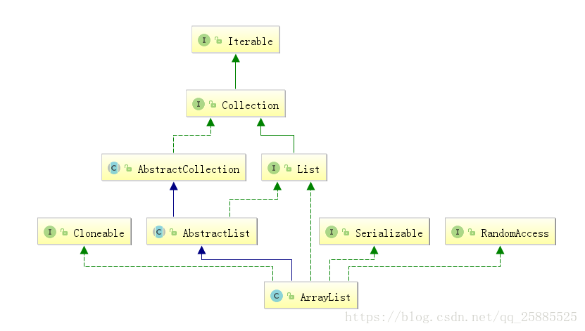
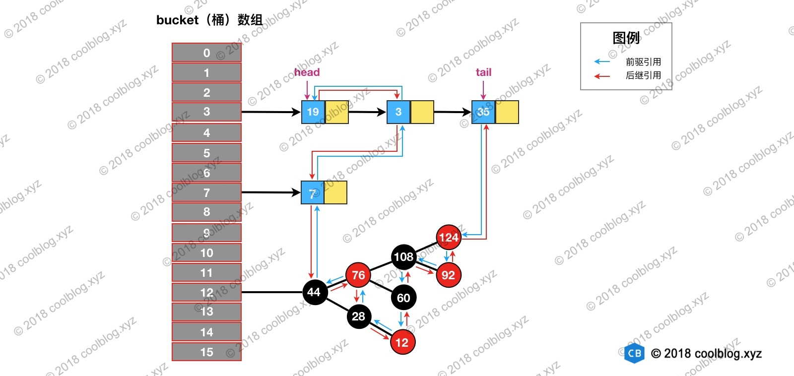
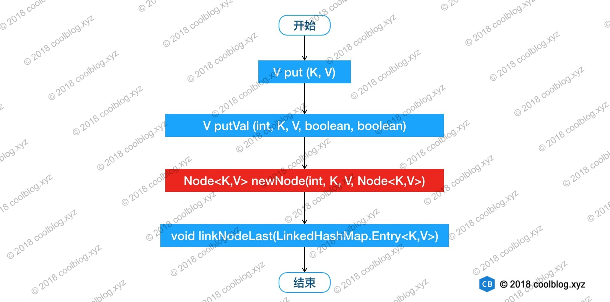

## 常用数据结构简介
#### 简介
数据结构是计算机存储、组织数据的方式，指相互之间存在一种或多种特定关系的数据元素的集合。
通常情况下，精心选择的数据结构可以带来更高的运行或者存储效率。数据结构往往同高效的检索算法和索引技术有关。  

数据结构的基本功能

* 如何插入一条新的数据项
* 如何寻找某一特定的数据项
* 如何删除某一特定的数据项
* 如何迭代的访问各个数据项，以便进行显示或其他操作

#### 常用的数据结构


这几种结构优缺点如下：先有个大概印象，后面会详细讲解！！！


#### 算法
算法简单来说就是解决问题的步骤。  
在Java中，算法通常都是由类的方法来实现的。前面的数据结构，比如链表为啥插入、删除快，而查找慢，平衡的二叉树插入、删除、查找都快，这都是实现这些数据结构的算法所造成的。后面我们讲的各种排序实现也是算法范畴的重要领域。  

1.算法的5个特征

* 有穷性：对于任意一组合法输入值，在执行有穷步骤之后一定能结束，即：算法中的每个步骤都能在有限时间内完成。
* 确定性：在每种情况下所应执行的操作，在算法中都有确切的规定，使算法的执行者或阅读者都能明确其含义及如何执行。并且在任何条件下，算法都只有一条执行路径。
* 可行性：算法中的所有操作都必须足够基本，都可以通过已经实现的基本操作运算有限次实现之。
* 有输入：作为算法加工对象的量值，通常体现在算法当中的一组变量。有些输入量需要在算法执行的过程中输入，而有的算法表面上可以没有输入，实际上已被嵌入算法之中。
* 有输出：它是一组与“输入”有确定关系的量值，是算法进行信息加工后得到的结果，这种确定关系即为算法功能。

2.算法的设计原则

* 正确性：首先，算法应当满足以特定的“规则说明”方式给出的需求。其次，对算法是否“正确”的理解可以有以下四个层次：
1. 程序语法错误。
2. 程序对于几组输入数据能够得出满足需要的结果。
3. 程序对于精心选择的、典型、苛刻且带有刁难性的几组输入数据能够得出满足要求的结果。
4. 程序对于一切合法的输入数据都能得到满足要求的结果。
5. 通常以第 三 层意义的正确性作为衡量一个算法是否合格的标准。
* 可读性：算法为了人的阅读与交流，其次才是计算机执行。因此算法应该易于人的理解；另一方面，晦涩难懂的程序易于隐藏较多的错误而难以调试。
* 健壮性：当输入的数据非法时，算法应当恰当的做出反应或进行相应处理，而不是产生莫名其妙的输出结果。并且，处理出错的方法不应是中断程序执行，而是应当返回一个表示错误或错误性质的值，以便在更高的抽象层次上进行处理。
* 高效率与低存储量需求：通常算法效率值得是算法执行时间；存储量是指算法执行过程中所需要的最大存储空间，两者都与问题的规模有关。  

前面三点 正确性，可读性和健壮性相信都好理解。对于第四点算法的执行效率和存储量，我们知道比较算法的时候，可能会说“A算法比B算法快两倍”之类的话，但实际上这种说法没有任何意义。因为当数据项个数发生变化时，A算法和B算法的效率比例也会发生变化，比如数据项增加了50%，可能A算法比B算法快三倍，但是如果数据项减少了50%，可能A算法和B算法速度一样。所以描述算法的速度必须要和数据项的个数联系起来。也就是“大O”表示法，它是一种算法复杂度的相对表示方式，这里我简单介绍一下，后面会根据具体的算法来描述。  
相对(relative)：你只能比较相同的事物。你不能把一个做算数乘法的算法和排序整数列表的算法进行比较。但是，比较2个算法所做的算术操作（一个做乘法，一个做加法）将会告诉你一些有意义的东西；
表示(representation)：大O(用它最简单的形式)把算法间的比较简化为了一个单一变量。这个变量的选择基于观察或假设。例如，排序算法之间的对比通常是基于比较操作(比较2个结点来决定这2个结点的相对顺序)。这里面就假设了比较操作的计算开销很大。但是，如果比较操作的计算开销不大，而交换操作的计算开销很大，又会怎么样呢？这就改变了先前的比较方式；  
复杂度(complexity)：如果排序10,000个元素花费了我1秒，那么排序1百万个元素会花多少时间？在这个例子里，复杂度就是相对其他东西的度量结果。

然后我们在说说算法的存储量，包括：

* 程序本身所占空间；
* 输入数据所占空间；
* 辅助变量所占空间；

一个算法的效率越高越好，而存储量是越低越好。

## 并发集合了解哪些？

Java并发集合

1.引言
Java集合包括ArrayList、HashSet、HashMap、ArrayQueue等集合都有一个共同的特点，那就是线程不安全性，在并发情况下都不能保证数据的一致性。（当然，这个集合必须是共享了，所以才会有数据不一致）
所以，当我们在进行并发任务时候，共享了一个不适用于并发的数据结构，也就是将此数据结构变成了程序中的成员变量，那么我们将会遇到数据的不一致，进而影响到我们程序的运行。
为了应对并发场景的出现，Java在后续迭代过程中（具体应该是JDK1.5版本），推出了java.util.concurrent包。该包的出现，让Java并发编程变得更加轻松，帮助开发者编写更加高效、易维护、结构清晰的程序。
在java.util.concurrent包中，不但包含了线程安全的集合，还涉及到了多线程、CAS、线程锁等相关内容，可以说是完整覆盖了Java并发的知识栈。

2 并发集合实现1
JDK1.5的出现，对于集合并发编程来说，java developer有了更多的选择。不过，在JDK1.5之前，Java也还是提供了一些解决方案。
（1）最为简单直接的就是在程序中我们自己对共享变量进行加锁。不过，缺点也显而易见，手动实现线程安全间接增加了程序的复杂度，以及代码出错的概率---例如：线程死锁的产生；
（2）我们还可以使用Java集合框架中的Vector、Hashtable实现类，这两个类都是线程安全的。不过，Java已不提倡使用。
（3）此外，我们还可以使用集合工具类--Collections，通过调用其中的静态方法，来得到线程安全的集合。具体方法，包括：Collections.synchronizedCollection(Collection<T> c)、Collections.synchronizedSet(Set<T> s)、Collections.synchronizedList(List<T>)、Collections.synchronizedMap(Map<K, V>)。
究其原理，他们都是通过在方法中加synchronized同步锁来实现的。我们知道synchronized锁的开销较大，在程序中不建议使用。

并发集合实现2
在java.util.concurrent包中，提供了两种类型的并发集合：一种是阻塞式，另一种是非阻塞式。
阻塞式集合：当集合已满或为空时，被调用的添加（满）、移除（空）方法就不能立即被执行，调用这个方法的线程将被阻塞，一直等到该方法可以被成功执行。
非阻塞式集合：当集合已满或为空时，被调用的添加（满）、移除（空）方法就不能立即被执行，调用这个方法的线程不会被阻塞，而是直接则返回null或抛出异常。
下面，就来看下concurrent包下，到底存在了哪些线程安全的集合：


List：
CopyOnWriteArrayList

Set：
CopyOnWriteArraySet
ConcurrentSkipListSet

Queue：
BlockingQueue:
    LinkedBlockingQueue
    DelayQueue
    PriorityBlockingQueue
    ConcurrentLinkedQueue
    TransferQueue:
        LinkedTransferQueue
    BlockingDeque:
        LinkedBlockingDeque
        ConcurrentLinkedDeque

Map集合：


Map:
ConcurrentMap:
    ConcurrentHashMap
    ConcurrentSkipListMap
    ConcurrentNavigableMap

通过以上可以看出，java.util.concurrent包为每一类集合都提供了线程安全的实现。

## 列举java的集合以及集合之间的继承关系


##### Iterable
Iterator是迭代器类，而Iterable是为了只要实现该接口就可以使用foreach，进行迭代.
Iterable中封装了Iterator接口，只要实现了Iterable接口的类，就可以使用Iterator迭代器了。
实现此接口允许对象成为“for-each loop”语句的目标

``` java
public interface Iterable<T> {
    
    //返回类型为T元素的迭代器
    Iterator<T> iterator();

    //对Iterable的每个元素执行给定的操作，直到所有元素都被处理或引发异常。 除非实现类另有规定，否则按照迭代的顺序执行操作（如果指定了迭代顺序）。 动作抛出的异常被抛出给调用者。
    default void forEach(Consumer<? super T> action) {
        Objects.requireNonNull(action);
        for (T t : this) {
            action.accept(t);
        }
    }

	 //在Iterable描述的元素上创建一个Iterable
    default Spliterator<T> spliterator() {
        return Spliterators.spliteratorUnknownSize(iterator(), 0);
    }
}
```
##### Iterator
一个集合的迭代器。 Iterator替代Enumeration在Java集合框架。 迭代器有两个方面不用于Enumeration：

* 迭代器允许调用者在具有明确定义的语义的迭代期间从底层集合中删除元素。
* 方法名称已得到改进。

此接口是成员Java Collections Framework 。

``` java
public interface Iterator<E> {

    boolean hasNext();

   
    E next();

    //从底层集合中删除此迭代器返回的最后一个元素（可选操作）。此方法只能调用一次next() 。 如果底层集合在迭代过程中以任何方式进行修改而不是通过调用此方法，则迭代器的行为是未指定的。
    default void remove() {
        throw new UnsupportedOperationException("remove");
    }

    //对每个剩余元素执行给定的操作，直到所有元素都被处理或动作引发异常。 如果指定了该顺序，则按迭代的顺序执行操作。 动作抛出的异常被抛出给调用者。
    default void forEachRemaining(Consumer<? super E> action) {
        Objects.requireNonNull(action);
        while (hasNext())
            action.accept(next());
    }
}
```
##### Collection

集合体系中的根接口。 集合表示一组称为其元素的对象。 有些集合允许有重复元素而其他则不允许。 有些是有序的，有些是无序的。 JDK不提供此接口的任何直接实现：它提供了更具体的子接口（如Set和List）的实现。 此接口通常用于传递集合并在需要最大通用性的情况下对其进行操作。  
包或多个集合（可能包含重复元素的无序集合）应直接实现此接口。  
所有通用Collection实现类（通常通过其子接口间接实现Collection）应提供两个“标准”构造函数：void（无参数）构造函数，它创建一个空集合，以及一个有参构造函数，其中一个参数类型 Collection，使用与其参数相同的元素创建新集合。 实际上，后一个构造函数允许用户复制任何集合，从而生成所需实现类型的等效集合。 没有办法强制执行此约定（因为接口不能包含构造函数），但Java平台库中的所有通用Collection实现都符合。  
如果此集合不支持该操作，则指定此接口中包含的“破坏性”方法（即修改其操作集合的方法）将抛出UnsupportedOperationException。 如果是这种情况，调用对集合没有影响，则这些方法可能（但不是必须）抛出UnsupportedOperationException。 例如，如果要添加的集合为空，则可以（但不是必须）在不可修改的集合上调用addAll（Collection）方法抛出异常。  
某些集合实现对它们可能包含的元素有限制。 例如，某些实现禁止null元素，并且一些实现对其元素的类型有限制。 尝试添加不合格的元素会引发未经检查的异常，通常是NullPointerException或ClassCastException。 尝试查询不合格元素的可能会引发异常，或者它可能只是返回false; 一些实现将展示前一种行为，一些将展示后者。 更一般地，尝试对不合格的元素进行操作，其完成不会导致将不合格的元素插入到集合中，可以在实现的选择中抛出异常或者它可以成功。 此类异常在此接口的规范中标记为“可选”。  
由每个集合决定自己的同步策略。 在实现没有更强的保证的情况下，未定义的行为可能是由于另一个线程正在调用集合上的任何方法的调用引起的; 这包括直接调用，将集合传递给可能执行调用的方法，以及使用现有迭代器来检查集合。  
Collections框架接口中的许多方法都是根据equals方法定义的。 例如，contains（Object o）方法的规范：“当且仅当此集合包含至少一个元素e时才返回true（o == null？e == null：o.equals（e））“。 不应将此规范解释为使用非null参数o调用Collection.contains将导致对任何元素e调用o.equals（e）。 实现可以自由地优化，从而避免等同调用，例如，首先比较两个元素的哈希码。 （Object.hashCode（）规范保证具有不等哈希码的两个对象不能相等。）一般地，各种集合框架接口的实现可以自由地利用底层Object方法的指定行为，只要实现者认为它是合适的  。  
执行集合的递归遍历的某些集合操作可能会失败，而自引用实例的例外情况是集合直接或间接包含自身。 这包括clone（），equals（），hashCode（）和toString（）方法。 可以可选地处理自引用场景，但是大多数当前实现不这样做。  
此接口是Java集合框架的成员。

#### ArrayList



##### AbstractList

此类提供List接口的骨干实现，以最大限度地减少实现由“随机访问”数据存储（例如数组）支持的此接口所需的工作量。对于顺序访问数据（例如链接列表），应优先使用AbstractSequentialList，而不是此类。  
要实现不可修改的列表，程序员只需要扩展此类并提供get（int）和size（）方法的实现。  
要实现可修改的列表，程序员必须另外覆盖set（int，E）方法（否则会抛出UnsupportedOperationException）。如果列表是可变大小的，则程序员必须另外覆盖add（int，E）和remove（int）方法。  
程序员通常应该根据Collection接口规范中的建议提供void（无参数）和集合构造函数。  
与其他抽象集合实现不同，程序员不必提供迭代器实现;迭代器和列表迭代器是由这个类在“随机访问”方法之上实现的：get（int），set（int，E），add（int，E）和remove（int）。  
此接口是Java集合框架的成员。 
在这个抽象类中，我们可以发现，很多方法的实现，都是抛出一个UnsupportedOperationException异常，等待具体的实现类来实现．  
未实现的方法：  

* 添加元素 add(E e)、add(int index,  E element)
* 替换指定索引位置的元素 set(int index, Eelement) 
* 删除指定所引处的元素 remove(int index) 
* 凡是涉及到与数据存储结构有关的方法均不能实现

在indexOf方法的实现中，我们可以看到，它是采用的顺序遍历的方式，这是最常见但是同时效率也是最低的遍历方式．

``` java
/**
     * 功能：获取集合第一次出现的指定元素的索引
     * 实现：
     * 1.获取List集合特有迭代器listIterator
     * 2.如果待查找参数为null，遍历集合找到第一个为null的元素并返回，如果没找到返回-1
     * 3.如果待查找参数不为null，遍历集合使用equals方法找到第一个相同元素并返回，没有返回-1
     */
    public int indexOf(Object o) {
        ListIterator<E> it = listIterator();
        if (o==null) {
            while (it.hasNext())
                if (it.next()==null)
                    return it.previousIndex();
        } else {
            while (it.hasNext())
                if (o.equals(it.next()))
                    return it.previousIndex();
        }
        return -1;
```
同时，我们也能看到，AbstractList是允许其中的元素为null的．如果找到元素，则返回其所在的位置，否则返回-1.
在各种查找算法中，性能最好的，似乎就是O(logn)了．但是这些算法都需要数据是有序的．那么存不存在一种算法，即使数据是无序的，其时间复杂度也比O(n)好呢?
确实存在，那就是哈希算法，如果能够确定有效的哈希函数，那么查找性能是O(1)．远比O(n)要好的多．可是，如何设计这么一个高效的哈希函数呢?
但是，使用这种方式，我们能保证，读取的时候，如果按照索引来读取，读取到的元素的顺序，跟元素被插入时的顺序相同．而如果使用哈希函数，则不能保证这一点．
AbstractList中，还为我们提供了一个获取元素的最后出现位置的方法，跟上面那个获取第一次出现位置的方法没什么不同，只不过是从后面开始遍历的．

``` java
/**
     * 功能：获取集合最后一次出现指定元素的索引
     * 实现：
     * 1.同上一个方法类似
     */
    public int lastIndexOf(Object o) {
        ListIterator<E> it = listIterator(size());
        if (o==null) {
            while (it.hasPrevious())
                if (it.previous()==null)
                    return it.nextIndex();
        } else {
            while (it.hasPrevious())
                if (o.equals(it.previous()))
                    return it.nextIndex();
        }
        return -1;
    }
```
除此之外, AbstractList还提供了一个iterator()方法，这个方法相信各位已经很熟悉了，它会获取一个实现了Iterator接口的Itr类用于迭代当前的List.

```java
 //继承自父类的迭代器 iterator()
/**
     * 功能：获取迭代器
     * 实现：
     * 1.通过匿名内部类实现迭代器，创建迭代器Iterator实现类并返回
     */
    public Iterator<E> iterator() {
        return new Itr();
    }
    private class Itr implements Iterator<E> {
        /**
         * Index of element to be returned by subsequent call to next.
         */
        /**
         * 元素索引指针
         */
        int cursor = 0;
 
        /**
         * Index of element returned by most recent call to next or
         * previous.  Reset to -1 if this element is deleted by a call
         * to remove.
         */
        /**
         *最近一次调用返回到下一个或上一个的元素索引。 如果通过删除调用删除此元素，则重置为-1。
         * 通俗点说，他保存cursor操作前的索引
         */
        int lastRet = -1;
 
        /**
         * The modCount value that the iterator believes that the backing
         * List should have.  If this expectation is violated, the iterator
         * has detected concurrent modification.
         */
        /**
         * 迭代器认为后备列表应具有的modCount值。 如果违反了此期望，则迭代器已检测到并发修改。
         */
        int expectedModCount = modCount;
 
        /**
         * 功能：检查是否还有下一个元素
         * 实现：
         * 1.迭代器每次迭代出一个元素时元素索引指针cursor都会下移
         * 2.通过检查元素指针cursor是否等于集合长度判断时候还有元素
         */
        public boolean hasNext() {
            return cursor != size();
        }
 
        /**
         * 功能：获取当前元素索引指针(cursor)处的元素
         * 实现：
         * 1.检测是否发生并发修改，并发修改则抛出异常
         * 2.获取当前元素索引指针所指向的元素，保存当前索引到lastRet、cursor++
         * 3.返回回去到的元素
         */
        public E next() {
            checkForComodification();
            try {
                int i = cursor;
                E next = get(i);
                lastRet = i;
                cursor = i + 1;
                return next;
            } catch (IndexOutOfBoundsException e) {
                checkForComodification();
                throw new NoSuchElementException();
            }
        }
 
        /**
         * 功能：删除lastRet索引处的元素
         * 实现：
         * 1.对lastRet进行和是否并发修改进行检查
         * 2.调用AbstractList超类的remove方法删除lastRet索引处的元素
         * 3.如果元素索引指针cursor大于lastRet，则将cursor迁移一位，lastRet置为-1
         */
        public void remove() {
            if (lastRet < 0)
                throw new IllegalStateException();
            checkForComodification();
 
            try {
                AbstractList.this.remove(lastRet);
                if (lastRet < cursor)
                    cursor--;
                lastRet = -1;
                expectedModCount = modCount;
            } catch (IndexOutOfBoundsException e) {
                throw new ConcurrentModificationException();
            }
        }
 
        /**
         * 功能：检查是否发生并发修改
         * 实现：
         * 1.通过modCount和expectedModCount是否相等检查
         */
        final void checkForComodification() {
            if (modCount != expectedModCount)
                throw new ConcurrentModificationException();
        }

```
但是，它不是线程安全的．也就是说，如果我们已经获取到了Iterator了，而此后这个List被其他的线程修改了，那么会抛出运行时异常．
它还提供了一个listIterator()的方法，它会返回一个实现了ListIterator接口的ListItr类.那么Itr和ListItr有什么区别呢?

```java
/**
     * 功能：List特有迭代器
     * 实现：调用listIterator(final int index)获取迭代器
     * 注：每次调用，迭代器都能从头开始
     */
    public ListIterator<E> listIterator() {
        return listIterator(0);
    }
 
    /**
     * 功能：获取List集合特有迭代器
     * 实现：
     * 1.检查索引范围无误后创建并返回迭代器实现类对象
     */
    public ListIterator<E> listIterator(final int index) {
        rangeCheckForAdd(index);
 
        return new ListItr(index);
    }
 
    private class ListItr extends Itr implements ListIterator<E> {
        /**
         * ListItr类有参构造器，初始化开始元素索引指针位置
         */
        ListItr(int index) {
            cursor = index;
        }
 
        /**
         * 功能：检查cursor指针前面是否还有元素
         * 实现:
         * 1.通过cursor是否等于0判断
         */
        public boolean hasPrevious() {
            return cursor != 0;
        }
 
        /**
         * 功能：获取前一个元素
         * 实现：
         * 1.检查是否发生并发操作，是则抛异常
         * 2.将现在cursor向前移动一位，获取元素并返回
         */
        public E previous() {
            checkForComodification();
            try {
                int i = cursor - 1;
                E previous = get(i);
                lastRet = cursor = i;
                return previous;
            } catch (IndexOutOfBoundsException e) {
                checkForComodification();
                throw new NoSuchElementException();
            }
        }
 
        /**
         * 功能：获取当前指针索引
         */
        public int nextIndex() {
            return cursor;
        }
 
        /**
         * 功能：获取上一个元素指针索引
         */
        public int previousIndex() {
            return cursor-1;
        }
 
        /**
         * 功能：替换元素
         * 实现：
         * 1.检查lastRet是否越界，检查时候并发操作
         * 2.调用AbstractList的set方法进行替换
         */
        public void set(E e) {
            if (lastRet < 0)
                throw new IllegalStateException();
            checkForComodification();
 
            try {
                AbstractList.this.set(lastRet, e);
                expectedModCount = modCount;
            } catch (IndexOutOfBoundsException ex) {
                throw new ConcurrentModificationException();
            }
        }
 
        /**
         * 功能：添加元素
         * 实现：
         * 1.检查是否并发操作，是则抛异常
         * 2.调用AbstractList的add方法进行添加操作，并将元素指针索引 + 1
         */
        public void add(E e) {
            checkForComodification();
 
            try {
                int i = cursor;
                AbstractList.this.add(i, e);
                lastRet = -1;
                cursor = i + 1;
                expectedModCount = modCount;
            } catch (IndexOutOfBoundsException ex) {
                throw new ConcurrentModificationException();
            }
        }
```
我们从名字上应该也能看出来，Itr类是ListItr的父类，它实现了Iterator接口，并实现了了一下几个方法:hasNext, next, remove, checkForComodification.我们可以看到，它只能向后遍历(这里称向索引大的元素遍历称为向后遍历),并且，只能从数据容器的起点开始读，也只能移除某个元素，而无法在迭代的过程中，重新设置此元素的值．
而ListItr呢，继承了Itr的那些特性，同时通过实现ListIterator类，增加了自己的特性．它相对于Itr增加了如下方法:hasPrevious, previous, set, add.从这些函数的名字中，我们就可以知道，它支持向前遍历，在遍历的过程中重新设置元素的值，以及在遍历过程中增加元素．
并且，我们可以看到它的构造函数声明如下:

``` java 
ListItr(int index) {
   cursor = index;
}
```

我们可以看到，我们可以从指定的位置开始进行迭代．
在Itr和ListItr的实现中，我们可以看到，基本上每个方法的实现，都会调用一个叫做checkForComodification()的方法．这个方法是干什么的呢?Itr和ListItr中，都会维护一个变量，叫做expectedModCount，它记录了它认为List被修改的次数，刚开始时，它被初始化为List被修改的次数．checkForComodification()方法，通过将这个变量，和另一个表示List实际被修改的次数的叫做modCount的变量比较，就能得知，在获取到Iterator之后，List是否被修改过，进而抛出ConcurrentModificationException异常．
当然，前面也介绍了,Itr和ListItr实际上也可以在遍历过程中修改List，所以我们在那些修改List的结构的方法中，就需要再同步一下expectedModCount和modCount的值．防止是由于Iterator本身修改了List而导致抛出ConcurrentModificationException.
以Itr的remove为例:

``` java
public void remove() {
            if (lastRet < 0)
                throw new IllegalStateException();
            checkForComodification();

            try {
                AbstractList.this.remove(lastRet);
                if (lastRet < cursor)
                    cursor--;
                lastRet = -1;
                expectedModCount = modCount;
            } catch (IndexOutOfBoundsException e) {
                throw new ConcurrentModificationException();
            }
        }
```
那modCount这个变量的值都是在什么情况下会被修改呢?
当我们的子类在实现AbstractList时，对于那些修改List结构的方法，比如会造成List的大小发生了变化的函数，那么我们可以在这些方法内部，让modCount+1.来实现让Iterator发现List被修改过并抛出错误的功能．
我们为什么需要让Iterator发现List被修改过并抛出异常呢?这是为了防止在并发的环境下，造成不确定的问题．

AbstractList还给我们提供了一个removeRange方法，通过这个方法，我们可以删除一定范围内的元素，并将此范围右侧的元素左移(但是我并没有发现它实现了将元素左移的功能).此方法接受两个参数，一个是fromIndex,另一个是toIndex，分别代表要删除的元素的范围的起点和终点，不包含终点．如果你指定的fromIndex和toIndex相同，那么并不会删除那一个特定的元素，而是会一点作用没有，相当于并没有调用这个函数．

``` java 
* 功能：删除集合的所有元素
     * 实现：
     * 1.调用removeRange方法删除集合整个范围内的所有元素
     */
    public void clear() {
        removeRange(0, size());
    }
 
    /**
     * 功能：删除指定范围内的所有元素
     * 实现：
     * 1.通过特有迭代器获取fromIndex索引处开始到结尾的所有元素
     * 2.通过for循环，逐个删除元素
     */
    protected void removeRange(int fromIndex, int toIndex) {
        ListIterator<E> it = listIterator(fromIndex);
        for (int i=0, n=toIndex-fromIndex; i<n; i++) {
            it.next();
            it.remove();
        }
    }

```

AbstractList提供了一个addAll(int index, Collection<? extends E> c)方法，

``` java
/**
     * 功能：在指定位置添加一个集合的元素
     * 实现：
     * 1.检查是否并发操作
     * 2.遍历参数集合并调用add(int index, E e)方法进行这个添加，每次添加后索引+1
     */
    public boolean addAll(int index, Collection<? extends E> c) {
        rangeCheckForAdd(index);
        boolean modified = false;
        for (E e : c) {
            add(index++, e);
            modified = true;
        }
        return modified;
    }

```

AbstractList提供了一个subList()方法，它接受两个参数，一个是AbstractList开始切分位置，另一个是AbstractList结束拆分的位置．
这个方法，会返回一个SubList，如果当前AbstractList实现了RandomAccess接口，那么就返回RandomAccessSubList．
那么SubList又是个什么鬼呢?
AbstractList的subList()方法，在形成子列表时，并不会创建一个新的AbstractList,并将父AbstractList中的相应的元素拷贝进去．那它是怎样做的呢?
它是写了一个Wrapper,这个Wrapper就是SubList．既然是一个Wrapper,那么它内部肯定是封装了一个AbstractList实例，并维护了一些其他信息．我们来看一下这个类的属性，以及其构造方法:

```java
class SubList<E> extends AbstractList<E> {
    private final AbstractList<E> l;
    private final int offset;
    private int size;

    SubList(AbstractList<E> list, int fromIndex, int toIndex) {
        if (fromIndex < 0)
            throw new IndexOutOfBoundsException("fromIndex = " + fromIndex);
        if (toIndex > list.size())
            throw new IndexOutOfBoundsException("toIndex = " + toIndex);
        if (fromIndex > toIndex)
            throw new IllegalArgumentException("fromIndex(" + fromIndex +
                                               ") > toIndex(" + toIndex + ")");
        l = list;
        offset = fromIndex;
        size = toIndex - fromIndex;
        this.modCount = l.modCount;
    }
```
其中l这个AbstractList，就是要获取子列表的那个AbstractList的实例．offset这个属性，代表的是，从哪里开始是子列表．就是subList()方法的fromIndex参数．size这个属性，代表的是子列表的长度，就是subList的toIndex - fromIndex的值．
从其他的函数中，我们可以发现，实际上，修改这个SubList就是修改的原AbstractList．同时，我们也会发现，如果我们在获取到SubList之后，做了一些会造成AbstractList的modCount属性发生变化的操作，那么就会让SubList失效并抛出ConcurrentModificationException了．
SubList能改变原集合的值，所以我们在使用时要慎重，如果不想改变原集合的值，那么我们就要把这个subList保存到另一个集合中使用它。

##### AbstractCollection

此类提供Collection接口的骨干实现，以最大限度地减少实现此接口所需的工作量。  
要实现不可修改的集合，程序员只需要扩展此类并提供迭代器和大小方法的实现。 （迭代器方法返回的迭代器必须实现hasNext和next。）  
要实现可修改的集合，程序员必须另外覆盖此类的add方法（否则会抛出UnsupportedOperationException），并返回迭代器方法，必须实现其remove方法。  
程序员通常应该根据Collection接口规范中的建议提供void（无参数）和Collection构造函数。  
此类中每个非抽象方法的文档详细描述了它的实现。如果正在实施的集合允许更有效的实现，则可以覆盖这些方法中的每一个。  
此接口是Java集合框架的成员。

``` java
public abstract class AbstractCollection<E> implements Collection<E> {
   
    protected AbstractCollection() {
    }

    public abstract Iterator<E> iterator();

    public abstract int size();
	
	//判断集合是否为空
    public boolean isEmpty() {
        return size() == 0;
    }

    /**
     * 判断是否包含指定的元素
     * （1）如果参数为null，查找值为null的元素，如果存在，返回true，否则返回false。
     * （2）如果参数不为null，则根据equals方法查找与参数相等的元素，如果存在，则返回true，否则返回false。
     * 注意：这里必须对null单独处理，否则null.equals会报空指针异常
     */
    public boolean contains(Object o) {
        Iterator<E> it = iterator();
        if (o==null) {
            while (it.hasNext())
                if (it.next()==null)
                    return true;
        } else {
            while (it.hasNext())
                if (o.equals(it.next()))
                    return true;
        }
        return false;
    }

    
    /**
     * 功能：将集合元素转换为数组
     * 实现：
     * （1）创建一个数组，大小为集合中元素的数量
     * （2）通过迭代器遍历集合，将当前集合中的元素复制到数组中（复制引用）
     * （3）如果集合中元素比预期的少，则调用Arrays.copyOf()方法将数组的元素复制到新数组中，并返回新数组
     * （4）如果集合中元素比预期的多，则调用finishToArray方法生成新数组，并返回新数组，否则返回（1）中创建的数组
     */
    public Object[] toArray() {
        Object[] r = new Object[size()];
        Iterator<E> it = iterator();
        for (int i = 0; i < r.length; i++) {
            if (! it.hasNext()) // 比预想的元素要少
                return Arrays.copyOf(r, i);
            r[i] = it.next();
        }
        return it.hasNext() ? finishToArray(r, it)/*比预想的元素多*/ : r;
    }
    
	/**
	*如果参数数组的长度小于集合的长度，则用反射创建一个T类型的数组，否则就是用这个数组的引用，
	*还是通过迭代器遍历数组范围的集合元素将其元素 引用复制到数组当中，判断集合的元素是
	*否大于小于等于预期大小（size的大小）分不同的处理情况来处理。
	*/
	//功能：通过泛型约束返回指定类型的数组
   // (1) 如果参数数组长度大于等于集合的长度，则将当前集合的元素复制到参数数组当中
   // (2) 如果参数数组的长度小于集合的长度，则通过数组的反射创建T类型的新数组来容纳集合元素
    public <T> T[] toArray(T[] a) {
        // Estimate size of array; be prepared to see more or fewer elements
        int size = size();
        T[] r = a.length >= size ? a :
                  (T[])java.lang.reflect.Array
                  .newInstance(a.getClass().getComponentType(), size);
        Iterator<E> it = iterator();

        for (int i = 0; i < r.length; i++) {
            if (! it.hasNext()) { // fewer elements than expected 在数组长度范围内出现没有下一个元素的情况，说明集合大小小于数组的长度
                if (a == r) { //如果a 和 r 所引用的数组相同，则将剩下的数组元素都赋值为null，作为集合元素的结束标志
                    r[i] = null; // null-terminate
                } else if (a.length < i) {//如果参数数组的长度小于集合的长度，也就是r是通过反射新创建的数组，则通过Arrays.copyOf方法截短返回
                    return Arrays.copyOf(r, i);
                } else {//r是通过反射新创建的数组，但是参数数组长度大于集合长度，
                          //即a的长度大于新创建的r数组的长度(这在单线程情况下不可能发生，但是在
                          //并发情况下参数数组的长度可能发生变化)，则将r数组复制到a数组当中，并
                          //将参数数组多的元素设置为null
                    System.arraycopy(r, 0, a, 0, i);//将创建的r数组所有元素复制到a数组当中
                    if (a.length > i) {
                        a[i] = null;
                    }
                }
                return a;
            }
            r[i] = (T)it.next(); //类型转换，可能会抛出ClassCastException异常
        }
        // more elements than expected
        // 如果集合长度大于数组的长度则拓展数组r，否则(集合长度正好等于数组的长度)直接返回数组r
        return it.hasNext() ? finishToArray(r, it) : r;
    }

	/**
	*数组的最大可分配大小为整数的最大值，但是有些虚拟机会保留几个字节大小的空间存储头部，
	*所以为了保险起见最大可分配的数组大小为整数最大值-8，否则会抛出内存溢出错误
	*/
	private static final int MAX_ARRAY_SIZE = Integer.MAX_VALUE - 8;
    
	/**
     *  （1）对数组进行扩容：即创建一个更长的数组，然后将原数组的内容复制到新数组中
     *  （2）扩容大小：cap + cap/2 +1
     *  （3）扩容前需要先判断是否数组长度是否溢出
     */
    private static <T> T[] finishToArray(T[] r, Iterator<?> it) {
        int i = r.length;//记录数组有效长度
        while (it.hasNext()) {
            int cap = r.length;//数组最大可用容量
            if (i == cap) {//当数组有效长度和数组最大可用容量相等时，再次扩容
                int newCap = cap + (cap >> 1) + 1; //扩容为 cap + cap/2 +1
                // overflow-conscious code
                if (newCap - MAX_ARRAY_SIZE > 0)//新扩大的容量发生溢出
                    newCap = hugeCapacity(cap + 1);
                //Arrays.copyOf方法内部创建了一个新的长度为newCap数组，
                //并将元素复制到这个新的数组当中，底层调用的是System.arraycopy native方法
                r = Arrays.copyOf(r, newCap);
            }
            r[i++] = (T)it.next();//数组有效长度自增，并复制引用
        }
        // trim if overallocated 截短数组长度到有效长度
        return (i == r.length) ? r : Arrays.copyOf(r, i);
    }

    /**
     * 判断数组容量是否溢出，最大为整型数据的最大值
     */
    private static int hugeCapacity(int minCapacity) {
        if (minCapacity < 0) // overflow 超出整型的最大值则数值溢出为负值
            throw new OutOfMemoryError
                ("Required array size too large");
        return (minCapacity > MAX_ARRAY_SIZE) //如果大于最大容量则返回整数的最大值，否则返回集合的最大容量。
            Integer.MAX_VALUE :
            MAX_ARRAY_SIZE;
    }

    // Modification Operations
    
	 //未实现的方法
    //子类必须以自己的方式实现这两个方法。除此外，AbstractCollection 中默认不支持添加单个元素，如果直接调用 add(E) 方法，会报错：  因此，如果子类是可添加的数据结构，需要自己实现 add(E) 方法  
    public boolean add(E e) {
        throw new UnsupportedOperationException();
    }

    /**
     * 集合允许null元素
     * 功能：移除指定元素
     * （1）如果参数为null，则找到第一个值为null的元素，并将其删除，返回true，如果不存在null的元素，返回false。
     * （2）如果参数不为null，则根据equals方法找到第一个与参数相等的元素，并将其删除，返回true，如果找不到，返回false。
     */
    public boolean remove(Object o) {
        Iterator<E> it = iterator();
        if (o==null) {
            while (it.hasNext()) {
                if (it.next()==null) {
                    it.remove();
                    return true;
                }
            }
        } else {
            while (it.hasNext()) {
                if (o.equals(it.next())) {
                    it.remove();
                    return true;
                }
            }
        }
        return false;
    }


    /**
     * 遍历参数集合，依次判断参数集合中的元素是否在当前集合中，
     * 只要有一个不存在，则返回false
     * 如果参数集合中所有的元素都在当前集合中，则返回true
     */
    public boolean containsAll(Collection<?> c) {
        for (Object e : c)
            if (!contains(e))
                return false;
        return true;
    }

    /**
     * 遍历参数集合，依次将参数集合中的元素添加当前集合中
     */
    public boolean addAll(Collection<? extends E> c) {
        boolean modified = false;
        for (E e : c)
            if (add(e))
                modified = true;
        return modified;
    }

    /**
     * 功能：移除参数集合的元素
     * （1）获取当前集合的迭代器进行遍历
     * （2）如果当前集合中的元素包含在参数集合中，则删除当前集合中的元素
     *  注：只要参数集合中有任何一个元素在当前元素中，则返回true，表示当前集合有发送变化，否则返回false。
     */
    public boolean removeAll(Collection<?> c) {
        boolean modified = false;
        Iterator<?> it = iterator();
        while (it.hasNext()) {
            if (c.contains(it.next())) {
                it.remove();
                modified = true;
            }
        }
        return modified;
    }

    /***
     * 功能：求参数集合与当前集合的交集
     * （1）获取当前集合的迭代器进行遍历
     * （2）如果当前集合中的元素不在参数集合中，则将其移除。
     *  注意：如果当前集合是参数集合中的子集，则返回false，表示当前集合未发送变化，否则返回true。
     */
    public boolean retainAll(Collection<?> c) {
        boolean modified = false;
        Iterator<E> it = iterator();
        while (it.hasNext()) {
            if (!c.contains(it.next())) {
                it.remove();
                modified = true;
            }
        }
        return modified;
    }

     //删除所有元素
    public void clear() {
        Iterator<E> it = iterator();
        while (it.hasNext()) {
            it.next();
            it.remove();
        }
    }


    public String toString() {
        Iterator<E> it = iterator();
        if (! it.hasNext())
            return "[]";

        StringBuilder sb = new StringBuilder();
        sb.append('[');
        for (;;) {
            E e = it.next();
            sb.append(e == this ? "(this Collection)" : e);
            if (! it.hasNext())
                return sb.append(']').toString();
            sb.append(',').append(' ');
        }
    }

}
```  

##### RandomAccess

> 标记接口，Marker interface，它们是一类没有定义任何接口方法的接口，表现为一个空接口 
没有接口方法意味着实现该接口的类无需实现任何接口方法，仅仅作为一种标记，以供其他方法判断 
作用就是当某个类实现这个接口后即拥有了这个接口的功能，Java 虚拟机在运行时会识别到它 
标记接口是Java的语言特性 。  

> 在计算机科学中，随机访问（RandomAccess）是从大量的可寻址元素的数据中访问任何元素大致和访问其他元素一样简洁有效，不管多少元素在这个集合中。与随机访问相反的是顺序访问（SequenceAccess）

RandomAccess 就是一个标记接口，用于标明实现该接口的List支持快速随机访问，主要目的是使算法能够在随机和顺序访问的List中性能更加高效（在Collections二分查找时）。 
Collections的binarySearch方法：

``` java
public static <T> int binarySearch(List<? extends Comparable<? super T>> list, T key) {
    if (list instanceof RandomAccess || list.size()<BINARYSEARCH_THRESHOLD)
        return Collections.indexedBinarySearch(list, key);
    else
        return Collections.iteratorBinarySearch(list, key);
}
```
在进行二分查找时，首先判断list是否实现了RandomAccess，然后选择执行最优算法。 
如果集合类是RandomAccess的实现，则尽量用for(int i = 0; i < size; i++) 即for循环来遍历，而不是用Iterator 
迭代器来进行迭代。
> JDK中说的很清楚，在对List特别是Huge size的List的遍历算法中，要尽量来判断是属于RandomAccess(如：ArrayList)还是SequenceAccess(如：LinkedList)

``` java
/**
 * Marker interface used by <tt>List</tt> implementations to indicate that
 * they support fast (generally constant time) random access.  The primary
 * purpose of this interface is to allow generic algorithms to alter their
 * behavior to provide good performance when applied to either random or
 * sequential access lists.
 * List实现所使用的标记接口，用来表明实现了这些接口的list支持快速（通常是常数时间）随机访问。 
 * 这个接口的主要目的是允许一般的算法更改它们的行为，以便在随机或者顺序存取列表时能提供更好的性能
 * <p>The best algorithms for manipulating random access lists (such as
 * <tt>ArrayList</tt>) can produce quadratic behavior when applied to
 * sequential access lists (such as <tt>LinkedList</tt>).  Generic list
 * algorithms are encouraged to check whether the given list is an
 * <tt>instanceof</tt> this interface before applying an algorithm that would
 * provide poor performance if it were applied to a sequential access list,
 * and to alter their behavior if necessary to guarantee acceptable
 * performance.
 * 操作随机访问列表（如ArrayList）的最佳算法在应用于顺序存取列表时，有可能产生二次项行为。
 * 泛型算法列表鼓励在将某个算法应用于顺序存取列表可能导致差的性能之前，先检查给定的列表是
 * 否是这个接口的一个实例，并在需要时去改变这些算法的行为以保证性能。
 * <p>It is recognized that the distinction between random and sequential
 * access is often fuzzy.  For example, some <tt>List</tt> implementations
 * provide asymptotically linear access times if they get huge, but constant
 * access times in practice.  Such a <tt>List</tt> implementation
 * should generally implement this interface.  As a rule of thumb, a
 * <tt>List</tt> implementation should implement this interface if,
 * for typical instances of the class, this loop:
 * 随机访问和顺序存取之间的界限通常是模糊的。例如，一些List实现在变得很大时会导致渐进的非
 * 线性访问时间，但实际上是常量访问时间。这样的List实现通常都应该实现该接口。一般来说，某
 * 个List实现如果（对某些典型的类的实例来说）满足下面的条件，就应该实现这个接口：循环
 * <pre>
 *     for (int i=0, n=list.size(); i < n; i++)
 *         list.get(i);
 * </pre>
 * runs faster than this loop:
 * 比下面的循环运行速度快。
 * <pre>
 *     for (Iterator i=list.iterator(); i.hasNext(); )
 *         i.next();
 * </pre>
 *
 * @since 1.4
 */
public interface RandomAccess {
}
```
<font color=red size=5>__*总结：*__</font>RandomAccess是一个空接口，而空接口的作用一般是起到一个标识的作用。 
通俗点讲，就是判断一个list是否实现了RandomAcess接口，如果实现了，采用简单的for循环进行访问速度比较快。 
如果未实现RandomAcess接口，则采用iterator循环访问速度比较快。 
判断使用instanceof，即```if (list instanceof RandomAccess) ```
###### Cloneable

1 Cloneable的用途
Cloneable是标记型的接口，它们内部都没有方法和属性，实现 Cloneable来表示该对象能被克隆，能使用Object.clone()方法。如果没有实现 Cloneable的类对象调用clone()就会抛出CloneNotSupportedException。
2 克隆的分类

* 浅克隆（shallow clone），浅克隆是指拷贝对象时仅仅copy对象本身和对象中的基本变量，而不拷贝对象包含的引用指向的对象。
* 深克隆（deep clone），不仅copy对象本身，而且copy对象包含的引用指向的所有对象。
举例：对象X中包含对Y的引用，Y中包含对Z的引用。浅拷贝X得到X1，X1中依然包含对Y的引用，Y中依然包含对Z的引用。深拷贝则是对浅拷贝的递归，深拷贝X得到X1，X1中包含对Y1（Y的copy）的引用，Y1中包含对Z1（Z的copy）的引用。

3 克隆代码举例
要让对象可以被克隆，应具备以下2个条件：

* 让该类实现java.lang.Cloneable接口；
* 重写（Override）Object的clone()方法；

``` java
public class Info implements Cloneable {

  private int id;

  private String text;

  public Info(int id, String text) {

    this.id = id;

    this.text = text;
  }

  @Override
  public boolean equals(Object obj) {
    if (this == obj) return true;
    if (obj == null) return false;
    if (obj.getClass() != getClass()) return false;
    Info temp = (Info) obj;
    if (id != temp.id) return false;
    if (text == null) {
      if (temp.text != null) {
        return false;
      }
    } else if (!text.equals(temp.text)) {
      return false;
    }

    return true;
  }

  @Override
  protected Object clone() throws CloneNotSupportedException {
    return super.clone();
  }
}

public static void main(String[] args) throws CloneNotSupportedException {
    Info clone = new Info(1, "I am Mp5A5");
    Info clone1 = (Info) clone.clone();


    System.out.println(clone.getClass() == clone1.getClass()); // true

    System.out.println(clone == clone1); // false

    System.out.println(clone.equals(clone1)); // true
  }
```
4 浅克隆/浅拷贝

``` java
public class MyFile implements Cloneable {

  private String path;

  public Info info;

  public MyFile(String path, Info info) {

    this.path = path;

    this.info = info;
  }

  @Override
  public boolean equals(Object obj) {
    if (this == obj) return true;
    if (obj == null) return false;
    if (obj.getClass() != getClass()) return false;
    MyFile temp = (MyFile) obj;
    if (path == null) {
      if (temp.path != null) {
        return false;
      }
    } else if (!path.equals(temp.path)) {
      return false;
    }

    if (info == null) {
      if (temp.info != null) {
        return false;
      }
    } else if (!info.equals(temp.info)) {
      return false;
    }

    return true;
  }

  @Override
  protected Object clone() throws CloneNotSupportedException {
    return super.clone();
  }
}

public static void main(String[] args) throws CloneNotSupportedException {

    Info info = new Info(2, "Hello world.");

    MyFile file1 = new MyFile("c:", info);

    MyFile file2 = (MyFile) file1.clone();

    System.out.println(file1.getClass() == file2.getClass()); // true

    System.out.println(file1 == file2); // false

    System.out.println(file1.equals(file2)); // true

    System.out.println(file1.info.getClass() == file2.info.getClass()); // true

    System.out.println(file1.info == file2.info); // true

    System.out.println(file1.info.equals(file2.info)); // true
  }

```
5 深克隆/深拷贝
深克隆需要重写（Override）Object类的clone()方法，并且在方法内部调用持有对象的clone方法

``` java
public class MyFile2 implements Cloneable {

  private String path;

  public Info info;

  public MyFile2(String path, Info info) {

    this.path = path;

    this.info = info;
  }

  @Override
  public boolean equals(Object obj) {
    if (this == obj) return true;
    if (obj == null) return false;
    if (obj.getClass() != getClass()) return false;
    MyFile2 temp = (MyFile2) obj;
    if (path == null) {
      if (temp.path != null) {
        return false;
      }
    } else if (!path.equals(temp.path)) {
      return false;
    }

    if (info == null) {
      if (temp.info != null) {
        return false;
      }
    } else if (!info.equals(temp.info)) {
      return false;
    }

    return true;
  }

  @Override
  protected Object clone() throws CloneNotSupportedException {

    MyFile2 file = (MyFile2) super.clone();
    file.info = (Info) file.info.clone();
    return file;
  }
}

    Info info = new Info(2, "Hello world.");

    MyFile2 file1 = new MyFile2("c:", info);

    MyFile2 file2 = (MyFile2) file1.clone();


    System.out.println(file1.getClass() == file2.getClass());//true

    System.out.println(file1 == file2);//false

    System.out.println(file1.equals(file2));//true

    System.out.println(file1.info.getClass() == file2.info.getClass());//true

    System.out.println(file1.info == file2.info);//false

    System.out.println(file1.info.equals(file2.info));//true
```
##### List

List是一个有序集合(也称为序列)，你可以控制每个元素被插入的位置，和根据索引访问列表中元素。List集合元素可以重复，也可以存入 null 元素。  
List集合是可以根据索引来操纵集合，所以List接口在Collection接口基础增加了一些根据索引操纵集合的接口方法。


#### Vector


#### Stack


#### LinkedList


##### AbstractSequentialList

此类提供List接口的骨干实现，以最大限度地减少实现由“顺序访问”数据存储（例如链接列表）支持的此接口所需的工作量。对于随机访问数据（例如数组），应优先使用AbstractList而不是此类。
这个类与AbstractList类相反，它实现了“随机访问”方法（get（int index），set（int index，E element），add（int index，E element）和remove（int index） ））在列表的列表迭代器之上，而不是相反。  
要实现列表，程序员只需要扩展此类并提供listIterator和size方法的实现。对于不可修改的列表，程序员只需要实现列表迭代器的hasNext，next，hasPrevious，previous和index方法。  
对于可修改的列表，程序员还应该实现list迭代器的set方法。对于可变大小的列表，程序员还应该实现列表迭代器的remove和add方法。  
程序员通常应该根据Collection接口规范中的建议提供void（无参数）和集合构造函数。  
此类属于Java集合框架

* 非抽象方法：

1.get方法，通过双向迭代器返回集合中元素
``` java
    public E get(int index) {
        try {
            return listIterator(index).next();
        } catch (NoSuchElementException exc) {
            throw new IndexOutOfBoundsException("Index: "+index);
        }
    }
```
2.set方法 通过迭代器设置集合中的元素

``` java
    public E set(int index, E element) {
        try {
            ListIterator<E> e = listIterator(index);
            E oldVal = e.next();
            e.set(element);
            return oldVal;
        } catch (NoSuchElementException exc) {
            throw new IndexOutOfBoundsException("Index: "+index);
        }
    }
```
 3.add方法通过迭代器添加一个元素
 
``` java
    public void add(int index, E element) {
        try {
            listIterator(index).add(element);
        } catch (NoSuchElementException exc) {
            throw new IndexOutOfBoundsException("Index: "+index);
        }
    }
```
4.remove方法 通过迭代器将固定位置的元素拿到集合外面

``` java
    public E remove(int index) {
        try {
            ListIterator<E> e = listIterator(index);
            E outCast = e.next();
            e.remove();
            return outCast;
        } catch (NoSuchElementException exc) {
            throw new IndexOutOfBoundsException("Index: "+index);
        }
    }
    
```
5.addAll方法 通过迭代器在固定位置添加一个集合的元素

``` java
    public boolean addAll(int index, Collection<? extends E> c) {
        try {
            boolean modified = false;
            ListIterator<E> e1 = listIterator(index);
            Iterator<? extends E> e2 = c.iterator();
            while (e2.hasNext()) {
                e1.add(e2.next());
                modified = true;
            }
            return modified;
        } catch (NoSuchElementException exc) {
            throw new IndexOutOfBoundsException("Index: "+index);
        }
    }
 ```
 6.Iterator方法 返回的是一个listIterator对象
 
``` java
    public Iterator<E> iterator() {
        return listIterator();
    }
```    
* AbstractSequentialList总结
AbstractSequentialList超类的对集合的增删改查操作都是基于迭代器完成的(包括get方法)。AbstractSequentialList可以这么讲，他是一个按次序访问的线性表的简化版，它是一个超类，他规定了其子类必须去实现ListIterator这个接口。必须用迭代的方式完成对线性表的各项操作。当我们在使用AbstractSequentialList的子类对象时，遍历操作最好是使用迭代器，因为for循环的get也是使用迭代器所以我们不要多此一举再去增加个for循环调用迭代方法了

##### Queue


Queue一种队列结构集合,用来存储将要进行处理的元素.通常以FIFO的方式排序元素,但这并不是必须的.比如优先度队列就是一个例外,它是以元素的值来排序.但无论怎样,每个Queue的实现都必须指定它的排序属性.Queue通常不定义元素的equal和hashCode方法.

``` java
public interface Queue<E> extends Collection<E> {

// 向队列中添加一个元素
// 如果添加成功则返回true
// 如果队列容量已满则抛出异常
boolean add(E e);

// 向队列中添加一个元素
// 如果添加成功则返回true
// 如果添加失败则返回false
boolean offer(E e);


// 移除对头元素
// 返回对头元素，如果没有对头元素则抛出异常
// throws NoSuchElementException
E remove();

// 移除对头元素
// 返回对头元素，如果没有对头元素则返回null
E poll();

// 返回对头元素，不会删除对头元素
// 如果没有对头元素则抛出异常
// throws NoSuchElementException
E element();

// 返回对头元素，不会删除对头元素
// 如果队列为空，则返回null
E peek();
```

##### Deque
Deque接口是Queue接口的子接口，代表一个双端队列。同时Deque不仅可以作为双端队列使用，而且可以被当成栈来使用，所以可以使用出栈，入栈的方法。

* 特性：

插入、删除、获取操作支持两种形式：快速失败和返回null或true/false
既具有FIFO特点又具有LIFO特点，即是队列又是栈
不推荐插入null元素，null作为特定返回值表示队列为空
未定义基于元素相等的equals和hashCode

* 源码

``` java
// 将指定元素添加到对头
// 如果没有足够的空间则抛出异常
// throw IllegalArgumentException
void addFirst(E e);


// 将指定元素添加到对头
// 如果添加成功则返回true，如果没有足够的空间则返回false
// 如果是使用容量有限的队列，推荐使用该方法而不是addFirst
boolean offerFirst(E e);


// 将指定元素添加到队尾
// 如果没有足够的空间则抛出异常
// throw IllegalArgumentException
void addLast(E e);

// 添加指定元素到队尾
// 如果添加成功则返回true，如果没有足够空间则返回false
// 如果是使用容量有限的队列，推荐使用该方法而不是addLast
boolean offerLast(E e);

// 移除并返回对头元素
// 如果队列为空，则抛出异常
E removeFirst();

// 移除并返回队尾元素
// 如果队列为空，则抛出异常
E removeLast();

// 移除并返回对头元素
// 如果队列为空则返回null
E pollFirst();

// 移除并返回队尾元素
// 如果队列为空则返回null
E pollLast();

// 查询对头元素
// 如果队列为空，则抛出异常
E getFirst();


// 查询队尾元素
// 如果队列为空，则抛出异常
E getLast();

// 查询对头元素
// 如果队列为空，则返回null
E peekFirst();

// 查询队尾元素
// 如果队列为空，则返回null
E peekLast();

// 移除队列中出现的第一个元素
// 移除成功则返回true，如果队列不包含该元素则返回false
boolean removeFirstOccurrence(Object e);

boolean removeLastOccurrence(Object e);

// 以下是栈方法

void push(E e);

E pop();


// 返回一个逆序的迭代器，从队尾到对头
Iterator<E> descendingIterator();

```

##### ArrayBlockingQueue

[ArrayBlockingQueue的详细介绍及源码分析](https://blog.csdn.net/qq_22798455/article/details/81636772)

##### ConcurrentLinkedQueue

[ConcurrentLinkedQueue的详细介绍及源码分析](https://blog.csdn.net/qq_22798455/article/details/81637397)

##### PriorityQueue

[PriorityQueue的详细介绍及源码分析](https://www.jianshu.com/p/969c1de8ca8c)

#### CopyOnWriteArrayList


1.CopyOnWrite

Copy-On-Write简称COW，是一种用于程序设计中的优化策略。其基本思路是，从一开始大家都在共享同一个内容，当某个人想要修改这个内容的时候，才会真正把内容Copy出去形成一个新的内容然后再改，这是一种延时懒惰策略。从JDK1.5开始Java并发包里提供了两个使用CopyOnWrite机制实现的并发容器,它们是CopyOnWriteArrayList和CopyOnWriteArraySet。CopyOnWrite容器非常有用，可以在非常多的并发场景中使用到。

2.CopyOnWrite容器
CopyOnWrite容器即写时复制的容器。通俗的理解是当我们往一个容器添加元素的时候，不直接往当前容器添加，而是先将当前容器进行Copy，复制出一个新的容器，然后新的容器里添加元素，添加完元素之后，再将原容器的引用指向新的容器。这样做的好处是我们可以对CopyOnWrite容器进行并发的读，而不需要加锁，因为当前容器不会添加任何元素。所以CopyOnWrite容器也是一种读写分离的思想，读和写不同的容器。

3.实现原理

```
	
	/** 可重入锁对象 */
    final transient ReentrantLock lock = new ReentrantLock();

    /** CopyOnWriteArrayList底层由数组实现，volatile修饰 */
    private transient volatile Object[] array;

    /**
     * 得到数组
     */
    final Object[] getArray() {
        return array;
    }

    /**
     * 设置数组
     */
    final void setArray(Object[] a) {
        array = a;
    }

    /**
     * 初始化CopyOnWriteArrayList相当于初始化数组
     */
    public CopyOnWriteArrayList() {
        setArray(new Object[0]);
    }
```

add方法

在添加元素之前进行加锁操作，保证数据的原子性。在添加过程中，进行数组复制，修改操作，再将新生成的数组复制给集合中的array属性。最后，释放锁；由于array属性被volatile修饰，所以当添加完成后，其他线程就可以立刻查看到被修改的内容。

```
public boolean add(E e) {
        final ReentrantLock lock = this.lock;
        //加锁
        lock.lock();
        try {
            //获取集合中的数组：
            Object[] elements = getArray();
            int len = elements.length;
            
            //数组复制：将此线程与其他线程对集合的操作区分开来，无论底层结构如何改变，本线程中的数据不受影响
            Object[] newElements = Arrays.copyOf(elements, len + 1);
            
            //对新的数组进行操作：将新元素添加到新数组中
            newElements[len] = e;
            
            //将原有数组指针指向新的数组对象：
            setArray(newElements);
            return true;
        } finally {
            lock.unlock();
        }
}
```

```
public void add(int index, E element) {
        final ReentrantLock lock = this.lock;
        lock.lock();
        try {
            Object[] elements = getArray();
            int len = elements.length;
            if (index > len || index < 0)
                throw new IndexOutOfBoundsException("Index: "+index+
                                                    ", Size: "+len);
            Object[] newElements;
            int numMoved = len - index;
            //len == index 时候先将就数组copy到新数组中，然后将值插入到新数组的末尾
            if (numMoved == 0)
                newElements = Arrays.copyOf(elements, len + 1);
            else {
                //len > index 
				  //先将index之前的数组copy到新数组中
				  //将剩余的元素copy到index+1之后的数组中
                newElements = new Object[len + 1];
                System.arraycopy(elements, 0, newElements, 0, index);
                System.arraycopy(elements, index, newElements, index + 1,
                                 numMoved);
            }
            newElements[index] = element;
            setArray(newElements);
        } finally {
            lock.unlock();
        }
}
```

```

// 插入元素e，先判断当前数组中是否有该元素，有就不插入，没有则调用addIfAbsent(e, snapshot)再做判断
public boolean addIfAbsent(E e) {
    Object[] snapshot = getArray();
    return indexOf(e, snapshot, 0, snapshot.length) >= 0 ? false :
        addIfAbsent(e, snapshot);
}

/**
 * 在并发环境中调用addIfAbsent(E e, Object[] snapshot)的时候可能原始数组已经被更改了，所以获取当前数组，然后和传入的数组进行比较操作，然后判断时候需要插入该元素
 */
private boolean addIfAbsent(E e, Object[] snapshot) {
    final ReentrantLock lock = this.lock;
    lock.lock();
    try {
    	 //获取最新数组
        Object[] current = getArray();
        int len = current.length;
        //如果最新数组和传入的数组不相同，说明原始数组已经被更改了
        if (snapshot != current) {
            // 获取更改前和更改后最小的数组长度
            int common = Math.min(snapshot.length, len);
            for (int i = 0; i < common; i++)
            
            	   //更改后数组的元素和初始数组的元素不相同，并且需要插入的元素和当前数组的某个元素相同，则不用插入，这个循环只能判断当前数组是被删减的情况
                if (current[i] != snapshot[i] && eq(e, current[i]))
                    return false;
            //这个是判断当前数组是被添加的情况    
            if (indexOf(e, current, common, len) >= 0)
                return false;
        }
        Object[] newElements = Arrays.copyOf(current, len + 1);
        newElements[len] = e;
        setArray(newElements);
        return true;
    } finally {
        lock.unlock();
    }
}
```

size方法

```
public int size() {
    return getArray().length;
}
```

get方法

```
//根据角标，获取对应的数组元素:
public E get(int index) {
    return get(getArray(), index);
}
@SuppressWarnings("unchecked")
private E get(Object[] a, int index) {
    return (E) a[index];
}
```

为了能让get（）方法得到最大的性能，CopyOnWriteArrayList并没有进行加锁处理，而且也不需要加锁处理。
因为，在add（）时候加了锁，首先不会有多个线程同时进到add中去，这一点保证了数组的安全。当在一个线程执行add时，又进行了数组的复制操作，生成了一个新的数组对象，在add后又将新数组对象的指针指向了旧的数组对象指针，注意此时是指针的替换，原来旧的数组对象还存在。这样就实现了，添加方法无论如何操作数组对象，获取方法在获取到集合后，都不会受到其他线程添加元素的影响。
这也就是在执行add()时，为什么还要在加锁的同时又copy了一分新的数组对象！！！

set方法

```
public E set(int index, E element) {
    final ReentrantLock lock = this.lock;
    lock.lock();
    try {
    	 //// 得到原数组的旧值
        Object[] elements = getArray();
        E oldValue = get(elements, index);
		 
		 // 判断新值和旧值是否相等
        if (oldValue != element) {
        	
        	  // 复制新数组，新值在新数组中完成
            int len = elements.length;
            Object[] newElements = Arrays.copyOf(elements, len);
            newElements[index] = element;
            setArray(newElements);
        } else {
            // 将array引用指向新数组
            setArray(elements);
        }
        return oldValue;
    } finally {
        lock.unlock();
    }
}
```

remove方法

```
public boolean remove(Object o) {
    Object[] snapshot = getArray();
    int index = indexOf(o, snapshot, 0, snapshot.length);
    return (index < 0) ? false : remove(o, snapshot, index);
}

private boolean remove(Object o, Object[] snapshot, int index) {
    final ReentrantLock lock = this.lock;
    lock.lock();
    try {
    	 //获取当前数组
        Object[] current = getArray();
        int len = current.length;
        //当前数组是否已经更改
        if (snapshot != current) findIndex: {
        	  //已经更改的数组通过循环判断要删除的元素是否在当前数组中，这里使用了goto跳出循环机制
        	  //判断当前数组已经删除元素的情况
            int prefix = Math.min(index, len);
            for (int i = 0; i < prefix; i++) {
                if (current[i] != snapshot[i] && eq(o, current[i])) {
                    index = i;
                    break findIndex;
                }
            }
            if (index >= len)
                return false;
            if (current[index] == o)
                break findIndex;
            //判断当前数组已经增加元素的情况
            index = indexOf(o, current, index, len);
            if (index < 0)
                return false;
        }
        Object[] newElements = new Object[len - 1];
        System.arraycopy(current, 0, newElements, 0, index);
        System.arraycopy(current, index + 1,
                         newElements, index,
                         len - index - 1);
        setArray(newElements);
        return true;
    } finally {
        lock.unlock();
    }
}
```

迭代器

```
public Iterator<E> iterator() {
    return new COWIterator<E>(getArray(), 0);
}

public ListIterator<E> listIterator() {
    return new COWIterator<E>(getArray(), 0);
}

static final class COWIterator<E> implements ListIterator<E> {

private int cursor;

private COWIterator(Object[] elements, int initialCursor) {
    cursor = initialCursor;
    snapshot = elements;
}

public boolean hasNext() {
    return cursor < snapshot.length;
}

public boolean hasPrevious() {
    return cursor > 0;
}

@SuppressWarnings("unchecked")
public E next() {
    if (! hasNext())
        throw new NoSuchElementException();
    return (E) snapshot[cursor++];
}

@SuppressWarnings("unchecked")
public E previous() {
    if (! hasPrevious())
        throw new NoSuchElementException();
    return (E) snapshot[--cursor];
}

public int nextIndex() {
    return cursor;
}

public int previousIndex() {
    return cursor-1;
}
```


总结：

* 在修改时，复制出一个新数组，修改的操作在新数组中完成，最后将新数组交由array变量指向。
* 写加锁，读不加锁
* 在使用迭代器遍历的时候，操作的都是原数组


优缺点

* CopyOnWriteArrayList保证了数据在多线程操作时的最终一致性。
* 缺点也同样显著，那就是内存空间的浪费：因为在写操作时，进行数组复制，在内存中产生了两份相同的数组。如果数组对象比较大，那么就会造成频繁的GC操作，进而影响到系统的性能；
* 只能保证最终的数据一致性，而不能保证实时的数据一致性。这一点也是我们在使用的过程中，必须要考虑到的因素。

CopyOnWrite的应用场景
CopyOnWrite并发容器用于读多写少的并发场景。
比如白名单，黑名单，商品类目的访问和更新场景，假如我们有一个搜索网站，用户在这个网站的搜索框中，输入关键字搜索内容，但是某些关键字不允许被搜索。
这些不能被搜索的关键字会被放在一个黑名单当中，黑名单每天晚上更新一次。当用户搜索时，会检查当前关键字在不在黑名单当中，如果在，则提示不能搜索。

#### EnumSet


##### EnumSet

EnumSet 是一个专为枚举设计的集合类，EnumSet中的所有元素都必须是指定枚举类型的枚举值，该枚举类型在创建EnumSet时显式或隐式地指定。

1. EnumSet的集合元素也是有序的，EnumSet以枚举值在Enum类内的定义顺序来决定集合元素的顺序。
2. EnumSet在内部以位向量的形式存储，这种存储形式非常紧凑、高效,因此EnumSet对象占用内存很小，而且运行效率很好。尤其是进行批量操作（如调用containsAll()和retainAll()方法）时，如果其参数也是EnumSet集合，则该批量操作的执行速度也非常快。
3. EnumSet集合不允许加入null元素，如果试图插入null元素，EnumSet将抛出NullPointerException异常。
4. EnumSet类没有暴露任何构造器来创建该类的实例，程序应该通过它提供的类方法来创建EnumSet对象。
5. 如果只是想判断EnumSet是否包含null元素或试图删除null元素都不会抛出异常，只是删除操作将返回false，因为没有任何null元素被删除。

方法介绍：

* EnumSet allOf(Class elementType): 创建一个包含指定枚举类里所有枚举值的EnumSet集合。
* EnumSet complementOf(EnumSet e): 创建一个其元素类型与指定EnumSet里元素类型相同的EnumSet集合，新EnumSet集合包含原EnumSet集合所不包含的、此类枚举类剩下的枚举值（即新EnumSet集合和原EnumSet集合的集合元素加起来是该枚举类的所有枚举值）。
* EnumSet copyOf(Collection c): 使用一个普通集合来创建EnumSet集合。
* EnumSet copyOf(EnumSet e): 创建一个指定EnumSet具有相同元素类型、相同集合元素的EnumSet集合。
* EnumSet noneOf(Class elementType): 创建一个元素类型为指定枚举类型的空EnumSet。
* EnumSet of(E first,E…rest): 创建一个包含一个或多个枚举值的EnumSet集合，传入的多个枚举值必须属于同一个枚举类。
* EnumSet range(E from,E to): 创建一个包含从from枚举值到to枚举值范围内所有枚举值的EnumSet集合。

源码：

```

public static <E extends Enum<E>> EnumSet<E> of(E e) {
    EnumSet<E> result = noneOf(e.getDeclaringClass());
    result.add(e);
    return result;
}

public final Class<E> getDeclaringClass() {
    Class<?> clazz = getClass();
    Class<?> zuper = clazz.getSuperclass();
    return (zuper == Enum.class) ? (Class<E>)clazz : (Class<E>)zuper;
}

//根据数组长度，小于等于64则返回RegularEnumSet，否则JumboEnumSet
RegularEnumSet是EnumSet的子类，RegularEnumSet的构造函数中会调用EnumSet的构造函数，将枚举类型、枚举数组保存起来,从而返回一个空EnumSet集合
final Class<E> elementType;

final Enum<?>[] universe;
 
public static <E extends Enum<E>> EnumSet<E> noneOf(Class<E> elementType) {
    Enum<?>[] universe = getUniverse(elementType);
    if (universe == null)
        throw new ClassCastException(elementType + " not an enum");

    if (universe.length <= 64)
        return new RegularEnumSet<>(elementType, universe);
    else
        return new JumboEnumSet<>(elementType, universe);
}

private static <E extends Enum<E>> E[] getUniverse(Class<E> elementType) {
    return SharedSecrets.getJavaLangAccess()
                                    .getEnumConstantsShared(elementType);
}
```

为什么要定义getDeclaringClass，而不直接使用getClass呢？
先看如下例子：
public enum MyEnum {

   A {
       void doSomething() { ... }
   },


   B {
       void doSomethingElse() { ... }
   };}

现象：MyEnum.A.getClass()和MyEnum.A.getDeclaringClass()是不一样的。
原因：Java enum values are permitted to have value-specific class bodies（Java枚举值允许有特定于值的类主体），这将生成表示A和B的类主体的内部类。这些内部类将是MyEnum的子类。因此MyEnum.A.getClass()返回的是类A(A's class body)的匿名类，而MyEnum.A.getDeclaringClass()会返回MyEnum。
结论：如果是简单的枚举（without constant-specific class bodies），这2种方法返回的结果是一样的，但如果枚举包含constant-specific class bodies，就会出现不一致。因此对枚举类进行比较的时候，使用getDeclaringClass是万无一失的

[参考资料](https://stackoverflow.com/questions/5758660/java-enum-getdeclaringclass-vs-getclass)

SharedSecrets和JavaLangAccess的作用
我们需要知道JVM里面的实例对象的时候，我们就需要使用到SharedSecrets和JavaLangAccess，通过这两个类来获取Java栈帧中存储的类信息，然后进行挑选，从而找出调用的类。

接下来看一下SharedSecrets和JavaLangAccess的使用方式：

```
public enum MyEnum {
  A {
    void doSomething() {
      System.out.println("a");
    }
  },

  B {
    void doSomethingElse() {
      System.out.println("B");
    }
  },
  C;
}

public static void main(String[] args) {

    JavaLangAccess access = SharedSecrets.getJavaLangAccess();

    Throwable throwable = new Throwable();

    int depth = access.getStackTraceDepth(throwable);

    for (int i = 0; i < depth; i++) {
      StackTraceElement element = access.getStackTraceElement(throwable, i);
      System.out.println(element);
    }

    EnumSet<MyEnum> myEnums = EnumSet.noneOf(MyEnum.class);
    System.out.println(myEnums);
    for (MyEnum myEnum : myEnums) {
      System.out.println(myEnum);
    }

    MyEnum[] enums = access.getEnumConstantsShared(MyEnum.class);

    for (int i = 0; i < enums.length; i++) {
      System.out.println(enums[i]);
    }
    
    
  }
```

结果：

```
A
B
C
enumset.Test.main(Test.java:16)
[]
```

##### RegularEnumSet

```
/**
 * Private implementation class for EnumSet, for "regular sized" enum types
 * (i.e., those with 64 or fewer enum constants).
 */
class RegularEnumSet<E extends Enum<E>> extends EnumSet<E> {
    // 使用位向量保存
    private long elements = 0L;
    // 构造方法也是调用抽象类的构造方法来实现
    RegularEnumSet(Class<E>elementType, Enum<?>[] universe) {
        super(elementType, universe);
    }
}
```

>RegularEnumSet是枚举类型的私有实现类，我们无法直接调用，我们只能使用EnumSet，而EnumSet则会根据length相应的调用RegularEnumSet实现类；
>RegularEnumSet保存数据和常规的Set不同，RegularEnumSet中只有一个long类型的elements变量，这是因为保存的时候保存的并不是实际的元素，而是保存的是bit，0和1；

1.源码

add方法

```
/**
 * 如果元素不存在，添加
 */
public boolean add(E e) {
    // 校验枚举类型
    typeCheck(e);

    long oldElements = elements;
    elements |= (1L << ((Enum<?>)e).ordinal());
    return elements != oldElements;
}

/**
 * 用于校验枚举类型，位于EnumSet中
 */
final void typeCheck(E e) {
    Class<?> eClass = e.getClass();
    if (eClass != elementType && eClass.getSuperclass() != elementType)
        throw new ClassCastException(eClass + " != " + elementType);
}
```

首先，每一个枚举元素都有一个属性ordinal，用来表示该元素在枚举类型中的次序或者说下标。


add之后，elements二进制对应的ordinal位设置为了1。其实，add操作就是设置long类型的elements对应下标位置的值是0或者是1，也就是将每一个枚举元素在elements的二进制中占用一位。因为long是64位，所以RegularEnumSet的长度自然是不能大于64的。
判断元素是否添加成功，直接通过判断添加前后elements的值有没有变化来判断。

size方法

```
//统计long类型二进制中1的个数
public int size() {
    return Long.bitCount(elements);
}
```

addAll方法

```
void addAll() {
    if (universe.length != 0)
        elements = -1L >>> -universe.length;
}
```

位移负值运算

众所周知，Java的移位运算符有三个：<<、>>和>>>，第一个是左移，后两个分别是带符号右移和无符号右移，那么移位运算符的右边竟然是一个负数，到底什么意思呢？百度一下无果，于是想到了Oracle官方的JAVA语言规范[^java]，翻了一下，官方文档对移位运算规定的清清楚楚，其描述是这样的：

>If the promoted type of the left-hand operand is int, only the five lowest-order bits of the right-hand operand are used as the shift distance. It is as if the right-hand operand were subjected to a bitwise logical AND operator & with the mask value 0x1f (0b11111). The shift distance actually used is therefore always in the range 0 to 31, inclusive.  

> If the promoted type of the left-hand operand is long, then only the six lowest- order bits of the right-hand operand are used as the shift distance. It is as if the right-hand operand were subjected to a bitwise logical AND operator & with the mask value 0x3f (0b111111). The shift distance actually used is therefore always in the range 0 to 63, inclusive.

大意就是移位操作符左边如果是int类型，则操作符右边的数只有低5位有效（右边的数会首先与0x1f做AND运算），如果操作符左边是long类型，右边的数就只取低6位为有效位。

左边是一个long类型，-1L的补码表示是0xffffffffffffffff(1111...1111共64位)，并且>>>是无符号右移，在右移的时候最高位补0；"-mL"(L=Long)其实只有低6位有效，举个例子来说吧，假设m为5，那么-5在内存中的表示为0xfffffffb(1111...1011)，取低6位(111011)有效，那么实际有效值是0x3b，换成十进制就是59，也就是把-1L右移59位，可见，表达式的结果正好是低5位全1，高位全0。

更一般地，<font color=red > 当n处在[1..64]之间时，（-1L >>> -n）的结果应该是低n位全1，高位全0。</font>

addRange方法

```
void addRange(E from, E to) {
    elements = (-1L >>>  (from.ordinal() - to.ordinal() - 1)) << from.ordinal();
}
```

该方法是添加枚举中某一段范围内的元素。这个方法同样设计的也很精巧，先右无符号位移，将最低位置为1，然后左移对应的位置即可。

complement方法

```
void complement() {
    if (universe.length != 0) {
        elements = ~elements;
        elements &= -1L >>> -universe.length;  // Mask unused bits
    }
}
```

这个方法其实和上面类似，只不过多了一步按位非的操作。
其他方法其实都是和上面这几个方法大差不差，只要明白了位运算，基本上这些方法都可以很快理解的。

EnumSetIterator的next方法

```
private class EnumSetIterator<E extends Enum<E>> implements Iterator<E> {
    /**
     *  elements的值
     */
    long unseen;

    /**
     * elements二进制对应的1的位置
     */
    long lastReturned = 0;

    EnumSetIterator() {
        unseen = elements;
    }

    public boolean hasNext() {
        return unseen != 0;
    }

    @SuppressWarnings("unchecked")
    public E next() {
        if (unseen == 0)
            throw new NoSuchElementException();
        lastReturned = unseen & -unseen;
        unseen -= lastReturned;
        return (E) universe[Long.numberOfTrailingZeros(lastReturned)];
    }

    public void remove() {
        if (lastReturned == 0)
            throw new IllegalStateException();
        elements &= ~lastReturned;
        lastReturned = 0;
    }
}
```

>首先，lastReturned = unseen & -unseen; 计算的是unseen的二进制最低位第一个非0位代表的十进制数。如果unseen是0111，那返回的就是0001，十进制是1，如果unseen是0100，那返回的就是0100，十进制是4。

> 而 Long.numberOfTrailingZeros(lastReturned) 计算的是lastReturned从最低位开始，第一位为1的下标值（或者换一种说法，就是从最低位开始，到第一位为1这中间0的个数）。比如lastReturned是4，二进制是0100，那这里返回的就是2；如果lastReturned是0101，那这里返回的就是0。

leetcode中有一个算法就是计算尾部的零的个数（Trailing Zeros）。

总结
其实RegularEnumSet中进行的操作就是围绕长整型elements的二进制位上的1和0进行的。添加元素，设置为1，删除元素，设置为0，清空，直接将该长整型置为0。

##### JumboEnumSet概述

当枚举元素的个数超过了64之后，就将使用JumboEnumSet来进行操作。其实JumboEnumSet中大部分操作和RegularEnumSet都差不多，有一点不太一样的就是JumboEnumSet里的elements是个long类型的数组。

```
private long elements[];
```

所以，JumboEnumSet中有一步操作就是定位到数组中对应的long元素上。

构造方法

```
JumboEnumSet(Class<E>elementType, Enum<?>[] universe) {
    super(elementType, universe);
    elements = new long[(universe.length + 63) >>> 6];
}
```

这里 new long[(universe.length + 63) >>> 6];，无符号右移可以大致认为除以64，计算的就是数组的容量。


addAll方法

```
void addAll() {
    for (int i = 0; i < elements.length; i++)
        elements[i] = -1;
    elements[elements.length - 1] >>>= -universe.length;
    size = universe.length;
}
```

这里处理的很巧妙。首先，循环设置数组里的long是-1，-1的二进制是1111....1111，所以 elements[elements.length - 1] >>>= -universe.length; 这一步，就是计算long数组中最后一个long元素二进制位上的1和0；

> 比如说，枚举元素是68个，那么elements数组的第一个long元素已经在循环的时候设置为了-1，也就是1111....1111，进行这一步进行的就是将第二个long元素进行位移运算，结果为0000....0000 1111。

##### AbstractSet

```
此类提供Set接口的骨干实现，以最大限度地减少实现此接口所需的工作量。
通过扩展此类来实现集合的过程与通过扩展AbstractCollection实现集合的过程相同，除了此类的子类中的所有方法和构造函数必须遵守Set接口强加的其他约束（例如， add方法不允许允许将多个对象实例添加到集合中。
请注意，此类不会覆盖AbstractCollection类中的任何实现。 它只是添加了equals和hashCode的实现。
此类是Java集合框架的成员。
```

```
public abstract class AbstractSet<E> extends AbstractCollection<E> implements Set<E> {
    /**
	  *唯一构造函数
     */
    protected AbstractSet() {
    }

   
    public boolean equals(Object o) {
        if (o == this)
            return true;

        if (!(o instanceof Set))
            return false;
        Collection<?> c = (Collection<?>) o;
        if (c.size() != size())
            return false;
        try {
            return containsAll(c);
        } catch (ClassCastException unused)   {
            return false;
        } catch (NullPointerException unused) {
            return false;
        }
    }

    
    public int hashCode() {
        int h = 0;
        Iterator<E> i = iterator();
        while (i.hasNext()) {
            E obj = i.next();
            if (obj != null)
                h += obj.hashCode();
        }
        return h;
    }

    
    public boolean removeAll(Collection<?> c) {
        Objects.requireNonNull(c);
        boolean modified = false;

        if (size() > c.size()) {
            for (Iterator<?> i = c.iterator(); i.hasNext(); )
                modified |= remove(i.next());
        } else {
            for (Iterator<?> i = iterator(); i.hasNext(); ) {
                if (c.contains(i.next())) {
                    i.remove();
                    modified = true;
                }
            }
        }
        return modified;
    }

}
```

#### TreeSet


##### SortedSet和SortedMap

这两个接口提供排序操作，实现他们的子类都具有接口中定义的功能。Set和Map本身不具备排序功能，提供了SortedMap和SortedSet接口之后可以在提供排序方案的同时，增加更多的获取集合特定位置元素的方法。类似：集合的第一个元素，最后一个元素，位于特定元素之间的元素等。

1.SortedSet接口

```
public interface SortedSet<E> extends Set<E> {
    
    //自己定义比较器，对内部元素排序
    Comparator<? super E> comparator();

    //fromElement和toElement之间的元素
    SortedSet<E> subSet(E fromElement, E toElement);

    //toElement之前的元素，不包括toElement
    SortedSet<E> headSet(E toElement);

    //fromElement之后的元素，不包括fromElement
    SortedSet<E> tailSet(E fromElement);

    //第一个元素
    E first();

    //最后一个元素
    E last();

    //Java8新增，生成Spliterator接口，有点类似nio里的selector
    @Override
    default Spliterator<E> spliterator() {
        return new Spliterators.IteratorSpliterator<E>(
                this, Spliterator.DISTINCT | Spliterator.SORTED | Spliterator.ORDERED) {
            @Override
            public Comparator<? super E> getComparator() {
                return SortedSet.this.comparator();
            }
        };
    }
}

```

2.SortedMap 接口

```
public interface SortedMap<K,V> extends Map<K,V> {
    
    //比价器，用于Map排序
    Comparator<? super K> comparator();

    //formKey,toKey之间的键值对
    SortedMap<K,V> subMap(K fromKey, K toKey);

    //toKey之前的键值对
    SortedMap<K,V> headMap(K toKey);

    //formKey之后的键值对
    SortedMap<K,V> tailMap(K fromKey);

    //第一个key
    K firstKey();

    //最后一个key
    K lastKey();

    //获取key的Set集合
    Set<K> keySet();

    //集合所有的values
    Collection<V> values();

    //Map中的entrySet集合
    Set<Map.Entry<K, V>> entrySet();
}
```

##### NavigableSet和NavigableMap

提供了针对给定搜索目标返回最接近匹配项的导航方法。
SortedMap和SortedSet接口两个接口jdk1.2就已经提供，扩展的NavigableMap与NavigableSet接口jdk1.6才开始支持。

1.NavigableSet接口

```
public interface NavigableSet<E> extends SortedSet<E>
```

所有已知实现类：
ConcurrentSkipListSet, TreeSet

NavigableSet扩展了 SortedSet，具有了为给定搜索目标返回最接近匹配项的导航方法。方法 lower、floor、ceiling 和 higher 分别返回小于、小于等于、大于等于、大于给定元素的元素，如果不存在这样的元素，则返回 null。

所有这些方法是为查找条目而不是遍历条目而设计的。

```
public interface NavigableSet<E> extends SortedSet<E> {
    
    //返回此set中严格小于给定元素的最大元素；如果不存在这样的元素，则返回 null。
    E lower(E e);

    //返回此set中小于等于给定元素的最大元素；如果不存在这样的元素，则返回 null。
    E floor(E e);

    //返回 set中大于等于给定元素的最小元素；如果不存在这样的元素，则返回 null。
    E ceiling(E e);

    //返回此set中严格大于给定元素的最小元素；如果不存在这样的元素，则返回 null。
    E higher(E e);

    //获取并移除第一个（最低）元素；如果此set为空，则返回 null。
    E pollFirst();

    // 获取并移除最后一个（最高）元素；如果此set为空，则返回 null。
    E pollLast();

    //以升序返回在此set的元素上进行迭代的迭代器。
    Iterator<E> iterator();

    //返回此set中所包含元素的逆序视图。
    NavigableSet<E> descendingSet();

    // 以降序返回在此set的元素上进行迭代的迭代器。
    Iterator<E> descendingIterator();

    //返回此set的部分视图，其元素小于（或等于，如果 inclusive 为 true）toElement。
    NavigableSet<E> headSet(E toElement, boolean inclusive);

    //返回此set的部分视图，其元素严格小于toElement。
    SortedSet<E> headSet(E toElement);
    
    //返回此set的部分视图，其元素范围从fromElement到toElement。
    NavigableSet<E> subSet(E fromElement, boolean fromInclusive,
                           E toElement,   boolean toInclusive);

	 // 返回 set的部分视图，其元素从fromElement（包括）到toElement（不包括）。
    SortedSet<E> subSet(E fromElement, E toElement);
	 
    //返回此set的部分视图，其元素大于等于fromElement。
    SortedSet<E> tailSet(E fromElement);
    
    //返回set的部分视图，其元素大于（或等于，如果inclusive为true）fromElement。
    NavigableSet<E> tailSet(E fromElement, boolean inclusive);
}
```

2.NavigableMap接口

```
public interface NavigableMap<K,V> extends SortedMap<K,V>
```

所有已知实现类：
ConcurrentSkipListMap, TreeMap

NavigableMap扩展了SortedMap，具有了针对给定搜索目标返回最接近匹配项的导航方法。方法lowerEntry、floorEntry、ceilingEntry 和 higherEntry 分别返回与小于、小于等于、大于等于、大于给定键的键关联Map.Entry对象，如果不存在这样的键，则返回null。类似地，方法 lowerKey、floorKey、ceilingKey 和 higherKey只返回关联的键。所有这些方法是为查找条目而不是遍历条目而设计的。

可以按照键的升序或降序访问和遍历 NavigableMap。descendingMap方法返回映射的一个视图，该视图表示的所有关系方法和方向方法都是逆向的。升序操作和视图的性能很可能比降序操作和视图的性能要好。subMap、headMap 和 tailMap 方法与名称相似的SortedMap 方法的不同之处在于：可以接受用于描述是否包括（或不包括）下边界和上边界的附加参数。任何NavigableMap的Subma 必须实现NavigableMap接口。

此接口还定义了firstEntry、pollFirstEntry、lastEntry 和 pollLastEntry 方法，它们返回和/或移除最小和最大的映射关系（如果存在），否则返回null。

subMap(K, K)、headMap(K) 和tailMap(K) 方法被指定为返回SortedMap，以允许现有SortedMap实现能相容地改进为实现 NavigableMap，但鼓励此接口的扩展和实现重写这些方法以返回NavigableMap。类似地，可以重写SortedMap.keySet() 以返回NavigableSet。

```
public interface NavigableMap<K,V> extends SortedMap<K,V> {

    //返回一个键-值映射关系，它与严格小于给定键的最大键关联；如果不存在这样的键，则返回null。
    Map.Entry<K,V> lowerEntry(K key);

    //返回严格小于给定键的最大键；如果不存在这样的键，则返回null。
    K lowerKey(K key);

    //返回一个键-值映射关系，它与小于等于给定键的最大键关联；如果不存在这样的键，则返回null。
    Map.Entry<K,V> floorEntry(K key);

    //返回小于等于给定键的最大键；如果不存在这样的键，则返回null。
    K floorKey(K key);

    //返回一个键-值映射关系，它与大于等于给定键的最小键关联；如果不存在这样的键，则返回null。
    Map.Entry<K,V> ceilingEntry(K key);

    //返回大于等于给定键的最小键；如果不存在这样的键，则返回null。
    K ceilingKey(K key);

    //返回一个键-值映射关系，它与严格大于给定键的最小键关联；如果不存在这样的键，则返回null。
    Map.Entry<K,V> higherEntry(K key);

    //返回严格大于给定键的最小键；如果不存在这样的键，则返回null。
    K higherKey(K key);

    //返回一个与此映射中的最小键关联的键-值映射关系；如果映射为空，则返回null。
    Map.Entry<K,V> firstEntry();

    //返回与此映射中的最大键关联的键-值映射关系；如果映射为空，则返回null。
    Map.Entry<K,V> lastEntry();

    //移除并返回与此映射中的最小键关联的键-值映射关系；如果映射为空，则返回null
    Map.Entry<K,V> pollFirstEntry();

    //移除并返回与此映射中的最大键关联的键-值映射关系；如果映射为空，则返回 null
    Map.Entry<K,V> pollLastEntry();

    //返回此映射中所包含映射关系的逆序视图
    NavigableMap<K,V> descendingMap();

    //返回此映射中所包含键的 NavigableSet视图
    NavigableSet<K> navigableKeySet();

    //返回此映射中所包含键的逆序 NavigableSet视图
    NavigableSet<K> descendingKeySet();

    //返回此映射的部分视图，其键的范围从fromKey到toKey。
    NavigableMap<K,V> subMap(K fromKey, boolean fromInclusive,
                             K toKey,   boolean toInclusive);
	 //返回此映射的部分视图，其键值的范围从fromKey（包括）到toKey（不包括）
    SortedMap<K,V> subMap(K fromKey, K toKey);

    //返回此映射的部分视图，其键小于（或等于，如果 inclusive 为 true）toKey
    NavigableMap<K,V> headMap(K toKey, boolean inclusive);

	 //返回此映射的部分视图，其键值严格小于toKey
    SortedMap<K,V> headMap(K toKey);

    //返回此映射的部分视图，其键的范围从 fromKey到toKey。
    NavigableMap<K,V> tailMap(K fromKey, boolean inclusive);

    //返回此映射的部分视图，其键值的范围从 fromKey（包括）到 toKey（不包括）
    SortedMap<K,V> tailMap(K fromKey);
}
```

#### HashSet


#### LinkedHashSet


#### LinkedBlockingQueue


#### ConcurrentLinkedQueue


#### HashMap


##### Map

1.介绍

>是一个将键映射到值的对象。map不能包含重复的键;每个键最多可以映射一个值。
这个接口取代了Dictionary类，它是一个完全抽象的类而不是接口。

>Map接口提供了三个集合视图，允许将映射的内容视为一组键，值集合或键值映射集。map的顺序定义为map集合视图上的迭代器返回其元素的顺序。一些map实现，比如TreeMap类，对它们的顺序做出了特定的保证;其他类，比如HashMap类，没有。

>注意：如果将可变对象用作映射键，则必须要非常小心。如果对象的值以equals比较的方式发生改变，而对象是映射中的键，则不指定映射行为。这种禁止的一个特殊情况是，不允许Map将自己作为一个键来包含。虽然允许映射将自身包含为值，但建议特别小心：Equals和HashCode方法在此类映射上不再得到很好的定义。

>所有通用映射实现类都应该提供两个"标准"构造函数：一个void（无参数）构造函数，它创建一个空映射，一个构造函数具有一个类型为Map的参数，它创建一个具有相同键值的新映射映射作为其论点。实际上，后一个构造函数允许用户复制任何Map，从而生成所需类的等效Map。无法强制执行此建议（因为接口不能包含构造函数），但JDK中的所有通用映射实现都符合要求。

>如果此映射不支持该操作，则此接口中包含的“破坏性”方法（即修改它们操作的映射的方法）抛出UnsupportedOperationException。如果是这种情况，则调用对map没有影响，这些方法可能（但不是必须）抛出UnsupportedOperationException。例如，如果要映射“映射”的映射为空，则在不可修改的映射上调用putAll（Map）方法可能（但不是必须）抛出异常。

>某些Map的实现对它们的键和值有限制的方法。例如，某些实现禁止空键和值，有些实现对其键的类型限制。尝试插入不合规的键或值会引发未经检查的异常，通常是NullPointerException或ClassCastException。尝试查询不合规的键或值可能会引发异常，或者它可能只是返回false;一些实现将展示前一种行为，一些将展示后者。通俗的说，如果尝试对不合规的键或值执行操作，该操作不会导致将不合格的元素插入到映射中，但可能会引发异常，或者根据实现的不同，可能会成功。此类异常在该接口的规范中标记为“可选”。

>集合框架接口中的许多方法都是根据equals方法定义的。例如，containsKey（Object key）方法的规范说：“当且仅当此映射包含key的映射时才返回true（key == null？k == null：key.equals（k） ）“。不应将此规范解释为使用非空参数键调用Map.containsKey将导致为任何键key调用key.equals（k）。可以自由地实现优化，从而避免等于调用，例如，通过首先比较两个key的哈希值。 （Object.hashCode（）规范保证具有不相同哈希码的两个对象不能相等。）一般的，各种集合框架接口的实现可以自由地利用底层Object方法的指定行为，只要实现者认为它是合适的。

>执行映射递归遍历的某些映射操作可能会失败，并且映射直接或间接包含自身的自引用实例会例外。这包括clone（），equals（），hashCode（）和toString（）方法。实现方法可以可选地处理自引用场景，但是大多数不这样做。

```

/**
 *Map将key映射到value(存储键值对);
 *一个map不能存在重复的key;
 *一个key最多可以映射到1个value;
 *这个接口用来替换Dictionary抽象类;
 */
public interface Map<K,V> {

    // Query Operations

    //容量大小
    int size();

    //是否为空
    boolean isEmpty();

    //是否包含该key
    boolean containsKey(Object key);

    //是否包含该value
    boolean containsValue(Object value);

    // 按照指定键获得相对应的值;
    // 如果不能存在指定键值对则返回null;
    V get(Object key);

    // Modification Operations

    //添加指定键值对
    V put(K key, V value);

    // 移除指定键值对;
    // 返回移除前key对应的value;
    V remove(Object key);


    // Bulk Operations

    //将整个Map对象m存入到原Map中
    void putAll(Map<? extends K, ? extends V> m);

    //清除所有键值对
    void clear();


    // Views

    // 返回Map中所有key的视图
    Set<K> keySet();

    // 返回Map中所有value的视图
    Collection<V> values();

    // 返回Map中所有的Entry的视图,也即key-value的视图
    Set<Map.Entry<K, V>> entrySet();

    
    interface Entry<K,V> {
        
        K getKey();


        V getValue();

        
        V setValue(V value);

        
        boolean equals(Object o);

        
        int hashCode();

        
        public static <K extends Comparable<? super K>, V> Comparator<Map.Entry<K,V>> comparingByKey() {
            return (Comparator<Map.Entry<K, V>> & Serializable)
                (c1, c2) -> c1.getKey().compareTo(c2.getKey());
        }

       
        public static <K, V extends Comparable<? super V>> Comparator<Map.Entry<K,V>> comparingByValue() {
            return (Comparator<Map.Entry<K, V>> & Serializable)
                (c1, c2) -> c1.getValue().compareTo(c2.getValue());
        }

        
        public static <K, V> Comparator<Map.Entry<K, V>> comparingByKey(Comparator<? super K> cmp) {
            Objects.requireNonNull(cmp);
            return (Comparator<Map.Entry<K, V>> & Serializable)
                (c1, c2) -> cmp.compare(c1.getKey(), c2.getKey());
        }

        
        public static <K, V> Comparator<Map.Entry<K, V>> comparingByValue(Comparator<? super V> cmp) {
            Objects.requireNonNull(cmp);
            return (Comparator<Map.Entry<K, V>> & Serializable)
                (c1, c2) -> cmp.compare(c1.getValue(), c2.getValue());
        }
    }

    // Comparison and hashing

    
    boolean equals(Object o);

    int hashCode();

    // Defaultable methods
	
	 //返回键对应的值，如果键不存在则返回默认值defaultValue
    default V getOrDefault(Object key, V defaultValue) {
        V v;
        return (((v = get(key)) != null) || containsKey(key))
            ? v
            : defaultValue;
    }

   	 //对map发生forEach操作时，将遍历每个key和value值，并执行指定的操作，直到遍历所有元素或者发生异常为止
    default void forEach(BiConsumer<? super K, ? super V> action) {
        Objects.requireNonNull(action);
        for (Map.Entry<K, V> entry : entrySet()) {
            K k;
            V v;
            try {
                k = entry.getKey();
                v = entry.getValue();
            } catch(IllegalStateException ise) {
                // this usually means the entry is no longer in the map.
                throw new ConcurrentModificationException(ise);
            }
            action.accept(k, v);
        }
    }

    //将每个条目的值替换为在该条目上调用给定函数的结果，直到所有条目都已处理或函数抛出异常。 函数抛出的异常将抛出给调用者。
    default void replaceAll(BiFunction<? super K, ? super V, ? extends V> function) {
        Objects.requireNonNull(function);
        for (Map.Entry<K, V> entry : entrySet()) {
            K k;
            V v;
            try {
                k = entry.getKey();
                v = entry.getValue();
            } catch(IllegalStateException ise) {
                // this usually means the entry is no longer in the map.
                throw new ConcurrentModificationException(ise);
            }

            // ise thrown from function is not a cme.
            v = function.apply(k, v);

            try {
                entry.setValue(v);
            } catch(IllegalStateException ise) {
                // this usually means the entry is no longer in the map.
                throw new ConcurrentModificationException(ise);
            }
        }
    }

    //如果key已经对应了一个value，则直接返回，否则将key-value键值对放入map
    default V putIfAbsent(K key, V value) {
        V v = get(key);
        if (v == null) {
            v = put(key, value);
        }

        return v;
    }

    //移除元素，先根据key获取curValue，如果curValue和value不相等或者value为空并且key不在map集合中，则说明要移除的元素不存在，直接返回false，否则移除元素并返回true
    default boolean remove(Object key, Object value) {
        Object curValue = get(key);
        if (!Objects.equals(curValue, value) ||
            (curValue == null && !containsKey(key))) {
            return false;
        }
        remove(key);
        return true;
    }

    //更新元素，先根据key获取curValue，如果curValue和oldValue不相等或者curValue为空并且key不在map集合中，则说明要更新的元素不存在，直接返回false，否则将newValue放入并返回true
    default boolean replace(K key, V oldValue, V newValue) {
        Object curValue = get(key);
        if (!Objects.equals(curValue, oldValue) ||
            (curValue == null && !containsKey(key))) {
            return false;
        }
        put(key, newValue);
        return true;
    }

    //更新元素，先根据key获取curValue，如果curValue不为空，或key在map元素中，则将value放入map集合并返回
    default V replace(K key, V value) {
        V curValue;
        if (((curValue = get(key)) != null) || containsKey(key)) {
            curValue = put(key, value);
        }
        return curValue;
    }

    
    default V computeIfAbsent(K key,
            Function<? super K, ? extends V> mappingFunction) {
        Objects.requireNonNull(mappingFunction);
        V v;
        if ((v = get(key)) == null) {
            V newValue;
            if ((newValue = mappingFunction.apply(key)) != null) {
                put(key, newValue);
                return newValue;
            }
        }

        return v;
    }

    //根据key获取map中的value，如果不为空，则返回，若为空，则根据key调用mappingFunction.apply()获取mValue，如果mValue不为空，则将此mValue放入map集合并返回mValue;
    default V computeIfPresent(K key,
            BiFunction<? super K, ? super V, ? extends V> remappingFunction) {
        Objects.requireNonNull(remappingFunction);
        V oldValue;
        if ((oldValue = get(key)) != null) {
            V newValue = remappingFunction.apply(key, oldValue);
            if (newValue != null) {
                put(key, newValue);
                return newValue;
            } else {
                remove(key);
                return null;
            }
        } else {
            return null;
        }
    }

    //根据key获取oldValue，根据key和oldValue调用remappingFunction.apply()方法获取newValue，如果newValue不为空则直接将newValue放入key映射的value并返回value，否则移除oldValue并返回空。
    default V compute(K key,
            BiFunction<? super K, ? super V, ? extends V> remappingFunction) {
        Objects.requireNonNull(remappingFunction);
        V oldValue = get(key);

        V newValue = remappingFunction.apply(key, oldValue);
        if (newValue == null) {
            // delete mapping
            if (oldValue != null || containsKey(key)) {
                // something to remove
                remove(key);
                return null;
            } else {
                // nothing to do. Leave things as they were.
                return null;
            }
        } else {
            // add or replace old mapping
            put(key, newValue);
            return newValue;
        }
    }

    //根据key获取oldValue，如果oldValue为空，则将value的值给newValue，否则根据key和oldValue调用remappingFunction.apply()方法获取newValue，如果newValue为空，则将key移除map集合并返回null，否则将newValue放入key映射的value，并返回value
    default V merge(K key, V value,
            BiFunction<? super V, ? super V, ? extends V> remappingFunction) {
        Objects.requireNonNull(remappingFunction);
        Objects.requireNonNull(value);
        V oldValue = get(key);
        V newValue = (oldValue == null) ? value :
                   remappingFunction.apply(oldValue, value);
        if(newValue == null) {
            remove(key);
        } else {
            put(key, newValue);
        }
        return newValue;
    }
}
```

##### AbstractMap

此类提供Map接口的骨干实现，以最大限度地减少实现此接口所需的工作量。  
要实现不可修改的Map，只需要继承此类实现entrySet方法，该方法返回set-view映射。通常，返回的Set是AbstractSet。此set不应支持add或remove方法，并且其迭代器不应支持remove方法。  
要实现可修改的映射，必须覆盖此类的put方法（抛出UnsupportedOperationException），以及迭代器返回的迭代器entrySet（）. iterator（）必须实现其remove方法。    
程序员通常应该根据Map接口规范中的建议提供void（无参数）和map构造函数。  
此类中每个非抽象方法的文档详细描述了它的实现。如果正在执行的map有效的措施，则可以覆盖这些方法中的每一个。

1.循环迭代判断获取值类型

```
//是否包含value值
public boolean containsValue(Object value) {
	 //获取Set的迭代器
    Iterator<Entry<K,V>> i = entrySet().iterator();
    //如果value为null，通过循环判断是否有value为null
    //如果value不为null，通过循环判断是否有和value相同的值
    if (value==null) {
        while (i.hasNext()) {
            Entry<K,V> e = i.next();
            if (e.getValue()==null)
                return true;
        }
    } else {
        while (i.hasNext()) {
            Entry<K,V> e = i.next();
            if (value.equals(e.getValue()))
                return true;
        }
    }
    return false;
}
```

类似的还有containsKey(Object key)、get(Object key)等很多方法，逻辑都与containsValue类似，都是通过Iteration迭代器遍历Entry数组，如果符合条件，则进行相应操作并返回操作结果；AbstractMap.put(k, v)方法总是抛出不支持此类操作异常，需要其子类重载此方法。

2.获取key或value的集合

```

//用于保存key的Set集合
transient Set<K>        keySet;
//用于保存value的Collection集合
transient Collection<V> values;
//获取key的Set集合
public Set<K> keySet() {
    Set<K> ks = keySet;
    //如果key的Set等于null，则新建一个keySet通过返回一个匿名内部类实现
    if (ks == null) {
        //通过抽象类AbstractSet，实现一个匿名内部类
        ks = new AbstractSet<K>() {
            public Iterator<K> iterator() {
                return new Iterator<K>() {
                    private Iterator<Entry<K,V>> i = entrySet().iterator();

                    public boolean hasNext() {
                        return i.hasNext();
                    }

                    public K next() {
                        return i.next().getKey();
                    }

                    public void remove() {
                        i.remove();
                    }
                };
            }

            public int size() {
                return AbstractMap.this.size();
            }

            public boolean isEmpty() {
                return AbstractMap.this.isEmpty();
            }

            public void clear() {
                AbstractMap.this.clear();
            }

            public boolean contains(Object k) {
                return AbstractMap.this.containsKey(k);
            }
        };
        keySet = ks;
    }
    return ks;
}
```

同理类似的有public Collection<V> values( )方法，获取一个值value的collection集合，原理与获取key的set集合类似，通过匿名内部类实现。

3.equals和hashCode

AbstractMap重写了equals和hashCode两个方法，用于判断对象是否相等，在map中允许重复的value，不允许重复的key，同时某些实体类的value和key值可以为null；AbstractMap方法的equals方法是对比两个集合里键值对的映射关系是否都是相等的，如果相等，则认为是相等的集合（传统的equals方法与物理层的地址有一定的关系）

```
public boolean equals(Object o) {
    if (o == this)
        return true;

    if (!(o instanceof Map))
        return false;
    Map<?,?> m = (Map<?,?>) o;
    if (m.size() != size())
        return false;

    try {
    	 //获取当前集合的迭代器
        Iterator<Entry<K,V>> i = entrySet().iterator();
        while (i.hasNext()) {
        	  //当前集合的Entry
            Entry<K,V> e = i.next();
            //当前集合的key
            K key = e.getKey();
            //当前集合的value
            V value = e.getValue();
            //当前集合的value为null,如果o的key对应的值不为null，当前集合的key存在于o中，则返回false
            if (value == null) {
                if (!(m.get(key)==null && m.containsKey(key)))
                    return false;
            } else {
               //当前集合的value不为null，如果当前集合的value==o对应的key的值，则返回false
                if (!value.equals(m.get(key)))
                    return false;
            }
        }
    } catch (ClassCastException unused) {
        return false;
    } catch (NullPointerException unused) {
        return false;
    }

    return true;
}

public int hashCode() {
    int h = 0;
    Iterator<Entry<K,V>> i = entrySet().iterator();
    while (i.hasNext())
        h += i.next().hashCode();
    return h;
}
```

bstractMap的clone( )方法是重写Object中的，并且是直接调用的Object.clone( )方法获取一个AbstractMap，并将其中的keySet和values置空；

```
protected Object clone() throws CloneNotSupportedException {
    AbstractMap<?,?> result = (AbstractMap<?,?>)super.clone();
    result.keySet = null;
    result.values = null;
    return result;
}
```

AbstractMap有两个内部类SimpleEntry<K, V>和SimpleImmutableEntry<K, V>，他们都是AbstractMap的静态内部类，并且都实现了Map.Entry<K, V>和Serializable接口；

实现Entry接口，用于保存K-V映射关系，两者都重载了equals、hashCode和toString方法，如两者的名字一样，实现都比较简单，此处就不再赘述；
两者的区别主要是final类型的变量不一样，SimpleEntry中key是用final修饰，初始化后是不可更改的，而SimpleImmutableEntry的key和value都是用final修饰的，初始化以后是不可更改的，两者都为其子类的具体实现提供一个简单的入口。SimpleImmutableEntry不支持修改key对应的value；

```
public V setValue(V value) {
    throw new UnsupportedOperationException();
}
```

#### LinkedHashMap


#### HashTable


##### Dictionary

```
Dictionary类是任何类的抽象父类，例如Hashtable，它将键映射到值。 每个键和每个值都是一个对象。 在任何一个Dictionary对象中，每个键最多与一个值相关联。 给定一个Dictionary和一个键，可以查找关联的元素。 任何非null对象都可以用作键和值。  
通常，此类的实现应使用equals方法来确定两个键是否相同。
注意：此类已经废弃了，新的实现方式为Map接口，来扩展此类
```

#### Properties


```
Properties 类表示了一个持久的属性集。Properties 可保存在流中或从流中加载。属性列表中每个键及其对应值都是一个字符串。

一个属性列表可包含另一个属性列表作为它的“默认值”；如果未能在原有的属性列表中搜索到属性键，则搜索第二个属性列表。

因为 Properties 继承于 Hashtable，所以可对 Properties 对象应用 put 和 putAll 方法。但不建议使用这两个方法，因为它们允许调用者插入其键或值不是 String 的项。相反，应该使用 setProperty 方法。如果在“不安全”的 Properties 对象（即包含非 String 的键或值）上调用 store 或 save 方法，则该调用将失败。类似地，如果在“不安全”的 Properties 对象（即包含非 String 的键）上调用 propertyNames 或 list 方法，则该调用将失败。
```

setProperty方法

```
//调用父类的HashTable的put方法
public synchronized Object setProperty(String key, String value) {
    return put(key, value);
}
```

getProperty方法

```
public String getProperty(String key) {
	 //调用父类HashTable的get方法
    Object oval = super.get(key);
    String sval = (oval instanceof String) ? (String)oval : null;
    //通过递归调用
    return ((sval == null) && (defaults != null)) ? defaults.getProperty(key) : sval;
}
```

#### WeakHashMap


#### TreeMap


#### EnumMap


#### IdentityHashMap


#### ConcurrentHashMap和ConcurrentSkipListMap


##集合类以及集合框架

### ArrayList源码解析

ArrayList就是动态数组，是Array的复杂版本，动态的增加和减少元素，实现了Collection和List接口，灵活的设置数组的大小。实现了所有可选列表操作，并允许包括null在内的所有元素。除了实现List接口外，此类还提供一些方法来操作内部用来存储列表的数组的大小。

#### Function接口

```
public interface Function<T, R> {

    /**
     * Applies this function to the given argument.
     *
     * @param t the function argument
     * @return the function result
     */
    R apply(T t);

    /**
     * 先做传入的Function类型的参数的apply操作，再做当前这个接口的apply操作
     * V表示这个Function类型的参数的传入参数类型，也就是本接口的T类型
     */
    default <V> Function<V, R> compose(Function<? super V, ? extends T> before) {
        Objects.requireNonNull(before);
        return (V v) -> apply(before.apply(v));
    }

    /**
     * 先做本接口的apply操作，再做传入的Function类型的参数的apply操作
     */
    default <V> Function<T, V> andThen(Function<? super R, ? extends V> after) {
        Objects.requireNonNull(after);
        return (T t) -> after.apply(apply(t));
    }

    /**
     * 静态方法表示，这个传入的泛型参数T的本身
     */
    static <T> Function<T, T> identity() {
        return t -> t;
    }
}
```

#### UnaryOperator接口

```

  /**
   * 对数据进行操作，生成一个与同类型对象。 方法只有一个static UnaryOperator
   * identity()，该方法返回一个UnaryOerator对象，并且apply()方法中直接返回范型对象。
   */
public interface UnaryOperator<T> extends Function<T, T> {
  
    static <T> UnaryOperator<T> identity() {
        return t -> t;
    }
}
```

#### ArrayList源码

* 由ArrayList<E>可知其支持泛型
* AbstractList提供了List接口的默认实现（个别方法为抽象方法）。
* List接口（extends Collection）定义了列表必须实现的方法。
* RandomAccess是一个标记接口，接口内没有定义任何内容。
* 实现了Cloneable接口的类，可以调用Object.clone方法返回该对象的浅拷贝。
* 通过实现 java.io.Serializable 接口以启用其序列化功能。未实现此接口的类将无法使其任何状态序列化或反序列化。序列化接口没有方法或字段，仅用于标记可序列化的语义。


```


/**
 * 概述：
 *  List接口可调整大小的数组实现。实现所有可选的List操作，并允许所有元素，包括null，元素可重复。
 *  除了列表接口外，该类提供了一种方法来操作该数组的大小来存储该列表中的数组的大小。
 * 
 * 时间复杂度：
 *  方法size、isEmpty、get、set、iterator和listIterator的调用是常数时间的。
 *  添加删除的时间复杂度为O(N)。其他所有操作也都是线性时间复杂度。
 *
 * 容量：
 *  每个ArrayList都有容量，容量大小至少为List元素的长度，默认初始化为10。
 *  容量可以自动增长。
 *  如果提前知道数组元素较多，可以在添加元素前通过调用ensureCapacity()方法提前增加容量以减小后期容量自动增长的开销。
 *  也可以通过带初始容量的构造器初始化这个容量。
 *
 * 线程不安全：
 *  ArrayList不是线程安全的。
 *  如果需要应用到多线程中，需要在外部做同步
 *
 * modCount：
 *  定义在AbstractList中：protected transient int modCount = 0;
 *  从结构上修改此列表的次数。从结构上修改是指更改列表的大小，或者打乱列表，从而使正在进行的迭代产生错误的结果。
 *  此字段由iterator和listiterator方法返回的迭代器和列表迭代器实现使用。
 *  如果意外更改了此字段中的值，则迭代器（或列表迭代器）将抛出concurrentmodificationexception来响应next、remove、previous、set或add操作。
 *  在迭代期间面临并发修改时，它提供了快速失败行为，而不是非确定性行为。
 *  子类是否使用此字段是可选的。
 *  如果子类希望提供快速失败迭代器（和列表迭代器），则它只需在其add(int,e)和remove(int)方法（以及它所重写的、导致列表结构上修改的任何其他方法）中增加此字段。
 *  对add(int, e)或remove(int)的单个调用向此字段添加的数量不得超过1，否则迭代器（和列表迭代器）将抛出虚假的concurrentmodificationexceptions。
 *  如果某个实现不希望提供快速失败迭代器，则可以忽略此字段。
 *
 * transient：
 *  默认情况下,对象的所有成员变量都将被持久化.在某些情况下,如果你想避免持久化对象的一些成员变量,你可以使用transient关键字来标记他们,transient也是java中的保留字(JDK 1.8)
 */

public class ArrayList<E> extends AbstractList<E>
        implements List<E>, RandomAccess, Cloneable, java.io.Serializable
{
    private static final long serialVersionUID = 8683452581122892189L;

    /**
     * 默认数组的初始容量大小为10
     */
    private static final int DEFAULT_CAPACITY = 10;

    /**
     * 用于空实例的共享空数组实例
     */
    private static final Object[] EMPTY_ELEMENTDATA = {};

    /**
     * 用于默认空实例的共享空数组实例,与EMPTY_ELEMENTDATA区别是，在添加第一个元素时知道要扩展多少
     */
    private static final Object[] DEFAULTCAPACITY_EMPTY_ELEMENTDATA = {};

    /**
     * 存放元素的数组.
     * ArrayList的容量是该数组的长度.任何空ArrayList是DEFAULTCAPACITY_EMPTY_ELEMENTDATA
     * 当第一个元素添加到ArrayList中时DEFAULTCAPACITY_EMPTY_ELEMENTDATA扩展成
     * DEFAULT_CAPACITY
     */
    transient Object[] elementData; // 包级访问权限

    /**
     * ArrayList的大小（ArrayList包含的元素）
     * @serial
     */
    private int size;

    /**
     * 指定初始容量大小的构造方法
     * 当指定容量大于0时，存放元素数组大小为指定容量
     * 当指定容量等于0时，存放元素数组为空数组实例
     * 当指定容量等于<时，抛出IllegalArgumentException
     */
    public ArrayList(int initialCapacity) {
        if (initialCapacity > 0) {
            this.elementData = new Object[initialCapacity];
        } else if (initialCapacity == 0) {
            this.elementData = EMPTY_ELEMENTDATA;
        } else {
            throw new IllegalArgumentException("Illegal Capacity: "+
                                               initialCapacity);
        }
    }

    /**
     * 默认构造方法，初始容量为10的空列表.
     */
    public ArrayList() {
        this.elementData = DEFAULTCAPACITY_EMPTY_ELEMENTDATA;
    }

    /**
     * 参数为Collection元素列表参数的构造方法，指定collection的元素的列表，
     * 按照该collection的迭代器返回的顺序排列
     */
    public ArrayList(Collection<? extends E> c) {
    	 //将传入的数组转化成数组，赋值给ArrayList的存放元素的数组
        elementData = c.toArray();
        if ((size = elementData.length) != 0) {//如果elementData.length不为0，则先赋值
            //c.toarray可能不返回对象Object[]（见JAVA BUG编号6260652）
            //如果elementData.getClass()不是Object[].class，则通过Array.Copy方法将
            //elementData拷贝成一个新数组赋值给原来的elementData
            if (elementData.getClass() != Object[].class)
                elementData = Arrays.copyOf(elementData, size, Object[].class);
        } else {
            // 存放元素的数组置为空数组
            this.elementData = EMPTY_ELEMENTDATA;
        }
    }

    /**
     * 因为存放元素的数组长度常常会大于ArrayList实际的容量。内存紧张时，可以调用该方
     * 法删除预留的位置，调整存放元素的数组长度为ArrayList实际的容量。
     * 如果确定不会再有元素添加进来时也可以调用该方法来节约空间
     */
    public void trimToSize() {
        modCount++;
        if (size < elementData.length) {
            elementData = (size == 0)
              ? EMPTY_ELEMENTDATA
              : Arrays.copyOf(elementData, size);
        }
    }

    /**
     * ensureCapacity、ensureCapacityInternal、ensureExplicitCapacity
     * 使用指定参数设置数组最小长度
     * 增加此ArrayList实例的容量，以确保它可以容纳由最小长度（minCapacity）的元素数
     */
    public void ensureCapacity(int minCapacity) {
    	 //如果存放元素的数组不为空，则最小扩展长度为0
    	 //如果存放元素的数组为空，则最小扩展长度为默认长度10
        int minExpand = (elementData != DEFAULTCAPACITY_EMPTY_ELEMENTDATA)? 0
            : DEFAULT_CAPACITY;
		 //指定的最小长度大于扩展长度
        if (minCapacity > minExpand) {
            ensureExplicitCapacity(minCapacity);
        }
    }

    private void ensureCapacityInternal(int minCapacity) {
    	 //如果数组为空实例数组，则最小容量取minCapacity和DEFAULT_CAPACITY的最大值
        if (elementData == DEFAULTCAPACITY_EMPTY_ELEMENTDATA) {
            minCapacity = Math.max(DEFAULT_CAPACITY, minCapacity);
        }

        ensureExplicitCapacity(minCapacity);
    }

    private void ensureExplicitCapacity(int minCapacity) {
        modCount++;

        // 如果最容量大于数组的长度，则增加数组长度
        if (minCapacity - elementData.length > 0)
            grow(minCapacity);
    }

    /**
     * 数组分配的最大长度.
     * 虚拟机在数组中保存对象的头信息，最大占8个字节.
     * 尝试分配更大的数组长度会引起内存溢出
     */
    private static final int MAX_ARRAY_SIZE = Integer.MAX_VALUE - 8;

    /**
     * 增加数组长度已确保至少容纳参数中指定的元素长度
     */
    private void grow(int minCapacity) {
        // 旧数组长度=存放元素数组的长度
        int oldCapacity = elementData.length;
        // 新数组长度=旧数组长度+(旧数组长度右移一位(相当于除以2))
        int newCapacity = oldCapacity + (oldCapacity >> 1);
        //如果新数组长度小于参数指定的长度，则将参数指定的长度赋值给新数组长度
        if (newCapacity - minCapacity < 0)
            newCapacity = minCapacity;
        //如果新数组长度大于数组最大长度则通过参数指定的长度做判断
        //1.参数指定的长度小于0抛出OutOfMemoryError
        //2.参数的指定长度大于数组最大长度，则新数组长度被设置为Integer.MAX_VALUE
        //3.参数的指定长度小于数组最大长度,则新数组长度被设置为MAX_ARRAY_SIZE（则数组最大长度）
        if (newCapacity - MAX_ARRAY_SIZE > 0)
            newCapacity = hugeCapacity(minCapacity);
        // 通过拷贝将旧数组重新赋值
        elementData = Arrays.copyOf(elementData, newCapacity);
    }

    private static int hugeCapacity(int minCapacity) {
        if (minCapacity < 0) // overflow
            throw new OutOfMemoryError();
        return (minCapacity > MAX_ARRAY_SIZE) ?
            Integer.MAX_VALUE :
            MAX_ARRAY_SIZE;
    }

    /**
     * 返回集合的大小
     */
    public int size() {
        return size;
    }

    /**
     *判断集合是否为空
     */
    public boolean isEmpty() {
        return size == 0;
    }

    /**
     * 是否包含参数中的元素
     * 如果集合中包含指定的元素返回true
     * 确切的说,只要集合中至少包含一个指定的元素则返回true
     */
    public boolean contains(Object o) {
        return indexOf(o) >= 0;
    }

    /**
     * 返回指定元素在集合中第一次出现位置的索引，如果不包含指定元素则返回-1
     * 从这个方法可以得知，ArrayList可以存null值
     */
    public int indexOf(Object o) {
    	 //如果指定元素为null,则循环遍历数组看数组中是否有null元素，如果有则返回数组中第一次出现null元素的索引
    	 //时间复杂度为O(n)
        if (o == null) {
            for (int i = 0; i < size; i++)
                if (elementData[i]==null)
                    return i;
        } else {
            //如果指定元素不为null,则循环遍历数组看数组中是否有该指定元素，如果有则返回数组中第一次出现该元素的索引
            //时间复杂度为O(n)
            for (int i = 0; i < size; i++)
                if (o.equals(elementData[i]))
                    return i;
        }
        return -1;
    }

    /**
     * 返回指定元素在集合中最后一次出现位置的索引，如果不包含指定元素则返回-1
     */
    public int lastIndexOf(Object o) {
        //如果指定元素为null,则循反序环遍历数组看数组中是否有null元素，如果有则返回数组中第一次出现null元素的索引
    	 //时间复杂度为O(n)
        if (o == null) {
            for (int i = size-1; i >= 0; i--)
                if (elementData[i]==null)
                    return i;
        } else {
            //如果指定元素不为null,则反序循环遍历数组看数组中是否有该指定元素，如果有则返回数组中第一次出现该元素的索引
            //时间复杂度为O(n)
            for (int i = size-1; i >= 0; i--)
                if (o.equals(elementData[i]))
                    return i;
        }
        return -1;
    }

    /**
     * 浅拷贝当前集合实例（元素本身没有被拷贝）
     */
    public Object clone() {
        try {
            ArrayList<?> v = (ArrayList<?>) super.clone();
            v.elementData = Arrays.copyOf(elementData, size);
            v.modCount = 0;//修改次数改为0
            return v;
        } catch (CloneNotSupportedException e) {
            // this shouldn't happen, since we are Cloneable
            throw new InternalError(e);
        }
    }

    /**
     * 返回包含在集合中所有有序元素的数组
     * 返回的数组是安全的，因为返回的数组没有保留对列表的引用（换句话说，这个方法分配了一个新数组）
     * 调用者可以自由的更改返回的数组
     * 此方法扮演着基于数组和基于集合的API之间的桥梁
     */
    public Object[] toArray() {
        //返回拷贝的新数组
        return Arrays.copyOf(elementData, size);
    }

    /**
     * 返回一个数组，使用运行时确定类型，该数组包含在这个列表中的所有元素（从第一到最后一个元素）
     * 返回的数组容量由参数数组的长度和列表容量较大值确定
     */
    @SuppressWarnings("unchecked")
    public <T> T[] toArray(T[] a) {
    	 //参数数组的长度小于集合的容量
        if (a.length < size)
            // 创建一个运行时类型的新数组
            // 通过拷贝存放元素的数组生成一个新数组,新数组的类型为参数的类型
            return (T[]) Arrays.copyOf(elementData, size, a.getClass());
        
        //调用系统的拷贝方法将存放元素的数组拷贝到参数的数组中
        System.arraycopy(elementData, 0, a, 0, size);
        
        //参数数组的长度大于于集合的容量
        if (a.length > size)
            //直接将参数数组的size索引位置置为null
            a[size] = null;
        return a;
    }

    //包级访问权限，返回指定索引位置的元素
    @SuppressWarnings("unchecked")
    E elementData(int index) {
        return (E) elementData[index];
    }

    /**
     *包级访问权限，返回指定索引位置的元素
     */
    public E get(int index) {
    	 //范围检查，如果index大于等于列表容量，则抛出IndexOutOfBoundsException
        rangeCheck(index);
		 
		 //根据指定的索引，返回当前存放元素数组对应索引位置的元素
        return elementData(index);
    }

    /**
     * 用指定元素element替换列表中指定位置的元素,并返回被替换的元素值
     */
    public E set(int index, E element) {
    	 //范围检查，如果index大于等于列表容量，则抛出IndexOutOfBoundsException
        rangeCheck(index);
		 
		 //在存放元素的数组中获取指定索引位置的旧元素
        E oldValue = elementData(index);
        //将存放元素的数组中所对应索引位置的值替换成指定元素的值
        elementData[index] = element;
        return oldValue;
    }

    /**
     * 将指定元素添加到列表末尾
     * 
     */
    public boolean add(E e) {
        ensureCapacityInternal(size + 1);  // 一定会增加 modCount!!
        elementData[size++] = e;
        return true;
    }

    /**
     * 在列表中插入指定的元素到指定的位置，将当前位置的元素（如果有）和后续元
     * 素向右移动（在其索引中加1）
     */
    public void add(int index, E element) {
    	 //范围检测
    	 //如果指定位置索引index大于列表容量size或者index小于0，抛出IndexOutOfBoundsException
        rangeCheckForAdd(index);
		 
        ensureCapacityInternal(size + 1);  // 一定会增加 modCount!!
        
        //通过系统的Copy方法，将存放元素的数组整体从指定索引位置index开始向后移动一位
        /*
         *String[] a = {"1", "2", "3", "4", "5", "6", "7", "8", "9", "10", null, null};
         *System.arraycopy(a, 3, a, 4, 7);
         *a[3] = "x";
         *System.out.println(Arrays.toString(a));
         *结果是：[1, 2, 3, x, 4, 5, 6, 7, 8, 9, 10, null]
         */
        System.arraycopy(elementData, index, elementData, index + 1,
                         size - index);
        //将指定位置处的元素替换为指定元素
        elementData[index] = element;
        size++;
    }

    /**
     * 在列表中删除指定位置的元素，将后续元素向左移动一位(从他们的指数中减去一个值)
     */
    public E remove(int index) {
    	 //范围检查，如果指定索引大于等于列表容量，则抛出IndexOutOfBoundsException
        rangeCheck(index);

        modCount++;
        //获取指定索引处的元素
        E oldValue = elementData(index);
		 //移动范围为列表容量减去指定索引值减1
        int numMoved = size - index - 1;
        //如果移动范围大于0，则使用系统copy方法，将存放元素的数组从删除位置向左copy一位
        if (numMoved > 0)
            System.arraycopy(elementData, index+1, elementData, index,
                             numMoved);
        //列表容量减一值赋值为null                     
        elementData[--size] = null; // 元素设置为null，使GC回收
		 //返回旧值
        return oldValue;
    }

    /**
     * 删除第一次出现在列表中的指定元素如果该元素存在于列表中
     * 如果列表不包含该元素，则不会更改。 确切的说，删除索引最低的元素
     */
    public boolean remove(Object o) {
    	 //如果指定元素为null,循环列表
        if (o == null) {
            for (int index = 0; index < size; index++)
            	   //如果存在null值
                if (elementData[index] == null) {
                		//调用快速删除方法
                    fastRemove(index);
                    return true;
                }
        } else {//如果指定元素为null,循环列表
        	  //如果存在指定的值，比较值的方法用的equals方法
            for (int index = 0; index < size; index++)
                if (o.equals(elementData[index])) {
                    fastRemove(index);
                    return true;
                }
        }
        return false;
    }

    /*
     * 私有删除方法，跳过边界检查，但没有返回删除的值。
     */
    private void fastRemove(int index) {
        modCount++;
        //移动范围为列表容量减去指定索引值减1
        int numMoved = size - index - 1;
        //如果移动范围大于0，则使用系统copy方法，将存放元素的数组从删除位置向左copy一位
        if (numMoved > 0)
            System.arraycopy(elementData, index+1, elementData, index,
                             numMoved);
        //列表容量减一值赋值为null  
        elementData[--size] = null; // clear to let GC do its work
    }

    /**
     * 删除列表中的所有元素
     */
    public void clear() {
        modCount++;

        // 通过循环，将存放元素的数组中的值都置为null，方便GC回收
        for (int i = 0; i < size; i++)
            elementData[i] = null;
        //列表容量置为0
        size = 0;
    }

    /**
     * 将指定集合中的所有元素按指定集合的迭代器返回的顺序添加到该列表的尾端。如果在操作正在进行时修改
     * 了指定的集合，则此操作的行为是不确定的。
     */
    public boolean addAll(Collection<? extends E> c) {
    	 //指定集合转成数组
        Object[] a = c.toArray();
        //获取该数组的长度
        int numNew = a.length;
        //容量检测
        ensureCapacityInternal(size + numNew);  // Increments modCount
        //将该数组从0开始copy到存放元素的数组
        System.arraycopy(a, 0, elementData, size, numNew);
        size += numNew;
        return numNew != 0;
    }

    /**
     * 将指定集合中的元素从指定位置插入到列表中，将当前位置的元素（如果有）和任何后续元素向右移动（增加其索引）。 
     * 新元素将按照它们返回的顺序显示在列表中
     */
    public boolean addAll(int index, Collection<? extends E> c) {
    	 //添加范围检查
        rangeCheckForAdd(index);
        //指定集合转成数组
        Object[] a = c.toArray();
        //获取该数组的长度
        int numNew = a.length;
        //容量检测
        ensureCapacityInternal(size + numNew);  // Increments modCount
		 //移动范围为列表容量减去指定索引值index
        int numMoved = size - index;
        //如果移动范围大于0，
        if (numMoved > 0)
            //调用系统copy方法将存放元素的数组elementData，从指定索引index处copy到elementData中去
            System.arraycopy(elementData, index, elementData, index + numNew,
                             numMoved);
		 //调用系统copy方法将转换成的数组a从0开始copy到存放元素的数组elementData中去
        System.arraycopy(a, 0, elementData, index, numNew);
        //数组容量添加数组的长度
        size += numNew;
        return numNew != 0;
    }

    /**
     * 删除列表中从开始索引((包括该索引的元素))到结束索引(不包括该索引的元素)的元素即删除从[fromIndex,toIndex)的元素
     * 将任何后续元素向左移动（降低其索引）
     * 通过toIndex-fromIndex缩短列表
     * 如果toIndex==fromIndex，则此操作不会有任何作用
     */
    protected void removeRange(int fromIndex, int toIndex) {
        modCount++;
        //移动元素范围即移动元素的个数
        int numMoved = size - toIndex;
        //调用系统copy方法，将存放元素数组elementData的元素从toIndex开始，copy到存放元素数组elementData中
        System.arraycopy(elementData, toIndex, elementData, fromIndex,
                         numMoved);

        // 获取新列表的容量值
        int newSize = size - (toIndex-fromIndex);
        // 将存放元素的数组中的元素从新列表的容量值newSize开始，全部置为null，方便GC回收
        for (int i = newSize; i < size; i++) {
            elementData[i] = null;
        }
        size = newSize;
    }

    /**
     * 检测指定索引的范围是否超出列表的容量
     */
    private void rangeCheck(int index) {
        if (index >= size)
            throw new IndexOutOfBoundsException(outOfBoundsMsg(index));
    }

    /**
     * 添加的时候范围检查，如果指定索引大于列表容量或者小于0，则抛出IndexOutOfBoundsException异常
     */
    private void rangeCheckForAdd(int index) {
        if (index > size || index < 0)
            throw new IndexOutOfBoundsException(outOfBoundsMsg(index));
    }

    /**
     * 抛出异常的日志
     */
    private String outOfBoundsMsg(int index) {
        return "Index: "+index+", Size: "+size;
    }

    /**
     * 从列表中删除指定集合中的元素
     */
    public boolean removeAll(Collection<?> c) {
        Objects.requireNonNull(c);
        return batchRemove(c, false);
    }

    /**
     * 列表中保留指定集合中的元素
     */
    public boolean retainAll(Collection<?> c) {
        Objects.requireNonNull(c);
        return batchRemove(c, true);
    }

    private boolean batchRemove(Collection<?> c, boolean complement) {
        //获取存放元素数组设置为final，即指针地址不可变，但是数组的值可变
        final Object[] elementData = this.elementData;
        //两根指针，w表示写入的指针，r表示读取指针
        int r = 0, w = 0;
        //是否更改
        boolean modified = false;
        try {
        	  //列表循环
            for (; r < size; r++)
                //当removeAll方法调用的时候因为complement=false，所以如果指定集合中不含元素elementData[r]，则将该元素赋值给存放元素数组elementData[w++]
                //当retainAll方法调用的时候因为complement=true，所以如果指定集合中包含元素elementData[r]，则将该元素赋值给存放元素数组elementData[w++]
                if (c.contains(elementData[r]) == complement)
                    elementData[w++] = elementData[r];
        } finally {
            // c.contains（）抛出异常与AbstractCollection保持行为兼容性
            // 读入指针不等于列表容量，则调用系统copy方法将存放元素数组从r开始复制
            if (r != size) {
                System.arraycopy(elementData, r,
                                 elementData, w,
                                 size - r);
                w += size - r;
            }
            // 如果写入指针w不等于列表容量，表示指定集合中的元素在存放元素数组中也有
            //存放元素数组中索引小于写入指针w的都是不包含在指定集合中的，
            //存放元素数组中从写入指针w开始全部置为null
            if (w != size) {
                // clear to let GC do its work
                for (int i = w; i < size; i++)
                    elementData[i] = null; 
                modCount += size - w;
                //列表容量为w
                size = w;
                //已更改
                modified = true;
            }
        }
        return modified;
    }

    /**
     * 序列化默认的方法，保存数组实例的状态到一个流（即序列化）
     */
    private void writeObject(java.io.ObjectOutputStream s)
        throws java.io.IOException{
        // Write out element count, and any hidden stuff
        int expectedModCount = modCount;
        s.defaultWriteObject();

        // Write out size as capacity for behavioural compatibility with clone()
        s.writeInt(size);

        // Write out all elements in the proper order.
        for (int i=0; i<size; i++) {
            s.writeObject(elementData[i]);
        }

        if (modCount != expectedModCount) {
            throw new ConcurrentModificationException();
        }
    }

    /**
     * 序列化默认的方法，从流中读取数组实例(反序列化)
     */
    private void readObject(java.io.ObjectInputStream s)
        throws java.io.IOException, ClassNotFoundException {
        elementData = EMPTY_ELEMENTDATA;

        // Read in size, and any hidden stuff
        s.defaultReadObject();

        // Read in capacity
        s.readInt(); // ignored

        if (size > 0) {
            // be like clone(), allocate array based upon size not capacity
            ensureCapacityInternal(size);

            Object[] a = elementData;
            // Read in all elements in the proper order.
            for (int i=0; i<size; i++) {
                a[i] = s.readObject();
            }
        }
    }

    /**
     * 返回一个列表迭代器
     */
    public ListIterator<E> listIterator(int index) {
        if (index < 0 || index > size)
            throw new IndexOutOfBoundsException("Index: "+index);
        return new ListItr(index);
    }

    /**
     * 返回一个列表迭代器
     */
    public ListIterator<E> listIterator() {
        return new ListItr(0);
    }

    /**
     * 返回一个迭代器，这个迭代器是快速失败模式
     */
    public Iterator<E> iterator() {
        return new Itr();
    }

    /**
     * 通用的迭代器实现，AbstractList.Itr的优化版本
     */
    private class Itr implements Iterator<E> {
        int cursor;       // 游标，下一个元素的索引，默认初始化为0
        int lastRet = -1; // 上次访问的元素的位置
        int expectedModCount = modCount;//迭代过程不运行修改数组，否则就抛出异常
		 //是否还有下一个
        public boolean hasNext() {
            return cursor != size;
        }
		 //下一个元素
        @SuppressWarnings("unchecked")
        public E next() {
            checkForComodification();//检查数组是否被修改
            int i = cursor;
            if (i >= size)
                throw new NoSuchElementException();
            Object[] elementData = ArrayList.this.elementData;
            if (i >= elementData.length)
                throw new ConcurrentModificationException();
            cursor = i + 1;//向后移动游标
            return (E) elementData[lastRet = i];//设置访问的位置并返回这个值
        }
        //删除元素
        public void remove() {
            if (lastRet < 0)
                throw new IllegalStateException();
            checkForComodification();//检查数组是否被修改

            try {
                ArrayList.this.remove(lastRet);
                cursor = lastRet;
                lastRet = -1;
                expectedModCount = modCount;
            } catch (IndexOutOfBoundsException ex) {
                throw new ConcurrentModificationException();
            }
        }

        @Override
        @SuppressWarnings("unchecked")
        public void forEachRemaining(Consumer<? super E> consumer) {
            Objects.requireNonNull(consumer);
            final int size = ArrayList.this.size;
            int i = cursor;
            if (i >= size) {
                return;
            }
            final Object[] elementData = ArrayList.this.elementData;
            if (i >= elementData.length) {
                throw new ConcurrentModificationException();
            }
            while (i != size && modCount == expectedModCount) {
                consumer.accept((E) elementData[i++]);
            }
            // update once at end of iteration to reduce heap write traffic
            cursor = i;
            lastRet = i - 1;
            checkForComodification();
        }

        final void checkForComodification() {
            if (modCount != expectedModCount)
                throw new ConcurrentModificationException();
        }
    }

    /**
     * AbstractList.ListItr的优化版本
     */
    private class ListItr extends Itr implements ListIterator<E> {
        ListItr(int index) {
            super();
            cursor = index;
        }

        public boolean hasPrevious() {
            return cursor != 0;
        }

        public int nextIndex() {
            return cursor;
        }

        public int previousIndex() {
            return cursor - 1;
        }

        @SuppressWarnings("unchecked")
        public E previous() {
            checkForComodification();
            int i = cursor - 1;
            if (i < 0)
                throw new NoSuchElementException();
            Object[] elementData = ArrayList.this.elementData;
            if (i >= elementData.length)
                throw new ConcurrentModificationException();
            cursor = i;
            return (E) elementData[lastRet = i];
        }

        public void set(E e) {
            if (lastRet < 0)
                throw new IllegalStateException();
            checkForComodification();

            try {
                ArrayList.this.set(lastRet, e);
            } catch (IndexOutOfBoundsException ex) {
                throw new ConcurrentModificationException();
            }
        }

        public void add(E e) {
            checkForComodification();

            try {
                int i = cursor;
                ArrayList.this.add(i, e);
                cursor = i + 1;
                lastRet = -1;
                expectedModCount = modCount;
            } catch (IndexOutOfBoundsException ex) {
                throw new ConcurrentModificationException();
            }
        }
    }

    //返回指定范围的子数组
    public List<E> subList(int fromIndex, int toIndex) {
        subListRangeCheck(fromIndex, toIndex, size);
        return new SubList(this, 0, fromIndex, toIndex);
    }

    static void subListRangeCheck(int fromIndex, int toIndex, int size) {
        if (fromIndex < 0)
            throw new IndexOutOfBoundsException("fromIndex = " + fromIndex);
        if (toIndex > size)
            throw new IndexOutOfBoundsException("toIndex = " + toIndex);
        if (fromIndex > toIndex)
            throw new IllegalArgumentException("fromIndex(" + fromIndex +
                                               ") > toIndex(" + toIndex + ")");
    }
    //子数组
    private class SubList extends AbstractList<E> implements RandomAccess {
        private final AbstractList<E> parent;
        private final int parentOffset;
        private final int offset;
        int size;

        SubList(AbstractList<E> parent,
                int offset, int fromIndex, int toIndex) {
            this.parent = parent;
            this.parentOffset = fromIndex;
            this.offset = offset + fromIndex;
            this.size = toIndex - fromIndex;
            this.modCount = ArrayList.this.modCount;
        }

        public E set(int index, E e) {
            rangeCheck(index);
            checkForComodification();
            E oldValue = ArrayList.this.elementData(offset + index);
            ArrayList.this.elementData[offset + index] = e;
            return oldValue;
        }

        public E get(int index) {
            rangeCheck(index);
            checkForComodification();
            return ArrayList.this.elementData(offset + index);
        }

        public int size() {
            checkForComodification();
            return this.size;
        }

        public void add(int index, E e) {
            rangeCheckForAdd(index);
            checkForComodification();
            parent.add(parentOffset + index, e);
            this.modCount = parent.modCount;
            this.size++;
        }

        public E remove(int index) {
            rangeCheck(index);
            checkForComodification();
            E result = parent.remove(parentOffset + index);
            this.modCount = parent.modCount;
            this.size--;
            return result;
        }

        protected void removeRange(int fromIndex, int toIndex) {
            checkForComodification();
            parent.removeRange(parentOffset + fromIndex,
                               parentOffset + toIndex);
            this.modCount = parent.modCount;
            this.size -= toIndex - fromIndex;
        }

        public boolean addAll(Collection<? extends E> c) {
            return addAll(this.size, c);
        }

        public boolean addAll(int index, Collection<? extends E> c) {
            rangeCheckForAdd(index);
            int cSize = c.size();
            if (cSize==0)
                return false;

            checkForComodification();
            parent.addAll(parentOffset + index, c);
            this.modCount = parent.modCount;
            this.size += cSize;
            return true;
        }

        public Iterator<E> iterator() {
            return listIterator();
        }

        public ListIterator<E> listIterator(final int index) {
            checkForComodification();
            rangeCheckForAdd(index);
            final int offset = this.offset;

            return new ListIterator<E>() {
                int cursor = index;
                int lastRet = -1;
                int expectedModCount = ArrayList.this.modCount;

                public boolean hasNext() {
                    return cursor != SubList.this.size;
                }

                @SuppressWarnings("unchecked")
                public E next() {
                    checkForComodification();
                    int i = cursor;
                    if (i >= SubList.this.size)
                        throw new NoSuchElementException();
                    Object[] elementData = ArrayList.this.elementData;
                    if (offset + i >= elementData.length)
                        throw new ConcurrentModificationException();
                    cursor = i + 1;
                    return (E) elementData[offset + (lastRet = i)];
                }

                public boolean hasPrevious() {
                    return cursor != 0;
                }

                @SuppressWarnings("unchecked")
                public E previous() {
                    checkForComodification();
                    int i = cursor - 1;
                    if (i < 0)
                        throw new NoSuchElementException();
                    Object[] elementData = ArrayList.this.elementData;
                    if (offset + i >= elementData.length)
                        throw new ConcurrentModificationException();
                    cursor = i;
                    return (E) elementData[offset + (lastRet = i)];
                }

                @SuppressWarnings("unchecked")
                public void forEachRemaining(Consumer<? super E> consumer) {
                    Objects.requireNonNull(consumer);
                    final int size = SubList.this.size;
                    int i = cursor;
                    if (i >= size) {
                        return;
                    }
                    final Object[] elementData = ArrayList.this.elementData;
                    if (offset + i >= elementData.length) {
                        throw new ConcurrentModificationException();
                    }
                    while (i != size && modCount == expectedModCount) {
                        consumer.accept((E) elementData[offset + (i++)]);
                    }
                    // update once at end of iteration to reduce heap write traffic
                    lastRet = cursor = i;
                    checkForComodification();
                }

                public int nextIndex() {
                    return cursor;
                }

                public int previousIndex() {
                    return cursor - 1;
                }

                public void remove() {
                    if (lastRet < 0)
                        throw new IllegalStateException();
                    checkForComodification();

                    try {
                        SubList.this.remove(lastRet);
                        cursor = lastRet;
                        lastRet = -1;
                        expectedModCount = ArrayList.this.modCount;
                    } catch (IndexOutOfBoundsException ex) {
                        throw new ConcurrentModificationException();
                    }
                }

                public void set(E e) {
                    if (lastRet < 0)
                        throw new IllegalStateException();
                    checkForComodification();

                    try {
                        ArrayList.this.set(offset + lastRet, e);
                    } catch (IndexOutOfBoundsException ex) {
                        throw new ConcurrentModificationException();
                    }
                }

                public void add(E e) {
                    checkForComodification();

                    try {
                        int i = cursor;
                        SubList.this.add(i, e);
                        cursor = i + 1;
                        lastRet = -1;
                        expectedModCount = ArrayList.this.modCount;
                    } catch (IndexOutOfBoundsException ex) {
                        throw new ConcurrentModificationException();
                    }
                }

                final void checkForComodification() {
                    if (expectedModCount != ArrayList.this.modCount)
                        throw new ConcurrentModificationException();
                }
            };
        }

        public List<E> subList(int fromIndex, int toIndex) {
            subListRangeCheck(fromIndex, toIndex, size);
            return new SubList(this, offset, fromIndex, toIndex);
        }

        private void rangeCheck(int index) {
            if (index < 0 || index >= this.size)
                throw new IndexOutOfBoundsException(outOfBoundsMsg(index));
        }

        private void rangeCheckForAdd(int index) {
            if (index < 0 || index > this.size)
                throw new IndexOutOfBoundsException(outOfBoundsMsg(index));
        }

        private String outOfBoundsMsg(int index) {
            return "Index: "+index+", Size: "+this.size;
        }

        private void checkForComodification() {
            if (ArrayList.this.modCount != this.modCount)
                throw new ConcurrentModificationException();
        }

        public Spliterator<E> spliterator() {
            checkForComodification();
            return new ArrayListSpliterator<E>(ArrayList.this, offset,
                                               offset + this.size, this.modCount);
        }
    }

    //forEach迭代方式，底层用的传统的for
    @Override
    public void forEach(Consumer<? super E> action) {
        Objects.requireNonNull(action);
        final int expectedModCount = modCount;
        @SuppressWarnings("unchecked")
        final E[] elementData = (E[]) this.elementData;
        final int size = this.size;
        for (int i=0; modCount == expectedModCount && i < size; i++) {
            action.accept(elementData[i]);
        }
        if (modCount != expectedModCount) {
            throw new ConcurrentModificationException();
        }
    }

    /**
     * Java8新增，生成Spliterator接口，有点类似nio里的selector
     */
    @Override
    public Spliterator<E> spliterator() {
        return new ArrayListSpliterator<>(this, 0, -1, 0);
    }

    /** Index-based split-by-two, lazily initialized Spliterator */
    static final class ArrayListSpliterator<E> implements Spliterator<E> {

        private final ArrayList<E> list;
        private int index; // current index, modified on advance/split
        private int fence; // -1 until used; then one past last index
        private int expectedModCount; // initialized when fence set

        /** Create new spliterator covering the given  range */
        ArrayListSpliterator(ArrayList<E> list, int origin, int fence,
                             int expectedModCount) {
            this.list = list; // OK if null unless traversed
            this.index = origin;
            this.fence = fence;
            this.expectedModCount = expectedModCount;
        }

        private int getFence() { // initialize fence to size on first use
            int hi; // (a specialized variant appears in method forEach)
            ArrayList<E> lst;
            if ((hi = fence) < 0) {
                if ((lst = list) == null)
                    hi = fence = 0;
                else {
                    expectedModCount = lst.modCount;
                    hi = fence = lst.size;
                }
            }
            return hi;
        }

        public ArrayListSpliterator<E> trySplit() {
            int hi = getFence(), lo = index, mid = (lo + hi) >>> 1;
            return (lo >= mid) ? null : // divide range in half unless too small
                new ArrayListSpliterator<E>(list, lo, index = mid,
                                            expectedModCount);
        }

        public boolean tryAdvance(Consumer<? super E> action) {
            if (action == null)
                throw new NullPointerException();
            int hi = getFence(), i = index;
            if (i < hi) {
                index = i + 1;
                @SuppressWarnings("unchecked") E e = (E)list.elementData[i];
                action.accept(e);
                if (list.modCount != expectedModCount)
                    throw new ConcurrentModificationException();
                return true;
            }
            return false;
        }

        public void forEachRemaining(Consumer<? super E> action) {
            int i, hi, mc; // hoist accesses and checks from loop
            ArrayList<E> lst; Object[] a;
            if (action == null)
                throw new NullPointerException();
            if ((lst = list) != null && (a = lst.elementData) != null) {
                if ((hi = fence) < 0) {
                    mc = lst.modCount;
                    hi = lst.size;
                }
                else
                    mc = expectedModCount;
                if ((i = index) >= 0 && (index = hi) <= a.length) {
                    for (; i < hi; ++i) {
                        @SuppressWarnings("unchecked") E e = (E) a[i];
                        action.accept(e);
                    }
                    if (lst.modCount == mc)
                        return;
                }
            }
            throw new ConcurrentModificationException();
        }

        public long estimateSize() {
            return (long) (getFence() - index);
        }

        public int characteristics() {
            return Spliterator.ORDERED | Spliterator.SIZED | Spliterator.SUBSIZED;
        }
    }

    @Override
    public boolean removeIf(Predicate<? super E> filter) {
        Objects.requireNonNull(filter);
        // figure out which elements are to be removed
        // any exception thrown from the filter predicate at this stage
        // will leave the collection unmodified
        int removeCount = 0;
        final BitSet removeSet = new BitSet(size);
        final int expectedModCount = modCount;
        final int size = this.size;
        for (int i=0; modCount == expectedModCount && i < size; i++) {
            @SuppressWarnings("unchecked")
            final E element = (E) elementData[i];
            if (filter.test(element)) {
                removeSet.set(i);
                removeCount++;
            }
        }
        if (modCount != expectedModCount) {
            throw new ConcurrentModificationException();
        }

        // shift surviving elements left over the spaces left by removed elements
        final boolean anyToRemove = removeCount > 0;
        if (anyToRemove) {
            final int newSize = size - removeCount;
            for (int i=0, j=0; (i < size) && (j < newSize); i++, j++) {
                i = removeSet.nextClearBit(i);
                elementData[j] = elementData[i];
            }
            for (int k=newSize; k < size; k++) {
                elementData[k] = null;  // Let gc do its work
            }
            this.size = newSize;
            if (modCount != expectedModCount) {
                throw new ConcurrentModificationException();
            }
            modCount++;
        }

        return anyToRemove;
    }

    @Override
    @SuppressWarnings("unchecked")
    public void replaceAll(UnaryOperator<E> operator) {
        Objects.requireNonNull(operator);
        final int expectedModCount = modCount;
        final int size = this.size;
        for (int i=0; modCount == expectedModCount && i < size; i++) {
            elementData[i] = operator.apply((E) elementData[i]);
        }
        if (modCount != expectedModCount) {
            throw new ConcurrentModificationException();
        }
        modCount++;
    }

    @Override
    @SuppressWarnings("unchecked")
    public void sort(Comparator<? super E> c) {
        final int expectedModCount = modCount;
        Arrays.sort((E[]) elementData, 0, size, c);
        if (modCount != expectedModCount) {
            throw new ConcurrentModificationException();
        }
        modCount++;
    }
}
```

### LinkedList源码解析

#### 特点

* LinkedList是一个继承于AbatractSequentialList的双向链表。它也可以被当作堆栈、队列或双端队列进行操作。
* LinkedList实现了List接口，能对它进行队列操作。
* LinkedList实现了Deque接口，即能将LinkedList当作双端队列使用。
* LinkedList实现了java.io.Serializable接口，这意味着LinkedList支持序列化，能通过序列化去传输。
* LinkedList是非同步的。

#### 源码

```
/**
 * LinkedList底层使用双向链表，实现了List和deque。实现所有的可选List操作，并可以只有所有元素（包括空值）
 * 其大小理论上仅受内存大小的限制
 *
 * 所有的操作都可以作为一个双联列表来执行（及对双向链表操作）。
 * 把对链表的操作封装起来，并对外提供看起来是对普通列表操作的方法。
 * 遍历从起点、终点、或指定位置开始
 * 内部方法，注释会描述为节点的操作(如删除第一个节点)，公开的方法会描述为元素的操作(如删除第一个元素)
 *
 * LinkedList不是线程安全的，如果在多线程中使用（修改），需要在外部作同步处理。
 * 
 * 需要弄清元素（节点）的索引和位置的区别，不然有几个地方不好理解，具体在碰到的地方会解释。
 * 
 * 迭代器可以快速报错
 */
public class LinkedList<E>
    extends AbstractSequentialList<E>
    implements List<E>, Deque<E>, Cloneable, java.io.Serializable
{   
    //列表容量
    transient int size = 0;

    /**
     * 链表的头结点          
     */
    transient Node<E> first;

    /**
     * 链表的尾节点
     */
    transient Node<E> last;

    /**
     * 默认构造函数，创建一个空链表
     */
    public LinkedList() {
    }
    
    /**
     * 指定参数为集合Collection的构造方法，按照该collection的迭代器返回的顺序排列
     */
    public LinkedList(Collection<? extends E> c) {
        this();
        addAll(c);
    }

    /**
     * 使对应参数作为第一个节点
     */
    private void linkFirst(E e) {
        //获取链表的头结点为当前的节点  
        final Node<E> f = first;
        //得到新节点
        final Node<E> newNode = new Node<>(null, e, f);
        //将新节点赋值给链表的头结点
        first = newNode;
        //如果链表的当前节点为null
        if (f == null)
        	  //将新节点赋值给链表的尾结点，因为是双端链表
            last = newNode;
        else //如果链表的头结点不为null
        	  //将新节点赋值给当前节点f的前一个节点
            f.prev = newNode;
        //列表的容量+1    
        size++;
        modCount++;
    }

    /**
     * 使对应参数作为最后一个节点
     */
    void linkLast(E e) {
        //获取链表的尾结点为当前的节点
        final Node<E> l = last;
        //得到新节点
        final Node<E> newNode = new Node<>(l, e, null);
        //将新节点赋值给链表的尾结点
        last = newNode;
        //如果链表的当前节点为null
        if (l == null)
            //将新节点赋值给链表的头结点，因为是双端链表
            first = newNode;
        else
            //将新节点赋值给当前节点l的后一个节点
            l.next = newNode;
        //列表的容量+1      
        size++;
        modCount++;
    }

    /**
     * 在非null节点succ之前插入节点
     */
    void linkBefore(E e, Node<E> succ) {
        // 获取指定节点succ的前节点
        final Node<E> pred = succ.prev;
        // 得到新节点
        final Node<E> newNode = new Node<>(pred, e, succ);
        // 将新节点赋值给指定节点succ的前节点
        succ.prev = newNode;
        // 获取指定节点succ的前节点为null
        if (pred == null)
            //将新节点赋值给链表的头结点，因为指定节点succ就是头结点
            first = newNode;
        else
            //将新节点赋值给指定节点succ的下一个节点
            pred.next = newNode;
        size++;
        modCount++;
    }

    /**
     * 删除头节点并返回删除前头节点的值
     */
    private E unlinkFirst(Node<E> f) {
        // assert f == first && f != null;
        //获取头结点的值
        final E element = f.item;
        //获取头结点的下一个节点
        final Node<E> next = f.next;
        //头结点对应的值赋值为null
        f.item = null;
        //头结点的下一个节点赋值为null，方便GC
        f.next = null; // help GC
        //将删除的头结点的下一个节点设置为头结点
        first = next;
        //如果删除的头结点的下一个节点为null
        if (next == null)
            //将最后一个节点设置为null
            last = null;
        else
            //如果删除的头结点的下一个节点不为null，则将删除的头结点的下一个节点的上一个节点设置为null
            next.prev = null;
        //列表容量-1    
        size--;
        modCount++;
        return element;
    }

    /**
     * 删除尾节点并返回删除前尾节点的值
     */
    private E unlinkLast(Node<E> l) {
        // assert l == last && l != null;
        //获取删除尾节点的值
        final E element = l.item;
        //获取删除尾节点的上一个节点
        final Node<E> prev = l.prev;
        //删除尾节点的值设置为null
        l.item = null;
        //删除尾节点的上一个节点设置为null,方便垃圾回收
        l.prev = null; // help GC
        //将删除的尾结点的上一个节点设置为尾节点
        last = prev;
        //如果删除的尾结点的上一个节点为null
        if (prev == null)
            //将头结点设置为null
            first = null;
        else
            //如果删除的尾结点的上一个节点不为null，则将删除的尾结点的上一个节点的下一个节点设置为null
            prev.next = null;
        //列表容量-1        
        size--;
        modCount++;
        return element;
    }

    /**
     * 删除指定节点并返回被删除节点的值
     */
    E unlink(Node<E> x) {
        // assert x != null;
        //获取删除节点的值
        final E element = x.item;
        //获取删除节点的下一个节点
        final Node<E> next = x.next;
        //获取删除节点的上一个节点
        final Node<E> prev = x.prev;
		 //删除节点的上一个节点为null
        if (prev == null) {
            //将删除节点的下一个节点设置为头节点
            first = next;
        } else {//删除节点的上一个节点不为null
            //将删除节点的下一个节点设置为删除节点的上一个节点的下一个节点
            prev.next = next;
            //将删除节点的上一个节点设置为null
            x.prev = null;
        }
		 //删除节点的下一个节点为null
        if (next == null) {
            //将删除节点的上一个节点设置为尾节点
            last = prev;
        } else {//删除节点的下一个节点不为null
            //将删除节点的上一个节点设置为删除节点的下一个节点的上一个节点
            next.prev = prev;
            //将删除节点的下一个节点设置为null
            x.next = null;
        }
        //将删除节点的值置为null
        x.item = null;
        //列表容量-1
        size--;
        modCount++;
        return element;
    }

    /**
     * 获取头结点对应的值
     */
    public E getFirst() {
        //获取头结点
        final Node<E> f = first;
        //如果头结点为null，则抛出NoSuchElementException异常
        if (f == null)
            throw new NoSuchElementException();
        //返回头结点对应的值    
        return f.item;
    }

    /**
     * 获取头结点对应的值
     */
    public E getLast() {
        //获取尾结点
        final Node<E> l = last;
        //如果尾结点为null，则抛出NoSuchElementException异常
        if (l == null)
            throw new NoSuchElementException();
        //返回尾结点对应的值     
        return l.item;
    }

    /**
     * 删除头节点并返回头结点对应的值
     */
    public E removeFirst() {
        //获取头结点
        final Node<E> f = first;
        //如果头结点为null，则抛出NoSuchElementException异常
        if (f == null)
            throw new NoSuchElementException();
        return unlinkFirst(f);
    }

    /**
     * 删除头节点并返回头结点对应的值
     */
    public E removeLast() {
        final Node<E> l = last;
        if (l == null)
            throw new NoSuchElementException();
        return unlinkLast(l);
    }

    /**
     * 添加指定元素作为头结点
     */
    public void addFirst(E e) {
        linkFirst(e);
    }

    /**
     * 添加指定元素作为尾结点
     */
    public void addLast(E e) {
        linkLast(e);
    }

    /**
     * 列表是否包含指定元素
     */
    public boolean contains(Object o) {
        //获取指定元素的索引如果包含则返该元素在列表中的索引，如果不包含则返回-1
        return indexOf(o) != -1;
    }

    /**
     * 返回列表的容量
     */
    public int size() {
        return size;
    }

    /**
     * 添加指定元素到链表的尾端
     */
    public boolean add(E e) {
        linkLast(e);
        return true;
    }

    /**
     * 删除指定元素
     */
    public boolean remove(Object o) {
        //如果指定元素为null
        if (o == null) {
            //从头结点开始遍历，如果某个节点对应的值为null则删除该节点并返回true
            for (Node<E> x = first; x != null; x = x.next) {
                if (x.item == null) {
                    unlink(x);
                    return true;
                }
            }
        } else {//如果指定元素为null
            //从头结点开始遍历，如果某个节点对应的值为指定元素则删除该节点并返回true
            for (Node<E> x = first; x != null; x = x.next) {
                if (o.equals(x.item)) {
                    unlink(x);
                    return true;
                }
            }
        }
        return false;
    }

    /**
     * 添加指定集合中的元素到列表尾端，并返回有序的集合迭代器
     * 如果在操作正在进行时修改指定的集合，则此操作的行为是不确定的。 （请注意，如果指定的集合是此列表，则会发生这种情况，并且它是非空的。）
     */
    public boolean addAll(Collection<? extends E> c) {
        return addAll(size, c);
    }

    /**
     * 添加指定集合中的元素到列表的指定位置，并返回有序的集合迭代器
     * 将当前位置的元素（如果有）和任何后续元素向右移动（增加其索引）。
     */
    public boolean addAll(int index, Collection<? extends E> c) {
        checkPositionIndex(index);
        //将指定集合转化为数组
        Object[] a = c.toArray();
        //获取数组的长度
        int numNew = a.length;
        //如果长度为0，则直接返回false
        if (numNew == 0)
            return false;
        //上节点，当前节点
        Node<E> pred, succ;
        //指定位置等于列表容量
        if (index == size) {
            //则当前节点设置为null
            succ = null;
            //上节点设置为尾节点
            pred = last;
        } else {//指定位置不等于列表容量
            //采用二分查找的方式，找到指定索引对应的节点
            succ = node(index);
            //获取当前节点的上一个节点
            pred = succ.prev;
        }
        //循环指定集合转化成的数组
        for (Object o : a) {
            @SuppressWarnings("unchecked") E e = (E) o;//强转成泛型表示的类型
            //不断地获取新节点
            Node<E> newNode = new Node<>(pred, e, null);
            //如果上节点为null，则将新节点设置为头结点
            if (pred == null)
                first = newNode;
            else
                //如果上节点不为null，则将新节点设置为上一个结点的下一个节点
                pred.next = newNode;
            //将新节点设置为上一个结点  
            pred = newNode;
        }
        //如果当前节点为null
        if (succ == null) {
            //将上一个结点设置为尾节点
            last = pred;
        } else {//如果当前节点不为null
            //将当前节点设置为上一个结点的下一个节点
            pred.next = succ;
            //将上一个节点设置为当前个结点的上一个节点
            succ.prev = pred;
        }
        //列表容量加上数组长度
        size += numNew;
        modCount++;
        return true;
    }

    /**
     * 清空列表元素
     */
    public void clear() {
        // Clearing all of the links between nodes is "unnecessary", but:
        // - helps a generational GC if the discarded nodes inhabit
        //   more than one generation
        // - is sure to free memory even if there is a reachable Iterator
        //从链表头结点开始遍历
        for (Node<E> x = first; x != null; ) {
            //获取下一个节点
            Node<E> next = x.next;
            //当前节点的值设置为null
            x.item = null;
            //当前节点的下一个节点设置为null
            x.next = null;
            //当前节点的上一个节点设置为null
            x.prev = null;
            //下一个节点设置为当前节点
            x = next;
        }
        //头尾节点均设置为null
        first = last = null;
        //列表容量设置为0
        size = 0;
        modCount++;
    }


    // Positional Access Operations

    /**
     * 获取指定索引位置对应的值
     */
    public E get(int index) {
        checkElementIndex(index);
        return node(index).item;
    }

    /**
     * 替换指定索引位置的元素为指定元素
     */
    public E set(int index, E element) {
        checkElementIndex(index);
        //获取指定索引位置对应的节点
        Node<E> x = node(index);
        //获取该节点对应的值
        E oldVal = x.item;
        //将指定的值赋值给该节点
        x.item = element;
        //返回指定索引位置的旧值
        return oldVal;
    }

    /**
     * 列表中插入指定元素到指定的位置
     * 将当前位置的元素（如果有）和任何后续元素向右移动（增加其索引）
     */
    public void add(int index, E element) {
        checkPositionIndex(index);

        if (index == size)
            linkLast(element);
        else
            linkBefore(element, node(index));
    }

    /**
     * 删除指定索引位置的元素
     * 将当前位置的元素（如果有）和任何后续元素向左移动（减去其索引）
     */
    public E remove(int index) {
        checkElementIndex(index);
        //删除指定节点并返回该节点的值
        return unlink(node(index));
    }

    /**
     * 判断当前索引是否是列表的索引
     */
    private boolean isElementIndex(int index) {
        return index >= 0 && index < size;
    }

    /**
     * 判断参数是迭代器或添加操作的有效位置的索引
     */
    private boolean isPositionIndex(int index) {
        return index >= 0 && index <= size;
    }

    /**
     * 抛出日志
     */
    private String outOfBoundsMsg(int index) {
        return "Index: "+index+", Size: "+size;
    }
    
    //检测元素的索引是否合法
    private void checkElementIndex(int index) {
        if (!isElementIndex(index))
            throw new IndexOutOfBoundsException(outOfBoundsMsg(index));
    }
    //检测索引的位置是否合法
    private void checkPositionIndex(int index) {
        if (!isPositionIndex(index))
            throw new IndexOutOfBoundsException(outOfBoundsMsg(index));
    }

    /**
     * 采用二分的方式查找指定索引对应的节点
     */
    Node<E> node(int index) {
        // assert isElementIndex(index);
        //如果指定的索引小于列表容量的一半（size >> 1相当于size/2)
        if (index < (size >> 1)) {
            //获取头结点
            Node<E> x = first;
            //从0到指定索引index正向循环
            for (int i = 0; i < index; i++)
                //当循环到index，得到index对应的节点
                x = x.next;//不断地得到当前节点的下一个节点然后赋值给当前节点
            return x;
        } else {//如果指定的索引大于列表容量的一半
            //获取头结点
            Node<E> x = last;
            //从列表容量-1(size - 1)到指定索引index反向循环
            for (int i = size - 1; i > index; i--)
                //当循环到index，得到index对应的节点
                x = x.prev;//不断地得到当前节点的上一个节点然后赋值给当前节点
            return x;
        }
    }

    // Search Operations

    /**
     * 返回指定元素在列表中第一次出现的位置索引，如果不包含则返回-1
     */
    public int indexOf(Object o) {
        //临时索引
        int index = 0;
        //如果指定元素为null
        if (o == null) {
            //从头结点开始正序遍历
            for (Node<E> x = first; x != null; x = x.next) {
                //如果当前节点对应的值为null
                if (x.item == null)
                    //返回临时索引
                    return index;
                //临时索引自增    
                index++;
            }
        } else {//如果指定元素不为null
            for (Node<E> x = first; x != null; x = x.next) {
                if (o.equals(x.item))
                    return index;
                index++;
            }
        }
        return -1;
    }

    /**
     * 返回指定元素在列表中最后一次出现的位置索引，如果不包含则返回-1
     */
    public int lastIndexOf(Object o) {
        //临时索引
        int index = size;
        //如果指定元素为null
        if (o == null) {
            //从尾结点开始正序遍历
            for (Node<E> x = last; x != null; x = x.prev) {
                index--;
                //如果当前节点对应的值为null
                if (x.item == null)
                    //返回临时索引
                    return index;
            }
        } else {//如果指定元素不为null
            for (Node<E> x = last; x != null; x = x.prev) {
                index--;
                if (o.equals(x.item))
                    return index;
            }
        }
        return -1;
    }

    // Queue operations.
    // 队列操作 JDK 1.5 新增

    /**
     * 检索但不删除此列表的头部（第一个元素）
     * 返回链表头结点的值/返回列表中的第一个值
     * @since 1.5
     */
    public E peek() {
        final Node<E> f = first;
        return (f == null) ? null : f.item;
    }

    /**
     * 检索但不删除此列表的头部（第一个元素）
     * 返回链表头结点的值/返回列表中的第一个值
     * @since 1.5
     */
    public E element() {
        return getFirst();
    }

    /**
     * 检索并删除此列表的头部（第一个元素）
     * 返回链表头结点的值/返回列表中的第一个值
     * @since 1.5
     */
    public E poll() {
        final Node<E> f = first;
        return (f == null) ? null : unlinkFirst(f);
    }

    /**
     * 检索并删除此列表的头部（第一个元素）
     * 返回链表头结点的值/返回列表中的第一个值
     * @since 1.5
     */
    public E remove() {
        return removeFirst();
    }

    /**
     * 添加指定元素到列表的末尾,并作为尾节点
     * @since 1.5
     */
    public boolean offer(E e) {
        return add(e);
    }

    // Deque operations
    //双端队列操作  FIFO、LIFO JDK 1.5 新增
    /**
     * 插入指定元素到列表的头部
     * @since 1.6
     */
    public boolean offerFirst(E e) {
        addFirst(e);
        return true;
    }

    /**
     * 插入指定元素到列表的尾部
     * @since 1.6
     */
    public boolean offerLast(E e) {
        addLast(e);
        return true;
    }

    /**
     * 检索但不删除此列表的头部（第一个元素），如果链表为null则返回null
     * @since 1.6
     */
    public E peekFirst() {
        final Node<E> f = first;
        return (f == null) ? null : f.item;
     }

    /**
     * 检索但不删除此列表的最后一个元素，如果链表为null则返回null
     * @since 1.6
     */
    public E peekLast() {
        final Node<E> l = last;
        return (l == null) ? null : l.item;
    }

    /**
     * 检索并删除此列表的头部（第一个元素），如果链表为null则返回null
     * @since 1.6
     */
    public E pollFirst() {
        final Node<E> f = first;
        return (f == null) ? null : unlinkFirst(f);
    }

    /**
     * 检索并删除此列表的最后一个元素，如果链表为null则返回null
     * @since 1.6
     */
    public E pollLast() {
        final Node<E> l = last;
        return (l == null) ? null : unlinkLast(l);
    }

    /**
     * 将元素推送到此列表所表示的堆栈上。 换句话说，将元素插入此列表的前面。
     * @since 1.6
     */
    public void push(E e) {
        addFirst(e);
    }

    /**
     * 弹出此列表所代表的堆栈中的元素。 换句话说，删除并返回此列表的第一个元素。
     * @since 1.6
     */
    public E pop() {
        return removeFirst();
    }

    /**
     * 删除此列表中第一次出现的指定元素（从头到尾遍历列表时）。 如果列表不包含该元素，则不会更改。
     * @since 1.6
     */
    public boolean removeFirstOccurrence(Object o) {
        return remove(o);
    }

    /**
     * 删除此列表中最后次出现的指定元素（从头到尾遍历列表时）。 如果列表不包含该元素，则不会更改。
     * @since 1.6
     */
    public boolean removeLastOccurrence(Object o) {
        //如果指定元素为null
        if (o == null) {
            //从尾到头开始遍历
            for (Node<E> x = last; x != null; x = x.prev) {
                //如果当前节点的值为null
                if (x.item == null) {
                    //删除该节点
                    unlink(x);
                    return true;
                }
            }
        } else {
            for (Node<E> x = last; x != null; x = x.prev) {
                if (o.equals(x.item)) {
                    unlink(x);
                    return true;
                }
            }
        }
        return false;
    }

    /**
     * 返回此列表中元素的列表迭代器（按正确顺序），从列表中的指定位置开始
     */
    public ListIterator<E> listIterator(int index) {
        checkPositionIndex(index);
        return new ListItr(index);
    }
    //列表迭代器
    private class ListItr implements ListIterator<E> {
        private Node<E> lastReturned;
        private Node<E> next;
        private int nextIndex;
        private int expectedModCount = modCount;

        ListItr(int index) {
            // assert isPositionIndex(index);
            next = (index == size) ? null : node(index);
            nextIndex = index;
        }

        public boolean hasNext() {
            return nextIndex < size;
        }

        public E next() {
            checkForComodification();
            if (!hasNext())
                throw new NoSuchElementException();

            lastReturned = next;
            next = next.next;
            nextIndex++;
            return lastReturned.item;
        }

        public boolean hasPrevious() {
            return nextIndex > 0;
        }

        public E previous() {
            checkForComodification();
            if (!hasPrevious())
                throw new NoSuchElementException();

            lastReturned = next = (next == null) ? last : next.prev;
            nextIndex--;
            return lastReturned.item;
        }

        public int nextIndex() {
            return nextIndex;
        }

        public int previousIndex() {
            return nextIndex - 1;
        }

        public void remove() {
            checkForComodification();
            if (lastReturned == null)
                throw new IllegalStateException();

            Node<E> lastNext = lastReturned.next;
            unlink(lastReturned);
            if (next == lastReturned)
                next = lastNext;
            else
                nextIndex--;
            lastReturned = null;
            expectedModCount++;
        }

        public void set(E e) {
            if (lastReturned == null)
                throw new IllegalStateException();
            checkForComodification();
            lastReturned.item = e;
        }

        public void add(E e) {
            checkForComodification();
            lastReturned = null;
            if (next == null)
                linkLast(e);
            else
                linkBefore(e, next);
            nextIndex++;
            expectedModCount++;
        }

        public void forEachRemaining(Consumer<? super E> action) {
            Objects.requireNonNull(action);
            while (modCount == expectedModCount && nextIndex < size) {
                action.accept(next.item);
                lastReturned = next;
                next = next.next;
                nextIndex++;
            }
            checkForComodification();
        }

        final void checkForComodification() {
            if (modCount != expectedModCount)
                throw new ConcurrentModificationException();
        }
    }
	
	//链表节点类
    private static class Node<E> {
    	 //当前节点的值
        E item;
        //下一个节点
        Node<E> next;
        //上一个节点
        Node<E> prev;

        Node(Node<E> prev, E element, Node<E> next) {
            this.item = element;
            this.next = next;
            this.prev = prev;
        }
    }

    /**
     * @since 1.6
     */
    public Iterator<E> descendingIterator() {
        return new DescendingIterator();
    }

    /**
     * 适配器通过列表迭代器ListItr提供降序迭代器
     */
    private class DescendingIterator implements Iterator<E> {
        private final ListItr itr = new ListItr(size());
        public boolean hasNext() {
            return itr.hasPrevious();
        }
        public E next() {
            return itr.previous();
        }
        public void remove() {
            itr.remove();
        }
    }

    //浅拷贝
    @SuppressWarnings("unchecked")
    private LinkedList<E> superClone() {
        try {
            return (LinkedList<E>) super.clone();
        } catch (CloneNotSupportedException e) {
            throw new InternalError(e);
        }
    }

    /**
     * 返回浅拷贝实例
     */
    public Object clone() {
        LinkedList<E> clone = superClone();

        // Put clone into "virgin" state
        clone.first = clone.last = null;
        clone.size = 0;
        clone.modCount = 0;

        // Initialize clone with our elements
        for (Node<E> x = first; x != null; x = x.next)
            clone.add(x.item);

        return clone;
    }

    /**
     * 返回包含列表元素的一个有序数组（从列表开始到结束）
     */
    public Object[] toArray() {
        Object[] result = new Object[size];
        int i = 0;
        for (Node<E> x = first; x != null; x = x.next)
            result[i++] = x.item;
        return result;
    }

    /**
     * 返回一个数组，使用运行时确定类型，该数组包含这个列表中的所有元素（从第一到最后一个元素）
     * 返回的数组容量由参数数组的长度和列表容量较大值确定
     */
    @SuppressWarnings("unchecked")
    public <T> T[] toArray(T[] a) {
        ////参数数组的长度小于集合的容量
        if (a.length < size)
            // 通过反射创建一个为列表容量大小的新数组，数组类型为传入数组的类型
            a = (T[])java.lang.reflect.Array.newInstance(
                                a.getClass().getComponentType(), size);
        int i = 0;
        Object[] result = a;
        //从头到尾循环链表，并把对应的值赋值给创建的新数组
        for (Node<E> x = first; x != null; x = x.next)
            result[i++] = x.item;
        //如果数组长度大于列表容量,将列表容量大小位置的数组对应的值置为null
        if (a.length > size)
            a[size] = null;

        return a;
    }

    private static final long serialVersionUID = 876323262645176354L;

    /**
     * 序列化默认的方法，保存数组实例的状态到一个流（即序列化）
     */
    private void writeObject(java.io.ObjectOutputStream s)
        throws java.io.IOException {
        // Write out any hidden serialization magic
        s.defaultWriteObject();

        // Write out size
        s.writeInt(size);

        // Write out all elements in the proper order.
        for (Node<E> x = first; x != null; x = x.next)
            s.writeObject(x.item);
    }

    /**
     * 序列化默认的方法，从流中读取数组实例(反序列化)
     */
    @SuppressWarnings("unchecked")
    private void readObject(java.io.ObjectInputStream s)
        throws java.io.IOException, ClassNotFoundException {
        // Read in any hidden serialization magic
        s.defaultReadObject();

        // Read in size
        int size = s.readInt();

        // Read in all elements in the proper order.
        for (int i = 0; i < size; i++)
            linkLast((E)s.readObject());
    }

    /**
     * Java8新增，生成Spliterator接口，有点类似nio里的selector
     */
    @Override
    public Spliterator<E> spliterator() {
        return new LLSpliterator<E>(this, -1, 0);
    }

    /** Spliterator的变体 */
    static final class LLSpliterator<E> implements Spliterator<E> {
        static final int BATCH_UNIT = 1 << 10;  // batch array size increment
        static final int MAX_BATCH = 1 << 25;  // max batch array size;
        final LinkedList<E> list; // null OK unless traversed
        Node<E> current;      // current node; null until initialized
        int est;              // size estimate; -1 until first needed
        int expectedModCount; // initialized when est set
        int batch;            // batch size for splits

        LLSpliterator(LinkedList<E> list, int est, int expectedModCount) {
            this.list = list;
            this.est = est;
            this.expectedModCount = expectedModCount;
        }

        final int getEst() {
            int s; // force initialization
            final LinkedList<E> lst;
            if ((s = est) < 0) {
                if ((lst = list) == null)
                    s = est = 0;
                else {
                    expectedModCount = lst.modCount;
                    current = lst.first;
                    s = est = lst.size;
                }
            }
            return s;
        }

        public long estimateSize() { return (long) getEst(); }

        public Spliterator<E> trySplit() {
            Node<E> p;
            int s = getEst();
            if (s > 1 && (p = current) != null) {
                int n = batch + BATCH_UNIT;
                if (n > s)
                    n = s;
                if (n > MAX_BATCH)
                    n = MAX_BATCH;
                Object[] a = new Object[n];
                int j = 0;
                do { a[j++] = p.item; } while ((p = p.next) != null && j < n);
                current = p;
                batch = j;
                est = s - j;
                return Spliterators.spliterator(a, 0, j, Spliterator.ORDERED);
            }
            return null;
        }

        public void forEachRemaining(Consumer<? super E> action) {
            Node<E> p; int n;
            if (action == null) throw new NullPointerException();
            if ((n = getEst()) > 0 && (p = current) != null) {
                current = null;
                est = 0;
                do {
                    E e = p.item;
                    p = p.next;
                    action.accept(e);
                } while (p != null && --n > 0);
            }
            if (list.modCount != expectedModCount)
                throw new ConcurrentModificationException();
        }

        public boolean tryAdvance(Consumer<? super E> action) {
            Node<E> p;
            if (action == null) throw new NullPointerException();
            if (getEst() > 0 && (p = current) != null) {
                --est;
                E e = p.item;
                current = p.next;
                action.accept(e);
                if (list.modCount != expectedModCount)
                    throw new ConcurrentModificationException();
                return true;
            }
            return false;
        }

        public int characteristics() {
            return Spliterator.ORDERED | Spliterator.SIZED | Spliterator.SUBSIZED;
        }
    }

}
```

### HashMap源码解析

#### 特点


#### 源码

```
public class HashMap<K,V> extends AbstractMap<K,V>
    implements Map<K,V>, Cloneable, Serializable {

    private static final long serialVersionUID = 362498820763181265L;

    
    /*
     * 实现注意事项
     *
     * 这个映射通常充当一个装了好多桶的哈希表，但是当桶变得太大时，它们会被转换成树节点的桶,
     * 每个桶的结构都类似于java.util.TreeMap中的桶。大多数方法都尝试使用普通的桶（链表形式），
     * 但在适用时中继到TreeNode方法(只需检查节点的instanceof)。树节点的存储箱可以
     * 像其他存储箱一样被遍历和使用，但是在过度填充时支持更快的查找。但是，由于正常使用的大多
     * 数桶并没有过度填充，所以在表方法的过程中可能会延迟检查树桶是否存在。
     *
     * 树形桶(即其元素都是TreeNode的桶)主要由hashCode排序，
     * 但在链接的情况下，如果两个元素属于相同的“class C implementation Comparable<C>”，
     * 则键入它们的compareTo方法来排序。
     * (我们通过反射保守地检查泛型类型来验证这一点——请参见comparableClassFor方法)。
     * 当键具有不同的哈希值或可排序时，在提供最坏情况O(log n)操作时，树箱增加的复杂性是值得的。
     * 因此，在hashCode()方法返回分布很差的值的意外或恶意使用中，
     * 以及在许多键共享一个hashCode的情况下(只要它们也是可比较的)，性能会优雅地下降。
     * (如果这两种方法都不适用，与不采取预防措施相比，我们可能会浪费大约两倍的时间和空间。
     * 但目前所知的唯一案例来自于糟糕的用户编程实践，这些实践已经非常缓慢，以至于没有什么区别。)
     *
     * 因为树节点的大小大约是普通节点的两倍，所以我们只在桶中包含足够的节点以保证使用时才使用
     * 它们(请参阅TREEIFY_THRESHOLD)。当它们变得太小(由于移除或调整大小)，
     * 就会被转换回普通的桶。
     * 在使用分布良好的用户哈希码时，很少使用树箱。
     * 理想情况下，在随机哈希码下，bin中节点的频率遵循泊松分布(http://en.wikipedia.org/wiki/Poisson_distribution)，
     * 默认调整阈值为0.75，平均参数约为0.5，尽管由于调整粒度而存在较大的差异。
     * 忽略方差，列表大小k的预期出现次数为(exp(-0.5) pow(0.5, k) / factorial(k))
     * 第一个值是：
     *
     * 0:    0.60653066
     * 1:    0.30326533
     * 2:    0.07581633
     * 3:    0.01263606
     * 4:    0.00157952
     * 5:    0.00015795
     * 6:    0.00001316
     * 7:    0.00000094
     * 8:    0.00000006
     * more: less than 1 in ten million
     * more: 少于千万分之一
     *
     * 树状容器的根通常是它的第一个节点。
     * 但是，有时(目前仅在Iterator.remove之后)，根可能在其他地方，
     * 但是可以通过父链接(方法TreeNode.root())恢复。
     *
     * 所有适用的内部方法都接受散列代码作为参数(通常由公共方法提供)，允许它们在不重新计算
     * 用户散列代码的情况下相互调用。
     * 大多数内部方法也接受“tab”参数，这通常是当前表，但在调整大小或转换时可能是新的或旧的。
     *
     * 当bin列表被treeified、split或untreeified时，我们将它们保持相同的相对访问/遍
     * 历顺序(即为了更好地保存局部，
     * 并稍微简化对调用iterator.remove的分割和遍历的处理。
     * 当在插入时使用比较器时，为了保持整个重新平衡的顺序(或尽可能接近这里的要求)
     * ，我们将类和dentityhashcode作为连接符进行比较。
     * 
     * 由于LinkedHashMap子类的存在，普通vs树模式之间的使用和转换变得复杂。
     * 有关定义在插入、删除和访问时调用的钩子方法，请参见下面，这些方法允许
     * LinkedHashMap内部保持独立于这些机制。
     * 
     * (这还要求将map实例传递给一些可能创建新节点的实用方法。)
     * 
     * 基于并行编程的类似于ssa的编码风格有助于避免所有扭曲指针操作中的混叠错误。
     */
    /**
     * 默认初始容量是16，必须是2的幂
     */
    static final int DEFAULT_INITIAL_CAPACITY = 1 << 4; // aka 16

    /**
     * 最大容量（必须是2的幂且小于2的30次方，传入容量过大会被这个值替换）
     */
    static final int MAXIMUM_CAPACITY = 1 << 30;

    /**
     * 默认加载因子，所谓加载因子是指哈希表在其容量自动增加之前可以达到多满的一种尺度
     * 用于构造方法中未指定的情况,当元素个数超过这个比例则会执行数组扩充操作
     * loadFactor可以看成是容量极限(threshold)/实际容量(capacity)=键值最高对数/实际容量
     */
    static final float DEFAULT_LOAD_FACTOR = 0.75f;

    /**
     * 链表节点转换红黑树节点的阈值, 当链表节点个大于等于TREEIFY_THRESHOLD - 1时
     * 使用树(而不是列表)来设置桶的计数阈值。当向至少具有这么多节点的桶添加元素时，桶将转换为树。
     * 该值必须大于2，并且应该至少为8，以便与树移除关于收缩后转换回普通桶的假设相吻合。
     */
    static final int TREEIFY_THRESHOLD = 8;

    /**
     * 红黑树节点转换链表节点的阈值, 当链表节点小于等于这个值时，会将红黑树转换成普通的链表
     */
    static final int UNTREEIFY_THRESHOLD = 6;

    /**
     * 最小树形化的容量，当内部数组table长度小于64时，不会将链表转化成红黑树，而是优先扩充数组。
     * 应至少为4 * TREEIFY_THRESHOLD，以避免调整大小和树形化阈值之间的冲突
     */
    static final int MIN_TREEIFY_CAPACITY = 64;

    /**
     * Basic hash bin node, used for most entries.  (See below for
     * TreeNode subclass, and in LinkedHashMap for its Entry subclass.)
     * 基本哈希桶节点，用于大多数条目。(参见TreeNode子类和LinkedHashMap中的Entry子类。)
     */
    static class Node<K,V> implements Map.Entry<K,V> {
        //哈希值，hash是经过hash()方法处理过的hashCode，为了使hashCode分布更加随机
        final int hash;
        //键
        final K key;
        //值
        V value;
        //下一个节点
        Node<K,V> next;

        Node(int hash, K key, V value, Node<K,V> next) {
            this.hash = hash;
            this.key = key;
            this.value = value;
            this.next = next;
        }
         //获取值
        public final K getKey()        { return key; }
        //获取值
        public final V getValue()      { return value; }
        public final String toString() { return key + "=" + value; }
        //key的hashCode异或value的hashCode
        public final int hashCode() {
            return Objects.hashCode(key) ^ Objects.hashCode(value);
        }
        //设置将新值赋值给旧值，并返回旧值
        public final V setValue(V newValue) {
            V oldValue = value;
            value = newValue;
            return oldValue;
        }

        public final boolean equals(Object o) {
            if (o == this)
                return true;
            if (o instanceof Map.Entry) {
                Map.Entry<?,?> e = (Map.Entry<?,?>)o;
                if (Objects.equals(key, e.getKey()) &&
                    Objects.equals(value, e.getValue()))
                    return true;
            }
            return false;
        }
    }

    /* ---------------- Static utilities -------------- */

    /**
     * 由于该表使用了2的幂掩码，因此仅在当前掩码之上以位为单位变化的散列集总是会发生冲突。
     * (已知的例子包括在小表中保存连续整数的浮点键集。)因此，我们应用一个转换，
     * 将更高位的影响向下传播。位扩展的速度、实用性和质量之间存在权衡。
     * <p>
     * 因为许多常见的散列集已经合理分布(所以不要受益于传播),
     * 在桶中我们用树来处理大型的碰撞,通过异或一些位的改变以最优的的方式来减少系统lossage,
     * 纳入最高位的影响,否则，由于表范围，将永远不会在索引计算中使用它。
     * <p>
     * 计算key的hashCode值h
     * h无符号右移16位，得到h的高16位
     * h与其高16位异或。
     */
     
    // 这里计算hash的方式是，先计算出参数key的hash值，然后再将高16位与低16位进行异或
    // 因为在hashMap中计算键值对的位置是通过取余的方法，则一般情况下高位的信息是不能得到利用的
    // 这样就会增加冲突的概率，所以采用这种方式来将高位的信息向下传递 
    static final int hash(Object key) {
        int h;
        return (key == null) ? 0 : (h = key.hashCode()) ^ (h >>> 16);
    }

    /**
     * 如果x实现了Comparable接口，则返回x的类，否则返回null
     */
    static Class<?> comparableClassFor(Object x) {
        if (x instanceof Comparable) {
            Class<?> c; Type[] ts, as; Type t; ParameterizedType p;
            //如果是String类型，直接返回String.class
            if ((c = x.getClass()) == String.class) // bypass checks
                return c;
            //获取所有的实现接口，迭代    
            if ((ts = c.getGenericInterfaces()) != null) {
                for (int i = 0; i < ts.length; ++i) {
                    //如果为参数化类型，且为Comparable
                    if (((t = ts[i]) instanceof ParameterizedType) &&
                        ((p = (ParameterizedType)t).getRawType() ==
                         Comparable.class) &&
                        (as = p.getActualTypeArguments()) != null &&
                        as.length == 1 && as[0] == c) // type arg is c
                        return c;
                }
            }
        }
        return null;
    }

    /**
     * Returns k.compareTo(x) if x matches kc (k's screened comparable
     * class), else 0.
     * 比较k与x，如果x为null或者x的类不是kc则返回0，否则返回k与x的比较
     */
    @SuppressWarnings({"rawtypes","unchecked"}) // for cast to Comparable
    static int compareComparables(Class<?> kc, Object k, Object x) {
        return (x == null || x.getClass() != kc ? 0 :
                ((Comparable)k).compareTo(x));
    }

    /**
     * 找到大于或等于目标容量 cap 的最小的2次幂
     * 无符号右移  ， 按位或，很高明的做法
     * 假设cap=8
     * 第一行：n=7     二进制： 0000 0000 0000 0000 0000 0000 0000 0111
     * 第二行：n无符号右移1位：  0000 0000 0000 0000 0000 0000 0000 0011
     * 与上一步n或:            0000 0000 0000 0000 0000 0000 0000 0111
     * n=7           二进制:  0000 0000 0000 0000 0000 0000 0000 0111
     * 
     * 第三行：n无符号右移2位：  0000 0000 0000 0000 0000 0000 0000 0001
     * 与上一步n或：           0000 0000 0000 0000 0000 0000 0000 0111
     * n=7           二进制:  0000 0000 0000 0000 0000 0000 0000 0111
     * 
     * 第四行：n无符号右移4位：  0000 0000 0000 0000 0000 0000 0000 0000
     * 与上一步n或：           0000 0000 0000 0000 0000 0000 0000 0111
     * n=7           二进制：  0000 0000 0000 0000 0000 0000 0000 0111
     * 
     * 第五行：n无符号右移8位：  0000 0000 0000 0000 0000 0000 0000 0000
     * 与上一步n或：           0000 0000 0000 0000 0000 0000 0000 0111
     * n=7           二进制：  0000 0000 0000 0000 0000 0000 0000 0111
     * 
     * 第五行：n无符号右移16位： 0000 0000 0000 0000 0000 0000 0000 0000
     * 与上一步n或：           0000 0000 0000 0000 0000 0000 0000 0111
     * n=7           二进制：  0000 0000 0000 0000 0000 0000 0000 0111
     * n=n+1         二进制：  0000 0000 0000 0000 0000 0000 0000 1000
     * 
     * 第六行：n不小于0，也不大于等于1<<30 ,所以 n=n+1=8
     * <p>
     * 假设            cap=0100 0000 0000 0000 0000 0000 0000 0000   1个1
     * 1:   无符号右移1位：  0010 0000 0000 0000 0000 0000 0000 0000
     * 或操作：             0110 0000 0000 0000 0000 0000 0000 0000   2个1
     * 
     * 2:   无符号右移2位：  0001 1000 0000 0000 0000 0000 0000 0000
     * 或操作：             0111 1000 0000 0000 0000 0000 0000 0000   4个1
     * 
     * 3:   无符号右移4位：  0000 0111 1000 0000 0000 0000 0000 0000
     * 或操作：             0111 1111 1000 0000 0000 0000 0000 0000   8个1
     * 
     * 4:   无符号右移8位：  0000 0000 0111 1111 1000 0000 0000 0000
     * 或操作：             0111 1111 1111 1111 1000 0000 0000 0000   16个1
     * 
     * 4:  无符号右移16位：  0000 0000 0000 0000 0111 1111 1111 1111
     * 或操作：             0111 1111 1111 1111 1111 1111 1111 1111   31个1
     * 
     * 5：        结果+1：  1000 0000 0000 0000 0000 0000 0000 0000   
     * 返回2^30;1 << 30。最大值
     * <p>
     * 发现一个规律：无符号右移再位或的最终结果会将二进制首个1的后面所有位都变成1，最后结果再加1，
     * 则向前进位（前提不溢出），
     * 结果必是2的幂
     */
    static final int tableSizeFor(int cap) {
        int n = cap - 1;
        n |= n >>> 1;
        n |= n >>> 2;
        n |= n >>> 4;
        n |= n >>> 8;
        n |= n >>> 16;
        return (n < 0) ? 1 : (n >= MAXIMUM_CAPACITY) ? MAXIMUM_CAPACITY : n + 1;
    }

    /* ---------------- Fields -------------- */

    /**
     * 表，第一次使用时初始化，并根据需要调整大小。当分配时，长度总是2的幂。
     * (在某些操作中，我们还允许长度为零，以允许当前不需要的引导机制。)
     */
    transient Node<K,V>[] table;

    /**
     * 保存缓存entrySet ()。AbstractMap字段用于keySet()和values()。
     */
    transient Set<Map.Entry<K,V>> entrySet;

    /**
     * 此映射中包含的键值映射的数目。即实际大小
     */
    transient int size;

    /**
     * 这个记录HashMap在结构上被修改的次数，结构修改是指改变HashMap中映射的数量或修改其内部结构的次数(例如，rehash)。
     * 此字段用于使HashMap集合视图上的迭代器快速失效。(见ConcurrentModificationException)。
     */
    transient int modCount;

    /**
     * 临界值(capacity * load factor)，当HashMap的size大于threshold时重新调整下一个阈值大小
     */
    int threshold;

    /**
     * 哈希表的加载因子
     */
    final float loadFactor;

    /* ---------------- Public operations -------------- */

    /**
     * 指定初始容量和加载因子的构造方法       
     */
    public HashMap(int initialCapacity, float loadFactor) {
        //初始容量不能小于0，抛异常    
        if (initialCapacity < 0)
            throw new IllegalArgumentException("Illegal initial capacity: " +
                                               initialCapacity);
        //容量大于最大容量                                       
        if (initialCapacity > MAXIMUM_CAPACITY)
            initialCapacity = MAXIMUM_CAPACITY;
        //加载因子小于等于0，抛异常    
        if (loadFactor <= 0 || Float.isNaN(loadFactor))
            throw new IllegalArgumentException("Illegal load factor: " +
                                               loadFactor);
        //设置加载因子                                       
        this.loadFactor = loadFactor;
        //扩展阈值
        this.threshold = tableSizeFor(initialCapacity);
    }

    /**
     * 指定初始容量大小的构造方法，默认加载因子为0.75
     */
    public HashMap(int initialCapacity) {
        this(initialCapacity, DEFAULT_LOAD_FACTOR);
    }

    /**
     * 空参构造方法，默认初始容量(16)和默认负载因子(0.75)。
     */
    public HashMap() {
        this.loadFactor = DEFAULT_LOAD_FACTOR; // all other fields defaulted
    }

    /**
     * 使用与指定的Map相同的映射构造一个新的HashMap。
     * 创建HashMap时使用了默认的负载因子(0.75)和足够容纳指定Map中的映射的初始容量。
     */
    public HashMap(Map<? extends K, ? extends V> m) {
        this.loadFactor = DEFAULT_LOAD_FACTOR;
        putMapEntries(m, false);
    }

    /**
     * 实现了Map.putAl和Map构造函数
     */
    final void putMapEntries(Map<? extends K, ? extends V> m, boolean evict) {
        int s = m.size();
        //如果第一次初始化
        if (s > 0) {
            if (table == null) { // pre-size
                // table 还没有初始化, 计算出 threshold
                float ft = ((float)s / loadFactor) + 1.0F;
                int t = ((ft < (float)MAXIMUM_CAPACITY) ?
                         (int)ft : MAXIMUM_CAPACITY);
                if (t > threshold)
                    threshold = tableSizeFor(t);
            }
            else if (s > threshold)
                // s 超过了 threshold, 扩容
                resize();
            for (Map.Entry<? extends K, ? extends V> e : m.entrySet()) {
                K key = e.getKey();
                V value = e.getValue();
                // 调用 putVal() 方法, 将键值对放进 map
                putVal(hash(key), key, value, false, evict);
            }
        }
    }

    /**
     * 返回此映射中键值映射的数目。
     */
    public int size() {
        return size;
    }

    /**
     * 是否为空
     */
    public boolean isEmpty() {
        return size == 0;
    }

    /**
     * 返回指定键映射到的值，如果此映射不包含键的映射，则返回null。
     */
    public V get(Object key) {
        //当前节点
        Node<K,V> e;
        //获取当前节点，并返回节点的值
        return (e = getNode(hash(key), key)) == null ? null : e.value;
    }

    /**
     * Implements Map.get and related methods
     * 实现Map的get和相关方法
     * 返回key相对应的节点
     * 
     * 1.根据hash值查找到指定位置的数据
     * 2.校验指定位置第一个节点的数据是key是否为传入的key，如果是直接返回第一个节点，
     * 否则继续查找第二个节点
     * 3.如果数据是TreeNode（红黑树结构），直接通过红黑树查找节点数据并返回
     * 4.如果是链表结构，循环查找所有节点，返回数据
     * 5.如果没有找到符合要求的节点，返回null
     */
    final Node<K,V> getNode(int hash, Object key) {
        Node<K,V>[] tab; Node<K,V> first, e; int n; K k;
        // table不为空 && table长度大于0 && table索引位置(根据hash值计算出)不为空
        if ((tab = table) != null && (n = tab.length) > 0 &&
            (first = tab[(n - 1) & hash]) != null) {
            //根据hash算法找到对应位置的第一个数据，如果等于指定的key，则直接返回
            if (first.hash == hash && // always check first node
                ((k = first.key) == key || (key != null && key.equals(k))))
                //返回桶的第一个元素
                return first;
            if ((e = first.next) != null) {
                //如果该节点为红黑树，则通过树进行查找
                if (first instanceof TreeNode)
                    return ((TreeNode<K,V>)first).getTreeNode(hash, key);
                //如果该节点是链表，则遍历查找到数据    
                do {
                    if (e.hash == hash &&
                        ((k = e.key) == key || (key != null && key.equals(k))))
                        return e;
                } while ((e = e.next) != null);
            }
        }
        return null;
    }

    /**
     * 如果此映射包含指定键的映射，则返回true。
     */
    public boolean containsKey(Object key) {
        return getNode(hash(key), key) != null;
    }

    /**
     * 将指定值与此映射中的指定键关联。如果映射以前包含键的映射，则替换旧值。
     */
    public V put(K key, V value) {
        return putVal(hash(key), key, value, false, true);
    }

    /**
     * Implements Map.put and related methods
     * 实现Map的put和相关方法
     * 
     * @param hash         键的Hash值
     * @param key          键
     * @param value        值
     * @param onlyIfAbsent 如果为真，则不要更改现有值
     * @param evict        如果为false，则该表处于创建模式。
     * @return 老的值，如果没有，则为空
     * put方法分为三种情况：
     * 1.table尚未初始化，对数据进行初始化
     * 2.table已经初始化，且通过hash算法找到下标所在的位置数据为空,直接将数据存放到指定位置
     * 3.table已经初始化，且通过hash算法找到下标所在的位置数据不为空，发生hash冲突（碰撞），
     * 发生碰撞后，会执行以下操作：
     * 3.1 判断插入的key如果等于当前位置的key的话，将 e 指向该键值对
     * 3.2 如果此时桶中数据类型为 treeNode，使用红黑树进行插入
     * 3.3 如果是链表，则进行循环判断， 如果链表中包含该节点，跳出循环，如果链表中不包含该节点，
     * 则把该节点插入到链表末尾，同时，如果链表长度超过树化阈值（TREEIFY_THRESHOLD）且table
     * 容量超过最小树化容量（MIN_TREEIFY_CAPACITY），则进行链表转红黑树（由于table容量越小，
     * 越容易发生hash冲突，因此在table容量<MIN_TREEIFY_CAPACITY 的时候，
     * 如果链表长度>TREEIFY_THRESHOLD,会优先选择扩容，否则会进行链表转红黑树操作）
     */
    final V putVal(int hash, K key, V value, boolean onlyIfAbsent,
                   boolean evict) {
                   
        Node<K,V>[] tab;//当前表
        Node<K,V> p;//节点
        int n, i;//n:表长度 i:节点在表中的索引
        //如果当前表为null或者表长度为0
        if ((tab = table) == null || (n = tab.length) == 0)
            //如果table尚未初始化，则此处进行初始化数组，并赋值初始容量，重新计算阈值
            n = (tab = resize()).length;
        //如果键所在的节点为null    
        if ((p = tab[i = (n - 1) & hash]) == null)
            //通过hash找到下标，如果hash值指定的位置数据为空，则直接将数据存放进去
            tab[i] = newNode(hash, key, value, null);
        //如果键所在的节点不为null，即通过hash找到的位置有数据，发生碰撞     
        else {
            Node<K,V> e; //当前key节点
            K k;
            //确认节点的位置
            if (p.hash == hash &&
                ((k = p.key) == key || (key != null && key.equals(k))))
                //如果需要插入的key和当前hash值指定下标的key一样，先将数组中已有的数据节点p赋值给e
                e = p;
            //如果此时表中数据类型为 treeNode，使用红黑树进行插入    
            else if (p instanceof TreeNode)
                e = ((TreeNode<K,V>)p).putTreeVal(this, tab, hash, key, value);
            else {
                //此时桶中数据类型为链表
                // 进行循环
                for (int binCount = 0; ; ++binCount) {
                    if ((e = p.next) == null) {
                        //如果链表中没有最新插入的节点，将新放入的数据放到链表的末尾
                        p.next = newNode(hash, key, value, null);
                        //如果链表过长，达到树化阈值，将链表转化成红黑树
                        if (binCount >= TREEIFY_THRESHOLD - 1) // -1 for 1st
                            treeifyBin(tab, hash);
                        break;
                    }
                    //如果链表中有新插入的节点位置数据不为空，即在链表中找到了key，
                    //则此时e赋值为节点的值，跳出循环
                    if (e.hash == hash &&
                        ((k = e.key) == key || (key != null && key.equals(k))))
                        break;
                    p = e;
                }
            }
            //存在key节点
            //经过上面的循环后，如果e不为空，则说明上面插入的值已经存在于当前的hashMap中，
            //那么更新指定位置的键值对
            if (e != null) { // existing mapping for key
                //老的值
                V oldValue = e.value;
                // onlyIfAbsent如果为真，则不要更改现有值
                if (!onlyIfAbsent || oldValue == null)
                    //更改现有值
                    e.value = value;
                //回调    
                afterNodeAccess(e);
                //返回旧的值
                return oldValue;
            }
        }
        //修改计数器加一
        ++modCount;
        //如果此时hashMap size大于阈值，则进行扩容
        if (++size > threshold)
            resize();
        //回调    
        afterNodeInsertion(evict);
        return null;
    }

    /**
     * 初始化或两倍表大小。如果为空，则按照字段阈值中包含的初始容量目标分配。
     * 否则，因为我们使用的是2的幂展开，所以每个桶中的元素必须保持相同的索引，
     * 或者在新表中以2的幂偏移量移动。
     * resize方法逻辑比较复杂，但是总的下来，分为以下几步
     * 1.首先先判断当前table是否进行过初始化，如果没有进行过初始化，此处就解决了调
     * 用无参构造方法时候，threshold和initialCapacity 未初始化的问题，如果已经初始化过了，
     * 则进行扩容，容量为原来的二倍
     * 2.扩容后创建新的table，并对所有的数据进行遍历
     * 2.1 如果新计算的位置数据为空，则直接插入
     * 2.2 如果新计算的位置为链表，则通过hash算法重新计算下标，对链表进行分组
     * 2.3 如果是红黑树，则需要进行拆分操作
     */
    final Node<K,V>[] resize() {
        //老的表，有可能为null
        Node<K,V>[] oldTab = table;
        //获取老的表的长度
        int oldCap = (oldTab == null) ? 0 : oldTab.length;
        //老的扩容阈值
        int oldThr = threshold;
        /新的表长度，扩容阈值
        int newCap, newThr = 0;
        // 老的表长度大于0，即table已经初始化，且容量 > 0
        if (oldCap > 0) {
            //如果旧的容量已近达到最大值，则不再扩容，阈值直接设置为最大值(2^31-1)
            if (oldCap >= MAXIMUM_CAPACITY) {
                threshold = Integer.MAX_VALUE;
                //返回旧表的长度
                return oldTab;
            }
            else if ((newCap = oldCap << 1) < MAXIMUM_CAPACITY &&
                     oldCap >= DEFAULT_INITIAL_CAPACITY)
                //如果旧的容量不小于默认的初始容量，则进行扩容，阈值扩张为原来的二倍     
                newThr = oldThr << 1; // double threshold
        }
        //阈值大于0 阈值使用 threshold 变量暂时保存 initialCapacity 参数的值
        else if (oldThr > 0) // initial capacity was placed in threshold
            //如果老的阈值大于0，则新表容量设置为老阈值
            newCap = oldThr;
        //threshold 和 table 皆未初始化情况，此处即为首次进行初始化
        //也就在此处解释了构造方法中没有对threshold 和 初始容量进行赋值的问题    
        else {               // zero initial threshold signifies using defaults
            //如果阈值为零，表示使用默认的初始化值
            //这种情况在调用无参构造的时候会出现，此时使用默认的容量和阈值
            //初始阈值为零表示使用默认值：16
            newCap = DEFAULT_INITIAL_CAPACITY;
            //扩容阈值：16*0.75
            newThr = (int)(DEFAULT_LOAD_FACTOR * DEFAULT_INITIAL_CAPACITY);
        }
        // newThr 为 0 时，按阈值计算公式进行计算，容量*负载因子
        if (newThr == 0) {
            float ft = (float)newCap * loadFactor;
            newThr = (newCap < MAXIMUM_CAPACITY && ft < (float)MAXIMUM_CAPACITY ?
                      (int)ft : Integer.MAX_VALUE);
        }
        //更新阈值
        threshold = newThr;
        //更新数组表
        @SuppressWarnings({"rawtypes","unchecked"})
            Node<K,V>[] newTab = (Node<K,V>[])new Node[newCap];
        table = newTab;
        
        // 下面代码是将原来数组的元素转移到新数组中。问题在于，数组长度发生变化。 
        // 那么通过hash%数组长度计算的索引也将和原来的不同。
        // jdk 1.7中是通过重新计算每个元素的索引，重新存入新的数组，称为rehash操作。
        // 这也是hashMap无序性的原因之一。而现在jdk 1.8对此做了优化，非常的巧妙。
        //如果之前的数组表里面已经存在数据，由于table容量发生变化，hash值也会发生变化，需要重新计算下标
        if (oldTab != null) {
            //迭代老的表
            for (int j = 0; j < oldCap; ++j) {
                Node<K,V> e;
                //如果表中节点不为null
                if ((e = oldTab[j]) != null) {
                    //清空，help GC
                    oldTab[j] = null;
                    //如果节点中不存在下一个节点
                    if (e.next == null)
                       //直接将数据存放到新计算的hash值下标下
                        newTab[e.hash & (newCap - 1)] = e;
                    //如果是TreeNode数据结构    
                    else if (e instanceof TreeNode)
                        // 将树中的节点拆分为上下树，如果太小，则取消树。仅从resize调用;
                        ((TreeNode<K,V>)e).split(this, newTab, j, oldCap);
                    //链表，数据结构    
                    else { // 保留顺序
                        //如果是链表，重新计算hash值，根据新的下标重新分组
                        //是链表结构，且后面有节点，进行链表复制
                        //它并没有重新计算元素在数组中的位置
                        //而是采用了原始位置加原数组长度的方法计算得到位置
                        
                        /位置没有变化的，放到lo
                        Node<K,V> loHead = null, loTail = null;
                        //位置发生变化的，当到hi
                        Node<K,V> hiHead = null, hiTail = null;
                        //下一个节点
                        Node<K,V> next;
                        do {
                            //下一个节点
                            next = e.next;
                            // (e.hash & oldCap) 得到的是元素的在数组中的位置是否需要移动,示例如下
                            // 示例1：
                            // e.hash=10 0000 1010
                            // oldCap=16 0001 0000
                            //   &   =0  0000 0000       比较高位的第一位 0
                            //结论：元素位置在扩容后数组中的位置没有发生改变

                            // 示例2：
                            // e.hash=17 0001 0001
                            // oldCap=16 0001 0000
                            //   &   =16 0001 0000      比较高位的第一位   1
                            if ((e.hash & oldCap) == 0) {
                                if (loTail == null)
                                    loHead = e;
                                else
                                    loTail.next = e;
                                loTail = e;
                            }
                            else {
                                if (hiTail == null)
                                    hiHead = e;
                                else
                                    hiTail.next = e;
                                hiTail = e;
                            }
                        } while ((e = next) != null);
                        //元素位置在扩容后数组中的位置没有发生改变
                        if (loTail != null) {
                            loTail.next = null;
                            newTab[j] = loHead;
                        }
                        //元素位置在扩容后数组中的位置发生了改变，新的下标位置是原下标位置+原数组长度
                        if (hiTail != null) {
                            hiTail.next = null;
                            newTab[j + oldCap] = hiHead;
                        }
                    }
                }
            }
        }
        return newTab;
    }

    /**
     * 链表转为红黑树，如果容量不够则扩容
     * 1.校验table是否为空，如果长度小于64，则调用resize方法进行扩容。
     * 2.根据hash值计算索引值，将该索引位置的节点赋值给e节点，从e节点开始遍历该索引位置的链表。
     * 3.调用replacementTreeNode方法（该方法就一行代码，直接返回一个新建的TreeNode）将链表节
     * 点转为红黑树节点，将头结点赋值给hd节点，每次遍历结束将p节点赋值给tl，用于在下一次循环中作
     * 为上一个节点进行一些链表的关联操作（p.prev = tl 和 tl.next = p）。
     * 4.将table该索引位置赋值为新转的TreeNode的头节点hd，如果该节点不为空，则以hd为根结点，
     * 调用treeify方法构建红黑树。
     */
    final void treeifyBin(Node<K,V>[] tab, int hash) {
        int n, index; Node<K,V> e;
        //如果表为null 或者表容量小于最小树化容量64
        if (tab == null || (n = tab.length) < MIN_TREEIFY_CAPACITY)
            //扩容
            resize();
        // 根据hash值计算索引值, 遍历该索引位置的链表
        //确定表中节点的位置，且不为null    
        else if ((e = tab[index = (n - 1) & hash]) != null) {
            TreeNode<K,V> hd = null, tl = null;
            do {
                //将链表节点转为红黑树节点
                TreeNode<K,V> p = replacementTreeNode(e, null);
                // tl为空代表为第一次循环
                if (tl == null)
                    // 头结点
                    hd = p;   
                else {
                    p.prev = tl;// 当前节点的prev属性设为上一个节点 
                    tl.next = p;// 上一个节点的next属性设置为当前节点
                }
                tl = p;
            } while ((e = e.next) != null);
            // 将table该索引位置赋值为新转的TreeNode的头节点
            if ((tab[index] = hd) != null)
                // 以头结点为根结点, 构建红黑树
                hd.treeify(tab);
        }
    }

    /**
     * 将指定映射的所有映射复制到此映射。这些映射将替换当前指定映射中任意键的映射
     */
    public void putAll(Map<? extends K, ? extends V> m) {
        putMapEntries(m, true);
    }

    /**
     * 如果存在，则从此映射中删除指定键的映射。
     */
    public V remove(Object key) {
        Node<K,V> e;
        return (e = removeNode(hash(key), key, null, false, true)) == null ?
            null : e.value;
    }

    /**
     * 删除节点
     *
     * @param hash          hash for key
     * @param key           the key
     * @param value         the value to match if matchValue, else ignored
     * @param matchValue    if true only remove if value is equal
     * @param movable       if false do not move other nodes while removing
     * @return the node, or null if none
     * 
     * 1.如果table不为空并且根据hash值计算出来的索引位置的值不为空，将该位置的节点赋值给p。
     * 2.如果p节点的hash值和key都与传入的相同，则p即为目标节点，赋值给node。
     * 3.向下遍历节点，如果p是TreeNode则调用getTreeNode方法查找节点，并赋值给node。
     * 4.遍历链表查找符合条件的节点，当节点的hash值和key与传入的值相同，则该节点即为目标节点, 
     * 赋值给node，并跳出循环。
     * 5.如果node不为空，即根据传入key和hash值查找到目标节点，判断node是否为TreeNode，
     * 如果是则调用红黑树的移除方法removeTreeNode方法。
     * 6.如果node是该索引位置的头结点则直接将该索引位置的值赋值为node节点的next节点。
     * 7.否则将node的上一个节点（p节点）的next节点设置为node的next节点，即将node节点移除，
     * 将node的上下节点进行关联。
     */
    final Node<K,V> removeNode(int hash, Object key, Object value,
                               boolean matchValue, boolean movable) {
        Node<K,V>[] tab; Node<K,V> p; int n, index;
        //根据key和key的hash值，查找到对应的元素
        if ((tab = table) != null && (n = tab.length) > 0 &&
            (p = tab[index = (n - 1) & hash]) != null) {
            
            Node<K,V> node = null, e; K k; V v;
            
            // 如果p的hash值和key都与入参的相同, 则p即为目标节点, 赋值给node
            if (p.hash == hash &&
                ((k = p.key) == key || (key != null && key.equals(k))))
                node = p;
            //如果存在下一个节点，向下遍历节点    
            else if ((e = p.next) != null) {
                // 如果p是TreeNode则调用红黑树的方法查找节点
                if (p instanceof TreeNode)
                    node = ((TreeNode<K,V>)p).getTreeNode(hash, key);
                else {
                    // 遍历链表查找符合条件的节点
                	   // 当节点的hash值和key与传入的相同,则该节点即为目标节点
                    do {
                        if (e.hash == hash &&
                            ((k = e.key) == key ||
                             (key != null && key.equals(k)))) {
                            node = e;// 赋值给node, 并跳出循环
                            break;
                        }
                        p = e;// p节点赋值为本次结束的e
                    } while ((e = e.next) != null);
                }
            }
            // 如果node不为空(即根据传入key和hash值查找到目标节点)，则进行移除操作
            if (node != null && (!matchValue || (v = node.value) == value ||
                                 (value != null && value.equals(v)))) {
                // 如果是TreeNode则调用红黑树的移除方法                 
                if (node instanceof TreeNode)
                    ((TreeNode<K,V>)node).removeTreeNode(this, tab, movable);
                // 如果节点是普通链表节点
                // 如果node是该索引位置的头结点则直接将该索引位置的值赋值为node的next节点    
                else if (node == p)
                    tab[index] = node.next;
                // 否则将node的上一个节点的next属性设置为node的next节点, 
                // 即将node节点移除, 将node的上下节点进行关联(链表的移除)    
                else
                    p.next = node.next;
                ++modCount;// 修改次数+1
                --size;// table的总节点数-1
                afterNodeRemoval(node);// 供LinkedHashMap使用
                return node;// 返回被移除的节点
            }
        }
        return null;
    }

    /**
     * 从该映射中删除所有映射。这个调用返回后映射将为空。
     */
    public void clear() {
        Node<K,V>[] tab;
        modCount++;
        if ((tab = table) != null && size > 0) {
            size = 0;
            for (int i = 0; i < tab.length; ++i)
                tab[i] = null;
        }
    }

    /**
     * 如果此映射将一个或多个键映射到指定值，则返回true。
     * 循环表查找值
     */
    public boolean containsValue(Object value) {
        Node<K,V>[] tab; V v;
        if ((tab = table) != null && size > 0) {
            for (int i = 0; i < tab.length; ++i) {
                for (Node<K,V> e = tab[i]; e != null; e = e.next) {
                    if ((v = e.value) == value ||
                        (value != null && value.equals(v)))
                        return true;
                }
            }
        }
        return false;
    }

    /** 
     * 返回此映射中所包含的键的 Set 视图。 
     * 该 set 受映射的支持，所以对映射的更改将反映在该 set 中， 
     * 反之亦然。如果在对 set 进行迭代的同时修改了映射（通过迭代器自己的 remove 操作除外）， 
     * 则迭代结果是不确定的。该 set 支持元素的移除，通过  
     * Iterator.remove、Set.remove、removeAll、retainAll 和 clear 操作 
     * 可从该映射中移除相应的映射关系。它不支持 add 或 addAll 操作。 
     */ 
    public Set<K> keySet() {
        Set<K> ks = keySet;
        if (ks == null) {
            ks = new KeySet();
            keySet = ks;
        }
        return ks;
    }

    final class KeySet extends AbstractSet<K> {
        public final int size()                 { return size; }
        public final void clear()               { HashMap.this.clear(); }
        public final Iterator<K> iterator()     { return new KeyIterator(); }
        public final boolean contains(Object o) { return containsKey(o); }
        public final boolean remove(Object key) {
            return removeNode(hash(key), key, null, false, true) != null;
        }
        public final Spliterator<K> spliterator() {
            return new KeySpliterator<>(HashMap.this, 0, -1, 0, 0);
        }
        public final void forEach(Consumer<? super K> action) {
            Node<K,V>[] tab;
            if (action == null)
                throw new NullPointerException();
            if (size > 0 && (tab = table) != null) {
                int mc = modCount;
                for (int i = 0; i < tab.length; ++i) {
                    for (Node<K,V> e = tab[i]; e != null; e = e.next)
                        action.accept(e.key);
                }
                if (modCount != mc)
                    throw new ConcurrentModificationException();
            }
        }
    }

    /** 
     * 返回此映射所包含的值的 Collection 视图。 
     * 该 collection 受映射的支持，所以对映射的更改将反映在该 collection 中， 
     * 反之亦然。如果在对 collection 进行迭代的同时修改了映射（通过迭代器自己的 remove 操作除外）， 
     * 则迭代结果是不确定的。该 collection 支持元素的移除， 
     * 通过 Iterator.remove、Collection.remove、removeAll、retainAll 和 clear 操作 
 	  * 可从该映射中移除相应的映射关系。它不支持 add 或 addAll 操作。 
 	  */
    public Collection<V> values() {
        Collection<V> vs = values;
        if (vs == null) {
            vs = new Values();
            values = vs;
        }
        return vs;
    }

    final class Values extends AbstractCollection<V> {
        public final int size()                 { return size; }
        public final void clear()               { HashMap.this.clear(); }
        public final Iterator<V> iterator()     { return new ValueIterator(); }
        public final boolean contains(Object o) { return containsValue(o); }
        public final Spliterator<V> spliterator() {
            return new ValueSpliterator<>(HashMap.this, 0, -1, 0, 0);
        }
        public final void forEach(Consumer<? super V> action) {
            Node<K,V>[] tab;
            if (action == null)
                throw new NullPointerException();
            if (size > 0 && (tab = table) != null) {
                int mc = modCount;
                for (int i = 0; i < tab.length; ++i) {
                    for (Node<K,V> e = tab[i]; e != null; e = e.next)
                        action.accept(e.value);
                }
                if (modCount != mc)
                    throw new ConcurrentModificationException();
            }
        }
    }

    /** 
 	  * 返回此映射所包含的映射关系的 Set 视图。  
	  * 该 set 受映射支持，所以对映射的更改将反映在此 set 中， 
 	  * 反之亦然。如果在对 set 进行迭代的同时修改了映射 
 	  * （通过迭代器自己的 remove 操作，或者通过在该迭代器返回的映射项上执行 setValue 操作除外）， 
 	  * 则迭代结果是不确定的。该 set 支持元素的移除， 
 	  * 通过 Iterator.remove、Set.remove、removeAll、retainAll 和 clear 操作 
 	  * 可从该映射中移除相应的映射关系。它不支持 add 或 addAll 操作。 
 	 */  
    public Set<Map.Entry<K,V>> entrySet() {
        Set<Map.Entry<K,V>> es;
        return (es = entrySet) == null ? (entrySet = new EntrySet()) : es;
    }

    final class EntrySet extends AbstractSet<Map.Entry<K,V>> {
        public final int size()                 { return size; }
        public final void clear()               { HashMap.this.clear(); }
        public final Iterator<Map.Entry<K,V>> iterator() {
            return new EntryIterator();
        }
        public final boolean contains(Object o) {
            if (!(o instanceof Map.Entry))
                return false;
            Map.Entry<?,?> e = (Map.Entry<?,?>) o;
            Object key = e.getKey();
            Node<K,V> candidate = getNode(hash(key), key);
            return candidate != null && candidate.equals(e);
        }
        public final boolean remove(Object o) {
            if (o instanceof Map.Entry) {
                Map.Entry<?,?> e = (Map.Entry<?,?>) o;
                Object key = e.getKey();
                Object value = e.getValue();
                return removeNode(hash(key), key, value, true, true) != null;
            }
            return false;
        }
        public final Spliterator<Map.Entry<K,V>> spliterator() {
            return new EntrySpliterator<>(HashMap.this, 0, -1, 0, 0);
        }
        public final void forEach(Consumer<? super Map.Entry<K,V>> action) {
            Node<K,V>[] tab;
            if (action == null)
                throw new NullPointerException();
            if (size > 0 && (tab = table) != null) {
                int mc = modCount;
                for (int i = 0; i < tab.length; ++i) {
                    for (Node<K,V> e = tab[i]; e != null; e = e.next)
                        action.accept(e);
                }
                if (modCount != mc)
                    throw new ConcurrentModificationException();
            }
        }
    }

    // Overrides of JDK8 Map extension methods

    //获取key对应的映射值，如果存在该映射则返回映射值，否则返回默认值
    @Override
    public V getOrDefault(Object key, V defaultValue) {
        Node<K,V> e;
        return (e = getNode(hash(key), key)) == null ? defaultValue : e.value;
    }

    //如果key不存在或者key已存在但是值为null，才put进去。put进去时返回null，不put进去时返回原值。
    @Override
    public V putIfAbsent(K key, V value) {
        return putVal(hash(key), key, value, true, true);
    }

    @Override
    public boolean remove(Object key, Object value) {
        return removeNode(hash(key), key, value, true, true) != null;
    }

    //根据key匹配node,如果value也相同则使用newValue覆盖返回true，否则返回fals
    @Override
    public boolean replace(K key, V oldValue, V newValue) {
        Node<K,V> e; V v;
        if ((e = getNode(hash(key), key)) != null &&
            ((v = e.value) == oldValue || (v != null && v.equals(oldValue)))) {
            e.value = newValue;
            afterNodeAccess(e);
            return true;
        }
        return false;
    }

    @Override
    public V replace(K key, V value) {
        Node<K,V> e;
        if ((e = getNode(hash(key), key)) != null) {
            V oldValue = e.value;
            e.value = value;
            afterNodeAccess(e);
            return oldValue;
        }
        return null;
    }
    
    //如果key已存在，返回oldVlaue；不存在创建，返回新创建value
    @Override
    public V computeIfAbsent(K key,
                             Function<? super K, ? extends V> mappingFunction) {
        if (mappingFunction == null)
            throw new NullPointerException();
        int hash = hash(key);
        Node<K,V>[] tab; Node<K,V> first; int n, i;
        int binCount = 0;
        TreeNode<K,V> t = null;
        Node<K,V> old = null;
        if (size > threshold || (tab = table) == null ||
            (n = tab.length) == 0)
            n = (tab = resize()).length;
        if ((first = tab[i = (n - 1) & hash]) != null) {
            if (first instanceof TreeNode)
                old = (t = (TreeNode<K,V>)first).getTreeNode(hash, key);
            else {
                Node<K,V> e = first; K k;
                do {
                    if (e.hash == hash &&
                        ((k = e.key) == key || (key != null && key.equals(k)))) {
                        old = e;
                        break;
                    }
                    ++binCount;
                } while ((e = e.next) != null);
            }
            V oldValue;
            if (old != null && (oldValue = old.value) != null) {
                afterNodeAccess(old);
                return oldValue;
            }
        }
        V v = mappingFunction.apply(key);
        if (v == null) {
            return null;
        } else if (old != null) {
            old.value = v;
            afterNodeAccess(old);
            return v;
        }
        else if (t != null)
            t.putTreeVal(this, tab, hash, key, v);
        else {
            tab[i] = newNode(hash, key, v, first);
            if (binCount >= TREEIFY_THRESHOLD - 1)
                treeifyBin(tab, hash);
        }
        ++modCount;
        ++size;
        afterNodeInsertion(true);
        return v;
    }
    
    //如果key不存在，返回null；如果已存在，value为null则删除此节点，不为null替换节点value并返回此value。
    public V computeIfPresent(K key,
                              BiFunction<? super K, ? super V, ? extends V> remappingFunction) {
        if (remappingFunction == null)
            throw new NullPointerException();
        Node<K,V> e; V oldValue;
        int hash = hash(key);
        if ((e = getNode(hash, key)) != null &&
            (oldValue = e.value) != null) {
            V v = remappingFunction.apply(key, oldValue);
            if (v != null) {
                e.value = v;
                afterNodeAccess(e);
                return v;
            }
            else
                removeNode(hash, key, null, false, true);
        }
        return null;
    }
    
    //如果key不存在，新建key进行存储；如果key存在，value为null则删除此节点，不为null替换节点value并返回此value。
    @Override
    public V compute(K key,
                     BiFunction<? super K, ? super V, ? extends V> remappingFunction) {
        if (remappingFunction == null)
            throw new NullPointerException();
        int hash = hash(key);
        Node<K,V>[] tab; Node<K,V> first; int n, i;
        int binCount = 0;
        TreeNode<K,V> t = null;
        Node<K,V> old = null;
        if (size > threshold || (tab = table) == null ||
            (n = tab.length) == 0)
            n = (tab = resize()).length;
        if ((first = tab[i = (n - 1) & hash]) != null) {
            if (first instanceof TreeNode)
                old = (t = (TreeNode<K,V>)first).getTreeNode(hash, key);
            else {
                Node<K,V> e = first; K k;
                do {
                    if (e.hash == hash &&
                        ((k = e.key) == key || (key != null && key.equals(k)))) {
                        old = e;
                        break;
                    }
                    ++binCount;
                } while ((e = e.next) != null);
            }
        }
        V oldValue = (old == null) ? null : old.value;
        V v = remappingFunction.apply(key, oldValue);
        if (old != null) {
            if (v != null) {
                old.value = v;
                afterNodeAccess(old);
            }
            else
                removeNode(hash, key, null, false, true);
        }
        else if (v != null) {
            if (t != null)
                t.putTreeVal(this, tab, hash, key, v);
            else {
                tab[i] = newNode(hash, key, v, first);
                if (binCount >= TREEIFY_THRESHOLD - 1)
                    treeifyBin(tab, hash);
            }
            ++modCount;
            ++size;
            afterNodeInsertion(true);
        }
        return v;
    }
    
    //功能大部分与compute相同，不同之处在于BiFunction中apply的参数，入参为oldValue、value，
    //调用merge时根据两个value进行逻辑处理并返回value。
    @Override
    public V merge(K key, V value,
                   BiFunction<? super V, ? super V, ? extends V> remappingFunction) {
        if (value == null)
            throw new NullPointerException();
        if (remappingFunction == null)
            throw new NullPointerException();
        int hash = hash(key);
        Node<K,V>[] tab; Node<K,V> first; int n, i;
        int binCount = 0;
        TreeNode<K,V> t = null;
        Node<K,V> old = null;
        if (size > threshold || (tab = table) == null ||
            (n = tab.length) == 0)
            n = (tab = resize()).length;
        if ((first = tab[i = (n - 1) & hash]) != null) {
            if (first instanceof TreeNode)
                old = (t = (TreeNode<K,V>)first).getTreeNode(hash, key);
            else {
                Node<K,V> e = first; K k;
                do {
                    if (e.hash == hash &&
                        ((k = e.key) == key || (key != null && key.equals(k)))) {
                        old = e;
                        break;
                    }
                    ++binCount;
                } while ((e = e.next) != null);
            }
        }
        if (old != null) {
            V v;
            if (old.value != null)
                v = remappingFunction.apply(old.value, value);
            else
                v = value;
            if (v != null) {
                old.value = v;
                afterNodeAccess(old);
            }
            else
                removeNode(hash, key, null, false, true);
            return v;
        }
        if (value != null) {
            if (t != null)
                t.putTreeVal(this, tab, hash, key, value);
            else {
                tab[i] = newNode(hash, key, value, first);
                if (binCount >= TREEIFY_THRESHOLD - 1)
                    treeifyBin(tab, hash);
            }
            ++modCount;
            ++size;
            afterNodeInsertion(true);
        }
        return value;
    }

    //调用此方法时实现BiConsumer接口重写void accept(Object o, Object o2)方法，其中o为key，o2为value，
    //可根据自己的实现对map中所有数据进行处理。
    @Override
    public void forEach(BiConsumer<? super K, ? super V> action) {
        Node<K,V>[] tab;
        if (action == null)
            throw new NullPointerException();
        if (size > 0 && (tab = table) != null) {
            int mc = modCount;
            for (int i = 0; i < tab.length; ++i) {
                for (Node<K,V> e = tab[i]; e != null; e = e.next)
                    action.accept(e.key, e.value);
            }
            if (modCount != mc)
                throw new ConcurrentModificationException();
        }
    }
    
    //调用此方法时重写BiFunction的Object apply(Object o, Object o2)方法，其中o为key，o2为value，根据重写方法逻辑进行重新赋值。
    @Override
    public void replaceAll(BiFunction<? super K, ? super V, ? extends V> function) {
        Node<K,V>[] tab;
        if (function == null)
            throw new NullPointerException();
        if (size > 0 && (tab = table) != null) {
            int mc = modCount;
            for (int i = 0; i < tab.length; ++i) {
                for (Node<K,V> e = tab[i]; e != null; e = e.next) {
                    e.value = function.apply(e.key, e.value);
                }
            }
            if (modCount != mc)
                throw new ConcurrentModificationException();
        }
    }

    /* ------------------------------拷贝和序列化------------------------------ */

    /**
     * 返回此HashMap实例的浅拷贝：未克隆键和值本身。
     */
    @SuppressWarnings("unchecked")
    @Override
    public Object clone() {
        HashMap<K,V> result;
        try {
            result = (HashMap<K,V>)super.clone();
        } catch (CloneNotSupportedException e) {
            // this shouldn't happen, since we are Cloneable
            throw new InternalError(e);
        }
        result.reinitialize();
        result.putMapEntries(this, false);
        return result;
    }

    // 序列化HashSet时也使用这些方法
    //加载因子
    final float loadFactor() { return loadFactor; }
    //容量
    final int capacity() {
        return (table != null) ? table.length :
            (threshold > 0) ? threshold :
            DEFAULT_INITIAL_CAPACITY;
    }

    /**************************　序列化　*****************************/
    private void writeObject(java.io.ObjectOutputStream s)
        throws IOException {
        int buckets = capacity();
        s.defaultWriteObject();
        //将table.length写入流
        s.writeInt(buckets);
        //将size写入流
        s.writeInt(size);
        internalWriteEntries(s);
    }

    
    private void readObject(java.io.ObjectInputStream s)
        throws IOException, ClassNotFoundException {
        // Read in the threshold (ignored), loadfactor, and any hidden stuff
        s.defaultReadObject();
        reinitialize();
        if (loadFactor <= 0 || Float.isNaN(loadFactor))
            throw new InvalidObjectException("Illegal load factor: " +
                                             loadFactor);
        s.readInt();                // Read and ignore number of buckets
        int mappings = s.readInt(); // Read number of mappings (size)
        if (mappings < 0)
            throw new InvalidObjectException("Illegal mappings count: " +
                                             mappings);
        else if (mappings > 0) { // (if zero, use defaults)
            // Size the table using given load factor only if within
            // range of 0.25...4.0
            float lf = Math.min(Math.max(0.25f, loadFactor), 4.0f);
            float fc = (float)mappings / lf + 1.0f;
            int cap = ((fc < DEFAULT_INITIAL_CAPACITY) ?
                       DEFAULT_INITIAL_CAPACITY :
                       (fc >= MAXIMUM_CAPACITY) ?
                       MAXIMUM_CAPACITY :
                       tableSizeFor((int)fc));
            float ft = (float)cap * lf;
            threshold = ((cap < MAXIMUM_CAPACITY && ft < MAXIMUM_CAPACITY) ?
                         (int)ft : Integer.MAX_VALUE);
            @SuppressWarnings({"rawtypes","unchecked"})
                Node<K,V>[] tab = (Node<K,V>[])new Node[cap];
            table = tab;

            // Read the keys and values, and put the mappings in the HashMap
            for (int i = 0; i < mappings; i++) {
                @SuppressWarnings("unchecked")
                    K key = (K) s.readObject();
                @SuppressWarnings("unchecked")
                    V value = (V) s.readObject();
                putVal(hash(key), key, value, false, false);
            }
        }
    }

    /* ---------------------------迭代器--------------------------------- */
    // iterators
    
    //Hash迭代器 Jdk1.7该类实现与Iterator
    abstract class HashIterator {
        Node<K,V> next;        // 下一个Entry
        Node<K,V> current;     // 当前的Entry
        int expectedModCount;  // 用于fail-fast机制
        int index;             // 当前索引

        HashIterator() {
            expectedModCount = modCount;
            Node<K,V>[] t = table;
            current = next = null;
            index = 0;
            // 如果表不为null，且容量大于0
            if (t != null && size > 0) { // advance to first entry
                do {} while (index < t.length && (next = t[index++]) == null);
            }
        }
        
        /判断有没有下一个节点
        public final boolean hasNext() {
            return next != null;
        }

        /下一个节点
        final Node<K,V> nextNode() {
            Node<K,V>[] t;
            Node<K,V> e = next;
            //在迭代的过程中发现被修改了，就会抛出异常即fail-fast
            if (modCount != expectedModCount)
                throw new ConcurrentModificationException();
            //没有下一个节点就抛出异常    
            if (e == null)
                throw new NoSuchElementException();
            //获取下一个节点    
            if ((next = (current = e).next) == null && (t = table) != null) {
                do {} while (index < t.length && (next = t[index++]) == null);
            }
            return e;
        }
        
        //移除节点
        public final void remove() {
            Node<K,V> p = current;
            if (p == null)
                throw new IllegalStateException();
            if (modCount != expectedModCount)
                throw new ConcurrentModificationException();
            current = null;
            K key = p.key;
            removeNode(hash(key), key, null, false, false);
            expectedModCount = modCount;
        }
    }

    //KeyIterator迭代器，它修改了next方法
    final class KeyIterator extends HashIterator
        implements Iterator<K> {
        public final K next() { return nextNode().key; }
    }
    
    //ValueIterator迭代器，它修改了next方法
    final class ValueIterator extends HashIterator
        implements Iterator<V> {
        public final V next() { return nextNode().value; }
    }

    //EntryIterator迭代器，它修改了next方法
    final class EntryIterator extends HashIterator
        implements Iterator<Map.Entry<K,V>> {
        public final Map.Entry<K,V> next() { return nextNode(); }
    }

    /* ----------------------------分割迭代器-------------------------------- */
    // spliterators
   /**
    *为了适应时代的变化，现在并行计算越来越需要，这个迭代器的诞生也是为了并行迭代而出现的，
    *可以在多线程的情况下迭代同一个 HashMap，但是官方建议一个线程只和一个迭代器配
    *合使用啦
    */
    static class HashMapSpliterator<K,V> {
        final HashMap<K,V> map;     // 需要遍历的 HashMap 对象
        Node<K,V> current;          // 当前节点
        int index;                  // 当前迭代器开始遍历的索引
        int fence;                  // 当前迭代器遍历上限的索引
        int est;                    // 需要遍历的元素个数
        // 期望操作数，用于多线程情况下，如果多个线程同时对 HashMap 进行读写，
        // 那么这个期望操作数 expectedModCount 和 HashMap 的 modCount 
        // 就会不一致，这时候抛个异常出来，称为“快速失败”
        int expectedModCount;       // for comodification checks

        HashMapSpliterator(HashMap<K,V> m, int origin,
                           int fence, int est,
                           int expectedModCount) {
            this.map = m;
            this.index = origin;
            this.fence = fence;
            this.est = est;
            this.expectedModCount = expectedModCount;
        }

        // 获取一个当前迭代器的一个迭代范围，例如返回的值是 4，那么遍历到第四个桶就会结束
        final int getFence() { // initialize fence and size on first use
            int hi;
            if ((hi = fence) < 0) {
                HashMap<K,V> m = map;
                est = m.size;
                expectedModCount = m.modCount;
                Node<K,V>[] tab = m.table;
                hi = fence = (tab == null) ? 0 : tab.length;
            }
            return hi;
        }
        
        // 获取当前迭代器需要遍历的元素个数
        public final long estimateSize() {
            getFence(); // force init
            return (long) est;
        }
    }

    // KeySpliterator迭代器
    static final class KeySpliterator<K,V>
        extends HashMapSpliterator<K,V>
        implements Spliterator<K> {
        KeySpliterator(HashMap<K,V> m, int origin, int fence, int est,
                       int expectedModCount) {
            super(m, origin, fence, est, expectedModCount);
        }
        
        // 对当前迭代器进行分割
        public KeySpliterator<K,V> trySplit() {
            // 这里的分割方法只是把当前迭代器的开始索引和最后索引除以二而已
            int hi = getFence(), lo = index, mid = (lo + hi) >>> 1;
            / 需要遍历的元素个数 est 也需要除以二
            return (lo >= mid || current != null) ? null :
                new KeySpliterator<>(map, lo, index = mid, est >>>= 1,
                                        expectedModCount);
        }
        
        // 在当前迭代器遍历范围遍历一遍
        public void forEachRemaining(Consumer<? super K> action) {
            int i, hi, mc;
            if (action == null)
                throw new NullPointerException();
            HashMap<K,V> m = map;
            Node<K,V>[] tab = m.table;
            if ((hi = fence) < 0) {
                mc = expectedModCount = m.modCount;
                hi = fence = (tab == null) ? 0 : tab.length;
            }
            else
                mc = expectedModCount;
            if (tab != null && tab.length >= hi &&
                (i = index) >= 0 && (i < (index = hi) || current != null)) {
                Node<K,V> p = current;
                current = null;
                do {
                    if (p == null)
                        p = tab[i++];
                    else {
                        action.accept(p.key);
                        p = p.next;
                    }
                } while (p != null || i < hi);
                if (m.modCount != mc)
                    throw new ConcurrentModificationException();
            }
        }
		
		 // 会遍历迭代器遍历的范围之内的元素，当找到第一个非空元素的时候就会停止遍历
        public boolean tryAdvance(Consumer<? super K> action) {
            int hi;
            if (action == null)
                throw new NullPointerException();
            Node<K,V>[] tab = map.table;
            if (tab != null && tab.length >= (hi = getFence()) && index >= 0) {
                while (current != null || index < hi) {
                    if (current == null)
                        current = tab[index++];
                    else {
                        K k = current.key;
                        current = current.next;
                        action.accept(k);
                        if (map.modCount != expectedModCount)
                            throw new ConcurrentModificationException();
                        return true;
                    }
                }
            }
            return false;
        }

        public int characteristics() {
            return (fence < 0 || est == map.size ? Spliterator.SIZED : 0) |
                Spliterator.DISTINCT;
        }
    }
    
    // KeySpliterator迭代器
    static final class ValueSpliterator<K,V>
        extends HashMapSpliterator<K,V>
        implements Spliterator<V> {
        ValueSpliterator(HashMap<K,V> m, int origin, int fence, int est,
                         int expectedModCount) {
            super(m, origin, fence, est, expectedModCount);
        }

        public ValueSpliterator<K,V> trySplit() {
            int hi = getFence(), lo = index, mid = (lo + hi) >>> 1;
            return (lo >= mid || current != null) ? null :
                new ValueSpliterator<>(map, lo, index = mid, est >>>= 1,
                                          expectedModCount);
        }

        public void forEachRemaining(Consumer<? super V> action) {
            int i, hi, mc;
            if (action == null)
                throw new NullPointerException();
            HashMap<K,V> m = map;
            Node<K,V>[] tab = m.table;
            if ((hi = fence) < 0) {
                mc = expectedModCount = m.modCount;
                hi = fence = (tab == null) ? 0 : tab.length;
            }
            else
                mc = expectedModCount;
            if (tab != null && tab.length >= hi &&
                (i = index) >= 0 && (i < (index = hi) || current != null)) {
                Node<K,V> p = current;
                current = null;
                do {
                    if (p == null)
                        p = tab[i++];
                    else {
                        action.accept(p.value);
                        p = p.next;
                    }
                } while (p != null || i < hi);
                if (m.modCount != mc)
                    throw new ConcurrentModificationException();
            }
        }

        public boolean tryAdvance(Consumer<? super V> action) {
            int hi;
            if (action == null)
                throw new NullPointerException();
            Node<K,V>[] tab = map.table;
            if (tab != null && tab.length >= (hi = getFence()) && index >= 0) {
                while (current != null || index < hi) {
                    if (current == null)
                        current = tab[index++];
                    else {
                        V v = current.value;
                        current = current.next;
                        action.accept(v);
                        if (map.modCount != expectedModCount)
                            throw new ConcurrentModificationException();
                        return true;
                    }
                }
            }
            return false;
        }

        public int characteristics() {
            return (fence < 0 || est == map.size ? Spliterator.SIZED : 0);
        }
    }
	 // EntrySpliterator迭代器
    static final class EntrySpliterator<K,V>
        extends HashMapSpliterator<K,V>
        implements Spliterator<Map.Entry<K,V>> {
        EntrySpliterator(HashMap<K,V> m, int origin, int fence, int est,
                         int expectedModCount) {
            super(m, origin, fence, est, expectedModCount);
        }

        public EntrySpliterator<K,V> trySplit() {
            int hi = getFence(), lo = index, mid = (lo + hi) >>> 1;
            return (lo >= mid || current != null) ? null :
                new EntrySpliterator<>(map, lo, index = mid, est >>>= 1,
                                          expectedModCount);
        }

        public void forEachRemaining(Consumer<? super Map.Entry<K,V>> action) {
            int i, hi, mc;
            if (action == null)
                throw new NullPointerException();
            HashMap<K,V> m = map;
            Node<K,V>[] tab = m.table;
            if ((hi = fence) < 0) {
                mc = expectedModCount = m.modCount;
                hi = fence = (tab == null) ? 0 : tab.length;
            }
            else
                mc = expectedModCount;
            if (tab != null && tab.length >= hi &&
                (i = index) >= 0 && (i < (index = hi) || current != null)) {
                Node<K,V> p = current;
                current = null;
                do {
                    if (p == null)
                        p = tab[i++];
                    else {
                        action.accept(p);
                        p = p.next;
                    }
                } while (p != null || i < hi);
                if (m.modCount != mc)
                    throw new ConcurrentModificationException();
            }
        }

        public boolean tryAdvance(Consumer<? super Map.Entry<K,V>> action) {
            int hi;
            if (action == null)
                throw new NullPointerException();
            Node<K,V>[] tab = map.table;
            if (tab != null && tab.length >= (hi = getFence()) && index >= 0) {
                while (current != null || index < hi) {
                    if (current == null)
                        current = tab[index++];
                    else {
                        Node<K,V> e = current;
                        current = current.next;
                        action.accept(e);
                        if (map.modCount != expectedModCount)
                            throw new ConcurrentModificationException();
                        return true;
                    }
                }
            }
            return false;
        }

        public int characteristics() {
            return (fence < 0 || est == map.size ? Spliterator.SIZED : 0) |
                Spliterator.DISTINCT;
        }
    }

    /* ------------------------------------------------------------ */
    // LinkedHashMap support


    /*
     * 以下受包保护的方法被设计为由LinkedHashMap覆盖，但不被任何其他子类覆盖。
     * 几乎所有其他内部方法也受包保护但是被声明为final，因此LinkedHashMap，
     * 视图类和HashSet可以使用它们。
     */

    // 创建常规（非树）节点
    Node<K,V> newNode(int hash, K key, V value, Node<K,V> next) {
        return new Node<>(hash, key, value, next);
    }

    // 用于从TreeNodes转换为普通节点
    Node<K,V> replacementNode(Node<K,V> p, Node<K,V> next) {
        return new Node<>(p.hash, p.key, p.value, next);
    }

    // 创建树节点
    TreeNode<K,V> newTreeNode(int hash, K key, V value, Node<K,V> next) {
        return new TreeNode<>(hash, key, value, next);
    }

    // 用于普通节点转化为树节点
    TreeNode<K,V> replacementTreeNode(Node<K,V> p, Node<K,V> next) {
        return new TreeNode<>(p.hash, p.key, p.value, next);
    }

    /**
     * 重置为初始默认状态。 由clone和readObject调用。
     */
    void reinitialize() {
        table = null;
        entrySet = null;
        keySet = null;
        values = null;
        modCount = 0;
        threshold = 0;
        size = 0;
    }

    // 回调允许LinkedHashMap后期操作
    void afterNodeAccess(Node<K,V> p) { }
    void afterNodeInsertion(boolean evict) { }
    void afterNodeRemoval(Node<K,V> p) { }

    //这里之所以不直接将table写出，而是分开写里面保存Entry的key和value的原因是：
	//table数组定义为了transient，也就是说在进行序列化时，并不包含该成员。
	//为什么将其设置为transient呢？因为Object.hashCode方法对于一个类的两个实例返回的是不同的哈希值。
	//即我们在机器A上算出对象A的哈希值与索引，然后把它插入到HashMap中，然后把该HashMap序列化后，
	//在机器B上重新算对象的哈希值与索引，这与机器A上算出的是不一样的，
	//所以我们在机器B上get对象A时，会得到错误的结果。
	//所以我们分开序列化key和value
    void internalWriteEntries(java.io.ObjectOutputStream s) throws IOException {
        Node<K,V>[] tab;
        if (size > 0 && (tab = table) != null) {
            for (int i = 0; i < tab.length; ++i) {
                for (Node<K,V> e = tab[i]; e != null; e = e.next) {
                    s.writeObject(e.key);
                    s.writeObject(e.value);
                }
            }
        }
    }

    /* ------------------------------------------------------------ */
    // Tree bins

    /**
     * 树节点，继承于LinkedHashMap.Entry，可以用作常规节点或链接节点的扩展
     * reeNode具备红黑树的性质，但又有异于红黑树，由于两种存储形式的存在，
     * 插入或删除都要实现两部分的逻辑以及进行当前存储形式的判断
     * <p>方法目录
     * 树旋转(rotateLeft + rotateRight)
     * 存储模式转换(treeify + untreeify)
     * 根节点操作(root + moveRootToFront)
     * 节点合理检查(checkInvariants)
     * 查询节点(find)
     * 插入节点(putTreeVal + balanceInsertion)
     * 删除节点(removeTreeNode + balanceDeletion)
     * 节点拆分(split)
     */
    static final class TreeNode<K,V> extends LinkedHashMap.Entry<K,V> {
        TreeNode<K,V> parent;  // red-black tree links
        TreeNode<K,V> left;
        TreeNode<K,V> right;
        TreeNode<K,V> prev;    // needed to unlink next upon deletion
        boolean red;
        
        构造方法直接调用的父类方法，最终还是HashMap.Node的构造方法
        TreeNode(int hash, K key, V val, Node<K,V> next) {
            super(hash, key, val, next);
        }

        /**
         * 返回根节点TreeNode
         * 不断向上遍历，找到父节点为空的节点即为根节点
         */
        final TreeNode<K,V> root() {
            for (TreeNode<K,V> r = this, p;;) {
                if ((p = r.parent) == null)
                    return r;
                r = p;//不断检查parent是否为null，为null的是根结点
            }
        }

        /**
         * 确保根节点是桶（数组tab的其中一个元素）中的第一个节点,如果不是，则进行操作，将根节点放到tab数组上，
         * 这个跟HashMap结构有关，数组（链表+红黑树），再进行树化，结构调整时，根节点可能会变化，
         * 原有数组tab对应索引指向的树节点需要进行改变，指向新的根节点,这里注意下，
         * 移动时不是修改红黑树是修改的链表结构，prev和next属性
         */
        static <K,V> void moveRootToFront(Node<K,V>[] tab, TreeNode<K,V> root) {
            int n;
            //如果根节点不为空&&tab桶数组不为空&&tab桶数组长度大于0
            if (root != null && tab != null && (n = tab.length) > 0) {
                //找到根节点所在的桶位置（即数组tab的位置）
                int index = (n - 1) & root.hash;
                // 将tab[index]的树节点赋值为first
                TreeNode<K,V> first = (TreeNode<K,V>)tab[index];
                // root节点不是桶中的第一个节点
                if (root != first) {
                    Node<K,V> rn;
                    // 替换掉tab[index]指向的原有节点，可以理解成现在指向root节点
                    tab[index] = root;
                    //root节点的上一个节点，rp为root指向的前一个节点
                    TreeNode<K,V> rp = root.prev;
                    //root节点的下一个节点不为空，rn为root的后一个节点
                    if ((rn = root.next) != null)
                        //将将root前后节点关联，root节点的上一个节点设置为root节点的下一个节点的上一个节点
                        ((TreeNode<K,V>)rn).prev = rp;
                    //前节点不为null，后节点设置为前节点的下一节点
                    if (rp != null)
                        rp.next = rn;
                    //第一个节点不为null，根节点设置为第一个节点的前节点    
                    if (first != null)
                        first.prev = root;
                    //前节点设置为根节点的下一个节点    
                    root.next = first;
                    //断开根节点的前节点
                    root.prev = null;
                }
                // 检查红黑树一致性
                assert checkInvariants(root);
            }
        }

        /**
         * 从调用此方法的结点开始查找, 通过hash值和key找到对应的节点，kc是key的class
         * 此处是红黑树的遍历, 红黑树是特殊的自平衡二叉查找树
         * 平衡二叉查找树的特点：左节点<根节点<右节点
         * a
         * 将p节点赋值为调用此方法的节点
		* 1.如果传入的hash值小于p节点的hash值，则往p节点的左边遍历
		* 2.如果传入的hash值大于p节点的hash值，则往p节点的右边遍历
		* 3.如果传入的hash值等于p节点的hash值，并且传入的key值跟p节点的key值相等, 
		* 则该p节点即为目标节点，返回p节点
		* 4.如果p的左节点为空则向右遍历，反之如果p的右节点为空则向左遍历
		* 5.如果传入的key（即代码中的参数变量k）所属的类实现了Comparable接口
		* （kc不为空，comparableClassFor方法见下文代码块3），
		* 则将传入的key跟p节点的* key进行比较（kc实现了Comparable接口，
		* 因此通过kc的比较方法进行比较），并将比较结果赋值给dir，
		* 如果dir<0则代表k<pk，则向p节点的左边遍历（pl）；否则，向p节点的右边遍历（pr）。
		* 6.代码走到此处，代表key所属类没有实现Comparable，因此直接指定向p的右边遍历，
		* 如果能找到目标节点则返回
		* 7.代码走到此处代表与第7点向右遍历没有找到目标节点，因此直接向左边遍历
		* 8.以上都找不到目标节点则返回空
         */
        final TreeNode<K,V> find(int h, Object k, Class<?> kc) {
            // this为调用此方法的节点
            TreeNode<K,V> p = this;
            do {
                int ph, dir; K pk;
                TreeNode<K,V> pl = p.left, pr = p.right, q;
                // 传入的hash值小于p节点的hash值, 则往p节点的左边遍历
                if ((ph = p.hash) > h)
                    p = pl;// p赋值为p节点的左节点
                // 传入的hash值大于p节点的hash值, 则往p节点的右边遍历    
                else if (ph < h)
                    p = pr;// p赋值为p节点的右节点
                // 传入的hash值和key值等于p节点的hash值和key值,则p节点为目标节点,返回p节点    
                else if ((pk = p.key) == k || (k != null && k.equals(pk)))
                    return p;
                //若hash相等但key不等，向左右子树非空的一侧移动    
                // p节点的左节点为空则将向右遍历    
                else if (pl == null)
                    p = pr;
                // p节点的右节点为空则向左遍历    
                else if (pr == null)
                    p = pl;                
                else if ((kc != null ||
                          // 如果传入的key(k)所属的类实现了Comparable接口,则将传入的key跟p节点的key比较
                          (kc = comparableClassFor(k)) != null) &&// 此行不为空代表k实现了Comparable
                         (dir = compareComparables(kc, k, pk)) != 0)//k<pk则dir<0, k>pk则dir>0
                    // k < pk则向左遍历(p赋值为p的左节点), 否则向右遍历     
                    p = (dir < 0) ? pl : pr;
                //这里开始的条件仅当输入k=null的时候才会进入，先检查右子树再检查左子树    
                // 代码走到此处, 代表key所属类没有实现Comparable, 直接指定向p的右边遍历    
                else if ((q = pr.find(h, k, kc)) != null)
                    return q;
                // 代码走到此处代表上一个向右遍历（pr.find(h, k, kc)）为空, 因此直接向左遍历    
                else
                    p = pl;
            } while (p != null);
            return null;
        }

        /**
         * 从根结点寻找h和k符合的结点
         */
        final TreeNode<K,V> getTreeNode(int h, Object k) {
            // 使用根结点调用find方法
            return ((parent != null) ? root() : this).find(h, k, null);
        }

        /**
         * 用于不可比较或者hashCode相同时进行比较的方法, 只是一个一致的插入规则，用来维护重定位的等价性。
         * 定义一套规则用于极端情况下比较两个参数的大小。
         */
        static int tieBreakOrder(Object a, Object b) {
            int d;
            //a和b的class相同或者一方是null
            if (a == null || b == null ||
                (d = a.getClass().getName().
                 compareTo(b.getClass().getName())) == 0)
                d = (System.identityHashCode(a) <= System.identityHashCode(b) ?
                     -1 : 1);
            //a的hashcode<=b的hashcode则返回-1，否则返回1，不能比较返回0         
            return d;
        }

        /**
         * 根据链表生成树,构建红黑树
         * 1.从调用此方法的节点作为起点，开始进行遍历，并将此节点设为root节点，
         * 标记为黑色（x.red = false）。
			* 2.如果当前节点不是根结点，则从根节点开始查找属于该节点的位置
			* （该段代码跟之前的代码块2和代码块4的查找代码类似）。
			* 3.如果x节点(将要插入红黑树的节点)的hash值小于p节点(当前遍历到的红黑树节点)的hash值，
			* 则向p节点的左边查找。
			* 4.与3相反，如果x节点的hash值大于p节点的hash值，则向p节点的右边查找。
			* 5.如果x的key没有实现Comparable接口，或者x节点的key和p节点的key相等，
			* 使用tieBreakOrder方法（见上文代码块5）
			* 来比较x节点和p节点的大小，以决定向左还是向右查找（dir <= 0向左，否则向右）。
			* 6.如果dir <= 0则向左节点查找（p赋值为p.left，并进行下一次循环），
			* 否则向右节点查找，如果已经无法继续查找（p赋值后为null），
			* 则代表该位置即为x的目标位置，另外变量xp用来记录最后一个节点，即为下文新增的x节点的父节点。
			* 7.将x的父节点设置为xp，根据dir的值决定x决定放在xp节点的左节点还是右节点，
			* 最后进行红黑树的插入平衡调整。
			* 8.调用moveRootToFront方法将root节点调整到索引位置的头结点。
         */
        final void treeify(Node<K,V>[] tab) {
            TreeNode<K,V> root = null;
            // this即为调用此方法的TreeNode
            for (TreeNode<K,V> x = this, next; x != null; x = next) {
                // next赋值为x的下个节点
                next = (TreeNode<K,V>)x.next;
                // 将x的左右节点设置为空
                x.left = x.right = null;
                // 如果还没有根结点, 则将x设置为根结点
                if (root == null) {
                    x.parent = null;// 根结点没有父节点
                    x.red = false;// 根结点必须为黑色
                    root = x;// 将x设置为根结点
                }
                else {
                    // k赋值为x的key
                    K k = x.key;
                    // h赋值为x的hash值
                    int h = x.hash;
                    Class<?> kc = null;
                    // 如果当前节点x不是根结点, 则从根节点开始查找属于该节点的位置
                    for (TreeNode<K,V> p = root;;) {
                        int dir, ph;
                        K pk = p.key;
                        // 如果x节点的hash值小于p节点的hash值
                        if ((ph = p.hash) > h)
                            dir = -1;// 则将dir赋值为-1, 代表向p的左边查找
                        // 如果x节点的hash值大于p节点的hash值    
                        else if (ph < h)
                            dir = 1;// 则将dir赋值为1, 代表向p的右边查找
                        // x的hash值和p的hash值相等，比较key值    
                        else if ((kc == null &&// 如果k没有实现Comparable接口 或者x节点的key和p节点的key相等
                                  (kc = comparableClassFor(k)) == null) ||
                                 (dir = compareComparables(kc, k, pk)) == 0)
                            // 使用定义的一套规则来比较x节点和p节点的大小，用来决定向左还是向右查找     
                            dir = tieBreakOrder(k, pk);
                        //当前节点设置为xp
                        TreeNode<K,V> xp = p;
                        //要插入的位置已没有子结点，则进行插入，否则沿着要插入的子树位置继续向下遍历
                        // dir<=0则向p左边查找,否则向p右边查找,如果为null,则代表该位置即为x的目标位置
                        if ((p = (dir <= 0) ? p.left : p.right) == null) {
                            x.parent = xp;// x的父节点即为最后一次遍历的p节点
                            if (dir <= 0)// 如果时dir <= 0, 则代表x节点为父节点的左节点
                                xp.left = x;
                            else// 如果时dir > 0, 则代表x节点为父节点的右节点
                                xp.right = x;
                            // 进行红黑树的插入平衡(通过左旋、右旋和改变节点颜色来保证当前树符合红黑树的要求)    
                            root = balanceInsertion(root, x);
                            break;
                        }
                    }
                }
            }
            // 如果root节点不在table索引位置的头结点, 则将其调整为头结点
            moveRootToFront(tab, root);
        }

        /**
         * 将红黑树节点转为链表节点, 当节点<=6个时会被触发
         *
         *1.从调用该方法的节点，即链表的头结点开始遍历, 将所有节点全转为链表节点
		  *2.调用replacementNode方法构建链表节点
		  *3.如果tl为null, 则代表当前节点为第一个节点，将hd赋值为该节点，否则, 
		  将尾节点的next属性设置为当前节点p
		  *4.每次都将tl节点指向当前节点, 即尾节点
		  *5.返回转换后的链表的头结点
		 */
        final Node<K,V> untreeify(HashMap<K,V> map) {
            Node<K,V> hd = null, tl = null;// hd指向头结点, tl指向尾节点
            // 从调用该方法的节点, 即链表的头结点开始遍历, 将所有节点全转为链表节点
            for (Node<K,V> q = this; q != null; q = q.next) {
                // 调用replacementNode方法构建链表节点
                Node<K,V> p = map.replacementNode(q, null);
                // 如果tl为null, 则代表当前节点为第一个节点, 将hd赋值为该节点
                if (tl == null)
                    hd = p;
                // 否则, 将尾节点的next属性设置为当前节点p    
                else
                    tl.next = p;
                // 每次都将tl节点指向当前节点, 即尾节点    
                tl = p;
            }
            // 返回转换后的链表的头结点
            return hd;
        }

        /**
         * 红黑树插入节点，同时维护原来的链表属性, 即原来的next属性
         * 1.查找当前红黑树的根结点，将根结点赋值给p节点，开始进行查找
			* 2.如果传入的hash值小于p节点的hash值，将dir赋值为-1，代表向p的左边查找树
			* 3.如果传入的hash值大于p节点的hash值， 将dir赋值为1，代表向p的右边查找树
			* 4.如果传入的hash值等于p节点的hash值，并且传入的key值跟p节点的key值相等, 
			* 则该p节点即为目标节点，返回p节点
			* 5.如果k所属的类没有实现Comparable接口，或者k和p节点的key使用compareTo方法比较相等：
			* 第一次会从p节点的左节点和右节点分别调用find方法
			* 进行查找，如果查找到目标节点则返回；如果不是第一次或者调用find方法没有找到目标节点，
			* 则调用tieBreakOrder方法比较k和p节点的key值的大
			* 小，以决定向树的左节点还是右节点查找。
			* 6.如果dir <= 0则向左节点查找（p赋值为p.left，并进行下一次循环），否则向右节点查找，
			* 如果已经无法继续查找（p赋值后为null），则代表该位
			* 置即为x的目标位置，另外变量xp用来记录查找的最后一个节点，即下文新增的x节点的父节点。
			* 7.以传入的hash、key、value参数和xp节点的next节点为参数，构建x节点
			* （注意：xp节点在此处可能是叶子节点、没有左节点的节点、没有右节点的节
			* 点三种情况，即使它是叶子节点，它也可能有next节点，红黑树的结构跟链表的结构是互不影响的，
			* 不会因为某个节点是叶子节点就说它没有next节点，红
			* 黑树在进行操作时会同时维护红黑树结构和链表结构，next属性就是用来维护链表结构的），
			* 根据dir的值决定x决定放在xp节点的左节点还是右节点，
			* 将xp的next节点设为x，将x的parent和prev节点设为xp，如果原xp的next节点（xpn）不为空,
			*  则将该节点的prev节点设置为x节点, 
			* 与上面的将x节点的next节点设置为xpn对应。
		 8.进行红黑树的插入平衡调整。
        */
        final TreeNode<K,V> putTreeVal(HashMap<K,V> map, Node<K,V>[] tab,
                                       int h, K k, V v) {
            Class<?> kc = null;
            boolean searched = false;
            // 查找根节点, 索引位置的头节点并不一定为红黑树的根结点
            TreeNode<K,V> root = (parent != null) ? root() : this;
            // 将根节点赋值给p, 开始遍历
            for (TreeNode<K,V> p = root;;) {
                int dir, ph; K pk;
                // 如果传入的hash值小于p节点的hash值
                if ((ph = p.hash) > h)
                    dir = -1;// 则将dir赋值为-1, 代表向p的左边查找树
                else if (ph < h)// 如果传入的hash值大于p节点的hash值
                    dir = 1;// 则将dir赋值为1, 代表向p的右边查找树
                // 如果传入的hash值和key值等于p节点的hash值和key值, 则p节点即为目标节点, 返回p节点    
                else if ((pk = p.key) == k || (k != null && k.equals(pk)))
                    return p;
                // 如果传入的hash值和p节点的hash值相等，k所属的类没有实现Comparable接口或者k和p节点的key相等或者p节点的key值为null   
                else if ((kc == null &&
                          (kc = comparableClassFor(k)) == null) ||
                         (dir = compareComparables(kc, k, pk)) == 0) {
                    // 第一次符合条件, 该方法只有第一次才执行     
                    if (!searched) {
                        TreeNode<K,V> q, ch;
                        searched = true;
                        // 从p节点的左节点和右节点分别调用find方法进行查找, 如果查找到目标节点则返回
                        if (((ch = p.left) != null &&
                             (q = ch.find(h, k, kc)) != null) ||
                            ((ch = p.right) != null &&
                             (q = ch.find(h, k, kc)) != null))
                            return q;
                    }
                    // 否则使用定义的一套规则来比较k和p节点的key的大小, 用来决定向左还是向右查找
                    dir = tieBreakOrder(k, pk);
                }
                // xp赋值为x的父节点,中间变量,用于下面给x的父节点赋值
                TreeNode<K,V> xp = p;
                // dir<=0则向p左边查找,否则向p右边查找,如果为null,则代表该位置即为x的目标位置
                if ((p = (dir <= 0) ? p.left : p.right) == null) {
                    // 已经找到x的位置，只需将x放到该位置即可
                    Node<K,V> xpn = xp.next;
                    // 创建新的节点, 其中x的next节点为xpn, 即将x节点插入xp与xpn之间
                    TreeNode<K,V> x = map.newTreeNode(h, k, v, xpn);
                    // 如果时dir <= 0, 则代表x节点为xp的左节点
                    if (dir <= 0)
                        xp.left = x;
                    // 如果时dir> 0, 则代表x节点为xp的右节点    
                    else
                        xp.right = x;
                    // 将xp的next节点设置为x    
                    xp.next = x;
                    // 将x的parent和prev节点设置为xp
                    x.parent = x.prev = xp;
                    / 如果xpn不为空,则将xpn的prev节点设置为x节点,与上文的x节点的next节点对应
                    if (xpn != null)
                        ((TreeNode<K,V>)xpn).prev = x;
                    // 进行红黑树的插入平衡调整    
                    moveRootToFront(tab, balanceInsertion(root, x));
                    return null;
                }
            }
        }

        /**
         * 删除树节点操作
         */
        final void removeTreeNode(HashMap<K,V> map, Node<K,V>[] tab,
                                  boolean movable) {
            int n;
            // table为空或者length为0直接返回
            if (tab == null || (n = tab.length) == 0)
                return;
            // 根据hash值计算出索引的位置    
            int index = (n - 1) & hash;
            // 索引位置的头结点赋值给first和root
            TreeNode<K,V> first = (TreeNode<K,V>)tab[index], root = first, rl;
            // 该方法被将要被移除的node(TreeNode)节点调用, 因此此方法的this为要被移除node节点,
            // 则此处next即为node的next节点, prev即为node的prev节点
            TreeNode<K,V> succ = (TreeNode<K,V>)next, pred = prev;
            // 如果node节点的prev节点为空
            if (pred == null)
                // 则将table索引位置的值和first节点的值赋值为succ节点(node的next节点)即可
                tab[index] = first = succ;
            else
                // 否则将node的prev节点的next属性设置为succ节点(node的next节点)(链表的移除)
                pred.next = succ;
            // 如果succ节点不为空    
            if (succ != null)
                succ.prev = pred;// 则将succ的prev节点设置为pred, 与上面对应
            // 如果此处first为空, 则代表该索引位置已经没有节点则直接返回    
            if (first == null)
                return;
            // 如果root的父节点不为空, 则将root赋值为根结点
            // (root在上面被赋值为索引位置的头结点, 索引位置的头节点并不一定为红黑树的根结点)
            if (root.parent != null)
                root = root.root();
            // 通过root节点来判断此红黑树是否太小, 如果是则调用untreeify方法转为链表节点并返回
            // (转链表后就无需再进行下面的红黑树处理)
            if (root == null || root.right == null ||
                (rl = root.left) == null || rl.left == null) {
                tab[index] = first.untreeify(map);  // too small
                return;
            }
            // 链表的处理end
    		  // 以下代码为红黑树的处理, 上面的代码已经将链表的部分处理完成
            // 上面已经说了this为要被移除的node节点,
            // 将p赋值为node节点,pl赋值为node的左节点,pr赋值为node的右节点
            TreeNode<K,V> p = this, pl = left, pr = right, replacement;
            // node的左节点和右节点都不为空时
            if (pl != null && pr != null) {
                // s节点赋值为node的右节点
                TreeNode<K,V> s = pr, sl;
                //向左一直查找,直到叶子节点,跳出循环时,s为叶子节点
                while ((sl = s.left) != null) // 寻找后继节点(参照红黑树删除节点操作)
                    s = sl;
                //交换p节点和s节点(叶子节点)的颜色    
                boolean c = s.red; s.red = p.red; p.red = c; // 调整颜色
                // 后继节点s的右节点
                TreeNode<K,V> sr = s.right;
                // 删除节点p的父节点
                TreeNode<K,V> pp = p.parent;
                //如果后继节点就是删除节点的右节点
                if (s == pr) { // 删除节点p是后继节点的父节点
                    p.parent = s;// 将后继节点赋值给删除节点的父节点
                    s.right = p;//将删除节点p赋值给后继节点s的右子节点
                }
                else {
                    TreeNode<K,V> sp = s.parent;
                    if ((p.parent = sp) != null) {
                        if (s == sp.left)
                            sp.left = p;
                        else
                            sp.right = p;
                    }
                    if ((s.right = pr) != null)
                        pr.parent = s;
                }
                //将删除节点p的左子节点设置为null
                p.left = null;
                //后继节点的右子节点赋值给删除节点的右子节且不为null
                if ((p.right = sr) != null)
                    //将删除节点赋值给后继节点的父节点
                    sr.parent = p;
                //删除节点的左子节点赋值给后继节点左子节点且不为null    
                if ((s.left = pl) != null)
                    //将后继节点赋值给删除节点左子节点父节点
                    pl.parent = s;
                //删除节点父节点赋值给后继节点父节点且为null    
                if ((s.parent = pp) == null)
                    //后继节点设置给根节点
                    root = s;
                // 如果删除节点p不为root节点, 并且p是后继节点父节点的左子节点    
                else if (p == pp.left)
                    //将后继节点赋值给后继节点父节点的左子节点
                    pp.left = s;
                // 如果删除节点p不为root节点, 并且p是后继节点父节点的右子节点    
                else
                    //将后继节点赋值给后继节点父节点的右子节点
                    pp.right = s;
                //如果后继节点s的右子节点不为null    
                if (sr != null)
                    //替换节点赋值为后继节点s的右子节点
                    replacement = sr;
                //如果后继节点s的左子节点不为null      
                else
                    //替换节点赋值为后继节点s的左子节点
                    replacement = p;
            }
            //如果删除节点的左子节点不为null，右子节点为null
            else if (pl != null)
                //替换节点赋值为删除节点的左子节点
                replacement = pl;
            //如果删除节点的右子节点不为null，左子节点为null    
            else if (pr != null)
                //替换节点赋值为删除节点的右子节点
                replacement = pr;
            //如果删除节点的右子节点为null，左子节点为null        
            else
                //替换节点赋值为删除节点
                replacement = p;
            //如果替换节点不是删除节点    
            if (replacement != p) {
                //删除节点的父节点赋值给替换节点的父节点和pp节点
                TreeNode<K,V> pp = replacement.parent = p.parent;
                //如果pp节点为null
                if (pp == null)
                    //将替换节点设置为根节点
                    root = replacement;
                 //如果pp节点不为null，删除节点是pp节点的左子节点   
                else if (p == pp.left)
                    //将替换节点设置给pp节点的左子节点
                    pp.left = replacement;
                //如果pp节点不为null，删除节点是pp节点的右子节点    
                else
                    //将替换节点设置给pp节点的右子节点
                    pp.right = replacement;
                //将删除节点的左子节点、右子节点、父节点设置为null    
                p.left = p.right = p.parent = null;
            }
            // 如果删除节点p不为红色则进行红黑树删除平衡调整
            // (如果删除的节点是红色则不会破坏红黑树的平衡无需调整)
            TreeNode<K,V> r = p.red ? root : balanceDeletion(root, replacement);
            //如果替换节点是删除节点 
            if (replacement == p) {  // detach
                //求解出删除节点的父节点pp
                TreeNode<K,V> pp = p.parent;
                //删除节点的父节点赋值为null
                p.parent = null;
                //如果删除节点父节点pp不为null
                if (pp != null) {
                    //如果删除节点是父节点的左子节点
                    if (p == pp.left)
                        //删除节点父节点pp的左子节点赋值为null
                        pp.left = null;
                    //如果删除节点是父节点的右子节点    
                    else if (p == pp.right)
                        //删除节点父节点pp的右子节点赋值为null
                        pp.right = null;
                }
            }
            if (movable)
                // 将root节点移到索引位置的头结点
                moveRootToFront(tab, r);
        }

        /**
         * 拆分，在HashMap.resize方法中调用 ((TreeNode<K,V>)e).split(this, newTab, j, oldCap)。在扩容之后，
         * 红黑树和链表因为扩容的原因导致原本在一个数组元素下的Node节点分为高低位两部分
         * （参考HashMap.resize链表部分的改变，是相同的），低位树即当前位置，高位树则在新扩容的tab上
         * 只有在resize的时候被调用，作用是在哈希桶扩容/调整容量时，将红黑树拆分成两颗树，在红黑树太小时进行链表化等操作。
         * 1.以调用此方法的节点开始，遍历整个红黑树节点（此处实际是遍历的链表节点，上文提过，红黑树节点也会同时维护链表结构）。
         * 2.如果e的hash值与老表的容量（为一串只有1个为2的二进制数，例如16为0000 0000 0001 0000）进行位与运算为0，则说明e节
         * 点扩容后的索引位置跟老表的索引位置一样（见下文例子1），进行链表拼接操作：如果loTail为空，代表该节点为第一个节点，
         * 则将loHead赋值为该节点；否则将节点添加在loTail后面，并将loTail赋值为新增的节点，并统计原索引位置的节点个数。
         * 3.如果e的hash值与老表的容量（为一串只有1个为2的二进制数，例如16为0000 0000 0001 0000）进行位与运算为1，
         * 则说明e节点扩容后的索引位置为：老表的索引位置＋oldCap（见例子1），进行链表拼接操作：如果hiTail为空，
         * 代表该节点为第一个节点，则将hiHead赋值为该节点；否则将节点添加在hiTail后面，并将hiTail赋值为新增的节点，
         * 并统计索引位置为原索引+oldCap的节点个数。
         * 如果原索引位置的节点不为空：如果当该索引位置节点数<=6个，调用untreeify方法（见下文代码块11）将红黑树节点转为链表节点；
         * 否则将原索引位置的节点设置为对应的头结点（即loHead结点），如果判断hiHead不为空则代表原来的红黑树
         * （老表的红黑树由于节点被分到两个位置）已经被改变，需要重新构建新的红黑树，以loHead为根结点，
         * 调用treeify方法（见上文代码块7）构建新的红黑树。
         * 4.如果索引位置为原索引+oldCap的节点不为空：如果当该索引位置节点数<=6个，调用untreeify方法（见下文代码块11）
         * 将红黑树节点转为链表节点；否则将索引位置为原索引+oldCap的节点设置为对应的头结点（即hiHead结点），
         * 如果判断loHead不为空则代表原来的红黑树（老表的红黑树由于节点被分到两个位置）已经被改变，需要重新构建新的红黑树，
         * 以hiHead为根结点，调用treeify方法（见上文代码块7）构建新的红黑树。
         * 5.如果索引位置为原索引+oldCap的节点不为空：如果当该索引位置节点数<=6个，调用untreeify方法（见下文代码块11）
         * 将红黑树节点转为链表节点；否则将索引位置为原索引+oldCap的节点设置为对应的头结点（即hiHead结点），
         * 如果判断loHead不为空则代表原来的红黑树（老表的红黑树由于节点被分到两个位置）已经被改变，需要重新构建新的红黑树，
         * 以hiHead为根结点，调用treeify方法（见上文代码块7）构建新的红黑树。
         */
        final void split(HashMap<K,V> map, Node<K,V>[] tab, int index, int bit) {
            // 调用此方法的节点
            TreeNode<K,V> b = this;
            // 重新连接高位和地位列表，保持有序
            // 拆分成两棵树
            // 存储跟原索引位置相同的节点，低位头结点和尾节点
            TreeNode<K,V> loHead = null, loTail = null;
            // 存储索引位置为:原索引+oldCap的节点，高位头结点和尾节点
            TreeNode<K,V> hiHead = null, hiTail = null;
           
            int lc = 0, hc = 0;
            // 从当前节点b节点开始遍历
            for (TreeNode<K,V> e = b, next; e != null; e = next) {
                next = (TreeNode<K,V>)e.next;// next赋值为e的下个节点
                e.next = null;// 同时将老表的节点设置为空，以便垃圾收集器回收
                //如果e的hash值与老表的容量进行与运算为0,则扩容后的索引位置跟老表的索引位置一样
                if ((e.hash & bit) == 0) {
                    // 如果loTail为空, 代表该节点为第一个节点 
                    if ((e.prev = loTail) == null)
                        loHead = e;// 则将loHead赋值为第一个节点
                    // 否则将节点添加在loTail后面    
                    else
                        loTail.next = e;
                    // 并将loTail赋值为新增的节点    
                    loTail = e;
                    // 统计原索引位置的节点个数
                    ++lc;
                }
                //如果e的hash值与老表的容量进行与运算为1,则扩容后的索引位置为:老表的索引位置＋oldCap
                //不为0放到upper树
                else {
                    // 如果hiHead为空, 代表该节点为第一个节点
                    if ((e.prev = hiTail) == null)
                        hiHead = e;// 则将hiHead赋值为第一个节点
                    else
                        hiTail.next = e;// 否则将节点添加在hiTail后面
                    hiTail = e;// 并将hiTail赋值为新增的节点
                    ++hc;// 统计索引位置为原索引+oldCap的节点个数
                }
            }
            // 原索引位置的节点不为空
            if (loHead != null) {
                // 节点个数少于6个则将红黑树转为链表结构
                if (lc <= UNTREEIFY_THRESHOLD)
                    tab[index] = loHead.untreeify(map);
                else {
                    tab[index] = loHead;// 将原索引位置的节点设置为对应的头结点
                    // hiHead不为空则代表原来的红黑树(老表的红黑树由于节点被分到两个位置)
                    // 已经被改变, 需要重新构建新的红黑树
                    if (hiHead != null) // (else is already treeified)
                        loHead.treeify(tab);// 以loHead为根结点, 构建新的红黑树
                }
            }
            if (hiHead != null) {// 索引位置为原索引+oldCap的节点不为空
                if (hc <= UNTREEIFY_THRESHOLD)// 节点个数少于6个则将红黑树转为链表结构
                    tab[index + bit] = hiHead.untreeify(map);
                else {
                    tab[index + bit] = hiHead;// 将索引位置为原索引+oldCap的节点设置为对应的头结点
                    // loHead不为空则代表原来的红黑树(老表的红黑树由于节点被分到两个位置)
                    // 已经被改变, 需要重新构建新的红黑树
                    if (loHead != null)
                        hiHead.treeify(tab);
                }
            }
        }

        /* ------------------------------------------------------------ */
        // 红黑树左旋，参照红黑树旋转
        /*
		 * 左旋示意图：对节点x进行左旋
		 *     pp                       pp
		 *    /                       /
		 *   p                       r
		 *  / \                     / \
		 * lx  r      ----->       p  ry
		 *    / \                 / \
		 *   rl ry               lx rl
		 * 左旋做了三件事：
		 * 1. 将r的左子节点赋给p的右子节点,并将p赋给r左子节点的父节点(r左子节点非空时)
		 * 2. 将p的父节点pp(非空时)赋给r的父节点，同时更新pp的子节点为r(左或右)
		 * 3. 将r的左子节点设为p，将p的父节点设为r
		 */
        static <K,V> TreeNode<K,V> rotateLeft(TreeNode<K,V> root,
                                              TreeNode<K,V> p) {
            TreeNode<K,V> r, pp, rl;
            //旋转节点p不为null&&旋转节点的右子节点r不为null
            if (p != null && (r = p.right) != null) {
                //r的左子节点rl不为null，赋值给p的右子节点
                if ((rl = p.right = r.left) != null)
                    //将旋转节点p赋值给r左子节点的父节点
                    rl.parent = p;
                //旋转节点p的父节点pp为null，将它赋值给r的父节点(即旋转节点p就是根节点)    
                if ((pp = r.parent = p.parent) == null)
                    //节点赋值给根节点变成黑色
                    (root = r).red = false;
                //旋转节点p的父节点pp不为null，如果旋转节点p为父节点的左子节点    
                else if (pp.left == p)
                    //将r节点赋值给父节点的左子节点
                    pp.left = r;
                //旋转节点p的父节点pp不为null，如果旋转节点p为父节点的右子节点      
                else
                    //将r节点赋值给父节点的右子节点
                    pp.right = r;
                //将旋转节点p设置为r的左子节点    
                r.left = p;
                //将r设置为旋转节点p的父节点
                p.parent = r;
            }
            return root;
        }
        
        /*
		 * 左旋示意图：对节点y进行右旋
		 *        pp                   p
		 *       /                   /
		 *      p                   l
		 *     / \                 / \
		 *    l  ry   ----->      lx  p
		 *   / \                     / \
		 * lx  lr                   lr ry
		 * 右旋做了三件事：
		 * 1. 将l的右子节点赋给p的左子节点,并将p赋给l右子节点的父节点(l右子节点非空时)
		 * 2. 将p的父节点pp(非空时)赋给l的父节点，同时更新pp的子节点为l(左或右)
		 * 3. 将l的右子节点设为p，将p的父节点设为l
		 */
        static <K,V> TreeNode<K,V> rotateRight(TreeNode<K,V> root,
                                               TreeNode<K,V> p) {
            TreeNode<K,V> l, pp, lr;
            //旋转节点p不问null&&p的左子节点l不为null
            if (p != null && (l = p.left) != null) {
                //l的右子节点lr不为null，将它赋值给p的左子节点
                if ((lr = p.left = l.right) != null)
                    //将p赋值给lr父节点
                    lr.parent = p;
                //如果p节点的父节点pp为null，将它赋值给l的父节点    
                if ((pp = l.parent = p.parent) == null)
                    //l节点赋值给根节点，并变成黑色
                    (root = l).red = false;
                //旋转节点p的父节点pp不为null，如果旋转节点p为父节点的右子节点    
                else if (pp.right == p)
                    //将l赋值给父节点pp的右子节点
                    pp.right = l;
                //旋转节点p的父节点pp不为null，如果旋转节点p为父节点的左子节点     
                else
                    //将l赋值给父节点pp的左子节点
                    pp.left = l;
                //旋转节点p设置为l的右子节点    
                l.right = p;
                //l设置为旋转节点的父节点
                p.parent = l;
            }
            return root;
        }
        
        /插入平衡操作
        static <K,V> TreeNode<K,V> balanceInsertion(TreeNode<K,V> root,TreeNode<K,V> x) {
            
            //插入的结点设为红色                                        
            x.red = true;
            // xp => x的父节点
            // xpp => xp的父节点
            // xppl => xpp.left
            // xppr => xpp.right
            // 通过循环进行调整,从叶子到根节点进行局部调整
            for (TreeNode<K,V> xp, xpp, xppl, xppr;;) {
                // x的父节点为空，说明x节点为根节点，将颜色置为黑即可
                //情景1
                if ((xp = x.parent) == null) {
                    x.red = false;
                    return x;
                }
                // x父节点为黑色或者x的祖父节点为空
                //情景3
                else if (!xp.red || (xpp = xp.parent) == null)
                    return root;
                // 下面情况中x的颜色都为红色，并且x的父节点也为红色，因为上边已经判断过黑色
                //情景4
                // x的父节点为x祖父节点的左子节点   
                if (xp == (xppl = xpp.left)) {
                    // x祖父右儿子，即x的叔叔不为空，且为红色
                    // 符合插入节点情景4.1
                    if ((xppr = xpp.right) != null && xppr.red) {
                        / x的叔叔修改为黑色
                        xppr.red = false;
                        // x的父节点修改为黑色
                        xp.red = false;
                        // x的祖父节点修改为红色
                        xpp.red = true;
                        // x指向x的祖父节点，以祖父节点循环继续向上调整，相当于xpp是插入节点
                        x = xpp;
                    }
                    else {
                        // 叔叔结点不存在或为黑结点，并且插入结点的父亲结点是祖父结点的左子结点
                        // 符合插入节点情景4.2
                        
                        // 插入节点x的叔叔是黑色且x是父亲节点的右子节点，相当于在树的“内部”
                        // 符合插入节点情景4.2.2
                        if (x == xp.right) {
                            //对插入节点的父节点进行左旋，将父节点设置为x
                            root = rotateLeft(root, x = xp);
                            //x=xp xp=xp.parent  xpp=xp.parent 旋转后从新赋值
                            xpp = (xp = x.parent) == null ? null : xp.parent;
                        }
                        //如果xp不为null，插入结点是其父结点的左子结点
                        //符合插入节点情景4.2.1
                        if (xp != null) {
                            //xp设置为黑色节点
                            xp.red = false;
                            //祖父节点不为null
                            if (xpp != null) {
                                //祖父节点设置为红色
                                xpp.red = true;
                                //以祖父节点进行右旋
                                root = rotateRight(root, xpp);
                            }
                        }
                    }
                }
                // x的父节点为红色节点且是x父节点是祖父节点的右子节点 
                else {
                    // 叔叔不为空，且为红色
                    // 符合插入节点情景4.1
                    if (xppl != null && xppl.red) {
                        //叔叔节点设为黑色
                        xppl.red = false;
                        //父亲节点设为黑色
                        xp.red = false;
                        //祖父节点设置为红色
                        xpp.red = true;
                        // x指向x的祖父节点，以祖父节点循环继续向上调整，相当于xpp是插入节点
                        x = xpp;
                    }
                    // 叔叔结点不存在或为黑结点，并且插入结点的父亲结点是祖父结点的右子结点
                    // 符合插入节点情景4.3
                    
                    //叔叔节点为空或者叔叔节点为黑色
                    else {
                        //插入节点是父节点的左子节点
                        // 符合插入节点情景4.3.2
                        if (x == xp.left) {
                            //对插入节点的父节点进行右旋，将父节点设置为x
                            root = rotateRight(root, x = xp);
                            //x=xp xp=xp.parent  xpp=xp.parent 旋转后从新赋值
                            xpp = (xp = x.parent) == null ? null : xp.parent;
                        }
                        //如果xp不为null，插入结点是其父结点的右子结点
                        //符合插入节点情景4.3.1
                        if (xp != null) {
                            //父节点设置为黑色
                            xp.red = false;
                            //祖父节点不为空
                            if (xpp != null) {
                                祖父节点设置为红色节点
                                xpp.red = true;
                                //依祖父节点右旋
                                root = rotateLeft(root, xpp);
                            }
                        }
                    }
                }
            }
        }
        
        //删除平衡操作
        static <K,V> TreeNode<K,V> balanceDeletion(TreeNode<K,V> root,
                                                   TreeNode<K,V> x) {
            // xp => x的父节点
	        // xpl => xp.left
	        // xpr => xp.right                                       
            for (TreeNode<K,V> xp, xpl, xpr;;)  {
                // 删除节点为null或者根节点为null
                if (x == null || x == root)
                    //直接返回根节点
                    return root;
                //删除节点的父节点xp为null    
                else if ((xp = x.parent) == null) {
                    //删除节点设置为黑色
                    x.red = false;
                    //返回删除节点
                    return x;
                }
                //删除节点的父节点xp不为null，删除节点为红色节点  
                else if (x.red) {
                    //删除节点设置为黑色
                    x.red = false;
                    //返回根节点
                    return root;
                }
                //删除节点的父节点xp不为null，删除节点为黑色节点且删除节点为父节点的左子节点xpl
                 //符合情景2.1
                else if ((xpl = xp.left) == x) {
                    //删除节点的兄弟节点不为null且为红色节点
                    //符合情景2.1.1
                    if ((xpr = xp.right) != null && xpr.red) {
                        //兄弟节点设置为黑色
                        xpr.red = false;
                        //父节点设置为红色
                        xp.red = true;
                        //依父节点为旋转点进行左旋操作
                        //进行情景2.1.2.3操作
                        root = rotateLeft(root, xp);
                        //xp=x.parent  xpr=xp.right 旋转后从新赋值
                        xpr = (xp = x.parent) == null ? null : xp.right;
                    }
                    //删除节点的兄弟节点为null
                    if (xpr == null)
                        //将删除节点的父节点设置为删除节点
                        x = xp;
                    //删除节点的兄弟节点不为null且为黑色节点  
                    //符合情景2.1.2  
                    else {
                        //获取兄弟节点的左子节点sl和右子节点sr
                        TreeNode<K,V> sl = xpr.left, sr = xpr.right;
                        //右子节点为null||右子节点为黑色||左子节点为null||左子节点为黑色
                        if ((sr == null || !sr.red) &&
                            (sl == null || !sl.red)) {
                            //兄弟节点设置为红色
                            xpr.red = true;
                            //将删除节点的父节点设置为删除节点
                            x = xp;
                        }
                        else {
                            //右子节点为null||右子节点为黑色
                            //符合情景2.1.2.2
                            if (sr == null || !sr.red) {
                                //左子节点不为null，左子节点设置为黑色
                                if (sl != null)
                                    sl.red = false;
                                //兄弟接地那设置为红色    
                                xpr.red = true;
                                //对兄弟右旋
                                root = rotateRight(root, xpr);
                                //xp=x.parent  xpr=xp.right 旋转后从新赋值
                                xpr = (xp = x.parent) == null ?
                                    null : xp.right;
                            }
                            //兄弟节点不为null
                            if (xpr != null) {
                                //父节点为null时兄弟节点设置为黑色，否则设置为父节点颜色
                                xpr.red = (xp == null) ? false : xp.red;
                                //右子节点不为null，右子节点设置为黑色
                                if ((sr = xpr.right) != null)
                                    sr.red = false;
                            }
                            //父节点不为null
                            //删除结点的兄弟结点的右子结点是红结点，左子结点任意颜色
                            //符合情景2.1.2.1
                            if (xp != null) {
                                //父节点设置为黑色
                                xp.red = false;
                                //父节点进行左旋操作
                                root = rotateLeft(root, xp);
                            }
                            x = root;
                        }
                    }
                }
                //删除节点的父节点xp不为null，删除节点为黑色节点且删除节点为父节点的右子节点
                //符合情景2.2
                else { 
                    // 兄弟节点不为null&&兄弟节点为红色节点
                    //符合情景2.2.1
                    if (xpl != null && xpl.red) {
                        //兄弟节点设置为黑色
                        xpl.red = false;
                        //父节点设置为红色
                        xp.red = true;
                        //对父节点进行右旋
                        root = rotateRight(root, xp);
                        //xp=x.parent  xpl=xp.left 旋转后从新赋值
                        xpl = (xp = x.parent) == null ? null : xp.left;
                    }
                    //兄弟节点为null，删除节点设置为父节点进行后续操作
                    if (xpl == null)
                        x = xp;
                    // 兄弟节点不为null&&兄弟节点为黑色节点
                    //符合情景2.2.2    
                    else {
                        //获取兄弟节点的左子节点sl和右子节点sr
                        TreeNode<K,V> sl = xpl.left, sr = xpl.right;
                        //左子节点为null||左子节点为黑色||右子节点为null||右子节点为黑色
                        if ((sl == null || !sl.red) &&
                            (sr == null || !sr.red)) {
                            //兄弟节点设置为红色
                            xpl.red = true;
                            //父节点设置为删除节点进行后续操作
                            x = xp;
                        }
                        else {
                            //左子节点为null||左子节点为黑色
                            //符合情景2.2.2.2
                            if (sl == null || !sl.red) {
                                //右子节点不为null
                                if (sr != null)
                                    //右子节点设置为黑色
                                    sr.red = false;
                                //兄弟节点设置为黑色    
                                xpl.red = true;
                                //对兄弟节点进行左旋的到情景2.2.2.1进行后续操作
                                root = rotateLeft(root, xpl);
                                xpl = (xp = x.parent) == null ?
                                    null : xp.left;
                            }
                            //兄弟节点不为null
                            //符合情景情景2.2.2.1
                            if (xpl != null) {
                                //兄弟节点设置为父亲节点的颜色
                                xpl.red = (xp == null) ? false : xp.red;
                                //兄弟节点的左子节点不为null
                                if ((sl = xpl.left) != null)
                                    //左子节点设置为黑色
                                    sl.red = false;
                            }
                            //父亲节点不为null
                            //符合情景情景2.2.2.1
                            if (xp != null) {
                                //父亲节点设置为黑色
                                xp.red = false;
                                //父亲节点进行右旋操作
                                root = rotateRight(root, xp);
                            }
                            x = root;
                        }
                    }
                }
            }
        }

        /**
         * 递归做一个恒定校验
         * 对整棵树进行红黑树一致性的检查 目前仅在检查root是否落在table上时调用，
         * 满足红黑树的特性以及节点指向的正确性
         * 
         * 方法实现，检查链栈 + 红黑树
		  * 链栈，prev + next，双向判断检查
		  * 红黑树，parent + left and right，
		  * 1 双向判断检查
		  * 2 红黑树节点颜色判断
		  * 递归实现向下查询
		  * 
         */
        static <K,V> boolean checkInvariants(TreeNode<K,V> t) {
            //得到当前节点有关的所有节点
            TreeNode<K,V> tp = t.parent, tl = t.left, tr = t.right,
                tb = t.prev, tn = (TreeNode<K,V>)t.next;
            //检查链栈节点链接    
            // t的前一个节点的后一个节点应为t
            if (tb != null && tb.next != t)
                return false;  
            // tn的后一个节点的前一个节点应为t      
            if (tn != null && tn.prev != t)
                return false;
            //检查树节点链接  
            // t的父节点的左子节点或右子节点应为t  
            if (tp != null && t != tp.left && t != tp.right)
                return false;
            // t的左子节点的父节点应为t并且 t的左子节点hash值小于t的hash值    
            if (tl != null && (tl.parent != t || tl.hash > t.hash))
                return false;
            // t的右子节点的父节点应为t并且 t的右子节点hash值大于t的hash值    
            if (tr != null && (tr.parent != t || tr.hash < t.hash))
                return false;
            //检查当前节点颜色  
            // t和t的子节点不能同时是红色，红黑树特性  
            if (t.red && tl != null && tl.red && tr != null && tr.red)
                return false;
             //递归向下检查节点
            // 左子节点递归检查    
            if (tl != null && !checkInvariants(tl))
                return false;
            // 右子节点递归检查    
            if (tr != null && !checkInvariants(tr))
                return false;
            return true;
        }
    }

}
```

#### 红黑树插入平衡情景


#### 红黑树删除平衡情景


#### hash()函数分析/扰动函数

```
static final int hash(Object key) {
    int h;
    return (key == null) ? 0 : (h = key.hashCode()) ^ (h >>> 16);
}
```

<script type="text/javascript" src="http://cdn.mathjax.org/mathjax/latest/MathJax.js?config=default"></script>

把一个数右移16位即丢弃低16为，就是任何小于 $$2^{16}$$ 的数，右移16后结果都为0（2的16次方再右移刚好就是1）。
任何一个数，与0按位异或的结果都是这个数本身。
所以这个hash()函数对于非null的hash值，仅在其大于等于 $$2^{16}$$ 的时候才会重新调整其值。

key.hashCode()函数调用的是key键值类型自带的哈希函数，返回int型散列值。
理论上散列值是一个int型，如果直接拿散列值作为下标访问HashMap主数组的话，考虑到2进制32位带符号的int表值范围从-2147483648到2147483648。前后加起来大概40亿的映射空间。只要哈希函数映射得比较均匀松散，一般应用是很难出现碰撞的。
但问题是一个40亿长度的数组，内存是放不下的。你想，HashMap扩容之前的数组初始大小才16。所以这个散列值是不能直接拿来用的。用之前还要先做对数组的长度取模运算，得到的余数才能用来访问数组下标。源码中模运算是在这个indexFor( )【JDK1.7】类似于 ```tab[i = (n - 1) & hash] ```【JDK1.8put()方法】函数里完成的。

```
bucketIndex = indexFor(hash, table.length);

static int indexFor(int h, int length) {
	return h & (length-1);
}
```
indexFor的代码也很简单，就是把散列值和数组长度做一个"与"操作。

这也正好解释了为什么HashMap的数组长度要取2的整次幂。因为这样（数组长度-1）正好相当于一个"低位掩码"。"与"操作的结果就是散列值的高位全部归零，只保留低位值，用来做数组下标访问。以初始长度16为例，16-1=15。2进制表示是00000000 00000000 00001111。和某散列值做"与"操作如下，结果就是截取了最低的四位值。

```
        10100101 11000100 00100101
 &      00000000 00000000 00001111
----------------------------------
        00000000 00000000 00000101    //高位全部归零，只保留末四位
```

但这时候问题就来了，这样就算我的散列值分布再松散，要是只取最后几位的话，碰撞也会很严重。更要命的是如果散列本身做得不好，分布上成等差数列的漏洞，恰好使最后几个低位呈现规律性重复，就无比头疼。（由于和（length-1）运算，length 绝大多数情况小于2的16次方。所以始终是hashcode 的低16位参与运算。要是高16位也参与运算，会让得到的下标更加散列。
所以这样高16位是用不到的，如何让高16也参与运算呢。所以才有hash(Object key)方法。让他的hashCode()和自己的高16位^运算。所以(h >>> 16)得到他的高16位与hashCode()进行^运算。为什么用^：因为&和|都会使得结果偏向0或者1 ,并不是均匀的概念,所以用^。）

这时候"扰动函数"的价值就体现出来了，说到这里大家应该猜出来了。看下面这个图，


右位移16位，正好是32bit的一半，自己的高半区和低半区做异或，就是为了混合原始哈希码的高位和低位，以此来加大低位的随机性。而且混合后的低位掺杂了高位的部分特征，这样高位的信息也被变相保留下来。

最后我们来看一下Peter Lawley的一篇专栏文章《An introduction to optimising a hashing strategy》里的的一个实验：他随机选取了352个字符串，在他们散列值完全没有冲突的前提下，对它们做低位掩码，取数组下标。


结果显示，当HashMap数组长度为512的时候，也就是用掩码取低9位的时候，在没有扰动函数的情况下，发生了103次碰撞，接近30%。而在使用了扰动函数之后只有92次碰撞。碰撞减少了将近10%。看来扰动函数确实还是有功效的。

#### Comparable接口和Comparator接口的区别

##### Comparable接口

该接口对每个实现它的类的对象强加了排序规则。该排序称之为自然排序(natural ordering)。方法```public int compareTo(T o)```是自然排序的排序方法。比如String类提供了字母序，Integer类提供了大小序，在Java中基本类型的包装类都提供了自然排序的默认的实现，这也是我们为什么能直接使用Collections.sort函数来获取一个排序的结果，那是因为这些类都必须实现了Comparable接口才可以，如果你自定义一个类，没有实现该接口，直接尝试调用这个方法会直接编译错误。
实现了comparable接口类的List或者arrays对象可以通过调用以下方法进行排序：

```
Collections#sort(List<T> list) //内部是调用第二个方法进行排序
Arrays#sort(Object[] a)       //算法是合并排序或二分排序 n^2算法复杂度

//此外，可以通过将元素添加到一下集合或Map中实现排序
SortedMap tm = new TreeMap();
SortedSet ts = new TreeSet();
```

自然排序中，e1.compareTo(e2) == 0的布尔值应该等价于e1.equals(e2)。注意null不属于任何类的实例，故e.compareTo(null)应抛出空指针异常，尽管此时e.equals(null)为false。
实际上，所有实现comparable的类中方法compareTo和equals方法值是等价的。一个特例就是java.math.BigDecimal。

#### Comparator接口

非自然排序的接口，可以不需要改动原类，从外部自定义一个排序规则来实现排序。比如上面的String类，我们默认调用Collections.sort来对集合进行按字符串升序，但如果我们想要一个降序的结果集应该怎么办？有的同学可能已经想到了使用集合的Collections.reverse()方法就可以，这样确实可以，更优雅的办法我们的可以使用Comparator接口，来定义一个外部排序规则，如下：

```
class StringComparator implements Comparator<String>{
   @Override       
   public int compare(String o1, String o2) { 
             return -o1.compareTo(o2);       
   }  
 }
```

然后调用集合工具类的第二种的排序方法：

```
Collections.sort(list, new StringComparator());
```

通过比较两个入参得到顺序。返回值有三种：

1,入参一大于入参二。
0，入参相同。
-1，入参一小于入参二。
实现的类必须保证以下 要求：

1. sgn(compare(x, y)) == -sgn(compare(y, x))。暗示着compare(x, y)抛异常，则compare(y,x)也抛异常。
2. ((compare(x, y) < 0),((compare(y,z) < 0)暗示着((compare(x,z) < 0)。
3. compare(x, y)==0暗示着sgn(compare(x, z))==sgn(compare(y, z))。

通常情况下，实现Comparator的类并不被严格要求要遵循(compare(x, y)==0) == (x.equals(y))，但是违反该条件的应该明确地指出这一事实，即说明条件(compare(x, y)==0) == (x.equals(y))并不成立。

实现Comparator的接口的List或者arrays对象可以通过调用以下方法进行排序：

```
Collections#sort(List<T> list,, Comparator<? super T> c) //内部是调用第二个方法进行排序
Arrays#sort(Object[] a, Comparator<? super T> c)       //算法是合并排序或二分排序 n^2算法复杂度

//此外还可以通过将对象加入以下集合或Map实现排序
SortedMap tm = new TreeMap(Comparator<? super K> comparator);
SortedSet ts = new TreeSet(Comparator<? super K> comparator);
```

如果有多个比较规则，可以充分利用Comparator接口的默认方法：

```
default Comparator<T> thenComparing(Comparator<? super T> other) {
        Objects.requireNonNull(other);
        return (Comparator<T> & Serializable) (c1, c2) -> {
            int res = compare(c1, c2);
            return (res != 0) ? res : other.compare(c1, c2);
        };
    }
```

#### Comparator和Comparable的区别

| 参数  |Comparable|Comparator|
|-------|:---:|-----------|
| 排序逻辑  | 排序逻辑必须在待排序对象的类中，故称之为自然排序 | 排序逻辑在另一个实现 |
| 实现 | 实现Comparable接口  | 实现Comparator接口 |
| 排序方法  | int compareTo(Object o1) | int compare(Object o1,Object o2) |
| 触发排序 | Collections.sort(List) | Collections.sort(List, Comparator)  |
| 接口所在包  | java.lang.Comparable | java.util.Comparator |

### ConCurrentHashMap源码解析

#### 特点

1. ConCurrentHashMap的底层是：散列表+红黑树，与HashMap是一样的。
2. ConCurrentHashMap支持高并发的访问和更新，它是线程安全的
3. 检索操作不用加锁，get方法是非阻塞的
4. key和value都不允许为null

#### 有了Hashtable为啥需要ConCurrentHashMap

1. Hashtable是在每个方法上都加上了Synchronized完成同步，效率低下。
2. ConcurrentHashMap通过在部分加锁和利用CAS算法来实现同步。

#### 结构图


### 源码分析

#### 常量字段和成员变量

```

/** node数组的最大容量 2^30 */
private static final int MAXIMUM_CAPACITY = 1 << 30;

/** 表默认初始化值16,必须是2的冥 */
private static final int DEFAULT_CAPACITY = 16;

/** 虚拟机限制的最大数组长度，在ArrayList中有说过，jdk1.8新引入的,需要与toArrar()相关方法关联 */
static final int MAX_ARRAY_SIZE = Integer.MAX_VALUE - 8;

/** 并发数量,1.7遗留,兼容以前版本 */
// 默认并行级别，主体代码中未使用此常量，为了兼容性，保留了之前的定义，主要是配合同样是为了兼容性的Segment使用，另外在构造方法中有一些作用
// 千万注意，1.8的并发级别有了大的改动，具体并发级别可以认为是hash桶是数量，也就是容量，会随扩容而改变，不再是固定值
private static final int DEFAULT_CONCURRENCY_LEVEL = 16;

/** 负载因子,兼容以前版本,构造方法中指定的参数是不会被用作loadFactor的，为了计算方便，统一使用 n - (n >> 2) 代替浮点乘法 *0.75 */
private static final float LOAD_FACTOR = 0.75f;

/** 链表转红黑树,阈值>=8 */
static final int TREEIFY_THRESHOLD = 8;

/** 树转链表阀值，小于等于6（tranfer时，lc、hc=0两个计数器分别++记录原bin、新binTreeNode数量，
 *  <=UNTREEIFY_THRESHOLD 则untreeify(lo)）
 */
static final int UNTREEIFY_THRESHOLD = 6;

/** 链表转红黑树的阈值,64(map容量小于64时,链表转红黑树时先进行扩容) */
static final int MIN_TREEIFY_CAPACITY = 64;

/** 下面这三个和多线程协助扩容有关 */

//扩容操作中，transfer这个步骤是允许多线程的，这个常量表示一个线程执行transfer时，最少要对连续的16个hash桶进行transfer
//（不足16就按16算，多控制下正负号就行）
// 也就是单线程执行transfer时的最小任务量，单位为一个hash桶，这就是线程的transfer的步进（stride）
// 最小值是DEFAULT_CAPACITY，不使用太小的值，避免太小的值引起transfer时线程竞争过多，如果计算出来的值小于此值，就使用此值
// 正常步骤中会根据CPU核心数目来算出实际的，一个核心允许8个线程并发执行扩容操作的transfer步骤，这个8是个经验值，不能调整的
// 因为transfer操作不是IO操作，也不是死循环那种100%的CPU计算，CPU计算率中等，1核心允许8个线程并发完成扩容，理想情况下也算是比较合理的值
// 一段代码的IO操作越多，1核心对应的线程就要相应设置多点，CPU计算越多，1核心对应的线程就要相应设置少一些
// 表明：默认的容量是16，也就是默认构造的实例，第一次扩容实际上是单线程执行的，看上去是可以多线程并发（方法允许多个线程进入）
private static final int MIN_TRANSFER_STRIDE = 16;

/** 生成sizeCtl所使用的bit位数 */
// 用于生成每次扩容都唯一的生成戳的数，最小是6。很奇怪，这个值不是常量，但是也不提供修改方法。
private static int RESIZE_STAMP_BITS = 16;

/** 参与扩容的最大线程数 */
private static final int MAX_RESIZERS = (1 << (32 - RESIZE_STAMP_BITS)) - 1;

/**  
 * 移位量，把生成戳移位后保存在sizeCtl中当做扩容线程计数的基数，相反方向移位后能够反解出生成戳
 */
private static final int RESIZE_STAMP_SHIFT = 32 - RESIZE_STAMP_BITS;
 
// ForwardingNode的hash值，ForwardingNode是一种临时节点，在扩进行中才会出现，并且它不存储实际的数据
// 如果旧数组的一个hash桶中全部的节点都迁移到新数组中，旧数组就在这个hash桶中放置一个ForwardingNode
// 读操作或者迭代读时碰到ForwardingNode时，将操作转发到扩容后的新的table数组上去执行，写操作碰见它时，则尝试帮助扩容
static final int MOVED     = -1; // 表示正在转移
// TreeBin的hash值，TreeBin是ConcurrentHashMap中用于代理操作TreeNode的特殊节点，持有存储实际数据的红黑树的根节点
// 因为红黑树进行写入操作，整个树的结构可能会有很大的变化，这个对读线程有很大的影响，
// 所以TreeBin还要维护一个简单读写锁，这是相对HashMap，这个类新引入这种特殊节点的重要原因
static final int TREEBIN   = -2; // 表示已经转换为树
// 在jdk1.8新的函数式有关的两个方法computeIfAbsent和compute中才会出现
static final int RESERVED  = -3; 
// 用于和负数hash值进行 & 运算，将其转化为正数（绝对值不相等），Hashtable中定位hash桶也有使用这种方式来进行负数转正数
static final int HASH_BITS = 0x7fffffff; //用在计算hash时进行安位与计算消除负hash

 /** 可用处理器数量 */

// CPU的核心数，用于在扩容时计算一个线程一次要干多少活 
static final int NCPU = Runtime.getRuntime().availableProcessors();

// 进行序列化的属性
private static final ObjectStreamField[] serialPersistentFields = {
    new ObjectStreamField("segments", Segment[].class),
    new ObjectStreamField("segmentMask", Integer.TYPE),
    new ObjectStreamField("segmentShift", Integer.TYPE)
};

/** 用于存放node数组 */
transient volatile Node<K,V>[] table;

//扩容时下一个可用的node数组
private transient volatile Node<K,V>[] nextTable;

/**
 * baseCount为并发低时,直接使用cas设置成功的值
 * 并发高,cas竞争失败,把值放在counterCells数组里面的counterCell里面
 * 所以map.size = baseCount + (每个counterCell里面的值累加)
 */
private transient volatile long baseCount;

/**
 * 控制标识符，用来控制table的初始化和扩容的操作，不同的值有不同的含义
 * 1.未初始化：
 * sizeCtl=0：表示没有指定初始容量。
 * sizeCtl>0：表示初始容量。
 * 2.初始化中：
 * sizeCtl=-1,标记作用，告知其他线程，正在初始化
 * 3.正常状态：
 * sizeCtl=0.75n ,扩容阈值
 * 4.扩容中:
 * sizeCtl < 0 : 表示有其他线程正在执行扩容
 * sizeCtl = (resizeStamp(n) << RESIZE_STAMP_SHIFT) + 2 :表示此时只有一个线程在执行扩容
 */
private transient volatile int sizeCtl;

//下一个线程领扩容任务时，分配的hash桶起始索引
private transient volatile int transferIndex;

/**
 * 通过cas实现的锁,0 无锁,1 有锁
 */
private transient volatile int cellsBusy;

/**
 * counterCells数组,具体的值在每个counterCell里面
 */
private transient volatile CounterCell[] counterCells;

// views
// 视图
private transient KeySetView<K,V> keySet;
private transient ValuesView<K,V> values;
private transient EntrySetView<K,V> entrySet;
    
// Unsafe mechanics
//Unsafe实例，主要用于反射获取对象相应的字段
private static final sun.misc.Unsafe U;
private static final long SIZECTL;
private static final long TRANSFERINDEX;
private static final long BASECOUNT;
private static final long CELLSBUSY;
private static final long CELLVALUE;
private static final long ABASE;
private static final int ASHIFT;

static {
    try {
        U = sun.misc.Unsafe.getUnsafe();
        Class<?> k = ConcurrentHashMap.class;
        SIZECTL = U.objectFieldOffset
            (k.getDeclaredField("sizeCtl"));
        TRANSFERINDEX = U.objectFieldOffset
            (k.getDeclaredField("transferIndex"));
        BASECOUNT = U.objectFieldOffset
            (k.getDeclaredField("baseCount"));
        CELLSBUSY = U.objectFieldOffset
            (k.getDeclaredField("cellsBusy"));
        Class<?> ck = CounterCell.class;
        CELLVALUE = U.objectFieldOffset
            (ck.getDeclaredField("value"));
        Class<?> ak = Node[].class;
        ABASE = U.arrayBaseOffset(ak);
        int scale = U.arrayIndexScale(ak);
        if ((scale & (scale - 1)) != 0)
            throw new Error("data type scale not a power of two");
        ASHIFT = 31 - Integer.numberOfLeadingZeros(scale);
    } catch (Exception e) {
        throw new Error(e);
    }
}
```

#### 节点（内部类）

1 Node节点

* 这个Node内部类与HashMap中定义的Node类很相似，但是有一些差别 
* 它对value和next属性设置了volatile，保证并发的可见性
* 它不允许调用setValue方法直接改变Node的value域  
* 它增加了find方法辅助map.get()方法
   
```
static class Node<K,V> implements Map.Entry<K,V> {
    final int hash;
    final K key;
    // val和next 在扩容时可能发生变化,加上volatile关键字,提供可见性与重排序
    volatile V val;
    volatile Node<K,V> next;

    Node(int hash, K key, V val, Node<K,V> next) {
        this.hash = hash;
        this.key = key;
        this.val = val;
        this.next = next;
    }

    public final K getKey()       { return key; }
    public final V getValue()     { return val; }
    public final int hashCode()   { return key.hashCode() ^ val.hashCode(); }
    public final String toString(){ return key + "=" + val; }
    
    // 不允许修改val
    public final V setValue(V value) {
        throw new UnsupportedOperationException();
    }

    public final boolean equals(Object o) {
        Object k, v, u; Map.Entry<?,?> e;
        return ((o instanceof Map.Entry) &&
                (k = (e = (Map.Entry<?,?>)o).getKey()) != null &&
                (v = e.getValue()) != null &&
                (k == key || k.equals(key)) &&
                (v == (u = val) || v.equals(u)));
    }

    /**
     * 寻找当前hash值和key对应的节点
     */
    Node<K,V> find(int h, Object k) {
        Node<K,V> e = this;
        if (k != null) {
            do {
                K ek;
                if (e.hash == h &&
                    ((ek = e.key) == k || (ek != null && k.equals(ek))))
                    return e;
            } while ((e = e.next) != null);
        }
        return null;
    }
}
```

2 ForwardingNode节点

一个特殊的Node节点，hash值为-1，其中存储nextTable的引用。只有table发生扩容的时候，ForwardingNode才会发挥作用，作为一个占位符放在table中表示当前节点为null或则已经被移动。并不是我们传统的包含key-value的节点，只是一个标志节点，并且指向nextTable，提供find方法而已。

* 标记作用，表示其他线程正在扩容，并且此节点已经扩容完毕
* 关联了nextTable,扩容期间可以通过find方法，访问已经迁移到了nextTable中的数据
* 生命周期：仅存活于扩容操作且bin不为null时，一定会出现在每个bin的首位。

1. ForwardingNode是一种临时节点，在扩容进行中才会出现，hash值固定为-1，且不存储实际数据。
2. 如果旧table数组的一个hash桶中全部的结点都迁移到了新table中，则在这个桶中放置一个ForwardingNode。
3. 读操作碰到ForwardingNode时，将操作转发到扩容后的新table数组上去执行；写操作碰见它时，则尝试帮助扩容，扩容是支持多线程一起扩容的。
4. 提供了在新的数组nextTable上进行查找的方法find

```
static final class ForwardingNode<K,V> extends Node<K,V> {
    final Node<K,V>[] nextTable;
    ForwardingNode(Node<K,V>[] tab) {
        //hash值为MOVED（-1）的节点就是ForwardingNode
        super(MOVED, null, null, null);
        this.nextTable = tab;
    }
    
    //通过此方法，访问被迁移到nextTable中的数据
    Node<K,V> find(int h, Object k) {
        // 跳出深层循环
        outer: for (Node<K,V>[] tab = nextTable;;) {
            Node<K,V> e; int n;
            if (k == null || tab == null || (n = tab.length) == 0 ||
                (e = tabAt(tab, (n - 1) & h)) == null)
                return null;
            for (;;) {
                // 检查头结点是否为要找的node
                int eh; K ek;
                if ((eh = e.hash) == h &&
                    ((ek = e.key) == k || (ek != null && k.equals(ek))))
                    return e;
                 // 头结点hash值小于0  
                if (eh < 0) {
                    // 如果头结点是ForwardingNode，那么继续下一个ForwardingNode的find逻辑 
                    if (e instanceof ForwardingNode) {
                        tab = ((ForwardingNode<K,V>)e).nextTable;
                        continue outer;
                    }
                    // 如果头结点不是ForwardingNode，就进行相应的find逻辑
                    else
                        return e.find(h, k);
                }
                //尾节点没有对应的节点返回null
                if ((e = e.next) == null)
                    return null;
            }
        }
    }
}
```

3 ReservationNode节点

* 保留结点.
* hash值固定为-3， 不保存实际数据
* 只在computeIfAbsent和compute这两个函数式API中充当占位符加锁使用

```
static final class ReservationNode<K,V> extends Node<K,V> {
    ReservationNode() {
        super(RESERVED, null, null, null);
    }

    Node<K,V> find(int h, Object k) {
        return null;
    }
}
```

4 TreeNode节点

红黑树中的节点类，值得注意的是：TreeNode可用于构造双向链表，Node包含next成员，同时，TreeNode加入了prev成员。

* 继承自Node，是红黑树的节点，此节点不能直接放入桶内，只能是作为红黑树的节点。
* TreeNode不会直接链接到table[i]——桶上面，而是由TreeBin链接，TreeBin会指向红黑树的根结点。

```
static final class TreeNode<K,V> extends Node<K,V> {
    TreeNode<K,V> parent;  // red-black tree links
    TreeNode<K,V> left;
    TreeNode<K,V> right;
    TreeNode<K,V> prev;    // needed to unlink next upon deletion
    boolean red;

    TreeNode(int hash, K key, V val, Node<K,V> next,
             TreeNode<K,V> parent) {
        super(hash, key, val, next);
        this.parent = parent;
    }

    Node<K,V> find(int h, Object k) {
        return findTreeNode(h, k, null);
    }

    /**
     * Returns the TreeNode (or null if not found) for the given key
     * starting at given root.
     * 根据指定的key从根节点开始查找节点，如果没找到则返回null
     */
    final TreeNode<K,V> findTreeNode(int h, Object k, Class<?> kc) {
        if (k != null) {
            TreeNode<K,V> p = this;
            do  {
                int ph, dir; K pk; TreeNode<K,V> q;
                TreeNode<K,V> pl = p.left, pr = p.right;
                if ((ph = p.hash) > h)
                    p = pl;
                else if (ph < h)
                    p = pr;
                else if ((pk = p.key) == k || (pk != null && k.equals(pk)))
                    return p;
                else if (pl == null)
                    p = pr;
                else if (pr == null)
                    p = pl;
                else if ((kc != null ||
                          (kc = comparableClassFor(k)) != null) &&
                         (dir = compareComparables(kc, k, pk)) != 0)
                    p = (dir < 0) ? pl : pr;
                else if ((q = pr.findTreeNode(h, k, kc)) != null)
                    return q;
                else
                    p = pl;
            } while (p != null);
        }
        return null;
    }
}
```

5 TreeBin节点

TreeBin会直接链接到table[i]——桶上面，该结点提供了一系列红黑树相关的操作，以及加锁、解锁操作。
TreeBin 用作树的头结点，只存储root和first节点，不存储节点的key、value值。

TreeBin提供了一系列的操作

* TreeBin(TreeNode<K,V> b)，将以b为头结点的链表转换为红黑树.
* lockRoot()，对红黑树的根结点加写锁
* unlockRoot()，释放写锁
* find(int h, Object k)，从根结点开始遍历查找，找到“相等”的结点就返回它，没找到就返回null，当存在写锁时，以链表方式进行查找，不阻塞读锁。

```
static final class TreeBin<K,V> extends Node<K,V> {
    //红黑树根节点
    TreeNode<K,V> root;
    // 红黑树头结点，每次都将新节点插入到链表的头部，成为新的头结点
    // 因此该链表中节点的顺序与插入顺序相反
    volatile TreeNode<K,V> first;
    //最近一个加写锁的线程
    volatile Thread waiter;
    //锁的整体标识位
    volatile int lockState;
    
    // 锁的状态
    static final int WRITER = 1; // 001--保持写锁定时设置
    static final int WAITER = 2; // 010--等待写入锁定时设置
    static final int READER = 4; // 100--读锁状态，可以并发，每多一个读锁，lockState累加

    /**
     * 当哈希代码相等且不可比较时，用于排序插入的断开连接实用程序。我们不需要一个完整的顺序，
     * 只需要一个一致的插入规则来在重新平衡中保持等价性。Tie-breaking更进一步简化了测试。
     */
    static int tieBreakOrder(Object a, Object b) {
        int d;
        if (a == null || b == null ||
            (d = a.getClass().getName().
             compareTo(b.getClass().getName())) == 0)
            d = (System.identityHashCode(a) <= System.identityHashCode(b) ?
                 -1 : 1);
        return d;
    }

    /**
     * 使用以b节点开头的初始节点集创建bin。
     */
    TreeBin(TreeNode<K,V> b) {
        super(TREEBIN, null, null, null);
        this.first = b;
        TreeNode<K,V> r = null;
        
        
        for (TreeNode<K,V> x = b, next; x != null; x = next) {
            //下一个节点
            next = (TreeNode<K,V>)x.next;
            //左右节点设置为null
            x.left = x.right = null;
            //第一次加载时候
            if (r == null) {
                //当前节点的父节点设置为null，即当前节点为头结点
                x.parent = null;
                //当前节点设置为黑色
                x.red = false;
                r = x;
            }
            else {
                //当前节点的key值
                K k = x.key;
                //当前节点的hash值
                int h = x.hash;
                Class<?> kc = null;
                //构建红黑树
                for (TreeNode<K,V> p = r;;) {
                    int dir, ph;
                    K pk = p.key;
                    if ((ph = p.hash) > h)
                        dir = -1;
                    else if (ph < h)
                        dir = 1;
                    else if ((kc == null &&
                              (kc = comparableClassFor(k)) == null) ||
                             (dir = compareComparables(kc, k, pk)) == 0)
                        dir = tieBreakOrder(k, pk);
                        TreeNode<K,V> xp = p;
                    if ((p = (dir <= 0) ? p.left : p.right) == null) {
                        x.parent = xp;
                        if (dir <= 0)
                            xp.left = x;
                        else
                            xp.right = x;
                        r = balanceInsertion(r, x);
                        break;
                    }
                }
            }
        }
        this.root = r;
        assert checkInvariants(root);
    }

    /**
     * 对红黑树的根结点加写锁
     */
    private final void lockRoot() {
        //加写锁
        //当前偏移量LOCKSTATE和期望值0比较，如果不相同，则表示有线程已经修改过了
        if (!U.compareAndSwapInt(this, LOCKSTATE, 0, WRITER))
            contendedLock(); // 如果CAS失败，以竞争的方式加锁
    }

    /**
     *  对红黑树的根结点释放写锁
     */
    private final void unlockRoot() {
        lockState = 0;
    }

    /**
     * 通过Jdk提供的Unsafe类进行CAS操作
     * 给头节点加锁，读写锁不用考虑写写竞争的情况，只用考虑读写竞争的情况
     */
    private final void contendedLock() {
        boolean waiting = false;
        for (int s;;) {
            // ~WAITER = 101, 表示如果没有线程持有读锁，不会有线程持有写锁，因为与当前线程互斥
            //没有线程持有读锁时尝试获取写锁
            if (((s = lockState) & ~WAITER) == 0) {
                // CAS，设置写状态
                //如果内存偏移量LOCKSTATE为0，期望值为0，则改为写的WRITER状态
                if (U.compareAndSwapInt(this, LOCKSTATE, s, WRITER)) {
                    // 如果设置过,则当前线程为等待线程
                    if (waiting)
                        //将等待线程清空（等待线程是它自己）
                        waiter = null;
                    return;
                }
            }
            //有线程持有写锁且本线程状态不为WAITER时，但没有别的写线程占据waiter
            else if ((s & WAITER) == 0) {
                // 尝试设置WAITER标志
                if (U.compareAndSwapInt(this, LOCKSTATE, s, s | WAITER)) {
                    waiting = true;
                    // 使自己成为等待获取锁的写线程
                    waiter = Thread.currentThread();
                }
            }
            /有线程持有写锁且本线程状态为WAITER时，堵塞自己
            else if (waiting)
                //挂起线程，底层是调用sun.misc.Unsafe.park()方法
                LockSupport.park(this);
        }
    }

    /**
     * 从根结点开始遍历查找，找到“相等”的结点就返回它，没找到就返回null，当存在写锁时，
     * 以链表方式进行查找，不阻塞读锁。
     */
    final Node<K,V> find(int h, Object k) {
        if (k != null) {
            for (Node<K,V> e = first; e != null; ) {
                int s; K ek;
               /**
                * 两种特殊情况下以链表的的方式进行查找
                * 1.有线程正在写锁，这样能够不阻塞线程
                * 2.有写线程等待获取写锁，不再继续加锁，相当于写优先模式
                */
                if (((s = lockState) & (WAITER|WRITER)) != 0) {
                    if (e.hash == h &&
                        ((ek = e.key) == k || (ek != null && k.equals(ek))))
                        return e;
                    e = e.next;
                }
                //写锁没被持有时，持有一个读锁，用红黑树的方法遍历
                else if (U.compareAndSwapInt(this, LOCKSTATE, s,
                                             s + READER)) {
                    TreeNode<K,V> r, p;
                    try {
                        p = ((r = root) == null ? null :
                             r.findTreeNode(h, k, null));
                    } finally {
                        Thread w;
                        // 如果没有读线程了，并且有写线程在等待
                        if (U.getAndAddInt(this, LOCKSTATE, -READER) ==
                            (READER|WAITER) && (w = waiter) != null)
                            LockSupport.unpark(w);// 唤醒阻塞的写线程
                    }
                    return p;
                }
            }
        }
        return null;
    }

    /**
     * 如果是增加就返回null，否则返回查找到的节点
     */
    final TreeNode<K,V> putTreeVal(int h, K k, V v) {
        Class<?> kc = null;
        // 如果遇见当前结点和目标结点发生碰撞的情况，且compare方法比较也相同，
        //在进行调用tieBreakOrder方法之前，先搜索左子树或右子树一次，之后再遇见这种情况，
        //则不必再搜索，因为那一次已经都搜索过了
        boolean searched = false;
        // 从根节点开始
        for (TreeNode<K,V> p = root;;) {
            int dir, ph; K pk;
            // 如果根节点为空，则构建新结点，first和root都指向它
            if (p == null) {
                first = root = new TreeNode<K,V>(h, k, v, null, null);
                break;
            }
            // 比较当前结点和目标结点的hash值
            else if ((ph = p.hash) > h)
                dir = -1;// 目前结点的hash值较小，则往左子树寻找
            else if (ph < h)
                dir = 1;// 否则，往右子树寻找
            // 如果hash相等，则比较key，若相等，则直接返回当前结点    
            else if ((pk = p.key) == k || (pk != null && k.equals(pk)))
                return p;// 该结点的value值，则由调用方决定是否替换成新的value值
            // hash碰撞（hash值相等，但key值不等），则采用compare方法比较    
            else if ((kc == null &&
                      (kc = comparableClassFor(k)) == null) ||
                     (dir = compareComparables(kc, k, pk)) == 0) {
                 // 如果kc为空，或者hash相等，key的Compare也相等，并且左子树或者右子树还没有搜索过，
                 //则搜索一次    
                if (!searched) {
                    TreeNode<K,V> q, ch;
                    searched = true;
                    // 先搜索左子树，搜到则返回；否则搜索右子树，搜到则返回
                    if (((ch = p.left) != null &&
                         (q = ch.findTreeNode(h, k, kc)) != null) ||
                        ((ch = p.right) != null &&
                         (q = ch.findTreeNode(h, k, kc)) != null))
                        return q;
                }
                // 如果hash相等，key的Compare也相等，才采用此方法比较，此刻，dir要么为1，要么为-1
                dir = tieBreakOrder(k, pk);
            }
            
            // 记录当前结点
            TreeNode<K,V> xp = p;
            // 根据dir的值，选择左子树或右子树
            if ((p = (dir <= 0) ? p.left : p.right) == null) {
                // 记录原首结点
                TreeNode<K,V> x, f = first;
                // 新结点从头部插入（创建新结点，first指向该新结点---维护的链表为头插法
                first = x = new TreeNode<K,V>(h, k, v, f, xp);
                // 老的头节点prev属性指向新结点
                if (f != null)
                    f.prev = x;// 老的头节点prev属性指向新结点
                if (dir <= 0)
                    xp.left = x;// 更新新结点为当前结点的左子结点
                else
                    xp.right = x;// 更新新结点为当前结点的右子结点
                if (!xp.red)// 如果当前结点是黑色结点，则直接插入结点（红色），满足红黑树性质
                    x.red = true;// 否则，需要平衡红黑树（结合重新着色和旋转）
                else {
                    // 平衡过程中，结点直接的树结构会发生改变，影响读操作，因此需要加锁，
                    //使读操作采用链表的方式进行
                    lockRoot();
                    try {
                        root = balanceInsertion(root, x);// 平衡插入
                    } finally {
                        unlockRoot();//释放锁
                    }
                }
                break;
            }
        }
        assert checkInvariants(root);// 检测一致性
        return null;
    }

    /**
     * 删除红黑树的结点
     * 1.红黑树规模太小时，返回true，然后进行 树 -> 链表 的转化
     * 2.红黑树规模足够时，不用变换成链表，但删除结点时需要加写锁
     */
    final boolean removeTreeNode(TreeNode<K,V> p) {
        // 下一个结点
        TreeNode<K,V> next = (TreeNode<K,V>)p.next;
        // 上一个结点，断开链接
        TreeNode<K,V> pred = p.prev; 
        TreeNode<K,V> r, rl;
        // 如果p是头结点
        if (pred == null)
            first = next;// next结点成为新的头节点
        // 否则，上一个结点和下一个结点直接相连    
        else
            pred.next = next; 
        if (next != null)
            next.prev = pred;
        // 如果p是唯一结点，置空root，直接返回    
        if (first == null) {
            root = null;
            return true;
        }
        //如果红黑树规模太小，返回True，转换为链表
        if ((r = root) == null || r.right == null || // too small
            (rl = r.left) == null || rl.left == null)
            return true;
         // 否则，采用红黑树的删除方式，且需要加写锁，同样因为考虑会影响读操作    
        lockRoot();
        try {
            // 二叉树（红黑树也是二叉树）的删除，如果结点不是尾结点，
            //则需要找到该结点的后继结点（未结点，可以直接删除）填补此位置
            TreeNode<K,V> replacement;
            // 左结点
            TreeNode<K,V> pl = p.left;
            // 右结点
            TreeNode<K,V> pr = p.right;
            // 如果都不为空
            if (pl != null && pr != null) {
                TreeNode<K,V> s = pr, sl;
                // 寻找p的后继结点，从p的右子结点开始，一直递归查找其左子结点，直至其没有左子结点
                while ((sl = s.left) != null) 
                    s = sl;
                // 后继结点是否是红色结点,p结点与其后继结点交换颜色  
                boolean c = s.red; 
                s.red = p.red;  
                p.red = c; 
                // 后继结点的右子结点
                TreeNode<K,V> sr = s.right;
                // p的父节点
                TreeNode<K,V> pp = p.parent;
                // 如果s是p的右子结点，说明s没有左子结点
                // s和p的结点位置互换
                if (s == pr) {
                    p.parent = s;// p的父节点指针指向s
                    s.right = p;// s的右子结点指针指向p, 后面再处理其他指针
                }
                else {
                    // s的父节点
                    TreeNode<K,V> sp = s.parent;
                    // p的父节点指针指向s的父节点
                    if ((p.parent = sp) != null) {
                        if (s == sp.left)
                            sp.left = p;// 如果s是其父节点的左子结点，则sp的左子结点指针指向p
                        else
                            sp.right = p;/ 如果s是其父节点的右子结点，则sp的右子结点指针指向p
                    }
                    if ((s.right = pr) != null)// s的右子结点指针指向p的右子结点
                        pr.parent = s;// p的右子结点的指针指向s
                }
                 // p的左子树置为空，同原来的s结点
                p.left = null;
                // 更新其他指针，使得互换完整，p的右子结点指针指向s的右子结点
                if ((p.right = sr) != null)
                    sr.parent = p;// s的右子节点的父节点指针指向p
                // s的左子节点指针指向p的左子结点    
                if ((s.left = pl) != null)
                    pl.parent = s;// p的左子结点的父节点指针指向s
                // 如果s没有父节点，那么s就是根节点    
                if ((s.parent = pp) == null)
                    r = s;// root指针指向s
                // 否则，继续更新其他指针，如果p是其原父节点的左子节点，
                //那么p的原父节点的左子结点指针指向s    
                else if (p == pp.left)
                    pp.left = s;
                else// 否则，p的原父节点的右子节点指针指向s
                    pp.right = s;
                // 如果原s结点的右子结点sr不为空，则sr为最后空缺结点位置，平衡红黑树时，
                //便以此位置结点（replacement）为基准，缺失此位置结点之后，再使得红黑树平衡    
                if (sr != null)
                    replacement = sr;
                else // 否则，replacement是p结点
                    replacement = p;
            }
            // 如果p的右子节点为空，则replacement是其左子结点
            else if (pl != null)
                replacement = pl;
            else if (pr != null)// 否则，是其右子结点
                replacement = pr;
            else
                replacement = p;// 如果左右子结点均为空，replacement是p结点自己
            // 如果replacement不是p结点，在平衡红黑树之前删除p结点，目标结点会转移至replacement结点    
            if (replacement != p) {
                // replacement结点的父节点指针指向p的父节点
                TreeNode<K,V> pp = replacement.parent = p.parent;
                if (pp == null)
                    // 如果replacement结点的父节点为空，则为根节点，root指针指向它
                    r = replacement;
                else if (p == pp.left)
                    // 否则，如果p为其父节点pp的左子结点，令pp的左子结点指针指向replacement
                    pp.left = replacement;
                // 如果p为其父节点pp的右子结点，令pp的右子结点指针指向replacement    
                else
                    pp.right = replacement;
                // 置空p的相关指针    
                p.left = p.right = p.parent = null;
            }
            // 如果p为红色结点，则直接删除就好，否则，需要平衡红黑树
            root = (p.red) ? r : balanceDeletion(r, replacement);
            // 如果replacement就是p结点，解除p的相关指针
            if (p == replacement) {  // detach pointers
                TreeNode<K,V> pp;
                if ((pp = p.parent) != null) {
                    // 如果p是其父节点的左子结点，令其父节点的左子结点指针置空
                    if (p == pp.left)
                        pp.left = null;
                    // 否则，令其父节点的右子节点指针置空    
                    else if (p == pp.right)
                        pp.right = null;
                    // 最后令p的父节点指针置空    
                    p.parent = null;
                }
            }
        } finally {
            unlockRoot();// 解除锁
        }
        assert checkInvariants(root);// 校验一致性
        return false;// 不用进行红黑树转链表操作
    }

    /* -------------------------旋转操作----------------------------------- */
    // 参照HashMap中的方法

    static <K,V> TreeNode<K,V> rotateLeft(TreeNode<K,V> root,TreeNode<K,V> p) {
      ...
     }

    static <K,V> TreeNode<K,V> rotateRight(TreeNode<K,V> root,TreeNode<K,V> p) {
      ... 
    }
    
    static <K,V> TreeNode<K,V> balanceInsertion(TreeNode<K,V> root,TreeNode<K,V> x) {
      ...                                            
    }

    static <K,V> TreeNode<K,V> balanceDeletion(TreeNode<K,V> root,TreeNode<K,V> x) {
      ...
    }

    /**
     * Recursive invariant check
     */
    static <K,V> boolean checkInvariants(TreeNode<K,V> t) {
       ...
    }

    private static final sun.misc.Unsafe U;
    private static final long LOCKSTATE;
    static {
        try {
            U = sun.misc.Unsafe.getUnsafe();
            Class<?> k = TreeBin.class;
            LOCKSTATE = U.objectFieldOffset
                (k.getDeclaredField("lockState"));
        } catch (Exception e) {
            throw new Error(e);
        }
    }
}
```

#### 重要方法

```
//tableAt方法使用了Unsafe对象来获取数组中下标为i的对象
//此函数返回table数组中下标为i的节点，可以看到是通过Unsafe对象通过反射获取的，
static final <K,V> Node<K,V> tabAt(Node<K,V>[] tab, int i) {
    // 第i个元素实际地址i * (2^ASHIFT) + ABASE
    //getObjectVolatile的第二项参数为下标为i的偏移地址。
    return (Node<K,V>)U.getObjectVolatile(tab, ((long)i << ASHIFT) + ABASE);
}

//利用CAS算法设置i位置上的Node节点。之所以能实现并发是因为他指定了原来这个节点的值是多少  
//在CAS算法中，会比较内存中的值与你指定的这个值是否相等，如果相等才接受你的修改，否则拒绝你的修改  
//因此当前线程中的值并不是最新的值，这种修改可能会覆盖掉其他线程的修改结果，有点类似于SVN 
static final <K,V> boolean casTabAt(Node<K,V>[] tab, int i,
                                    Node<K,V> c, Node<K,V> v) {
    //说明：此函数用于比较table数组下标为i的结点是否为c，若为c，则用v交换操作。否则，不进行交换操作。                                
    return U.compareAndSwapObject(tab, ((long)i << ASHIFT) + ABASE, c, v);
}

//利用volatile方法设置节点位置的值  
static final <K,V> void setTabAt(Node<K,V>[] tab, int i, Node<K,V> v) {
    U.putObjectVolatile(tab, ((long)i << ASHIFT) + ABASE, v);
}
```

#### 构造方法

```

// 空构造函数，创建新的、空的map，默认初始化table大小为16
public ConcurrentHashMap() {}

/**
 * 指定初始容量的构造方法
 * 实际大小并不是指定的容量，因为容量必须为2的次幂，因此需要执行tableSizeFor()方法计算容量。
 * 然后将计算出的容量（2的次幂）赋值给sizeCtl。
 */
public ConcurrentHashMap(int initialCapacity) {
    if (initialCapacity < 0)
        throw new IllegalArgumentException();
    //如果初始容量大于2^29(MAXIMUM_CAPACITY >>> 1=2^29)，数组容量等于2^30，否则调用
    //tableSizeFor重新设置(2的次幂)大小
    /**
     * 1.cap乘以负载因子loadFactor应该大于等于initialCapcity，即是，cap >= initialCapcity/
     * loadFactor，这里是loadFactor = 0.75，即：cap >= initialCapcity * 4/3 = 
     * initialCapcity + (1/3) * initialCapcity
     * 2.根据initialCapacity + (initialCapacity >>> 1) + 1确立cap
     * initialCapacity >>> 1 = initialCapacity * (1/2) > initialCapacity * (1/3)满足要求
     * 后面还有+1，应该是避免为0吧，毕竟要有元素
     * 3.代入到tableSizeFor(int)方法里，使得最后的cap为2的n次方，如果输入的是10，
     * 最后的结果是16，大于且最贴近输入值
     */
    int cap = ((initialCapacity >= (MAXIMUM_CAPACITY >>> 1)) ?
               MAXIMUM_CAPACITY :
               tableSizeFor(initialCapacity + (initialCapacity >>> 1) + 1));
    this.sizeCtl = cap;
}

/**
 * 创建与给定映射具有相同映射的新map
 */
public ConcurrentHashMap(Map<? extends K, ? extends V> m) {
    this.sizeCtl = DEFAULT_CAPACITY;
    putAll(m);
}

/**
 * 创建指定容量和加载因在的map
 */
public ConcurrentHashMap(int initialCapacity, float loadFactor) {
    this(initialCapacity, loadFactor, 1);
}

/**
 * 创建一个新的空map，拥有指定的初始大小和负载因子还有个并发更新线程数
 *
 * @param initialCapacity 期望的初始容量大小，但会求一个最接近初始容量的2的N次幂
 * @param loadFactor 负载因子，控制数组元素密度
 * @param concurrencyLevel 估计的更新线程并发数. 用该值来作为大小的参考值
 */
public ConcurrentHashMap(int initialCapacity,
                         float loadFactor, int concurrencyLevel) {
    if (!(loadFactor > 0.0f) || initialCapacity < 0 || concurrencyLevel <= 0)
        throw new IllegalArgumentException();
    if (initialCapacity < concurrencyLevel)   // 尽可能使用更多bin，提交并发 
        initialCapacity = concurrencyLevel;   // 并发数
    //参照ConcurrentHashMap(int initialCapacity)    
    long size = (long)(1.0 + (long)initialCapacity / loadFactor);
    int cap = (size >= (long)MAXIMUM_CAPACITY) ?
        MAXIMUM_CAPACITY : tableSizeFor((int)size);
    this.sizeCtl = cap;
}
```

#### 重要方法

1 put方法

1.1 put方法

```
/**
 *  调用putVal方法，并且putVal的第三个参数设置为false
 *  当设置为false的时候表示这个value一定会设置
 *  true的时候，只有当这个key的value为空的时候才会设置
 */
public V put(K key, V value) {
    return putVal(key, value, false);
}

/**
 * 分析：
 * 1.判断key和value不允许为null
 * 2.判断table有没有初始化，没有调用initTable初始化，然后接着循环
 * 3.判断key的hash（调用spread方法）的位置有没有值，证明是第一个，使用cas设置，为什么cas,可能不止一个线程
 * 4.判断当前线程的hash是不是MOVED，其实就是节点是不是ForwardingNode节点，ForwardingNode代表正在扩容，至于为什么会是ForwardingNode，
 * 如果是ForwardingNode节点就协助扩容，也就是当前也去扩容，然后扩容完毕，在执行循环，协助扩容执行helpTransfer方法
 * 5.如果不是扩容、table也初始化了和hash位置也有值了，那证明当前hash的位置是链表或者树，接下来锁住这个节点，进行链表或者树的节点的追加，
 * 如果存在相同的key，就替换，最后释放锁
 * 6.判断链表的节点数，有没有大于等于8，满足就树化，调用treeifyBin方法，这个方法会在树化前判断大于等于64吗，没有就扩容，
 * 调用tryPresize方法，有就树化
 * 7.修改节点的数量，调用addCount方法
 */
final V putVal(K key, V value, boolean onlyIfAbsent) {
    //K,V都不能为空，否则的话抛出异常
    if (key == null || value == null) throw new NullPointerException();
    //取得key的hash值
    //(h ^ (h >>> 16)) & HASH_BITS;//0x7fffffff；保证了hash >= 0.
    //与hashmap计算hash基本一样，但多了一步& HASH_BITS，HASH_BITS是0x7fffffff，
    //该步是为了消除最高位上的负符号 hash的负在ConcurrentHashMap中有特殊意义表示在扩容或者是树节点
    int hash = spread(key.hashCode());
    //用来计算在这个节点总共有多少个元素，用来控制扩容或者转换为树
    int binCount = 0;
    // 遍历table,死循环,直到插入成功
    for (Node<K,V>[] tab = table;;) {
        Node<K,V> f; int n, i, fh;
        //如果table没有初始化，则初始化table
        if (tab == null || (n = tab.length) == 0)
            tab = initTable();
        //通过哈希计算出一个表中的位置，因为n是数组的长度，所以(n-1)&hash肯定不会出现数组越界(类似HashMap)    
        else if ((f = tabAt(tab, i = (n - 1) & hash)) == null) {
            //如果这个位置没有元素的话，则通过cas的方式尝试添加，这个时候是没有加锁的
            if (casTabAt(tab, i, null,
                         new Node<K,V>(hash, key, value, null)))//创建一个Node添加到数组中区，null表示的是下一个节点为空
                break;                   
        }
        /*
         * 如果检测到某个节点的hash值是MOVED，则表示正在进行数组扩张的数据复制阶段，
         * 则当前线程也会参与去复制，通过允许多线程复制的功能，一次来减少数组的复制所带来的性能损失
         */
        else if ((fh = f.hash) == MOVED)
            tab = helpTransfer(tab, f);
        /*
         * 如果在这个位置有元素的话，就采用synchronized的方式加锁，如果是链表的话(hash大于0)，
         * 就对这个链表的所有元素进行遍历，
         * 如果找到了key和key的hash值都一样的节点，则把它的值替换掉
         * 如果没找到的话，则添加在链表的最后面，否则，是树的话，则调用putTreeVal方法添加到树中去
         * 在添加完之后，会对该节点上关联的的数目进行判断，
         * 如果在8个以上的话，则会调用treeifyBin方法，来尝试转化为树，或者是扩容
         */    
        else {
            V oldVal = null;
            synchronized (f) {
                //再次取出要存储的位置的元素，跟前面取出来的比较
                if (tabAt(tab, i) == f) {
                    // 普通Node的hash值为key的hash值大于零，而ForwardingNode的是-1，TreeBin是-2
                    //取出来的元素的hash值大于0，当转换为树之后，hash值为-2
                    if (fh >= 0) {
                        binCount = 1;
                        //遍历这个链表
                        for (Node<K,V> e = f;; ++binCount) {
                            K ek;
                            //要存的元素的hash，key跟要存储的位置的节点的相同的时候，
                            //替换掉该节点的value即可
                            if (e.hash == hash &&
                                ((ek = e.key) == key ||
                                 (ek != null && key.equals(ek)))) {
                                oldVal = e.val;
                                //当使用putIfAbsent的时候，只有在这个key没有设置值得时候才设置
                                if (!onlyIfAbsent)
                                    e.val = value;
                                break;
                            }
                            Node<K,V> pred = e;
                            //如果不是同样的hash，同样的key的时候，则判断该节点的下一个节点是否为空，
                            //为空的话把这个要加入的节点设置为当前节点的下一个节点
                            if ((e = e.next) == null) {
                                pred.next = new Node<K,V>(hash, key,
                                                          value, null);
                                break;
                            }
                        }
                    }
                    // 如果是树结构
                    else if (f instanceof TreeBin) {
                        Node<K,V> p;
                        binCount = 2;
                        //调用putTreeVal方法，将该元素添加到树中去
                        if ((p = ((TreeBin<K,V>)f).putTreeVal(hash, key,
                                                       value)) != null) {
                            oldVal = p.val;
                            if (!onlyIfAbsent)
                                p.val = value;
                        }
                    }
                }
            }
            if (binCount != 0) {
                //当在同一个节点的数目达到8个的时候，则扩张数组或将给节点的数据转为tree
                if (binCount >= TREEIFY_THRESHOLD)
                    treeifyBin(tab, i);
                if (oldVal != null)// 证明存在相同的key,是替换return旧值
                    return oldVal;
                break;
            }
        }
    }
    // 统计size，并且检查是否需要扩容
    addCount(1L, binCount);
    return null;
}
```

问题：旧版本对table数组元素的读写，都是在segment锁保护的情况下进行的，因此不会内存可见性问题。而jdk8的实现中，锁的粒度是hash桶,因此对table数组元素的读写，大部分都是在没有锁的保护下进行的，那么该如何保证table数组元素的内存可见性？

要解决这个问题，我们要了解如下2点：

1. [volatile的happens-before规则](https://blog.csdn.net/ns_code/article/details/17348313)：对一个volatile变量的写一定可见（happens-before)于随后对它的读

2. CAS同时具有volatile读和volatile写的内存语义

然后，我们看下put方法，是如何利用上述规则，在没有锁的情况下，保证table数组元素的内存可见性：


如上图所示，在不加锁的情况下：线程A成功执行casTabAt操作后，随后的线程B可以通过tabAt方法立刻看到table[i]的改变。原因如下：线程A的casTabAt操作，具有volatile读写相同的内存语义，根据volatile的happens-before规则：线程A的casTabAt操作，一定对线程B的tabAt操作可见。

我们再思考如下问题:

ConcurrentHashMap中的锁是hash桶的头结点，那么当多个put线程访问头结点为空的hash桶时，在没有互斥锁保护的情况下，多个put线程都会尝试将元素插入头结点，此时如何确保并发安全呢？


要解决这个问题，我们要先了解什么是[CAS](https://zl198751.iteye.com/blog/1848575)操作：CAS，即compareAndSwap，原子的执行比较并交换的操作：当前内存值如果和预期值相等，则将其更新为目标值，否则不更新。

我们看下ConcurrentHashMap的put方法是如何通过CAS确保线程安全的：
假设此时有2个put线程,都发现此时桶为空，线程一执行casTabAt(tab,i,null,node1),此时tab[i]等于预期值null,因此会插入node1。随后线程二执行casTabAt(tba,i,null,node2),此时tab[i]不等于预期值null，插入失败。然后线程二会回到for循环开始处，重新获取tab[i]作为预期值，重复上述逻辑。

```
final V putVal(K key, V value, boolean onlyIfAbsent) {
    ...
    for (Node<K,V>[] tab = table;;) {
        ...
        //key定位到的hash桶为空
        if ((f = tabAt(tab, i = (n - 1) & hash)) == null) {
            //cas设置tab[i]的头结点。
            if (casTabAt(tab, i, null,
                         new Node<K,V>(hash, key, value, null)))
                break;   //设置成功，跳出for循环
            //设置失败，说明tab[i]已经被另一个线程修改了。回到for循环开始处，
            //重新判断hash桶是否为空。如何往复，直到设置成功，或者hash桶不空。
        }else{
           synchronized (f) {
               //
           }
            
        }
    }
    ...
}
```

以上通过for循环+CAS操作，实现并发安全的方式就是无锁算法（lock free)的经典实现

1.2 initTable方法

```

/**
 * 读取voaltile的sizeCtl 值赋给局部变量 sc = sizeCtl，之后当一个线程cas设置sizeCtl值为-1成功,
 * 之后的线程都将被拒绝，通过执行Thread.yield()。也就是说只允许一个线程执行初始化table 数组操作。
 * sc == 0则table大小为16，否则就为sizeCtl大小的值。数组创建完成后sizeCtl = n - (n >>> 2)，
 * 相当于原先值的0.75，这之后sizeCtl代表阀值。
 *
 * 为了保证并发访问不会出现冲突，使用了Unsafe的CAS操作
 * 初始化数组table，
 * 如果sizeCtl小于0，说明别的数组正在进行初始化，则让出执行权
 * 如果sizeCtl大于0的话，则初始化一个大小为sizeCtl的数组
 * 否则的话初始化一个默认大小(16)的数组
 * 然后设置sizeCtl的值为数组长度的3/4
 */
private final Node<K,V>[] initTable() {
        Node<K,V>[] tab; int sc;
    //tab是空的 
    while ((tab = table) == null || tab.length == 0) {
         // 如果已经初始化过
        //sizeCtl初始值为0，当小于0的时候表示别的线程在初始化表或扩展表
        if ((sc = sizeCtl) < 0)
            Thread.yield(); //-1代表正在初始化或者扩容，则本线程退让，依赖上面的死循环继续初始化
            
          // 如果没有线程在初始化，将sizeCtl设置为-1，表示正在初始化
          // CAS操作，由此可见sizeCtl维护table的并发访问  
         //SIZECTL：表示当前对象的内存偏移量，sc表示期望值，-1表示要替换的值，设定为-1表示要初始化表了   
        else if (U.compareAndSwapInt(this, SIZECTL, sc, -1)) {
            try {
                // 再次检查table是否为空
                if ((tab = table) == null || tab.length == 0) {
                    //指定了大小的时候就创建指定大小的Node数组，否则创建指定大小(16)的Node数组
                    int n = (sc > 0) ? sc : DEFAULT_CAPACITY;
                    @SuppressWarnings("unchecked")
                    Node<K,V>[] nt = (Node<K,V>[])new Node<?,?>[n];
                    table = tab = nt;//创建基本Node数组结构
                    // 下次扩容的最小阀值0.75*n
                    // 注意0.75 * n < n，而且它很可能不是2的幂，
                    // 例如n = 16， 则sc = 12；
                    // 因此这个阀值在后续扩容情况下实际上不会成为数组的容量值，但它可以用来能保证用户提供
                    // 了容量大小时，能够容纳用户要求数目的元素。
                    sc = n - (n >>> 2);//扩容阀值 实际就是0.75*n，比直接乘高效
                }
            } finally {
                sizeCtl = sc; //初始化后，sizeCtl长度为数组长度的3/4
            }
            break;
        }
    }
    return tab;
}
```

1.3 helpTransfer方法

```
/**
 * 帮助扩容
 */
final Node<K,V>[] helpTransfer(Node<K,V>[] tab, Node<K,V> f) {
    
    Node<K,V>[] nextTab; int sc;
    // 原table不等于空,当前节点必须是fwd节点,nextTab已经初始化
    if (tab != null && (f instanceof ForwardingNode) &&
        (nextTab = ((ForwardingNode<K,V>)f).nextTable) != null) {
        // 本次扩容的标识，数组大小不变则rs不变
        int rs = resizeStamp(tab.length);
        // nextTab和成员变量一样,table也一样,sizeCtl<0,表示在扩容
        while (nextTab == nextTable && table == tab &&
               (sc = sizeCtl) < 0) {  
            //1，校验标识，resizeStamp的参数大小不变则值相等
            //2，sc == rs + 1 说明最后一个扩容线程正在执行收尾工作，你没必要来帮忙了。
            //3，sc == rs + MAX_RESIZERS 说明扩容线程数超过最大值
            //4，transferIndex <= 0在上面分析过，扩容中transferIndex表示最近一个被分配的
            //stride区域的下边界，<=0代表数组被分配完了   
            if ((sc >>> RESIZE_STAMP_SHIFT) != rs || sc == rs + 1 ||
                sc == rs + MAX_RESIZERS || transferIndex <= 0)
                break;
            // 将table的结点转移到nextTab中
            //cas配合while循环构成自旋CAS，是线程安全的保证。将sizeCtl+1，
            //sizeCtl此时的低16位为N=扩容线程数+1    
            if (U.compareAndSwapInt(this, SIZECTL, sc, sc + 1)) {
                transfer(tab, nextTab);
                break;
            }
        }
        return nextTab;
    }
    return table;
}

```

```
这里通过位操作返回了一个标志。意义是标志对长度为n的表扩容。
static final int resizeStamp(int n) {
    // 其实就是n二进制最高位前面有多少个0，然后 | 1 << 15
    //相当于2^15+Integer.numberOfLeadingZeros(n)
    
    return Integer.numberOfLeadingZeros(n) | (1 << (RESIZE_STAMP_BITS - 1));
}    
```
> n=16
Integer.numberOfLeadingZeros(n)＝27
resizeStamp(16) = 0001 1011 | 1000 0000 0000 0000 = 1000 0000 0001 1011

> n=64
Integer.numberOfLeadingZeros(n)＝25
resizeStamp(64) = 0001 1001 | 1000 0000 0000 0000 = 1000 0000 0001 1001

这个方法的返回一个与table容量n大小有关的扩容标记，而n是2的幂次，可得知返回值rs对于不同容量大小的table值必然不相同。经过rs << RESIZE_STAMP_SHIFT变为负数后再赋值给sizeCtl，那么在扩容时sizeCtl值的意义便如下表所示

| 高RESIZE_STAMP_BITS位 | 低RESIZE_STAMP_SHIFT位 |
|----------|:-------------:|
| 扩容标记 |  并行扩容线程数 |

```U.compareAndSwapInt(this, SIZECTL, sc,(rs << RESIZE_STAMP_SHIFT) + 2)```

第一个线程进入扩容操作的CAS，置换了sc。当sc<0,其高16位为对长度为n的表扩容的标志，低16位表示参与到扩容的线程个数＋1。这里为什么要加2，因为1表示的是初始化，2表示一个线程在执行扩容，3表示2个线程在执行扩容，以此类推（见sizeCtl的说明）

> rs就是resizeStamp计算的结果。假设n=64
> rs << RESIZE-STAMP-SHIFT ＝ 1000 0000 0001 1001 << 16 = 1000 0000 0001 1001 0000 0000 0000 0000
(rs << RESIZE-STAMP-SHIFT) + 2 = 1000 0000 0001 1010 0000 0000 0000 0000 + 10 = 1000 0000 0001 1001 0000 0000 0000 0010

```
if (U.compareAndSwapInt(this, SIZECTL, sc = sizeCtl, sc - 1)) {
    if ((sc - 2) != resizeStamp(n) << RESIZE_STAMP_SHIFT)
        return;
```
        
这段出现在扩容操作中，根据上面对sizeCtl的描述，sc-1代表该线程完成了扩容任务，激活的扩容线程数减少一个。重点理解(sc - 2) != resizeStamp(n) << RESIZE_STAMP_SHIFT

>假设n=64
resizeStamp(n) << RESIZE_STAMP_SHIFT = 1000 0000 0001 1010 0000 0000 0000 0000
低16位为0，已经不是扩容状态了，没有线程在执行扩容操作了。如果sc－2与之
相等，sc为1000 0000 0001 1010 0000 0000 0000 0010。也就是说当前线
程已经是整个扩容操作的最后一个线程了，随着它的结束，整个扩容就都完成了。

假设扩容之前节点的分布如下，这里区分蓝色节点和红色节点，是为了后续更好的分析：


第14号bin位置插入新节点之后，链表元素个数已经达到了8，且数组长度为16，优先通过扩容来缓解链表过长的问题.

```
//复制元素到nextTab
/**
 * 扩容主要分为两步：
 * 1.由一个线程创建一个指定大小为之前2倍的nextTable
 * 2.然后将此前table指针指向的数组所有成员复制到nextTable。此阶段允许多线程辅助扩容
 * 移动拷贝每个bin到新的数组中
 * 注意到此transfer方法是没有加锁的，因为在调用此方法前都有CAS代码 
 */
private final void transfer(Node<K,V>[] tab, Node<K,V>[] nextTab) {
    int n = tab.length, stride;
    // 根据cpu个数及MIN_TRANSFER_STRIDE值来计算stride，MIN_TRANSFER_STRIDE为16
    // stride的大小代表该线程所负责的table数组扩容范围
    // NCPU为CPU核心数，每个核心均分复制任务，如果均分小于16个
    // 那么以16为步长分给处理器：例如0-15号给处理器1，16-32号分给处理器2。处理器3就不用接任务了。
    if ((stride = (NCPU > 1) ? (n >>> 3) / NCPU : n) < MIN_TRANSFER_STRIDE)
        stride = MIN_TRANSFER_STRIDE; 
    // 如果nextTab为空则初始化为原tab的两倍，这里只会是单线程进得来，因为这初始化了nextTab，
    // addcount里面判断了nextTab为空则不执行扩容任务    
    if (nextTab == null) {            
        try {
            @SuppressWarnings("unchecked")
            Node<K,V>[] nt = (Node<K,V>[])new Node<?,?>[n << 1];
            nextTab = nt;
        } catch (Throwable ex) {      // try to cope with OOME
            // 数组扩容的时候有可能出现OOME，这时需要将sizeCtl设置为Integer.MAX_VALUE，用以表示这个异常
            sizeCtl = Integer.MAX_VALUE;
            return;
        }
        nextTable = nextTab;
        // transferIndex为全局属性，用于控制迁移位置
        // transferIndex用以标识扩容总的进度，默认设置为原数组长度。
        // 因为扩容时候的元素迁移是从最末的元素开始的，所以迁移的时候下标是递减的，从下面的`--i`就能看出来了
        transferIndex = n;
    }
    int nextn = nextTab.length;
    // ForwardingNode是正在被迁移的Node，它的key，value，next都为null
    // hash为MOVED，其中有个nextTable属性指向新tab[]
    // 注意这里创建了一个ForwardingNode,其中保存了新数组nextTable的引用，
    // 在处理完每个桶位的节点之后被当做占位节点，表示该bin已经处理过了；
    // 主要目的是告知其他辅助扩容的线程不用处理该位置的bin
    ForwardingNode<K,V> fwd = new ForwardingNode<K,V>(nextTab);
    // 用于表示table里面单个元素是否迁移完毕，初始为true是为了进入while循环。
    // 1. true表示还未迁移完
    // 2. false表示已经迁移完
    boolean advance = true;
    // 用于表示table里面的所有元素是否迁移完毕
    boolean finishing = false; // to ensure sweep before committing nextTab
    //i是当前迁移位置的索引，bound是迁移的边界，是从后往前的顺序
    for (int i = 0, bound = 0;;) {
        Node<K,V> f; int fh;
        // 如果当前线程可以向后推进,这个循环就是控制i递减.同时每个线程都会进入这里取得自己需要转移的桶的下标区间
        // 可以依次遍历原hash表中的节点
        while (advance) {
            int nextIndex, nextBound;
            // 第1次for循环开始的时候，i=0,bound=0，transferIndex=16
            // 第2次for循环开始的时候，i=15,bound=0，transferIndex=0
            // 第17次for循环开始的时候，i=0,bound=0，transferIndex=0,--i=-1<bound
            if (--i >= bound || finishing)
                // 第1次for循环 --i=-1 < bound，不会进入
                // 第2次for循环 --i=14 > bound 进入该分支
                ...
                // 直到16次循环 --i = 0，最后一次进入该分支
                advance = false;
            else if ((nextIndex = transferIndex) <= 0) {
                // 第1次for循环 transferIndex=16>0，不会进入
                // 第17次for循环,nextIndex=transferIndex=0,进入该分支
                // i=-1，代表开始结束流程
                i = -1;
                advance = false;
            }
            //更新 transferIndex
            //为当前线程分配任务，处理的桶结点区间为（nextBound,nextIndex）
            else if (U.compareAndSwapInt
                     (this, TRANSFERINDEX, nextIndex,
                      nextBound = (nextIndex > stride ?
                                   nextIndex - stride : 0))) {
                /** 
                 * 第一次进入while时会走这个分支
                 * CAS的把transferIndex设值为0, nextBound= 0
                 * bound = 0
                 * i = nextIndex-1=16-1=15
                 * 
                 * 后续不会再进入这个分支
                 */                   
                bound = nextBound;
                // 结束while循环
                i = nextIndex - 1;
                advance = false;
            }
        }
        // 注意，在我们例子中首次循环后i = 15,n=16,nextn=32
        // 第17次for循环i=-1
        if (i < 0 || i >= n || i + n >= nextn) {
            int sc;
            if (finishing) {
                // 迁移完毕，nextTable重置为null（因为规定nextTable只有扩容时才不为null）
                nextTable = null;
                // table指向新的数组
                table = nextTab;
                // sizeCtl约为新容量的3/4，相当于乘以0.75
                sizeCtl = (n << 1) - (n >>> 1);
                //终止for循环
                return;
            }
            // 每个线程完成复制后需要cas方式对sizeCtl减1
            if (U.compareAndSwapInt(this, SIZECTL, sc = sizeCtl, sc - 1)) {
                // 回忆一下，初次开启扩容的线程会讲sizeCtl设为(resizeStamp(tab.length) << RESIZE_STAMP_SHIFT) + 2
                // 这个等式不成立代表当前线程并不是最后一个完成复制数组动作的线程
                // 那么复制完毕后直接返回就行了
                /**
                 第一个扩容的线程，执行transfer方法之前，会设置 sizeCtl = (resizeStamp(n) << RESIZE_STAMP_SHIFT) + 2)
                 后续帮其扩容的线程，执行transfer方法之前，会设置 sizeCtl = sizeCtl+1
                 每一个退出transfer的方法的线程，退出之前，会设置 sizeCtl = sizeCtl-1
                 那么最后一个线程退出时：
                 必然有sc == (resizeStamp(n) << RESIZE_STAMP_SHIFT) + 2)，即 (sc - 2) == resizeStamp(n) << RESIZE_STAMP_SHIFT
                */
                if ((sc - 2) != resizeStamp(n) << RESIZE_STAMP_SHIFT)
                    return;
                // 到这里，说明是最后一个完成transfer方法的线程
                // finishing为true代表扩容完毕
                // advance=true代表还需要循环一次    
                finishing = advance = true;
                i = n; // recheck before commit
            }
        }
        else if ((f = tabAt(tab, i)) == null)
            // 在我们的这个示例中，15号bin是null,所以会走到这个循环里
            // 将此节点cas方式设为我们前面创建的ForwardingNode，告知不用处理该null节点
            // advance记录cas结果
            // 随后，继续for循环 
            advance = casTabAt(tab, i, null, fwd);
        else if ((fh = f.hash) == MOVED)
            // 注意，其他线程第一次进入循环的时候也会处理i=15，
            // 此时会发现这个位置Node的hash值为MOVED(-1)，也就是说该Node是ForwardingNode
            // 也就是说，该节点已经被处理过了，此时就重置advance为true，继续处理更低位置的bin
            advance = true; // already processed
        else {
            // 一个线程来处理14号bin，我们的例子中该处是个链表
            // 注意这里加了同步锁，也就说只允许一个线程处理该位置的bin，其他线程等待
            synchronized (f) {
                if (tabAt(tab, i) == f) {
                    Node<K,V> ln, hn;
                    if (fh >= 0) {
                        // fh非负数说明不是特殊节点
                        // 我们例子中这里n是16，所以这个运算结果要么为10000,要么为00000
                        // 也就是说通过这个运算就可以把链表上的元素分为两类
                        // runBit有两个作用
                        // 1. 用于生成lastRun，lastRun及之后节点扩容之后的hash值是一样的
                        // 2. 通过runBit是否为0，判断lastRun应该放置在高位还是低位。若是0，放在低位；若是1，放在高位
                        int runBit = fh & n; // resize后的元素要么在原地，要么移动n位（n为原capacity）
                        Node<K,V> lastRun = f;
                        // 以下的部分在完成的工作是构造两个链表  一个是原链表  另一个是原链表的反序排列
                        // 尽量重用Node链表尾部的一部分（起码能重用一个，实际情况下能重用比较多的节点，这时候就提高了效率）
                        //这里尽量少的复制链表节点，从lastrun到链尾的这段链表段，无需复制节点，直接复用
                        for (Node<K,V> p = f.next; p != null; p = p.next) {
                            int b = p.hash & n;
                            // 找到最后一个与前一个节点分类不同的节点
                            if (b != runBit) {
                                runBit = b;
                                lastRun = p;
                            }
                        }
                        // 重用的是“低位”
                        if (runBit == 0) {
                            // 这代表最后一个与前一个节点分类不同的节点hash&n==0
                            // ln指向这个lastRun节点
                            ln = lastRun;
                            hn = null;
                        }
                        // 重用的是“高位”
                        else {
                            // 这代表最后一个与前一个节点分类不同的节点hash&n==1
                            // hn指向这个lastRun节点
                            hn = lastRun;
                            ln = null;
                        }
                        /如果fh&n不变的链表的runbit都是0，则nextTab[i]内元素ln前逆序，ln及其之后顺序
                			//否则，nextTab[i+n]内元素全部相对原table逆序
                			//这是通过一个节点一个节点的往nextTab添加
                			// 这儿的遍历为了提高性能，只遍历到lastRun为止
                        // 从上面的逻辑我们知道lastRun及后面的元素，其runBit相同
                        for (Node<K,V> p = f; p != lastRun; p = p.next) {
                            // 将节点按hash分类重新连接为Node链表，注意这里顺序会变
                            int ph = p.hash; K pk = p.key; V pv = p.val;
                            if ((ph & n) == 0)
                                 // ln最终指向该(hash&n=0)的Node组成的新链表头结点
                                // 这里用的是头插法
                                ln = new Node<K,V>(ph, pk, pv, ln);
                            else
                                // hn最终指向该(hash&n=1)的Node组成的新链表头结点
                                hn = new Node<K,V>(ph, pk, pv, hn);
                        }
                        // 将ln节点放到新数组i位置
                        setTabAt(nextTab, i, ln);
                        // 将hn节点放到新数组i+n位置
                        setTabAt(nextTab, i + n, hn);
                        // 将老数组的i位置设为ForwardingNode
                        setTabAt(tab, i, fwd);
                        / 表明该节点已经处理完毕可以跳过
                        advance = true;
                    }
                    // 红黑树节点
                    else if (f instanceof TreeBin) {
                        TreeBin<K,V> t = (TreeBin<K,V>)f;
                        TreeNode<K,V> lo = null, loTail = null;
                        TreeNode<K,V> hi = null, hiTail = null;
                        // lc hg分别统计新的树的节点个数
                        int lc = 0, hc = 0;
                        // 以链表的形式遍历红黑树
                        for (Node<K,V> e = t.first; e != null; e = e.next) {
                            int h = e.hash;
                            // 注意这里新建了TreeNode，只保留了hash、key、val
                            TreeNode<K,V> p = new TreeNode<K,V>
                                (h, e.key, e.val, null, null);
                            // 这里也是跟普通节点一样按hash&n的结果按是否为0进行分类    
                            // 这里的操作方式就是同一类的节点顺序构建双向链表    
                            if ((h & n) == 0) {
                                if ((p.prev = loTail) == null)
                                    lo = p;
                                else
                                    loTail.next = p;
                                loTail = p;
                                ++lc;
                            }
                            else {
                                if ((p.prev = hiTail) == null)
                                    hi = p;
                                else
                                    hiTail.next = p;
                                hiTail = p;
                                ++hc;
                            }
                        }
                        // 1.如果低于阈值(6)，就将新的红黑树降级为链表；
                        // 2.否则判断另一hash类型节点个数是否大于0 
                        // 2.1如另一hash类总数>0，就创建新的TreeBin存放该类型红黑树
                        // 2.2否则就直接把旧的TreeBin作为新的当前类型的TreeBin
                        ln = (lc <= UNTREEIFY_THRESHOLD) ? untreeify(lo) :
                            (hc != 0) ? new TreeBin<K,V>(lo) : t;
                        hn = (hc <= UNTREEIFY_THRESHOLD) ? untreeify(hi) :
                            (lc != 0) ? new TreeBin<K,V>(hi) : t;
                        // 将ln TreeBin节点放到新数组i位置    
                        setTabAt(nextTab, i, ln);
                        // 将hn TreeBin节点放到新数组i+n位置
                        setTabAt(nextTab, i + n, hn);
                        // 将老数组的i位置设为ForwardingNode，表明该节点已经处理完毕可以跳过  
                        setTabAt(tab, i, fwd);
                        advance = true;
                    }
                }
            }
        }
    }
}
```

1.4 addCount()

```
//如果数组太小并且没有扩容，那么启动扩容。如果正在扩容，帮忙一起扩容。
//在扩容移动元素后完成后重新检查占用情况，
//看是否已经需要再一次调整大小，因为addCount方法总是在增加元素之后调用
private final void addCount(long x, int check) {
    CounterCell[] as; long b, s;
    //如果更新失败才会进入的 if 的主体代码中s = b + x  其中 x 等于 1，
    //baseCount更新失败，则使用counterCells
    if ((as = counterCells) != null ||
        !U.compareAndSwapLong(this, BASECOUNT, b = baseCount, s = b + x)) {
        CounterCell a; long v; int m;
        //baseCount更新失败,CAS更新CounterCell数组的元素值＋x，uncontended表示更新CounterCell的争用
        boolean uncontended = true;
        //高并发下 CAS 失败会执行 fullAddCount 方法
        if (as == null || (m = as.length - 1) < 0 ||
            (a = as[ThreadLocalRandom.getProbe() & m]) == null ||
            !(uncontended =
              U.compareAndSwapLong(a, CELLVALUE, v = a.value, v + x))) {
             //如果这也失败，说明这个数组元素也被争用了。必须要动粗了
             //fullAddCount实现思想同LongAdder，这个类也是1.8加入的。
             //作用就是将x加到counterCells数组中或baseCount中  
            fullAddCount(x, uncontended);
            return;
        }
        //执行到这里，说明线程更新计数值时没有遇到线程竞争（cells != null已经被初始化）
        //check == 1时表示hash桶中原本只有一个节点，规模比较小，这次添加先不扩容
        if (check <= 1)
            return;
        s = sumCount();
    }
    // 检测是否扩容
    if (check >= 0) {
        Node<K,V>[] tab, nt; int n, sc;
        // 这儿是自旋，需同时满足下面的条件
        // 1. 第一个条件是元素个数超过数组的容量
        // 2. 第二个条件是`table`不为null
        // 3. 第三个条件是`table`的长度不能超过最大容量
        while (s >= (long)(sc = sizeCtl) && (tab = table) != null &&
               (n = tab.length) < MAXIMUM_CAPACITY) {   
            int rs = resizeStamp(n);
             // 该判断表示已经有线程在进行扩容操作了
             //如果正在扩容
            if (sc < 0) {
                if ((sc >>> RESIZE_STAMP_SHIFT) != rs || sc == rs + 1 ||
                    sc == rs + MAX_RESIZERS || (nt = nextTable) == null ||
                    transferIndex <= 0)
                    break;
                // 该判断表示当前线程是否加入协助扩容。若失败，则进行自旋操作   
                // sc + 1表示扩容线程＋1 
                if (U.compareAndSwapInt(this, SIZECTL, sc, sc + 1))
                    transfer(tab, nt);
            }
            //第一个监测到要扩容的线程进来，设置 (rs << RESIZE_STAMP_SHIFT) + 2
            //表示现在只有一个线程在扩容，也就是当前进来的线程
            else if (U.compareAndSwapInt(this, SIZECTL, sc,
                                         (rs << RESIZE_STAMP_SHIFT) + 2))
                transfer(tab, null);
            s = sumCount();
        }
    }
}
```

1.5 tryPresize方法

```
//tryPresize()方法是在树化桶的链表时调用的
// 尝试扩容使它能放size个元素
private final void tryPresize(int size) {
    // 求得扩容后的大小，如果大于最大容量一半就直接扩容到最大大小，否则用tableSizeFor计算
    int c = (size >= (MAXIMUM_CAPACITY >>> 1)) ? MAXIMUM_CAPACITY :
        tableSizeFor(size + (size >>> 1) + 1);
    int sc;
    while ((sc = sizeCtl) >= 0) {
        Node<K,V>[] tab = table; int n;
        // tab还未舒适化或者tab长度为0
        if (tab == null || (n = tab.length) == 0) {
            //n取max(sc,c)
            n = (sc > c) ? sc : c;
            //初始化之前，CAS设置sizeCtl=-1 
            if (U.compareAndSwapInt(this, SIZECTL, sc, -1)) {
                try {
                    // 表示没有被其他线程扩容指向新数组对象
                    if (table == tab) {
                        @SuppressWarnings("unchecked")
                        // 创建一个新大小的数组
                        Node<K,V>[] nt = (Node<K,V>[])new Node<?,?>[n];
                        // 全局table指针指向这个新数组
                        table = nt;
                        //sc=0.75n,作为扩容阈值
                        sc = n - (n >>> 2);
                    }
                } finally {
                    // 扩容完成，更新sizeCtl
                    sizeCtl = sc;
                }
            }
        }
        // 目标扩容大小小于原来的扩容阈值或者超出或达到容量上线，直接返回
        else if (c <= sc || n >= MAXIMUM_CAPACITY)
            break;
        // table不为空，且没有被其他线程创建新数组，就准备扩容    
        else if (tab == table) {
            int rs = resizeStamp(n);
            //sc<0表示，已经有其他线程正在扩容
            if (sc < 0) {
                Node<K,V>[] nt;
                //如果不需要帮其扩容，直接返回
                if ((sc >>> RESIZE_STAMP_SHIFT) != rs || sc == rs + 1 ||
                    sc == rs + MAX_RESIZERS || (nt = nextTable) == null ||
                    transferIndex <= 0)
                    break;
                //CAS设置sizeCtl=sizeCtl+1    
                if (U.compareAndSwapInt(this, SIZECTL, sc, sc + 1))
                    transfer(tab, nt);
            }
            //表示此时只有一个线程在执行扩容，将sizeCtl设置为：(resizeStamp(n) << RESIZE_STAMP_SHIFT) + 2)
            else if (U.compareAndSwapInt(this, SIZECTL, sc,
                                         (rs << RESIZE_STAMP_SHIFT) + 2))
                // 代表本线程对数组最先开始扩容
                // 调用数组复制方法                         
                transfer(tab, null);
        }
    }
}
```

总结

1. 扩容由单一线程进行创建并设置nextTable，扩容为原来的两倍
2. 对ConcurrentHashMap进行新增或删除的时候，如果判断节点类型为ForwardingNode，则说明有线程正在扩容，则当前线程协助一起进行扩容，扩容完成之后再进行新增或删除操作
3. 扩容的时候，元素节点可能需要进行迁移（挪位置），迁移的顺序是倒序的
4. 扩容的时候，为了避免线程切换和资源竞争的性能开销，每个线程最少被分配为16个桶进行迁移
5. 每个桶的迁移是单线程的，但是桶的范围却是多线程的，在没有迁移完成所有桶之前每个线程需要重复获取迁移桶范围，直至所有桶迁移完成
6. 迁移过程中sizeCtl用于记录参与扩容线程的数量，全部迁移完成后sizeCtl更新为新table的扩容阈值


#### 扩容机制

1 相关属性

nextTable属性

扩容期间，将table数组中的元素 迁移到 nextTable。

```
private transient volatile Node<K,V>[] nextTable;
```

sizeCtl属性
 
```  
private transient volatile int sizeCtl;
```   

多线程之间，以volatile的方式读取sizeCtl属性，来判断ConcurrentHashMap当前所处的状态。通过cas设置sizeCtl属性，告知其他线程ConcurrentHashMap的状态变更。
不同状态，sizeCtl所代表的含义也有所不同。

1. 未初始化：

sizeCtl=0：表示没有指定初始容量。
sizeCtl>0：表示初始容量。

2. 初始化中：

sizeCtl=-1,标记作用，告知其他线程，正在初始化

3. 正常状态：

sizeCtl=0.75n ,扩容阈值

4. 扩容中:

sizeCtl < 0 : 表示有其他线程正在执行扩容
sizeCtl = (resizeStamp(n) << RESIZE_STAMP_SHIFT) + 2    :表示此时只有一个线程在执行扩容

ConcurrentHashMap的状态图如下：


transferIndex属性

```
private transient volatile int transferIndex;
       
/**
扩容线程每次最少要迁移16个hash桶
*/
private static final int MIN_TRANSFER_STRIDE = 16;
```     
    
扩容索引，表示已经分配给扩容线程的table数组索引位置。主要用来协调多个线程，并发安全地获取迁移任务（hash桶）。

* 在扩容之前，transferIndex 在数组的最右边 。此时有一个线程发现已经到达扩容阈值，准备开始扩容。


* 扩容线程，在迁移数据之前，首先要将transferIndex左移（以cas的方式修改transferIndex=transferIndex-stride(要迁移hash桶的个数)），获取迁移任务。每个扩容线程都会通过for循环+CAS的方式设置transferIndex，因此可以确保多线程扩容的并发安全。


换个角度，我们可以将待迁移的table数组，看成一个任务队列，transferIndex看成任务队列的头指针。而扩容线程，就是这个队列的消费者。扩容线程通过CAS设置transferIndex索引的过程，就是消费者从任务队列中获取任务的过程。为了性能考虑，我们当然不会每次只获取一个任务（hash桶），因此ConcurrentHashMap规定，每次至少要获取16个迁移任务（迁移16个hash桶，MIN_TRANSFER_STRIDE = 16）

cas设置transferIndex的源码如下：

```
private final void transfer(Node<K,V>[] tab, Node<K,V>[] nextTab) {
    //计算每次迁移的node个数
    if ((stride = (NCPU > 1) ? (n >>> 3) / NCPU : n) < MIN_TRANSFER_STRIDE)
        stride = MIN_TRANSFER_STRIDE; // 确保每次迁移的node个数不少于16个
    ...
    for (int i = 0, bound = 0;;) {
        ...
        //cas无锁算法设置 transferIndex = transferIndex - stride
        if (U.compareAndSwapInt
                     (this, TRANSFERINDEX, nextIndex,
                      nextBound = (nextIndex > stride ?
                                   nextIndex - stride : 0))) {
              ...
              ...
        }
        ...//省略迁移逻辑
    }
}
```

ForwardingNode节点

标记作用，表示其他线程正在扩容，并且此节点已经扩容完毕
关联了nextTable,扩容期间可以通过find方法，访问已经迁移到了nextTable中的数据

```
 static final class ForwardingNode<K,V> extends Node<K,V> {
    final Node<K,V>[] nextTable;
    ForwardingNode(Node<K,V>[] tab) {
        //hash值为MOVED（-1）的节点就是ForwardingNode
        super(MOVED, null, null, null);
        this.nextTable = tab;
    }
    //通过此方法，访问被迁移到nextTable中的数据
    Node<K,V> find(int h, Object k) {
       ...
    }
}
```

何时扩容

1 当前容量超过阈值

```
final V putVal(K key, V value, boolean onlyIfAbsent) {
    ...
    addCount(1L, binCount);
    ...
}
```

```
private final void addCount(long x, int check) {
    ...
    if (check >= 0) {
        Node<K,V>[] tab, nt; int n, sc;
        //s>=sizeCtl 即容量达到扩容阈值，需要扩容
        while (s >= (long)(sc = sizeCtl) && (tab = table) != null &&
               (n = tab.length) < MAXIMUM_CAPACITY) {
           //调用transfer()扩容
           ...
        }
    }
}
```

2 当链表中元素个数超过默认设定（8个），当数组的大小还未超过64的时候，此时进行数组的扩容，如果超过则将链表转化成红黑树
 
``` 
final V putVal(K key, V value, boolean onlyIfAbsent) {
    ...
    if (binCount != 0) {
            //链表中元素个数超过默认设定（8个）
            if (binCount >= TREEIFY_THRESHOLD)
                treeifyBin(tab, i);
            if (oldVal != null)
                return oldVal;
            break;
    }
    ...
}
```      

```
private final void treeifyBin(Node<K,V>[] tab, int index) {
    Node<K,V> b; int n, sc;
    if (tab != null) {
        //数组的大小还未超过64
        if ((n = tab.length) < MIN_TREEIFY_CAPACITY)
            //扩容
            tryPresize(n << 1);
        else if ((b = tabAt(tab, index)) != null && b.hash >= 0) {
            //转换成红黑树
            ...
        }
    }
}
```

3 当发现其他线程扩容时，帮其扩容

```
final V putVal(K key, V value, boolean onlyIfAbsent) {
  ...
   //f.hash == MOVED 表示为：ForwardingNode，说明其他线程正在扩容
   else if ((fh = f.hash) == MOVED)
       tab = helpTransfer(tab, f);
  ...
}
```

扩容过程分析

* 线程执行put操作，发现容量已经达到扩容阈值，需要进行扩容操作，此时transferindex=tab.length=32


* 扩容线程A 以cas的方式修改transferindex=31-16=16 ,然后按照降序迁移table[31]--table[16]这个区间的hash桶


* 迁移hash桶时，会将桶内的链表或者红黑树，按照一定算法，拆分成2份，将其插入nextTable[i]和nextTable[i+n]（n是table数组的长度）。 迁移完毕的hash桶,会被设置成ForwardingNode节点，以此告知访问此桶的其他线程，此节点已经迁移完毕


相关代码如下：

```
private final void transfer(Node<K,V>[] tab, Node<K,V>[] nextTab) {
      ...//省略无关代码
      synchronized (f) {
              //将node链表，分成2个新的node链表
              for (Node<K,V> p = f; p != lastRun; p = p.next) {
                  int ph = p.hash; K pk = p.key; V pv = p.val;
                  if ((ph & n) == 0)
                      ln = new Node<K,V>(ph, pk, pv, ln);
                  else
                      hn = new Node<K,V>(ph, pk, pv, hn);
              }
              //将新node链表赋给nextTab
              setTabAt(nextTab, i, ln);
              setTabAt(nextTab, i + n, hn);
              setTabAt(tab, i, fwd);
      }
      ...//省略无关代码
}
```

* 此时线程2访问到了ForwardingNode节点，如果线程2执行的put或remove等写操作，那么就会先帮其扩容。如果线程2执行的是get等读方法，则会调用ForwardingNode的find方法，去nextTable里面查找相关元素。


* 线程2加入扩容操作


* 如果准备加入扩容的线程，发现以下情况，放弃扩容，直接返回
 * 发现transferIndex=0,即所有node均已分配
 * 发现扩容线程已经达到最大扩容线程数


#### get方法

/**
 * 读取操作，不需要同步控制，比较简单 
 * 1.空tab，直接返回null 
 * 2.计算hash值，找到相应的bucket位置，为node节点直接返回，否则返回null
 * 没有使用锁，而是用Unsafe来保证获取的头结点是volatile的
 */
```
public V get(Object key) {
    Node<K,V>[] tab; Node<K,V> e, p; int n, eh; K ek;
    // 获取hash值h
    int h = spread(key.hashCode());
    if ((tab = table) != null && (n = tab.length) > 0 &&
        (e = tabAt(tab, (n - 1) & h)) != null) {// 根据h来获取头结点e
        // hash值相同，如果找到key，直接返回
        if ((eh = e.hash) == h) {
            if ((ek = e.key) == key || (ek != null && key.equals(ek)))
                return e.val;
        }
        /如果eh=-1就说明e节点为ForWordingNode,这说明什么，说明这个节点已经不存在了，被另一个线程正则扩容
        //所以要查找key对应的值的话，直接到新newtable找
        // ForwardingNode会把find转发到nextTable上再去执行一次；
        // TreeBin则根据自身读写锁情况，判断是用红黑树方式查找，还是用链表方式查找；
        // ReservationNode本身只是为了synchronized有加锁对象而创建的空的占位节点，因此本身hash桶是没节点的，一定找不到，直
        // 接返回null）
        else if (eh < 0)
            return (p = e.find(h, key)) != null ? p.val : null;
        // 不是特殊节点，就直接从链表第二个结点顺序查找    
        while ((e = e.next) != null) {
            if (e.hash == h &&
                ((ek = e.key) == key || (ek != null && key.equals(ek))))
                return e.val;
        }
    }
    return null;
}
```

#### remove方法

```
// remove删除，可以看成是用null替代原来的节点，因此合并在这个方法中，由这个方法一起实现remove/replace
public V remove(Object key) {
    return replaceNode(key, null, null);
}


final V replaceNode(Object key, V value, Object cv) {
    int hash = spread(key.hashCode());
    for (Node<K,V>[] tab = table;;) {
        Node<K,V> f; int n, i, fh;
        if (tab == null || (n = tab.length) == 0 ||
            (f = tabAt(tab, i = (n - 1) & hash)) == null)
            break;
        //正在处于扩容，则协助扩容    
        else if ((fh = f.hash) == MOVED)
            tab = helpTransfer(tab, f);
        else {
            V oldVal = null;
            boolean validated = false;
            // 这里跟put一样，尝试锁住hash桶的第一个结点，要保证锁住的是第一个结点
            synchronized (f) {
                if (tabAt(tab, i) == f) {
                    if (fh >= 0) {
                        validated = true;
                        for (Node<K,V> e = f, pred = null;;) {
                            K ek;
                            if (e.hash == hash &&
                                ((ek = e.key) == key ||
                                 (ek != null && key.equals(ek)))) {
                                V ev = e.val;
                                if (cv == null || cv == ev ||
                                    (ev != null && cv.equals(ev))) {
                                    oldVal = ev;
                                    if (value != null)
                                        e.val = value;
                                    else if (pred != null)
                                        pred.next = e.next;
                                    else
                                        // 删除的是第一个节点，就重设第一个节点，此时相当于已经释放了锁
                                        setTabAt(tab, i, e.next);
                                }
                                break;
                            }
                            pred = e;
                            if ((e = e.next) == null)
                                break;
                        }
                    }
                    else if (f instanceof TreeBin) {
                        validated = true;
                        TreeBin<K,V> t = (TreeBin<K,V>)f;
                        TreeNode<K,V> r, p;
                        if ((r = t.root) != null &&
                            (p = r.findTreeNode(hash, key, null)) != null) {
                            V pv = p.val;
                            if (cv == null || cv == pv ||
                                (pv != null && cv.equals(pv))) {
                                oldVal = pv;
                                if (value != null)
                                    p.val = value;
                                else if (t.removeTreeNode(p))
                                    setTabAt(tab, i, untreeify(t.first));
                            }
                        }
                    }
                }
            }
            if (validated) {
                if (oldVal != null) {
                    if (value == null)
                        addCount(-1L, -1);
                    return oldVal;
                }
                break;
            }
        }
    }
    return null;
}
```

#### clear方法

```
//方法将删除整张哈希表中所有的键值对，删除操作也是一个桶一个桶的进行删除。
public void clear() {
    long delta = 0L; // 计数值的预期变化值，删除n个，delta就为-n
    int i = 0;
    Node<K,V>[] tab = table;
    while (tab != null && i < tab.length) {
        int fh;
        Node<K,V> f = tabAt(tab, i);
        if (f == null)
            ++i;
        else if ((fh = f.hash) == MOVED) {
            tab = helpTransfer(tab, f);
            i = 0; // restart
        }
        else {
            synchronized (f) {// 跟put/remove/replace一样
                if (tabAt(tab, i) == f) {
                    Node<K,V> p = (fh >= 0 ? f :
                                   (f instanceof TreeBin) ?
                                   ((TreeBin<K,V>)f).first : null);
                    //循环到链表或者红黑树的尾部               
                    while (p != null) {
                        --delta;
                        p = p.next;
                    }
                    //首先删除链、树的末尾元素，避免产生大量垃圾  
                    //利用CAS无锁置null  
                    setTabAt(tab, i++, null);// 清空这个hash桶
                }
            }
        }
    }
    if (delta != 0L)
        addCount(delta, -1);
}
```

### LinkedHashMap源码解析

#### 重要字段

```
//双链表的头指针
transient LinkedHashMap.Entry<K,V> head;
//双链表的尾指针
transient LinkedHashMap.Entry<K,V> tail;
/**
* accesssOrder为true表示linkedHashMap的顺序是按照访问顺序
* 就是会将最新被访问过的节点移到链表末尾
* 比如1，2，3三个结点，如果访问了一次2，就会变成1，3，2
* 为false表示顺序是按照插入顺序来保持，后续不会更改
* 默认值为false
*/
final boolean accessOrder;
```

#### 构造方法

```
public LinkedHashMap(int initialCapacity, float loadFactor)
public LinkedHashMap(int initialCapacity)
public LinkedHashMap()
public LinkedHashMap(Map<? extends K, ? extends V> m)
public LinkedHashMap(int initialCapacity, float loadFactor, boolean accessOrder)
```
基本实现是调用父类的构造函数，然后给accessOrder赋值

#### 原理

LinkedHashMap 继承自 HashMap，所以它的底层仍然是基于拉链式散列结构。该结构由数组和链表或红黑树组成，结构示意图大致如下：


LinkedHashMap 在上面结构的基础上，增加了一条双向链表，使得上面的结构可以保持键值对的插入顺序。同时通过对链表进行相应的操作，实现了访问顺序相关逻辑。其结构可能如下图：



上图中，淡蓝色的箭头表示前驱引用，红色箭头表示后继引用。每当有新键值对节点插入，新节点最终会接在 tail 引用指向的节点后面。而 tail 引用则会移动到新的节点上，这样一个双向链表就建立起来了。

#### 源码解析

1 Entry 的继承体系

继承体系结构图：


上面的继承体系乍一看还是有点复杂的，同时也有点让人迷惑。HashMap 的内部类 TreeNode 不继承它的了一个内部类 Node，却继承自 Node 的子类 LinkedHashMap 内部类 Entry。这里这样做是有一定原因的，这里先不说。先来简单说明一下上面的继承体系。LinkedHashMap 内部类 Entry 继承自 HashMap 内部类 Node，并新增了两个引用，分别是 before 和 after。这两个引用的用途不难理解，也就是用于维护双向链表。同时，TreeNode 继承 LinkedHashMap 的内部类 Entry 后，就具备了和其他 Entry 一起组成链表的能力。但是这里需要大家考虑一个问题。当我们使用 HashMap 时，TreeNode 并不需要具备组成链表能力。如果继承 LinkedHashMap 内部类 Entry ，TreeNode 就多了两个用不到的引用，这样做不是会浪费空间吗？简单说明一下这个问题，这里这么做确实会浪费空间，但与 TreeNode 通过继承获取的组成链表的能力相比，这点浪费是值得的。在 HashMap 的设计思路注释中，有这样一段话:

>Because TreeNodes are about twice the size of regular nodes, we 
use them only when bins contain enough nodes to warrant use
(see TREEIFY_THRESHOLD). And when they become too small (due to
removal or resizing) they are converted back to plain bins. In
usages with well-distributed user hashCodes, tree bins are
rarely used.

大致的意思是 TreeNode 对象的大小约是普通 Node 对象的2倍，我们仅在桶（bin）中包含足够多的节点时再使用。当桶中的节点数量变少时（取决于删除和扩容），TreeNode 会被转成 Node。当用户实现的 hashCode 方法具有良好分布性时，树类型的桶将会很少被使用。

通过上面的注释，我们可以了解到。一般情况下，只要 hashCode 的实现不糟糕，Node 组成的链表很少会被转成由 TreeNode 组成的红黑树。也就是说 TreeNode 使用的并不多，浪费那点空间是可接受的。假如 TreeNode 机制继承自 Node 类，那么它要想具备组成链表的能力，就需要 Node 去继承 LinkedHashMap 的内部类 Entry。这个时候就得不偿失了，浪费很多空间去获取不一定用得到的能力。

2 链表的建立过程

链表的建立过程是在插入键值对节点时开始的，初始情况下，让 LinkedHashMap 的 head 和 tail 引用同时指向新节点，链表就算建立起来了。随后不断有新节点插入，通过将新节点接在 tail 引用指向节点的后面，即可实现链表的更新。

Map 类型的集合类是通过 put(K,V) 方法插入键值对，LinkedHashMap 本身并没有覆写父类的 put 方法，而是直接使用了父类的实现。但在 HashMap 中，put 方法插入的是 HashMap 内部类 Node 类型的节点，该类型的节点并不具备与 LinkedHashMap 内部类 Entry 及其子类型节点组成链表的能力。那么，LinkedHashMap 是怎样建立链表的呢？在展开说明之前，我们先看一下 LinkedHashMap 插入操作相关的代码：

```
// HashMap 中实现
public V put(K key, V value) {
    return putVal(hash(key), key, value, false, true);
}

// HashMap 中实现
final V putVal(int hash, K key, V value, boolean onlyIfAbsent,
               boolean evict) {
    Node<K,V>[] tab; Node<K,V> p; int n, i;
    if ((tab = table) == null || (n = tab.length) == 0) {...}
    // 通过节点 hash 定位节点所在的桶位置，并检测桶中是否包含节点引用
    if ((p = tab[i = (n - 1) & hash]) == null) {...}
    else {
        Node<K,V> e; K k;
        if (p.hash == hash &&
            ((k = p.key) == key || (key != null && key.equals(k))))
            e = p;
        else if (p instanceof TreeNode) {...}
        else {
            // 遍历链表，并统计链表长度
            for (int binCount = 0; ; ++binCount) {
                // 未在单链表中找到要插入的节点，将新节点接在单链表的后面
                if ((e = p.next) == null) {
                    p.next = newNode(hash, key, value, null);
                    if (binCount >= TREEIFY_THRESHOLD - 1) {...}
                    break;
                }
                // 插入的节点已经存在于单链表中
                if (e.hash == hash &&
                    ((k = e.key) == key || (key != null && key.equals(k))))
                    break;
                p = e;
            }
        }
        if (e != null) { // existing mapping for key
            V oldValue = e.value;
            if (!onlyIfAbsent || oldValue == null) {...}
            afterNodeAccess(e);    // 回调方法，后续说明
            return oldValue;
        }
    }
    ++modCount;
    if (++size > threshold) {...}
    afterNodeInsertion(evict);    // 回调方法，后续说明
    return null;
}

// HashMap 中实现
Node<K,V> newNode(int hash, K key, V value, Node<K,V> next) {
    return new Node<>(hash, key, value, next);
}

// LinkedHashMap 中覆写
Node<K,V> newNode(int hash, K key, V value, Node<K,V> e) {
    LinkedHashMap.Entry<K,V> p =
        new LinkedHashMap.Entry<K,V>(hash, key, value, e);
    // 将 Entry 接在双向链表的尾部
    linkNodeLast(p);
    return p;
}

// LinkedHashMap 中实现
private void linkNodeLast(LinkedHashMap.Entry<K,V> p) {
    LinkedHashMap.Entry<K,V> last = tail;
    tail = p;
    // last 为 null，表明链表还未建立
    if (last == null)
        head = p;
    else {
        // 将新节点 p 接在链表尾部
        p.before = last;
        last.after = p;
    }
}
```

上面就是 LinkedHashMap 插入相关的源码，这里省略了部分非关键的代码。我根据上面的代码，可以知道 LinkedHashMap 插入操作的调用过程。如下：



我把 newNode 方法红色背景标注了出来，这一步比较关键。LinkedHashMap 覆写了该方法。在这个方法中，LinkedHashMap 创建了 Entry，并通过 linkNodeLast 方法将 Entry 接在双向链表的尾部，实现了双向链表的建立。双向链表建立之后，我们就可以按照插入顺序去遍历 LinkedHashMap。

以上就是 LinkedHashMap 维护插入顺序的相关分析。本节的最后，再额外补充一些东西。大家如果仔细看上面的代码的话，会发现有两个以after开头方法，在上文中没有被提及。在 JDK 1.8 HashMap 的源码中，相关的方法有3个：

```
void afterNodeAccess(Node<K,V> p) { }
void afterNodeInsertion(boolean evict) { }
void afterNodeRemoval(Node<K,V> p) { }
```

根据这三个方法的注释可以看出，这些方法的用途是在增删查等操作后，通过回调的方式，让 LinkedHashMap 有机会做一些后置操作。上述三个方法的具体实现在 LinkedHashMap 中。

3 链表节点的删除过程

与插入操作一样，LinkedHashMap 删除操作相关的代码也是直接用父类的实现。在删除节点时，父类的删除逻辑并不会修复 LinkedHashMap 所维护的双向链表，这不是它的职责。那么删除及节点后，被删除的节点该如何从双链表中移除呢？当然，办法还算是有的。前面提到 HashMap 中三个回调方法运行 LinkedHashMap 对一些操作做出响应。所以，在删除及节点后，回调方法 afterNodeRemoval 会被调用。LinkedHashMap 覆写该方法，并在该方法中完成了移除被删除节点的操作。相关源码如下：

```
// HashMap 中实现
public V remove(Object key) {
    Node<K,V> e;
    return (e = removeNode(hash(key), key, null, false, true)) == null ?
        null : e.value;
}

// HashMap 中实现
final Node<K,V> removeNode(int hash, Object key, Object value,
                           boolean matchValue, boolean movable) {
    Node<K,V>[] tab; Node<K,V> p; int n, index;
    if ((tab = table) != null && (n = tab.length) > 0 &&
        (p = tab[index = (n - 1) & hash]) != null) {
        Node<K,V> node = null, e; K k; V v;
        if (p.hash == hash &&
            ((k = p.key) == key || (key != null && key.equals(k))))
            node = p;
        else if ((e = p.next) != null) {
            if (p instanceof TreeNode) {...}
            else {
                // 遍历单链表，寻找要删除的节点，并赋值给 node 变量
                do {
                    if (e.hash == hash &&
                        ((k = e.key) == key ||
                         (key != null && key.equals(k)))) {
                        node = e;
                        break;
                    }
                    p = e;
                } while ((e = e.next) != null);
            }
        }
        if (node != null && (!matchValue || (v = node.value) == value ||
                             (value != null && value.equals(v)))) {
            if (node instanceof TreeNode) {...}
            // 将要删除的节点从单链表中移除
            else if (node == p)
                tab[index] = node.next;
            else
                p.next = node.next;
            ++modCount;
            --size;
            afterNodeRemoval(node);    // 调用删除回调方法进行后续操作
            return node;
        }
    }
    return null;
}

// LinkedHashMap 中覆写
void afterNodeRemoval(Node<K,V> e) { // unlink
    LinkedHashMap.Entry<K,V> p =
        (LinkedHashMap.Entry<K,V>)e, b = p.before, a = p.after;
    // 将 p 节点的前驱后继引用置空
    p.before = p.after = null;
    // b 为 null，表明 p 是头节点
    if (b == null)
        head = a;
    else
        b.after = a;
    // a 为 null，表明 p 是尾节点
    if (a == null)
        tail = b;
    else
        a.before = b;
}
```

删除的过程并不复杂，上面这么多代码其实就做了三件事：

* 根据 hash 定位到桶位置
* 遍历链表或调用红黑树相关的删除方法
* 从 LinkedHashMap 维护的双链表中移除要删除的节点
举个例子说明一下，假如我们要删除下图键值为 3 的节点。


根据 hash 定位到该节点属于3号桶，然后在对3号桶保存的单链表进行遍历。找到要删除的节点后，先从单链表中移除该节点。如下


然后再双向链表中移除该节点：


4 访问顺序的维护过程

默认情况下，LinkedHashMap 是按插入顺序维护链表。不过我们可以在初始化 LinkedHashMap，指定 accessOrder 参数为 true，即可让它按访问顺序维护链表。访问顺序的原理上并不复杂，当我们调用get/getOrDefault/replace等方法时，只需要将这些方法访问的节点移动到链表的尾部即可。相应的源码如下：

```
// LinkedHashMap 中覆写
public V get(Object key) {
    Node<K,V> e;
    if ((e = getNode(hash(key), key)) == null)
        return null;
    // 如果 accessOrder 为 true，则调用 afterNodeAccess 将被访问节点移动到链表最后
    if (accessOrder)
        afterNodeAccess(e);
    return e.value;
}

// LinkedHashMap 中覆写
void afterNodeAccess(Node<K,V> e) { // move node to last
    LinkedHashMap.Entry<K,V> last;
    if (accessOrder && (last = tail) != e) {
        LinkedHashMap.Entry<K,V> p =
            (LinkedHashMap.Entry<K,V>)e, b = p.before, a = p.after;
        p.after = null;
        // 如果 b 为 null，表明 p 为头节点
        if (b == null)
            head = a;
        else
            b.after = a;
            
        if (a != null)
            a.before = b;
        else
            last = b;
    
        if (last == null)
            head = p;
        else {
            // 将 p 接在链表的最后
            p.before = last;
            last.after = p;
        }
        tail = p;
        ++modCount;
    }
}
```

假设我们访问下图键值为3的节点，访问前结构为：


访问后，键值为3的节点将会被移动到双向链表的最后位置，其前驱和后继也会跟着更新。访问后的结构如下：


### TreeMap源码解析

1 简介

TreeMap最早出现在JDK 1.2中，是 Java 集合框架中比较重要一个的实现。TreeMap 底层基于红黑树实现，可保证在log(n)时间复杂度内完成 containsKey、get、put 和 remove 操作，效率很高。另一方面，由于 TreeMap 基于红黑树实现，这为 TreeMap 保持键的有序性打下了基础。总的来说，TreeMap 的核心是红黑树，其很多方法也是对红黑树增删查基础操作的一个包装。所以只要弄懂了红黑树，TreeMap 就没什么秘密了。

2 概要

TreeMap继承自AbstractMap，并实现了 NavigableMap接口。NavigableMap 接口继承了SortedMap接口，SortedMap 最终继承自Map接口，同时 AbstractMap 类也实现了 Map 接口。以上就是 TreeMap 的继承体系，描述起来有点乱，不如看图了：


上图就是 TreeMap 的继承体系图，比较直观。这里来简单说一下继承体系中不常见的接口NavigableMap和SortedMap，这两个接口见名知意。先说 NavigableMap 接口，NavigableMap 接口声明了一些列具有导航功能的方法，比如：

```
/**
 * 返回红黑树中最小键所对应的 Entry
 */
Map.Entry<K,V> firstEntry();

/**
 * 返回最大的键 maxKey，且 maxKey 仅小于参数 key
 */
K lowerKey(K key);

/**
 * 返回最小的键 minKey，且 minKey 仅大于参数 key
 */
K higherKey(K key);

...
```

通过这些导航方法，我们可以快速定位到目标的 key 或 Entry。至于 SortedMap 接口，这个接口提供了一些基于有序键的操作，比如

```
/**
 * 返回包含键值在 [minKey, toKey) 范围内的 Map
 */
SortedMap<K,V> headMap(K toKey);();

/**
 * 返回包含键值在 [fromKey, toKey) 范围内的 Map
 */
SortedMap<K,V> subMap(K fromKey, K toKey);

...
```

#### 源码分析

1 查找

TreeMap基于红黑树实现，而红黑树是一种自平衡二叉查找树，所以 TreeMap 的查找操作流程和二叉查找树一致。二叉树的查找流程是这样的，先将目标值和根节点的值进行比较，如果目标值小于根节点的值，则再和根节点的左孩子进行比较。如果目标值大于根节点的值，则继续和根节点的右孩子比较。在查找过程中，如果目标值和二叉树中的某个节点值相等，则返回 true，否则返回 false。TreeMap 查找和此类似，只不过在 TreeMap 中，节点（Entry）存储的是键值对<k,v>。在查找过程中，比较的是键的大小，返回的是值，如果没找到，则返回null。TreeMap 中的查找方法是get，具体实现在getEntry方法中，相关源码如下：

```
public V get(Object key) {
    Entry<K,V> p = getEntry(key);
    return (p==null ? null : p.value);
}

final Entry<K,V> getEntry(Object key) {
    // Offload comparator-based version for sake of performance
    if (comparator != null)
        return getEntryUsingComparator(key);
    if (key == null)
        throw new NullPointerException();
    @SuppressWarnings("unchecked")
        Comparable<? super K> k = (Comparable<? super K>) key;
    Entry<K,V> p = root;
    
    // 查找操作的核心逻辑就在这个 while 循环里
    while (p != null) {
        int cmp = k.compareTo(p.key);
        if (cmp < 0)
            p = p.left;
        else if (cmp > 0)
            p = p.right;
        else
            return p;
    }
    return null;
}
```

2 遍历

TreeMap 有一个特性，即可以保证键的有序性，默认是正序。所以在遍历过程中，大家会发现 TreeMap 会从小到大输出键的值。那么，接下来就来分析一下keySet方法，以及在遍历 keySet 方法产生的集合时，TreeMap 是如何保证键的有序性的。相关代码如下：

```
public Set<K> keySet() {
    return navigableKeySet();
}

public NavigableSet<K> navigableKeySet() {
    KeySet<K> nks = navigableKeySet;
    return (nks != null) ? nks : (navigableKeySet = new KeySet<>(this));
}

static final class KeySet<E> extends AbstractSet<E> implements NavigableSet<E> {
    private final NavigableMap<E, ?> m;
    KeySet(NavigableMap<E,?> map) { m = map; }

    public Iterator<E> iterator() {
        if (m instanceof TreeMap)
            return ((TreeMap<E,?>)m).keyIterator();
        else
            return ((TreeMap.NavigableSubMap<E,?>)m).keyIterator();
    }

    // 省略非关键代码
}

Iterator<K> keyIterator() {
    return new KeyIterator(getFirstEntry());
}

final class KeyIterator extends PrivateEntryIterator<K> {
    KeyIterator(Entry<K,V> first) {
        super(first);
    }
    public K next() {
        return nextEntry().key;
    }
}

abstract class PrivateEntryIterator<T> implements Iterator<T> {
    Entry<K,V> next;
    Entry<K,V> lastReturned;
    int expectedModCount;

    PrivateEntryIterator(Entry<K,V> first) {
        expectedModCount = modCount;
        lastReturned = null;
        next = first;
    }

    public final boolean hasNext() {
        return next != null;
    }

    final Entry<K,V> nextEntry() {
        Entry<K,V> e = next;
        if (e == null)
            throw new NoSuchElementException();
        if (modCount != expectedModCount)
            throw new ConcurrentModificationException();
        // 寻找节点 e 的后继节点
        next = successor(e);
        lastReturned = e;
        return e;
    }

    // 其他方法省略
}
```	

上面的代码比较多，keySet 涉及的代码还是比较多的，大家可以从上往下看。从上面源码可以看出 keySet 方法返回的是KeySet类的对象。这个类实现了Iterable接口，可以返回一个迭代器。该迭代器的具体实现是KeyIterator，而 KeyIterator 类的核心逻辑是在PrivateEntryIterator中实现的。上面的代码虽多，但核心代码还是 KeySet 类和 PrivateEntryIterator 类的 nextEntry方法。KeySet 类就是一个集合，这里不分析了。而 nextEntry 方法比较重要，下面简单分析一下。

在初始化 KeyIterator 时，会将 TreeMap 中包含最小键的 Entry 传给 PrivateEntryIterator。当调用 nextEntry 方法时，通过调用 successor 方法找到当前 entry 的后继，并让 next 指向后继，最后返回当前的 entry。通过这种方式即可实现按正序返回键值的的逻辑。

3 插入

相对于前两个操作，插入操作明显要复杂一些。当往 TreeMap 中放入新的键值对后，可能会破坏红黑树的性质。这里为了描述方便，把 Entry 称为节点。并把新插入的节点称为N，N 的父节点为P。P 的父节点为G，且 P 是 G 的左孩子。P 的兄弟节点为U。在往红黑树中插入新的节点 N 后（新节点为红色），会产生下面5种情况：

N 是根节点
N 的父节点是黑色
N 的父节点是红色，叔叔节点也是红色
N 的父节点是红色，叔叔节点是黑色，且 N 是 P 的右孩子
N 的父节点是红色，叔叔节点是黑色，且 N 是 P 的左孩子
上面5中情况中，情况2不会破坏红黑树性质，所以无需处理。情况1 会破坏红黑树性质2（根是黑色），情况3、4、和5会破坏红黑树性质4（每个红色节点必须有两个黑色的子节点）。这个时候就需要进行调整，以使红黑树重新恢复平衡。参考红黑树插入

```
public V put(K key, V value) {
    Entry<K,V> t = root;
    // 1.如果根节点为 null，将新节点设为根节点
    if (t == null) {
        compare(key, key);
        root = new Entry<>(key, value, null);
        size = 1;
        modCount++;
        return null;
    }
    int cmp;
    Entry<K,V> parent;
    // split comparator and comparable paths
    Comparator<? super K> cpr = comparator;
    if (cpr != null) {
        // 2.为 key 在红黑树找到合适的位置
        do {
            parent = t;
            cmp = cpr.compare(key, t.key);
            if (cmp < 0)
                t = t.left;
            else if (cmp > 0)
                t = t.right;
            else
                return t.setValue(value);
        } while (t != null);
    } else {
        // 与上面代码逻辑类似，省略
    }
    Entry<K,V> e = new Entry<>(key, value, parent);
    // 3.将新节点链入红黑树中
    if (cmp < 0)
        parent.left = e;
    else
        parent.right = e;
    // 4.插入新节点可能会破坏红黑树性质，这里修正一下
    fixAfterInsertion(e);
    size++;
    modCount++;
    return null;
}
```

put 方法代码如上，逻辑和二叉查找树插入节点逻辑一致。重要的步骤我已经写了注释，并不难理解。插入逻辑的复杂之处在于插入后的修复操作，对应的方法fixAfterInsertion，该方法的源码和说明如下：


4 删除

删除操作是红黑树最复杂的部分，原因是该操作可能会破坏红黑树性质5（从任一节点到其每个叶子的所有简单路径都包含相同数目的黑色节点），修复性质5要比修复其他性质（性质2和4需修复，性质1和3不用修复）复杂的多。当删除操作导致性质5被破坏时，会出现8种情况。为了方便表述，这里还是先做一些假设。我们把最终被删除的节点称为 X，X 的替换节点称为 N。N 的父节点为P，且 N 是 P 的左孩子。N 的兄弟节点为S，S 的左孩子为 SL，右孩子为 SR。这里特地强调 X 是 最终被删除 的节点，是原因二叉查找树会把要删除有两个孩子的节点的情况转化为删除只有一个孩子的节点的情况，该节点是欲被删除节点的前驱和后继。

接下来，简单列举一下删除节点时可能会出现的情况，先列举较为简单的情况：

最终被删除的节点 X 是红色节点
X 是黑色节点，但该节点的孩子节点是红色
比较复杂的情况：

替换节点 N 是新的根
N 为黑色，N 的兄弟节点 S 为红色，其他节点为黑色。
N 为黑色，N 的父节点 P，兄弟节点 S 和 S 的孩子节点均为黑色。
N 为黑色，P 是红色，S 和 S 孩子均为黑色。
N 为黑色，P 可红可黑，S 为黑色，S 的左孩子 SL 为红色，右孩子 SR 为黑色
N 为黑色，P 可红可黑，S 为黑色，SR 为红色，SL 可红可黑
上面列举的8种情况中，前两种处理起来比较简单，后6种情况中情况26较为复杂。接下来我将会对情况26展开分析，删除相关的源码如下：

```
public V remove(Object key) {
    Entry<K,V> p = getEntry(key);
    if (p == null)
        return null;

    V oldValue = p.value;
    deleteEntry(p);
    return oldValue;
}

private void deleteEntry(Entry<K,V> p) {
    modCount++;
    size--;

    /* 
     * 1. 如果 p 有两个孩子节点，则找到后继节点，
     * 并把后继节点的值复制到节点 P 中，并让 p 指向其后继节点
     */
    if (p.left != null && p.right != null) {
        Entry<K,V> s = successor(p);
        p.key = s.key;
        p.value = s.value;
        p = s;
    } // p has 2 children

    // Start fixup at replacement node, if it exists.
    Entry<K,V> replacement = (p.left != null ? p.left : p.right);

    if (replacement != null) {
        /*
         * 2. 将 replacement parent 引用指向新的父节点，
         * 同时让新的父节点指向 replacement。
         */ 
        replacement.parent = p.parent;
        if (p.parent == null)
            root = replacement;
        else if (p == p.parent.left)
            p.parent.left  = replacement;
        else
            p.parent.right = replacement;

        // Null out links so they are OK to use by fixAfterDeletion.
        p.left = p.right = p.parent = null;

        // 3. 如果删除的节点 p 是黑色节点，则需要进行调整
        if (p.color == BLACK)
            fixAfterDeletion(replacement);
    } else if (p.parent == null) { // 删除的是根节点，且树中当前只有一个节点
        root = null;
    } else { // 删除的节点没有孩子节点
        // p 是黑色，则需要进行调整
        if (p.color == BLACK)
            fixAfterDeletion(p);

        // 将 P 从树中移除
        if (p.parent != null) {
            if (p == p.parent.left)
                p.parent.left = null;
            else if (p == p.parent.right)
                p.parent.right = null;
            p.parent = null;
        }
    }
}
```

从源码中可以看出，remove方法只是一个简单的保证，核心实现在deleteEntry方法中。deleteEntry 主要做了这么几件事：

如果待删除节点 P 有两个孩子，则先找到 P 的后继 S，然后将 S 中的值拷贝到 P 中，并让 P 指向 S
如果最终被删除节点 P（P 现在指向最终被删除节点）的孩子不为空，则用其孩子节点替换掉
如果最终被删除的节点是黑色的话，调用 fixAfterDeletion 方法进行修复
上面说了 replacement 不为空时，deleteEntry 的执行逻辑。上面说的略微啰嗦，如果简单说的话，7个字即可总结：找后继 -> 替换 -> 修复。这三步中，最复杂的是修复操作。修复操作要重新使红黑树恢复平衡，修复操作的源码分析如下：

fixAfterDeletion 方法分析如下：


### ArrayMap源码解析

#### 概要

ArrayMap 实现了implements Map<K, V>接口，所以它也是一个关联数组、哈希表。存储以key->value 结构形式的数据。它也是线程不安全的，允许key为null,value为null。

ArrayMap是一种通用的key-value映射的数据结构，旨在提高内存效率，它与传统的HashMap有很大的不同。它将其映射保留在数组数据结构中：

* 一个int[]数组，用于保存每个item的hashCode.
* 一个Object[]数组，保存key/value键值对。容量是上一个数组的两倍

这避免了它为放入映射的每个item创建额外的对象，并且它还积极地控制这些数组的增长。
数组的增长只需要复制数组中的item，而不是重建hash映射。

扩容时只需要数组拷贝工作，不需要重建哈希表。
和HashMap相比，它不仅有扩容功能，在删除时，如果集合剩余元素少于一定阈值，还有收缩（shrunk）功能。减少空间占用。


但是它不适合大容量的数据存储。存储大量数据时，它的性能将退化至少50%。比传统的HashMap时间效率低。
因为其会对key使用二分法进行从小到大排序，在添加、删除、查找数据的时候都是先使用二分查找法得到相应的index，然后通过index来进行添加、查找、删除等操作。所以其是按照key的排序存储的。

特点：
>ArrayMap是Android特有的api，用在移动端，所以它主要是提高内存效率。
>ArrayMap比传统的HashMap慢，所以ArrayMap不适合包含大数据的处理，因为添加和删除元素的时候需要使用二分搜索来查找元素。
>ArrayMap会在remove item的时候收缩数组。
>ArrayMap不是线程安全的。

#### 源码解析

1 重要字段

```

尝试发现对这个数据结构的并发修改。
private static final boolean CONCURRENT_MODIFICATION_EXCEPTIONS = true;

//扩容默认的size， 4是相对效率较高的大小
private static final int BASE_SIZE = 4;

/**
 * 数组缓存中的最大条目数
 */
private static final int CACHE_SIZE = 10;

/**
 * 特殊散列数组值，表示容器是不可变的
 */
static final int[] EMPTY_IMMUTABLE_INTS = new int[0];

/**
 * 特殊的不可变空ArrayMap
 */
public static final ArrayMap EMPTY = new ArrayMap<>(-1);

//这四个成员变量完成的功能就是：缓存小数组以避免频繁的用new创建新的数组，避免消耗内存
static Object[] mBaseCache;//用来缓存容量为BASE_SIZE的mHashes数组和mArray数组
static int mBaseCacheSize;//代表mBaseCache缓存的数组数量，控制缓存数量，超过10个则不再缓存
static Object[] mTwiceBaseCache;//用来缓存容量为BASE_SIZE*2的mHashes数组和mArray数组
static int mTwiceBaseCacheSize;//代表mTwiceBaseCache缓存的数组数量，控制缓存数量，超过10个则不再缓存

//这个变量决定key的hash的生成方法，你应该明白System.identityHashCode(key)和key.hashCode()的区别
final boolean mIdentityHashCode;
/保存key的hash值的数组
int[] mHashes;
//保存key/value的数组。
Object[] mArray;
//已经存放的元素的个数
int mSize;
MapCollections<K, V> mCollections;
```

#### 构造方法

```
/**
 * 创建一个空的ArrayMap，默认容量是0.当有Item被添加进来，会自动扩容
 */
public ArrayMap() {
    this(0, false);
}

/**
 * 创建一个指定容量大小的ArrayMap
 */
public ArrayMap(int capacity) {
    this(capacity, false);
}

/** 指定容量和identityHashCode */
public ArrayMap(int capacity, boolean identityHashCode) {
    mIdentityHashCode = identityHashCode;

    //容量< 0，设置存放hashcode为EMPTY_IMMUTABLE_INTS的不可变数组（int[]）
    //和一个存放key、value为0的不可变数组(Object[])
    if (capacity < 0) {
        mHashes = EMPTY_IMMUTABLE_INTS;
        mArray = EmptyArray.OBJECT;
    //容量< 0，设置一个存放hashcode为0的不可变数组（int[]）
    //和一个存放key、value为0的不可变数组(Object[])    
    } else if (capacity == 0) {
        mHashes = EmptyArray.INT;
        mArray = EmptyArray.OBJECT;
    } else {//数量>0,分配空间初始化数组
        allocArrays(capacity);
    }
    mSize = 0;
}


package libcore.util;

public final class EmptyArray {
    private EmptyArray() {}

    public static final boolean[] BOOLEAN = new boolean[0];
    public static final byte[] BYTE = new byte[0];
    public static final char[] CHAR = new char[0];
    public static final double[] DOUBLE = new double[0];
    public static final float[] FLOAT = new float[0];
    public static final int[] INT = new int[0];
    public static final long[] LONG = new long[0];

    public static final Class<?>[] CLASS = new Class[0];
    public static final Object[] OBJECT = new Object[0];
    public static final String[] STRING = new String[0];
    public static final Throwable[] THROWABLE = new Throwable[0];
    public static final StackTraceElement[] STACK_TRACE_ELEMENT = new StackTraceElement[0];
    public static final java.lang.reflect.Type[] TYPE = new java.lang.reflect.Type[0];
    public static final java.lang.reflect.TypeVariable[] TYPE_VARIABLE =
        new java.lang.reflect.TypeVariable[0];
}

/**
 * 利用另一个map构建ArrayMap
 */
public ArrayMap(ArrayMap<K, V> map) {
    this();
    if (map != null) {
        putAll(map);
    }
}
```

其中ArrayMap(int capacity, boolean identityHashCode)构造函数前面有一个hide，表明这个构造函数一般不为开发者直接调用，传入的两个参数：capacity表示ArrayMap初始化的容量，identityHashCode表计算hashcode的方式由System调用还是由Object自己调用（其中两者调用没有什么本质区别，就是System调用的方式可以避免key为null的情况，但是也无所谓，因为ArrayMap.put的时候key=null时直接将hash赋为0），identityHashCode一般都是false。
开头判断了capacity < 0 和 capacity == 0的两种情况，分别赋一个final数据。当capacity > 0，开始执行allocArrays(capacity)。然后mSize = 0，这个mSize就是当前ArrayMap中包含值的个数。
另外一个public ArrayMap(ArrayMap<K, V> map)直接put一个ArrayMap，相当于赋值操作，但还是有所不同。


#### put

```
public V put(K key, V value) {
    final int osize = mSize;
    final int hash;
    int index;
    // 如果key为null，则hash值为0.
    if (key == null) {
        hash = 0;
        //寻找null的下标
        index = indexOfNull();
    } else {
        //根据mIdentityHashCode 取到 hash值
        hash = mIdentityHashCode ? System.identityHashCode(key) : key.hashCode();
        //根据hash值和key 找到合适的index
        index = indexOf(key, hash);
    }
    //如果找到了，说明之前已经put过这个key值了，这时直接覆盖对应value值
    if (index >= 0) {
        //mHashes数组中的index值，对应的value值在mArray中index*2+1处
        index = (index<<1) + 1;
        final V old = (V)mArray[index];
        //覆盖旧值，增加新的value值
        mArray[index] = value;
        return old;
    }
    //如果index<0，也就是没有根据key的hash值在mhashes数组中找到对应的下标值
    index = ~index;
    //如果需要扩容
    if (osize >= mHashes.length) {
        //如果容量大于8，则扩容一半。
        //否则容量大于4，则扩容到8.
        final int n = osize >= (BASE_SIZE*2) ? (osize+(osize>>1))
                : (osize >= BASE_SIZE ? (BASE_SIZE*2) : BASE_SIZE);

        if (DEBUG) Log.d(TAG, "put: grow from " + mHashes.length + " to " + n);

        final int[] ohashes = mHashes;
        final Object[] oarray = mArray;
        //分配空间完成扩容
        allocArrays(n);
         
        if (CONCURRENT_MODIFICATION_EXCEPTIONS && osize != mSize) {
            throw new ConcurrentModificationException();
        }
        //复制临时数组中的数组进新数组
        if (mHashes.length > 0) {
            if (DEBUG) Log.d(TAG, "put: copy 0-" + osize + " to 0");
            System.arraycopy(ohashes, 0, mHashes, 0, ohashes.length);
            System.arraycopy(oarray, 0, mArray, 0, oarray.length);
        }
        //缓存空间
        freeArrays(ohashes, oarray, osize);
    }
    //如果待插入的位置小于mSize,则需要将mHashes数组index的位置空出来，相应的后面元素后移
    //同时mArray数组中index*2和index*2+1这两个位置也要空出来，相应的后面的元素后移
    //因为这时候已经找到了插入的index位置，所以mHashes与mArray都要挪一位，为了给即将插入的元素留下位置。
    if (index < osize) {
        if (DEBUG) Log.d(TAG, "put: move " + index + "-" + (osize-index)
                + " to " + (index+1));
        System.arraycopy(mHashes, index, mHashes, index + 1, osize - index);
        System.arraycopy(mArray, index << 1, mArray, (index + 1) << 1, (mSize - index) << 1);
    }

    if (CONCURRENT_MODIFICATION_EXCEPTIONS) {
        if (osize != mSize || index >= mHashes.length) {
            throw new ConcurrentModificationException();
        }
    }
    //hash数组，就按照下标存哈希值
    mHashes[index] = hash;
    //array数组，根据下标，乘以2存key，乘以2+1 存value
    mArray[index<<1] = key;
    mArray[(index<<1)+1] = value;
    mSize++;//修改size
    return null;
}
```

#### 分配数组空间

```
private void allocArrays(final int size) {
    //扩容数量小于0，抛出异常
    if (mHashes == EMPTY_IMMUTABLE_INTS) {
        throw new UnsupportedOperationException("ArrayMap is immutable");
    }
    //如果大小为BASE_SIZE*2=8，这时缓存使用mTwiceBaseCache数组来缓存
    if (size == (BASE_SIZE*2)) {
        //防止多线程操作带来的不同步
        synchronized (ArrayMap.class) {
            //将mArray指向mTwiceBaseCache（相当于缓存链表的头指针）
            //初始化mArray的大小（其实里面0号位置和1号位置也有数据，只不过没有意义
            if (mTwiceBaseCache != null) {
                final Object[] array = mTwiceBaseCache;
                mArray = array;
                //将mTwiceBaseCache的指针指向头节点数组的0号元素，
                //也就是指向第二个缓存数组
                mTwiceBaseCache = (Object[])array[0];
                //获取头节点数组array的1号元素指向的hash值数组，并赋给mHashes数组
                mHashes = (int[])array[1];
                //将mTwiceBaseCache缓存链表的头节点0号元素和1号元素置空，释放
                array[0] = array[1] = null;
                //缓存数组的数量减一
                mTwiceBaseCacheSize--;
                if (DEBUG) Log.d(TAG, "Retrieving 2x cache " + mHashes
                        + " now have " + mTwiceBaseCacheSize + " entries");
                return;
            }
        }
    //扩容数量是4    
    } else if (size == BASE_SIZE) {
        synchronized (ArrayMap.class) {
            //查看之前是否有缓存的 容量为4的int[]数组和容量为8的object[]数组 
            //如果有，复用给mArray mHashes
            if (mBaseCache != null) {
                final Object[] array = mBaseCache;
                mArray = array;
                mBaseCache = (Object[])array[0];
                mHashes = (int[])array[1];
                array[0] = array[1] = null;
                mBaseCacheSize--;
                if (DEBUG) Log.d(TAG, "Retrieving 1x cache " + mHashes
                        + " now have " + mBaseCacheSize + " entries");
                return;
            }
        }
    }
    //构建mHashes和mArray，mArray是mHashes的两倍。因为它既要存key还要存value。
    mHashes = new int[size];
    mArray = new Object[size<<1];
}
```

#### freeArrays缓存空间

```
private static void freeArrays(final int[] hashes, final Object[] array, final int size) {
     
    //如果容量是8， 则将hashes 和array 缓存起来，以便下次使用 
    if (hashes.length == (BASE_SIZE*2)) {
        synchronized (ArrayMap.class) {
            if (mTwiceBaseCacheSize < CACHE_SIZE) {
                //0存，前一个缓存的cache
                array[0] = mTwiceBaseCache;
                //1 存 int[]数组
                array[1] = hashes;
                //将从下标2起始的位置，全部置空，释放空间
                for (int i=(size<<1)-1; i>=2; i--) {
                    array[i] = null;
                }
                //更新缓存引用为array
                mTwiceBaseCache = array;
                //增加缓存过的Array的数量
                mTwiceBaseCacheSize++;
                if (DEBUG) Log.d(TAG, "Storing 2x cache " + array
                        + " now have " + mTwiceBaseCacheSize + " entries");
            }
        }
    } else if (hashes.length == BASE_SIZE) {
        synchronized (ArrayMap.class) {
            if (mBaseCacheSize < CACHE_SIZE) {
                array[0] = mBaseCache;
                array[1] = hashes;
                for (int i=(size<<1)-1; i>=2; i--) {
                    array[i] = null;
                }
                mBaseCache = array;
                mBaseCacheSize++;
                if (DEBUG) Log.d(TAG, "Storing 1x cache " + array
                        + " now have " + mBaseCacheSize + " entries");
            }
        }
    }
}
```

经过代码中逐行的解释，我们发现作者就是在构建一个单向链表，链表中的每个节点（这个节点就是处理过后的mArray数组）有两个对象（分别为下标0的值和下标1的值），一个指向下一个节点（相当于next指针），剩下一个就是指向存放hashes值的数组，也就是构建了一个存放mHashes数组的链表。 
这个链表的结构如下：


通过对allocArrays方法和freeArrays方法的研究可以得到：

freeArrays 方法就是添加缓存的，allocArrays 就是取缓存的，然后对于这里的缓存，主要是如下几点需要澄清和注意

* 只有当容器数量为BASE_SIZE 和BASE_SIZE*2 这两种情况下才缓存
* 这里的缓存可能跟平时所理解的缓存不太一样，这里缓存主要是实现内存空间的复用缓存，主要是内存空间上的，而不是mHashes数组和mArray数组中数据的值的缓存
* allocArrays这个操作会清空mHashes数组和mArray数组中的值。所在在这个操作之前，需要保存它们的值，然后在操作结束之后，用System.arraycopy方法再给他们赋值

总结：ArrayMap增加元素的流程

1 先根据key得到hash值，
2 根据hash值得到index 
3 根据index正负，得知是插入还是替换 
4 如果是替换直接替换值即可 
5 如果是插入，则先判断是否需要扩容，并进行扩容 
6 挪动数组位置，插入元素（类似ArrayList）

* 插入允许key为null，value为null。
* 每次插入时，根据key的哈希值，利用二分查找，去寻找key在int[] mHashes数组中的下标位置。
* 如果出现了hash冲突，则从需要从目标点向两头遍历，找到正确的index。
* 如果index>=0,说明之前已经存在该key，需要替换（改）。
* 如果index<0,说明没有找到。（也是二分法特性）对index去反，可以得到这个index应该插入的位置。
* 根据key的hash值在mHashs中的index，如何得到key、value在mArray中的下标位置呢？key的位置是index*2，value的位置是index*2+1,也就是说mArray是利用连续的两位空间去存放key、value。
* 根据hash值的index计算，key、value的index也利用了位运算。index<<1 和 (index<<1)+1


为什么BASE_SIZE要设定为4，从整个缓存的流程中我们可以看到，这个值主要就一个作用：当前数组是否需要缓存。那为什么数组长度为4的时候就要缓存呢？其实你想一下，平常在Android开发中能用到这些容器的场景，是不是都有这些特点：使用频率高，容纳数据量小。所以如果我们不做缓存处理，每次都为了一点点数据的存储去开辟一个新的数组空间，那么必然会浪费掉很多内存。所以4和8这个值是一个相对意义上的“小”值，这个大小基本能最大程度涵盖我们开发中大多数的应用场景，能最大限度上避免新开内存带来的内存消耗，当然你可能会说，那剩下的那些存储量很大的场景呢？这些场景咱们不缓存也罢，毕竟遇到的少，没有必要去做处理，咱们要考虑大局。


#### get方法

```
public V get(Object key) {
    //二分查找获取下标
    final int index = indexOfKey(key);
    //mHashes数组中index位置对应mArray中index*2+1的位置，使用位移操作以提高效率
    return index >= 0 ? (V)mArray[(index<<1)+1] : null;
}
```

```
//返回key为null的 下标index
int indexOfNull() {
    final int N = mSize;

    //如果当前集合是空的，返回~0=-1
    if (N == 0) {
        return ~0;
    }
    
    //根据hash值=0，通过二分查找，查找到目标index
    int index = binarySearchHashes(mHashes, N, 0);

    //如果index < 0，则hash值=0之前没有存储过数据
    if (index < 0) {
        return index;
    }

    //如果index>=0,说明该hash值，之前存储过数据，找到对应的key，
    //比对key是否等于null。相等的话，返回index。说明要替换。  
    //关于array中对应数据的位置，是index*2 = key ,index*2+1 = value.
    if (null == mArray[index<<1]) {
        return index;
    }

    //以下两个for循环是在出现hash冲突的情况下，找到正确的index的过程：
    //从index+1,遍历到数组末尾，找到hash值相等，且key相等的位置，返回
    int end;
    for (end = index + 1; end < N && mHashes[end] == 0; end++) {
        if (null == mArray[end << 1]) return end;
    }

    //从index-1,遍历到数组头，找到hash值相等，且key相等的位置，返回
    for (int i = index - 1; i >= 0 && mHashes[i] == 0; i--) {
        if (null == mArray[i << 1]) return i;
    }

    // key没有找到，返回一个负数。代表应该插入的位置
    return ~end;
}

/根据key和key的hash值，返回index
int indexOf(Object key, int hash) {
    final int N = mSize;

    //如果当前集合是空的，返回~0
    if (N == 0) {
        return ~0;
    }

    //根据hash值，通过二分查找，查找到目标index
    int index = binarySearchHashes(mHashes, N, hash);

    //如果index < 0，则hash值=0之前没有存储过数据
    if (index < 0) {
        return index;
    }

    //如果index>=0,说明该hash值，之前存储过数据，找到对应的key，
    //比对key是否相等。相等的话，返回index。说明要替换。
    if (key.equals(mArray[index<<1])) {
        return index;
    }

    //以下两个for循环是在出现hash冲突的情况下，找到正确的index的过程：
    //从index+1,遍历到数组末尾，找到hash值相等，且key相等的位置，返回
    int end;
    for (end = index + 1; end < N && mHashes[end] == hash; end++) {
        if (key.equals(mArray[end << 1])) return end;
    }
    //从index-1,遍历到数组头，找到hash值相等，且key相等的位置，返回
    for (int i = index - 1; i >= 0 && mHashes[i] == hash; i--) {
        if (key.equals(mArray[i << 1])) return i;
    }
    return ~end;
}


public int indexOfKey(Object key) {
//判断key是否是null，并去查询key对应的index
return key == null ? indexOfNull()
        : indexOf(key, mIdentityHashCode ? System.identityHashCode(key) : key.hashCode());
}
```

当想获取某个value的时候，ArrayMap会计算输入key转换过后的hash值，然后对hash数组使用二分查找法寻找到对应的index，然后我们可以通过这个index在另外一个数组中直接访问到需要的键值对。如果在第二个数组键值对中的key和前面输入的查询key不一致，那么就认为是发生了碰撞冲突。为了解决这个问题，我们会以该key为中心点，分别上下展开，逐个去对比查找，直到找到匹配的值。如下图所示：


随着数组中的对象越来越多，查找访问单个对象的花费也会跟着增长，这是在内存占用与访问时间之间做权衡交换。

#### 删

```
//根据key删除元素
//如果不存在则返回null
public V remove(Object key) {
    final int index = indexOfKey(key);
    if (index >= 0) {
        return removeAt(index);
    }

    return null;
}
```

```
public V removeAt(int index) {
    //根据index，得到value
    final Object old = mArray[(index << 1) + 1];
    final int osize = mSize;
    final int nsize;
    //如果数组为空或者只有一个元素，那么直接将数组置空即可
    if (osize <= 1) {
        final int[] ohashes = mHashes;
        final Object[] oarray = mArray;
        //置空，INT为一个大小为0的int数组
        mHashes = EmptyArray.INT;
        //置空,OBJECT为一个大小为0的Object数组
        mArray = EmptyArray.OBJECT;
        freeArrays(ohashes, oarray, osize);
        //数组大小置0
        nsize = 0;
    } else {
        nsize = osize - 1;
        //如果当初申请的数组最大容纳数据个数大于BASE_SIZE的2倍（8），
        //并且现在存储的数据量只用了申请数量的1/3，
        //则需要重新分配空间，已减少对内存的占用
        if (mHashes.length > (BASE_SIZE*2) && mSize < mHashes.length/3) {
            //收缩足够的空间来减少数组大小，也就是说这样是为了避免连续
            //删除元素导致大量无用内存，这些内存需要及时释放,以提高内存效率
            //但是注释里说，要控制数组不能收缩到小于8的值，以避免“抖动”
            
            //计算新的容量，如果大于8，那么就收缩为当前元素数量的1.5倍，否则，就置为8
            final int n = osize > (BASE_SIZE*2) ? (osize + (osize>>1)) : (BASE_SIZE*2);
            //保存当前数组的值
            final int[] ohashes = mHashes;
            final Object[] oarray = mArray;
            //复用内存以初始化mHashes数组和mArray数组
            allocArrays(n);

            if (CONCURRENT_MODIFICATION_EXCEPTIONS && osize != mSize) {
                throw new ConcurrentModificationException();
            }
            //如果删除的下标index值大于0，则赋值以恢复mHashes和mArray数组index之前的数据
            if (index > 0) 
                System.arraycopy(ohashes, 0, mHashes, 0, index);
                System.arraycopy(oarray, 0, mArray, 0, index << 1);
            }
            //如果index小于容器元素数量，则赋值index之后的数据
            if (index < nsize) {
                //对mHashes数组和mArray数组作前移操作，前移index位置以后的元素
                System.arraycopy(ohashes, index + 1, mHashes, index, nsize - index);
                System.arraycopy(oarray, (index + 1) << 1, mArray, index << 1,
                        (nsize - index) << 1);
            }
        } else {//当前数组容量<8或者大于总容量的1/3时，不需要收缩数组容量
            if (index < nsize) {
                //前移index之后的元素
                System.arraycopy(mHashes, index + 1, mHashes, index, nsize - index);
                //前移index*2+2之后的元素
                System.arraycopy(mArray, (index + 1) << 1, mArray, index << 1,
                        (nsize - index) << 1);
            }
            //前移后，最后一个元素空出来了，及时置空，以释放内存
            mArray[nsize << 1] = null;
            mArray[(nsize << 1) + 1] = null;
        }
    }
    if (CONCURRENT_MODIFICATION_EXCEPTIONS && osize != mSize) {
        throw new ConcurrentModificationException();
    }
    mSize = nsize;
    return (V)old;
}
```

根据源码我们可以明确的看到如果当前数据元素小于数组长度的1/3，并且长度大于8时才收缩，为什么是这个界限呢，因为一个数组里容纳的元素1/3都不到，可见效率是非常低的，所以为了节约内存要及时收缩，但是为什么要保证大于8呢？

因为如果我不控制一个界限的话，那么我在低数据量的操作时（<=8，也就是BASE_SIZE*2），我就有两种选择，要么每次都从缓存中去取，要么完全不使用缓存，每次都直接前移index之后的元素，首先我们肯定不能使用后者，这样是完全违背作者设计缓存的思想的，好，那我们现在采用第一种，因为没有了>=8的条件，只需要满足 < mHashes.leng/3即可，但是在数组长度只有8的时候，8/3=2，也就是说我当前数据元素有1个的时候，1<2，所以要去缓存取，但是我只需要再增加一个元素，也就是mSize=2时就不需要去缓存取了，那我再删除一个元素，又只有一个元素了，这时又要去缓存取，那我不断的增加删除元素，是不是就会频繁的去在这两种情况之间切换，导致“抖动”。

#### 扩容ensureCapacity

```
public void ensureCapacity(int minimumCapacity) {
    final int osize = mSize;
    if (mHashes.length < minimumCapacity) {
        final int[] ohashes = mHashes;
        final Object[] oarray = mArray;
        allocArrays(minimumCapacity);
        if (mSize > 0) {
            System.arraycopy(ohashes, 0, mHashes, 0, osize);
            System.arraycopy(oarray, 0, mArray, 0, osize<<1);
        }
        freeArrays(ohashes, oarray, osize);
    }
    if (CONCURRENT_MODIFICATION_EXCEPTIONS && mSize != osize) {
        throw new ConcurrentModificationException();
    }
}
```

### SparseArray

1 概要

1. SparseArray 的key值只能为int 类型，value值为Object类
2. LongSparseArray 和SparseArray 相比，唯一的不同就是key值为long，所以，既然为long ，那么相对SparseArray 来说，它可以存储的数据元素就比SparseArray 多。
3. SparseBooleanArray，SparseIntArray，SparseLongArray，这三兄弟相对SparseArray 来说就是value值是确定的，SparseBooleanArray的value固定为boolean类型，SparseIntArray的value固定为int类型，SparseLongArray的value固定为long类型。

#### 源码解析

1 重要字段

```
//一个标志字段，用于判断是否删除
private static final Object DELETED = new Object();
//一个标志字段，用于确定当前是否需要垃圾回收
private boolean mGarbage = false;
//需要说明一下，这里的mKeys数组是按照key值递增存储的，也就是升序
private int[] mKeys;
//用于存储值
private Object[] mValues;
//当前容量
private int mSize;
```

2 重要方法

#### append方法

```
//当mSize不为0并且不大于mKeys数组中的最大值时,因为mKeys是一个升序数组，最大值即为mKeys[mSize-1]
//直接执行put方法，否则继续向下执行
public void append(int key, E value) {
    if (mSize != 0 && key <= mKeys[mSize - 1]) {
        put(key, value);
        return;
    }
    //当垃圾回收标志mGarbage为true并且当前元素已经占满整个数组，执行gc进行空间压缩
    if (mGarbage && mSize >= mKeys.length) {
        gc();
    }
    //当数组为空，或者key值大于当前mKeys数组最大值的时候，在数组最后一个位置插入元素。
    mKeys = GrowingArrayUtils.append(mKeys, mSize, key);
    mValues = GrowingArrayUtils.append(mValues, mSize, value);
    //元素加一
    mSize++;
}

public final class GrowingArrayUtils {

public static <T> T[] append(T[] array, int currentSize, T element) {
    assert currentSize <= array.length;

    if (currentSize + 1 > array.length) {
        @SuppressWarnings("unchecked")
        T[] newArray = ArrayUtils.newUnpaddedArray(
                (Class<T>) array.getClass().getComponentType(), growSize(currentSize));
        System.arraycopy(array, 0, newArray, 0, currentSize);
        array = newArray;
    }
    array[currentSize] = element;
    return array;
}

public static int growSize(int currentSize) {
    return currentSize <= 4 ? 8 : currentSize * 2;
}

public static int[] insert(int[] array, int currentSize, int index, int element) {
        assert currentSize <= array.length;

        if (currentSize + 1 <= array.length) {
            System.arraycopy(array, index, array, index + 1, currentSize - index);
            array[index] = element;
            return array;
        }

        int[] newArray = ArrayUtils.newUnpaddedIntArray(growSize(currentSize));
        System.arraycopy(array, 0, newArray, 0, index);
        newArray[index] = element;
        System.arraycopy(array, index, newArray, index + 1, array.length - index);
        return newArray;
    }
....
}

public class ArrayUtils {
private static final int CACHE_SIZE = 73;
private static Object[] sCache = new Object[CACHE_SIZE];

private ArrayUtils() { /* cannot be instantiated */ }

public static byte[] newUnpaddedByteArray(int minLen) {
    return (byte[])VMRuntime.getRuntime().newUnpaddedArray(byte.class, minLen);
}

public static char[] newUnpaddedCharArray(int minLen) {
    return (char[])VMRuntime.getRuntime().newUnpaddedArray(char.class, minLen);
}

public static int[] newUnpaddedIntArray(int minLen) {
    return (int[])VMRuntime.getRuntime().newUnpaddedArray(int.class, minLen);
}
...    
}    
```

append方法主要处理两种情况：一：当前数组为空，二：添加一个key值大于当前所有key值最大值的时候。这两种情况都有一个共同的特点就是只需要在数组末尾直接插入就好了，不需要去关心插入在哪里，相当于处理两种简单的极端情形，所以我们在使用SparseArray的时候，也要有意识的将这两种情形下的元素添加，使用append来添加，提高效率。

#### put方法

```
public void put(int key, E value) {
    
    //二分查找
    int i = ContainerHelpers.binarySearch(mKeys, mSize, key);
    //查找到
    if (i >= 0) {
        mValues[i] = value;
    } else {//没有查找到
        //获得二分查找结束后，lo的值
        i = ~i;
        //元素要添加的位置正好==DELETED，直接覆盖它的值即可。
        if (i < mSize && mValues[i] == DELETED) {
            mKeys[i] = key;
            mValues[i] = value;
            return;
        }
        //垃圾回收，但是空间压缩后，mValues数组和mKeys数组元素有变化，需要重新计算插入的位置
        if (mGarbage && mSize >= mKeys.length) {
            gc();

             //重新计算插入的位置
            i = ~ContainerHelpers.binarySearch(mKeys, mSize, key);
        }
        //在指定位置i出=处，插入元素
        mKeys = GrowingArrayUtils.insert(mKeys, mSize, i, key);
        mValues = GrowingArrayUtils.insert(mValues, mSize, i, value);
        mSize++;
    }
}

static int binarySearch(int[] array, int size, int value) {
    int lo = 0;
    int hi = size - 1;

    while (lo <= hi) {
        final int mid = (lo + hi) >>> 1;
        final int midVal = array[mid];

        if (midVal < value) {
            lo = mid + 1;
        } else if (midVal > value) {
            hi = mid - 1;
        } else {
            return mid;  // 找到了
        }
    }
    return ~lo;  // 没找到
}
```

为什么返回一个lo的取反?

我们再回头看看put方法，第一步拿到二分查找的结果 i 之后，判断 i 大于0，也就是查找到了，正常向下执行，然后else，也就是 i 值为负，就是没查找到，因为我们在二分查找里返回的是lo的取反，即便最后没查找到，lo也是个正数，正数取反为负数，达到了效果，这是妙用之一，这时你可能会想，我为啥不直接返回个-1，不也达到了效果吗？好，返回-1确实达到了效果，但是人家的返回值在完成了用于判断是否查找成功这个使命之后，还有第二个使命，首先负数取反后，即可再次得到二分查找结束时lo的值，这个lo的值，我现在告诉你，这个位置是不是有点特殊，那特殊在哪呢，没错，这个值就是添加元素的插入位置。

> 假设我们有个数组 3 4 6 7 8。用二分查找来查找元素5 
初始：lo=0 hi=4 
第一次循环：mid=(lo+hi)/2=2 2位置对应6 6>5 查找失败，下一轮循环 lo=0 hi=1 
第二次循环：mid=(lo+hi)/2=0 0位置对应3 3<5 查找失败，下一轮循环 lo=2 hi=1 
lo>hi 循环终止 
最终 lo=2 即5需要插入的下标位置 

所以返回 ~lo的2个作用：一，用于判断是否查找成功；二，用于记录待添加元素的插入位置

#### delete方法

```
public void delete(int key) {
    int i = ContainerHelpers.binarySearch(mKeys, mSize, key);

    if (i >= 0) {
        if (mValues[i] != DELETED) {
            mValues[i] = DELETED;
            mGarbage = true;
        }
    }
}
```

> SparseArray也有remove方法，不过remove方法是直接调用的delete方法，所以二者是一样的效果,remove相当于是一个别名

二分查找获取删除key的下标，然后如果成功查找，也就是 i>0 时，判断如果对应key值的value如果不等于DELETED，那么将值置为DELETED，然后设置mGarbage为true，也就是垃圾回收的标志在这里被设置为了true

#### gc方法

```
private void gc() {
    // Log.e("SparseArray", "gc start with " + mSize);
    
    //压缩前数组的容量
    int n = mSize;
    //压缩后数组的容量，初始为0
    int o = 0;
    //保存新的key值的数组
    int[] keys = mKeys;
    //保存新的value值的数组
    Object[] values = mValues;

    for (int i = 0; i < n; i++) {
        Object val = values[i];

        if (val != DELETED) {//如果该value值不为DELETED，也就是没有被打上“删除”的标签
            if (i != o) {//如果前面已经有元素打上“删除”的标签，那么 i 才会不等于 o
                //将 i 位置的元素向前移动到 o 处,这样做最终会让所有的非DELETED
                //元素连续紧挨在数组前面
                keys[o] = keys[i];
                values[o] = val;
                values[i] = null;//释放空间
            }

            o++;//新数组元素加一
        }
    }
    /回收完毕，置为false
    mGarbage = false;
    //回收之后数组的大小
    mSize = o;

    // Log.e("SparseArray", "gc end with " + mSize);
}
```

主要就是通过之前设置的DELETED 标签来判断是否需要删除，然后进行数组前移操作，将不需要删除的元素排在一起，最后设置新的数组大小和设置mGarbage 为false。

明白了SparseArray 的删除元素的机理，概括说来，就是删除元素的时候，咱们先不删除，通过value赋值的方式，给它贴一个标签，然后我们再gc的时候再根据这个标志进行压缩和空间释放，那么这样做的意图是什么呢？我为啥不直接在delete方法里直接删除掉，多干净爽快？绕那么大圈子，反正不是删除？ 
我们回过头来看put 方法:

```
//元素要添加的位置正好==DELETED，直接覆盖它的值即可。
if (i < mSize && mValues[i] == DELETED) {
    mKeys[i] = key;
    mValues[i] = value;
    return;
}
```

在添加元素的时候，我们发现如果对应的元素正好被标记了“删除”，那么我们直接覆盖它即可，有没有一种顿悟的感觉！也就是说，这样做，和我们每次delete都删除元素相比，可以直接省去删除元素的操作，要知道这在效率上是一个很可观的提高，但是并不是每次put元素都是这样的情况，因为还有gc() 方法来回收，那么我们再仔细想想，和每次delete元素相比，设置“删除”标志位，然后空间不足的时候，调用gc方法来一次性压缩空间，是不是效率上又有了一个提高。

仅仅只是一个删除元素的方法，作者的处理就使用了足足两个小技巧来提升效率，达到最优：一，删除设置“标志位”，来延迟删除，实现数据位的复用，二，在空间不足时，使用gc() 函数来一次性压缩空间。从中可见作者的良苦用心，每一个设计都可以堪称是精髓！。 
我们再总结一下SparseArray中的优秀设计

* 延迟删除机制（当仁不让的排第一）
* 二分查找的返回值处理
* 利用gc函数一次性压缩空间，提高效率

#### SparseArray、ArrayMap优缺点及应用场景

其实在分析源码的时候我们就或多或少可以感受到，它们的优点和缺点，这里我就简单明了，直接亮出它们的优缺点 

SparseArray 优点：

* 通过它的三兄弟可以避免存取元素时的装箱和拆箱（关于装箱和拆箱带来的效率问题，可以查看我的这篇文章，Java装箱和拆箱详解）
* 频繁的插入删除操作效率高（延迟删除机制保证了效率）
* 会定期通过gc函数来清理内存，内存利用率高
* 放弃hash查找，使用二分查找，更轻量

SparseArray缺点：

* 二分查找的时间复杂度O(log n)，大数据量的情况下，效率没有HashMap高
* key只能是int 或者long

SparseArray应用场景：

* item数量为 <1000级别的
* 存取的value为指定类型的，比如boolean、int、long，可以避免自动装箱和拆箱问题。

ArrayMap优点：

* 在数据量少时，内存利用率高，及时的空间压缩机制
* 迭代效率高，可以使用索引来迭代（keyAt()方法以及valueAt() 方法时间复杂度为O(1)），相比于HashMap迭代使用迭代器模式，效率要高很多

ArrayMap缺点：

* 存取复杂度高，花费大
* 二分查找的O(log n )时间复杂度远远小于HashMap
* ArrayMap没有实现Serializable，不利于在Android中借助Bundle传输。

ArrayMap应用场景：

* item数量为 <1000 级别的，尤其是在查询多，插入数据和删除数据不频繁的情况
* Map中包含子Map对象

如果觉得这些优缺点一大堆，还是很迷，我就再精简一下二者使用的取舍：

(1) 首先二者都是适用于数据量小的情况，但是SparseArray以及他的三兄弟们避免了自动装箱和拆箱问题，也就是说在特定场景下，比如你存储的value值全部是int类型，并且key也是int类型，那么就采用SparseArray，其它情况就采用ArrayMap。 
(2) 数据量多的时候当然还是使用HashMap啦

其实我们对比一下它们二者，有很多共性,，也就是它们的出发点都是不变的就是以时间换空间，比如它们都有即时空间压缩机制，SparseArray 采用的延迟删除和gc机制来保证无用空间的及时压缩，ArrayMap 采用的删除时通过逻辑判断来处理空间的压缩，其实说白了，它们的设计者都是力求一种极致充分的内存利用率，这也必然导致了所带来的问题，例如插入删除逻辑复杂等，不过这和我们使用起来一点都不违背，我们只需要在合适的场景进行取舍即可。


## List,Set,Map的区别

集合框架


1 List接口（有序）
有序集合，序列，可以重复 

* ArrayList 

 * 底层是用数组实现的，并且默认长度（容量）为10，通过索引下标可以快速的查到数据，所以它对数据的查询操作效率高的多；
 * 允许null值，不同步，可调整大小。 
 * 在内存中分配连续的空间，在遍历元素和随机访问元素时效率高。 
 * 如果多个线程同时访问ArrayList 实例，并且至少有一个线程在结构上修改列表，那么它必须在外部进行同步。
 * 不是线程安全的

* LinkedList
 
 * 1.允许null值.不同步，List和Decode接口的双链表实现，与ArrayList类似。 
 * 底层使用双向链表实现的，因此它对于数据的增加删除操作效率较ArrayList要高，提供额外的addFist(),addlast(),removeFirst(),removeLast()，索引到列表中的操作将从开头或结尾遍历列表，以较接近指定索引为准。 
 * 如果多个线程同时访问LinkedList实例，并且至少有一个线程在结构上修改列表，那么它必须在外部进行同步。
 
* vector
 
 * 实现可扩展的对象数组。（像数组一样，它包含可以使用整数索引访问的组件。但是，Vector矢量的大小可根据需要增大或缩小，以便在创建“矢量”后添加和移除项目。） 
 * Vector中最后一个元素后面的任何数组元素都为null。 
 * 存储矢量分量的数组缓冲区, 矢量的容量是这个数组缓冲区的长度，并且至少足够大以包含所有矢量的元素。 
 * 是线程安全的

2 Set接口（无序）
一个不包含重复元素的集合，且最多有一个null 

* HashSet
 
 * HashSet不是线程安全的；
 * HashSet允许有空值；
 * HashSet中不允许有相同值得存在；

* TreeSet

 * TreeSet是线程不安全的
 * 该类实现了SortedSet接口，通过Comparator或者Comparable维护了一个排序顺序（二叉树）。

* LinkedHashSet

 * 通过数据的插入顺序对其进行顺序存储

3 Map
Map只是一个接口，不是collection的子接口或者实现类，它是以键值对的形式进行存储的。

* HashMap
 
 * HashMap是基于哈希表的Map接口的非同步实现，允许使用null值和null键，但不保证映射的顺序。
 * 底层使用数组实现，数组中每一项是个单向链表，即数组和链表的结合体；当链表长度大于一定阈值时，链表转换为红黑树，这样减少链表查询时间。
 * HashMap在底层将key-value当成一个整体进行处理，这个整体就是一个Node对象。HashMap底层采用一个Node[]数组来保存所有的key-value对，当需要存储一个Node对象时，会根据key的hash算法来决定其在数组中的存储位置，在根据equals方法决定其在该数组位置上的链表中的存储位置；当需要取出一个Node时，也会根据key的hash算法找到其在数组中的存储位置，再根据equals方法从该位置上的链表中取出该Node。
 * HashMap进行数组扩容需要重新计算扩容后每个元素在数组中的位置，很耗性能
 * 采用了Fail-Fast机制，通过一个modCount值记录修改次数，对HashMap内容的修改都将增加这个值。迭代器初始化过程中会将这个值赋给迭代器的expectedModCount，在迭代过程中，判断modCount跟expectedModCount是否相等，如果不相等就表示已经有其他线程修改了Map，马上抛出异常
 
* HashTable

 * Hashtable是基于哈希表的Map接口的同步实现，不允许使用null值和null键
 * 底层使用数组实现，数组中每一项是个单链表，即数组和链表的结合体
 * Hashtable在底层将key-value当成一个整体进行处理，这个整体就是一个Entry对象。Hashtable底层采用一个Entry[]数组来保存所有的key-value对，当需要存储一个Entry对象时，会根据key的hash算法来决定其在数组中的存储位置，在根据equals方法决定其在该数组位置上的链表中的存储位置；当需要取出一个Entry时，也会根据key的hash算法找到其在数组中的存储位置，再根据equals方法从该位置上的链表中取出该Entry。
 * synchronized是针对整张Hash表的，即每次锁住整张表让线程独占

* TreeMap

 * 底层是二叉树的结构
 * 线程不同步

## HashMap怎么手写实现？

## HashMap与HashSet的区别

| HashMap | HashSet |
|:--|--:|
|实现了Map接口|实现了Set接口|
|储存键值对|仅仅存储对象|
|使用put()方法添加元素|使用add()方法添加元素|
|使用键对象来计算hashcode值|使用成员对象来计算hashcode值，两个对象hashcode可能相同，所以equals()方法用来判断对象的相等性|
|HashMap比较快，因为是使用唯一的键来获取对象|HashSet比较慢|

## 二叉树的深度优先遍历和广度优先遍历的具体实现

## 判断单链表成环与否？

```
public <T> boolean isCircle(Node<T> head) {
    Node<T> slow = head;
    Node<T> fast = head;
    while (fast.next != null && fast.next.next != null) {
      slow = slow.next;
      fast = fast.next.next;
      if (slow == fast) return true;
    }
    return false;
  }
```

## 合并多个单有序链表（假设都是递增的）

```
public Node<Integer> mergeTwo(Node<Integer> front, Node<Integer> after) {
    if (front == null) return after;
    if (after == null) return front;

    Node<Integer> head = null;
    if (front.value <= after.value) {
      head = front;
      head.next = mergeTwo(front.next, after);
    } else {
      head = after;
      head.next = mergeTwo(front, after.next);
    }
    return head;
  }
```

## Iterater和ListIterator之间有什么区别？

1. 我们可以使用Iterator来遍历Set和List集合，而ListIterator只能遍历List。

2. Iterator只可以向前遍历，而LIstIterator可以双向遍历。

3. ListIterator从Iterator接口继承，然后添加了一些额外的功能，比如添加一个元素、替换一个元素、获取前面或后面元素的索引位置。

## Map接口提供了哪些不同的集合视图？

Map接口提供三个集合视图：

1. ```Set<K> keySet()```：返回map中包含的所有key的一个Set视图。集合是受map支持的，map的变化会在集合中反映出来，反之亦然。当一个迭代器正在遍历一个集合时，若map被修改了（除迭代器自身的移除操作以外），迭代器的结果会变为未定义。集合支持通过Iterator的Remove、Set.remove、removeAll、retainAll和clear操作进行元素移除，从map中移除对应的映射。它不支持add和addAll操作。
2. Collectionvalues()：返回一个map中包含的所有value的一个Collection视图。这个collection受map支持的，map的变化会在collection中反映出来，反之亦然。当一个迭代器正在遍历一个collection时，若map被修改了（除迭代器自身的移除操作以外），迭代器的结果会变为未定义。集合支持通过Iterator的Remove、Set.remove、removeAll、retainAll和clear操作进行元素移除，从map中移除对应的映射。它不支持add和addAll操作。
3. ```Set<Map.Entry<K,V>>entrySet()```：返回一个map钟包含的所有映射的一个集合视图。这个集合受map支持的，map的变化会在collection中反映出来，反之亦然。当一个迭代器正在遍历一个集合时，若map被修改了（除迭代器自身的移除操作，以及对迭代器返回的entry进行setValue外），迭代器的结果会变为未定义。集合支持通过Iterator的Remove、Set.remove、removeAll、retainAll和clear操作进行元素移除，从map中移除对应的映射。它不支持add和addAll操作。

## HashMap和HashTable有何不同？

1. HashMap允许key和value为null，而HashTable不允许。
2. HashTable是同步的，而HashMap不是。所以HashMap适合单线程环境，HashTable适合多线程环境。
3. 在Java1.4中引入了LinkedHashMap，HashMap的一个子类，假如你想要遍历顺序，你很容易从HashMap转向LinkedHashMap，但是HashTable不是这样的，它的顺序是不可预知的。
4. HashMap提供对key的Set进行遍历，因此它是fail-fast的，但HashTable提供对key的Enumeration进行遍历，它不支持fail-fast。
5. HashTable被认为是个遗留的类，如果你寻求在迭代的时候修改Map，你应该使用CocurrentHashMap。

## ArrayList和Vector有何异同点？

ArrayList和Vector在很多时候都很类似。

1. 两者都是基于索引的，内部由一个数组支持。
2. 两者维护插入的顺序，我们可以根据插入顺序来获取元素。
3. ArrayList和Vector的迭代器实现都是fail-fast的。
4. ArrayList和Vector两者允许null值，也可以使用索引值对元素进行随机访问。

以下是ArrayList和Vector的不同点。

1. Vector是同步的，而ArrayList不是。然而，如果你寻求在迭代的时候对列表进行改变，你应该使用CopyOnWriteArrayList。
2. ArrayList比Vector快，它因为有同步，不会过载。
3. ArrayList更加通用，因为我们可以使用Collections工具类轻易地获取同步列表和只读列表。

## 哪些集合类提供对元素的随机访问？

ArrayList、HashMap、TreeMap和HashTable类提供对元素的随机访问。

## 哪些集合类是线程安全的？

Vector、HashTable、Properties和Stack是同步类，所以它们是线程安全的，可以在多线程环境下使用。Java1.5并发API包括一些集合类，允许迭代时修改，因为它们都工作在集合的克隆上，所以它们在多线程环境中是安全的。

## 并发集合类是什么？

Java1.5并发包（java.util.concurrent）包含线程安全集合类，允许在迭代时修改集合。迭代器被设计为fail-fast的，会抛出ConcurrentModificationException。一部分类为：CopyOnWriteArrayList、ConcurrentHashMap、CopyOnWriteArraySet

## BlockingQueue是什么？

Java.util.concurrent.BlockingQueue是一个队列，在进行检索或移除一个元素的时候，它会等待队列变为非空；当在添加一个元素时，它会等待队列中的可用空间。BlockingQueue接口是Java集合框架的一部分，主要用于实现生产者-消费者模式。我们不需要担心等待生产者有可用的空间，或消费者有可用的对象，因为它都在BlockingQueue的实现类中被处理了。Java提供了集中BlockingQueue的实现，比如ArrayBlockingQueue、LinkedBlockingQueue、PriorityBlockingQueue,、SynchronousQueue等。

## 队列和栈是什么，列出它们的区别？

栈和队列两者都被用来预存储数据。java.util.Queue是一个接口，它的实现类在Java并发包中。队列允许先进先出（FIFO）检索元素，但并非总是这样。Deque接口允许从两端检索元素。

栈与队列很相似，但它允许对元素进行后进先出（LIFO）进行检索。

Stack是一个扩展自Vector的类，而Queue是一个接口。

## 当一个集合被作为参数传递给一个函数时，如何才可以确保函数不能修改它？

在作为参数传递之前，我们可以使用Collections.unmodifiableCollection(Collectionc)方法创建一个只读集合，这将确保改变集合的任何操作都会抛出UnsupportedOperationException。

## java中的fail-fast(快速失败)机制
1. fail-fast 机制，即快速失败机制，是java集合(Collection)中的一种错误检测机制。当在迭代集合的过程中该集合在结构上发生改变的时候，就有可能会发生fail-fast，即抛出ConcurrentModificationException异常。fail-fast机制并不保证在不同步的修改下一定会抛出异常，它只是尽最大努力去抛出，所以这种机制一般仅用于检测bug。
2. 解决方法

* 在遍历过程中所有涉及到改变modCount值得地方全部加上synchronized或者直接使用Collections.synchronizedList，这样就可以解决。但是不推荐，因为增删造成的同步锁可能会阻塞遍历操作。
* 使用CopyOnWriteArrayList来替换ArrayList。推荐使用该方案。

CopyOnWriteArrayList的性能问题

优点:

1. 解决的开发工作中的多线程的并发问题。

缺点:

1. 内存占有问题:很明显，两个数组同时驻扎在内存中，如果实际应用中，数据比较多，而且比较大的情况下，占用内存会比较大，针对这个其实可以用ConcurrentHashMap来代替。

2. 数据一致性:CopyOnWriteArrayList容器只能保证数据的最终一致性，不能保证数据的实时一致性。所以如果你希望写入的数据，马上能读到，请不要使用CopyOnWriteArrayList容器，因为每次添加删除元素后，都需要经过一次拷贝数组的过程

## fail-fast与fail-safe有什么区别？

Java.util包中的所有集合类都被设计为fail-fast的，而java.util.concurrent中的集合类都为fail-safe的。Fail-fast迭代器抛出ConcurrentModificationException，而fail-safe迭代器从不抛出ConcurrentModificationException。

fail-safe ( 安全失败 )
采用安全失败机制的集合容器,在遍历时不是直接在集合内容上访问的,而是先copy原有集合内容,在拷贝的集合上进行遍历.

原理:

* 由于迭代时是对原集合的拷贝的值进行遍历,所以在遍历过程中对原集合所作的修改并不能被迭代器检测到,所以不会出发ConcurrentModificationException

缺点:

* 基于拷贝内容的优点是避免了ConcurrentModificationException,但同样地, 迭代器并不能访问到修改后的内容 (简单来说就是, 迭代器遍历的是开始遍历那一刻拿到的集合拷贝,在遍历期间原集合发生的修改迭代器是不知道的)


	