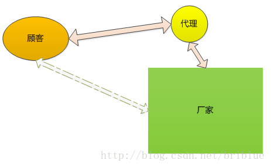
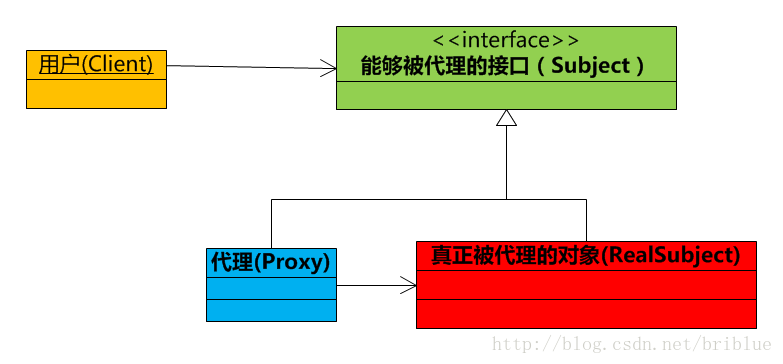

### 介绍
1. 定义
 * 某类特定问题的代码设计解决方案
 * 是一套代码设计的经验总结
 
  > 设计模式，其实只是前人针对某类问题的代码设计经验而已

2. 作用
 * 提高代码复用性，降低开发成本和周期
 * 提高代码可维护性、可拓展性
 * 使书写的代码更加优雅
 * 是代码更加容易让人理解
 
## 设计模式的设计原则


* 单一职责原则

  * 定义：不要存在多于一个导致类变更的原因。通俗的说，即一个类只负责一项职责
  * 问题由来：类T负责两个不同的职责：职责P1，职责P2。当由于职责P1需求发生改变而需要修改类T时，有可能会导致原本运行正常的职责P2功能发生故障
  * 解决方案：遵循单一职责原则。分别建立两个类T1、T2，使T1完成职责P1功能，T2完成职责P2功能。这样，当修改类T1时，不会使职责P2发生故障风险；同理，当修改T2时，也不会使职责P1发生故障风险
  * 遵循单一职责原的优点有
     * 可以降低类的复杂度，一个类只负责一项职责，其逻辑肯定要比负责多项职责简单的多
     * 提高类的可读性，提高系统的可维护性
     * 变更引起的风险降低，变更是必然的，如果单一职责原则遵守的好，当修改一个功能时，可以显著降低对其他功能的影响
  
* 里式替换原则
  * 定义1：在软件开发过程中，子类替换父类后，程序的行为是一样的
  * 定义2：只有当衍生类可以替换掉基类，软件单位的功能不受到影响时，基类才能真正被复用，而衍生类也能够在基类的基础上增加新的行为
  * 问题由来：有一功能P1，由类A完成。现需要将功能P1进行扩展，扩展后的功能为P，其中P由原有功能P1与新功能P2组成。新功能P由类A的子类B来完成，则子类B在完成新功能P2的同时，有可能会导致原有功能P1发生故障
  * 解决方案：当使用继承时，遵循里氏替换原则。类B继承类A时，除添加新的方法完成新增功能P2外，尽量不要重写父类A的方法，也尽量不要重载父类A的方法【由时候我们可以采用final的手段强制来遵循】
  * 包含含义
     * 子类可以实现父类的抽象方法，但不能覆盖父类的非抽象方法
     * 子类中可以增加自己特有的方法
     * 当子类的方法重载父类的方法时，方法的前置条件（即方法的形参）要比父类方法的输入参数更宽松。【注意区分重载和重写】
     * 当子类的方法实现父类的抽象方法时，方法的后置条件（即方法的返回值）要比父类更严格
 
* 依赖倒置原则
  * 定义：高层模块不应该依赖低层模块，二者都应该依赖其抽象；抽象不应该依赖细节；细节应该依赖抽象。通俗的说，即要求对抽象进行编程，不要对实现进行编程，这样就降低了客户与实现模块间的耦合
  * 问题由来：类A直接依赖类B，假如要将类A改为依赖类C，则必须通过修改类A的代码来达成。这种场景下，类A一般是高层模块，负责复杂的业务逻辑；类B和类C是低层模块，负责基本的原子操作；假如修改类A，会给程序带来不必要的风险
  * 解决方案：将类A修改为依赖接口I，类B和类C各自实现接口I，类A通过接口I间接与类B或者类C发生联系，则会大大降低修改类A的几率
  * 基于事实：相对于细节的多变性，抽象的东西要稳定的多。以抽象为基础搭建起来的架构比以细节为基础搭建起来的架构要稳定的多。在java中，抽象指的是接口或者抽象类，细节就是具体的实现类，使用接口或者抽象类的目的是制定好规范和契约，而不去涉及任何具体的操作，把展现细节的任务交给他们的实现类去完成
  * 遵循原则
     * 低层模块尽量都要有抽象类或接口，或者两者都有。【可能会被人用到的】
     * 变量的声明类型尽量是抽象类或接口
     * 使用继承时遵循里氏替换原则
  * 核心
     * 就是要我们面向接口编程，理解了面向接口编程，也就理解了依赖倒置

* 接口隔离原则
  * 定义：客户端不应该依赖它不需要的接口；一个类对另一个类的依赖应该建立在最小的接口上
  * 问题由来：类A通过接口I依赖类B，类C通过接口I依赖类D，如果接口I对于类A和类B来说不是最小接口，则类B和类D必须去实现他们不需要的方法
  * 解决方案：将臃肿的接口I拆分为独立的几个接口，类A和类C分别与他们需要的接口建立依赖关系。也就是采用接口隔离原则
  * 遵循原则
     * 接口尽量小，但是要有限度。对接口进行细化可以提高程序设计灵活性是不挣的事实，但是如果过小，则会造成接口数量过多，使设计复杂化。所以一定要适度
     * 为依赖接口的类定制服务，只暴露给调用的类它需要的方法，它不需要的方法则隐藏起来。只有专注地为一个模块提供定制服务，才能建立最小的依赖关系
     * 提高内聚，减少对外交互。使接口用最少的方法去完成最多的事情。
运用接口隔离原则，一定要适度，接口设计的过大或过小都不好。设计接口的时候，只有多花些时间去思考和筹划，才能准确地实践这一原则
  * 和单一职责的区别
     * 单一职责原则原注重的是职责；而接口隔离原则注重对接口依赖的隔离
     * 单一职责原则主要是约束类，其次才是接口和方法，它针对的是程序中的实现和细节;而接口隔离原则主要约束接口接口，主要针对抽象，针对程序整体框架的构建
* 迪米特法则（最小知道原则）
  * 定义：一个对象应该对其他对象保持最少的了解
  * 问题由来：类与类之间的关系越密切，耦合度越大，当一个类发生改变时，对另一个类的影响也越大
  * 解决方案：尽量降低类与类之间的耦合
  * 通俗含义：通俗的来讲，就是一个类对自己依赖的类知道的越少越好。也就是说，对于被依赖的类来说，无论逻辑多么复杂，都尽量地的将逻辑封装在类的内部，对外除了提供的public方法，不对外泄漏任何信息。迪米特法则还有一个更简单的定义：只与直接的朋友通信。首先来解释一下什么是直接的朋友：每个对象都会与其他对象有耦合关系，只要两个对象之间有耦合关系，我们就说这两个对象之间是朋友关系。耦合的方式很多，依赖、关联、组合、聚合等。其中，我们称出现成员变量、方法参数、方法返回值中的类为直接的朋友，而出现在局部变量中的类则不是直接的朋友。也就是说，陌生的类最好不要作为局部变量的形式出现在类的内部
  
* 开放封闭原则

 * 定义：一个软件实体如类、模块和函数应该对扩展开放，对修改关闭。通俗的说，即为了使程序的扩展性好，易于维护和升级。想要达到这样的效果，需要面向接口编程
  * 问题由来：在软件的生命周期内，因为变化、升级和维护等原因需要对软件原有代码进行修改时，可能会给旧代码中引入错误，也可能会使我们不得不对整个功能进行重构，并且需要原有代码经过重新测试
  * 解决方案：当软件需要变化时，尽量通过扩展软件实体的行为来实现变化，而不是通过修改已有的代码来实现变化
  * 表达意思
     * 用抽象构建框架，用实现扩展细节。因为抽象灵活性好，适应性广，只要抽象的合理，可以基本保持软件架构的稳定。而软件中易变的细节，我们用从抽象派生的实现类来进行扩展，当软件需要发生变化时，我们只需要根据需求重新派生一个实现类来扩展就可以了。当然前提是我们的抽象要合理，要对需求的变更有前瞻性和预见性才行
     * 回想一下前面说的5项原则，恰恰是告诉我们用抽象构建框架，用实现扩展细节的注意事项而已：单一职责原则告诉我们实现类要职责单一；里氏替换原则告诉我们不要破坏继承体系；依赖倒置原则告诉我们要面向接口编程；接口隔离原则告诉我们在设计接口的时候要精简单一；迪米特法则告诉我们要降低耦合。而开闭原则是总纲，他告诉我们要对扩展开放，对修改关闭
     
### 设计模式分类


#### 单例模式

###### 实现方式

1 .实例引入  
背景：小成有一个塑料生产厂，但里面只有一个仓库。  
目的：想用代码来实现仓库的管理  
现有做法： 建立仓库类和工人类  
其中，仓库类里的quantity=商品数量；工人类里有搬运方法MoveIn(int i)和MoveOut(int i)。  
出现的问题：通过测试发现，每次工人搬运操作都会新建一个仓库，就是货物都不是放在同一仓库，这是怎么回事呢？  

``` java
//仓库类
class StoreHouse {
    private int quantity = 100;

    public void setQuantity(int quantity) {
        this.quantity = quantity;
    }

    public int getQuantity() {
        return quantity;
    }
}

//搬货工人类
class Carrier{
    public StoreHouse mStoreHouse;
    public Carrier(StoreHouse storeHouse){
        mStoreHouse = storeHouse;
    }
    //搬货进仓库
    public void MoveIn(int i){
        mStoreHouse.setQuantity(mStoreHouse.getQuantity()+i);
    }
    //搬货出仓库
    public void MoveOut(int i){
        mStoreHouse.setQuantity(mStoreHouse.getQuantity()-i);
    }
}

//工人搬运测试
public class SinglePattern {
    public static void main(String[] args){
        StoreHouse mStoreHouse1 = new StoreHouse();
        StoreHouse mStoreHouse2 = new StoreHouse();
        Carrier Carrier1 = new Carrier(mStoreHouse1);
        Carrier Carrier2 = new Carrier(mStoreHouse2);

        System.out.println("两个是不是同一个？");

        if(mStoreHouse1.equals(mStoreHouse2)){//这里用equals而不是用 == 符号，因为 == 符号只是比较两个对象的地址
            System.out.println("是同一个");
        }else {
            System.out.println("不是同一个");
        }
        //搬运工搬完货物之后出来汇报仓库商品数量
        Carrier1.MoveIn(30);
        System.out.println("仓库商品余量："+Carrier1.mStoreHouse.getQuantity());
        Carrier2.MoveOut(50);
        System.out.println("仓库商品余量："+Carrier2.mStoreHouse.getQuantity());
    }
}
```
结果：

``` java
两个是不是同一个？
不是同一个
仓库商品余量：130
仓库商品余量：50
```
2 .模式介绍  
2.1 模式说明：实现1个类只有1个实例化对象 & 提供一个全局访问点  
2.2 作用：保证1个类只有1个对象，降低对象之间的耦合度  
2.3 工作原理：  

``` java
public class Singleton {
//1. 创建私有变量 ourInstance（用以记录 Singleton 的唯一实例）
//2. 内部进行实例化
    private static Singleton ourInstance  = new  Singleton();

//3. 把类的构造方法私有化，不让外部调用构造方法实例化
    private Singleton() {
    }
//4. 定义公有方法提供该类的全局唯一访问点
//5. 外部通过调用getInstance()方法来返回唯一的实例
    public static  Singleton newInstance() {
        return ourInstance;
    }
}
```
3 特点：  
3.1 优点：  

* 提供了对唯一实例的受控访问
* 由于在系统内存中只存在一个对象，因此可以节约系统资源，对于一些需要频繁创建和销毁的对象单例模式无疑可以提高系统的性能
* 可以根据实际情况需要，在单例模式的基础上扩展做出双例模式，多例模式

3.2 缺点：  

* 单例类的职责过重，里面的代码可能会过于复杂，在一定程度上违背了“单一职责原则”
* 如果实例化的对象长时间不被利用，会被系统认为是垃圾而被回收，这将导致对象状态的丢失

4 实现方式  


4.1 初始化单例类时 即创建单例  
4.1.1 饿汉式  

* 依赖 JVM类加载机制，保证单例只会被创建1次，即线程安全

> JVM在类的初始化阶段(即 在Class被加载后、被线程使用前)，会执行类的初始化  
> 在执行类的初始化期间，JVM会去获取一个锁。这个锁可以同步多个线程对同一个类的初始化

* 具体实现

``` java
class Singleton {

    // 1. 加载该类时，单例就会自动被创建
    private static  Singleton ourInstance  = new  Singleton();
    
    // 2. 构造函数 设置为 私有权限
    // 原因：禁止他人创建实例 
    private Singleton() {
    }
    
    // 3. 通过调用静态方法获得创建的单例
    public static  Singleton newInstance() {
        return ourInstance;
    }
}
```

* 应用场景
初始化速度快

4.1.2 枚举类型  

* 原理：根据枚举类型的下述特点，满足单例模式所需 创建单例、线程安全、实现简洁的需求


* 具体实现

``` java 
public enum SingletonEnum {
  // 定义1个枚举的元素，即为单例类的1个实例
  INSTANCE;

  public void getName() {
    System.out.println("Name");
  }
}
```
注：这种方式是Effective Java作者Josh Bloch 提倡的方式，它不仅能避免多线程同步问题，而且还能防止反序列化重新创建新的对象

4.2 按需、延迟创建单例  
4.2.1 懒汉式  

* 与 饿汉式 最大的区别是：单例创建的时机

> 饿汉式：单例创建时机不可控，即类加载时自动创建单例  
> 懒汉式：单例创建时机可控，即有需要时，才手动创建单例   

* 具体实现

``` java
lass Singleton {
    // 1. 类加载时，先不自动创建单例
   //  即，将单例的引用先赋值为 Null
    private static  Singleton ourInstance  = null；

    // 2. 构造函数 设置为 私有权限
    // 原因：禁止他人创建实例 
    private Singleton() {
    }
    
    // 3. 需要时才手动调用 newInstance（） 创建 单例   
    public static  Singleton newInstance() {
    // 先判断单例是否为空，以避免重复创建
    if( ourInstance == null){
        ourInstance = new Singleton();
        }
        return ourInstance;
    }
}
```

* 缺点  
基础实现的懒汉式是线程不安全的，具体原因如下


4.2.2 同步锁  

* 原理：使用同步锁 synchronized锁住 创建单例的方法 ，防止多个线程同时调用，从而避免造成单例被多次创建

> 即，getInstance（）方法块只能运行在1个线程中  
> 若该段代码已在1个线程中运行，另外1个线程试图运行该块代码，则 会被阻塞而一直等待  
> 而在这个线程安全的方法里我们实现了单例的创建，保证了多线程模式下 单例对象的唯一性  

* 具体实现

``` java
// 写法1
class Singleton {
    // 1. 类加载时，先不自动创建单例
    //  即，将单例的引用先赋值为 Null
    private static  Singleton ourInstance  = null；
    
    // 2. 构造函数 设置为 私有权限
    // 原因：禁止他人创建实例 
    private Singleton() {
    }
    
// 3. 加入同步锁
public static synchronized Singleton getInstance(){
        // 先判断单例是否为空，以避免重复创建
        if ( ourInstance == null )
            ourInstance = new Singleton();
        return ourInstance;
    }
}


// 写法2
// 该写法的作用与上述写法作用相同，只是写法有所区别
class Singleton{ 

    private static Singleton instance = null;

    private Singleton(){
}

    public static Singleton getInstance(){
        // 加入同步锁
        synchronized(Singleton.class) {
            if (instance == null)
                instance = new Singleton();
        }
        return instance;
    }
}
```

* 缺点：每次访问都要进行线程同步（即 调用synchronized锁)，造成过多的同步开销（加锁 = 耗时、耗能）

> 实际上只需在第1次调用该方法时才需要同步，一旦单例创建成功后，就没必要进行同步

4.2.3 DCL双重检索(懒汉式的改进)    

* 在同步锁的基础上，添加1层 if判断：若单例已创建，则不需再执行加锁操作就可获取实例，从而提高性能
* 具体实现

``` java
class Singleton {
    private static  volatile  Singleton ourInstance  = null；

    private Singleton() {
    }
    
    public static  Singleton newInstance() {
     // 加入双重校验锁
    // 校验锁1：第1个if
    if( ourInstance == null){  // ①
     synchronized (Singleton.class){ // ②
      // 校验锁2：第2个 if
      if( ourInstance == null){
          ourInstance = new Singleton();
          }
      }
  }
        return ourInstance;
   }
}

// 说明
// 校验锁1：第1个if
// 作用：若单例已创建，则直接返回已创建的单例，无需再执行加锁操作
// 即直接跳到执行 return ourInstance

// 校验锁2：第2个 if 
// 作用：防止多次创建单例问题
// 原理
  // 1. 线程A调用newInstance()，当运行到②位置时，此时线程B也调用了newInstance()
  // 2. 因线程A并没有执行instance = new Singleton();，此时instance仍为空，因此线程B能突破第1层 if 判断，运行到①位置等待synchronized中的A线程执行完毕
  // 3. 当线程A释放同步锁时，单例已创建，即instance已非空
  // 4. 此时线程B 从①开始执行到位置②。此时第2层 if 判断 = 为空（单例已创建），因此也不会创建多余的实例
```

* 缺点：实现复杂 = 多种判断，易出错
* volatile作用：以下会涉及到Java内存模型的知识
  * 禁止指令重排序。我们知道new Singleton()是一个非原子操作，编译器可能会重排序【构造函数可能在整个对象初始化完成前执行完毕，即赋值操作（只是在内存中开辟一片存储区域后直接返回内存的引用）在初始化对象前完成】。而线程B在线程A赋值完时判断instance就不为null了，此时B拿到的将是一个没有初始化完成的半成品。
  * 保证可见性。线程A在自己的工作线程内创建了实例，但此时还未同步到主存中；此时线程B在主存中判断instance还是null，那么线程B又将在自己的工作线程中创建一个实例，这样就创建了多个实例。
  * volatile禁止指令重排序只能保证volatile修饰的代码之后的代码不会在它之前执行。

4.2.3 静态内部类

* 根据 静态内部类的特性，同时解决了按需加载、线程安全的问题，同时实现简洁  

> 在静态内部类里创建单例，在装载该内部类时才会去创建单例
> 线程安全：类是由 JVM加载，而JVM只会加载1遍，保证只有1个单例

* 具体实现

``` Java
public class Singleton_InnerClass {

  // 创建静态内部类
  private static class SingleHolder {
    // 在静态内部类里面创建单例
    private static final Singleton_InnerClass INSTANCE = new Singleton_InnerClass();
  }

  private Singleton_InnerClass() {}

  // 延迟加载、按需创建
  public static Singleton_InnerClass newInstance() {
    return SingleHolder.INSTANCE;
  }
}

// 调用过程说明：
      // 1. 外部调用类的newInstance() 
      // 2. 自动调用SingleHolder.INSTANCE
       // 2.1 此时单例类SingleHolder得到初始化
       // 2.2 而该类在装载 & 被初始化时，会初始化它的静态域，从而创建单例；
       // 2.3 由于是静态域，因此只会JVM只会加载1遍，Java虚拟机保证了线程安全性
     // 3. 最终只创建1个单例
``` 

5 不使用synchronized和lock，实现一个线程安全的单例 
5.1 实现方式：CAS(Compare And Swap)  
5.2 原理：CAS是乐观锁技术，当多个线程尝试使用CAS同时更新同一个变量时，只有其中一个线程能更新变量的值，而其它线程都失败，失败的线程并不会被挂起，而是被告知这次竞争中失败，并可以再次尝试。
5.3 具体实现  

```java 
public class Singleton_CAS {

  private static final AtomicReference<Singleton_CAS> INSTANCE = new AtomicReference<>();

  private Singleton_CAS() {}

  public static Singleton_CAS getInstance() {
    for (; ; ) {
      Singleton_CAS singleton = INSTANCE.get();
      if (singleton != null) {
        return singleton;
      }

      singleton = new Singleton_CAS();
      if (INSTANCE.compareAndSet(null, singleton)) {
        return singleton;
      }
    }
  }
}
```

5.4 优缺点  

* 用CAS的好处在于不需要使用传统的锁机制来保证线程安全,CAS是一种基于忙等待的算法,依赖底层硬件的实现,相对于锁它没有线程切换和阻塞的额外消耗,可以支持较大的并行度
* CAS的一个重要缺点在于如果忙等待一直执行不成功(一直在死循环中),会对CPU造成较大的执行开销
* 另外，如果N个线程同时执行到singleton = new Singleton();的时候，会有大量对象创建，很可能导致内存溢出

6 总结  


#### 工厂模式
1. 引言
1）还没有工厂时代：假如还没有工业革命，如果一个客户要一款宝马车,一般的做法是客户去创建一款宝马车，然后拿来用。  
2）简单工厂模式：后来出现工业革命。用户不用去创建宝马车。因为客户有一个工厂来帮他创建宝马.想要什么车，这个工厂就可以建。比如想要320i系列车。工厂就创建这个系列的车。即工厂可以创建产品。  
3）工厂方法模式时代：为了满足客户，宝马车系列越来越多，如320i，523i,30li等系列一个工厂无法创建所有的宝马系列。于是由单独分出来多个具体的工厂。每个具体工厂创建一种系列。即具体工厂类只能创建一个具体产品。但是宝马工厂还是个抽象。你需要指定某个具体的工厂才能生产车出来。  
4）抽象工厂模式时代：随着客户的要求越来越高，宝马车必须配置空调。于是这个工厂开始生产宝马车和需要的空调。  
   最终是客户只要对宝马的销售员说：我要523i空调车，销售员就直接给他523i空调车了。而不用自己去创建523i空调车宝马车.  
这就是工厂模式。  

2. 分类
工厂模式主要是为创建对象提供过渡接口，以便将创建对象的具体过程屏蔽隔离起来，达到提高灵活性的目的。   
工厂模式可以分为三类：   
1）简单工厂模式（Simple Factory）   
2）工厂方法模式（Factory Method）   
3）抽象工厂模式（Abstract Factory）   
这三种模式从上到下逐步抽象，并且更具一般性。   
GOF在《设计模式》一书中将工厂模式分为两类：工厂方法模式（Factory Method）与抽象工厂模式（Abstract Factory）。  
将简单工厂模式（Simple Factory）看为工厂方法模式的一种特例，两者归为一类。  

3. 区别
工厂方法模式：
一个抽象产品类，可以派生出多个具体产品类。   
一个抽象工厂类，可以派生出多个具体工厂类。   
每个具体工厂类只能创建一个具体产品类的实例。
抽象工厂模式：
多个抽象产品类，每个抽象产品类可以派生出多个具体产品类。   
一个抽象工厂类，可以派生出多个具体工厂类。   
每个具体工厂类可以创建多个具体产品类的实例。   
区别：
工厂方法模式只有一个抽象产品类，而抽象工厂模式有多个。   
工厂方法模式的具体工厂类只能创建一个具体产品类的实例，而抽象工厂模式可以创建多个。
两者皆可。 

##### 简单工厂

1. 含义  
简单工厂模式又叫静态方法模式（因为工厂类定义了一个静态方法）  
现实生活中，工厂是负责生产产品的；同样在设计模式中，简单工厂模式我们可以理解为负责生产对象的一个类，称为“工厂类”。  
2. 解决的问题  
将“类实例化的操作”与“使用对象的操作”分开，让使用者不用知道具体参数就可以实例化出所需要的“产品”类，从而避免了在客户端代码中显式指定，实现了解耦。
即使用者可直接消费产品而不需要知道其生产的细节
3. 模式原理  

3.1 模式组成  

| 组成（角色） | 关系 | 作用 |
| ------ | ------ | ------ |
| 抽象产品（Product） | 具体产品的父类 | 描述产品的公共接口 |
| 具体产品（Concrete Product） | 抽象产品的子类；工厂类创建的目标类 | 描述生产的具体产品 |
| 工厂（Creator） | 被外界调用 | 根据传入不同参数从而创建不同具体产品类的实例 |

3.2 UML类图


3.3 使用步骤
创建抽象产品类 & 定义具体产品的公共接口；
创建具体产品类（继承抽象产品类） & 定义生产的具体产品；
创建工厂类，通过创建静态方法根据传入不同参数从而创建不同具体产品类的实例；
外界通过调用工厂类的静态方法，传入不同参数从而创建不同具体产品类的实例
4. 实例
接下来我用一个实例来对简单工厂模式进行更深一步的介绍。
4.1 实例概况
背景：小成有一个塑料生产厂，用来做塑料加工生意
目的：最近推出了3个产品，小成希望使用简单工厂模式实现3款产品的生产
4.2 使用步骤
实现代码如下：
步骤1. 创建抽象产品类，定义具体产品的公共接口

``` java
abstract class Product{
    public abstract void Show();
}
```

步骤2. 创建具体产品类（继承抽象产品类），定义生产的具体产品

//具体产品类A

``` java
class  ProductA extends  Product{

    @Override
    public void Show() {
        System.out.println("生产出了产品A");
    }
}
```

//具体产品类B

``` java
class  ProductB extends  Product{

    @Override
    public void Show() {
        System.out.println("生产出了产品C");
    }
}
```

//具体产品类C

``` java
class  ProductC extends  Product{

    @Override
    public void Show() {
        System.out.println("生产出了产品C");
    }
}
```

步骤3. 创建工厂类，通过创建静态方法从而根据传入不同参数创建不同具体产品类的实例

``` java
class  Factory {
    public static Product Manufacture(String ProductName){
//工厂类里用switch语句控制生产哪种商品；
//使用者只需要调用工厂类的静态方法就可以实现产品类的实例化。
        switch (ProductName){
            case "A":
                return new ProductA();

            case "B":
                return new ProductB();

            case "C":
                return new ProductC();

            default:
                return null;

        }
    }
}
```

步骤4. 外界通过调用工厂类的静态方法，传入不同参数从而创建不同具体产品类的实例

``` java
//工厂产品生产流程
public class SimpleFactoryPattern {
    public static void main(String[] args){
        Factory mFactory = new Factory();

        //客户要产品A
        try {
//调用工厂类的静态方法 & 传入不同参数从而创建产品实例
            mFactory.Manufacture("A").Show();
        }catch (NullPointerException e){
            System.out.println("没有这一类产品");
        }

        //客户要产品B
        try {
            mFactory.Manufacture("B").Show();
        }catch (NullPointerException e){
            System.out.println("没有这一类产品");
        }

        //客户要产品C
        try {
            mFactory.Manufacture("C").Show();
        }catch (NullPointerException e){
            System.out.println("没有这一类产品");
        }

        //客户要产品D
        try {
            mFactory.Manufacture("D").Show();
        }catch (NullPointerException e){
            System.out.println("没有这一类产品");
        }
    }
}
```

``` java
结果输出：
生产出了产品A
生产出了产品B
生产出了产品C
没有这一类产品
```

5.优点
将创建实例的工作与使用实例的工作分开，使用者不必关心类对象如何创建，实现了解耦；
把初始化实例时的工作放到工厂里进行，使代码更容易维护。 更符合面向对象的原则 & 面向接口编程，而不是面向实现编程。
6. 缺点
工厂类集中了所有实例（产品）的创建逻辑，一旦这个工厂不能正常工作，整个系统都会受到影响；
违背“开放 - 关闭原则”，一旦添加新产品就不得不修改工厂类的逻辑，这样就会造成工厂逻辑过于复杂。
简单工厂模式由于使用了静态工厂方法，静态方法不能被继承和重写，会造成工厂角色无法形成基于继承的等级结构。
7. 应用场景
客户如果只知道传入工厂类的参数，对于如何创建对象的逻辑不关心时；
当工厂类负责创建的对象（具体产品）比较少时。

##### 工厂方法模式

1.介绍
1.1 定义  
工厂方法模式，又称工厂模式、多态工厂模式和虚拟构造器模式，通过定义工厂父类负责定义创建对象的公共接口，而子类则负责生成具体的对象。
1.2 主要作用
将类的实例化（具体产品的创建）延迟到工厂类的子类（具体工厂）中完成，即由子类来决定应该实例化（创建）哪一个类。
1.3 解决的问题
简单工厂一旦需要生产新产品就需要修改工厂类的方法逻辑，违背了“开放 - 关闭原则
> 即简单工厂模式的缺点  
> 之所以可以解决简单工厂的问题，是因为工厂方法模式把具体产品的创建推迟到工厂类的子类（具体工厂）中，此时工厂类不再负责所有产品的创建，而只是给出具体工厂必须实现的接口，这样工厂方法模式在添加新产品的时候就不修改工厂类逻辑而是添加新的工厂子类，符合开放封闭原则，克服了简单工厂模式中缺点

2.模式原理
2.1 UML类图


2.2 模式组成

| 组成（角色） | 关系 | 作用  |
| :------| :------ | :------ |
| 抽象产品（Product） | 具体产品的父类 | 描述具体产品的公共接口 |
| 具体产品（Concrete Product） | 抽象产品的子类；工厂类创建的目标类 | 描述生产的具体产品 |
| 抽象工厂（Creator） | 具体工厂的父类 | 描述具体工厂的公共接口 |
| 具体工厂（Concrete Creator） | 抽象工厂的子类；被外界调用 | 描述具体工厂；实现FactoryMethod工厂方法创建产品的实例 |

2.3 使用步骤
步骤1： 创建抽象工厂类，定义具体工厂的公共接口；
步骤2： 创建抽象产品类 ，定义具体产品的公共接口；
步骤3： 创建具体产品类（继承抽象产品类） & 定义生产的具体产品；
步骤4：创建具体工厂类（继承抽象工厂类），定义创建对应具体产品实例的方法；
步骤5：外界通过调用具体工厂类的方法，从而创建不同具体产品类的实例

3.实例讲解
3.1 实例概况
背景：小成有一间塑料加工厂（仅生产A类产品）；随着客户需求的变化，客户需要生产B类产品；
冲突：改变原有塑料加工厂的配置和变化非常困难，假设下一次客户需要再发生变化，再次改变将增大非常大的成本；
解决方案：小成决定置办塑料分厂B来生产B类产品；
>即工厂方法模式

3.2 使用步骤
步骤1： 创建抽象工厂类，定义具体工厂的公共接口

``` java
abstract class Factory{
    public abstract Product Manufacture();
}
```

步骤2： 创建抽象产品类 ，定义具体产品的公共接口；

``` java
abstract class Product{
    public abstract void Show();
}
```

步骤3： 创建具体产品类（继承抽象产品类）， 定义生产的具体产品；

``` java
//具体产品A类
class  ProductA extends  Product{
    @Override
    public void Show() {
        System.out.println("生产出了产品A");
    }
}
```

//具体产品B类

``` java
class  ProductB extends  Product{

    @Override
    public void Show() {
        System.out.println("生产出了产品B");
    }
}
```


步骤4：创建具体工厂类（继承抽象工厂类），定义创建对应具体产品实例的方法；

//工厂A类 - 生产A类产品

``` java
class  FactoryA extends Factory{
    @Override
    public Product Manufacture() {
        return new ProductA();
    }
}
```

//工厂B类 - 生产B类产品

``` java
class  FactoryB extends Factory{
    @Override
    public Product Manufacture() {
        return new ProductB();
    }
}
```

步骤5：外界通过调用具体工厂类的方法，从而创建不同具体产品类的实例

``` java
//生产工作流程
public class FactoryPattern {
    public static void main(String[] args){
        //客户要产品A
        FactoryA mFactoryA = new FactoryA();
        mFactoryA.Manufacture().Show();

        //客户要产品B
        FactoryB mFactoryB = new FactoryB();
        mFactoryB.Manufacture().Show();
    }
}
```
结果：

``` java
生产出了产品A
生产出了产品B
```

4.优点

* 更符合开-闭原则
新增一种产品时，只需要增加相应的具体产品类和相应的工厂子类即可

> 简单工厂模式需要修改工厂类的判断逻辑

* 符合单一职责原则
每个具体工厂类只负责创建对应的产品

>简单工厂中的工厂类存在复杂的switch逻辑判断

* 不使用静态工厂方法，可以形成基于继承的等级结构。

> 简单工厂模式的工厂类使用静态工厂方法

总结：工厂模式可以说是简单工厂模式的进一步抽象和拓展，在保留了简单工厂的封装优点的同时，让扩展变得简单，让继承变得可行，增加了多态性的体现。

5.缺点
添加新产品时，除了增加新产品类外，还要提供与之对应的具体工厂类，系统类的个数将成对增加，在一定程度上增加了系统的复杂度；同时，有更多的类需要编译和运行，会给系统带来一些额外的开销；
由于考虑到系统的可扩展性，需要引入抽象层，在客户端代码中均使用抽象层进行定义，增加了系统的抽象性和理解难度，且在实现时可能需要用到DOM、反射等技术，增加了系统的实现难度。
虽然保证了工厂方法内的对修改关闭，但对于使用工厂方法的类，如果要更换另外一种产品，仍然需要修改实例化的具体工厂类；
一个具体工厂只能创建一种具体产品

6.应用场景

* 当一个类不知道它所需要的对象的类时
* 在工厂方法模式中，客户端不需要知道具体产品类的类名，只需要知道所对应的工厂即可；
* 当一个类希望通过其子类来指定创建对象时
* 在工厂方法模式中，对于抽象工厂类只需要提供一个创建产品的接口，而由其子类来确定具体要创建的对象，利用面向对象的多态性和里氏代换原则，在程序运行时，子类对象将覆盖父类对象，从而使得系统更容易扩展。
* 将创建对象的任务委托给多个工厂子类中的某一个，客户端在使用时可以无须关心是哪一个工厂子类创建产品子类，需要时再动态指定，可将具体工厂类的类名存储在配置文件或数据库中。

##### 抽象工厂模式

引言  
在工厂方法模式中，发现工厂方法模式存在一个严重的问题：
一个具体工厂只能创建一类产品
而在实际过程中，一个工厂往往需要生产多类产品。为了解决上述的问题，我们又使用了一种新的设计模式：抽象工厂模式。

1.介绍

1.1 定义
抽象工厂模式，即Abstract Factory Pattern，提供一个创建一系列相关或相互依赖对象的接口，而无须指定它们具体的类；具体的工厂负责实现具体的产品实例。

> 抽象工厂模式与工厂方法模式最大的区别：抽象工厂中每个工厂可以创建多种类的产品；而工厂方法每个工厂只能创建一类

1.2 主要作用
允许使用抽象的接口来创建一组相关产品，而不需要知道或关心实际生产出的具体产品是什么，这样就可以从具体产品中被解耦。

1.3 解决的问题
每个工厂只能创建一类产品

>即工厂方法模式的缺点

2.模式原理

2.1 UML类图


2.2 模式组成

| 组成（角色） | 关系 | 作用 |
|  :------ |  :------ | :------ |
| 抽象产品族（AbstractProduct） | 抽象产品的父类 | 描述抽象产品的公共接口 |
| 抽象产品（Product） | 具体产品的父类 | 描述具体产品的公共接口 |
| 具体产品（Concrete Product） | 抽象产品的子类；工厂类创建的目标类 | 描述生产的具体产品 |
| 抽象工厂（Creator） | 具体工厂的父类 | 描述具体工厂的公共接口 |
| 具体工厂（Concrete Creator） | 抽象工厂的子类；被外界调用 | 描述具体工厂；实现FactoryMethod工厂方法创建产品的实例 |


2.3 使用步骤
步骤1： 创建抽象工厂类，定义具体工厂的公共接口；
步骤2： 创建抽象产品族类 ，定义抽象产品的公共接口；
步骤3： 创建抽象产品类 （继承抽象产品族类），定义具体产品的公共接口；
步骤4： 创建具体产品类（继承抽象产品类） & 定义生产的具体产品；
步骤5：创建具体工厂类（继承抽象工厂类），定义创建对应具体产品实例的方法；
步骤6：客户端通过实例化具体的工厂类，并调用其创建不同目标产品的方法创建不同具体产品类的实例

3.实例讲解

3.1 实例概况

背景：小成有两间塑料加工厂（A厂仅生产容器类产品；B厂仅生产模具类产品）；随着客户需求的变化，A厂所在地的客户需要也模具类产品，B厂所在地的客户也需要容器类产品；
冲突：没有资源（资金+租位）在当地分别开设多一家注塑分厂
解决方案：在原有的两家塑料厂里增设生产需求的功能，即A厂能生产容器+模具产品；B厂间能生产模具+容器产品。

3.2 使用步骤

步骤1： 创建抽象工厂类，定义具体工厂的公共接口

``` java
abstract class Factory{
   public abstract Product ManufactureContainer();
    public abstract Product ManufactureMould();
}
```

步骤2： 创建抽象产品族类 ，定义具体产品的公共接口；

``` java
abstract class AbstractProduct{
    public abstract void Show();
}
```

步骤3： 创建抽象产品类 ，定义具体产品的公共接口；

``` java
//容器产品抽象类
abstract class ContainerProduct extends AbstractProduct{
    @Override
    public abstract void Show();
}
```

``` java
//模具产品抽象类
abstract class MouldProduct extends AbstractProduct{
    @Override
    public abstract void Show();
}
```

步骤4： 创建具体产品类（继承抽象产品类）， 定义生产的具体产品；

``` java
//容器产品A类
class ContainerProductA extends ContainerProduct{
    @Override
    public void Show() {
        System.out.println("生产出了容器产品A");
    }
}
```

``` java
//容器产品B类
class ContainerProductB extends ContainerProduct{
    @Override
    public void Show() {
        System.out.println("生产出了容器产品B");
    }
}
```

``` 
//模具产品A类
class MouldProductA extends MouldProduct{

    @Override
    public void Show() {
        System.out.println("生产出了模具产品A");
    }
}
```

```
//模具产品B类
class MouldProductB extends MouldProduct{

    @Override
    public void Show() {
        System.out.println("生产出了模具产品B");
    }
}
```

步骤5：创建具体工厂类（继承抽象工厂类），定义创建对应具体产品实例的方法；

```
//A厂 - 生产模具+容器产品
class FactoryA extends Factory{

    @Override
    public Product ManufactureContainer() {
        return new ContainerProductA();
    }

    @Override
    public Product ManufactureMould() {
        return new MouldProductA();
    }
}
```

```
//B厂 - 生产模具+容器产品
class FactoryB extends Factory{

    @Override
    public Product ManufactureContainer() {
        return new ContainerProductB();
    }

    @Override
    public Product ManufactureMould() {
        return new MouldProductB();
    }
}
```

步骤6：客户端通过实例化具体的工厂类，并调用其创建不同目标产品的方法创建不同具体产品类的实例

```
//生产工作流程
public class AbstractFactoryPattern {
    public static void main(String[] args){
        FactoryA mFactoryA = new FactoryA();
        FactoryB mFactoryB = new FactoryB();
        //A厂当地客户需要容器产品A
        mFactoryA.ManufactureContainer().Show();
        //A厂当地客户需要模具产品A
        mFactoryA.ManufactureMould().Show();

        //B厂当地客户需要容器产品B
        mFactoryB.ManufactureContainer().Show();
        //B厂当地客户需要模具产品B
        mFactoryB.ManufactureMould().Show();

    }
}
```

结果：

```
生产出了容器产品A
生产出了容器产品B
生产出了模具产品A
生产出了模具产品B
```

4.优点

* 降低耦合

抽象工厂模式将具体产品的创建延迟到具体工厂的子类中，这样将对象的创建封装起来，可以减少客户端与具体产品类之间的依赖，从而使系统耦合度低，这样更有利于后期的维护和扩展；

* 更符合开-闭原则

新增一种产品类时，只需要增加相应的具体产品类和相应的工厂子类即可


>简单工厂模式需要修改工厂类的判断逻辑


* 符合单一职责原则
每个具体工厂类只负责创建对应的产品


> 简单工厂中的工厂类存在复杂的switch逻辑判断

* 不使用静态工厂方法，可以形成基于继承的等级结构。

>简单工厂模式的工厂类使用静态工厂方法


5.缺点

抽象工厂模式很难支持新种类产品的变化。
这是因为抽象工厂接口中已经确定了可以被创建的产品集合，如果需要添加新产品，此时就必须去修改抽象工厂的接口，这样就涉及到抽象工厂类的以及所有子类的改变，这样也就违背了“开发——封闭”原则。

>对于新的产品族符合开-闭原则；对于新的产品种类不符合开-闭原则，这一特性称为开-闭原则的倾斜性。

6.应用场景

* 一个系统不要求依赖产品类实例如何被创建、组合和表达的表达，这点也是所有工厂模式应用的前提。
* 这个系统有多个系列产品，而系统中只消费其中某一系列产品
* 系统要求提供一个产品类的库，所有产品以同样的接口出现，客户端不需要依赖具体实现。

##### 建造者模式

1.简介
1.1 模式说明
隐藏创建对象的建造过程 & 细节，使得用户在不知对象的建造过程 & 细节的情况下，就可直接创建复杂的对象

>用户只需要给出指定复杂对象的类型和内容；
>建造者模式负责按顺序创建复杂对象（把内部的建造过程和细节隐藏起来)

1.2 作用（解决的问题）

* 降低创建复杂对象的复杂度
* 隔离了创建对象的构建过程 & 表示

从而：

* 方便用户创建复杂的对象（不需要知道实现过程）
* 代码复用性 & 封装性（将对象构建过程和细节进行封装 & 复用）

例子：造汽车 & 买汽车。

工厂（建造者模式）：负责制造汽车（组装过程和细节在工厂内）
汽车购买者（用户）：你只需要说出你需要的型号（对象的类型和内容），然后直接购买就可以使用了（不需要知道汽车是怎么组装的（车轮、车门、发动机、方向盘等等））

2.模式原理
2.1 UML类图


2.2 模式讲解

指挥者（Director）直接和客户（Client）进行需求沟通；
沟通后指挥者将客户创建产品的需求划分为各个部件的建造请求（Builder）；
将各个部件的建造请求委派到具体的建造者（ConcreteBuilder）；
各个具体建造者负责进行产品部件的构建；
最终构建成具体产品（Product）。

3.实例讲解
3.1 实例概况

* 背景

小成希望去电脑城买一台组装的台式主机

* 过程

电脑城老板（Diretor）和小成（Client）进行需求沟通（买来打游戏？学习？）
了解需求后，电脑城老板将小成需要的主机划分为各个部件（Builder）的建造请求（CPU、主板blabla）
指挥装机人员（ConcreteBuilder）去构建组件；
将组件组装起来成小成需要的电脑（Product）

3.2 使用步骤
步骤1：定义组装的过程（Builder）：组装电脑的过程

```
public  abstract class Builder {  

//第一步：装CPU
//声明为抽象方法，具体由子类实现 
    public abstract void  BuildCPU()；

//第二步：装主板
//声明为抽象方法，具体由子类实现 
    public abstract void BuildMainboard（）；

//第三步：装硬盘
//声明为抽象方法，具体由子类实现 
    public abstract void BuildHD（）；

//返回产品的方法：获得组装好的电脑
    public abstract Computer GetComputer（）；
}
```

步骤2： 电脑城老板委派任务给装机人员（Director）

```
public class Director{
    //指挥装机人员组装电脑
    public void Construct(Builder builder){
            
         builder. BuildCPU();
         builder.BuildMainboard（）;
         builder. BuildHD（）;
    }
 }

```

步骤3： 创建具体的建造者（ConcreteBuilder）:装机人员
  
```
//装机人员1
  public class ConcreteBuilder extend  Builder{
    //创建产品实例
    Computer computer = new Computer();

    //组装产品
    @Override
    public void  BuildCPU(){  
       computer.Add("组装CPU")
    }  

    @Override
    public void  BuildMainboard（）{  
       computer.Add("组装主板")
    }  

    @Override
    public void  BuildHD（）{  
       computer.Add("组装主板")
    }  

    //返回组装成功的电脑
     @Override
      public  Computer GetComputer（）{  
      return computer
    }  
}
```

步骤4： 定义具体产品类（Product）：电脑

```
public class Computer{
    
    //电脑组件的集合
    private List<String> parts = new ArrayList<String>()；
     
    //用于将组件组装到电脑里
    public void Add(String part){
    parts.add(part);
}
    
    public void Show(){
          for (int i = 0;i<parts.size();i++){    
          System.out.println(“组件”+parts.get(i)+“装好了”);
          }
          System.out.println(“电脑组装完成，请验收”);
          
 
}

}

```

步骤5：客户端调用-小成到电脑城找老板买电脑

```
public class Builder Pattern{
  public static void main(String[] args){

//逛了很久终于发现一家合适的电脑店
//找到该店的老板和装机人员
  Director director = new Director();
  Builder builder = new ConcreteBuilder();

//沟通需求后，老板叫装机人员去装电脑
director.Construct(builder);

//装完后，组装人员搬来组装好的电脑
Computer computer = builder.GetComputer();
//组装人员展示电脑给小成看
computer.Show()；

    }
        
}
```
   
结果输出

```
组件CUP装好了
组件主板装好了
组件硬盘装好了
电脑组装完成，请验收
```

整合版

```
ublic class CBuilder {

  private final Computer computer;

  public CBuilder(Computer computer) {
    this.computer = computer;
  }

  public Computer GetComputer() {
    return computer;
  }

  public static class Builder {

    private final Computer computer;

    public Builder() {
      this(new Computer());
    }

    public Builder(Computer computer) {
      this.computer = computer;
    }

    public Builder buildCPU(String str) {
      computer.Add(str);
      return this;
    }

    public Builder buildMainBoard(String str) {
      computer.Add(str);
      return this;
    }

    public Builder BuildHD(String str) {
      computer.Add(str);
      return this;
    }

    public CBuilder build() {
      return new CBuilder(computer);
    }
  }
}
```

##### 原型模式

定义：用原型实例指定创建对象的种类，并通过拷贝这些原型创建新的对象。

类型：创建类模式

类图：


1.使用场景

* 资源优化场景：类初始化需要消化非常多的资源，这个资源包括数据、硬件资源等。
* 性能和安全要求的场景：通过new产生一个对象需要非常繁琐的数据准备或访问权限，则可以使用原型模式。
* 一个对象多个修改者的场景：一个对象需要提供给其他对象访问，而且各个调用者可能都需要修改其值时，可以考虑使用原型模式拷贝多个对象供调用者使用。

原型模式主要用于对象的复制，它的核心是就是类图中的原型类Prototype。Prototype类需要具备以下两个条件：

* 实现Cloneable接口。在java语言有一个Cloneable接口，它的作用只有一个，就是在运行时通知虚拟机可以安全地在实现了此接口的类上使用clone方法。在java虚拟机中，只有实现了这个接口的类才可以被拷贝，否则在运行时会抛出CloneNotSupportedException异常。
* 重写Object类中的clone方法。Java中，所有类的父类都是Object类，Object类中有一个clone方法，作用是返回对象的一个拷贝，但是其作用域protected类型的，一般的类无法调用，因此，Prototype类需要将clone方法的作用域修改为public类型。

原型模式是一种比较简单的模式，也非常容易理解，实现一个接口，重写一个方法即完成了原型模式。在实际应用中，原型模式很少单独出现。经常与其他模式混用，他的原型类Prototype也常用抽象类来替代。


2.示例：以拳皇游戏中草薙京的复制为例子

```
public class Prototype implements Cloneable {

  private String name;
  private Date birthday;

  @Override
  public Object clone() throws CloneNotSupportedException {
    return super.clone(); // 直接调用Object对象的clone方法
  }

  public Prototype(String name, Date birthday) {
    this.name = name;
    this.birthday = birthday;
  }

  public String getName() {
    return name;
  }

  public void setName(String name) {
    this.name = name;
  }

  public Date getBirthday() {
    return birthday;
  }

  public void setBirthday(Date birthday) {
    this.birthday = birthday;
  }
}
```

```
fun main(args: Array<String>) {
    val s1 = Prototype("草薙京", Calendar.getInstance(Locale.CHINA).time)
    val s2 = s1.clone() as Prototype

    println(s1)
    println(s1.name)
    println(s1.birthday)


    println("-----------------------")

    println(s2)
    println(s2.name)
    println(s2.birthday)
}
```

结果：

```
factory.prototype.Prototype@2f92e0f4
草薙京
Sat Jun 22 12:06:29 CST 2019
-----------------------
factory.prototype.Prototype@5305068a
草薙京
Sat Jun 22 12:06:29 CST 2019
```
从运行结果可看出复制出的是一个新对象并且和原型对象有相同属性值。

3.原型模式的注意事项

* 使用原型模式复制对象不会调用类的构造方法。因为对象的复制是通过调用Object类的clone方法来完成的，它直接在内存中复制数据，因此不会调用到类的构造方法。不但构造方法中的代码不会执行，甚至连访问权限都对原型模式无效。单例模式中，只要将构造方法的访问权限设置为private型，就可以实现单例。但是clone方法直接无视构造方法的权限，所以，单例模式与原型模式是冲突的，在使用时要特别注意。
* 深拷贝与浅拷贝。Object类的clone方法只会拷贝对象中的基本的数据类型（8种基本数据类型byte,char,short,int,long,float,double，boolean），对于数组、容器对象、引用对象等都不会拷贝，这就是浅拷贝。如果要实现深拷贝，必须将原型模式中的数组、容器对象、引用对象等另行拷贝。

4.优点

性能优良：原型模式是在内存二进制流的拷贝，要比直接new一个对象性能好很多，特别是要在一个循环体内产生大量的对象时，原型模式可以更好地体现其优点。

5.缺点

逃避构造函数的约束（clone的时候，构造函数不会执行）：这既是它的优点也是缺点，直接在内存中拷贝，构造函数是不会执行的，需要在实际应用时考虑。
需要注意类中可变引用成员浅拷贝带来的问题，可以考虑使用深拷贝（对成员也进行一次clone，并且赋值给新对象的成员）
类成员中有final类型的成员，这个类不能进行clone。（此时应该去掉final关键字）「如果原型模式中的数组、容器对象、引用对象作为成员变量被finali修饰时，无法对它们单独clone，因为final修饰的变量需要初始化，不能重新赋值」

#### 适配器模式

1.介绍
1.1 模式说明
定义一个包装类，用于包装不兼容接口的对象

>包装类 = 适配器Adapter；  
>被包装对象 = 适配者Adaptee = 被适配的类

1.2 主要作用
把一个类的接口变换成客户端所期待的另一种接口，从而使原本接口不匹配而无法一起工作的两个类能够在一起工作。

>适配器模式的形式分为：类的适配器模式 & 对象的适配器模式

1.3 解决的问题
原本由于接口不兼容而不能一起工作的那些类可以在一起工作

2.模式原理
2.1 类的适配器模式
类的适配器模式是把适配的类的API转换成为目标类的API。
2.1.1 UML类图 & 组成


在上图中可以看出：

* 冲突：Target期待调用Request方法，而Adaptee并没有（这就是所谓的不兼容了）。
* 解决方案：为使Target能够使用Adaptee类里的SpecificRequest方法，故提供一个中间环节Adapter类（继承Adaptee & 实现Target接口），把Adaptee的API与Target的API衔接起来（适配）。

>Adapter与Adaptee是继承关系，这决定了这个适配器模式是类的

2.1.2 使用步骤（代码解析）
步骤1： 创建Target接口；

```
public interface Target {
 
    //这是源类Adapteee没有的方法
    public void Request(); 
}
```


步骤2： 创建源类（Adaptee） ；

```
public class Adaptee {
    
    public void SpecificRequest(){
    }
}
```

步骤3： 创建适配器类（Adapter）

```
//适配器Adapter继承自Adaptee，同时又实现了目标(Target)接口。
public class Adapter extends Adaptee implements Target {

    //目标接口要求调用Request()这个方法名，但源类Adaptee没有方法Request()
    //因此适配器补充上这个方法名
    //但实际上Request()只是调用源类Adaptee的SpecificRequest()方法的内容
    //所以适配器只是将SpecificRequest()方法作了一层封装，封装成Target可以调用的Request()而已
    @Override
    public void Request() {
        this.SpecificRequest();
    }

}
```

```
步骤4：定义具体使用目标类，并通过Adapter类调用所需要的方法从而实现目标
public class AdapterPattern {

    public static void main(String[] args){

        Target mAdapter = new Adapter()；
        mAdapter.Request（）;
     
    }
}
```

2.1.3 实例讲解
接下来我用一个实例来对类的适配器模式进行更深一步的介绍。
a. 实例概况

* 背景：小成买了一个进口的电视机
* 冲突：进口电视机要求电压（110V）与国内插头标准输出电压（220V）不兼容
* 解决方案：设置一个适配器将插头输出的220V转变成110V

>即适配器模式中的类的适配器模式

b. 使用步骤
步骤1： 创建Target接口（期待得到的插头）：能输出110V（将220V转换成110V）

```
 public interface Target {

    //将220V转换输出110V（原有插头（Adaptee）没有的）
    public void Convert_110v();
}
```

步骤2： 创建源类（原有的插头） ；

```
class PowerPort220V{
//原有插头只能输出220V
    public void Output_220v(){
    }
}
```

步骤3：创建适配器类（Adapter）

```
class Adapter220V extends PowerPort220V implements Target{
   //期待的插头要求调用Convert_110v()，但原有插头没有
    //因此适配器补充上这个方法名
    //但实际上Convert_110v()只是调用原有插头的Output_220v()方法的内容
    //所以适配器只是将Output_220v()作了一层封装，封装成Target可以调用的Convert_110v()而已

    @Override
    public void Convert_110v(){
      this.Output_220v;
    }
}
```

步骤4：定义具体使用目标类，并通过Adapter类调用所需要的方法从而实现目标（不需要通过原有插头）

```
//进口机器类
class ImportedMachine {

    @Override
    public void Work() {
        System.out.println("进口机器正常运行");
    }
}
```

```
//通过Adapter类从而调用所需要的方法
public class AdapterPattern {
    public static void main(String[] args){

        Target mAdapter220V = new Adapter220V();
        ImportedMachine mImportedMachine = new ImportedMachine();
       
        //用户拿着进口机器插上适配器（调用Convert_110v()方法）
        //再将适配器插上原有插头（Convert_110v()方法内部调用Output_220v()方法输出220V）
        //适配器只是个外壳，对外提供110V，但本质还是220V进行供电
        mAdapter220V.Convert_110v();
        mImportedMachine.Work();
    }
}
```

2.2 对象的适配器模式
与类的适配器模式相同，对象的适配器模式也是把适配的类的API转换成为目标类的API。

>与类的适配器模式不同的是，对象的适配器模式不是使用继承关系连接到Adaptee类，而是使用委派关系连接到Adaptee类。

2.2.1 UML类图


在上图中可以看出：

* 冲突：Target期待调用Request方法，而Adaptee并没有（这就是所谓的不兼容了）。
* 解决方案：为使Target能够使用Adaptee类里的SpecificRequest方法，故提供一个中间环节Adapter类（包装了一个Adaptee的实例），把Adaptee的API与Target的API衔接起来（适配）。

>Adapter与Adaptee是委派关系，这决定了适配器模式是对象的。

2.2.2 使用步骤（代码解析）

步骤1： 创建Target接口；

```
public interface Target {
 
    //这是源类Adapteee没有的方法
    public void Request(); 
}
```

步骤2： 创建源类（Adaptee） ；

```
public class Adaptee {
    
    public void SpecificRequest(){
    }
}
```

步骤3： 创建适配器类（Adapter）（不适用继承而是委派）

```
class Adapter implements Target{  
    // 直接关联被适配类  
    private Adaptee adaptee;  
    
    // 可以通过构造函数传入具体需要适配的被适配类对象  
    public Adapter (Adaptee adaptee) {  
        this.adaptee = adaptee;  
    }  
    
    @Override
    public void Request() {  
        // 这里是使用委托的方式完成特殊功能  
        this.adaptee.SpecificRequest();  
    }  
}  
```

步骤4：定义具体使用目标类，并通过Adapter类调用所需要的方法从而实现目标

```
public class AdapterPattern {
    public static void main(String[] args){
        //需要先创建一个被适配类的对象作为参数  
        Target mAdapter = new Adapter(new Adaptee())；
        mAdapter.Request();
     
    }
}
```


在这里我就不再举实例进行讲解了（详情请看上面“进口机器的插头”），只是在适配类实现时将“继承”改成“在内部委派Adaptee类”而已

3.优缺点
3.1 适配器模式
优点

* 更好的复用性
系统需要使用现有的类，而此类的接口不符合系统的需要。那么通过适配器模式就可以让这些功能得到更好的复用。

* 透明、简单
客户端可以调用同一接口，因而对客户端来说是透明的。这样做更简单 & 更直接

* 更好的扩展性
在实现适配器功能的时候，可以调用自己开发的功能，从而自然地扩展系统的功能。

* 解耦性
将目标类和适配者类解耦，通过引入一个适配器类重用现有的适配者类，而无需修改原有代码

* 符合开放-关闭原则
同一个适配器可以把适配者类和它的子类都适配到目标接口；可以为不同的目标接口实现不同的适配器，而不需要修改待适配类

缺点

* 过多的使用适配器，会让系统非常零乱，不易整体进行把握


3.2 类的适配器模式
优点

* 使用方便，代码简化

仅仅引入一个对象，并不需要额外的字段来引用Adaptee实例

缺点

* 高耦合，灵活性低

使用对象继承的方式，是静态的定义方式


3.3 对象的适配器模式
优点

* 灵活性高、低耦合

采用 “对象组合”的方式，是动态组合方式

缺点

* 使用复杂

需要引入对象实例

>特别是需要重新定义Adaptee行为时需要重新定义Adaptee的子类，并将适配器组合适配

4.应用场景
4.1 适配器的使用场景

* 系统需要使用现有的类，而此类的接口不符合系统的需要，即接口不兼容。
* 想要建立一个可以重复使用的类，用于一些彼此之间没有太大关联的一些类，包括一些将来可能会被引进的类一起工作。
* 需要一个统一的输出接口，而输入端的类型不可预知。
* Android中ListView、RecycleView等控件的设计就采用了适配器模式。

4.2 类和对象适配器模式的使用场景

1 灵活使用时：选择对象的适配器模式
类适配器使用对象继承的方式，是静态的定义方式；而对象适配器使用对象组合的方式，是动态组合的方式。
2 需要同时配源类和其子类：选择对象的适配器


* 对于类适配器，由于适配器直接继承了Adaptee，使得适配器不能和Adaptee的子类一起工作，因为继承是静态的关系，当适配器继承了Adaptee后，就不可能再去处理  Adaptee的子类了；
* 对于对象适配器，一个适配器可以把多种不同的源适配到同一个目标。换言之，同一个适配器可以把源类和它的子类都适配到目标接口。因为对象适配器采用的是对象组合的关系，只要对象类型正确，是不是子类都无所谓。

3 需要重新定义Adaptee的部分行为：选择类适配器

* 对于类适配器，适配器可以重定义Adaptee的部分行为，相当于子类覆盖父类的部分实现方法。
* 对于对象适配器，要重定义Adaptee的行为比较困难，这种情况下，需要定义Adaptee的子类来实现重定义，然后让适配器组合子类。虽然重定义Adaptee的行为比较困难，但是想要增加一些新的行为则方便的很，而且新增加的行为可同时适用于所有的源。

4 仅仅希望使用方便时：选择类适配器

* 对于类适配器，仅仅引入了一个对象，并不需要额外的引用来间接得到Adaptee。
对于对象适配器，需要额外的引用来间接得到Adaptee。

总结
建议尽量使用对象的适配器模式，多用合成/聚合、少用继承。

#### 桥接模式

1.定义
桥接模式也叫桥梁模式，通过抽象角色引用实现角色，将抽象和实现解耦，使得两者可以独立地变化。其中抽象和实现可以理解为两个不同的维度。


2.使用场景

* 一个类存在两个独立变化的维度，并且两个维度都需要扩展。
* 不希望或不适用使用继承的场景。
* 接口或抽象类不稳定的场景，明知接口不稳定还想通过实现或继承来实现业务需求，那是得不偿失的。
* 重用性要求较高的场景，设计的颗粒度越细，则被重用的可能性就越大，而采用继承则受父类的限制，不可能出现太细的颗粒度。

3. 实现
这里以冲咖啡为例子进行代码实现，实现大杯小杯、加糖不加糖两个维度的搭配。
抽象化角色——咖啡：

```
/**
 * Abstraction是抽象化角色，保持实现化角色的引用
 * 这里的Abstraction代表咖啡
 */
public abstract class Abstraction {

    //抽象化角色，保持实现化角色的引用，是桥接模式的核心
    //这里的实现化角色代表咖啡的调料
    private Implementor mImplementor;

    public Abstraction(Implementor implementor) {
        mImplementor = implementor;
    }

    public Implementor getImplementor() {
        return mImplementor;
    }

    /**
     * 冲咖啡，具体实现由子类实现
     */
    public abstract void operator();

}
```

修正抽象化角色——大杯、小杯的咖啡：

```
/**
 * RefineAbstraction是修正抽象化角色，通过引用实现化角色Implementor对抽象化角色Abstraction进行修正
 * RefineAbstraction1是咖啡的实现类，代表大杯的咖啡
 */
public class RefineAbstraction1 extends Abstraction {

    public RefineAbstraction1(Implementor implementor) {
        super(implementor);
    }

    @Override
    public void operator() {
        System.out.println("大杯的" + this.getImplementor().implement() + "咖啡");
    }
}

public class RefineAbstraction2 extends Abstraction {

    public RefineAbstraction2(Implementor implementor) {
        super(implementor);
    }

    @Override
    public void operator() {
        System.out.println("小杯的" + this.getImplementor().implement() + "咖啡");
    }
}
```

实现化角色——调料：

```
/**
 * Implementor是实现化角色
 * 这里代表咖啡的调料，具体调料由实现类实现
 */
public interface Implementor {

    String implement();

}
```

具体实现化角色——加糖、不加糖：

```
/**
 * ConcreteImplementor具体的实现化角色
 * ConcreteImplementor咖啡的调料的实现类，代表加糖
 * 
 */
public class ConcreteImplementor1 implements Implementor {
    @Override
    public String implement() {
        return "加糖";
    }
}

public class ConcreteImplementor2 implements Implementor {
    @Override
    public String implement() {
        return "不加糖";
    }
}
```

场景类：

```
public class Client {

    public static void main(String[] args) {

        Implementor i1 = new ConcreteImplementor1();//加糖
        Implementor i2 = new ConcreteImplementor1();//不加糖

        Abstraction a1 = new RefineAbstraction1(i1);//大杯、加糖
        Abstraction a2 = new RefineAbstraction1(i2);//大杯、不加糖
        Abstraction a3 = new RefineAbstraction2(i1);//小杯、加糖
        Abstraction a4 = new RefineAbstraction2(i2);//小杯、不加糖

        a1.operator();
        a2.operator();
        a3.operator();
        a4.operator();
    }

}
```

运行结果：

```
大杯的加糖咖啡
大杯的加糖咖啡
小杯的加糖咖啡
小杯的加糖咖啡
```

4.优点
抽象和实现分离。解决了继承的缺点，桥接模式实现了不受抽象的约束，不用再绑定在一个固定的抽象层次上。
优秀的扩充能力。抽象和实现都可以独立扩展。
实现细节对客户透明。客户不用关心细节的实现，它已经由抽象层通过聚合关系完成了封装。

5.缺点
桥接模式的引入会增加系统的理解与设计难度。由于聚合关联关系建立在抽象层，要求开发者针对抽象设计和编程。
实际中不容易发现可以使用桥接模式的地方。桥接模式要求正确识别出系统中两个独立变化的维度，因此其使用范围具有一定的局限性。

#### 装饰者模式
1.定义
装饰模式：动态地给一个对象添加一些额外的职责。就增加功能来说，装饰模式相比生成子类更为灵活。装饰模式中，通过装饰者给被装饰者扩展了功能。


装饰者和被装饰者拥有相同的组件接口。被装饰者是系统的核心组件，完成特定功能。装饰者则可以在被装饰者的方法前后，加上特定的前置处理和后置处理，增强被装饰者的功能

* 组件接口：为装饰者和被装饰者的超类或接口。定义被装饰者的核心功能，以及装饰者需要加强的功能
* 具体组件（被装饰者）：实现组件接口的的核心方法，完成具体业务逻辑
* 装饰者：实现组件接口，持有一个被装饰对象
* 具体装饰者：具体实现装饰的业务逻辑。各个具体装饰者是可以相互叠加的

2.使用场景

需要扩展一个类的功能，或给一个类增加附加功能。
需要动态地给一个对象增加功能，这些功能可以再动态地撤销。
需要为一批的兄弟类进行改装或加装功能，当然是首选装饰模式。
Java中的IO流的架构。
Android中的Context家族。

3.实现

场景：奶茶哥哥的奶茶店开张了，我们推出了两种产品—奶茶和茶叶茶。我们的饮料需要实现自己的描述和自己的价格。

组件接口

```
// 饮料的基类(组件接口)
public interface MilkTea {

  String getDescription();

  int cost();
}
```

具体组件---被装饰者

```
// 具体组件：珍珠奶茶(被装饰者)
public class PearlMilkTea implements MilkTea {
    @Override
    public String getDescription() {
        return "这是珍珠奶茶";
    }

    @Override
    public int cost() {
        return 10;
    }
}

// 具体组件：丝袜奶茶(被装饰者)
public class SilkMilkTea implements MilkTea {
    @Override
    public String getDescription() {
        return "这是丝袜奶茶";
    }

    @Override
    public int cost() {
        return 12;
    }
}
```

装饰者

```
// 调料的基类(装饰者)
public abstract class CondimentDecorator implements MilkTea {

  protected MilkTea milkTea;

  public CondimentDecorator(MilkTea milkTea) {
    this.milkTea = milkTea;
  }
}
```

具体装饰者

```
public class Matcha extends CondimentDecorator {

  public Matcha(MilkTea milkTea) {
    super(milkTea);
  }

  @Override
  public String getDescription() {
    return milkTea.getDescription() + "，这是加入了抹茶";
  }

  @Override
  public int cost() {
    return 5 + milkTea.cost();
  }
}

public class Fruits extends CondimentDecorator {

  public Fruits(MilkTea milkTea) {
    super(milkTea);
  }

  @Override
  public String getDescription() {
    return milkTea.getDescription() + "，加入了水果调料";
  }

  @Override
  public int cost() {
    return 3 + milkTea.cost();
  }
}
```

测试

```
public static void main(String[] args) {
    MilkTea milkTea = new SilkMilkTea();
    System.out.println(milkTea.getDescription() + "---" + milkTea.cost());

    MilkTea tea = new Fruits(new PearlMilkTea());
    System.out.println(tea.getDescription() + "---" + tea.cost());

    tea = new Matcha(tea);
    System.out.println(tea.getDescription() + "---" + tea.cost());
}
```

结果：

```
这是丝袜奶茶---12
这是珍珠奶茶，加入了水果调料---13
这是珍珠奶茶，加入了水果调料，加入了抹茶调料---18
```

4.装饰者模式和代理模式的区别

这两个模式真心在实现上太像了，都是对业务处理的前后增加前置后置的实现。网上找了很多人对这两者的理解，这里总结下我的看法。

装饰模式: 

* 以对客户端透明的方式扩展对象的功能 
* 可以说是继承关系的一个替代方案 
* 用户更关心装饰后的功能

比如上面的奶茶，用户希望得到的是—奶茶+珍珠+抹茶，以及他们的总价

代理模式： 

* 代理模式对代理的对象施加控制，并不提供对象本身的增强功能 
* 用户通过代理来访问目标的功能，使用者关心的是原始功能都有什么功能,而对于代理的时候的处理却不知道

使用目的不同：代理模式是给目标对象提供一个代理对象，并由代理对象控制对目标对象的引用；装饰模式是在不必改变原类文件和使用继承的情况下，动态地扩展一个对象的功能

构造不同：代理模式内部保持对目标对象的引用；装饰模式是通过构造函数传参的方式得到目标对象

5.优点
装饰模式可以动态地扩展一个实现类的功能。
装饰模式是继承关系的一个替代方案。不管装饰多少层，最终返回的对象还是抽象类。
装饰类和被装饰类可以独立发展，而不会相互耦合。
6.缺点
多层的装饰是比较复杂的。
应该尽量减少装饰类的数量，以便降低系统的复杂度。

#### 外观模式

1.介绍
1.1 定义
也叫门面模式，是一种比较常用的封装模式：要求一个子系统的外部与其内部的通信必须通过一个统一的对象进行。门面模式提供一个高层次的接口，使得子系统更易于使用。

>通过创建一个统一的外观类，用来包装子系统中一个或多个复杂的类，客户端可通过调用外观类的方法来调用内部子系统中所有方法

如下图：


给个网站的导航例子你就懂了：以前我需要在搜索栏逐个搜索网站地址；有了网站导航（用了外观模式）后，就方便很多了


1.2 主要作用

* 实现客户类与子系统类的松耦合
* 降低原有系统的复杂度
* 提高了客户端使用的便捷性，使得客户端无须关心子系统的工作细节，通过外观角色即可调用相关功能。

>引入外观角色之后，用户只需要与外观角色交互；  
>用户与子系统之间的复杂逻辑关系由外观角色来实现


1.3 解决的问题

* 避免了系统与系统之间的高耦合度
* 使得复杂的子系统用法变得简单

2.模式原理
2.1 UML类图 & 组成


2.2 实例讲解
接下来我用一个实例来对建造者模式进行更深一步的介绍。
a. 实例概况

背景：小成的爷爷已经80岁了，一个人在家生活：每次都需要打开灯、打开电视、打开空调；睡觉时关闭灯、关闭电视、关闭空调；
冲突：行动不方便，走过去关闭那么多电器很麻烦，代码如下：

1.电器类：

```
//灯类
public class SubSystemA_Light {  
     public void on(){  
        System.out.println("打开了灯....");  
    }  
      
     public void off(){  
        System.out.println("关闭了灯....");  
    }  
}  

//电视类
public class SubSystemB_Television {  
     public void on(){  
        System.out.println("打开了电视....");  
    }  
      
     public void off(){  
        System.out.println("关闭了电视....");  
    }  
}  

//空调类
public class SubSystemC_Aircondition {  
     public void on(){  
        System.out.println("打开了空调....");  
    }  
      
     public void off(){  
        System.out.println("关闭了空调....");  
    }  
}  
```

客户端调用：小成爷爷使用电器情况

```
public class Facade Pattern{ 
  public static void main(String[] args){
    {
        SubSystemA_Light light = new SubSystemA_Light();
        SubSystemB_Television television = new SubSystemB_Television();
        SubSystemC_Aircondition aircondition = new SubSystemC_Aircondition();

        //起床后开电器
        System.out.prinln("起床了")；
        light.on()；
        television.on();
        aircondition.on()；
       System.out.prinln("可以看电视了")；

       //睡觉时关电器
       System.out.prinln("睡觉了")；
        light.off()；
        television.off();
        aircondition.off()；
         System.out.prinln("可以睡觉了")；
    }
}
```

结果

```
起床了
打开了灯
打开了电视
打开了空调
可以看电视了

睡觉了
关闭了灯
关闭了电视
关闭了空调
可以睡觉了
```

从上面可以看出，在不使用外观模式的情况下，小成爷爷需要对每个电器都进行操作，非常不方便

>客户端与三个子系统都发生了耦合，使得客户端程序依赖与子系统

解决方案
小成买了一个智能家具控制器（外观对象/统一接口）给他爷爷，他爷爷只需要一键就能打开/关闭 灯、电视机、空调

>即用外观模式来为所有子系统设计一个统一的接口  
>客户端只需要调用外观类中的方法就可以了，简化了客户端的操作


1.电器类同上

外观类：智能遥控器

```
public class Facade{
      
  SubSystemA_Light light；
  SubSystemB_Television television ；
  SubSystemC_Aircondition aircondition；
    

  //传参
  public Facade(SubSystemA_Light light,SubSystemB_Television television,SubSystemC_Aircondition aircondition){  
    this.light = light;  
    this.television  = television ;  
    this.aircondition =aircondition;  
    
  }  
  //起床后一键开电器
  public void on{
    System.out.prinln("起床了")； 
    light.on()； 
    television.on(); 
    aircondition.on()；
    
  }

  public void off(){
    //睡觉时一键关电器
    System.out.prinln("睡觉了")； 
    light.off()； 
    television.off(); 
    aircondition.off()； 
  }
}
```

客户端调用：爷爷使用智能遥控器的时候

```
public class Facade Pattern{ 
  public static void main(String[] args){
  
    //实例化电器类
    SubSystemA_Light light = new SubSystemA_Light();
    SubSystemB_Television television = new SubSystemB_Television();
    SubSystemC_Aircondition aircondition = new SubSystemC_Aircondition();
    
    //传参
    Facade facade = new Facade(light,television,aircondition);
    
    //客户端直接与外观对象进行交互
    facade.on;
    System.out.prinln("可以看电视了")； 
    facade.off;
    System.out.prinln("可以睡觉了")； 
  }
}

```
结果

```
起床了
打开了灯
打开了电视
打开了空调
可以看电视了

睡觉了
关闭了灯
关闭了电视
关闭了空调
可以睡觉了
```

3.优缺点
在全面解析完后，我来分析下其优缺点：
3.1 优点

* 降低了客户类与子系统类的耦合度，实现了子系统与客户之间的松耦合关系

> 只是提供了一个访问子系统的统一入口，并不影响用户直接使用子系统类
> 减少了与子系统的关联对象，实现了子系统与客户之间
的松耦合关系，松耦合使得子系统的组件变化不会影响到它的客户。

* 外观模式对客户屏蔽了子系统组件，从而简化了接口，减少了客户处理的对象数目并使子系统的使用更加简单。

> 引入外观角色之后，用户只需要与外观角色交互；  
> 用户与子系统之间的复杂逻辑关系由外观角色来实现

* 降低原有系统的复杂度和系统中的编译依赖性，并简化了系统在不同平台之间的移植过程

> 因为编译一个子系统一般不需要编译所有其他的子系统。一个子系统的修改对其他子系统没有任何影响，而且子系统内部变化也不会影响到外观对象。

3.2 缺点

* 在不引入抽象外观类的情况下，增加新的子系统可能需要修改外观类或客户端的源代码，违背了“开闭原则”
* 不能很好地限制客户使用子系统类，如果对客户访问子系统类做太多的限制则减少了可变性和灵活性。

4.使用场景

* 为一个复杂的模块或子系统提供一个供外界访问的接口。
* 子系统相对独立。外界对子系统的访问只要黑箱操作即可。
* 预防低水平人员带来的风险扩散。降低个人代码质量对整体项目的影响风险，规定低水平人员只能在指定的子系统中开发，然后再提供门面接口进行访问操作。
* Android中第三方SDK的设计，比如AndFix、Tinker、Gilde等就采用了外观模式。

5.与适配器模式的区别

* 外观模式的实现核心主要是——由外观类去保存各个子系统的引用，实现由一个统一的外观类去包装多个子系统类，然而客户端只需要引用这个外观类，然后由外观类来调用各个子系统中的方法。
* 这样的实现方式非常类似适配器模式，然而外观模式与适配器模式不同的是：适配器模式是将一个对象包装起来以改变其接口，而外观是将一群对象 ”包装“起来以简化其接口。它们的意图是不一样的，适配器是将接口转换为不同接口，而外观模式是提供一个统一的接口来简化接口。

#### 组合模式

1.定义
组合模式：将对象组合成树形结构以表示“部分-整体”的层次结构，使得用户对单个对象和组合对象的使用具有一致性。


2.使用场景

* 维护和展示部分-整体关系的场景，如树形菜单、关系型数据库、文件和文件夹管理。
* 从一个整体中能够独立出部分模块或功能的场景。
* Android中View与ViewGroup的设计就采用了组合模式。

3.实现
以文件夹、文件为例子来实现组合模式。

抽象构件角色：

```
/*
 * 抽象构件角色:定义参加组合对象的共有方法和属性，可以定义一些默认的行为或属性
 * 例子：文件夹、文件的抽象
 */
public abstract class Component {

  protected String name;

  public Component(String name) {
    this.name = name;
  }

  public abstract void add(Component component);

  public abstract void remove(Component component);

  public abstract List<Component> getSize();
}
```

树枝构件：

```
/*
 * 树枝构件：树枝对象，它的作用是组合树枝节点和叶子节点形成一个树形结构。
 * 例子：文件夹
 */
public class Composite extends Component {

  private final List<Component> mList = new ArrayList<>();

  public Composite(String name) {
    super(name);
  }

  @Override
  public void add(Component component) {
    this.mList.add(component);
  }

  @Override
  public void remove(Component component) {
    this.mList.remove(component);
  }

  @Override
  public List<Component> getSize() {
    return this.mList;
  }

  @Override
  public String toString() {
    return "Composite{" + "mList=" + mList + ", name='" + name + '\'' + '}';
  }
}
```

叶子构件：

```
/* 叶子构件：叶子对象，其下再也没有其他的分支，也就是遍历的最小单位。
 * 例子：文件
 *
 */
public class Leaf extends Component {

  public Leaf(String name) {
    super(name);
  }

  @Override
  public void add(Component component) {
    throw new UnsupportedOperationException("叶子节点不支持该操作");
  }

  @Override
  public void remove(Component component) {
    throw new UnsupportedOperationException("叶子节点不支持该操作");
  }

  @Override
  public List<Component> getSize() {
    throw new UnsupportedOperationException("叶子节点不支持该操作");
  }

  @Override
  public String toString() {
    return "Leaf{" + "name='" + name + '\'' + '}';
  }
}
```

测试：

```
public static void main(String[] args) {
    Component c1 = new Composite("C盘");
    Component c2 = new Composite("文件夹");
    Component c3 = new Leaf("A.txt");
    Component c4 = new Leaf("B.dat");

    c1.add(c2);
    c1.add(c3);
    c2.add(c4);

    System.out.println(c1.getSize());
    System.out.println(c2.getSize());
}
```

结果：

```
[Composite{mList=[Leaf{name='B.dat'}], name='文件夹'}, Leaf{name='A.txt'}]
[Leaf{name='B.dat'}]
```

应用组合模式的会员卡消费

根据我们会员卡的消费，模拟一下组合模式的实现

首先：
1.我们的部件有，总店，分店，加盟店！
2.我们的部件共有的行为是：刷会员卡
3.部件之间的层次关系，也就是店面的层次关系是，总店下有分店、分店下可以拥有加盟店。
有了我们这几个必要条件后，我的要求就是目前店面搞活动当我在总店刷卡后，就可以累积相当于在所有下级店面刷卡的积分总额，设计的代码如下：

```
/**总店**/
abstract class Market(val name: String) {

    abstract fun add(market: Market)

    abstract fun remove(market: Market)

    abstract fun payByCard()
}
```

```
/**分店*/
class MarketBranch(name: String) : Market(name) {

    private val mList = mutableListOf<Market>()

    override fun add(market: Market) {
        mList.add(market)
    }

    override fun remove(market: Market) {
        mList.remove(market)
    }

    override fun payByCard() {
        println(this.name + "消费,积分已累计加入到会员卡中了")
        mList.forEach { market -> market.payByCard() }
    }
}
```

```
/**加盟店*/
class MarketJoin(name: String) : Market(name) {
    override fun add(market: Market) {
        throw UnsupportedOperationException("分店不支持此操作")
    }

    override fun remove(market: Market) {
        throw UnsupportedOperationException("分店不支持此操作")
    }

    override fun payByCard() {
        println(this.name + "消费,积分已累加入该会员卡")
    }
}
```

测试：

```
companion object {
    @JvmStatic
    fun main(args: Array<String>) {
        val rootBranch: Market = MarketBranch("总店")
        val chqBranch: Market = MarketBranch("朝阳区分店")
        val sltBranch: Market = MarketJoin("朝阳区分店分店一三里屯加盟店")
        val wjBranch: Market = MarketJoin("朝阳区分店分店二望京加盟店")


        chqBranch.add(sltBranch)
        chqBranch.add(wjBranch)
        rootBranch.add(chqBranch)
        rootBranch.payByCard()

    }
}
```

结果:

```
总店消费,积分已累计加入到会员卡中了
朝阳区分店消费,积分已累计加入到会员卡中了
朝阳区分店分店一三里屯加盟店消费,积分已累加入该会员卡
朝阳区分店分店二望京加盟店消费,积分已累加入该会员卡
```


4.优点

* 高层模块调用简单。高层模块不必关心自己处理的是单个对象还是整个组合结构，简化了高层模块的代码。
* 节点自由增加、删除。非常容易扩展，符合开闭原则，对以后的维护非常有利。

5.缺点

* 普通的组合模式不符合依赖倒置原则，而透明的组合模式是符合的。
* 因为构件的抽象都是一样的，所以透明的组合模式在新增构件的时候不好对构件类型进行限制，容易产生运行时的异常。

#### 享元模式

1.定义
享元模式：使用共享对象可以有效地支持大量的细粒度的对象。这是在这么多种设计模式中极少的以提高程序性能为目的的模式。其主要思想为—如果系统中存在多个相同对象，那么只需要一份对象的拷贝，而不必在每次使用的时候去新建一个对象。

共享技术：防止对象分配过多而造成系统的性能问题，甚至OOM
细粒度：区分一个对象的内部状态和外部状态，通过外部状态唯一标识一个对象，防止重复对象更多
内部状态：可以共享的信息，存储在对象内部并且不会随环境改变
外部状态：不可以共享的信息，随着环境的改变而改变，是对象的索引值

角色及作用划分

* 抽象享元:定义享元所需要实现的业务接口(抽象类或接口)
* 享元工厂:创建享元类，维护共同的享元对象(核心组件)
* 具体享元类:实现抽象享元类，完成具体逻辑
* 客户端:使用享元模式组件，通过享元工厂获取享元对象


2.使用场景

系统中存在着大量相似的对象
细粒度的对象都具备外部状态和内部状态，外部状态不随环境而变化
需要缓冲池的场合

3.实现

场景：我们设计了一个文本域，如果我们将文本域中的每一个文字都定义为一个对象，那么如果有1万字就需要1万个对象，这会很消耗内存。那么我们就可以考虑使用享元模式来实现。

抽象享元
```
public abstract class Flyweight {

    //内部状态，可以共享的信息，存储在对象内部并且不会随环境改变
    private String mIntrinsic;

    //外部状态，不可以共享的信息，随着环境的改变而改变，是对象的索引值
    protected final String mExtrinsic;

    public Flyweight(String extrinsic) {
        mExtrinsic = extrinsic;
    }
}
```

具体享元类

```
public class ConcreteFlyweight extends Flyweight {
    
    public ConcreteFlyweight(String extrinsic) {
        super(extrinsic);
    }
    
}
```

享元工厂

```
public class FlyweightFactory {

    //池容器
    private static Map<String, Flyweight> sPool = new HashMap<>();

    /**
     * 通过外部状态结合池来管理对象
     * @param extrinsic
     * @return
     */
    public static Flyweight getFlyweight(String extrinsic) {

        Flyweight result = null;

        if (sPool.containsKey(extrinsic)) {
            result = sPool.get(extrinsic);
        } else {
            result = new ConcreteFlyweight(extrinsic);
            sPool.put(extrinsic, result);
        }

        return result;
    }

}
```

ViewPager的Adapter中Fragment的创建可以使用该模式

```
public class Fragment {
}

public class BlackFragment extends Fragment {
}

public class WhiteFragment extends Fragment {
}
```

```
public class FragmentFactory {

  private static final int BLACK_POSITION = 0;
  private static final int WHITE_POSITION = 1;

  private static Map<Integer, Fragment> mList = new HashMap<>();

  public static Fragment createPerson(int position) {

    Fragment fragment = mList.get(position);
    if (fragment != null) {
      return fragment;
    } else {
      switch (position) {
        case BLACK_POSITION:
          fragment = new BlackFragment();
          break;
        case WHITE_POSITION:
          fragment = new WhiteFragment();
          break;
        default:
          break;
      }
      mList.put(position, fragment);
    }
    return fragment;
  }

  public static int getPersonSize() {
    return mList.size();
  }
}
```

4.优点

* 减少对象的创建，降低应用程序的内存占用，增强程序的性能，防止OOM

5.缺点

* 为了实现共享，需要剥离对象的外部、内部状态，使得系统更加复杂
* 外部状态具有固化性，不随着环境、内部状态的变化而变化，否则共享池就会出现混乱

#### 代理模式

1.介绍
Java中的代理设计模式(Proxy),也叫做委托模式，提供了对目标对象另外的访问方式;即通过代理对象访问目标对象.这样做的好处是:可以在目标对象实现的基础上,增强额外的功能操作,即扩展目标对象的功能.  
代理设计模式在现实生活中无处不在，举个例子:  
朋友圈中卖面膜的同学,她们从厂家拿货，然后在朋友圈中宣传，然后卖给熟人。



按理说，顾客可以直接从厂家购买产品，但是现实生活中，很少有这样的销售模式。一般都是厂家委托给代理商进行销售，顾客跟代理商打交道，而不直接与产品实际生产者进行关联。所以，<font color = red>代理就有一种中间人的味道。</font>  
再举个例子，大家都买过房吧，一般情况下是由中介带着你去，而这个中介也是类似代理人的作用，你也要明白，真正的买房人是你，你负责出钱，中介只是负责传达你的要求而已，当然啦，一些额外的功能就是需要出点钱给中介，毕竟人家那么辛苦，坑点茶水费还是要的，大家都懂，后来想起了这个代理模式，也就理解了，哈哈,大家会发现，设计模式都是源于生活，在生活中处处都有设计模式的影子,我觉得<font color = red>学习设计模式一定要理解，理解，理解，重要的事情说三遍。</font>

代理模式是面向对象编程中比较常见的设计模式。



需要注意的有下面几点：

1. 用户只关心接口功能，而不在乎谁提供了功能。上图中接口是 Subject。
2. 接口真正实现者是上图的 RealSubject，但是它不与用户直接接触，而是通过代理。
3. 代理就是上图中的 Proxy，由于它实现了 Subject 接口，所以它能够直接与用户接触。
4. 用户调用 Proxy 的时候，Proxy 内部调用了 RealSubject。所以，Proxy 是中介者，它可以增强 RealSubject 操作。

2.使用场景

* 当无法或者不想直接访问某个对象或者访问某个对象存在困难的时候都可以通过代理来访问。
* Android中的IPC机制就使用到了代理模式。
* 面向切面编程（AOP）中，核心就是动态代理。

3.代理模式的分类

##### 静态代理

静态代理，指的是在编译的时候就已经存在了，需要定义接口或者父类,被代理对象与代理对象一起实现相同的接口或者是继承相同父类。
eg:  
我们平常去电影院看电影的时候，在电影开始的阶段是不是经常会放广告呢？电影是电影公司委托给影院进行播放的，但是影院可以在播放电影的时候，产生一些自己的经济收益，比如卖爆米花、可乐等，然后在影片开始结束时播放一些广告。  
现在用代码来进行模拟:  
首先得有一个接口，通用的接口是代理模式实现的基础。这个接口我们命名为 Movie，代表电影播放的能力。

```java
public interface Movie {
	void play(String name);
}
``` 
然后，我们要有一个真正的实现这个 Movie 接口的类，和一个只是实现接口的代理类。

```java
//真正对象
public class RealMovie implements Movie {

	@Override
	public void play(String name) {
		 System.out.println("您正在观看电影: " + name);
	}

}
```

这个表示真正的影片。它实现了 Movie 接口，play() 方法调用时，影片就开始播放。那么 Proxy 代理呢？

```java
//代理对象
public class Cinema implements Movie {
	
	RealMovie movie;
	
	public Cinema(RealMovie movie) {
		this.movie = movie;
	}


	@Override
	public void play(String name) {
		
		guanggao(true);
		
		movie.play(name);
		
		guanggao(false);
	}
	
	public void guanggao(boolean isStart){
		if ( isStart ) {
			System.out.println("电影马上开始了，爆米花、可乐、口香糖9.8折，快来买啊！");
		} else {
			System.out.println("电影马上结束了，爆米花、可乐、口香糖9.8折，买回家吃吧！");
		}
	}

}
```

通过测试：

```java
public static void main(String[] args) {
		
		Movie realmovie = new RealMovie();
		
		Movie movie = new Cinema(realmovie);
		
		movie.play("《肖申克的救赎》");

	}
```

运行结果：

```java
电影马上开始了，爆米花、可乐、口香糖9.8折，快来买啊！
您正在观看电影： 《肖申克的救赎》
电影马上结束了，爆米花、可乐、口香糖9.8折，买回家吃吧！
```

##### 动态代理

顾名思义是动态的，Java中的动态一般指的是在运行时的状态，是相对编译时的静态来区分，就是在运行时生成一个代理对象帮我们干活。  
以买房为例子，如果静态代理是我们在还没有买房的时候(就是编译的时候)预先找好的中介，那么动态代理就是在买房过程中找的，注意:买房过程中说明是在买房这件事情的过程中，就是代码在运行的时候才找的一个中介。  
Java中的动态代理要求必须实现一个接口，InvocationHandler，动态代理也必须有一个真实的对象，不管是什么代理，只是帮忙传达指令，最终还是必须有原来的对象去干活的。  
eg:假设有一个大商场，商场有很多的柜台，有一个柜台卖茅台酒。我们进行代码的模拟。  

```java
public interface SellWine {	
	 void mainJiu();
}
```

SellWine 是一个接口，你可以理解它为卖酒的许可证。

```java
public class MaotaiJiu implements SellWine {
	@Override
	public void mainJiu() {
		System.out.println("我卖得是茅台酒。");
	}
}
```

然后创建一个类 MaotaiJiu,对的，就是茅台酒的意思。
我们还需要一个商店代理类来卖酒：

```java
public class Shop implements InvocationHandler {

  private SellWine sellWine;

  public Shop(SellWine sellWine) {
    this.sellWine = sellWine;
  }

  @Override
  public Object invoke(Object proxy, Method method, Object[] args) throws Throwable {
    System.out.println("销售开始 代理是： " + this.getClass().getSimpleName());
    method.invoke(sellWine, args);
    System.out.println("销售结束");
    return null;
  }
}
```
然后，我们就可以卖酒了。

```java
public class Test {

	public static void main(String[] args) {
		
		/*SellWine sellWine =
        (SellWine)
            Proxy.newProxyInstance(
                wine.getClass().getClassLoader(), wine.getClass().getInterfaces(), handler);*/

    SellWine sellWine =
        (SellWine)
            Proxy.newProxyInstance(
                wine.getClass().getClassLoader(), new Class[]{SellWine.class}, new Shop(wine));
			
	}

}
```

结果：

```java
销售开始 代理是： Shop
我卖得是茅台酒。
销售结束
```

4.优点

* 代理模式能够协调调用者和被调用者，在一定程度上降低了系统的耦合度。
* 代理对象可以在客户端和目标对象之间起到中介的作用，这样起到了保护目标对象的作用。

5.缺点

* 由于在客户端和真实对象之间增加了代理对象，因此有些类型的代理模式可能会造成请求的处理速度变慢；
* 实现代理模式需要额外的工作，有些代理模式的实现非常复杂。

