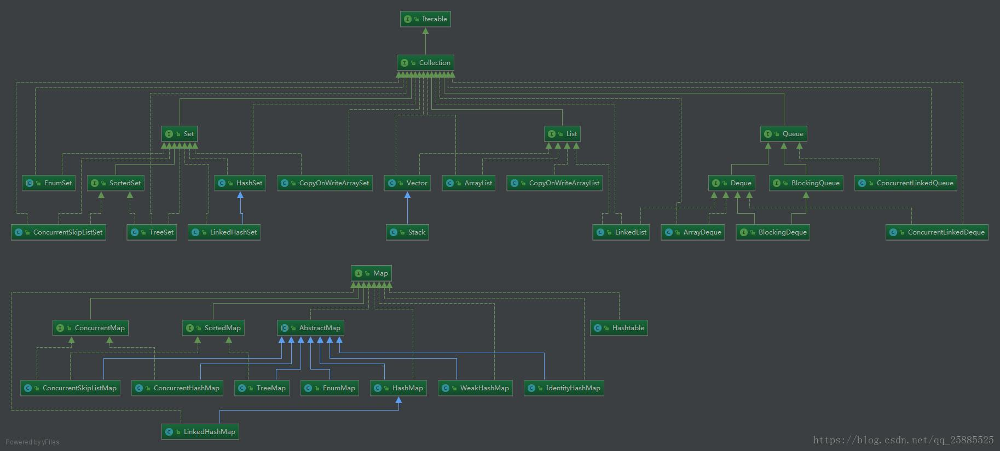
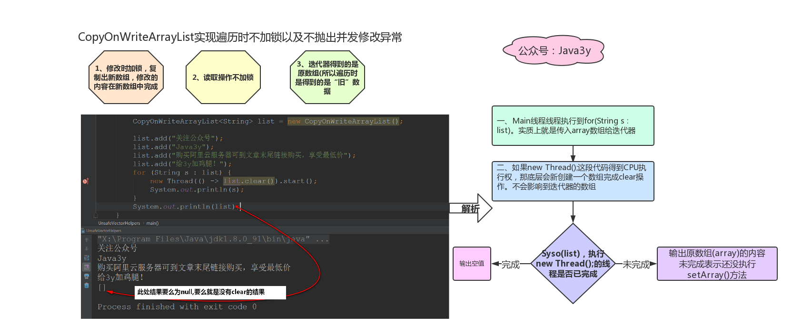
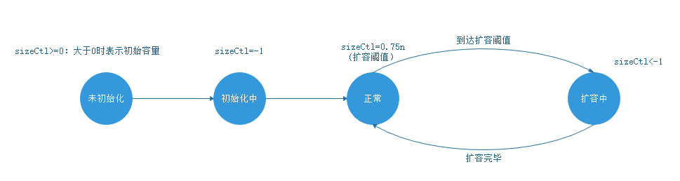
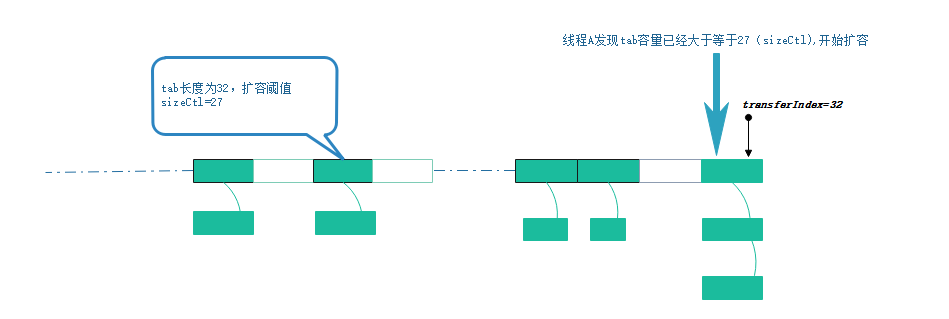
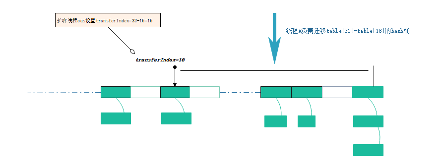
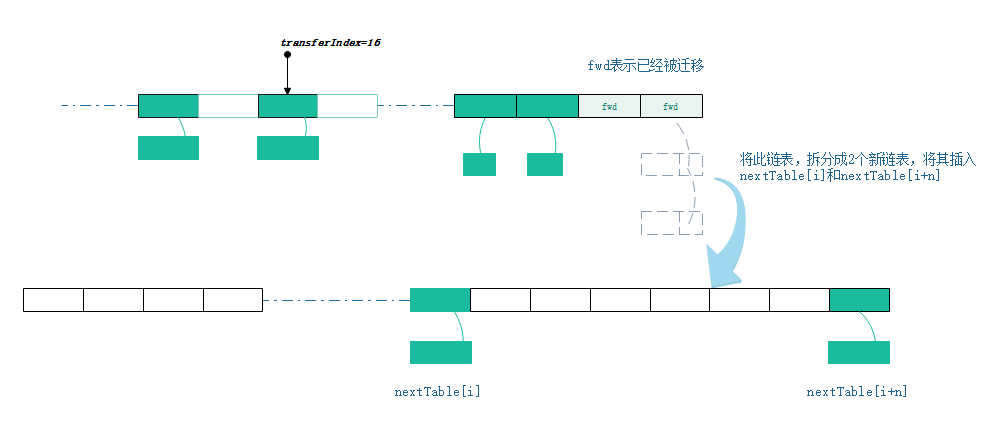
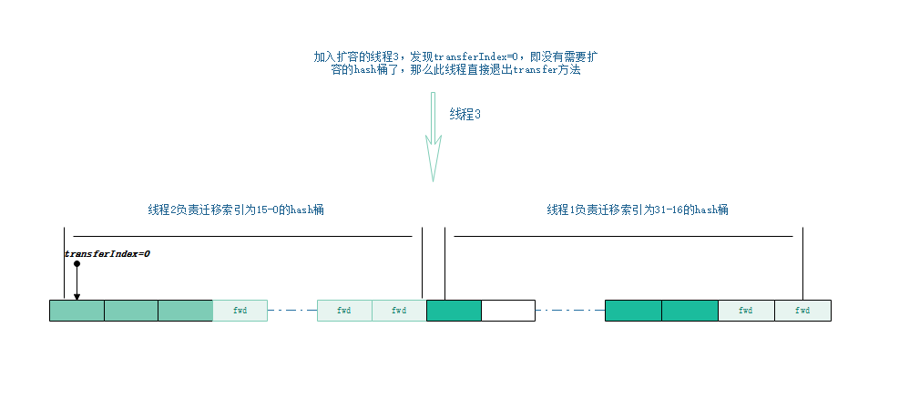
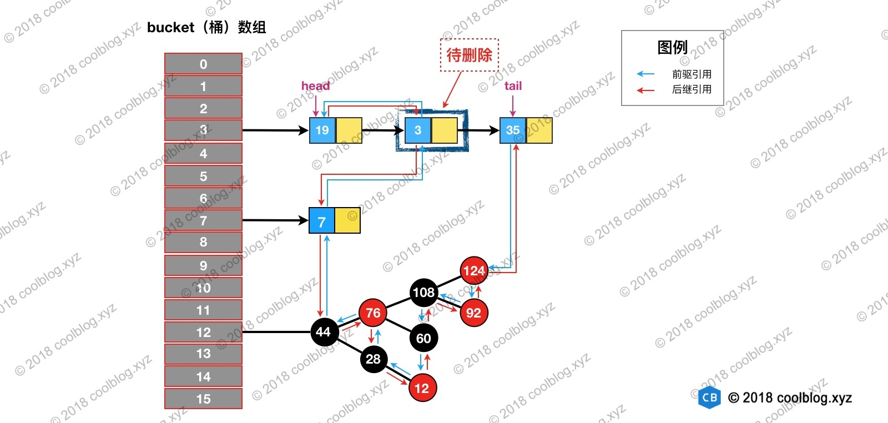
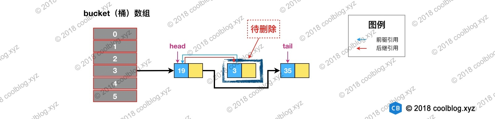
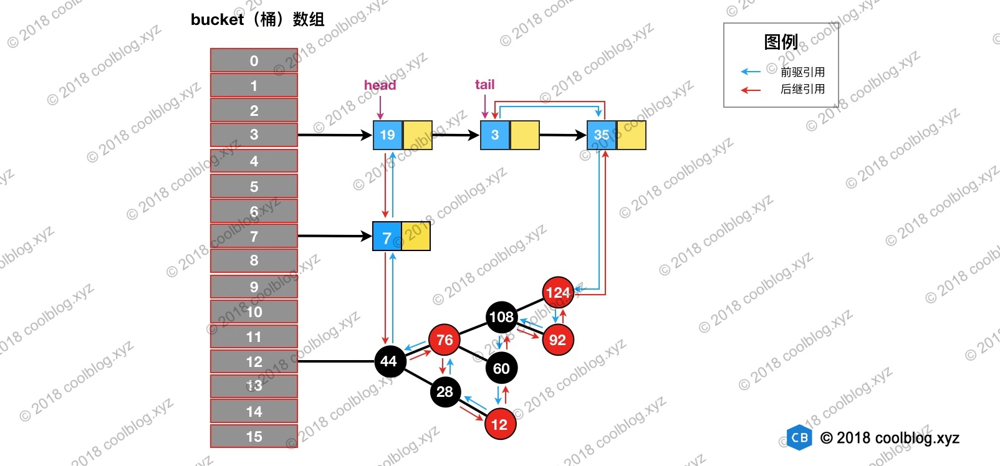

## 并发集合了解哪些？

Java并发集合

1.引言
Java集合包括ArrayList、HashSet、HashMap、ArrayQueue等集合都有一个共同的特点，那就是线程不安全性，在并发情况下都不能保证数据的一致性。（当然，这个集合必须是共享了，所以才会有数据不一致）
所以，当我们在进行并发任务时候，共享了一个不适用于并发的数据结构，也就是将此数据结构变成了程序中的成员变量，那么我们将会遇到数据的不一致，进而影响到我们程序的运行。
为了应对并发场景的出现，Java在后续迭代过程中（具体应该是JDK1.5版本），推出了java.util.concurrent包。该包的出现，让Java并发编程变得更加轻松，帮助开发者编写更加高效、易维护、结构清晰的程序。
在java.util.concurrent包中，不但包含了线程安全的集合，还涉及到了多线程、CAS、线程锁等相关内容，可以说是完整覆盖了Java并发的知识栈。

2.并发集合

并发集合实现1
JDK1.5的出现，对于集合并发编程来说，java developer有了更多的选择。不过，在JDK1.5之前，Java也还是提供了一些解决方案。
（1）最为简单直接的就是在程序中我们自己对共享变量进行加锁。不过，缺点也显而易见，手动实现线程安全间接增加了程序的复杂度，以及代码出错的概率---例如：线程死锁的产生；
（2）我们还可以使用Java集合框架中的Vector、Hashtable实现类，这两个类都是线程安全的。不过，Java已不提倡使用。
（3）此外，我们还可以使用集合工具类--Collections，通过调用其中的静态方法，来得到线程安全的集合。具体方法，包括：Collections.synchronizedCollection(Collection<T> c)、Collections.synchronizedSet(Set<T> s)、Collections.synchronizedList(List<T>)、Collections.synchronizedMap(Map<K, V>)。
究其原理，他们都是通过在方法中加synchronized同步锁来实现的。我们知道synchronized锁的开销较大，在程序中不建议使用。

并发集合实现2
在java.util.concurrent包中，提供了两种类型的并发集合：一种是阻塞式，另一种是非阻塞式。
阻塞式集合：当集合已满或为空时，被调用的添加（满）、移除（空）方法就不能立即被执行，调用这个方法的线程将被阻塞，一直等到该方法可以被成功执行。
非阻塞式集合：当集合已满或为空时，被调用的添加（满）、移除（空）方法就不能立即被执行，调用这个方法的线程不会被阻塞，而是直接则返回null或抛出异常。
下面，就来看下concurrent包下，到底存在了哪些线程安全的集合：


List：
CopyOnWriteArrayList

Set：
CopyOnWriteArraySet
ConcurrentSkipListSet

Queue：
BlockingQueue:
    LinkedBlockingQueue
    DelayQueue
    PriorityBlockingQueue
    ConcurrentLinkedQueue
    TransferQueue:
        LinkedTransferQueue
    BlockingDeque:
        LinkedBlockingDeque
        ConcurrentLinkedDeque

Map集合：


Map:
ConcurrentMap:
    ConcurrentHashMap
    ConcurrentSkipListMap
    ConcurrentNavigableMap

通过以上可以看出，java.util.concurrent包为每一类集合都提供了线程安全的实现。

## 列举java的集合以及集合之间的继承关系



#### ArrayList


###### Cloneable

1 Cloneable的用途
Cloneable是标记型的接口，它们内部都没有方法和属性，实现 Cloneable来表示该对象能被克隆，能使用Object.clone()方法。如果没有实现 Cloneable的类对象调用clone()就会抛出CloneNotSupportedException。
2 克隆的分类

* 浅克隆（shallow clone），浅克隆是指拷贝对象时仅仅copy对象本身和对象中的基本变量，而不拷贝对象包含的引用指向的对象。
* 深克隆（deep clone），不仅copy对象本身，而且copy对象包含的引用指向的所有对象。
举例：对象X中包含对Y的引用，Y中包含对Z的引用。浅拷贝X得到X1，X1中依然包含对Y的引用，Y中依然包含对Z的引用。深拷贝则是对浅拷贝的递归，深拷贝X得到X1，X1中包含对Y1（Y的copy）的引用，Y1中包含对Z1（Z的copy）的引用。

3 克隆代码举例
要让对象可以被克隆，应具备以下2个条件：

* 让该类实现java.lang.Cloneable接口；
* 重写（Override）Object的clone()方法；

``` java
public class Info implements Cloneable {

  private int id;

  private String text;

  public Info(int id, String text) {

    this.id = id;

    this.text = text;
  }

  @Override
  public boolean equals(Object obj) {
    if (this == obj) return true;
    if (obj == null) return false;
    if (obj.getClass() != getClass()) return false;
    Info temp = (Info) obj;
    if (id != temp.id) return false;
    if (text == null) {
      if (temp.text != null) {
        return false;
      }
    } else if (!text.equals(temp.text)) {
      return false;
    }

    return true;
  }

  @Override
  protected Object clone() throws CloneNotSupportedException {
    return super.clone();
  }
}

public static void main(String[] args) throws CloneNotSupportedException {
    Info clone = new Info(1, "I am Mp5A5");
    Info clone1 = (Info) clone.clone();


    System.out.println(clone.getClass() == clone1.getClass()); // true

    System.out.println(clone == clone1); // false

    System.out.println(clone.equals(clone1)); // true
  }
```
4 浅克隆/浅拷贝

``` java
public class MyFile implements Cloneable {

  private String path;

  public Info info;

  public MyFile(String path, Info info) {

    this.path = path;

    this.info = info;
  }

  @Override
  public boolean equals(Object obj) {
    if (this == obj) return true;
    if (obj == null) return false;
    if (obj.getClass() != getClass()) return false;
    MyFile temp = (MyFile) obj;
    if (path == null) {
      if (temp.path != null) {
        return false;
      }
    } else if (!path.equals(temp.path)) {
      return false;
    }

    if (info == null) {
      if (temp.info != null) {
        return false;
      }
    } else if (!info.equals(temp.info)) {
      return false;
    }

    return true;
  }

  @Override
  protected Object clone() throws CloneNotSupportedException {
    return super.clone();
  }
}

public static void main(String[] args) throws CloneNotSupportedException {

    Info info = new Info(2, "Hello world.");

    MyFile file1 = new MyFile("c:", info);

    MyFile file2 = (MyFile) file1.clone();

    System.out.println(file1.getClass() == file2.getClass()); // true

    System.out.println(file1 == file2); // false

    System.out.println(file1.equals(file2)); // true

    System.out.println(file1.info.getClass() == file2.info.getClass()); // true

    System.out.println(file1.info == file2.info); // true

    System.out.println(file1.info.equals(file2.info)); // true
  }

```
5 深克隆/深拷贝
深克隆需要重写（Override）Object类的clone()方法，并且在方法内部调用持有对象的clone方法

``` java
public class MyFile2 implements Cloneable {

  private String path;

  public Info info;

  public MyFile2(String path, Info info) {

    this.path = path;

    this.info = info;
  }

  @Override
  public boolean equals(Object obj) {
    if (this == obj) return true;
    if (obj == null) return false;
    if (obj.getClass() != getClass()) return false;
    MyFile2 temp = (MyFile2) obj;
    if (path == null) {
      if (temp.path != null) {
        return false;
      }
    } else if (!path.equals(temp.path)) {
      return false;
    }

    if (info == null) {
      if (temp.info != null) {
        return false;
      }
    } else if (!info.equals(temp.info)) {
      return false;
    }

    return true;
  }

  @Override
  protected Object clone() throws CloneNotSupportedException {

    MyFile2 file = (MyFile2) super.clone();
    file.info = (Info) file.info.clone();
    return file;
  }
}

    Info info = new Info(2, "Hello world.");

    MyFile2 file1 = new MyFile2("c:", info);

    MyFile2 file2 = (MyFile2) file1.clone();


    System.out.println(file1.getClass() == file2.getClass());//true

    System.out.println(file1 == file2);//false

    System.out.println(file1.equals(file2));//true

    System.out.println(file1.info.getClass() == file2.info.getClass());//true

    System.out.println(file1.info == file2.info);//false

    System.out.println(file1.info.equals(file2.info));//true
```

#### LinkedList


##### ArrayBlockingQueue

[ArrayBlockingQueue的详细介绍及源码分析](https://blog.csdn.net/qq_22798455/article/details/81636772)

#### CopyOnWriteArrayList


1.CopyOnWrite

Copy-On-Write简称COW，是一种用于程序设计中的优化策略。其基本思路是，从一开始大家都在共享同一个内容，当某个人想要修改这个内容的时候，才会真正把内容Copy出去形成一个新的内容然后再改，这是一种延时懒惰策略。从JDK1.5开始Java并发包里提供了两个使用CopyOnWrite机制实现的并发容器,它们是CopyOnWriteArrayList和CopyOnWriteArraySet。CopyOnWrite容器非常有用，可以在非常多的并发场景中使用到。

2.CopyOnWrite容器
CopyOnWrite容器即写时复制的容器。通俗的理解是当我们往一个容器添加元素的时候，不直接往当前容器添加，而是先将当前容器进行Copy，复制出一个新的容器，然后新的容器里添加元素，添加完元素之后，再将原容器的引用指向新的容器。这样做的好处是我们可以对CopyOnWrite容器进行并发的读，而不需要加锁，因为当前容器不会添加任何元素。所以CopyOnWrite容器也是一种读写分离的思想，读和写不同的容器。

3.实现原理

```
	
/** 可重入锁对象 */
final transient ReentrantLock lock = new ReentrantLock();

/** CopyOnWriteArrayList底层由数组实现，volatile修饰 */
private transient volatile Object[] array;

/**
 * 得到数组
 */
final Object[] getArray() {
    return array;
}

/**
 * 设置数组
 */
final void setArray(Object[] a) {
    array = a;
}

/**
 * 初始化CopyOnWriteArrayList相当于初始化数组
 */
public CopyOnWriteArrayList() {
    setArray(new Object[0]);
}
```

add方法

在添加元素之前进行加锁操作，保证数据的原子性。在添加过程中，进行数组复制，修改操作，再将新生成的数组复制给集合中的array属性。最后，释放锁；由于array属性被volatile修饰，所以当添加完成后，其他线程就可以立刻查看到被修改的内容。

```
public boolean add(E e) {
    final ReentrantLock lock = this.lock;
    //加锁
    lock.lock();
    try {
        //获取集合中的数组：
        Object[] elements = getArray();
        int len = elements.length;
        
        //数组复制：将此线程与其他线程对集合的操作区分开来，无论底层结构如何改变，本线程中的数据不受影响
        Object[] newElements = Arrays.copyOf(elements, len + 1);
        
        //对新的数组进行操作：将新元素添加到新数组中
        newElements[len] = e;
        
        //将原有数组指针指向新的数组对象：
        setArray(newElements);
        return true;
    } finally {
        lock.unlock();
    }
}
```

```
public void add(int index, E element) {
    final ReentrantLock lock = this.lock;
    lock.lock();
    try {
        Object[] elements = getArray();
        int len = elements.length;
        if (index > len || index < 0)
            throw new IndexOutOfBoundsException("Index: "+index+
                                                ", Size: "+len);
        Object[] newElements;
        int numMoved = len - index;
        //len == index 时候先将就数组copy到新数组中，然后将值插入到新数组的末尾
        if (numMoved == 0)
            newElements = Arrays.copyOf(elements, len + 1);
        else {
            //len > index 
			  //先将index之前的数组copy到新数组中
			  //将剩余的元素copy到index+1之后的数组中
            newElements = new Object[len + 1];
            System.arraycopy(elements, 0, newElements, 0, index);
            System.arraycopy(elements, index, newElements, index + 1,
                             numMoved);
        }
        newElements[index] = element;
        setArray(newElements);
    } finally {
        lock.unlock();
    }
}
```

```
// 插入元素e，先判断当前数组中是否有该元素，有就不插入，没有则调用addIfAbsent(e, snapshot)再做判断
public boolean addIfAbsent(E e) {
    Object[] snapshot = getArray();
    return indexOf(e, snapshot, 0, snapshot.length) >= 0 ? false :
        addIfAbsent(e, snapshot);
}

/**
 * 在并发环境中调用addIfAbsent(E e, Object[] snapshot)的时候可能原始数组已经被更改了，所以获取当前数组，然后和传入的数组进行比较操作，然后判断时候需要插入该元素
 */
private boolean addIfAbsent(E e, Object[] snapshot) {
    final ReentrantLock lock = this.lock;
    lock.lock();
    try {
    	 //获取最新数组
        Object[] current = getArray();
        int len = current.length;
        //如果最新数组和传入的数组不相同，说明原始数组已经被更改了
        if (snapshot != current) {
            // 获取更改前和更改后最小的数组长度
            int common = Math.min(snapshot.length, len);
            for (int i = 0; i < common; i++)
            
            	   //更改后数组的元素和初始数组的元素不相同，并且需要插入的元素和当前数组的某个元素相同，则不用插入，这个循环只能判断当前数组是被删减的情况
                if (current[i] != snapshot[i] && eq(e, current[i]))
                    return false;
            //这个是判断当前数组是被添加的情况    
            if (indexOf(e, current, common, len) >= 0)
                return false;
        }
        Object[] newElements = Arrays.copyOf(current, len + 1);
        newElements[len] = e;
        setArray(newElements);
        return true;
    } finally {
        lock.unlock();
    }
}
```

get方法

```
//根据角标，获取对应的数组元素:
public E get(int index) {
    return get(getArray(), index);
}
@SuppressWarnings("unchecked")
private E get(Object[] a, int index) {
    return (E) a[index];
}
```

为了能让get（）方法得到最大的性能，CopyOnWriteArrayList并没有进行加锁处理，而且也不需要加锁处理。
因为，在add（）时候加了锁，首先不会有多个线程同时进到add中去，这一点保证了数组的安全。当在一个线程执行add时，又进行了数组的复制操作，生成了一个新的数组对象，在add后又将新数组对象的指针指向了旧的数组对象指针，注意此时是指针的替换，原来旧的数组对象还存在。这样就实现了，添加方法无论如何操作数组对象，获取方法在获取到集合后，都不会受到其他线程添加元素的影响。
这也就是在执行add()时，为什么还要在加锁的同时又copy了一分新的数组对象！！！

set方法

```
public E set(int index, E element) {
    final ReentrantLock lock = this.lock;
    lock.lock();
    try {
    	 //// 得到原数组的旧值
        Object[] elements = getArray();
        E oldValue = get(elements, index);
		 
		 // 判断新值和旧值是否相等
        if (oldValue != element) {
        	
        	  // 复制新数组，新值在新数组中完成
            int len = elements.length;
            Object[] newElements = Arrays.copyOf(elements, len);
            newElements[index] = element;
            setArray(newElements);
        } else {
            // 将array引用指向新数组
            setArray(elements);
        }
        return oldValue;
    } finally {
        lock.unlock();
    }
}
```

remove方法

```
public boolean remove(Object o) {
    Object[] snapshot = getArray();
    int index = indexOf(o, snapshot, 0, snapshot.length);
    return (index < 0) ? false : remove(o, snapshot, index);
}

private boolean remove(Object o, Object[] snapshot, int index) {
    final ReentrantLock lock = this.lock;
    lock.lock();
    try {
    	 //获取当前数组
        Object[] current = getArray();
        int len = current.length;
        //当前数组是否已经更改
        if (snapshot != current) findIndex: {
        	  //已经更改的数组通过循环判断要删除的元素是否在当前数组中，这里使用了goto跳出循环机制
        	  //判断当前数组已经删除元素的情况
            int prefix = Math.min(index, len);
            for (int i = 0; i < prefix; i++) {
                if (current[i] != snapshot[i] && eq(o, current[i])) {
                    index = i;
                    break findIndex;
                }
            }
            if (index >= len)
                return false;
            if (current[index] == o)
                break findIndex;
            //判断当前数组已经增加元素的情况
            index = indexOf(o, current, index, len);
            if (index < 0)
                return false;
        }
        Object[] newElements = new Object[len - 1];
        System.arraycopy(current, 0, newElements, 0, index);
        System.arraycopy(current, index + 1,
                         newElements, index,
                         len - index - 1);
        setArray(newElements);
        return true;
    } finally {
        lock.unlock();
    }
}
```



总结：

* 在修改时，复制出一个新数组，修改的操作在新数组中完成，最后将新数组交由array变量指向。
* 写加锁，读不加锁
* 在使用迭代器遍历的时候，操作的都是原数组


优缺点

* CopyOnWriteArrayList保证了数据在多线程操作时的最终一致性。
* 缺点也同样显著，那就是内存空间的浪费：因为在写操作时，进行数组复制，在内存中产生了两份相同的数组。如果数组对象比较大，那么就会造成频繁的GC操作，进而影响到系统的性能；
* 只能保证最终的数据一致性，而不能保证实时的数据一致性。这一点也是我们在使用的过程中，必须要考虑到的因素。

CopyOnWrite的应用场景

CopyOnWrite并发容器用于读多写少的并发场景。
比如白名单，黑名单，商品类目的访问和更新场景，假如我们有一个搜索网站，用户在这个网站的搜索框中，输入关键字搜索内容，但是某些关键字不允许被搜索。
这些不能被搜索的关键字会被放在一个黑名单当中，黑名单每天晚上更新一次。当用户搜索时，会检查当前关键字在不在黑名单当中，如果在，则提示不能搜索。

#### TreeSet


#### HashSet


#### HashMap


### ArrayList源码解析

ArrayList就是动态数组，是Array的复杂版本，动态的增加和减少元素，实现了Collection和List接口，灵活的设置数组的大小。实现了所有可选列表操作，并允许包括null在内的所有元素。除了实现List接口外，此类还提供一些方法来操作内部用来存储列表的数组的大小。

* 由ArrayList<E>可知其支持泛型
* AbstractList提供了List接口的默认实现（个别方法为抽象方法）。
* List接口（extends Collection）定义了列表必须实现的方法。
* RandomAccess是一个标记接口，接口内没有定义任何内容。
* 实现了Cloneable接口的类，可以调用Object.clone方法返回该对象的浅拷贝。
* 通过实现 java.io.Serializable 接口以启用其序列化功能。未实现此接口的类将无法使其任何状态序列化或反序列化。序列化接口没有方法或字段，仅用于标记可序列化的语义。


```
/**
 * 概述：
 *  List接口可调整大小的数组实现。实现所有可选的List操作，并允许所有元素，包括null，元素可重复。
 *  除了列表接口外，该类提供了一种方法来操作该数组的大小来存储该列表中的数组的大小。
 * 
 * 时间复杂度：
 *  方法size、isEmpty、get、set、iterator和listIterator的调用是常数时间的。
 *  添加删除的时间复杂度为O(N)。其他所有操作也都是线性时间复杂度。
 *
 * 容量：
 *  每个ArrayList都有容量，容量大小至少为List元素的长度，默认初始化为10。
 *  容量可以自动增长。
 *  如果提前知道数组元素较多，可以在添加元素前通过调用ensureCapacity()方法提前增加容量以减小后期容量自动增长的开销。
 *  也可以通过带初始容量的构造器初始化这个容量。
 *
 * 线程不安全：
 *  ArrayList不是线程安全的。
 *  如果需要应用到多线程中，需要在外部做同步
 *
 * modCount：
 *  定义在AbstractList中：protected transient int modCount = 0;
 *  从结构上修改此列表的次数。从结构上修改是指更改列表的大小，或者打乱列表，从而使正在进行的迭代产生错误的结果。
 *  此字段由iterator和listiterator方法返回的迭代器和列表迭代器实现使用。
 *  如果意外更改了此字段中的值，则迭代器（或列表迭代器）将抛出concurrentmodificationexception来响应next、remove、previous、set或add操作。
 *  在迭代期间面临并发修改时，它提供了快速失败行为，而不是非确定性行为。
 *  子类是否使用此字段是可选的。
 *  如果子类希望提供快速失败迭代器（和列表迭代器），则它只需在其add(int,e)和remove(int)方法（以及它所重写的、导致列表结构上修改的任何其他方法）中增加此字段。
 *  对add(int, e)或remove(int)的单个调用向此字段添加的数量不得超过1，否则迭代器（和列表迭代器）将抛出虚假的concurrentmodificationexceptions。
 *  如果某个实现不希望提供快速失败迭代器，则可以忽略此字段。
 *
 * transient：
 *  默认情况下,对象的所有成员变量都将被持久化.在某些情况下,如果你想避免持久化对象的一些成员变量,你可以使用transient关键字来标记他们,transient也是java中的保留字(JDK 1.8)
 */

public class ArrayList<E> extends AbstractList<E>
        implements List<E>, RandomAccess, Cloneable, java.io.Serializable
{
    ...

    /**
     * 默认数组的初始容量大小为10
     */
    private static final int DEFAULT_CAPACITY = 10;

    /**
     * 用于空实例的共享空数组实例
     */
    private static final Object[] EMPTY_ELEMENTDATA = {};

    /**
     * 用于默认空实例的共享空数组实例,与EMPTY_ELEMENTDATA区别是，在添加第一个元素时知道要扩展多少
     */
    private static final Object[] DEFAULTCAPACITY_EMPTY_ELEMENTDATA = {};

    /**
     * 存放元素的数组.
     * ArrayList的容量是该数组的长度.任何空ArrayList是DEFAULTCAPACITY_EMPTY_ELEMENTDATA
     * 当第一个元素添加到ArrayList中时DEFAULTCAPACITY_EMPTY_ELEMENTDATA扩展成
     * DEFAULT_CAPACITY
     */
    transient Object[] elementData; // 包级访问权限

    /**
     * ArrayList的大小（ArrayList包含的元素）
     * @serial
     */
    private int size;

    /**
     * 指定初始容量大小的构造方法
     * 当指定容量大于0时，存放元素数组大小为指定容量
     * 当指定容量等于0时，存放元素数组为空数组实例
     * 当指定容量等于<时，抛出IllegalArgumentException
     */
    public ArrayList(int initialCapacity) {
        if (initialCapacity > 0) {
            this.elementData = new Object[initialCapacity];
        } else if (initialCapacity == 0) {
            this.elementData = EMPTY_ELEMENTDATA;
        } else {
            throw new IllegalArgumentException("Illegal Capacity: "+
                                               initialCapacity);
        }
    }

    /**
     * 默认构造方法，初始容量为10的空列表.
     */
    public ArrayList() {
        this.elementData = DEFAULTCAPACITY_EMPTY_ELEMENTDATA;
    }

    /**
     * 参数为Collection元素列表参数的构造方法，指定collection的元素的列表，
     * 按照该collection的迭代器返回的顺序排列
     */
    public ArrayList(Collection<? extends E> c) {
    	 //将传入的数组转化成数组，赋值给ArrayList的存放元素的数组
        elementData = c.toArray();
        if ((size = elementData.length) != 0) {//如果elementData.length不为0，则先赋值
            //c.toarray可能不返回对象Object[]（见JAVA BUG编号6260652）
            //如果elementData.getClass()不是Object[].class，则通过Array.Copy方法将
            //elementData拷贝成一个新数组赋值给原来的elementData
            if (elementData.getClass() != Object[].class)
                elementData = Arrays.copyOf(elementData, size, Object[].class);
        } else {
            // 存放元素的数组置为空数组
            this.elementData = EMPTY_ELEMENTDATA;
        }
    }

    /**
     * 因为存放元素的数组长度常常会大于ArrayList实际的容量。内存紧张时，可以调用该方
     * 法删除预留的位置，调整存放元素的数组长度为ArrayList实际的容量。
     * 如果确定不会再有元素添加进来时也可以调用该方法来节约空间
     */
    public void trimToSize() {
        modCount++;
        if (size < elementData.length) {
            elementData = (size == 0)
              ? EMPTY_ELEMENTDATA
              : Arrays.copyOf(elementData, size);
        }
    }

    /**
     * ensureCapacity、ensureCapacityInternal、ensureExplicitCapacity
     * 使用指定参数设置数组最小长度
     * 增加此ArrayList实例的容量，以确保它可以容纳由最小长度（minCapacity）的元素数
     */
    public void ensureCapacity(int minCapacity) {
    	 //如果存放元素的数组不为空，则最小扩展长度为0
    	 //如果存放元素的数组为空，则最小扩展长度为默认长度10
        int minExpand = (elementData != DEFAULTCAPACITY_EMPTY_ELEMENTDATA)? 0
            : DEFAULT_CAPACITY;
		 //指定的最小长度大于扩展长度
        if (minCapacity > minExpand) {
            ensureExplicitCapacity(minCapacity);
        }
    }

    private void ensureCapacityInternal(int minCapacity) {
    	 //如果数组为空实例数组，则最小容量取minCapacity和DEFAULT_CAPACITY的最大值
        if (elementData == DEFAULTCAPACITY_EMPTY_ELEMENTDATA) {
            minCapacity = Math.max(DEFAULT_CAPACITY, minCapacity);
        }

        ensureExplicitCapacity(minCapacity);
    }

    private void ensureExplicitCapacity(int minCapacity) {
        modCount++;

        // 如果最容量大于数组的长度，则增加数组长度
        if (minCapacity - elementData.length > 0)
            grow(minCapacity);
    }

    /**
     * 数组分配的最大长度.
     * 虚拟机在数组中保存对象的头信息，最大占8个字节.
     * 尝试分配更大的数组长度会引起内存溢出
     */
    private static final int MAX_ARRAY_SIZE = Integer.MAX_VALUE - 8;

    /**
     * 增加数组长度已确保至少容纳参数中指定的元素长度
     */
    private void grow(int minCapacity) {
        // 旧数组长度=存放元素数组的长度
        int oldCapacity = elementData.length;
        // 新数组长度=旧数组长度+(旧数组长度右移一位(相当于除以2))
        int newCapacity = oldCapacity + (oldCapacity >> 1);
        //如果新数组长度小于参数指定的长度，则将参数指定的长度赋值给新数组长度
        if (newCapacity - minCapacity < 0)
            newCapacity = minCapacity;
        //如果新数组长度大于数组最大长度则通过参数指定的长度做判断
        //1.参数指定的长度小于0抛出OutOfMemoryError
        //2.参数的指定长度大于数组最大长度，则新数组长度被设置为Integer.MAX_VALUE
        //3.参数的指定长度小于数组最大长度,则新数组长度被设置为MAX_ARRAY_SIZE（则数组最大长度）
        if (newCapacity - MAX_ARRAY_SIZE > 0)
            newCapacity = hugeCapacity(minCapacity);
        // 通过拷贝将旧数组重新赋值
        elementData = Arrays.copyOf(elementData, newCapacity);
    }

    private static int hugeCapacity(int minCapacity) {
        if (minCapacity < 0) // overflow
            throw new OutOfMemoryError();
        return (minCapacity > MAX_ARRAY_SIZE) ?
            Integer.MAX_VALUE :
            MAX_ARRAY_SIZE;
    }

    ...

    /**
     * 是否包含参数中的元素
     * 如果集合中包含指定的元素返回true
     * 确切的说,只要集合中至少包含一个指定的元素则返回true
     */
    public boolean contains(Object o) {
        return indexOf(o) >= 0;
    }

    /**
     * 返回指定元素在集合中第一次出现位置的索引，如果不包含指定元素则返回-1
     * 从这个方法可以得知，ArrayList可以存null值
     */
    public int indexOf(Object o) {
    	 //如果指定元素为null,则循环遍历数组看数组中是否有null元素，如果有则返回数组中第一次出现null元素的索引
    	 //时间复杂度为O(n)
        if (o == null) {
            for (int i = 0; i < size; i++)
                if (elementData[i]==null)
                    return i;
        } else {
            //如果指定元素不为null,则循环遍历数组看数组中是否有该指定元素，如果有则返回数组中第一次出现该元素的索引
            //时间复杂度为O(n)
            for (int i = 0; i < size; i++)
                if (o.equals(elementData[i]))
                    return i;
        }
        return -1;
    }

    /**
     * 返回指定元素在集合中最后一次出现位置的索引，如果不包含指定元素则返回-1
     */
    public int lastIndexOf(Object o) {
        //如果指定元素为null,则循反序环遍历数组看数组中是否有null元素，如果有则返回数组中第一次出现null元素的索引
    	 //时间复杂度为O(n)
        if (o == null) {
            for (int i = size-1; i >= 0; i--)
                if (elementData[i]==null)
                    return i;
        } else {
            //如果指定元素不为null,则反序循环遍历数组看数组中是否有该指定元素，如果有则返回数组中第一次出现该元素的索引
            //时间复杂度为O(n)
            for (int i = size-1; i >= 0; i--)
                if (o.equals(elementData[i]))
                    return i;
        }
        return -1;
    }

    ...

    /**
     * 返回包含在集合中所有有序元素的数组
     * 返回的数组是安全的，因为返回的数组没有保留对列表的引用（换句话说，这个方法分配了一个新数组）
     * 调用者可以自由的更改返回的数组
     * 此方法扮演着基于数组和基于集合的API之间的桥梁
     */
    public Object[] toArray() {
        //返回拷贝的新数组
        return Arrays.copyOf(elementData, size);
    }

    /**
     * 返回一个数组，使用运行时确定类型，该数组包含在这个列表中的所有元素（从第一到最后一个元素）
     * 返回的数组容量由参数数组的长度和列表容量较大值确定
     */
    @SuppressWarnings("unchecked")
    public <T> T[] toArray(T[] a) {
    	 //参数数组的长度小于集合的容量
        if (a.length < size)
            // 创建一个运行时类型的新数组
            // 通过拷贝存放元素的数组生成一个新数组,新数组的类型为参数的类型
            return (T[]) Arrays.copyOf(elementData, size, a.getClass());
        
        //调用系统的拷贝方法将存放元素的数组拷贝到参数的数组中
        System.arraycopy(elementData, 0, a, 0, size);
        
        //参数数组的长度大于于集合的容量
        if (a.length > size)
            //直接将参数数组的size索引位置置为null
            a[size] = null;
        return a;
    }

    //包级访问权限，返回指定索引位置的元素
    @SuppressWarnings("unchecked")
    E elementData(int index) {
        return (E) elementData[index];
    }

    /**
     *包级访问权限，返回指定索引位置的元素
     */
    public E get(int index) {
    	 //范围检查，如果index大于等于列表容量，则抛出IndexOutOfBoundsException
        rangeCheck(index);
		 
		 //根据指定的索引，返回当前存放元素数组对应索引位置的元素
        return elementData(index);
    }

    /**
     * 用指定元素element替换列表中指定位置的元素,并返回被替换的元素值
     */
    public E set(int index, E element) {
    	 //范围检查，如果index大于等于列表容量，则抛出IndexOutOfBoundsException
        rangeCheck(index);
		 
		 //在存放元素的数组中获取指定索引位置的旧元素
        E oldValue = elementData(index);
        //将存放元素的数组中所对应索引位置的值替换成指定元素的值
        elementData[index] = element;
        return oldValue;
    }

    /**
     * 将指定元素添加到列表末尾
     * 
     */
    public boolean add(E e) {
        ensureCapacityInternal(size + 1);  // 一定会增加 modCount!!
        elementData[size++] = e;
        return true;
    }

    /**
     * 在列表中插入指定的元素到指定的位置，将当前位置的元素（如果有）和后续元
     * 素向右移动（在其索引中加1）
     */
    public void add(int index, E element) {
    	 //范围检测
    	 //如果指定位置索引index大于列表容量size或者index小于0，抛出IndexOutOfBoundsException
        rangeCheckForAdd(index);
		 
        ensureCapacityInternal(size + 1);  // 一定会增加 modCount!!
        
        //通过系统的Copy方法，将存放元素的数组整体从指定索引位置index开始向后移动一位
        /*
         *String[] a = {"1", "2", "3", "4", "5", "6", "7", "8", "9", "10", null, null};
         *System.arraycopy(a, 3, a, 4, 7);
         *a[3] = "x";
         *System.out.println(Arrays.toString(a));
         *结果是：[1, 2, 3, x, 4, 5, 6, 7, 8, 9, 10, null]
         */
        System.arraycopy(elementData, index, elementData, index + 1,
                         size - index);
        //将指定位置处的元素替换为指定元素
        elementData[index] = element;
        size++;
    }

    /**
     * 在列表中删除指定位置的元素，将后续元素向左移动一位(从他们的指数中减去一个值)
     */
    public E remove(int index) {
    	 //范围检查，如果指定索引大于等于列表容量，则抛出IndexOutOfBoundsException
        rangeCheck(index);

        modCount++;
        //获取指定索引处的元素
        E oldValue = elementData(index);
		 //移动范围为列表容量减去指定索引值减1
        int numMoved = size - index - 1;
        //如果移动范围大于0，则使用系统copy方法，将存放元素的数组从删除位置向左copy一位
        if (numMoved > 0)
            System.arraycopy(elementData, index+1, elementData, index,
                             numMoved);
        //列表容量减一值赋值为null                     
        elementData[--size] = null; // 元素设置为null，使GC回收
		 //返回旧值
        return oldValue;
    }

    /**
     * 删除第一次出现在列表中的指定元素如果该元素存在于列表中
     * 如果列表不包含该元素，则不会更改。 确切的说，删除索引最低的元素
     */
    public boolean remove(Object o) {
    	 //如果指定元素为null,循环列表
        if (o == null) {
            for (int index = 0; index < size; index++)
            	   //如果存在null值
                if (elementData[index] == null) {
                		//调用快速删除方法
                    fastRemove(index);
                    return true;
                }
        } else {//如果指定元素为null,循环列表
        	  //如果存在指定的值，比较值的方法用的equals方法
            for (int index = 0; index < size; index++)
                if (o.equals(elementData[index])) {
                    fastRemove(index);
                    return true;
                }
        }
        return false;
    }

    /*
     * 私有删除方法，跳过边界检查，但没有返回删除的值。
     */
    private void fastRemove(int index) {
        modCount++;
        //移动范围为列表容量减去指定索引值减1
        int numMoved = size - index - 1;
        //如果移动范围大于0，则使用系统copy方法，将存放元素的数组从删除位置向左copy一位
        if (numMoved > 0)
            System.arraycopy(elementData, index+1, elementData, index,
                             numMoved);
        //列表容量减一值赋值为null  
        elementData[--size] = null; // clear to let GC do its work
    }

    /**
     * 删除列表中的所有元素
     */
    public void clear() {
        modCount++;

        // 通过循环，将存放元素的数组中的值都置为null，方便GC回收
        for (int i = 0; i < size; i++)
            elementData[i] = null;
        //列表容量置为0
        size = 0;
    }

    /**
     * 将指定集合中的所有元素按指定集合的迭代器返回的顺序添加到该列表的尾端。如果在操作正在进行时修改
     * 了指定的集合，则此操作的行为是不确定的。
     */
    public boolean addAll(Collection<? extends E> c) {
    	 //指定集合转成数组
        Object[] a = c.toArray();
        //获取该数组的长度
        int numNew = a.length;
        //容量检测
        ensureCapacityInternal(size + numNew);  // Increments modCount
        //将该数组从0开始copy到存放元素的数组
        System.arraycopy(a, 0, elementData, size, numNew);
        size += numNew;
        return numNew != 0;
    }

    /**
     * 将指定集合中的元素从指定位置插入到列表中，将当前位置的元素（如果有）和任何后续元素向右移动（增加其索引）。 
     * 新元素将按照它们返回的顺序显示在列表中
     */
    public boolean addAll(int index, Collection<? extends E> c) {
    	 //添加范围检查
        rangeCheckForAdd(index);
        //指定集合转成数组
        Object[] a = c.toArray();
        //获取该数组的长度
        int numNew = a.length;
        //容量检测
        ensureCapacityInternal(size + numNew);  // Increments modCount
		 //移动范围为列表容量减去指定索引值index
        int numMoved = size - index;
        //如果移动范围大于0，
        if (numMoved > 0)
            //调用系统copy方法将存放元素的数组elementData，从指定索引index处copy到elementData中去
            System.arraycopy(elementData, index, elementData, index + numNew,
                             numMoved);
		 //调用系统copy方法将转换成的数组a从0开始copy到存放元素的数组elementData中去
        System.arraycopy(a, 0, elementData, index, numNew);
        //数组容量添加数组的长度
        size += numNew;
        return numNew != 0;
    }

    /**
     * 删除列表中从开始索引((包括该索引的元素))到结束索引(不包括该索引的元素)的元素即删除从[fromIndex,toIndex)的元素
     * 将任何后续元素向左移动（降低其索引）
     * 通过toIndex-fromIndex缩短列表
     * 如果toIndex==fromIndex，则此操作不会有任何作用
     */
    protected void removeRange(int fromIndex, int toIndex) {
        modCount++;
        //移动元素范围即移动元素的个数
        int numMoved = size - toIndex;
        //调用系统copy方法，将存放元素数组elementData的元素从toIndex开始，copy到存放元素数组elementData中
        System.arraycopy(elementData, toIndex, elementData, fromIndex,
                         numMoved);

        // 获取新列表的容量值
        int newSize = size - (toIndex-fromIndex);
        // 将存放元素的数组中的元素从新列表的容量值newSize开始，全部置为null，方便GC回收
        for (int i = newSize; i < size; i++) {
            elementData[i] = null;
        }
        size = newSize;
    }

    ...

    /**
     * 从列表中删除指定集合中的元素
     */
    public boolean removeAll(Collection<?> c) {
        Objects.requireNonNull(c);
        return batchRemove(c, false);
    }

    /**
     * 列表中保留指定集合中的元素
     */
    public boolean retainAll(Collection<?> c) {
        Objects.requireNonNull(c);
        return batchRemove(c, true);
    }

    private boolean batchRemove(Collection<?> c, boolean complement) {
        //获取存放元素数组设置为final，即指针地址不可变，但是数组的值可变
        final Object[] elementData = this.elementData;
        //两根指针，w表示写入的指针，r表示读取指针
        int r = 0, w = 0;
        //是否更改
        boolean modified = false;
        try {
        	  //列表循环
            for (; r < size; r++)
                //当removeAll方法调用的时候因为complement=false，所以如果指定集合中不含元素elementData[r]，则将该元素赋值给存放元素数组elementData[w++]
                //当retainAll方法调用的时候因为complement=true，所以如果指定集合中包含元素elementData[r]，则将该元素赋值给存放元素数组elementData[w++]
                if (c.contains(elementData[r]) == complement)
                    elementData[w++] = elementData[r];
        } finally {
            // c.contains（）抛出异常与AbstractCollection保持行为兼容性
            // 读入指针不等于列表容量，则调用系统copy方法将存放元素数组从r开始复制
            if (r != size) {
                System.arraycopy(elementData, r,
                                 elementData, w,
                                 size - r);
                w += size - r;
            }
            // 如果写入指针w不等于列表容量，表示指定集合中的元素在存放元素数组中也有
            //存放元素数组中索引小于写入指针w的都是不包含在指定集合中的，
            //存放元素数组中从写入指针w开始全部置为null
            if (w != size) {
                // clear to let GC do its work
                for (int i = w; i < size; i++)
                    elementData[i] = null; 
                modCount += size - w;
                //列表容量为w
                size = w;
                //已更改
                modified = true;
            }
        }
        return modified;
    }
    ...
```

### LinkedList源码解析

#### 特点

* LinkedList是一个继承于AbatractSequentialList的双向链表。它也可以被当作堆栈、队列或双端队列进行操作。
* LinkedList实现了List接口，能对它进行队列操作。
* LinkedList实现了Deque接口，即能将LinkedList当作双端队列使用。
* LinkedList实现了java.io.Serializable接口，这意味着LinkedList支持序列化，能通过序列化去传输。
* LinkedList是非同步的。

#### 源码

```
/**
 * LinkedList底层使用双向链表，实现了List和deque。实现所有的可选List操作，并可以只有所有元素（包括空值）
 * 其大小理论上仅受内存大小的限制
 *
 * 所有的操作都可以作为一个双联列表来执行（及对双向链表操作）。
 * 把对链表的操作封装起来，并对外提供看起来是对普通列表操作的方法。
 * 遍历从起点、终点、或指定位置开始
 * 内部方法，注释会描述为节点的操作(如删除第一个节点)，公开的方法会描述为元素的操作(如删除第一个元素)
 *
 * LinkedList不是线程安全的，如果在多线程中使用（修改），需要在外部作同步处理。
 * 
 * 需要弄清元素（节点）的索引和位置的区别，不然有几个地方不好理解，具体在碰到的地方会解释。
 * 
 * 迭代器可以快速报错
 */
public class LinkedList<E> extends AbstractSequentialList<E>
    implements List<E>, Deque<E>, Cloneable, java.io.Serializable
{   
    //列表容量
    transient int size = 0;

    /**
     * 链表的头结点          
     */
    transient Node<E> first;

    /**
     * 链表的尾节点
     */
    transient Node<E> last;

    /**
     * 默认构造函数，创建一个空链表
     */
    public LinkedList() {
    }
    
    /**
     * 指定参数为集合Collection的构造方法，按照该collection的迭代器返回的顺序排列
     */
    public LinkedList(Collection<? extends E> c) {
        this();
        addAll(c);
    }

    /**
     * 使对应参数作为第一个节点
     */
    private void linkFirst(E e) {
        //获取链表的头结点为当前的节点  
        final Node<E> f = first;
        //得到新节点
        final Node<E> newNode = new Node<>(null, e, f);
        //将新节点赋值给链表的头结点
        first = newNode;
        //如果链表的当前节点为null
        if (f == null)
        	  //将新节点赋值给链表的尾结点，因为是双端链表
            last = newNode;
        else //如果链表的头结点不为null
        	  //将新节点赋值给当前节点f的前一个节点
            f.prev = newNode;
        //列表的容量+1    
        size++;
        modCount++;
    }

    /**
     * 使对应参数作为最后一个节点
     */
    void linkLast(E e) {
        //获取链表的尾结点为当前的节点
        final Node<E> l = last;
        //得到新节点
        final Node<E> newNode = new Node<>(l, e, null);
        //将新节点赋值给链表的尾结点
        last = newNode;
        //如果链表的当前节点为null
        if (l == null)
            //将新节点赋值给链表的头结点，因为是双端链表
            first = newNode;
        else
            //将新节点赋值给当前节点l的后一个节点
            l.next = newNode;
        //列表的容量+1      
        size++;
        modCount++;
    }

    /**
     * 在非null节点succ之前插入节点
     */
    void linkBefore(E e, Node<E> succ) {
        // 获取指定节点succ的前节点
        final Node<E> pred = succ.prev;
        // 得到新节点
        final Node<E> newNode = new Node<>(pred, e, succ);
        // 将新节点赋值给指定节点succ的前节点
        succ.prev = newNode;
        // 获取指定节点succ的前节点为null
        if (pred == null)
            //将新节点赋值给链表的头结点，因为指定节点succ就是头结点
            first = newNode;
        else
            //将新节点赋值给指定节点succ的下一个节点
            pred.next = newNode;
        size++;
        modCount++;
    }

    /**
     * 删除头节点并返回删除前头节点的值
     */
    private E unlinkFirst(Node<E> f) {
        // assert f == first && f != null;
        //获取头结点的值
        final E element = f.item;
        //获取头结点的下一个节点
        final Node<E> next = f.next;
        //头结点对应的值赋值为null
        f.item = null;
        //头结点的下一个节点赋值为null，方便GC
        f.next = null; // help GC
        //将删除的头结点的下一个节点设置为头结点
        first = next;
        //如果删除的头结点的下一个节点为null
        if (next == null)
            //将最后一个节点设置为null
            last = null;
        else
            //如果删除的头结点的下一个节点不为null，则将删除的头结点的下一个节点的上一个节点设置为null
            next.prev = null;
        //列表容量-1    
        size--;
        modCount++;
        return element;
    }

    /**
     * 删除尾节点并返回删除前尾节点的值
     */
    private E unlinkLast(Node<E> l) {
        // assert l == last && l != null;
        //获取删除尾节点的值
        final E element = l.item;
        //获取删除尾节点的上一个节点
        final Node<E> prev = l.prev;
        //删除尾节点的值设置为null
        l.item = null;
        //删除尾节点的上一个节点设置为null,方便垃圾回收
        l.prev = null; // help GC
        //将删除的尾结点的上一个节点设置为尾节点
        last = prev;
        //如果删除的尾结点的上一个节点为null
        if (prev == null)
            //将头结点设置为null
            first = null;
        else
            //如果删除的尾结点的上一个节点不为null，则将删除的尾结点的上一个节点的下一个节点设置为null
            prev.next = null;
        //列表容量-1        
        size--;
        modCount++;
        return element;
    }

    /**
     * 删除指定节点并返回被删除节点的值
     */
    E unlink(Node<E> x) {
        // assert x != null;
        //获取删除节点的值
        final E element = x.item;
        //获取删除节点的下一个节点
        final Node<E> next = x.next;
        //获取删除节点的上一个节点
        final Node<E> prev = x.prev;
		 //删除节点的上一个节点为null
        if (prev == null) {
            //将删除节点的下一个节点设置为头节点
            first = next;
        } else {//删除节点的上一个节点不为null
            //将删除节点的下一个节点设置为删除节点的上一个节点的下一个节点
            prev.next = next;
            //将删除节点的上一个节点设置为null
            x.prev = null;
        }
		 //删除节点的下一个节点为null
        if (next == null) {
            //将删除节点的上一个节点设置为尾节点
            last = prev;
        } else {//删除节点的下一个节点不为null
            //将删除节点的上一个节点设置为删除节点的下一个节点的上一个节点
            next.prev = prev;
            //将删除节点的下一个节点设置为null
            x.next = null;
        }
        //将删除节点的值置为null
        x.item = null;
        //列表容量-1
        size--;
        modCount++;
        return element;
    }

    /**
     * 获取头结点对应的值
     */
    public E getFirst() {
        //获取头结点
        final Node<E> f = first;
        //如果头结点为null，则抛出NoSuchElementException异常
        if (f == null)
            throw new NoSuchElementException();
        //返回头结点对应的值    
        return f.item;
    }

    /**
     * 获取头结点对应的值
     */
    public E getLast() {
        //获取尾结点
        final Node<E> l = last;
        //如果尾结点为null，则抛出NoSuchElementException异常
        if (l == null)
            throw new NoSuchElementException();
        //返回尾结点对应的值     
        return l.item;
    }

    /**
     * 删除头节点并返回头结点对应的值
     */
    public E removeFirst() {
        //获取头结点
        final Node<E> f = first;
        //如果头结点为null，则抛出NoSuchElementException异常
        if (f == null)
            throw new NoSuchElementException();
        return unlinkFirst(f);
    }

    /**
     * 删除头节点并返回头结点对应的值
     */
    public E removeLast() {
        final Node<E> l = last;
        if (l == null)
            throw new NoSuchElementException();
        return unlinkLast(l);
    }

    /**
     * 添加指定元素作为头结点
     */
    public void addFirst(E e) {
        linkFirst(e);
    }

    /**
     * 添加指定元素作为尾结点
     */
    public void addLast(E e) {
        linkLast(e);
    }

    /**
     * 列表是否包含指定元素
     */
    public boolean contains(Object o) {
        //获取指定元素的索引如果包含则返该元素在列表中的索引，如果不包含则返回-1
        return indexOf(o) != -1;
    }

    /**
     * 返回列表的容量
     */
    public int size() {
        return size;
    }

    /**
     * 添加指定元素到链表的尾端
     */
    public boolean add(E e) {
        linkLast(e);
        return true;
    }

    /**
     * 删除指定元素
     */
    public boolean remove(Object o) {
        //如果指定元素为null
        if (o == null) {
            //从头结点开始遍历，如果某个节点对应的值为null则删除该节点并返回true
            for (Node<E> x = first; x != null; x = x.next) {
                if (x.item == null) {
                    unlink(x);
                    return true;
                }
            }
        } else {//如果指定元素为null
            //从头结点开始遍历，如果某个节点对应的值为指定元素则删除该节点并返回true
            for (Node<E> x = first; x != null; x = x.next) {
                if (o.equals(x.item)) {
                    unlink(x);
                    return true;
                }
            }
        }
        return false;
    }

    /**
     * 添加指定集合中的元素到列表尾端，并返回有序的集合迭代器
     * 如果在操作正在进行时修改指定的集合，则此操作的行为是不确定的。 （请注意，如果指定的集合是此列表，则会发生这种情况，并且它是非空的。）
     */
    public boolean addAll(Collection<? extends E> c) {
        return addAll(size, c);
    }

    /**
     * 添加指定集合中的元素到列表的指定位置，并返回有序的集合迭代器
     * 将当前位置的元素（如果有）和任何后续元素向右移动（增加其索引）。
     */
    public boolean addAll(int index, Collection<? extends E> c) {
        checkPositionIndex(index);
        //将指定集合转化为数组
        Object[] a = c.toArray();
        //获取数组的长度
        int numNew = a.length;
        //如果长度为0，则直接返回false
        if (numNew == 0)
            return false;
        //上节点，当前节点
        Node<E> pred, succ;
        //指定位置等于列表容量
        if (index == size) {
            //则当前节点设置为null
            succ = null;
            //上节点设置为尾节点
            pred = last;
        } else {//指定位置不等于列表容量
            //采用二分查找的方式，找到指定索引对应的节点
            succ = node(index);
            //获取当前节点的上一个节点
            pred = succ.prev;
        }
        //循环指定集合转化成的数组
        for (Object o : a) {
            @SuppressWarnings("unchecked") E e = (E) o;//强转成泛型表示的类型
            //不断地获取新节点
            Node<E> newNode = new Node<>(pred, e, null);
            //如果上节点为null，则将新节点设置为头结点
            if (pred == null)
                first = newNode;
            else
                //如果上节点不为null，则将新节点设置为上一个结点的下一个节点
                pred.next = newNode;
            //将新节点设置为上一个结点  
            pred = newNode;
        }
        //如果当前节点为null
        if (succ == null) {
            //将上一个结点设置为尾节点
            last = pred;
        } else {//如果当前节点不为null
            //将当前节点设置为上一个结点的下一个节点
            pred.next = succ;
            //将上一个节点设置为当前个结点的上一个节点
            succ.prev = pred;
        }
        //列表容量加上数组长度
        size += numNew;
        modCount++;
        return true;
    }

    /**
     * 清空列表元素
     */
    public void clear() {
        //从链表头结点开始遍历
        for (Node<E> x = first; x != null; ) {
            //获取下一个节点
            Node<E> next = x.next;
            //当前节点的值设置为null
            x.item = null;
            //当前节点的下一个节点设置为null
            x.next = null;
            //当前节点的上一个节点设置为null
            x.prev = null;
            //下一个节点设置为当前节点
            x = next;
        }
        //头尾节点均设置为null
        first = last = null;
        //列表容量设置为0
        size = 0;
        modCount++;
    }


    // Positional Access Operations

    /**
     * 获取指定索引位置对应的值
     */
    public E get(int index) {
        checkElementIndex(index);
        return node(index).item;
    }

    /**
     * 替换指定索引位置的元素为指定元素
     */
    public E set(int index, E element) {
        checkElementIndex(index);
        //获取指定索引位置对应的节点
        Node<E> x = node(index);
        //获取该节点对应的值
        E oldVal = x.item;
        //将指定的值赋值给该节点
        x.item = element;
        //返回指定索引位置的旧值
        return oldVal;
    }

    /**
     * 列表中插入指定元素到指定的位置
     * 将当前位置的元素（如果有）和任何后续元素向右移动（增加其索引）
     */
    public void add(int index, E element) {
        checkPositionIndex(index);

        if (index == size)
            linkLast(element);
        else
            linkBefore(element, node(index));
    }

    /**
     * 删除指定索引位置的元素
     * 将当前位置的元素（如果有）和任何后续元素向左移动（减去其索引）
     */
    public E remove(int index) {
        checkElementIndex(index);
        //删除指定节点并返回该节点的值
        return unlink(node(index));
    }

    ...

    /**
     * 采用二分的方式查找指定索引对应的节点
     */
    Node<E> node(int index) {
        // assert isElementIndex(index);
        //如果指定的索引小于列表容量的一半（size >> 1相当于size/2)
        if (index < (size >> 1)) {
            //获取头结点
            Node<E> x = first;
            //从0到指定索引index正向循环
            for (int i = 0; i < index; i++)
                //当循环到index，得到index对应的节点
                x = x.next;//不断地得到当前节点的下一个节点然后赋值给当前节点
            return x;
        } else {//如果指定的索引大于列表容量的一半
            //获取头结点
            Node<E> x = last;
            //从列表容量-1(size - 1)到指定索引index反向循环
            for (int i = size - 1; i > index; i--)
                //当循环到index，得到index对应的节点
                x = x.prev;//不断地得到当前节点的上一个节点然后赋值给当前节点
            return x;
        }
    }

    // Search Operations

    /**
     * 返回指定元素在列表中第一次出现的位置索引，如果不包含则返回-1
     */
    public int indexOf(Object o) {
        //临时索引
        int index = 0;
        //如果指定元素为null
        if (o == null) {
            //从头结点开始正序遍历
            for (Node<E> x = first; x != null; x = x.next) {
                //如果当前节点对应的值为null
                if (x.item == null)
                    //返回临时索引
                    return index;
                //临时索引自增    
                index++;
            }
        } else {//如果指定元素不为null
            for (Node<E> x = first; x != null; x = x.next) {
                if (o.equals(x.item))
                    return index;
                index++;
            }
        }
        return -1;
    }

    /**
     * 返回指定元素在列表中最后一次出现的位置索引，如果不包含则返回-1
     */
    public int lastIndexOf(Object o) {
        //临时索引
        int index = size;
        //如果指定元素为null
        if (o == null) {
            //从尾结点开始正序遍历
            for (Node<E> x = last; x != null; x = x.prev) {
                index--;
                //如果当前节点对应的值为null
                if (x.item == null)
                    //返回临时索引
                    return index;
            }
        } else {//如果指定元素不为null
            for (Node<E> x = last; x != null; x = x.prev) {
                index--;
                if (o.equals(x.item))
                    return index;
            }
        }
        return -1;
    }

    // Queue operations.
    // 队列操作 JDK 1.5 新增

    /**
     * 检索但不删除此列表的头部（第一个元素）
     * 返回链表头结点的值/返回列表中的第一个值
     * @since 1.5
     */
    public E peek() {
        final Node<E> f = first;
        return (f == null) ? null : f.item;
    }

    /**
     * 检索但不删除此列表的头部（第一个元素）
     * 返回链表头结点的值/返回列表中的第一个值
     * @since 1.5
     */
    public E element() {
        return getFirst();
    }

    /**
     * 检索并删除此列表的头部（第一个元素）
     * 返回链表头结点的值/返回列表中的第一个值
     * @since 1.5
     */
    public E poll() {
        final Node<E> f = first;
        return (f == null) ? null : unlinkFirst(f);
    }

    /**
     * 检索并删除此列表的头部（第一个元素）
     * 返回链表头结点的值/返回列表中的第一个值
     * @since 1.5
     */
    public E remove() {
        return removeFirst();
    }

    /**
     * 添加指定元素到列表的末尾,并作为尾节点
     * @since 1.5
     */
    public boolean offer(E e) {
        return add(e);
    }

    // Deque operations
    //双端队列操作  FIFO、LIFO JDK 1.5 新增
    /**
     * 插入指定元素到列表的头部
     * @since 1.6
     */
    public boolean offerFirst(E e) {
        addFirst(e);
        return true;
    }

    /**
     * 插入指定元素到列表的尾部
     * @since 1.6
     */
    public boolean offerLast(E e) {
        addLast(e);
        return true;
    }

    /**
     * 检索但不删除此列表的头部（第一个元素），如果链表为null则返回null
     * @since 1.6
     */
    public E peekFirst() {
        final Node<E> f = first;
        return (f == null) ? null : f.item;
     }

    /**
     * 检索但不删除此列表的最后一个元素，如果链表为null则返回null
     * @since 1.6
     */
    public E peekLast() {
        final Node<E> l = last;
        return (l == null) ? null : l.item;
    }

    /**
     * 检索并删除此列表的头部（第一个元素），如果链表为null则返回null
     * @since 1.6
     */
    public E pollFirst() {
        final Node<E> f = first;
        return (f == null) ? null : unlinkFirst(f);
    }

    /**
     * 检索并删除此列表的最后一个元素，如果链表为null则返回null
     * @since 1.6
     */
    public E pollLast() {
        final Node<E> l = last;
        return (l == null) ? null : unlinkLast(l);
    }

    /**
     * 将元素推送到此列表所表示的堆栈上。 换句话说，将元素插入此列表的前面。
     * @since 1.6
     */
    public void push(E e) {
        addFirst(e);
    }

    /**
     * 弹出此列表所代表的堆栈中的元素。 换句话说，删除并返回此列表的第一个元素。
     * @since 1.6
     */
    public E pop() {
        return removeFirst();
    }

    /**
     * 删除此列表中第一次出现的指定元素（从头到尾遍历列表时）。 如果列表不包含该元素，则不会更改。
     * @since 1.6
     */
    public boolean removeFirstOccurrence(Object o) {
        return remove(o);
    }

    /**
     * 删除此列表中最后次出现的指定元素（从头到尾遍历列表时）。 如果列表不包含该元素，则不会更改。
     * @since 1.6
     */
    public boolean removeLastOccurrence(Object o) {
        //如果指定元素为null
        if (o == null) {
            //从尾到头开始遍历
            for (Node<E> x = last; x != null; x = x.prev) {
                //如果当前节点的值为null
                if (x.item == null) {
                    //删除该节点
                    unlink(x);
                    return true;
                }
            }
        } else {
            for (Node<E> x = last; x != null; x = x.prev) {
                if (o.equals(x.item)) {
                    unlink(x);
                    return true;
                }
            }
        }
        return false;
    }

    ...
	
	//链表节点类
    private static class Node<E> {
    	 //当前节点的值
        E item;
        //下一个节点
        Node<E> next;
        //上一个节点
        Node<E> prev;

        Node(Node<E> prev, E element, Node<E> next) {
            this.item = element;
            this.next = next;
            this.prev = prev;
        }
    }

    ...

    /**
     * 返回包含列表元素的一个有序数组（从列表开始到结束）
     */
    public Object[] toArray() {
        Object[] result = new Object[size];
        int i = 0;
        for (Node<E> x = first; x != null; x = x.next)
            result[i++] = x.item;
        return result;
    }

    /**
     * 返回一个数组，使用运行时确定类型，该数组包含这个列表中的所有元素（从第一到最后一个元素）
     * 返回的数组容量由参数数组的长度和列表容量较大值确定
     */
    @SuppressWarnings("unchecked")
    public <T> T[] toArray(T[] a) {
        ////参数数组的长度小于集合的容量
        if (a.length < size)
            // 通过反射创建一个为列表容量大小的新数组，数组类型为传入数组的类型
            a = (T[])java.lang.reflect.Array.newInstance(
                                a.getClass().getComponentType(), size);
        int i = 0;
        Object[] result = a;
        //从头到尾循环链表，并把对应的值赋值给创建的新数组
        for (Node<E> x = first; x != null; x = x.next)
            result[i++] = x.item;
        //如果数组长度大于列表容量,将列表容量大小位置的数组对应的值置为null
        if (a.length > size)
            a[size] = null;

        return a;
    }

    ....

}
```

### HashMap源码解析

#### 源码

```
public class HashMap<K,V> extends AbstractMap<K,V> implements Map<K,V>, Cloneable, Serializable {

    ...
    
    /*
     * 实现注意事项
     *
     * 这个映射通常充当一个装了好多桶的哈希表，但是当桶变得太大时，它们会被转换成树节点的桶,
     * 每个桶的结构都类似于java.util.TreeMap中的桶。大多数方法都尝试使用普通的桶（链表形式），
     * 但在适用时中继到TreeNode方法(只需检查节点的instanceof)。树节点的存储箱可以
     * 像其他存储箱一样被遍历和使用，但是在过度填充时支持更快的查找。但是，由于正常使用的大多
     * 数桶并没有过度填充，所以在表方法的过程中可能会延迟检查树桶是否存在。
     *
     * 树形桶(即其元素都是TreeNode的桶)主要由hashCode排序，
     * 但在链接的情况下，如果两个元素属于相同的“class C implementation Comparable<C>”，
     * 则键入它们的compareTo方法来排序。
     * (我们通过反射保守地检查泛型类型来验证这一点——请参见comparableClassFor方法)。
     * 当键具有不同的哈希值或可排序时，在提供最坏情况O(log n)操作时，树箱增加的复杂性是值得的。
     * 因此，在hashCode()方法返回分布很差的值的意外或恶意使用中，
     * 以及在许多键共享一个hashCode的情况下(只要它们也是可比较的)，性能会优雅地下降。
     * (如果这两种方法都不适用，与不采取预防措施相比，我们可能会浪费大约两倍的时间和空间。
     * 但目前所知的唯一案例来自于糟糕的用户编程实践，这些实践已经非常缓慢，以至于没有什么区别。)
     *
     * 因为树节点的大小大约是普通节点的两倍，所以我们只在桶中包含足够的节点以保证使用时才使用
     * 它们(请参阅TREEIFY_THRESHOLD)。当它们变得太小(由于移除或调整大小)，
     * 就会被转换回普通的桶。
     * 在使用分布良好的用户哈希码时，很少使用树箱。
     * 理想情况下，在随机哈希码下，bin中节点的频率遵循泊松分布(http://en.wikipedia.org/wiki/Poisson_distribution)，
     * 默认调整阈值为0.75，平均参数约为0.5，尽管由于调整粒度而存在较大的差异。
     * 忽略方差，列表大小k的预期出现次数为(exp(-0.5) pow(0.5, k) / factorial(k))
     * 第一个值是：
     *
     * 0:    0.60653066
     * 1:    0.30326533
     * 2:    0.07581633
     * 3:    0.01263606
     * 4:    0.00157952
     * 5:    0.00015795
     * 6:    0.00001316
     * 7:    0.00000094
     * 8:    0.00000006
     * more: less than 1 in ten million
     * more: 少于千万分之一
     *
     * 树状容器的根通常是它的第一个节点。
     * 但是，有时(目前仅在Iterator.remove之后)，根可能在其他地方，
     * 但是可以通过父链接(方法TreeNode.root())恢复。
     *
     * 所有适用的内部方法都接受散列代码作为参数(通常由公共方法提供)，允许它们在不重新计算
     * 用户散列代码的情况下相互调用。
     * 大多数内部方法也接受“tab”参数，这通常是当前表，但在调整大小或转换时可能是新的或旧的。
     *
     * 当bin列表被treeified、split或untreeified时，我们将它们保持相同的相对访问/遍
     * 历顺序(即为了更好地保存局部，
     * 并稍微简化对调用iterator.remove的分割和遍历的处理。
     * 当在插入时使用比较器时，为了保持整个重新平衡的顺序(或尽可能接近这里的要求)
     * ，我们将类和dentityhashcode作为连接符进行比较。
     * 
     * 由于LinkedHashMap子类的存在，普通vs树模式之间的使用和转换变得复杂。
     * 有关定义在插入、删除和访问时调用的钩子方法，请参见下面，这些方法允许
     * LinkedHashMap内部保持独立于这些机制。
     * 
     * (这还要求将map实例传递给一些可能创建新节点的实用方法。)
     * 
     * 基于并行编程的类似于ssa的编码风格有助于避免所有扭曲指针操作中的混叠错误。
     */
    /**
     * 默认初始容量是16，必须是2的幂
     */
    static final int DEFAULT_INITIAL_CAPACITY = 1 << 4; // aka 16

    /**
     * 最大容量（必须是2的幂且小于2的30次方，传入容量过大会被这个值替换）
     */
    static final int MAXIMUM_CAPACITY = 1 << 30;

    /**
     * 默认加载因子，所谓加载因子是指哈希表在其容量自动增加之前可以达到多满的一种尺度
     * 用于构造方法中未指定的情况,当元素个数超过这个比例则会执行数组扩充操作
     * loadFactor可以看成是容量极限(threshold)/实际容量(capacity)=键值最高对数/实际容量
     */
    static final float DEFAULT_LOAD_FACTOR = 0.75f;

    /**
     * 链表节点转换红黑树节点的阈值, 当链表节点个大于等于TREEIFY_THRESHOLD - 1时
     * 使用树(而不是列表)来设置桶的计数阈值。当向至少具有这么多节点的桶添加元素时，桶将转换为树。
     * 该值必须大于2，并且应该至少为8，以便与树移除关于收缩后转换回普通桶的假设相吻合。
     */
    static final int TREEIFY_THRESHOLD = 8;

    /**
     * 红黑树节点转换链表节点的阈值, 当链表节点小于等于这个值时，会将红黑树转换成普通的链表
     */
    static final int UNTREEIFY_THRESHOLD = 6;

    /**
     * 最小树形化的容量，当内部数组table长度小于64时，不会将链表转化成红黑树，而是优先扩充数组。
     * 应至少为4 * TREEIFY_THRESHOLD，以避免调整大小和树形化阈值之间的冲突
     */
    static final int MIN_TREEIFY_CAPACITY = 64;

    ...
    
    /**
     * 由于该表使用了2的幂掩码，因此仅在当前掩码之上以位为单位变化的散列集总是会发生冲突。
     * (已知的例子包括在小表中保存连续整数的浮点键集。)因此，我们应用一个转换，
     * 将更高位的影响向下传播。位扩展的速度、实用性和质量之间存在权衡。
     * <p>
     * 因为许多常见的散列集已经合理分布(所以不要受益于传播),
     * 在桶中我们用树来处理大型的碰撞,通过异或一些位的改变以最优的的方式来减少系统lossage,
     * 纳入最高位的影响,否则，由于表范围，将永远不会在索引计算中使用它。
     * <p>
     * 计算key的hashCode值h
     * h无符号右移16位，得到h的高16位
     * h与其高16位异或。
     */
     
    // 这里计算hash的方式是，先计算出参数key的hash值，然后再将高16位与低16位进行异或
    // 因为在hashMap中计算键值对的位置是通过取余的方法，则一般情况下高位的信息是不能得到利用的
    // 这样就会增加冲突的概率，所以采用这种方式来将高位的信息向下传递 
    static final int hash(Object key) {
        int h;
        return (key == null) ? 0 : (h = key.hashCode()) ^ (h >>> 16);
    }

   ...

    /**
     * 找到大于或等于目标容量 cap 的最小的2次幂
     * 无符号右移  ， 按位或，很高明的做法
     * 假设cap=8
     * 第一行：n=7     二进制： 0000 0000 0000 0000 0000 0000 0000 0111
     * 第二行：n无符号右移1位：  0000 0000 0000 0000 0000 0000 0000 0011
     * 与上一步n或:            0000 0000 0000 0000 0000 0000 0000 0111
     * n=7           二进制:  0000 0000 0000 0000 0000 0000 0000 0111
     * 
     * 第三行：n无符号右移2位：  0000 0000 0000 0000 0000 0000 0000 0001
     * 与上一步n或：           0000 0000 0000 0000 0000 0000 0000 0111
     * n=7           二进制:  0000 0000 0000 0000 0000 0000 0000 0111
     * 
     * 第四行：n无符号右移4位：  0000 0000 0000 0000 0000 0000 0000 0000
     * 与上一步n或：           0000 0000 0000 0000 0000 0000 0000 0111
     * n=7           二进制：  0000 0000 0000 0000 0000 0000 0000 0111
     * 
     * 第五行：n无符号右移8位：  0000 0000 0000 0000 0000 0000 0000 0000
     * 与上一步n或：           0000 0000 0000 0000 0000 0000 0000 0111
     * n=7           二进制：  0000 0000 0000 0000 0000 0000 0000 0111
     * 
     * 第五行：n无符号右移16位： 0000 0000 0000 0000 0000 0000 0000 0000
     * 与上一步n或：           0000 0000 0000 0000 0000 0000 0000 0111
     * n=7           二进制：  0000 0000 0000 0000 0000 0000 0000 0111
     * n=n+1         二进制：  0000 0000 0000 0000 0000 0000 0000 1000
     * 
     * 第六行：n不小于0，也不大于等于1<<30 ,所以 n=n+1=8
     * <p>
     * 假设            cap=0100 0000 0000 0000 0000 0000 0000 0000   1个1
     * 1:   无符号右移1位：  0010 0000 0000 0000 0000 0000 0000 0000
     * 或操作：             0110 0000 0000 0000 0000 0000 0000 0000   2个1
     * 
     * 2:   无符号右移2位：  0001 1000 0000 0000 0000 0000 0000 0000
     * 或操作：             0111 1000 0000 0000 0000 0000 0000 0000   4个1
     * 
     * 3:   无符号右移4位：  0000 0111 1000 0000 0000 0000 0000 0000
     * 或操作：             0111 1111 1000 0000 0000 0000 0000 0000   8个1
     * 
     * 4:   无符号右移8位：  0000 0000 0111 1111 1000 0000 0000 0000
     * 或操作：             0111 1111 1111 1111 1000 0000 0000 0000   16个1
     * 
     * 4:  无符号右移16位：  0000 0000 0000 0000 0111 1111 1111 1111
     * 或操作：             0111 1111 1111 1111 1111 1111 1111 1111   31个1
     * 
     * 5：        结果+1：  1000 0000 0000 0000 0000 0000 0000 0000   
     * 返回2^30;1 << 30。最大值
     * <p>
     * 发现一个规律：无符号右移再位或的最终结果会将二进制首个1的后面所有位都变成1，最后结果再加1，
     * 则向前进位（前提不溢出），
     * 结果必是2的幂
     */
    static final int tableSizeFor(int cap) {
        int n = cap - 1;
        n |= n >>> 1;
        n |= n >>> 2;
        n |= n >>> 4;
        n |= n >>> 8;
        n |= n >>> 16;
        return (n < 0) ? 1 : (n >= MAXIMUM_CAPACITY) ? MAXIMUM_CAPACITY : n + 1;
    }

    /* ---------------- Fields -------------- */

    /**
     * 表，第一次使用时初始化，并根据需要调整大小。当分配时，长度总是2的幂。
     * (在某些操作中，我们还允许长度为零，以允许当前不需要的引导机制。)
     */
    transient Node<K,V>[] table;

    /**
     * 保存缓存entrySet ()。AbstractMap字段用于keySet()和values()。
     */
    transient Set<Map.Entry<K,V>> entrySet;

    /**
     * 此映射中包含的键值映射的数目。即实际大小
     */
    transient int size;

    /**
     * 这个记录HashMap在结构上被修改的次数，结构修改是指改变HashMap中映射的数量或修改其内部结构的次数(例如，rehash)。
     * 此字段用于使HashMap集合视图上的迭代器快速失效。(见ConcurrentModificationException)。
     */
    transient int modCount;

    /**
     * 临界值(capacity * load factor)，当HashMap的size大于threshold时重新调整下一个阈值大小
     */
    int threshold;

    /**
     * 哈希表的加载因子
     */
    final float loadFactor;

    /* ---------------- Public operations -------------- */

    /**
     * 指定初始容量和加载因子的构造方法       
     */
    public HashMap(int initialCapacity, float loadFactor) {
        //初始容量不能小于0，抛异常    
        if (initialCapacity < 0)
            throw new IllegalArgumentException("Illegal initial capacity: " +
                                               initialCapacity);
        //容量大于最大容量                                       
        if (initialCapacity > MAXIMUM_CAPACITY)
            initialCapacity = MAXIMUM_CAPACITY;
        //加载因子小于等于0，抛异常    
        if (loadFactor <= 0 || Float.isNaN(loadFactor))
            throw new IllegalArgumentException("Illegal load factor: " +
                                               loadFactor);
        //设置加载因子                                       
        this.loadFactor = loadFactor;
        //扩展阈值
        this.threshold = tableSizeFor(initialCapacity);
    }

    /**
     * 指定初始容量大小的构造方法，默认加载因子为0.75
     */
    public HashMap(int initialCapacity) {
        this(initialCapacity, DEFAULT_LOAD_FACTOR);
    }

    /**
     * 空参构造方法，默认初始容量(16)和默认负载因子(0.75)。
     */
    public HashMap() {
        this.loadFactor = DEFAULT_LOAD_FACTOR; // all other fields defaulted
    }

    /**
     * 使用与指定的Map相同的映射构造一个新的HashMap。
     * 创建HashMap时使用了默认的负载因子(0.75)和足够容纳指定Map中的映射的初始容量。
     */
    public HashMap(Map<? extends K, ? extends V> m) {
        this.loadFactor = DEFAULT_LOAD_FACTOR;
        putMapEntries(m, false);
    }

    /**
     * 实现了Map.putAl和Map构造函数
     */
    final void putMapEntries(Map<? extends K, ? extends V> m, boolean evict) {
        int s = m.size();
        //如果第一次初始化
        if (s > 0) {
            if (table == null) { // pre-size
                // table 还没有初始化, 计算出 threshold
                float ft = ((float)s / loadFactor) + 1.0F;
                int t = ((ft < (float)MAXIMUM_CAPACITY) ?
                         (int)ft : MAXIMUM_CAPACITY);
                if (t > threshold)
                    threshold = tableSizeFor(t);
            }
            else if (s > threshold)
                // s 超过了 threshold, 扩容
                resize();
            for (Map.Entry<? extends K, ? extends V> e : m.entrySet()) {
                K key = e.getKey();
                V value = e.getValue();
                // 调用 putVal() 方法, 将键值对放进 map
                putVal(hash(key), key, value, false, evict);
            }
        }
    }

    ...

    /**
     * 返回指定键映射到的值，如果此映射不包含键的映射，则返回null。
     */
    public V get(Object key) {
        //当前节点
        Node<K,V> e;
        //获取当前节点，并返回节点的值
        return (e = getNode(hash(key), key)) == null ? null : e.value;
    }

    /**
     * Implements Map.get and related methods
     * 实现Map的get和相关方法
     * 返回key相对应的节点
     * 
     * 1.根据hash值查找到指定位置的数据
     * 2.校验指定位置第一个节点的数据是key是否为传入的key，如果是直接返回第一个节点，
     * 否则继续查找第二个节点
     * 3.如果数据是TreeNode（红黑树结构），直接通过红黑树查找节点数据并返回
     * 4.如果是链表结构，循环查找所有节点，返回数据
     * 5.如果没有找到符合要求的节点，返回null
     */
    final Node<K,V> getNode(int hash, Object key) {
        Node<K,V>[] tab; Node<K,V> first, e; int n; K k;
        // table不为空 && table长度大于0 && table索引位置(根据hash值计算出)不为空
        if ((tab = table) != null && (n = tab.length) > 0 &&
            (first = tab[(n - 1) & hash]) != null) {
            //根据hash算法找到对应位置的第一个数据，如果等于指定的key，则直接返回
            if (first.hash == hash && // always check first node
                ((k = first.key) == key || (key != null && key.equals(k))))
                //返回桶的第一个元素
                return first;
            if ((e = first.next) != null) {
                //如果该节点为红黑树，则通过树进行查找
                if (first instanceof TreeNode)
                    return ((TreeNode<K,V>)first).getTreeNode(hash, key);
                //如果该节点是链表，则遍历查找到数据    
                do {
                    if (e.hash == hash &&
                        ((k = e.key) == key || (key != null && key.equals(k))))
                        return e;
                } while ((e = e.next) != null);
            }
        }
        return null;
    }

    /**
     * 如果此映射包含指定键的映射，则返回true。
     */
    public boolean containsKey(Object key) {
        return getNode(hash(key), key) != null;
    }

    /**
     * 将指定值与此映射中的指定键关联。如果映射以前包含键的映射，则替换旧值。
     */
    public V put(K key, V value) {
        return putVal(hash(key), key, value, false, true);
    }

    /**
     * Implements Map.put and related methods
     * 实现Map的put和相关方法
     * 
     * @param hash         键的Hash值
     * @param key          键
     * @param value        值
     * @param onlyIfAbsent 如果为真，则不要更改现有值
     * @param evict        如果为false，则该表处于创建模式。
     * @return 老的值，如果没有，则为空
     * put方法分为三种情况：
     * 1.table尚未初始化，对数据进行初始化
     * 2.table已经初始化，且通过hash算法找到下标所在的位置数据为空,直接将数据存放到指定位置
     * 3.table已经初始化，且通过hash算法找到下标所在的位置数据不为空，发生hash冲突（碰撞），
     * 发生碰撞后，会执行以下操作：
     * 3.1 判断插入的key如果等于当前位置的key的话，将 e 指向该键值对
     * 3.2 如果此时桶中数据类型为 treeNode，使用红黑树进行插入
     * 3.3 如果是链表，则进行循环判断， 如果链表中包含该节点，跳出循环，如果链表中不包含该节点，
     * 则把该节点插入到链表末尾，同时，如果链表长度超过树化阈值（TREEIFY_THRESHOLD）且table
     * 容量超过最小树化容量（MIN_TREEIFY_CAPACITY），则进行链表转红黑树（由于table容量越小，
     * 越容易发生hash冲突，因此在table容量<MIN_TREEIFY_CAPACITY 的时候，
     * 如果链表长度>TREEIFY_THRESHOLD,会优先选择扩容，否则会进行链表转红黑树操作）
     */
    final V putVal(int hash, K key, V value, boolean onlyIfAbsent,
                   boolean evict) {
                   
        Node<K,V>[] tab;//当前表
        Node<K,V> p;//节点
        int n, i;//n:表长度 i:节点在表中的索引
        //如果当前表为null或者表长度为0
        if ((tab = table) == null || (n = tab.length) == 0)
            //如果table尚未初始化，则此处进行初始化数组，并赋值初始容量，重新计算阈值
            n = (tab = resize()).length;
        //如果键所在的节点为null    
        if ((p = tab[i = (n - 1) & hash]) == null)
            //通过hash找到下标，如果hash值指定的位置数据为空，则直接将数据存放进去
            tab[i] = newNode(hash, key, value, null);
        //如果键所在的节点不为null，即通过hash找到的位置有数据，发生碰撞     
        else {
            Node<K,V> e; //当前key节点
            K k;
            //确认节点的位置
            if (p.hash == hash &&
                ((k = p.key) == key || (key != null && key.equals(k))))
                //如果需要插入的key和当前hash值指定下标的key一样，先将数组中已有的数据节点p赋值给e
                e = p;
            //如果此时表中数据类型为 treeNode，使用红黑树进行插入    
            else if (p instanceof TreeNode)
                e = ((TreeNode<K,V>)p).putTreeVal(this, tab, hash, key, value);
            else {
                //此时桶中数据类型为链表
                // 进行循环
                for (int binCount = 0; ; ++binCount) {
                    if ((e = p.next) == null) {
                        //如果链表中没有最新插入的节点，将新放入的数据放到链表的末尾
                        p.next = newNode(hash, key, value, null);
                        //如果链表过长，达到树化阈值，将链表转化成红黑树
                        if (binCount >= TREEIFY_THRESHOLD - 1) // -1 for 1st
                            treeifyBin(tab, hash);
                        break;
                    }
                    //如果链表中有新插入的节点位置数据不为空，即在链表中找到了key，
                    //则此时e赋值为节点的值，跳出循环
                    if (e.hash == hash &&
                        ((k = e.key) == key || (key != null && key.equals(k))))
                        break;
                    p = e;
                }
            }
            //存在key节点
            //经过上面的循环后，如果e不为空，则说明上面插入的值已经存在于当前的hashMap中，
            //那么更新指定位置的键值对
            if (e != null) { // existing mapping for key
                //老的值
                V oldValue = e.value;
                // onlyIfAbsent如果为真，则不要更改现有值
                if (!onlyIfAbsent || oldValue == null)
                    //更改现有值
                    e.value = value;
                //回调    
                afterNodeAccess(e);
                //返回旧的值
                return oldValue;
            }
        }
        //修改计数器加一
        ++modCount;
        //如果此时hashMap size大于阈值，则进行扩容
        if (++size > threshold)
            resize();
        //回调    
        afterNodeInsertion(evict);
        return null;
    }

    /**
     * 初始化或两倍表大小。如果为空，则按照字段阈值中包含的初始容量目标分配。
     * 否则，因为我们使用的是2的幂展开，所以每个桶中的元素必须保持相同的索引，
     * 或者在新表中以2的幂偏移量移动。
     * resize方法逻辑比较复杂，但是总的下来，分为以下几步
     * 1.首先先判断当前table是否进行过初始化，如果没有进行过初始化，此处就解决了调
     * 用无参构造方法时候，threshold和initialCapacity 未初始化的问题，如果已经初始化过了，
     * 则进行扩容，容量为原来的二倍
     * 2.扩容后创建新的table，并对所有的数据进行遍历
     * 2.1 如果新计算的位置数据为空，则直接插入
     * 2.2 如果新计算的位置为链表，则通过hash算法重新计算下标，对链表进行分组
     * 2.3 如果是红黑树，则需要进行拆分操作
     */
    final Node<K,V>[] resize() {
        //老的表，有可能为null
        Node<K,V>[] oldTab = table;
        //获取老的表的长度
        int oldCap = (oldTab == null) ? 0 : oldTab.length;
        //老的扩容阈值
        int oldThr = threshold;
        /新的表长度，扩容阈值
        int newCap, newThr = 0;
        // 老的表长度大于0，即table已经初始化，且容量 > 0
        if (oldCap > 0) {
            //如果旧的容量已近达到最大值，则不再扩容，阈值直接设置为最大值(2^31-1)
            if (oldCap >= MAXIMUM_CAPACITY) {
                threshold = Integer.MAX_VALUE;
                //返回旧表的长度
                return oldTab;
            }
            else if ((newCap = oldCap << 1) < MAXIMUM_CAPACITY &&
                     oldCap >= DEFAULT_INITIAL_CAPACITY)
                //如果旧的容量不小于默认的初始容量，则进行扩容，阈值扩张为原来的二倍     
                newThr = oldThr << 1; // double threshold
        }
        //阈值大于0 阈值使用 threshold 变量暂时保存 initialCapacity 参数的值
        else if (oldThr > 0) // initial capacity was placed in threshold
            //如果老的阈值大于0，则新表容量设置为老阈值
            newCap = oldThr;
        //threshold 和 table 皆未初始化情况，此处即为首次进行初始化
        //也就在此处解释了构造方法中没有对threshold 和 初始容量进行赋值的问题    
        else {               // zero initial threshold signifies using defaults
            //如果阈值为零，表示使用默认的初始化值
            //这种情况在调用无参构造的时候会出现，此时使用默认的容量和阈值
            //初始阈值为零表示使用默认值：16
            newCap = DEFAULT_INITIAL_CAPACITY;
            //扩容阈值：16*0.75
            newThr = (int)(DEFAULT_LOAD_FACTOR * DEFAULT_INITIAL_CAPACITY);
        }
        // newThr 为 0 时，按阈值计算公式进行计算，容量*负载因子
        if (newThr == 0) {
            float ft = (float)newCap * loadFactor;
            newThr = (newCap < MAXIMUM_CAPACITY && ft < (float)MAXIMUM_CAPACITY ?
                      (int)ft : Integer.MAX_VALUE);
        }
        //更新阈值
        threshold = newThr;
        //更新数组表
        @SuppressWarnings({"rawtypes","unchecked"})
            Node<K,V>[] newTab = (Node<K,V>[])new Node[newCap];
        table = newTab;
        
        // 下面代码是将原来数组的元素转移到新数组中。问题在于，数组长度发生变化。 
        // 那么通过hash%数组长度计算的索引也将和原来的不同。
        // jdk 1.7中是通过重新计算每个元素的索引，重新存入新的数组，称为rehash操作。
        // 这也是hashMap无序性的原因之一。而现在jdk 1.8对此做了优化，非常的巧妙。
        //如果之前的数组表里面已经存在数据，由于table容量发生变化，hash值也会发生变化，需要重新计算下标
        if (oldTab != null) {
            //迭代老的表
            for (int j = 0; j < oldCap; ++j) {
                Node<K,V> e;
                //如果表中节点不为null
                if ((e = oldTab[j]) != null) {
                    //清空，help GC
                    oldTab[j] = null;
                    //如果节点中不存在下一个节点
                    if (e.next == null)
                       //直接将数据存放到新计算的hash值下标下
                        newTab[e.hash & (newCap - 1)] = e;
                    //如果是TreeNode数据结构    
                    else if (e instanceof TreeNode)
                        // 将树中的节点拆分为上下树，如果太小，则取消树。仅从resize调用;
                        ((TreeNode<K,V>)e).split(this, newTab, j, oldCap);
                    //链表，数据结构    
                    else { // 保留顺序
                        //如果是链表，重新计算hash值，根据新的下标重新分组
                        //是链表结构，且后面有节点，进行链表复制
                        //它并没有重新计算元素在数组中的位置
                        //而是采用了原始位置加原数组长度的方法计算得到位置
                        
                        /位置没有变化的，放到lo
                        Node<K,V> loHead = null, loTail = null;
                        //位置发生变化的，当到hi
                        Node<K,V> hiHead = null, hiTail = null;
                        //下一个节点
                        Node<K,V> next;
                        do {
                            //下一个节点
                            next = e.next;
                            // (e.hash & oldCap) 得到的是元素的在数组中的位置是否需要移动,示例如下
                            // 示例1：
                            // e.hash=10 0000 1010
                            // oldCap=16 0001 0000
                            //   &   =0  0000 0000       比较高位的第一位 0
                            //结论：元素位置在扩容后数组中的位置没有发生改变

                            // 示例2：
                            // e.hash=17 0001 0001
                            // oldCap=16 0001 0000
                            //   &   =16 0001 0000      比较高位的第一位   1
                            if ((e.hash & oldCap) == 0) {
                                if (loTail == null)
                                    loHead = e;
                                else
                                    loTail.next = e;
                                loTail = e;
                            }
                            else {
                                if (hiTail == null)
                                    hiHead = e;
                                else
                                    hiTail.next = e;
                                hiTail = e;
                            }
                        } while ((e = next) != null);
                        //元素位置在扩容后数组中的位置没有发生改变
                        if (loTail != null) {
                            loTail.next = null;
                            newTab[j] = loHead;
                        }
                        //元素位置在扩容后数组中的位置发生了改变，新的下标位置是原下标位置+原数组长度
                        if (hiTail != null) {
                            hiTail.next = null;
                            newTab[j + oldCap] = hiHead;
                        }
                    }
                }
            }
        }
        return newTab;
    }

    /**
     * 链表转为红黑树，如果容量不够则扩容
     * 1.校验table是否为空，如果长度小于64，则调用resize方法进行扩容。
     * 2.根据hash值计算索引值，将该索引位置的节点赋值给e节点，从e节点开始遍历该索引位置的链表。
     * 3.调用replacementTreeNode方法（该方法就一行代码，直接返回一个新建的TreeNode）将链表节
     * 点转为红黑树节点，将头结点赋值给hd节点，每次遍历结束将p节点赋值给tl，用于在下一次循环中作
     * 为上一个节点进行一些链表的关联操作（p.prev = tl 和 tl.next = p）。
     * 4.将table该索引位置赋值为新转的TreeNode的头节点hd，如果该节点不为空，则以hd为根结点，
     * 调用treeify方法构建红黑树。
     */
    final void treeifyBin(Node<K,V>[] tab, int hash) {
        int n, index; Node<K,V> e;
        //如果表为null 或者表容量小于最小树化容量64
        if (tab == null || (n = tab.length) < MIN_TREEIFY_CAPACITY)
            //扩容
            resize();
        // 根据hash值计算索引值, 遍历该索引位置的链表
        //确定表中节点的位置，且不为null    
        else if ((e = tab[index = (n - 1) & hash]) != null) {
            TreeNode<K,V> hd = null, tl = null;
            do {
                //将链表节点转为红黑树节点
                TreeNode<K,V> p = replacementTreeNode(e, null);
                // tl为空代表为第一次循环
                if (tl == null)
                    // 头结点
                    hd = p;   
                else {
                    p.prev = tl;// 当前节点的prev属性设为上一个节点 
                    tl.next = p;// 上一个节点的next属性设置为当前节点
                }
                tl = p;
            } while ((e = e.next) != null);
            // 将table该索引位置赋值为新转的TreeNode的头节点
            if ((tab[index] = hd) != null)
                // 以头结点为根结点, 构建红黑树
                hd.treeify(tab);
        }
    }

    /**
     * 将指定映射的所有映射复制到此映射。这些映射将替换当前指定映射中任意键的映射
     */
    public void putAll(Map<? extends K, ? extends V> m) {
        putMapEntries(m, true);
    }

    /**
     * 如果存在，则从此映射中删除指定键的映射。
     */
    public V remove(Object key) {
        Node<K,V> e;
        return (e = removeNode(hash(key), key, null, false, true)) == null ?
            null : e.value;
    }

    /**
     * 删除节点
     *
     * @param hash          hash for key
     * @param key           the key
     * @param value         the value to match if matchValue, else ignored
     * @param matchValue    if true only remove if value is equal
     * @param movable       if false do not move other nodes while removing
     * @return the node, or null if none
     * 
     * 1.如果table不为空并且根据hash值计算出来的索引位置的值不为空，将该位置的节点赋值给p。
     * 2.如果p节点的hash值和key都与传入的相同，则p即为目标节点，赋值给node。
     * 3.向下遍历节点，如果p是TreeNode则调用getTreeNode方法查找节点，并赋值给node。
     * 4.遍历链表查找符合条件的节点，当节点的hash值和key与传入的值相同，则该节点即为目标节点, 
     * 赋值给node，并跳出循环。
     * 5.如果node不为空，即根据传入key和hash值查找到目标节点，判断node是否为TreeNode，
     * 如果是则调用红黑树的移除方法removeTreeNode方法。
     * 6.如果node是该索引位置的头结点则直接将该索引位置的值赋值为node节点的next节点。
     * 7.否则将node的上一个节点（p节点）的next节点设置为node的next节点，即将node节点移除，
     * 将node的上下节点进行关联。
     */
    final Node<K,V> removeNode(int hash, Object key, Object value,
                               boolean matchValue, boolean movable) {
        Node<K,V>[] tab; Node<K,V> p; int n, index;
        //根据key和key的hash值，查找到对应的元素
        if ((tab = table) != null && (n = tab.length) > 0 &&
            (p = tab[index = (n - 1) & hash]) != null) {
            
            Node<K,V> node = null, e; K k; V v;
            
            // 如果p的hash值和key都与入参的相同, 则p即为目标节点, 赋值给node
            if (p.hash == hash &&
                ((k = p.key) == key || (key != null && key.equals(k))))
                node = p;
            //如果存在下一个节点，向下遍历节点    
            else if ((e = p.next) != null) {
                // 如果p是TreeNode则调用红黑树的方法查找节点
                if (p instanceof TreeNode)
                    node = ((TreeNode<K,V>)p).getTreeNode(hash, key);
                else {
                    // 遍历链表查找符合条件的节点
                	   // 当节点的hash值和key与传入的相同,则该节点即为目标节点
                    do {
                        if (e.hash == hash &&
                            ((k = e.key) == key ||
                             (key != null && key.equals(k)))) {
                            node = e;// 赋值给node, 并跳出循环
                            break;
                        }
                        p = e;// p节点赋值为本次结束的e
                    } while ((e = e.next) != null);
                }
            }
            // 如果node不为空(即根据传入key和hash值查找到目标节点)，则进行移除操作
            if (node != null && (!matchValue || (v = node.value) == value ||
                                 (value != null && value.equals(v)))) {
                // 如果是TreeNode则调用红黑树的移除方法                 
                if (node instanceof TreeNode)
                    ((TreeNode<K,V>)node).removeTreeNode(this, tab, movable);
                // 如果节点是普通链表节点
                // 如果node是该索引位置的头结点则直接将该索引位置的值赋值为node的next节点    
                else if (node == p)
                    tab[index] = node.next;
                // 否则将node的上一个节点的next属性设置为node的next节点, 
                // 即将node节点移除, 将node的上下节点进行关联(链表的移除)    
                else
                    p.next = node.next;
                ++modCount;// 修改次数+1
                --size;// table的总节点数-1
                afterNodeRemoval(node);// 供LinkedHashMap使用
                return node;// 返回被移除的节点
            }
        }
        return null;
    }

    /**
     * 从该映射中删除所有映射。这个调用返回后映射将为空。
     */
    public void clear() {
        Node<K,V>[] tab;
        modCount++;
        if ((tab = table) != null && size > 0) {
            size = 0;
            for (int i = 0; i < tab.length; ++i)
                tab[i] = null;
        }
    }

    /**
     * 如果此映射将一个或多个键映射到指定值，则返回true。
     * 循环表查找值
     */
    public boolean containsValue(Object value) {
        Node<K,V>[] tab; V v;
        if ((tab = table) != null && size > 0) {
            for (int i = 0; i < tab.length; ++i) {
                for (Node<K,V> e = tab[i]; e != null; e = e.next) {
                    if ((v = e.value) == value ||
                        (value != null && value.equals(v)))
                        return true;
                }
            }
        }
        return false;
    }

    ...

    //获取key对应的映射值，如果存在该映射则返回映射值，否则返回默认值
    @Override
    public V getOrDefault(Object key, V defaultValue) {
        Node<K,V> e;
        return (e = getNode(hash(key), key)) == null ? defaultValue : e.value;
    }

    //如果key不存在或者key已存在但是值为null，才put进去。put进去时返回null，不put进去时返回原值。
    @Override
    public V putIfAbsent(K key, V value) {
        return putVal(hash(key), key, value, true, true);
    }

    @Override
    public boolean remove(Object key, Object value) {
        return removeNode(hash(key), key, value, true, true) != null;
    }

    //根据key匹配node,如果value也相同则使用newValue覆盖返回true，否则返回fals
    @Override
    public boolean replace(K key, V oldValue, V newValue) {
        Node<K,V> e; V v;
        if ((e = getNode(hash(key), key)) != null &&
            ((v = e.value) == oldValue || (v != null && v.equals(oldValue)))) {
            e.value = newValue;
            afterNodeAccess(e);
            return true;
        }
        return false;
    }

    @Override
    public V replace(K key, V value) {
        Node<K,V> e;
        if ((e = getNode(hash(key), key)) != null) {
            V oldValue = e.value;
            e.value = value;
            afterNodeAccess(e);
            return oldValue;
        }
        return null;
    }
    
    ...   

    /*
     * 以下受包保护的方法被设计为由LinkedHashMap覆盖，但不被任何其他子类覆盖。
     * 几乎所有其他内部方法也受包保护但是被声明为final，因此LinkedHashMap，
     * 视图类和HashSet可以使用它们。
     */

    // 创建常规（非树）节点
    Node<K,V> newNode(int hash, K key, V value, Node<K,V> next) {
        return new Node<>(hash, key, value, next);
    }

    // 用于从TreeNodes转换为普通节点
    Node<K,V> replacementNode(Node<K,V> p, Node<K,V> next) {
        return new Node<>(p.hash, p.key, p.value, next);
    }

    // 创建树节点
    TreeNode<K,V> newTreeNode(int hash, K key, V value, Node<K,V> next) {
        return new TreeNode<>(hash, key, value, next);
    }

    // 用于普通节点转化为树节点
    TreeNode<K,V> replacementTreeNode(Node<K,V> p, Node<K,V> next) {
        return new TreeNode<>(p.hash, p.key, p.value, next);
    }

    ...

    // 回调允许LinkedHashMap后期操作
    void afterNodeAccess(Node<K,V> p) { }
    void afterNodeInsertion(boolean evict) { }
    void afterNodeRemoval(Node<K,V> p) { }

    ...
    
    // Tree bins

    /**
     * 树节点，继承于LinkedHashMap.Entry，可以用作常规节点或链接节点的扩展
     * reeNode具备红黑树的性质，但又有异于红黑树，由于两种存储形式的存在，
     * 插入或删除都要实现两部分的逻辑以及进行当前存储形式的判断
     * <p>方法目录
     * 树旋转(rotateLeft + rotateRight)
     * 存储模式转换(treeify + untreeify)
     * 根节点操作(root + moveRootToFront)
     * 节点合理检查(checkInvariants)
     * 查询节点(find)
     * 插入节点(putTreeVal + balanceInsertion)
     * 删除节点(removeTreeNode + balanceDeletion)
     * 节点拆分(split)
     */
    static final class TreeNode<K,V> extends LinkedHashMap.Entry<K,V> {
        TreeNode<K,V> parent;  // red-black tree links
        TreeNode<K,V> left;
        TreeNode<K,V> right;
        TreeNode<K,V> prev;    // needed to unlink next upon deletion
        boolean red;
        
        构造方法直接调用的父类方法，最终还是HashMap.Node的构造方法
        TreeNode(int hash, K key, V val, Node<K,V> next) {
            super(hash, key, val, next);
        }

        /**
         * 返回根节点TreeNode
         * 不断向上遍历，找到父节点为空的节点即为根节点
         */
        final TreeNode<K,V> root() {
            for (TreeNode<K,V> r = this, p;;) {
                if ((p = r.parent) == null)
                    return r;
                r = p;//不断检查parent是否为null，为null的是根结点
            }
        }

        /**
         * 确保根节点是桶（数组tab的其中一个元素）中的第一个节点,如果不是，则进行操作，将根节点放到tab数组上，
         * 这个跟HashMap结构有关，数组（链表+红黑树），再进行树化，结构调整时，根节点可能会变化，
         * 原有数组tab对应索引指向的树节点需要进行改变，指向新的根节点,这里注意下，
         * 移动时不是修改红黑树是修改的链表结构，prev和next属性
         */
        static <K,V> void moveRootToFront(Node<K,V>[] tab, TreeNode<K,V> root) {
            int n;
            //如果根节点不为空&&tab桶数组不为空&&tab桶数组长度大于0
            if (root != null && tab != null && (n = tab.length) > 0) {
                //找到根节点所在的桶位置（即数组tab的位置）
                int index = (n - 1) & root.hash;
                // 将tab[index]的树节点赋值为first
                TreeNode<K,V> first = (TreeNode<K,V>)tab[index];
                // root节点不是桶中的第一个节点
                if (root != first) {
                    Node<K,V> rn;
                    // 替换掉tab[index]指向的原有节点，可以理解成现在指向root节点
                    tab[index] = root;
                    //root节点的上一个节点，rp为root指向的前一个节点
                    TreeNode<K,V> rp = root.prev;
                    //root节点的下一个节点不为空，rn为root的后一个节点
                    if ((rn = root.next) != null)
                        //将将root前后节点关联，root节点的上一个节点设置为root节点的下一个节点的上一个节点
                        ((TreeNode<K,V>)rn).prev = rp;
                    //前节点不为null，后节点设置为前节点的下一节点
                    if (rp != null)
                        rp.next = rn;
                    //第一个节点不为null，根节点设置为第一个节点的前节点    
                    if (first != null)
                        first.prev = root;
                    //前节点设置为根节点的下一个节点    
                    root.next = first;
                    //断开根节点的前节点
                    root.prev = null;
                }
                // 检查红黑树一致性
                assert checkInvariants(root);
            }
        }

        /**
         * 从调用此方法的结点开始查找, 通过hash值和key找到对应的节点，kc是key的class
         * 此处是红黑树的遍历, 红黑树是特殊的自平衡二叉查找树
         * 平衡二叉查找树的特点：左节点<根节点<右节点
         * a
         * 将p节点赋值为调用此方法的节点
		* 1.如果传入的hash值小于p节点的hash值，则往p节点的左边遍历
		* 2.如果传入的hash值大于p节点的hash值，则往p节点的右边遍历
		* 3.如果传入的hash值等于p节点的hash值，并且传入的key值跟p节点的key值相等, 
		* 则该p节点即为目标节点，返回p节点
		* 4.如果p的左节点为空则向右遍历，反之如果p的右节点为空则向左遍历
		* 5.如果传入的key（即代码中的参数变量k）所属的类实现了Comparable接口
		* （kc不为空，comparableClassFor方法见下文代码块3），
		* 则将传入的key跟p节点的* key进行比较（kc实现了Comparable接口，
		* 因此通过kc的比较方法进行比较），并将比较结果赋值给dir，
		* 如果dir<0则代表k<pk，则向p节点的左边遍历（pl）；否则，向p节点的右边遍历（pr）。
		* 6.代码走到此处，代表key所属类没有实现Comparable，因此直接指定向p的右边遍历，
		* 如果能找到目标节点则返回
		* 7.代码走到此处代表与第7点向右遍历没有找到目标节点，因此直接向左边遍历
		* 8.以上都找不到目标节点则返回空
         */
        final TreeNode<K,V> find(int h, Object k, Class<?> kc) {
            // this为调用此方法的节点
            TreeNode<K,V> p = this;
            do {
                int ph, dir; K pk;
                TreeNode<K,V> pl = p.left, pr = p.right, q;
                // 传入的hash值小于p节点的hash值, 则往p节点的左边遍历
                if ((ph = p.hash) > h)
                    p = pl;// p赋值为p节点的左节点
                // 传入的hash值大于p节点的hash值, 则往p节点的右边遍历    
                else if (ph < h)
                    p = pr;// p赋值为p节点的右节点
                // 传入的hash值和key值等于p节点的hash值和key值,则p节点为目标节点,返回p节点    
                else if ((pk = p.key) == k || (k != null && k.equals(pk)))
                    return p;
                //若hash相等但key不等，向左右子树非空的一侧移动    
                // p节点的左节点为空则将向右遍历    
                else if (pl == null)
                    p = pr;
                // p节点的右节点为空则向左遍历    
                else if (pr == null)
                    p = pl;                
                else if ((kc != null ||
                          // 如果传入的key(k)所属的类实现了Comparable接口,则将传入的key跟p节点的key比较
                          (kc = comparableClassFor(k)) != null) &&// 此行不为空代表k实现了Comparable
                         (dir = compareComparables(kc, k, pk)) != 0)//k<pk则dir<0, k>pk则dir>0
                    // k < pk则向左遍历(p赋值为p的左节点), 否则向右遍历     
                    p = (dir < 0) ? pl : pr;
                //这里开始的条件仅当输入k=null的时候才会进入，先检查右子树再检查左子树    
                // 代码走到此处, 代表key所属类没有实现Comparable, 直接指定向p的右边遍历    
                else if ((q = pr.find(h, k, kc)) != null)
                    return q;
                // 代码走到此处代表上一个向右遍历（pr.find(h, k, kc)）为空, 因此直接向左遍历    
                else
                    p = pl;
            } while (p != null);
            return null;
        }

        ...

        /**
         * 根据链表生成树,构建红黑树
         * 1.从调用此方法的节点作为起点，开始进行遍历，并将此节点设为root节点，
         * 标记为黑色（x.red = false）。
			* 2.如果当前节点不是根结点，则从根节点开始查找属于该节点的位置
			* （该段代码跟之前的代码块2和代码块4的查找代码类似）。
			* 3.如果x节点(将要插入红黑树的节点)的hash值小于p节点(当前遍历到的红黑树节点)的hash值，
			* 则向p节点的左边查找。
			* 4.与3相反，如果x节点的hash值大于p节点的hash值，则向p节点的右边查找。
			* 5.如果x的key没有实现Comparable接口，或者x节点的key和p节点的key相等，
			* 使用tieBreakOrder方法（见上文代码块5）
			* 来比较x节点和p节点的大小，以决定向左还是向右查找（dir <= 0向左，否则向右）。
			* 6.如果dir <= 0则向左节点查找（p赋值为p.left，并进行下一次循环），
			* 否则向右节点查找，如果已经无法继续查找（p赋值后为null），
			* 则代表该位置即为x的目标位置，另外变量xp用来记录最后一个节点，即为下文新增的x节点的父节点。
			* 7.将x的父节点设置为xp，根据dir的值决定x决定放在xp节点的左节点还是右节点，
			* 最后进行红黑树的插入平衡调整。
			* 8.调用moveRootToFront方法将root节点调整到索引位置的头结点。
         */
        final void treeify(Node<K,V>[] tab) {
            TreeNode<K,V> root = null;
            // this即为调用此方法的TreeNode
            for (TreeNode<K,V> x = this, next; x != null; x = next) {
                // next赋值为x的下个节点
                next = (TreeNode<K,V>)x.next;
                // 将x的左右节点设置为空
                x.left = x.right = null;
                // 如果还没有根结点, 则将x设置为根结点
                if (root == null) {
                    x.parent = null;// 根结点没有父节点
                    x.red = false;// 根结点必须为黑色
                    root = x;// 将x设置为根结点
                }
                else {
                    // k赋值为x的key
                    K k = x.key;
                    // h赋值为x的hash值
                    int h = x.hash;
                    Class<?> kc = null;
                    // 如果当前节点x不是根结点, 则从根节点开始查找属于该节点的位置
                    for (TreeNode<K,V> p = root;;) {
                        int dir, ph;
                        K pk = p.key;
                        // 如果x节点的hash值小于p节点的hash值
                        if ((ph = p.hash) > h)
                            dir = -1;// 则将dir赋值为-1, 代表向p的左边查找
                        // 如果x节点的hash值大于p节点的hash值    
                        else if (ph < h)
                            dir = 1;// 则将dir赋值为1, 代表向p的右边查找
                        // x的hash值和p的hash值相等，比较key值    
                        else if ((kc == null &&// 如果k没有实现Comparable接口 或者x节点的key和p节点的key相等
                                  (kc = comparableClassFor(k)) == null) ||
                                 (dir = compareComparables(kc, k, pk)) == 0)
                            // 使用定义的一套规则来比较x节点和p节点的大小，用来决定向左还是向右查找     
                            dir = tieBreakOrder(k, pk);
                        //当前节点设置为xp
                        TreeNode<K,V> xp = p;
                        //要插入的位置已没有子结点，则进行插入，否则沿着要插入的子树位置继续向下遍历
                        // dir<=0则向p左边查找,否则向p右边查找,如果为null,则代表该位置即为x的目标位置
                        if ((p = (dir <= 0) ? p.left : p.right) == null) {
                            x.parent = xp;// x的父节点即为最后一次遍历的p节点
                            if (dir <= 0)// 如果时dir <= 0, 则代表x节点为父节点的左节点
                                xp.left = x;
                            else// 如果时dir > 0, 则代表x节点为父节点的右节点
                                xp.right = x;
                            // 进行红黑树的插入平衡(通过左旋、右旋和改变节点颜色来保证当前树符合红黑树的要求)    
                            root = balanceInsertion(root, x);
                            break;
                        }
                    }
                }
            }
            // 如果root节点不在table索引位置的头结点, 则将其调整为头结点
            moveRootToFront(tab, root);
        }

        /**
         * 将红黑树节点转为链表节点, 当节点<=6个时会被触发
         *
         *1.从调用该方法的节点，即链表的头结点开始遍历, 将所有节点全转为链表节点
		  *2.调用replacementNode方法构建链表节点
		  *3.如果tl为null, 则代表当前节点为第一个节点，将hd赋值为该节点，否则, 
		  将尾节点的next属性设置为当前节点p
		  *4.每次都将tl节点指向当前节点, 即尾节点
		  *5.返回转换后的链表的头结点
		 */
        final Node<K,V> untreeify(HashMap<K,V> map) {
            Node<K,V> hd = null, tl = null;// hd指向头结点, tl指向尾节点
            // 从调用该方法的节点, 即链表的头结点开始遍历, 将所有节点全转为链表节点
            for (Node<K,V> q = this; q != null; q = q.next) {
                // 调用replacementNode方法构建链表节点
                Node<K,V> p = map.replacementNode(q, null);
                // 如果tl为null, 则代表当前节点为第一个节点, 将hd赋值为该节点
                if (tl == null)
                    hd = p;
                // 否则, 将尾节点的next属性设置为当前节点p    
                else
                    tl.next = p;
                // 每次都将tl节点指向当前节点, 即尾节点    
                tl = p;
            }
            // 返回转换后的链表的头结点
            return hd;
        }

        ...
        
        // 红黑树左旋，参照红黑树旋转
        /*
		 * 左旋示意图：对节点x进行左旋
		 *     pp                       pp
		 *    /                       /
		 *   p                       r
		 *  / \                     / \
		 * lx  r      ----->       p  ry
		 *    / \                 / \
		 *   rl ry               lx rl
		 * 左旋做了三件事：
		 * 1. 将r的左子节点赋给p的右子节点,并将p赋给r左子节点的父节点(r左子节点非空时)
		 * 2. 将p的父节点pp(非空时)赋给r的父节点，同时更新pp的子节点为r(左或右)
		 * 3. 将r的左子节点设为p，将p的父节点设为r
		 */
        static <K,V> TreeNode<K,V> rotateLeft(TreeNode<K,V> root,
                                              TreeNode<K,V> p) {
            TreeNode<K,V> r, pp, rl;
            //旋转节点p不为null&&旋转节点的右子节点r不为null
            if (p != null && (r = p.right) != null) {
                //r的左子节点rl不为null，赋值给p的右子节点
                if ((rl = p.right = r.left) != null)
                    //将旋转节点p赋值给r左子节点的父节点
                    rl.parent = p;
                //旋转节点p的父节点pp为null，将它赋值给r的父节点(即旋转节点p就是根节点)    
                if ((pp = r.parent = p.parent) == null)
                    //节点赋值给根节点变成黑色
                    (root = r).red = false;
                //旋转节点p的父节点pp不为null，如果旋转节点p为父节点的左子节点    
                else if (pp.left == p)
                    //将r节点赋值给父节点的左子节点
                    pp.left = r;
                //旋转节点p的父节点pp不为null，如果旋转节点p为父节点的右子节点      
                else
                    //将r节点赋值给父节点的右子节点
                    pp.right = r;
                //将旋转节点p设置为r的左子节点    
                r.left = p;
                //将r设置为旋转节点p的父节点
                p.parent = r;
            }
            return root;
        }
        
        /*
		 * 左旋示意图：对节点y进行右旋
		 *        pp                   p
		 *       /                   /
		 *      p                   l
		 *     / \                 / \
		 *    l  ry   ----->      lx  p
		 *   / \                     / \
		 * lx  lr                   lr ry
		 * 右旋做了三件事：
		 * 1. 将l的右子节点赋给p的左子节点,并将p赋给l右子节点的父节点(l右子节点非空时)
		 * 2. 将p的父节点pp(非空时)赋给l的父节点，同时更新pp的子节点为l(左或右)
		 * 3. 将l的右子节点设为p，将p的父节点设为l
		 */
        static <K,V> TreeNode<K,V> rotateRight(TreeNode<K,V> root,
                                               TreeNode<K,V> p) {
            TreeNode<K,V> l, pp, lr;
            //旋转节点p不问null&&p的左子节点l不为null
            if (p != null && (l = p.left) != null) {
                //l的右子节点lr不为null，将它赋值给p的左子节点
                if ((lr = p.left = l.right) != null)
                    //将p赋值给lr父节点
                    lr.parent = p;
                //如果p节点的父节点pp为null，将它赋值给l的父节点    
                if ((pp = l.parent = p.parent) == null)
                    //l节点赋值给根节点，并变成黑色
                    (root = l).red = false;
                //旋转节点p的父节点pp不为null，如果旋转节点p为父节点的右子节点    
                else if (pp.right == p)
                    //将l赋值给父节点pp的右子节点
                    pp.right = l;
                //旋转节点p的父节点pp不为null，如果旋转节点p为父节点的左子节点     
                else
                    //将l赋值给父节点pp的左子节点
                    pp.left = l;
                //旋转节点p设置为l的右子节点    
                l.right = p;
                //l设置为旋转节点的父节点
                p.parent = l;
            }
            return root;
        }
        
        ...

}
```

#### hash()函数分析/扰动函数

```
static final int hash(Object key) {
    int h;
    return (key == null) ? 0 : (h = key.hashCode()) ^ (h >>> 16);
}
```

<script type="text/javascript" src="http://cdn.mathjax.org/mathjax/latest/MathJax.js?config=default"></script>

把一个数右移16位即丢弃低16为，就是任何小于 $$2^{16}$$ 的数，右移16后结果都为0（2的16次方再右移刚好就是1）。
任何一个数，与0按位异或的结果都是这个数本身。
所以这个hash()函数对于非null的hash值，仅在其大于等于 $$2^{16}$$ 的时候才会重新调整其值。

key.hashCode()函数调用的是key键值类型自带的哈希函数，返回int型散列值。
理论上散列值是一个int型，如果直接拿散列值作为下标访问HashMap主数组的话，考虑到2进制32位带符号的int表值范围从-2147483648到2147483648。前后加起来大概40亿的映射空间。只要哈希函数映射得比较均匀松散，一般应用是很难出现碰撞的。
但问题是一个40亿长度的数组，内存是放不下的。你想，HashMap扩容之前的数组初始大小才16。所以这个散列值是不能直接拿来用的。用之前还要先做对数组的长度取模运算，得到的余数才能用来访问数组下标。源码中模运算是在这个indexFor( )【JDK1.7】类似于 ```tab[i = (n - 1) & hash] ```【JDK1.8put()方法】函数里完成的。

```
bucketIndex = indexFor(hash, table.length);

static int indexFor(int h, int length) {
	return h & (length-1);
}
```
indexFor的代码也很简单，就是把散列值和数组长度做一个"与"操作。

这也正好解释了为什么HashMap的数组长度要取2的整次幂。因为这样（数组长度-1）正好相当于一个"低位掩码"。"与"操作的结果就是散列值的高位全部归零，只保留低位值，用来做数组下标访问。以初始长度16为例，16-1=15。2进制表示是00000000 00000000 00001111。和某散列值做"与"操作如下，结果就是截取了最低的四位值。

```
        10100101 11000100 00100101
 &      00000000 00000000 00001111
----------------------------------
        00000000 00000000 00000101    //高位全部归零，只保留末四位
```

但这时候问题就来了，这样就算我的散列值分布再松散，要是只取最后几位的话，碰撞也会很严重。更要命的是如果散列本身做得不好，分布上成等差数列的漏洞，恰好使最后几个低位呈现规律性重复，就无比头疼。（由于和（length-1）运算，length 绝大多数情况小于2的16次方。所以始终是hashcode 的低16位参与运算。要是高16位也参与运算，会让得到的下标更加散列。
所以这样高16位是用不到的，如何让高16也参与运算呢。所以才有hash(Object key)方法。让他的hashCode()和自己的高16位^运算。所以(h >>> 16)得到他的高16位与hashCode()进行^运算。为什么用^：因为&和|都会使得结果偏向0或者1 ,并不是均匀的概念,所以用^。）

这时候"扰动函数"的价值就体现出来了，说到这里大家应该猜出来了。看下面这个图，


右位移16位，正好是32bit的一半，自己的高半区和低半区做异或，就是为了混合原始哈希码的高位和低位，以此来加大低位的随机性。而且混合后的低位掺杂了高位的部分特征，这样高位的信息也被变相保留下来。

最后我们来看一下Peter Lawley的一篇专栏文章《An introduction to optimising a hashing strategy》里的的一个实验：他随机选取了352个字符串，在他们散列值完全没有冲突的前提下，对它们做低位掩码，取数组下标。


结果显示，当HashMap数组长度为512的时候，也就是用掩码取低9位的时候，在没有扰动函数的情况下，发生了103次碰撞，接近30%。而在使用了扰动函数之后只有92次碰撞。碰撞减少了将近10%。看来扰动函数确实还是有功效的。

#### Comparable接口和Comparator接口的区别

##### Comparable接口

该接口对每个实现它的类的对象强加了排序规则。该排序称之为自然排序(natural ordering)。方法```public int compareTo(T o)```是自然排序的排序方法。比如String类提供了字母序，Integer类提供了大小序，在Java中基本类型的包装类都提供了自然排序的默认的实现，这也是我们为什么能直接使用Collections.sort函数来获取一个排序的结果，那是因为这些类都必须实现了Comparable接口才可以，如果你自定义一个类，没有实现该接口，直接尝试调用这个方法会直接编译错误。
实现了comparable接口类的List或者arrays对象可以通过调用以下方法进行排序：

```
Collections#sort(List<T> list) //内部是调用第二个方法进行排序
Arrays#sort(Object[] a)       //算法是合并排序或二分排序 n^2算法复杂度

//此外，可以通过将元素添加到一下集合或Map中实现排序
SortedMap tm = new TreeMap();
SortedSet ts = new TreeSet();
```

自然排序中，e1.compareTo(e2) == 0的布尔值应该等价于e1.equals(e2)。注意null不属于任何类的实例，故e.compareTo(null)应抛出空指针异常，尽管此时e.equals(null)为false。
实际上，所有实现comparable的类中方法compareTo和equals方法值是等价的。一个特例就是java.math.BigDecimal。

#### Comparator接口

非自然排序的接口，可以不需要改动原类，从外部自定义一个排序规则来实现排序。比如上面的String类，我们默认调用Collections.sort来对集合进行按字符串升序，但如果我们想要一个降序的结果集应该怎么办？有的同学可能已经想到了使用集合的Collections.reverse()方法就可以，这样确实可以，更优雅的办法我们的可以使用Comparator接口，来定义一个外部排序规则，如下：

```
class StringComparator implements Comparator<String>{
   @Override       
   public int compare(String o1, String o2) { 
             return -o1.compareTo(o2);       
   }  
 }
```

然后调用集合工具类的第二种的排序方法：

```
Collections.sort(list, new StringComparator());
```

通过比较两个入参得到顺序。返回值有三种：

1,入参一大于入参二。
0，入参相同。
-1，入参一小于入参二。
实现的类必须保证以下 要求：

1. sgn(compare(x, y)) == -sgn(compare(y, x))。暗示着compare(x, y)抛异常，则compare(y,x)也抛异常。
2. ((compare(x, y) < 0),((compare(y,z) < 0)暗示着((compare(x,z) < 0)。
3. compare(x, y)==0暗示着sgn(compare(x, z))==sgn(compare(y, z))。

通常情况下，实现Comparator的类并不被严格要求要遵循(compare(x, y)==0) == (x.equals(y))，但是违反该条件的应该明确地指出这一事实，即说明条件(compare(x, y)==0) == (x.equals(y))并不成立。

实现Comparator的接口的List或者arrays对象可以通过调用以下方法进行排序：

```
Collections#sort(List<T> list,, Comparator<? super T> c) //内部是调用第二个方法进行排序
Arrays#sort(Object[] a, Comparator<? super T> c)       //算法是合并排序或二分排序 n^2算法复杂度

//此外还可以通过将对象加入以下集合或Map实现排序
SortedMap tm = new TreeMap(Comparator<? super K> comparator);
SortedSet ts = new TreeSet(Comparator<? super K> comparator);
```

如果有多个比较规则，可以充分利用Comparator接口的默认方法：

```
default Comparator<T> thenComparing(Comparator<? super T> other) {
        Objects.requireNonNull(other);
        return (Comparator<T> & Serializable) (c1, c2) -> {
            int res = compare(c1, c2);
            return (res != 0) ? res : other.compare(c1, c2);
        };
    }
```

#### Comparator和Comparable的区别

| 参数  |Comparable|Comparator|
|-------|:---:|-----------|
| 排序逻辑  | 排序逻辑必须在待排序对象的类中，故称之为自然排序 | 排序逻辑在另一个实现 |
| 实现 | 实现Comparable接口  | 实现Comparator接口 |
| 排序方法  | int compareTo(Object o1) | int compare(Object o1,Object o2) |
| 触发排序 | Collections.sort(List) | Collections.sort(List, Comparator)  |
| 接口所在包  | java.lang.Comparable | java.util.Comparator |

## ConCurrentHashMap源码解析

#### 特点

1. ConCurrentHashMap的底层是：散列表+红黑树，与HashMap是一样的。
2. ConCurrentHashMap支持高并发的访问和更新，它是线程安全的
3. 检索操作不用加锁，get方法是非阻塞的
4. key和value都不允许为null

#### 有了Hashtable为啥需要ConCurrentHashMap

1. Hashtable是在每个方法上都加上了Synchronized完成同步，效率低下。
2. ConcurrentHashMap通过在部分加锁和利用CAS算法来实现同步。

#### 构造方法

```

// 空构造函数，创建新的、空的map，默认初始化table大小为16
public ConcurrentHashMap() {}

/**
 * 指定初始容量的构造方法
 * 实际大小并不是指定的容量，因为容量必须为2的次幂，因此需要执行tableSizeFor()方法计算容量。
 * 然后将计算出的容量（2的次幂）赋值给sizeCtl。
 */
public ConcurrentHashMap(int initialCapacity) {
    if (initialCapacity < 0)
        throw new IllegalArgumentException();
    //如果初始容量大于2^29(MAXIMUM_CAPACITY >>> 1=2^29)，数组容量等于2^30，否则调用
    //tableSizeFor重新设置(2的次幂)大小
    /**
     * 1.cap乘以负载因子loadFactor应该大于等于initialCapcity，即是，cap >= initialCapcity/
     * loadFactor，这里是loadFactor = 0.75，即：cap >= initialCapcity * 4/3 = 
     * initialCapcity + (1/3) * initialCapcity
     * 2.根据initialCapacity + (initialCapacity >>> 1) + 1确立cap
     * initialCapacity >>> 1 = initialCapacity * (1/2) > initialCapacity * (1/3)满足要求
     * 后面还有+1，应该是避免为0吧，毕竟要有元素
     * 3.代入到tableSizeFor(int)方法里，使得最后的cap为2的n次方，如果输入的是10，
     * 最后的结果是16，大于且最贴近输入值
     */
    int cap = ((initialCapacity >= (MAXIMUM_CAPACITY >>> 1)) ?
               MAXIMUM_CAPACITY :
               tableSizeFor(initialCapacity + (initialCapacity >>> 1) + 1));
    this.sizeCtl = cap;
}

/**
 * 创建与给定映射具有相同映射的新map
 */
public ConcurrentHashMap(Map<? extends K, ? extends V> m) {
    this.sizeCtl = DEFAULT_CAPACITY;
    putAll(m);
}

/**
 * 创建指定容量和加载因在的map
 */
public ConcurrentHashMap(int initialCapacity, float loadFactor) {
    this(initialCapacity, loadFactor, 1);
}

/**
 * 创建一个新的空map，拥有指定的初始大小和负载因子还有个并发更新线程数
 *
 * @param initialCapacity 期望的初始容量大小，但会求一个最接近初始容量的2的N次幂
 * @param loadFactor 负载因子，控制数组元素密度
 * @param concurrencyLevel 估计的更新线程并发数. 用该值来作为大小的参考值
 */
public ConcurrentHashMap(int initialCapacity,
                         float loadFactor, int concurrencyLevel) {
    if (!(loadFactor > 0.0f) || initialCapacity < 0 || concurrencyLevel <= 0)
        throw new IllegalArgumentException();
    if (initialCapacity < concurrencyLevel)   // 尽可能使用更多bin，提交并发 
        initialCapacity = concurrencyLevel;   // 并发数
    //参照ConcurrentHashMap(int initialCapacity)    
    long size = (long)(1.0 + (long)initialCapacity / loadFactor);
    int cap = (size >= (long)MAXIMUM_CAPACITY) ?
        MAXIMUM_CAPACITY : tableSizeFor((int)size);
    this.sizeCtl = cap;
}
```

#### 重要方法

1 put方法

1.1 put方法

```
/**
 *  调用putVal方法，并且putVal的第三个参数设置为false
 *  当设置为false的时候表示这个value一定会设置
 *  true的时候，只有当这个key的value为空的时候才会设置
 */
public V put(K key, V value) {
    return putVal(key, value, false);
}

/**
 * 分析：
 * 1.判断key和value不允许为null
 * 2.判断table有没有初始化，没有调用initTable初始化，然后接着循环
 * 3.判断key的hash（调用spread方法）的位置有没有值，证明是第一个，使用cas设置，为什么cas,可能不止一个线程
 * 4.判断当前线程的hash是不是MOVED，其实就是节点是不是ForwardingNode节点，ForwardingNode代表正在扩容，至于为什么会是ForwardingNode，
 * 如果是ForwardingNode节点就协助扩容，也就是当前也去扩容，然后扩容完毕，在执行循环，协助扩容执行helpTransfer方法
 * 5.如果不是扩容、table也初始化了和hash位置也有值了，那证明当前hash的位置是链表或者树，接下来锁住这个节点，进行链表或者树的节点的追加，
 * 如果存在相同的key，就替换，最后释放锁
 * 6.判断链表的节点数，有没有大于等于8，满足就树化，调用treeifyBin方法，这个方法会在树化前判断大于等于64吗，没有就扩容，
 * 调用tryPresize方法，有就树化
 * 7.修改节点的数量，调用addCount方法
 */
final V putVal(K key, V value, boolean onlyIfAbsent) {
    //K,V都不能为空，否则的话抛出异常
    if (key == null || value == null) throw new NullPointerException();
    //取得key的hash值
    //(h ^ (h >>> 16)) & HASH_BITS;//0x7fffffff；保证了hash >= 0.
    //与hashmap计算hash基本一样，但多了一步& HASH_BITS，HASH_BITS是0x7fffffff，
    //该步是为了消除最高位上的负符号 hash的负在ConcurrentHashMap中有特殊意义表示在扩容或者是树节点
    int hash = spread(key.hashCode());
    //用来计算在这个节点总共有多少个元素，用来控制扩容或者转换为树
    int binCount = 0;
    // 遍历table,死循环,直到插入成功
    for (Node<K,V>[] tab = table;;) {
        Node<K,V> f; int n, i, fh;
        //如果table没有初始化，则初始化table
        if (tab == null || (n = tab.length) == 0)
            tab = initTable();
        //通过哈希计算出一个表中的位置，因为n是数组的长度，所以(n-1)&hash肯定不会出现数组越界(类似HashMap)    
        else if ((f = tabAt(tab, i = (n - 1) & hash)) == null) {
            //如果这个位置没有元素的话，则通过cas的方式尝试添加，这个时候是没有加锁的
            if (casTabAt(tab, i, null,
                         new Node<K,V>(hash, key, value, null)))//创建一个Node添加到数组中区，null表示的是下一个节点为空
                break;                   
        }
        /*
         * 如果检测到某个节点的hash值是MOVED，则表示正在进行数组扩张的数据复制阶段，
         * 则当前线程也会参与去复制，通过允许多线程复制的功能，一次来减少数组的复制所带来的性能损失
         */
        else if ((fh = f.hash) == MOVED)
            tab = helpTransfer(tab, f);
        /*
         * 如果在这个位置有元素的话，就采用synchronized的方式加锁，如果是链表的话(hash大于0)，
         * 就对这个链表的所有元素进行遍历，
         * 如果找到了key和key的hash值都一样的节点，则把它的值替换掉
         * 如果没找到的话，则添加在链表的最后面，否则，是树的话，则调用putTreeVal方法添加到树中去
         * 在添加完之后，会对该节点上关联的的数目进行判断，
         * 如果在8个以上的话，则会调用treeifyBin方法，来尝试转化为树，或者是扩容
         */    
        else {
            V oldVal = null;
            synchronized (f) {
                //再次取出要存储的位置的元素，跟前面取出来的比较
                if (tabAt(tab, i) == f) {
                    // 普通Node的hash值为key的hash值大于零，而ForwardingNode的是-1，TreeBin是-2
                    //取出来的元素的hash值大于0，当转换为树之后，hash值为-2
                    if (fh >= 0) {
                        binCount = 1;
                        //遍历这个链表
                        for (Node<K,V> e = f;; ++binCount) {
                            K ek;
                            //要存的元素的hash，key跟要存储的位置的节点的相同的时候，
                            //替换掉该节点的value即可
                            if (e.hash == hash &&
                                ((ek = e.key) == key ||
                                 (ek != null && key.equals(ek)))) {
                                oldVal = e.val;
                                //当使用putIfAbsent的时候，只有在这个key没有设置值得时候才设置
                                if (!onlyIfAbsent)
                                    e.val = value;
                                break;
                            }
                            Node<K,V> pred = e;
                            //如果不是同样的hash，同样的key的时候，则判断该节点的下一个节点是否为空，
                            //为空的话把这个要加入的节点设置为当前节点的下一个节点
                            if ((e = e.next) == null) {
                                pred.next = new Node<K,V>(hash, key,
                                                          value, null);
                                break;
                            }
                        }
                    }
                    // 如果是树结构
                    else if (f instanceof TreeBin) {
                        Node<K,V> p;
                        binCount = 2;
                        //调用putTreeVal方法，将该元素添加到树中去
                        if ((p = ((TreeBin<K,V>)f).putTreeVal(hash, key,
                                                       value)) != null) {
                            oldVal = p.val;
                            if (!onlyIfAbsent)
                                p.val = value;
                        }
                    }
                }
            }
            if (binCount != 0) {
                //当在同一个节点的数目达到8个的时候，则扩张数组或将给节点的数据转为tree
                if (binCount >= TREEIFY_THRESHOLD)
                    treeifyBin(tab, i);
                if (oldVal != null)// 证明存在相同的key,是替换return旧值
                    return oldVal;
                break;
            }
        }
    }
    // 统计size，并且检查是否需要扩容
    addCount(1L, binCount);
    return null;
}
```

问题：旧版本对table数组元素的读写，都是在segment锁保护的情况下进行的，因此不会内存可见性问题。而jdk8的实现中，锁的粒度是hash桶,因此对table数组元素的读写，大部分都是在没有锁的保护下进行的，那么该如何保证table数组元素的内存可见性？

要解决这个问题，我们要了解如下2点：

1. [volatile的happens-before规则](https://blog.csdn.net/ns_code/article/details/17348313)：对一个volatile变量的写一定可见（happens-before)于随后对它的读

2. CAS同时具有volatile读和volatile写的内存语义

然后，我们看下put方法，是如何利用上述规则，在没有锁的情况下，保证table数组元素的内存可见性：


如上图所示，在不加锁的情况下：线程A成功执行casTabAt操作后，随后的线程B可以通过tabAt方法立刻看到table[i]的改变。原因如下：线程A的casTabAt操作，具有volatile读写相同的内存语义，根据volatile的happens-before规则：线程A的casTabAt操作，一定对线程B的tabAt操作可见。

我们再思考如下问题:

ConcurrentHashMap中的锁是hash桶的头结点，那么当多个put线程访问头结点为空的hash桶时，在没有互斥锁保护的情况下，多个put线程都会尝试将元素插入头结点，此时如何确保并发安全呢？


要解决这个问题，我们要先了解什么是[CAS](https://zl198751.iteye.com/blog/1848575)操作：CAS，即compareAndSwap，原子的执行比较并交换的操作：当前内存值如果和预期值相等，则将其更新为目标值，否则不更新。

我们看下ConcurrentHashMap的put方法是如何通过CAS确保线程安全的：
假设此时有2个put线程,都发现此时桶为空，线程一执行casTabAt(tab,i,null,node1),此时tab[i]等于预期值null,因此会插入node1。随后线程二执行casTabAt(tba,i,null,node2),此时tab[i]不等于预期值null，插入失败。然后线程二会回到for循环开始处，重新获取tab[i]作为预期值，重复上述逻辑。

```
final V putVal(K key, V value, boolean onlyIfAbsent) {
    ...
    for (Node<K,V>[] tab = table;;) {
        ...
        //key定位到的hash桶为空
        if ((f = tabAt(tab, i = (n - 1) & hash)) == null) {
            //cas设置tab[i]的头结点。
            if (casTabAt(tab, i, null,
                         new Node<K,V>(hash, key, value, null)))
                break;   //设置成功，跳出for循环
            //设置失败，说明tab[i]已经被另一个线程修改了。回到for循环开始处，
            //重新判断hash桶是否为空。如何往复，直到设置成功，或者hash桶不空。
        }else{
           synchronized (f) {
               //
           }
            
        }
    }
    ...
}
```

以上通过for循环+CAS操作，实现并发安全的方式就是无锁算法（lock free)的经典实现

1.2 initTable方法

```

/**
 * 读取voaltile的sizeCtl 值赋给局部变量 sc = sizeCtl，之后当一个线程cas设置sizeCtl值为-1成功,
 * 之后的线程都将被拒绝，通过执行Thread.yield()。也就是说只允许一个线程执行初始化table 数组操作。
 * sc == 0则table大小为16，否则就为sizeCtl大小的值。数组创建完成后sizeCtl = n - (n >>> 2)，
 * 相当于原先值的0.75，这之后sizeCtl代表阀值。
 *
 * 为了保证并发访问不会出现冲突，使用了Unsafe的CAS操作
 * 初始化数组table，
 * 如果sizeCtl小于0，说明别的数组正在进行初始化，则让出执行权
 * 如果sizeCtl大于0的话，则初始化一个大小为sizeCtl的数组
 * 否则的话初始化一个默认大小(16)的数组
 * 然后设置sizeCtl的值为数组长度的3/4
 */
private final Node<K,V>[] initTable() {
        Node<K,V>[] tab; int sc;
    //tab是空的 
    while ((tab = table) == null || tab.length == 0) {
         // 如果已经初始化过
        //sizeCtl初始值为0，当小于0的时候表示别的线程在初始化表或扩展表
        if ((sc = sizeCtl) < 0)
            Thread.yield(); //-1代表正在初始化或者扩容，则本线程退让，依赖上面的死循环继续初始化
            
          // 如果没有线程在初始化，将sizeCtl设置为-1，表示正在初始化
          // CAS操作，由此可见sizeCtl维护table的并发访问  
         //SIZECTL：表示当前对象的内存偏移量，sc表示期望值，-1表示要替换的值，设定为-1表示要初始化表了   
        else if (U.compareAndSwapInt(this, SIZECTL, sc, -1)) {
            try {
                // 再次检查table是否为空
                if ((tab = table) == null || tab.length == 0) {
                    //指定了大小的时候就创建指定大小的Node数组，否则创建指定大小(16)的Node数组
                    int n = (sc > 0) ? sc : DEFAULT_CAPACITY;
                    @SuppressWarnings("unchecked")
                    Node<K,V>[] nt = (Node<K,V>[])new Node<?,?>[n];
                    table = tab = nt;//创建基本Node数组结构
                    // 下次扩容的最小阀值0.75*n
                    // 注意0.75 * n < n，而且它很可能不是2的幂，
                    // 例如n = 16， 则sc = 12；
                    // 因此这个阀值在后续扩容情况下实际上不会成为数组的容量值，但它可以用来能保证用户提供
                    // 了容量大小时，能够容纳用户要求数目的元素。
                    sc = n - (n >>> 2);//扩容阀值 实际就是0.75*n，比直接乘高效
                }
            } finally {
                sizeCtl = sc; //初始化后，sizeCtl长度为数组长度的3/4
            }
            break;
        }
    }
    return tab;
}
```

1.3 helpTransfer方法

```
/**
 * 帮助扩容
 */
final Node<K,V>[] helpTransfer(Node<K,V>[] tab, Node<K,V> f) {
    
    Node<K,V>[] nextTab; int sc;
    // 原table不等于空,当前节点必须是fwd节点,nextTab已经初始化
    if (tab != null && (f instanceof ForwardingNode) &&
        (nextTab = ((ForwardingNode<K,V>)f).nextTable) != null) {
        // 本次扩容的标识，数组大小不变则rs不变
        int rs = resizeStamp(tab.length);
        // nextTab和成员变量一样,table也一样,sizeCtl<0,表示在扩容
        while (nextTab == nextTable && table == tab &&
               (sc = sizeCtl) < 0) {  
            //1，校验标识，resizeStamp的参数大小不变则值相等
            //2，sc == rs + 1 说明最后一个扩容线程正在执行收尾工作，你没必要来帮忙了。
            //3，sc == rs + MAX_RESIZERS 说明扩容线程数超过最大值
            //4，transferIndex <= 0在上面分析过，扩容中transferIndex表示最近一个被分配的
            //stride区域的下边界，<=0代表数组被分配完了   
            if ((sc >>> RESIZE_STAMP_SHIFT) != rs || sc == rs + 1 ||
                sc == rs + MAX_RESIZERS || transferIndex <= 0)
                break;
            // 将table的结点转移到nextTab中
            //cas配合while循环构成自旋CAS，是线程安全的保证。将sizeCtl+1，
            //sizeCtl此时的低16位为N=扩容线程数+1    
            if (U.compareAndSwapInt(this, SIZECTL, sc, sc + 1)) {
                transfer(tab, nextTab);
                break;
            }
        }
        return nextTab;
    }
    return table;
}

```

```
这里通过位操作返回了一个标志。意义是标志对长度为n的表扩容。
static final int resizeStamp(int n) {
    // 其实就是n二进制最高位前面有多少个0，然后 | 1 << 15
    //相当于2^15+Integer.numberOfLeadingZeros(n)
    
    return Integer.numberOfLeadingZeros(n) | (1 << (RESIZE_STAMP_BITS - 1));
}    
```
> n=16
Integer.numberOfLeadingZeros(n)＝27
resizeStamp(16) = 0001 1011 | 1000 0000 0000 0000 = 1000 0000 0001 1011

> n=64
Integer.numberOfLeadingZeros(n)＝25
resizeStamp(64) = 0001 1001 | 1000 0000 0000 0000 = 1000 0000 0001 1001

这个方法的返回一个与table容量n大小有关的扩容标记，而n是2的幂次，可得知返回值rs对于不同容量大小的table值必然不相同。经过rs << RESIZE_STAMP_SHIFT变为负数后再赋值给sizeCtl，那么在扩容时sizeCtl值的意义便如下表所示

| 高RESIZE_STAMP_BITS位 | 低RESIZE_STAMP_SHIFT位 |
|----------|:-------------:|
| 扩容标记 |  并行扩容线程数 |

```U.compareAndSwapInt(this, SIZECTL, sc,(rs << RESIZE_STAMP_SHIFT) + 2)```

第一个线程进入扩容操作的CAS，置换了sc。当sc<0,其高16位为对长度为n的表扩容的标志，低16位表示参与到扩容的线程个数＋1。这里为什么要加2，因为1表示的是初始化，2表示一个线程在执行扩容，3表示2个线程在执行扩容，以此类推（见sizeCtl的说明）

> rs就是resizeStamp计算的结果。假设n=64
> rs << RESIZE-STAMP-SHIFT ＝ 1000 0000 0001 1001 << 16 = 1000 0000 0001 1001 0000 0000 0000 0000
(rs << RESIZE-STAMP-SHIFT) + 2 = 1000 0000 0001 1010 0000 0000 0000 0000 + 10 = 1000 0000 0001 1001 0000 0000 0000 0010

```
if (U.compareAndSwapInt(this, SIZECTL, sc = sizeCtl, sc - 1)) {
    if ((sc - 2) != resizeStamp(n) << RESIZE_STAMP_SHIFT)
        return;
```
        
这段出现在扩容操作中，根据上面对sizeCtl的描述，sc-1代表该线程完成了扩容任务，激活的扩容线程数减少一个。重点理解(sc - 2) != resizeStamp(n) << RESIZE_STAMP_SHIFT

>假设n=64
resizeStamp(n) << RESIZE_STAMP_SHIFT = 1000 0000 0001 1010 0000 0000 0000 0000
低16位为0，已经不是扩容状态了，没有线程在执行扩容操作了。如果sc－2与之
相等，sc为1000 0000 0001 1010 0000 0000 0000 0010。也就是说当前线
程已经是整个扩容操作的最后一个线程了，随着它的结束，整个扩容就都完成了。

假设扩容之前节点的分布如下，这里区分蓝色节点和红色节点，是为了后续更好的分析：


第14号bin位置插入新节点之后，链表元素个数已经达到了8，且数组长度为16，优先通过扩容来缓解链表过长的问题.

```
//复制元素到nextTab
/**
 * 扩容主要分为两步：
 * 1.由一个线程创建一个指定大小为之前2倍的nextTable
 * 2.然后将此前table指针指向的数组所有成员复制到nextTable。此阶段允许多线程辅助扩容
 * 移动拷贝每个bin到新的数组中
 * 注意到此transfer方法是没有加锁的，因为在调用此方法前都有CAS代码 
 */
private final void transfer(Node<K,V>[] tab, Node<K,V>[] nextTab) {
    int n = tab.length, stride;
    // 根据cpu个数及MIN_TRANSFER_STRIDE值来计算stride，MIN_TRANSFER_STRIDE为16
    // stride的大小代表该线程所负责的table数组扩容范围
    // NCPU为CPU核心数，每个核心均分复制任务，如果均分小于16个
    // 那么以16为步长分给处理器：例如0-15号给处理器1，16-32号分给处理器2。处理器3就不用接任务了。
    if ((stride = (NCPU > 1) ? (n >>> 3) / NCPU : n) < MIN_TRANSFER_STRIDE)
        stride = MIN_TRANSFER_STRIDE; 
    // 如果nextTab为空则初始化为原tab的两倍，这里只会是单线程进得来，因为这初始化了nextTab，
    // addcount里面判断了nextTab为空则不执行扩容任务    
    if (nextTab == null) {            
        try {
            @SuppressWarnings("unchecked")
            Node<K,V>[] nt = (Node<K,V>[])new Node<?,?>[n << 1];
            nextTab = nt;
        } catch (Throwable ex) {      // try to cope with OOME
            // 数组扩容的时候有可能出现OOME，这时需要将sizeCtl设置为Integer.MAX_VALUE，用以表示这个异常
            sizeCtl = Integer.MAX_VALUE;
            return;
        }
        nextTable = nextTab;
        // transferIndex为全局属性，用于控制迁移位置
        // transferIndex用以标识扩容总的进度，默认设置为原数组长度。
        // 因为扩容时候的元素迁移是从最末的元素开始的，所以迁移的时候下标是递减的，从下面的`--i`就能看出来了
        transferIndex = n;
    }
    int nextn = nextTab.length;
    // ForwardingNode是正在被迁移的Node，它的key，value，next都为null
    // hash为MOVED，其中有个nextTable属性指向新tab[]
    // 注意这里创建了一个ForwardingNode,其中保存了新数组nextTable的引用，
    // 在处理完每个桶位的节点之后被当做占位节点，表示该bin已经处理过了；
    // 主要目的是告知其他辅助扩容的线程不用处理该位置的bin
    ForwardingNode<K,V> fwd = new ForwardingNode<K,V>(nextTab);
    // 用于表示table里面单个元素是否迁移完毕，初始为true是为了进入while循环。
    // 1. true表示还未迁移完
    // 2. false表示已经迁移完
    boolean advance = true;
    // 用于表示table里面的所有元素是否迁移完毕
    boolean finishing = false; // to ensure sweep before committing nextTab
    //i是当前迁移位置的索引，bound是迁移的边界，是从后往前的顺序
    for (int i = 0, bound = 0;;) {
        Node<K,V> f; int fh;
        // 如果当前线程可以向后推进,这个循环就是控制i递减.同时每个线程都会进入这里取得自己需要转移的桶的下标区间
        // 可以依次遍历原hash表中的节点
        while (advance) {
            int nextIndex, nextBound;
            // 第1次for循环开始的时候，i=0,bound=0，transferIndex=16
            // 第2次for循环开始的时候，i=15,bound=0，transferIndex=0
            // 第17次for循环开始的时候，i=0,bound=0，transferIndex=0,--i=-1<bound
            if (--i >= bound || finishing)
                // 第1次for循环 --i=-1 < bound，不会进入
                // 第2次for循环 --i=14 > bound 进入该分支
                ...
                // 直到16次循环 --i = 0，最后一次进入该分支
                advance = false;
            else if ((nextIndex = transferIndex) <= 0) {
                // 第1次for循环 transferIndex=16>0，不会进入
                // 第17次for循环,nextIndex=transferIndex=0,进入该分支
                // i=-1，代表开始结束流程
                i = -1;
                advance = false;
            }
            //更新 transferIndex
            //为当前线程分配任务，处理的桶结点区间为（nextBound,nextIndex）
            else if (U.compareAndSwapInt
                     (this, TRANSFERINDEX, nextIndex,
                      nextBound = (nextIndex > stride ?
                                   nextIndex - stride : 0))) {
                /** 
                 * 第一次进入while时会走这个分支
                 * CAS的把transferIndex设值为0, nextBound= 0
                 * bound = 0
                 * i = nextIndex-1=16-1=15
                 * 
                 * 后续不会再进入这个分支
                 */                   
                bound = nextBound;
                // 结束while循环
                i = nextIndex - 1;
                advance = false;
            }
        }
        // 注意，在我们例子中首次循环后i = 15,n=16,nextn=32
        // 第17次for循环i=-1
        if (i < 0 || i >= n || i + n >= nextn) {
            int sc;
            if (finishing) {
                // 迁移完毕，nextTable重置为null（因为规定nextTable只有扩容时才不为null）
                nextTable = null;
                // table指向新的数组
                table = nextTab;
                // sizeCtl约为新容量的3/4，相当于乘以0.75
                sizeCtl = (n << 1) - (n >>> 1);
                //终止for循环
                return;
            }
            // 每个线程完成复制后需要cas方式对sizeCtl减1
            if (U.compareAndSwapInt(this, SIZECTL, sc = sizeCtl, sc - 1)) {
                // 回忆一下，初次开启扩容的线程会讲sizeCtl设为(resizeStamp(tab.length) << RESIZE_STAMP_SHIFT) + 2
                // 这个等式不成立代表当前线程并不是最后一个完成复制数组动作的线程
                // 那么复制完毕后直接返回就行了
                /**
                 第一个扩容的线程，执行transfer方法之前，会设置 sizeCtl = (resizeStamp(n) << RESIZE_STAMP_SHIFT) + 2)
                 后续帮其扩容的线程，执行transfer方法之前，会设置 sizeCtl = sizeCtl+1
                 每一个退出transfer的方法的线程，退出之前，会设置 sizeCtl = sizeCtl-1
                 那么最后一个线程退出时：
                 必然有sc == (resizeStamp(n) << RESIZE_STAMP_SHIFT) + 2)，即 (sc - 2) == resizeStamp(n) << RESIZE_STAMP_SHIFT
                */
                if ((sc - 2) != resizeStamp(n) << RESIZE_STAMP_SHIFT)
                    return;
                // 到这里，说明是最后一个完成transfer方法的线程
                // finishing为true代表扩容完毕
                // advance=true代表还需要循环一次    
                finishing = advance = true;
                i = n; // recheck before commit
            }
        }
        else if ((f = tabAt(tab, i)) == null)
            // 在我们的这个示例中，15号bin是null,所以会走到这个循环里
            // 将此节点cas方式设为我们前面创建的ForwardingNode，告知不用处理该null节点
            // advance记录cas结果
            // 随后，继续for循环 
            advance = casTabAt(tab, i, null, fwd);
        else if ((fh = f.hash) == MOVED)
            // 注意，其他线程第一次进入循环的时候也会处理i=15，
            // 此时会发现这个位置Node的hash值为MOVED(-1)，也就是说该Node是ForwardingNode
            // 也就是说，该节点已经被处理过了，此时就重置advance为true，继续处理更低位置的bin
            advance = true; // already processed
        else {
            // 一个线程来处理14号bin，我们的例子中该处是个链表
            // 注意这里加了同步锁，也就说只允许一个线程处理该位置的bin，其他线程等待
            synchronized (f) {
                if (tabAt(tab, i) == f) {
                    Node<K,V> ln, hn;
                    if (fh >= 0) {
                        // fh非负数说明不是特殊节点
                        // 我们例子中这里n是16，所以这个运算结果要么为10000,要么为00000
                        // 也就是说通过这个运算就可以把链表上的元素分为两类
                        // runBit有两个作用
                        // 1. 用于生成lastRun，lastRun及之后节点扩容之后的hash值是一样的
                        // 2. 通过runBit是否为0，判断lastRun应该放置在高位还是低位。若是0，放在低位；若是1，放在高位
                        int runBit = fh & n; // resize后的元素要么在原地，要么移动n位（n为原capacity）
                        Node<K,V> lastRun = f;
                        // 以下的部分在完成的工作是构造两个链表  一个是原链表  另一个是原链表的反序排列
                        // 尽量重用Node链表尾部的一部分（起码能重用一个，实际情况下能重用比较多的节点，这时候就提高了效率）
                        //这里尽量少的复制链表节点，从lastrun到链尾的这段链表段，无需复制节点，直接复用
                        for (Node<K,V> p = f.next; p != null; p = p.next) {
                            int b = p.hash & n;
                            // 找到最后一个与前一个节点分类不同的节点
                            if (b != runBit) {
                                runBit = b;
                                lastRun = p;
                            }
                        }
                        // 重用的是“低位”
                        if (runBit == 0) {
                            // 这代表最后一个与前一个节点分类不同的节点hash&n==0
                            // ln指向这个lastRun节点
                            ln = lastRun;
                            hn = null;
                        }
                        // 重用的是“高位”
                        else {
                            // 这代表最后一个与前一个节点分类不同的节点hash&n==1
                            // hn指向这个lastRun节点
                            hn = lastRun;
                            ln = null;
                        }
                        /如果fh&n不变的链表的runbit都是0，则nextTab[i]内元素ln前逆序，ln及其之后顺序
                			//否则，nextTab[i+n]内元素全部相对原table逆序
                			//这是通过一个节点一个节点的往nextTab添加
                			// 这儿的遍历为了提高性能，只遍历到lastRun为止
                        // 从上面的逻辑我们知道lastRun及后面的元素，其runBit相同
                        for (Node<K,V> p = f; p != lastRun; p = p.next) {
                            // 将节点按hash分类重新连接为Node链表，注意这里顺序会变
                            int ph = p.hash; K pk = p.key; V pv = p.val;
                            if ((ph & n) == 0)
                                 // ln最终指向该(hash&n=0)的Node组成的新链表头结点
                                // 这里用的是头插法
                                ln = new Node<K,V>(ph, pk, pv, ln);
                            else
                                // hn最终指向该(hash&n=1)的Node组成的新链表头结点
                                hn = new Node<K,V>(ph, pk, pv, hn);
                        }
                        // 将ln节点放到新数组i位置
                        setTabAt(nextTab, i, ln);
                        // 将hn节点放到新数组i+n位置
                        setTabAt(nextTab, i + n, hn);
                        // 将老数组的i位置设为ForwardingNode
                        setTabAt(tab, i, fwd);
                        / 表明该节点已经处理完毕可以跳过
                        advance = true;
                    }
                    // 红黑树节点
                    else if (f instanceof TreeBin) {
                        TreeBin<K,V> t = (TreeBin<K,V>)f;
                        TreeNode<K,V> lo = null, loTail = null;
                        TreeNode<K,V> hi = null, hiTail = null;
                        // lc hg分别统计新的树的节点个数
                        int lc = 0, hc = 0;
                        // 以链表的形式遍历红黑树
                        for (Node<K,V> e = t.first; e != null; e = e.next) {
                            int h = e.hash;
                            // 注意这里新建了TreeNode，只保留了hash、key、val
                            TreeNode<K,V> p = new TreeNode<K,V>
                                (h, e.key, e.val, null, null);
                            // 这里也是跟普通节点一样按hash&n的结果按是否为0进行分类    
                            // 这里的操作方式就是同一类的节点顺序构建双向链表    
                            if ((h & n) == 0) {
                                if ((p.prev = loTail) == null)
                                    lo = p;
                                else
                                    loTail.next = p;
                                loTail = p;
                                ++lc;
                            }
                            else {
                                if ((p.prev = hiTail) == null)
                                    hi = p;
                                else
                                    hiTail.next = p;
                                hiTail = p;
                                ++hc;
                            }
                        }
                        // 1.如果低于阈值(6)，就将新的红黑树降级为链表；
                        // 2.否则判断另一hash类型节点个数是否大于0 
                        // 2.1如另一hash类总数>0，就创建新的TreeBin存放该类型红黑树
                        // 2.2否则就直接把旧的TreeBin作为新的当前类型的TreeBin
                        ln = (lc <= UNTREEIFY_THRESHOLD) ? untreeify(lo) :
                            (hc != 0) ? new TreeBin<K,V>(lo) : t;
                        hn = (hc <= UNTREEIFY_THRESHOLD) ? untreeify(hi) :
                            (lc != 0) ? new TreeBin<K,V>(hi) : t;
                        // 将ln TreeBin节点放到新数组i位置    
                        setTabAt(nextTab, i, ln);
                        // 将hn TreeBin节点放到新数组i+n位置
                        setTabAt(nextTab, i + n, hn);
                        // 将老数组的i位置设为ForwardingNode，表明该节点已经处理完毕可以跳过  
                        setTabAt(tab, i, fwd);
                        advance = true;
                    }
                }
            }
        }
    }
}
```

1.4 addCount()

```
//如果数组太小并且没有扩容，那么启动扩容。如果正在扩容，帮忙一起扩容。
//在扩容移动元素后完成后重新检查占用情况，
//看是否已经需要再一次调整大小，因为addCount方法总是在增加元素之后调用
private final void addCount(long x, int check) {
    CounterCell[] as; long b, s;
    //如果更新失败才会进入的 if 的主体代码中s = b + x  其中 x 等于 1，
    //baseCount更新失败，则使用counterCells
    if ((as = counterCells) != null ||
        !U.compareAndSwapLong(this, BASECOUNT, b = baseCount, s = b + x)) {
        CounterCell a; long v; int m;
        //baseCount更新失败,CAS更新CounterCell数组的元素值＋x，uncontended表示更新CounterCell的争用
        boolean uncontended = true;
        //高并发下 CAS 失败会执行 fullAddCount 方法
        if (as == null || (m = as.length - 1) < 0 ||
            (a = as[ThreadLocalRandom.getProbe() & m]) == null ||
            !(uncontended =
              U.compareAndSwapLong(a, CELLVALUE, v = a.value, v + x))) {
             //如果这也失败，说明这个数组元素也被争用了。必须要动粗了
             //fullAddCount实现思想同LongAdder，这个类也是1.8加入的。
             //作用就是将x加到counterCells数组中或baseCount中  
            fullAddCount(x, uncontended);
            return;
        }
        //执行到这里，说明线程更新计数值时没有遇到线程竞争（cells != null已经被初始化）
        //check == 1时表示hash桶中原本只有一个节点，规模比较小，这次添加先不扩容
        if (check <= 1)
            return;
        s = sumCount();
    }
    // 检测是否扩容
    if (check >= 0) {
        Node<K,V>[] tab, nt; int n, sc;
        // 这儿是自旋，需同时满足下面的条件
        // 1. 第一个条件是元素个数超过数组的容量
        // 2. 第二个条件是`table`不为null
        // 3. 第三个条件是`table`的长度不能超过最大容量
        while (s >= (long)(sc = sizeCtl) && (tab = table) != null &&
               (n = tab.length) < MAXIMUM_CAPACITY) {   
            int rs = resizeStamp(n);
             // 该判断表示已经有线程在进行扩容操作了
             //如果正在扩容
            if (sc < 0) {
                if ((sc >>> RESIZE_STAMP_SHIFT) != rs || sc == rs + 1 ||
                    sc == rs + MAX_RESIZERS || (nt = nextTable) == null ||
                    transferIndex <= 0)
                    break;
                // 该判断表示当前线程是否加入协助扩容。若失败，则进行自旋操作   
                // sc + 1表示扩容线程＋1 
                if (U.compareAndSwapInt(this, SIZECTL, sc, sc + 1))
                    transfer(tab, nt);
            }
            //第一个监测到要扩容的线程进来，设置 (rs << RESIZE_STAMP_SHIFT) + 2
            //表示现在只有一个线程在扩容，也就是当前进来的线程
            else if (U.compareAndSwapInt(this, SIZECTL, sc,
                                         (rs << RESIZE_STAMP_SHIFT) + 2))
                transfer(tab, null);
            s = sumCount();
        }
    }
}
```

1.5 tryPresize方法

```
//tryPresize()方法是在树化桶的链表时调用的
// 尝试扩容使它能放size个元素
private final void tryPresize(int size) {
    // 求得扩容后的大小，如果大于最大容量一半就直接扩容到最大大小，否则用tableSizeFor计算
    int c = (size >= (MAXIMUM_CAPACITY >>> 1)) ? MAXIMUM_CAPACITY :
        tableSizeFor(size + (size >>> 1) + 1);
    int sc;
    while ((sc = sizeCtl) >= 0) {
        Node<K,V>[] tab = table; int n;
        // tab还未舒适化或者tab长度为0
        if (tab == null || (n = tab.length) == 0) {
            //n取max(sc,c)
            n = (sc > c) ? sc : c;
            //初始化之前，CAS设置sizeCtl=-1 
            if (U.compareAndSwapInt(this, SIZECTL, sc, -1)) {
                try {
                    // 表示没有被其他线程扩容指向新数组对象
                    if (table == tab) {
                        @SuppressWarnings("unchecked")
                        // 创建一个新大小的数组
                        Node<K,V>[] nt = (Node<K,V>[])new Node<?,?>[n];
                        // 全局table指针指向这个新数组
                        table = nt;
                        //sc=0.75n,作为扩容阈值
                        sc = n - (n >>> 2);
                    }
                } finally {
                    // 扩容完成，更新sizeCtl
                    sizeCtl = sc;
                }
            }
        }
        // 目标扩容大小小于原来的扩容阈值或者超出或达到容量上线，直接返回
        else if (c <= sc || n >= MAXIMUM_CAPACITY)
            break;
        // table不为空，且没有被其他线程创建新数组，就准备扩容    
        else if (tab == table) {
            int rs = resizeStamp(n);
            //sc<0表示，已经有其他线程正在扩容
            if (sc < 0) {
                Node<K,V>[] nt;
                //如果不需要帮其扩容，直接返回
                if ((sc >>> RESIZE_STAMP_SHIFT) != rs || sc == rs + 1 ||
                    sc == rs + MAX_RESIZERS || (nt = nextTable) == null ||
                    transferIndex <= 0)
                    break;
                //CAS设置sizeCtl=sizeCtl+1    
                if (U.compareAndSwapInt(this, SIZECTL, sc, sc + 1))
                    transfer(tab, nt);
            }
            //表示此时只有一个线程在执行扩容，将sizeCtl设置为：(resizeStamp(n) << RESIZE_STAMP_SHIFT) + 2)
            else if (U.compareAndSwapInt(this, SIZECTL, sc,
                                         (rs << RESIZE_STAMP_SHIFT) + 2))
                // 代表本线程对数组最先开始扩容
                // 调用数组复制方法                         
                transfer(tab, null);
        }
    }
}
```

总结

1. 扩容由单一线程进行创建并设置nextTable，扩容为原来的两倍
2. 对ConcurrentHashMap进行新增或删除的时候，如果判断节点类型为ForwardingNode，则说明有线程正在扩容，则当前线程协助一起进行扩容，扩容完成之后再进行新增或删除操作
3. 扩容的时候，元素节点可能需要进行迁移（挪位置），迁移的顺序是倒序的
4. 扩容的时候，为了避免线程切换和资源竞争的性能开销，每个线程最少被分配为16个桶进行迁移
5. 每个桶的迁移是单线程的，但是桶的范围却是多线程的，在没有迁移完成所有桶之前每个线程需要重复获取迁移桶范围，直至所有桶迁移完成
6. 迁移过程中sizeCtl用于记录参与扩容线程的数量，全部迁移完成后sizeCtl更新为新table的扩容阈值


#### 扩容机制

1 相关属性

nextTable属性

扩容期间，将table数组中的元素 迁移到 nextTable。

```
private transient volatile Node<K,V>[] nextTable;
```

sizeCtl属性
 
```  
private transient volatile int sizeCtl;
```   

多线程之间，以volatile的方式读取sizeCtl属性，来判断ConcurrentHashMap当前所处的状态。通过cas设置sizeCtl属性，告知其他线程ConcurrentHashMap的状态变更。
不同状态，sizeCtl所代表的含义也有所不同。

1. 未初始化：

sizeCtl=0：表示没有指定初始容量。
sizeCtl>0：表示初始容量。

2. 初始化中：

sizeCtl=-1,标记作用，告知其他线程，正在初始化

3. 正常状态：

sizeCtl=0.75n ,扩容阈值

4. 扩容中:

sizeCtl < 0 : 表示有其他线程正在执行扩容
sizeCtl = (resizeStamp(n) << RESIZE_STAMP_SHIFT) + 2    :表示此时只有一个线程在执行扩容

ConcurrentHashMap的状态图如下：



transferIndex属性

```
private transient volatile int transferIndex;
       
/**
扩容线程每次最少要迁移16个hash桶
*/
private static final int MIN_TRANSFER_STRIDE = 16;
```     
    
扩容索引，表示已经分配给扩容线程的table数组索引位置。主要用来协调多个线程，并发安全地获取迁移任务（hash桶）。

* 在扩容之前，transferIndex 在数组的最右边 。此时有一个线程发现已经到达扩容阈值，准备开始扩容。


* 扩容线程，在迁移数据之前，首先要将transferIndex左移（以cas的方式修改transferIndex=transferIndex-stride(要迁移hash桶的个数)），获取迁移任务。每个扩容线程都会通过for循环+CAS的方式设置transferIndex，因此可以确保多线程扩容的并发安全。


换个角度，我们可以将待迁移的table数组，看成一个任务队列，transferIndex看成任务队列的头指针。而扩容线程，就是这个队列的消费者。扩容线程通过CAS设置transferIndex索引的过程，就是消费者从任务队列中获取任务的过程。为了性能考虑，我们当然不会每次只获取一个任务（hash桶），因此ConcurrentHashMap规定，每次至少要获取16个迁移任务（迁移16个hash桶，MIN_TRANSFER_STRIDE = 16）

cas设置transferIndex的源码如下：

```
private final void transfer(Node<K,V>[] tab, Node<K,V>[] nextTab) {
    //计算每次迁移的node个数
    if ((stride = (NCPU > 1) ? (n >>> 3) / NCPU : n) < MIN_TRANSFER_STRIDE)
        stride = MIN_TRANSFER_STRIDE; // 确保每次迁移的node个数不少于16个
    ...
    for (int i = 0, bound = 0;;) {
        ...
        //cas无锁算法设置 transferIndex = transferIndex - stride
        if (U.compareAndSwapInt
                     (this, TRANSFERINDEX, nextIndex,
                      nextBound = (nextIndex > stride ?
                                   nextIndex - stride : 0))) {
              ...
              ...
        }
        ...//省略迁移逻辑
    }
}
```

ForwardingNode节点

标记作用，表示其他线程正在扩容，并且此节点已经扩容完毕
关联了nextTable,扩容期间可以通过find方法，访问已经迁移到了nextTable中的数据

```
 static final class ForwardingNode<K,V> extends Node<K,V> {
    final Node<K,V>[] nextTable;
    ForwardingNode(Node<K,V>[] tab) {
        //hash值为MOVED（-1）的节点就是ForwardingNode
        super(MOVED, null, null, null);
        this.nextTable = tab;
    }
    //通过此方法，访问被迁移到nextTable中的数据
    Node<K,V> find(int h, Object k) {
       ...
    }
}
```

何时扩容

1 当前容量超过阈值

```
final V putVal(K key, V value, boolean onlyIfAbsent) {
    ...
    addCount(1L, binCount);
    ...
}
```

```
private final void addCount(long x, int check) {
    ...
    if (check >= 0) {
        Node<K,V>[] tab, nt; int n, sc;
        //s>=sizeCtl 即容量达到扩容阈值，需要扩容
        while (s >= (long)(sc = sizeCtl) && (tab = table) != null &&
               (n = tab.length) < MAXIMUM_CAPACITY) {
           //调用transfer()扩容
           ...
        }
    }
}
```

2 当链表中元素个数超过默认设定（8个），当数组的大小还未超过64的时候，此时进行数组的扩容，如果超过则将链表转化成红黑树
 
``` 
final V putVal(K key, V value, boolean onlyIfAbsent) {
    ...
    if (binCount != 0) {
            //链表中元素个数超过默认设定（8个）
            if (binCount >= TREEIFY_THRESHOLD)
                treeifyBin(tab, i);
            if (oldVal != null)
                return oldVal;
            break;
    }
    ...
}
```      

```
private final void treeifyBin(Node<K,V>[] tab, int index) {
    Node<K,V> b; int n, sc;
    if (tab != null) {
        //数组的大小还未超过64
        if ((n = tab.length) < MIN_TREEIFY_CAPACITY)
            //扩容
            tryPresize(n << 1);
        else if ((b = tabAt(tab, index)) != null && b.hash >= 0) {
            //转换成红黑树
            ...
        }
    }
}
```

3 当发现其他线程扩容时，帮其扩容

```
final V putVal(K key, V value, boolean onlyIfAbsent) {
  ...
   //f.hash == MOVED 表示为：ForwardingNode，说明其他线程正在扩容
   else if ((fh = f.hash) == MOVED)
       tab = helpTransfer(tab, f);
  ...
}
```

扩容过程分析

* 线程执行put操作，发现容量已经达到扩容阈值，需要进行扩容操作，此时transferindex=tab.length=32



* 扩容线程A 以cas的方式修改transferindex=31-16=16 ,然后按照降序迁移table[31]--table[16]这个区间的hash桶



* 迁移hash桶时，会将桶内的链表或者红黑树，按照一定算法，拆分成2份，将其插入nextTable[i]和nextTable[i+n]（n是table数组的长度）。 迁移完毕的hash桶,会被设置成ForwardingNode节点，以此告知访问此桶的其他线程，此节点已经迁移完毕



相关代码如下：

```
private final void transfer(Node<K,V>[] tab, Node<K,V>[] nextTab) {
      ...//省略无关代码
      synchronized (f) {
              //将node链表，分成2个新的node链表
              for (Node<K,V> p = f; p != lastRun; p = p.next) {
                  int ph = p.hash; K pk = p.key; V pv = p.val;
                  if ((ph & n) == 0)
                      ln = new Node<K,V>(ph, pk, pv, ln);
                  else
                      hn = new Node<K,V>(ph, pk, pv, hn);
              }
              //将新node链表赋给nextTab
              setTabAt(nextTab, i, ln);
              setTabAt(nextTab, i + n, hn);
              setTabAt(tab, i, fwd);
      }
      ...//省略无关代码
}
```

* 此时线程2访问到了ForwardingNode节点，如果线程2执行的put或remove等写操作，那么就会先帮其扩容。如果线程2执行的是get等读方法，则会调用ForwardingNode的find方法，去nextTable里面查找相关元素。


* 线程2加入扩容操作


* 如果准备加入扩容的线程，发现以下情况，放弃扩容，直接返回
 * 发现transferIndex=0,即所有node均已分配
 * 发现扩容线程已经达到最大扩容线程数




#### get方法

/**
 * 读取操作，不需要同步控制，比较简单 
 * 1.空tab，直接返回null 
 * 2.计算hash值，找到相应的bucket位置，为node节点直接返回，否则返回null
 * 没有使用锁，而是用Unsafe来保证获取的头结点是volatile的
 */
```
public V get(Object key) {
    Node<K,V>[] tab; Node<K,V> e, p; int n, eh; K ek;
    // 获取hash值h
    int h = spread(key.hashCode());
    if ((tab = table) != null && (n = tab.length) > 0 &&
        (e = tabAt(tab, (n - 1) & h)) != null) {// 根据h来获取头结点e
        // hash值相同，如果找到key，直接返回
        if ((eh = e.hash) == h) {
            if ((ek = e.key) == key || (ek != null && key.equals(ek)))
                return e.val;
        }
        /如果eh=-1就说明e节点为ForWordingNode,这说明什么，说明这个节点已经不存在了，被另一个线程正则扩容
        //所以要查找key对应的值的话，直接到新newtable找
        // ForwardingNode会把find转发到nextTable上再去执行一次；
        // TreeBin则根据自身读写锁情况，判断是用红黑树方式查找，还是用链表方式查找；
        // ReservationNode本身只是为了synchronized有加锁对象而创建的空的占位节点，因此本身hash桶是没节点的，一定找不到，直
        // 接返回null）
        else if (eh < 0)
            return (p = e.find(h, key)) != null ? p.val : null;
        // 不是特殊节点，就直接从链表第二个结点顺序查找    
        while ((e = e.next) != null) {
            if (e.hash == h &&
                ((ek = e.key) == key || (ek != null && key.equals(ek))))
                return e.val;
        }
    }
    return null;
}
```

#### remove方法

```
// remove删除，可以看成是用null替代原来的节点，因此合并在这个方法中，由这个方法一起实现remove/replace
public V remove(Object key) {
    return replaceNode(key, null, null);
}


final V replaceNode(Object key, V value, Object cv) {
    int hash = spread(key.hashCode());
    for (Node<K,V>[] tab = table;;) {
        Node<K,V> f; int n, i, fh;
        if (tab == null || (n = tab.length) == 0 ||
            (f = tabAt(tab, i = (n - 1) & hash)) == null)
            break;
        //正在处于扩容，则协助扩容    
        else if ((fh = f.hash) == MOVED)
            tab = helpTransfer(tab, f);
        else {
            V oldVal = null;
            boolean validated = false;
            // 这里跟put一样，尝试锁住hash桶的第一个结点，要保证锁住的是第一个结点
            synchronized (f) {
                if (tabAt(tab, i) == f) {
                    if (fh >= 0) {
                        validated = true;
                        for (Node<K,V> e = f, pred = null;;) {
                            K ek;
                            if (e.hash == hash &&
                                ((ek = e.key) == key ||
                                 (ek != null && key.equals(ek)))) {
                                V ev = e.val;
                                if (cv == null || cv == ev ||
                                    (ev != null && cv.equals(ev))) {
                                    oldVal = ev;
                                    if (value != null)
                                        e.val = value;
                                    else if (pred != null)
                                        pred.next = e.next;
                                    else
                                        // 删除的是第一个节点，就重设第一个节点，此时相当于已经释放了锁
                                        setTabAt(tab, i, e.next);
                                }
                                break;
                            }
                            pred = e;
                            if ((e = e.next) == null)
                                break;
                        }
                    }
                    else if (f instanceof TreeBin) {
                        validated = true;
                        TreeBin<K,V> t = (TreeBin<K,V>)f;
                        TreeNode<K,V> r, p;
                        if ((r = t.root) != null &&
                            (p = r.findTreeNode(hash, key, null)) != null) {
                            V pv = p.val;
                            if (cv == null || cv == pv ||
                                (pv != null && cv.equals(pv))) {
                                oldVal = pv;
                                if (value != null)
                                    p.val = value;
                                else if (t.removeTreeNode(p))
                                    setTabAt(tab, i, untreeify(t.first));
                            }
                        }
                    }
                }
            }
            if (validated) {
                if (oldVal != null) {
                    if (value == null)
                        addCount(-1L, -1);
                    return oldVal;
                }
                break;
            }
        }
    }
    return null;
}
```

#### clear方法

```
//方法将删除整张哈希表中所有的键值对，删除操作也是一个桶一个桶的进行删除。
public void clear() {
    long delta = 0L; // 计数值的预期变化值，删除n个，delta就为-n
    int i = 0;
    Node<K,V>[] tab = table;
    while (tab != null && i < tab.length) {
        int fh;
        Node<K,V> f = tabAt(tab, i);
        if (f == null)
            ++i;
        else if ((fh = f.hash) == MOVED) {
            tab = helpTransfer(tab, f);
            i = 0; // restart
        }
        else {
            synchronized (f) {// 跟put/remove/replace一样
                if (tabAt(tab, i) == f) {
                    Node<K,V> p = (fh >= 0 ? f :
                                   (f instanceof TreeBin) ?
                                   ((TreeBin<K,V>)f).first : null);
                    //循环到链表或者红黑树的尾部               
                    while (p != null) {
                        --delta;
                        p = p.next;
                    }
                    //首先删除链、树的末尾元素，避免产生大量垃圾  
                    //利用CAS无锁置null  
                    setTabAt(tab, i++, null);// 清空这个hash桶
                }
            }
        }
    }
    if (delta != 0L)
        addCount(delta, -1);
}
```

### LinkedHashMap源码解析

#### 重要字段

```
//双链表的头指针
transient LinkedHashMap.Entry<K,V> head;
//双链表的尾指针
transient LinkedHashMap.Entry<K,V> tail;
/**
* accesssOrder为true表示linkedHashMap的顺序是按照访问顺序
* 就是会将最新被访问过的节点移到链表末尾
* 比如1，2，3三个结点，如果访问了一次2，就会变成1，3，2
* 为false表示顺序是按照插入顺序来保持，后续不会更改
* 默认值为false
*/
final boolean accessOrder;
```

#### 构造方法

```
public LinkedHashMap(int initialCapacity, float loadFactor)
public LinkedHashMap(int initialCapacity)
public LinkedHashMap()
public LinkedHashMap(Map<? extends K, ? extends V> m)
public LinkedHashMap(int initialCapacity, float loadFactor, boolean accessOrder)
```
基本实现是调用父类的构造函数，然后给accessOrder赋值

#### 原理

LinkedHashMap 继承自 HashMap，所以它的底层仍然是基于拉链式散列结构。该结构由数组和链表或红黑树组成，结构示意图大致如下：


LinkedHashMap 在上面结构的基础上，增加了一条双向链表，使得上面的结构可以保持键值对的插入顺序。同时通过对链表进行相应的操作，实现了访问顺序相关逻辑。其结构可能如下图：


上图中，淡蓝色的箭头表示前驱引用，红色箭头表示后继引用。每当有新键值对节点插入，新节点最终会接在 tail 引用指向的节点后面。而 tail 引用则会移动到新的节点上，这样一个双向链表就建立起来了。

#### 源码解析

1 Entry 的继承体系

继承体系结构图：


上面的继承体系乍一看还是有点复杂的，同时也有点让人迷惑。HashMap 的内部类 TreeNode 不继承它的了一个内部类 Node，却继承自 Node 的子类 LinkedHashMap 内部类 Entry。这里这样做是有一定原因的，这里先不说。先来简单说明一下上面的继承体系。LinkedHashMap 内部类 Entry 继承自 HashMap 内部类 Node，并新增了两个引用，分别是 before 和 after。这两个引用的用途不难理解，也就是用于维护双向链表。同时，TreeNode 继承 LinkedHashMap 的内部类 Entry 后，就具备了和其他 Entry 一起组成链表的能力。但是这里需要大家考虑一个问题。当我们使用 HashMap 时，TreeNode 并不需要具备组成链表能力。如果继承 LinkedHashMap 内部类 Entry ，TreeNode 就多了两个用不到的引用，这样做不是会浪费空间吗？简单说明一下这个问题，这里这么做确实会浪费空间，但与 TreeNode 通过继承获取的组成链表的能力相比，这点浪费是值得的。在 HashMap 的设计思路注释中，有这样一段话:

>Because TreeNodes are about twice the size of regular nodes, we 
use them only when bins contain enough nodes to warrant use
(see TREEIFY_THRESHOLD). And when they become too small (due to
removal or resizing) they are converted back to plain bins. In
usages with well-distributed user hashCodes, tree bins are
rarely used.

大致的意思是 TreeNode 对象的大小约是普通 Node 对象的2倍，我们仅在桶（bin）中包含足够多的节点时再使用。当桶中的节点数量变少时（取决于删除和扩容），TreeNode 会被转成 Node。当用户实现的 hashCode 方法具有良好分布性时，树类型的桶将会很少被使用。

通过上面的注释，我们可以了解到。一般情况下，只要 hashCode 的实现不糟糕，Node 组成的链表很少会被转成由 TreeNode 组成的红黑树。也就是说 TreeNode 使用的并不多，浪费那点空间是可接受的。假如 TreeNode 机制继承自 Node 类，那么它要想具备组成链表的能力，就需要 Node 去继承 LinkedHashMap 的内部类 Entry。这个时候就得不偿失了，浪费很多空间去获取不一定用得到的能力。

2 链表的建立过程

链表的建立过程是在插入键值对节点时开始的，初始情况下，让 LinkedHashMap 的 head 和 tail 引用同时指向新节点，链表就算建立起来了。随后不断有新节点插入，通过将新节点接在 tail 引用指向节点的后面，即可实现链表的更新。

Map 类型的集合类是通过 put(K,V) 方法插入键值对，LinkedHashMap 本身并没有覆写父类的 put 方法，而是直接使用了父类的实现。但在 HashMap 中，put 方法插入的是 HashMap 内部类 Node 类型的节点，该类型的节点并不具备与 LinkedHashMap 内部类 Entry 及其子类型节点组成链表的能力。那么，LinkedHashMap 是怎样建立链表的呢？在展开说明之前，我们先看一下 LinkedHashMap 插入操作相关的代码：

```
// HashMap 中实现
public V put(K key, V value) {
    return putVal(hash(key), key, value, false, true);
}

// HashMap 中实现
final V putVal(int hash, K key, V value, boolean onlyIfAbsent,
               boolean evict) {
    Node<K,V>[] tab; Node<K,V> p; int n, i;
    if ((tab = table) == null || (n = tab.length) == 0) {...}
    // 通过节点 hash 定位节点所在的桶位置，并检测桶中是否包含节点引用
    if ((p = tab[i = (n - 1) & hash]) == null) {...}
    else {
        Node<K,V> e; K k;
        if (p.hash == hash &&
            ((k = p.key) == key || (key != null && key.equals(k))))
            e = p;
        else if (p instanceof TreeNode) {...}
        else {
            // 遍历链表，并统计链表长度
            for (int binCount = 0; ; ++binCount) {
                // 未在单链表中找到要插入的节点，将新节点接在单链表的后面
                if ((e = p.next) == null) {
                    p.next = newNode(hash, key, value, null);
                    if (binCount >= TREEIFY_THRESHOLD - 1) {...}
                    break;
                }
                // 插入的节点已经存在于单链表中
                if (e.hash == hash &&
                    ((k = e.key) == key || (key != null && key.equals(k))))
                    break;
                p = e;
            }
        }
        if (e != null) { // existing mapping for key
            V oldValue = e.value;
            if (!onlyIfAbsent || oldValue == null) {...}
            afterNodeAccess(e);    // 回调方法，后续说明
            return oldValue;
        }
    }
    ++modCount;
    if (++size > threshold) {...}
    afterNodeInsertion(evict);    // 回调方法，后续说明
    return null;
}

// HashMap 中实现
Node<K,V> newNode(int hash, K key, V value, Node<K,V> next) {
    return new Node<>(hash, key, value, next);
}

// LinkedHashMap 中覆写
Node<K,V> newNode(int hash, K key, V value, Node<K,V> e) {
    LinkedHashMap.Entry<K,V> p =
        new LinkedHashMap.Entry<K,V>(hash, key, value, e);
    // 将 Entry 接在双向链表的尾部
    linkNodeLast(p);
    return p;
}

// LinkedHashMap 中实现
private void linkNodeLast(LinkedHashMap.Entry<K,V> p) {
    LinkedHashMap.Entry<K,V> last = tail;
    tail = p;
    // last 为 null，表明链表还未建立
    if (last == null)
        head = p;
    else {
        // 将新节点 p 接在链表尾部
        p.before = last;
        last.after = p;
    }
}
```

上面就是 LinkedHashMap 插入相关的源码，这里省略了部分非关键的代码。我根据上面的代码，可以知道 LinkedHashMap 插入操作的调用过程。如下：


我把 newNode 方法红色背景标注了出来，这一步比较关键。LinkedHashMap 覆写了该方法。在这个方法中，LinkedHashMap 创建了 Entry，并通过 linkNodeLast 方法将 Entry 接在双向链表的尾部，实现了双向链表的建立。双向链表建立之后，我们就可以按照插入顺序去遍历 LinkedHashMap。

以上就是 LinkedHashMap 维护插入顺序的相关分析。本节的最后，再额外补充一些东西。大家如果仔细看上面的代码的话，会发现有两个以after开头方法，在上文中没有被提及。在 JDK 1.8 HashMap 的源码中，相关的方法有3个：

```
void afterNodeAccess(Node<K,V> p) { }
void afterNodeInsertion(boolean evict) { }
void afterNodeRemoval(Node<K,V> p) { }
```

根据这三个方法的注释可以看出，这些方法的用途是在增删查等操作后，通过回调的方式，让 LinkedHashMap 有机会做一些后置操作。上述三个方法的具体实现在 LinkedHashMap 中。

3 链表节点的删除过程

与插入操作一样，LinkedHashMap 删除操作相关的代码也是直接用父类的实现。在删除节点时，父类的删除逻辑并不会修复 LinkedHashMap 所维护的双向链表，这不是它的职责。那么删除及节点后，被删除的节点该如何从双链表中移除呢？当然，办法还算是有的。前面提到 HashMap 中三个回调方法运行 LinkedHashMap 对一些操作做出响应。所以，在删除及节点后，回调方法 afterNodeRemoval 会被调用。LinkedHashMap 覆写该方法，并在该方法中完成了移除被删除节点的操作。相关源码如下：

```
// HashMap 中实现
public V remove(Object key) {
    Node<K,V> e;
    return (e = removeNode(hash(key), key, null, false, true)) == null ?
        null : e.value;
}

// HashMap 中实现
final Node<K,V> removeNode(int hash, Object key, Object value,
                           boolean matchValue, boolean movable) {
    Node<K,V>[] tab; Node<K,V> p; int n, index;
    if ((tab = table) != null && (n = tab.length) > 0 &&
        (p = tab[index = (n - 1) & hash]) != null) {
        Node<K,V> node = null, e; K k; V v;
        if (p.hash == hash &&
            ((k = p.key) == key || (key != null && key.equals(k))))
            node = p;
        else if ((e = p.next) != null) {
            if (p instanceof TreeNode) {...}
            else {
                // 遍历单链表，寻找要删除的节点，并赋值给 node 变量
                do {
                    if (e.hash == hash &&
                        ((k = e.key) == key ||
                         (key != null && key.equals(k)))) {
                        node = e;
                        break;
                    }
                    p = e;
                } while ((e = e.next) != null);
            }
        }
        if (node != null && (!matchValue || (v = node.value) == value ||
                             (value != null && value.equals(v)))) {
            if (node instanceof TreeNode) {...}
            // 将要删除的节点从单链表中移除
            else if (node == p)
                tab[index] = node.next;
            else
                p.next = node.next;
            ++modCount;
            --size;
            afterNodeRemoval(node);    // 调用删除回调方法进行后续操作
            return node;
        }
    }
    return null;
}

// LinkedHashMap 中覆写
void afterNodeRemoval(Node<K,V> e) { // unlink
    LinkedHashMap.Entry<K,V> p =
        (LinkedHashMap.Entry<K,V>)e, b = p.before, a = p.after;
    // 将 p 节点的前驱后继引用置空
    p.before = p.after = null;
    // b 为 null，表明 p 是头节点
    if (b == null)
        head = a;
    else
        b.after = a;
    // a 为 null，表明 p 是尾节点
    if (a == null)
        tail = b;
    else
        a.before = b;
}
```

删除的过程并不复杂，上面这么多代码其实就做了三件事：

* 根据 hash 定位到桶位置
* 遍历链表或调用红黑树相关的删除方法
* 从 LinkedHashMap 维护的双链表中移除要删除的节点
举个例子说明一下，假如我们要删除下图键值为 3 的节点。



根据 hash 定位到该节点属于3号桶，然后在对3号桶保存的单链表进行遍历。找到要删除的节点后，先从单链表中移除该节点。如下



然后再双向链表中移除该节点：


4 访问顺序的维护过程

默认情况下，LinkedHashMap 是按插入顺序维护链表。不过我们可以在初始化 LinkedHashMap，指定 accessOrder 参数为 true，即可让它按访问顺序维护链表。访问顺序的原理上并不复杂，当我们调用get/getOrDefault/replace等方法时，只需要将这些方法访问的节点移动到链表的尾部即可。相应的源码如下：

```
// LinkedHashMap 中覆写
public V get(Object key) {
    Node<K,V> e;
    if ((e = getNode(hash(key), key)) == null)
        return null;
    // 如果 accessOrder 为 true，则调用 afterNodeAccess 将被访问节点移动到链表最后
    if (accessOrder)
        afterNodeAccess(e);
    return e.value;
}

// LinkedHashMap 中覆写
void afterNodeAccess(Node<K,V> e) { // move node to last
    LinkedHashMap.Entry<K,V> last;
    if (accessOrder && (last = tail) != e) {
        LinkedHashMap.Entry<K,V> p =
            (LinkedHashMap.Entry<K,V>)e, b = p.before, a = p.after;
        p.after = null;
        // 如果 b 为 null，表明 p 为头节点
        if (b == null)
            head = a;
        else
            b.after = a;
            
        if (a != null)
            a.before = b;
        else
            last = b;
    
        if (last == null)
            head = p;
        else {
            // 将 p 接在链表的最后
            p.before = last;
            last.after = p;
        }
        tail = p;
        ++modCount;
    }
}
```

假设我们访问下图键值为3的节点，访问前结构为：


访问后，键值为3的节点将会被移动到双向链表的最后位置，其前驱和后继也会跟着更新。访问后的结构如下：



### SparseArray

1 概要

1. SparseArray 的key值只能为int 类型，value值为Object类
2. LongSparseArray 和SparseArray 相比，唯一的不同就是key值为long，所以，既然为long ，那么相对SparseArray 来说，它可以存储的数据元素就比SparseArray 多。
3. SparseBooleanArray，SparseIntArray，SparseLongArray，这三兄弟相对SparseArray 来说就是value值是确定的，SparseBooleanArray的value固定为boolean类型，SparseIntArray的value固定为int类型，SparseLongArray的value固定为long类型。

#### 源码解析

1 重要字段

```
//一个标志字段，用于判断是否删除
private static final Object DELETED = new Object();
//一个标志字段，用于确定当前是否需要垃圾回收
private boolean mGarbage = false;
//需要说明一下，这里的mKeys数组是按照key值递增存储的，也就是升序
private int[] mKeys;
//用于存储值
private Object[] mValues;
//当前容量
private int mSize;
```

2 重要方法

#### append方法

```
//当mSize不为0并且不大于mKeys数组中的最大值时,因为mKeys是一个升序数组，最大值即为mKeys[mSize-1]
//直接执行put方法，否则继续向下执行
public void append(int key, E value) {
    if (mSize != 0 && key <= mKeys[mSize - 1]) {
        put(key, value);
        return;
    }
    //当垃圾回收标志mGarbage为true并且当前元素已经占满整个数组，执行gc进行空间压缩
    if (mGarbage && mSize >= mKeys.length) {
        gc();
    }
    //当数组为空，或者key值大于当前mKeys数组最大值的时候，在数组最后一个位置插入元素。
    mKeys = GrowingArrayUtils.append(mKeys, mSize, key);
    mValues = GrowingArrayUtils.append(mValues, mSize, value);
    //元素加一
    mSize++;
}

public final class GrowingArrayUtils {

public static <T> T[] append(T[] array, int currentSize, T element) {
    assert currentSize <= array.length;

    if (currentSize + 1 > array.length) {
        @SuppressWarnings("unchecked")
        T[] newArray = ArrayUtils.newUnpaddedArray(
                (Class<T>) array.getClass().getComponentType(), growSize(currentSize));
        System.arraycopy(array, 0, newArray, 0, currentSize);
        array = newArray;
    }
    array[currentSize] = element;
    return array;
}

public static int growSize(int currentSize) {
    return currentSize <= 4 ? 8 : currentSize * 2;
}

public static int[] insert(int[] array, int currentSize, int index, int element) {
        assert currentSize <= array.length;

        if (currentSize + 1 <= array.length) {
            System.arraycopy(array, index, array, index + 1, currentSize - index);
            array[index] = element;
            return array;
        }

        int[] newArray = ArrayUtils.newUnpaddedIntArray(growSize(currentSize));
        System.arraycopy(array, 0, newArray, 0, index);
        newArray[index] = element;
        System.arraycopy(array, index, newArray, index + 1, array.length - index);
        return newArray;
    }
....
}

public class ArrayUtils {
private static final int CACHE_SIZE = 73;
private static Object[] sCache = new Object[CACHE_SIZE];

private ArrayUtils() { /* cannot be instantiated */ }

public static byte[] newUnpaddedByteArray(int minLen) {
    return (byte[])VMRuntime.getRuntime().newUnpaddedArray(byte.class, minLen);
}

public static char[] newUnpaddedCharArray(int minLen) {
    return (char[])VMRuntime.getRuntime().newUnpaddedArray(char.class, minLen);
}

public static int[] newUnpaddedIntArray(int minLen) {
    return (int[])VMRuntime.getRuntime().newUnpaddedArray(int.class, minLen);
}
...    
}    
```

append方法主要处理两种情况：一：当前数组为空，二：添加一个key值大于当前所有key值最大值的时候。这两种情况都有一个共同的特点就是只需要在数组末尾直接插入就好了，不需要去关心插入在哪里，相当于处理两种简单的极端情形，所以我们在使用SparseArray的时候，也要有意识的将这两种情形下的元素添加，使用append来添加，提高效率。

#### put方法

```
public void put(int key, E value) {
    
    //二分查找
    int i = ContainerHelpers.binarySearch(mKeys, mSize, key);
    //查找到
    if (i >= 0) {
        mValues[i] = value;
    } else {//没有查找到
        //获得二分查找结束后，lo的值
        i = ~i;
        //元素要添加的位置正好==DELETED，直接覆盖它的值即可。
        if (i < mSize && mValues[i] == DELETED) {
            mKeys[i] = key;
            mValues[i] = value;
            return;
        }
        //垃圾回收，但是空间压缩后，mValues数组和mKeys数组元素有变化，需要重新计算插入的位置
        if (mGarbage && mSize >= mKeys.length) {
            gc();

             //重新计算插入的位置
            i = ~ContainerHelpers.binarySearch(mKeys, mSize, key);
        }
        //在指定位置i出=处，插入元素
        mKeys = GrowingArrayUtils.insert(mKeys, mSize, i, key);
        mValues = GrowingArrayUtils.insert(mValues, mSize, i, value);
        mSize++;
    }
}

static int binarySearch(int[] array, int size, int value) {
    int lo = 0;
    int hi = size - 1;

    while (lo <= hi) {
        final int mid = (lo + hi) >>> 1;
        final int midVal = array[mid];

        if (midVal < value) {
            lo = mid + 1;
        } else if (midVal > value) {
            hi = mid - 1;
        } else {
            return mid;  // 找到了
        }
    }
    return ~lo;  // 没找到
}
```

为什么返回一个lo的取反?

我们再回头看看put方法，第一步拿到二分查找的结果 i 之后，判断 i 大于0，也就是查找到了，正常向下执行，然后else，也就是 i 值为负，就是没查找到，因为我们在二分查找里返回的是lo的取反，即便最后没查找到，lo也是个正数，正数取反为负数，达到了效果，这是妙用之一，这时你可能会想，我为啥不直接返回个-1，不也达到了效果吗？好，返回-1确实达到了效果，但是人家的返回值在完成了用于判断是否查找成功这个使命之后，还有第二个使命，首先负数取反后，即可再次得到二分查找结束时lo的值，这个lo的值，我现在告诉你，这个位置是不是有点特殊，那特殊在哪呢，没错，这个值就是添加元素的插入位置。

> 假设我们有个数组 3 4 6 7 8。用二分查找来查找元素5 
初始：lo=0 hi=4 
第一次循环：mid=(lo+hi)/2=2 2位置对应6 6>5 查找失败，下一轮循环 lo=0 hi=1 
第二次循环：mid=(lo+hi)/2=0 0位置对应3 3<5 查找失败，下一轮循环 lo=2 hi=1 
lo>hi 循环终止 
最终 lo=2 即5需要插入的下标位置 

所以返回 ~lo的2个作用：一，用于判断是否查找成功；二，用于记录待添加元素的插入位置

#### delete方法

```
public void delete(int key) {
    int i = ContainerHelpers.binarySearch(mKeys, mSize, key);

    if (i >= 0) {
        if (mValues[i] != DELETED) {
            mValues[i] = DELETED;
            mGarbage = true;
        }
    }
}
```

> SparseArray也有remove方法，不过remove方法是直接调用的delete方法，所以二者是一样的效果,remove相当于是一个别名

二分查找获取删除key的下标，然后如果成功查找，也就是 i>0 时，判断如果对应key值的value如果不等于DELETED，那么将值置为DELETED，然后设置mGarbage为true，也就是垃圾回收的标志在这里被设置为了true

#### gc方法

```
private void gc() {
    // Log.e("SparseArray", "gc start with " + mSize);
    
    //压缩前数组的容量
    int n = mSize;
    //压缩后数组的容量，初始为0
    int o = 0;
    //保存新的key值的数组
    int[] keys = mKeys;
    //保存新的value值的数组
    Object[] values = mValues;

    for (int i = 0; i < n; i++) {
        Object val = values[i];

        if (val != DELETED) {//如果该value值不为DELETED，也就是没有被打上“删除”的标签
            if (i != o) {//如果前面已经有元素打上“删除”的标签，那么 i 才会不等于 o
                //将 i 位置的元素向前移动到 o 处,这样做最终会让所有的非DELETED
                //元素连续紧挨在数组前面
                keys[o] = keys[i];
                values[o] = val;
                values[i] = null;//释放空间
            }

            o++;//新数组元素加一
        }
    }
    /回收完毕，置为false
    mGarbage = false;
    //回收之后数组的大小
    mSize = o;

    // Log.e("SparseArray", "gc end with " + mSize);
}
```

主要就是通过之前设置的DELETED 标签来判断是否需要删除，然后进行数组前移操作，将不需要删除的元素排在一起，最后设置新的数组大小和设置mGarbage 为false。

明白了SparseArray 的删除元素的机理，概括说来，就是删除元素的时候，咱们先不删除，通过value赋值的方式，给它贴一个标签，然后我们再gc的时候再根据这个标志进行压缩和空间释放，那么这样做的意图是什么呢？我为啥不直接在delete方法里直接删除掉，多干净爽快？绕那么大圈子，反正不是删除？ 
我们回过头来看put 方法:

```
//元素要添加的位置正好==DELETED，直接覆盖它的值即可。
if (i < mSize && mValues[i] == DELETED) {
    mKeys[i] = key;
    mValues[i] = value;
    return;
}
```

在添加元素的时候，我们发现如果对应的元素正好被标记了“删除”，那么我们直接覆盖它即可，有没有一种顿悟的感觉！也就是说，这样做，和我们每次delete都删除元素相比，可以直接省去删除元素的操作，要知道这在效率上是一个很可观的提高，但是并不是每次put元素都是这样的情况，因为还有gc() 方法来回收，那么我们再仔细想想，和每次delete元素相比，设置“删除”标志位，然后空间不足的时候，调用gc方法来一次性压缩空间，是不是效率上又有了一个提高。

仅仅只是一个删除元素的方法，作者的处理就使用了足足两个小技巧来提升效率，达到最优：一，删除设置“标志位”，来延迟删除，实现数据位的复用，二，在空间不足时，使用gc() 函数来一次性压缩空间。从中可见作者的良苦用心，每一个设计都可以堪称是精髓！。 
我们再总结一下SparseArray中的优秀设计

* 延迟删除机制（当仁不让的排第一）
* 二分查找的返回值处理
* 利用gc函数一次性压缩空间，提高效率

#### SparseArray、ArrayMap优缺点及应用场景

其实在分析源码的时候我们就或多或少可以感受到，它们的优点和缺点，这里我就简单明了，直接亮出它们的优缺点 

SparseArray 优点：

* 通过它的三兄弟可以避免存取元素时的装箱和拆箱（关于装箱和拆箱带来的效率问题，可以查看我的这篇文章，Java装箱和拆箱详解）
* 频繁的插入删除操作效率高（延迟删除机制保证了效率）
* 会定期通过gc函数来清理内存，内存利用率高
* 放弃hash查找，使用二分查找，更轻量

SparseArray缺点：

* 二分查找的时间复杂度O(log n)，大数据量的情况下，效率没有HashMap高
* key只能是int 或者long

SparseArray应用场景：

* item数量为 <1000级别的
* 存取的value为指定类型的，比如boolean、int、long，可以避免自动装箱和拆箱问题。

ArrayMap优点：

* 在数据量少时，内存利用率高，及时的空间压缩机制
* 迭代效率高，可以使用索引来迭代（keyAt()方法以及valueAt() 方法时间复杂度为O(1)），相比于HashMap迭代使用迭代器模式，效率要高很多

ArrayMap缺点：

* 存取复杂度高，花费大
* 二分查找的O(log n )时间复杂度远远小于HashMap
* ArrayMap没有实现Serializable，不利于在Android中借助Bundle传输。

ArrayMap应用场景：

* item数量为 <1000 级别的，尤其是在查询多，插入数据和删除数据不频繁的情况
* Map中包含子Map对象

如果觉得这些优缺点一大堆，还是很迷，我就再精简一下二者使用的取舍：

(1) 首先二者都是适用于数据量小的情况，但是SparseArray以及他的三兄弟们避免了自动装箱和拆箱问题，也就是说在特定场景下，比如你存储的value值全部是int类型，并且key也是int类型，那么就采用SparseArray，其它情况就采用ArrayMap。 
(2) 数据量多的时候当然还是使用HashMap啦

其实我们对比一下它们二者，有很多共性,，也就是它们的出发点都是不变的就是以时间换空间，比如它们都有即时空间压缩机制，SparseArray 采用的延迟删除和gc机制来保证无用空间的及时压缩，ArrayMap 采用的删除时通过逻辑判断来处理空间的压缩，其实说白了，它们的设计者都是力求一种极致充分的内存利用率，这也必然导致了所带来的问题，例如插入删除逻辑复杂等，不过这和我们使用起来一点都不违背，我们只需要在合适的场景进行取舍即可。

## List,Set,Map的区别

集合框架


1 List接口（有序）
有序集合，序列，可以重复 

* ArrayList 

 * 底层是用数组实现的，并且默认长度（容量）为10，通过索引下标可以快速的查到数据，所以它对数据的查询操作效率高的多；
 * 允许null值，不同步，可调整大小。 
 * 在内存中分配连续的空间，在遍历元素和随机访问元素时效率高。 
 * 如果多个线程同时访问ArrayList 实例，并且至少有一个线程在结构上修改列表，那么它必须在外部进行同步。
 * 不是线程安全的

* LinkedList
 
 * 1.允许null值.不同步，List和Decode接口的双链表实现，与ArrayList类似。 
 * 底层使用双向链表实现的，因此它对于数据的增加删除操作效率较ArrayList要高，提供额外的addFist(),addlast(),removeFirst(),removeLast()，索引到列表中的操作将从开头或结尾遍历列表，以较接近指定索引为准。 
 * 如果多个线程同时访问LinkedList实例，并且至少有一个线程在结构上修改列表，那么它必须在外部进行同步。
 
* vector
 
 * 实现可扩展的对象数组。（像数组一样，它包含可以使用整数索引访问的组件。但是，Vector矢量的大小可根据需要增大或缩小，以便在创建“矢量”后添加和移除项目。） 
 * Vector中最后一个元素后面的任何数组元素都为null。 
 * 存储矢量分量的数组缓冲区, 矢量的容量是这个数组缓冲区的长度，并且至少足够大以包含所有矢量的元素。 
 * 是线程安全的

2 Set接口（无序）
一个不包含重复元素的集合，且最多有一个null 

* HashSet
 
 * HashSet不是线程安全的；
 * HashSet允许有空值；
 * HashSet中不允许有相同值得存在；

* TreeSet

 * TreeSet是线程不安全的
 * 该类实现了SortedSet接口，通过Comparator或者Comparable维护了一个排序顺序（二叉树）。

* LinkedHashSet

 * 通过数据的插入顺序对其进行顺序存储

3 Map
Map只是一个接口，不是collection的子接口或者实现类，它是以键值对的形式进行存储的。

* HashMap
 
 * HashMap是基于哈希表的Map接口的非同步实现，允许使用null值和null键，但不保证映射的顺序。
 * 底层使用数组实现，数组中每一项是个单向链表，即数组和链表的结合体；当链表长度大于一定阈值时，链表转换为红黑树，这样减少链表查询时间。
 * HashMap在底层将key-value当成一个整体进行处理，这个整体就是一个Node对象。HashMap底层采用一个Node[]数组来保存所有的key-value对，当需要存储一个Node对象时，会根据key的hash算法来决定其在数组中的存储位置，在根据equals方法决定其在该数组位置上的链表中的存储位置；当需要取出一个Node时，也会根据key的hash算法找到其在数组中的存储位置，再根据equals方法从该位置上的链表中取出该Node。
 * HashMap进行数组扩容需要重新计算扩容后每个元素在数组中的位置，很耗性能
 * 采用了Fail-Fast机制，通过一个modCount值记录修改次数，对HashMap内容的修改都将增加这个值。迭代器初始化过程中会将这个值赋给迭代器的expectedModCount，在迭代过程中，判断modCount跟expectedModCount是否相等，如果不相等就表示已经有其他线程修改了Map，马上抛出异常
 
* HashTable

 * Hashtable是基于哈希表的Map接口的同步实现，不允许使用null值和null键
 * 底层使用数组实现，数组中每一项是个单链表，即数组和链表的结合体
 * Hashtable在底层将key-value当成一个整体进行处理，这个整体就是一个Entry对象。Hashtable底层采用一个Entry[]数组来保存所有的key-value对，当需要存储一个Entry对象时，会根据key的hash算法来决定其在数组中的存储位置，在根据equals方法决定其在该数组位置上的链表中的存储位置；当需要取出一个Entry时，也会根据key的hash算法找到其在数组中的存储位置，再根据equals方法从该位置上的链表中取出该Entry。
 * synchronized是针对整张Hash表的，即每次锁住整张表让线程独占

* TreeMap

 * 底层是二叉树的结构
 * 线程不同步

 ## HashMap与HashSet的区别

| HashMap | HashSet |
|:--|--:|
|实现了Map接口|实现了Set接口|
|储存键值对|仅仅存储对象|
|使用put()方法添加元素|使用add()方法添加元素|
|使用键对象来计算hashcode值|使用成员对象来计算hashcode值，两个对象hashcode可能相同，所以equals()方法用来判断对象的相等性|
|HashMap比较快，因为是使用唯一的键来获取对象|HashSet比较慢|

## Iterater和ListIterator之间有什么区别？

1. 我们可以使用Iterator来遍历Set和List集合，而ListIterator只能遍历List。

2. Iterator只可以向前遍历，而LIstIterator可以双向遍历。

3. ListIterator从Iterator接口继承，然后添加了一些额外的功能，比如添加一个元素、替换一个元素、获取前面或后面元素的索引位置。

## Map接口提供了哪些不同的集合视图？

Map接口提供三个集合视图：

1. ```Set<K> keySet()```：返回map中包含的所有key的一个Set视图。集合是受map支持的，map的变化会在集合中反映出来，反之亦然。当一个迭代器正在遍历一个集合时，若map被修改了（除迭代器自身的移除操作以外），迭代器的结果会变为未定义。集合支持通过Iterator的Remove、Set.remove、removeAll、retainAll和clear操作进行元素移除，从map中移除对应的映射。它不支持add和addAll操作。
2. Collectionvalues()：返回一个map中包含的所有value的一个Collection视图。这个collection受map支持的，map的变化会在collection中反映出来，反之亦然。当一个迭代器正在遍历一个collection时，若map被修改了（除迭代器自身的移除操作以外），迭代器的结果会变为未定义。集合支持通过Iterator的Remove、Set.remove、removeAll、retainAll和clear操作进行元素移除，从map中移除对应的映射。它不支持add和addAll操作。
3. ```Set<Map.Entry<K,V>>entrySet()```：返回一个map钟包含的所有映射的一个集合视图。这个集合受map支持的，map的变化会在collection中反映出来，反之亦然。当一个迭代器正在遍历一个集合时，若map被修改了（除迭代器自身的移除操作，以及对迭代器返回的entry进行setValue外），迭代器的结果会变为未定义。集合支持通过Iterator的Remove、Set.remove、removeAll、retainAll和clear操作进行元素移除，从map中移除对应的映射。它不支持add和addAll操作。

## HashMap和HashTable有何不同？

1. HashMap允许key和value为null，而HashTable不允许。
2. HashTable是同步的，而HashMap不是。所以HashMap适合单线程环境，HashTable适合多线程环境。
3. 在Java1.4中引入了LinkedHashMap，HashMap的一个子类，假如你想要遍历顺序，你很容易从HashMap转向LinkedHashMap，但是HashTable不是这样的，它的顺序是不可预知的。
4. HashMap提供对key的Set进行遍历，因此它是fail-fast的，但HashTable提供对key的Enumeration进行遍历，它不支持fail-fast。
5. HashTable被认为是个遗留的类，如果你寻求在迭代的时候修改Map，你应该使用CocurrentHashMap。

## ArrayList和Vector有何异同点？

ArrayList和Vector在很多时候都很类似。

1. 两者都是基于索引的，内部由一个数组支持。
2. 两者维护插入的顺序，我们可以根据插入顺序来获取元素。
3. ArrayList和Vector的迭代器实现都是fail-fast的。
4. ArrayList和Vector两者允许null值，也可以使用索引值对元素进行随机访问。

以下是ArrayList和Vector的不同点。

1. Vector是同步的，而ArrayList不是。然而，如果你寻求在迭代的时候对列表进行改变，你应该使用CopyOnWriteArrayList。
2. ArrayList比Vector快，它因为有同步，不会过载。
3. ArrayList更加通用，因为我们可以使用Collections工具类轻易地获取同步列表和只读列表。

## 哪些集合类提供对元素的随机访问？

ArrayList、HashMap、TreeMap和HashTable类提供对元素的随机访问。

## 哪些集合类是线程安全的？

Vector、HashTable、Properties和Stack是同步类，所以它们是线程安全的，可以在多线程环境下使用。Java1.5并发API包括一些集合类，允许迭代时修改，因为它们都工作在集合的克隆上，所以它们在多线程环境中是安全的。

## 并发集合类是什么？

Java1.5并发包（java.util.concurrent）包含线程安全集合类，允许在迭代时修改集合。迭代器被设计为fail-fast的，会抛出ConcurrentModificationException。一部分类为：CopyOnWriteArrayList、ConcurrentHashMap、CopyOnWriteArraySet

## BlockingQueue是什么？

Java.util.concurrent.BlockingQueue是一个队列，在进行检索或移除一个元素的时候，它会等待队列变为非空；当在添加一个元素时，它会等待队列中的可用空间。BlockingQueue接口是Java集合框架的一部分，主要用于实现生产者-消费者模式。我们不需要担心等待生产者有可用的空间，或消费者有可用的对象，因为它都在BlockingQueue的实现类中被处理了。Java提供了集中BlockingQueue的实现，比如ArrayBlockingQueue、LinkedBlockingQueue、PriorityBlockingQueue,、SynchronousQueue等。

## 队列和栈是什么，列出它们的区别？

栈和队列两者都被用来预存储数据。java.util.Queue是一个接口，它的实现类在Java并发包中。队列允许先进先出（FIFO）检索元素，但并非总是这样。Deque接口允许从两端检索元素。

栈与队列很相似，但它允许对元素进行后进先出（LIFO）进行检索。

Stack是一个扩展自Vector的类，而Queue是一个接口。

## 当一个集合被作为参数传递给一个函数时，如何才可以确保函数不能修改它？

在作为参数传递之前，我们可以使用Collections.unmodifiableCollection(Collectionc)方法创建一个只读集合，这将确保改变集合的任何操作都会抛出UnsupportedOperationException。

## java中的fail-fast(快速失败)机制
1. fail-fast 机制，即快速失败机制，是java集合(Collection)中的一种错误检测机制。当在迭代集合的过程中该集合在结构上发生改变的时候，就有可能会发生fail-fast，即抛出ConcurrentModificationException异常。fail-fast机制并不保证在不同步的修改下一定会抛出异常，它只是尽最大努力去抛出，所以这种机制一般仅用于检测bug。
2. 解决方法

* 在遍历过程中所有涉及到改变modCount值得地方全部加上synchronized或者直接使用Collections.synchronizedList，这样就可以解决。但是不推荐，因为增删造成的同步锁可能会阻塞遍历操作。
* 使用CopyOnWriteArrayList来替换ArrayList。推荐使用该方案。

CopyOnWriteArrayList的性能问题

优点:

1. 解决的开发工作中的多线程的并发问题。

缺点:

1. 内存占有问题:很明显，两个数组同时驻扎在内存中，如果实际应用中，数据比较多，而且比较大的情况下，占用内存会比较大，针对这个其实可以用ConcurrentHashMap来代替。

2. 数据一致性:CopyOnWriteArrayList容器只能保证数据的最终一致性，不能保证数据的实时一致性。所以如果你希望写入的数据，马上能读到，请不要使用CopyOnWriteArrayList容器，因为每次添加删除元素后，都需要经过一次拷贝数组的过程

## fail-fast与fail-safe有什么区别？

Java.util包中的所有集合类都被设计为fail-fast的，而java.util.concurrent中的集合类都为fail-safe的。Fail-fast迭代器抛出ConcurrentModificationException，而fail-safe迭代器从不抛出ConcurrentModificationException。

fail-safe ( 安全失败 )
采用安全失败机制的集合容器,在遍历时不是直接在集合内容上访问的,而是先copy原有集合内容,在拷贝的集合上进行遍历.

原理:

* 由于迭代时是对原集合的拷贝的值进行遍历,所以在遍历过程中对原集合所作的修改并不能被迭代器检测到,所以不会出发ConcurrentModificationException

缺点:

* 基于拷贝内容的优点是避免了ConcurrentModificationException,但同样地, 迭代器并不能访问到修改后的内容 (简单来说就是, 迭代器遍历的是开始遍历那一刻拿到的集合拷贝,在遍历期间原集合发生的修改迭代器是不知道的)
